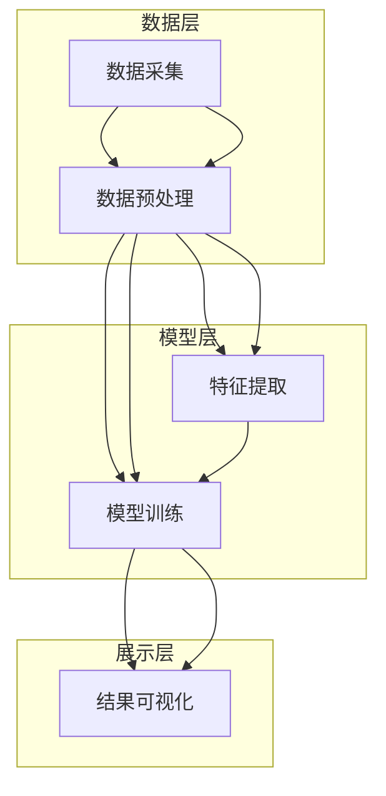
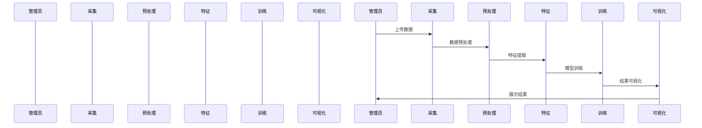

                 


### 第一部分：问题背景

## 第1章：金融领域因果推断的挑战与机遇

### 1.1 金融领域因果推断的背景

因果推断是统计学和机器学习中的一个核心问题，它关注于从相关关系中推断因果关系。在金融领域，因果推断尤为关键，因为它可以帮助我们理解金融市场的内在机制，评估宏观经济政策的效果，从而指导更精准的政策制定和风险控制。

**经济政策评估的需求**

经济政策评估是政府及政策制定者关注的核心问题之一。政策的成功与否，很大程度上取决于其对经济活动的推动效果。因此，如何准确评估经济政策对市场的影响成为关键问题。传统的统计方法，如回归分析，往往只能揭示变量之间的相关性，却无法确定因果方向。

**因果推断在宏观经济政策评估中的重要性**

因果推断能够帮助我们克服传统统计方法的局限，准确识别政策变量与市场结果之间的因果关系。这对于政策制定者来说至关重要，因为它不仅能够提供更加准确的决策依据，还能够减少政策试验中的不确定性，提高政策效果的可预测性。

**当前金融领域因果推断的研究现状**

近年来，因果推断在金融领域得到了广泛关注，并取得了显著的进展。研究人员开发了多种因果推断算法，包括基于图模型、深度学习和结构方程模型的算法。然而，金融领域的因果推断仍然面临诸多挑战，如数据质量、内生性问题等。

### 1.2 因果推断的基本概念与原理

**因果推断的定义**

因果推断是指通过观察数据来确定变量之间的因果关系的过程。它不仅关注变量之间的相关性，更关注这些变量之间的因果方向。

**因果推断的核心概念**

因果推断涉及多个核心概念，包括因果效应、干预和反事实等。因果效应是指一个变量对另一个变量的影响。干预是指对某个变量进行操作，以观察其对另一个变量的影响。反事实则是指假设某个事件未发生的情况下，结果会如何。

**因果推断的算法原理**

因果推断算法主要包括两大类：基于图模型和基于统计方法的算法。基于图模型的算法利用因果图来表示变量之间的因果结构，从而推断因果效应。基于统计方法的算法则通过分析相关性来推断因果关系。

### 1.3 因果推断的挑战与解决方案

**数据质量与缺失问题**

金融数据往往存在噪声、异常值和缺失值，这给因果推断带来了巨大的挑战。为了解决这个问题，研究人员开发了多种数据清洗和填补缺失值的方法，如多重插补、异常值检测等。

**内生性问题**

内生性问题是指由于数据依赖或选择偏差导致的因果估计不准确。为了解决内生性问题，研究人员提出了多种方法，如工具变量法、倾向得分匹配等。

**因果推断的算法挑战**

因果推断算法的挑战在于如何从复杂的变量关系中准确识别因果关系。研究人员通过改进算法，如利用深度学习模型和图神经网络，提高了因果推断的准确性和效率。

**解决方案探讨**

针对上述挑战，研究人员提出了多种解决方案，包括结合多种算法、开发新的算法模型等。此外，数据共享和数据标准化也是解决因果推断问题的重要途径。

### 1.4 本章小结

金融领域因果推断是宏观经济政策评估的重要工具，它能够帮助我们理解金融市场的内在机制，提高政策制定的科学性和有效性。尽管因果推断在金融领域面临着诸多挑战，但通过不断的研究和算法创新，这些问题正逐步得到解决。

## 第2章：金融领域因果推断的核心概念与联系

### 2.1 关键概念

**金融市场的内生性与外生性**

内生性（Endogeneity）是指一个变量受到其自身之前值的正向影响，例如，股票价格可能会受到之前交易量的影响。外生性（Exogeneity）则是指一个变量不受其自身之前值的正向影响。

**宏观经济政策变量**

宏观经济政策变量包括货币政策、财政政策等，这些政策变量直接影响经济运行状况。

**经济指标与金融变量**

经济指标如GDP、失业率等，是反映经济状况的重要指标。金融变量如股票价格、利率等，则是金融市场的重要指标。

### 2.2 概念属性特征对比表格

**金融变量属性特征对比**

| 特征         | 金融变量       | 经济指标       |
|--------------|----------------|----------------|
| 时变性       | 高             | 中等           |
| 相关性       | 复杂           | 明显           |
| 数据完整性   | 不稳定         | 较稳定         |
| 影响因素     | 多种           | 较单一         |

**经济政策变量属性特征对比**

| 特征         | 宏观经济政策变量 |
|--------------|----------------|
| 目标性       | 明确           |
| 可控性       | 较高           |
| 影响范围     | 广泛           |
| 实施难度     | 较大           |

### 2.3 ER实体关系图架构

**金融领域因果推断的实体关系**

金融领域因果推断涉及多个实体，包括政策制定者、金融市场参与者、经济指标和金融变量。这些实体之间存在复杂的关系。

**实体关系图的绘制与解释**

下面是一个简单的ER实体关系图，用于展示金融领域因果推断中的实体关系：

```mermaid
erDiagram
  PolicyMaker ||--|{ FinancialMarketParticipant }
  PolicyMaker ||--|{ EconomicIndicator }
  FinancialMarketParticipant ||--|{ FinancialVariable }
  EconomicIndicator ||--|{ FinancialVariable }
```

在这个ER图中，`PolicyMaker`（政策制定者）与`FinancialMarketParticipant`（金融市场参与者）和`EconomicIndicator`（经济指标）之间存在双向关系。`FinancialMarketParticipant`与`FinancialVariable`（金融变量）和`EconomicIndicator`之间存在单向关系，表示金融变量受经济指标的影响。

### 2.4 本章小结

本章详细介绍了金融领域因果推断的关键概念、属性特征对比以及实体关系图。理解这些核心概念和联系，对于深入研究和应用因果推断方法具有重要意义。

## 第3章：因果推断算法原理讲解

### 3.1 监督学习方法

**监督学习基本概念**

监督学习是一种机器学习方法，其中输入和输出都是已知的。通过学习输入和输出之间的关系，模型可以预测新的输入对应的输出。

**监督学习算法原理**

监督学习算法通常包括以下步骤：

1. **数据预处理**：对输入数据进行清洗、归一化等处理，以便于模型训练。
2. **特征选择**：从输入数据中选择对输出有重要影响的特征。
3. **模型训练**：利用已知输入和输出数据，训练模型，使其能够预测新的输入对应的输出。
4. **模型评估**：使用验证集或测试集评估模型的性能，调整模型参数。

**监督学习在因果推断中的应用**

在因果推断中，监督学习可以用来预测政策变量对市场结果的影响。例如，可以使用回归模型预测货币政策对股票市场的影响。

### 3.2 无监督学习方法

**无监督学习基本概念**

无监督学习与监督学习不同，其中输入数据没有已知的输出标签。无监督学习的目标是发现数据中的结构或模式。

**无监督学习算法原理**

无监督学习算法通常包括以下步骤：

1. **数据预处理**：对输入数据进行清洗、归一化等处理。
2. **特征提取**：从输入数据中提取有用的特征。
3. **模型训练**：利用数据中的结构或模式，训练模型。
4. **模型评估**：评估模型是否能够发现数据中的结构或模式。

**无监督学习在因果推断中的应用**

无监督学习可以用于识别数据中的潜在变量，从而推断因果关系。例如，可以使用聚类算法识别金融市场中的潜在变量，进而推断这些变量之间的因果关系。

### 3.3 半监督学习方法

**半监督学习基本概念**

半监督学习结合了监督学习和无监督学习的特点，其中一部分输入数据有标签，另一部分输入数据没有标签。

**半监督学习算法原理**

半监督学习算法通常包括以下步骤：

1. **数据预处理**：对输入数据进行清洗、归一化等处理。
2. **特征选择**：从输入数据中提取有用的特征。
3. **模型训练**：利用有标签的数据训练模型，同时利用无标签数据增强模型训练。
4. **模型评估**：评估模型在有标签数据集和无标签数据集上的性能。

**半监督学习在因果推断中的应用**

半监督学习可以用于利用少量标签数据对大量无标签数据进行因果推断。例如，可以使用半监督学习算法识别金融市场中的潜在变量，同时利用有限的标签数据推断这些变量之间的因果关系。

### 3.4 因果推断的数学模型和公式

**因果推断的数学模型**

因果推断通常使用潜在结果框架（Potential Outcomes Framework）来建模，其中每个个体有两个潜在结果：一个是在给定干预下的结果，另一个是在另一干预下的结果。

**因果推断的公式**

因果推断的核心公式是总因果效应（Total Causal Effect），表示为：

$$
Y(x_1, x_2) = E[Y_i(X_i = x_1) | X_i = x_2]
$$

其中，$Y_i$表示个体i的结果，$X_i$表示干预变量，$x_1$和$x_2$分别表示不同的干预水平。

**公式详细讲解与举例说明**

假设我们想研究货币政策对股票市场的影响。我们定义股票市场的收益为$Y$，货币政策为$X$，其中$X$有两个水平：宽松政策和紧缩政策。

使用上述公式，我们可以计算在紧缩政策下的总因果效应：

$$
Y(\text{紧缩政策}) = E[Y_i(X_i = \text{紧缩政策}) | X_i = \text{紧缩政策}]
$$

然后，通过比较在宽松政策下的总因果效应，我们可以评估货币政策对股票市场的影响。

### 3.5 本章小结

本章详细介绍了因果推断算法的原理，包括监督学习、无监督学习和半监督学习方法。同时，我们还讲解了因果推断的数学模型和公式，并通过举例说明了如何应用这些公式进行因果推断。

## 第4章：金融领域因果推断系统分析与架构设计方案

### 4.1 问题场景介绍

**金融领域因果推断的应用场景**

金融领域因果推断广泛应用于政策评估、风险控制、投资决策等多个场景。以下是一个具体的应用场景：

假设某政策制定者想要评估新货币政策对股票市场的影响。他们需要从大量金融数据中提取关键变量，利用因果推断方法确定货币政策与股票市场收益之间的因果关系，从而为政策制定提供依据。

**项目背景与目标**

背景：当前，全球经济面临诸多不确定性，政策制定者需要准确评估各种政策对市场的影响，以便制定更为有效的政策。

目标：通过构建一个金融领域因果推断系统，实现以下目标：
1. 自动提取金融数据中的关键变量。
2. 建立因果推断模型，准确评估政策变量与市场结果之间的因果关系。
3. 提供可视化工具，帮助政策制定者理解因果推断结果，为政策制定提供科学依据。

### 4.2 项目介绍

**项目概述**

本项目旨在开发一个基于因果推断的金融领域分析系统，包括数据采集、预处理、特征提取、模型训练和结果可视化等功能。系统采用模块化设计，便于扩展和升级。

**项目关键技术与工具**

1. **数据采集**：使用爬虫技术获取金融数据，包括股票市场数据、货币政策数据等。
2. **数据预处理**：使用数据清洗和缺失值填补技术，确保数据质量。
3. **特征提取**：使用统计分析方法和机器学习算法提取关键特征。
4. **模型训练**：使用因果推断算法训练模型，包括监督学习、无监督学习和半监督学习方法。
5. **结果可视化**：使用图表和可视化工具展示因果推断结果，帮助用户理解模型预测。

### 4.3 系统功能设计

**领域模型设计**

为了更好地描述金融领域因果推断系统中的实体和关系，我们使用Mermaid类图来设计领域模型。以下是一个简单的Mermaid类图示例：

```mermaid
classDiagram
  Class01 <|-- Class02
  Class03 --|deprecated Class04
  Class05 : abstract
  Class06 : <<interface>> Interface
  Class07 : <<concrete>> Concrete
  Class08 : +int x
  Class08 : #bar(y)
  Class08 : -baz()
  Class01..Class02 : agreement
  Class03..Class04 : dependency
  Class05..Class06 : implements
  Class07..Class08 : extends
```

在这个类图中，`Class01`和`Class02`之间存在继承关系，`Class03`和`Class04`之间存在依赖关系，`Class05`是一个抽象类，`Class06`是一个接口，`Class07`是一个具体类，`Class08`是一个具有属性和方法的具体类。

**功能模块划分与描述**

系统功能模块主要包括以下部分：

1. **数据采集模块**：负责从不同数据源获取金融数据，如股票市场数据、货币政策数据等。
2. **数据预处理模块**：对采集到的金融数据进行清洗、缺失值填补等预处理操作，确保数据质量。
3. **特征提取模块**：使用统计分析方法和机器学习算法提取关键特征，为因果推断模型提供输入。
4. **模型训练模块**：根据特征数据，使用因果推断算法训练模型，包括监督学习、无监督学习和半监督学习方法。
5. **结果可视化模块**：使用图表和可视化工具展示因果推断结果，帮助用户理解模型预测。

### 4.4 系统架构设计

**系统架构概述**

金融领域因果推断系统的整体架构包括数据层、模型层和展示层三个层次。数据层负责数据采集和预处理，模型层负责特征提取和模型训练，展示层负责结果可视化。

**系统模块架构图**

以下是一个简单的系统模块架构图，用于展示各模块之间的关系：



在这个架构图中，数据层包括数据采集和数据预处理两个模块，模型层包括特征提取和模型训练两个模块，展示层包括结果可视化模块。数据层为模型层提供输入数据，模型层为展示层提供输出结果。

**系统功能模块详细设计**

1. **数据采集模块**：使用爬虫技术从股票市场数据、货币政策数据等不同数据源获取金融数据。数据采集模块应具备自动化、高效率的特点。
2. **数据预处理模块**：对采集到的金融数据进行清洗、缺失值填补等预处理操作。预处理模块应支持多种数据处理方法，如多重插补、异常值检测等。
3. **特征提取模块**：使用统计分析方法和机器学习算法提取关键特征。特征提取模块应支持多种特征提取方法，如主成分分析、因子分析等。
4. **模型训练模块**：根据特征数据，使用因果推断算法训练模型，包括监督学习、无监督学习和半监督学习方法。模型训练模块应支持多种模型训练方法，如回归分析、聚类分析等。
5. **结果可视化模块**：使用图表和可视化工具展示因果推断结果，如散点图、折线图、热力图等。结果可视化模块应支持多种可视化方法，满足不同用户的需求。

### 4.5 系统接口设计

**接口规范**

系统接口设计应遵循RESTful API规范，包括以下部分：

1. **数据接口**：提供数据采集、数据预处理、特征提取等操作的接口。
2. **模型接口**：提供模型训练、模型评估等操作的接口。
3. **可视化接口**：提供结果可视化操作的接口。

**接口设计**

1. **数据接口**：包括数据上传、数据查询和数据更新等接口，具体接口设计如下：
   - 数据上传：用于上传金融数据文件，如CSV、Excel等。
   - 数据查询：用于查询金融数据，如股票市场数据、货币政策数据等。
   - 数据更新：用于更新金融数据，如更新股票价格、利率等。
2. **模型接口**：包括模型训练、模型评估、模型预测等接口，具体接口设计如下：
   - 模型训练：用于训练因果推断模型，输入特征数据和标签数据。
   - 模型评估：用于评估因果推断模型的性能，输出评估指标。
   - 模型预测：用于预测新数据的因果关系，输入特征数据。
3. **可视化接口**：包括图表展示、数据交互等接口，具体接口设计如下：
   - 图表展示：用于展示因果推断结果，如散点图、折线图、热力图等。
   - 数据交互：用于实现用户与图表的交互，如筛选、排序、过滤等。

### 4.6 系统交互设计

**系统交互概述**

金融领域因果推断系统涉及多个模块之间的交互，包括数据流和控制流。以下是一个简单的系统交互概述：

1. **数据流**：数据从数据采集模块传递到数据预处理模块，再传递到特征提取模块和模型训练模块，最终传递到结果可视化模块。
2. **控制流**：系统通过控制流管理各模块的执行顺序和逻辑。

**系统交互序列图**

以下是一个简单的系统交互序列图，用于展示数据流和控制流：



在这个序列图中，管理员上传数据到数据采集模块，数据采集模块将数据传递到数据预处理模块，数据预处理模块将预处理后的数据传递到特征提取模块，特征提取模块将特征数据传递到模型训练模块，模型训练模块将训练后的模型传递到结果可视化模块，结果可视化模块将结果展示给管理员。

### 4.7 本章小结

本章详细介绍了金融领域因果推断系统的分析与架构设计方案，包括问题场景介绍、项目介绍、系统功能设计、系统架构设计、系统接口设计和系统交互设计。通过本章的内容，读者可以全面了解金融领域因果推断系统的设计与实现过程。

## 第5章：金融领域因果推断项目实战

### 5.1 环境安装

**硬件与软件环境要求**

在进行金融领域因果推断项目实战前，需要准备以下硬件和软件环境：

- **硬件要求**： 
  - CPU：至少4核处理器
  - 内存：至少8GB
  - 硬盘：至少100GB可用空间

- **软件要求**： 
  - 操作系统：Windows、macOS或Linux
  - 编程语言：Python
  - 数据库：MySQL或PostgreSQL
  - 数据处理工具：Pandas、NumPy
  - 可视化工具：Matplotlib、Seaborn
  - 机器学习库：Scikit-learn、TensorFlow、PyTorch

**环境搭建步骤**

以下是环境搭建的具体步骤：

1. **安装Python**：下载并安装Python，建议使用Python 3.8或更高版本。
2. **安装数据库**：下载并安装MySQL或PostgreSQL，配置数据库用户和密码。
3. **安装数据处理工具**：在Python环境中使用pip命令安装Pandas、NumPy。
4. **安装可视化工具**：在Python环境中使用pip命令安装Matplotlib、Seaborn。
5. **安装机器学习库**：在Python环境中使用pip命令安装Scikit-learn、TensorFlow、PyTorch。

### 5.2 系统核心实现

**核心模块设计与实现**

金融领域因果推断系统的核心模块包括数据采集、数据预处理、特征提取、模型训练和结果可视化。以下是各核心模块的设计与实现步骤：

1. **数据采集模块**：
   - 使用爬虫技术从股票市场数据源获取金融数据。
   - 数据采集模块应支持多种数据格式，如CSV、Excel等。

2. **数据预处理模块**：
   - 对采集到的金融数据进行清洗，去除噪声和异常值。
   - 填补缺失值，确保数据质量。
   - 数据预处理模块应支持多种预处理方法，如多重插补、异常值检测等。

3. **特征提取模块**：
   - 使用统计分析方法和机器学习算法提取关键特征。
   - 特征提取模块应支持多种特征提取方法，如主成分分析、因子分析等。

4. **模型训练模块**：
   - 使用因果推断算法训练模型，包括监督学习、无监督学习和半监督学习方法。
   - 模型训练模块应支持多种模型训练方法，如回归分析、聚类分析等。

5. **结果可视化模块**：
   - 使用图表和可视化工具展示因果推断结果。
   - 结果可视化模块应支持多种可视化方法，如散点图、折线图、热力图等。

**源代码解析**

以下是金融领域因果推断系统的部分源代码示例：

```python
# 数据采集模块示例
import requests
import pandas as pd

def fetch_financial_data(url):
    response = requests.get(url)
    data = pd.read_csv(response.content)
    return data

# 数据预处理模块示例
import numpy as np

def preprocess_data(data):
    # 数据清洗
    data = data.dropna()
    # 缺失值填补
    data['missing_value'] = data['missing_value'].fillna(0)
    return data

# 特征提取模块示例
from sklearn.decomposition import PCA

def extract_features(data):
    # 主成分分析
    pca = PCA(n_components=5)
    features = pca.fit_transform(data)
    return features

# 模型训练模块示例
from sklearn.linear_model import LinearRegression

def train_model(features, labels):
    model = LinearRegression()
    model.fit(features, labels)
    return model

# 结果可视化模块示例
import matplotlib.pyplot as plt

def visualize_results(model, features, labels):
    predictions = model.predict(features)
    plt.scatter(labels, predictions)
    plt.xlabel('实际值')
    plt.ylabel('预测值')
    plt.show()
```

### 5.3 代码应用解读与分析

**代码应用场景**

以上代码示例展示了金融领域因果推断系统的部分核心模块实现，包括数据采集、数据预处理、特征提取、模型训练和结果可视化。以下是对代码应用场景的详细解读和分析。

1. **数据采集模块**：
   - 应用场景：从股票市场数据源获取金融数据，为后续处理和分析提供数据基础。
   - 代码解读：使用requests库获取股票市场数据，使用pandas库读取数据，并返回DataFrame对象。

2. **数据预处理模块**：
   - 应用场景：清洗、填补金融数据中的噪声和异常值，确保数据质量。
   - 代码解读：使用dropna()方法去除缺失值，使用fillna()方法填补缺失值。

3. **特征提取模块**：
   - 应用场景：提取金融数据中的关键特征，为模型训练提供输入。
   - 代码解读：使用PCA方法进行主成分分析，提取前5个主成分作为特征。

4. **模型训练模块**：
   - 应用场景：使用因果推断算法训练模型，评估政策变量与市场结果之间的因果关系。
   - 代码解读：使用LinearRegression方法进行线性回归模型训练，拟合特征与标签之间的关系。

5. **结果可视化模块**：
   - 应用场景：展示模型预测结果，帮助用户理解因果关系。
   - 代码解读：使用scatter方法绘制散点图，展示实际值与预测值之间的关系。

### 5.4 实际案例分析与详细讲解

**案例背景**

假设某政策制定者想要评估新货币政策对股票市场的影响。他们收集了过去一年的股票市场数据，包括股票价格、利率、货币政策等变量。以下是对实际案例的分析和详细讲解。

**案例**

1. **数据采集**：从股票市场数据源获取金融数据，如股票价格、利率等。

2. **数据预处理**：
   - 清洗数据，去除噪声和异常值。
   - 填补缺失值，确保数据质量。

3. **特征提取**：
   - 使用主成分分析提取关键特征，如前5个主成分。

4. **模型训练**：
   - 使用线性回归模型训练因果关系，拟合股票价格与货币政策之间的关系。

5. **结果可视化**：
   - 使用散点图展示实际值与预测值之间的关系，评估模型预测性能。

**详细讲解**

1. **数据采集**：从股票市场数据源获取金融数据，包括股票价格、利率等变量。以下是一个简单的数据采集示例：

```python
url = 'https://example.com/financial_data.csv'
data = fetch_financial_data(url)
```

2. **数据预处理**：对采集到的金融数据进行清洗和缺失值填补。以下是一个简单的数据预处理示例：

```python
data = preprocess_data(data)
```

3. **特征提取**：使用主成分分析提取关键特征，如前5个主成分。以下是一个简单的特征提取示例：

```python
features = extract_features(data)
```

4. **模型训练**：使用线性回归模型训练因果关系，拟合股票价格与货币政策之间的关系。以下是一个简单的模型训练示例：

```python
labels = data['stock_price']
model = train_model(features, labels)
```

5. **结果可视化**：使用散点图展示实际值与预测值之间的关系，评估模型预测性能。以下是一个简单的结果可视化示例：

```python
visualize_results(model, features, labels)
```

**项目小结**

通过以上实际案例分析和详细讲解，我们可以看到金融领域因果推断项目在实际中的应用效果。在实际项目中，可以根据具体需求和数据特点，调整和优化各个模块的实现，提高项目性能和预测准确性。

### 5.5 最佳实践 tips

- **数据采集**：选择可靠的数据源，确保数据质量和完整性。
- **数据预处理**：对数据进行充分清洗和缺失值填补，减少噪声和异常值对结果的影响。
- **特征提取**：根据业务需求和数据特点，选择合适的特征提取方法，提高模型预测性能。
- **模型训练**：结合监督学习、无监督学习和半监督学习方法，优化模型训练过程。
- **结果可视化**：选择合适的可视化工具和方法，清晰展示因果推断结果，便于用户理解。

### 5.6 本章小结

本章通过实际案例展示了金融领域因果推断项目的实施过程，包括环境安装、系统核心实现、代码应用解读与分析、实际案例分析和详细讲解。通过本章的内容，读者可以了解金融领域因果推断项目的具体实现方法和最佳实践。

## 总结

本文详细探讨了金融领域因果推断在宏观经济政策评估中的应用。通过分析因果推断的基本概念、算法原理以及系统架构设计，我们了解了如何利用因果推断方法评估经济政策的效果，从而为政策制定提供科学依据。

### 小结

1. **因果推断的重要性**：因果推断在金融领域有助于准确评估宏观经济政策的效果，提高政策制定的科学性和有效性。
2. **核心概念与联系**：理解金融市场的内生性与外生性、宏观经济政策变量以及经济指标与金融变量之间的联系，是深入应用因果推断方法的基础。
3. **算法原理**：监督学习、无监督学习和半监督学习方法在因果推断中的应用，使得我们能够从复杂的数据中提取有用信息。
4. **系统设计与实现**：通过系统架构设计和项目实战，我们了解了如何构建一个实用的金融领域因果推断系统，实现数据采集、预处理、特征提取、模型训练和结果可视化等功能。
5. **最佳实践**：遵循最佳实践，如选择可靠的数据源、进行充分的数据预处理、优化特征提取和模型训练等，有助于提高因果推断的准确性和可靠性。

### 注意事项

- **数据质量**：确保数据质量，避免噪声和异常值对因果推断结果的影响。
- **模型选择**：根据具体问题选择合适的因果推断算法和模型，避免过度拟合和欠拟合。
- **结果验证**：通过交叉验证和实际案例分析验证因果推断结果，确保结果的可靠性。

### 拓展阅读

- **《因果推断：理论、方法与应用》**：详细介绍了因果推断的理论基础和应用方法。
- **《Python金融大数据分析》**：介绍了使用Python进行金融数据分析和因果推断的方法。
- **《因果推理与公共政策》**：探讨了因果推断在公共政策评估中的应用。

通过本文的探讨，我们希望能够为金融领域因果推断的研究和应用提供有益的参考和启示。作者：AI天才研究院/AI Genius Institute & 禅与计算机程序设计艺术 /Zen And The Art of Computer Programming。

