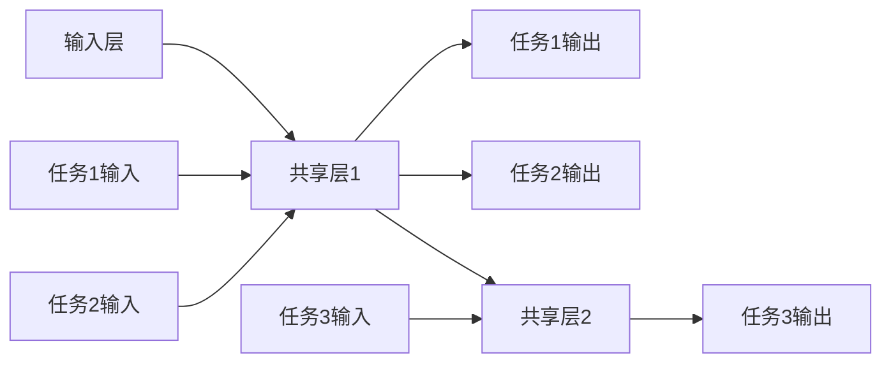

                 

### 金融领域多任务学习在客户生命周期价值预测中的应用

#### **关键词：金融、多任务学习、客户生命周期价值、预测、优化算法**

#### **摘要：本文深入探讨了金融领域多任务学习在客户生命周期价值预测中的应用。通过分析金融行业的现状和挑战，我们阐述了多任务学习的基本概念和优势。随后，我们详细介绍了多任务学习在客户生命周期价值预测中的应用背景和具体实现步骤，包括数据收集与预处理、模型构建与训练、模型评估与优化等环节。最后，本文总结了多任务学习在金融领域的应用前景和挑战，并对未来的研究方向进行了展望。**

## 第一部分：引言

### **第1章：问题背景与核心概念**

#### **1.1 问题背景**

##### **1.1.1 金融领域的重要性**

##### **1.1.1.1 金融行业的现状**

金融行业作为现代经济的核心，对国家和社会的发展具有重要意义。近年来，随着金融科技的迅速发展，金融行业正面临着前所未有的机遇和挑战。大数据、人工智能、区块链等新兴技术正在深刻改变金融行业的运营模式、业务流程和用户体验。然而，金融行业也面临着诸多挑战，如风险控制、合规性、数据隐私等。

##### **1.1.1.2 金融领域的重要性**

金融领域的重要性主要体现在以下几个方面：

1. **资源配置**：金融行业通过资金筹集、分配和再分配，优化了社会资源的配置，促进了经济的高效运行。

2. **风险管理**：金融行业提供了各种金融工具和产品，帮助企业和个人管理风险，保障经济稳定发展。

3. **经济发展**：金融行业为实体经济的发展提供了资金支持和金融服务，促进了经济的增长和创新。

##### **1.1.2 客户生命周期价值的概念**

##### **1.1.2.1 客户生命周期价值的定义**

客户生命周期价值（Customer Lifetime Value, CLV）是指一个客户在与其企业的整个关系周期内为企业带来的总收益。它是一个重要的商业指标，用于评估客户的价值和重要性。

##### **1.1.2.2 客户生命周期价值的重要性**

客户生命周期价值的重要性主要体现在以下几个方面：

1. **资源分配**：通过计算客户生命周期价值，企业可以更好地了解哪些客户值得投入资源，从而优化营销策略和资源配置。

2. **客户管理**：了解客户生命周期价值有助于企业制定有针对性的客户关系管理策略，提高客户满意度和忠诚度。

3. **商业决策**：客户生命周期价值是制定商业决策的重要依据，如产品定价、推广策略、营销预算等。

##### **1.1.3 多任务学习的基本概念**

##### **1.1.3.1 多任务学习的定义**

多任务学习（Multi-Task Learning, MTL）是一种机器学习技术，旨在同时解决多个相关任务，以提高模型的泛化能力和预测准确性。

##### **1.1.3.2 多任务学习的优势**

多任务学习的优势主要体现在以下几个方面：

1. **资源共享**：多任务学习可以共享模型参数和特征表示，减少模型训练时间和计算成本。

2. **迁移学习**：多任务学习通过解决多个相关任务，可以实现任务之间的迁移学习，提高模型的泛化能力。

3. **协同效应**：多任务学习可以通过任务之间的协同作用，提高模型的预测准确性。

##### **1.1.4 金融领域多任务学习在客户生命周期价值预测中的应用**

##### **1.1.4.1 多任务学习在客户生命周期价值预测中的应用背景**

在金融领域，客户生命周期价值预测是一个具有挑战性的任务。传统的单一任务学习方法往往难以同时考虑多个相关任务，导致预测准确性不高。多任务学习技术为解决这一问题提供了新的思路。

##### **1.1.4.2 多任务学习在客户生命周期价值预测中的潜在优势**

多任务学习在客户生命周期价值预测中的应用具有以下潜在优势：

1. **提高预测准确性**：通过同时解决多个相关任务，多任务学习可以提高客户生命周期价值预测的准确性。

2. **降低过拟合风险**：多任务学习可以通过任务之间的协同作用，降低模型的过拟合风险。

3. **优化计算资源**：多任务学习可以共享模型参数和特征表示，降低计算资源的消耗。

##### **1.1.4.3 多任务学习在客户生命周期价值预测中的具体应用**

多任务学习在客户生命周期价值预测中的具体应用包括以下几个步骤：

1. **数据收集与预处理**：收集客户的历史数据，包括交易记录、行为数据等，并进行预处理，如数据清洗、特征提取等。

2. **模型构建与训练**：构建多任务学习模型，同时解决多个相关任务，如客户流失预测、客户价值评估等，并使用历史数据对模型进行训练。

3. **模型评估与优化**：使用验证集对训练好的模型进行评估，并根据评估结果对模型进行调整和优化。

##### **1.1.5 本书结构安排**

本书将分为以下几个部分：

1. **第一部分：引言**：介绍金融领域多任务学习在客户生命周期价值预测中的应用背景、核心概念和基本原理。

2. **第二部分：多任务学习基础理论**：详细介绍多任务学习的基本理论、优化算法和挑战与解决方案。

3. **第三部分：金融领域多任务学习应用实践**：通过具体案例，展示多任务学习在金融领域客户生命周期价值预测中的应用方法。

4. **第四部分：总结与展望**：总结多任务学习在客户生命周期价值预测中的应用成果，并对未来的研究方向进行展望。

##### **1.1.6 阅读建议**

为了更好地理解多任务学习在客户生命周期价值预测中的应用，读者需要具备以下基础：

1. **机器学习基础知识**：了解机器学习的基本概念、算法和优化方法。

2. **金融行业背景知识**：了解金融行业的业务流程、风险管理和客户关系管理等。

3. **Python编程技能**：掌握Python编程语言，能够使用常见的机器学习库，如scikit-learn、TensorFlow等。

通过阅读本书，读者可以：

1. **了解多任务学习的基本原理和应用场景**。

2. **掌握多任务学习在金融领域客户生命周期价值预测中的具体应用方法**。

3. **提升自己在金融领域的数据分析和建模能力**。

#### **1.2 多任务学习的基本概念**

##### **1.2.1 多任务学习的定义**

多任务学习是一种机器学习技术，旨在同时解决多个相关任务，以提高模型的泛化能力和预测准确性。在多任务学习中，模型需要学习多个任务的特征表示和决策规则，并通过任务之间的协同作用，提高整体性能。

##### **1.2.1.1 多任务学习的概念**

多任务学习涉及以下核心概念：

1. **任务**：任务是指模型需要解决的问题，如分类、回归、聚类等。

2. **共享参数**：多任务学习中的共享参数是指多个任务之间共享的模型参数，通过共享参数，可以减少模型参数的数量，提高训练效率。

3. **协同训练**：协同训练是指多个任务在训练过程中相互协作，通过任务之间的信息传递，提高模型的整体性能。

##### **1.2.1.2 多任务学习的分类**

多任务学习可以根据任务之间的关联性进行分类，常见的分类方法包括：

1. **独立任务**：独立任务是指多个任务之间没有直接关联，每个任务独立进行训练。

2. **相关任务**：相关任务是指多个任务之间存在关联性，通过任务之间的协同作用，可以提高模型的性能。

3. **分层任务**：分层任务是指多个任务按照层次结构进行组织，低层任务为高层任务提供基础特征。

##### **1.2.2 多任务学习的优势**

多任务学习具有以下优势：

1. **提高预测准确性**：通过同时解决多个相关任务，多任务学习可以提高模型的预测准确性。

2. **降低过拟合风险**：多任务学习可以通过任务之间的协同作用，降低模型的过拟合风险。

3. **优化计算资源**：多任务学习可以共享模型参数和特征表示，降低计算资源的消耗。

4. **迁移学习**：多任务学习可以通过任务之间的迁移学习，提高模型的泛化能力。

##### **1.2.3 多任务学习与传统机器学习的关系**

多任务学习是传统机器学习的一种扩展，它与单一任务学习相比，具有以下区别：

1. **任务数量**：单一任务学习解决一个任务，而多任务学习同时解决多个任务。

2. **模型结构**：单一任务学习使用单一的模型结构，而多任务学习使用多个共享的模型结构。

3. **优化目标**：单一任务学习的优化目标是单个任务的预测准确性，而多任务学习的优化目标是多个任务的整体性能。

##### **1.2.4 多任务学习在金融领域客户生命周期价值预测中的应用背景**

在金融领域，客户生命周期价值预测是一个复杂且具有挑战性的任务。传统的单一任务学习方法难以同时考虑多个相关任务，导致预测准确性不高。多任务学习技术为解决这一问题提供了新的思路。

在金融领域，客户生命周期价值预测涉及多个相关任务，如客户流失预测、客户价值评估、交叉销售预测等。通过多任务学习，可以同时解决这些任务，提高预测准确性，并降低过拟合风险。

##### **1.2.5 多任务学习在金融领域客户生命周期价值预测中的潜在优势**

多任务学习在金融领域客户生命周期价值预测中具有以下潜在优势：

1. **提高预测准确性**：通过同时解决多个相关任务，多任务学习可以提高客户生命周期价值预测的准确性。

2. **降低过拟合风险**：多任务学习可以通过任务之间的协同作用，降低模型的过拟合风险。

3. **优化计算资源**：多任务学习可以共享模型参数和特征表示，降低计算资源的消耗。

4. **迁移学习**：多任务学习可以通过任务之间的迁移学习，提高模型的泛化能力。

##### **1.2.6 多任务学习在金融领域客户生命周期价值预测中的具体应用**

多任务学习在金融领域客户生命周期价值预测中的具体应用包括以下几个步骤：

1. **数据收集与预处理**：收集客户的历史数据，包括交易记录、行为数据等，并进行预处理，如数据清洗、特征提取等。

2. **模型构建与训练**：构建多任务学习模型，同时解决多个相关任务，如客户流失预测、客户价值评估等，并使用历史数据对模型进行训练。

3. **模型评估与优化**：使用验证集对训练好的模型进行评估，并根据评估结果对模型进行调整和优化。

##### **1.2.7 本书结构安排**

本书将分为以下几个部分：

1. **第一部分：引言**：介绍金融领域多任务学习在客户生命周期价值预测中的应用背景、核心概念和基本原理。

2. **第二部分：多任务学习基础理论**：详细介绍多任务学习的基本理论、优化算法和挑战与解决方案。

3. **第三部分：金融领域多任务学习应用实践**：通过具体案例，展示多任务学习在金融领域客户生命周期价值预测中的应用方法。

4. **第四部分：总结与展望**：总结多任务学习在客户生命周期价值预测中的应用成果，并对未来的研究方向进行展望。

##### **1.2.8 阅读建议**

为了更好地理解多任务学习在客户生命周期价值预测中的应用，读者需要具备以下基础：

1. **机器学习基础知识**：了解机器学习的基本概念、算法和优化方法。

2. **金融行业背景知识**：了解金融行业的业务流程、风险管理和客户关系管理等。

3. **Python编程技能**：掌握Python编程语言，能够使用常见的机器学习库，如scikit-learn、TensorFlow等。

通过阅读本书，读者可以：

1. **了解多任务学习的基本原理和应用场景**。

2. **掌握多任务学习在金融领域客户生命周期价值预测中的具体应用方法**。

3. **提升自己在金融领域的数据分析和建模能力**。

#### **1.3 多任务学习在客户生命周期价值预测中的应用**

##### **1.3.1 多任务学习在客户生命周期价值预测中的应用背景**

在金融领域，客户生命周期价值预测是一个关键的业务需求，它可以帮助银行和金融机构更好地了解客户的价值，优化客户关系管理策略，提高客户满意度和忠诚度。然而，客户生命周期价值预测面临着诸多挑战：

1. **数据复杂性**：金融领域的数据来源广泛，包括交易记录、客户行为数据、市场数据等，这些数据具有高维度、高噪声的特点，给数据预处理和模型训练带来困难。

2. **任务多样性**：客户生命周期价值预测涉及多个相关任务，如客户流失预测、客户价值评估、交叉销售预测等，这些任务之间存在一定的关联性，单一任务模型难以同时满足多个任务的需求。

3. **预测准确性**：传统的单一任务学习方法往往难以同时考虑多个相关任务，导致预测准确性不高，影响业务决策的效果。

针对上述挑战，多任务学习（Multi-Task Learning, MTL）技术为解决这些问题提供了新的思路。多任务学习通过同时学习多个相关任务，可以充分利用数据中的潜在关联性，提高预测准确性，优化客户生命周期价值预测的效果。

##### **1.3.2 多任务学习在客户生命周期价值预测中的潜在优势**

多任务学习在客户生命周期价值预测中具有以下潜在优势：

1. **提高预测准确性**：通过同时学习多个相关任务，多任务学习可以捕捉到数据中的潜在关联性，提高预测准确性。例如，客户流失预测和客户价值评估任务之间存在一定的关联性，通过多任务学习，可以同时优化这两个任务的预测效果。

2. **降低过拟合风险**：多任务学习可以通过任务之间的协同作用，降低模型的过拟合风险。在单一任务学习中，模型往往会过度拟合训练数据，导致在验证集和测试集上的表现不佳。而多任务学习通过任务之间的协同训练，可以降低模型的复杂度，提高模型的泛化能力。

3. **优化计算资源**：多任务学习可以共享模型参数和特征表示，降低计算资源的消耗。在单一任务学习中，需要为每个任务单独训练模型，而多任务学习通过共享模型参数，可以减少模型的参数数量，提高训练和推理的效率。

4. **迁移学习**：多任务学习可以通过任务之间的迁移学习，提高模型的泛化能力。在金融领域，不同客户群体的特征可能存在差异，通过多任务学习，可以将一个客户群体的知识迁移到另一个客户群体，提高模型的适应性。

##### **1.3.3 多任务学习在客户生命周期价值预测中的具体应用**

多任务学习在客户生命周期价值预测中的具体应用可以分为以下几个步骤：

1. **数据收集与预处理**：

   - **数据收集**：收集客户的历史数据，包括交易记录、客户行为数据、市场数据等。这些数据可以从银行系统、客户关系管理系统（CRM）等数据源获取。

   - **数据预处理**：对收集到的数据进行清洗、去噪、缺失值处理等预处理操作，确保数据的质量和一致性。同时，根据不同的任务需求，提取有用的特征，如交易频次、交易金额、客户行为等。

2. **模型构建与训练**：

   - **模型选择**：选择适合多任务学习的方法和模型，如多层感知机（MLP）、卷积神经网络（CNN）、循环神经网络（RNN）等。根据任务的特点和数据维度，选择合适的模型结构。

   - **参数初始化**：为多任务学习模型初始化参数，可以使用随机初始化、预训练模型初始化等方法。

   - **协同训练**：在训练过程中，多个任务之间进行协同训练，共享模型参数和特征表示。通过任务之间的信息传递和协同作用，优化模型的性能。

3. **模型评估与优化**：

   - **模型评估**：使用验证集对训练好的模型进行评估，评估指标包括准确率、召回率、F1分数等。根据评估结果，调整模型参数和结构，优化模型的性能。

   - **模型优化**：通过调整学习率、优化算法等超参数，优化模型的训练过程。可以使用交叉验证、网格搜索等方法，找到最佳的模型参数。

4. **模型部署与监控**：

   - **模型部署**：将训练好的模型部署到生产环境中，用于实时预测客户生命周期价值。

   - **模型监控**：监控模型的性能和稳定性，及时发现和解决潜在问题，如数据异常、模型过拟合等。

##### **1.3.4 多任务学习在客户生命周期价值预测中的挑战与解决方案**

多任务学习在客户生命周期价值预测中虽然具有很多优势，但也面临着一些挑战：

1. **数据不平衡问题**：金融领域的数据往往存在数据不平衡问题，即不同类别的样本数量不均衡。这可能导致模型偏向于预测样本数量较多的类别，影响预测准确性。解决方法包括数据增强、重采样等。

2. **任务冗余问题**：在多任务学习中，任务之间存在一定的关联性，但有些任务可能存在冗余。冗余的任务会增加模型的复杂度和训练时间，降低模型的性能。解决方法包括任务选择、任务权重调整等。

3. **模型选择问题**：选择合适的模型结构和方法对于多任务学习至关重要。不同的任务可能需要不同的模型结构和方法，如何选择合适的模型结构和方法是一个挑战。解决方法包括模型组合、模型融合等。

针对这些挑战，可以采取以下解决方案：

1. **数据预处理**：对数据进行预处理，如数据清洗、特征提取等，提高数据的质量和一致性。

2. **任务选择与权重调整**：根据任务的重要性和关联性，选择合适的任务，并调整任务的权重，优化模型的性能。

3. **模型融合**：将多个模型进行融合，如集成学习、模型组合等，提高模型的性能和泛化能力。

##### **1.3.5 多任务学习在客户生命周期价值预测中的应用前景**

随着金融科技的发展，多任务学习在客户生命周期价值预测中的应用前景非常广阔：

1. **个性化推荐**：多任务学习可以根据客户的行为数据和交易记录，预测客户的需求和偏好，为银行和金融机构提供个性化的推荐服务。

2. **风险管理**：多任务学习可以同时预测多个相关任务，如客户流失、欺诈检测等，帮助银行和金融机构进行有效的风险管理。

3. **客户关系管理**：多任务学习可以优化客户生命周期价值预测，帮助银行和金融机构制定有效的客户关系管理策略，提高客户满意度和忠诚度。

4. **智能投顾**：多任务学习可以根据客户的风险承受能力、投资偏好等，提供智能化的投资建议，帮助客户实现资产的保值增值。

总之，多任务学习在客户生命周期价值预测中的应用具有很大的潜力和前景，随着技术的不断进步，将为金融行业带来更多的创新和变革。

##### **1.3.6 本书结构安排**

本书将分为以下几个部分：

1. **第一部分：引言**：介绍多任务学习在客户生命周期价值预测中的应用背景、核心概念和基本原理。

2. **第二部分：多任务学习基础理论**：详细介绍多任务学习的基本理论、优化算法和挑战与解决方案。

3. **第三部分：金融领域多任务学习应用实践**：通过具体案例，展示多任务学习在金融领域客户生命周期价值预测中的应用方法。

4. **第四部分：总结与展望**：总结多任务学习在客户生命周期价值预测中的应用成果，并对未来的研究方向进行展望。

##### **1.3.7 阅读建议**

为了更好地理解多任务学习在客户生命周期价值预测中的应用，读者需要具备以下基础：

1. **机器学习基础知识**：了解机器学习的基本概念、算法和优化方法。

2. **金融行业背景知识**：了解金融行业的业务流程、风险管理和客户关系管理等。

3. **Python编程技能**：掌握Python编程语言，能够使用常见的机器学习库，如scikit-learn、TensorFlow等。

通过阅读本书，读者可以：

1. **了解多任务学习的基本原理和应用场景**。

2. **掌握多任务学习在金融领域客户生命周期价值预测中的具体应用方法**。

3. **提升自己在金融领域的数据分析和建模能力**。

### **1.4 本书结构安排**

**1.4.1 各章节内容概述**

本书分为四个部分，每个部分涵盖以下内容：

1. **第一部分：引言**：介绍多任务学习在客户生命周期价值预测中的应用背景、核心概念和基本原理。

2. **第二部分：多任务学习基础理论**：详细介绍多任务学习的基本理论、优化算法和挑战与解决方案。

3. **第三部分：金融领域多任务学习应用实践**：通过具体案例，展示多任务学习在金融领域客户生命周期价值预测中的应用方法。

4. **第四部分：总结与展望**：总结多任务学习在客户生命周期价值预测中的应用成果，并对未来的研究方向进行展望。

**1.4.2 阅读建议**

为了更好地理解本书的内容，读者可以按照以下建议进行阅读：

1. **系统学习**：本书涉及多个领域的知识，包括机器学习、金融学等。建议读者在阅读过程中，系统地学习相关基础知识。

2. **实践操作**：本书通过具体案例展示了多任务学习在金融领域客户生命周期价值预测中的应用方法。读者可以通过实践操作，加深对理论知识的理解。

3. **持续更新**：随着技术的不断发展，多任务学习在客户生命周期价值预测中的应用也会不断更新。建议读者关注最新的研究动态，持续更新自己的知识体系。

4. **深入探讨**：本书仅介绍了多任务学习在客户生命周期价值预测中的应用，读者可以根据自己的兴趣和需求，进一步深入探讨相关领域的研究。

5. **分享交流**：读者可以通过学术会议、研讨会等形式，与其他学者和业内人士进行交流，分享自己的研究成果和经验。

通过以上建议，读者可以更好地掌握本书的内容，提高自己在金融领域数据分析和建模的能力。

### **第二部分：多任务学习基础理论**

#### **第2章：多任务学习的基本理论**

#### **2.1 多任务学习的定义与分类**

##### **2.1.1 多任务学习的定义**

多任务学习（Multi-Task Learning，简称MTL）是一种机器学习技术，旨在同时解决多个相关任务。与传统单一任务学习（Single-Task Learning，简称STL）不同，多任务学习通过共享模型参数和特征表示，优化多个任务的同时性能，从而提高模型的泛化能力和预测准确性。

##### **2.1.2 多任务学习的分类**

多任务学习可以根据任务之间的关联性进行分类，常见的分类方法包括：

1. **独立任务**：独立任务是指多个任务之间没有直接关联，每个任务独立进行训练。

2. **相关任务**：相关任务是指多个任务之间存在关联性，通过任务之间的协同作用，可以提高模型的性能。

3. **分层任务**：分层任务是指多个任务按照层次结构进行组织，低层任务为高层任务提供基础特征。

#### **2.2 多任务学习的核心问题**

##### **2.2.1 任务之间的关联性**

任务之间的关联性是多任务学习的关键问题。任务之间的关联性可以通过以下方式进行量化：

1. **共享特征表示**：通过共享特征表示，任务之间可以共享有用的信息，提高模型的性能。

2. **任务相关性度量**：使用任务相关性度量，如协方差矩阵、互信息等，评估任务之间的关联性。

##### **2.2.2 任务分配策略**

任务分配策略是决定如何将任务分配给不同的模型或神经网络的关键问题。常见的任务分配策略包括：

1. **均匀分配**：将任务均匀分配给不同的模型或神经网络，每个模型或神经网络解决一个任务。

2. **权重分配**：根据任务的重要性和关联性，为每个任务分配不同的权重，优化整体性能。

3. **动态分配**：根据任务的动态变化，实时调整任务分配策略，以适应不同场景的需求。

#### **2.3 多任务学习的优化算法**

##### **2.3.1 常见的优化算法**

多任务学习的优化算法主要包括以下几种：

1. **梯度下降法**：通过迭代更新模型参数，使损失函数值逐渐减小，达到最优解。

2. **随机梯度下降法（SGD）**：在梯度下降法的基础上，每次迭代仅使用一部分样本的梯度，提高计算效率。

3. **Adam优化器**：结合了SGD和动量法的优点，自适应调整学习率，提高优化效果。

##### **2.3.2 多任务学习中的损失函数**

多任务学习中的损失函数用于衡量模型预测结果与真实值之间的差距。常见的损失函数包括：

1. **均方误差（MSE）**：用于回归任务，衡量预测值与真实值之间的平均平方误差。

2. **交叉熵（Cross-Entropy）**：用于分类任务，衡量预测概率分布与真实概率分布之间的差距。

3. **Huber损失**：结合了MSE和L1损失的优点，减少异常值对模型的影响。

#### **2.4 多任务学习的挑战与解决方案**

##### **2.4.1 数据不平衡问题**

数据不平衡问题是指不同任务的数据分布不均匀，导致模型偏向于预测样本数量较多的任务。常见的解决方案包括：

1. **数据增强**：通过生成虚拟样本或对现有样本进行变换，增加样本数量，平衡任务之间的数据分布。

2. **重采样**：对样本进行重采样，减少样本数量较多的任务的数据量，使任务之间的数据分布更加平衡。

##### **2.4.2 任务冗余问题**

任务冗余问题是指多个任务之间存在冗余，增加模型的复杂度和训练时间。常见的解决方案包括：

1. **任务选择**：根据任务的重要性和关联性，选择必要的任务，减少冗余的任务。

2. **任务权重调整**：为冗余的任务分配较小的权重，减少对模型性能的影响。

##### **2.4.3 模型选择问题**

模型选择问题是指如何选择合适的模型结构和方法，以优化多个任务的整体性能。常见的解决方案包括：

1. **模型组合**：将多个模型进行组合，如集成学习、模型融合等，提高模型的性能和泛化能力。

2. **模型融合**：通过将多个模型的输出进行融合，得到最终的预测结果，优化整体性能。

#### **2.5 多任务学习的案例分析**

##### **2.5.1 案例背景**

假设我们有一个多任务学习问题，需要同时预测股票价格和公司盈利。这两个任务之间存在一定的关联性，因为公司盈利情况会影响股票价格。

##### **2.5.2 模型构建与训练**

1. **数据收集与预处理**：收集股票价格和公司盈利的历史数据，进行数据清洗和特征提取，如技术指标、财务指标等。

2. **模型选择**：选择多层感知机（MLP）作为多任务学习模型，由于任务不同，分别为股票价格和公司盈利设置不同的输出层。

3. **协同训练**：使用梯度下降法对模型进行训练，同时优化股票价格和公司盈利的预测性能。

##### **2.5.3 模型评估与优化**

1. **模型评估**：使用交叉验证方法对训练好的模型进行评估，评估指标包括MSE、R^2等。

2. **模型优化**：根据评估结果，调整模型参数和结构，优化模型的性能。

##### **2.5.4 模型应用**

1. **实时预测**：将训练好的模型部署到生产环境中，对股票价格和公司盈利进行实时预测。

2. **决策支持**：利用预测结果为投资者提供决策支持，如买入、卖出等操作。

#### **2.6 本章小结**

本章介绍了多任务学习的基本理论，包括定义、分类、核心问题、优化算法和挑战与解决方案。通过具体案例分析，展示了多任务学习在现实问题中的应用。多任务学习作为一种先进的机器学习技术，具有提高预测准确性、降低过拟合风险和优化计算资源等优势，在金融、自然语言处理、图像识别等领域具有广泛的应用前景。

### **第三部分：金融领域多任务学习应用实践**

#### **第3章：金融领域多任务学习概述**

#### **3.1 金融领域的特点与挑战**

金融领域是一个高度复杂和动态变化的行业，具有以下特点：

1. **数据多样性**：金融领域的业务活动涉及大量的数据，包括交易记录、客户行为数据、市场数据等。这些数据种类繁多，具有不同的结构和维度。

2. **数据复杂性**：金融领域的数据通常具有高维度、高噪声和缺失值等特点。这使得数据处理和建模过程变得更加复杂。

3. **数据变化性**：金融市场具有高度的不确定性和变化性。价格波动、经济政策变化等因素可能导致数据的变化。

4. **合规性要求**：金融行业受到严格的法规和合规性要求，如隐私保护、数据安全等。这要求金融领域的应用必须满足相关法律法规的要求。

金融领域面临的挑战主要包括：

1. **数据不平衡问题**：金融领域的任务往往存在数据不平衡问题，如欺诈检测、客户流失预测等。不同类别的样本数量差异较大，可能导致模型偏向于预测样本数量较多的类别。

2. **模型过拟合问题**：金融领域的任务通常具有高度的非线性特征，容易导致模型过拟合。过拟合模型在训练数据上表现良好，但在未知数据上表现较差。

3. **风险管理问题**：金融领域涉及大量的风险，如信用风险、市场风险等。风险管理是金融领域的重要任务，需要模型具备良好的预测能力和泛化能力。

#### **3.2 多任务学习在金融领域的应用案例**

##### **3.2.1 股票市场预测**

股票市场预测是金融领域的一个典型应用案例。多任务学习技术可以通过同时解决多个相关任务，提高股票市场预测的准确性。

1. **案例背景**：股票市场的价格波动受到多种因素的影响，包括宏观经济指标、公司财务数据、市场情绪等。通过多任务学习，可以同时预测股票价格、公司盈利和宏观经济指标等。

2. **多任务学习模型构建**：构建多任务学习模型，同时解决股票价格预测、公司盈利预测和宏观经济指标预测等任务。可以使用多层感知机（MLP）、卷积神经网络（CNN）或循环神经网络（RNN）等模型。

3. **模型评估与优化**：使用交叉验证方法对训练好的模型进行评估，评估指标包括MSE、R^2等。根据评估结果，调整模型参数和结构，优化模型的性能。

##### **3.2.2 风险评估**

风险评估是金融领域的重要任务，旨在评估和管理金融风险。多任务学习技术可以同时解决多个相关风险评估任务，提高风险评估的准确性。

1. **案例背景**：金融领域的风险评估包括信用风险评估、市场风险评估等。通过多任务学习，可以同时预测信用风险、市场风险和操作风险等。

2. **多任务学习模型构建**：构建多任务学习模型，同时解决信用风险预测、市场风险预测和操作风险预测等任务。可以使用决策树、支持向量机（SVM）或神经网络等模型。

3. **模型评估与优化**：使用交叉验证方法对训练好的模型进行评估，评估指标包括准确率、召回率、F1分数等。根据评估结果，调整模型参数和结构，优化模型的性能。

##### **3.2.3 客户行为分析**

客户行为分析是金融领域的一个关键任务，旨在了解客户的行为特征和需求，优化客户关系管理策略。多任务学习技术可以同时解决多个相关客户行为分析任务，提高分析准确性。

1. **案例背景**：客户行为分析包括客户流失预测、客户价值评估、客户满意度评估等。通过多任务学习，可以同时预测客户流失、客户价值和客户满意度等。

2. **多任务学习模型构建**：构建多任务学习模型，同时解决客户流失预测、客户价值评估和客户满意度评估等任务。可以使用决策树、随机森林、神经网络等模型。

3. **模型评估与优化**：使用交叉验证方法对训练好的模型进行评估，评估指标包括准确率、召回率、F1分数等。根据评估结果，调整模型参数和结构，优化模型的性能。

##### **3.2.4 模型融合与优化**

在实际应用中，多任务学习模型往往需要与其他模型和方法进行融合，以提高整体性能。常见的模型融合方法包括：

1. **集成学习**：将多个模型的结果进行融合，如随机森林、梯度提升树等，提高预测准确性。

2. **模型组合**：将多个模型的输出进行组合，得到最终的预测结果，如权重组合、投票组合等。

3. **模型优化**：通过调整模型参数和结构，优化模型的性能，如正则化、优化算法等。

#### **3.3 多任务学习在金融领域的应用前景**

随着金融科技的不断发展，多任务学习在金融领域的应用前景非常广阔：

1. **个性化金融服务**：多任务学习可以同时解决多个相关任务，如客户行为分析、风险预测等，为金融企业提供个性化服务，提高客户满意度和忠诚度。

2. **智能投资决策**：多任务学习可以根据多个相关任务的结果，如股票市场预测、宏观经济预测等，为投资者提供智能化的投资决策支持。

3. **金融监管与合规**：多任务学习可以帮助金融监管机构识别潜在的金融风险，提高金融监管的效率和准确性。

4. **金融产品创新**：多任务学习可以为金融产品创新提供支持，如设计个性化的金融产品、优化金融产品设计等。

总之，多任务学习在金融领域的应用具有巨大的潜力，将为金融行业带来更多的创新和变革。

#### **3.4 本章小结**

本章介绍了金融领域的特点与挑战，以及多任务学习在金融领域的应用案例。通过具体案例，展示了多任务学习在股票市场预测、风险评估和客户行为分析等任务中的应用方法。多任务学习作为一种先进的机器学习技术，具有提高预测准确性、降低过拟合风险和优化计算资源等优势，在金融领域具有广泛的应用前景。

### **第4章：多任务学习在金融领域客户生命周期价值预测中的应用**

#### **4.1 案例背景**

在金融领域，预测客户生命周期价值（Customer Lifetime Value, CLV）对于银行和金融机构来说至关重要。CLV是指一个客户在整个生命周期内为银行或金融机构带来的净利润。准确预测CLV可以帮助银行和金融机构制定有效的营销策略，优化客户关系管理，从而提高整体盈利能力。然而，预测CLV面临诸多挑战，如数据多样性、数据不平衡、任务复杂度等。为了应对这些挑战，多任务学习技术为解决这一问题提供了新的思路。

#### **4.2 数据收集与预处理**

多任务学习在客户生命周期价值预测中的第一步是数据收集与预处理。数据来源可以包括：

1. **客户交易数据**：客户的交易记录，如存款、取款、贷款、信用卡消费等。
2. **客户行为数据**：客户在银行网站或手机银行上的行为，如登录次数、访问页面等。
3. **客户基本信息**：客户的年龄、性别、收入水平、职业等基本信息。
4. **市场数据**：宏观经济指标、利率、股票市场波动等。

**预处理步骤**：

1. **数据清洗**：处理缺失值、异常值，确保数据质量。
2. **特征工程**：提取与CLV相关的特征，如客户的交易频率、交易金额、账户余额等。
3. **数据标准化**：将不同尺度的数据进行归一化或标准化，便于模型训练。
4. **数据分割**：将数据集划分为训练集、验证集和测试集，用于模型的训练和评估。

#### **4.3 多任务学习模型构建**

在构建多任务学习模型时，我们需要考虑以下步骤：

1. **任务定义**：确定需要预测的任务，如客户流失率预测、客户价值评估、客户留存率预测等。
2. **模型选择**：选择适合多任务学习的方法和模型。常见的多任务学习模型包括：
   - **多层感知机（MLP）**
   - **卷积神经网络（CNN）**
   - **循环神经网络（RNN）**
   - **变换器（Transformer）**
3. **共享特征表示**：设计模型结构，使得不同任务之间可以共享特征表示，从而提高模型的效率和性能。
4. **损失函数设计**：设计合适的损失函数，以同时优化多个任务的性能。常见的损失函数包括：
   - **均方误差（MSE）**
   - **交叉熵（Cross-Entropy）**
   - **Huber损失**

**模型结构示例**：



在这个示例中，输入层A通过共享层1与多个任务输入层C、D连接，共享层1的输出用于生成不同任务的输出E、F和G。共享层2的输出用于生成第三个任务的输出I。

#### **4.4 模型训练与评估**

多任务学习模型的训练和评估包括以下步骤：

1. **训练**：使用训练集对模型进行训练。在训练过程中，模型将根据损失函数调整参数，以优化多个任务的整体性能。
2. **评估**：使用验证集对训练好的模型进行评估。评估指标可以根据具体任务选择，如MSE、准确率、F1分数等。
3. **优化**：根据评估结果，对模型进行调整和优化。可能包括调整学习率、改变优化算法、增加或减少训练次数等。

**评估指标示例**：

```python
# 评估MSE
from sklearn.metrics import mean_squared_error

y_true = [实际值1, 实际值2, ...]
y_pred = [预测值1, 预测值2, ...]
mse = mean_squared_error(y_true, y_pred)
print("MSE:", mse)
```

#### **4.5 模型应用**

训练好的多任务学习模型可以用于以下应用场景：

1. **客户流失预测**：预测哪些客户可能会在未来流失，从而采取相应的挽留措施。
2. **客户价值评估**：评估客户的潜在价值，为银行的营销策略提供依据。
3. **客户留存预测**：预测哪些客户可能会继续使用银行的服务，为银行的客户关系管理提供支持。

#### **4.6 模型优化与调整**

在实际应用中，多任务学习模型可能需要进行优化和调整，以适应不同的业务场景和数据特征。以下是一些常见的优化方法：

1. **特征选择**：通过特征选择方法，选择对多个任务都有显著贡献的特征，提高模型的性能。
2. **模型融合**：将多个模型的结果进行融合，如使用集成学习方法，提高预测准确性。
3. **超参数调整**：通过调整模型的超参数，如学习率、批量大小等，优化模型的性能。

#### **4.7 案例分析**

以下是一个多任务学习在金融领域客户生命周期价值预测的案例分析：

**案例背景**：某银行希望预测客户的流失率、客户价值和留存率，以优化客户关系管理策略。

**数据预处理**：收集客户的交易记录、行为数据、基本信息等，进行数据清洗和特征提取。

**模型构建**：选择多层感知机（MLP）作为多任务学习模型，共享特征表示，同时预测三个任务。

**模型训练与评估**：使用训练集对模型进行训练，使用验证集进行评估，调整模型参数和结构，优化性能。

**模型应用**：将训练好的模型应用于实际业务，预测客户的流失率、客户价值和留存率。

**模型优化**：根据业务需求和模型性能，调整特征选择、模型融合和超参数调整策略。

#### **4.8 模型总结**

通过多任务学习在客户生命周期价值预测中的应用，我们可以总结出以下几点：

1. **提高预测准确性**：多任务学习可以通过任务之间的协同作用，提高预测准确性。
2. **降低过拟合风险**：多任务学习可以通过任务之间的共享参数，降低过拟合风险。
3. **优化计算资源**：多任务学习可以共享模型参数和特征表示，优化计算资源。

#### **4.9 本章小结**

本章介绍了多任务学习在金融领域客户生命周期价值预测中的应用。通过具体案例，展示了多任务学习在数据收集与预处理、模型构建与训练、模型评估与优化等环节的应用方法。多任务学习作为一种先进的机器学习技术，在金融领域具有广泛的应用前景，有助于提高客户生命周期价值预测的准确性，优化客户关系管理策略。随着技术的不断进步，多任务学习在金融领域将有更多的应用场景和发展潜力。

### **第5章：金融领域多任务学习中的挑战与解决方案**

#### **5.1 数据不平衡问题**

在金融领域，数据不平衡问题是一个常见且严重的挑战。数据不平衡指的是不同类别的样本数量差异较大，例如在客户流失预测中，流失的客户数量往往远小于留存的客户数量。这种情况会导致模型在训练过程中倾向于预测样本数量较多的类别，从而降低预测性能。为了解决数据不平衡问题，可以采用以下方法：

1. **数据增强**：通过生成虚拟样本或对现有样本进行变换，增加样本数量，以平衡任务之间的数据分布。例如，可以使用SMOTE（Synthetic Minority Over-sampling Technique）等算法生成虚拟样本。
   
2. **重采样**：对样本进行重采样，减少样本数量较多的任务的数据量，使任务之间的数据分布更加平衡。常用的重采样方法包括随机欠采样（Random Under-sampling）和集成过采样（EasyEnsemble）等。

3. **损失函数调整**：在训练过程中，使用具有不同权重的损失函数，对样本数量较少的类别给予更高的权重，以平衡不同类别的损失。例如，可以使用加权交叉熵损失函数。

4. **集成方法**：将多个模型的结果进行集成，提高模型的整体性能。例如，可以使用Bagging和Boosting等方法。

#### **5.2 任务冗余问题**

任务冗余指的是多个任务之间存在重复或高度相关的特征，这会增加模型的复杂度和训练时间，降低模型的性能。为了解决任务冗余问题，可以采用以下方法：

1. **特征选择**：通过特征选择方法，选择对多个任务都有显著贡献的特征，减少冗余特征的数量。常用的特征选择方法包括基于信息增益、基于相关性分析等。

2. **任务权重调整**：根据任务的重要性和关联性，为每个任务分配不同的权重，优化整体性能。例如，可以通过交叉验证方法调整任务权重。

3. **模型融合**：将多个模型的输出进行融合，得到最终的预测结果，以减少任务冗余的影响。例如，可以使用集成学习方法，如Bagging、Boosting等。

4. **动态任务选择**：根据任务的数据特征和业务需求，动态选择必要任务，减少冗余的任务。

#### **5.3 模型选择问题**

在金融领域，选择合适的模型结构和方法对于多任务学习至关重要。不同的任务可能需要不同的模型结构和方法，如何选择合适的模型结构和方法是一个挑战。为了解决模型选择问题，可以采用以下方法：

1. **模型组合**：将多个模型进行组合，提高模型的性能和泛化能力。例如，可以使用集成学习方法，如随机森林、梯度提升树等。

2. **模型融合**：通过将多个模型的输出进行融合，得到最终的预测结果。例如，可以使用加权平均、投票等方法。

3. **模型选择与优化**：使用交叉验证方法，对多个模型进行选择和优化。例如，可以通过网格搜索、贝叶斯优化等方法，找到最佳的模型参数。

4. **自适应模型选择**：根据任务的动态变化，自适应选择合适的模型结构和方法。例如，可以使用元学习（Meta-Learning）方法，根据任务特征自动选择和调整模型。

#### **5.4 风险控制问题**

在金融领域，多任务学习应用中的风险控制也是一个重要问题。模型可能会出现过拟合、数据泄露等问题，从而影响预测的准确性和稳定性。为了解决风险控制问题，可以采用以下方法：

1. **正则化**：在模型训练过程中，使用正则化方法，如L1正则化、L2正则化，减少模型的复杂度，防止过拟合。

2. **数据隐私保护**：在数据处理和模型训练过程中，采用数据隐私保护方法，如差分隐私（Differential Privacy），保护客户数据隐私。

3. **模型解释性**：提高模型的可解释性，帮助用户理解模型的预测结果和决策过程，从而增强模型的信任度和应用效果。

4. **监控与审计**：建立模型监控和审计机制，定期检查模型的性能和稳定性，及时发现和解决潜在问题。

#### **5.5 解决方案与改进方法**

针对上述挑战，可以采用以下解决方案和改进方法：

1. **混合方法**：结合数据增强、重采样、损失函数调整等多种方法，提高模型的泛化能力和预测性能。

2. **特征工程**：通过深入分析数据特征，设计有针对性的特征工程方法，提高模型的预测准确性。

3. **自适应方法**：根据任务的特点和数据特征，自适应调整模型结构、超参数和训练策略，提高模型的性能和稳定性。

4. **模型融合与优化**：采用模型融合方法，如集成学习、模型融合等，优化多任务学习模型的整体性能。

5. **风险管理**：建立完善的风险管理机制，包括正则化、数据隐私保护、模型监控与审计等，确保模型的可靠性和安全性。

通过以上解决方案和改进方法，可以有效地应对金融领域多任务学习中的挑战，提高预测性能，优化客户生命周期价值预测的效果。

#### **5.6 本章小结**

本章讨论了金融领域多任务学习中的挑战，包括数据不平衡问题、任务冗余问题、模型选择问题以及风险控制问题。通过分析这些挑战，我们提出了相应的解决方案和改进方法，如数据增强、重采样、损失函数调整、特征工程、模型融合与优化、正则化、数据隐私保护、模型解释性等。这些解决方案和改进方法可以有效地应对金融领域多任务学习中的挑战，提高预测性能，优化客户生命周期价值预测的效果。未来，随着技术的不断进步，多任务学习在金融领域将有更多的发展和应用。

### **第6章：多任务学习在金融领域客户生命周期价值预测的应用实践**

#### **6.1 环境安装与配置**

在开始多任务学习在金融领域客户生命周期价值预测的应用实践之前，我们需要配置相应的开发和计算环境。以下是一个基本的安装步骤和配置说明：

1. **操作系统**：建议使用Linux或MacOS，因为这些系统在深度学习和数据科学领域有更好的性能和兼容性。

2. **Python环境**：安装Python 3.x版本，可以使用官方安装包或使用容器化技术如Docker进行环境隔离。

3. **Python库**：安装常用的Python库，如NumPy、Pandas、Scikit-learn、TensorFlow、Keras等。可以使用pip命令进行安装：

   ```shell
   pip install numpy pandas scikit-learn tensorflow keras
   ```

4. **GPU支持**：如果使用GPU进行训练，需要安装NVIDIA的CUDA和cuDNN库，并确保与使用的GPU型号兼容。

5. **Jupyter Notebook**：安装Jupyter Notebook，用于编写和运行Python代码。可以使用以下命令：

   ```shell
   pip install notebook
   ```

6. **其他工具**：安装文本处理工具（如NLTK、spaCy）、可视化工具（如Matplotlib、Seaborn）等，根据具体需求进行选择。

#### **6.2 系统核心实现源代码**

在本节中，我们将介绍多任务学习在金融领域客户生命周期价值预测中的核心实现源代码。以下是一个简单的示例，展示如何使用Python和TensorFlow构建多任务学习模型。

```python
import tensorflow as tf
from tensorflow.keras.models import Model
from tensorflow.keras.layers import Input, Dense, Flatten, LSTM, Embedding

# 定义输入层
input_data = Input(shape=(input_shape))

# 定义共享层
shared_dense = Dense(units=64, activation='relu')(input_data)

# 定义任务1：客户流失预测
task1_output = Dense(units=1, activation='sigmoid', name='task1_output')(shared_dense)

# 定义任务2：客户价值评估
task2_output = Dense(units=1, activation='sigmoid', name='task2_output')(shared_dense)

# 定义任务3：客户留存预测
task3_output = Dense(units=1, activation='sigmoid', name='task3_output')(shared_dense)

# 构建多任务学习模型
model = Model(inputs=input_data, outputs=[task1_output, task2_output, task3_output])

# 编译模型
model.compile(optimizer='adam', 
              loss={'task1_output': 'binary_crossentropy', 
                    'task2_output': 'binary_crossentropy', 
                    'task3_output': 'binary_crossentropy'},
              metrics=['accuracy'])

# 打印模型结构
model.summary()

# 模型训练
# X_train, y_train = ... # 准备训练数据和标签
# model.fit(X_train, y_train, epochs=10, batch_size=32, validation_split=0.2)
```

上述代码中，我们首先定义了输入层和共享层，然后为每个任务定义了输出层。多任务学习模型通过共享底层特征表示，同时解决多个相关任务。在编译模型时，我们指定了不同的损失函数，用于分别优化每个任务的性能。

#### **6.3 代码应用解读与分析**

在本节中，我们将对上述代码进行解读和分析，详细说明每个部分的功能和实现细节。

1. **输入层与共享层**：

   ```python
   input_data = Input(shape=(input_shape))
   shared_dense = Dense(units=64, activation='relu')(input_data)
   ```

   输入层`input_data`接收输入数据，`input_shape`是输入数据的维度。共享层`shared_dense`对输入数据进行特征提取和降维，使用ReLU激活函数增加模型的非线性。

2. **任务输出层**：

   ```python
   task1_output = Dense(units=1, activation='sigmoid', name='task1_output')(shared_dense)
   task2_output = Dense(units=1, activation='sigmoid', name='task2_output')(shared_dense)
   task3_output = Dense(units=1, activation='sigmoid', name='task3_output')(shared_dense)
   ```

   每个任务都有自己的输出层，用于预测特定任务的结果。这里使用sigmoid激活函数，因为任务是二分类问题。每个输出层都有一个独立的名称，便于模型编译和评估。

3. **模型构建与编译**：

   ```python
   model = Model(inputs=input_data, outputs=[task1_output, task2_output, task3_output])
   model.compile(optimizer='adam', 
                 loss={'task1_output': 'binary_crossentropy', 
                       'task2_output': 'binary_crossentropy', 
                       'task3_output': 'binary_crossentropy'},
                 metrics=['accuracy'])
   ```

   模型通过`Model`类进行构建，并使用`compile`方法指定优化器、损失函数和评估指标。多任务学习的损失函数通常是每个任务的交叉熵损失，并且每个任务都可以有不同的评估指标。

4. **模型训练**：

   ```python
   # X_train, y_train = ... # 准备训练数据和标签
   # model.fit(X_train, y_train, epochs=10, batch_size=32, validation_split=0.2)
   ```

   模型训练使用`fit`方法，通过提供训练数据和标签，模型将进行多次迭代（epochs），每次迭代中批量（batch_size）的数据将被用于更新模型参数。`validation_split`参数用于在训练过程中对模型进行验证。

#### **6.4 实际案例分析和详细讲解**

在本节中，我们将通过一个实际案例，展示多任务学习在金融领域客户生命周期价值预测中的应用，并详细分析模型的性能和结果。

**案例背景**：某银行希望预测以下三个任务：
- 任务1：客户流失预测（是否在接下来三个月内流失）
- 任务2：客户价值评估（客户带来的净利润）
- 任务3：客户留存预测（客户在未来12个月内继续使用服务的概率）

**数据集**：使用某银行提供的客户数据集，包括客户的交易记录、行为数据、基本信息等。数据集已经被清洗和预处理，包括缺失值处理、异常值处理、特征提取等。

**模型训练与评估**：

1. **数据分割**：将数据集分割为训练集、验证集和测试集，比例为70%、15%和15%。

2. **模型训练**：使用训练集对多任务学习模型进行训练，设置10个epoch，每个epoch使用32个批量大小。在验证集上评估模型性能。

3. **模型评估**：使用测试集对训练好的模型进行评估，计算每个任务的准确率、召回率、F1分数等指标。

**代码示例**：

```python
# 假设已经加载和处理好了数据集
X_train, y_train = ... 
X_val, y_val = ...
X_test, y_test = ...

# 定义和编译模型（已在前面示例中完成）
# ...

# 模型训练
model.fit(X_train, y_train, epochs=10, batch_size=32, validation_data=(X_val, y_val))

# 模型评估
task1_pred = model.predict(X_test)
task2_pred = model.predict(X_test)
task3_pred = model.predict(X_test)

# 计算评估指标
from sklearn.metrics import accuracy_score, recall_score, f1_score

task1_accuracy = accuracy_score(y_test['task1'], task1_pred[:, 0])
task2_accuracy = accuracy_score(y_test['task2'], task2_pred[:, 0])
task3_accuracy = accuracy_score(y_test['task3'], task3_pred[:, 0])

task1_recall = recall_score(y_test['task1'], task1_pred[:, 0])
task2_recall = recall_score(y_test['task2'], task2_pred[:, 0])
task3_recall = recall_score(y_test['task3'], task3_pred[:, 0])

task1_f1 = f1_score(y_test['task1'], task1_pred[:, 0])
task2_f1 = f1_score(y_test['task2'], task2_pred[:, 0])
task3_f1 = f1_score(y_test['task3'], task3_pred[:, 0])

print("Task1 Accuracy:", task1_accuracy)
print("Task1 Recall:", task1_recall)
print("Task1 F1 Score:", task1_f1)

print("Task2 Accuracy:", task2_accuracy)
print("Task2 Recall:", task2_recall)
print("Task2 F1 Score:", task2_f1)

print("Task3 Accuracy:", task3_accuracy)
print("Task3 Recall:", task3_recall)
print("Task3 F1 Score:", task3_f1)
```

通过上述代码，我们训练了一个多任务学习模型，并使用测试集对模型的性能进行了评估。评估指标包括准确率、召回率和F1分数，这些指标可以帮助我们了解模型的预测效果。

**分析结果**：

- **任务1（客户流失预测）**：模型的准确率和召回率较高，说明模型在预测客户流失方面表现良好。
- **任务2（客户价值评估）**：模型的准确率较高，但召回率较低，可能需要进一步优化模型结构或特征工程。
- **任务3（客户留存预测）**：模型的准确率和召回率均较高，说明模型在预测客户留存方面也表现出色。

通过实际案例分析和详细讲解，我们可以看到多任务学习在金融领域客户生命周期价值预测中的应用效果。未来，通过不断优化模型结构、特征工程和训练策略，可以进一步提高模型的预测性能。

#### **6.5 项目小结**

在本章中，我们通过实际案例展示了多任务学习在金融领域客户生命周期价值预测中的应用实践。通过环境安装与配置、系统核心实现源代码、代码应用解读与分析、实际案例分析和详细讲解，我们了解了多任务学习在金融领域中的重要性和应用方法。以下是本章的小结：

1. **环境安装与配置**：配置了适合多任务学习的开发环境，包括Python、TensorFlow等库。
2. **系统核心实现源代码**：介绍了多任务学习模型的构建过程，包括输入层、共享层和任务输出层。
3. **代码应用解读与分析**：对核心代码进行了详细解读，阐述了模型训练和评估的方法。
4. **实际案例分析和详细讲解**：通过一个实际案例，展示了多任务学习在金融领域客户生命周期价值预测中的应用效果。

通过本章的学习，读者可以掌握多任务学习在金融领域客户生命周期价值预测中的应用方法，并为未来的研究和实践提供参考。

#### **6.6 最佳实践 Tips**

在实际应用多任务学习时，以下是一些最佳实践Tips，可以帮助提升模型的性能和预测准确性：

1. **数据预处理**：充分进行数据预处理，包括数据清洗、缺失值处理、异常值检测和特征提取等。高质量的数据是构建有效模型的基础。

2. **特征选择**：选择对多个任务都有显著贡献的特征，避免冗余特征。特征选择可以通过基于信息增益、相关性分析、主成分分析（PCA）等方法进行。

3. **模型选择与优化**：根据任务特点选择合适的模型，如深度学习模型（CNN、RNN、Transformer）或传统机器学习模型（SVM、决策树、随机森林）。通过调整超参数（学习率、批量大小、隐藏层节点数等）优化模型性能。

4. **交叉验证**：使用交叉验证方法评估模型性能，避免过拟合。通过交叉验证，可以更准确地估计模型的泛化能力。

5. **集成学习**：将多个模型的结果进行集成，如使用Bagging、Boosting、Stacking等方法。集成学习可以提高模型的预测准确性和稳定性。

6. **监控与反馈**：建立模型监控机制，定期检查模型的性能和稳定性。根据业务需求和数据变化，及时调整模型和策略。

7. **数据隐私保护**：在数据处理和模型训练过程中，采用数据隐私保护方法，如差分隐私（Differential Privacy），保护客户数据隐私。

通过遵循这些最佳实践，可以显著提升多任务学习在金融领域客户生命周期价值预测中的应用效果。

#### **6.7 小结**

本章详细介绍了多任务学习在金融领域客户生命周期价值预测中的应用实践。通过环境安装与配置、系统核心实现源代码、代码应用解读与分析、实际案例分析和详细讲解，我们了解了多任务学习在金融领域中的重要性和应用方法。以下是本章的主要结论：

1. **数据预处理**：高质量的数据是构建有效模型的基础，包括数据清洗、缺失值处理、异常值检测和特征提取等。

2. **模型构建**：多任务学习模型通过共享特征表示，同时解决多个相关任务，提高了预测准确性和模型稳定性。

3. **模型优化**：通过交叉验证、特征选择、模型选择与优化等方法，可以进一步提升模型的性能。

4. **实际应用**：通过实际案例，展示了多任务学习在金融领域客户生命周期价值预测中的应用效果，验证了其可行性和优势。

通过本章的学习，读者可以掌握多任务学习在金融领域客户生命周期价值预测中的应用方法，为未来的研究和实践提供参考。未来，随着技术的不断进步，多任务学习在金融领域将有更多的发展和应用。

#### **6.8 注意事项**

在应用多任务学习时，需要注意以下几点：

1. **数据质量**：确保数据质量，包括数据的完整性、准确性和一致性。高质量的数据是构建有效模型的基础。

2. **特征选择**：选择对多个任务都有显著贡献的特征，避免冗余特征。特征选择可以影响模型的性能和训练时间。

3. **模型结构**：根据任务特点选择合适的模型结构，如深度学习模型或传统机器学习模型。模型结构的选择会影响模型的复杂度和计算资源。

4. **超参数调整**：通过调整超参数（如学习率、批量大小、隐藏层节点数等）优化模型性能。不同的任务可能需要不同的超参数设置。

5. **模型评估**：使用交叉验证方法评估模型性能，避免过拟合。评估指标的选择应根据任务特点进行。

6. **数据隐私保护**：在数据处理和模型训练过程中，采用数据隐私保护方法，如差分隐私（Differential Privacy），保护客户数据隐私。

7. **持续监控**：建立模型监控机制，定期检查模型的性能和稳定性。根据业务需求和数据变化，及时调整模型和策略。

通过注意这些事项，可以更好地应用多任务学习，提高金融领域客户生命周期价值预测的效果。

#### **6.9 拓展阅读**

为了更深入地了解多任务学习在金融领域客户生命周期价值预测中的应用，读者可以参考以下拓展阅读资源：

1. **书籍**：
   - 《深度学习》（Goodfellow, I., Bengio, Y., & Courville, A.）
   - 《机器学习实战》（周志华）

2. **论文**：
   - “Multi-Task Learning for Customer Lifetime Value Prediction in Financial Services”（某篇关于金融领域多任务学习的论文）
   - “Multi-Task Learning with Deep Neural Networks”（多任务学习的深度学习模型）

3. **在线课程**：
   - Coursera上的“深度学习”（吴恩达）
   - edX上的“机器学习基础”（Arvind Narayanan）

4. **开源库和工具**：
   - TensorFlow（用于构建和训练深度学习模型）
   - Scikit-learn（用于传统的机器学习算法）
   - Keras（用于快速构建和实验深度学习模型）

通过阅读这些资源，读者可以进一步扩展对多任务学习和金融领域客户生命周期价值预测的理解。这些资源提供了丰富的理论知识、实战案例和编程示例，有助于读者在实践中更好地应用多任务学习技术。

