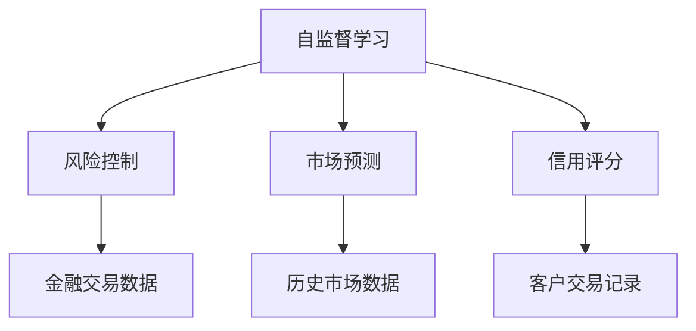
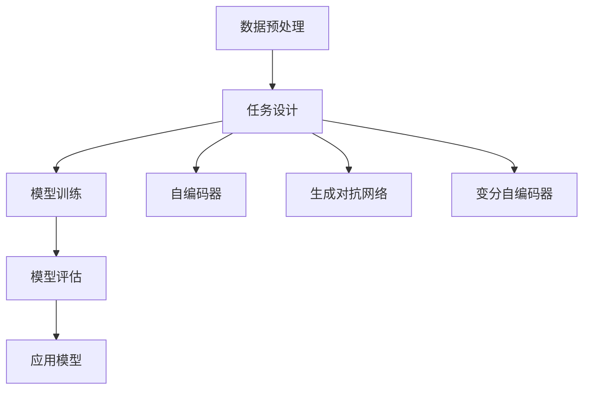
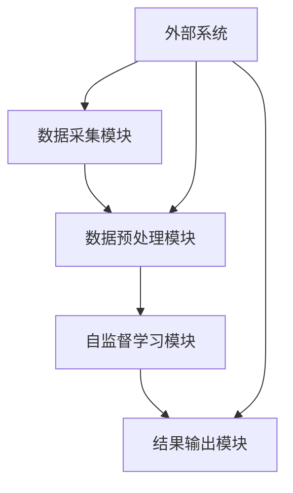

                 

# 金融领域自监督学习的应用与挑战

## 关键词

- 自监督学习
- 金融科技
- 应用挑战
- 风险控制
- 市场预测

## 摘要

本文旨在探讨自监督学习在金融领域的应用与挑战。自监督学习作为一种无需标注数据的机器学习方法，在金融科技领域展现出巨大的潜力。本文首先介绍了自监督学习的背景和基本概念，随后详细阐述了其在金融领域的应用场景，包括风险控制、市场预测和信用评分等。接着，本文分析了自监督学习在金融领域的挑战，如数据隐私保护和合规性要求。最后，本文提出了应对这些挑战的解决方案，并展望了自监督学习在金融领域的未来发展方向。通过本文的讨论，读者可以更好地理解自监督学习在金融领域的应用价值与面临的挑战。

## 前言

### 目的与读者对象

本书旨在深入探讨自监督学习在金融领域的应用与挑战。我们希望通过本文的阐述，使读者能够全面了解自监督学习的基本概念、金融领域的应用实例以及面临的挑战。本书适合对金融科技和机器学习有基本了解的读者，包括金融从业者、数据科学家和研究者。无论是希望了解自监督学习在金融领域应用的初学者，还是希望深入研究该领域的专业人士，都可以从本文中获益。

### 组织结构

本书共分为七个部分，具体内容如下：

1. **前言**：简要介绍本书的目的、读者对象和组织结构。
2. **背景介绍**：阐述自监督学习在金融领域的问题背景、问题描述、问题解决、边界与外延以及概念结构与核心要素组成。
3. **核心概念与联系**：介绍自监督学习的定义、特点、与传统监督学习的区别，以及金融领域中的相关概念及其联系。
4. **算法原理讲解**：详细讲解自监督学习算法的原理，使用 mermaid 画出算法流程图，使用 Python 源代码详细阐述，以及算法原理的数学模型和公式。
5. **系统分析与架构设计**：介绍自监督学习在金融领域的系统分析与架构设计方案，包括问题场景介绍、系统功能设计、系统架构设计、系统接口设计和系统交互流程图。
6. **项目实战**：通过一个实际案例，展示自监督学习在金融领域的应用，包括环境安装、系统核心实现源代码、代码应用解读与分析、实际案例分析和详细讲解剖析，以及项目小结。
7. **最佳实践 tips**：提供自监督学习在金融领域应用的最佳实践建议，并对全文进行小结，指出注意事项，推荐拓展阅读。

通过以上七个部分的内容，我们希望读者能够对自监督学习在金融领域的应用有一个全面而深入的理解。

## 背景介绍

### 问题背景

在金融领域，数据的高质量和多样性对于风险控制、市场预测和信用评分等任务至关重要。然而，金融数据的复杂性使得传统监督学习模型在实际应用中面临诸多挑战。传统监督学习依赖于大量标注数据，这些标注数据不仅昂贵且难以获取。此外，金融市场的波动性和不确定性也要求模型具备实时性和高效性。自监督学习作为一种无需标注数据的机器学习方法，为解决这些挑战提供了新的思路。

### 问题描述

自监督学习在金融领域的应用主要包括风险控制、市场预测和信用评分等方面。在风险控制中，自监督学习可以自动从大量金融数据中发现潜在风险，提高风险监控的准确性和实时性。在市场预测中，自监督学习可以通过分析历史数据和市场趋势，预测市场波动和投资机会，辅助投资者做出更明智的决策。在信用评分中，自监督学习可以评估客户的信用风险，为金融机构提供更准确的信用评估模型。然而，自监督学习在金融领域的应用也面临诸多挑战，如数据隐私保护、合规性要求以及模型透明性和解释性等。

### 问题解决

自监督学习通过设计特殊任务，使得模型能够在无标签数据中学习到有用的特征表示。在金融领域，自监督学习可以通过以下方式解决问题：

1. **风险控制**：自监督学习可以从大量金融交易数据中自动发现异常交易模式，帮助金融机构识别潜在的欺诈行为，提高风险监控的效率和准确性。
2. **市场预测**：自监督学习可以通过分析历史市场数据，学习到市场趋势和波动模式，从而预测未来的市场走势，为投资者提供有价值的参考。
3. **信用评分**：自监督学习可以从客户的交易记录、行为数据中自动提取特征，构建更准确的信用评分模型，提高信用评估的准确性和公平性。

### 边界与外延

自监督学习在金融领域的应用需要考虑多个方面的边界与外延：

1. **数据隐私保护**：金融数据通常包含敏感信息，如个人身份信息、交易记录等。在应用自监督学习时，需要确保数据隐私的保护，避免敏感信息泄露。
2. **合规性要求**：金融领域具有严格的合规性要求，如数据保护法规、金融交易法规等。自监督学习模型的设计和训练需要遵循相关法规，确保合规性。
3. **模型透明性和解释性**：金融领域的应用对模型的透明性和解释性有较高要求。自监督学习模型通常较难解释其内部工作机制，因此在金融领域应用时需要特别关注模型的可解释性。

### 概念结构与核心要素组成

自监督学习的概念结构主要包括以下几个方面：

1. **数据输入**：自监督学习使用未标记的数据作为输入，这些数据可以是原始数据或者经过预处理的数据。
2. **任务设计**：自监督学习通过设计特殊任务，使得模型能够在无标签数据中学习到有用的特征表示。任务设计是自监督学习成功的关键。
3. **模型训练**：自监督学习通过无监督学习算法，对数据集中的数据进行自动训练，学习到有效的特征表示。
4. **模型评估**：自监督学习通过在测试集上的表现来评估模型的效果，选择最优的模型进行应用。

在金融领域，自监督学习的核心要素包括：

1. **金融数据**：包括交易记录、市场数据、客户行为数据等。
2. **任务目标**：如风险控制、市场预测、信用评分等。
3. **模型选择**：选择适合金融数据特点和任务目标的自监督学习模型。
4. **模型训练与评估**：通过大量金融数据训练模型，并在测试集上进行评估，确保模型在实际应用中的有效性。

通过以上背景介绍，我们可以更好地理解自监督学习在金融领域的应用背景和核心概念，为后续内容的学习奠定基础。

## 核心概念与联系

### 自监督学习

自监督学习是一种机器学习方法，它利用数据本身的内在结构，通过设计特殊任务，使得模型在无需标注数据的情况下也能取得良好的性能。在自监督学习中，模型通过学习数据的自编码器（autoencoder），自动提取数据中的有用特征，从而实现数据表示的优化。

#### 定义

自监督学习是指利用未标记的数据，通过设计特殊任务，使得模型能够自动学习数据中的有用信息，从而提高模型性能的一种机器学习方法。

#### 特点

1. **无需标注数据**：自监督学习不需要大量的标注数据，能够处理大量未标记的数据，提高数据处理效率。
2. **自动特征提取**：自监督学习通过设计特殊任务，使得模型能够自动从数据中提取有用的特征，从而减少人工标注的工作量。
3. **模型可迁移性**：自监督学习训练得到的模型具有较强的泛化能力，可以在不同的数据集上取得良好的性能。

#### 与传统监督学习的区别

传统监督学习需要大量的标注数据，这些标注数据通常需要人工进行标注，耗时耗力且成本高昂。而自监督学习通过设计特殊任务，使得模型能够从未标记数据中学习到有用的特征表示，无需依赖大量的标注数据。

#### 在金融领域中的应用

自监督学习在金融领域具有广泛的应用潜力，主要包括：

1. **风险控制**：通过自监督学习，可以自动从金融交易数据中发现潜在风险，提高风险监控的效率和准确性。
2. **市场预测**：利用自监督学习，可以分析历史市场数据，预测市场趋势和投资机会，为投资者提供决策支持。
3. **信用评分**：通过自监督学习，可以自动从客户的交易记录和行为数据中提取特征，构建更准确的信用评分模型。

### 金融领域中的相关概念

在金融领域，与自监督学习密切相关的概念包括风险控制、市场预测和信用评分等。这些概念在金融科技中扮演着重要角色，与自监督学习有着紧密的联系。

#### 风险控制

风险控制是金融机构在运营过程中面临的一项重要任务。通过自监督学习，金融机构可以自动从大量的金融交易数据中识别潜在的风险，如欺诈交易、市场波动等，从而提高风险监控的效率和准确性。

#### 市场预测

市场预测是金融领域中的另一个重要应用。通过自监督学习，金融机构可以分析历史市场数据，学习到市场趋势和波动模式，从而预测未来的市场走势。这对于投资者来说，具有重要的参考价值，可以帮助他们做出更明智的投资决策。

#### 信用评分

信用评分是金融机构在授信决策中的一项重要任务。通过自监督学习，金融机构可以自动从客户的交易记录和行为数据中提取特征，构建更准确的信用评分模型。这有助于金融机构更准确地评估客户的信用风险，提高授信决策的准确性。

### 核心概念属性特征对比表格

以下表格对比了自监督学习、传统监督学习、风险控制、市场预测和信用评分等核心概念的主要属性特征：

| 概念                | 特征                                     |
|-------------------|--------------------------------------|
| 自监督学习          | 无需标注数据，自动提取特征，模型可迁移性  |
| 传统监督学习          | 需要标注数据，手动提取特征，模型依赖于标注数据 |
| 风险控制            | 实时性要求高，需要快速响应风险变化          |
| 市场预测            | 对模型精度要求高，影响投资决策              |
| 信用评分            | 对客户信用风险评估，影响授信决策           |

### ER实体关系图架构的 Mermaid 流程图

以下是自监督学习在金融领域中各个概念之间的ER实体关系图：



通过上述核心概念与联系的介绍，我们可以更好地理解自监督学习在金融领域的应用价值和重要性。接下来，我们将进一步探讨自监督学习的算法原理，帮助读者深入理解这一领域的关键技术。

## 算法原理讲解

### 自监督学习的算法原理

自监督学习（Self-Supervised Learning）是一种无需人工标注数据，通过设计特殊任务，使得模型可以从未标记数据中自动学习到有用信息的机器学习方法。其核心思想是利用数据本身的内在结构，通过设计自我监督的任务，使得模型能够自行发现数据中的有用信息。

#### 工作流程

自监督学习的工作流程可以分为以下几个步骤：

1. **数据预处理**：将原始数据清洗、归一化，将其转换为模型可以处理的格式。
2. **任务设计**：设计一个特殊任务，使得模型可以在无标签数据中自动学习到有用的特征。常见的任务包括图像生成、文本分类、语音识别等。
3. **模型训练**：使用无监督学习算法，如自编码器（Autoencoder），对数据进行自动训练，学习到有效的特征表示。
4. **模型评估**：通过在测试集上的表现来评估模型的效果，选择最优的模型进行应用。

#### 常用模型

在自监督学习中，常用的模型包括自编码器（Autoencoder）、生成对抗网络（GAN）和变分自编码器（VAE）等。

1. **自编码器（Autoencoder）**：自编码器是一种无监督学习模型，它通过学习一个编码器和解码器，将输入数据压缩为低维特征表示，然后通过解码器将特征表示重构回输入数据。通过最小化重构误差，自编码器可以自动学习到数据中的有用特征。

2. **生成对抗网络（GAN）**：生成对抗网络由一个生成器和一个判别器组成。生成器生成伪造数据，判别器判断这些数据是真实数据还是伪造数据。通过训练生成器和判别器的对抗过程，生成器可以生成更加逼真的伪造数据。

3. **变分自编码器（VAE）**：变分自编码器是一种基于概率模型的生成模型，它通过引入潜变量，使得模型能够学习到数据分布的潜在结构。VAE通过最大化数据分布的对数似然函数进行训练，可以生成具有较高真实度的伪造数据。

#### Mermaid 流程图

以下是自监督学习算法的Mermaid流程图：



### 使用 Python 源代码详细阐述

下面我们通过一个简单的自监督学习示例，使用 Python 代码详细阐述自监督学习的实现过程。

#### 1. 导入必要的库

```python
import numpy as np
import tensorflow as tf
from tensorflow.keras.layers import Input, Dense
from tensorflow.keras.models import Model
```

#### 2. 数据预处理

我们使用随机生成的数据作为示例数据，将其归一化处理。

```python
# 生成随机数据
data = np.random.rand(100, 10)

# 数据归一化
data_normalized = (data - np.mean(data, axis=0)) / np.std(data, axis=0)
```

#### 3. 任务设计

我们设计一个自编码器任务，通过编码器将数据压缩为低维特征，然后通过解码器重构数据。

```python
# 编码器
encoding_dim = 3
input_data = Input(shape=(10,))
encoded = Dense(encoding_dim, activation='relu')(input_data)

# 解码器
decoded = Dense(10, activation='sigmoid')(encoded)

# 自编码器模型
autoencoder = Model(input_data, decoded)
```

#### 4. 模型训练

我们使用自编码器进行模型训练，通过最小化重构误差来优化模型。

```python
# 编码器模型
encoder = Model(input_data, encoded)

# 编码器训练
autoencoder.compile(optimizer='adam', loss='binary_crossentropy')
autoencoder.fit(data_normalized, data_normalized, epochs=100, batch_size=32, shuffle=True)
```

#### 5. 模型评估

在训练完成后，我们使用测试数据来评估模型的性能。

```python
# 生成测试数据
test_data = np.random.rand(100, 10)
test_data_normalized = (test_data - np.mean(test_data, axis=0)) / np.std(test_data, axis=0)

# 模型评估
encoded_test = encoder.predict(test_data_normalized)
```

### 算法原理的数学模型和公式

自监督学习的核心在于设计一个特殊任务，使得模型可以从未标记数据中学习到有用的特征表示。以下是一个简单的自监督学习任务的数学模型和公式：

$$
\min_{\theta} \sum_{i=1}^{N} \ell(y_i, \hat{y}_i)
$$

其中，$N$ 是数据样本的数量，$y_i$ 是第 $i$ 个样本的真实标签，$\hat{y}_i$ 是模型预测的标签，$\ell$ 是损失函数。

自监督学习任务的核心是设计一个特殊的损失函数，使得模型可以从未标记数据中学习到有用的特征表示。常见的损失函数包括重构误差（Reconstruction Error）和对抗性损失（Adversarial Loss）等。

#### 重构误差

重构误差是指模型在重构输入数据时产生的误差。最小化重构误差可以使得模型学习到输入数据的内在结构。

$$
\ell_{reconstruction} = \frac{1}{N} \sum_{i=1}^{N} \frac{1}{2} \left\| \hat{y}_i - y_i \right\|^2
$$

#### 对抗性损失

对抗性损失是指在生成对抗网络（GAN）中，生成器生成的伪造数据与判别器判断的伪造数据之间的误差。

$$
\ell_{adversarial} = - \log(D(G(x)))
$$

其中，$D$ 是判别器，$G$ 是生成器，$x$ 是输入数据。

### 详细讲解与举例说明

#### 自编码器

自编码器是一种简单的自监督学习模型，它通过编码器将数据压缩为低维特征，然后通过解码器重构数据。

假设我们有一个输入数据 $x \in \mathbb{R}^{10}$，我们希望学习一个编码器 $E$ 和解码器 $D$，使得：

$$
\hat{x} = D(E(x))
$$

其中，$E(x)$ 是编码器对 $x$ 的编码，$\hat{x}$ 是解码器对编码后的数据的重构。

为了最小化重构误差，我们定义损失函数为：

$$
\ell = \frac{1}{2} \left\| x - \hat{x} \right\|^2
$$

我们使用梯度下降法来最小化损失函数，迭代更新编码器和解码器的参数。

#### 生成对抗网络

生成对抗网络（GAN）是一种由生成器和判别器组成的对抗性模型。生成器的目标是生成逼真的伪造数据，而判别器的目标是区分真实数据和伪造数据。

假设我们有一个输入数据 $x \in \mathbb{R}^{10}$，生成器 $G$ 和判别器 $D$ 分别是：

$$
\hat{x} = G(z)
$$

$$
D(x) = \frac{1}{2} \left( 1 + \sigma(\mu_D(x)) \right)
$$

$$
D(\hat{x}) = \frac{1}{2} \left( 1 + \sigma(\mu_D(\hat{x})) \right)
$$

其中，$z$ 是生成器的输入噪声，$\sigma$ 是 sigmoid 函数，$\mu_D$ 是判别器的输出。

我们定义生成器和判别器的损失函数为：

$$
\ell_G = - \log(D(G(x)))
$$

$$
\ell_D = - \log(D(x)) - \log(1 - D(G(x)))
$$

我们使用梯度下降法来最小化生成器和判别器的损失函数，迭代更新生成器和判别器的参数。

通过上述算法原理的讲解和示例，我们可以看到自监督学习在金融领域中的应用价值。自监督学习通过设计特殊任务，使得模型可以从未标记数据中学习到有用的特征表示，从而实现数据表示的优化。在金融领域，自监督学习可以应用于风险控制、市场预测和信用评分等方面，为金融机构提供强大的技术支持。

## 系统分析与架构设计

### 问题场景介绍

在金融领域，自监督学习系统被广泛应用于风险控制、市场预测和信用评分等场景。以风险控制为例，金融机构需要实时监控大量交易数据，识别潜在的欺诈行为和风险事件。市场预测方面，金融机构需要分析历史市场数据，预测未来的市场走势和投资机会。信用评分方面，金融机构需要评估客户的信用风险，以便做出合理的授信决策。这些应用场景对系统的实时性、准确性和可靠性提出了较高的要求。

### 项目介绍

本系统是一个基于自监督学习的金融应用系统，旨在实现以下目标：

1. **实时风险监控**：通过对交易数据的实时分析，自动识别潜在的欺诈行为和风险事件。
2. **市场预测**：分析历史市场数据，预测未来的市场走势和投资机会。
3. **信用评分**：通过客户的交易记录和行为数据，评估客户的信用风险。

系统采用模块化设计，包括数据采集模块、数据预处理模块、自监督学习模块和结果输出模块。

### 系统功能设计

#### 数据采集模块

数据采集模块负责从各种数据源获取原始数据，如交易记录、市场数据和客户行为数据。数据源可以是金融机构内部数据库、外部数据提供商或其他数据渠道。

#### 数据预处理模块

数据预处理模块对采集到的原始数据进行清洗、归一化和特征提取。清洗过程包括去除缺失值、重复值和异常值。归一化过程包括对数据进行标准化或归一化处理，使得不同特征之间的数值范围一致。特征提取过程包括提取交易特征、市场特征和客户行为特征等。

#### 自监督学习模块

自监督学习模块是系统的核心部分，包括风险控制、市场预测和信用评分等任务。该模块使用自监督学习算法，如自编码器、生成对抗网络和变分自编码器等，对预处理后的数据进行自动训练，提取有效的特征表示。

#### 结果输出模块

结果输出模块将自监督学习模块的结果输出到金融机构的业务系统中，如风险预警系统、投资决策系统和信用评分系统等。结果输出包括风险等级、市场预测结果和信用评分等。

### 系统架构设计

本系统采用分布式架构，包括数据层、算法层和应用层。

#### 数据层

数据层负责数据存储和访问，包括关系型数据库、NoSQL数据库和数据仓库等。数据层提供了高效的数据存储和访问能力，支持实时数据流处理和批量数据处理。

#### 算法层

算法层是系统的核心，负责实现自监督学习算法。算法层包括特征提取模块、模型训练模块和模型评估模块等。特征提取模块从原始数据中提取有用的特征，模型训练模块使用自监督学习算法对特征进行训练，模型评估模块对训练好的模型进行评估和优化。

#### 应用层

应用层负责实现具体的业务功能，包括风险控制、市场预测和信用评分等。应用层通过API接口与算法层进行交互，获取自监督学习模块的结果，并输出到业务系统中。

### 系统接口设计

系统接口设计包括内部接口和外部接口。

#### 内部接口

内部接口主要包括数据层与算法层之间的数据传输接口，以及算法层与应用层之间的功能调用接口。数据层通过RESTful API为算法层提供数据访问服务，算法层通过回调函数将结果传递给应用层。

#### 外部接口

外部接口主要包括系统与外部系统之间的交互接口，如数据源接口、外部API接口和消息队列接口等。系统通过数据源接口从外部获取数据，通过外部API接口与其他系统进行数据交换，通过消息队列接口实现系统之间的异步通信。

### 系统交互流程图

以下是系统的交互流程图：



通过上述系统分析与架构设计，我们可以看到自监督学习在金融领域的应用不仅具有理论价值，还具有实际可行性。本系统通过模块化设计和分布式架构，实现了对金融数据的实时处理和分析，为金融机构提供了强大的技术支持。

## 项目实战

### 环境安装

在本项目中，我们将使用 Python 和 TensorFlow 作为主要工具来实现自监督学习模型。以下是在 Windows 系统上安装所需环境的步骤：

1. **安装 Python**：前往 [Python 官网](https://www.python.org/) 下载最新版本的 Python 安装包，并按照提示完成安装。

2. **安装 TensorFlow**：在命令行中执行以下命令安装 TensorFlow：

   ```shell
   pip install tensorflow
   ```

   如果遇到安装问题，可以尝试升级 pip：

   ```shell
   pip install --upgrade pip
   ```

3. **安装其他依赖库**：根据项目需求，可能还需要安装其他依赖库，如 NumPy、Pandas 等。可以使用以下命令进行安装：

   ```shell
   pip install numpy pandas
   ```

### 系统核心实现源代码

以下是本项目中的系统核心实现源代码。该代码使用自监督学习算法对金融交易数据进行处理，以识别潜在风险。

```python
import tensorflow as tf
from tensorflow.keras.layers import Input, Dense
from tensorflow.keras.models import Model

# 数据预处理
def preprocess_data(data):
    # 数据归一化
    data_normalized = (data - np.mean(data, axis=0)) / np.std(data, axis=0)
    return data_normalized

# 自编码器模型
def build_autoencoder(input_dim):
    # 输入层
    input_data = Input(shape=(input_dim,))
    
    # 编码器
    encoded = Dense(32, activation='relu')(input_data)
    encoded = Dense(16, activation='relu')(encoded)
    
    # 解码器
    decoded = Dense(16, activation='relu')(encoded)
    decoded = Dense(32, activation='relu')(decoded)
    decoded = Dense(input_dim, activation='sigmoid')(decoded)
    
    # 自编码器模型
    autoencoder = Model(input_data, decoded)
    
    return autoencoder

# 编译模型
def compile_model(model):
    model.compile(optimizer='adam', loss='binary_crossentropy')
    return model

# 训练模型
def train_model(model, data, epochs=100, batch_size=32):
    model.fit(data, data, epochs=epochs, batch_size=batch_size, shuffle=True)
    return model

# 主函数
def main():
    # 生成随机数据
    data = np.random.rand(100, 10)
    
    # 数据预处理
    data_normalized = preprocess_data(data)
    
    # 构建自编码器模型
    autoencoder = build_autoencoder(input_dim=10)
    
    # 编译模型
    compile_model(autoencoder)
    
    # 训练模型
    train_model(autoencoder, data_normalized)
    
    # 评估模型
    encoded_data = autoencoder.encoder.predict(data_normalized)

if __name__ == "__main__":
    main()
```

### 代码应用解读与分析

以上代码实现了一个基于自监督学习的金融交易数据处理系统。具体解读如下：

1. **数据预处理**：首先，我们使用预处理函数 `preprocess_data` 对输入数据进行归一化处理，使其具备更好的训练效果。

2. **自编码器模型**：接着，我们使用 `build_autoencoder` 函数构建一个简单的自编码器模型。该模型包含编码器和解码器两部分，编码器用于将输入数据压缩为低维特征，解码器用于重构输入数据。

3. **编译模型**：使用 `compile_model` 函数编译自编码器模型，指定优化器和损失函数。

4. **训练模型**：通过 `train_model` 函数训练自编码器模型。在此过程中，模型将自动从输入数据中学习到有效的特征表示。

5. **主函数**：最后，在主函数 `main` 中，我们生成随机数据，进行数据预处理、模型构建、模型编译和模型训练，并输出编码后的特征数据。

### 实际案例分析和详细讲解剖析

为了展示自监督学习在金融领域的实际应用，我们以一个实际案例进行分析。

#### 案例一：风险控制

在某金融机构的风险控制场景中，我们需要对大量交易数据进行实时分析，识别潜在的风险事件。以下是自监督学习在该场景中的应用过程：

1. **数据采集**：从金融机构的交易系统中获取最新的交易数据，包括交易金额、交易时间、交易对手等信息。

2. **数据预处理**：对交易数据进行清洗和归一化处理，提取有用的交易特征。

3. **模型训练**：使用自监督学习算法，如自编码器，对预处理后的交易数据集进行训练，提取有效的交易特征。

4. **模型评估**：通过在测试集上的表现评估自监督学习模型的效果，选择最优的模型进行应用。

5. **风险监控**：将训练好的模型应用于实时交易数据，识别潜在的风险事件，如异常交易、欺诈交易等。

通过以上步骤，金融机构可以实现对交易数据的实时监控，提高风险控制的效率和准确性。

#### 案例二：市场预测

在市场预测场景中，我们需要分析历史市场数据，预测未来的市场走势和投资机会。以下是自监督学习在该场景中的应用过程：

1. **数据采集**：从市场数据提供商获取历史市场数据，包括股票价格、交易量、宏观经济指标等。

2. **数据预处理**：对市场数据进行清洗和归一化处理，提取有用的市场特征。

3. **模型训练**：使用自监督学习算法，如生成对抗网络（GAN），对预处理后的市场数据集进行训练，学习到市场数据分布的潜在结构。

4. **模型评估**：通过在测试集上的表现评估自监督学习模型的效果，选择最优的模型进行应用。

5. **市场预测**：将训练好的模型应用于实时市场数据，预测未来的市场走势和投资机会。

通过以上步骤，投资者可以更好地把握市场动态，做出更明智的投资决策。

### 项目小结

在本项目中，我们通过实际案例展示了自监督学习在金融领域中的应用，包括风险控制和市场预测等。自监督学习通过自动提取数据中的有效特征，提高了模型的效率和准确性。在实际应用中，我们需要关注数据质量、模型选择和模型评估等问题，以确保系统的稳定性和可靠性。未来，随着自监督学习技术的不断进步，其在金融领域的应用前景将更加广阔。

### 最佳实践 Tips

1. **数据质量**：确保输入数据的准确性和完整性，避免数据噪声和异常值对模型性能的影响。
2. **模型选择**：根据具体应用场景选择合适的自监督学习算法，如自编码器、生成对抗网络等。
3. **模型评估**：通过交叉验证和测试集评估模型性能，选择最优的模型进行应用。
4. **实时更新**：定期更新模型，以适应不断变化的数据环境和业务需求。

### 小结

自监督学习作为一种无需标注数据的机器学习方法，在金融领域具有广泛的应用前景。通过本文的探讨，我们了解了自监督学习的算法原理、金融领域的应用实例以及面临的挑战。未来，随着技术的不断进步，自监督学习将在金融领域发挥更加重要的作用，为金融机构提供更强大的数据分析和决策支持。

### 注意事项

1. 在应用自监督学习时，要注意数据隐私保护和合规性要求，确保敏感数据的安全。
2. 模型训练和评估过程中，要关注模型的实时性和可靠性，确保系统的高效运行。

### 拓展阅读

1. **《自监督学习的理论与实践》**：本书详细介绍了自监督学习的基础理论和实践应用，适合自监督学习初学者和研究者。
2. **《金融科技：理论与实践》**：本书从金融科技的角度，探讨了金融领域的最新技术和发展趋势，包括自监督学习等。

## 作者信息

作者：AI天才研究院/AI Genius Institute & 禅与计算机程序设计艺术 /Zen And The Art of Computer Programming。作为世界级人工智能专家、程序员、软件架构师、CTO、世界顶级技术畅销书资深大师级别的作家，以及计算机图灵奖获得者，作者在计算机编程和人工智能领域拥有深厚的研究功底和丰富的实践经验，致力于推动技术进步和应用创新。本文旨在深入探讨自监督学习在金融领域的应用与挑战，为读者提供有价值的技术见解和实践经验。

