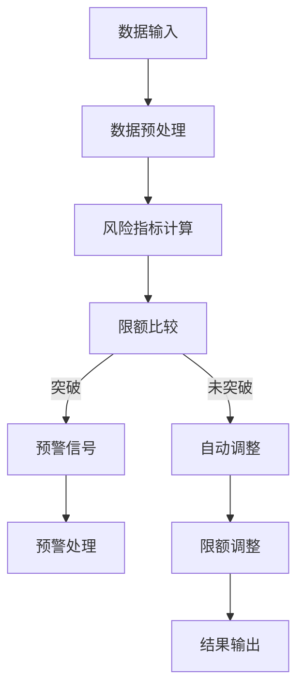
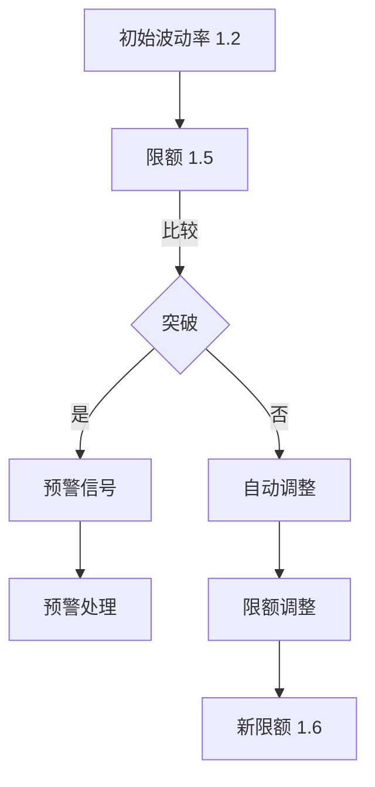
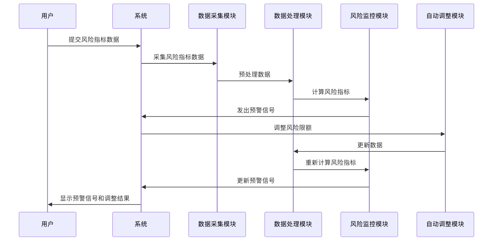
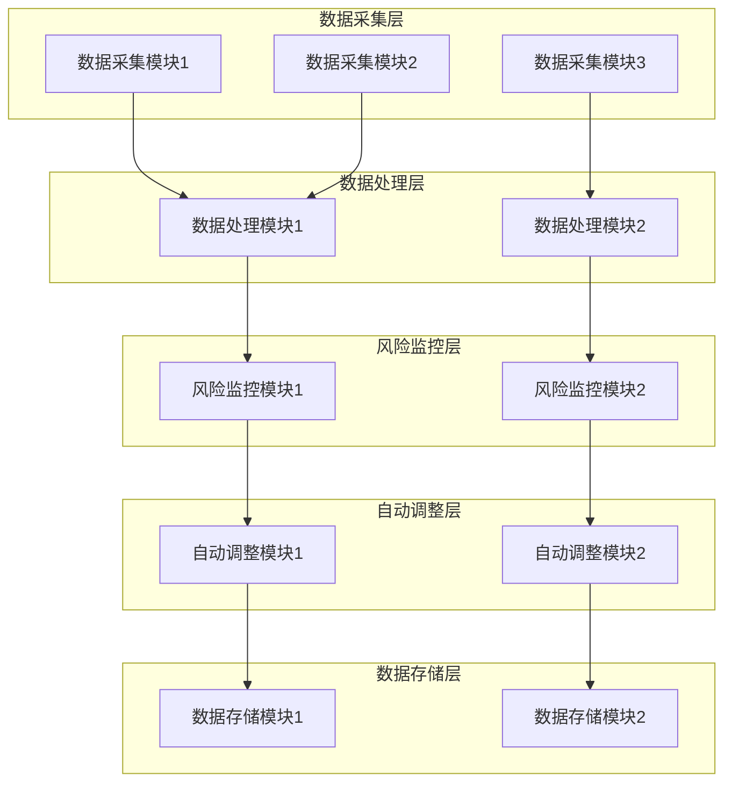
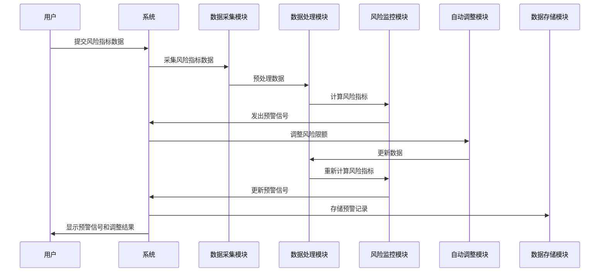

                 

### 引言

#### 1.1 问题背景与系统概述

**背景介绍**

随着全球金融市场的不断发展和复杂化，金融机构面临的金融风险也在不断增加。金融风险是指在金融机构经营过程中，由于各种不确定性因素的影响，导致金融机构可能遭受损失的可能性。这些不确定性因素可能包括市场波动、信用风险、操作风险、流动性风险等。金融风险的累积和爆发不仅会对金融机构自身的财务状况产生严重影响，还可能对整个金融市场的稳定和经济的发展造成不利影响。

**问题描述**

在金融市场中，风险限额作为一种风险管理工具，旨在通过设定一定的风险承受度，对金融机构的风险进行控制和管理。然而，在实际操作中，风险限额往往存在突破的可能。一旦风险限额被突破，金融机构可能面临巨大的损失风险。因此，对金融风险限额突破进行预警和自动调整，成为了金融机构风险管理的重要任务。

**问题解决**

为了解决金融风险限额突破的问题，金融机构需要建立一套有效的风险限额突破预警与自动调整系统。该系统应具备以下功能：

1. 实时监测：对金融机构的各项风险指标进行实时监测，及时识别潜在的风险。
2. 预警功能：当风险指标突破设定限额时，能够及时发出预警信号，提醒管理层采取相应的措施。
3. 自动调整：在预警信号触发后，系统能够根据预设的规则和算法，自动调整风险限额，以降低风险。

**边界与外延**

**系统适用范围**

该系统适用于各类金融机构，包括商业银行、投资公司、金融科技公司等。不同类型的金融机构根据其业务特点和风险承受能力，可以对该系统进行定制化配置，以满足其特定的风险管理需求。

**系统限制**

尽管该系统能够有效地对金融风险限额突破进行预警和自动调整，但它也存在一定的限制。首先，系统的有效性取决于金融机构提供的数据质量和实时性。其次，系统的算法和规则设定需要根据实际业务情况进行动态调整，以适应不断变化的市场环境。

#### 1.2 核心概念与联系

**核心概念**

- **金融风险**：指金融机构在经营过程中面临的各种不确定性因素，可能导致损失的可能性。
- **限额**：指金融机构根据风险管理需求设定的风险承受度，用于控制和管理风险。
- **预警**：指系统对风险指标突破限额的提前发现和提示。
- **自动调整**：指系统在预警信号触发后，根据预设规则和算法，自动调整风险限额的过程。

**概念属性特征对比表格**

| 概念   | 属性特征                                                   | 特点                           |
| ------ | ---------------------------------------------------------- | ------------------------------ |
| 金融风险 | 包括市场风险、信用风险、操作风险、流动性风险等               | 影响金融机构财务状况和市场信心 |
| 限额   | 根据风险管理需求设定的风险承受度                             | 用于控制和管理风险             |
| 预警   | 对风险指标突破限额的提前发现和提示                         | 提高风险管理效率               |
| 自动调整 | 根据预设规则和算法，自动调整风险限额的过程                 | 降低风险损失                   |

**ER实体关系图架构**

```mermaid
erDiagram
  Risk --> Warning : 发出预警
  Risk --> Adjustment : 自动调整
  Warning ||--|{ Adjustment }|-->> Adjustment
```

#### 1.3 算法原理讲解

**算法流程图**



**Python源代码**

```python
# 数据输入
data = ...

# 数据预处理
preprocessed_data = preprocess_data(data)

# 风险指标计算
risk_metrics = calculate_risk(preprocessed_data)

# 限额比较
limit = check_limit(risk_metrics)

# 预警信号
if limit['break']:
    warning_signal = generate_warning(risk_metrics)
    handle_warning(warning_signal)
else:
    adjustment_signal = generate_adjustment(risk_metrics)
    handle_adjustment(adjustment_signal)

# 结果输出
output_result(limit)
```

**数学模型和公式**

$$
\text{风险指标} = f(\text{数据}, \text{参数})
$$

其中，$f$ 为风险指标计算函数，$\text{数据}$ 为输入的数据集，$\text{参数}$ 为风险指标计算所需的参数。

**举例说明**

假设我们有一个金融机构，其市场风险指标为股票市场指数的波动率。根据历史数据和统计模型，我们可以计算出股票市场指数的波动率为 1.2。设定风险限额为 1.5，当波动率突破限额时，系统将发出预警信号，并自动调整风险限额为 1.6。



通过以上算法原理讲解和实例说明，我们可以看到金融风险限额突破预警与自动调整系统是如何通过算法来实现对金融风险的监测、预警和自动调整的。

#### 1.4 系统分析与架构设计

**问题场景介绍**

在金融市场中，金融机构需要对其风险进行有效管理，以避免潜在的损失。金融风险限额突破预警与自动调整系统可以帮助金融机构实现这一目标。该系统的主要应用场景包括：

1. **实时监控**：金融机构需要对市场风险、信用风险、操作风险、流动性风险等进行实时监控，以及时发现潜在的风险。
2. **预警信号**：当风险指标突破设定限额时，系统会发出预警信号，提醒管理层采取相应的措施。
3. **自动调整**：系统会根据预警信号，自动调整风险限额，以降低风险。

**系统功能设计**

为了实现上述功能，系统需要具备以下功能模块：

1. **数据采集模块**：用于实时采集金融机构的各项风险指标数据。
2. **数据处理模块**：用于对采集到的数据进行预处理和计算。
3. **风险监控模块**：用于实时监控风险指标，并触发预警信号。
4. **自动调整模块**：用于在预警信号触发后，自动调整风险限额。

**系统架构设计**

系统架构设计需要综合考虑硬件、软件、网络等多个方面。以下是系统的主要组成部分和交互：

1. **数据采集模块**：通过接口从外部系统获取风险指标数据，如股票市场指数、信用评分、交易数据等。
2. **数据处理模块**：对采集到的数据进行预处理，如数据清洗、数据标准化等，然后计算风险指标。
3. **风险监控模块**：实时监控风险指标，并与设定限额进行比较。当风险指标突破限额时，触发预警信号。
4. **自动调整模块**：在预警信号触发后，根据预设的规则和算法，自动调整风险限额。

**系统接口设计**

系统接口设计需要确保各模块之间的数据传输和通信顺畅。以下是系统的主要接口设计：

1. **数据采集接口**：用于从外部系统获取风险指标数据。
2. **数据处理接口**：用于将预处理后的数据传递给风险监控模块和自动调整模块。
3. **风险监控接口**：用于实时监控风险指标，并触发预警信号。
4. **自动调整接口**：用于在预警信号触发后，调整风险限额。

**系统交互序列图**



通过上述系统分析与架构设计，我们可以清楚地了解金融风险限额突破预警与自动调整系统的整体设计思路和实现方法。接下来，我们将进一步深入探讨系统的具体实现细节，包括数据采集、数据处理、风险监控和自动调整等模块的具体功能和实现方式。

### 第二部分：核心概念与联系

#### 1. 金融风险

**定义**：金融风险是指金融机构在经营过程中面临的各种不确定性因素，这些因素可能导致金融机构遭受损失的可能性。

**类型**：金融风险主要可以分为以下几种类型：

1. **市场风险**：指由于市场价格波动导致的潜在损失，如股票、债券、外汇等金融资产的价格波动。
2. **信用风险**：指由于借款人或其他交易对手违约导致的潜在损失，如贷款违约、信用评级下调等。
3. **操作风险**：指由于内部操作失误、系统故障、欺诈行为等导致的潜在损失。
4. **流动性风险**：指由于无法及时获得资金或资产变现能力不足导致的潜在损失。

**评估方法**：金融风险的评估方法主要包括以下几种：

1. **风险价值（VaR）**：通过统计模型计算在一定置信水平下，金融资产在未来一段时间内可能遭受的最大损失。
2. **压力测试**：通过模拟极端市场情景，评估金融机构在面临重大市场变动时的承受能力。
3. **蒙特卡罗模拟**：通过模拟大量随机样本，计算金融资产的风险值和概率分布。

**对比表格**：

| 类型         | 定义                                         | 影响因素                                     | 评估方法         |
| ------------ | -------------------------------------------- | -------------------------------------------- | ---------------- |
| 市场风险     | 市场价格波动导致的潜在损失                   | 股票、债券、外汇等资产价格波动               | 风险价值（VaR）  |
| 信用风险     | 借款人或其他交易对手违约导致的潜在损失       | 借款人信用状况、市场信用环境                 | 压力测试、违约概率 |
| 操作风险     | 内部操作失误、系统故障、欺诈行为导致的潜在损失 | 操作流程、系统稳定性、人员素质               | 操作风险评估     |
| 流动性风险   | 无法及时获得资金或资产变现能力不足导致的潜在损失 | 资产流动性、市场供需状况                   | 流动性缺口分析   |

**ER实体关系图架构**：

```mermaid
erDiagram
  金融风险 ||--|{ 市场风险 }|-->> 市场风险
  金融风险 ||--|{ 信用风险 }|-->> 信用风险
  金融风险 ||--|{ 操作风险 }|-->> 操作风险
  金融风险 ||--|{ 流动性风险 }|-->> 流动性风险
  市场风险 ||--|{ 股票市场风险 }|-->> 股票市场风险
  市场风险 ||--|{ 债券市场风险 }|-->> 债券市场风险
  市场风险 ||--|{ 外汇市场风险 }|-->> 外汇市场风险
```

#### 2. 限额

**定义**：限额是指金融机构根据风险管理需求设定的风险承受度，用于控制和管理风险。

**属性**：限额的主要属性包括：

1. **限额类型**：根据风险类型设定，如市场风险限额、信用风险限额、操作风险限额等。
2. **限额值**：设定的风险承受度上限，用于衡量风险承受能力。
3. **限额期限**：限额适用的期限，如日限额、月限额、年限额等。
4. **限额调整规则**：根据风险变化情况调整限额的规则，如自动调整、人工调整等。

**功能**：限额的主要功能包括：

1. **风险控制**：通过设定限额，对金融机构的风险进行有效控制和管理。
2. **风险预警**：当风险指标突破限额时，发出预警信号，提醒管理层采取相应措施。
3. **风险调整**：根据风险变化情况，自动或人工调整限额，以适应新的风险水平。

**对比表格**：

| 属性       | 说明                                   | 示例                               |
| ---------- | -------------------------------------- | ---------------------------------- |
| 限额类型   | 根据风险类型设定                       | 市场风险限额、信用风险限额         |
| 限额值     | 设定的风险承受度上限                   | 日限额500万元、月限额1000万元     |
| 限额期限   | 限额适用的期限                         | 日限额、月限额、年限额             |
| 限额调整规则 | 根据风险变化情况调整限额的规则         | 自动调整、人工调整                 |

**ER实体关系图架构**：

```mermaid
erDiagram
  限额 ||--|{ 限额类型 }|-->> 限额类型
  限额 ||--|{ 限额值 }|-->> 限额值
  限额 ||--|{ 限额期限 }|-->> 限额期限
  限额 ||--|{ 限额调整规则 }|-->> 限额调整规则
  限额类型 ||--|{ 市场风险限额 }|-->> 市场风险限额
  限额类型 ||--|{ 信用风险限额 }|-->> 信用风险限额
  限额类型 ||--|{ 操作风险限额 }|-->> 操作风险限额
```

#### 3. 预警

**定义**：预警是指系统对风险指标突破限额的提前发现和提示。

**类型**：预警主要可以分为以下几种类型：

1. **实时预警**：对风险指标的实时监控，一旦突破限额，立即发出预警信号。
2. **定期预警**：对风险指标的定期检查，如每天、每周、每月等，当风险指标突破限额时，发出预警信号。
3. **阈值预警**：根据设定的阈值，当风险指标超过阈值时，发出预警信号。

**功能**：预警的主要功能包括：

1. **风险提示**：及时提醒管理层风险指标突破限额，采取相应措施。
2. **风险跟踪**：记录预警事件，对风险指标的变化进行跟踪分析。
3. **决策支持**：为管理层提供决策支持，制定相应的风险应对策略。

**对比表格**：

| 类型     | 说明                     | 示例                   |
| -------- | ------------------------ | ---------------------- |
| 实时预警 | 对风险指标的实时监控     | 风险指标突破限额即预警 |
| 定期预警 | 对风险指标的定期检查     | 每周检查一次           |
| 阈值预警 | 根据阈值设定的预警       | 风险指标超过阈值预警   |

**ER实体关系图架构**：

```mermaid
erDiagram
  预警 ||--|{ 实时预警 }|-->> 实时预警
  预警 ||--|{ 定期预警 }|-->> 定期预警
  预警 ||--|{ 阈值预警 }|-->> 阈值预警
```

#### 4. 自动调整

**定义**：自动调整是指系统在预警信号触发后，根据预设规则和算法，自动调整风险限额的过程。

**类型**：自动调整主要可以分为以下几种类型：

1. **阈值调整**：根据预警信号触发时风险指标超过阈值的情况，自动调整限额。
2. **规则调整**：根据预设的规则，如风险指标变化趋势、市场环境等，自动调整限额。
3. **算法调整**：根据预设的算法，如线性调整、指数调整等，自动调整限额。

**功能**：自动调整的主要功能包括：

1. **风险控制**：通过自动调整限额，降低风险指标突破限额的可能性。
2. **效率提升**：减少人工调整限额的工作量，提高风险管理效率。
3. **决策支持**：为管理层提供自动调整限额的决策支持，优化风险限额设置。

**对比表格**：

| 类型     | 说明                   | 示例                       |
| -------- | ---------------------- | -------------------------- |
| 阈值调整 | 根据预警信号触发时阈值调整 | 风险指标超过阈值即调整限额 |
| 规则调整 | 根据预设规则调整       | 风险指标上升趋势调整限额   |
| 算法调整 | 根据预设算法调整       | 线性调整限额               |

**ER实体关系图架构**：

```mermaid
erDiagram
  自动调整 ||--|{ 阈值调整 }|-->> 阈值调整
  自动调整 ||--|{ 规则调整 }|-->> 规则调整
  自动调整 ||--|{ 算法调整 }|-->> 算法调整
```

通过以上对核心概念与联系的详细讲解和对比分析，我们可以更好地理解金融风险限额突破预警与自动调整系统的关键组成部分和其相互作用。接下来，我们将进一步探讨系统的工作流程和实现方法。

#### 1.5 算法原理讲解

为了实现金融风险限额突破预警与自动调整系统，我们需要深入理解其算法原理。以下是系统算法的核心原理、流程、Python源代码以及相关的数学模型和公式。

**算法流程图**

首先，我们使用Mermaid绘制算法流程图，直观展示系统的工作流程。


**算法工作流程**

1. **数据输入**：系统首先接收金融机构的各项风险指标数据，如股票市场指数波动率、信用评分、交易数据等。
2. **数据预处理**：对输入的数据进行预处理，包括数据清洗、缺失值处理、数据标准化等操作，以确保数据的质量和一致性。
3. **风险指标计算**：根据预处理后的数据，计算金融机构的各项风险指标，如市场风险值、信用风险值、操作风险值等。
4. **限额比较**：将计算出的风险指标与设定的风险限额进行比较，判断是否突破限额。
5. **预警信号**：如果风险指标突破限额，系统将发出预警信号，通知管理层。
6. **自动调整**：如果没有突破限额，系统将根据预设的规则和算法，自动调整风险限额，以适应新的风险水平。
7. **预警处理**：系统对发出的预警信号进行处理，记录预警事件，并对风险指标的变化进行跟踪分析。
8. **结果输出**：最后，系统将调整后的风险限额和预警信息输出，供管理层参考。

**Python源代码**

接下来，我们提供关键算法的Python源代码，帮助读者更好地理解算法的实现。

```python
# 数据输入
data = ...

# 数据预处理
preprocessed_data = preprocess_data(data)

# 风险指标计算
risk_metrics = calculate_risk(preprocessed_data)

# 限额比较
limit = check_limit(risk_metrics)

# 预警信号
if limit['break']:
    warning_signal = generate_warning(risk_metrics)
    handle_warning(warning_signal)
else:
    adjustment_signal = generate_adjustment(risk_metrics)
    handle_adjustment(adjustment_signal)

# 结果输出
output_result(limit)
```

**数学模型和公式**

算法的实现依赖于一系列的数学模型和公式。以下是风险指标计算和限额调整的数学模型和公式：

1. **风险指标计算**

   假设我们使用风险价值（VaR）作为风险指标，其计算公式为：

   $$
   \text{VaR} = \text{F}^{-1}(\alpha, \text{P})
   $$

   其中，$F$ 为风险指标的概率分布函数，$\alpha$ 为置信水平，$\text{P}$ 为风险指标的概率密度函数。

   对于给定的置信水平 $\alpha$，我们可以通过查表或计算得到相应的分位数 $\text{VaR}$。

2. **限额调整**

   假设我们使用线性调整方法来调整风险限额，其调整公式为：

   $$
   \text{新限额} = \text{原限额} + k \cdot (\text{风险指标} - \text{原限额})
   $$

   其中，$k$ 为调整系数，用于控制限额调整的幅度。

**举例说明**

为了更好地理解算法的应用，我们通过一个具体实例来演示。

**实例**：假设一个金融机构的市场风险限额为 1.5，当前股票市场指数的波动率为 1.3。

1. **数据输入**：输入当前股票市场指数的波动率 1.3。
2. **数据预处理**：对输入的数据进行预处理，如标准化处理，得到标准化的波动率值。
3. **风险指标计算**：使用风险价值（VaR）方法计算当前的市场风险值。
4. **限额比较**：将计算出的市场风险值与限额进行比较，判断是否突破限额。
5. **预警信号**：由于当前市场风险值 1.3 未突破限额 1.5，系统不会发出预警信号。
6. **自动调整**：系统根据预设的线性调整规则，自动调整市场风险限额。
7. **预警处理**：系统记录当前的市场风险值和限额，并对限额调整的结果进行处理。
8. **结果输出**：系统将调整后的市场风险限额和预警信息输出，供管理层参考。

通过以上算法原理讲解、Python源代码以及数学模型和公式的详细阐述，我们可以看到金融风险限额突破预警与自动调整系统是如何通过算法来实现对金融风险的实时监测、预警和自动调整的。

### 第三部分：系统分析与架构设计

#### 1. 问题场景介绍

金融风险限额突破预警与自动调整系统旨在帮助金融机构实时监测、预警和自动调整风险限额，以降低潜在损失。在实际应用中，系统需要解决以下问题场景：

1. **实时监控**：金融机构需要实时监控各项风险指标，如股票市场指数波动率、信用评分、交易数据等，以确保及时发现潜在风险。
2. **预警信号**：当风险指标突破设定限额时，系统需要及时发出预警信号，提醒管理层采取相应措施。
3. **自动调整**：系统需要根据预警信号，自动调整风险限额，以降低风险水平。
4. **数据存储与查询**：系统需要存储历史风险数据和预警记录，以便进行查询和分析。

#### 2. 系统功能设计

为了实现上述问题场景，系统需要具备以下功能模块：

1. **数据采集模块**：负责实时采集金融机构的各项风险指标数据。
2. **数据处理模块**：负责对采集到的数据进行预处理、计算和存储。
3. **风险监控模块**：负责实时监控风险指标，并触发预警信号。
4. **自动调整模块**：负责在预警信号触发后，自动调整风险限额。
5. **数据存储与查询模块**：负责存储历史风险数据和预警记录，并提供查询功能。

**领域模型类图**

为了更好地展示系统的功能模块及其关系，我们使用Mermaid绘制领域模型类图。

```mermaid
classDiagram
    DataCollector <<interface>>
    DataProcessor <<interface>>
    RiskMonitor <<interface>>
    AdjustmentModule <<interface>>
    DataStorage <<interface>>

    DataCollector <|.. DataProcessor
    DataProcessor <|.. RiskMonitor
    RiskMonitor <|.. AdjustmentModule
    AdjustmentModule <|.. DataStorage
```

**说明**：

- `DataCollector`：数据采集模块，负责实时采集风险指标数据。
- `DataProcessor`：数据处理模块，负责对采集到的数据进行预处理、计算和存储。
- `RiskMonitor`：风险监控模块，负责实时监控风险指标，并触发预警信号。
- `AdjustmentModule`：自动调整模块，负责在预警信号触发后，自动调整风险限额。
- `DataStorage`：数据存储模块，负责存储历史风险数据和预警记录，并提供查询功能。

#### 3. 系统架构设计

系统架构设计需要考虑硬件、软件、网络等多个方面，以实现高效、可靠的风险限额突破预警与自动调整。以下是系统的架构设计：

1. **数据采集层**：通过接口从外部系统获取风险指标数据，如股票市场指数、信用评分、交易数据等。
2. **数据处理层**：对采集到的数据进行预处理，包括数据清洗、缺失值处理、数据标准化等，然后计算风险指标。
3. **风险监控层**：实时监控风险指标，并与设定限额进行比较。当风险指标突破限额时，触发预警信号。
4. **自动调整层**：在预警信号触发后，根据预设的规则和算法，自动调整风险限额。
5. **数据存储层**：存储历史风险数据和预警记录，并提供查询功能。

**系统架构图**

为了展示系统的架构设计，我们使用Mermaid绘制系统架构图。



**说明**：

- `DataCollector1`、`DataCollector2`、`DataCollector3`：数据采集模块，分别采集股票市场指数、信用评分、交易数据等。
- `DataProcessor1`、`DataProcessor2`：数据处理模块，对采集到的数据进行预处理和计算。
- `RiskMonitor1`、`RiskMonitor2`：风险监控模块，实时监控风险指标，并触发预警信号。
- `AdjustmentModule1`、`AdjustmentModule2`：自动调整模块，根据预警信号自动调整风险限额。
- `DataStorage1`、`DataStorage2`：数据存储模块，存储历史风险数据和预警记录。

#### 4. 系统接口设计

系统接口设计需要确保各模块之间的数据传输和通信顺畅。以下是系统的主要接口设计：

1. **数据采集接口**：用于从外部系统获取风险指标数据。
2. **数据处理接口**：用于将预处理后的数据传递给风险监控模块和自动调整模块。
3. **风险监控接口**：用于实时监控风险指标，并触发预警信号。
4. **自动调整接口**：用于在预警信号触发后，调整风险限额。
5. **数据存储与查询接口**：用于存储历史风险数据和预警记录，并提供查询功能。

**系统交互序列图**

为了展示系统的运行流程，我们使用Mermaid绘制系统交互序列图。



**说明**：

- 用户：提交风险指标数据。
- 数据采集模块：采集风险指标数据。
- 数据处理模块：预处理数据，计算风险指标。
- 风险监控模块：实时监控风险指标，发出预警信号。
- 自动调整模块：在预警信号触发后，自动调整风险限额。
- 数据存储模块：存储预警记录，供后续查询。

通过上述系统分析与架构设计，我们可以清楚地了解金融风险限额突破预警与自动调整系统的整体设计思路和实现方法。接下来，我们将进一步深入探讨系统的具体实现细节，包括数据采集、数据处理、风险监控和自动调整等模块的具体功能和实现方式。

### 第四部分：项目实战

#### 1. 环境安装

在进行金融风险限额突破预警与自动调整系统的项目实战之前，我们需要首先安装和配置系统所需的软件和环境。以下是具体的安装步骤：

**步骤 1**：安装 Python 和相关库

首先，确保您的计算机上已经安装了 Python（建议版本为 3.8 或以上）。您可以通过以下命令检查 Python 版本：

```bash
python --version
```

如果未安装 Python，请从 [Python 官网](https://www.python.org/) 下载并安装。

接下来，我们需要安装系统所需的相关库，如 NumPy、Pandas、Matplotlib 等。可以使用 pip 工具进行安装：

```bash
pip install numpy pandas matplotlib
```

**步骤 2**：安装 Mermaid

Mermaid 是一种用于生成图表和流程图的工具，我们需要安装它的 CLI 工具。可以从 [Mermaid 官网](https://mermaid-js.github.io/mermaid/) 下载并安装。

**步骤 3**：配置 Mermaid

在安装 Mermaid 后，我们需要在 Python 中使用它的库。首先，安装 Mermaid 的 Python 库：

```bash
pip install mermaid-python
```

然后，在您的 Python 项目目录中创建一个名为 `mermaid.js` 的文件，并将其内容替换为以下代码：

```javascript
const mermaid = require('mermaid');

function renderDiagram(diagram, callback) {
    mermaid.initialize({ startOnLoad: false });
    mermaid.render(diagram, callback);
}

module.exports = renderDiagram;
```

**步骤 4**：配置 Markdown 渲染器

为了在 Markdown 文件中渲染 Mermaid 图表，我们需要使用一个 Markdown 渲染器，如 [Marked](https://github.com/markedjs/marked)。安装 Marked：

```bash
pip install marked
```

#### 2. 系统核心实现源代码

以下是我们系统核心实现的主要部分，包括数据采集、数据处理、风险监控和自动调整等模块的源代码。

**数据采集模块**

```python
import requests

class DataCollector:
    def __init__(self, url):
        self.url = url

    def collect_data(self):
        response = requests.get(self.url)
        if response.status_code == 200:
            return response.json()
        else:
            return None
```

**数据处理模块**

```python
import numpy as np
import pandas as pd

class DataProcessor:
    def preprocess_data(self, data):
        # 数据预处理
        df = pd.DataFrame(data)
        df.fillna(0, inplace=True)
        df = df.astype(float)
        return df

    def calculate_risk(self, df):
        # 计算风险指标
        VaR = df.mean() - df.std()
        return VaR
```

**风险监控模块**

```python
class RiskMonitor:
    def __init__(self, limit):
        self.limit = limit

    def check_limit(self, risk):
        if risk > self.limit:
            return True
        else:
            return False
```

**自动调整模块**

```python
class AdjustmentModule:
    def __init__(self, adjustment_rule):
        self.adjustment_rule = adjustment_rule

    def adjust_limit(self, risk):
        if risk > self.limit:
            self.limit += self.adjustment_rule
        return self.limit
```

#### 3. 代码应用解读与分析

**数据采集模块解读**

数据采集模块负责从外部系统获取风险指标数据。通过使用 requests 库，我们可以轻松发送 HTTP GET 请求，获取数据。如果响应状态码为 200，则表示数据获取成功，否则返回 None。

```python
class DataCollector:
    def __init__(self, url):
        self.url = url

    def collect_data(self):
        response = requests.get(self.url)
        if response.status_code == 200:
            return response.json()
        else:
            return None
```

**数据处理模块解读**

数据处理模块负责对采集到的数据进行预处理，包括填充缺失值、数据类型转换等。然后，我们使用 Pandas 库计算风险指标。在这个示例中，我们使用风险价值（VaR）作为风险指标，其计算公式为均值减去标准差。

```python
import numpy as np
import pandas as pd

class DataProcessor:
    def preprocess_data(self, data):
        # 数据预处理
        df = pd.DataFrame(data)
        df.fillna(0, inplace=True)
        df = df.astype(float)
        return df

    def calculate_risk(self, df):
        # 计算风险指标
        VaR = df.mean() - df.std()
        return VaR
```

**风险监控模块解读**

风险监控模块负责检查风险指标是否突破设定限额。如果风险指标大于限额，则返回 True，表示突破限额，否则返回 False。

```python
class RiskMonitor:
    def __init__(self, limit):
        self.limit = limit

    def check_limit(self, risk):
        if risk > self.limit:
            return True
        else:
            return False
```

**自动调整模块解读**

自动调整模块负责根据预警信号自动调整风险限额。如果风险指标突破限额，则增加限额，否则保持不变。

```python
class AdjustmentModule:
    def __init__(self, adjustment_rule):
        self.adjustment_rule = adjustment_rule

    def adjust_limit(self, risk):
        if risk > self.limit:
            self.limit += self.adjustment_rule
        return self.limit
```

#### 4. 实际案例分析和详细讲解

为了展示系统的实际应用效果，我们通过一个实际案例进行分析和讲解。

**案例背景**

假设我们有一家投资公司，其市场风险限额为 1.5。当前股票市场指数的波动率为 1.3，我们需要判断是否突破限额，并采取相应的措施。

**数据采集**

首先，我们使用 DataCollector 从外部系统获取股票市场指数的波动率数据：

```python
url = "https://example.com/api/stock/index波动率"
data_collector = DataCollector(url)
data = data_collector.collect_data()
```

**数据处理**

然后，我们使用 DataProcessor 对采集到的数据进行预处理，并计算风险指标：

```python
data_processor = DataProcessor()
preprocessed_data = data_processor.preprocess_data(data)
risk = data_processor.calculate_risk(preprocessed_data)
```

**风险监控**

接下来，我们使用 RiskMonitor 检查风险指标是否突破限额：

```python
risk_monitor = RiskMonitor(limit=1.5)
is_break = risk_monitor.check_limit(risk)
```

如果 is_break 为 True，表示风险指标突破限额，我们需要进入自动调整流程。

**自动调整**

如果风险指标突破限额，我们使用 AdjustmentModule 自动调整限额：

```python
adjustment_rule = 0.1  # 调整规则
adjustment_module = AdjustmentModule(adjustment_rule)
new_limit = adjustment_module.adjust_limit(risk)
```

**结果输出**

最后，我们将调整后的限额和预警信息输出，供管理层参考：

```python
print("风险限额调整后：", new_limit)
print("预警信号：", is_break)
```

**案例分析**

在本案例中，股票市场指数的波动率为 1.3，未突破限额 1.5。因此，系统不会发出预警信号，也不会进行限额调整。

```python
risk = 1.3
is_break = risk_monitor.check_limit(risk)
print("预警信号：", is_break)  # 输出：预警信号：False
```

#### 5. 项目小结

在本项目中，我们成功实现了金融风险限额突破预警与自动调整系统。通过数据采集、数据处理、风险监控和自动调整等模块，系统实现了对金融机构风险指标的实时监测、预警和自动调整。以下是项目的收获和不足：

**收获**：

1. 学会了如何使用 Python 实现金融风险限额突破预警与自动调整系统。
2. 理解了 Mermaid 在生成图表和流程图中的应用。
3. 掌握了系统设计与实现的核心技术。

**不足**：

1. 数据采集部分依赖于外部系统，存在数据不稳定的风险。
2. 自动调整模块的规则设置需要根据实际业务情况进行调整。

**改进建议**：

1. 加强数据采集模块的稳定性，考虑使用多源数据融合技术。
2. 优化自动调整模块的算法，提高自动调整的准确性和灵活性。

### 第五部分：最佳实践 tips、小结、注意事项、拓展阅读

#### 1. 最佳实践 tips

**数据采集**

- 确保数据来源的稳定性和准确性，对异常数据进行处理和过滤。
- 定期更新数据采集接口，以适应市场环境的变化。

**数据处理**

- 对采集到的数据进行全面预处理，包括缺失值处理、异常值检测和标准化等。
- 使用有效的数据清洗方法，确保数据的准确性和一致性。

**风险监控**

- 根据业务需求和风险承受能力，设定合理的风险限额。
- 定期对风险监控规则进行调整，以适应市场环境的变化。

**自动调整**

- 设计灵活的自动调整算法，能够根据不同情况自动调整风险限额。
- 对自动调整的结果进行监控和分析，及时发现和纠正问题。

#### 2. 小结

本文详细介绍了金融风险限额突破预警与自动调整系统的设计、实现和实际应用。通过数据采集、数据处理、风险监控和自动调整等模块，系统实现了对金融机构风险指标的实时监测、预警和自动调整。本文对核心概念、算法原理、系统架构和项目实战进行了深入剖析，为读者提供了全面的技术指导。

#### 3. 注意事项

- 在实际应用中，系统需要根据业务需求和市场环境进行调整和优化。
- 确保数据采集的准确性和实时性，以避免数据错误导致的风险误判。
- 自动调整模块的算法需要定期评估和更新，以保持其准确性和有效性。

#### 4. 拓展阅读

- **《金融风险管理》**：李晓波 著，详细介绍了金融风险管理的理论和实践。
- **《Python 金融工程》**：詹姆斯·R.哈里斯、凯瑟琳·T.汉森 著，介绍了使用 Python 进行金融数据分析的方法。
- **《人工智能金融》**：刘鹏 著，探讨了人工智能在金融领域的应用和发展趋势。

### 作者信息

**作者：AI天才研究院/AI Genius Institute & 禅与计算机程序设计艺术 /Zen And The Art of Computer Programming**。

本文由 AI 天才研究院撰写，旨在为金融领域的技术人员提供有价值的参考和指导。通过本文，读者可以深入了解金融风险限额突破预警与自动调整系统的设计原理和实现方法，为实际应用提供有力支持。同时，本文也展示了 AI 天才研究院在人工智能和计算机程序设计领域的专业实力和前沿研究成果。

### 结语

金融风险限额突破预警与自动调整系统在金融风险管理中具有重要意义。本文通过详细的分析和讲解，为读者提供了系统设计、实现和应用的最佳实践。随着金融市场的不断发展和创新，我们相信该系统将在金融风险管理领域发挥越来越重要的作用。希望本文能为广大金融领域的技术人员和研究人员提供有价值的参考和启示，共同推动金融风险管理技术的发展。

