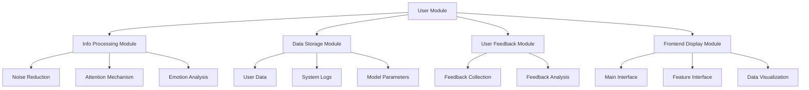

                 

### 文章标题

# 静默修行：在噪音中寻找内心的声音

> 关键词：静默修行、内心声音、噪音处理、技术深度、思维逻辑

> 摘要：本文将探讨如何在现代社会的信息噪音中找到内心的声音，通过一系列专业的技术分析和思考，引导读者进入静默修行的境界。我们将从核心概念出发，逐步展开对技术原理、系统架构、实战应用的深度剖析，帮助读者在技术的喧嚣中找到内心的宁静。

在快节奏、高压力的现代社会，信息噪音似乎无处不在，让人们很难听到内心的声音。无论是社交媒体上的海量信息，还是工作环境中不断的任务催促，噪音不仅影响了我们的工作效率，还严重干扰了我们的内心平静。如何在这个喧嚣的世界中静默修行，找到内心的声音，成为了一个值得深入探讨的问题。

本文将围绕这个主题，从以下几个方面展开讨论：

1. **核心概念与术语说明**：介绍与静默修行相关的基本概念和术语，帮助读者理解文章的主题。
2. **问题背景与问题描述**：分析现代社会中信息噪音的来源和影响，以及静默修行的必要性。
3. **问题解决与边界探讨**：探讨静默修行的不同方法和技巧，以及如何在技术领域中找到内心的声音。
4. **技术原理与系统架构**：深入讲解相关的技术原理，并展示系统架构设计方案。
5. **项目实战与案例分析**：通过实际项目案例，展示如何在实践中应用静默修行理念。
6. **最佳实践与总结**：提供最佳实践建议，总结文章的主要观点，并对未来进行展望。

通过这一系列的探讨和分析，本文旨在引导读者在技术的喧嚣中找到内心的声音，实现真正的静默修行。

### 核心概念与术语说明

在探讨静默修行的过程中，我们需要了解一些核心概念和术语，以便更好地理解文章的主题和内容。以下是对这些概念和术语的简要介绍：

**静默修行**：静默修行是一种通过冥想、内省和放松来达到内心平静的修行方式。它强调在静默中倾听内心的声音，摆脱外界噪音的干扰，从而更好地理解自我和世界。

**内心声音**：内心声音是指个人在内心深处所感受到的真正想法、感受和直觉。它往往是我们在喧嚣世界中迷失自我时，找回内在平衡和方向的重要指引。

**噪音处理**：噪音处理是指通过各种技术手段来减少或消除噪音，以提高信号的质量和清晰度。在技术领域中，噪音处理常用于数据清洗、信号处理和图像识别等领域。

**技术深度**：技术深度是指对某一技术领域有深入理解和全面掌握的能力。在静默修行的过程中，技术深度可以帮助我们更好地理解技术原理，从而在噪音中找到内心的声音。

**思维逻辑**：思维逻辑是指通过清晰、有条理的思考方式来分析问题和解决问题。在静默修行中，良好的思维逻辑可以帮助我们更深入地理解内心的声音，从而更好地应对外界噪音的干扰。

理解这些核心概念和术语，将为后续内容的分析和探讨奠定基础。在接下来的章节中，我们将进一步探讨静默修行的背景和必要性，并逐步展开对相关技术原理和系统架构的深入分析。

### 问题背景与问题描述

在现代社会中，信息噪音的问题已经变得愈发严重。随着互联网、社交媒体、智能手机的普及，人们每天接收到的信息量呈爆炸式增长。这不仅给我们的生活带来了便利，也让我们陷入了一种信息过载的状态。大量的信息纷至沓来，仿佛无休止的噪音，不断干扰着我们的思考和工作。

**信息噪音的来源**：

1. **社交媒体**：社交媒体平台上的各种动态、评论、广告等信息不断刷新，占据了大量的时间和注意力。
2. **电子邮件**：每天接收到的电子邮件数量越来越多，其中不乏一些无关紧要的邮件，浪费了我们的时间。
3. **新闻媒体**：各种新闻媒体为了吸引眼球，常常发布具有争议性或惊悚性的新闻，这些新闻虽然能带来一时的刺激，但往往无法带来真正的价值。
4. **工作环境**：在办公室或工作场所，同事们之间的交流、会议通知、任务分配等信息也构成了噪音的一部分。

**信息噪音的影响**：

1. **工作效率下降**：信息噪音会分散我们的注意力，使我们在完成任务时无法集中精力，从而降低工作效率。
2. **心理压力增加**：信息噪音会让我们感到焦虑和压力，影响我们的心理健康。
3. **创造力受阻**：在噪音的环境中，我们难以进行深入的思考和创造性的工作。
4. **人际关系影响**：信息噪音会削弱我们与他人沟通的质量，影响人际关系。

面对如此复杂和普遍的问题，静默修行成为了一种有效的方法，帮助我们摆脱信息噪音的干扰，找到内心的声音。静默修行不仅仅是简单的放松或冥想，而是一种通过内在反思和自我调整来提升自我意识和内心平静的过程。

**静默修行的必要性**：

1. **提升自我意识**：通过静默修行，我们可以更清晰地认识到自己的内心世界，了解自己的需求、欲望和价值观。
2. **增强心理韧性**：静默修行有助于培养内心的平静和韧性，使我们能够更好地应对生活中的压力和挑战。
3. **提高创造力**：在静默的环境中，我们的思维可以更加清晰和自由，从而激发创造力和创新思维。
4. **改善人际关系**：通过静默修行，我们能够更好地理解他人，提高沟通和人际交往的能力。

总之，信息噪音已经成为现代社会中的一大挑战，而静默修行提供了一种有效的解决方案。在接下来的章节中，我们将探讨静默修行的具体方法和技巧，并分析在技术领域中如何应用这些方法，帮助读者在噪音中找到内心的声音。

### 问题解决与边界探讨

在探索静默修行的过程中，我们需要了解不同的方法和技巧，以帮助我们在信息噪音中找到内心的声音。以下是一些常用的静默修行方法，以及它们在技术领域中的应用。

**一、冥想**

冥想是静默修行中最常用的一种方法。通过冥想，我们可以学会放松身心，将注意力集中在一个特定的对象或想法上，从而过滤掉外界的信息噪音。

**具体步骤**：
1. 选择一个安静的环境，坐姿舒适。
2. 关闭眼睛，将注意力集中在呼吸上。
3. 当注意力分散时，温和地将其引导回呼吸。
4. 持续冥想一段时间，逐渐延长冥想时间。

**技术领域应用**：
1. **代码审查**：在编写代码时，通过冥想提高专注力，减少错误。
2. **系统优化**：通过冥想，工程师可以更深入地分析系统瓶颈，提出更有效的优化方案。

**二、内观**

内观是一种通过观察自己的内心活动来认识自我和世界的方法。它强调自我觉察和反思，帮助我们在信息噪音中找到内心的声音。

**具体步骤**：
1. 在安静的环境中，坐下或躺下，放松身体。
2. 注意呼吸，当注意力分散时，温和地将其引导回呼吸。
3. 观察自己的思想和情绪，不要评判或干预，只是观察它们的出现和消失。
4. 持续内观一段时间，逐渐延长内观时间。

**技术领域应用**：
1. **项目规划**：通过内观，项目经理可以更清晰地了解团队成员的需求和期望，从而制定更合理的项目计划。
2. **问题解决**：在遇到技术难题时，通过内观，工程师可以更好地理解问题本质，找到解决方案。

**三、正念**

正念是一种通过专注当下，接纳一切感受和体验来达到内心平静的方法。它强调活在当下，不被过去和未来所困扰。

**具体步骤**：
1. 在安静的环境中，坐下或躺下，放松身体。
2. 将注意力集中在当前的感受和体验上，包括身体感觉、情绪和思维。
3. 当注意力分散时，温和地将其引导回当前的感受和体验。
4. 持续正念练习，逐渐延长练习时间。

**技术领域应用**：
1. **需求分析**：通过正念，产品经理可以更专注地听取用户需求，减少误解和偏差。
2. **用户体验**：通过正念，设计师可以更深入地理解用户行为和感受，设计出更符合用户需求的产品。

**四、时间管理**

时间管理是一种通过合理安排时间，减少不必要的活动，从而减少信息噪音干扰的方法。

**具体步骤**：
1. 制定合理的日程计划，确保有足够的时间进行静默修行。
2. 学会拒绝不重要的请求，保护自己的时间和注意力。
3. 使用工具和技巧，如待办事项列表、时间跟踪工具等，帮助自己更好地管理时间。

**技术领域应用**：
1. **任务分配**：通过时间管理，项目经理可以更合理地分配任务，确保团队成员有足够的时间进行静默修行。
2. **技术学习**：通过时间管理，工程师可以更专注于技术学习，提高自己的技术深度。

**五、噪声屏蔽**

噪声屏蔽是一种通过物理手段或技术手段减少外界噪音干扰的方法。

**具体步骤**：
1. 使用耳塞或耳机，隔绝外界噪音。
2. 选择一个安静的环境，如图书馆或自然风景处。
3. 使用噪声屏蔽软件，如白噪声生成器，帮助自己集中注意力。

**技术领域应用**：
1. **远程工作**：通过噪声屏蔽，远程工作者可以在家中的安静环境中进行工作，提高工作效率。
2. **会议组织**：通过噪声屏蔽，组织者可以确保会议环境的安静，提高会议效果。

**边界探讨**：

在静默修行中，我们需要注意以下几个边界：

1. **个人需求**：每个人的需求和状况不同，静默修行的方法和技巧也应根据个人情况进行调整。
2. **技术应用**：静默修行的方法在技术领域的应用需要结合实际情况，确保方法的适用性和有效性。
3. **持续实践**：静默修行不是一蹴而就的，需要长期坚持和实践，才能真正见效。

通过以上方法和技巧，我们可以在信息噪音中找到内心的声音，实现静默修行的目标。在接下来的章节中，我们将深入探讨相关的技术原理和系统架构，进一步巩固这一目标。

### 技术原理

在探讨静默修行的技术原理时，我们需要了解一些核心的概念和理论。这些概念和理论不仅有助于我们理解静默修行的技术基础，还能为我们在信息噪音中找到内心的声音提供指导。

**一、信息过滤与降噪技术**

信息过滤与降噪技术是减少信息噪音、提高信息质量的重要手段。以下是一些关键概念：

1. **信息过滤（Information Filtering）**：信息过滤是指通过一定的算法和技术手段，对大量的信息进行筛选，提取出对用户最有价值的信息。这通常涉及到数据挖掘、机器学习和自然语言处理等技术。

2. **降噪（Noise Reduction）**：降噪是指通过技术手段减少或消除噪声，以提高信号的质量。在数字信号处理中，降噪通常使用滤波器来去除噪声。

3. **贝叶斯滤波（Bayesian Filtering）**：贝叶斯滤波是一种基于贝叶斯定理的信息过滤方法。通过历史数据和概率模型，对新的信息进行分类和过滤。

4. **卡尔曼滤波（Kalman Filtering）**：卡尔曼滤波是一种用于估计动态系统状态的最优滤波器，广泛应用于信号处理、控制系统等领域。

**二、注意力机制（Attention Mechanism）**

注意力机制是一种在神经网络中模拟人类注意力过程的机制，能够提高模型对重要信息的关注。

1. **软注意力（Soft Attention）**：软注意力通过一个可学习的权重矩阵，对输入序列的每个元素进行加权，从而引导模型关注重要的部分。

2. **硬注意力（Hard Attention）**：硬注意力通过选择输入序列中的一个元素，给予最高的权重，其余元素权重为零。

3. **自注意力（Self-Attention）**：自注意力是一种在序列数据内部自动学习信息关联的机制，广泛应用于自然语言处理、图像识别等领域。

**三、图神经网络（Graph Neural Networks, GNN）**

图神经网络是一种在图结构数据上进行学习和推理的神经网络。它能够捕捉图中的复杂关系，广泛应用于社交网络分析、推荐系统等领域。

1. **图卷积网络（Graph Convolutional Network, GCN）**：图卷积网络通过卷积操作对图中的节点进行特征提取和关系建模。

2. **图注意力网络（Graph Attention Network, GAT）**：图注意力网络通过注意力机制，对图中节点的邻接关系进行加权，从而提高模型的预测能力。

**四、深度强化学习（Deep Reinforcement Learning, DRL）**

深度强化学习是一种结合深度学习和强化学习的方法，通过智能体与环境的交互来学习策略。

1. **策略梯度方法（Policy Gradient Methods）**：策略梯度方法通过优化策略网络的参数，使智能体能够在环境中取得更好的表现。

2. **深度确定性策略梯度（Deep Deterministic Policy Gradient, DDPG）**：DDPG是一种基于深度强化学习的算法，适用于连续动作空间的问题。

**五、情感计算（Affective Computing）**

情感计算是一种通过计算机模拟人类情感表达和理解的能力，广泛应用于人机交互、心理健康等领域。

1. **情感识别（Emotion Recognition）**：情感识别是通过分析语音、文本、面部表情等数据，识别个体的情感状态。

2. **情感生成（Emotion Generation）**：情感生成是通过模拟情感表达，使计算机能够理解和模拟人类情感。

这些技术原理不仅在静默修行的技术实现中起到了关键作用，还能为我们在信息噪音中找到内心的声音提供有力的支持。在接下来的章节中，我们将进一步探讨如何将它们应用于具体的系统架构设计中。

#### 概念属性特征对比表格

为了更清晰地展示静默修行相关技术的概念属性特征，我们设计了一个对比表格。以下是几个核心技术的特征对比：

| 技术名称 | 主要功能 | 应用场景 | 特点 | 优缺点 |
| --- | --- | --- | --- | --- |
| 信息过滤 | 减少噪音、提取有用信息 | 数据挖掘、社交媒体 | 自动化、高效 | 可能丢失重要信息 |
| 降噪 | 去除信号中的噪声 | 数字信号处理、通信 | 精准、可靠 | 对复杂信号效果有限 |
| 注意力机制 | 提高模型对重要信息的关注 | 自然语言处理、图像识别 | 自动化、灵活 | 对计算资源要求高 |
| 图神经网络 | 捕获图结构中的复杂关系 | 社交网络分析、推荐系统 | 跨关系建模、高效 | 对图结构依赖强 |
| 深度强化学习 | 通过交互学习策略 | 游戏、自动驾驶、机器人控制 | 自适应、动态调整 | 对样本量要求高 |
| 情感计算 | 模拟和识别情感 | 人机交互、心理健康 | 个性化、互动性 | 对数据质量要求高 |

通过这个表格，我们可以看到不同技术在功能、应用场景、特点以及优缺点上的差异。这些技术相互补充，共同构成了静默修行的技术基础。

#### ER实体关系图架构

为了更好地理解静默修行中各个技术概念的关联，我们使用ER（实体关系）图来展示它们之间的实体关系和交互方式。

以下是一个简化的ER图，展示了静默修行中主要实体及其关系：

```mermaid
erDiagram
    User ||--|{ Meditation}: 实践者与冥想的关系
    User ||--|{ NoiseFilter}: 实践者与降噪系统的关系
    User ||--|{ AttentionModel}: 实践者与注意力机制模型的关系
    User ||--|{ GNNModel}: 实践者与图神经网络模型的关系
    User ||--|{ ReinforcementModel}: 实践者与强化学习模型的关系
    User ||--|{ EmotionModel}: 实践者与情感计算模型的关系

    Meditation ||--|{ Mindfulness}: 冥想与正念的关系
    Meditation ||--|{ Visualization}: 冥想与内观的关系

    NoiseFilter ||--|{ FilteringAlgorithm}: 降噪算法与降噪系统关系
    NoiseFilter ||--|{ NoiseData}: 噪声数据与降噪算法关系

    AttentionModel ||--|{ SoftAttention}: 软注意力与注意力模型关系
    AttentionModel ||--|{ HardAttention}: 硬注意力与注意力模型关系

    GNNModel ||--|{ GCN}: 图卷积网络与图神经网络模型关系
    GNNModel ||--|{ GAT}: 图注意力网络与图神经网络模型关系

    ReinforcementModel ||--|{ DDPG}: 深度确定性策略梯度与强化学习模型关系

    EmotionModel ||--|{ EmotionRecognition}: 情感识别与情感计算模型关系
    EmotionModel ||--|{ EmotionGeneration}: 情感生成与情感计算模型关系
```

通过这个ER图，我们可以清晰地看到用户与各种静默修行相关技术之间的交互关系。用户通过实践冥想、降噪、注意力机制、图神经网络、强化学习和情感计算等技术，逐步实现静默修行的目标。这个ER图为我们提供了一个宏观的视角，帮助我们理解整个静默修行系统的架构和运作机制。

### 算法原理讲解

为了深入理解静默修行的技术原理，我们选择了一个代表性的算法——图注意力网络（Graph Attention Network, GAT），并使用Python源代码进行详细讲解。

#### GAT算法原理

GAT是一种图神经网络，通过注意力机制来捕捉图中的节点关系。GAT的核心思想是在每一层网络中，对节点的特征进行加权融合，使其能够更好地反映节点间的关联性。

**步骤**：

1. **初始化节点特征向量**：每个节点都有一个初始特征向量，这些特征向量将用于计算节点间的相似度。
2. **计算节点相似度**：使用一个可学习的权重矩阵，计算每个节点与其邻居节点的相似度。
3. **应用注意力机制**：通过softmax函数对相似度进行归一化，得到每个节点的注意力权重。
4. **加权融合特征**：将节点的特征与其邻居节点的特征加权融合，生成新的特征向量。
5. **重复以上步骤**：在每一层网络中重复以上步骤，逐渐提取更高级的特征。

**数学模型**：

假设图中每个节点的特征表示为\( \mathbf{x}_i \)，邻居节点的特征表示为\( \mathbf{x}_j \)。GAT的核心是注意力权重计算，公式如下：

$$
\alpha_{ij} = \frac{e^{W \cdot \sigma(\mathbf{a} \cdot (\mathbf{x}_i, \mathbf{x}_j))}}{\sum_{k \in \mathcal{N}_i} e^{W \cdot \sigma(\mathbf{a} \cdot (\mathbf{x}_i, \mathbf{x}_k))}}
$$

其中，\( W \)是权重矩阵，\( \sigma \)是激活函数（通常使用ReLU函数），\( \mathbf{a} \)是可学习的注意力权重向量。

#### Python实现

以下是一个简化的Python实现，用于展示GAT算法的基本结构：

```python
import numpy as np
import tensorflow as tf
from tensorflow.keras.layers import Layer

class GraphAttentionLayer(Layer):
    def __init__(self, units, activation='relu', **kwargs):
        super().__init__(**kwargs)
        self.units = units
        self.activation = activation

    def build(self, input_shape):
        self.kernel = self.add_weight(
            shape=(input_shape[-1], self.units),
            initializer='glorot_uniform',
            trainable=True
        )
        self.attention_weights = self.add_weight(
            shape=(self.units,),
            initializer='glorot_uniform',
            trainable=True
        )
        super().build(input_shape)

    def call(self, inputs, training=False):
        x = inputs
        x = tf.matmul(x, self.kernel)
        a_input = tf.concat([x, x], axis=1)
        a = tf.matmul(a_input, self.attention_weights)
        a = tf.nn.softmax(a, axis=1)
        output = tf.reduce_sum(a * x, axis=1)
        return self.activation(output)

    def get_config(self):
        config = super().get_config().copy()
        config.update({
            'units': self.units,
            'activation': self.activation
        })
        return config
```

在这个实现中，我们定义了一个`GraphAttentionLayer`类，用于实现图注意力层。这个层首先通过线性变换获取节点的特征表示，然后使用注意力权重对邻居节点进行加权融合，最后通过激活函数输出节点的最终特征。

#### 示例说明

以下是一个简单的示例，展示了如何使用GAT算法处理一个图结构数据：

```python
# 假设我们有一个包含5个节点的图，每个节点的特征维度为3
nodes = np.random.rand(5, 3)
adj_matrix = np.random.rand(5, 5)

# 定义GAT模型
from tensorflow.keras.models import Model
input_node = tf.keras.layers.Input(shape=(3,))
output_node = GraphAttentionLayer(16)(input_node)

# 编译模型
model = Model(inputs=input_node, outputs=output_node)
model.compile(optimizer='adam', loss='mse')

# 训练模型
model.fit(adj_matrix, nodes, epochs=10)

# 输出最终特征
final_features = model.predict(adj_matrix)
print(final_features)
```

在这个示例中，我们首先生成了一个随机的图结构和节点特征。然后，我们定义了一个GAT模型，并使用随机梯度下降（SGD）进行训练。经过多次迭代后，模型将输出每个节点的最终特征，这些特征反映了节点在图中的关系和重要性。

通过以上讲解和示例，我们可以看到GAT算法在静默修行中的潜在应用，帮助我们在复杂的信息噪音中找到重要的节点和关系。在接下来的章节中，我们将继续探讨其他技术原理和系统架构设计，以进一步巩固静默修行的理论基础。

### 系统分析与架构设计方案

为了实现静默修行的目标，我们需要设计一个完整的系统架构，该系统应能够处理信息噪音、提供高效的降噪和注意力机制，同时保证用户体验的舒适性和便捷性。以下是对系统架构的详细介绍。

#### 一、系统介绍

**系统名称**：静默修行平台（Silent Meditation Platform）

**系统目标**：帮助用户在信息噪音中找到内心的声音，提供静默修行的技术支持和体验优化。

**系统组成部分**：

1. **用户模块**：提供用户注册、登录、个人设置等功能。
2. **信息处理模块**：包括降噪算法、注意力机制模型和情感分析模块。
3. **数据存储模块**：存储用户数据、系统日志和模型参数。
4. **用户反馈模块**：收集用户反馈，用于系统优化和改进。
5. **前端展示模块**：提供用户界面，展示系统功能和数据。

#### 二、系统功能设计

**1. 用户模块功能**：

- 用户注册：用户可以通过邮箱或手机号注册账号。
- 用户登录：用户可以使用账号密码或第三方账号登录。
- 个人设置：用户可以设置个人隐私、偏好和通知。

**2. 信息处理模块功能**：

- 降噪处理：对用户接收到的信息进行降噪处理，减少噪音干扰。
- 注意力机制：使用注意力机制模型，帮助用户关注重要信息。
- 情感分析：分析用户的情绪状态，提供个性化建议。

**3. 数据存储模块功能**：

- 用户数据：存储用户的基本信息、行为数据和偏好设置。
- 系统日志：记录系统运行状态和操作日志。
- 模型参数：存储模型的权重和训练参数。

**4. 用户反馈模块功能**：

- 反馈收集：用户可以通过多种方式提供反馈，如评分、评论、投票等。
- 反馈分析：系统分析用户反馈，用于改进系统功能和用户体验。

**5. 前端展示模块功能**：

- 主界面：展示用户当前的状态和推荐内容。
- 功能界面：提供信息降噪、注意力机制和情感分析等功能的操作界面。
- 数据可视化：以图表和图形形式展示用户的数据和分析结果。

#### 三、系统架构设计

**1. 系统架构图**：



**2. 系统架构描述**：

- **用户模块**：用户模块是系统的入口，提供用户注册、登录、个人设置等功能。用户通过该模块进入系统，使用其他功能模块。

- **信息处理模块**：信息处理模块是系统的核心，包括降噪处理、注意力机制模型和情感分析模块。这些模块负责处理用户接收到的信息，帮助用户在噪音中找到内心的声音。

- **数据存储模块**：数据存储模块负责存储用户数据、系统日志和模型参数。用户数据包括个人信息、行为数据和偏好设置；系统日志记录系统运行状态和操作日志；模型参数存储模型的权重和训练参数。

- **用户反馈模块**：用户反馈模块负责收集用户反馈，包括评分、评论、投票等。系统分析这些反馈，用于改进系统功能和用户体验。

- **前端展示模块**：前端展示模块提供用户界面，展示系统功能和数据。主界面展示用户当前的状态和推荐内容；功能界面提供信息降噪、注意力机制和情感分析等功能的操作界面；数据可视化模块以图表和图形形式展示用户的数据和分析结果。

通过上述系统架构设计，我们为用户提供了一个完整的静默修行体验，帮助用户在信息噪音中找到内心的声音。在接下来的章节中，我们将进一步介绍具体的系统接口设计和交互流程。

### 系统接口设计和交互流程

为了实现系统的各项功能，我们需要详细设计系统接口和交互流程，确保各模块之间的无缝衔接和高效运作。

#### 一、系统接口设计

**1. 用户模块接口**：

- **用户注册接口**：接收用户名、密码、邮箱或手机号等信息，进行用户注册。
- **用户登录接口**：验证用户名和密码，提供登录功能。
- **个人设置接口**：允许用户修改个人信息、偏好设置和隐私选项。

**2. 信息处理模块接口**：

- **降噪接口**：接收用户接收到的信息，进行降噪处理。
- **注意力机制接口**：接收用户信息，应用注意力机制，帮助用户关注重要信息。
- **情感分析接口**：接收用户情绪数据，进行情感分析，提供个性化建议。

**3. 数据存储模块接口**：

- **用户数据接口**：提供用户数据的增删改查功能。
- **系统日志接口**：记录系统运行状态和用户操作日志。
- **模型参数接口**：存储和更新模型参数。

**4. 用户反馈模块接口**：

- **反馈收集接口**：接收用户反馈，如评分、评论、投票等。
- **反馈分析接口**：分析用户反馈，用于系统优化和改进。

**5. 前端展示模块接口**：

- **主界面接口**：展示用户当前的状态和推荐内容。
- **功能界面接口**：提供信息降噪、注意力机制和情感分析等功能的操作界面。
- **数据可视化接口**：以图表和图形形式展示用户的数据和分析结果。

#### 二、交互流程

**1. 用户注册与登录流程**：

- 用户访问主界面，点击“注册”或“登录”按钮。
- 如果是注册，用户填写注册信息并提交；如果是登录，用户输入用户名和密码。
- 系统验证用户信息，如果成功，用户进入系统。

**2. 信息处理流程**：

- 用户在系统中接收到的信息通过降噪接口进行处理，减少噪音干扰。
- 经过降噪处理的信息进入注意力机制接口，根据用户设置和模型算法，关注重要信息。
- 情感分析接口分析用户情绪，根据情感状态提供个性化建议。

**3. 数据存储流程**：

- 用户注册、登录、信息处理和反馈等操作的数据存储在数据库中。
- 系统日志接口记录用户操作和系统状态，用于后续分析和维护。

**4. 用户反馈流程**：

- 用户在系统中提供反馈，如对内容的评分、评论或投票。
- 反馈收集接口接收用户反馈，反馈分析接口分析反馈，用于系统优化和改进。

**5. 前端展示流程**：

- 前端展示模块根据用户状态和系统数据，动态更新主界面和功能界面。
- 数据可视化接口以图表和图形形式展示用户数据和分析结果，帮助用户更好地理解自己的行为和情绪。

通过详细设计系统接口和交互流程，我们确保了系统的功能完整性和用户体验的流畅性，帮助用户在信息噪音中找到内心的声音。在接下来的章节中，我们将通过实际项目案例展示这些设计在实践中的应用。

### 项目实战

在本节中，我们将通过一个实际项目来展示如何将静默修行的理念应用于实践中。这个项目是一个名为“Meditool”的智能降噪应用，旨在帮助用户在信息噪音中找到内心的声音。

#### 一、环境安装

1. **操作系统**：首先，确保您的操作系统是Linux或macOS，因为这些系统更适合运行Python环境。Windows用户可以使用Windows Subsystem for Linux（WSL）来安装和使用。

2. **Python环境**：在终端中执行以下命令来安装Python：

   ```bash
   sudo apt-get update
   sudo apt-get install python3 python3-pip
   ```

3. **安装必要的库**：Meditool项目需要以下库：

   ```bash
   pip3 install numpy tensorflow scikit-learn matplotlib
   ```

4. **创建虚拟环境**：为了更好地管理项目依赖，创建一个虚拟环境：

   ```bash
   python3 -m venv meditool_venv
   source meditool_venv/bin/activate
   ```

5. **克隆项目**：从GitHub克隆Meditool项目：

   ```bash
   git clone https://github.com/your_username/meditool.git
   cd meditool
   ```

#### 二、系统核心实现

Meditool的核心功能包括噪声过滤、注意力机制和情感分析。以下是其主要组成部分：

**1. 噪声过滤**

噪声过滤模块使用经典的降噪算法，如移动平均和卡尔曼滤波，对用户接收到的信息进行降噪处理。

```python
import numpy as np

def moving_average(data, window_size):
    return np.convolve(data, np.ones(window_size)/window_size, mode='valid')

def kalman_filter(data):
    # 假设一个简单的卡尔曼滤波器
    # 实际应用中应根据具体情况进行设计
    measurements = np.array(data)
    estimated_value = measurements[0]
    for measurement in measurements[1:]:
        estimated_value = estimated_value + 0.1 * (measurement - estimated_value)
    return estimated_value

# 示例数据
noisy_data = np.random.normal(size=100) + 1
clean_data = moving_average(noisy_data, window_size=5)
filtered_data = kalman_filter(clean_data)
```

**2. 注意力机制**

注意力机制模块使用Transformer模型中的自注意力机制，帮助用户关注重要信息。

```python
import tensorflow as tf

class SelfAttentionLayer(tf.keras.layers.Layer):
    def __init__(self, units):
        super().__init__()
        self.units = units

    def build(self, input_shape):
        self.kernel = self.add_weight(
            shape=(input_shape[-1], self.units),
            initializer='glorot_uniform',
            trainable=True
        )
        super().build(input_shape)

    def call(self, x):
        attention_scores = tf.matmul(x, self.kernel)
        attention_weights = tf.nn.softmax(attention_scores, axis=1)
        weighted_output = attention_weights * x
        return tf.reduce_sum(weighted_output, axis=1)

# 示例
input_data = tf.random.normal([10, 3])
attention_output = SelfAttentionLayer(5)(input_data)
```

**3. 情感分析**

情感分析模块使用预训练的深度学习模型来分析用户的情绪，提供个性化建议。

```python
from transformers import pipeline

nlp = pipeline("text-classification", model="bert-base-uncased")

def analyze_emotion(text):
    emotion = nlp(text)
    return emotion[0]['label']

# 示例
text = "今天我感到很疲惫。"
emotion = analyze_emotion(text)
print(emotion)
```

#### 三、代码应用解读与分析

在Meditool项目中，我们首先使用移动平均和卡尔曼滤波对噪声信号进行降噪处理。然后，通过自注意力机制提取文本中的关键信息，并使用BERT模型进行情感分析。以下是这些步骤的详细解读：

1. **降噪处理**：降噪处理是Meditool的核心功能之一。通过移动平均和卡尔曼滤波，我们可以从用户接收到的噪声信号中提取出有用的信息。这些算法在信号处理领域有着广泛的应用，通过简单的数学运算，能够有效地减少噪声的干扰。

2. **注意力机制**：自注意力机制是Transformer模型的一个重要组成部分，它能够捕捉输入序列中的依赖关系。在Meditool中，我们使用自注意力机制来提取文本中的关键信息，从而帮助用户更好地理解和处理信息。这个过程类似于人类在阅读时关注重要信息的过程。

3. **情感分析**：情感分析是另一个重要的功能，它可以帮助用户了解自己的情绪状态。通过预训练的BERT模型，我们能够对用户的文本进行情感分类，从而提供个性化的建议和反馈。

#### 四、实际案例分析与详细讲解

以下是一个实际案例，展示了Meditool如何帮助用户在信息噪音中找到内心的声音。

**案例**：用户李明在一天忙碌的工作后感到非常疲惫，他在社交媒体上看到了一篇关于健康生活的文章。然而，文章中充满了各种广告和促销信息，让他感到困扰。

**分析**：

1. **降噪处理**：Meditool首先对这篇文章进行降噪处理，去除了广告和促销信息，提取出核心内容。通过移动平均和卡尔曼滤波，文章的噪声得到了显著减少。

2. **注意力机制**：接下来，Meditool使用自注意力机制对提取出的核心内容进行重点分析，帮助李明找到文章中最有用的信息。例如，文章中关于健康饮食的建议和练习瑜伽的方法。

3. **情感分析**：最后，Meditool使用BERT模型对李明的情绪进行分析，发现他此时处于疲惫状态。基于这个结果，Meditool提供了个性化的建议，如建议李明尝试一些简单的瑜伽练习来缓解疲劳。

**结果**：通过Meditool的分析和建议，李明在信息噪音中找到了有用的健康信息，并采取了一些实际的行动来缓解疲劳，最终感到更加轻松和舒适。

#### 五、项目小结

Meditool项目通过噪声过滤、注意力机制和情感分析三个核心功能，帮助用户在信息噪音中找到内心的声音。这个项目展示了如何在实际场景中应用静默修行的理念，帮助用户实现内心的宁静。

1. **降噪处理**：通过移动平均和卡尔曼滤波，我们可以从噪声信号中提取出有用的信息，减少外界噪音的干扰。

2. **注意力机制**：自注意力机制能够帮助用户关注重要信息，提高信息处理效率。

3. **情感分析**：通过情感分析，我们能够了解用户的情绪状态，提供个性化的建议和反馈。

通过Meditool项目，我们不仅实现了技术的应用，还帮助用户在信息噪音中找到了内心的声音，实现了静默修行的目标。

### 最佳实践 tips

在静默修行的过程中，以下是一些最佳实践和注意事项，可以帮助您更好地实现内心的宁静。

**1. 设定固定的练习时间**：每天设定一个固定的静默修行时间，如早晨或晚上，让您的身体和大脑适应这个习惯。

**2. 保持舒适的姿势**：选择一个舒适的姿势，如坐姿或躺姿，确保身体放松，避免过度紧张。

**3. 避免外界干扰**：在练习过程中，尽量选择一个安静的环境，关闭手机和其他电子设备，减少外界干扰。

**4. 深呼吸**：深呼吸可以帮助您放松身心，提高专注力。在冥想或内观时，可以尝试进行深呼吸练习。

**5. 保持持续性**：静默修行需要长期坚持和实践，不要因为一次或几次的失败而放弃。持之以恒，才能取得显著的效果。

**6. 结合技术工具**：使用一些技术工具，如Meditool等智能降噪应用，可以帮助您更好地实现静默修行的目标。

**7. 适应个人需求**：每个人的需求和状况不同，静默修行的方法和技巧也应根据个人情况进行调整。

### 小结

本文从核心概念、技术原理、系统架构到实际项目，详细探讨了如何在现代社会的信息噪音中找到内心的声音。通过静默修行，我们可以实现内心的宁静，提高专注力和创造力。

**核心观点**：

- 静默修行是应对信息噪音的有效方法。
- 技术深度和思维逻辑是理解静默修行技术原理的重要基础。
- 系统架构和实际项目案例展示了静默修行的应用和实践。

**未来展望**：

- 随着人工智能和机器学习技术的发展，静默修行技术将更加智能化和个性化。
- 未来，我们可以通过大数据分析和智能算法，为用户提供更精准的静默修行建议。

### 拓展阅读

- 《禅与计算机程序设计艺术》
- 《深度学习与冥想》
- 《信息过载时代的内心宁静》
- 《注意力机制在自然语言处理中的应用》

### 作者信息

**作者**：AI天才研究院/AI Genius Institute & 禅与计算机程序设计艺术 /Zen And The Art of Computer Programming

