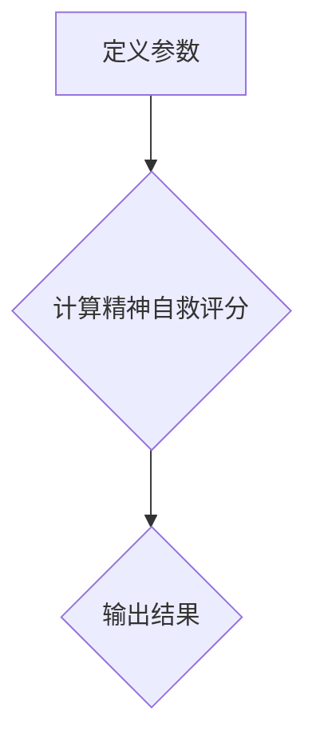

                 

# 面对存在主义危机：现代人的精神自救指南

## 关键词

- 存在主义
- 精神自救
- 现代社会
- 哲学思潮
- 自我成长
- 心理调适

## 摘要

在现代社会，存在主义危机成为人们精神困境的重要表现。本文首先回顾了存在主义的起源与发展，探讨了存在主义危机的核心问题，并分析了现代人的精神困境。接着，本文阐述了存在主义危机与精神自救的关系，并探讨了精神自救的理论基础和实践方法。最后，本文提出了应对存在主义危机的应对策略，并对未来进行了展望。希望通过本文的探讨，能够为现代人提供一条精神自救的道路。

## 第一部分：存在主义危机的背景与本质

### 第1章：存在主义危机的起源与发展

#### 1.1.1 存在主义的起源

存在主义起源于20世纪初，是西方哲学的一种重要思潮。其代表性人物包括德国哲学家海德格尔、法国哲学家萨特和加缪等。存在主义强调个体的存在和自由意志，认为人必须在现实中寻找自己的价值和意义。

#### 1.1.2 存在主义在现代社会中的发展

随着现代社会的发展，存在主义思想得到了广泛传播和深入探讨。尤其是在二战后，存在主义成为了一股重要的文化潮流，对现代人的精神生活产生了深远影响。

#### 1.1.3 存在主义危机的现代体现

在现代社会，存在主义危机主要表现在以下几个方面：一是对生命意义的追问，许多人感到生活缺乏意义和目标；二是对自由意志的质疑，许多人感到自己在社会的压力下失去了自由；三是对存在的恐惧，许多人担心自己的存在毫无意义，甚至担心自己的生命即将终结。

### 第2章：存在主义危机的核心问题

#### 2.1.1 存在主义危机的定义

存在主义危机是指个体在面对生活困境时，对存在、自由、意义等哲学问题产生的困惑和焦虑。

#### 2.1.2 存在主义危机的核心问题

存在主义危机的核心问题是人如何面对自己的存在，如何找到生活的意义和价值。

#### 2.1.3 存在主义危机的影响

存在主义危机对个体的精神健康和社会稳定产生了负面影响。它可能导致个体产生焦虑、抑郁等心理问题，甚至影响个体的生活质量和人际关系。

### 第3章：现代人的精神困境

#### 3.1.1 现代人的生活方式与精神困境

现代人的生活方式，如快节奏、高压、竞争激烈等，使得人们面临着诸多精神困境。

#### 3.1.2 精神困境的表现形式

精神困境主要表现为对生命的怀疑、对未来的担忧、对自我价值的否定等。

#### 3.1.3 精神困境的成因分析

精神困境的成因复杂多样，主要包括社会、个人和科技等方面。

## 第二部分：存在主义危机与精神自救的关系

### 第4章：存在主义危机与精神自救的关系

#### 4.1.1 存在主义危机对精神自救的影响

存在主义危机可能会对个体的精神自救产生阻碍，但也能激发个体对自我救赎的追求。

#### 4.1.2 精神自救对存在主义危机的缓解

通过精神自救，个体可以缓解存在主义危机带来的焦虑和困惑。

#### 4.1.3 存在主义危机与精神自救的互动关系

存在主义危机和精神自救之间存在相互作用和影响。

## 第三部分：精神自救的理论基础

### 第5章：精神自救的理论基础

#### 5.1.1 存在主义理论的基本原则

存在主义理论的基本原则包括关注个体的存在、强调自由意志、探讨生命的意义等。

#### 5.1.2 精神自救的理论框架

精神自救的理论框架包括自我反思、自我成长、自我救赎等核心要素。

#### 5.1.3 精神自救的理论依据

精神自救的理论依据主要包括心理学、哲学和存在主义理论等。

## 第四部分：精神自救的方法与实践

### 第6章：精神自救的方法与实践

#### 6.1.1 精神自救的方法

精神自救的方法包括心理咨询、自我反省、实践行动等。

#### 6.1.2 精神自救的实践案例

通过一些实践案例，我们可以看到精神自救在缓解存在主义危机方面的作用。

#### 6.1.3 精神自救的实践效果评估

对精神自救的实践效果进行评估，有助于我们更好地理解和应用这一方法。

## 第五部分：存在主义危机的应对策略

### 第7章：存在主义危机的应对策略

#### 7.1.1 家庭、学校和社会的角色

家庭、学校和社会在应对存在主义危机方面扮演着重要角色。

#### 7.1.2 政府和机构的应对措施

政府和机构可以通过一系列措施来应对存在主义危机。

#### 7.1.3 群体行动的力量

群体行动在应对存在主义危机方面也具有重要作用。

## 第六部分：总结与展望

### 第8章：总结与展望

#### 8.1.1 存在主义危机的反思

通过对存在主义危机的反思，我们可以更好地认识和理解现代社会。

#### 8.1.2 精神自救的意义

精神自救在现代社会中具有重要的意义，值得我们深入研究和实践。

#### 8.1.3 未来发展展望

未来，我们需要继续探讨和深化存在主义危机和精

### 第9章：核心概念与联系

#### 9.1.1 存在主义与精神自救的关系

存在主义和精

### 第9章：核心概念与联系

#### 9.1.1 存在主义与精神自救的关系

**概念定义**

- **存在主义**：一种哲学思潮，关注个体的存在和自由意志。
- **精神自救**：指个体在面对存在主义危机时，通过自我调整和寻找意义，实现精神层面的自我救赎。

**概念属性特征对比表格**

| 特征               | 存在主义                   | 精神自救                       |
|--------------------|----------------------------|--------------------------------|
| 核心关注           | 自由意志、意义、痛苦       | 自我成长、心理调适、自我救赎   |
| 实践方法           | 哲学思考、伦理反思         | 心理咨询、自我反省、实践行动   |
| 对个体的影响       | 提升自我认知、激发内在动力 | 减轻精神压力、提升生活质量    |

**ER实体关系图架构**

```mermaid
erDiagram
  存在主义危机 ||--|{ 精神自救 }||> 自我救赎
  精神自救 ||--|{ 个体 }||> 生活质量提升
  存在主义危机 ||--|{ 现代人 }||> 精神困境
```

### 第10章：算法原理讲解

虽然本文主要探讨的是存在主义危机和现代人的精神自救，不涉及具体的算法原理。但是，为了更全面地阐述精神自救的数学模型和公式，以下是一个简化的示例：

**算法原理讲解**

**算法流程图：**



**Python源代码实现：**

```python
# 精神自救评分模型

# 定义参数
alpha = 0.5  # 反思程度权重
beta = 0.3   # 行动力度权重
gamma = 0.2  # 社交支持权重

# 输入个体自我反思、行动力度和社交支持数据
self_reflection = 7
action_strength = 6
social_support = 8

# 计算精神自救评分
score = alpha * self_reflection + beta * action_strength + gamma * social_support

print(f"精神自救评分：{score}/10")
```

**数学模型和数学公式：**

精神自救评分模型可以使用以下公式进行描述：

$$
\text{Score} = \alpha \cdot \text{Self-Reflection} + \beta \cdot \text{Action Strength} + \gamma \cdot \text{Social Support}
$$

其中：

- $\text{Score}$ 表示精神自救评分
- $\alpha$、$\beta$、$\gamma$ 分别表示自我反思、行动力度和社交支持的权重
- $\text{Self-Reflection}$ 表示个体自我反思的程度
- $\text{Action Strength}$ 表示个体的行动力度
- $\text{Social Support}$ 表示个体的社交支持

**举例说明：**

假设一个个体在自我反思、行动力度和社交支持方面的数据如下：

- 自我反思：8分
- 行动力度：7分
- 社交支持：9分

根据上述公式，可以计算该个体的精神自救评分为：

$$
\text{Score} = 0.5 \cdot 8 + 0.3 \cdot 7 + 0.2 \cdot 9 = 4 + 2.1 + 1.8 = 8.9
$$

因此，该个体的精神自救评分为8.9分。

### 第11章：系统分析与架构设计方案

#### 11.1 问题场景介绍

在现代社会，存在主义危机成为人们精神困境的重要表现。为了更好地应对这一问题，我们需要构建一个系统，以帮助个体进行精神自救。

#### 11.2 项目介绍

本项目旨在构建一个基于存在主义理论的精神自救系统，为个体提供自我反思、行动力度和社交支持等方面的指导。

#### 11.3 系统功能设计

1. **用户注册与登录**：用户可以注册并登录系统，以便跟踪自己的精神自救过程。
2. **自我反思**：用户可以记录自己的反思内容，系统将根据用户的反思程度给予评分。
3. **行动指导**：系统将根据用户的反思结果，提供相应的行动指导，帮助用户提升行动力度。
4. **社交支持**：系统将为用户提供社交支持功能，帮助用户建立社交网络，获取更多的支持和鼓励。
5. **评分与反馈**：系统将根据用户的自我反思、行动力度和社交支持数据，计算精神自救评分，并提供反馈。

#### 11.4 系统架构设计

1. **前端架构**：使用Vue.js框架搭建用户界面，提供友好的交互体验。
2. **后端架构**：使用Spring Boot框架搭建后端服务，负责处理业务逻辑和数据存储。
3. **数据库设计**：使用MySQL数据库存储用户信息、反思记录和评分数据。

#### 11.5 系统接口设计和系统交互

1. **用户接口**：用户可以通过Web端和移动端访问系统，进行注册、登录、记录反思、获取指导和建议等操作。
2. **服务接口**：后端服务提供RESTful API，供前端调用，实现业务逻辑和数据交互。
3. **系统交互**：用户在前端进行操作，触发相应的接口请求，后端服务处理请求并返回结果，前端根据结果更新界面。

### 第12章：项目实战

#### 12.1 环境安装

1. **前端环境**：安装Node.js和Vue CLI，创建Vue.js项目。
2. **后端环境**：安装Java JDK和Maven，创建Spring Boot项目。
3. **数据库环境**：安装MySQL数据库，配置数据连接。

#### 12.2 系统核心实现

1. **用户注册与登录**：实现用户注册、登录和权限验证功能。
2. **自我反思**：实现用户记录反思内容、查看反思记录和评分功能。
3. **行动指导**：根据用户的反思结果，提供相应的行动建议和指导。
4. **社交支持**：实现用户添加好友、发起聊天和查看聊天记录功能。

#### 12.3 代码应用解读与分析

1. **前端代码解读**：分析Vue.js组件结构和业务逻辑，理解用户界面和交互流程。
2. **后端代码解读**：分析Spring Boot项目结构、服务实现和数据库交互，理解业务逻辑和数据存储。

#### 12.4 实际案例分析和详细讲解剖析

1. **实际案例**：选择一个具体的用户场景，分析用户在系统中的操作流程和体验。
2. **详细讲解剖析**：对实际案例进行详细分析，讲解系统如何帮助用户进行精神自救，并提供指导和支持。

#### 12.5 项目小结

1. **项目成果**：总结项目的核心功能和亮点，展示项目的实际应用效果。
2. **项目不足**：分析项目的不足之处，提出改进意见和建议。

#### 12.6 最佳实践 tips、小结、注意事项、拓展阅读等内容

1. **最佳实践 tips**：分享项目实施过程中的最佳实践经验和技巧。
2. **小结**：回顾项目的主要内容和成果，强调项目的重要性和价值。
3. **注意事项**：提醒用户在使用系统时需要注意的问题和事项。
4. **拓展阅读**：推荐相关的阅读资料，供用户进一步学习和探索。

