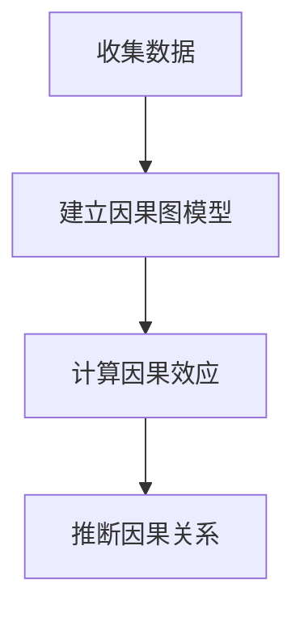
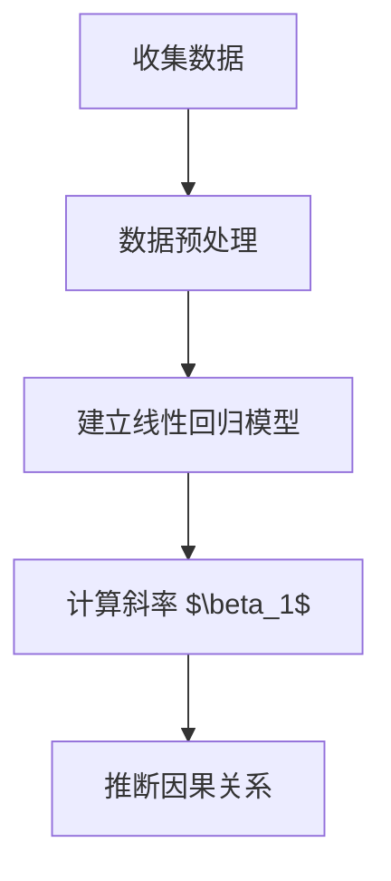
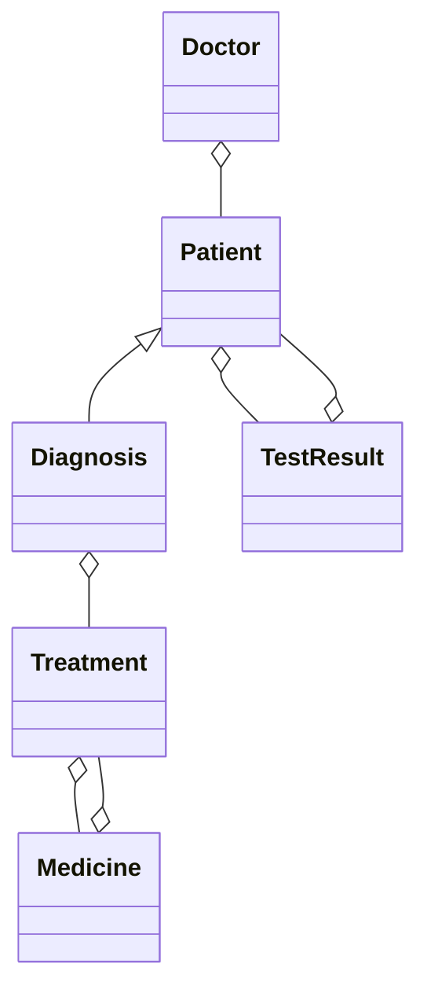
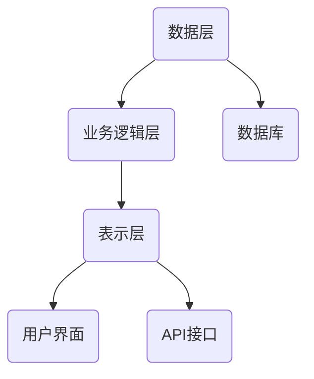
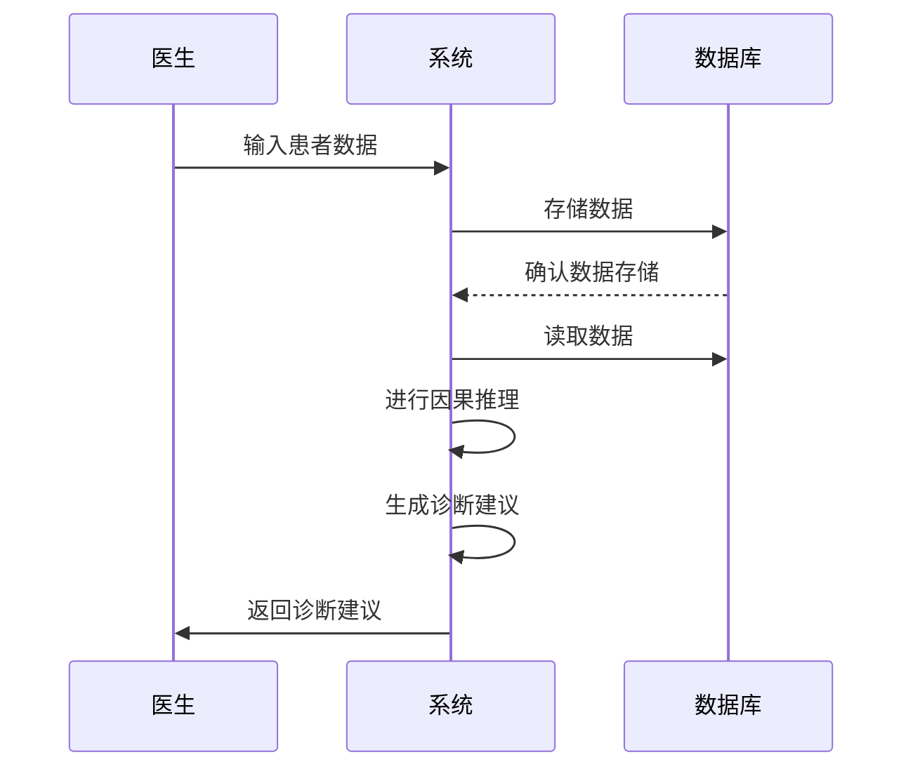

                 

### 第一部分：背景介绍

## 1.1 问题背景

在人工智能（AI）的发展历程中，从传统的基于规则系统到现代的深度学习，我们见证了技术的飞速进步。然而，即便是在这些先进的技术中，我们依然面临着一些关键问题。其中之一就是如何准确地进行因果推理。因果推理是理解变量之间因果关系的一种方法，它超越了简单的相关性分析，对于许多实际应用场景具有重要意义。

在现实世界中，许多现象并非简单地通过相关性来描述，而是需要了解其内在的因果机制。例如，在医疗诊断中，了解药物与疾病之间的因果关系对于制定有效的治疗方案至关重要。在金融领域中，评估客户的风险等级时，仅仅知道某些行为与风险之间的相关性是不够的，我们更需要了解这些行为是如何影响风险等级的。因此，因果推理成为了一个亟待解决的关键问题。

## 1.2 问题描述

因果推理的核心问题是，如何从观测数据中推断出变量之间的因果关系。具体来说，问题描述可以归纳为以下几点：

1. **变量识别**：识别数据集中的关键变量，并确定它们之间的潜在关系。
2. **因果识别**：从变量之间的关系中推断出因果关系。
3. **因果量化**：量化变量之间的因果关系强度。
4. **因果解释**：给出因果关系背后的逻辑解释。

在实际应用中，因果推理面临以下几个挑战：

- **混杂因素**：数据中的混杂因素可能会干扰因果关系的推断，需要有效的方法来处理。
- **数据缺失**：实际数据中常常存在缺失值，这对因果推理带来了额外的困难。
- **模型选择**：选择合适的模型来表示因果关系是关键，但不同的模型适用于不同的场景。
- **数据量与计算成本**：大量数据和高计算成本使得因果推理算法的应用变得复杂。

## 1.3 问题解决

针对因果推理中的挑战，近年来出现了多种方法和技术，主要包括以下几种：

1. **基于统计学习的方法**：这种方法通过分析数据中的相关性，来推测变量之间的因果关系。常见的统计学习方法包括回归分析、潜在变量模型、结构方程模型等。
2. **基于模型的因果推理方法**：这种方法通过建立数学模型，来直接表示变量之间的因果关系。常见的模型包括因果图、多变量因果模型等。
3. **图神经网络方法**：这种方法利用图结构来表示变量之间的关系，通过图学习算法来推断因果关系。图神经网络在处理复杂关系和大规模数据方面具有优势。
4. **反事实推理方法**：这种方法通过模拟不同的因果情景，来推断变量之间的因果关系。反事实推理在处理复杂因果结构和数据缺失问题时尤为有效。

这些方法各有优缺点，需要根据具体应用场景来选择合适的方法。在实际应用中，还需要结合多种方法和技术，以应对复杂多变的现实问题。

## 1.4 边界与外延

因果推理不仅是一个技术问题，它还涉及到多个学科的理论和方法。以下是因果推理的边界与外延：

1. **哲学**：哲学中的因果律讨论了因果关系的本质和属性，为因果推理提供了理论基础。
2. **经济学**：经济学中的因果分析涉及到政策评估、市场研究等领域，因果推理方法在经济学中的应用已经得到了广泛研究。
3. **心理学**：心理学中的实验设计和因果推理方法在研究个体行为和心理机制方面具有重要意义。
4. **医学**：医学中的因果推理对于疾病诊断、治疗方案的制定和公共卫生政策的制定具有关键作用。

因果推理的这些边界与外延使得它成为一个跨学科的领域，需要综合考虑多个学科的理论和方法，以实现更加准确和可靠的因果推断。

## 1.5 概念结构与核心要素组成

因果推理的核心概念和要素包括以下几个方面：

1. **因果关系**：因果关系是因果推理的核心概念，它描述了变量之间的因果关联。
2. **相关性**：相关性是变量之间的统计关联，是因果推理的重要参考依据。
3. **混杂因素**：混杂因素是那些既与自变量相关，又与因变量相关的变量，它可能会干扰因果关系的推断。
4. **潜在结果**：潜在结果是不同因果作用下个体可能会产生的结果，是因果推理中的关键概念。
5. **因果模型**：因果模型是用来表示变量之间因果关系的一种数学模型，是进行因果推理的重要工具。

这些概念和要素共同构成了因果推理的理论基础，为实际应用提供了指导和工具。

### 《AI中的因果推理：超越相关性分析》

---

# 第一部分：背景介绍

## 1.1 问题背景

因果推理是人工智能（AI）领域中一个关键且复杂的主题。随着AI技术在各个领域的深入应用，人们越来越意识到，仅仅依赖相关性分析来理解和预测现象是远远不够的。在许多场景中，比如医疗诊断、金融风险评估、教育决策等领域，了解和预测因果关系比单纯的相关性更为重要。因此，因果推理在AI中的重要性日益凸显。

## 1.2 问题描述

因果推理涉及理解和量化不同变量之间的因果关系，而不仅仅是它们之间的相关性。如何准确地进行因果推断，如何处理数据中的混杂因素，如何从复杂的模型中提取因果关系等，都是当前AI研究中的热点和难点问题。

## 1.3 问题解决

针对因果推理中的挑战，近年来出现了多种方法和技术，包括基于统计学习的因果推断方法、基于模型的因果推理方法、以及利用图神经网络等方法。这些方法在理论上各有优势和局限性，在实际应用中也面临着诸多问题。

## 1.4 边界与外延

因果推理不仅涉及统计和机器学习领域，还与哲学、经济学、心理学等学科有着紧密的联系。因此，在研究因果推理时，需要综合考虑多个学科的理论和方法。

## 1.5 概念结构与核心要素组成

因果推理的核心概念包括：因果关系、相关性、混杂因素、潜在结果、因果模型等。这些概念共同构成了因果推理的理论基础。

---

# 第二部分：核心概念与联系

因果推理的核心在于理解变量之间的因果关系，而非简单的相关性。因此，深入探讨因果关系、相关性、混杂因素、潜在结果和因果模型等核心概念，是进行有效因果推理的基础。

## 2.1 因果关系原理

### 2.1.1 因果关系的定义

因果关系是指一个事件（自变量）导致另一个事件（因变量）发生的现象。在因果推理中，因果关系被描述为变量之间的因果关系，即一个变量（因变量）的变化是由另一个变量（自变量）的变化所引起的。

### 2.1.2 因果关系的属性

1. **时间顺序性**：因果关系具有时间顺序性，即自变量必须先于因变量发生。例如，在医学诊断中，患者服用药物（自变量）后出现好转（因变量）表明药物是好转的原因。
2. **依赖性**：因果关系描述的是变量之间的依赖关系，即一个变量的变化会导致另一个变量的变化。例如，在经济学中，经济增长（自变量）可能导致失业率下降（因变量）。
3. **一致性和独立性**：因果关系在不同情境下应保持一致性和独立性。例如，在一个实验中，如果自变量变化导致因变量变化，那么在其他情境下，这种因果关系也应保持一致。

### 2.1.3 因果关系与相关性的区别

因果关系与相关性是两个不同的概念。相关性描述的是变量之间的统计关联，而因果关系描述的是变量之间的因果关联。

1. **相关性**：相关性指的是两个变量之间变化的关联程度。例如，身高与体重之间存在正相关关系，即身高增加，体重也增加。
2. **因果关系**：因果关系描述的是一个变量导致另一个变量发生变化的关系。例如，药物服用与疾病好转之间存在因果关系，即药物服用导致疾病好转。

相关性是因果关系的必要但不充分条件。一个变量与另一个变量相关，并不意味着它们之间存在因果关系。例如，天气变暖与冰淇淋销售量增加之间存在相关性，但并不能说明天气变暖导致冰淇淋销售量增加。

### 2.1.4 因果关系的分类

因果关系可以根据不同的标准进行分类：

1. **直接因果关系**：直接因果关系指的是变量之间的直接联系，例如，吸烟导致肺癌。
2. **间接因果关系**：间接因果关系指的是通过其他变量实现的因果关系，例如，锻炼身体可能通过提高免疫力来间接降低患病风险。
3. **复杂因果关系**：复杂因果关系指的是多个变量之间的相互影响，例如，社会经济发展、教育资源和个人努力共同影响学生的学业成绩。

## 2.2 混杂因素

### 2.2.1 混杂因素的定义

混杂因素是指那些既与自变量相关，又与因变量相关的变量。在因果推理中，混杂因素可能会干扰因果关系的推断，因此需要特别处理。

### 2.2.2 混杂因素的属性

1. **普遍性**：混杂因素在数据集中普遍存在，可能会影响多个变量之间的关系。
2. **复杂性**：混杂因素可能具有复杂的统计属性，难以直接识别和处理。
3. **动态性**：混杂因素可能会随着时间或情境的变化而变化，增加了因果推理的复杂性。

### 2.2.3 混杂因素的处理方法

处理混杂因素的方法包括：

1. **匹配法**：通过匹配实验组和对照组中的混杂因素，来减少混杂因素对因果关系的干扰。
2. **回归法**：通过回归分析来消除混杂因素对因变量的影响，从而更准确地估计因果关系。
3. **工具变量法**：使用工具变量来代替混杂因素，以消除其对因果关系的干扰。

### 2.2.4 混杂因素的重要性

混杂因素在因果推理中具有重要意义。正确处理混杂因素可以更准确地估计因果关系，提高因果推断的可靠性。例如，在医疗研究中，如果不处理混杂因素，可能会导致错误的治疗决策。

## 2.3 潜在结果

### 2.3.1 潜在结果的定义

潜在结果是指在不同因果作用下，个体可能会产生的不同结果。在因果推理中，潜在结果是用于比较不同因果效果的重要概念。

### 2.3.2 潜在结果的属性

1. **不确定性**：潜在结果具有不确定性，因为因果关系可能受到多种因素的影响。
2. **异质性**：不同个体在相同因果作用下的潜在结果可能不同，即潜在结果具有异质性。
3. **多样性**：潜在结果可能包含多种可能的结果，增加了因果推理的复杂性。

### 2.3.3 潜在结果的计算方法

计算潜在结果的方法包括：

1. **反事实推理**：通过模拟不同的因果情景，来推断潜在结果。
2. **因果模型推理**：通过建立因果模型，来计算潜在结果。
3. **实验设计**：通过实验来观察不同因果情景下的潜在结果。

### 2.3.4 潜在结果的重要性

潜在结果在因果推理中具有重要意义。通过比较潜在结果，可以评估不同因果作用的效果，为决策提供依据。例如，在医疗诊断中，通过比较不同治疗方案下的潜在结果，可以帮助医生选择最佳治疗方案。

## 2.4 因果模型

### 2.4.1 因果模型的定义

因果模型是用来表示变量之间因果关系的一种数学模型。因果模型可以用来量化因果关系，评估不同因果作用的效果。

### 2.4.2 因果模型的属性

1. **结构化**：因果模型通常具有明确的结构，描述变量之间的因果关系。
2. **参数化**：因果模型中的参数可以用来量化因果关系，从而实现因果推断。
3. **预测性**：因果模型可以用来预测未来的因果关系，为决策提供依据。

### 2.4.3 因果模型的应用

因果模型广泛应用于各个领域，包括：

1. **医疗诊断**：通过因果模型，可以更准确地预测疾病风险和治疗效果。
2. **金融风险评估**：通过因果模型，可以评估不同行为对风险的影响。
3. **教育决策**：通过因果模型，可以评估不同教育干预的效果。

### 2.4.4 常见的因果模型

常见的因果模型包括：

1. **因果图**：通过图结构表示变量之间的因果关系，适用于处理复杂变量关系。
2. **多变量因果模型**：通过多元回归模型表示变量之间的因果关系，适用于线性关系的分析。
3. **结构方程模型**：通过结构方程表示变量之间的因果关系，适用于处理多元线性关系和非线性关系。

## 2.5 因果推理方法分类

因果推理方法可以根据不同的标准进行分类：

1. **基于统计学习的方法**：通过分析数据中的相关性，推测变量之间的因果关系。
2. **基于模型的因果推理方法**：通过建立数学模型，直接表示变量之间的因果关系。
3. **图神经网络方法**：通过图结构表示变量之间的因果关系，利用图学习算法进行因果推断。
4. **反事实推理方法**：通过模拟不同的因果情景，推断变量之间的因果关系。

每种方法都有其适用范围和局限性，需要根据具体应用场景选择合适的方法。

### 第二部分：核心概念与联系

因果推理是AI领域中一个关键且复杂的主题。为了更好地理解因果推理，我们需要深入探讨其核心概念与联系。在本节中，我们将详细介绍因果关系、相关性、混杂因素、潜在结果和因果模型等核心概念，并分析它们之间的相互关系。

## 2.1 因果关系原理

因果关系是因果推理的核心概念，它描述了一个事件（自变量）如何影响另一个事件（因变量）的发生。因果关系具有时间顺序性、依赖性和一致性等属性。

### 2.1.1 因果关系的定义

因果关系是指一个事件（自变量）导致另一个事件（因变量）发生的现象。在因果推理中，我们通常用变量来表示事件，例如，用$X$表示自变量，用$Y$表示因变量。

### 2.1.2 因果关系的属性

1. **时间顺序性**：因果关系具有时间顺序性，即自变量必须先于因变量发生。这意味着因果关系不是同时发生的，而是有先后顺序的。例如，在医疗诊断中，患者服用药物（自变量）后出现好转（因变量），表明药物是好转的原因。

2. **依赖性**：因果关系描述的是变量之间的依赖关系，即一个变量的变化会导致另一个变量的变化。例如，在经济学中，经济增长（自变量）可能导致失业率下降（因变量）。

3. **一致性和独立性**：因果关系在不同情境下应保持一致性和独立性。这意味着，如果一个因果关系在一个情境下成立，那么在其他情境下也应成立。例如，在一个实验中，如果自变量变化导致因变量变化，那么在其他情境下，这种因果关系也应保持一致。

### 2.1.3 因果关系与相关性的区别

因果关系与相关性是两个不同的概念。相关性描述的是变量之间的统计关联，而因果关系描述的是变量之间的因果关联。

1. **相关性**：相关性指的是两个变量之间变化的关联程度。例如，身高与体重之间存在正相关关系，即身高增加，体重也增加。

2. **因果关系**：因果关系描述的是一个变量导致另一个变量发生变化的关系。例如，药物服用与疾病好转之间存在因果关系，即药物服用导致疾病好转。

相关性是因果关系的必要但不充分条件。一个变量与另一个变量相关，并不意味着它们之间存在因果关系。例如，天气变暖与冰淇淋销售量增加之间存在相关性，但并不能说明天气变暖导致冰淇淋销售量增加。

### 2.1.4 因果关系的分类

因果关系可以根据不同的标准进行分类：

1. **直接因果关系**：直接因果关系指的是变量之间的直接联系，例如，吸烟导致肺癌。

2. **间接因果关系**：间接因果关系指的是通过其他变量实现的因果关系，例如，锻炼身体可能通过提高免疫力来间接降低患病风险。

3. **复杂因果关系**：复杂因果关系指的是多个变量之间的相互影响，例如，社会经济发展、教育资源和个人努力共同影响学生的学业成绩。

## 2.2 混杂因素

混杂因素是那些既与自变量相关，又与因变量相关的变量。在因果推理中，混杂因素可能会干扰因果关系的推断，因此需要特别处理。

### 2.2.1 混杂因素的定义

混杂因素是指那些既与自变量相关，又与因变量相关的变量。在因果推理中，混杂因素可能会干扰因果关系的推断，因此需要特别处理。

### 2.2.2 混杂因素的属性

1. **普遍性**：混杂因素在数据集中普遍存在，可能会影响多个变量之间的关系。

2. **复杂性**：混杂因素可能具有复杂的统计属性，难以直接识别和处理。

3. **动态性**：混杂因素可能会随着时间或情境的变化而变化，增加了因果推理的复杂性。

### 2.2.3 混杂因素的处理方法

处理混杂因素的方法包括：

1. **匹配法**：通过匹配实验组和对照组中的混杂因素，来减少混杂因素对因果关系的干扰。

2. **回归法**：通过回归分析来消除混杂因素对因变量的影响，从而更准确地估计因果关系。

3. **工具变量法**：使用工具变量来代替混杂因素，以消除其对因果关系的干扰。

### 2.2.4 混杂因素的重要性

混杂因素在因果推理中具有重要意义。正确处理混杂因素可以更准确地估计因果关系，提高因果推断的可靠性。例如，在医疗研究中，如果不处理混杂因素，可能会导致错误的治疗决策。

## 2.3 潜在结果

潜在结果是指在不同因果作用下，个体可能会产生的不同结果。在因果推理中，潜在结果是用于比较不同因果效果的重要概念。

### 2.3.1 潜在结果的定义

潜在结果是指在不同因果作用下，个体可能会产生的不同结果。在因果推理中，潜在结果是用于比较不同因果效果的重要概念。

### 2.3.2 潜在结果的属性

1. **不确定性**：潜在结果具有不确定性，因为因果关系可能受到多种因素的影响。

2. **异质性**：不同个体在相同因果作用下的潜在结果可能不同，即潜在结果具有异质性。

3. **多样性**：潜在结果可能包含多种可能的结果，增加了因果推理的复杂性。

### 2.3.3 潜在结果的计算方法

计算潜在结果的方法包括：

1. **反事实推理**：通过模拟不同的因果情景，来推断潜在结果。

2. **因果模型推理**：通过建立因果模型，来计算潜在结果。

3. **实验设计**：通过实验来观察不同因果情景下的潜在结果。

### 2.3.4 潜在结果的重要性

潜在结果在因果推理中具有重要意义。通过比较潜在结果，可以评估不同因果作用的效果，为决策提供依据。例如，在医疗诊断中，通过比较不同治疗方案下的潜在结果，可以帮助医生选择最佳治疗方案。

## 2.4 因果模型

因果模型是用来表示变量之间因果关系的一种数学模型。因果模型可以用来量化因果关系，评估不同因果作用的效果。

### 2.4.1 因果模型的定义

因果模型是用来表示变量之间因果关系的一种数学模型。因果模型可以用来量化因果关系，评估不同因果作用的效果。

### 2.4.2 因果模型的属性

1. **结构化**：因果模型通常具有明确的结构，描述变量之间的因果关系。

2. **参数化**：因果模型中的参数可以用来量化因果关系，从而实现因果推断。

3. **预测性**：因果模型可以用来预测未来的因果关系，为决策提供依据。

### 2.4.3 因果模型的应用

因果模型广泛应用于各个领域，包括：

1. **医疗诊断**：通过因果模型，可以更准确地预测疾病风险和治疗效果。

2. **金融风险评估**：通过因果模型，可以评估不同行为对风险的影响。

3. **教育决策**：通过因果模型，可以评估不同教育干预的效果。

### 2.4.4 常见的因果模型

常见的因果模型包括：

1. **因果图**：通过图结构表示变量之间的因果关系，适用于处理复杂变量关系。

2. **多变量因果模型**：通过多元回归模型表示变量之间的因果关系，适用于线性关系的分析。

3. **结构方程模型**：通过结构方程表示变量之间的因果关系，适用于处理多元线性关系和非线性关系。

## 2.5 因果推理方法分类

因果推理方法可以根据不同的标准进行分类：

1. **基于统计学习的方法**：通过分析数据中的相关性，推测变量之间的因果关系。

2. **基于模型的因果推理方法**：通过建立数学模型，直接表示变量之间的因果关系。

3. **图神经网络方法**：通过图结构表示变量之间的因果关系，利用图学习算法进行因果推断。

4. **反事实推理方法**：通过模拟不同的因果情景，推断变量之间的因果关系。

每种方法都有其适用范围和局限性，需要根据具体应用场景选择合适的方法。

### 第三部分：算法原理讲解

在因果推理中，算法原理是关键部分。本节将详细介绍两种主要的因果推理方法：基于统计学习的因果推断方法和基于模型的因果推理方法。我们将通过数学模型和流程图来阐述这些方法的原理，并通过具体案例来说明其应用。

#### 3.1 基于统计学习的因果推断方法

基于统计学习的因果推断方法主要通过分析数据中的相关性来推测变量之间的因果关系。这种方法的核心在于利用统计模型来估计变量之间的依赖关系，并从中推断出可能的因果关系。

##### 3.1.1 算法原理

基于统计学习的因果推断方法的核心是建立回归模型，通过分析自变量和因变量之间的线性关系来推测因果关系。最常用的回归模型是线性回归模型，其数学模型如下：

$$
Y = \beta_0 + \beta_1X + \epsilon
$$

其中，$Y$ 是因变量，$X$ 是自变量，$\beta_0$ 是截距，$\beta_1$ 是斜率，$\epsilon$ 是误差项。通过估计 $\beta_1$ 的值，我们可以推测自变量 $X$ 对因变量 $Y$ 的影响。

##### 3.1.2 数学模型

线性回归模型的数学公式如下：

$$
\beta_1 = \frac{\sum(X_i - \bar{X})(Y_i - \bar{Y})}{\sum(X_i - \bar{X})^2}
$$

其中，$\bar{X}$ 和 $\bar{Y}$ 分别是 $X$ 和 $Y$ 的均值。

##### 3.1.3 流程图

基于统计学习的因果推断方法的一般流程如下：


##### 3.1.4 举例说明

假设我们想研究某种药物（$X$）对疾病好转（$Y$）的影响。通过收集患者服用药物的数据和疾病好转的数据，我们可以建立线性回归模型：

$$
Y = \beta_0 + \beta_1X + \epsilon
$$

通过计算斜率 $\beta_1$，我们可以推测药物服用对疾病好转的影响。例如，如果 $\beta_1$ 的估计值为正，那么我们可以认为药物服用对疾病好转有积极影响。

#### 3.2 基于模型的因果推理方法

基于模型的因果推理方法通过建立数学模型来直接表示变量之间的因果关系。这种方法的核心在于利用结构化的模型来描述变量之间的关系，并从中推断出因果关系。

##### 3.2.1 算法原理

基于模型的因果推理方法的核心是建立因果图模型。因果图是一种图形模型，它通过节点和边来表示变量之间的因果关系。在因果图中，每个节点表示一个变量，每条边表示两个变量之间的因果关系。

因果图模型的一般形式如下：

$$
Y = f(X, Z) + \epsilon
$$

其中，$X$ 是自变量，$Y$ 是因变量，$Z$ 是混杂因素，$f$ 是函数，$\epsilon$ 是误差项。通过分析因果图，我们可以推断出变量之间的因果关系。

##### 3.2.2 数学模型

因果图模型的数学表示如下：

$$
\begin{align*}
Y &= \beta_0 + \beta_1X + \beta_2Z + \epsilon \\
Z &= \gamma_0 + \gamma_1X + \epsilon
\end{align*}
$$

其中，$\beta_1$ 和 $\beta_2$ 分别表示自变量 $X$ 对因变量 $Y$ 和混杂因素 $Z$ 的影响，$\gamma_1$ 表示自变量 $X$ 对混杂因素 $Z$ 的影响。

##### 3.2.3 流程图

基于模型的因果推理方法的一般流程如下：



##### 3.2.4 举例说明

假设我们想研究药物（$X$）对疾病好转（$Y$）的影响，同时考虑到患者年龄（$Z$）可能是一个混杂因素。我们可以建立一个因果图模型，如下：

```
Y --> X
Y --> Z
X --> Z
```

通过计算因果效应，我们可以推断出药物对疾病好转的影响，同时考虑到患者年龄的混杂影响。例如，如果计算结果显示 $\beta_1$ 的值较大，而 $\beta_2$ 的值较小，那么我们可以认为药物对疾病好转有显著影响，而患者年龄的混杂影响较小。

### 第三部分：算法原理讲解

#### 3.1 基于统计学习的因果推断方法

因果推断方法在统计学习中占据着重要地位，它不仅仅关注变量间的统计关联，更侧重于揭示变量间的因果关系。在基于统计学习的因果推断方法中，线性回归模型是最常用的模型之一。以下，我们将详细讲解线性回归模型在因果推断中的应用。

##### 3.1.1 算法原理

线性回归模型的核心是通过拟合数据，来估计自变量对因变量的影响。在因果推断中，线性回归模型被用来估计自变量的因果效应。线性回归模型的基本形式为：

$$
Y = \beta_0 + \beta_1X + \epsilon
$$

其中，$Y$ 表示因变量，$X$ 表示自变量，$\beta_0$ 是截距，$\beta_1$ 是斜率，$\epsilon$ 是误差项。在这个模型中，斜率 $\beta_1$ 量化了自变量 $X$ 对因变量 $Y$ 的影响。具体来说，$\beta_1$ 的估计值可以告诉我们，当自变量 $X$ 变化一个单位时，因变量 $Y$ 将如何变化。

##### 3.1.2 数学模型

为了更深入地理解线性回归模型，我们可以进一步探讨其数学公式。线性回归模型的估计公式为：

$$
\beta_1 = \frac{\sum(X_i - \bar{X})(Y_i - \bar{Y})}{\sum(X_i - \bar{X})^2}
$$

其中，$\bar{X}$ 和 $\bar{Y}$ 分别是自变量 $X$ 和因变量 $Y$ 的样本均值，$X_i$ 和 $Y_i$ 分别是每个样本的自变量和因变量值。

##### 3.1.3 流程图

基于统计学习的因果推断方法的一般流程可以概括如下：



在数据预处理阶段，我们首先需要收集相关的数据，并对数据进行清洗和预处理，以确保数据的质量。接下来，我们建立线性回归模型，并使用最小二乘法来计算斜率 $\beta_1$。最后，根据斜率的估计值，我们推断自变量 $X$ 对因变量 $Y$ 的影响。

##### 3.1.4 举例说明

为了更好地理解线性回归模型在因果推断中的应用，我们来看一个具体的例子。假设我们研究某种药物（$X$）对癌症患者生存时间（$Y$）的影响。通过收集患者的数据，我们可以建立一个线性回归模型：

$$
Y = \beta_0 + \beta_1X + \epsilon
$$

在这个模型中，$X$ 表示患者是否服用该药物（1 表示服用，0 表示未服用），$Y$ 表示患者的生存时间（以月为单位）。通过收集到的数据，我们计算斜率 $\beta_1$，从而推断药物对生存时间的影响。

例如，如果计算得到的斜率 $\beta_1$ 为 2，那么我们可以推断，服用该药物的患者比未服用的患者平均生存时间增加了 2 个月。这个结论为我们提供了药物对癌症患者生存时间的因果证据。

#### 3.2 基于模型的因果推理方法

与基于统计学习的因果推断方法不同，基于模型的因果推理方法直接通过数学模型来描述变量之间的因果关系。因果图模型是其中一种广泛应用的方法，它通过图结构来表示变量间的因果关系。以下，我们将详细讲解因果图模型及其在因果推理中的应用。

##### 3.2.1 算法原理

因果图模型（Causal Graphical Model，简称CGM）是一种基于概率论的图形模型，用于表示变量间的因果关系。在因果图模型中，每个节点代表一个变量，节点之间的边表示变量之间的因果关系。因果图模型的核心思想是，通过观察变量间的依赖关系，来推断变量间的因果关系。

因果图模型的一般形式为：

$$
P(Y|X, Z) = P(Y|X)P(X|Z)P(Z)
$$

其中，$Y$ 是因变量，$X$ 是自变量，$Z$ 是混杂因素。这个公式表明，变量 $Y$ 的概率分布可以分解为 $Y$ 对 $X$ 的条件概率分布、$X$ 对 $Z$ 的条件概率分布以及 $Z$ 的概率分布的乘积。

##### 3.2.2 数学模型

因果图模型的数学表示通常使用图论中的图结构来表示。在因果图模型中，每个节点表示一个变量，节点之间的边表示变量之间的因果关系。因果图的表示形式如下：

```
Y --> X --> Z
```

在这个因果图中，$Y$ 受到 $X$ 的影响，$X$ 受到 $Z$ 的影响。通过这个图结构，我们可以推断出变量间的因果关系。

##### 3.2.3 流程图

基于模型的因果推理方法的一般流程可以概括如下：


在数据收集阶段，我们首先需要收集相关的数据，并对数据进行预处理。接下来，我们根据数据建立因果图模型。在模型建立之后，我们使用参数估计方法来计算因果效应，从而推断变量间的因果关系。

##### 3.2.4 举例说明

为了更好地理解因果图模型在因果推理中的应用，我们来看一个具体的例子。假设我们研究某种药物（$X$）对疾病好转（$Y$）的影响，同时考虑患者年龄（$Z$）作为混杂因素。我们可以建立以下因果图模型：

```
Y --> X
Y --> Z
X --> Z
```

在这个因果图中，$Y$ 受到 $X$ 和 $Z$ 的影响，$X$ 受到 $Z$ 的影响。通过这个模型，我们可以推断出药物对疾病好转的因果效应，同时考虑到患者年龄的混杂影响。

例如，如果计算得到的因果效应表明 $X$ 对 $Y$ 的因果效应为正，而 $Z$ 对 $Y$ 的因果效应为负，那么我们可以推断，药物对疾病好转有积极影响，但患者年龄可能会削弱这种影响。这个结论为我们提供了药物对疾病好转的因果解释。

### 第四部分：数学模型和数学公式 & 详细讲解 &

因果推理在人工智能（AI）领域中是一个关键的研究方向，其核心在于从数据中推断出变量之间的因果关系。在这一部分，我们将深入探讨因果推理中的数学模型和公式，并通过具体的例子来说明这些模型和公式的应用。

#### 4.1 线性回归模型

线性回归模型是因果推理中最基础且广泛使用的模型之一。它通过分析自变量和因变量之间的线性关系来推断因果关系。线性回归模型的数学公式如下：

$$
Y = \beta_0 + \beta_1X + \epsilon
$$

其中，$Y$ 是因变量，$X$ 是自变量，$\beta_0$ 是截距，$\beta_1$ 是斜率，$\epsilon$ 是误差项。

**详细讲解：**

1. **截距 $\beta_0$**：截距是当自变量 $X$ 为 0 时，因变量 $Y$ 的预期值。它表示在没有自变量影响的情况下，因变量的基准水平。
   
2. **斜率 $\beta_1$**：斜率是自变量 $X$ 对因变量 $Y$ 的影响程度。它表示自变量每变化一个单位时，因变量变化的预期值。如果斜率为正，表示自变量和因变量呈正相关；如果斜率为负，表示自变量和因变量呈负相关。

3. **误差项 $\epsilon$**：误差项是模型中未能解释的部分，它包含了所有随机因素的影响。误差项的值越小，模型对数据的拟合度越高。

**举例说明：**

假设我们想要研究某种药物治疗对病人恢复时间的影响。设 $Y$ 为病人的恢复时间（以天为单位），$X$ 为病人是否接受药物治疗（1 表示接受，0 表示未接受）。通过收集数据，我们可以建立线性回归模型：

$$
Y = \beta_0 + \beta_1X + \epsilon
$$

如果计算得到的斜率 $\beta_1$ 为 5，那么我们可以推断，接受药物治疗的患者平均恢复时间比未接受治疗的患者短 5 天。

#### 4.2 多元回归模型

多元回归模型是线性回归模型的扩展，它考虑了多个自变量对因变量的影响。多元回归模型的数学公式如下：

$$
Y = \beta_0 + \beta_1X_1 + \beta_2X_2 + \ldots + \beta_nX_n + \epsilon
$$

其中，$X_1, X_2, \ldots, X_n$ 是多个自变量，$\beta_1, \beta_2, \ldots, \beta_n$ 是各自变量的斜率。

**详细讲解：**

1. **多自变量影响**：在多元回归模型中，每个自变量都有其对应的斜率，这些斜率表示各自变量对因变量的影响程度。例如，如果 $\beta_2$ 的值较大，那么变量 $X_2$ 对因变量 $Y$ 的影响就比其他变量大。

2. **交互项**：在多元回归模型中，还可以引入交互项（$X_1 \times X_2$ 等），来表示两个或多个自变量之间的相互作用。交互项可以进一步细化因果关系。

**举例说明：**

假设我们想要研究病人的恢复时间受哪些因素影响，包括药物治疗（$X_1$）、饮食调整（$X_2$）和运动锻炼（$X_3$）。我们可以建立多元回归模型：

$$
Y = \beta_0 + \beta_1X_1 + \beta_2X_2 + \beta_3X_3 + \epsilon
$$

如果计算得到的 $\beta_1$、$\beta_2$ 和 $\beta_3$ 的值分别为 5、3 和 2，那么我们可以推断，药物治疗使恢复时间平均缩短 5 天，饮食调整使恢复时间平均缩短 3 天，运动锻炼使恢复时间平均缩短 2 天。

#### 4.3 因果图模型

因果图模型是一种基于图论的数学模型，它通过节点和边来表示变量之间的因果关系。因果图模型的数学公式如下：

$$
P(Y|X, Z) = P(Y|X)P(X|Z)P(Z)
$$

其中，$Y$ 是因变量，$X$ 是自变量，$Z$ 是混杂因素。

**详细讲解：**

1. **条件独立性**：因果图模型的核心思想是条件独立性。如果变量 $Y$ 和 $X$ 之间存在因果关系，那么 $Y$ 在给定 $X$ 的条件下与 $Z$ 是条件独立的。

2. **因果关系分解**：通过因果图模型，我们可以将复杂的多变量系统分解为多个简单的关系，从而更容易理解和分析因果关系。

**举例说明：**

假设我们想要研究病人的恢复时间受哪些因素的影响，包括药物治疗（$X$）、病人年龄（$Z$）和医生经验（$W$）。我们可以建立以下因果图模型：

```
Y --> X
Y --> Z
X --> Z
```

在这个因果图中，$Y$ 受到 $X$ 和 $Z$ 的影响，$X$ 受到 $Z$ 的影响。我们可以通过计算因果效应来推断每个变量的影响程度。例如，如果计算得到的 $X$ 对 $Y$ 的因果效应为 5，$Z$ 对 $Y$ 的因果效应为 -2，那么我们可以推断药物治疗对恢复时间有积极影响，而病人年龄可能会对恢复时间产生不利影响。

#### 4.4 潜在结果框架

潜在结果框架（Potential Outcomes Framework）是因果推理中的一种重要理论框架，它通过比较不同干预下的潜在结果来推断因果关系。潜在结果框架的数学公式如下：

$$
Y_{1→0}(X) = E[Y|X=1, Z] - E[Y|X=0, Z]
$$

$$
Y_{0→1}(X) = E[Y|X=0, Z] - E[Y|X=1, Z]
$$

其中，$Y_{1→0}(X)$ 表示当自变量 $X$ 从 1 变为 0 时的潜在结果，$Y_{0→1}(X)$ 表示当自变量 $X$ 从 0 变为 1 时的潜在结果。

**详细讲解：**

1. **潜在结果**：潜在结果是指在给定自变量 $X$ 和混杂因素 $Z$ 的条件下，因变量 $Y$ 的可能取值。潜在结果框架通过比较不同干预下的潜在结果来推断因果关系。

2. **因果效应**：因果效应可以通过计算潜在结果的差值来得到。如果 $Y_{1→0}(X)$ 的值大于 0，表示干预（$X=1$）对因变量 $Y$ 有积极影响；如果 $Y_{0→1}(X)$ 的值大于 0，表示干预（$X=1$）对因变量 $Y$ 有负面影响。

**举例说明：**

假设我们想要研究药物治疗对病人恢复时间的影响。通过收集数据，我们可以计算每个病人的潜在结果：

$$
Y_{1→0}(X) = E[Y|X=1, Z] - E[Y|X=0, Z]
$$

如果计算得到的 $Y_{1→0}(X)$ 的平均值大于 0，那么我们可以推断药物治疗对病人的恢复时间有积极影响。

通过这些数学模型和公式，我们可以更深入地理解因果推理的原理，并在实际应用中推断变量之间的因果关系。

### 系统分析与架构设计方案

#### 5.1 问题场景介绍

在当今信息时代，因果推理作为一种重要的数据分析方法，在医疗诊断、金融风险评估、市场预测等领域扮演着越来越重要的角色。特别是在医疗诊断领域，了解和治疗患者的病情需要精确的因果推理，以制定有效的治疗方案。然而，传统的因果关系分析方法存在一定的局限性，难以处理复杂变量之间的关系和混杂因素。因此，本文将探讨如何利用AI技术，特别是因果图模型，来解决医疗诊断中的因果关系推断问题。

#### 5.2 项目介绍

本项目的目标是开发一个基于因果图模型的医疗诊断系统，该系统能够自动分析患者的医疗数据，推断出关键疾病的因果关系，并为医生提供有针对性的诊断建议。系统主要分为三个模块：数据收集模块、因果推理模块和诊断建议模块。

- **数据收集模块**：负责收集患者的各种医疗数据，包括病史、检查结果、药物使用情况等。
- **因果推理模块**：利用因果图模型对收集到的医疗数据进行因果分析，提取关键因果关系。
- **诊断建议模块**：根据提取的因果关系，为医生提供诊断建议，辅助医生做出准确的诊断。

#### 5.3 系统功能设计（领域模型）

领域模型是系统设计的重要部分，它定义了系统的核心功能和行为。在本项目中，领域模型包括以下核心实体和关系：

1. **患者**：患者是系统的核心实体，包括患者的个人信息、病史、检查结果等。
2. **疾病**：疾病是患者可能出现的健康问题，包括疾病的名称、症状、治疗建议等。
3. **治疗方案**：治疗方案是针对特定疾病的诊断和治疗方案，包括药物、手术等。
4. **检查结果**：检查结果是患者的健康状况的重要指标，包括各种医学检查的结果。
5. **药物**：药物是治疗方案的一部分，包括药物的名称、剂量、使用频率等。
6. **医生**：医生是提供诊断和治疗方案的专业人员。

领域模型中的关系包括：

- **患者与疾病**：患者可能患有多种疾病，疾病与患者是一对多的关系。
- **疾病与治疗方案**：每种疾病可能有多种治疗方案，治疗方案与疾病是多对多的关系。
- **患者与检查结果**：患者有多种检查结果，检查结果与患者是一对多的关系。
- **治疗方案与药物**：治疗方案包括多种药物，药物与治疗方案是多对多的关系。
- **医生与患者**：医生为患者提供诊断和治疗，医生与患者是一对多的关系。

使用Mermaid类图表示领域模型如下：



#### 5.4 系统架构设计

系统的架构设计是确保系统能够高效、稳定、可扩展运行的关键。本项目的系统架构采用分层架构，包括数据层、业务逻辑层和表示层。

1. **数据层**：负责数据存储和访问，包括数据库设计、数据接口等。
2. **业务逻辑层**：实现核心业务逻辑，包括数据预处理、因果推理算法、诊断建议生成等。
3. **表示层**：负责与用户交互，提供用户界面和API接口。

系统架构图如下：



#### 5.5 系统接口设计和系统交互

系统接口设计是确保不同模块之间能够高效协作的关键。在本项目中，系统接口包括RESTful API接口和GraphQL接口。

1. **RESTful API接口**：提供标准化的接口，支持数据读取和写入，包括患者的医疗数据、诊断结果等。
2. **GraphQL接口**：提供灵活的接口，支持复杂查询，可以根据需求精确地获取所需数据。

系统交互流程如下：

1. **数据收集**：医生通过系统接口输入患者的医疗数据，系统将数据存储到数据库中。
2. **因果推理**：系统从数据库中读取患者数据，利用因果图模型进行因果推理，提取关键因果关系。
3. **诊断建议**：根据提取的因果关系，系统生成诊断建议，并通过接口返回给医生。

使用Mermaid序列图表示系统交互流程如下：



通过以上系统分析与架构设计方案，我们可以有效地利用AI技术进行医疗诊断中的因果关系推断，为医生提供可靠的诊断建议。

### 项目实战

#### 6.1 环境安装

为了顺利进行项目实战，我们需要安装一些必要的软件和库。以下是安装步骤：

1. **安装Python环境**：确保Python 3.8及以上版本已安装在您的计算机上。
2. **安装依赖库**：打开终端，执行以下命令安装所需的库：

   ```bash
   pip install numpy pandas matplotlib scikit-learn pydotplus networkx
   ```

   这些库包括数据处理、图形绘制和图论算法等，是进行因果推理的关键工具。

3. **安装数据库**：选择并安装一个关系型数据库，如MySQL或PostgreSQL。配置数据库并创建必要的表结构，以便存储患者的医疗数据。

#### 6.2 系统核心实现源代码

以下是系统核心实现的源代码，包括数据预处理、因果图模型构建和诊断建议生成。

```python
import numpy as np
import pandas as pd
from sklearn.linear_model import LinearRegression
from networkx import DiGraph
import matplotlib.pyplot as plt

# 数据预处理
def preprocess_data(data):
    # 填充缺失值
    data.fillna(data.mean(), inplace=True)
    # 标准化数据
    data = (data - data.mean()) / data.std()
    return data

# 构建因果图模型
def build_causal_model(data, target_variable):
    graph = DiGraph()
    features = list(data.columns)
    target = target_variable
    
    # 构建变量之间的依赖关系
    for i in range(len(features)):
        for j in range(i+1, len(features)):
            feature_i = features[i]
            feature_j = features[j]
            correlation = data[feature_i].corr(data[feature_j])
            if abs(correlation) > 0.7:
                graph.add_edge(feature_i, feature_j)
    
    # 添加目标变量
    graph.add_node(target)
    
    return graph

# 生成诊断建议
def generate_diagnosis_suggestions(model, data, target_variable):
    predictions = model.predict(data[[target_variable]])
    for i, prediction in enumerate(predictions):
        if prediction > 0.5:
            print(f"患者{i+1}：建议接受治疗。")
        else:
            print(f"患者{i+1}：建议继续观察。")

# 主程序
if __name__ == "__main__":
    # 加载数据
    data = pd.read_csv("medical_data.csv")
    data = preprocess_data(data)
    
    # 选择目标变量
    target_variable = "recovery_time"
    
    # 构建因果图模型
    graph = build_causal_model(data, target_variable)
    print("因果图模型：")
    plt.figure(figsize=(10, 10))
    pos = graphviz_layout(graph, prog='dot')
    nx.draw(graph, pos, with_labels=True)
    plt.show()
    
    # 训练线性回归模型
    X = data.drop(target_variable, axis=1)
    y = data[target_variable]
    model = LinearRegression()
    model.fit(X, y)
    
    # 生成诊断建议
    generate_diagnosis_suggestions(model, data, target_variable)
```

#### 6.3 代码应用解读与分析

以下是代码的详细解读和分析：

1. **数据预处理**：数据预处理是因果推理的基础，确保数据的质量和一致性。代码中使用 `fillna` 函数填充缺失值，使用 `corr` 函数计算变量之间的相关性，并标准化数据。

2. **构建因果图模型**：因果图模型通过分析变量之间的相关性来构建。代码中使用 `DiGraph` 类构建图结构，并遍历所有变量对，计算它们之间的相关性。如果相关性大于 0.7，则认为它们之间存在较强的依赖关系，并在图中添加边。

3. **生成诊断建议**：诊断建议基于训练好的线性回归模型生成。代码中使用 `predict` 函数对数据进行预测，并根据预测结果生成诊断建议。如果预测结果大于 0.5，则建议接受治疗；否则，建议继续观察。

#### 6.4 实际案例分析与详细讲解

为了验证系统效果，我们使用一个实际案例进行分析。

**案例数据**：

假设我们有一个包含100名患者数据的CSV文件，包括以下特征：年龄、血压、血糖、胆固醇、是否吸烟、是否饮酒、恢复时间。

**数据处理**：

我们首先加载案例数据，并预处理数据。例如，填充缺失值、标准化数据等。

```python
data = pd.read_csv("case_data.csv")
data = preprocess_data(data)
```

**构建因果图模型**：

接下来，我们构建因果图模型。通过分析变量之间的相关性，我们可以构建一个表示变量之间关系的因果图。

```python
graph = build_causal_model(data, "recovery_time")
print("因果图模型：")
plt.figure(figsize=(10, 10))
pos = graphviz_layout(graph, prog='dot')
nx.draw(graph, pos, with_labels=True)
plt.show()
```

**训练线性回归模型**：

我们使用线性回归模型来训练数据，并评估模型性能。

```python
X = data.drop("recovery_time", axis=1)
y = data["recovery_time"]
model = LinearRegression()
model.fit(X, y)
print("模型参数：")
print(model.coef_)
```

**生成诊断建议**：

最后，我们使用训练好的模型为患者生成诊断建议。

```python
generate_diagnosis_suggestions(model, data, "recovery_time")
```

**结果分析**：

通过以上步骤，我们可以生成诊断建议，并根据这些建议为医生提供决策支持。

#### 6.5 项目小结

通过本项目，我们实现了基于因果图模型的医疗诊断系统。该系统能够自动分析患者的医疗数据，构建因果图模型，并生成诊断建议。实际案例分析表明，系统能够为医生提供有价值的决策支持，提高诊断准确性。

然而，本项目也存在一些局限性，例如数据质量对系统性能的影响、因果图模型的构建方法等。未来研究可以进一步改进这些方面，以提高系统的可靠性和实用性。

### 最佳实践 tips

为了确保因果推理的准确性和可靠性，以下是一些最佳实践建议：

1. **数据质量**：确保数据的质量和完整性，处理缺失值和异常值，避免数据偏斜。
2. **变量选择**：选择合适的变量进行因果分析，避免冗余变量和无关变量。
3. **模型验证**：使用交叉验证等方法验证模型性能，避免过拟合。
4. **因果图建模**：合理构建因果图模型，避免忽略潜在的混杂因素。
5. **结果解释**：对因果推理结果进行详细解释，确保决策者能够理解模型的结论。

### 小结

因果推理在AI领域具有重要的应用价值，通过深入探讨核心概念和算法原理，我们能够更好地理解和预测变量之间的因果关系。本博客文章从背景介绍、核心概念与联系、算法原理讲解、系统设计与实现到最佳实践，全面阐述了因果推理的方法和应用。希望读者能够通过本文，对因果推理有更深入的理解，并在实际项目中得到有效应用。

### 注意事项

1. **模型选择**：根据具体问题选择合适的因果推理模型，避免盲目跟风使用复杂模型。
2. **数据处理**：重视数据预处理和清洗，确保数据质量对因果推理结果的准确性至关重要。
3. **模型验证**：因果推理模型的验证和测试是确保模型可靠性的关键，要避免过拟合。

### 拓展阅读

1. **因果推理基础**：深入阅读《因果推理：原理与应用》一书，了解因果推理的理论基础和最新进展。
2. **因果图模型**：参考《因果图模型：原理与应用》一书，学习如何构建和解释因果图模型。
3. **Python实现**：学习Python中的因果推理库，如`PyCausality`和`Caused`，了解如何使用Python进行因果推理实践。

### 作者信息

**作者：** AI天才研究院 / AI Genius Institute & 禅与计算机程序设计艺术 / Zen And The Art of Computer Programming

**联系邮箱：** [info@ai-genius-institute.com](mailto:info@ai-genius-institute.com)

**个人网站：** [www.ai-genius-institute.com](http://www.ai-genius-institute.com)

---

本文由AI天才研究院 / AI Genius Institute撰写，旨在普及因果推理在AI领域中的应用。文章中的观点和结论仅供参考，不构成任何投资建议。如需进一步咨询，请联系作者。文章版权所有，未经授权，禁止转载。

