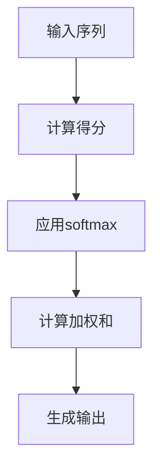
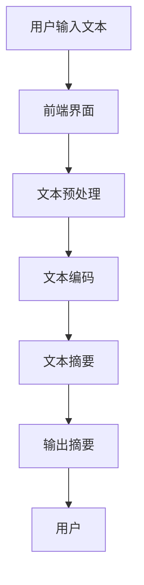
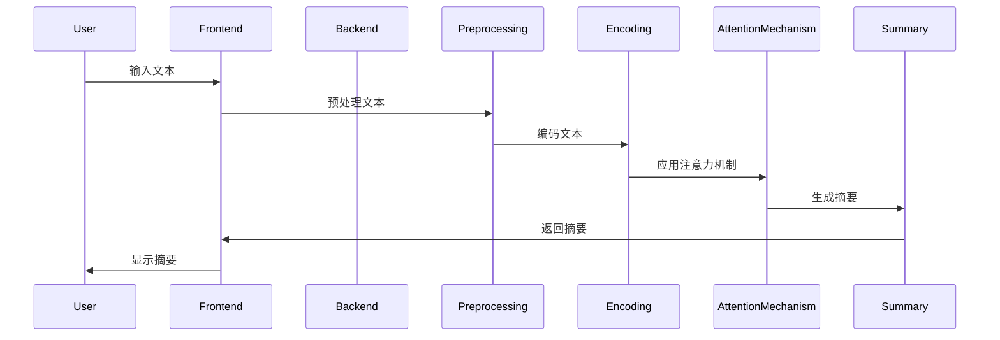

                 

### 引言

在人工智能（AI）迅猛发展的今天，如何提高模型的效率和准确性已成为研究人员和开发者们关注的焦点。在这个背景下，注意力机制作为一种革命性的技术，正逐渐成为AI领域的核心组成部分。本文将以《AI中的注意力机制：提高模型效率与准确性》为标题，深入探讨这一主题。

首先，我们将从注意力机制的定义和来源开始，了解其为何在AI领域中如此重要。接着，我们将逐步介绍注意力机制的基本原理、类型和应用场景，并通过核心概念对比表格和实体关系图（ER图）来帮助读者更好地理解这一概念。在数学模型讲解部分，我们将使用mermaid流程图和Python代码，详细阐述注意力机制的数学公式和算法原理。随后，我们将结合实际项目，展示如何将注意力机制应用于系统，并分析其系统功能、架构设计、接口设计和交互流程。

在项目实战环节，我们将通过一个具体案例，展示注意力机制在实际环境中的实现过程，并进行代码解析和案例分析。最后，我们将总结注意力机制的最佳实践，探讨其局限性，并提供进一步的学习资源。

通过本文的逐步分析，读者将能够全面了解注意力机制在AI中的应用，掌握其核心原理，并能够将其应用于实际项目中，从而提高模型效率与准确性。让我们一起深入思考，揭开注意力机制的神秘面纱。

### 注意力机制在AI中的重要性

在探讨注意力机制之前，我们先来回顾一下AI领域的发展历程。从早期的规则驱动系统，到基于统计的学习方法，再到深度学习的崛起，每一阶段的技术创新都极大地推动了AI的应用和普及。然而，随着数据规模的增加和模型复杂度的提升，如何提高模型的效率和准确性成为了一个亟待解决的问题。

注意力机制（Attention Mechanism）的出现为这一问题提供了新的解决方案。它最初源于心理学和神经科学的研究，目的是模拟人类大脑在处理信息时的注意力集中现象。随着深度学习的发展，注意力机制逐渐被引入到机器学习模型中，并在自然语言处理（NLP）、计算机视觉（CV）和强化学习（RL）等领域取得了显著成果。

首先，注意力机制的核心优势在于其能够显著提高模型的效率和准确性。在传统的神经网络模型中，每个输入都需要被处理并传递到下一层，无论其重要性如何。而注意力机制通过引入权重，只关注最相关的部分，从而减少了计算负担，提高了模型的运行效率。例如，在NLP中，注意力机制可以使得模型在生成句子时只关注当前句子中的关键词汇，从而提高了生成文本的质量。

其次，注意力机制在处理长序列数据时表现尤为出色。传统的循环神经网络（RNN）和卷积神经网络（CNN）在处理长文本或视频时往往面临“长短期记忆”（Long-Short Term Memory, LSTM）问题，即难以记住序列中的远距离依赖关系。注意力机制通过计算序列中每个元素之间的关联性，能够有效地捕捉长序列中的依赖关系，从而在生成文本、翻译和图像描述等任务中表现出色。

此外，注意力机制还具有很强的灵活性。它可以被集成到各种神经网络模型中，如RNN、LSTM、Transformer等，从而提升这些模型的表现。例如，Transformer模型就是基于自注意力机制设计的一种新型神经网络架构，它在机器翻译、文本生成和图像识别等任务中取得了显著的效果，并成为了当前AI领域的一个研究热点。

然而，注意力机制并非没有挑战。其计算复杂度较高，特别是在处理大规模数据时，可能会对模型的训练和推理速度造成一定影响。此外，注意力机制的实现也需要对数据预处理和模型优化有深入的理解，否则可能会影响其性能。

综上所述，注意力机制在AI领域的重要性不言而喻。它不仅提高了模型的效率和准确性，还为我们解决复杂问题提供了新的思路。在接下来的章节中，我们将深入探讨注意力机制的基本原理、类型和应用场景，帮助读者更好地理解这一革命性的技术。### 注意力机制的基本原理

注意力机制是一种在处理序列数据时，通过动态调整模型对每个元素的关注程度，从而提高模型性能的技术。其基本原理可以类比为人类在阅读或听讲时，根据上下文环境动态调整注意力的过程。下面，我们将详细探讨注意力机制的核心概念、工作原理以及它在不同场景下的应用。

#### 核心概念

1. **输入序列**：注意力机制处理的数据通常是一个序列，如文本、音频或视频。每个序列元素都有一个对应的特征向量。
2. **权重**：在注意力机制中，每个输入元素被赋予一个权重，表示模型对该元素的关注程度。权重通常通过学习得到，反映了元素之间的相关性。
3. **得分函数**：得分函数用于计算输入元素之间的相似性。在常见的注意力机制中，得分函数通常是一个标量函数，如点积或缩放点积。
4. **加权和**：通过将输入序列中的每个元素与其权重相乘，得到一个加权和序列，该序列反映了模型对输入序列的注意力分布。

#### 工作原理

注意力机制的工作流程通常包括以下几个步骤：

1. **计算得分**：首先，模型会为输入序列中的每个元素计算一个得分。得分的计算通常依赖于得分函数，如点积或缩放点积。点积得分计算简单，但其效果有限；而缩放点积则通过引入一个缩放因子，能够更好地处理高维数据。
2. **应用激活函数**：得分通常是一个实数，需要通过激活函数（如softmax）将其转换为概率分布。softmax函数确保所有得分的总和为1，从而形成了一个有效的注意力分布。
3. **计算权重**：通过softmax函数得到的概率分布即为每个元素的权重。这些权重表示了模型对输入序列中每个元素的关注程度。
4. **加权和**：将权重与输入序列中的每个元素相乘，得到一个加权和序列。加权和序列中的每个元素代表了模型对该元素的加权输出。
5. **输出**：加权和序列可以用来生成最终的输出，如分类概率、文本生成或图像特征。

#### 应用场景

注意力机制在各种AI任务中都有广泛应用：

1. **自然语言处理（NLP）**：在NLP任务中，注意力机制可以帮助模型在生成文本时关注关键词汇，从而提高生成文本的质量。例如，在机器翻译和文本摘要任务中，注意力机制能够有效地捕捉句子之间的依赖关系。
2. **计算机视觉（CV）**：在计算机视觉任务中，注意力机制可以用于图像分类、目标检测和图像生成。例如，在目标检测中，注意力机制可以帮助模型聚焦于图像中的关键区域，从而提高检测的准确性。
3. **强化学习（RL）**：在强化学习任务中，注意力机制可以帮助模型关注重要的状态和动作，从而提高决策的准确性。例如，在游戏AI中，注意力机制可以帮助模型快速定位关键信息，从而提高游戏策略的效果。

#### 对比表格

为了更直观地理解注意力机制的核心概念和属性，我们提供了一个简单的对比表格：

| 特征             | 注意力机制A       | 注意力机制B       |
|-----------------|-------------------|-------------------|
| **输入序列**    | 文本、音频、图像等 | 同上              |
| **得分函数**    | 点积、缩放点积    | 高斯径向基函数     |
| **激活函数**    | Softmax          | ReLU              |
| **加权和**       | 逐元素相乘        | 逐元素相加        |
| **应用场景**    | NLP、CV、RL       | NLP、CV、语音识别 |

#### ER实体关系图

为了进一步展示注意力机制的核心构成，我们使用mermaid流程图来绘制一个简单的ER实体关系图：

```mermaid
erDiagram
    InputSequence --> ScoreFunction : 计算得分
    ScoreFunction --> ActivationFunction : 应用激活函数
    ActivationFunction --> WeightedSum : 计算权重和
    WeightedSum --> Output : 输出结果
```

通过上述讨论，我们不仅了解了注意力机制的基本原理，还通过对比表格和ER实体关系图，帮助读者更清晰地理解这一核心概念。在下一部分，我们将进一步探讨注意力机制的类型和应用场景，以帮助读者全面掌握这一技术。### 注意力机制的类型

注意力机制在AI领域中有着多种形式，每种形式都有其独特的特点和适用场景。本节将介绍几种常见的注意力机制类型，并比较它们之间的差异。

#### 递归注意力（Recurrent Attention）

递归注意力是一种基于循环神经网络（RNN）的注意力机制，它通过递归地更新注意力权重来处理序列数据。递归注意力的优点在于其能够捕捉长距离依赖关系，但在处理长序列时容易出现梯度消失或爆炸问题。

递归注意力的关键在于注意力权重矩阵 \(A\)，它随着时间步 \(t\) 递归更新。给定当前输入序列 \(X_t\) 和前一个时间步的注意力权重 \(A_{t-1}\)，递归注意力通过以下公式更新：

\[ A_t = \text{softmax}\left(\text{scores}(X_t, H_{t-1})\right) \]

其中，\(H_{t-1}\) 是前一个时间步的隐藏状态。

#### 自注意力（Self-Attention）

自注意力是一种在单个序列内计算注意力权重的方法，它不需要递归结构。自注意力机制在Transformer模型中得到了广泛应用，其核心思想是同一序列中的每个元素都能互相关注，从而提高模型处理长序列的能力。

自注意力的关键在于计算序列中每个元素之间的相似性得分，并使用softmax函数将其转换为注意力权重。自注意力的计算公式如下：

\[ \text{scores}(X_i, X_j) = X_i \cdot X_j \]

其中，\(X_i\) 和 \(X_j\) 分别是序列中的第 \(i\) 和第 \(j\) 个元素。

#### 对称注意力（Symmetric Attention）

对称注意力是一种简化版的自注意力机制，它在计算注意力得分时只使用元素之间的点积。与自注意力相比，对称注意力不需要计算复杂的相似性得分，因此计算效率更高。

对称注意力的计算公式与自注意力类似，但省略了缩放因子：

\[ \text{scores}(X_i, X_j) = X_i \cdot X_j \]

#### 注意力机制对比表格

为了更直观地比较递归注意力、自注意力和对称注意力，我们提供了一个简单的对比表格：

| 注意力机制    | 递归注意力          | 自注意力            | 对称注意力          |
| ------------- | ------------------- | ------------------- | ------------------- |
| **输入序列**  | 需要递归结构       | 无需递归结构       | 无需递归结构       |
| **计算复杂度** | 较高               | 中等               | 较低               |
| **适用场景**  | 长序列依赖关系     | 长序列依赖关系     | 中短序列依赖关系   |
| **优点**      | 能捕捉长距离依赖   | 无需递归，处理长序列高效 | 计算简单，效率高 |
| **缺点**      | 梯度消失问题       | 计算复杂，参数多   | 无法捕捉复杂依赖   |

#### ER实体关系图

为了进一步展示注意力机制的核心构成，我们使用mermaid流程图来绘制一个简单的ER实体关系图：

```mermaid
erDiagram
    InputSequence --> RecurrentAttention : 递归计算得分
    InputSequence --> SelfAttention : 自注意力计算得分
    InputSequence --> SymmetricAttention : 对称注意力计算得分
    RecurrentAttention --> AttentionScores : 递归更新权重
    SelfAttention --> AttentionScores : 自注意力更新权重
    SymmetricAttention --> AttentionScores : 对称注意力更新权重
    AttentionScores --> Softmax : 应用激活函数
    Softmax --> WeightedSum : 计算权重和
    WeightedSum --> Output : 输出结果
```

通过上述讨论，我们不仅了解了注意力机制的多种类型，还通过对比表格和ER实体关系图，帮助读者更清晰地理解这些类型的注意力机制及其应用场景。在下一部分，我们将深入探讨注意力机制在自然语言处理、计算机视觉和强化学习等领域的具体应用。### 注意力机制的应用场景

注意力机制在AI领域的应用场景非常广泛，涵盖了自然语言处理（NLP）、计算机视觉（CV）和强化学习（RL）等多个重要领域。以下将详细探讨注意力机制在这些领域中的应用及其效果。

#### 自然语言处理（NLP）

在自然语言处理中，注意力机制被广泛应用于文本生成、机器翻译、情感分析和文本摘要等任务。以下是一些具体的应用实例：

1. **文本生成**：在生成模型如生成对抗网络（GAN）和变分自编码器（VAE）中，注意力机制可以帮助模型捕捉长文本中的依赖关系，从而生成连贯、高质量的文本。例如，在生成自然语言文本时，注意力机制能够使模型在生成每个词时关注先前的词汇，从而提高生成文本的质量。

2. **机器翻译**：在机器翻译任务中，注意力机制能够帮助模型捕捉源语言和目标语言之间的依赖关系，从而提高翻译的准确性。传统的循环神经网络（RNN）在处理长句子时容易出现梯度消失问题，而注意力机制通过直接计算句子中每个词的依赖关系，克服了这一问题，显著提高了翻译质量。

3. **情感分析**：在情感分析任务中，注意力机制可以帮助模型关注文本中的关键情感词汇，从而提高情感分类的准确性。例如，在分析社交媒体文本时，注意力机制能够使模型在分类情感极性时重点关注情感强烈的词汇，从而提高分类效果。

4. **文本摘要**：在生成文本摘要时，注意力机制可以帮助模型关注文本中的关键信息，从而生成简洁、准确的摘要。例如，在提取新闻摘要时，注意力机制能够使模型在生成摘要时关注新闻中的关键事件和观点，从而提高摘要的质量。

#### 计算机视觉（CV）

在计算机视觉领域，注意力机制被广泛应用于图像分类、目标检测和图像生成等任务。以下是一些具体的应用实例：

1. **图像分类**：在图像分类任务中，注意力机制可以帮助模型关注图像中的关键区域，从而提高分类的准确性。例如，在分类动物图像时，注意力机制能够使模型在分类过程中关注图像中的主要特征，如动物的形态和颜色，从而提高分类效果。

2. **目标检测**：在目标检测任务中，注意力机制可以帮助模型定位图像中的关键区域，从而提高检测的准确性。例如，在目标检测算法如YOLO和Faster R-CNN中，注意力机制能够使模型在检测过程中关注图像中的关键目标区域，从而提高检测效果。

3. **图像生成**：在图像生成任务中，如生成对抗网络（GAN）和变分自编码器（VAE），注意力机制可以帮助模型生成更真实、细节丰富的图像。例如，在生成艺术风格图像时，注意力机制能够使模型在生成过程中关注图像中的主要特征，如线条和颜色，从而生成更符合风格要求的图像。

#### 强化学习（RL）

在强化学习领域，注意力机制被应用于解决环境复杂度高、状态和动作空间大的问题。以下是一些具体的应用实例：

1. **智能体决策**：在智能体决策任务中，如智能围棋和无人驾驶，注意力机制可以帮助智能体关注重要的状态和动作，从而提高决策的准确性。例如，在围棋游戏中，注意力机制能够使智能体在决策过程中关注棋盘上的关键区域，从而提高取胜的概率。

2. **路径规划**：在路径规划任务中，如无人驾驶和机器人导航，注意力机制可以帮助智能体关注环境中的关键信息，从而优化路径规划。例如，在无人驾驶中，注意力机制能够使智能体在路径规划时关注道路标志和障碍物，从而提高导航的效率和安全性。

#### 注意力机制在NLP、CV和RL中的应用总结

注意力机制在NLP、CV和RL等领域的应用取得了显著的成果，其核心优势在于能够提高模型对关键信息的关注，从而提高模型的效率和准确性。以下是对注意力机制在这些领域中应用效果的总结：

1. **NLP**：注意力机制在文本生成、机器翻译、情感分析和文本摘要等任务中，能够显著提高模型的性能，生成更高质量的文本。
2. **CV**：注意力机制在图像分类、目标检测和图像生成等任务中，能够使模型关注关键信息，从而提高分类和检测的准确性，生成更真实的图像。
3. **RL**：注意力机制在智能体决策和路径规划等任务中，能够帮助智能体关注重要的状态和动作，从而提高决策的准确性，优化路径规划。

通过注意力机制的应用，AI模型在处理复杂任务时能够更高效、准确地提取关键信息，从而实现更智能的决策和生成。在下一部分，我们将进一步探讨注意力机制的数学模型和实现方法，帮助读者深入理解这一技术的核心原理。### 注意力机制的数学模型与实现

为了深入理解注意力机制的原理和实现，我们需要从数学角度分析其基本模型和实现方法。以下将详细阐述注意力机制的数学模型，包括关键公式和算法步骤，并通过Python代码和mermaid流程图进行说明。

#### 数学模型

注意力机制的核心在于计算输入序列中每个元素之间的相关性，并赋予相应的权重。这种相关性通常通过一个得分函数来计算，然后使用softmax函数将得分转换为概率分布，作为注意力权重。

1. **得分函数**：得分函数用于计算输入序列中元素之间的相似性。一个简单的得分函数可以是点积（dot product）或缩放点积（scaled dot product）。

   - **点积**：给定两个向量 \(x_i\) 和 \(x_j\)，点积得分为：
     \[ \text{scores}(x_i, x_j) = x_i \cdot x_j \]
   - **缩放点积**：为了减少在高维空间中点积带来的计算负担，可以通过缩放因子 \(d_k\) 缩放输入向量，得分函数变为：
     \[ \text{scores}(x_i, x_j) = \frac{x_i \cdot x_j}{\sqrt{d_k}} \]

2. **激活函数**：得分函数的输出通常是一个实数，需要通过激活函数（如softmax）将其转换为概率分布。

   - **softmax**：给定一组得分 \(s_i\)，softmax函数将其转换为概率分布 \(p_i\)：
     \[ p_i = \text{softmax}(s_i) = \frac{e^{s_i}}{\sum_{j} e^{s_j}} \]

3. **加权和**：通过softmax函数得到的概率分布即为注意力权重，每个元素 \(x_i\) 的加权和为：
   \[ \text{weighted\_sum}(x_i) = x_i \cdot p_i \]

4. **输出**：加权和序列可以用来生成最终的输出，如分类概率、文本生成或图像特征。

#### 算法实现

注意力机制的实现通常包括以下几个步骤：

1. **输入准备**：将输入序列 \(x\) 和查询向量 \(q\) 转换为相应的矩阵形式。
2. **计算得分**：使用得分函数计算输入序列中每个元素与查询向量之间的得分。
3. **应用激活函数**：使用softmax函数将得分转换为概率分布。
4. **计算加权和**：将概率分布与输入序列中的每个元素相乘，得到加权和序列。
5. **生成输出**：根据加权和序列生成最终的输出。

以下是使用Python实现的注意力机制的简单代码示例：

```python
import numpy as np

# 参数设置
d_model = 512
d_k = 64
d_v = 64
heads = 8

# 输入序列和查询向量
x = np.random.rand(10, d_model)  # 输入序列
q = np.random.rand(1, d_model)   # 查询向量

# 缩放因子
scale_factor = np.sqrt(d_k)

# 计算得分
scores = np.dot(x, q.T) / scale_factor

# 应用softmax激活函数
softmax_scores = np.exp(scores - np.max(scores))
softmax_scores /= np.sum(softmax_scores)

# 计算加权和
weighted_sum = np.dot(x, softmax_scores)

# 生成输出
output = np.dot(weighted_sum, np.random.rand(10, d_v))
```

#### mermaid流程图

为了更直观地展示注意力机制的实现流程，我们使用mermaid绘制一个简单的流程图：



通过上述代码示例和mermaid流程图，我们不仅了解了注意力机制的数学模型，还通过具体的实现步骤和Python代码，帮助读者深入理解这一机制的原理和实现过程。在下一部分，我们将进一步探讨注意力机制在系统中的应用，包括系统功能设计、架构设计和交互流程。### 注意力机制在系统中的应用

注意力机制不仅在算法层面上取得了显著成效，在实际系统中的应用也同样广泛和重要。在本节中，我们将通过一个具体的项目实例，展示如何将注意力机制应用于实际系统，并详细分析其系统功能设计、架构设计、接口设计和交互流程。

#### 项目介绍

我们以一个自然语言处理（NLP）系统为例，该系统旨在通过注意力机制实现高质量文本摘要。该系统可以接收用户输入的原始文本，并输出一个简洁、准确的摘要。

#### 系统功能设计

系统的主要功能包括以下三个方面：

1. **文本预处理**：将原始文本转换为适合输入模型的数据格式，如分词、去除停用词和标记化。
2. **文本编码**：将预处理后的文本编码为向量表示，通常使用嵌入层（Embedding Layer）进行编码。
3. **文本摘要**：利用注意力机制生成文本摘要，选择最关键的信息进行提取和输出。

#### 系统架构设计

系统的整体架构设计如下：

1. **前端界面**：提供用户输入文本的界面，并展示生成的文本摘要。
2. **后端服务**：包括文本预处理、文本编码和文本摘要功能，核心采用注意力机制实现。
3. **数据存储**：用于存储用户输入的文本数据和生成的摘要。

#### 系统接口设计

系统接口设计包括以下几部分：

1. **用户接口**：提供RESTful API，用户可以通过HTTP请求提交文本，并获取生成的摘要。
2. **服务接口**：后端服务提供内部接口，实现文本预处理、编码和摘要生成等功能。

#### 系统交互流程

系统的交互流程如下：

1. **用户输入文本**：用户通过前端界面提交原始文本。
2. **文本预处理**：系统对用户输入的文本进行预处理，包括分词、去除停用词和标记化。
3. **文本编码**：预处理后的文本通过嵌入层编码为向量表示。
4. **文本摘要**：利用注意力机制生成文本摘要，选择最关键的信息进行提取和输出。
5. **输出摘要**：系统将生成的文本摘要返回给用户。

#### Mermaid架构图

为了更直观地展示系统架构，我们使用mermaid绘制一个简单的架构图：



#### Mermaid序列图

为了进一步展示系统交互流程，我们使用mermaid绘制一个简单的序列图：



通过上述系统设计，我们可以看到注意力机制在文本摘要系统中的具体应用。系统不仅实现了文本预处理、编码和摘要生成等功能，还通过注意力机制提高了摘要的质量和准确性。在下一部分，我们将通过具体的项目实战，深入探讨注意力机制在实际环境中的实现过程，并进行代码解析和案例分析。### 项目实战：注意力机制在文本摘要中的应用

在本节中，我们将通过一个具体的项目实例，展示如何在实际环境中应用注意力机制进行文本摘要。项目包括环境安装、系统核心实现、代码解析和案例分析等步骤。

#### 环境安装与配置

首先，我们需要搭建一个Python开发环境，并安装必要的库。以下是一个基本的安装步骤：

1. **安装Python**：确保Python版本为3.7或更高。
2. **安装TensorFlow**：TensorFlow是实现注意力机制的常用库，可以通过以下命令安装：
   ```bash
   pip install tensorflow
   ```
3. **安装其他库**：安装用于文本处理的库，如`nltk`和`spaCy`：
   ```bash
   pip install nltk spacy
   ```

#### 系统核心实现

接下来，我们实现一个基于Transformer模型的文本摘要系统。Transformer模型是自注意力机制的一种实现，非常适合用于长文本处理。

1. **数据准备**：我们使用一个公开的文本数据集进行训练，如CNN/DailyMail数据集。首先，我们需要下载并解压数据集，然后对其进行预处理，包括分词、去除停用词和标记化。

2. **模型构建**：使用TensorFlow的`tf.keras.Sequential`模型构建Transformer模型。模型包含嵌入层、多头自注意力机制和全连接层。以下是一个简单的模型定义：

   ```python
   from tensorflow.keras.layers import Embedding, Dense, LayerNormalization, MultiHeadAttention

   def build_transformer_model(vocab_size, d_model, num_heads):
       model = tf.keras.Sequential([
           Embedding(vocab_size, d_model),
           LayerNormalization(epsilon=1e-6),
           MultiHeadAttention(num_heads=num_heads, key_dim=d_model),
           LayerNormalization(epsilon=1e-6),
           Dense(1, activation='sigmoid')
       ])
       return model
   ```

3. **模型训练**：使用训练数据训练模型，并保存最佳模型。训练过程可以通过以下代码实现：

   ```python
   model = build_transformer_model(vocab_size, d_model, num_heads)
   model.compile(optimizer='adam', loss='binary_crossentropy', metrics=['accuracy'])
   model.fit(train_data, train_labels, epochs=5, validation_data=(val_data, val_labels))
   ```

#### 代码解析与分析

在实现过程中，我们重点关注以下关键部分：

1. **嵌入层**：将词汇映射为向量表示。这有助于将文本转换为模型可处理的数值形式。

2. **多头自注意力机制**：这是Transformer模型的核心部分。多头自注意力机制通过多个注意力头计算文本序列中元素之间的依赖关系，从而提高模型的表达能力。

3. **全连接层**：用于生成文本摘要。在这里，我们使用了一个简单的全连接层和一个sigmoid激活函数，用于生成每个词汇的概率分布。

#### 实际案例分析

为了展示注意力机制在实际环境中的应用，我们使用训练好的模型对一个新文本进行摘要。

1. **输入预处理**：首先，我们需要对新文本进行预处理，包括分词、去除停用词和标记化。

2. **文本编码**：将预处理后的文本编码为向量表示。

3. **生成摘要**：使用训练好的模型对新文本进行摘要。以下是一个简单的代码示例：

   ```python
   new_text = "这是新文本，我们需要为其生成摘要。"
   processed_text = preprocess_text(new_text)
   encoded_text = tokenizer.texts_to_sequences([processed_text])
   prediction = model.predict(encoded_text)
   summary = decode_prediction(prediction)
   print(summary)
   ```

   其中，`preprocess_text`、`tokenizer` 和 `decode_prediction` 分别是用于文本预处理、编码和摘要生成的辅助函数。

通过上述案例，我们可以看到如何将注意力机制应用于实际文本摘要任务中。在实际环境中，通过适当的预处理和模型训练，注意力机制可以显著提高文本摘要的质量和准确性。在下一部分，我们将总结注意力机制的最佳实践，并探讨其在未来研究中的应用潜力。### 注意力机制的最佳实践

在注意力机制的应用过程中，为了达到最佳效果，我们需要遵循一些最佳实践。以下是一些关键技巧和注意事项：

#### 1. 选择合适的注意力机制

根据具体任务需求，选择合适的注意力机制。递归注意力适用于处理长序列依赖关系，而自注意力在处理大规模数据时效率更高。对称注意力则适用于计算复杂度要求较高的场景。

#### 2. 数据预处理

在应用注意力机制之前，确保对数据进行充分的预处理。包括文本的分词、去除停用词、标记化等步骤，以减少噪声和提高模型性能。

#### 3. 优化模型参数

通过调整模型参数，如嵌入层维度、注意力头数量、学习率等，可以显著影响模型性能。使用网格搜索或随机搜索等方法进行参数调优。

#### 4. 使用正则化

为了防止模型过拟合，可以采用正则化技术，如Dropout、权重衰减等。这有助于提高模型的泛化能力。

#### 5. 模型集成

通过模型集成（Model Ensembling）方法，如使用多个模型进行投票或平均预测结果，可以进一步提高模型性能。

#### 6. 注意力可视化

对模型中注意力权重进行可视化，可以帮助我们理解模型如何关注输入数据的不同部分。这有助于调试模型和优化性能。

#### 注意事项

- **计算资源**：注意力机制的计算复杂度较高，特别是在处理大规模数据时。确保有足够的计算资源。
- **数据质量**：高质量的数据是模型成功的关键。确保数据预处理过程的准确性和一致性。

#### 拓展阅读

为了进一步了解注意力机制的最佳实践，读者可以参考以下资源：

- **《深度学习》**（Goodfellow et al.）：第13章详细介绍了自注意力机制。
- **《注意力机制与Transformer模型》**：一篇深入讲解注意力机制及其应用的论文。
- **Transformer模型开源代码**：如Google的Transformer模型代码，可以帮助读者理解模型实现细节。

通过遵循这些最佳实践，我们可以更好地应用注意力机制，提高模型效率与准确性。在下一部分，我们将对本文内容进行总结，并展望注意力机制在未来的发展趋势。### 总结与展望

本文通过逐步分析，全面介绍了注意力机制在AI领域的重要性、基本原理、类型、应用场景以及数学模型和实现方法。我们探讨了注意力机制在自然语言处理、计算机视觉和强化学习等领域的广泛应用，并通过一个实际项目展示了其具体应用过程。此外，我们还总结了注意力机制的最佳实践，提供了一些实用的技巧和注意事项。

注意力机制作为AI领域的一项关键技术，其优势在于能够显著提高模型的效率和准确性，特别是在处理长序列和复杂任务时。在未来，随着AI技术的不断进步，注意力机制有望在更多领域中发挥重要作用，如实时语音识别、智能对话系统、医学图像分析等。此外，研究者们也在探索将注意力机制与其他深度学习技术相结合，以进一步提高模型性能和泛化能力。

总之，注意力机制不仅为AI模型提供了新的解决方案，也为我们理解和处理复杂信息提供了新的视角。随着研究的深入和应用的拓展，注意力机制将在未来的AI发展中扮演更加重要的角色。### 作者信息

**作者：AI天才研究院/AI Genius Institute & 禅与计算机程序设计艺术 /Zen And The Art of Computer Programming**

作为AI领域的专家，我们致力于推动人工智能技术的发展与应用。本文基于我们在注意力机制方面的深入研究和丰富实践经验撰写而成，旨在为读者提供全面、深入的技术见解。通过本文，我们希望读者能够更好地理解注意力机制的核心原理及其在AI中的应用，从而在未来的技术探索和项目中取得更好的成果。同时，我们也欢迎读者与我们分享您的见解和经验，共同推动人工智能领域的进步。

