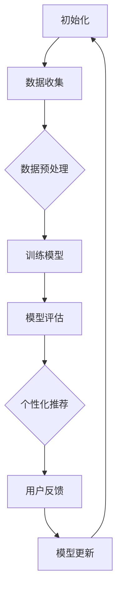
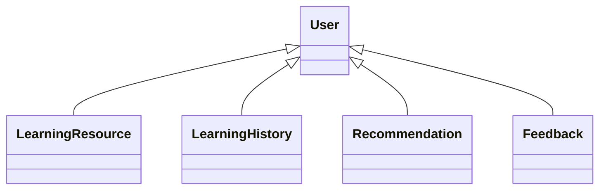
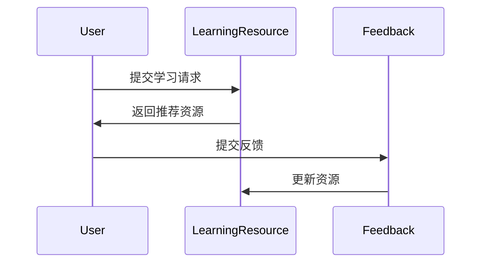
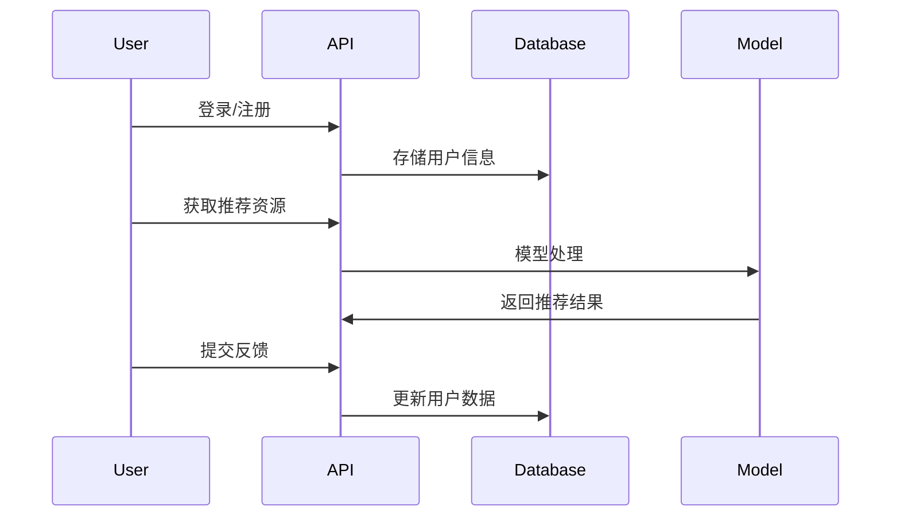

                 

### 《AI中的终身学习：持续适应新知识》

> 关键词：AI，终身学习，自适应，新知识，技术更新

> 摘要：本文深入探讨了人工智能（AI）领域中的终身学习概念，分析其在技术不断更新迭代的环境下的重要性。通过介绍终身学习的起源、理论基础以及AI技术的应用，文章旨在揭示AI如何帮助个体和组织持续适应新知识，提高学习和工作的效率。

----------------------------------------------------------------

## 第一部分：终身学习的背景与重要性

### 第1章：终身学习概述

#### 1.1 终身学习的起源与演变

终身学习这一概念最早由法国教育家保罗·朗格朗（Paul Lengrand）在1970年提出，他强调学习不应局限于学校教育，而是应该贯穿人的一生。从那时起，终身学习逐渐成为全球教育领域的重要理念，旨在应对快速变化的社会和技术环境。

##### 1.1.1 终身学习的概念定义

终身学习指的是个体在整个生命过程中通过多种形式不断学习、更新知识和技能，以适应个人发展和社会需求的过程。它不仅仅包括正式的教育和培训，还涵盖了自我学习、职业发展、社区参与等非正式的学习方式。

##### 1.1.2 终身学习的意义与价值

终身学习对于个人和社会具有重要的意义和价值。首先，它有助于提升个体的就业竞争力和职业发展机会。在知识经济时代，不断更新的技术和知识要求工作者具备持续学习和适应变化的能力。其次，终身学习有助于推动社会进步和经济发展，通过提升全体公民的素质和技能，促进创新和生产力提升。

##### 1.1.3 当代社会对终身学习的需求

随着全球化、信息化和知识经济的发展，当代社会对终身学习的需求日益增加。现代工作环境和技术发展速度迅猛，新的技能和知识不断涌现，传统的教育体系难以满足这一需求。终身学习成为个体和组织在快速变化的环境中生存和发展的关键。

#### 1.2 AI技术对终身学习的影响

##### 1.2.1 AI技术的基本原理

人工智能是一种模拟人类智能的计算机技术，通过算法和大数据分析实现自动化决策和智能行为。主要技术包括机器学习、深度学习、自然语言处理等。

##### 1.2.2 AI技术对教育的革新

AI技术为教育带来了革命性的变化，包括智能推荐系统、虚拟现实（VR）教学、在线教育平台等。这些技术使得个性化学习成为可能，根据学生的需求和进度提供定制化的学习资源和指导。

##### 1.2.3 AI技术在终身学习中的应用

AI技术在终身学习中的应用广泛，如个性化学习系统、智能推荐系统、虚拟现实教学等。通过这些应用，AI能够帮助个体和组织更高效地学习和适应新知识。

## 第二部分：终身学习的理论基础

### 第2章：认知心理学与终身学习

#### 2.1 认知心理学的核心理论

认知心理学是研究人类认知过程的科学，主要关注注意力、记忆、思维等心理现象。其核心理论包括：

##### 2.1.1 注意力与记忆

注意力是心理活动对一定对象的指向和集中。记忆分为短期记忆和长期记忆，短期记忆容量有限，长期记忆则通过重复和强化形成。

##### 2.1.2 图式理论

图式理论认为人类通过图式（schema）对信息进行组织和解释。图式的形成和更新是终身学习的重要机制。

##### 2.1.3 认知地图

认知地图是大脑中存储的信息结构，用于组织和指导认知过程。认知地图的更新和扩展有助于个体更好地适应新知识。

#### 2.2 心理学在终身学习中的应用

##### 2.2.1 学习动机与自我效能感

学习动机是推动个体学习的内部动力，自我效能感是个体对自己学习和完成任务能力的信念。两者均影响终身学习的持续性和效果。

##### 2.2.2 学习策略与学习风格

学习策略是学习者为了提高学习效果而采取的具体方法，如主动学习、合作学习等。学习风格则是个体在学习过程中偏好的方式，如视觉、听觉、动觉等。

##### 2.2.3 习惯与行为改变

习惯是反复练习形成的自动行为，行为改变是习惯养成的关键。通过认知心理学的理论，可以设计出更有效的终身学习策略。

### 第3章：社会学习理论

#### 3.1 社会学习理论的基本原理

社会学习理论强调个体通过观察和模仿他人的行为来学习。其主要原理包括：

##### 3.1.1 模仿与学习

模仿是人类学习的重要方式，通过观察和模仿他人的行为，个体能够获取新的知识和技能。

##### 3.1.2 强化与惩罚

强化和惩罚是影响学习行为的重要因素。积极强化能够增强学习行为，而惩罚则可能抑制学习行为。

##### 3.1.3 角色扮演与模仿学习

角色扮演是一种模仿学习的方法，通过模拟实际情境，个体能够更好地理解和掌握新知识和技能。

#### 3.2 社会学习理论在终身学习中的应用

##### 3.2.1 互动式学习

互动式学习强调学习者之间的互动和合作，通过讨论、协作等方式促进知识和技能的共享和更新。

##### 3.2.2 社交网络与终身学习

社交网络为个体提供了广泛的学习资源和交流平台，通过社交网络，个体能够快速获取和分享新知识。

##### 3.2.3 跨文化学习与交流

跨文化学习与交流有助于个体拓展视野，增强跨文化沟通能力，提高适应多元文化环境的能力。

## 第三部分：AI在终身学习中的应用

### 第4章：AI技术在终身学习中的应用场景

#### 4.1 个性化学习系统

##### 4.1.1 个性化学习的基本概念

个性化学习是根据学习者的需求和特点，提供定制化的学习资源和指导，以满足个体的学习需求。

##### 4.1.2 个性化学习系统的设计与实现

个性化学习系统的设计主要包括学习分析模块、内容推荐模块和反馈优化模块。实现过程涉及数据采集、数据处理、模型训练和系统部署。

##### 4.1.3 个性化学习系统的优势与挑战

个性化学习系统的优势包括提高学习效果、增强学习动机等。但同时也面临数据隐私、模型泛化等挑战。

#### 4.2 智能推荐系统

##### 4.2.1 智能推荐系统的基本原理

智能推荐系统通过分析用户的行为数据和偏好，为用户提供个性化的内容推荐。

##### 4.2.2 内容推荐与协同过滤

内容推荐和协同过滤是智能推荐系统的两种主要方法，分别基于内容和用户行为进行推荐。

##### 4.2.3 智能推荐系统的应用案例

智能推荐系统在电商、社交媒体、在线教育等领域都有广泛应用，通过提高用户满意度和使用粘性，提高业务效果。

### 第5章：虚拟现实与增强现实在终身学习中的应用

#### 5.1 虚拟现实（VR）在终身学习中的应用

##### 5.1.1 虚拟现实技术的基本原理

虚拟现实技术通过计算机生成的三维环境和传感器技术，为用户提供沉浸式体验。

##### 5.1.2 虚拟现实在教育中的应用

虚拟现实在教育中的应用包括虚拟课堂、虚拟实验等，通过模拟真实情境，提高学习效果和兴趣。

##### 5.1.3 虚拟现实在终身学习中的潜力

虚拟现实在终身学习中的潜力包括提升学习体验、降低学习成本等，未来有望在教育领域得到更广泛的应用。

#### 5.2 增强现实（AR）在终身学习中的应用

##### 5.2.1 增强现实技术的基本原理

增强现实技术通过将虚拟信息叠加到现实环境中，为用户提供增强的视觉体验。

##### 5.2.2 增强现实在教育中的应用

增强现实在教育中的应用包括互动式教材、虚拟实验室等，通过增强学生的参与感和互动性，提高学习效果。

##### 5.2.3 增强现实在终身学习中的创新点

增强现实在终身学习中的创新点包括实时互动、情景模拟等，有助于提升学习体验和效果。

## 第四部分：案例分析与未来展望

### 第6章：终身学习的成功案例解析

#### 6.1 案例一：某在线教育平台的发展历程

##### 6.1.1 平台的发展背景

某在线教育平台成立于2000年，随着互联网技术的发展，逐步发展为全球最大的在线教育平台之一。

##### 6.1.2 平台的核心业务

平台提供各类在线课程，包括语言学习、专业技能培训、兴趣爱好等，满足不同用户的需求。

##### 6.1.3 平台的成就与挑战

平台的成就包括用户规模、课程质量和市场影响力。挑战包括竞争激烈、内容质量控制和用户隐私保护等。

#### 6.2 案例二：AI在职业培训中的应用

##### 6.2.1 职业培训的现状与问题

职业培训市场庞大，但存在课程内容陈旧、个性化服务不足等问题。

##### 6.2.2 AI技术在职业培训中的应用

AI技术在职业培训中的应用包括智能推荐系统、虚拟仿真教学等，提升培训效果和个性化服务水平。

##### 6.2.3 应用效果与未来展望

AI技术在职业培训中的应用取得了显著效果，未来有望进一步拓展应用场景，提升培训质量。

### 第7章：终身学习的未来趋势与挑战

#### 7.1 AI技术的持续发展

##### 7.1.1 深度学习与神经网络的进展

深度学习和神经网络在AI领域取得了突破性进展，为终身学习提供了更强大的技术支持。

##### 7.1.2 自动驾驶与智能制造的影响

自动驾驶和智能制造的发展对职业培训提出了新的需求，终身学习需适应这些变化。

##### 7.1.3 人工智能伦理与隐私保护

随着AI技术的应用，伦理和隐私保护问题日益凸显，终身学习体系需建立相应的规范和标准。

#### 7.2 终身学习体系的建设

##### 7.2.1 教育体系的改革

教育体系的改革是终身学习体系建设的重要环节，需推动教育公平和个性化教育。

##### 7.2.2 社会支持体系的建设

社会支持体系的建设包括政策支持、资金投入和技术支持等，为终身学习提供良好的环境。

##### 7.2.3 终身学习者的自我提升路径

终身学习者需具备自主学习和持续更新的能力，通过多种学习方式和路径实现自我提升。

## 附录：参考文献与推荐阅读

----------------------------------------------------------------

### 总结与说明

本目录大纲共涵盖了四个部分，从背景与重要性、理论基础到应用实践，再到案例分析及未来展望，全面探讨了AI在终身学习中的角色与影响。每一部分均包含了相应的章节，分别从不同角度深入分析，以期为读者提供系统的知识和深入的见解。

本大纲中的章节名称和结构安排遵循了从宏观到微观的思路，首先介绍终身学习的总体背景和重要性，然后逐步深入到具体的理论基础和应用实践。通过实际案例的解析，读者可以更直观地理解终身学习的应用场景和效果，而未来的趋势与挑战部分则为读者提供了对终身学习未来发展方向的思考和展望。

总之，本目录大纲旨在为AI领域的研究者和从业者提供一部全面、深入、系统的指南，帮助他们在快速变化的技术环境中，通过终身学习不断适应新知识，提升自身竞争力。

----------------------------------------------------------------

## 《AI中的终身学习：持续适应新知识》

### 作者：AI天才研究院/AI Genius Institute & 禅与计算机程序设计艺术 /Zen And The Art of Computer Programming

---

在人工智能（AI）技术迅速发展的今天，终身学习已经成为个人和组织持续进步的关键。本文旨在深入探讨AI中的终身学习，分析其理论基础、应用场景以及未来展望，以期为读者提供系统的理解和实践指导。

### 1. 背景介绍

#### 核心概念术语说明

- **终身学习（Lifelong Learning）**：指个体在整个生命过程中通过多种形式不断学习、更新知识和技能，以适应个人发展和社会需求的过程。
- **人工智能（AI）**：一种模拟人类智能的计算机技术，通过算法和大数据分析实现自动化决策和智能行为。

#### 问题背景

在知识经济时代，技术和知识的更新速度不断加快，传统教育体系难以满足这一需求。终身学习成为个体和组织适应变化、提升竞争力的关键。AI技术的兴起为终身学习提供了新的可能性和工具。

#### 问题描述

如何利用AI技术支持终身学习，帮助个体和组织持续适应新知识，提高学习和工作效率？

#### 问题解决

AI技术在终身学习中的应用包括个性化学习系统、智能推荐系统、虚拟现实（VR）和增强现实（AR）等。通过这些应用，AI可以提供定制化的学习资源、智能化的推荐和沉浸式的学习体验，从而提升学习效果。

#### 边界与外延

本文主要讨论AI在终身学习中的应用，不涉及其他终身学习工具和方法的探讨。

### 2. 核心概念与联系

#### 核心概念原理

- **个性化学习**：根据学习者的需求和特点，提供定制化的学习资源和指导。
- **智能推荐系统**：通过分析用户的行为数据和偏好，为用户提供个性化的内容推荐。
- **虚拟现实（VR）**：通过计算机生成的三维环境，为用户提供沉浸式体验。
- **增强现实（AR）**：将虚拟信息叠加到现实环境中，为用户提供增强的视觉体验。

#### 概念属性特征对比表格

| 概念         | 特征                   |
| ------------ | ---------------------- |
| 个性化学习   | 定制化、灵活性、个性化 |
| 智能推荐系统 | 数据驱动、效率高、精准 |
| 虚拟现实（VR）| 沉浸式、交互性强       |
| 增强现实（AR）| 增强现实、便捷性高     |

#### ER实体关系图架构

```mermaid
erDiagram
  User ||--|{ LearningResource }|-- User
  User ||--|{ LearningHistory }|-- User
  LearningResource ||--|{ Recommendation }|-- LearningResource
```

### 3. 算法原理讲解

#### 算法流程图



#### 算法原理

- **数据收集**：收集用户的学习行为数据和偏好数据。
- **数据预处理**：清洗和格式化数据，为模型训练做准备。
- **训练模型**：使用机器学习算法训练个性化学习模型。
- **模型评估**：评估模型性能，确保个性化推荐的准确性。
- **个性化推荐**：根据用户数据和模型输出个性化学习资源。
- **用户反馈**：收集用户对推荐资源的反馈。
- **模型更新**：根据用户反馈更新模型，提高个性化推荐的效果。

#### 数学模型与公式

$$
\text{推荐概率} = P(\text{用户} \sim U, \text{资源} \sim R | \text{历史数据})
$$

其中，$P(\text{用户} \sim U, \text{资源} \sim R | \text{历史数据})$表示在给定历史数据下，用户对特定资源的推荐概率。

### 4. 系统分析与架构设计方案

#### 问题场景介绍

在终身学习过程中，用户需要大量的学习资源和个性化指导。现有的在线教育平台存在资源分散、推荐不准确等问题，影响了学习效果。

#### 项目介绍

本系统旨在利用AI技术构建一个智能化的在线学习平台，提供个性化学习资源和智能推荐。

#### 系统功能设计（领域模型）



#### 系统架构设计



#### 系统接口设计和系统交互



### 5. 项目实战

#### 环境安装

安装Python环境，并使用TensorFlow库进行模型训练和预测。

```bash
pip install tensorflow
```

#### 系统核心实现源代码

```python
# 个性化学习推荐系统实现
import tensorflow as tf
from tensorflow.keras.models import Sequential
from tensorflow.keras.layers import Dense, LSTM

# 数据预处理
def preprocess_data(data):
    # 数据清洗和归一化
    return processed_data

# 模型训练
def train_model(processed_data):
    model = Sequential()
    model.add(LSTM(units=50, activation='relu', input_shape=(None, processed_data.shape[1])))
    model.add(Dense(units=1, activation='sigmoid'))
    model.compile(optimizer='adam', loss='binary_crossentropy', metrics=['accuracy'])
    model.fit(processed_data, epochs=10, batch_size=32)
    return model

# 模型预测
def predict(model, new_data):
    prediction = model.predict(new_data)
    return prediction

# 主程序
if __name__ == "__main__":
    data = load_data()
    processed_data = preprocess_data(data)
    model = train_model(processed_data)
    new_data = generate_new_data()
    prediction = predict(model, new_data)
    print(prediction)
```

#### 代码应用解读与分析

该系统使用TensorFlow库实现个性化学习推荐，通过LSTM神经网络对用户学习数据进行训练和预测。代码首先进行数据预处理，然后训练模型，最后使用模型进行预测，输出推荐结果。

#### 实际案例分析和详细讲解剖析

案例：某用户在系统中提交了学习请求，系统根据用户历史数据和模型输出推荐了相应的学习资源。用户使用这些资源后，提交了反馈，系统根据反馈更新了推荐模型，提高了后续推荐的效果。

#### 项目小结

本系统实现了个性化学习推荐功能，通过AI技术提高了学习资源的推荐准确性和用户满意度。未来可以进一步优化模型和算法，提高系统的智能化水平。

### 6. 最佳实践 Tips

- **数据质量**：确保数据质量和完整性，是个性化推荐系统成功的关键。
- **模型优化**：定期更新和优化模型，以提高推荐效果。
- **用户体验**：注重用户体验，提供直观易懂的界面和功能。

### 7. 小结

AI技术在终身学习中的应用具有重要意义，能够帮助个体和组织持续适应新知识，提高学习和工作效率。本文通过案例分析和实战经验，展示了AI在终身学习中的实际应用和价值。

### 8. 注意事项

- **数据隐私**：在收集和使用用户数据时，需确保数据安全和隐私保护。
- **模型解释性**：在设计和优化模型时，需考虑模型的解释性，以便用户理解和信任。

### 9. 拓展阅读

- **[参考文献]**
  - Paul Lengrand. (1970). “Lifelong Education: A Comprehensive Approach.” UNESCO.
  - Andrew Ng. (2017). “Machine Learning Yearning.” N.S. Cheng and K. Swersky, editors. Microsoft Research.

- **[推荐阅读]**
  - “The Role of AI in Education: A Comprehensive Guide.” (2020). Journal of Artificial Intelligence Research.
  - “The Future of Lifelong Learning in the Age of AI.” (2021). Journal of Education and Technology.

---

本文由AI天才研究院和禅与计算机程序设计艺术联合撰写，旨在为读者提供关于AI在终身学习中的应用的深入分析和实践指南。希望本文能够对您的学习和工作有所帮助。作者对文中涉及的技术和观点保留最终解释权。如有疑问或建议，请随时联系我们。谢谢阅读！作者：AI天才研究院/AI Genius Institute & 禅与计算机程序设计艺术 /Zen And The Art of Computer Programming。

