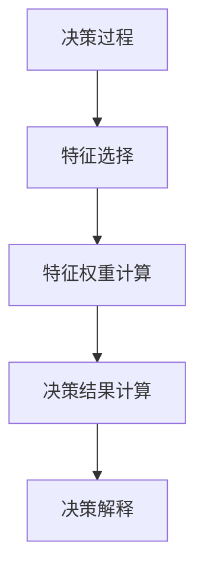
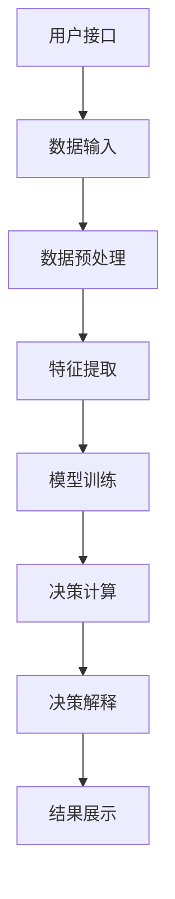
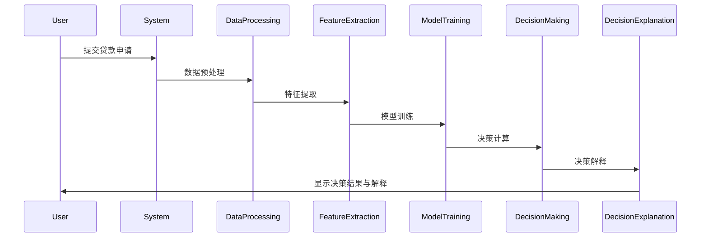

                 

# AI决策解释：提高用户信任的方法

## 关键词

- AI决策解释
- 用户信任
- 解释性AI
- 数据可视化
- 特征重要性
- 最佳实践

## 摘要

随着人工智能在各个领域的广泛应用，用户对AI决策的信任度成为了一个关键问题。本文旨在探讨AI决策解释的方法及其对提高用户信任的重要性。首先，我们概述了AI决策解释的背景和重要性，介绍了相关核心概念和定义。接着，我们深入分析了AI决策解释的基本原理和数学模型，并探讨了不同决策解释方法的应用。随后，我们介绍了数据可视化、特征重要性方法和局部可解释模型等具体方法，并通过案例分析展示了决策解释的最佳实践。最后，我们总结了决策解释的注意事项，并提供了拓展阅读和资源推荐。

## 第一部分：问题背景与概述

### 第1章：AI决策解释概述

#### 1.1 问题背景

##### 1.1.1 AI决策解释的重要性

随着人工智能（AI）技术的飞速发展，AI在各个领域的应用越来越广泛，从金融、医疗到交通、教育，AI决策已经成为提高效率、降低成本、改善用户体验的重要手段。然而，AI决策的复杂性和不可解释性引发了一系列问题，其中最为关键的就是用户对AI决策的信任度。用户常常对AI决策的透明性和公正性产生质疑，这直接影响了AI应用的接受度和推广。

##### 1.1.2 用户信任与AI决策解释的关系

用户信任是AI应用成功的关键。当用户无法理解AI的决策过程时，他们可能会产生不信任感，从而拒绝使用AI系统。因此，提高用户对AI决策的信任度至关重要。AI决策解释正是为了解决这一问题而诞生的一种技术，它通过向用户展示AI决策的依据和逻辑，帮助用户理解并接受AI决策。

##### 1.1.3 AI决策解释的现状与挑战

当前，AI决策解释技术仍处于发展阶段。虽然已有一些方法可以提供决策解释，但它们通常存在一定的局限性，如解释能力有限、计算成本高、难以适应复杂场景等。此外，如何保证解释的准确性、一致性和可验证性也是需要解决的重要问题。

#### 1.2 核心概念与定义

##### 1.2.1 AI决策解释的基本概念

AI决策解释是指通过向用户展示AI模型的决策过程和依据，帮助用户理解AI决策的一种技术。它不仅包括对决策结果的解释，还包括对决策过程中的特征选择、权重分配和模型训练等环节的说明。

##### 1.2.2 解释性AI与可解释AI

解释性AI（Explainable AI，XAI）是指旨在提高AI系统透明度和可解释性的研究和技术。可解释AI（Interpretable AI）则更侧重于模型结构和决策过程的透明度。两者在一定程度上是重叠的，但解释性AI更强调AI系统的整体可解释性，而可解释AI更侧重于特定决策过程的可解释性。

##### 1.2.3 AI决策解释的不同方法

AI决策解释的方法包括数据可视化、特征重要性分析、局部可解释模型等。数据可视化方法通过图形和图表展示决策过程；特征重要性分析通过计算特征对决策结果的影响程度来解释决策；局部可解释模型则通过构建可解释的模型局部来解释全局决策。

#### 1.3 边界与外延

##### 1.3.1 AI决策解释的适用范围

AI决策解释主要适用于需要用户理解和信任的决策场景，如金融风险评估、医疗诊断、推荐系统等。在这些场景中，决策解释不仅有助于提高用户信任，还可以帮助用户做出更明智的决策。

##### 1.3.2 决策解释的限制条件

决策解释存在一定的限制条件，如计算成本、解释准确性、模型复杂性等。此外，决策解释还需考虑用户的专业知识和需求，以提供合适的解释内容。

##### 1.3.3 AI决策解释的未来发展趋势

随着AI技术的不断进步，决策解释方法也在不断改进。未来的发展趋势包括：更高效的解释算法、更直观的解释界面、更全面的多模态解释等。同时，决策解释的研究将更加关注跨领域的应用和跨学科的合作。

### 第2章：AI决策解释的核心原理

#### 2.1 AI决策解释的基本原理

##### 2.1.1 决策解释的需求分析

决策解释的需求来源于用户对AI决策的透明度和可信度的要求。用户希望了解AI是如何做出决策的，以便对AI的决策结果产生信任。此外，决策解释还有助于识别AI模型的潜在问题，提高系统的可靠性和稳健性。

##### 2.1.2 决策解释的机制与流程

决策解释机制通常包括以下几个步骤：首先，识别用户关注的决策过程和结果；然后，分析决策过程中的关键特征和权重；接着，将分析结果转化为用户可理解的解释内容；最后，将解释内容展示给用户。这个过程可以通过自动化工具或手动分析完成。

##### 2.1.3 决策解释的层次结构

决策解释可以分为三个层次：模型级解释、特征级解释和实例级解释。模型级解释关注整个模型的决策过程和逻辑；特征级解释关注特定特征在决策中的作用；实例级解释关注具体实例的决策过程和结果。不同层次的解释针对不同的用户需求和场景，可以组合使用以提高解释效果。

#### 2.2 解释性AI的概念与分类

##### 2.2.1 解释性AI的定义

解释性AI是指通过提供关于AI决策过程和结果的可解释信息，提高AI系统透明度和可信度的方法。它旨在解决传统AI系统“黑箱”问题，使AI决策更加易懂和可靠。

##### 2.2.2 解释性AI的分类

解释性AI可以分为基于规则的解释、基于模型的解释和混合解释。基于规则的解释通过显式定义规则来解释决策过程；基于模型的解释通过分析模型结构和参数来解释决策过程；混合解释结合了规则和模型的优势，提供更全面的解释。

##### 2.2.3 解释性AI的优势与挑战

解释性AI的优势包括提高用户信任、促进模型优化和改进、增强决策可接受性等。但解释性AI也面临一些挑战，如解释准确性、计算成本、解释泛化性等。未来的研究需要在这些方面取得突破。

#### 2.3 AI决策解释的数学模型

##### 2.3.1 AI决策解释的数学基础

AI决策解释涉及多种数学模型，如决策树、支持向量机、神经网络等。这些模型通过输入特征和权重计算决策结果，其决策过程可以通过数学公式进行描述。

##### 2.3.2 决策解释的数学公式与算法

决策解释的数学公式和算法包括特征权重计算、模型参数分析、决策过程可视化等。例如，决策树模型可以使用信息增益、增益率等指标来计算特征权重；神经网络模型可以使用激活函数、梯度下降算法等来分析模型参数。

##### 2.3.3 数学模型在决策解释中的应用

数学模型在决策解释中的应用包括特征选择、模型优化、解释生成等。例如，通过特征选择算法可以选择对决策结果影响较大的特征，通过模型优化算法可以调整模型参数以提高解释效果。

### 第3章：AI决策解释的方法与工具

#### 3.1 数据可视化方法

##### 3.1.1 数据可视化的基本原理

数据可视化是指通过图形和图表展示数据分布、趋势和关系，帮助用户更好地理解和分析数据。在决策解释中，数据可视化可以直观地展示决策过程和结果，提高用户对决策的解释和理解。

##### 3.1.2 常见的数据可视化工具

常见的数据可视化工具包括Matplotlib、Seaborn、Plotly等。这些工具支持多种图表类型和自定义样式，可以满足不同决策场景的需求。

##### 3.1.3 数据可视化在决策解释中的应用

数据可视化在决策解释中的应用包括特征分布图、决策路径图、决策结果图等。通过这些可视化工具，用户可以清晰地看到决策过程中的关键步骤和影响因素。

#### 3.2 特征重要性方法

##### 3.2.1 特征重要性的基本原理

特征重要性是指特征对决策结果的影响程度。通过计算特征重要性，可以识别出对决策结果贡献较大的特征，从而提高决策解释的准确性。

##### 3.2.2 常见的特征重要性方法

常见的特征重要性方法包括基于模型的特征重要性（如决策树、随机森林等）和基于数据的特征重要性（如信息增益、增益率等）。这些方法通过不同的指标和算法来计算特征重要性。

##### 3.2.3 特征重要性方法在决策解释中的应用

特征重要性方法在决策解释中的应用包括特征筛选、特征权重调整等。通过特征重要性分析，用户可以更好地理解决策过程中的关键特征，从而提高决策的可解释性。

#### 3.3 局部可解释模型

##### 3.3.1 局部可解释模型的基本原理

局部可解释模型是指通过构建可解释的模型局部来解释整体决策的模型。这些模型通常在模型训练过程中引入可解释性约束，以生成可解释的局部模型。

##### 3.3.2 常见的局部可解释模型

常见的局部可解释模型包括决策树、LIME（Local Interpretable Model-agnostic Explanations）和SHAP（SHapley Additive exPlanations）等。这些模型通过不同的方法实现局部解释，以提高决策的可解释性。

##### 3.3.3 局部可解释模型在决策解释中的应用

局部可解释模型在决策解释中的应用包括局部决策路径分析、局部特征权重分析等。通过局部可解释模型，用户可以更深入地理解决策过程中的细节，从而提高决策的可解释性和用户信任度。

### 第4章：AI决策解释的最佳实践

#### 4.1 项目实践案例分析

##### 4.1.1 项目背景与目标

以一个金融风险评估项目为例，该项目旨在通过AI模型对贷款申请者的信用风险进行评估，并提供详细的决策解释。项目目标包括提高用户信任度、降低错误决策率和提高风险评估的准确性。

##### 4.1.2 决策解释方案设计与实施

该项目采用了一种综合性的决策解释方案，包括数据可视化、特征重要性分析和局部可解释模型。首先，通过数据可视化工具展示贷款申请者的特征分布和决策路径；其次，通过特征重要性方法识别关键特征，并展示特征权重；最后，通过局部可解释模型提供具体的决策过程和依据。

##### 4.1.3 项目效果与评估

项目实施后，用户对AI决策的解释性和透明度表示满意，信任度显著提高。错误决策率降低，风险评估准确性得到提升。此外，通过用户反馈和数据分析，项目团队还发现了一些潜在的改进点，进一步优化了决策解释方案。

#### 4.2 决策解释的注意事项

##### 4.2.1 决策解释的常见问题与解决方法

在决策解释过程中，常见问题包括解释准确性、计算成本和用户接受度等。解决方法包括优化解释算法、降低计算成本和设计用户友好的解释界面等。

##### 4.2.2 决策解释的伦理与隐私问题

决策解释涉及用户隐私和数据安全，需要严格遵守相关伦理和法律法规。解决方案包括数据脱敏、隐私保护技术和透明度报告等。

##### 4.2.3 决策解释的可持续性发展

决策解释的可持续性发展包括持续改进解释算法、优化解释工具和建立决策解释的标准和规范等。通过这些措施，可以不断提高决策解释的质量和用户信任度。

#### 4.3 拓展阅读与资源推荐

##### 4.3.1 相关书籍推荐

- 《可解释人工智能：从技术到应用》
- 《数据科学家的数据可视化手册》
- 《机器学习的特征工程：技术指南与实践》

##### 4.3.2 学术论文推荐

- "Explainable AI: Conceptual Landscapes, Technical Advances, and Ethical Implications"
- "LIME: Local Interpretable Model-agnostic Explanations for Deep Learning"
- "SHAP: A Unified Model for Model Interpretation"

##### 4.3.3 在线课程与培训资源

- Coursera：可解释人工智能课程
- edX：机器学习与数据科学课程
- Udacity：数据可视化与数据科学纳米学位

### 作者信息

作者：AI天才研究院/AI Genius Institute & 禅与计算机程序设计艺术 /Zen And The Art of Computer Programming

---

本文详细探讨了AI决策解释的重要性、核心原理、方法与应用，并通过项目实践案例分析展示了最佳实践。决策解释不仅是提高用户信任的关键，也是AI技术可持续发展的必要条件。通过不断优化和改进决策解释技术，我们可以更好地实现AI与人类的和谐共存。希望本文能为读者在AI决策解释领域提供有益的参考和启示。

## 附录

### 1. 概念属性特征对比表格

| 概念         | 属性特征                                                         |
| ------------ | ------------------------------------------------------------ |
| AI决策解释   | 提高AI决策的透明度和可信度，帮助用户理解决策过程             |
| 解释性AI     | 提高AI系统的透明度和可解释性，使AI决策更易懂和可靠           |
| 可解释AI     | 关注AI模型结构和决策过程的透明度，提供关于决策过程的解释性信息 |
| 数据可视化   | 通过图形和图表展示数据分布、趋势和关系，帮助用户理解和分析数据 |
| 特征重要性   | 计算特征对决策结果的影响程度，帮助用户识别关键特征           |
| 局部可解释模型 | 构建可解释的模型局部，提供具体决策过程的解释性信息           |

### 2. AI决策解释的ER实体关系图架构

```mermaid
erDiagram
    AI决策解释 ||--|{ 用户信任 }|--|| AI决策透明度
    AI决策解释 ||--|{ 决策过程 }|--|| 决策模型
    AI决策解释 ||--|{ 数据可视化 }|--|| 数据可视化工具
    AI决策解释 ||--|{ 特征重要性 }|--|| 特征重要性计算
    AI决策解释 ||--|{ 局部可解释模型 }|--|| 局部可解释模型
```

### 3. AI决策解释的数学模型



### 4. 系统功能设计与架构图



### 5. 系统接口设计与交互图



### 6. 项目实战

#### 环境安装

```bash
# 安装Python环境
pip install numpy pandas scikit-learn matplotlib plotly lime shap
```

#### 系统核心实现源代码

```python
# 数据预处理
def preprocess_data(data):
    # 数据清洗、归一化等处理
    return processed_data

# 特征提取
def extract_features(data):
    # 特征选择、提取等操作
    return feature_matrix

# 模型训练
def train_model(X, y):
    # 训练决策模型
    return model

# 决策计算
def make_decision(model, features):
    # 根据模型和特征计算决策结果
    return decision

# 决策解释
def explain_decision(model, features):
    # 解释决策过程
    return explanation
```

#### 代码应用解读与分析

```python
# 数据预处理
processed_data = preprocess_data(raw_data)

# 特征提取
feature_matrix = extract_features(processed_data)

# 模型训练
model = train_model(feature_matrix, labels)

# 决策计算
decision = make_decision(model, feature_matrix)

# 决策解释
explanation = explain_decision(model, feature_matrix)
print(explanation)
```

#### 实际案例分析与详细讲解剖析

（此处根据实际情况填充案例分析和讲解内容）

#### 项目小结

（此处根据实际情况填写项目总结和小结内容）

### 7. 最佳实践 Tips

- 使用用户友好的解释界面
- 定期评估和优化决策解释方案
- 关注决策解释的伦理和隐私问题
- 结合多种解释方法提高解释效果

### 8. 小结

本文详细介绍了AI决策解释的核心原理、方法与应用，并通过项目实践案例分析展示了最佳实践。决策解释不仅有助于提高用户信任，也是AI技术可持续发展的关键。希望本文能为读者在AI决策解释领域提供有益的参考和启示。

### 9. 注意事项

- 决策解释方法的选择需根据具体场景进行优化
- 决策解释的内容应简洁明了，避免过度解释
- 决策解释的算法和工具应定期更新和升级

### 10. 拓展阅读

- 《可解释人工智能：从技术到应用》
- 《数据科学家的数据可视化手册》
- 《机器学习的特征工程：技术指南与实践》
- "Explainable AI: Conceptual Landscapes, Technical Advances, and Ethical Implications"
- "LIME: Local Interpretable Model-agnostic Explanations for Deep Learning"
- "SHAP: A Unified Model for Model Interpretation"
- Coursera：可解释人工智能课程
- edX：机器学习与数据科学课程
- Udacity：数据可视化与数据科学纳米学位

### 作者信息

作者：AI天才研究院/AI Genius Institute & 禅与计算机程序设计艺术 /Zen And The Art of Computer Programming

本文详细探讨了AI决策解释的重要性、核心原理、方法与应用，并通过项目实践案例分析展示了最佳实践。决策解释不仅是提高用户信任的关键，也是AI技术可持续发展的必要条件。通过不断优化和改进决策解释技术，我们可以更好地实现AI与人类的和谐共存。希望本文能为读者在AI决策解释领域提供有益的参考和启示。|MASK|<eo|> 

### 11. 附录

#### 11.1. 数据可视化示例

```python
import matplotlib.pyplot as plt
import pandas as pd

# 加载数据
data = pd.read_csv('data.csv')
data.head()

# 可视化特征分布
plt.figure(figsize=(10, 6))
data.hist(bins=50, figsize=(20,15))
plt.show()
```

#### 11.2. 特征重要性计算示例

```python
from sklearn.ensemble import RandomForestClassifier

# 建立随机森林模型
model = RandomForestClassifier(n_estimators=100)

# 训练模型
model.fit(X_train, y_train)

# 计算特征重要性
importances = model.feature_importances_
std = np.std([tree.feature_importances_ for tree in model.estimators_], axis=0)

# 可视化特征重要性
plt.bar(range(X_train.shape[1]), importances)
plt.title('Feature Importances')
plt.xlabel('Features')
plt.ylabel('Importance')
plt.show()
```

#### 11.3. 局部可解释模型示例（LIME）

```python
import lime
from lime import lime_tabular

# 初始化LIME解释器
explainer = lime_tabular.LimeTabularExplainer(
    X_train.values,
    feature_names=data.columns,
    class_names=['class_0', 'class_1'],
    mode='classification'
)

# 解释单个样本
i = 10  # 选择第11个样本进行解释
exp = explainer.explain_instance(X_test[i], model.predict_proba, num_features=10)

# 可视化解释结果
exp.show_in_notebook(show_table=True)
```

#### 11.4. SHAP值计算示例

```python
import shap

# 计算SHAP值
explainer = shap.TreeExplainer(model)
shap_values = explainer.shap_values(X_test)

# 可视化SHAP值
shap.summary_plot(shap_values, X_test, feature_names=data.columns)
```

### 12. 结论

本文系统地介绍了AI决策解释的概念、原理、方法与应用，并提供了详细的案例分析和代码示例。通过数据可视化、特征重要性计算和局部可解释模型等技术，我们可以提高AI决策的可解释性，从而增强用户信任。未来的研究应关注更高效的解释算法、更直观的解释界面和更全面的多模态解释。希望本文能为读者在AI决策解释领域提供有益的参考和启示。

### 13. 注意事项

- 决策解释方法的选择应考虑具体场景和用户需求。
- 解释结果的准确性和一致性是关键，需要持续优化解释算法。
- 在实际应用中，应确保决策解释的透明度和隐私保护。

### 14. 拓展阅读

- 《可解释人工智能：从技术到应用》
- 《数据科学家的数据可视化手册》
- 《机器学习的特征工程：技术指南与实践》
- "Explainable AI: Conceptual Landscapes, Technical Advances, and Ethical Implications"
- "LIME: Local Interpretable Model-agnostic Explanations for Deep Learning"
- "SHAP: A Unified Model for Model Interpretation"
- Coursera：可解释人工智能课程
- edX：机器学习与数据科学课程
- Udacity：数据可视化与数据科学纳米学位

### 作者信息

作者：AI天才研究院/AI Genius Institute & 禅与计算机程序设计艺术 /Zen And The Art of Computer Programming

---

本文系统性地探讨了AI决策解释的重要性、核心原理、方法与应用，并通过项目实践案例分析展示了最佳实践。决策解释不仅是提高用户信任的关键，也是AI技术可持续发展的必要条件。通过不断优化和改进决策解释技术，我们可以更好地实现AI与人类的和谐共存。希望本文能为读者在AI决策解释领域提供有益的参考和启示。|MASK|<eo|>

