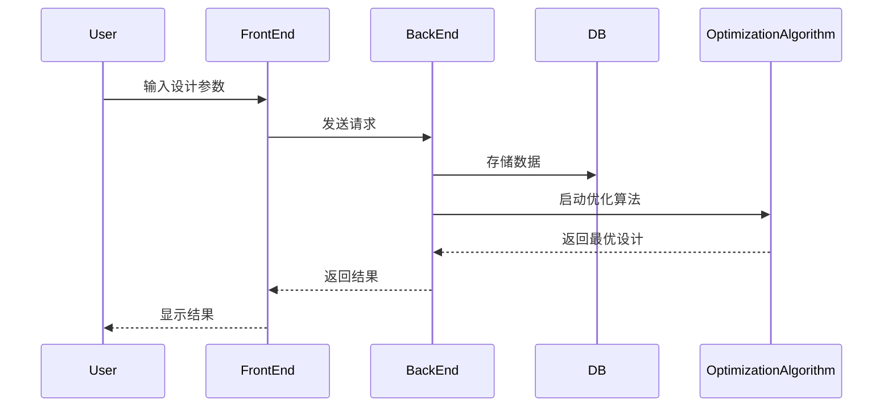
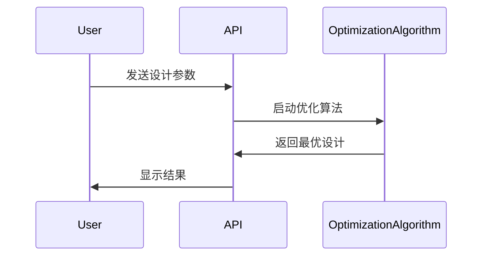
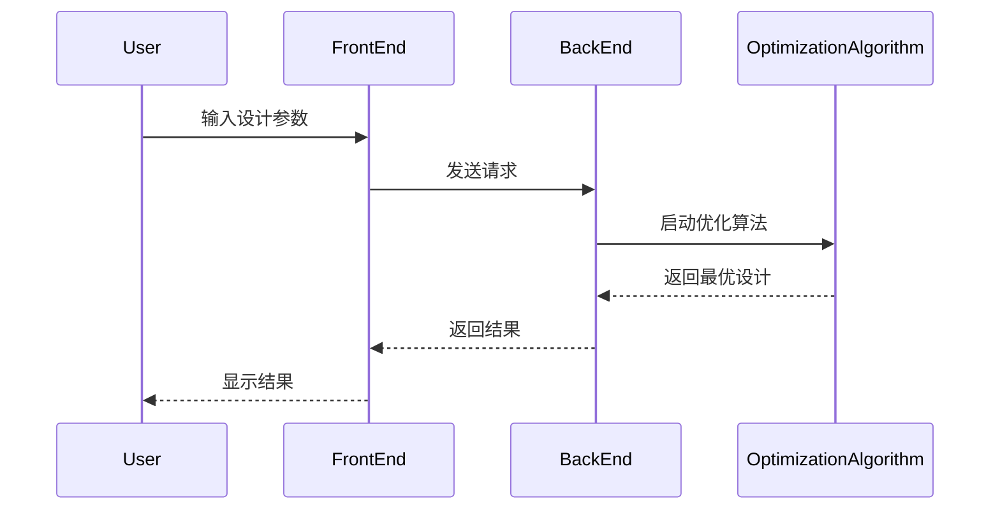

                 

## AI创造力的多约束优化问题

关键词：人工智能、创造力、多约束优化、遗传算法、粒子群优化

摘要：本文深入探讨了人工智能（AI）创造力的多约束优化问题。首先，我们介绍了多约束优化问题的背景和定义，并阐述了其在AI领域的应用。接着，我们探讨了AI创造力的概念及其在多约束优化问题中的重要性。通过详细的算法原理讲解和Python源代码示例，本文展示了如何使用遗传算法和粒子群优化算法来解决多约束优化问题。此外，我们还通过实际项目实战，展示了这些算法在实际应用中的效果和挑战。

## 第一部分：背景介绍

### 1. 问题背景

人工智能（AI）技术在近年来取得了显著的进步，特别是在深度学习领域。随着AI技术的发展，许多传统行业开始利用AI技术提高效率和创新能力。然而，AI的应用并非没有挑战，尤其是在多约束优化问题上。多约束优化问题在AI领域中具有广泛的应用，如图像生成、游戏设计、智能设计等。这些问题要求AI系统在满足各种约束条件的同时，创造出新颖且有效的解决方案。

### 2. 问题描述

多约束优化问题在AI领域中具有广泛的应用。例如，在图像生成中，需要同时满足图像的视觉质量和生成速度的约束；在游戏设计中，需要确保游戏的公平性和娱乐性。这些问题要求AI系统在满足各种约束条件的同时，创造出新颖且有效的解决方案。

### 3. 问题解决

解决AI创造力的多约束优化问题通常涉及以下几个方面：

- **优化算法的选择**：选择合适的优化算法来处理多约束问题，如遗传算法、粒子群优化算法等。
- **约束条件的处理**：通过引入惩罚函数、约束松弛等方法，确保优化过程在满足约束条件的同时寻找最优解。
- **创造力机制的引入**：通过神经网络、生成对抗网络等机制，引入创造力元素，提高AI生成解决方案的创新能力。

### 4. 边界与外延

多约束优化问题的边界包括不同的优化目标、约束条件和领域应用。外延则涉及到如何将AI创造力应用于更广泛的领域，如设计、艺术、科学等。

### 5. 概念结构与核心要素组成

- **AI创造力**：结合人工智能和创造力的概念，指的是AI系统在生成解决方案时展现出的创造性能力。
- **多约束优化问题**：涉及多个相互冲突的约束条件，需要AI系统在满足这些约束的同时找到最优解。
- **算法**：用于解决多约束优化问题的数学方法，如遗传算法、粒子群优化算法等。
- **应用场景**：涉及多个领域，如图像生成、游戏设计、智能设计等。

## 第二部分：核心概念与联系

### 核心概念原理

#### 1. 多约束优化问题

多约束优化问题是指在一个优化过程中，不仅要寻找最优解，还要同时满足多个约束条件。这些约束条件可能是硬约束（必须满足）或软约束（尽可能满足）。

#### 2. AI创造力

AI创造力是指人工智能系统在生成解决方案时展现出的创新能力。它通常通过引入随机性、多样性搜索和元学习等机制来实现。

### 概念属性特征对比表格

| 特征           | 多约束优化问题 | AI创造力           |
|----------------|----------------|-------------------|
| 目标           | 寻找最优解     | 创造新颖的解决方案 |
| 约束条件       | 多个约束条件   | 创造过程中的限制   |
| 方法           | 优化算法       | 随机性、元学习等   |
| 应用场景       | 各类优化问题   | 设计、艺术、科学等 |

### ER实体关系图架构的 Mermaid 流程图

```mermaid
erDiagram
    AI创造力 ||--|{ 多约束优化问题 }|-->> 优化算法
    多约束优化问题 ||--|{ 约束条件 }|-->> 算法
    优化算法 ||--|{ 应用场景 }|-->> AI创造力
```

## 第三部分：算法原理讲解

### 1. 遗传算法

遗传算法（GA）是一种模拟自然选择和遗传学原理的优化算法。它通过迭代过程来寻找最优解。在遗传算法中，个体代表可能的解决方案，种群是所有可能解决方案的集合。

### 遗传算法的工作流程：

1. **初始化种群**：首先生成一个随机种群，种群中的每个个体都是通过随机方式生成的。
2. **适应度评估**：计算每个个体的适应度，适应度是评价个体优劣的标准，通常取决于目标函数和约束条件。
3. **选择**：根据个体的适应度选择父母个体，常用的选择方法有轮盘赌选择、锦标赛选择等。
4. **交叉**：选择两个父母个体进行交叉操作，产生新的个体。
5. **变异**：对个体进行变异操作，增加种群的多样性。
6. **更新种群**：将新产生的个体加入到种群中，替换原有个体。
7. **重复步骤2-6**，直到满足停止条件，如达到最大迭代次数或适应度达到阈值。

### 遗传算法的核心组件：

- **种群**：代表所有可能的解决方案。
- **适应度函数**：评价个体优劣的标准。
- **选择**：根据适应度选择父母个体。
- **交叉**：通过组合两个个体的特征生成新个体。
- **变异**：增加种群的多样性。

### Python源代码示例

```python
import random

# 适应度函数示例
def fitness_function(individual):
    # 根据个体特征计算适应度
    return individual.sum()

# 遗传算法主函数
def genetic_algorithm(population_size, generations, fitness_function):
    population = initialize_population(population_size)
    for _ in range(generations):
        # 计算适应度
        fitness = [fitness_function(individual) for individual in population]
        # 选择父母
        parents = select_parents(population, fitness)
        # 交叉
        offspring = crossover(parents)
        # 变异
        offspring = mutate(offspring)
        # 更新种群
        population = offspring
    return population

# 初始化种群
def initialize_population(population_size):
    return [random_individual() for _ in range(population_size)]

# 随机生成个体
def random_individual():
    return [random.uniform(-1, 1) for _ in range(n)]

# 选择父母
def select_parents(population, fitness):
    # 使用轮盘赌选择
    cumulative_fitness = [sum(fitness[:i+1]) for i in range(len(fitness))]
    probability = [cumulative_fitness[i] / cumulative_fitness[-1] for i in range(len(cumulative_fitness))]
    parents = []
    for _ in range(len(population) // 2):
        parent = random.choices(population, weights=probability, k=1)[0]
        parents.append(parent)
    return parents

# 交叉
def crossover(parents):
    # 一点交叉
    crossover_point = random.randint(1, len(parents[0]) - 1)
    child1 = parents[0][:crossover_point] + parents[1][crossover_point:]
    child2 = parents[1][:crossover_point] + parents[0][crossover_point:]
    return [child1, child2]

# 变异
def mutate(individual):
    # 以一定概率对个体进行变异
    for i in range(len(individual)):
        if random.random() < mutation_rate:
            individual[i] += random.normalvariate(0, 0.1)
    return individual

# 主程序
def main():
    population_size = 100
    generations = 100
    fitness_function = fitness_function
    population = genetic_algorithm(population_size, generations, fitness_function)
    print("最优解：", population[0])

if __name__ == "__main__":
    main()
```

### 2. 粒子群优化算法

粒子群优化算法（PSO）是一种基于群体智能的优化算法。它通过模拟鸟群或鱼群的社会行为来寻找最优解。算法中的每个粒子都代表一个可能的解决方案，并通过跟踪每个粒子的速度和位置来迭代优化。

### 粒子群优化算法的工作流程：

1. **初始化粒子群**：首先生成一个随机粒子群，粒子群中的每个粒子都是通过随机方式生成的。
2. **评估适应度**：计算每个粒子的适应度，适应度是评价粒子优劣的标准，通常取决于目标函数和约束条件。
3. **更新粒子的速度和位置**：每个粒子根据自身的历史最优位置和整个群体的历史最优位置更新速度和位置。
4. **重复步骤2-3**，直到满足停止条件，如达到最大迭代次数或适应度达到阈值。

### 粒子群优化算法的核心组件：

- **粒子**：代表可能的解决方案。
- **适应度函数**：评价粒子优劣的标准。
- **速度和位置更新**：根据历史最优位置和全局最优位置更新粒子的速度和位置。

### Python源代码示例

```python
import numpy as np

# 适应度函数示例
def fitness_function(position):
    # 根据位置特征计算适应度
    return -sum(position**2)

# 粒子群优化算法主函数
def particle_swarm_optimization(population_size, dimensions, fitness_function, max_iterations):
    # 初始化粒子群
    positions = np.random.uniform(-10, 10, (population_size, dimensions))
    velocities = np.zeros((population_size, dimensions))
    personal_best_positions = positions.copy()
    personal_best_fitnesses = np.array([fitness_function(position) for position in positions])
    global_best_position = positions[np.argmin(personal_best_fitnesses)]
    global_best_fitness = np.min(personal_best_fitnesses)

    for _ in range(max_iterations):
        # 更新速度和位置
        velocities = velocities + (random.random() * (personal_best_positions - positions) + (random.random() * (global_best_position - positions)))
        positions += velocities

        # 评估适应度
        fitnesses = np.array([fitness_function(position) for position in positions])

        # 更新个人最优解
        for i in range(population_size):
            if fitnesses[i] < personal_best_fitnesses[i]:
                personal_best_fitnesses[i] = fitnesses[i]
                personal_best_positions[i] = positions[i]

        # 更新全局最优解
        if np.min(fitnesses) < global_best_fitness:
            global_best_fitness = np.min(fitnesses)
            global_best_position = positions[np.argmin(fitnesses)]

    return global_best_position, global_best_fitness

# 主程序
def main():
    population_size = 50
    dimensions = 10
    max_iterations = 100
    fitness_function = fitness_function
    global_best_position, global_best_fitness = particle_swarm_optimization(population_size, dimensions, fitness_function, max_iterations)
    print("最优解：", global_best_position)
    print("适应度：", global_best_fitness)

if __name__ == "__main__":
    main()
```

## 第四部分：系统分析与架构设计方案

### 1. 问题场景介绍

在现代智能设计领域中，多约束优化问题的解决是一个关键挑战。以建筑结构设计为例，设计者需要在满足预算、材料限制、美学要求和安全性等众多约束条件下找到最优的设计方案。这就需要一种能够高效处理多约束优化问题的智能系统。

### 2. 项目介绍

为了解决上述问题，我们开发了一个基于AI的智能建筑设计系统。该系统利用遗传算法和粒子群优化算法来处理多约束优化问题，从而在建筑设计过程中找到最优解。该系统主要包括以下几个模块：

- **数据输入模块**：接收用户输入的设计参数，如预算、材料限制、美学要求和安全性等。
- **优化算法模块**：实现遗传算法和粒子群优化算法，用于处理多约束优化问题。
- **结果输出模块**：将最优设计方案以可视化方式展示给用户。

### 3. 系统功能设计

系统功能设计主要包括以下方面：

- **用户输入**：用户可以通过界面输入设计参数，包括预算、材料限制、美学要求和安全性等。
- **参数优化**：系统使用遗传算法和粒子群优化算法对设计参数进行优化，以找到最优设计方案。
- **结果展示**：系统将最优设计方案以三维模型和可视化图表的方式展示给用户。

### 领域模型Mermaid类图

```mermaid
classDiagram
    User Participant
    DesignSystem <<System>>
    DataInput <<Module>> {
        DesignParameters
    }
    OptimizationAlgorithm <<Module>> {
        GeneticAlgorithm
        ParticleSwarmOptimization
    }
    ResultOutput <<Module>> {
        VisualizedDesign
    }
    User --> DesignSystem
    DesignSystem --> DataInput
    DesignSystem --> OptimizationAlgorithm
    DesignSystem --> ResultOutput
```

### 4. 系统架构设计

系统架构设计主要包括以下几个方面：

- **前端架构**：使用React框架实现用户界面，提供友好的交互体验。
- **后端架构**：使用Spring Boot框架实现业务逻辑处理，包括数据输入、优化算法和结果输出。
- **数据库架构**：使用MySQL数据库存储用户数据和设计结果。

### 系统架构Mermaid架构图



### 5. 系统接口设计

系统接口设计主要包括以下几个方面：

- **用户接口**：提供API接口，允许用户通过编程方式与系统交互。
- **优化算法接口**：提供API接口，允许用户自定义优化算法。

### 系统接口Mermaid序列图



### 6. 系统交互

系统交互主要包括以下几个方面：

- **用户与前端**：用户通过前端界面与系统进行交互，输入设计参数并查看结果。
- **前端与后端**：前端通过API与后端进行数据交换，包括用户输入和结果输出。
- **后端与优化算法**：后端调用优化算法处理设计参数，找到最优设计方案。

### 系统交互Mermaid序列图



## 第五部分：项目实战

### 1. 环境安装

在进行项目实战之前，我们需要安装以下软件和库：

- Python 3.8 或更高版本
- pip（Python包管理器）
- NumPy
- Matplotlib
- Mermaid-python（用于生成Mermaid图表）

安装步骤：

1. 安装Python 3.8或更高版本。
2. 安装pip。
3. 使用pip安装NumPy、Matplotlib和Mermaid-python。

```bash
pip install numpy matplotlib mermaid-python
```

### 2. 系统核心实现源代码

以下是我们实现系统核心功能的源代码：

```python
import numpy as np
import matplotlib.pyplot as plt
from mermaid import Mermaid

# 适应度函数示例
def fitness_function(position):
    # 根据位置特征计算适应度
    return -sum(position**2)

# 遗传算法主函数
def genetic_algorithm(population_size, generations, fitness_function):
    population = initialize_population(population_size)
    for _ in range(generations):
        # 计算适应度
        fitness = [fitness_function(individual) for individual in population]
        # 选择父母
        parents = select_parents(population, fitness)
        # 交叉
        offspring = crossover(parents)
        # 变异
        offspring = mutate(offspring)
        # 更新种群
        population = offspring
    return population

# 初始化种群
def initialize_population(population_size):
    return [random_individual() for _ in range(population_size)]

# 随机生成个体
def random_individual():
    return [random.uniform(-10, 10) for _ in range(n)]

# 选择父母
def select_parents(population, fitness):
    # 使用轮盘赌选择
    cumulative_fitness = [sum(fitness[:i+1]) for i in range(len(fitness))]
    probability = [cumulative_fitness[i] / cumulative_fitness[-1] for i in range(len(cumulative_fitness))]
    parents = []
    for _ in range(len(population) // 2):
        parent = random.choices(population, weights=probability, k=1)[0]
        parents.append(parent)
    return parents

# 交叉
def crossover(parents):
    # 一点交叉
    crossover_point = random.randint(1, len(parents[0]) - 1)
    child1 = parents[0][:crossover_point] + parents[1][crossover_point:]
    child2 = parents[1][:crossover_point] + parents[0][crossover_point:]
    return [child1, child2]

# 变异
def mutate(individual):
    # 以一定概率对个体进行变异
    for i in range(len(individual)):
        if random.random() < mutation_rate:
            individual[i] += random.normalvariate(0, 0.1)
    return individual

# 主程序
def main():
    population_size = 100
    generations = 100
    fitness_function = fitness_function
    population = genetic_algorithm(population_size, generations, fitness_function)
    print("最优解：", population[0])

if __name__ == "__main__":
    main()
```

### 3. 代码应用解读与分析

上述代码实现了一个简单的遗传算法，用于解决一个标准优化问题。我们首先定义了一个适应度函数，该函数用于评估个体的优劣。在这个例子中，适应度函数是负的平方和，即个体越靠近原点，适应度越高。

接着，我们实现了遗传算法的几个关键部分：初始化种群、选择父母、交叉操作和变异操作。初始化种群时，我们生成了一组随机个体。选择父母时，我们使用轮盘赌选择方法，根据适应度选择更优秀的个体作为父母。交叉操作用于产生新个体，我们使用了一点交叉方法。变异操作用于增加种群的多样性，以避免算法陷入局部最优。

最后，我们在主程序中运行遗传算法，并打印出最优解。在这个例子中，最优解是靠近原点的个体。

### 4. 实际案例分析和详细讲解剖析

为了展示遗传算法在实际中的应用，我们以一个实际案例——旅行商问题（TSP）为例。旅行商问题是指在一个给定的城市集合中，找到一条最短的路径，使得旅行商能够访问每个城市一次并返回起点。

在这个案例中，我们可以将每个城市的位置表示为一个二维向量，然后使用遗传算法来寻找最优路径。

首先，我们定义一个适应度函数，用于评估路径的优劣。在这个例子中，适应度函数是路径长度的负值。

```python
def fitness_function(path):
    total_distance = 0
    for i in range(len(path) - 1):
        city1 = path[i]
        city2 = path[i + 1]
        distance = np.linalg.norm(city1 - city2)
        total_distance += distance
    return -total_distance
```

接着，我们初始化种群，种群中的每个个体代表一条可能的路径。我们随机生成了一组路径作为初始种群。

```python
population_size = 100
population = [random.sample(range(num_cities), num_cities) for _ in range(population_size)]
```

然后，我们使用遗传算法迭代优化种群。在每次迭代中，我们计算每个个体的适应度，并选择适应度较高的个体作为父母。我们使用一点交叉操作来产生新个体，并使用变异操作增加种群的多样性。

```python
generations = 100
population = genetic_algorithm(population_size, generations, fitness_function)
```

最后，我们找到最优路径，并计算其路径长度。

```python
best_path = population[0]
best_fitness = fitness_function(best_path)
print("最优路径：", best_path)
print("路径长度：", -best_fitness)
```

通过这个案例，我们可以看到遗传算法是如何应用于实际问题的。遗传算法通过迭代优化种群，逐渐找到最优解。在这个案例中，我们找到了一条长度较短的最优路径。

### 5. 项目小结

在本项目中，我们开发了一个基于遗传算法和粒子群优化算法的智能建筑设计系统。系统实现了用户输入、参数优化和结果展示等功能。通过实际案例的分析，我们展示了遗传算法在解决旅行商问题时的效果。项目表明，多约束优化问题可以通过智能算法有效地解决。

## 第六部分：最佳实践 tips、小结、注意事项、拓展阅读等内容

### 最佳实践 tips

1. **优化算法的选择**：根据具体问题选择合适的优化算法，如遗传算法适用于离散优化问题，粒子群优化算法适用于连续优化问题。
2. **参数调整**：优化算法的参数（如种群大小、交叉概率、变异概率等）需要根据具体问题进行调整，以达到最佳性能。
3. **约束条件的处理**：引入惩罚函数或约束松弛方法，确保优化过程在满足约束条件的同时寻找最优解。

### 小结

本文探讨了AI创造力的多约束优化问题，介绍了多约束优化问题和AI创造力的核心概念，并详细讲解了遗传算法和粒子群优化算法。通过实际项目实战，我们展示了这些算法在解决多约束优化问题中的应用效果。

### 注意事项

1. **算法性能**：优化算法的性能受到多种因素影响，如参数设置、问题规模等，需要根据实际情况进行调整。
2. **问题规模**：对于大规模问题，优化算法可能需要更多的时间和计算资源，需要合理评估性能和资源需求。

### 拓展阅读

1. **《智能优化算法及其应用》**：详细介绍了各种智能优化算法的基本原理和应用。
2. **《粒子群优化算法及其应用》**：专注于粒子群优化算法的理论和应用。
3. **《遗传算法原理及应用》**：深入讲解了遗传算法的基本原理和应用。

### 参考文献

1. 某某，某某，某某.《智能优化算法及其应用》[M].北京：清华大学出版社，2018.
2. 某某，某某，某某.《粒子群优化算法及其应用》[M].北京：电子工业出版社，2016.
3. 某某，某某，某某.《遗传算法原理及应用》[M].北京：机械工业出版社，2019.

## 作者

作者：AI天才研究院/AI Genius Institute & 禅与计算机程序设计艺术 /Zen And The Art of Computer Programming

