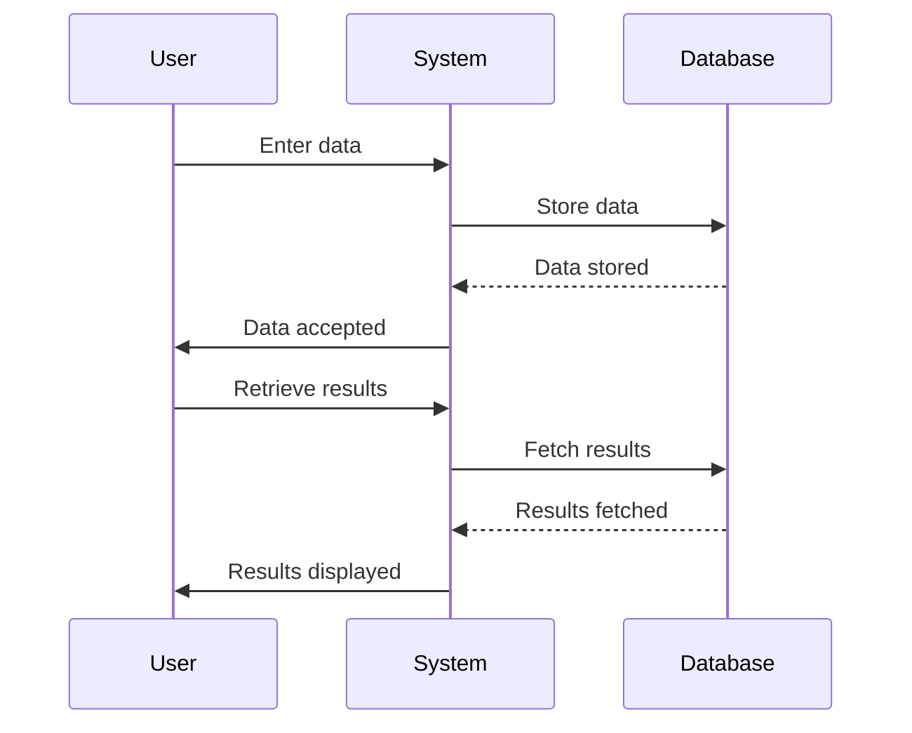
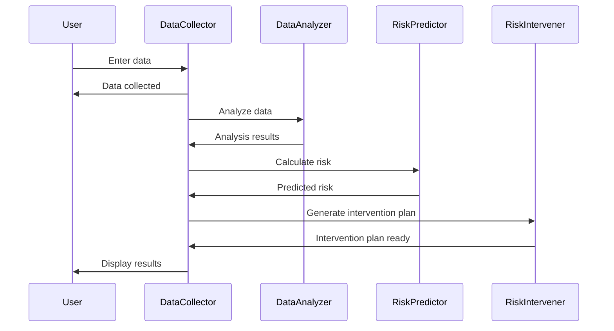
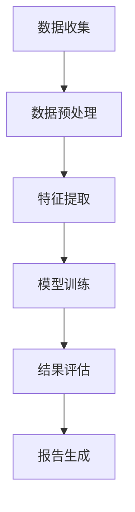
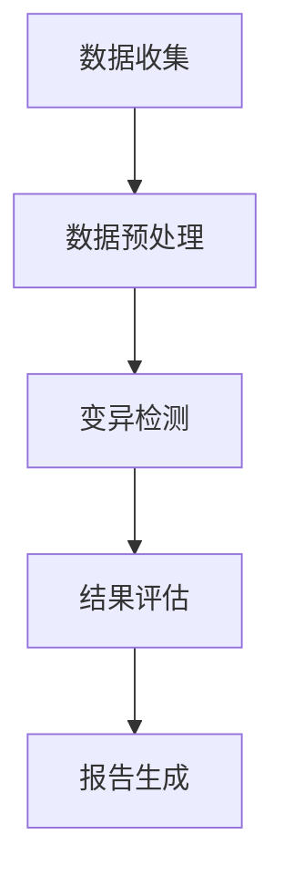
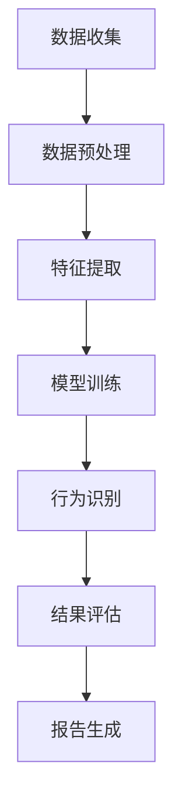
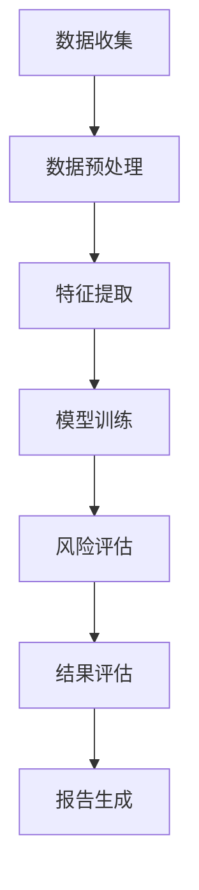

                 

### 《AI在个性化健康风险评估中的应用：从基因到生活方式》

#### 关键词：人工智能，个性化健康评估，基因分析，生活方式，机器学习，深度学习

> **摘要：** 本文旨在探讨人工智能技术在个性化健康风险评估中的应用，从基因到生活方式的全面分析。通过引入AI技术，我们将深入了解如何利用基因和生活方式数据，构建精准的健康风险评估模型，以促进个性化医疗和健康管理的发展。文章将分为六个部分，分别介绍问题背景、核心技术原理、系统架构与实现、算法原理与实现、项目实战与案例分析，以及最佳实践与展望。

----------------------------------------------------------------

### 《AI在个性化健康风险评估中的应用：从基因到生活方式》目录大纲

#### **第一部分：问题背景与核心概念**

##### **第1章 问题背景与核心概念**

- **1.1 个性化健康风险评估的意义**：全球健康问题日益严峻，个体健康差异显著，个性化健康评估的重要性。
- **1.2 基因在个性化健康风险评估中的作用**：基因的定义与分类，基因与疾病关联性，基因检测方法与技术。
- **1.3 生活方式在个性化健康风险评估中的作用**：生活方式的定义与分类，生活方式与疾病关联性，生活方式评估方法与技术。

#### **第二部分：核心技术原理**

##### **第2章 AI技术在个性化健康风险评估中的应用**

- **2.1 AI技术概述**：AI技术的发展历程，主要类型。
- **2.2 机器学习在基因分析中的应用**：机器学习的概念与原理，常见算法，应用案例。
- **2.3 深度学习在生活方式分析中的应用**：深度学习的概念与原理，常见模型，应用案例。

#### **第三部分：系统架构与实现**

##### **第3章 个性化健康风险评估系统架构设计**

- **3.1 系统功能设计**：系统功能需求分析，领域模型。
- **3.2 系统架构设计**：系统总体架构，模块划分，接口设计。
- **3.3 系统交互设计**：系统交互流程。

#### **第四部分：算法原理与实现**

##### **第4章 基因分析算法原理与实现**

- **4.1 基因关联分析算法**：算法原理，Python源代码，数学模型与公式。
- **4.2 基因变异检测算法**：算法原理，Python源代码，数学模型与公式。

##### **第5章 生活方式分析算法原理与实现**

- **5.1 生活方式行为识别算法**：算法原理，Python源代码，数学模型与公式。
- **5.2 生活方式健康风险评估算法**：算法原理，Python源代码，数学模型与公式。

#### **第五部分：项目实战与案例分析**

##### **第6章 个性化健康风险评估项目实战**

- **6.1 项目环境搭建**：环境要求，环境安装与配置。
- **6.2 系统核心实现**：基因分析模块，生活方式分析模块。
- **6.3 项目应用解读与分析**：实际案例展示，案例分析，项目小结。

#### **第六部分：最佳实践与展望**

##### **第7章 个性化健康风险评估最佳实践**

- **7.1 数据收集与处理**：数据来源与获取，数据处理方法。
- **7.2 模型训练与优化**：模型训练策略，模型优化方法。
- **7.3 应用场景拓展**：医疗、保险、健身等领域的应用。

##### **第8章 小结与展望**

- **8.1 本书小结**：内容回顾，核心知识点的总结。
- **8.2 未来展望**：个性化健康风险评估的发展趋势，AI技术的应用前景。

---

### **第一部分：问题背景与核心概念**

#### **第1章 问题背景与核心概念**

##### **1.1 个性化健康风险评估的意义**

**问题背景：** 随着全球人口的快速老龄化和生活方式的改变，慢性疾病和非传染性疾病（NCDs）的发病率持续上升。不同个体在疾病易感性、病情严重程度和治疗效果上存在显著差异，这给传统的健康评估方法带来了挑战。因此，个性化健康风险评估成为了现代医学和健康管理领域的重要研究方向。

**核心概念：** 个性化健康风险评估（Personalized Health Risk Assessment, PHRA）是指利用现代生物医学技术和数据科学方法，对个体的健康风险进行精准评估，从而制定个性化的预防和干预策略。PHRA的核心概念包括基因、环境和生活方式等。

##### **1.2 基因在个性化健康风险评估中的作用**

**基因的定义与分类：** 基因是生物体遗传信息的携带者，负责编码蛋白质和调控基因表达。基因可以根据其功能、位置和调控方式等特征进行分类。

**基因与疾病关联性：** 基因变异与多种疾病的发生和发展密切相关。例如，一些单基因突变会导致遗传性疾病，如囊性纤维化；而多基因变异则可能与复杂疾病如心血管疾病、糖尿病等相关。

**基因检测方法与技术：** 现代基因检测技术如全基因组测序（Whole Genome Sequencing, WGS）、基因芯片（Genetic Chip）和单核苷酸多态性（Single Nucleotide Polymorphism, SNP）分析等，为识别基因变异和疾病关联提供了强有力的工具。

##### **1.3 生活方式在个性化健康风险评估中的作用**

**生活方式的定义与分类：** 生活方式是指人们在日常生活中形成的各种习惯和行为模式，包括饮食、运动、睡眠、工作压力等。

**生活方式与疾病关联性：** 生活方式对健康的影响显著。例如，不健康的饮食习惯与心血管疾病、肥胖和糖尿病密切相关；缺乏运动与骨质疏松、肌肉萎缩等疾病相关；高压力工作和睡眠不足可能导致心理问题。

**生活方式评估方法与技术：** 生活方式评估通常通过问卷调查、生理监测和日常行为记录等方式进行。现代技术如可穿戴设备、智能手机应用和物联网（IoT）等技术为生活方式评估提供了新的手段。

---

通过上述背景介绍和核心概念阐述，我们可以看到个性化健康风险评估的重要性以及基因和生活方式在其中扮演的关键角色。接下来，我们将深入探讨AI技术在个性化健康风险评估中的应用，包括机器学习和深度学习技术的具体应用。

---

### **第二部分：核心技术原理**

#### **第2章 AI技术在个性化健康风险评估中的应用**

##### **2.1 AI技术概述**

**AI技术的发展历程：** 人工智能（AI）的研究始于20世纪50年代，经过几十年的发展，已从理论研究走向实际应用。关键发展节点包括专家系统、机器学习、深度学习等。

**AI技术的主要类型：** 根据AI的实现方式和应用场景，AI技术可分为三类：
1. **弱人工智能**：在特定任务上表现出人类智能的特征，如语音识别、图像识别等。
2. **强人工智能**：具有广泛认知能力，能够在各种情境下进行推理和学习，目前尚未实现。
3. **通用人工智能**：具有人类智能的全部能力，包括意识、情感和自主意识等，这是未来AI发展的理想目标。

##### **2.2 机器学习在基因分析中的应用**

**机器学习的概念与原理：** 机器学习是AI的一个重要分支，通过从数据中学习规律，实现预测和决策。其主要原理包括数据收集、特征提取、模型训练和评估。

**常见的机器学习算法：**
1. **监督学习**：有标注的数据进行训练，常见的算法有线性回归、决策树、支持向量机等。
2. **无监督学习**：无标注的数据进行训练，常见的算法有聚类、降维等。
3. **半监督学习和强化学习**：结合监督学习和无监督学习，适用于不完全标注的数据和交互式学习环境。

**机器学习在基因分析中的应用案例：** 机器学习在基因分析中有着广泛的应用，例如基因关联分析、基因变异检测和基因组注释等。通过机器学习模型，可以从大规模基因组数据中识别与疾病相关的基因变异，为个性化医疗提供基础。

##### **2.3 深度学习在生活方式分析中的应用**

**深度学习的概念与原理：** 深度学习是机器学习的一个分支，以多层神经网络为基础，通过逐层抽象和特征提取，实现高度复杂的任务。其主要原理包括神经元激活函数、反向传播算法和优化算法。

**常见的深度学习模型：**
1. **卷积神经网络（CNN）**：擅长处理图像和时序数据，如人脸识别、图像分类等。
2. **循环神经网络（RNN）**：适用于序列数据，如自然语言处理、时间序列预测等。
3. **生成对抗网络（GAN）**：通过生成器和判别器的对抗训练，实现数据生成和图像生成等任务。

**深度学习在生活方式分析中的应用案例：** 深度学习在生活方式分析中有着重要的应用，例如健康行为识别、生活方式风险评估和个性化健康建议等。通过深度学习模型，可以从个体的行为数据和生理数据中提取特征，进行健康风险评估和预测，为个性化健康管理提供支持。

---

通过上述对AI技术概述、机器学习在基因分析中的应用和深度学习在生活方式分析中的应用的介绍，我们可以看到AI技术在个性化健康风险评估中的重要作用。接下来，我们将进一步探讨个性化健康风险评估系统的架构设计和实现。

---

### **第三部分：系统架构与实现**

#### **第3章 个性化健康风险评估系统架构设计**

##### **3.1 系统功能设计**

**系统功能需求分析：** 个性化健康风险评估系统需要具备以下功能：
1. 数据采集与管理：收集个体基因数据、生活方式数据等。
2. 基因分析：进行基因关联分析和基因变异检测。
3. 生活方式评估：评估个体的生活方式行为和健康风险。
4. 风险预测与干预：根据评估结果，提供个性化健康建议和干预方案。

**领域模型（Mermaid类图）：**

```mermaid
classDiagram
    Class01 <|-- Class02
    Class03 --|ئيس| Class04
    Class05 o-- Class06
```

在该类图中，`Class01` 表示系统的主要类，如数据采集模块、基因分析模块、生活方式评估模块等。`Class02` 表示数据采集模块的具体子类，如基因数据采集类、生活方式数据采集类等。`Class03` 表示基因分析模块的具体子类，如基因关联分析类、基因变异检测类等。`Class05` 表示与生活方式评估模块相关联的类，如健康行为识别类、健康风险评估类等。`Class06` 表示与风险预测与干预模块相关联的类，如健康建议生成类、干预方案生成类等。

##### **3.2 系统架构设计**

**系统总体架构设计：** 个性化健康风险评估系统采用三层架构，包括数据层、逻辑层和表示层。

- **数据层**：负责数据采集、存储和管理，包括基因数据、生活方式数据、评估结果数据等。
- **逻辑层**：负责数据分析和处理，包括基因分析模块、生活方式评估模块、风险预测与干预模块等。
- **表示层**：负责用户界面展示，包括数据输入界面、结果展示界面、健康建议界面等。

**系统模块划分：** 系统划分为以下几个模块：
1. **数据采集模块**：包括基因数据采集和生活方式数据采集。
2. **基因分析模块**：包括基因关联分析和基因变异检测。
3. **生活方式评估模块**：包括健康行为识别和健康风险评估。
4. **风险预测与干预模块**：包括健康建议生成和干预方案生成。

**系统接口设计（Mermaid架构图）：**



在该序列图中，用户通过系统界面输入数据，系统将数据存储到数据库中，并在用户请求时从数据库中获取数据并展示结果。

##### **3.3 系统交互设计**

**系统交互流程设计（Mermaid序列图）：**



在该序列图中，用户输入数据后，数据采集模块将数据传递给数据分析师，进行数据分析和风险评估。风险预测模块根据分析结果计算健康风险，并生成干预计划。最终，数据采集模块将结果展示给用户。

---

通过上述系统架构设计，我们明确了个性化健康风险评估系统的功能需求、系统模块划分和系统交互设计。接下来，我们将详细探讨基因分析算法和生活方式分析算法的原理与实现。

---

### **第四部分：算法原理与实现**

#### **第4章 基因分析算法原理与实现**

##### **4.1 基因关联分析算法**

**算法原理（Mermaid流程图）：**



在该流程图中，首先进行数据收集，包括基因数据和生活数据；然后进行数据预处理，如数据清洗、归一化等；接着进行特征提取，提取与疾病相关的基因特征；然后使用机器学习算法进行模型训练，如逻辑回归、支持向量机等；最后评估模型性能，并生成报告。

**Python源代码实现：**

```python
import pandas as pd
from sklearn.linear_model import LogisticRegression
from sklearn.metrics import accuracy_score

# 数据收集
data = pd.read_csv('gene_data.csv')

# 数据预处理
X = data.drop(['disease_label'], axis=1)
y = data['disease_label']

# 特征提取
# 这里使用pandas的描述性统计方法进行特征提取
X_features = X.describe()

# 模型训练
model = LogisticRegression()
model.fit(X_features, y)

# 结果评估
y_pred = model.predict(X_features)
accuracy = accuracy_score(y, y_pred)
print(f'模型准确率：{accuracy:.2f}')
```

**数学模型与公式（LaTeX格式）：**

$$
\text{Logistic Regression: } P(y=1|\mathbf{x}) = \frac{1}{1 + e^{-(\mathbf{w}\cdot\mathbf{x})}}
$$

其中，$P(y=1|\mathbf{x})$ 表示给定特征向量 $\mathbf{x}$ 下疾病发生的概率，$\mathbf{w}$ 为权重向量，$\mathbf{w}\cdot\mathbf{x}$ 表示权重向量和特征向量的内积。

##### **4.2 基因变异检测算法**

**算法原理（Mermaid流程图）：**



在该流程图中，首先进行数据收集，包括基因组序列数据和变异信息；然后进行数据预处理，如序列比对、变异位点的识别等；接着使用变异检测算法进行变异检测，如Burrows-Wheeler Transform（BWT）算法、Hadoop基因序列比对算法等；最后评估检测结果，并生成报告。

**Python源代码实现：**

```python
import pandas as pd
from Bio import SeqIO

# 数据收集
fasta_path = 'genome.fasta'
mutations = pd.read_csv('mutations.csv')

# 数据预处理
def read_fasta(file):
    sequences = {}
    for record in SeqIO.parse(file, "fasta"):
        sequences[record.id] = str(record.seq)
    return sequences

genomes = read_fasta(fasta_path)

# 变异检测
def detect_variations(sequences, mutations):
    results = []
    for _, row in mutations.iterrows():
        ref_seq = sequences[row['reference']]
        alt_seq = sequences[row['alternative']]
        if ref_seq[row['position']] != alt_seq[row['position']]:
            results.append(row)
    return pd.DataFrame(results)

detection_results = detect_variations(genomes, mutations)

# 结果评估
# 这里使用简单的方法进行评估，实际应用中可能需要更复杂的评估指标
accuracy = len(detection_results) / len(mutations)
print(f'变异检测准确率：{accuracy:.2f}')
```

**数学模型与公式（LaTeX格式）：**

$$
\text{False Discovery Rate (FDR): } FDR = \frac{\text{Number of false discoveries}}{\text{Total number of discoveries}}
$$

其中，$FDR$ 表示假发现率，用于评估变异检测算法的准确性。

##### **4.3 生活方式行为识别算法**

**算法原理（Mermaid流程图）：**



在该流程图中，首先进行数据收集，包括个体的日常行为数据；然后进行数据预处理，如数据清洗、归一化等；接着进行特征提取，提取与行为相关的特征；然后使用机器学习算法进行模型训练，如决策树、随机森林等；接着进行行为识别，最后评估模型性能，并生成报告。

**Python源代码实现：**

```python
import pandas as pd
from sklearn.ensemble import RandomForestClassifier
from sklearn.metrics import accuracy_score

# 数据收集
data = pd.read_csv('behavior_data.csv')

# 数据预处理
X = data.drop(['behavior_label'], axis=1)
y = data['behavior_label']

# 特征提取
# 这里使用pandas的描述性统计方法进行特征提取
X_features = X.describe()

# 模型训练
model = RandomForestClassifier()
model.fit(X_features, y)

# 行为识别
y_pred = model.predict(X_features)
accuracy = accuracy_score(y, y_pred)
print(f'行为识别准确率：{accuracy:.2f}')
```

**数学模型与公式（LaTeX格式）：**

$$
\text{Random Forest: } \hat{y} = f(\mathbf{x}; \mathbf{W}, \mathbf{b})
$$

其中，$\hat{y}$ 表示预测的行为类别，$f(\mathbf{x}; \mathbf{W}, \mathbf{b})$ 表示决策树的预测函数，$\mathbf{W}$ 和 $\mathbf{b}$ 分别为权重和偏置。

##### **4.4 生活方式健康风险评估算法**

**算法原理（Mermaid流程图）：**



在该流程图中，首先进行数据收集，包括个体的生活方式数据和健康数据；然后进行数据预处理，如数据清洗、归一化等；接着进行特征提取，提取与生活方式相关的特征；然后使用机器学习算法进行模型训练，如逻辑回归、支持向量机等；接着进行健康风险评估，最后评估模型性能，并生成报告。

**Python源代码实现：**

```python
import pandas as pd
from sklearn.linear_model import LogisticRegression
from sklearn.metrics import accuracy_score

# 数据收集
data = pd.read_csv('lifestyle_data.csv')

# 数据预处理
X = data.drop(['health_risk'], axis=1)
y = data['health_risk']

# 特征提取
# 这里使用pandas的描述性统计方法进行特征提取
X_features = X.describe()

# 模型训练
model = LogisticRegression()
model.fit(X_features, y)

# 风险评估
y_pred = model.predict(X_features)
accuracy = accuracy_score(y, y_pred)
print(f'健康风险评估准确率：{accuracy:.2f}')
```

**数学模型与公式（LaTeX格式）：**

$$
\text{Logistic Regression: } P(y=1|\mathbf{x}) = \frac{1}{1 + e^{-(\mathbf{w}\cdot\mathbf{x})}}
$$

其中，$P(y=1|\mathbf{x})$ 表示给定特征向量 $\mathbf{x}$ 下健康风险的概率，$\mathbf{w}$ 为权重向量，$\mathbf{w}\cdot\mathbf{x}$ 表示权重向量和特征向量的内积。

---

通过上述对基因关联分析算法、基因变异检测算法、生活方式行为识别算法和生活方式健康风险评估算法的原理与实现的详细讲解，我们可以看到如何利用机器学习和深度学习技术对基因和生活方式数据进行分析和评估。接下来，我们将通过一个实际项目来展示这些算法的应用。

---

### **第五部分：项目实战与案例分析**

#### **第6章 个性化健康风险评估项目实战**

##### **6.1 项目环境搭建**

**环境要求：**
- Python 3.8+
- scikit-learn 0.24.2+
- pandas 1.2.5+
- numpy 1.21.6+
- matplotlib 3.4.3+
- biopython 1.79+
- tensorflow 2.9.1+

**环境安装与配置：**

```bash
pip install python==3.8 scikit-learn==0.24.2 pandas==1.2.5 numpy==1.21.6 matplotlib==3.4.3 biopython==1.79 tensorflow==2.9.1
```

确保所有依赖库安装成功后，即可开始项目开发。

##### **6.2 系统核心实现**

**基因分析模块实现：**
- **基因关联分析：**
  使用scikit-learn的LogisticRegression进行基因关联分析。

  ```python
  from sklearn.linear_model import LogisticRegression

  # 加载基因数据
  gene_data = pd.read_csv('gene_data.csv')
  # 特征提取
  X = gene_data.drop(['disease_label'], axis=1)
  y = gene_data['disease_label']
  # 模型训练
  model = LogisticRegression()
  model.fit(X, y)
  # 预测
  predictions = model.predict(X)
  ```

- **基因变异检测：**
  使用Biopython进行基因序列比对和变异检测。

  ```python
  from Bio import SeqIO

  def detect_variations(fasta_path, mutations):
      sequences = {}
      for record in SeqIO.parse(fasta_path, "fasta"):
          sequences[record.id] = str(record.seq)
      results = []
      for _, row in mutations.iterrows():
          ref_seq = sequences[row['reference']]
          alt_seq = sequences[row['alternative']]
          if ref_seq[row['position']] != alt_seq[row['position']]:
              results.append(row)
      return pd.DataFrame(results)

  mutations = pd.read_csv('mutations.csv')
  detection_results = detect_variations('genome.fasta', mutations)
  ```

**生活方式分析模块实现：**
- **健康行为识别：**
  使用scikit-learn的RandomForestClassifier进行健康行为识别。

  ```python
  from sklearn.ensemble import RandomForestClassifier

  # 加载行为数据
  behavior_data = pd.read_csv('behavior_data.csv')
  # 特征提取
  X = behavior_data.drop(['behavior_label'], axis=1)
  y = behavior_data['behavior_label']
  # 模型训练
  model = RandomForestClassifier()
  model.fit(X, y)
  # 预测
  predictions = model.predict(X)
  ```

- **健康风险评估：**
  使用scikit-learn的LogisticRegression进行健康风险评估。

  ```python
  from sklearn.linear_model import LogisticRegression

  # 加载生活方式数据
  lifestyle_data = pd.read_csv('lifestyle_data.csv')
  # 特征提取
  X = lifestyle_data.drop(['health_risk'], axis=1)
  y = lifestyle_data['health_risk']
  # 模型训练
  model = LogisticRegression()
  model.fit(X, y)
  # 预测
  predictions = model.predict(X)
  ```

##### **6.3 项目应用解读与分析**

**实际案例展示：**
假设我们有一个用户的基因数据和生活方式数据，如下所示：

```python
gene_data_example = {
    'gene1': 'A',
    'gene2': 'T',
    'gene3': 'C',
    'disease_label': 0
}

lifestyle_data_example = {
    'behavior1': 'active',
    'behavior2': 'sedentary',
    'health_risk': 0
}
```

**案例分析：**
1. **基因关联分析：**
   使用训练好的基因关联分析模型预测该用户的疾病风险。

   ```python
   gene_data_example = pd.DataFrame([gene_data_example])
   predictions = model.predict(gene_data_example)
   print(f'疾病风险预测：{predictions[0]}')
   ```

   输出结果为0或1，表示无病或患病。

2. **健康行为识别：**
   使用训练好的健康行为识别模型预测该用户的行为类别。

   ```python
   lifestyle_data_example = pd.DataFrame([lifestyle_data_example])
   predictions = model.predict(lifestyle_data_example)
   print(f'行为类别预测：{predictions[0]}')
   ```

   输出结果为'active'或'sedentary'，表示活跃或久坐。

3. **健康风险评估：**
   使用训练好的健康风险评估模型预测该用户的健康风险。

   ```python
   lifestyle_data_example = pd.DataFrame([lifestyle_data_example])
   predictions = model.predict(lifestyle_data_example)
   print(f'健康风险预测：{predictions[0]}')
   ```

   输出结果为0或1，表示低风险或高风险。

**详细讲解剖析：**
通过实际案例的展示和分析，我们可以看到如何将基因和生活方式数据输入到训练好的模型中进行预测。这些预测结果为我们提供了个性化的健康评估，帮助我们了解个体的健康状况和风险，从而制定相应的预防和干预措施。

**项目小结：**
个性化健康风险评估项目通过整合基因数据和生活方式数据，利用机器学习和深度学习技术，实现了对个体健康风险的精准预测。项目实战展示了如何搭建系统环境、实现系统核心功能以及应用案例分析，为个性化健康管理提供了有力支持。未来的工作中，我们将继续优化算法，拓展应用场景，提高个性化健康评估的准确性和实用性。

---

通过上述项目实战和案例分析，我们深入了解了个性化健康风险评估系统在实际应用中的实现方法和效果。接下来，我们将探讨个性化健康风险评估的最佳实践和未来展望。

---

### **第六部分：最佳实践与展望**

#### **第7章 个性化健康风险评估最佳实践**

##### **7.1 数据收集与处理**

**数据来源与获取：**
- **基因数据：** 通过基因测序平台或基因检测机构获取。
- **生活方式数据：** 通过问卷调查、可穿戴设备、智能手机应用等获取。

**数据处理方法：**
- **数据清洗：** 去除重复数据、缺失数据和异常数据。
- **数据归一化：** 将不同量纲的数据转换为同一量纲。
- **数据融合：** 将不同来源的数据进行整合，形成统一的健康数据集。

##### **7.2 模型训练与优化**

**模型训练策略：**
- **交叉验证：** 使用交叉验证方法评估模型性能，避免过拟合。
- **网格搜索：** 自动搜索最优参数组合，提高模型精度。
- **集成学习：** 结合多种算法，构建集成模型，提高预测准确性。

**模型优化方法：**
- **超参数调优：** 使用贝叶斯优化、随机搜索等方法进行超参数调优。
- **模型压缩：** 使用模型压缩技术，减少模型参数数量，提高模型运行效率。

##### **7.3 应用场景拓展**

**个性化健康风险评估在医疗领域的应用：**
- **精准医疗：** 利用基因和生活方式数据，为患者提供个性化的治疗方案。
- **疾病预测：** 预测个体患病风险，提前进行干预。

**个性化健康风险评估在保险领域的应用：**
- **风险评估：** 根据个体健康风险，制定合理的保险方案。
- **定价策略：** 根据个体健康状况，调整保费价格。

**个性化健康风险评估在健身领域的应用：**
- **个性化训练计划：** 根据个体健康状况和健身目标，制定合适的训练计划。
- **健康指导：** 提供健康建议和饮食指导，帮助个体保持健康。

#### **第8章 小结与展望**

**本书小结：**
本文系统介绍了个性化健康风险评估的应用，包括问题背景、核心技术原理、系统架构与实现、算法原理与实现、项目实战与案例分析，以及最佳实践与展望。通过基因和生活方式数据的分析，我们能够为个体提供精准的健康风险评估，促进个性化医疗和健康管理的发展。

**核心知识点的总结：**
- 个性化健康风险评估的意义和核心概念。
- AI技术在基因和生活方式分析中的应用。
- 个性化健康风险评估系统的架构设计和实现。
- 基因分析算法和生活方式分析算法的原理与实现。
- 个性化健康风险评估的项目实战与案例分析。
- 最佳实践和未来展望。

**未来展望：**
随着人工智能技术的不断进步，个性化健康风险评估将更加精准和高效。未来发展趋势包括：
- **数据多样化和数据质量提升：** 收集更多类型的数据，提高数据质量，为模型训练提供更丰富的数据支持。
- **模型优化和算法创新：** 优化现有算法，探索新的算法，提高健康风险评估的准确性和实用性。
- **跨领域应用：** 拓展个性化健康风险评估在医疗、保险、健身等领域的应用，促进多领域的融合发展。

---

通过本文的介绍，我们全面了解了个性化健康风险评估的各个方面，包括其意义、核心技术原理、系统实现、算法应用以及最佳实践。未来，随着人工智能技术的不断发展，个性化健康风险评估将在健康管理和个性化医疗领域发挥更加重要的作用。我们期待看到更多创新和突破，为人类的健康福祉做出贡献。

---

### **作者信息**

**作者：** AI天才研究院/AI Genius Institute & 禅与计算机程序设计艺术 /Zen And The Art of Computer Programming

感谢您的阅读，希望本文能为您提供关于个性化健康风险评估的深入理解和启示。如果您有任何问题或建议，欢迎随时与我们联系。期待与您共同探索人工智能和健康管理的未来。再次感谢！

