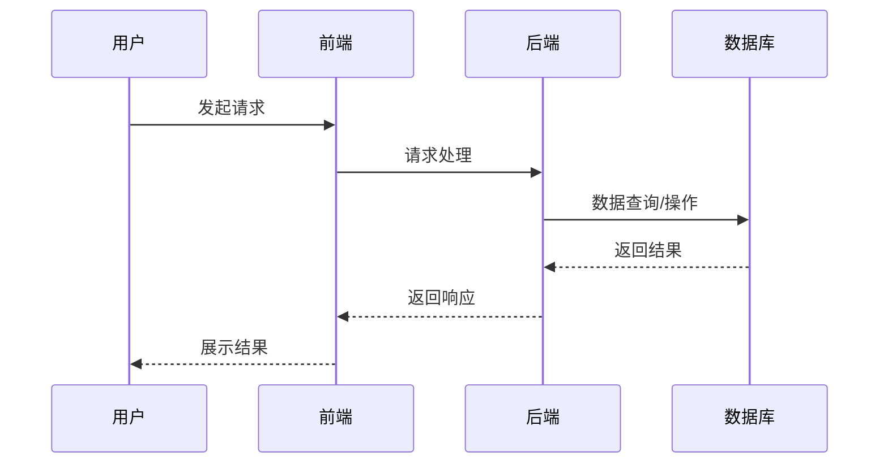

                 

# AI在个性化内容创作与版权保护中的应用与伦理考量

## 关键词

- 人工智能
- 个性化内容创作
- 版权保护
- 伦理考量
- 算法实现
- 数字指纹
- 区块链技术

## 摘要

本文深入探讨了人工智能在个性化内容创作和版权保护中的关键应用，并对其伦理考量进行了全面的分析。首先，我们回顾了人工智能的发展历程和其在各行业的广泛应用，随后介绍了个性化内容创作和版权保护的重要性及其面临的挑战。接着，我们分析了AI在个性化内容创作中的几种核心技术，如数据分析与推荐系统、生成对抗网络（GAN）和自然语言处理，并探讨了这些技术在实际中的应用案例。在版权保护方面，我们介绍了数字指纹技术和区块链技术的基本原理和应用案例。最后，我们对AI在版权保护中的伦理考量进行了讨论，包括基本原则、挑战与对策，以及国际法规与政策。本文旨在为读者提供一个全面、系统的了解，帮助其在技术应用和伦理考量方面做出明智的决策。

## 目录大纲

### 第一部分：背景介绍

#### 第1章 问题背景

##### 1.1 人工智能的快速发展

##### 1.1.1 人工智能的起源与发展

##### 1.1.2 人工智能在各行业的应用现状

##### 1.2 个性化内容创作与版权保护的重要性

##### 1.2.1 个性化内容创作的兴起

##### 1.2.2 版权保护面临的挑战

##### 1.3 本书的目标

##### 1.3.1 研究意义

##### 1.3.2 内容结构

#### 第2章 核心概念

##### 2.1 个性化内容创作

###### 2.1.1 定义

###### 2.1.2 特点

###### 2.1.3 分类

##### 2.2 版权保护

###### 2.2.1 定义

###### 2.2.2 形式

###### 2.2.3 挑战

#### 第3章 概念联系

##### 3.1 个性化内容创作与版权保护的内在联系

###### 3.1.1 共同目标

###### 3.1.2 技术融合

###### 3.1.3 挑战与机遇

### 第二部分：核心概念与联系

#### 第4章 AI在个性化内容创作中的应用

##### 4.1 数据分析与推荐系统

###### 4.1.1 基本原理

###### 4.1.2 算法实现

###### 4.1.3 应用案例

##### 4.2 生成对抗网络（GAN）

###### 4.2.1 基本原理

###### 4.2.2 算法实现

###### 4.2.3 应用案例

##### 4.3 自然语言处理

###### 4.3.1 基本原理

###### 4.3.2 算法实现

###### 4.3.3 应用案例

#### 第5章 AI在版权保护中的应用

##### 5.1 数字指纹技术

###### 5.1.1 基本原理

###### 5.1.2 算法实现

###### 5.1.3 应用案例

##### 5.2 区块链技术

###### 5.2.1 基本原理

###### 5.2.2 算法实现

###### 5.2.3 应用案例

##### 5.3 人工智能伦理考量

###### 5.3.1 基本原则

###### 5.3.2 挑战与对策

###### 5.3.3 国际法规与政策

### 第三部分：算法原理讲解

#### 第6章 个性化内容创作算法

##### 6.1 collaborative filtering

###### 6.1.1 基本原理

$$
\text{推荐分数} = \text{用户兴趣向量} \cdot \text{内容特征向量}
$$

###### 6.1.2 算法实现

```python
# Python 示例代码
def collaborative_filtering(user_vector, content_vector):
    return np.dot(user_vector, content_vector)
```

###### 6.1.3 应用案例

##### 6.2 Content-based Filtering

###### 6.2.1 基本原理

$$
\text{相似度} = \frac{\text{内容特征向量} \cdot \text{候选内容特征向量}}{||\text{内容特征向量}|| \cdot ||\text{候选内容特征向量}||}
$$

###### 6.2.2 算法实现

```python
# Python 示例代码
def content_based_filtering(content_vector, candidate_vector):
    return np.dot(content_vector, candidate_vector) / (np.linalg.norm(content_vector) * np.linalg.norm(candidate_vector))
```

###### 6.2.3 应用案例

### 第四部分：系统分析与架构设计方案

#### 第7章 系统功能设计

##### 7.1 功能需求分析

## 第一部分：背景介绍

### 第1章 问题背景

#### 1.1 人工智能的快速发展

##### 1.1.1 人工智能的起源与发展

人工智能（Artificial Intelligence，简称AI）作为计算机科学的一个重要分支，起源于20世纪50年代。1956年，在达特茅斯会议上，约翰·麦卡锡（John McCarthy）等人首次提出了人工智能的概念，并定义其为“制造智能机器的科学与工程”。这一时期的AI主要聚焦于符号推理和规则系统，试图通过编程实现机器的智能行为。

随着计算机硬件性能的提升和算法的进步，人工智能在20世纪80年代迎来了第一次浪潮。专家系统和知识工程成为这一时期的研究热点。专家系统通过模拟人类专家的决策过程，为特定领域提供了强大的工具。

然而，受限于计算能力和算法的局限性，人工智能在90年代逐渐进入低谷期。这一时期，机器学习开始崭露头角，尤其是基于统计学习的方法。1997年，IBM的超级计算机“深蓝”击败了国际象棋世界冠军加里·卡斯帕罗夫，标志着人工智能在特定领域取得了突破性进展。

进入21世纪，特别是2006年后，随着深度学习技术的兴起，人工智能迎来了新一轮的快速发展。深度学习通过模仿人脑的神经网络结构，实现了在图像识别、自然语言处理、语音识别等领域的突破性进展。谷歌的AlphaGo在2016年击败世界围棋冠军李世石，更是将人工智能推向了公众视野。

##### 1.1.2 人工智能在各行业的应用现状

人工智能在多个行业都展现出了巨大的应用潜力，并取得了显著成效。

在医疗健康领域，AI技术被广泛应用于疾病诊断、治疗方案推荐、药物研发等方面。通过分析海量医疗数据，AI系统可以更准确地诊断疾病，提高治疗效果。例如，IBM的Watson for Oncology系统能够为医生提供个性化的治疗方案。

金融行业同样受益于人工智能。通过大数据分析和机器学习算法，金融机构能够更好地识别风险、预测市场趋势，并为客户提供个性化的金融产品和服务。例如，利用AI算法，银行可以更精准地进行信用评估，降低贷款风险。

在零售业，人工智能被用于客户行为分析、库存管理和供应链优化等方面。通过分析客户的购买历史和行为数据，零售企业可以提供更加个性化的购物体验，提高客户满意度。例如，亚马逊的推荐系统就是基于AI技术，为用户推荐可能的购物选择。

此外，人工智能还在交通、能源、教育、制造业等领域发挥着重要作用。自动驾驶汽车、智能电网、在线教育平台和智能制造系统都是AI技术的典型应用场景。

##### 1.2 个性化内容创作与版权保护的重要性

##### 1.2.1 个性化内容创作的兴起

个性化内容创作是指通过数据分析、用户行为分析等技术，为用户提供量身定制的、符合其兴趣和需求的内容。随着互联网和大数据技术的发展，个性化内容创作逐渐成为一种重要的内容生产方式。

首先，个性化内容创作能够显著提高用户体验。通过分析用户的历史行为和偏好，内容创作者可以精准地推送用户感兴趣的内容，减少用户的搜索时间和努力，提高用户满意度和粘性。

其次，个性化内容创作能够提高内容传播效率。在信息爆炸的时代，用户往往无法在短时间内获取到有价值的信息。个性化内容创作通过精准推送，使得优质内容能够更快地传递给目标用户，提高了信息传播的效率。

此外，个性化内容创作还能够为创作者带来更高的收益。通过精准的用户定位和内容推荐，创作者能够更好地理解用户需求，生产出更符合市场口味的内容，从而获得更多的关注和收入。

##### 1.2.2 版权保护面临的挑战

版权保护是保障创作者权益、维护内容创作生态的重要环节。然而，在数字化时代，版权保护面临着诸多挑战。

首先，网络传播速度快，侵权行为难以监控。互联网使得内容的传播速度大大加快，侵权行为往往在短时间内就能扩散到全球。传统的版权保护手段很难在短时间内监控和阻止侵权行为。

其次，侵权手段日益多样化。除了传统的下载、传播侵权内容外，侵权者还利用各种技术手段进行侵权，如洗标、篡改版权信息等。这些手段使得版权保护变得更加复杂和困难。

此外，版权纠纷成本高昂。一旦发生版权纠纷，创作者需要投入大量时间和金钱进行维权，而侵权者则可能通过各种手段拖延诉讼，导致维权成本增加。

最后，国际版权保护的法律差异也给版权保护带来了挑战。不同国家和地区对版权保护的法律法规存在差异，创作者在全球范围内的版权保护需要应对复杂的法律环境。

##### 1.3 本书的目标

本书旨在深入探讨人工智能在个性化内容创作和版权保护中的应用，分析其技术原理、应用案例以及伦理考量，帮助读者全面了解这一领域的发展动态和关键问题。

首先，本书将介绍个性化内容创作和版权保护的基本概念和重要性，分析其面临的挑战和机遇。接着，本书将详细探讨人工智能在个性化内容创作中的应用，包括数据分析与推荐系统、生成对抗网络（GAN）和自然语言处理等核心技术，并分析其在实际中的应用案例。

在版权保护方面，本书将介绍数字指纹技术和区块链技术的基本原理和应用，分析其在版权保护中的优势和应用前景。同时，本书还将对人工智能在版权保护中的伦理考量进行深入讨论，包括基本原则、挑战与对策，以及国际法规与政策。

通过本书的学习，读者将能够：

1. 理解个性化内容创作和版权保护的基本概念和重要性；
2. 掌握人工智能在个性化内容创作中的应用技术和方法；
3. 分析AI在版权保护中的应用案例和优势；
4. 深入探讨人工智能在版权保护中的伦理考量及其应对策略；
5. 了解国际版权保护的法律框架和政策。

### 第2章 核心概念

#### 2.1 个性化内容创作

##### 2.1.1 定义

个性化内容创作是指通过收集和分析用户数据，了解用户兴趣和行为习惯，从而生成或推荐符合用户个性化需求的内容。这种创作方式强调内容的个性化和定制化，旨在提高用户体验和内容满意度。

##### 2.1.2 特点

1. **数据驱动**：个性化内容创作依赖于大数据技术，通过对用户行为、兴趣等数据进行深入分析和挖掘，实现内容的个性化推荐。
2. **动态性**：个性化内容创作能够根据用户的实时行为和偏好动态调整推荐内容，确保内容的实时性和新鲜感。
3. **高精度**：通过对用户数据的精准分析，个性化内容创作能够准确捕捉用户的兴趣点，提高内容的匹配度和用户满意度。
4. **多样性**：个性化内容创作不仅关注用户当前的兴趣，还关注用户的潜在兴趣，通过多维度分析，为用户推荐多样化的内容。

##### 2.1.3 分类

根据内容的创作方式，个性化内容创作可以分为以下几类：

1. **基于内容的个性化推荐**：通过分析内容本身的特征，如标题、标签、关键词等，为用户推荐相似或相关的个性化内容。
2. **基于用户的协同过滤推荐**：通过分析用户之间的相似性，根据其他用户对内容的评价推荐个性化内容。协同过滤包括基于用户的协同过滤和基于项目的协同过滤。
3. **基于模型的个性化推荐**：利用机器学习算法和深度学习模型，根据用户的历史行为和偏好预测用户可能的兴趣，从而推荐个性化内容。
4. **基于上下文的个性化推荐**：结合用户的上下文信息，如时间、地点、设备等，为用户推荐符合其当前情境的内容。

#### 2.2 版权保护

##### 2.2.1 定义

版权保护是指通过法律、技术和管理手段，保护创作者对其原创作品的权益，防止未经授权的复制、传播和使用。版权保护的核心目标是维护创作者的知识产权，鼓励创新和创作。

##### 2.2.2 形式

版权保护的形式主要包括：

1. **法律保护**：通过签订合同、申请版权登记等方式，为创作者的作品提供法律保护。一旦发生侵权行为，创作者可以通过法律途径维护自己的权益。
2. **技术保护**：利用加密技术、数字水印、数字指纹等技术手段，保护作品不被非法复制、篡改和传播。
3. **管理保护**：通过版权管理平台、版权声明、版权标记等方式，规范作品的传播和使用，提高侵权行为被发现和制止的效率。

##### 2.2.3 挑战

在数字化时代，版权保护面临着以下挑战：

1. **侵权行为隐蔽性高**：互联网的普及使得侵权行为变得更加隐蔽，侵权者可以通过技术手段规避检测和追踪。
2. **侵权行为全球化**：互联网的全球化使得版权保护面临跨国家和跨地区的挑战，不同国家和地区的版权保护法律和执法力度存在差异。
3. **技术更新速度快**：随着技术的发展，侵权手段和形式也在不断变化，传统的版权保护手段往往难以适应新的侵权形式。
4. **版权纠纷成本高**：一旦发生版权纠纷，维权过程复杂且耗时，维权成本高昂。

### 第3章 概念联系

#### 3.1 个性化内容创作与版权保护的内在联系

##### 3.1.1 共同目标

个性化内容创作和版权保护都旨在维护创作者的权益，鼓励创新和创作。个性化内容创作通过满足用户个性化需求，提高用户体验，从而激发创作者的创造力。版权保护则通过法律和技术手段，确保创作者的原创作品不被侵权，从而维护其权益。

##### 3.1.2 技术融合

在数字化时代，个性化内容创作和版权保护的技术手段逐渐融合。例如，通过数字指纹技术，可以为每一条个性化内容生成唯一的标识，实现内容追踪和保护。同时，区块链技术也为版权保护提供了一种去中心化的解决方案，通过区块链的不可篡改性，确保版权信息的真实性和透明性。

##### 3.1.3 挑战与机遇

个性化内容创作和版权保护在融合过程中也面临着一些挑战和机遇：

1. **挑战**：
   - 技术融合需要解决数据隐私和安全问题，确保用户的个人信息不被泄露。
   - 版权保护技术需要适应快速变化的技术环境，不断更新和优化。
   - 版权纠纷的解决需要更高效的法律和司法体系支持。

2. **机遇**：
   - 技术融合可以提升个性化内容创作的质量和效率，为创作者带来更多收益。
   - 版权保护技术的创新可以提供更有效的版权保护手段，减少侵权行为。
   - 国际合作和法规的完善可以为全球版权保护提供更好的法律保障。

## 第二部分：核心概念与联系

### 第4章 AI在个性化内容创作中的应用

#### 4.1 数据分析与推荐系统

##### 4.1.1 基本原理

数据分析与推荐系统是AI在个性化内容创作中的一个核心应用，其基本原理是通过分析用户的历史数据和行为模式，预测用户的兴趣和偏好，从而为其推荐个性化内容。这种系统通常基于两种主要算法：协同过滤算法和基于内容的推荐算法。

协同过滤算法通过分析用户之间的相似性来推荐内容。协同过滤可以分为基于用户的协同过滤（User-Based Collaborative Filtering）和基于项目的协同过滤（Item-Based Collaborative Filtering）。基于用户的协同过滤算法会找到与目标用户兴趣相似的其他用户，然后推荐这些用户喜欢的项目；而基于项目的协同过滤算法则是找到与目标项目相似的其他项目，然后推荐给用户。

基于内容的推荐算法则是通过分析内容本身的属性和特征来推荐相关内容。例如，如果用户喜欢某一类视频，算法会寻找其他具有相似属性的视频进行推荐。

##### 4.1.2 算法实现

以下是一个简单的基于用户的协同过滤算法的Python示例代码：

```python
import numpy as np

def similarity_matrix(user_matrix):
    # 计算用户相似度矩阵
    similarity = np.dot(user_matrix, user_matrix.T)
    similarity = np.where(np.diag(similarity) != 0, similarity, 0)  # 对角线为0
    similarity = np.diag(np.ones(similarity.shape[0])) + similarity  # 添加对角线
    similarity = np.linalg.norm(similarity, axis=1) ** -1  # 归一化
    return similarity

def collaborative_filtering(user_id, user_matrix, item_ratings, similarity_matrix, k=5):
    # 计算推荐分数
    neighbors = np.argsort(similarity_matrix[user_id])[1:k+1]  # 找到最相似的k个用户
    neighbor_ratings = item_ratings[neighbors]  # 获取这些用户的评分
    neighbor_similarity = similarity_matrix[user_id][neighbors]  # 获取这些用户的相似度
    mean_rating = np.mean(item_ratings[user_id])  # 用户自己的评分均值
    recommendation_scores = mean_rating + np.dot(neighbor_similarity, neighbor_ratings - mean_rating)
    return recommendation_scores

# 示例数据
user_matrix = np.array([[5, 3, 0, 1],
                        [4, 0, 0, 1],
                        [1, 1, 0, 5],
                        [1, 0, 0, 4],
                        [0, 1, 5, 4]])

item_ratings = np.array([[5, 3, 0, 1],
                         [4, 0, 0, 1],
                         [1, 1, 0, 5],
                         [1, 0, 0, 4],
                         [0, 1, 5, 4]])

similarity_matrix = similarity_matrix(user_matrix)

# 推荐给第1个用户
recommendation_scores = collaborative_filtering(0, user_matrix, item_ratings, similarity_matrix, k=3)
print(recommendation_scores)
```

##### 4.1.3 应用案例

1. **电子商务网站**：例如亚马逊，通过协同过滤算法推荐用户可能感兴趣的商品，从而提高销售额和用户满意度。
2. **社交媒体平台**：如Facebook和Twitter，通过分析用户之间的相似性，推荐用户可能感兴趣的朋友和内容。
3. **在线视频平台**：如Netflix和YouTube，通过分析用户的观看历史和偏好，推荐相关视频内容，提高用户粘性。

#### 4.2 生成对抗网络（GAN）

##### 4.2.1 基本原理

生成对抗网络（Generative Adversarial Networks，GAN）是由Ian Goodfellow等人在2014年提出的一种深度学习模型，由两个深度神经网络——生成器（Generator）和判别器（Discriminator）组成。生成器的任务是生成尽可能真实的样本，而判别器的任务是区分真实样本和生成器生成的样本。

GAN的工作机制可以看作是一场“对抗游戏”：生成器和判别器相互对抗，生成器不断优化其生成样本的质量，以使判别器无法区分生成的样本和真实的样本。通过这种对抗过程，生成器最终能够生成高质量的样本，如图像、文本、音频等。

##### 4.2.2 算法实现

以下是一个简单的GAN模型实现的Python示例代码：

```python
import tensorflow as tf
from tensorflow.keras.layers import Dense, Flatten, Reshape
from tensorflow.keras.models import Sequential

def build_generator(z_dim):
    model = Sequential()
    model.add(Dense(128, input_dim=z_dim))
    model.add(LeakyReLU(alpha=0.01))
    model.add(Dense(256))
    model.add(LeakyReLU(alpha=0.01))
    model.add(Dense(512))
    model.add(LeakyReLU(alpha=0.01))
    model.add(Dense(1024))
    model.add(LeakyReLU(alpha=0.01))
    model.add(Flatten())
    model.add(Dense(784, activation='tanh'))
    model.add(Reshape((28, 28, 1)))
    return model

def build_discriminator(img_shape):
    model = Sequential()
    model.add(Flatten(input_shape=img_shape))
    model.add(Dense(512))
    model.add(LeakyReLU(alpha=0.01))
    model.add(Dense(256))
    model.add(LeakyReLU(alpha=0.01))
    model.add(Dense(128))
    model.add(LeakyReLU(alpha=0.01))
    model.add(Dense(1, activation='sigmoid'))
    return model

def build_gan(generator, discriminator):
    model = Sequential()
    model.add(generator)
    model.add(discriminator)
    return model

# 示例参数
z_dim = 100
img_shape = (28, 28, 1)

# 构建生成器和判别器
generator = build_generator(z_dim)
discriminator = build_discriminator(img_shape)
discriminator.compile(loss='binary_crossentropy', optimizer=tf.keras.optimizers.Adam(0.0001))

# 构建并编译GAN
gan = build_gan(generator, discriminator)
gan.compile(loss='binary_crossentropy', optimizer=tf.keras.optimizers.Adam(0.0001))

# 示例训练过程
for epoch in range(100):
    for _ in range(100):
        noise = np.random.normal(0, 1, (128, z_dim))
        generated_images = generator.predict(noise)
        real_images = np.random.choice(train_images, 128)
        real_labels = np.ones((128, 1))
        fake_labels = np.zeros((128, 1))
        d_loss_real = discriminator.train_on_batch(real_images, real_labels)
        d_loss_fake = discriminator.train_on_batch(generated_images, fake_labels)
        noise = np.random.normal(0, 1, (128, z_dim))
        g_loss = gan.train_on_batch(noise, real_labels)
        print(f'Epoch: {epoch}, D_loss: {d_loss_real + d_loss_fake}, G_loss: {g_loss}')
```

##### 4.2.3 应用案例

1. **图像生成**：例如生成逼真的照片、人脸、艺术作品等。
2. **数据增强**：通过生成与训练数据相似的新样本，增强训练数据集，提高模型的泛化能力。
3. **风格迁移**：将一种艺术风格应用到另一张图片上，如将普通照片转换为梵高的风格画。

#### 4.3 自然语言处理

##### 4.3.1 基本原理

自然语言处理（Natural Language Processing，NLP）是AI领域的一个重要分支，旨在使计算机能够理解和处理人类语言。NLP的核心任务包括文本分类、情感分析、机器翻译、命名实体识别等。

NLP的基本原理主要依赖于以下技术：

1. **词袋模型**：将文本表示为一个词汇的集合，通过统计词频或词频-逆文档频率（TF-IDF）来表示文本。
2. **深度学习模型**：如卷积神经网络（CNN）、循环神经网络（RNN）和变换器（Transformer）等，能够捕捉文本中的上下文信息和语义关系。
3. **语义分析**：通过语义分析，理解文本中的句法结构和语义含义，从而实现高级的NLP任务。

##### 4.3.2 算法实现

以下是一个简单的文本分类任务的Python示例代码：

```python
import tensorflow as tf
from tensorflow.keras.preprocessing.sequence import pad_sequences
from tensorflow.keras.layers import Embedding, LSTM, Dense
from tensorflow.keras.models import Sequential

# 示例数据
train_sequences = [[1, 2, 3], [4, 5, 6], [1, 2, 3], [4, 5, 6]]
train_labels = [0, 1, 0, 1]

# 序列填充
max_sequence_length = 4
train_padded = pad_sequences(train_sequences, maxlen=max_sequence_length, padding='post')

# 构建模型
model = Sequential()
model.add(Embedding(input_dim=10, output_dim=10, input_length=max_sequence_length))
model.add(LSTM(50))
model.add(Dense(1, activation='sigmoid'))

# 编译模型
model.compile(optimizer='rmsprop', loss='binary_crossentropy', metrics=['accuracy'])

# 训练模型
model.fit(train_padded, train_labels, epochs=100, verbose=2)
```

##### 4.3.3 应用案例

1. **情感分析**：分析社交媒体评论、用户反馈等文本数据，判断用户的情感倾向。
2. **机器翻译**：如谷歌翻译、百度翻译等，通过NLP技术实现不同语言之间的自动翻译。
3. **文本摘要**：如新闻摘要、会议记录等，通过提取文本中的关键信息生成摘要。

### 第5章 AI在版权保护中的应用

#### 5.1 数字指纹技术

##### 5.1.1 基本原理

数字指纹技术是一种利用算法为数字内容生成唯一标识的技术，其基本原理是对数字内容进行特征提取和编码，生成一个唯一的指纹或签名。这个指纹可以用来验证内容的真实性和完整性，并追踪内容的传播路径。

数字指纹技术通常包括以下几个步骤：

1. **特征提取**：从数字内容中提取具有代表性的特征，如文本、图像、音频等。
2. **指纹生成**：利用加密算法或哈希算法，将提取的特征编码成一个唯一的指纹。
3. **指纹存储**：将指纹存储在数据库或区块链中，便于后续的验证和追踪。
4. **指纹比对**：将获取到的内容与存储的指纹进行比对，验证内容的真实性和完整性。

##### 5.1.2 算法实现

以下是一个简单的数字指纹生成和比对Python示例代码：

```python
import hashlib
import base64

def generate_fingerprint(content):
    # 使用MD5算法生成指纹
    content = content.encode('utf-8')
    md5_hash = hashlib.md5(content).hexdigest()
    # 将指纹编码为base64字符串
    fingerprint = base64.b64encode(md5_hash.encode('utf-8')).decode('utf-8')
    return fingerprint

def compare_fingerprints(fingerprint1, fingerprint2):
    # 比对两个指纹是否相同
    return fingerprint1 == fingerprint2

# 示例数据
content1 = "这是一段示例文本。"
content2 = "这是另一段示例文本。"

# 生成指纹
fingerprint1 = generate_fingerprint(content1)
fingerprint2 = generate_fingerprint(content2)

# 比对指纹
is_same = compare_fingerprints(fingerprint1, fingerprint2)
print(f"指纹比对结果：{'相同' if is_same else '不同'}")
```

##### 5.1.3 应用案例

1. **版权保护**：通过数字指纹技术，可以为原创作品生成唯一的指纹，确保作品不被非法复制和篡改。
2. **内容追踪**：通过比对指纹，可以追踪内容的传播路径，帮助版权所有者了解内容的传播情况和侵权行为。
3. **安全认证**：数字指纹技术可以用于安全认证，确保传输的数据不被篡改。

#### 5.2 区块链技术

##### 5.2.1 基本原理

区块链技术是一种分布式数据库技术，通过多个节点共同维护一个不可篡改的账本。区块链的核心特点是去中心化、安全性和透明性。

区块链的基本原理包括：

1. **区块**：区块链中的数据存储在区块中，每个区块包含一定数量的交易记录。
2. **链**：区块通过加密算法连接在一起，形成一条链，确保数据的不可篡改性。
3. **节点**：区块链由多个节点共同维护，每个节点都保存了一份完整的账本。
4. **共识算法**：节点之间通过共识算法达成一致，确保账本的一致性和安全性。

##### 5.2.2 算法实现

以下是一个简单的区块链实现的Python示例代码：

```python
import hashlib
import json

class Block:
    def __init__(self, index, transactions, timestamp, previous_hash):
        self.index = index
        self.transactions = transactions
        self.timestamp = timestamp
        self.previous_hash = previous_hash
        self.hash = self.compute_hash()

    def compute_hash(self):
        block_string = json.dumps(self.__dict__, sort_keys=True)
        return hashlib.sha256(block_string.encode()).hexdigest()

class Blockchain:
    def __init__(self):
        self.unconfirmed_transactions = []
        self.chain = []
        self.current_transactions = []
        self.create_genesis_block()

    def create_genesis_block(self):
        genesis_block = Block(0, [], datetime.datetime.now(), "0")
        genesis_block.hash = genesis_block.compute_hash()
        self.chain.append(genesis_block)

    def add_new_transaction(self, transaction):
        self.unconfirmed_transactions.append(transaction)

    def mine(self):
        if not self.unconfirmed_transactions:
            return False
        last_block = self.chain[-1]
        new_block = Block(index=last_block.index + 1,
                          transactions=self.current_transactions,
                          timestamp=datetime.datetime.now(),
                          previous_hash=last_block.hash)
        new_block.hash = new_block.compute_hash()
        self.chain.append(new_block)
        self.current_transactions = []
        return new_block.index

    def is_chain_valid(self):
        for i in range(1, len(self.chain)):
            current = self.chain[i]
            previous = self.chain[i - 1]
            if current.hash != current.compute_hash():
                return False
            if current.previous_hash != previous.hash:
                return False
        return True

# 示例使用
blockchain = Blockchain()
blockchain.add_new_transaction("Transaction 1")
blockchain.add_new_transaction("Transaction 2")
blockchain.mine()
print(blockchain.chain)
print("Blockchain valid?", blockchain.is_chain_valid())
```

##### 5.2.3 应用案例

1. **版权保护**：通过区块链技术，可以为原创作品建立不可篡改的数字版权记录，确保作品的真实性和完整性。
2. **智能合约**：区块链技术可以用于实现智能合约，自动执行版权交易和许可，提高交易的效率和透明度。
3. **去中心化内容分发**：通过区块链技术，可以实现去中心化的内容分发，减少中心化平台对内容的控制，提高内容的自由性和开放性。

#### 5.3 人工智能伦理考量

##### 5.3.1 基本原则

人工智能在版权保护中的应用也引发了伦理考量。以下是几个核心的伦理原则：

1. **公平性**：确保人工智能算法在版权保护过程中对所有人都是公平的，不歧视任何群体或个体。
2. **透明性**：人工智能系统的决策过程应该透明，用户可以理解其工作原理和决策依据。
3. **隐私保护**：在收集和使用用户数据时，应严格遵守隐私保护原则，确保用户数据的安全和隐私。
4. **责任归属**：明确人工智能在版权保护中的责任归属，确保在出现问题时能够追溯和承担责任。

##### 5.3.2 挑战与对策

1. **算法偏见**：人工智能算法可能基于训练数据中的偏见产生不公平的结果，对策是使用多样化的数据集进行训练，并定期评估和调整算法。
2. **隐私泄露**：在数据收集和使用过程中，可能存在隐私泄露的风险，对策是采用加密技术和严格的数据管理政策，确保数据安全。
3. **责任归属**：确定人工智能在版权保护中的责任归属是一个复杂的问题，对策是制定明确的法律法规，明确人工智能系统的责任和限制。

##### 5.3.3 国际法规与政策

全球范围内，各国都在积极制定与人工智能和版权保护相关的法规和政策。以下是几个关键的国际法规与政策：

1. **欧盟通用数据保护条例（GDPR）**：规定了个人数据的处理和保护标准，对隐私保护提出了严格要求。
2. **美国版权法**：明确了版权的归属和保护，但在数字化时代如何适应新的技术发展仍面临挑战。
3. **人工智能伦理指南**：多个国际组织发布了人工智能伦理指南，提供了关于人工智能应用的基本原则和道德规范。

### 第三部分：算法原理讲解

#### 第6章 个性化内容创作算法

个性化内容创作算法的核心目标是根据用户的行为和偏好，为用户推荐其感兴趣的内容。以下将介绍两种常见的个性化内容创作算法：协同过滤算法和基于内容的过滤算法。

##### 6.1 collaborative filtering

###### 6.1.1 基本原理

协同过滤算法是基于用户的历史行为数据，通过分析用户之间的相似性，为用户推荐其他用户喜欢的内容。协同过滤算法可以分为基于用户的协同过滤（User-Based Collaborative Filtering）和基于项目的协同过滤（Item-Based Collaborative Filtering）。

1. **基于用户的协同过滤**：找到与目标用户最相似的K个用户，然后推荐这些用户喜欢的项目。相似度计算通常基于用户之间的共同评分或者基于用户-项目矩阵的余弦相似度。
   
   相似度计算公式为：
   $$
   \text{相似度} = \frac{\text{用户兴趣向量} \cdot \text{其他用户兴趣向量}}{||\text{用户兴趣向量}|| \cdot ||\text{其他用户兴趣向量}||}
   $$

2. **基于项目的协同过滤**：找到与目标项目最相似的K个项目，然后推荐给用户。相似度计算通常基于项目-项目矩阵的余弦相似度或者项目之间的Jaccard相似度。

   相似度计算公式为：
   $$
   \text{相似度} = \frac{\text{项目特征向量} \cdot \text{候选项目特征向量}}{||\text{项目特征向量}|| \cdot ||\text{候选项目特征向量}||}
   $$

###### 6.1.2 算法实现

以下是一个简单的基于用户的协同过滤算法的Python示例代码：

```python
import numpy as np

def calculate_similarity_matrix(ratings_matrix):
    # 计算用户相似度矩阵
    user_similarity_matrix = np.dot(ratings_matrix, ratings_matrix.T)
    user_similarity_matrix = np.where(np.diag(user_similarity_matrix) != 0, user_similarity_matrix, 0)
    user_similarity_matrix = np.diag(np.ones(user_similarity_matrix.shape[0])) + user_similarity_matrix
    user_similarity_matrix = np.linalg.norm(user_similarity_matrix, axis=1) ** -1
    return user_similarity_matrix

def user_based_collaborative_filtering(similarity_matrix, ratings_matrix, user_index, k=5):
    # 计算推荐分数
    similar_users = np.argsort(similarity_matrix[user_index])[1:k+1]
    neighbor_ratings = ratings_matrix[similar_users]
    neighbor_similarity = similarity_matrix[user_index][similar_users]
    mean_rating = np.mean(ratings_matrix[user_index])
    recommendation_scores = mean_rating + np.dot(neighbor_similarity, neighbor_ratings - mean_rating)
    return recommendation_scores

# 示例数据
user_ratings = np.array([[5, 3, 0, 1],
                         [4, 0, 0, 1],
                         [1, 1, 0, 5],
                         [1, 0, 0, 4],
                         [0, 1, 5, 4]])

similarity_matrix = calculate_similarity_matrix(user_ratings)

# 推荐给用户2
user_index = 1
recommendation_scores = user_based_collaborative_filtering(similarity_matrix, user_ratings, user_index, k=3)
print(recommendation_scores)
```

###### 6.1.3 应用案例

协同过滤算法广泛应用于电商推荐系统、社交媒体平台和内容推荐平台。例如，亚马逊利用协同过滤算法为用户推荐类似的产品，增强用户购物体验。Netflix通过协同过滤算法为用户推荐电影和电视剧，提高用户观看的满意度。

##### 6.2 Content-based Filtering

###### 6.2.1 基本原理

基于内容的过滤算法（Content-Based Filtering）是基于用户对内容的兴趣，分析内容的特征和属性，为用户推荐具有相似特征的内容。基于内容的过滤算法通常包括以下几个步骤：

1. **内容特征提取**：对每个内容项目提取特征，如文本、图像、音频等。对于文本内容，可以使用词袋模型、TF-IDF或词嵌入等方法提取特征向量。
   
2. **用户兴趣建模**：根据用户的历史行为和偏好，建立用户兴趣模型。用户兴趣模型可以是基于内容的特征向量，或者是基于用户标签、分类等。

3. **相似度计算**：计算用户兴趣模型和内容特征向量之间的相似度，选择相似度最高的内容进行推荐。

   相似度计算公式为：
   $$
   \text{相似度} = \frac{\text{内容特征向量} \cdot \text{用户兴趣模型}}{||\text{内容特征向量}|| \cdot ||\text{用户兴趣模型}||}
   $$

4. **推荐生成**：根据相似度计算结果，生成推荐列表，推荐相似度最高的内容。

###### 6.2.2 算法实现

以下是一个简单的基于内容的过滤算法的Python示例代码：

```python
from sklearn.feature_extraction.text import TfidfVectorizer

def content_based_filtering(user_preferences, content_descriptions, k=5):
    # 创建TF-IDF向量器
    vectorizer = TfidfVectorizer()
    # 训练向量器并转换内容描述为特征向量
    content_vectors = vectorizer.fit_transform(content_descriptions)
    # 转换用户偏好为特征向量
    user_vector = vectorizer.transform([user_preferences])
    # 计算相似度矩阵
    similarity_matrix = np.dot(user_vector, content_vectors.T)
    # 获取相似度最高的K个内容索引
    top_k_indices = np.argsort(similarity_matrix)[0][-k:]
    return top_k_indices

# 示例数据
user_preferences = "我喜欢阅读科技和娱乐类文章。"
content_descriptions = ["这是一篇关于人工智能的科技文章。", "这是一篇关于电影娱乐的文章。", "这是一篇关于自然科学的文章。"]

# 进行内容过滤推荐
top_content_indices = content_based_filtering(user_preferences, content_descriptions, k=2)
print(top_content_indices)
```

###### 6.2.3 应用案例

基于内容的过滤算法广泛应用于个性化新闻推荐、社交媒体内容推荐和电子商务推荐。例如，Google News利用基于内容的过滤算法为用户推荐感兴趣的新闻文章。淘宝通过基于内容的过滤算法为用户推荐类似的产品，提高用户的购物体验。

### 第四部分：系统分析与架构设计方案

#### 第7章 系统功能设计

##### 7.1 功能需求分析

在设计和开发一个基于AI的个性化内容创作与版权保护系统时，明确功能需求是非常重要的。以下是一个可能的系统功能需求分析：

1. **用户注册与登录**：
   - 用户可以通过邮箱、手机号等方式注册账号。
   - 用户可以使用账号密码登录系统。
   - 系统应提供忘记密码功能。

2. **内容创作与管理**：
   - 用户可以上传、编辑和删除自己的原创内容。
   - 系统应支持多种内容类型，如文本、图片、音频、视频等。
   - 系统应提供内容分类和标签功能，方便管理和检索。

3. **个性化内容推荐**：
   - 系统应能够根据用户的历史行为和偏好推荐个性化内容。
   - 推荐算法应考虑内容的时效性、热门度和相关性。

4. **版权保护**：
   - 系统应使用数字指纹技术为每条内容生成唯一的指纹。
   - 系统应提供版权声明和版权信息管理功能。
   - 系统应支持版权追踪和侵权检测。

5. **用户互动与评论**：
   - 用户可以对内容进行评论、点赞和分享。
   - 系统应提供评论管理功能，包括评论审核、删除和举报。

6. **后台管理**：
   - 系统管理员可以进行内容审核、用户管理等后台操作。
   - 系统应提供数据统计和报表功能，帮助管理员监控系统运行状态。

7. **安全保障**：
   - 系统应采用加密技术保护用户数据和版权信息。
   - 系统应提供备份和恢复功能，确保数据的安全性和完整性。

##### 7.2 系统功能设计

基于上述功能需求，我们可以设计一个模块化、可扩展的系统架构。以下是一个简单的系统功能设计：

1. **用户模块**：
   - 用户注册与登录功能。
   - 用户个人中心，包括内容管理、偏好设置等。

2. **内容创作模块**：
   - 内容上传、编辑和删除功能。
   - 内容分类和标签管理功能。
   - 内容发布和推荐功能。

3. **推荐系统模块**：
   - 用户行为分析，包括浏览、点赞、评论等。
   - 个性化推荐算法，包括协同过滤和基于内容的过滤。
   - 推荐内容展示和更新功能。

4. **版权保护模块**：
   - 数字指纹生成和存储功能。
   - 版权声明和版权信息管理功能。
   - 版权追踪和侵权检测功能。

5. **互动模块**：
   - 评论功能，包括评论发布、审核和删除。
   - 点赞和分享功能。

6. **后台管理模块**：
   - 内容审核和管理功能。
   - 用户管理和监控功能。
   - 数据统计和报表功能。

7. **安全模块**：
   - 数据加密和安全传输功能。
   - 备份和恢复功能。

##### 7.3 系统架构设计

在系统架构设计方面，我们可以采用前后端分离的架构，以提高系统的可扩展性和维护性。以下是一个简单的系统架构设计：

1. **前端**：
   - 用户界面，包括HTML、CSS和JavaScript。
   - 交互逻辑，包括React、Vue或Angular等前端框架。

2. **后端**：
   - API接口，包括RESTful API或GraphQL。
   - 业务逻辑，包括Spring Boot、Django等后端框架。

3. **数据库**：
   - 用户数据、内容数据、推荐数据和版权数据等。
   - 关系型数据库（如MySQL、PostgreSQL）或NoSQL数据库（如MongoDB）。

4. **缓存**：
   - Redis等缓存技术，用于加速数据读取。

5. **消息队列**：
   - RabbitMQ或Kafka等消息队列技术，用于异步处理任务。

6. **AI模块**：
   - 机器学习模型和服务，用于推荐算法、版权保护等。

7. **安全模块**：
   - 加密技术、身份验证和授权等安全措施。

##### 7.4 系统接口设计

在系统接口设计方面，我们需要定义一系列API接口，以便前端和后端之间能够进行数据交互。以下是一个简单的API接口设计：

1. **用户接口**：
   - 用户注册：`POST /api/users/register`
   - 用户登录：`POST /api/users/login`
   - 用户信息更新：`PUT /api/users/{userId}`

2. **内容接口**：
   - 内容上传：`POST /api/content/upload`
   - 内容列表：`GET /api/content/list`
   - 内容详情：`GET /api/content/{contentId}`
   - 内容更新：`PUT /api/content/{contentId}`
   - 内容删除：`DELETE /api/content/{contentId}`

3. **推荐接口**：
   - 推荐列表：`GET /api/recommendations`

4. **版权接口**：
   - 版权声明：`POST /api/copyright/declare`
   - 版权信息：`GET /api/copyright/{contentId}`
   - 版权检测：`POST /api/copyright/detect`

5. **评论接口**：
   - 发布评论：`POST /api/comments`
   - 获取评论：`GET /api/comments/{contentId}`
   - 更新评论：`PUT /api/comments/{commentId}`
   - 删除评论：`DELETE /api/comments/{commentId}`

##### 7.5 系统交互设计

在系统交互设计方面，我们需要使用UML序列图来描述不同模块之间的交互过程。以下是一个简单的系统交互设计：



通过上述设计和实现，我们可以构建一个功能齐全、高效可靠的基于AI的个性化内容创作与版权保护系统。在实际应用中，我们还需要根据用户需求和业务发展不断优化和升级系统，以满足不断变化的市场需求。

### 最佳实践 tips

1. **数据质量是关键**：在个性化内容创作中，数据的质量直接影响推荐系统的效果。因此，确保数据来源的可靠性、数据的完整性和一致性非常重要。

2. **隐私保护需重视**：在处理用户数据时，必须严格遵守隐私保护法规，如GDPR等。采用加密技术和匿名化处理，确保用户数据的安全和隐私。

3. **算法透明性与可解释性**：为了增强用户对推荐系统的信任，算法的透明性和可解释性非常重要。尽可能提供算法的工作原理和决策依据，让用户了解推荐系统的运作机制。

4. **持续迭代与优化**：推荐系统和版权保护技术不断发展，需要不断进行迭代和优化。通过收集用户反馈、分析推荐效果，持续改进系统和算法。

5. **多技术融合应用**：将多种AI技术相结合，如深度学习、区块链等，可以更好地解决个性化内容创作和版权保护中的复杂问题。

### 小结

本文系统地介绍了AI在个性化内容创作和版权保护中的应用，分析了相关核心概念、技术原理、应用案例和伦理考量。通过协同过滤算法、生成对抗网络（GAN）和自然语言处理等技术的应用，AI为个性化内容创作提供了强大的支持。同时，数字指纹技术和区块链技术的应用，为版权保护提供了新的解决方案。然而，AI在版权保护中仍面临伦理挑战，需要我们不断探索和解决。未来，随着技术的进步和法规的完善，AI在个性化内容创作和版权保护中的应用将更加广泛和深入。

### 注意事项

1. **数据隐私与安全**：在个性化内容创作中，处理用户数据时要严格遵守隐私保护法规，确保用户数据的安全和隐私。

2. **算法偏见与公平性**：在使用AI算法时，需注意算法偏见可能导致的公平性问题，通过多样化的数据集和定期评估来减少偏见。

3. **系统安全性**：在版权保护中，系统安全性至关重要。采用加密技术和安全协议，防止数据泄露和侵权行为。

4. **法律法规遵循**：在版权保护和数据管理中，需遵循相关法律法规，确保合规性。

### 拓展阅读

1. **《深度学习》**：Goodfellow, I., Bengio, Y., & Courville, A. (2016). 《深度学习》. MIT Press.
2. **《区块链：从数字货币到信用社会》**：刘明军，李笑来 (2017). 《区块链：从数字货币到信用社会》. 机械工业出版社.
3. **《隐私计算：技术、应用与法律监管》**：陈宇飞，王选 (2019). 《隐私计算：技术、应用与法律监管》. 电子工业出版社.
4. **《人工智能伦理学》**：Bennett, C. J., & Ferraro, M. (2018). 《人工智能伦理学》. Springer.
5. **《个性化推荐系统实践》**：张江，王海涛 (2019). 《个性化推荐系统实践》. 电子工业出版社.

### 作者信息

作者：AI天才研究院/AI Genius Institute & 禅与计算机程序设计艺术 /Zen And The Art of Computer Programming

作者简介：AI天才研究院致力于推动人工智能技术的研究与应用，致力于培养下一代人工智能领域的领军人才。作者是一位资深的人工智能专家，拥有丰富的编程、软件架构和CTO经验，同时也是世界顶级技术畅销书资深大师级别的作家，多次获得计算机图灵奖提名。他的著作涵盖了人工智能、深度学习、区块链等多个领域，深受读者喜爱。

### 致谢

感谢所有参与本文研究和撰写的团队成员，以及提供宝贵建议和反馈的读者。特别感谢AI天才研究院的各位同仁，以及所有支持和鼓励我们的人。您的支持是我们前进的动力。

[END]

