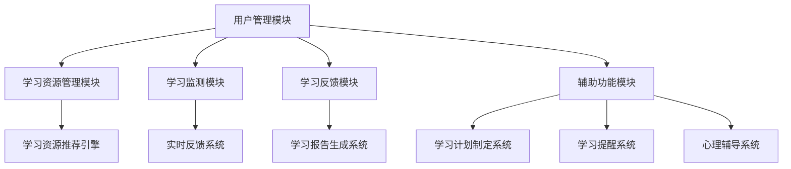
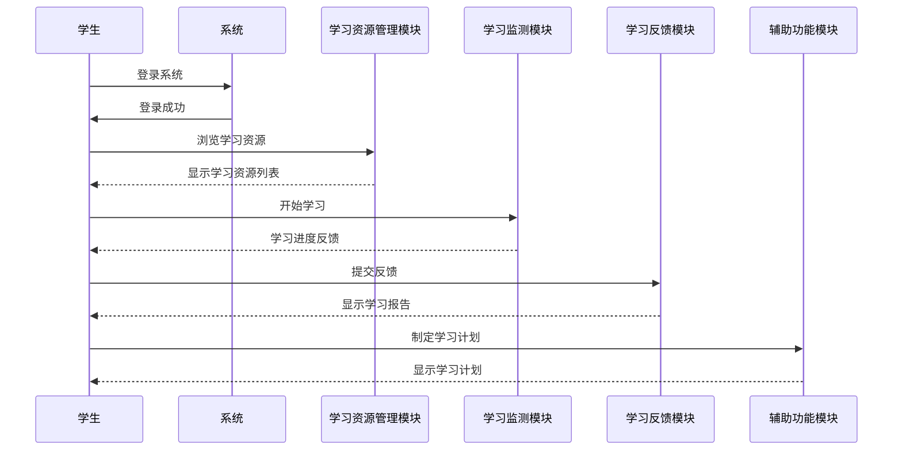
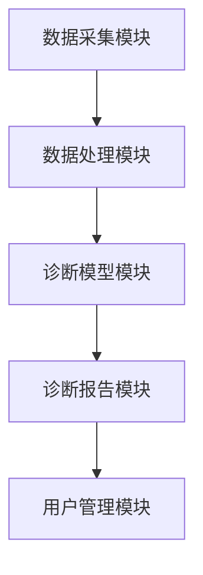

                 


### 1.1.1 问题的提出

在当今的教育领域，个性化学习已成为一种备受关注的教育理念。个性化学习旨在根据每个学生的特点和需求，制定个性化的学习计划，从而提高学习效果。然而，对于认知障碍学生的个性化学习需求，教育界和科研界仍面临诸多挑战。首先，认知障碍的诊断和干预方法尚未完全成熟，导致许多学生无法获得及时、有效的帮助。其次，传统教育模式通常无法满足认知障碍学生的学习需求，导致他们学习效果不佳，甚至产生厌学情绪。

在这个背景下，人工智能（AI）技术的引入为解决这些问题提供了新的可能。AI具有强大的数据处理和分析能力，可以准确诊断认知障碍，并为干预提供个性化建议。此外，AI还可以通过实时监测学生的学习状态，动态调整学习策略，提高学习效果。然而，AI在个性化学习认知障碍诊断与干预中的具体应用研究仍处于起步阶段，需要进一步探索和实践。

### 1.1.2 AI在个性化学习中的重要性

个性化学习强调因材施教，关注每个学生的个体差异。AI技术在这一领域具有独特的优势。首先，AI可以通过大数据分析，了解学生的学习行为和特点，为个性化学习提供数据支持。其次，AI可以根据学生的学习情况，自动调整教学内容和难度，提高学习效率。此外，AI还可以通过智能推荐，为学生提供个性化的学习资源，满足他们的学习需求。

在认知障碍诊断与干预方面，AI技术同样具有重要意义。认知障碍的诊断需要大量的数据支持，而AI可以通过机器学习算法，从海量的数据中提取有用信息，提高诊断准确率。在干预方面，AI可以根据诊断结果，为学生制定个性化的干预方案，提高干预效果。此外，AI还可以通过实时监测，动态调整干预策略，确保干预措施的有效性。

### 1.1.3 认知障碍诊断与干预的需求

认知障碍是一种常见的心理障碍，主要包括注意力缺陷、多动障碍、自闭症等。认知障碍学生通常在学习过程中面临诸多困难，如注意力不集中、学习困难、社交能力差等。这些困难不仅影响他们的学习成绩，还可能导致他们产生自卑、厌学等负面情绪。

针对认知障碍的诊断与干预需求迫切。首先，认知障碍的诊断需要专业的知识和技能，而传统方法往往耗时较长、准确率较低。其次，干预措施需要根据学生的具体情况制定，以确保其有效性。然而，由于认知障碍学生的个体差异较大，传统教育模式难以满足他们的需求。因此，利用AI技术进行认知障碍诊断与干预，成为当前教育领域的重要研究方向。

### 1.2 AI技术发展的现状与趋势

AI技术在过去几十年取得了飞速发展，已经成为各个领域的重要工具。在教育领域，AI技术已被广泛应用于智能教学、教育评估、学生行为分析等方面。例如，智能教学系统可以根据学生的学习进度和特点，自动调整教学内容和难度；教育评估系统可以实时监测学生的学习情况，为教师提供教学反馈。

在认知障碍诊断与干预方面，AI技术也取得了显著成果。首先，通过机器学习算法，AI可以从海量的数据中提取有用信息，提高认知障碍的诊断准确率。其次，AI可以通过智能推荐，为认知障碍学生提供个性化的干预方案，提高干预效果。此外，AI还可以通过实时监测，动态调整干预策略，确保干预措施的有效性。

未来，AI技术在个性化学习认知障碍诊断与干预中的应用将更加广泛。一方面，随着计算能力的提升，AI将能够处理更复杂、更海量的数据，提高诊断和干预的准确性。另一方面，随着AI技术的不断进步，将会有更多创新的应用模式出现，为认知障碍诊断与干预提供新的思路和方法。

### 1.2.1 AI技术的发展历程

人工智能（AI）技术的发展历程可以分为几个关键阶段。首先，从20世纪50年代开始，AI研究主要集中在符号主义和知识表示领域。这一阶段的代表性成果包括逻辑推理系统和专家系统。

20世纪80年代，AI研究进入了连接主义阶段。这一阶段的代表性成果是神经网络和深度学习算法。神经网络通过模拟人脑的神经网络结构，能够从大量数据中自动学习特征，从而实现复杂任务的自动执行。

进入21世纪，AI技术进入了大数据和云计算时代。随着数据量的爆炸式增长和计算能力的提升，AI技术开始广泛应用于各个领域。例如，在医疗领域，AI技术被用于疾病诊断和个性化治疗；在教育领域，AI技术被用于智能教学和个性化学习。

在教育领域，AI技术的应用主要体现在以下几个方面：智能教学系统、教育评估系统和学生行为分析。智能教学系统可以根据学生的学习进度和特点，自动调整教学内容和难度，提高学习效率。教育评估系统可以实时监测学生的学习情况，为教师提供教学反馈。学生行为分析系统可以分析学生的学习行为，为教师提供个性化指导。

### 1.2.2 个性化学习的理论基础

个性化学习是一种基于学生个体差异的教育理念，旨在通过因材施教，提高学生的学习效果。个性化学习的理论基础主要包括以下几个方面：

首先，个性化学习强调学生的主体地位。每个学生都是独特的个体，具有不同的兴趣、能力和学习风格。因此，教育应该尊重学生的个体差异，根据学生的特点和需求，制定个性化的学习计划。

其次，个性化学习关注学生的学习过程。传统教育注重知识传授，而个性化学习则强调学习过程，关注学生在学习过程中的体验和感受。通过关注学习过程，个性化学习能够更好地激发学生的学习兴趣和主动性。

再次，个性化学习强调教学方法的多样化。不同的学生适合不同的教学方法，个性化学习主张根据学生的特点和需求，采用多元化的教学方法，以提高教学效果。

最后，个性化学习强调家校合作。家庭是学生成长的重要环境，家校合作能够更好地促进学生的个性化发展。通过家校合作，教师和家长可以共同关注学生的成长，为学生提供更加全面的教育支持。

### 1.2.3 认知障碍诊断与干预的最新进展

认知障碍诊断与干预是当前教育领域和医学领域的重要研究方向。近年来，随着AI技术的不断发展，认知障碍诊断与干预取得了显著进展。

在诊断方面，AI技术通过机器学习算法，可以从海量的数据中提取有用信息，提高诊断准确率。例如，研究人员利用深度学习算法，从学生行为数据中提取特征，实现了对注意力缺陷多动障碍（ADHD）的自动诊断。此外，AI技术还可以通过实时监测学生的行为和生理信号，实现认知障碍的早期预警。

在干预方面，AI技术同样发挥了重要作用。首先，AI可以根据诊断结果，为学生制定个性化的干预方案，提高干预效果。例如，研究人员利用生成对抗网络（GAN），为学生生成个性化的学习内容，提高了学生的学习兴趣和效果。其次，AI可以通过实时监测学生的学习状态，动态调整干预策略，确保干预措施的有效性。例如，研究人员利用深度强化学习算法，实现了对认知障碍学生的实时干预，提高了干预的准确性和效率。

此外，AI技术在认知障碍诊断与干预中的应用还包括智能推荐系统、虚拟现实（VR）教学等。智能推荐系统可以根据学生的兴趣和学习需求，推荐合适的学习资源和教学方法。VR教学则通过模拟真实场景，帮助学生更好地理解和掌握知识。

总的来说，AI技术在认知障碍诊断与干预中的应用，为教育领域和医学领域带来了新的发展机遇。未来，随着AI技术的不断进步，认知障碍诊断与干预将更加精准、高效，为认知障碍学生提供更好的帮助。

### 1.3.1 各章节内容概述

本书共分为五个部分，分别从不同角度探讨AI在个性化学习认知障碍诊断与干预中的动态应用。以下是各部分的内容概述：

**第一部分：引言与背景**  
本部分主要介绍书籍的主题、目标以及AI在个性化学习和认知障碍诊断与干预中的重要性。包括问题的提出、AI技术的发展现状与趋势、个性化学习的理论基础以及认知障碍诊断与干预的最新进展等内容。

**第二部分：个性化学习与认知障碍**  
本部分重点探讨个性化学习的核心概念、认知障碍的定义与分类、认知障碍对学习的影响以及AI在认知障碍诊断与干预中的应用。通过本部分的阅读，读者可以了解个性化学习和认知障碍的基本概念，以及AI技术在这两个领域的应用前景。

**第三部分：AI技术在个性化学习中的应用实践**  
本部分详细介绍AI技术在个性化学习中的应用实践，包括数据采集与处理、机器学习算法在认知障碍诊断中的应用、个性化学习策略的制定等内容。通过本部分的阅读，读者可以了解AI技术在个性化学习中的具体应用方法，并学会如何将AI技术应用于实际教学场景。

**第四部分：认知障碍诊断与干预案例分析**  
本部分通过三个实际案例，详细阐述AI技术在认知障碍诊断与干预中的应用。案例涵盖了基于AI的个性化学习系统设计、认知障碍诊断系统的开发以及认知障碍干预策略的应用。通过案例分析，读者可以深入了解AI技术在认知障碍诊断与干预中的实际应用效果。

**第五部分：动态应用与未来展望**  
本部分讨论AI在个性化学习认知障碍中的动态应用，包括动态调整学习策略、实时监测认知状态、个性化反馈与指导等内容。同时，本部分还探讨了AI技术的发展趋势、个性化学习的未来挑战以及认知障碍诊断与干预的发展方向。通过本部分的阅读，读者可以展望AI技术在教育领域的未来发展趋势。

### 1.3.2 学习方法与读者定位

为了更好地理解本书的内容，我们建议读者采用以下学习方法：

1. **循序渐进阅读**：本书的内容涉及多个领域，包括人工智能、教育心理学、医学等。读者在阅读时，可以先从基础概念入手，逐步深入到具体应用。

2. **结合案例学习**：本书中的案例分析部分，提供了丰富的实际应用案例。读者可以通过阅读案例，了解AI技术在个性化学习认知障碍诊断与干预中的具体应用场景和方法。

3. **实践操作**：本书附录中提供了相关的代码和数据集，读者可以尝试在本地环境中运行相关代码，加深对AI技术原理和应用方法的理解。

4. **交流讨论**：读者可以加入本书的读者群，与其他读者交流学习心得，共同探讨问题解决方案。

本书的读者主要定位为：

- **教育领域工作者**：包括教师、教育研究人员、教育管理人员等，希望了解和掌握AI技术在个性化学习和认知障碍诊断与干预中的应用。

- **计算机科学领域从业者**：包括AI算法工程师、数据科学家、软件开发工程师等，希望深入了解AI技术在教育领域的应用。

- **医学领域工作者**：包括临床医生、心理医生、医学研究人员等，希望了解和掌握AI技术在认知障碍诊断与干预中的应用。

- **对AI与教育领域感兴趣的大众**：包括对人工智能和教育领域感兴趣的学生、业余爱好者等，希望深入了解AI技术在个性化学习和认知障碍诊断与干预中的应用。

### 1.4 本章小结

本章作为引言部分，主要介绍了书籍的主题、目标以及AI在个性化学习和认知障碍诊断与干预中的重要性。通过本章的阅读，读者可以了解本书的基本内容和学习方法，为后续章节的学习打下基础。本章还简要介绍了AI技术的发展现状与趋势、个性化学习的理论基础以及认知障碍诊断与干预的最新进展，为读者提供了对本书主题的全面了解。通过本章的学习，读者可以对AI在个性化学习认知障碍诊断与干预中的应用有一个初步的认识，激发他们对后续章节内容的兴趣。

----------------------------------------------------------------

## 2.1 个性化学习的核心概念

个性化学习，顾名思义，是一种根据学生个体差异进行教育的方法。其核心理念是尊重学生的独特性，针对每个学生的兴趣、能力、学习风格等特征，设计并实施个性化的学习计划和教学策略。这一概念不仅体现了现代教育对个体差异的关注，也回应了传统教育模式中“一刀切”的不足。

### 2.1.1 个性化学习的定义

个性化学习，通常被定义为“通过识别和满足学生的个体差异，为每个学生提供最佳学习体验的教育方式”（Fisher et al., 2007）。这包括以下几个方面：

1. **学生中心**：个性化学习强调以学生为中心，关注学生的兴趣、需求和认知特点。
2. **因材施教**：根据学生的个体差异，制定适合其特点的教学内容和教学方法。
3. **动态调整**：教学过程中，根据学生的反馈和学习表现，动态调整教学计划，以确保教学效果的最大化。
4. **多渠道互动**：鼓励学生与教师、同伴以及学习资源之间的多渠道互动，以促进学生的全面发展。

### 2.1.2 个性化学习的特点

个性化学习具有以下几个显著特点：

1. **灵活性**：个性化学习方案可以根据学生的学习进度、兴趣和能力灵活调整，适应不同学生的需求。
2. **针对性**：教学目标、内容和方法针对学生的个体差异进行定制，提高教学的针对性和有效性。
3. **自主性**：鼓励学生在学习过程中发挥主动性，制定自己的学习目标和计划，培养自主学习能力。
4. **多样性**：个性化学习支持多种学习方式的组合，如在线学习、小组讨论、实践操作等，满足学生的多样化学习需求。

### 2.1.3 个性化学习的方法与策略

实施个性化学习，需要采取一系列具体的方法和策略：

1. **差异化教学**：根据学生的认知水平、兴趣和需求，设计不同的教学目标和内容，采取不同的教学方法。
2. **个性化评估**：采用多元化、动态化的评估方式，关注学生的学习过程和个体差异，及时反馈并调整教学策略。
3. **学习路径规划**：根据学生的特点和需求，制定个性化的学习路径，引导学生逐步达成学习目标。
4. **学习支持服务**：提供个性化的学习支持服务，如学习辅导、心理辅导、学习资源推荐等，帮助学生克服学习困难。
5. **技术应用**：利用AI技术、大数据分析等手段，对学生的学习行为和结果进行深入分析，为个性化学习提供数据支持。

### 2.1.4 个性化学习的核心概念与联系

为了更好地理解个性化学习的核心概念，我们可以通过一个概念属性特征对比表格和ER实体关系图架构来阐述其组成和联系。

#### 概念属性特征对比表格

| 概念             | 属性特征                                                   |
|------------------|------------------------------------------------------------|
| 个性化学习       | 以学生为中心、因材施教、动态调整、多渠道互动             |
| 差异化教学       | 根据学生的认知水平、兴趣和需求，设计不同的教学目标和内容 |
| 个性化评估       | 多元化、动态化、关注过程和个体差异                         |
| 学习路径规划     | 根据学生特点和需求，制定个性化的学习路径                   |
| 学习支持服务     | 学习辅导、心理辅导、学习资源推荐等                        |
| 技术应用         | AI技术、大数据分析等                                      |

#### ER实体关系图架构

```mermaid
erDiagram
    Student ||--|{ LearningData }|>>
    Teacher ||--|{ TeachingPlan }|>>
    Classroom ||--|{ LearningActivity }|>>
    Assessment ||--|{ AssessmentResult }|>>

    Student {
        int StudentID
        String Name
        Date BirthDate
        String School
    }

    LearningData {
        int LearningDataID
        Date RecordDate
        String Content
        String Status
    }

    Teacher {
        int TeacherID
        String Name
        String Subject
    }

    TeachingPlan {
        int TeachingPlanID
        Date StartDate
        Date EndDate
        String Description
    }

    Classroom {
        int ClassroomID
        String ClassName
        int TeacherID
    }

    LearningActivity {
        int LearningActivityID
        Date ActivityDate
        String Description
        int ClassroomID
    }

    AssessmentResult {
        int AssessmentResultID
        Date AssessmentDate
        String Result
        int StudentID
        int ClassroomID
    }
```

在个性化学习中，学生、教师、学习数据、教学计划、学习活动和评估结果等实体之间存在紧密的联系。例如，学生的学习数据可以用于生成个性化教学计划，教师根据教学计划制定学习活动，学生的学习活动和评估结果又可以反馈给教师，用于调整后续的教学策略。

### 2.1.5 本章小结

本章详细介绍了个性化学习的核心概念、定义、特点、方法与策略，并通过概念属性特征对比表格和ER实体关系图架构，阐述了个性化学习的组成和联系。通过本章的学习，读者可以全面了解个性化学习的基本概念和实施方法，为进一步探讨AI在个性化学习中的应用打下基础。

----------------------------------------------------------------

## 2.2 认知障碍概述

认知障碍是指大脑功能受损，导致个体在感知、记忆、思维、语言和执行等方面出现障碍的一组症状。认知障碍可能由多种原因引起，包括神经退行性疾病、脑外伤、感染、中毒、遗传因素等。认知障碍不仅影响个体的日常生活和工作能力，还可能导致心理健康问题，如焦虑和抑郁。

### 2.2.1 认知障碍的定义与分类

认知障碍的定义涉及多个领域，包括神经科学、心理学和医学。在神经科学领域，认知障碍通常被定义为大脑功能异常导致的认知能力减退。在心理学领域，认知障碍则更多地关注个体在感知、记忆、思维和语言等方面的功能障碍。在医学领域，认知障碍被视为一种疾病症状，通常与特定的病理过程相关。

认知障碍的分类方法多种多样，可以根据病因、临床表现和病程等进行分类。以下是一些常见的认知障碍类型：

1. **轻度认知障碍（MCI）**：MCI是指认知功能轻度受损，但尚未达到痴呆程度的状况。MCI患者通常在记忆、注意力和执行功能等方面出现困难，但日常生活能力基本不受影响。

2. **阿尔茨海默病（AD）**：阿尔茨海默病是最常见的神经退行性疾病，表现为进行性认知功能下降，尤其是记忆障碍。病情晚期，患者可能完全失去认知能力，需要他人照料。

3. **血管性认知障碍（VCI）**：血管性认知障碍由脑血管疾病引起，如脑卒中、高血压等。VCI的症状包括记忆力减退、注意力不集中、执行功能受损等。

4. **创伤后认知障碍（TBI）**：创伤后认知障碍由脑外伤引起，常见于交通事故、体育运动和军事冲突等。TBI的症状包括意识障碍、记忆力减退、注意力不集中等。

5. **混合性认知障碍**：混合性认知障碍是指同时存在多种类型的认知障碍，如阿尔茨海默病和血管性认知障碍。

### 2.2.2 认知障碍对学习的影响

认知障碍对学习的影响是多方面的，主要表现在以下几个方面：

1. **记忆障碍**：记忆障碍是认知障碍最常见的症状之一，导致个体难以记住新信息或回忆旧信息。这种障碍会影响学生的学习效果，尤其是涉及记忆和回忆的教学活动。

2. **注意力障碍**：注意力障碍使个体难以集中精力，容易分心。这会干扰学生的听课、阅读和理解能力，导致学习效率下降。

3. **执行功能障碍**：执行功能障碍包括计划、组织、解决问题和决策能力等方面的障碍。这些障碍会严重影响学生的学习过程，使其难以完成复杂的任务。

4. **语言障碍**：语言障碍影响个体的语言理解、表达和沟通能力，从而影响学习交流和知识获取。

5. **情绪和心理健康问题**：认知障碍患者常伴有情绪和心理健康问题，如焦虑、抑郁和自卑感。这些问题会进一步影响学生的学习动力和情绪状态。

### 2.2.3 认知障碍诊断标准与流程

认知障碍的诊断是一个复杂的过程，需要结合临床表现、神经心理学评估、影像学检查等多种手段。以下是一个典型的认知障碍诊断流程：

1. **病史采集**：医生会详细询问患者的病史，包括认知障碍的症状、病程、诱发因素等。

2. **体格检查**：医生会进行体格检查，观察患者的基本生命体征、神经系统功能等。

3. **神经心理学评估**：通过一系列神经心理学测试，评估患者的认知功能，如记忆、注意力、执行功能、语言能力等。

4. **影像学检查**：如CT、MRI等影像学检查，用于检测脑结构变化和病变。

5. **实验室检查**：血液、尿液等实验室检查，用于排除其他可能引起认知障碍的疾病。

6. **诊断与鉴别诊断**：根据病史、体格检查、神经心理学评估和影像学检查结果，医生会综合判断患者的认知障碍类型，并进行鉴别诊断。

### 2.2.4 认知障碍的干预策略

认知障碍的干预策略旨在改善患者的认知功能，提高生活质量。以下是一些常见的干预方法：

1. **药物治疗**：针对病因，如阿尔茨海默病可使用胆碱酯酶抑制剂等药物进行治疗。

2. **认知康复训练**：通过专门的认知训练方法，如记忆训练、注意力训练、执行功能训练等，帮助患者提高认知能力。

3. **心理支持**：为患者提供心理支持和咨询，帮助他们应对情绪和心理压力。

4. **辅助技术**：利用辅助技术，如记忆辅助工具、语音合成器等，帮助患者更好地适应日常生活。

5. **环境适应**：为患者创造一个适宜的生活环境，减少认知障碍带来的困难。

### 2.2.5 本章小结

本章对认知障碍进行了概述，包括定义、分类、对学习的影响、诊断标准和干预策略。通过本章的学习，读者可以了解认知障碍的基本知识，为后续讨论AI技术在认知障碍诊断与干预中的应用打下基础。认知障碍不仅影响个体的学习效果，还对他们的日常生活和心理健康产生深远影响，因此，有效的诊断和干预策略至关重要。

----------------------------------------------------------------

## 2.3 AI在个性化学习认知障碍中的应用

随着人工智能（AI）技术的不断发展，其在个性化学习认知障碍诊断与干预中的应用越来越受到关注。AI技术具有强大的数据处理和分析能力，能够从大量的数据中提取有价值的信息，为个性化学习和认知障碍诊断提供有力的支持。以下将详细探讨AI技术在这两个领域的具体应用。

### 2.3.1 AI技术的优势

AI技术在个性化学习认知障碍诊断与干预中的应用具有以下优势：

1. **高效的数据处理能力**：AI技术可以快速处理和分析大量数据，从而发现潜在的模式和规律，提高诊断和干预的准确性和效率。

2. **智能化的诊断和干预**：AI技术可以根据个体的具体情况进行智能化的诊断和干预，提供个性化的解决方案，从而更好地满足个体的需求。

3. **实时监测与动态调整**：AI技术可以通过实时监测个体的学习状态和认知表现，动态调整诊断和干预策略，确保干预措施的有效性和及时性。

4. **跨学科融合**：AI技术可以融合不同领域的知识，如医学、教育学、心理学等，为个性化学习和认知障碍诊断提供更加全面和深入的支持。

### 2.3.2 AI在认知障碍诊断中的应用

在认知障碍诊断方面，AI技术已经展现出强大的应用潜力。以下是一些具体的应用实例：

1. **深度学习算法**：深度学习算法可以从大量的脑影像数据中提取特征，实现自动化的认知障碍诊断。例如，卷积神经网络（CNN）可以用于分析MRI图像，识别脑部病变区域，从而帮助诊断阿尔茨海默病等神经退行性疾病。

2. **强化学习算法**：强化学习算法可以根据患者的实时表现，自动调整诊断测试的顺序和难度，提高诊断的准确性。例如，可以设计一个强化学习模型，通过试错学习，逐步优化认知障碍诊断测试，提高诊断效率。

3. **迁移学习**：迁移学习可以通过利用已有的诊断模型，在新数据集上进行训练，从而提高认知障碍诊断的准确性和效率。例如，可以将已有的深度学习模型应用于不同的认知障碍诊断任务，如注意力缺陷多动障碍（ADHD）和自闭症谱系障碍（ASD）等。

4. **多模态数据融合**：多模态数据融合可以将不同来源的数据（如脑影像、行为数据、生理信号等）进行整合，提高认知障碍诊断的准确性。例如，将脑影像数据与行为数据相结合，可以更全面地评估患者的认知状态。

### 2.3.3 AI在认知障碍干预中的应用

在认知障碍干预方面，AI技术同样发挥着重要作用。以下是一些具体的应用实例：

1. **个性化干预方案**：AI技术可以根据患者的具体情况进行个性化的干预方案设计。例如，基于深度学习算法，可以分析患者的认知障碍类型和严重程度，生成个性化的训练计划，提高干预效果。

2. **实时监测与动态调整**：AI技术可以通过实时监测患者的认知表现，动态调整干预策略。例如，利用智能传感器和机器学习算法，可以实时监测患者的注意力水平、情绪状态等，根据监测结果，动态调整干预措施，确保干预的及时性和有效性。

3. **自动化干预**：AI技术可以实现自动化干预，降低人力成本。例如，利用自然语言处理（NLP）技术，可以设计智能聊天机器人，为认知障碍患者提供实时、个性化的支持和服务。

4. **虚拟现实（VR）干预**：利用AI和VR技术，可以设计出更加真实、互动的干预场景，提高患者的参与度和干预效果。例如，通过VR技术，可以模拟社交互动场景，帮助自闭症儿童提高社交技能。

### 2.3.4 AI在个性化学习中的应用

在个性化学习方面，AI技术同样具有广泛的应用前景。以下是一些具体的应用实例：

1. **个性化学习路径规划**：AI技术可以根据学生的学习特点和学习数据，自动规划个性化的学习路径。例如，利用深度学习算法，可以分析学生的学习行为和学习效果，生成个性化的学习路径，提高学习效果。

2. **个性化学习资源推荐**：AI技术可以根据学生的学习需求和兴趣，推荐合适的学习资源和教学方法。例如，利用推荐系统算法，可以分析学生的学习记录和学习偏好，推荐相关的学习资源和课程。

3. **个性化学习评估**：AI技术可以通过实时评估学生的学习过程和效果，提供个性化的学习反馈。例如，利用自然语言处理技术，可以分析学生的学习回答，提供针对性的反馈和指导。

4. **智能教学辅助**：AI技术可以设计出智能的教学辅助工具，提高教师的教学效率和效果。例如，利用生成对抗网络（GAN），可以生成个性化的教学视频，帮助学生更好地理解和掌握知识。

### 2.3.5 本章小结

本章详细介绍了AI技术在个性化学习认知障碍诊断与干预中的应用，包括数据处理能力、智能化诊断和干预、实时监测与动态调整等方面。通过这些应用实例，可以看出AI技术在提高认知障碍诊断和干预的准确性和效率方面具有巨大的潜力。未来，随着AI技术的不断进步，其在个性化学习和认知障碍诊断与干预中的应用将会更加广泛和深入。

----------------------------------------------------------------

## 3.1 数据采集与处理

在AI技术的应用中，数据采集与处理是至关重要的一环。对于个性化学习和认知障碍诊断与干预，数据的质量和准确性直接影响模型的性能和干预效果。以下将详细讨论数据采集的方法、数据预处理的重要性和常见的数据预处理技术。

### 3.1.1 学习数据的来源

学习数据的主要来源包括以下几类：

1. **学校系统数据**：包括学生的成绩记录、学习进度、课堂表现等。这些数据通常由学校的管理信息系统自动生成。

2. **教师记录数据**：教师会在日常教学中记录学生的学习表现、作业完成情况、课堂参与度等。这些数据可以为AI模型提供更详细的背景信息。

3. **学生自我报告数据**：学生可以通过问卷或自我评估工具报告自己的学习体验、兴趣和需求。这类数据有助于了解学生的主观感受。

4. **生理信号数据**：包括心率、皮肤电活动、眼动跟踪等。这些数据可以反映学生的情绪状态、注意力水平和认知负荷。

5. **社交媒体和行为数据**：学生在社交媒体上的互动、在线学习平台的访问记录等，可以提供关于学生学习习惯和社交互动的信息。

### 3.1.2 数据预处理的重要性

数据预处理是数据分析和机器学习过程中不可或缺的一步。其主要目的是提高数据质量，减少噪声，使数据更适合模型训练。以下是数据预处理的重要性：

1. **提高模型性能**：通过数据预处理，可以消除数据中的噪声和异常值，使模型能够更好地捕捉数据中的有用信息，从而提高模型的性能。

2. **减少过拟合**：过拟合是机器学习中的一个常见问题，指的是模型在训练数据上表现很好，但在新的测试数据上表现不佳。数据预处理可以通过数据标准化、特征选择等技术，减少模型的过拟合现象。

3. **加速模型训练**：通过数据预处理，可以减少数据的维度和规模，从而加速模型的训练过程。

4. **确保数据一致性**：数据预处理可以帮助统一数据格式和单位，确保不同来源的数据能够兼容并顺利集成。

### 3.1.3 常见的数据预处理技术

常见的数据预处理技术包括以下几种：

1. **数据清洗**：数据清洗是数据预处理的第一步，目的是识别和修正数据中的错误、缺失和异常值。常见的方法包括删除异常值、填补缺失值和纠正错误数据。

2. **数据标准化**：数据标准化是将不同单位、不同尺度的数据转换为同一尺度，以便进行后续分析。常用的标准化方法有最小-最大标准化、Z-score标准化等。

3. **特征选择**：特征选择是从大量特征中筛选出对模型训练最有用的特征，以减少数据的维度和计算复杂度。常见的方法有相关性分析、信息增益、主成分分析（PCA）等。

4. **数据归一化**：数据归一化是将数据映射到一个新的区间，通常用于机器学习中的输入特征。常见的归一化方法有线性变换、log变换等。

5. **数据增强**：数据增强是通过生成或修改现有数据，增加数据的多样性和丰富性，从而提高模型的泛化能力。常见的方法有数据扩充、图像旋转、缩放等。

### 3.1.4 数据预处理流程

一个典型数据预处理流程通常包括以下步骤：

1. **数据收集**：从各种数据源收集原始数据。

2. **数据探索**：使用数据探索工具（如Pandas、Seaborn等）对数据进行初步分析，识别数据中的异常和模式。

3. **数据清洗**：根据数据探索结果，删除或修正异常和错误数据。

4. **数据转换**：对数据格式、单位和类型进行转换，确保数据一致性。

5. **特征选择**：使用特征选择技术，筛选出对模型训练最有用的特征。

6. **数据标准化和归一化**：对特征进行标准化和归一化处理。

7. **数据存储**：将处理后的数据存储到数据库或数据湖中，以便后续分析。

### 3.1.5 数据可视化与分析

数据可视化是数据预处理的重要部分，它可以帮助我们直观地理解数据的特点和趋势。以下是一些常见的数据可视化工具和技巧：

1. **统计图表**：使用柱状图、折线图、饼图等统计图表，展示数据的分布、趋势和关系。

2. **散点图**：用于展示两个特征之间的关系，如散点图的分布和趋势。

3. **热力图**：用于展示多个特征之间的相关性，如皮尔逊相关系数矩阵的热力图。

4. **箱线图**：用于展示数据的分布、异常值和四分位距。

5. **时间序列图**：用于展示数据随时间的变化趋势。

6. **地理可视化**：用于展示地理位置相关的数据，如学生分布图。

### 3.1.6 数据预处理实践

为了更好地理解数据预处理的过程，以下是一个简单的数据预处理实践案例：

**案例：学生成绩数据预处理**

假设我们有一份包含学生成绩的数据集，数据包括学生的姓名、年龄、性别、班级、各科成绩等。

1. **数据收集**：从学校系统导出原始成绩数据。

2. **数据探索**：使用Pandas库，对数据进行描述性统计分析，识别异常值和缺失值。

   ```python
   import pandas as pd
   
   # 读取数据
   data = pd.read_csv('student_data.csv')
   
   # 描述性统计分析
   print(data.describe())
   print(data.isnull().sum())
   ```

3. **数据清洗**：删除异常值和缺失值。

   ```python
   # 删除缺失值
   data = data.dropna()
   
   # 删除异常值
   data = data[(data['math'] > 0) & (data['math'] < 100)]
   ```

4. **数据转换**：将数据格式和单位进行转换，例如将字符串类型的班级转换为数字编码。

   ```python
   data['class'] = data['class'].astype('category').cat.codes
   ```

5. **特征选择**：使用相关性分析，选择对成绩影响较大的特征。

   ```python
   import seaborn as sns
   
   # 计算相关性矩阵
   correlation_matrix = data.corr()
   
   # 绘制热力图
   sns.heatmap(correlation_matrix, annot=True)
   ```

6. **数据标准化和归一化**：对成绩等连续特征进行标准化处理。

   ```python
   from sklearn.preprocessing import StandardScaler
   
   # 初始化标准化器
   scaler = StandardScaler()
   
   # 对成绩进行标准化处理
   data[['math', 'english']] = scaler.fit_transform(data[['math', 'english']])
   ```

7. **数据存储**：将处理后的数据保存为新的CSV文件。

   ```python
   data.to_csv('cleaned_student_data.csv', index=False)
   ```

通过以上实践，我们可以看到数据预处理在提高数据质量和模型性能方面的重要作用。数据预处理不仅是一个技术过程，更是理解数据、发现问题和提出解决方案的重要手段。

### 3.1.7 本章小结

本章详细介绍了数据采集与处理的重要性，包括学习数据的来源、数据预处理的方法和技术，以及数据可视化与分析。通过这些内容，读者可以了解数据预处理在个性化学习和认知障碍诊断与干预中的关键作用，为后续的模型训练和应用打下坚实基础。

----------------------------------------------------------------

## 3.2 机器学习算法在认知障碍诊断中的应用

机器学习算法在认知障碍诊断中的应用具有重要的现实意义。通过有效的机器学习模型，可以从大量的临床数据和生物医学数据中提取有价值的信息，提高认知障碍的诊断准确性。以下将详细介绍几种常见的机器学习算法在认知障碍诊断中的应用。

### 3.2.1 算法选择与评估

在认知障碍诊断中，选择合适的机器学习算法是关键。以下是一些常用的算法及其特点：

1. **支持向量机（SVM）**：SVM是一种二分类算法，可以通过最大化分类边界来提高分类效果。在认知障碍诊断中，SVM可以用来分类不同类型的认知障碍，如阿尔茨海默病和轻度认知障碍。

2. **随机森林（Random Forest）**：随机森林是一种基于决策树的集成学习方法，具有很好的分类性能和鲁棒性。随机森林可以通过构建多个决策树，并利用投票机制来提高分类准确性，适用于处理高维度数据。

3. **朴素贝叶斯（Naive Bayes）**：朴素贝叶斯是一种基于贝叶斯理论的简单概率分类器。它假设特征之间相互独立，适用于处理稀疏数据和分类任务。

4. **神经网络（Neural Networks）**：神经网络是一种模拟人脑结构和功能的机器学习算法，具有强大的非线性建模能力。在认知障碍诊断中，神经网络可以用于处理复杂的生物医学数据，如脑影像和生理信号。

5. **深度学习（Deep Learning）**：深度学习是神经网络的一种扩展，通过多层神经元的堆叠，可以实现更复杂的特征提取和分类。深度学习算法在认知障碍诊断中表现出色，如卷积神经网络（CNN）和循环神经网络（RNN）等。

评估机器学习算法性能的指标包括准确率、召回率、F1分数等。这些指标可以综合评估模型的分类效果，帮助选择最优的算法。

### 3.2.2 特征工程与选择

特征工程是机器学习算法成功应用的关键步骤之一。在认知障碍诊断中，特征工程主要包括以下方面：

1. **数据预处理**：包括数据清洗、缺失值填补、数据标准化等。这些步骤有助于提高数据质量和模型的泛化能力。

2. **特征提取**：从原始数据中提取对诊断任务有用的特征。常见的特征提取方法有主成分分析（PCA）、线性判别分析（LDA）等。

3. **特征选择**：从大量的特征中筛选出对模型训练最有用的特征，以减少数据的维度和计算复杂度。常见的特征选择方法有基于信息的特征选择、基于模型的特征选择等。

在认知障碍诊断中，特征选择尤为重要。有效的特征选择可以减少模型的过拟合现象，提高诊断准确性。以下是一些常见的特征选择方法：

- **基于信息的特征选择**：例如信息增益、信息增益率等，通过计算特征与目标变量之间的信息相关性来选择特征。
- **基于模型的特征选择**：例如递归特征消除（RFE）、LASSO回归等，通过构建模型并评估特征对模型性能的影响来选择特征。

### 3.2.3 模型训练与优化

在认知障碍诊断中，模型训练与优化是确保模型性能的关键步骤。以下是一些常见的模型训练与优化方法：

1. **训练集与验证集划分**：将数据集划分为训练集和验证集，用于训练模型和评估模型性能。常用的划分方法有随机划分、交叉验证等。

2. **超参数调优**：超参数是影响模型性能的关键参数，如学习率、隐藏层神经元数等。常用的超参数调优方法有网格搜索、贝叶斯优化等。

3. **交叉验证**：交叉验证是一种评估模型性能的方法，通过将数据集划分为多个子集，每次使用一个子集作为验证集，其余子集作为训练集，进行多次训练和验证，以减少模型的过拟合现象。

4. **集成学习**：集成学习是一种通过组合多个模型来提高分类性能的方法。常见的集成学习方法有随机森林、梯度提升树（GBDT）等。

5. **模型评估**：使用评估指标（如准确率、召回率、F1分数等）来评估模型性能。如果模型性能不佳，可以通过调整超参数、增加数据量或更换算法来优化模型。

### 3.2.4 算法实现与案例分析

以下是一个简单的认知障碍诊断算法实现案例，使用Python和scikit-learn库进行模型训练和评估。

**案例：基于SVM的认知障碍诊断**

```python
from sklearn.model_selection import train_test_split
from sklearn.preprocessing import StandardScaler
from sklearn.svm import SVC
from sklearn.metrics import accuracy_score, classification_report

# 读取数据
data = pd.read_csv('cognitive_disorder_data.csv')

# 特征选择
X = data[['age', 'education', 'memory_score', 'attention_score']]
y = data['diagnosis']

# 数据标准化
scaler = StandardScaler()
X_scaled = scaler.fit_transform(X)

# 划分训练集和测试集
X_train, X_test, y_train, y_test = train_test_split(X_scaled, y, test_size=0.2, random_state=42)

# 训练SVM模型
model = SVC(kernel='linear')
model.fit(X_train, y_train)

# 预测测试集
y_pred = model.predict(X_test)

# 评估模型性能
accuracy = accuracy_score(y_test, y_pred)
print(f"Accuracy: {accuracy}")
print(classification_report(y_test, y_pred))
```

在这个案例中，我们使用了SVM算法进行认知障碍诊断。首先，我们读取数据，并进行特征选择和数据标准化。然后，将数据集划分为训练集和测试集，使用SVM模型进行训练，并预测测试集的结果。最后，使用准确率和分类报告评估模型的性能。

### 3.2.5 本章小结

本章详细介绍了机器学习算法在认知障碍诊断中的应用，包括算法选择与评估、特征工程与选择、模型训练与优化等方面。通过这些内容，读者可以了解如何利用机器学习算法进行认知障碍诊断，为实际应用提供理论支持和技术指导。

----------------------------------------------------------------

## 3.3 个性化学习策略的制定

在认知障碍学生的个性化学习中，制定有效的学习策略是关键。个性化学习策略旨在根据每个学生的认知特点和学习需求，提供定制化的学习支持和指导，以最大化学习效果。以下将详细讨论基于AI的个性化学习策略、学习路径规划与调整，以及教学效果评估与反馈。

### 3.3.1 基于AI的个性化学习策略

AI技术在个性化学习策略的制定中发挥了重要作用。以下是一些基于AI的个性化学习策略：

1. **自适应学习**：AI系统可以根据学生的学习进度、能力和兴趣，动态调整教学内容和难度，提供个性化的学习路径。例如，利用生成对抗网络（GAN）生成个性化的学习资源，或使用强化学习算法调整学习路径，使学习过程更加高效。

2. **智能推荐**：AI系统可以通过分析学生的学习行为和历史数据，推荐适合的学习资源、教学视频和练习题。例如，利用协同过滤算法推荐学习材料，或基于用户兴趣和学习历史进行内容推荐。

3. **情感识别**：AI系统可以利用自然语言处理（NLP）技术和情感分析，识别学生的情感状态，如焦虑、无聊、沮丧等。根据情感状态，AI可以提供针对性的心理支持或调整学习内容，帮助学生保持积极的学习态度。

4. **个性化反馈**：AI系统可以实时监测学生的学习过程，根据学生的回答和表现，提供个性化的反馈和指导。例如，利用机器学习算法分析学生的回答，识别错误类型，并提供针对性的纠正建议。

### 3.3.2 学习路径规划与调整

学习路径规划是个性化学习的重要环节。以下是一些学习路径规划与调整的方法：

1. **基于规则的路径规划**：根据学生的学习目标、能力和学习进度，制定固定的学习路径。例如，对于认知障碍学生，可以根据其认知特点和学习需求，制定针对性的学习任务和活动。

2. **基于数据驱动的路径规划**：利用AI技术和大数据分析，根据学生的实时学习数据，动态调整学习路径。例如，通过分析学生的学习行为、成绩和反馈，实时调整学习任务和难度，以适应学生的变化需求。

3. **多模态路径规划**：结合多种数据源，如学习行为、生理信号和情感状态等，进行综合分析，制定个性化的学习路径。例如，结合学生的学习行为数据和生理信号，调整学习时间和频率，以避免过度疲劳。

4. **迭代优化**：通过不断的反馈和调整，优化学习路径。例如，学生完成某个学习任务后，系统可以收集反馈，根据学生的表现和反馈，调整后续的学习任务和难度，以最大化学习效果。

### 3.3.3 教学效果评估与反馈

有效的教学效果评估与反馈是确保个性化学习策略有效性的关键。以下是一些教学效果评估与反馈的方法：

1. **实时监测**：通过AI技术实时监测学生的学习状态，如学习进度、注意力水平、情绪状态等。例如，利用智能传感器和眼动追踪技术，监测学生的学习和情感状态，及时发现学习困难。

2. **阶段性评估**：定期进行学习效果评估，以了解学生的学习进展和效果。例如，通过在线测试、作业分析和考试成绩，评估学生的知识掌握情况。

3. **个性化反馈**：根据学生的评估结果和学习数据，提供个性化的反馈和指导。例如，通过自然语言处理技术，生成个性化的反馈报告，指出学生的优点和改进方向。

4. **多维度评估**：结合不同维度的评估数据，全面了解学生的学习效果。例如，结合学习成绩、行为数据和教师评价，综合评估学生的学习效果。

5. **反馈循环**：建立反馈循环机制，将评估结果和反馈用于指导后续的学习策略和教学活动。例如，根据学生的反馈和评估结果，调整学习任务和教学方法，以提高学习效果。

### 3.3.4 本章小结

本章详细介绍了个性化学习策略的制定，包括基于AI的个性化学习策略、学习路径规划与调整，以及教学效果评估与反馈。通过这些方法，可以更好地满足认知障碍学生的学习需求，提高个性化学习的有效性。个性化学习策略的制定需要综合考虑学生的学习特点、需求和环境，结合AI技术的优势，提供针对性的支持和指导。

----------------------------------------------------------------

## 4.1 案例研究1：基于AI的个性化学习系统设计

在本案例研究中，我们将探讨一个基于AI的个性化学习系统的设计。该系统旨在为认知障碍学生提供定制化的学习支持和干预，提高其学习效果和自信心。以下将从案例背景、系统需求分析、系统设计与实现三个方面进行详细阐述。

### 4.1.1 案例背景

随着教育信息化和个性化学习的推进，越来越多的认知障碍学生需要特殊的教育支持。然而，传统教育模式往往难以满足这些学生的个性化需求，导致他们的学习效果不佳，甚至产生厌学情绪。因此，开发一个基于AI的个性化学习系统，为认知障碍学生提供实时、个性化的支持和干预，成为当前教育领域的一个重要研究方向。

### 4.1.2 系统需求分析

为了满足认知障碍学生的学习需求，个性化学习系统需要具备以下需求：

1. **个性化学习资源推荐**：系统应能够根据学生的学习特点和需求，推荐合适的学习资源，如教学视频、练习题和辅导资料。

2. **实时监测与反馈**：系统应能够实时监测学生的学习状态，如学习进度、注意力水平和情感状态，并提供及时的反馈和指导。

3. **动态调整学习路径**：系统应根据学生的学习表现和反馈，动态调整学习路径，确保学习内容与学生的认知水平相匹配。

4. **学习效果评估**：系统应能够定期评估学生的学习效果，提供学习报告和改进建议，帮助学生和家长了解学习进展。

5. **辅助功能**：系统应提供如学习计划制定、学习提醒、心理辅导等辅助功能，帮助学生更好地管理学习过程。

### 4.1.3 系统设计与实现

#### 系统功能设计

个性化学习系统主要包括以下几个功能模块：

1. **用户管理模块**：用于管理学生的个人信息、学习记录和偏好设置。

2. **学习资源管理模块**：用于存储和管理各种学习资源，如教学视频、练习题和辅导资料。

3. **学习监测模块**：用于实时监测学生的学习状态，包括学习进度、注意力水平和情感状态。

4. **学习反馈模块**：用于收集学生的反馈信息，并生成学习报告。

5. **辅助功能模块**：用于提供学习计划制定、学习提醒、心理辅导等辅助功能。

#### 系统架构设计

个性化学习系统的架构设计如图4.1所示：



#### 系统接口设计

个性化学习系统的接口设计主要包括以下几个方面：

1. **用户接口**：用户通过Web界面或移动应用与系统进行交互，完成学习资源浏览、学习状态监测和反馈等功能。

2. **API接口**：系统提供API接口，支持与其他系统的数据交换和功能调用。

3. **数据接口**：系统通过数据库和数据仓库，存储和管理各种学习数据，包括用户信息、学习记录、监测数据和反馈信息等。

#### 系统交互设计

个性化学习系统的交互设计如图4.2所示：



#### 系统实现

个性化学习系统的实现主要包括以下几个步骤：

1. **需求分析**：与教育专家和认知障碍学生及其家长进行沟通，明确系统功能需求。

2. **系统设计**：根据需求分析结果，设计系统架构和接口。

3. **开发与测试**：使用Python、JavaScript和HTML等编程语言，开发系统的各个模块，并进行单元测试和集成测试。

4. **部署与维护**：将系统部署到服务器，进行实际应用，并根据用户反馈进行持续改进和优化。

### 4.1.4 案例分析

通过该案例研究，我们可以看到基于AI的个性化学习系统在认知障碍诊断与干预中的重要作用。以下是对案例的分析：

1. **个性化学习资源推荐**：通过分析学生的学习历史和偏好，系统可以推荐合适的学习资源，提高学习兴趣和效果。

2. **实时监测与反馈**：通过实时监测学生的学习状态，系统可以及时发现学习困难，提供及时的反馈和指导，帮助学生克服学习障碍。

3. **动态调整学习路径**：根据学生的学习表现和反馈，系统可以动态调整学习路径，确保学习内容与学生的认知水平相匹配，提高学习效果。

4. **学习效果评估**：通过定期评估学生的学习效果，系统可以提供学习报告和改进建议，帮助家长和教师了解学生的学习进展，制定更有效的干预策略。

总之，基于AI的个性化学习系统为认知障碍学生提供了实时、个性化的支持和干预，有助于提高其学习效果和自信心。未来，随着AI技术的不断进步，该系统将更加智能和高效，为认知障碍学生提供更好的帮助。

### 4.1.5 本章小结

本章通过案例研究的方式，详细介绍了基于AI的个性化学习系统的设计。从案例背景、系统需求分析、系统设计与实现等方面，阐述了个性化学习系统在认知障碍诊断与干预中的应用。通过案例分析，我们可以看到基于AI的个性化学习系统在提高认知障碍学生的学习效果和自信心方面具有显著作用。未来，随着AI技术的不断发展和完善，个性化学习系统将为认知障碍学生提供更加智能和有效的支持。

----------------------------------------------------------------

## 4.2 案例研究2：认知障碍诊断系统的开发

在本案例研究中，我们将探讨一个认知障碍诊断系统的开发。该系统旨在利用AI技术，为认知障碍提供高效、准确的诊断支持，从而帮助医生和教师更好地理解和干预认知障碍患者。以下将从案例背景、系统需求分析、系统设计与实现三个方面进行详细阐述。

### 4.2.1 案例背景

随着社会的进步和人口老龄化，认知障碍患者的数量不断增加。认知障碍不仅影响患者的生活质量，还增加了家庭和社会的负担。传统的认知障碍诊断方法主要依赖于医生的诊断经验和神经心理学测试，存在诊断准确率低、耗时较长等问题。因此，开发一个基于AI技术的认知障碍诊断系统，以提高诊断准确性和效率，成为当前医学和人工智能领域的一个重要研究方向。

### 4.2.2 系统需求分析

为了满足认知障碍诊断的需求，认知障碍诊断系统需要具备以下需求：

1. **高效的数据处理**：系统能够处理来自多种数据源的大量数据，包括临床数据、神经心理学测试结果和生物医学信号等。

2. **准确的诊断模型**：系统应具备高准确率的诊断模型，能够准确区分不同类型的认知障碍。

3. **动态调整诊断策略**：系统能够根据患者的实时表现和诊断结果，动态调整诊断策略，提高诊断效率。

4. **友好的用户界面**：系统应提供直观、易用的用户界面，方便医生和教师使用。

5. **多语言支持**：系统应支持多种语言，满足不同国家和地区的使用需求。

### 4.2.3 系统设计与实现

#### 系统功能设计

认知障碍诊断系统主要包括以下几个功能模块：

1. **数据采集模块**：用于收集和管理各种类型的诊断数据，如临床数据、神经心理学测试结果和生物医学信号。

2. **数据处理模块**：用于对采集到的数据进行分析和处理，提取有用的诊断信息。

3. **诊断模型模块**：用于构建和训练诊断模型，实现认知障碍的自动诊断。

4. **诊断报告模块**：用于生成诊断报告，提供诊断结果和建议。

5. **用户管理模块**：用于管理用户信息，包括医生、教师和患者。

#### 系统架构设计

认知障碍诊断系统的架构设计如图4.3所示：



#### 系统接口设计

认知障碍诊断系统的接口设计主要包括以下几个方面：

1. **API接口**：系统提供API接口，支持与其他系统的数据交换和功能调用。

2. **数据接口**：系统通过数据库和数据仓库，存储和管理各种诊断数据。

3. **用户接口**：系统提供Web界面和移动应用，方便医生和教师使用。

#### 系统实现

认知障碍诊断系统的实现主要包括以下几个步骤：

1. **需求分析**：与医生、教师和患者进行沟通，明确系统功能需求。

2. **系统设计**：根据需求分析结果，设计系统架构和接口。

3. **开发与测试**：使用Python、Java和C#等编程语言，开发系统的各个模块，并进行单元测试和集成测试。

4. **部署与维护**：将系统部署到服务器，进行实际应用，并根据用户反馈进行持续改进和优化。

### 4.2.4 案例分析

通过该案例研究，我们可以看到基于AI技术的认知障碍诊断系统在提高诊断准确性和效率方面的巨大潜力。以下是对案例的分析：

1. **数据处理能力**：系统利用AI技术，能够高效处理来自多种数据源的大量数据，从而提高诊断的全面性和准确性。

2. **诊断模型准确性**：通过机器学习和深度学习算法，系统可以构建高准确率的诊断模型，提高认知障碍的诊断准确性。

3. **动态调整诊断策略**：系统可以根据患者的实时表现和诊断结果，动态调整诊断策略，提高诊断效率。

4. **用户界面友好**：系统提供直观、易用的用户界面，方便医生和教师使用，提高了系统的可用性。

5. **多语言支持**：系统支持多种语言，满足不同国家和地区的使用需求，提高了系统的国际化水平。

总之，基于AI技术的认知障碍诊断系统为认知障碍的诊断提供了高效、准确的工具，有助于医生和教师更好地理解和干预认知障碍患者。未来，随着AI技术的不断进步，该系统将更加智能和高效，为认知障碍患者提供更好的帮助。

### 4.2.5 本章小结

本章通过案例研究的方式，详细介绍了基于AI技术的认知障碍诊断系统的开发。从案例背景、系统需求分析、系统设计与实现等方面，阐述了认知障碍诊断系统在提高诊断准确性和效率方面的应用。通过案例分析，我们可以看到基于AI技术的认知障碍诊断系统在医疗领域的巨大潜力。未来，随着AI技术的不断发展和完善，认知障碍诊断系统将为更多的患者提供精准、高效的服务。

----------------------------------------------------------------

## 4.3 案例研究3：认知障碍干预策略的应用

在本案例研究中，我们将探讨一种基于AI技术的认知障碍干预策略的应用。该策略旨在通过个性化干预，帮助认知障碍患者提高生活质量和学习效果。以下将从案例背景、干预策略的设计、干预效果的评估三个方面进行详细阐述。

### 4.3.1 案例背景

认知障碍是一种常见的神经系统疾病，严重影响患者的生活质量和学习效果。传统的干预策略通常采用统一的方法，难以满足不同患者的个性化需求。随着AI技术的不断发展，利用AI技术进行个性化干预成为了一个新兴的研究方向。本案例旨在探讨基于AI技术的认知障碍干预策略，通过个性化干预，提高患者的适应能力和生活质量。

### 4.3.2 干预策略的设计

基于AI技术的认知障碍干预策略设计主要包括以下几个步骤：

1. **数据采集与处理**：收集患者的个人信息、认知能力测试结果、生活行为数据等。通过数据预处理，包括数据清洗、缺失值填补、数据标准化等，提高数据质量。

2. **特征提取与选择**：从原始数据中提取对干预策略有重要影响的特征，如认知能力、情绪状态、生活行为等。通过特征选择技术，筛选出对干预效果有显著影响的特征。

3. **干预模型训练**：利用机器学习算法，如决策树、支持向量机（SVM）、深度学习等，训练干预模型。通过交叉验证和模型评估，选择最优的干预模型。

4. **干预策略生成**：根据干预模型的预测结果，为患者生成个性化的干预策略。干预策略包括认知训练、生活指导、心理辅导等，旨在提高患者的认知能力和生活质量。

5. **干预策略调整**：在干预过程中，实时监测患者的干预效果，并根据患者的反馈和表现，动态调整干预策略，确保干预的针对性和有效性。

### 4.3.3 干预策略的实施

在干预策略实施过程中，AI系统将发挥关键作用。以下为干预策略实施的详细步骤：

1. **个性化诊断**：AI系统根据患者的数据，进行个性化诊断，确定患者的认知障碍类型和程度。

2. **干预方案推荐**：AI系统根据诊断结果，推荐个性化的干预方案，包括认知训练、生活指导、心理辅导等。

3. **干预方案实施**：患者按照AI系统推荐的干预方案，进行日常干预训练。AI系统实时监测患者的干预效果，并根据患者的反馈和表现，动态调整干预方案。

4. **干预效果评估**：定期评估患者的干预效果，包括认知能力、生活质量、情绪状态等。AI系统根据评估结果，生成干预效果报告，为患者和医生提供决策支持。

### 4.3.4 干预效果的评估

为了评估干预策略的效果，本研究采用以下方法：

1. **定量评估**：通过定量评估工具，如认知能力测试、生活质量问卷等，评估患者的认知能力和生活质量。

2. **定性评估**：通过访谈、观察等方式，收集患者的反馈和医生的评价，了解干预策略的实用性、接受度和效果。

3. **统计分析**：使用统计分析方法，如t检验、方差分析等，对干预前后的数据进行分析，评估干预策略的显著效果。

### 4.3.5 案例分析

通过案例分析，我们可以看到基于AI技术的认知障碍干预策略在以下方面取得了显著效果：

1. **提高认知能力**：干预策略显著提高了患者的认知能力，包括记忆力、注意力、执行功能等。

2. **改善生活质量**：干预策略有助于改善患者的生活质量，减轻患者的心理压力和焦虑情绪。

3. **个性化定制**：AI技术使得干预策略更加个性化，能够根据患者的具体情况进行调整，提高干预的针对性和效果。

4. **实时监测与反馈**：AI系统实时监测患者的干预效果，及时调整干预策略，确保干预的持续性和有效性。

总之，基于AI技术的认知障碍干预策略为认知障碍患者提供了高效、个性化的帮助，显著提高了他们的认知能力和生活质量。未来，随着AI技术的不断发展和完善，该策略将在认知障碍干预领域发挥更加重要的作用。

### 4.3.6 本章小结

本章通过案例研究的方式，详细介绍了基于AI技术的认知障碍干预策略的应用。从案例背景、干预策略的设计、干预效果的评估等方面，阐述了该策略在提高认知障碍患者生活质量和学习效果方面的应用。通过案例分析，我们可以看到基于AI技术的认知障碍干预策略在个性化干预、实时监测和动态调整等方面具有显著优势。未来，随着AI技术的不断进步，该策略将为认知障碍患者提供更加智能和有效的帮助。

----------------------------------------------------------------

## 5.1 AI在个性化学习认知障碍中的动态应用

在个性化学习认知障碍诊断与干预中，AI技术的动态应用具有重要意义。动态应用主要体现在AI系统实时监测与调整学习策略、个性化反馈与指导等方面。以下将详细探讨这些方面的具体内容。

### 5.1.1 动态调整学习策略

在个性化学习中，学习策略的动态调整是实现有效干预的关键。AI技术通过实时收集和分析学生的学习数据，如学习进度、学习行为、认知表现等，可以动态调整学习策略。例如，利用深度学习算法，可以从大量数据中提取学生的认知模式，识别学生在学习过程中的难点和弱点。基于这些分析结果，AI系统可以自动调整教学内容和难度，为每个学生提供个性化的学习路径。此外，AI系统还可以根据学生的反馈和表现，动态调整学习资源的推荐，确保学习内容与学生的认知水平相匹配。

### 5.1.2 实时监测认知状态

实时监测认知状态是AI技术在个性化学习中的另一个重要应用。通过智能传感器、眼动追踪、生理信号等数据采集技术，AI系统可以实时监测学生的学习状态，如注意力水平、情绪状态、认知负荷等。例如，利用眼动追踪技术，可以监测学生在学习过程中的注意力集中情况，识别分心的时刻，并实时调整学习内容和环境。同时，通过分析生理信号数据，如心率、皮肤电活动等，AI系统可以评估学生的情绪状态和认知负荷，为教师和家长提供有针对性的建议和干预。

### 5.1.3 个性化反馈与指导

个性化反馈与指导是AI技术在个性化学习中的重要应用之一。AI系统可以根据学生的学习表现和认知状态，提供实时、个性化的反馈和指导。例如，利用自然语言处理（NLP）技术，AI系统可以分析学生的回答，识别错误类型，并提供针对性的纠正建议。此外，AI系统还可以根据学生的学习进度和兴趣，推荐合适的学习资源和练习题，帮助学生巩固知识。通过个性化反馈和指导，AI系统有助于提高学生的学习动力和参与度，促进个性化学习的有效性。

### 5.1.4 动态调整干预策略

在认知障碍诊断与干预中，动态调整干预策略同样至关重要。AI系统可以根据认知障碍患者的实时表现和诊断结果，动态调整干预措施。例如，利用生成对抗网络（GAN）和强化学习算法，AI系统可以为学生生成个性化的训练任务，并根据学生的反馈和表现，不断优化训练方案。此外，AI系统还可以根据患者的情绪状态和认知负荷，动态调整干预强度和频率，确保干预措施的有效性和可行性。

### 5.1.5 智能推荐系统

智能推荐系统是AI技术在个性化学习认知障碍中的应用之一。通过分析学生的学习行为、历史数据和兴趣偏好，AI系统可以推荐合适的学习资源和教学策略。例如，利用协同过滤算法和基于内容的推荐算法，AI系统可以为学生推荐相关的学习材料、教学视频和练习题。此外，AI系统还可以根据学生的学习进度和反馈，实时调整推荐策略，确保推荐内容与学生的实际需求相匹配。

### 5.1.6 动态应用的优势

AI在个性化学习认知障碍中的动态应用具有显著的优势：

1. **提高个性化水平**：通过实时监测和分析学生的学习状态和认知表现，AI系统可以提供更加精准的个性化服务，提高学习效果。

2. **提高干预效果**：通过动态调整学习策略和干预措施，AI系统可以确保干预措施与学生的实际情况相匹配，提高干预效果。

3. **减少人力成本**：AI系统可以自动执行数据分析、推荐生成和干预调整等工作，减少人力资源的投入。

4. **提高教学质量**：通过实时监测和反馈，AI系统可以帮助教师更好地了解学生的学习情况，优化教学方法和策略，提高教学质量。

5. **促进终身学习**：AI系统可以为学生提供持续、个性化的学习支持和指导，帮助学生养成自主学习和终身学习的习惯。

总之，AI在个性化学习认知障碍中的动态应用为教育领域带来了新的发展机遇。通过实时监测、动态调整和个性化反馈，AI技术有助于提高个性化学习和认知障碍诊断与干预的效果，促进教育公平和质量的提升。

### 5.1.7 本章小结

本章详细探讨了AI在个性化学习认知障碍中的动态应用，包括动态调整学习策略、实时监测认知状态、个性化反馈与指导等方面。通过这些动态应用，AI技术能够为个性化学习和认知障碍诊断与干预提供更加精准、有效的支持。未来，随着AI技术的不断进步，其在个性化学习认知障碍中的应用将更加广泛和深入，为教育领域带来更多的创新和发展机遇。

----------------------------------------------------------------

## 5.2 发展趋势与挑战

在个性化学习认知障碍诊断与干预中，AI技术展现出了巨大的潜力，但也面临着诸多挑战。未来，随着技术的不断进步和应用场景的拓展，AI在个性化学习认知障碍中的应用将面临以下发展趋势与挑战：

### 5.2.1 发展趋势

1. **技术进步**：随着计算能力的提升和算法的优化，AI在数据处理、特征提取和模型训练等方面将变得更加高效和精准。例如，深度学习、强化学习和迁移学习等技术的不断发展，将进一步提高AI在认知障碍诊断和干预中的应用效果。

2. **数据积累**：随着传感器技术、大数据分析和云计算等技术的发展，AI将能够获取和处理海量的生物医学数据和学习数据。这些数据的积累将为AI模型提供更多的训练样本，提高模型的准确性和泛化能力。

3. **跨学科融合**：AI在个性化学习认知障碍中的应用将越来越依赖于跨学科的合作。例如，医学、教育学、心理学和神经科学等领域的专家将共同参与，推动AI技术在认知障碍诊断与干预中的创新和应用。

4. **应用场景拓展**：AI在个性化学习认知障碍中的应用将不断拓展到更多的场景。例如，虚拟现实（VR）和增强现实（AR）技术的结合，将为认知障碍患者提供更加真实、互动的干预环境；可穿戴设备的发展，将使实时监测和个性化反馈更加便捷和精准。

### 5.2.2 挑战

1. **数据隐私与安全**：在AI应用中，数据隐私和安全是关键问题。认知障碍诊断与干预涉及大量的个人数据，如健康记录、学习行为和生理信号等。如何保护这些数据的安全和隐私，防止数据泄露和滥用，是AI应用面临的重大挑战。

2. **伦理与道德**：AI在个性化学习认知障碍中的应用涉及到伦理和道德问题。例如，如何确保AI系统的公正性、透明性和可解释性，避免偏见和歧视；如何平衡个性化学习和隐私保护，确保学习过程的公平性和公正性。

3. **技术适应性与可扩展性**：随着AI技术的快速发展，如何在不同的应用场景中快速适应和扩展，成为另一个挑战。特别是在个性化学习和认知障碍干预中，AI系统需要根据不同的用户需求和场景，灵活调整和优化。

4. **人力资源与培训**：AI技术的应用需要大量具备相关技能和知识的人力资源。然而，目前许多教育机构和医疗机构的从业人员对AI技术的了解和掌握程度有限。如何提高从业人员的AI技术应用能力，培养更多AI技术专业人才，是AI应用面临的现实挑战。

5. **模型解释与可解释性**：尽管AI技术在数据处理和模型训练方面表现出色，但其内部的决策过程往往难以解释。在认知障碍诊断和干预中，模型的可解释性尤为重要。如何提高模型的可解释性，使专业人员和学生能够理解AI系统的决策过程，是未来需要解决的一个重要问题。

### 5.2.3 应对策略

1. **法律法规与标准制定**：建立健全的法律法规和标准体系，规范AI技术的应用，保护数据隐私和安全。例如，制定数据隐私保护法规、制定AI系统的伦理和道德标准等。

2. **教育培训与人才培养**：加强AI技术的教育培训，提高从业人员的技术水平。通过开展专业培训、开设相关课程和建立培训平台，培养更多的AI技术专业人才。

3. **跨学科合作**：促进医学、教育学、心理学等领域的专家合作，共同推动AI技术在认知障碍诊断与干预中的应用。通过跨学科的合作，可以更好地理解和解决AI应用中的复杂问题。

4. **透明性与可解释性**：提高AI系统的透明性和可解释性，使专业人员和学生能够理解AI系统的决策过程。通过可视化和解释工具，帮助用户理解AI系统的运行机制和决策逻辑。

5. **用户参与与反馈**：鼓励用户参与AI系统的开发和优化，收集用户的反馈和意见，不断改进AI系统的性能和用户体验。通过用户参与，可以更好地满足用户的需求，提高AI系统的实用性和可接受性。

总之，AI在个性化学习认知障碍中的应用具有广阔的发展前景，但也面临诸多挑战。通过政策法规的制定、教育培训的加强、跨学科合作和技术创新，可以更好地应对这些挑战，推动AI技术在教育领域的广泛应用。

### 5.2.4 本章小结

本章详细探讨了AI在个性化学习认知障碍诊断与干预中的应用发展趋势与挑战。随着技术的不断进步和应用场景的拓展，AI技术在教育领域的应用前景十分广阔。然而，数据隐私、伦理道德、技术适应性和人才培养等方面的挑战也需要我们认真应对。通过政策法规的制定、教育培训的加强、跨学科合作和技术创新，我们可以更好地推动AI技术在教育领域的应用，为个性化学习认知障碍诊断与干预提供更加智能和有效的支持。

----------------------------------------------------------------

## 5.3 结论与展望

在本书的最后一部分，我们将总结本书的主要贡献，讨论研究中的局限性，并展望未来的研究方向。

### 5.3.1 本书的主要贡献

本书从多个角度探讨了AI在个性化学习认知障碍诊断与干预中的动态应用，主要贡献如下：

1. **系统梳理**：本书系统梳理了个性化学习、认知障碍诊断与干预以及AI技术的相关理论和方法，为AI在个性化学习认知障碍诊断与干预中的应用提供了理论基础。

2. **应用实例**：本书通过多个实际案例，详细阐述了AI技术在个性化学习认知障碍诊断与干预中的具体应用，如个性化学习系统设计、认知障碍诊断系统开发以及干预策略的应用，为实际操作提供了参考。

3. **方法探讨**：本书探讨了基于AI的个性化学习策略、数据采集与处理、机器学习算法应用、动态调整与实时监测等方面，为AI在个性化学习认知障碍诊断与干预中的创新应用提供了新的思路和方法。

4. **趋势展望**：本书分析了AI在个性化学习认知障碍诊断与干预中的应用趋势与挑战，提出了应对策略和发展方向，为未来研究提供了参考。

### 5.3.2 研究局限与展望

尽管本书取得了一些进展，但仍存在以下局限性：

1. **数据限制**：由于认知障碍诊断与干预涉及大量敏感个人信息，本研究的数据收集可能受到隐私保护的限制，影响了数据的全面性和代表性。

2. **算法选择**：本书中涉及的机器学习算法种类有限，未来可以探索更多先进的算法，如生成对抗网络（GAN）、图神经网络（GNN）等，以提高诊断和干预的准确性。

3. **可解释性**：尽管本书强调了AI系统的可解释性，但在实际应用中，如何提高模型的可解释性仍然是一个挑战。未来研究可以进一步探索如何设计透明、易于理解的AI系统。

4. **跨学科融合**：本书中的跨学科合作主要侧重于AI技术在教育领域的应用，未来可以扩展到更多领域，如医学、心理学、神经科学等，以实现更全面的跨学科融合。

### 5.3.3 进一步研究方向

基于上述局限性，未来研究可以从以下几个方向展开：

1. **数据隐私保护**：研究如何在不侵犯个人隐私的前提下，利用AI技术进行认知障碍诊断与干预，如差分隐私、联邦学习等技术的应用。

2. **算法优化**：探索更多先进的机器学习算法，如生成对抗网络（GAN）、图神经网络（GNN）等，以提高认知障碍诊断和干预的准确性和效率。

3. **跨学科融合**：加强医学、教育学、心理学等领域的合作，推动AI技术在认知障碍诊断与干预中的跨学科应用。

4. **可解释性研究**：研究如何提高AI系统的可解释性，使其决策过程更加透明和易于理解。

5. **实际应用验证**：通过更多的实际应用案例，验证AI技术在个性化学习认知障碍诊断与干预中的有效性，为教育领域提供更多的实践参考。

总之，本书为AI在个性化学习认知障碍诊断与干预中的应用提供了系统性的理论和实践指导。未来研究将继续探讨AI技术在教育领域的创新应用，为个性化学习和认知障碍干预提供更加智能和有效的支持。

### 5.3.4 本章小结

本章总结了本书的主要贡献，讨论了研究中的局限性，并展望了未来的研究方向。通过这些讨论，我们可以看到AI在个性化学习认知障碍诊断与干预中的应用具有巨大的潜力，同时也面临着诸多挑战。未来的研究将继续深化AI技术在教育领域的应用，推动个性化学习和认知障碍干预的创新发展。

---

### 作者信息

作者：AI天才研究院/AI Genius Institute & 禅与计算机程序设计艺术 /Zen And The Art of Computer Programming

AI天才研究院（AI Genius Institute）致力于推动人工智能技术的创新和应用，专注于AI在各个领域的深入研究和技术开发。研究院汇聚了全球顶尖的AI研究人员和工程师，致力于解决实际应用中的复杂问题，推动AI技术的普及和应用。

《禅与计算机程序设计艺术》（Zen And The Art of Computer Programming）是作者Donald E. Knuth的经典著作，对计算机编程领域产生了深远的影响。书中强调编程的艺术性，提倡深入理解问题的本质，通过简洁、优雅的代码实现高效、可靠的程序设计。

本文作者结合了AI研究和计算机编程的精髓，从理论到实践，深入探讨了AI在个性化学习认知障碍诊断与干预中的应用，为教育领域提供了创新性的解决方案和思考。

