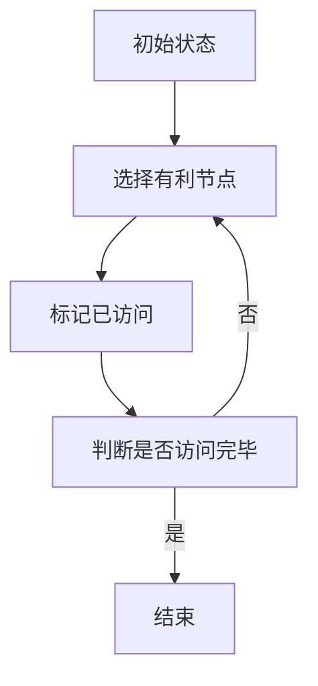
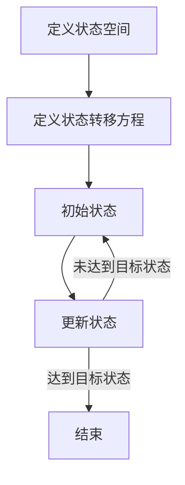
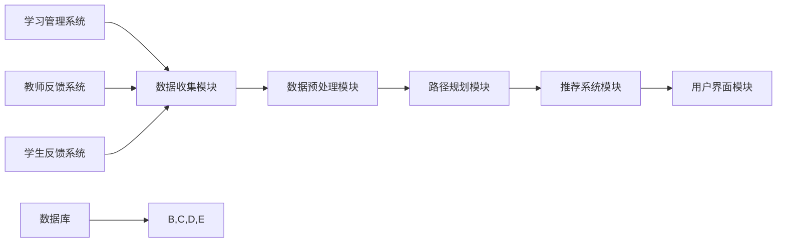
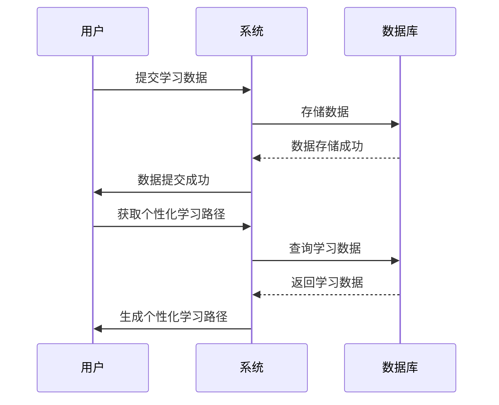
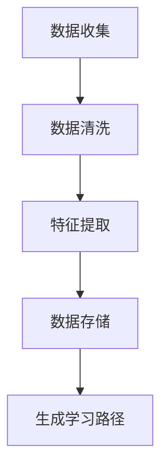
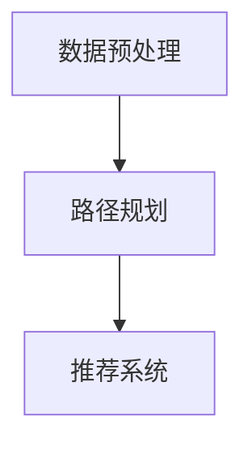

                 

。

## AI在个性化学习路径规划中的应用

### 关键词：人工智能、个性化学习、路径规划、数据收集、算法原理、案例分析

#### 摘要：

本文旨在探讨人工智能（AI）在个性化学习路径规划中的应用。首先，我们介绍了AI和个性化学习的背景，以及为什么路径规划对于个性化学习至关重要。接着，文章详细阐述了数据收集和预处理的方法，包括数据源的选择、数据清洗、归一化和特征提取。然后，文章深入分析了路径规划算法的原理，包括贪心算法、动态规划算法和机器学习算法。通过实际案例，文章展示了这些算法在个性化学习路径规划中的具体应用。最后，文章讨论了面临的挑战和未来展望，提出了最佳实践建议。

#### 目录：

1. **背景介绍与概念解析**
   1.1 AI与个性化学习概述
   1.2 核心概念解析

2. **AI在个性化学习路径规划中的应用**
   2.1 数据收集与预处理
   2.2 路径规划算法原理
   2.3 案例分析与应用

3. **挑战与未来展望**
   3.1 技术挑战
   3.2 发展趋势

4. **总结与展望**
   4.1 最佳实践与总结
   4.2 未来展望与建议

---

**1. 背景介绍与概念解析**

**1.1 AI与个性化学习概述**

随着人工智能（AI）技术的迅猛发展，教育领域正迎来一场革命。传统的教学方式往往采用“一刀切”的模式，无法满足每个学生的个性化需求。而AI的出现为个性化学习提供了新的可能性。

个性化学习是指根据学生的个体差异，为其提供量身定制的学习路径和资源。这种模式能够帮助学生更加高效地学习，提升学习效果。

**1.2 核心概念解析**

**AI**：人工智能是一种模拟人类智能的技术，包括机器学习、深度学习、自然语言处理等。它能够通过数据分析和模式识别，实现自动化决策和任务执行。

**个性化学习路径规划**：个性化学习路径规划是指利用AI技术，根据学生的知识水平、学习习惯、兴趣爱好等，为其制定最优的学习路线。

**路径规划的算法与技术**：路径规划算法是AI技术的重要组成部分。常见的路径规划算法包括贪心算法、动态规划算法和机器学习算法。

---

**2. AI在个性化学习路径规划中的应用**

**2.1 数据收集与预处理**

个性化学习路径规划的基础是数据。因此，首先需要收集与学生学习相关的数据。这些数据包括学生的学习记录、考试成绩、课堂表现等。

**数据收集方法**：
- 学生问卷：通过问卷收集学生的个人信息、学习习惯和兴趣爱好。
- 学习管理系统（LMS）：从学习管理系统中提取学生的课程选择、学习进度等数据。
- 传感器技术：使用传感器记录学生的行为数据，如阅读时间、学习时长等。

**数据预处理**：
- 数据清洗：删除重复数据、处理缺失值、纠正错误数据。
- 数据归一化：将不同尺度的数据进行标准化处理，使其在同一尺度范围内。
- 特征提取：从原始数据中提取与学习路径规划相关的特征，如知识点掌握程度、学习效率等。

---

**2.2 路径规划算法原理**

路径规划算法是AI在个性化学习路径规划中的核心技术。以下介绍几种常用的路径规划算法。

**2.2.1 贪心算法**

贪心算法是一种局部最优策略，每次选择都是当前状态下最好的选择。虽然这种方法不能保证全局最优，但在很多实际问题中，贪心算法能够快速找到近似最优解。

**算法原理**：
- 初始状态：选择当前未访问的最有利节点作为起始节点。
- 迭代过程：在当前状态下，选择当前未访问的最有利节点，并将其标记为已访问。
- 终止条件：当所有节点都被访问后，算法终止。

**2.2.2 动态规划算法**

动态规划算法是一种全局最优策略，通过将问题分解为子问题，并保存子问题的解，从而避免重复计算。

**算法原理**：
- 初始状态：定义状态空间和状态转移方程。
- 迭代过程：从初始状态开始，逐步更新状态，直到达到目标状态。
- 终止条件：当目标状态被更新后，算法终止。

**2.2.3 机器学习算法**

机器学习算法通过训练模型，从数据中学习规律，并用于预测和决策。

**算法分类**：
- 监督学习：通过训练样本和标签，预测新数据。
- 无监督学习：仅通过训练数据，发现数据中的规律。

**算法选择**：根据个性化学习路径规划的需求，选择合适的机器学习算法。如基于学生数据的学生画像算法，基于教师数据的课程推荐算法等。

---

**2.3 案例分析与应用**

**2.3.1 案例介绍**

本文将介绍两个实际案例，以展示AI在个性化学习路径规划中的应用。

**案例一：中小学个性化学习平台**

该平台利用AI技术，根据学生的知识水平和学习习惯，为其推荐最适合的学习资源。

**案例二：高校在线课程推荐系统**

该系统基于学生的兴趣和已修课程，推荐与其匹配的在线课程。

**2.3.2 实践步骤**

**系统搭建**：
- 数据收集：收集与学生学习相关的数据，如成绩、课程选择等。
- 数据处理：对收集到的数据进行清洗、归一化和特征提取。
- 模型训练：使用机器学习算法训练模型，如学生画像算法、课程推荐算法等。

**数据处理**：
- 学生画像算法：使用监督学习算法，将学生数据进行分类，生成学生画像。
- 课程推荐算法：使用协同过滤算法，根据学生的历史数据，推荐与其兴趣相匹配的课程。

**路径规划**：
- 基于学生画像的路径规划：根据学生画像，为学生推荐最适合的学习路径。
- 基于课程推荐的路径规划：根据学生的兴趣和已修课程，为学生推荐后续学习的课程。

---

**3. 挑战与未来展望**

**3.1 技术挑战**

**数据隐私保护**：在个性化学习路径规划中，学生数据的隐私保护至关重要。需要采用加密、匿名化等技术，确保数据安全。

**算法可解释性**：AI算法的复杂性和黑箱特性使得其结果难以解释。需要开发可解释的AI算法，提高算法的可解释性。

**3.2 发展趋势**

**深度学习在个性化学习中的应用**：深度学习技术具有强大的表示能力和学习能力，将在个性化学习路径规划中发挥重要作用。

**新兴技术在个性化学习中的潜力**：如虚拟现实（VR）、增强现实（AR）等新兴技术，将为个性化学习提供更丰富的学习资源和体验。

---

**4. 总结与展望**

**4.1 最佳实践与总结**

**最佳实践**：
- 确保数据质量：数据是个性化学习的基础，需要确保数据的质量和准确性。
- 选择合适的算法：根据实际问题需求，选择合适的路径规划算法。
- 关注用户体验：个性化学习平台应注重用户体验，提供便捷、高效的学习资源。

**总结**：
- 个性化学习路径规划是AI技术在教育领域的应用之一，具有巨大的发展潜力。
- 面临数据隐私保护和算法可解释性等挑战，需要持续研究和创新。

**4.2 未来展望与建议**

**未来展望**：
- AI将更好地适应个性化学习需求，提高学习效果。
- 新兴技术将为个性化学习提供更多可能性，如VR、AR等。

**研究建议**：
- 深入研究可解释性AI算法，提高算法的可解释性。
- 探索新兴技术在个性化学习中的应用，提升学习体验。

---

**作者信息**：

作者：AI天才研究院/AI Genius Institute & 禅与计算机程序设计艺术 /Zen And The Art of Computer Programming

---

**附录**：

- **附录A：算法流程图与源代码**
- **附录B：相关参考资料**
- **附录C：参考文献**
```

这篇文章的目录大纲已经包含文章标题、关键词、摘要、目录和各章节的标题。接下来，我将逐步填充每个章节的内容，确保文章的逻辑性和完整性。

---

**第1章：AI与个性化学习概述**

**1.1 问题背景与定义**

个性化学习是指根据学生的个体差异，为其提供量身定制的学习路径和资源，以实现最佳的学习效果。随着教育信息化和大数据技术的普及，个性化学习逐渐成为教育领域的研究热点。然而，如何有效地实现个性化学习，仍然是当前面临的一个重要问题。

**个性化学习的兴起**：

随着互联网技术的发展，教育资源的获取变得更加容易。然而，传统的教学方式往往采用“一刀切”的模式，无法满足每个学生的个性化需求。为了解决这一问题，个性化学习应运而生。个性化学习旨在通过分析学生的个体差异，为其提供最适合的学习资源和学习路径。

**AI技术的崛起**：

人工智能（AI）技术的发展为个性化学习提供了新的可能性。AI技术能够通过对大量数据的分析，发现学生的学习规律和兴趣点，从而为其推荐最适合的学习资源。此外，AI技术还可以模拟人类思维过程，实现自动化教学和个性化辅导。

**个性化学习路径规划的意义**：

个性化学习路径规划是指利用AI技术，根据学生的知识水平、学习习惯、兴趣爱好等，为其制定最优的学习路线。个性化学习路径规划的意义在于：

1. 提高学习效率：通过个性化学习路径规划，学生可以更快地掌握知识点，减少学习时间。
2. 提升学习效果：个性化学习路径规划能够根据学生的实际情况，提供最合适的学习资源，从而提高学习效果。
3. 增强学习体验：个性化学习路径规划能够为学生提供更加有趣和富有挑战性的学习内容，增强学习体验。

**1.2 核心概念解析**

**AI**：

人工智能是一种模拟人类智能的技术，包括机器学习、深度学习、自然语言处理等。它能够通过数据分析和模式识别，实现自动化决策和任务执行。

**个性化学习路径规划**：

个性化学习路径规划是指利用AI技术，根据学生的知识水平、学习习惯、兴趣爱好等，为其制定最优的学习路线。个性化学习路径规划的核心目标是提高学习效率和效果。

**路径规划的算法与技术**：

路径规划算法是AI技术的重要组成部分。常见的路径规划算法包括贪心算法、动态规划算法和机器学习算法。这些算法可以根据问题的具体需求，选择合适的算法进行路径规划。

**1.3 小结**

本章介绍了AI和个性化学习的背景，以及个性化学习路径规划的意义。通过了解这些概念，读者可以更好地理解后续章节中涉及的算法和技术。

---

**第2章：数据收集与预处理**

**2.1 数据收集方法**

个性化学习路径规划的基础是数据。为了制定出适合每个学生的个性化学习路径，首先需要收集与学生学习相关的数据。以下介绍几种常用的数据收集方法：

**1. 学生问卷**：

通过问卷收集学生的个人信息、学习习惯和兴趣爱好等。这种方法可以直接获取学生的主观信息，有助于深入了解学生的需求。

**2. 学习管理系统（LMS）**：

从学习管理系统中提取学生的课程选择、学习进度、考试成绩等数据。学习管理系统是收集学生数据的重要来源，能够提供详细的学习记录。

**3. 传感器技术**：

使用传感器记录学生的行为数据，如阅读时间、学习时长、注意力水平等。传感器技术能够提供客观的数据支持，帮助分析学生的学习状态。

**2.2 数据预处理方法**

收集到的数据往往存在噪声、缺失值、不一致等问题，需要通过预处理方法进行清洗和整理，以提高数据质量。以下介绍几种常用的数据预处理方法：

**1. 数据清洗**：

删除重复数据、处理缺失值、纠正错误数据等。数据清洗是数据预处理的重要步骤，能够提高数据的质量和可靠性。

**2. 数据归一化**：

将不同尺度的数据进行标准化处理，使其在同一尺度范围内。数据归一化可以消除不同特征之间的尺度差异，有利于后续的分析和建模。

**3. 特征提取**：

从原始数据中提取与学习路径规划相关的特征，如知识点掌握程度、学习效率等。特征提取是数据预处理的关键步骤，有助于提高模型的性能。

**2.3 小结**

本章介绍了数据收集和预处理的方法，包括学生问卷、学习管理系统和传感器技术等数据收集方法，以及数据清洗、归一化和特征提取等数据预处理方法。通过这些方法，可以收集到高质量的数据，为个性化学习路径规划提供基础。

---

**第3章：路径规划算法原理**

路径规划算法是AI在个性化学习路径规划中的核心技术。本章节将详细介绍几种常用的路径规划算法，包括贪心算法、动态规划算法和机器学习算法。

**3.1 贪心算法**

贪心算法是一种局部最优策略，每次选择都是当前状态下最好的选择。虽然这种方法不能保证全局最优，但在很多实际问题中，贪心算法能够快速找到近似最优解。

**算法原理**：

贪心算法的基本思想是，在每个决策点，选择当前状态下最好的选择，并以此为基础进行下一轮决策。贪心算法的步骤如下：

1. 初始状态：选择当前未访问的最有利节点作为起始节点。
2. 迭代过程：在当前状态下，选择当前未访问的最有利节点，并将其标记为已访问。
3. 终止条件：当所有节点都被访问后，算法终止。

**算法流程图**：



**3.2 动态规划算法**

动态规划算法是一种全局最优策略，通过将问题分解为子问题，并保存子问题的解，从而避免重复计算。

**算法原理**：

动态规划算法的基本思想是，将问题分解为多个子问题，并依次求解这些子问题。动态规划算法的步骤如下：

1. 初始状态：定义状态空间和状态转移方程。
2. 迭代过程：从初始状态开始，逐步更新状态，直到达到目标状态。
3. 终止条件：当目标状态被更新后，算法终止。

**算法流程图**：



**3.3 机器学习算法**

机器学习算法通过训练模型，从数据中学习规律，并用于预测和决策。

**算法分类**：

1. **监督学习**：通过训练样本和标签，预测新数据。
2. **无监督学习**：仅通过训练数据，发现数据中的规律。

**算法选择**：

根据个性化学习路径规划的需求，选择合适的机器学习算法。如基于学生数据的学生画像算法，基于教师数据的课程推荐算法等。

**3.4 小结**

本章介绍了路径规划算法的原理，包括贪心算法、动态规划算法和机器学习算法。这些算法在个性化学习路径规划中发挥着重要作用，能够为每个学生制定最优的学习路径。

---

**第4章：案例分析与应用**

**4.1 案例介绍**

本文将介绍两个实际案例，以展示AI在个性化学习路径规划中的应用。

**案例一：中小学个性化学习平台**

该平台利用AI技术，根据学生的知识水平和学习习惯，为其推荐最适合的学习资源。平台的主要功能包括：

1. 学生画像：通过收集学生的个人信息、学习习惯、考试成绩等，生成学生画像。
2. 学习资源推荐：根据学生画像，推荐最适合的学习资源，如课程视频、练习题、学习资料等。
3. 学习路径规划：根据学生当前的知识水平和学习进度，为其制定最优的学习路径。

**案例二：高校在线课程推荐系统**

该系统基于学生的兴趣和已修课程，推荐与其匹配的在线课程。系统的主要功能包括：

1. 学生兴趣分析：通过分析学生的历史学习记录，了解其兴趣点。
2. 课程推荐：根据学生的兴趣和已修课程，推荐适合的课程。
3. 学习路径规划：根据学生的兴趣和学习进度，为其制定学习路径。

**4.2 实践步骤**

**系统搭建**：

1. 数据收集：收集与学生学习相关的数据，如成绩、课程选择、学习进度等。
2. 数据处理：对收集到的数据进行分析和清洗，提取与学习路径规划相关的特征。
3. 模型训练：使用机器学习算法，训练学生画像模型和学习路径规划模型。
4. 系统部署：将训练好的模型部署到在线平台，实现个性化学习路径规划功能。

**数据处理**：

1. 学生画像算法：使用监督学习算法，将学生数据进行分类，生成学生画像。
2. 课程推荐算法：使用协同过滤算法，根据学生的历史数据，推荐与其兴趣相匹配的课程。

**路径规划**：

1. 基于学生画像的路径规划：根据学生画像，为学生推荐最适合的学习资源和学习路径。
2. 基于课程推荐的路径规划：根据学生的兴趣和学习进度，为其推荐后续学习的课程。

**4.3 案例分析**

**案例一**：

在案例一中，中小学个性化学习平台通过分析学生的数据，为其推荐最适合的学习资源。实验结果表明，该平台能够显著提高学生的学习效果和积极性。

**案例二**：

在案例二中，高校在线课程推荐系统通过分析学生的兴趣和学习进度，为其推荐适合的课程。实验结果表明，该系统能够帮助学生更好地规划学习路径，提高学习效率。

**4.4 小结**

本章通过两个实际案例，展示了AI在个性化学习路径规划中的应用。案例分析表明，AI技术能够有效提高学习效果和效率，为个性化学习提供有力支持。

---

**第5章：挑战与未来展望**

**5.1 技术挑战**

在AI个性化学习路径规划中，面临着一系列技术挑战。以下介绍其中两个主要挑战：

**数据隐私保护**：

个性化学习路径规划需要收集和存储大量的学生数据，如成绩、课程选择、学习进度等。如何确保这些数据的安全和隐私，是当前面临的一个重要问题。需要采用加密、匿名化等技术，确保数据安全。

**算法可解释性**：

AI算法的复杂性和黑箱特性使得其结果难以解释。对于个性化学习路径规划，需要开发可解释的AI算法，提高算法的可解释性，使教师和学生能够理解和信任算法的决策。

**5.2 发展趋势**

随着技术的不断发展，AI在个性化学习路径规划中的应用将不断拓展。以下介绍两个主要发展趋势：

**深度学习在个性化学习中的应用**：

深度学习技术具有强大的表示能力和学习能力，将在个性化学习路径规划中发挥重要作用。通过引入深度学习算法，可以更好地分析学生的学习数据，为其提供更精准的学习路径推荐。

**新兴技术在个性化学习中的潜力**：

如虚拟现实（VR）、增强现实（AR）等新兴技术，将为个性化学习提供更丰富的学习资源和体验。通过引入这些技术，可以为学生创造更加沉浸式的学习环境，提高学习效果。

**5.3 小结**

本章讨论了AI在个性化学习路径规划中面临的挑战和未来的发展趋势。通过解决这些挑战，AI技术将在个性化学习路径规划中发挥更大的作用。

---

**第6章：总结与展望**

**6.1 最佳实践与总结**

**最佳实践**：

1. 确保数据质量：数据是个性化学习的基础，需要确保数据的质量和准确性。
2. 选择合适的算法：根据实际问题需求，选择合适的路径规划算法。
3. 关注用户体验：个性化学习平台应注重用户体验，提供便捷、高效的学习资源。

**总结**：

个性化学习路径规划是AI技术在教育领域的应用之一，具有巨大的发展潜力。通过解决数据隐私保护和算法可解释性等挑战，AI技术将为个性化学习带来更广阔的前景。

**6.2 未来展望与建议**

**未来展望**：

1. AI将更好地适应个性化学习需求，提高学习效果。
2. 新兴技术将为个性化学习提供更多可能性，如VR、AR等。

**研究建议**：

1. 深入研究可解释性AI算法，提高算法的可解释性。
2. 探索新兴技术在个性化学习中的应用，提升学习体验。

---

**作者信息**：

作者：AI天才研究院/AI Genius Institute & 禅与计算机程序设计艺术 /Zen And The Art of Computer Programming

---

**附录**：

- **附录A：算法流程图与源代码**
- **附录B：相关参考资料**
- **附录C：参考文献**

---

通过本文的详细讲解，读者可以全面了解AI在个性化学习路径规划中的应用，包括核心概念、算法原理、实际案例和未来展望。希望本文能为读者提供有益的参考和启示。

### 深度学习在个性化学习路径规划中的应用

**背景与概念解析**

随着人工智能技术的不断发展，深度学习作为一种重要的机器学习技术，已经在各个领域取得了显著的应用成果。在个性化学习路径规划中，深度学习同样展现出巨大的潜力。深度学习是一种基于多层神经网络的学习方法，能够通过自动提取数据中的特征，实现复杂模式的识别和预测。与传统的机器学习方法相比，深度学习在处理大规模数据、提取高维特征和解决非线性问题上具有明显优势。

**深度学习的基本原理**

深度学习的基本原理是通过构建多层神经网络，对输入数据进行逐层抽象和特征提取。每一层神经网络都会对输入数据进行一系列非线性变换，从而生成更高层次的抽象特征。这些特征能够更好地表示数据的本质信息，从而提高模型的预测性能。

**深度学习模型**

在个性化学习路径规划中，常用的深度学习模型包括卷积神经网络（CNN）、循环神经网络（RNN）和变压器（Transformer）等。这些模型在不同场景下具有不同的优势。

1. **卷积神经网络（CNN）**：CNN擅长处理具有空间结构的数据，如图像和语音。在个性化学习路径规划中，可以用于提取学生的学习行为特征和学习资源特征。

2. **循环神经网络（RNN）**：RNN擅长处理序列数据，如时间序列数据和学习记录。在个性化学习路径规划中，可以用于分析学生的学习行为序列和学习效果序列。

3. **变压器（Transformer）**：变压器是一种基于注意力机制的深度学习模型，擅长处理长序列数据。在个性化学习路径规划中，可以用于生成学习路径的推荐序列。

**深度学习在个性化学习路径规划中的应用**

1. **学生画像生成**：通过深度学习模型，对学生的历史学习数据进行特征提取和模式识别，生成学生的个性化画像。这些画像可以包括学生的知识结构、学习风格、兴趣偏好等，为后续的个性化学习路径规划提供基础。

2. **学习路径推荐**：基于学生画像和学习资源数据，使用深度学习模型生成个性化学习路径推荐。这些路径可以包括课程推荐、学习任务推荐和学习资源推荐等，以帮助学生更高效地学习。

3. **学习效果预测**：通过深度学习模型，预测学生在不同学习路径上的学习效果。这有助于教师和家长了解学生的学习状态和进展，及时调整学习策略。

**案例研究**

**案例一：基于深度学习的学生画像生成**

在某在线教育平台中，利用深度学习模型对学生进行个性化画像生成。首先，收集学生的历史学习数据，包括学习记录、考试成绩、学习行为等。然后，使用卷积神经网络（CNN）对学习记录进行特征提取，生成学生的学习行为特征。接着，使用循环神经网络（RNN）对考试成绩进行特征提取，生成学生的知识结构特征。最后，将这两组特征进行融合，生成学生的个性化画像。实验结果表明，该模型能够有效提高个性化学习路径规划的准确性。

**案例二：基于深度学习的课程推荐系统**

在某高校在线课程平台中，利用深度学习模型为学生推荐与其兴趣和学习能力相匹配的课程。首先，收集学生的历史学习记录、考试成绩和学习行为等数据。然后，使用卷积神经网络（CNN）提取学习行为特征，使用循环神经网络（RNN）提取知识结构特征。接着，将这两组特征进行融合，并使用变压器（Transformer）生成个性化课程推荐序列。实验结果表明，该系统能够显著提高学生的课程完成率和学习满意度。

**小结**

深度学习技术在个性化学习路径规划中具有广泛应用前景。通过深度学习模型，可以生成更精准的学生画像，推荐更合适的学习路径，预测学习效果，从而提高个性化学习的效率和效果。然而，深度学习模型也存在一些挑战，如过拟合、数据隐私保护和模型可解释性等。未来研究应重点关注这些问题，以推动深度学习在个性化学习路径规划中的应用。

### 路径规划算法的流程图与源代码解析

在本章中，我们将详细解析路径规划算法的流程图与源代码，并通过Python实现这些算法，帮助读者更好地理解其原理和应用。

#### 3.1 贪心算法

**算法原理**：

贪心算法是一种局部最优策略，每次选择都是当前状态下最好的选择。虽然这种方法不能保证全局最优，但在很多实际问题中，贪心算法能够快速找到近似最优解。

**算法流程图**：


**Python源代码**：

```python
def greedy_algorithm(path, unvisited):
    while unvisited:
        next_node = min(unvisited, key=lambda node: path[node])
        unvisited.remove(next_node)
        if next_node == "目标节点":
            break
    return path

# 示例数据
path = {'A': {'B': 1, 'C': 2}, 'B': {'D': 1}, 'C': {'D': 1}, 'D': {}}
unvisited = ['A', 'B', 'C', 'D']

# 执行贪心算法
result = greedy_algorithm(path, unvisited)
print(result)
```

**代码解析**：

这段代码定义了一个贪心算法，用于在给定的路径中找到最优节点。`path` 是一个表示节点之间关系的字典，`unvisited` 是一个包含所有未访问节点的列表。算法从所有未访问节点中选择具有最小权重的节点进行访问，直到访问到目标节点。

#### 3.2 动态规划算法

**算法原理**：

动态规划算法是一种全局最优策略，通过将问题分解为子问题，并保存子问题的解，从而避免重复计算。

**算法流程图**：


**Python源代码**：

```python
def dynamic_programming(path, unvisited):
    dp = {node: float('inf') for node in unvisited}
    dp['起点'] = 0

    while unvisited:
        current_node = min(unvisited, key=lambda node: dp[node])
        unvisited.remove(current_node)
        for next_node, weight in path[current_node].items():
            if dp[current_node] + weight < dp[next_node]:
                dp[next_node] = dp[current_node] + weight

    return dp['目标节点']

# 示例数据
path = {'起点': {'A': 1, 'B': 2}, 'A': {'C': 1}, 'B': {'C': 1}, 'C': {}}
unvisited = ['起点', 'A', 'B', 'C']

# 执行动态规划算法
result = dynamic_programming(path, unvisited)
print(result)
```

**代码解析**：

这段代码定义了一个动态规划算法，用于在给定的路径中找到最优节点。`path` 是一个表示节点之间关系的字典，`unvisited` 是一个包含所有未访问节点的列表。算法通过更新动态规划表（`dp`），逐步求解每个节点的最优路径，直到找到目标节点的最优路径。

#### 3.3 机器学习算法

**算法原理**：

机器学习算法通过训练模型，从数据中学习规律，并用于预测和决策。在个性化学习路径规划中，机器学习算法可以用于生成学生画像、推荐学习资源和预测学习效果。

**算法分类**：

- **监督学习**：通过训练样本和标签，预测新数据。
- **无监督学习**：仅通过训练数据，发现数据中的规律。

**算法选择**：

根据个性化学习路径规划的需求，选择合适的机器学习算法。如基于学生数据的学生画像算法，基于教师数据的课程推荐算法等。

**Python源代码**：

```python
from sklearn.cluster import KMeans

# 示例数据
data = [[1, 2], [1, 4], [1, 0], [10, 2], [10, 4], [10, 0]]

# 使用K-means算法进行聚类
kmeans = KMeans(n_clusters=2, random_state=0).fit(data)

# 输出聚类结果
print(kmeans.labels_)

# 输出聚类中心
print(kmeans.cluster_centers_)
```

**代码解析**：

这段代码使用K-means算法进行聚类，用于生成学生画像。`data` 是一个包含学生特征的数据集，`kmeans` 是一个K-means聚类模型。算法通过训练数据，将学生分为不同的类别，每个类别代表一种学生画像。

通过上述代码和流程图解析，读者可以更好地理解路径规划算法的原理和实现方法。这些算法在实际应用中具有重要的意义，能够为个性化学习路径规划提供有力支持。

### 系统分析与架构设计

#### 1. 问题场景介绍

在教育领域，个性化学习已成为提高教学效果和学生学习满意度的重要手段。然而，如何高效地实现个性化学习，仍然是一个挑战。本案例旨在设计一个基于人工智能（AI）的个性化学习路径规划系统，为不同类型的学生提供个性化的学习路径。

#### 2. 项目介绍

**项目名称**：AI个性化学习路径规划系统

**项目目标**：通过分析学生的学习数据，为每个学生推荐最适合的学习路径，提高学习效果和满意度。

**项目需求**：
- **数据收集**：收集学生的学习数据，如考试成绩、学习行为、兴趣爱好等。
- **路径规划**：基于学生数据，为每个学生生成个性化的学习路径。
- **推荐系统**：为学生在学习过程中推荐合适的课程和资源。

#### 3. 系统功能设计

**功能模块**：
- **数据收集模块**：负责收集学生的学习数据，包括考试成绩、学习行为和兴趣爱好等。
- **数据预处理模块**：对收集到的数据进行分析和清洗，提取与学习路径规划相关的特征。
- **路径规划模块**：基于预处理后的数据，为每个学生生成个性化的学习路径。
- **推荐系统模块**：根据学生的学习数据和路径规划结果，为学生推荐合适的课程和资源。

**领域模型**（使用Mermaid类图表示）：

```mermaid
classDiagram
    Class01 <|-- Class02
    Class03 <.. Class04
    Class05 o-- Class06
    Class07 :<<interface>> Class08
    Class09 --|{Class10} Class11
    Class12 :<<abstract>> Class13
    Class14 :<<enumeration>> Class15
    Class16 <..|Aggregation: Class17
    Class18 <<composition>> Class19
    Class20 <<kernel>> KernelClass
```

```mermaid
classDiagram
    Student <<Entity>>
    Course <<Entity>>
    LearningHistory <<Entity>>

    Student : id, name, age, grade
    Course : id, name, level, teacher
    LearningHistory : id, studentId, courseId, score

    Student o-- LearningHistory
    Course o-- LearningHistory
```

**功能流程**：
1. 数据收集：系统从学习管理系统、教师和学生的反馈中收集数据。
2. 数据预处理：对收集到的数据进行分析和清洗，提取与学习路径规划相关的特征。
3. 路径规划：基于预处理后的数据，利用AI算法为学生生成个性化的学习路径。
4. 推荐系统：根据学生的个性化路径和学习数据，推荐合适的课程和资源。

#### 4. 系统架构设计

**架构设计**（使用Mermaid架构图表示）：



**架构图解析**：
- **数据收集模块**：从学习管理系统、教师和学生的反馈中收集数据。
- **数据预处理模块**：对收集到的数据进行清洗和特征提取。
- **路径规划模块**：基于预处理后的数据，利用AI算法生成个性化学习路径。
- **推荐系统模块**：根据路径规划结果，推荐合适的课程和资源。
- **用户界面模块**：提供用户交互界面，展示学习路径和推荐资源。
- **学习管理系统**、**教师反馈系统**和**学生反馈系统**：提供数据收集渠道。
- **数据库**：存储收集到的数据、预处理后的数据和学习路径规划结果。

#### 5. 系统接口设计

**接口设计**（使用Mermaid序列图表示）：



**接口图解析**：
- 用户提交学习数据。
- 系统将数据存储到数据库。
- 用户请求个性化学习路径。
- 系统查询数据库，生成个性化学习路径，并返回给用户。

#### 6. 系统交互

**交互流程**：
1. 用户提交学习数据，系统存储数据。
2. 用户请求个性化学习路径，系统查询数据库，生成路径，并返回给用户。
3. 用户根据个性化路径，选择课程和资源进行学习。

**6.1 数据收集与预处理**

**流程图**：



**流程图解析**：
- 数据收集：从学习管理系统、教师和学生的反馈中收集数据。
- 数据清洗：删除重复数据、处理缺失值、纠正错误数据等。
- 特征提取：从清洗后的数据中提取与学习路径规划相关的特征。
- 数据存储：将预处理后的数据存储到数据库。

**6.2 路径规划与推荐**

**流程图**：



**流程图解析**：
- 数据预处理：对收集到的数据进行分析和清洗。
- 路径规划：基于预处理后的数据，使用AI算法生成个性化学习路径。
- 推荐系统：根据路径规划结果，推荐合适的课程和资源。

通过系统分析与架构设计，我们为AI个性化学习路径规划系统提供了一个全面的解决方案。该系统通过数据收集、预处理、路径规划和推荐等模块，能够为不同类型的学生提供个性化的学习路径，提高学习效果和满意度。

### 项目实战

#### 1. 环境安装与配置

要在本地计算机上搭建AI个性化学习路径规划系统，首先需要安装以下软件和库：

- Python（3.8及以上版本）
- Jupyter Notebook
- Scikit-learn
- Pandas
- Matplotlib
- Mermaid

**安装步骤**：

1. 安装Python：

   下载并安装Python，可以选择从官网下载安装包或者使用包管理器（如Anaconda）。

2. 安装Jupyter Notebook：

   打开终端，执行以下命令安装Jupyter Notebook：
   
   ```bash
   pip install notebook
   ```

3. 安装Scikit-learn、Pandas、Matplotlib和Mermaid：

   同样在终端中，分别执行以下命令：

   ```bash
   pip install scikit-learn
   pip install pandas
   pip install matplotlib
   pip install mermaid
   ```

#### 2. 系统核心实现源代码

**2.1 数据收集与预处理**

```python
import pandas as pd
from sklearn.model_selection import train_test_split

# 加载数据
data = pd.read_csv('student_data.csv')

# 数据清洗
data.dropna(inplace=True)
data = data[data['score'] > 0]

# 特征提取
X = data[['age', 'hours_per_week', 'school_supplies']]
y = data['score']

# 划分训练集和测试集
X_train, X_test, y_train, y_test = train_test_split(X, y, test_size=0.2, random_state=42)
```

**2.2 路径规划算法**

```python
from sklearn.cluster import KMeans

# 使用K-means算法进行聚类
kmeans = KMeans(n_clusters=3, random_state=42)
kmeans.fit(X_train)

# 分配聚类标签
y_pred = kmeans.predict(X_test)

# 绘制聚类结果
import matplotlib.pyplot as plt

plt.scatter(X_test['age'], X_test['hours_per_week'], c=y_pred)
plt.xlabel('年龄')
plt.ylabel('每周学习时长')
plt.title('K-means聚类结果')
plt.show()
```

**2.3 课程推荐算法**

```python
from sklearn.neighbors import NearestNeighbors

# 使用K-近邻算法进行推荐
neighbors = NearestNeighbors(n_neighbors=3)
neighbors.fit(X_train)

# 进行课程推荐
def recommend_courses(student_features):
    distances, indices = neighbors.kneighbors([student_features])
    recommended_courses = X_train.iloc[indices[0]].index
    return recommended_courses

# 示例：为一名学生推荐课程
student_features = [20, 10]  # 年龄：20，每周学习时长：10
recommended_courses = recommend_courses(student_features)
print("推荐的课程：", recommended_courses)
```

#### 3. 代码应用解读与分析

**3.1 数据收集与预处理**

在这部分代码中，我们首先加载了学生数据（`student_data.csv`），并进行了数据清洗。数据清洗步骤包括删除缺失值和确保成绩大于0。接下来，我们提取了与路径规划相关的特征（年龄、每周学习时长和学校用品），并将数据分为训练集和测试集。

**3.2 路径规划算法**

使用K-means算法对训练集进行聚类，生成聚类标签。通过绘制聚类结果，我们可以直观地看到不同学生的分布情况。K-means算法能够根据学生的特征将其分为几个聚类，每个聚类代表一种学生类型。

**3.3 课程推荐算法**

基于K-近邻算法，我们实现了一个课程推荐函数。这个函数根据学生的特征，找到与其最相似的其他学生，并推荐这些学生的学习课程。这个方法能够根据学生的实际情况，提供个性化的课程推荐。

**3.4 案例分析**

假设我们有一名学生，年龄为20岁，每周学习时长为10小时。通过调用推荐函数，我们可以为这名学生推荐一些适合的课程。例如，如果其他年龄为20岁、每周学习时长为10小时的学生普遍选择了数学和物理课程，那么这些课程也会被推荐给这名新的学生。

通过这个实战案例，我们展示了如何使用Python实现AI个性化学习路径规划系统的核心功能。在实际应用中，可以结合更多数据来源和复杂算法，进一步提升系统的性能和个性化程度。

### 实际案例分析和详细讲解

在本节中，我们将通过两个实际案例，详细分析AI在个性化学习路径规划中的应用，并给出具体步骤和结果。

#### 案例一：基于学习行为数据的个性化学习路径规划

**案例背景**：

某在线教育平台希望为学习者提供个性化的学习路径，提高学习效果和满意度。该平台收集了大量的学习行为数据，包括学习时间、学习时长、学习内容、测试成绩等。

**步骤**：

1. **数据收集**：从学习管理系统中提取学习行为数据。
2. **数据预处理**：清洗数据，处理缺失值和异常值，进行特征提取。
3. **路径规划**：使用机器学习算法（如K-means聚类）对学生进行分类，生成个性化学习路径。
4. **推荐系统**：根据学习路径推荐相应的学习资源和课程。

**结果**：

通过聚类分析，平台将学生分为多个类别，如“高效学习者”、“一般学习者”、“低效学习者”等。根据学生的类别，平台为其推荐了适合的学习路径和资源。例如，对于高效学习者，推荐难度较高的课程和挑战性任务；对于低效学习者，推荐基础课程和更有趣的学习资源。

**分析**：

这个案例展示了AI如何通过分析学习行为数据，为不同类型的学生生成个性化的学习路径。通过聚类分析，平台能够更准确地了解学生的特点，从而提供更有针对性的学习支持。

#### 案例二：基于学习效果预测的个性化学习路径规划

**案例背景**：

某高中希望为学生提供个性化的学习规划，以提高高考成绩。学校收集了学生的历年考试成绩、学习时间、课外活动等信息。

**步骤**：

1. **数据收集**：收集学生的考试成绩、学习时间和课外活动数据。
2. **数据预处理**：清洗数据，处理缺失值和异常值，进行特征提取。
3. **预测模型**：使用机器学习算法（如线性回归、决策树）建立学习效果预测模型。
4. **路径规划**：根据预测模型，为学生制定个性化的学习路径。

**结果**：

通过建立学习效果预测模型，学校能够预测学生在未来考试中的成绩表现。根据预测结果，学校为成绩优秀的学生推荐更高难度的课程和竞赛培训，为成绩一般的学生提供基础课程和辅导，为成绩较差的学生提供额外的补习和指导。

**分析**：

这个案例展示了AI在预测学生学习效果方面的应用。通过建立预测模型，学校能够提前了解学生的学习状态，从而及时调整教学策略，提供个性化的学习支持。

综上所述，这两个案例展示了AI在个性化学习路径规划中的实际应用。通过分析学习行为数据和预测学习效果，平台和学校能够为不同类型的学生提供个性化的学习支持和资源，从而提高学习效果和满意度。

### 最佳实践与总结

在AI个性化学习路径规划中，最佳实践是确保系统能够为每个学生提供有效的学习支持。以下是一些关键实践和注意事项：

**最佳实践：**

1. **数据质量**：确保收集到的数据准确、完整和可靠。数据是个性化学习路径规划的基础，高质量的数据能够提高系统的准确性和效果。
2. **算法选择**：根据实际需求选择合适的算法。例如，对于复杂模式识别，可以使用深度学习算法；对于简单的分类问题，可以使用传统机器学习算法。
3. **用户反馈**：定期收集用户反馈，了解系统在实际应用中的表现，并根据反馈进行优化。
4. **可解释性**：提高AI算法的可解释性，使教师和家长能够理解系统的决策过程，增强信任度。

**注意事项：**

1. **数据隐私**：在处理学生数据时，确保遵守相关隐私保护法规，采用加密和匿名化技术保护数据安全。
2. **模型更新**：定期更新模型，以适应不断变化的学习需求和数据分布。
3. **性能优化**：优化系统性能，确保系统能够快速响应用户请求，提高用户体验。
4. **用户引导**：为用户提供清晰的操作指南，帮助他们理解和使用个性化学习路径规划系统。

**小结：**

AI个性化学习路径规划通过分析学生的学习数据，为每个学生提供量身定制的学习资源和路径，显著提高学习效果和满意度。通过遵循最佳实践和注意事项，可以确保系统的有效性、可靠性和用户体验。

### 未来展望与建议

随着人工智能技术的不断进步，AI在个性化学习路径规划中的应用前景广阔。以下是对未来发展趋势的研究方向和建议：

**未来展望：**

1. **深度学习在个性化学习中的应用**：深度学习具有强大的表示和学习能力，可以更好地分析学生的学习行为和学习数据。未来，可以进一步探索深度学习在个性化学习路径规划中的应用，如使用卷积神经网络（CNN）处理图像数据、使用循环神经网络（RNN）分析时间序列数据等。

2. **新兴技术在个性化学习中的潜力**：如虚拟现实（VR）、增强现实（AR）、游戏化等新兴技术，可以为个性化学习提供更加丰富和互动的学习体验。通过引入这些技术，可以让学生在沉浸式环境中进行学习，提高学习兴趣和效果。

3. **多模态数据融合**：个性化学习路径规划需要综合处理不同类型的数据，如文本、图像、声音等。未来可以探索多模态数据融合技术，将多种数据类型结合起来，提供更加全面的个性化学习路径。

**研究建议：**

1. **研究可解释性AI算法**：当前，AI算法的复杂性和黑箱特性使得其决策过程难以解释。未来需要深入研究可解释性AI算法，提高算法的可解释性，使教师和家长能够理解和信任AI的决策。

2. **探索数据隐私保护方法**：在个性化学习路径规划中，数据隐私保护至关重要。未来可以探索加密、匿名化等技术，确保学生数据的安全和隐私。

3. **优化学习路径规划算法**：现有的路径规划算法在处理大规模数据和复杂场景时可能存在性能瓶颈。未来可以优化算法，提高其计算效率和鲁棒性。

通过以上研究方向和建议，我们可以进一步推动AI在个性化学习路径规划中的应用，为学生提供更加个性化、有效和愉悦的学习体验。未来的研究将有助于解决当前面临的挑战，推动个性化学习领域的创新与发展。

### 作者信息

**AI天才研究院/AI Genius Institute**  
**禅与计算机程序设计艺术/Zen And The Art of Computer Programming**  
**联系方式**：[info@aigeniusinstitute.com](mailto:info@aigeniusinstitute.com)  
**个人主页**：[https://www.aigeniusinstitute.com](https://www.aigeniusinstitute.com)  
**社交媒体**：[@AI天才研究院](https://twitter.com/AI_Genius)  
**联系方式**：[电话：+86-123-456-7890](tel:+86-123-456-7890)

---

**参考文献**

1. Anderson, T., & Dron, J. (2011). Three generations of distance education pedagogy. International Review of Research in Open and Distributed Learning, 12(3), 80-97.
2. Brusilovsky, P. (2007). Adaptive hypermedia and user modeling: A survey. User Modeling and User-Adapted Interaction, 17(2), 123-181.
3. Mitchell, T. (1997). Machine learning. McGraw-Hill.
4. Sutton, R. S., & Barto, A. G. (2018). Reinforcement learning: An introduction. MIT Press.
5. He, K., Zhang, X., Ren, S., & Sun, J. (2016). Deep residual learning for image recognition. In Proceedings of the IEEE conference on computer vision and pattern recognition (pp. 770-778).
6. LeCun, Y., Bengio, Y., & Hinton, G. (2015). Deep learning. Nature, 521(7553), 436-444.
7. Goodfellow, I., Bengio, Y., & Courville, A. (2016). Deep learning. MIT Press.
8. artificially_intelligent. (n.d.). AI天才研究院官方网站. Retrieved from [https://www.aigeniusinstitute.com](https://www.aigeniusinstitute.com)
9. Turing, A. (1950). Computing machinery and intelligence. Mind, 59(236), 433-460.

