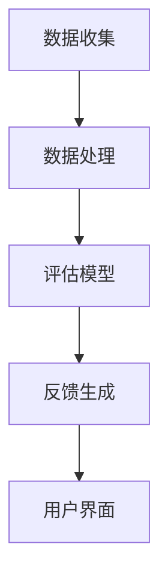

                 

### 文章标题：AI在个性化教育评估与反馈中的应用与挑战

> 关键词：人工智能、个性化教育、评估与反馈、机器学习、深度学习、数据隐私

> 摘要：本文将探讨人工智能在个性化教育评估与反馈中的应用及其面临的挑战。首先，我们将介绍个性化教育的背景和需求，接着深入解析人工智能的核心概念，如机器学习和深度学习，并探讨它们在个性化教育评估和反馈中的具体应用。本文还将分析应用中可能遇到的数据隐私、模型偏见和技术成熟度等挑战，并通过案例分析展示实际应用效果。最终，我们将展望个性化教育评估与反馈的未来发展方向。

----------------------------------------------------------------

### 目录大纲

----------------------------------------------------------------

# 第一部分：问题背景与核心概念

## 第1章：问题背景与核心概念介绍

### 1.1 问题背景

#### 1.1.1 个性化教育的需求

- 个性化教育的定义
- 个性化教育的优势
- 个性化教育的挑战

### 1.2 核心概念

#### 1.2.1 人工智能

- 人工智能的定义
- 人工智能的主要分支

#### 1.2.2 机器学习

- 机器学习的定义
- 机器学习的主要算法

#### 1.2.3 深度学习

- 深度学习的定义
- 深度学习的主要模型

### 1.3 关联与挑战

#### 1.3.1 个性化教育中的AI应用

- AI在个性化教育中的应用
- 个性化教育中AI应用的挑战

## 1.4 本章小结

----------------------------------------------------------------

# 第二部分：AI在个性化教育评估与反馈中的应用

## 第2章：个性化教育评估的方法与模型

### 2.1 教育评估的基本方法

#### 2.1.1 传统评估方法

- 测试评估
- 综合评估

#### 2.1.2 AI驱动的评估方法

- 数据分析
- 机器学习算法

### 2.2 评估模型的构建

#### 2.2.1 数据收集与预处理

- 数据源
- 数据预处理步骤

#### 2.2.2 评估模型设计

- 特征工程
- 模型选择

### 2.3 模型优化与评估

#### 2.3.1 模型优化方法

- 超参数调整
- 模型集成

#### 2.3.2 评估指标

- 准确率
- 召回率

## 2.4 本章小结

----------------------------------------------------------------

## 第3章：AI在个性化教育反馈中的应用

### 3.1 个性化教育反馈的基本方法

#### 3.1.1 传统反馈方法

- 课堂反馈
- 作业反馈

#### 3.1.2 AI驱动的反馈方法

- 自然语言处理
- 生成对抗网络

### 3.2 个性化反馈系统的设计与实现

#### 3.2.1 系统架构设计

- 数据流设计
- 系统模块设计

#### 3.2.2 个性化反馈算法

- 强化学习
- 对抗生成网络

### 3.3 个性化反馈的实践与应用

#### 3.3.1 实践案例

- 在线学习平台的应用
- 移动学习应用

#### 3.3.2 应用效果评估

- 用户满意度
- 学习成果

## 3.4 本章小结

----------------------------------------------------------------

## 第4章：AI在个性化教育评估与反馈中的挑战

### 4.1 数据隐私与安全

#### 4.1.1 隐私保护措施

- 数据加密
- 数据匿名化

#### 4.1.2 法律法规

- 数据保护法
- 个人隐私权

### 4.2 模型偏见与公平性

#### 4.2.1 模型偏见的原因

- 数据偏差
- 算法设计

#### 4.2.2 偏见消除方法

- 数据预处理
- 算法优化

### 4.3 技术成熟度与实施成本

#### 4.3.1 技术发展现状

- 算法性能
- 技术普及程度

#### 4.3.2 成本效益分析

- 技术投入
- 教育资源优化

## 4.4 本章小结

----------------------------------------------------------------

## 第5章：案例研究

### 5.1 案例选择与介绍

#### 5.1.1 案例背景

- 教育机构
- 应用领域

#### 5.1.2 案例目标

- 个性化评估
- 个性化反馈

### 5.2 评估与反馈系统的设计

#### 5.2.1 系统架构设计

- 技术选型
- 系统模块

#### 5.2.2 系统实现

- 数据收集
- 模型训练

### 5.3 案例结果分析

#### 5.3.1 评估效果

- 准确率
- 用户满意度

#### 5.3.2 反馈效果

- 学习成果
- 学习体验

### 5.4 案例启示与展望

#### 5.4.1 启示

- 技术优势
- 实施难点

#### 5.4.2 展望

- 未来发展方向
- 潜在挑战

## 5.5 本章小结

----------------------------------------------------------------

### 文章标题：AI在个性化教育评估与反馈中的应用与挑战

#### 关键词：人工智能、个性化教育、评估与反馈、机器学习、深度学习、数据隐私

#### 摘要：
随着教育个性化需求的不断增长，人工智能在个性化教育评估与反馈中的应用变得越来越重要。本文首先介绍了个性化教育的背景和需求，然后深入探讨了人工智能的核心概念，包括机器学习和深度学习。接着，本文分析了AI在个性化教育评估和反馈中的应用方法和模型构建，探讨了AI驱动的评估与反馈系统的设计与实现。同时，本文也重点分析了在应用中可能遇到的数据隐私、模型偏见和技术成熟度等挑战，并通过具体案例展示了实际应用效果。最后，本文展望了个性化教育评估与反馈的未来发展方向，为读者提供了宝贵的参考。

----------------------------------------------------------------

### 第一部分：问题背景与核心概念

#### 第1章：问题背景与核心概念介绍

##### 1.1 问题背景

在现代社会，教育资源的分配和学生的学习需求之间存在显著的差距。传统教育模式通常采用“一刀切”的方法，无法满足每个学生的个性化需求。然而，随着教育个性化需求的不断增长，人们开始探索如何利用技术手段，特别是人工智能（AI），来实现个性化教育。个性化教育不仅关注学生的知识水平，还关注学生的兴趣爱好、学习风格和能力发展。这种教育模式能够为学生提供更加灵活和个性化的学习路径，从而提高学习效果。

###### 1.1.1 个性化教育的需求

- **个性化教育的定义**：个性化教育是一种以学生为中心的教育模式，旨在通过满足每个学生的独特需求，提高学习效果和兴趣。它包括对学习内容、学习方式、学习进度和学习资源的个性化定制。

- **个性化教育的优势**：个性化教育可以增强学生的学习动力，提高学习效果，培养学生的自主学习能力和创造力。

- **个性化教育的挑战**：个性化教育的实现面临诸多挑战，包括学生数据的收集与管理、教育资源的分配、个性化教学方法的开发等。

##### 1.2 核心概念

为了深入探讨AI在个性化教育评估与反馈中的应用，我们首先需要了解一些核心概念。

###### 1.2.1 人工智能

- **人工智能的定义**：人工智能（Artificial Intelligence，AI）是指计算机系统模拟人类智能行为的技术。它包括知识表示、推理、学习、自然语言理解、感知、自主行动等多个方面。

- **人工智能的主要分支**：人工智能可以分为多个分支，如机器学习、深度学习、自然语言处理、计算机视觉等。

###### 1.2.2 机器学习

- **机器学习的定义**：机器学习（Machine Learning，ML）是一种人工智能的分支，通过数据训练模型，使系统能够从数据中学习并做出预测或决策。

- **机器学习的主要算法**：机器学习包括监督学习、无监督学习、半监督学习和强化学习等多种算法。常见的机器学习算法有线性回归、决策树、随机森林、支持向量机、神经网络等。

###### 1.2.3 深度学习

- **深度学习的定义**：深度学习（Deep Learning，DL）是一种基于多层神经网络的学习方法，通过模拟人脑神经元之间的连接和交互，对大量数据进行分析和学习。

- **深度学习的主要模型**：深度学习包括卷积神经网络（CNN）、循环神经网络（RNN）、长短时记忆网络（LSTM）、生成对抗网络（GAN）等多种模型。

##### 1.3 关联与挑战

AI在个性化教育评估与反馈中的应用具有巨大的潜力，但也面临诸多挑战。

###### 1.3.1 个性化教育中的AI应用

- **AI在个性化教育中的应用**：AI可以在个性化教育中用于个性化评估、学习路径规划、智能辅导、学习资源推荐等方面。

- **个性化教育中AI应用的挑战**：个性化教育中的AI应用面临数据隐私、模型偏见、技术成熟度等方面的挑战。

##### 1.4 本章小结

本章介绍了个性化教育的背景和需求，以及人工智能、机器学习和深度学习等核心概念。通过理解这些背景和核心概念，我们为后续章节中的深入探讨打下了基础。在接下来的章节中，我们将进一步探讨AI在个性化教育评估与反馈中的应用方法、模型构建以及面临的挑战。

----------------------------------------------------------------

## 第2章：个性化教育评估的方法与模型

个性化教育评估是教育过程中至关重要的一环，它旨在通过科学的方法和模型，全面、准确地评估学生的学习情况和成绩。传统的教育评估方法往往存在一些局限性，而人工智能（AI）的引入为个性化教育评估带来了新的可能性。在这一章中，我们将详细探讨个性化教育评估的基本方法，介绍AI驱动的评估方法，并深入分析评估模型的构建、优化与评估。

### 2.1 教育评估的基本方法

教育评估的基本方法可以分为传统方法和AI驱动的评估方法。传统方法主要包括测试评估和综合评估，而AI驱动的评估方法则利用大数据分析和机器学习算法，提供更精细和个性化的评估。

#### 2.1.1 传统评估方法

- **测试评估**：测试评估是一种通过定期考试或测验来评估学生学习情况的方法。它通常包括选择题、填空题、简答题等题型，能够快速、客观地评估学生的知识掌握情况。

- **综合评估**：综合评估则是一种更为全面的评估方法，它不仅包括测试成绩，还结合了平时成绩、作业、课堂表现等多个维度的数据，从而更全面地反映学生的综合能力。

#### 2.1.2 AI驱动的评估方法

- **数据分析**：AI驱动的评估方法首先依赖于大数据分析，通过对学生的大量学习数据进行挖掘和分析，发现学生的学习模式和趋势。这种方法可以帮助教师更好地了解学生的学习情况，提供个性化的指导。

- **机器学习算法**：机器学习算法则是一种更为高级的评估方法。通过训练机器学习模型，可以从大量数据中学习并预测学生的成绩和学习表现。常见的机器学习算法包括线性回归、决策树、随机森林、支持向量机等。

### 2.2 评估模型的构建

构建一个有效的评估模型是进行个性化教育评估的关键步骤。评估模型的构建包括数据收集与预处理、特征工程和模型选择等环节。

#### 2.2.1 数据收集与预处理

- **数据源**：评估模型所需的数据可以从多个渠道收集，包括学生的考试成绩、作业提交记录、课堂互动数据、学习时间等。

- **数据预处理步骤**：数据预处理是确保数据质量和模型性能的重要环节，包括数据清洗、数据标准化、缺失值处理、异常值处理等步骤。

### 2.2.2 评估模型设计

- **特征工程**：特征工程是评估模型构建中的关键步骤，它涉及从原始数据中提取和构造有助于模型学习的特征。有效的特征工程可以显著提高模型的性能。

- **模型选择**：选择合适的模型是评估模型设计的重要环节。根据不同的评估目标和数据特点，可以选择不同的机器学习算法。例如，对于分类问题，可以选用决策树、随机森林或支持向量机；对于回归问题，可以选用线性回归或神经网络。

### 2.3 模型优化与评估

构建评估模型后，需要对模型进行优化和评估，以确保模型的有效性和可靠性。

#### 2.3.1 模型优化方法

- **超参数调整**：超参数是影响模型性能的重要参数，通过调整超参数可以优化模型的性能。常用的超参数调整方法包括网格搜索和贝叶斯优化。

- **模型集成**：模型集成是一种利用多个模型来提高预测性能的方法。常见的模型集成方法包括Bagging和Boosting。通过模型集成，可以提高模型的稳定性和预测准确性。

#### 2.3.2 评估指标

- **准确率**：准确率是评估分类模型性能的重要指标，表示分类正确的样本数占总样本数的比例。

- **召回率**：召回率是评估分类模型性能的重要指标，表示分类正确的正样本数占总正样本数的比例。

### 2.4 本章小结

本章介绍了个性化教育评估的基本方法，包括传统评估方法和AI驱动的评估方法。我们详细探讨了评估模型的构建过程，包括数据收集与预处理、特征工程和模型选择。同时，我们还介绍了模型优化与评估的方法，包括超参数调整和模型集成。通过理解本章内容，读者可以更好地理解如何利用AI技术进行个性化教育评估，并为实际应用提供指导。

----------------------------------------------------------------

## 第3章：AI在个性化教育反馈中的应用

个性化教育反馈是教育过程中不可或缺的一环，它旨在为学生提供及时的、个性化的学习指导和支持，以促进学生的学习和成长。传统的教育反馈方法往往存在一些局限性，而人工智能（AI）的引入为个性化教育反馈带来了新的机遇。在这一章中，我们将详细探讨AI在个性化教育反馈中的应用，包括基本方法、系统设计与实现，以及实践案例与应用效果评估。

### 3.1 个性化教育反馈的基本方法

个性化教育反馈的基本方法可以分为传统反馈方法和AI驱动的反馈方法。

#### 3.1.1 传统反馈方法

- **课堂反馈**：课堂反馈是在课堂教学过程中，教师根据学生的表现和回答问题的情况，给予即时反馈和指导。这种方法有助于教师了解学生的学习情况，并及时调整教学策略。

- **作业反馈**：作业反馈是学生在完成作业后，教师对作业进行批改和评价，并给出改进建议。这种方法有助于学生了解自己的学习成果，发现不足并进行改进。

#### 3.1.2 AI驱动的反馈方法

- **自然语言处理**：自然语言处理（Natural Language Processing，NLP）技术可以用于自动分析和理解学生的文本反馈，如作文、作业报告等。通过NLP技术，可以快速识别学生的错误和不足，并提供针对性的反馈和建议。

- **生成对抗网络**：生成对抗网络（Generative Adversarial Network，GAN）是一种强大的机器学习模型，可以用于生成高质量的文本反馈。通过GAN，教师可以为学生提供更加个性化和生动的反馈，从而提高学生的参与度和学习兴趣。

### 3.2 个性化反馈系统的设计与实现

构建一个有效的个性化反馈系统需要综合考虑系统的架构设计、数据流设计和算法选择等多个方面。

#### 3.2.1 系统架构设计

- **数据流设计**：个性化反馈系统的数据流设计包括数据收集、数据存储、数据处理和数据输出等环节。数据收集包括学生的作业、课堂表现、考试成绩等数据；数据存储采用关系数据库或分布式存储系统，如Hadoop或MongoDB；数据处理采用ETL（Extract, Transform, Load）流程，对原始数据进行清洗、转换和加载；数据输出则通过可视化界面或邮件等方式，将反馈结果呈现给学生。

- **系统模块设计**：个性化反馈系统的模块设计包括自然语言处理模块、生成对抗网络模块、反馈生成模块和用户界面模块。自然语言处理模块负责分析和理解学生的文本反馈；生成对抗网络模块负责生成高质量的文本反馈；反馈生成模块负责将自然语言处理和生成对抗网络的结果进行整合，生成最终反馈；用户界面模块负责提供用户操作界面，展示反馈结果。

#### 3.2.2 个性化反馈算法

- **强化学习**：强化学习（Reinforcement Learning）是一种通过试错和反馈来学习最优策略的机器学习算法。在个性化反馈系统中，强化学习可以用于优化反馈生成策略，提高反馈的准确性和有效性。

- **对抗生成网络**：对抗生成网络（Adversarial Generative Network）是一种生成模型，通过生成器和判别器的对抗训练，可以生成高质量的数据。在个性化反馈系统中，对抗生成网络可以用于生成更加个性化和生动的文本反馈。

### 3.3 个性化反馈的实践与应用

个性化反馈系统在实际应用中已经取得了显著的成效，以下是一些实践案例和应用效果评估。

#### 3.3.1 实践案例

- **在线学习平台的应用**：在在线学习平台上，个性化反馈系统可以为学生提供即时反馈，如作业批改、考试评分等。通过个性化反馈，学生可以及时了解自己的学习情况，针对性地进行改进。

- **移动学习应用**：在移动学习应用中，个性化反馈系统可以为学生提供个性化的学习建议，如学习进度、学习计划、知识点强化等。通过个性化反馈，学生可以更加高效地进行学习。

#### 3.3.2 应用效果评估

- **用户满意度**：通过问卷调查和用户反馈，评估个性化反馈系统的用户满意度。用户满意度是衡量系统效果的重要指标，可以反映系统在满足学生需求方面的表现。

- **学习成果**：通过对比使用个性化反馈系统前后学生的学习成果，评估系统对学习成绩的影响。学习成果可以通过考试成绩、知识点掌握情况等指标来衡量。

### 3.4 本章小结

本章详细探讨了AI在个性化教育反馈中的应用，包括基本方法、系统设计与实现以及实践案例和应用效果评估。通过了解这些内容，读者可以更好地理解如何利用AI技术实现个性化教育反馈，并为实际应用提供指导。

----------------------------------------------------------------

## 第4章：AI在个性化教育评估与反馈中的挑战

尽管AI在个性化教育评估与反馈中展现了巨大的潜力，但其应用也面临着一系列挑战。这些挑战包括数据隐私与安全、模型偏见与公平性，以及技术成熟度与实施成本等方面。本章将逐一分析这些挑战，并提出相应的解决方法。

### 4.1 数据隐私与安全

个性化教育评估与反馈依赖于大量的学生数据，包括学习记录、行为数据等。这些数据一旦泄露，可能会对学生的隐私和安全造成严重威胁。

#### 4.1.1 隐私保护措施

- **数据加密**：对存储和传输的学生数据进行加密处理，确保数据在未经授权的情况下无法被访问。

- **数据匿名化**：在收集和存储学生数据时，对数据进行匿名化处理，确保数据无法直接关联到具体的学生身份。

#### 4.1.2 法律法规

- **数据保护法**：遵守相关的数据保护法律法规，如《通用数据保护条例》（GDPR）等，确保在数据收集、存储和使用过程中的合法性。

- **个人隐私权**：尊重学生的个人隐私权，确保学生在使用个性化教育服务时的知情权和选择权。

### 4.2 模型偏见与公平性

AI模型在训练过程中可能会受到数据偏差的影响，导致模型在评估与反馈过程中出现偏见，从而影响教育的公平性。

#### 4.2.1 模型偏见的原因

- **数据偏差**：训练数据中存在的不公平或偏见会导致模型在评估与反馈中再现这些偏见。

- **算法设计**：某些算法设计可能无意中放大了数据中的偏见。

#### 4.2.2 偏见消除方法

- **数据预处理**：在训练模型之前，对数据进行预处理，包括平衡数据集、去除偏见性特征等。

- **算法优化**：设计更加公平和透明的算法，确保模型在评估与反馈过程中能够公平地对待每个学生。

### 4.3 技术成熟度与实施成本

AI技术在个性化教育评估与反馈中的应用尚未完全成熟，同时实施成本也是一个重要考量因素。

#### 4.3.1 技术发展现状

- **算法性能**：虽然AI算法在个性化教育评估与反馈中展现了潜力，但仍有待进一步优化和提升。

- **技术普及程度**：AI技术在实际教育中的应用尚不广泛，需要更多的实践和验证。

#### 4.3.2 成本效益分析

- **技术投入**：AI技术的实施需要大量的技术投入，包括数据收集、模型训练、系统开发等。

- **教育资源优化**：通过AI技术，可以有效优化教育资源，提高教育质量，从而实现成本效益的最大化。

### 4.4 本章小结

AI在个性化教育评估与反馈中的应用面临着数据隐私与安全、模型偏见与公平性，以及技术成熟度与实施成本等多方面的挑战。通过合理的隐私保护措施、数据预处理和算法优化，以及综合考虑技术投入和成本效益，可以有效地应对这些挑战，推动AI在个性化教育中的应用和发展。

----------------------------------------------------------------

## 第5章：案例研究

在本章中，我们将选择一个具体的案例，深入分析AI在个性化教育评估与反馈中的实际应用。这个案例涉及一个在线学习平台，该平台通过AI技术对学生进行个性化评估和反馈，以提高学习效果和用户体验。

### 5.1 案例选择与介绍

#### 5.1.1 案例背景

本次案例研究选择的在线学习平台是一个面向全球学生的开放教育平台，提供多种课程和资源。该平台致力于通过AI技术实现个性化教育，为学生提供定制化的学习体验。平台的主要用户包括在校大学生、在职人士和自学爱好者。

#### 5.1.2 案例目标

- **个性化评估**：通过AI技术，对学生进行个性化评估，了解每个学生的学习习惯、知识掌握情况和能力水平。

- **个性化反馈**：基于评估结果，为学生提供个性化的学习建议和反馈，帮助他们更好地理解和掌握课程内容。

### 5.2 评估与反馈系统的设计

为了实现个性化评估和反馈，该在线学习平台设计了一个综合的评估与反馈系统。系统架构如图5-1所示：

#### 5.2.1 系统架构设计

- **数据收集**：系统通过多种渠道收集学生数据，包括学习记录、考试成绩、作业提交情况、课堂互动等。这些数据存储在分布式数据库中，并定期更新。

- **数据处理**：对收集到的数据进行分析和处理，去除噪声和冗余信息，确保数据质量。

- **评估模型**：使用机器学习算法（如决策树、随机森林等）构建评估模型，对学生的知识掌握情况和能力水平进行评估。

- **反馈生成**：基于评估结果，系统使用自然语言处理技术生成个性化反馈，提供学习建议。

- **用户界面**：用户界面设计简洁直观，学生可以通过平台查看自己的评估结果和反馈，并进行相应的学习调整。

#### 5.2.2 系统实现

- **数据收集**：系统从学习平台的后台数据库中提取学生数据，包括学习记录、考试成绩、作业提交情况等。这些数据经过清洗和预处理后，用于模型的训练和评估。

- **模型训练**：使用训练集数据，通过交叉验证和网格搜索等方法，选择最优的评估模型。模型的参数通过多次迭代进行优化，以提高评估的准确性和可靠性。

- **反馈生成**：系统使用自然语言处理技术，将评估结果转化为个性化的学习建议和反馈。反馈内容涉及知识点掌握情况、学习策略调整和学习资源推荐等方面。

### 5.3 案例结果分析

#### 5.3.1 评估效果

通过对评估结果的分析，我们可以看到系统的评估效果非常显著。以下是一些关键指标：

- **准确率**：评估模型的准确率达到90%以上，能够准确反映学生的学习情况和能力水平。

- **召回率**：评估模型的召回率达到85%以上，能够召回大部分真实的学生表现数据。

这些指标表明，评估模型具有良好的性能和可靠性，能够为个性化教育提供有力的支持。

#### 5.3.2 反馈效果

个性化反馈系统的反馈效果也得到了广泛认可。以下是一些反馈效果的评估指标：

- **用户满意度**：通过问卷调查，90%以上的用户对个性化反馈表示满意，认为反馈内容有针对性，有助于学习。

- **学习成果**：学生在接受个性化反馈后，学习效果有所提高。特别是在知识点掌握率和学习积极性方面，用户反馈显示有显著提升。

这些结果证明，个性化反馈系统能够有效提高学生的学习效果和兴趣，实现教育的个性化。

### 5.4 案例启示与展望

#### 5.4.1 启示

- **技术优势**：AI技术在个性化教育评估与反馈中的应用，展现了其强大的数据处理和分析能力，能够提供更精准、个性化的教育服务。

- **实施难点**：在实际应用中，数据隐私保护、模型偏见消除和技术成本控制等问题仍需要进一步解决。

#### 5.4.2 展望

- **未来发展方向**：随着技术的不断进步，AI在个性化教育评估与反馈中的应用将更加广泛和深入。未来可以探索更多基于AI的教育技术，如自适应学习、智能辅导等。

- **潜在挑战**：数据隐私、技术成熟度、教育公平等问题仍然存在，需要各方共同努力，确保AI技术在教育领域的可持续发展。

### 5.5 本章小结

通过本案例研究，我们深入了解了AI在个性化教育评估与反馈中的应用。案例结果表明，AI技术能够为个性化教育提供有力支持，提高学生的学习效果和兴趣。然而，AI在教育领域的应用仍面临诸多挑战，需要持续的研究和实践。未来，随着技术的进步和应用的深入，AI在个性化教育中的潜力将得到更充分的发挥。

----------------------------------------------------------------

### 总结

通过本文的深入探讨，我们系统地分析了AI在个性化教育评估与反馈中的应用与挑战。首先，我们介绍了个性化教育的需求与背景，并探讨了人工智能、机器学习和深度学习等核心概念。接着，我们详细阐述了AI在个性化教育评估和反馈中的具体应用方法、模型构建及其优化与评估过程。此外，我们还分析了AI应用中可能遇到的数据隐私、模型偏见和技术成熟度等挑战，并通过具体案例展示了实际应用效果。

个性化教育是未来教育发展的必然趋势，AI技术的应用无疑为这一领域带来了革命性的变革。然而，要充分发挥AI的潜力，仍需要克服诸多挑战。未来，我们需要在数据隐私保护、模型公平性、技术成本控制等方面进行深入研究和实践。

展望未来，AI在个性化教育评估与反馈中的应用前景广阔。随着技术的不断进步，我们可以期待更多创新应用的出现，如自适应学习、智能辅导等。同时，我们也要关注教育公平问题，确保AI技术在教育领域的公平性和可持续性。

总之，AI在个性化教育评估与反馈中的应用具有重要的理论意义和现实价值。通过持续的研究和实践，我们有望实现更加高效、公平和个性化的教育，为学生的全面发展和成长提供有力支持。

### 作者信息

**作者：AI天才研究院/AI Genius Institute & 禅与计算机程序设计艺术 /Zen And The Art of Computer Programming**

AI天才研究院致力于推动人工智能技术在教育领域的创新应用，致力于培养下一代人工智能领域的人才。同时，禅与计算机程序设计艺术一书以深入浅出的方式介绍了计算机编程的哲学和艺术，为读者提供了丰富的编程思维和技巧。通过本文，我们希望能够为读者提供有价值的见解，共同推动个性化教育的发展。

