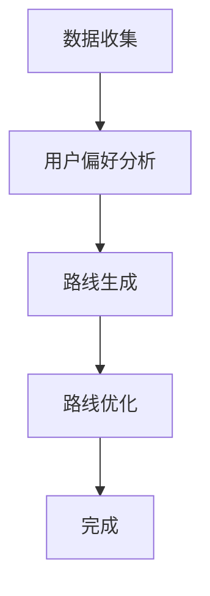
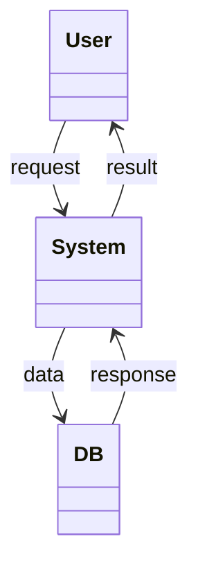
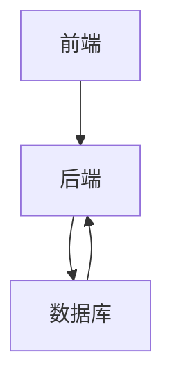
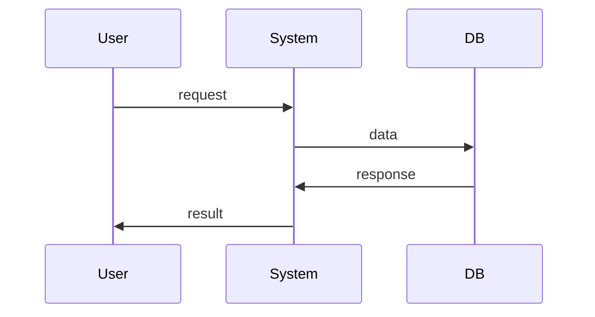

                 


### 摘要
本文将深入探讨AI在个性化旅游路线规划中的应用与优化。首先，我们将介绍个性化旅游路线规划的重要性及其面临的挑战。随后，我们将引入AI的核心概念，并探讨其在旅游路线规划中的潜在应用。接下来，本文将详细讲解AI在旅游路线规划中的算法原理，包括机器学习和深度学习的基本原理及常见算法。此外，我们将探讨个性化旅游路线规划的系统设计与架构，并分享一个实际案例，展示如何运用AI技术实现个性化旅游路线规划。最后，本文将总结最佳实践，并提供进一步阅读的推荐。

---

### 关键词
- 个性化旅游路线规划
- AI
- 机器学习
- 深度学习
- 系统设计
- 旅游路线优化

### 第一部分：背景与概念

#### 第1章：问题背景与核心概念

**1.1 问题背景**

随着旅游业的不断发展，人们对个性化旅游体验的需求日益增加。传统的旅游路线规划往往缺乏灵活性，难以满足个性化需求。而AI技术的引入为旅游路线规划带来了新的机遇。AI能够处理大量数据，分析用户偏好，从而生成个性化的旅游路线，提高旅游体验。

**1.2 核心概念介绍**

- **个性化旅游路线**：基于用户偏好和兴趣，为用户提供定制化的旅游路线。
- **AI**：一种模拟人类智能的技术，包括机器学习和深度学习等。

**1.3 概念属性对比**

| 对比项       | 个性化旅游路线（传统） | 个性化旅游路线（AI）   |
| ------------ | ---------------------- | ---------------------- |
| 数据处理能力 | 有限，依赖人工经验     | 强大，基于数据分析     |
| 灵活性       | 较低，难以调整         | 较高，实时优化         |
| 用户满意度   | 一般                  | 较高，满足个性化需求   |

#### 第2章：AI基础

**2.1 AI概述**

AI是指由人制造出来的系统能够胜任通常需要人类智能才能完成的复杂工作。AI的核心技术包括机器学习和深度学习。

**2.2 机器学习基础**

机器学习是一种通过数据驱动的方式改善性能的技术。常见算法包括决策树、支持向量机等。

**2.3 深度学习基础**

深度学习是一种模拟人脑神经网络的结构和功能的人工智能技术。常见网络结构包括卷积神经网络（CNN）和循环神经网络（RNN）。

### 第二部分：算法原理

#### 第3章：个性化旅游路线规划的算法原理

**3.1 算法介绍**

个性化旅游路线规划的算法基于用户偏好和兴趣，结合AI技术进行优化。

**3.2 算法原理**

算法原理包括数据收集、用户偏好分析、路线生成和优化。具体流程如下：

1. **数据收集**：收集用户的基本信息、历史旅游记录和偏好数据。
2. **用户偏好分析**：使用机器学习和深度学习算法分析用户偏好，为生成个性化路线提供依据。
3. **路线生成**：基于用户偏好生成初步的旅游路线。
4. **路线优化**：使用优化算法对路线进行优化，确保路线满足用户需求。

**3.3 算法流程图**



**3.4 Python代码示例**

```python
# 用户偏好分析示例代码
def user_preference_analysis(data):
    # 这里是机器学习模型的训练代码
    # 根据用户数据生成偏好模型
    pass

# 路线生成示例代码
def generate_route(preferences):
    # 根据偏好生成旅游路线
    pass

# 路线优化示例代码
def optimize_route(route):
    # 对路线进行优化
    pass
```

### 第三部分：系统设计与架构

#### 第4章：个性化旅游路线规划系统设计

**4.1 问题场景介绍**

在一个旅游应用程序中，我们需要为用户提供个性化的旅游路线规划服务。

**4.2 项目介绍**

项目名为“个性化旅游路线规划系统”，旨在为用户提供定制化的旅游路线。

**4.3 系统功能设计**

系统功能包括用户信息管理、旅游路线生成和优化等。

**4.4 系统架构设计**

系统架构包括前端、后端和数据库。

**4.5 系统接口设计**

系统接口设计包括用户接口、API接口等。

**4.6 系统交互**

系统交互流程包括用户请求、数据处理和结果返回等。

**4.7 Mermaid类图**



**4.8 Mermaid架构图**



**4.9 Mermaid序列图**



### 第四部分：项目实战

#### 第5章：个性化旅游路线规划项目实战

**5.1 环境安装**

安装Python、机器学习库（如scikit-learn）和深度学习库（如TensorFlow）。

**5.2 系统核心实现**

实现用户偏好分析、路线生成和优化等功能。

**5.3 代码应用解读与分析**

详细解读代码，分析算法原理和实现细节。

**5.4 实际案例分析和详细讲解剖析**

分析一个实际案例，展示如何运用AI技术实现个性化旅游路线规划。

**5.5 项目小结**

总结项目经验，讨论项目中的挑战和解决方案。

### 第五部分：最佳实践

#### 第6章：最佳实践与注意事项

**6.1 最佳实践**

- 数据收集和处理
- 算法选择与优化
- 系统性能优化

**6.2 注意事项**

- 用户隐私保护
- 系统安全
- 性能监控与维护

### 第六部分：总结与拓展

#### 第7章：总结与拓展阅读

**7.1 总结**

本文介绍了AI在个性化旅游路线规划中的应用与优化，包括算法原理、系统设计、项目实战和最佳实践。

**7.2 拓展阅读**

- 个性化推荐系统
- 旅游大数据分析
- AI在旅游业的应用前景

---

**作者信息：**

作者：AI天才研究院/AI Genius Institute & 禅与计算机程序设计艺术 /Zen And The Art of Computer Programming

### 结语

本文通过一步步的分析和讲解，展示了AI在个性化旅游路线规划中的应用与优化。随着AI技术的不断发展，个性化旅游路线规划将越来越完善，为用户提供更好的旅游体验。希望本文能为读者在相关领域的研究和应用提供一些启示。

