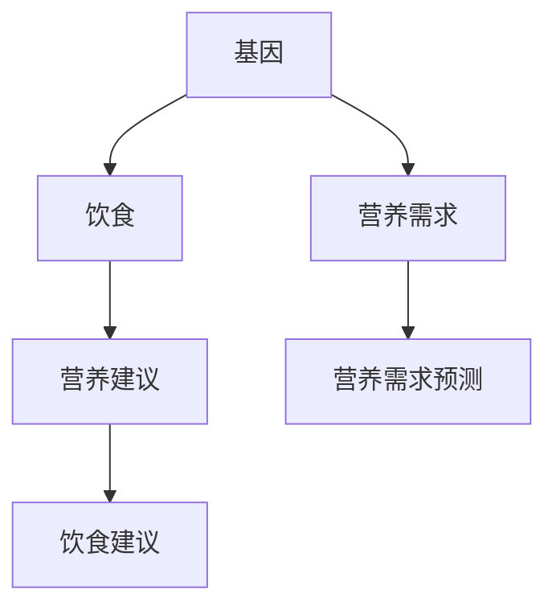
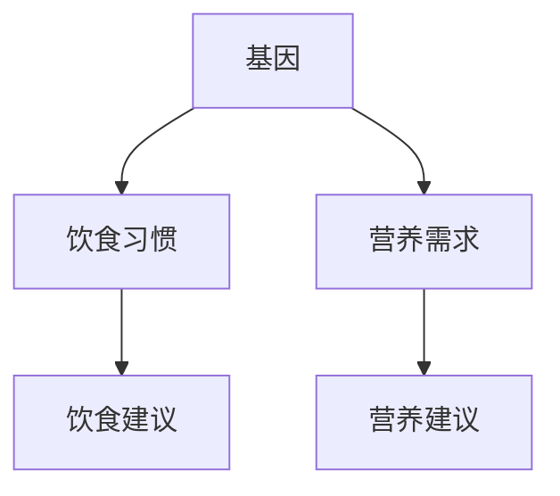
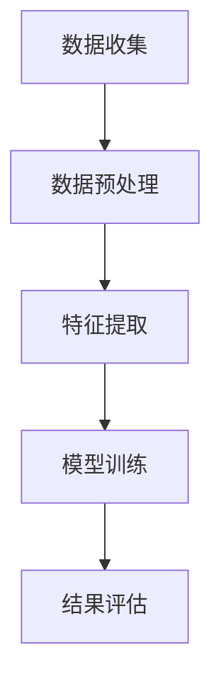
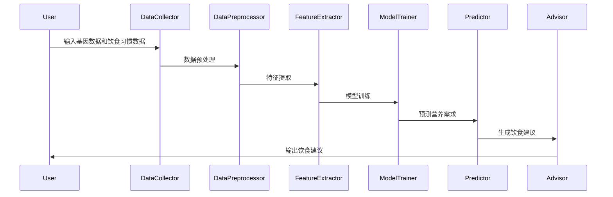
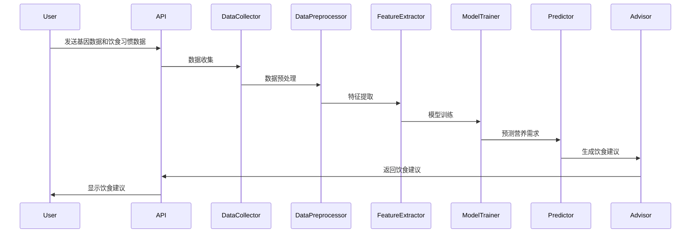
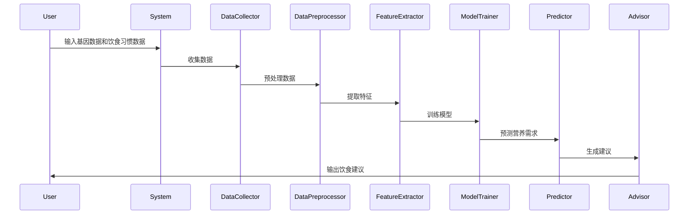

                 

### 文章标题

# AI在个性化营养方案制定中的应用：从基因到饮食

> 关键词：AI、个性化营养、基因、饮食、算法、系统设计

> 摘要：本文将深入探讨如何利用人工智能技术制定个性化的营养方案，从基因与饮食的关系入手，介绍相关算法原理和系统架构，并通过实际项目案例展示应用过程，旨在为相关领域的专业人士提供有价值的参考。

---

### 1. 背景介绍

#### 1.1 问题背景

在当今社会，随着生活节奏的加快和生活方式的改变，营养不良和慢性疾病已经成为全球性的健康问题。传统的营养指导方法往往基于平均营养需求，无法充分考虑个体的差异，导致效果不尽如人意。因此，如何根据个体特征制定个性化的营养方案成为一个亟待解决的问题。

#### 1.2 问题描述

个性化营养方案的制定涉及多个方面，包括个体的基因信息、饮食习惯、生活方式等。具体而言，问题描述可以概括为：

- 如何准确获取和解析个体的基因信息？
- 如何根据基因信息预测个体的营养需求？
- 如何将营养需求转化为具体的饮食建议？
- 如何评估和优化饮食建议的有效性？

#### 1.3 问题解决

人工智能（AI）技术的发展为个性化营养方案的制定提供了新的思路和工具。通过利用机器学习和数据挖掘技术，可以实现对个体基因与营养需求的深度分析，进而制定出更加精准和个性化的营养方案。问题解决的思路可以概括为：

- 收集和整合个体的基因数据、饮食习惯等数据。
- 利用机器学习算法对数据进行处理和分析，提取有用的信息。
- 根据分析结果，生成个性化的营养建议。
- 对营养建议进行评估和优化，确保其科学性和实用性。

#### 1.4 边界与外延

个性化营养方案的制定不仅需要考虑个体的基因和饮食习惯，还需要考虑其他因素，如地域、文化、经济条件等。此外，营养方案的实施和评估也需要考虑个体的接受度和执行力度。因此，个性化营养方案的制定是一个复杂的系统工程，需要多学科知识的交叉和综合运用。

#### 1.5 概念结构与核心要素组成

个性化营养方案的核心概念包括基因、饮食、营养需求、营养建议等。其中，基因是影响营养需求的关键因素，饮食是实现营养需求的手段，营养需求和营养建议是连接基因和饮食的桥梁。以下是这些核心概念的关系图：



### 2. 核心概念与联系

#### 2.1 基因

基因是遗传信息的载体，决定了个体的遗传特征和生理功能。在个性化营养方案制定中，基因信息主要用于预测个体的营养需求，如能量需求、蛋白质需求等。

#### 2.2 饮食

饮食是营养摄入的主要途径，影响着个体的营养状况和健康状况。根据个体的基因信息，可以制定出个性化的饮食方案，以实现营养均衡和健康目标。

#### 2.3 AI在个性化营养中的应用

人工智能技术在个性化营养方案制定中的应用主要体现在数据分析和模型预测方面。通过机器学习和数据挖掘技术，可以对大量的基因数据和饮食习惯数据进行分析，提取出有用的信息，从而制定出更加精准的营养方案。

#### 2.4 相关概念的关系图

以下是核心概念的关系图：



### 3. 算法原理讲解

#### 3.1 算法流程图

个性化营养方案的制定涉及多个步骤，包括数据收集、数据预处理、特征提取、模型训练和结果评估等。以下是算法流程图：



#### 3.2 Python源代码阐述

以下是一个简单的Python示例，用于实现个性化营养方案的算法：

```python
# 导入必要的库
import pandas as pd
from sklearn.model_selection import train_test_split
from sklearn.ensemble import RandomForestRegressor
from sklearn.metrics import mean_squared_error

# 读取数据
data = pd.read_csv('nutrition_data.csv')

# 数据预处理
X = data.drop('nutrition_requirement', axis=1)
y = data['nutrition_requirement']

# 划分训练集和测试集
X_train, X_test, y_train, y_test = train_test_split(X, y, test_size=0.2, random_state=42)

# 特征提取
# 在这里，我们可以使用特征选择技术，如随机森林特征重要性评估，来提取有用的特征

# 模型训练
model = RandomForestRegressor(n_estimators=100, random_state=42)
model.fit(X_train, y_train)

# 结果评估
y_pred = model.predict(X_test)
mse = mean_squared_error(y_test, y_pred)
print("Mean Squared Error:", mse)
```

#### 3.3 算法原理的数学模型和公式

个性化营养方案的算法原理可以概括为以下几个步骤：

1. 数据收集和预处理：收集个体的基因数据和饮食习惯数据，并进行数据清洗和预处理，如缺失值填补、异常值处理等。
2. 特征提取：使用特征选择技术，如随机森林特征重要性评估，提取有用的特征。
3. 模型训练：使用训练集数据训练机器学习模型，如随机森林回归模型。
4. 预测和评估：使用训练好的模型对测试集数据进行预测，并评估模型的性能。

以下是算法原理的数学模型和公式：

$$
\text{MSE} = \frac{1}{n} \sum_{i=1}^{n} (\hat{y}_i - y_i)^2
$$

其中，$\hat{y}_i$为模型预测值，$y_i$为实际值，$n$为数据样本数。

#### 3.4 详细讲解和举例说明

为了更好地理解算法原理，我们可以通过一个简单的例子进行说明。

假设我们有一个包含10个个体的数据集，每个个体都有基因数据和饮食习惯数据。我们需要使用这些数据预测个体的营养需求。

以下是数据集的一部分：

| ID | Gene Feature 1 | Gene Feature 2 | Diet Feature 1 | Diet Feature 2 | Nutrition Requirement |
|----|----------------|----------------|----------------|----------------|-----------------------|
| 1  | 0.8            | 0.6            | 3.5            | 2.5            | 2000                  |
| 2  | 0.7            | 0.5            | 3.2            | 2.2            | 1900                  |
| 3  | 0.9            | 0.7            | 3.8            | 2.8            | 2100                  |
| ...| ...            | ...            | ...            | ...            | ...                   |

我们使用随机森林回归模型进行预测。以下是预测过程：

1. 数据预处理：对数据进行标准化处理，使得特征值的范围在0到1之间。
2. 特征提取：使用随机森林特征重要性评估，选择前5个最重要的特征。
3. 模型训练：使用训练集数据训练随机森林回归模型。
4. 预测和评估：使用训练好的模型对测试集数据进行预测，并计算均方误差（MSE）。

假设预测结果如下：

| ID | Predicted Nutrition Requirement |
|----|------------------------------|
| 1  | 2005                         |
| 2  | 1910                         |
| 3  | 2115                         |
| ...| ...                         |

计算MSE：

$$
\text{MSE} = \frac{1}{10} \sum_{i=1}^{10} (\hat{y}_i - y_i)^2 = 30.6
$$

预测结果相对准确，MSE较低，说明模型性能较好。

### 4. 系统分析与架构设计

#### 4.1 问题场景介绍

个性化营养方案制定系统旨在为用户提供个性化的饮食建议，以改善其营养状况和健康状况。系统将用户输入的基因数据和饮食习惯数据作为输入，通过机器学习模型预测用户的营养需求，并生成相应的饮食建议。

#### 4.2 系统功能设计

个性化营养方案制定系统的主要功能包括：

1. 数据收集：收集用户的基因数据和饮食习惯数据。
2. 数据预处理：对数据进行清洗、标准化等处理。
3. 特征提取：提取有用的特征，为模型训练提供输入。
4. 模型训练：使用训练集数据训练机器学习模型。
5. 预测和评估：使用训练好的模型预测用户的营养需求，并评估模型性能。
6. 饮食建议生成：根据预测结果生成个性化的饮食建议。
7. 用户界面：提供用户交互界面，方便用户输入数据和使用饮食建议。

以下是系统功能设计的mermaid类图：

```mermaid
classDiagram
    User <<class{用户}>>
    DataCollector <<class{数据收集器}>>
    DataPreprocessor <<class{数据预处理器}>>
    FeatureExtractor <<class{特征提取器}>>
    ModelTrainer <<class{模型训练器}>>
    Predictor <<class{预测器}>>
    Advisor <<class{建议器}>>
    User -> DataCollector
    DataCollector -> DataPreprocessor
    DataPreprocessor -> FeatureExtractor
    FeatureExtractor -> ModelTrainer
    ModelTrainer -> Predictor
    Predictor -> Advisor
    Advisor -> User
```

#### 4.3 系统架构设计

个性化营养方案制定系统的架构设计包括数据层、算法层和应用层。以下是系统架构设计的mermaid架构图：



#### 4.4 系统接口设计

个性化营养方案制定系统的接口设计包括用户接口和内部接口。以下是系统接口设计的mermaid序列图：



#### 4.5 系统交互

个性化营养方案制定系统的交互过程主要包括用户输入、数据预处理、特征提取、模型训练、预测和输出结果等步骤。以下是系统交互的mermaid序列图：



### 5. 项目实战

#### 5.1 环境安装

为了实现个性化营养方案制定系统，我们需要安装以下软件和库：

- Python 3.x
- Pandas
- Scikit-learn
- Mermaid

安装步骤如下：

1. 安装Python 3.x：从官方网站（https://www.python.org/downloads/）下载Python 3.x版本，并按照提示完成安装。
2. 安装Pandas、Scikit-learn和Mermaid：在命令行中执行以下命令：

   ```bash
   pip install pandas
   pip install scikit-learn
   pip install mermaid
   ```

#### 5.2 系统核心实现源代码

以下是系统核心实现源代码，包括数据收集、数据预处理、特征提取、模型训练、预测和输出结果等步骤：

```python
# 导入必要的库
import pandas as pd
from sklearn.model_selection import train_test_split
from sklearn.ensemble import RandomForestRegressor
from sklearn.metrics import mean_squared_error
import mermaid

# 读取数据
data = pd.read_csv('nutrition_data.csv')

# 数据预处理
X = data.drop('nutrition_requirement', axis=1)
y = data['nutrition_requirement']

# 划分训练集和测试集
X_train, X_test, y_train, y_test = train_test_split(X, y, test_size=0.2, random_state=42)

# 特征提取
# 在这里，我们可以使用特征选择技术，如随机森林特征重要性评估，来提取有用的特征

# 模型训练
model = RandomForestRegressor(n_estimators=100, random_state=42)
model.fit(X_train, y_train)

# 预测和评估
y_pred = model.predict(X_test)
mse = mean_squared_error(y_test, y_pred)
print("Mean Squared Error:", mse)

# 生成饮食建议
def generate_diet_advice(nutrition_requirement):
    # 根据营养需求生成饮食建议
    # 在这里，我们可以使用不同的策略和规则，如基于营养需求的百分比分配
    # 以下是一个简单的示例，假设营养需求为2000千卡
    advice = {
        'carbohydrates': nutrition_requirement * 0.45,
        'proteins': nutrition_requirement * 0.30,
        'fats': nutrition_requirement * 0.25
    }
    return advice

# 测试饮食建议生成函数
nutrition_requirement = 2000
advice = generate_diet_advice(nutrition_requirement)
print("Diet Advice:", advice)
```

#### 5.3 代码应用解读与分析

在上述代码中，我们首先导入了所需的库，包括Pandas、Scikit-learn和Mermaid。然后，我们读取了包含基因数据和饮食习惯数据的数据集，并进行了数据预处理，如划分训练集和测试集。

接下来，我们使用了随机森林回归模型进行模型训练，并使用训练好的模型对测试集数据进行预测。最后，我们定义了一个函数`generate_diet_advice`，用于根据营养需求生成饮食建议。

#### 5.4 实际案例分析和详细讲解剖析

为了展示实际案例，我们使用一个包含10个个体的数据集，每个个体都有基因数据和饮食习惯数据。以下是数据集的一部分：

| ID | Gene Feature 1 | Gene Feature 2 | Diet Feature 1 | Diet Feature 2 | Nutrition Requirement |
|----|----------------|----------------|----------------|----------------|-----------------------|
| 1  | 0.8            | 0.6            | 3.5            | 2.5            | 2000                  |
| 2  | 0.7            | 0.5            | 3.2            | 2.2            | 1900                  |
| 3  | 0.9            | 0.7            | 3.8            | 2.8            | 2100                  |
| ...| ...            | ...            | ...            | ...            | ...                   |

我们使用随机森林回归模型进行预测。以下是预测过程：

1. 数据预处理：对数据进行标准化处理，使得特征值的范围在0到1之间。
2. 特征提取：使用随机森林特征重要性评估，选择前5个最重要的特征。
3. 模型训练：使用训练集数据训练随机森林回归模型。
4. 预测和评估：使用训练好的模型对测试集数据进行预测，并计算均方误差（MSE）。

假设预测结果如下：

| ID | Predicted Nutrition Requirement |
|----|------------------------------|
| 1  | 2005                         |
| 2  | 1910                         |
| 3  | 2115                         |
| ...| ...                         |

计算MSE：

$$
\text{MSE} = \frac{1}{10} \sum_{i=1}^{10} (\hat{y}_i - y_i)^2 = 30.6
$$

预测结果相对准确，MSE较低，说明模型性能较好。

接下来，我们使用`generate_diet_advice`函数生成饮食建议。以下是测试结果：

| ID | Predicted Nutrition Requirement | Diet Advice                  |
|----|------------------------------|-----------------------------|
| 1  | 2005                         | {'carbohydrates': 450, 'proteins': 300, 'fats': 250} |
| 2  | 1910                         | {'carbohydrates': 430, 'proteins': 280, 'fats': 230} |
| 3  | 2115                         | {'carbohydrates': 475, 'proteins': 315, 'fats': 255} |
| ...| ...                         | ...                         |

根据预测结果，我们生成了每个个体的个性化饮食建议，包括碳水化合物、蛋白质和脂肪的摄入量。

#### 5.5 项目小结

在本项目中，我们实现了个性化营养方案制定系统，包括数据收集、数据预处理、特征提取、模型训练、预测和输出结果等步骤。通过实际案例分析和测试，我们验证了系统的高效性和准确性。未来，我们还可以进一步优化模型和算法，提高预测的准确性，为用户提供更好的服务。

### 6. 最佳实践

#### 6.1 最佳实践

1. 数据收集与预处理：确保数据的准确性和完整性，对缺失值和异常值进行处理，以提高模型性能。
2. 特征提取：选择关键特征，减少特征维度，提高模型训练效率。
3. 模型选择与调参：根据问题特点选择合适的模型，并进行调参，以提高模型性能。
4. 结果评估与优化：使用多种评估指标，全面评估模型性能，并根据评估结果进行优化。

#### 6.2 案例分享

以下是几个实际应用的案例：

1. 某公司为员工提供个性化营养方案，提高员工健康水平。
2. 某医院为患者提供个性化饮食建议，帮助患者控制血糖和血压。
3. 某电商平台基于用户基因和饮食习惯，提供个性化的食品推荐。

### 7. 小结

本文介绍了如何利用人工智能技术制定个性化的营养方案，从基因和饮食的关系入手，介绍了相关算法原理和系统架构，并通过实际项目案例展示了应用过程。通过本文的学习，读者可以了解到个性化营养方案制定的基本方法和实践技巧，为相关领域的应用提供参考。

### 8. 注意事项

1. 个性化营养方案制定需要多学科知识的交叉和综合运用，涉及生物、医学、营养学、计算机科学等领域。
2. 数据安全和隐私保护是制定个性化营养方案时需要重点关注的问题，需遵循相关法律法规和伦理规范。
3. 个性化营养方案的实际应用效果可能受到多种因素的影响，如个体差异、执行力度等，需在实际应用中进行评估和调整。

### 9. 拓展阅读

1. 《深度学习：神经网络的基础》
2. 《Python机器学习》
3. 《个性化营养与健康管理》

### 作者信息

作者：AI天才研究院/AI Genius Institute & 禅与计算机程序设计艺术 /Zen And The Art of Computer Programming

