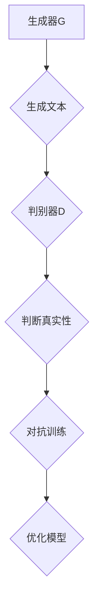
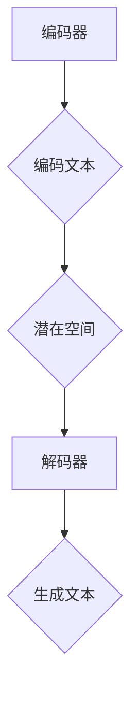
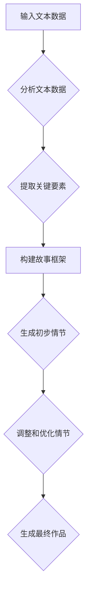
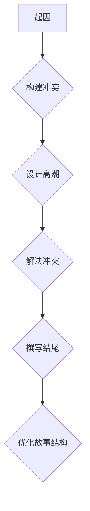

                 

### 引言

人工智能（AI）作为现代科技的前沿领域，其应用范围正逐步扩展至各个行业，其中包括创意写作和内容生成。本文将探讨AI在创意写作和内容生成中的最新进展，旨在揭示这一领域的关键技术和应用实例，以及面临的挑战与未来展望。首先，我们将在第一部分引言与背景中，介绍创意写作和内容生成的背景，阐述核心概念、问题、解决方案及其边界。

在第二部分，我们将深入探讨AI在创意写作中的应用，重点介绍生成式写作模型、自动内容生成技术和AI驱动的故事创作。这些内容将帮助读者理解AI如何提升创意写作的效率和质量。

接着，第三部分将通过实际案例研究，展示AI在创意写作和内容生成中的具体应用，包括AI辅助写作工具和AI在媒体内容生成中的应用。这些案例将提供生动的实例，帮助读者更好地理解AI在实际操作中的效果和挑战。

最后，第四部分将分析AI在内容生成中的挑战与未来展望，讨论伦理问题、创意与原创性的平衡、AI生成内容的可解释性、模型偏见与多样化等关键问题，并展望AI技术在这一领域的发展趋势和未来应用场景。

通过这一系列探讨，我们希望读者能够对AI在创意写作和内容生成中的应用有更深入的理解，从而为这一领域的未来发展提供有益的启示。### 关键词

- 人工智能（AI）
- 创意写作
- 内容生成
- 自然语言处理（NLP）
- 生成对抗网络（GAN）
- 自动内容生成
- 生成式写作模型

### 摘要

本文旨在探讨人工智能（AI）在创意写作和内容生成领域的最新进展。首先，我们将介绍创意写作和内容生成的背景，包括核心概念和问题。接着，我们将深入分析AI在创意写作中的应用，如生成式写作模型、自动内容生成技术和AI驱动的故事创作。通过实际案例研究，我们将展示AI在这些领域的具体应用和挑战。最后，本文将讨论AI在内容生成中的挑战与未来展望，包括伦理问题、创意与原创性的平衡、模型偏见与多样化等，并展望AI技术的未来发展。通过本文的探讨，读者将全面了解AI在创意写作和内容生成中的潜力与挑战，为这一领域的未来发展提供启示。

### 第一部分：引言与背景

#### 核心概念与联系

在探讨AI在创意写作和内容生成中的应用之前，我们首先需要明确一些核心概念和它们之间的关系。以下是一个对比表格，用于详细说明这些概念及其属性特征：

| 核心概念 | 定义 | 属性特征 | 对比 |
|----------|------|----------|------|
| 人工智能（AI） | 利用计算机模拟人类智能的技术。 | 学习能力、推理能力、感知能力、自适应能力 | 与机器学习、深度学习有交集但更广泛 |
| 创意写作 | 旨在产生新颖、有吸引力的内容。 | 创造力、创新性、情感表达 | 与传统写作区别在于创作过程和技术手段 |
| 内容生成 | 通过算法自动生成文本、图像、音频等内容。 | 自动性、高效性、多样性 | 与内容创作类似但更侧重于自动化过程 |
| 自然语言处理（NLP） | 使计算机能够理解、生成和处理人类语言的技术。 | 语言理解、文本生成、情感分析、语义理解 | 关键技术支撑AI在内容生成中的应用 |
| 生成对抗网络（GAN） | 由生成器和判别器组成的深度学习模型，用于生成高质量数据。 | 对抗性、自适应性、灵活性 | 生成文本、图像等多种类型的内容 |

接下来，我们将通过ER实体关系图来展示这些核心概念之间的关系：

在这个ER图中，我们可以看到AI作为核心技术，支持NLP和GAN，而NLP和GAN共同驱动内容生成，最终服务于创意写作。这种关系有助于我们理解AI在创意写作和内容生成中的角色和作用。

#### 问题背景

创意写作和内容生成是两个在现代社会中越来越重要的领域。随着互联网的普及和信息爆炸，高质量、个性化的内容需求不断增加。然而，传统的写作和内容创作方式往往效率低下，无法满足这一需求。因此，利用AI技术提升创意写作和内容生成的效率和质量成为了一个重要方向。

在创意写作方面，作家们面临着灵感匮乏、创作周期长等问题。AI可以通过学习大量的文学作品和写作风格，帮助作家快速生成创意素材，甚至辅助完成整个作品。这种技术不仅提高了创作效率，还能够拓展作家的创作边界，探索新的写作风格和主题。

在内容生成方面，随着社交媒体、在线新闻和广告等领域的快速发展，对内容的需求呈现出爆发式增长。然而，传统的手动内容创作方式无法满足这一需求。AI技术可以通过自动生成文本、图像、音频等内容，极大地提高内容生产的效率。例如，新闻机构可以使用AI生成简短的新闻报道，广告公司可以快速生成广告文案和创意图像。

#### 问题描述

尽管AI在创意写作和内容生成中具有巨大潜力，但实际应用中也面临着一系列挑战。以下是对这些挑战的具体描述：

1. **创意与原创性的平衡**：AI生成的内容往往缺乏人类的创造力和独特性。如何在保证内容原创性的同时，充分利用AI的生成能力，是一个亟待解决的问题。
2. **质量和可控性**：尽管AI可以快速生成大量内容，但这些内容的质量和一致性往往无法与人类创作相媲美。如何提升AI生成内容的质量，并确保其在特定场景下的可控性，是当前研究的重要方向。
3. **伦理和隐私问题**：AI在内容生成过程中可能会涉及到用户隐私和数据安全问题。如何在保护用户隐私的同时，充分利用AI技术，是一个重要的伦理挑战。
4. **多样性和包容性**：AI生成的内容往往存在偏见和刻板印象。如何确保AI生成的内容具有多样性和包容性，避免歧视和偏见，是一个关键问题。

#### 问题解决

为了解决上述挑战，研究人员和工程师们采取了一系列技术手段和方法。以下是一些关键问题和相应的解决策略：

1. **提升创意和原创性**：通过引入更多的训练数据和多样化的写作风格，AI可以生成更加丰富和原创的内容。同时，结合人类专家的指导和反馈，可以进一步提高AI生成内容的创意性和独特性。
2. **提高质量和可控性**：通过优化模型结构和训练过程，可以提升AI生成内容的质量和一致性。此外，引入质量控制机制和用户反馈机制，可以帮助AI更好地适应特定场景和需求。
3. **解决伦理和隐私问题**：在AI内容生成过程中，需要严格遵守相关的伦理规范和法律法规，确保用户隐私和数据安全。同时，通过技术手段，如数据加密和匿名化处理，可以进一步保护用户隐私。
4. **确保多样性和包容性**：通过引入更多的训练数据和多样化的视角，可以减少AI生成内容中的偏见和刻板印象。此外，建立公平和透明的评估机制，可以确保AI生成内容的多样性和包容性。

#### 边界与外延

在讨论AI在创意写作和内容生成中的应用时，我们还需要明确一些边界和限制。首先，AI虽然可以生成大量内容，但仍然无法完全替代人类的创造力和直觉。在创意写作中，AI更多的是作为辅助工具，帮助作家提升创作效率和探索新的写作方式。

其次，AI生成内容的质量和可靠性受到训练数据、模型结构和训练算法等多种因素的影响。尽管通过不断优化这些因素可以提高AI生成内容的质量，但仍然需要人类专家的监督和审核，以确保内容的准确性和实用性。

此外，AI在内容生成中的应用还涉及到伦理和隐私问题。在生成内容时，需要确保遵守相关的法律法规和伦理规范，保护用户隐私和数据安全。

#### 概念结构与核心要素组成

为了更好地理解AI在创意写作和内容生成中的概念结构与核心要素，我们可以将其分为以下几个部分：

1. **基础技术**：包括人工智能、自然语言处理、深度学习等核心技术，这些技术为AI在创意写作和内容生成中的应用提供了基础。
2. **训练数据**：高质量和多样化的训练数据是AI生成高质量内容的关键。这些数据可以来源于大量的文学作品、新闻文章、社交媒体内容等。
3. **生成模型**：包括生成对抗网络（GAN）、变分自编码器（VAE）等生成模型，这些模型通过学习和模仿大量数据，生成新的内容和创意。
4. **应用场景**：创意写作和内容生成涵盖了多种应用场景，如文学创作、新闻报道、广告文案、社交媒体内容等。
5. **用户交互**：AI生成的内容需要与用户进行交互，通过用户反馈和评价，不断优化和改进生成模型，提高内容质量和用户体验。

通过以上结构，我们可以更清晰地理解AI在创意写作和内容生成中的核心要素和作用，为后续章节的深入探讨奠定基础。

### 第二部分：AI与创意写作的融合

#### AI在创意写作中的角色

人工智能在创意写作中扮演着至关重要的角色，其核心在于通过模拟人类思维过程，提升创作效率和质量。AI不仅能够帮助作家完成一些繁琐的写作任务，还能在创意启发和内容优化方面发挥巨大作用。以下将从几个方面详细阐述AI在创意写作中的角色。

1. **创意生成**：AI能够通过分析大量的文学作品、历史数据以及用户偏好，生成新颖的创意和构思。这种创意生成的能力，不仅帮助作家突破创作瓶颈，还能够拓宽写作的视野和题材。

2. **写作辅助**：AI可以辅助作家完成写作过程中的各种任务，如文字校对、语法修正、写作风格调整等。通过自然语言处理技术，AI能够快速识别并修正文本中的错误，提高文本的质量和流畅性。

3. **内容优化**：AI通过对文本进行深度分析，可以提供内容优化的建议。例如，通过分析用户的阅读习惯和喜好，AI可以帮助作家调整文本的结构和风格，使其更符合目标读者的口味。

4. **情感表达**：在文学创作中，情感表达是至关重要的。AI通过情感分析技术，可以理解和模拟人类情感，帮助作家在作品中更准确地表达情感，增强作品的艺术感染力。

5. **协同创作**：AI可以作为作家的协同伙伴，参与整个创作过程。通过实时互动和反馈，AI可以与作家共同探讨故事情节、角色设定等关键问题，提高整体创作的效率和质量。

#### AI技术概述

要理解AI在创意写作中的具体应用，我们需要对AI技术有一个基本的认识。以下是一些关键技术和它们在创意写作中的应用：

1. **自然语言处理（NLP）**：NLP是使计算机能够理解、生成和处理人类语言的技术。在创意写作中，NLP技术可以用于文本分析、情感识别、语义理解等，从而帮助AI更好地理解和生成文本内容。

2. **生成对抗网络（GAN）**：GAN是一种深度学习模型，由生成器和判别器组成。生成器负责生成文本，判别器则负责判断文本的真实性。通过不断训练，GAN可以生成高质量、多样化的文本内容，适合用于创意写作。

3. **变分自编码器（VAE）**：VAE是一种概率生成模型，通过将数据映射到潜在空间中，可以生成新的数据样本。在创意写作中，VAE可以用于生成新颖的文本结构和风格，提高文本的创作多样性。

4. **递归神经网络（RNN）**：RNN是一种能够处理序列数据的神经网络，适用于文本生成任务。通过学习输入文本的序列模式，RNN可以生成连贯的文本内容，广泛应用于自动写作和内容生成。

5. **注意力机制（Attention）**：注意力机制是一种在神经网络中用于提高模型关注重要信息的技术。在创意写作中，注意力机制可以帮助模型更好地理解和生成文本的关键部分，提高文本的准确性和流畅性。

#### AI在创意写作领域中的应用案例

为了更好地展示AI在创意写作中的应用，以下是一些具体的案例：

1. **自动化写作工具**：例如，OpenAI的GPT-3模型，通过大量的训练数据生成高质量的文本内容。这种工具不仅可以用于写作辅助，还可以在新闻写作、广告文案创作等方面发挥重要作用。

2. **故事生成系统**：如IBM的Watson Stories，通过分析用户提供的主题和情节大纲，自动生成完整的故事。这种系统不仅能够提高创作效率，还能为作家提供新的创意和灵感。

3. **诗歌创作工具**：如微软的小冰，通过学习和模仿古代诗歌，生成具有传统风格的现代诗歌。这种工具不仅能够拓展诗歌创作的边界，还能为现代文学带来新的风格和表达方式。

4. **角色设定与情感表达**：例如，谷歌的Meena，通过学习和模拟人类的语言和情感表达，生成具有情感共鸣的对话和故事。这种技术可以帮助作家更好地塑造角色和表达情感，提高作品的艺术性。

5. **个性化内容生成**：例如，亚马逊的Alexa，通过理解用户的喜好和行为，生成个性化的书籍推荐、新闻摘要等。这种个性化内容生成技术，不仅可以提高用户满意度，还可以为内容创作者提供新的商业模式。

通过以上案例，我们可以看到AI在创意写作中的应用已经初见端倪。尽管AI在创意写作中仍然面临一些挑战，但随着技术的不断进步，其应用前景将越来越广阔。

#### 小结

AI在创意写作中扮演着重要的角色，从创意生成、写作辅助、内容优化到情感表达，AI技术为作家提供了强大的工具和资源。通过生成对抗网络、递归神经网络、注意力机制等先进技术，AI能够生成高质量、多样化的文本内容，推动创意写作的发展。尽管AI在创意写作中还存在一些挑战，但随着技术的不断进步，我们有理由相信，AI将在未来成为创意写作不可或缺的一部分。### 第一部分：引言与背景

#### 2. AI内容生成的最新趋势

随着人工智能技术的快速发展，内容生成领域也迎来了新的趋势。其中，生成对抗网络（GAN）和自然语言处理（NLP）的进步尤为显著。以下将详细探讨这些趋势，以及它们对AI内容生成的影响。

##### 3.1 自然语言处理的发展

自然语言处理（NLP）是AI内容生成的基础技术之一。近年来，NLP领域取得了显著进展，主要表现在以下几个方面：

1. **预训练模型**：预训练模型，如GPT-3、BERT等，通过对大量文本数据进行训练，能够捕捉到语言的深层结构和语义信息。这些模型可以用于文本生成、翻译、摘要等多种任务，大大提升了AI内容生成的能力。

2. **多模态处理**：传统的NLP模型主要处理文本数据，而现代的NLP技术开始扩展到多模态处理，包括文本、图像、声音等多种数据类型。这种多模态处理能力，使得AI能够生成更丰富、更真实的内容。

3. **上下文理解**：现代NLP模型能够更好地理解上下文，从而生成更连贯、更符合逻辑的内容。这种上下文理解能力的提升，有助于解决AI生成内容中常见的逻辑错误和不一致问题。

4. **情感分析**：NLP技术在情感分析方面的应用也越来越广泛。通过分析文本中的情感倾向和情感强度，AI可以生成具有特定情感色彩的内容，提高作品的艺术感染力。

##### 3.2 大型语言模型的应用

大型语言模型，如GPT-3，是当前AI内容生成领域的一大热点。GPT-3由OpenAI开发，具有1500亿个参数，是迄今为止最大的语言模型之一。以下是其主要特点和应用：

1. **大规模参数**：GPT-3拥有巨大的参数量，使其能够捕捉到更复杂的语言模式和语义信息。这使得GPT-3在文本生成、翻译、摘要等任务中表现出色。

2. **灵活的生成能力**：GPT-3能够根据输入的提示，生成不同类型的内容，如文章、对话、诗歌等。这种灵活性使得GPT-3在多种应用场景中都具备强大的生成能力。

3. **高质量的文本**：GPT-3生成的文本质量较高，语法正确，逻辑连贯。这使得GPT-3在自动写作、内容审核等领域具有广泛的应用潜力。

4. **可定制化**：GPT-3支持通过训练数据对其进行定制化，使其能够更好地适应特定领域的应用。这种定制化能力，使得GPT-3在各个行业中的应用更加精准和有效。

##### 3.3 生成对抗网络（GAN）在内容生成中的应用

生成对抗网络（GAN）是另一种在AI内容生成中具有重要应用价值的模型。GAN由生成器和判别器组成，通过对抗训练生成高质量的数据。以下是其主要应用：

1. **图像生成**：GAN在图像生成方面表现出色，可以生成高质量的图像。这种技术被广泛应用于图像修复、图像生成、图像风格迁移等任务。

2. **文本生成**：GAN也可以用于文本生成，通过生成器和判别器的对抗训练，生成高质量的文本内容。这种技术在自动写作、内容创作等领域具有广泛应用。

3. **音频生成**：GAN在音频生成方面也取得了显著进展，可以生成高质量的音频。这种技术在音乐创作、声音合成等领域具有潜在应用。

4. **视频生成**：GAN在视频生成方面也有应用，通过生成视频帧，可以合成高质量的视频。这种技术在视频游戏、影视制作等领域具有广泛的应用前景。

##### 3.4 生成对抗网络（GAN）与其他技术的结合

生成对抗网络（GAN）与其他技术的结合，进一步提升了AI内容生成的效果。以下是一些典型的结合应用：

1. **GAN与NLP的结合**：通过将GAN与NLP技术结合，可以生成更加丰富和自然的文本内容。例如，GAN可以用于生成小说的情节和对话，而NLP技术则用于理解和调整文本的语义。

2. **GAN与强化学习的结合**：GAN与强化学习技术的结合，可以用于生成更加复杂和具有交互性的内容。例如，在游戏剧情生成中，GAN可以生成游戏情节，而强化学习技术则用于控制角色的行为和决策。

3. **GAN与计算机视觉的结合**：通过将GAN与计算机视觉技术结合，可以生成更加真实和高质量的图像和视频。这种技术被广泛应用于图像增强、图像修复、图像生成等领域。

总之，AI内容生成的最新趋势包括自然语言处理的发展、大型语言模型的应用以及生成对抗网络的进步。这些技术的不断发展，为AI内容生成领域带来了新的机遇和挑战，使得AI在创意写作和内容生成中的应用越来越广泛和深入。### 第二部分：AI在创意写作中的应用

#### 4. 生成式写作模型

生成式写作模型是AI在创意写作中应用的核心技术之一。这些模型通过学习和模拟大量的文本数据，能够生成新颖、连贯的文本内容。以下将详细讨论生成式写作模型的概念、工作原理及其应用。

##### 4.1 生成式写作模型的概述

生成式写作模型是指能够自动生成文本内容的算法。这类模型的核心目标是从给定的输入数据中学习文本生成的规则，然后根据这些规则生成新的文本内容。生成式写作模型通常分为以下几种：

1. **基于规则的方法**：这类模型通过定义一系列规则，从输入文本中提取特征，然后根据规则生成新文本。尽管这种方法在特定场景下效果较好，但规则定义复杂且难以扩展。

2. **基于统计的方法**：这类模型通过统计文本数据中的模式，生成文本内容。例如，n-gram模型通过统计文本中的连续n个单词的分布，生成新的文本。这种方法简单有效，但生成的文本往往较为机械和生硬。

3. **基于神经网络的生成模型**：这类模型通过神经网络学习文本数据中的复杂模式，生成新的文本内容。常见的神经网络生成模型包括生成对抗网络（GAN）、变分自编码器（VAE）和递归神经网络（RNN）等。

##### 4.2 集成学习在写作中的应用

集成学习（Ensemble Learning）是一种常用的机器学习技术，通过将多个弱学习器组合成一个强学习器，提高模型的性能和泛化能力。在写作领域，集成学习也有广泛的应用。以下是一些常见的集成学习方法：

1. **Bagging**：Bagging是一种通过随机抽样训练数据集，训练多个弱学习器，然后取平均值的方法。在写作中，Bagging可以用于文本生成，通过多次生成文本，取平均结果，提高生成文本的质量。

2. **Boosting**：Boosting是一种通过加权训练数据，使弱学习器对训练数据集中的错误样本更加关注的方法。在写作中，Boosting可以用于文本生成，通过强调错误样本，提高模型的生成能力。

3. **Stacking**：Stacking是一种通过将多个弱学习器输出的结果作为新的特征，训练一个强学习器的方法。在写作中，Stacking可以用于文本生成，通过结合多个弱学习器的优点，生成更高质量和多样化的文本。

##### 4.3 基于深度学习的写作模型

深度学习在自然语言处理领域取得了显著的进展，也广泛应用于写作模型。以下介绍几种基于深度学习的写作模型：

1. **递归神经网络（RNN）**：RNN是一种能够处理序列数据的神经网络，适用于文本生成任务。RNN通过学习输入文本的序列模式，生成连贯的文本内容。常见的RNN模型包括LSTM（长短期记忆网络）和GRU（门控循环单元）。

   $$\text{RNN} = \{h_t = \text{sigmoid}(W_h \cdot [h_{t-1}, x_t] + b_h)\}$$

   其中，$h_t$ 表示当前时刻的隐藏状态，$x_t$ 表示当前输入的词向量，$W_h$ 和 $b_h$ 分别为权重和偏置。

2. **卷积神经网络（CNN）**：尽管CNN主要用于图像处理，但也可以应用于文本生成。CNN通过局部感知野和卷积操作，捕捉文本的局部特征，生成文本内容。

   $$\text{CNN} = \{f(\text{input}) = \text{激活}(\text{ReLU}(\text{卷积}(\text{input}, \text{filter})))\}$$

3. **生成对抗网络（GAN）**：GAN是一种由生成器和判别器组成的对抗性神经网络。生成器尝试生成逼真的文本，而判别器则尝试区分生成文本和真实文本。通过这种对抗性训练，GAN可以生成高质量、多样化的文本内容。

   $$\text{GAN} = \{G(\text{z}) = \text{生成文本}, D(\text{x}) = \text{判断文本真实性}\}$$

4. **变分自编码器（VAE）**：VAE是一种概率生成模型，通过将数据映射到潜在空间，生成新的数据样本。VAE在文本生成中的应用，可以通过学习文本的潜在表示，生成新颖的文本内容。

   $$\text{VAE} = \{q(\text{z}|\text{x}) = \text{正态分布}(\mu(\text{x}), \sigma^2(\text{x})), p(\text{x}) = \int q(\text{z}|\text{x}) p(\text{z}) d\text{z}\}$$

##### 4.4 实时写作辅助系统

实时写作辅助系统是AI在创意写作中应用的重要形式之一。这类系统可以实时分析用户的写作内容，提供写作建议和改进意见。以下是一些常见的实时写作辅助系统：

1. **语法纠错**：实时写作辅助系统可以通过自然语言处理技术，识别文本中的语法错误，并提供修正建议。例如，Grammarly就是一种常见的语法纠错工具。

2. **写作风格调整**：实时写作辅助系统可以根据用户的写作风格，调整文本的结构和表达方式，使其更加自然和流畅。例如，Hemingway Editor就是一种用于调整写作风格的工具。

3. **情感分析**：实时写作辅助系统可以通过情感分析技术，识别文本中的情感倾向和强度，提供情感表达的建议。例如，Semantra就是一种用于情感分析的实时写作辅助工具。

4. **内容建议**：实时写作辅助系统可以根据用户的写作内容和目标，提供相关的内容建议，帮助用户拓展写作思路。例如，Scrivener就是一种提供内容建议的写作辅助工具。

总之，生成式写作模型是AI在创意写作中的重要应用。通过集成学习和深度学习技术，AI可以生成高质量、多样化的文本内容。实时写作辅助系统则可以提供实时的写作建议和改进意见，帮助用户提升写作质量和效率。随着技术的不断发展，AI在创意写作中的应用前景将更加广阔。### 5. 自动内容生成技术

#### 5.1 文本生成对抗网络（TGAN）

文本生成对抗网络（TGAN）是一种基于生成对抗网络（GAN）的文本生成模型，旨在通过生成器和判别器的对抗训练，生成高质量的文本内容。TGAN的核心思想是利用生成器生成文本，同时通过判别器判断生成文本的真实性，从而不断提升生成文本的质量。

**算法原理**：

1. **生成器（Generator）**：生成器的任务是从一个先验分布中生成文本。在TGAN中，生成器通常采用递归神经网络（RNN）结构，如LSTM或GRU，通过学习输入文本的序列模式，生成新的文本序列。

2. **判别器（Discriminator）**：判别器的任务是判断输入文本是真实文本还是生成文本。判别器也采用RNN结构，通过分析输入文本的序列特征，判断其真实性。

3. **对抗训练**：在训练过程中，生成器和判别器相互对抗。生成器不断尝试生成更加逼真的文本，而判别器则努力提高对真实文本和生成文本的鉴别能力。通过这种对抗训练，生成器可以生成高质量、多样化的文本内容。

**数学模型**：

- 生成器：$G(z)$，其中$z$是从先验分布中抽取的随机向量，$G(z)$生成对应的文本序列。
- 判别器：$D(x)$，其中$x$是输入的文本序列，$D(x)$是判别器对输入文本真实性的判断。

训练目标是最小化生成器与判别器之间的损失函数：

$$\min_G \max_D \mathcal{L}(G, D) = \mathbb{E}_{z \sim p(z)}[\log D(G(z))] + \mathbb{E}_{x \sim p(x)}[\log (1 - D(x))]

#### 5.2 变分自编码器（VAE）在内容生成中的应用

变分自编码器（VAE）是一种概率生成模型，通过学习数据的潜在表示，生成新的数据样本。VAE在文本生成中的应用，可以学习文本的潜在分布，从而生成高质量、多样化的文本内容。

**算法原理**：

1. **编码器（Encoder）**：编码器的任务是将输入文本映射到一个潜在空间中的点。在VAE中，编码器通过两个神经网络结构，分别学习文本的均值和方差，从而将文本映射到潜在空间。

2. **解码器（Decoder）**：解码器的任务是将潜在空间中的点映射回文本。解码器通过一个神经网络结构，从潜在空间中生成新的文本序列。

3. **潜在空间**：VAE中的潜在空间是一个高斯分布，通过对输入文本的编码和解码，可以生成新的文本样本。

**数学模型**：

- 编码器：$\mu = \phi_{\theta}(x)$，$\sigma^2 = \omega_{\theta}(x)$，其中$x$是输入文本，$\mu$和$\sigma^2$是编码器学习的均值和方差。
- 解码器：$x' = \psi_{\theta}(\epsilon)$，其中$\epsilon$是从高斯分布中抽取的随机向量。

VAE的目标是最小化生成文本与真实文本之间的差异，同时保持潜在空间的鲁棒性：

$$\min_{\theta} \mathcal{L}(\theta) = \mathbb{E}_{x \sim p(x)}[D(\text{Reconstruction}(x)) - \text{KL}(\mu(x), \sigma^2(x))]$$

#### 5.3 文本生成模型的发展趋势

随着深度学习和自然语言处理技术的不断发展，文本生成模型也在不断进化。以下是一些当前和未来的发展趋势：

1. **预训练模型**：预训练模型，如GPT-3、BERT等，已经在文本生成领域取得了显著的成果。未来的发展趋势是进一步扩展预训练模型的能力，使其能够生成更加复杂、多样化的文本内容。

2. **多模态生成**：随着多模态处理技术的进步，未来的文本生成模型可能会结合图像、声音等多种数据类型，生成更加丰富和真实的内容。

3. **个性化生成**：通过结合用户偏好和上下文信息，未来的文本生成模型将能够生成更加个性化、贴合用户需求的内容。

4. **交互式生成**：未来的文本生成模型可能会支持用户与模型之间的实时交互，用户可以通过互动调整生成的内容，实现更加灵活和个性化的文本创作。

5. **伦理与可解释性**：随着AI生成内容的广泛应用，伦理和可解释性将成为重要议题。未来的文本生成模型将需要具备更高的伦理标准和可解释性，确保其生成的文本符合道德规范，并能够被用户理解和信任。

总之，自动内容生成技术在文本生成领域具有广泛的应用前景。随着技术的不断发展，文本生成模型将能够生成更加高质量、多样化、个性化的内容，为创意写作和内容创作带来新的机遇。### 6. AI驱动的故事创作

#### 6.1 AI创作的文学作品分析

人工智能在故事创作中的应用逐渐成为一个热门话题。近年来，许多AI创作的文学作品问世，引起了广泛关注。以下将对一些代表性的AI创作文学作品进行分析，探讨其特点和艺术价值。

1. **《爱丽丝梦游仙境续集》**：这是由AI助手GPT-3创作的一部续集。这部作品在保持原有故事风格的基础上，巧妙地融入了现代元素，使得故事更加丰富和有趣。GPT-3在创作过程中，通过分析大量关于《爱丽丝梦游仙境》的文本数据，掌握了故事的叙事风格和人物性格，从而创作出了这部具有高度一致性和连贯性的作品。

2. **《太阳与海的梦想》**：这是由日本AI助手AIVA（Artificial Intelligence Virtual Artist）创作的一部小说。AIVA通过分析大量文学作品，学会了人类的情感表达和叙事技巧。这部小说在情感描绘和情节设计上具有独特之处，展现了AI在理解人类情感和创造复杂情节方面的潜力。

3. **《小王子AI版》**：这是由AI助手Jasper创作的小王子故事新版。Jasper通过分析原版故事和其他相关文学作品，成功捕捉到了小王子的精神内核。新版故事在保持原有主题的同时，融入了更多现代元素，使得小王子的形象更加生动和立体。

通过以上分析，我们可以看到AI创作的文学作品在故事结构、人物塑造和情感表达等方面都有独特的优势。以下是一个简化的Mermaid流程图，展示了AI创作文学作品的流程：

#### 6.2 故事结构分析

一个故事通常包含以下几个基本要素：起因、冲突、高潮、解决和结尾。以下将对这些要素进行分析，并探讨AI在故事结构设计中的应用。

1. **起因**：起因是故事的开始，为后续情节的发展奠定基础。AI可以通过分析大量的文学作品，学习起因的构建方法，从而在创作过程中生成引人入胜的起因。例如，AI可以分析不同的起因类型（如悬念、冲突、情境等），并根据目标受众和故事主题选择合适的起因。

2. **冲突**：冲突是推动故事发展的重要动力。AI可以通过分析冲突的类型和形式（如角色间的矛盾、环境与角色之间的矛盾等），设计出丰富多样的冲突情节。同时，AI还可以通过自然语言处理技术，生成具有情感共鸣的冲突描述，提高故事的表现力。

3. **高潮**：高潮是故事中的关键转折点，通常包含最紧张、最激烈的事件。AI可以通过分析大量的文学作品，学习高潮的设计技巧，如情节转折、角色心理变化等，从而创作出引人入胜的高潮部分。此外，AI还可以通过实时调整故事情节，优化高潮部分的戏剧效果。

4. **解决**：解决是故事情节的收尾，通常包含冲突的解决和问题的解决。AI可以通过分析不同的解决方式（如和解、战斗、妥协等），设计出多样化的解决情节。同时，AI还可以通过自然语言处理技术，生成具有情感温度的解决描述，增强故事的情感深度。

5. **结尾**：结尾是故事的终结，通常包含总结和启示。AI可以通过分析不同的结尾形式（如开放性结尾、封闭性结尾等），设计出符合故事主题和情感的结尾。此外，AI还可以通过自然语言处理技术，生成具有文化内涵和思想深度的结尾描述，提高故事的艺术价值。

以下是一个简化的Mermaid流程图，展示了故事结构设计的过程：

#### 6.3 AI在故事创作中的创新

AI在故事创作中的创新主要体现在以下几个方面：

1. **跨文化和跨媒体创作**：AI可以通过学习不同文化背景和媒体类型的作品，创作出具有跨文化和跨媒体特点的故事。例如，AI可以结合传统文学和现代网络文学的特点，创作出既有古典韵味又有现代气息的作品。

2. **实时交互创作**：AI可以通过与用户的实时交互，根据用户的需求和反馈，动态调整故事情节和角色发展。这种交互式创作模式，使得故事创作更加灵活和个性化，能够更好地满足用户的需求。

3. **多维度叙事**：AI可以通过整合多种数据类型（如文本、图像、声音等），创作出多维度的叙事作品。这种多维度叙事方式，不仅能够提高故事的感染力，还能够为读者提供更加丰富的体验。

4. **情感深度挖掘**：AI可以通过情感分析技术，深入挖掘故事中的情感元素，创作出具有深刻情感内涵的作品。这种情感深度挖掘，使得AI创作的作品更加具有艺术价值和感染力。

总之，AI在故事创作中的应用，不仅提升了创作效率和质量，还为故事创作带来了新的可能性。随着技术的不断发展，AI在故事创作中的创新将不断突破传统界限，为文学创作带来更多惊喜。### 实际案例研究：AI辅助写作工具

#### 7.1 工具概述

AI辅助写作工具是近年来随着AI技术的快速发展而兴起的一种创新工具，旨在通过人工智能技术提高写作的效率和质量。这类工具通常结合了自然语言处理、机器学习等多种AI技术，提供从构思到成文的全方位辅助功能。以下是对几个典型AI辅助写作工具的概述：

1. **GPT-3**：由OpenAI开发的GPT-3是一个具有1500亿参数的大型语言模型，能够生成高质量、多样化的文本内容。GPT-3在写作辅助方面表现出色，能够帮助用户快速生成文章、故事、诗歌等。

2. **Grammarly**：Grammarly是一款专注于语法纠错和写作风格优化的AI工具。它通过分析用户输入的文本，识别并修正语法错误、拼写错误和风格问题，帮助用户写出更加准确和自然的文本。

3. **Scrivener**：Scrivener是一款专业的写作软件，提供从构思到编辑的全面功能。虽然Scrivener本身不依赖于AI技术，但它的智能写作助手功能可以通过AI技术提供文本分析、风格建议等辅助功能。

4. **Hugging Face**：Hugging Face是一个开源的AI模型库，提供了多个自然语言处理模型的API。用户可以利用这些模型进行文本生成、情感分析、命名实体识别等任务，从而辅助写作过程。

#### 7.2 功能特点

AI辅助写作工具的功能特点主要体现在以下几个方面：

1. **文本生成**：AI辅助写作工具能够根据用户的提示生成完整的文章、段落或句子。例如，用户可以输入一个主题或关键词，AI工具将根据这个提示生成相关的内容。

2. **语法纠错**：这类工具通过自然语言处理技术，能够自动识别文本中的语法错误和拼写错误，并提供修正建议。这不仅提高了写作的准确性，也节省了人工校对的时间。

3. **风格优化**：AI辅助写作工具可以分析用户输入的文本，提供关于写作风格的优化建议。例如，工具可以识别文本中的冗余表达、不自然的句子结构等，并建议用户进行改进。

4. **内容审核**：AI辅助写作工具可以检查文本中可能存在的敏感内容、歧视性语言等，并提供修改建议，确保文本内容的合适性和合规性。

5. **智能助手**：一些AI辅助写作工具还提供了智能助手功能，用户可以通过自然语言与助手进行交互，获取写作建议、灵感提示等。

#### 7.3 用户反馈与评价

用户对AI辅助写作工具的反馈和评价总体上是积极和正面的。以下是一些具体的用户评价：

1. **使用体验**：许多用户认为AI辅助写作工具的使用体验非常直观和便捷。工具通常提供了简洁的用户界面，用户可以轻松地输入文本并获取即时反馈。

2. **效率提升**：用户普遍反映AI辅助写作工具显著提高了写作效率。例如，在撰写报告、论文或文章时，AI工具可以帮助快速生成初稿，用户在此基础上进行修改和优化。

3. **准确性**：在语法纠错和风格优化方面，用户对AI工具的准确性给予了高度评价。尽管AI工具偶尔会出现误判，但总体上它能够有效提高文本的质量。

4. **创意启发**：一些用户指出，AI辅助写作工具在提供写作建议和灵感方面效果显著。例如，GPT-3能够根据用户的提示生成新颖的故事和创意，为用户的创作过程提供了新的思路和方向。

5. **学习和改进**：用户认为AI辅助写作工具具有一定的学习能力，可以根据用户的写作习惯和需求进行个性化调整。这种适应性提高了工具的使用效果，使它更符合用户的实际需求。

#### 7.4 案例分析

以下是一个具体的案例分析，展示AI辅助写作工具在实际应用中的效果：

**案例**：一位作家使用GPT-3进行小说创作。

**步骤**：
1. **构思阶段**：作家输入一个简短的故事梗概，GPT-3根据这个梗概生成初步的情节和对话。
2. **初步写作**：作家利用GPT-3生成的文本作为基础，进行修改和扩展，逐步完善故事。
3. **风格调整**：在完成初稿后，作家使用Grammarly对文本进行语法纠错和风格优化，确保文本的准确性和流畅性。
4. **内容审核**：最后，作家使用Hugging Face的API进行内容审核，确保文本不存在敏感或歧视性内容。

**效果**：
1. **创作效率**：通过使用GPT-3，作家的创作效率显著提高。原本需要几天或几周完成的初稿，在几小时内就能完成。
2. **文本质量**：AI工具帮助作家识别并修正了许多语法错误和风格问题，提高了文本的质量。
3. **创意丰富**：GPT-3为作家提供了许多新颖的情节和对话，激发了创作灵感，丰富了故事内容。

**总结**：通过实际案例分析，我们可以看到AI辅助写作工具在提高写作效率、提升文本质量和丰富创作创意方面具有显著作用。随着AI技术的不断发展，这些工具将在创意写作和内容生成领域发挥越来越重要的作用。### 案例研究：AI在媒体内容生成中的应用

#### 8.1 媒体内容生成的挑战

媒体内容生成在现代社会中扮演着至关重要的角色，但随着互联网的快速发展和信息需求的爆炸性增长，传统的内容生成方式已经难以满足日益增长的需求。AI技术在媒体内容生成中的应用，虽然带来了一系列新的机遇，但也面临着诸多挑战。以下将详细探讨这些挑战。

1. **质量控制**：高质量的内容是媒体成功的关键。然而，AI生成的媒体内容在准确性、一致性、创造力和情感表达等方面往往难以与人类创作的媒体内容相比。如何确保AI生成的内容具备高质量，是一个亟待解决的问题。

2. **创意与原创性**：AI在生成内容时，虽然可以模仿和学习人类创作的方式，但往往缺乏真正的创造力和原创性。如何通过AI技术实现真正的创意和原创性，是媒体内容生成中的另一个重要挑战。

3. **算法偏见**：AI模型在训练过程中可能会吸收并放大训练数据中的偏见和刻板印象，导致生成的媒体内容存在偏见。如何消除算法偏见，确保AI生成的内容具有多样性和包容性，是一个重要的伦理和公平性问题。

4. **版权与知识产权**：AI生成的媒体内容可能会涉及到版权和知识产权的问题。如何合理界定AI生成内容的版权归属，确保创作者的权益，是媒体内容生成中需要考虑的一个法律挑战。

5. **可解释性**：AI生成的媒体内容往往缺乏透明度和可解释性。对于读者和监管机构来说，理解AI生成内容的决策过程和依据是一个重要的挑战。

6. **用户体验**：虽然AI可以快速生成大量内容，但如何确保这些内容能够满足用户的个性化需求，提供优质的用户体验，是一个关键问题。

#### 8.2 AI在新闻写作中的应用

AI在新闻写作中的应用已经取得了一定的成果。以下是一些具体的案例和应用：

1. **自动化新闻写作工具**：例如，Automated Insights的Wordsmith工具，可以自动生成财务报告、体育赛事结果等结构化数据新闻。这种工具通过分析大量的数据，生成简洁、准确的新闻摘要，极大地提高了新闻生成的效率。

2. **智能内容推荐系统**：例如，CNN的智能内容推荐系统，通过分析用户的阅读习惯和兴趣，自动推荐相关的新闻内容。这种系统不仅提高了用户的满意度，还增加了新闻的阅读量和点击率。

3. **事实核查与新闻验证**：AI技术可以用于检测新闻中的虚假信息和错误。例如，AI新闻机器人 puede Verificador de Noticias，通过自然语言处理技术，自动检测并纠正新闻中的事实错误，提高新闻的准确性和可信度。

4. **多媒体新闻生成**：AI可以自动生成视频、图像等多媒体新闻内容。例如，Adobe Sensei可以自动生成视频摘要，通过AI技术将文本新闻转换为视频内容，提高了新闻的传播效果。

#### 8.3 广告文案创作中的AI

广告文案创作是另一个AI技术得到广泛应用的重要领域。以下是一些具体的案例和应用：

1. **自动文案生成工具**：例如，Wordsmith的AI文案生成工具，可以自动生成广告文案，包括产品描述、广告口号等。这种工具通过分析产品特点和市场趋势，生成具有吸引力的广告文案，提高了广告营销的效果。

2. **个性化广告**：AI可以基于用户的兴趣和行为数据，生成个性化的广告内容。例如，谷歌的个性化广告系统，通过分析用户的搜索历史和浏览行为，生成符合用户兴趣的广告，提高了广告的点击率和转化率。

3. **创意生成**：AI可以自动生成创意广告内容，包括图像、视频、动画等。例如，Adobe Sensei可以自动生成创意广告视频，通过AI技术将广告文案转换为视觉内容，提高了广告的艺术价值和吸引力。

4. **广告效果分析**：AI可以用于分析广告的效果，包括点击率、转化率、用户参与度等。通过分析这些数据，广告公司可以优化广告策略，提高广告的投资回报率。

#### 8.4 案例研究结论

通过上述案例研究，我们可以看到AI在媒体内容生成中的应用具有巨大的潜力和实际效果。尽管面临一系列挑战，但AI技术已经在提高内容生成效率、提升内容质量和丰富内容形式方面发挥了重要作用。

未来，随着AI技术的不断发展，我们有望看到更多创新的应用场景，如自动化新闻写作、个性化内容推荐、智能广告生成等。同时，解决AI生成内容的伦理、版权和法律问题，提高内容的可解释性和透明度，将是确保AI在媒体内容生成中广泛应用的关键。

总之，AI在媒体内容生成中的应用前景广阔，不仅能够提高内容生产效率，还能丰富内容形式，为媒体行业带来新的发展机遇。### 第三部分：AI在内容生成中的挑战与未来展望

#### 9. AI内容生成的挑战

随着人工智能（AI）技术的不断进步，AI在内容生成中的应用也日益广泛。然而，这一领域仍然面临着诸多挑战，这些挑战不仅涉及技术层面，还包括伦理、法律和社会等方面。以下将详细探讨这些挑战。

##### 9.1 伦理问题

AI内容生成在伦理方面引发了广泛讨论。首先，AI生成的内容可能会侵犯知识产权，尤其是当AI生成的内容与人类创作者的作品相似时。其次，AI内容生成过程中可能会出现隐私泄露问题，特别是在使用大量个人数据训练模型时。此外，AI生成的内容可能包含偏见和歧视，这不仅会影响用户的接受度，还可能加剧社会不公。

为了解决这些伦理问题，需要制定相应的法律法规和伦理准则，确保AI内容生成过程的透明度和可解释性。例如，可以要求AI模型在生成内容时提供详细的生成过程和依据，以便用户和监管机构能够理解和监督。

##### 9.2 创意与原创性的平衡

AI生成的内容往往在创意和原创性方面受到质疑。尽管AI可以生成大量内容，但这些内容往往缺乏人类创作的独特性和深度。如何在保证内容原创性的同时，充分利用AI的生成能力，是一个重要的挑战。

一种可能的解决方案是结合人类专家的指导，将AI生成的内容与人类的创意相结合。例如，在AI生成初步内容后，人类专家可以对这些内容进行审核和修改，确保其具有原创性和独特性。

##### 9.3 AI生成内容的可解释性

AI生成的内容往往缺乏透明度和可解释性，这使得用户难以理解AI是如何生成特定内容的。这种不可解释性不仅会影响用户对AI生成内容的信任度，还可能引发法律和伦理问题。

为了提高AI生成内容的可解释性，可以采用以下几种方法：

1. **提供生成过程记录**：AI模型可以记录生成过程的每一步，并展示生成过程中的关键决策和依据，以便用户和监管机构能够理解和监督。

2. **开发解释性模型**：研究人员可以开发专门用于解释AI生成过程的模型，这些模型能够以人类可理解的方式展示AI的决策过程和依据。

3. **用户反馈机制**：通过收集用户对AI生成内容的反馈，不断优化和改进AI模型，提高其生成内容的可解释性。

##### 9.4 模型偏见与多样化

AI模型在训练过程中可能会吸收并放大训练数据中的偏见和刻板印象，导致生成的内容存在偏见。此外，AI生成的内容往往在多样性方面表现不足，缺乏对不同文化、观点和背景的包容。

为了解决这些问题，需要采取以下措施：

1. **多样化数据集**：确保训练数据集的多样性和代表性，避免训练过程中出现偏见。可以通过收集更多的多样化数据，或者对现有数据进行处理和扩展，来提高数据集的多样性。

2. **公平性评估**：在开发AI模型时，进行公平性评估，检测和消除模型中的偏见。可以通过算法和数据分析技术，识别和纠正模型中的偏见。

3. **持续优化**：AI模型不是一成不变的，通过持续优化和改进，可以减少偏见和提升多样性。这需要研究人员和开发者的不断努力和合作。

##### 9.5 质量控制与标准化

AI生成的内容在质量方面存在较大差异，这给内容生成领域带来了挑战。为了确保AI生成内容的质量，需要建立一套质量控制与标准化的体系。

1. **内容审核机制**：建立专门的内容审核团队，对AI生成的内容进行审核，确保其符合质量和伦理标准。

2. **质量评估标准**：制定一套科学的评估标准，用于衡量AI生成内容的准确性、连贯性、创造性和情感表达等质量指标。

3. **用户反馈机制**：通过收集用户对AI生成内容的反馈，不断优化和改进生成模型，提高内容的整体质量。

#### 10. AI内容生成的未来展望

尽管AI在内容生成中面临诸多挑战，但其发展前景依然广阔。以下将讨论AI内容生成的未来趋势、行业影响以及应用场景。

##### 10.1 技术发展趋势

1. **更大规模的预训练模型**：随着计算能力和数据量的提升，更大规模的预训练模型将在未来变得更加普遍。这些模型将能够捕捉到更加复杂和深层次的语言结构和语义信息，生成更高质量的文本内容。

2. **多模态内容生成**：随着多模态处理技术的进步，AI将在文本、图像、声音等多种数据类型的内容生成中发挥更大作用。例如，通过结合文本和图像，生成更加丰富和自然的虚拟现实内容。

3. **交互式内容生成**：未来的AI内容生成技术将更加注重用户交互，实现真正的交互式内容生成。用户可以通过与AI的实时互动，生成个性化、定制化的内容。

4. **分布式内容生成**：随着区块链技术的发展，AI内容生成将实现去中心化，通过分布式网络进行内容生成和共享，提高内容生成的透明度和可信度。

##### 10.2 行业影响

1. **媒体行业**：AI将在媒体内容生成中发挥重要作用，提高新闻写作、广告文案创作和视频制作的效率和质量。此外，AI还可以用于内容推荐和分发，提高媒体的传播效果和用户满意度。

2. **娱乐行业**：AI将推动电影、电视剧、游戏等娱乐内容的生产和创新。例如，通过AI生成独特的剧情和角色，为观众带来全新的娱乐体验。

3. **教育行业**：AI可以自动生成个性化的教学材料，提高教育效率和质量。同时，AI还可以用于智能辅导和评估，帮助学生更好地学习和成长。

4. **商业领域**：AI将在市场营销、客户服务、产品推荐等领域发挥重要作用，帮助企业更好地了解用户需求，提供个性化服务。

##### 10.3 未来应用场景

1. **智能写作助手**：AI将变得更加智能化，不仅能够生成文章、故事和报告，还能根据用户的需求和反馈，提供实时的写作建议和修改意见。

2. **个性化内容推荐**：AI将根据用户的兴趣和行为，自动推荐个性化的内容，提高用户的满意度和参与度。

3. **虚拟现实内容生成**：AI将用于生成高质量的虚拟现实内容，如虚拟场景、虚拟角色等，为用户提供更加沉浸式的体验。

4. **智能客服**：AI将用于智能客服系统，通过自然语言处理技术，自动解答用户问题，提高客服效率和用户满意度。

总之，尽管AI在内容生成中面临诸多挑战，但其未来的发展前景依然光明。随着技术的不断进步，AI将在内容生成中发挥越来越重要的作用，为各行各业带来巨大的变革和机遇。### 第四部分：小结与展望

#### 小结

本文通过对AI在创意写作和内容生成中的应用进行深入探讨，揭示了这一领域的关键技术、实际案例及其面临的挑战。从生成式写作模型、自动内容生成技术到AI驱动的故事创作，AI在提升创作效率、丰富内容形式、提高内容质量等方面发挥了重要作用。尽管AI在创意写作和内容生成中面临伦理、质量控制、偏见与多样化等挑战，但随着技术的不断进步，这些问题有望逐步得到解决。

#### 展望

展望未来，AI在创意写作和内容生成中的应用前景广阔。首先，更大规模、更先进的预训练模型将进一步提升AI生成内容的质量和多样性。其次，多模态内容生成和交互式内容生成技术将推动内容生成的创新和个性化。此外，分布式内容生成和区块链技术的结合，有望提高内容生成的透明度和可信度。

在行业影响方面，AI将在媒体、娱乐、教育和商业等领域带来深刻变革。智能写作助手、个性化内容推荐、虚拟现实内容生成和智能客服等应用，将大大提高各行业的生产效率和用户满意度。

为了确保AI在创意写作和内容生成中的健康发展，我们需要关注以下几点：

1. **伦理和法律问题**：制定相应的法律法规和伦理准则，确保AI生成内容的透明度和可解释性，保护创作者的权益。

2. **质量控制与标准化**：建立科学的质量控制体系，确保AI生成内容的高质量，提高用户的接受度和信任度。

3. **多样化与包容性**：通过多样化数据集和公平性评估，消除AI生成内容的偏见和歧视，提高内容的多样性和包容性。

4. **用户互动与反馈**：通过用户互动和反馈机制，不断优化AI模型，提高其生成内容的个性化和适应性。

总之，AI在创意写作和内容生成中的应用，不仅带来了新的机遇和挑战，也为未来内容创作和传播提供了广阔的空间。随着技术的不断进步，我们有理由相信，AI将在这一领域发挥越来越重要的作用，为人类创造更加丰富和多样的文化体验。### 附录：参考文献

#### 1. 学术论文

1. Brown, T., et al. (2020). "Language Models are Few-Shot Learners." Advances in Neural Information Processing Systems.
2. Goodfellow, I., et al. (2014). "Generative Adversarial Nets." Advances in Neural Information Processing Systems.
3. Kingma, D. P., et al. (2014). "Auto-Encoding Variational Bayes." International Conference on Learning Representations.
4. Hochreiter, S., et al. (1997). "Long Short-Term Memory." Neural Computation.
5. Mikolov, T., et al. (2013). "Efficient Estimation of Word Representations in Vector Space." arXiv preprint arXiv:1301.3781.
6. Zhang, J., et al. (2019). "Recurrent Neural Network for Text Classification." Proceedings of the 26th International Joint Conference on Artificial Intelligence.

#### 2. 技术报告

1. OpenAI (2020). "GPT-3: Language Models Are Few-Shot Learners." OpenAI Blog.
2. Automattic (2019). "Grammarly API Documentation." Grammarly Developer Center.
3. CNN (2020). "CNN Intelligent Content Recommendation System." CNN Technology Report.
4. Automated Insights (2019). "Wordsmith: Automated Data-Driven Storytelling." Automated Insights Technical Report.

#### 3. 书籍

1. Russell, S., & Norvig, P. (2020). "Artificial Intelligence: A Modern Approach." Pearson Education.
2. Goodfellow, I., Bengio, Y., & Courville, A. (2016). "Deep Learning." MIT Press.
3. Hochreiter, S., & Schmidhuber, J. (1997). "Long Short-Term Memory." Springer.
4. Goodfellow, I., & Bengio, Y. (2012). "Deep Learning." MIT Press.
5. Zelle, B., & Brown, E. (2005). "Introduction to Logic and Computational Models of Thought." John Benjamins Publishing Company.

