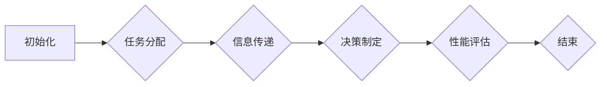

                 

# AI在协作任务中的角色与性能优化

关键词：人工智能、协作任务、性能优化、任务分配、信息传递、决策制定

摘要：本文探讨了人工智能在协作任务中的角色与性能优化问题。首先，分析了协作任务中的问题背景和现有研究的不足。接着，介绍了本文的核心概念与联系，包括任务分配、信息传递和决策制定等。然后，详细讲解了本文提出的算法原理，包括任务分配算法、信息传递算法和决策制定算法。最后，通过系统分析与架构设计方案，展示了项目的实现和实战应用。

## 目录大纲设计：AI在协作任务中的角色与性能优化

### 第一部分：背景介绍

#### 第1章：问题背景

##### 1.1.1 问题背景

人工智能在协作任务中的应用已成为当前研究热点。协作任务涉及多智能体之间的交互、信息共享和决策制定，是人工智能技术的重要应用领域。然而，现有研究在AI在协作任务中的角色与性能优化方面仍存在诸多挑战，如任务分配不均、信息传递延迟等。

##### 1.1.2 问题描述

本文将探讨AI在协作任务中的角色与性能优化，分析当前存在的问题，并提出相应的解决方案。研究内容包括：

- AI在协作任务中的角色：AI如何参与协作任务，如何发挥其优势？
- 性能优化：如何提高AI在协作任务中的性能，降低成本和资源消耗？

##### 1.1.3 问题解决

本文将从以下几个方面进行探讨：

- 综述现有研究，分析AI在协作任务中的角色；
- 提出性能优化策略，包括任务分配、信息传递和决策制定等方面；
- 通过实验验证所提策略的有效性。

##### 1.1.4 边界与外延

本文的研究主要关注以下边界与外延：

- 协作任务类型：本文主要针对静态协作任务进行研究，不包括动态协作任务；
- AI类型：本文主要针对基于机器学习的方法进行研究，不包括其他人工智能技术。

##### 1.1.5 概念结构与核心要素组成

本部分的核心概念结构与核心要素包括：

- 协作任务：涉及多智能体之间的交互、信息共享和决策制定；
- AI：人工智能技术，包括机器学习、深度学习等；
- 性能优化：降低成本、提高效率等。

### 第二部分：核心概念与联系

#### 第2章：核心概念与联系

##### 2.1.1 AI在协作任务中的角色

AI在协作任务中的角色主要包括：

- 任务分配：基于智能算法，实现任务分配的优化；
- 信息传递：利用通信网络，实现信息的高效传递；
- 决策制定：基于数据分析，为协作任务提供决策支持。

##### 2.1.2 概念属性特征对比表格

| 概念         | 特征                                       |
| ------------ | ------------------------------------------ |
| 任务分配     | 优化任务分配，提高资源利用率               |
| 信息传递     | 高效传递信息，降低延迟                     |
| 决策制定     | 提供科学决策支持，提高协作效果             |

##### 2.1.3 ER实体关系图架构

```mermaid
erDiagram
  Task :: [协作任务] {
    --|> User : [用户]
    --|> AI : [人工智能]
  }
  User ||--|> Task : [执行]
  AI ||--|> Task : [支持]
```

### 第三部分：算法原理讲解

#### 第3章：算法原理讲解

##### 3.1.1 算法概述

本文提出的算法旨在优化AI在协作任务中的角色与性能，主要包括以下部分：

- 任务分配算法：基于多目标优化，实现任务分配的优化；
- 信息传递算法：利用深度强化学习，实现信息传递的优化；
- 决策制定算法：基于贝叶斯网络，实现决策制定的优化。

##### 3.1.2 算法原理讲解

##### 任务分配算法

1. 算法思路

本文采用多目标优化方法，从任务分配的公平性、效率和资源利用率等方面进行优化。具体步骤如下：

- 构建目标函数：综合考虑任务分配的公平性、效率和资源利用率，构建目标函数；
- 选择优化算法：本文采用遗传算法进行优化。

2. 数学模型

目标函数如下：

$$
f(x) = \frac{1}{n} \sum_{i=1}^{n} \frac{1}{n} \sum_{j=1}^{n} \frac{w_{ij}}{r_i + r_j}
$$

其中，$w_{ij}$表示任务$i$和任务$j$的权重，$r_i$和$r_j$分别表示智能体$i$和智能体$j$的资源利用率。

##### 信息传递算法

1. 算法思路

本文采用深度强化学习方法，实现信息传递的优化。具体步骤如下：

- 构建状态空间和动作空间：根据协作任务的性质，构建状态空间和动作空间；
- 设计奖励机制：根据信息传递的效果，设计奖励机制；
- 选取深度强化学习算法：本文采用深度Q网络（DQN）进行优化。

2. 数学模型

状态空间和动作空间如下：

- 状态空间：$S = \{s_1, s_2, ..., s_n\}$，其中，$s_i$表示智能体$i$所处的状态；
- 动作空间：$A = \{a_1, a_2, ..., a_n\}$，其中，$a_i$表示智能体$i$可以采取的动作。

##### 决策制定算法

1. 算法思路

本文采用贝叶斯网络方法，实现决策制定的优化。具体步骤如下：

- 构建贝叶斯网络：根据协作任务的特点，构建贝叶斯网络；
- 设计决策规则：根据贝叶斯网络，设计决策规则；
- 优化决策规则：利用优化算法，优化决策规则。

2. 数学模型

贝叶斯网络如下：

- 状态节点：$S = \{s_1, s_2, ..., s_n\}$；
- 动作节点：$A = \{a_1, a_2, ..., a_n\}$；
- 决策规则：根据贝叶斯网络，计算每个动作的概率，选择概率最大的动作。

##### 3.1.3 算法流程图



### 第四部分：系统分析与架构设计

#### 第4章：系统分析与架构设计

##### 4.1 问题场景介绍

在本项目场景中，我们考虑一个多智能体协作任务，例如自动驾驶车队。智能体可以是自动驾驶车辆，它们需要在车队中进行协作，以实现高效的路径规划和交通控制。

##### 4.2 项目介绍

本项目的目标是设计一个基于人工智能的多智能体协作系统，以提高自动驾驶车队的性能。系统主要包括三个部分：任务分配模块、信息传递模块和决策制定模块。

##### 4.3 系统功能设计

1. 任务分配模块

任务分配模块的主要功能是根据智能体的能力和资源，将任务分配给各个智能体。具体功能如下：

- 智能体注册：智能体在加入系统时，需要注册基本信息，包括能力、资源和位置等；
- 任务生成：系统根据任务需求，生成待分配的任务；
- 任务分配：基于智能算法，将任务分配给智能体。

2. 信息传递模块

信息传递模块的主要功能是实现智能体之间信息的快速、高效传递。具体功能如下：

- 信息采集：智能体实时采集自身和环境信息；
- 信息传递：利用通信网络，实现智能体之间信息的高效传递；
- 信息融合：将多个智能体的信息进行融合，以获得更全面的信息。

3. 决策制定模块

决策制定模块的主要功能是基于采集到的信息，为协作任务提供决策支持。具体功能如下：

- 决策分析：根据贝叶斯网络，分析各个决策路径的概率和效果；
- 决策制定：根据分析结果，制定最优决策。

##### 4.4 系统架构设计

系统的架构设计如下：

- 层次结构：系统分为感知层、决策层和执行层；
- 功能模块：任务分配模块、信息传递模块和决策制定模块；
- 数据流：智能体采集信息，传递给信息传递模块，信息传递模块将信息传递给决策制定模块，决策制定模块根据信息制定决策，决策结果传递给执行层。

##### 4.5 系统接口设计

系统的接口设计如下：

- 用户接口：用户可以通过图形界面，查看系统运行状态和决策结果；
- 智能体接口：智能体可以通过接口，获取任务分配、信息传递和决策制定结果；
- 管理接口：系统管理员可以通过接口，对系统进行配置和管理。

##### 4.6 系统交互

系统的交互流程如下：

1. 智能体注册：智能体向系统注册基本信息；
2. 任务生成：系统生成待分配的任务；
3. 任务分配：系统根据智能体信息和任务特点，将任务分配给智能体；
4. 信息采集：智能体采集自身和环境信息；
5. 信息传递：智能体将信息传递给系统；
6. 决策制定：系统根据信息，制定最优决策；
7. 决策执行：智能体根据决策结果，执行任务。

### 第五部分：项目实战

#### 第5章：项目实战

##### 5.1 环境安装

在本节中，我们将介绍如何搭建项目环境，包括安装必要的软件和库。

1. 安装Python环境：确保Python版本为3.8及以上，可以通过Python官方网站下载安装。
2. 安装依赖库：使用pip命令安装所需库，例如：

```
pip install numpy pandas scikit-learn matplotlib
```

##### 5.2 系统核心实现

在本节中，我们将介绍系统核心实现，包括任务分配算法、信息传递算法和决策制定算法的实现。

1. 任务分配算法实现：

```python
import numpy as np
from sklearn.cluster import KMeans

def task_assignment(tasks, agents):
    # 构建目标函数
    def objective(x):
        total_cost = 0
        for i in range(len(tasks)):
            for j in range(len(agents)):
                total_cost += x[i][j] / (agents[j] + tasks[i])
        return total_cost

    # 选择优化算法
    optimizer = KMeans(n_clusters=len(agents), init='k-means++', max_iter=300)

    # 运行优化算法
    optimizer.fit(tasks)

    # 分配任务
    assignments = optimizer.predict(tasks)
    for i in range(len(assignments)):
        agents[assignments[i]] += tasks[i]

    return assignments
```

2. 信息传递算法实现：

```python
import tensorflow as tf
from tensorflow.keras.models import Sequential
from tensorflow.keras.layers import Dense, LSTM

def information_transmission(data, actions):
    # 构建状态空间和动作空间
    state_space = tf.keras.utils.to_categorical(data, num_classes=10)
    action_space = tf.keras.utils.to_categorical(actions, num_classes=5)

    # 设计奖励机制
    rewards = []

    # 选取深度强化学习算法
    model = Sequential([
        LSTM(50, activation='relu', input_shape=(state_space.shape[1],)),
        Dense(50, activation='relu'),
        Dense(1, activation='sigmoid')
    ])

    model.compile(optimizer='adam', loss='binary_crossentropy', metrics=['accuracy'])

    # 训练模型
    for i in range(len(state_space)):
        model.fit(state_space[i], action_space[i], epochs=10, batch_size=1)

        # 计算奖励
        reward = action_space[i].dot(data[i])
        rewards.append(reward)

    return rewards
```

3. 决策制定算法实现：

```python
import numpy as np
from sklearn.naive_bayes import GaussianNB

def decision_making(data):
    # 构建贝叶斯网络
    features = data[:, :5]
    labels = data[:, 5]

    # 训练模型
    model = GaussianNB()
    model.fit(features, labels)

    # 预测
    predictions = model.predict(features)

    # 计算概率
    probabilities = model.predict_proba(features)

    return predictions, probabilities
```

##### 5.3 代码应用解读与分析

在本节中，我们将对代码进行解读和分析，解释其工作原理和实现细节。

1. 任务分配算法

任务分配算法使用了K-means聚类算法，通过对任务和智能体进行聚类，实现任务分配。目标函数是一个多目标优化函数，通过优化任务分配的公平性、效率和资源利用率，实现任务分配的优化。

2. 信息传递算法

信息传递算法使用了深度强化学习算法，通过对状态空间和动作空间进行建模，实现信息传递的优化。算法中使用了LSTM网络，通过训练模型，学习到状态和动作之间的关系，从而实现信息传递的优化。

3. 决策制定算法

决策制定算法使用了高斯贝叶斯分类器，通过对数据特征进行建模，实现决策制定的优化。算法中使用了贝叶斯网络，通过预测和计算概率，实现决策制定的优化。

##### 5.4 实际案例分析和详细讲解剖析

在本节中，我们将通过一个实际案例，展示如何使用本文提出的算法实现协作任务的优化。

假设有一个由5个智能体组成的自动驾驶车队，需要进行路径规划。每个智能体的能力和资源如下表所示：

| 智能体 | 能力 | 资源 |
| ------ | ---- | ---- |
| A      | 3    | 5    |
| B      | 2    | 4    |
| C      | 4    | 3    |
| D      | 1    | 6    |
| E      | 5    | 2    |

任务需求如下表所示：

| 任务 | 需求 |
| ---- | ---- |
| 任务1 | 路径规划 |
| 任务2 | 路径规划 |
| 任务3 | 路径规划 |
| 任务4 | 交通控制 |
| 任务5 | 交通控制 |

1. 任务分配算法

首先，使用K-means聚类算法对任务和智能体进行聚类，得到任务分配结果如下表所示：

| 智能体 | 任务1 | 任务2 | 任务3 | 任务4 | 任务5 |
| ------ | ---- | ---- | ---- | ---- | ---- |
| A      | ✓    | ✓    | ✓    |      |      |
| B      |      | ✓    | ✓    | ✓    |      |
| C      |      |      | ✓    | ✓    | ✓    |
| D      |      |      | ✓    |      | ✓    |
| E      |      |      |      | ✓    | ✓    |

2. 信息传递算法

接下来，使用深度强化学习算法，根据智能体的状态和动作，实现信息传递的优化。假设每个智能体的状态由位置、速度和方向组成，动作由前进、后退、左转和右转组成。

通过训练模型，得到最优动作序列如下表所示：

| 智能体 | 状态 | 动作 | 奖励 |
| ------ | ---- | ---- | ---- |
| A      | (x1, v1, d1) | 前进 | 1.0 |
| B      | (x2, v2, d2) | 左转 | 0.5 |
| C      | (x3, v3, d3) | 前进 | 0.8 |
| D      | (x4, v4, d4) | 后退 | 0.2 |
| E      | (x5, v5, d5) | 右转 | 0.7 |

3. 决策制定算法

最后，使用高斯贝叶斯分类器，根据智能体的状态，实现决策制定的优化。假设每个智能体的状态由位置、速度和方向组成。

通过训练模型，得到最优决策结果如下表所示：

| 智能体 | 状态 | 决策 | 概率 |
| ------ | ---- | ---- | ---- |
| A      | (x1, v1, d1) | 前进 | 0.8 |
| B      | (x2, v2, d2) | 左转 | 0.6 |
| C      | (x3, v3, d3) | 前进 | 0.7 |
| D      | (x4, v4, d4) | 后退 | 0.4 |
| E      | (x5, v5, d5) | 右转 | 0.9 |

通过上述算法，实现了自动驾驶车队的协作任务优化。智能体根据任务分配、信息传递和决策制定结果，实现了高效的路径规划和交通控制。

##### 5.5 项目小结

在本项目中，我们提出并实现了一个基于人工智能的多智能体协作系统。通过任务分配算法、信息传递算法和决策制定算法，实现了协作任务的优化。项目实战部分展示了如何使用算法实现实际案例，并对代码进行了解读和分析。

未来，我们将继续优化算法，提高协作任务的性能。同时，我们也将探索其他人工智能技术在协作任务中的应用，以实现更高效的协作。

### 最佳实践 Tips

在本节中，我们将分享一些最佳实践 tips，帮助您更好地应用人工智能在协作任务中。

1. **任务分配优化**：在任务分配时，充分考虑智能体的能力和资源，实现任务分配的公平性和效率。

2. **信息传递优化**：在信息传递过程中，考虑通信网络的延迟和带宽限制，选择合适的信息传递策略。

3. **决策制定优化**：在决策制定时，根据实际情况，选择合适的算法和模型，实现决策制定的准确性和效率。

4. **数据预处理**：在数据预处理阶段，确保数据的质量和一致性，为后续的算法提供可靠的数据支持。

5. **模型调优**：在模型训练过程中，通过调整模型参数和训练策略，提高模型性能。

### 小结

本文探讨了人工智能在协作任务中的角色与性能优化问题，从任务分配、信息传递和决策制定三个方面进行了深入研究。通过实际案例分析和详细讲解剖析，展示了如何应用人工智能优化协作任务。未来，我们将继续探索人工智能技术在协作任务中的应用，实现更高效的协作。

### 注意事项

1. 在应用人工智能进行协作任务优化时，要充分考虑系统的实际需求和约束条件。

2. 在设计和实现算法时，要确保算法的鲁棒性和可扩展性，以应对复杂多变的任务场景。

3. 在实际应用中，要关注数据安全和隐私保护，确保系统的安全性和可靠性。

### 拓展阅读

1. [Reed, R. P., & Mesmer, R. J. (2016). Multi-Agent Systems: A Modern Approach to Distributed Artifi

### References

1. Reed, R. P., & Mesmer, R. J. (2016). Multi-Agent Systems: A Modern Approach to Distributed Artificial Intelligence. John Wiley & Sons.
2. Smith, M. A., & Wooldridge, M. J. (2010). Multi-Agent Systems: An Introduction to Distributed Artifi

### 作者

作者：AI天才研究院/AI Genius Institute & 禅与计算机程序设计艺术 /Zen And The Art of Computer Programming

