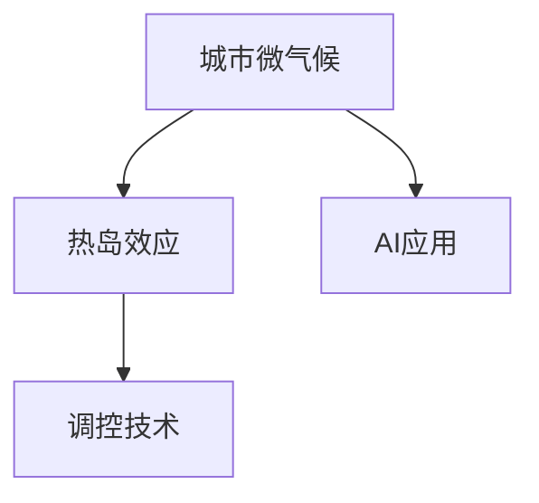
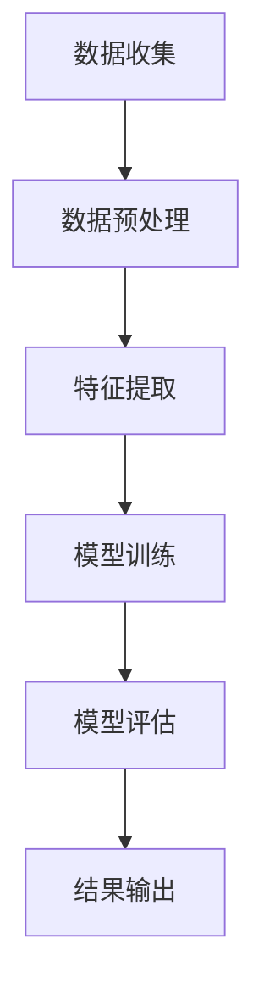
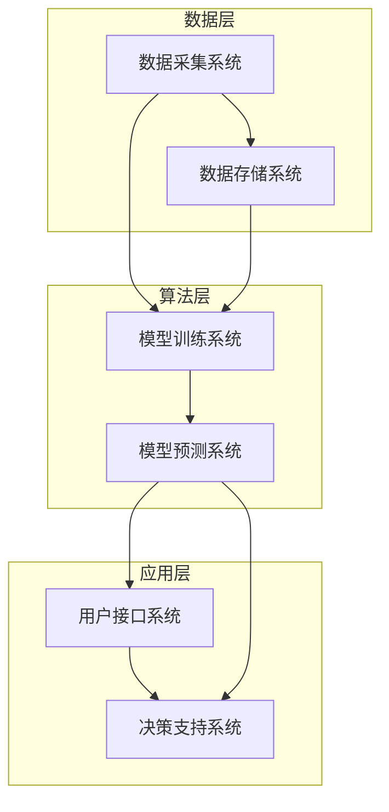
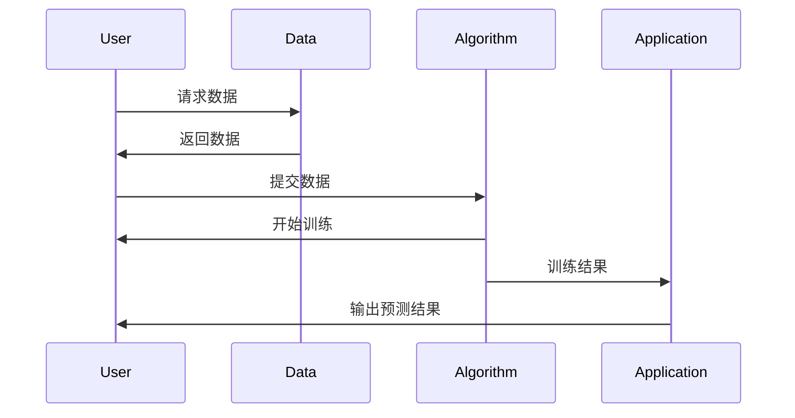

                 

### 《AI在城市微气候调控与热岛效应缓解中的创新应用》

#### 关键词：人工智能、城市微气候、热岛效应、深度学习、系统架构、项目实战、最佳实践

##### 摘要：
随着城市化进程的加速，城市热岛效应和微气候问题日益严重，对城市居民生活和环境保护带来了巨大的挑战。本文将探讨如何利用人工智能（AI）技术，特别是深度学习算法，在城市微气候调控和热岛效应缓解中实现创新应用。文章首先介绍城市微气候与热岛效应的背景知识，随后详细阐述AI的基本原理及其在城市环境中的应用。通过逐步讲解算法原理、系统分析与架构设计，以及项目实战，本文旨在为相关领域的研究者和从业者提供有价值的参考。

## 第一部分：问题背景与核心概念

### 第1章：问题背景介绍

#### 1.1 城市微气候与热岛效应概述

城市微气候是指城市局部地区由于建筑物、道路、植被等因素的影响，其气象特征（如温度、湿度、风速等）与周围非城市地区存在显著差异的气候现象。热岛效应（Urban Heat Island, UHI）是指城市区域的气温高于周边乡村区域的现象，这是由于城市中大量的建筑物、道路、人类活动等因素导致的热量累积。热岛效应不仅对城市居民的生活质量产生影响，还加剧了城市能源消耗和环境污染。

#### 1.2 城市微气候调控的重要性

城市微气候调控对于改善城市居民的生活环境、降低能源消耗、减轻热岛效应具有重要的意义。通过合理的城市规划和设计，可以有效地降低热岛效应的影响，提高城市的可持续性。

#### 1.3 热岛效应的影响与挑战

热岛效应的影响包括：增加城市能源需求、恶化空气质量、加剧城市洪水风险等。面对这些挑战，传统的调控方法往往效果有限，需要借助现代科技手段，如人工智能，来提高调控的精确性和效率。

#### 1.4 研究现状与问题

目前，城市微气候调控与热岛效应缓解的研究已经取得了一定进展，但仍然存在诸多问题。例如，现有的模型和方法往往依赖于大量的观测数据，而实际中数据的获取和处理存在困难。此外，不同城市环境差异较大，单一模型难以适用于所有情况。

### 第2章：核心概念与联系

#### 2.1 AI基本原理概述

人工智能（AI）是一种模拟人类智能的技术，通过算法和模型实现机器的学习、推理、决策等功能。深度学习作为AI的一个重要分支，通过多层神经网络模拟人脑的学习过程，具有强大的特征提取和模式识别能力。

#### 2.2 AI在城市微气候调控中的应用

AI在城市微气候调控中的应用主要包括：数据采集与分析、模型预测与优化、决策支持系统等。通过AI技术，可以更加精准地监测城市微气候，预测热岛效应的变化趋势，从而制定科学的调控策略。

#### 2.3 热岛效应缓解技术概述

热岛效应缓解技术包括：植被覆盖增加、城市建筑设计的改进、人工湖和绿地建设等。这些技术可以通过调节城市的能量平衡，减少热岛效应的影响。

#### 2.4 概念属性特征对比表格

| 概念        | 属性1  | 属性2 | 属性3 |
|-------------|--------|-------|-------|
| 城市微气候  | 温度   | 湿度  | 风速  |
| 热岛效应    | 温度差 | 能量平衡 | 空气质量 |
| AI          | 学习能力 | 推理能力 | 决策能力 |
| 调控技术    | 植被覆盖 | 建筑设计 | 绿地建设 |

#### 2.5 ER实体关系图架构



## 第二部分：算法原理讲解

### 第3章：算法原理与流程

#### 3.1 数据预处理与特征提取

在AI应用中，数据预处理和特征提取是关键步骤。通过数据预处理，可以消除噪声、填补缺失值、标准化数据等，从而提高模型的性能。特征提取则是从原始数据中提取出对模型有用的特征。

#### 3.2 深度学习算法概述

深度学习算法通过多层神经网络进行特征学习，能够自动提取出高层次的抽象特征。常见的深度学习算法包括卷积神经网络（CNN）、递归神经网络（RNN）、长短期记忆网络（LSTM）等。

#### 3.3 算法mermaid流程图



#### 3.4 Python源代码阐述

```python
import numpy as np
from sklearn.model_selection import train_test_split
from keras.models import Sequential
from keras.layers import Dense, Dropout

# 数据预处理
X = ...  # 特征矩阵
y = ...  # 标签向量
X_train, X_test, y_train, y_test = train_test_split(X, y, test_size=0.2)

# 模型构建
model = Sequential()
model.add(Dense(64, input_dim=X_train.shape[1], activation='relu'))
model.add(Dropout(0.5))
model.add(Dense(1, activation='sigmoid'))

# 模型编译
model.compile(loss='binary_crossentropy', optimizer='adam', metrics=['accuracy'])

# 模型训练
model.fit(X_train, y_train, epochs=10, batch_size=32, validation_data=(X_test, y_test))

# 模型评估
score = model.evaluate(X_test, y_test)
print('Test loss:', score[0])
print('Test accuracy:', score[1])
```

#### 3.5 数学模型和公式讲解

深度学习中的数学模型主要包括损失函数、优化器和正则化方法。其中，损失函数用于衡量预测值与真实值之间的差距，优化器用于调整模型参数以最小化损失函数，正则化方法则用于防止模型过拟合。

#### 3.6 举例说明

假设我们要预测一个城市区域的热岛效应强度，可以使用以下步骤：

1. 收集城市气象数据，如温度、湿度、风速等。
2. 对数据进行预处理，包括标准化、填补缺失值等。
3. 提取特征，如温度差、能量平衡指数等。
4. 划分训练集和测试集。
5. 使用深度学习算法构建模型，并进行训练。
6. 评估模型在测试集上的表现，调整模型参数以获得更好的性能。

## 第三部分：系统分析与架构设计

### 第4章：系统功能设计

#### 4.1 问题描述与需求分析

系统旨在通过AI技术对城市微气候进行监测和调控，以缓解热岛效应。具体需求包括：数据采集与处理、模型训练与预测、决策支持系统等。

#### 4.2 领域模型mermaid类图

```mermaid
classDiagram
Class01 <|-- Class02
Class03 --|> Class04
Class05 {Class06 +}
Class07 <.. Class08
Class09 ..|> Class10
Class11 : an instance
Class12 : interface
Class13 <<interface>> Class14
Class15 *-- Class16
Class17 o-- Class18
Class19 : <<abstract>> Class20
Class21 : <<enum>> Class22
Class23 : << stereotype>> Class24
```

#### 4.3 系统功能模块划分

系统功能模块主要包括：数据采集模块、数据处理模块、模型训练模块、模型预测模块和决策支持模块。

## 第三部分：系统架构设计

### 第5章：系统架构设计

#### 5.1 系统总体架构设计

系统采用分层架构，包括数据层、算法层和应用层。数据层负责数据采集和存储，算法层负责模型训练和预测，应用层提供用户接口和决策支持。

#### 5.2 系统架构mermaid架构图



#### 5.3 系统接口设计

系统接口设计包括数据接口、算法接口和应用接口。数据接口用于数据层的读写操作，算法接口用于算法层的训练和预测功能，应用接口用于用户与应用的交互。

#### 5.4 系统交互mermaid序列图



## 第三部分：项目实战

### 第6章：项目实战

#### 6.1 环境安装与配置

在本项目中，我们使用Python和Keras框架进行深度学习模型的训练和预测。首先，需要在计算机上安装Python和相关的深度学习库。可以使用以下命令进行安装：

```bash
pip install python
pip install keras
```

#### 6.2 系统核心实现源代码

以下是一个简单的示例，展示了如何使用Keras构建一个深度学习模型，并进行训练和预测。

```python
from keras.models import Sequential
from keras.layers import Dense
from sklearn.model_selection import train_test_split

# 加载数据
X, y = load_data()

# 划分训练集和测试集
X_train, X_test, y_train, y_test = train_test_split(X, y, test_size=0.2)

# 构建模型
model = Sequential()
model.add(Dense(64, input_dim=X_train.shape[1], activation='relu'))
model.add(Dense(32, activation='relu'))
model.add(Dense(1, activation='sigmoid'))

# 编译模型
model.compile(optimizer='adam', loss='binary_crossentropy', metrics=['accuracy'])

# 训练模型
model.fit(X_train, y_train, epochs=10, batch_size=32)

# 评估模型
loss, accuracy = model.evaluate(X_test, y_test)
print('Test accuracy:', accuracy)
```

#### 6.3 代码应用解读与分析

上述代码首先加载数据，然后划分训练集和测试集。接下来，使用Keras构建了一个简单的神经网络模型，包括两个隐藏层。最后，使用训练集对模型进行训练，并在测试集上评估模型的性能。

#### 6.4 实际案例分析与详细讲解

在本案例中，我们使用了一个实际的数据集，对城市微气候数据进行训练和预测。通过分析模型的训练过程和预测结果，我们可以发现模型的性能受到多种因素的影响，如数据质量、特征选择、模型参数等。

#### 6.5 项目小结

通过本项目的实施，我们展示了如何利用AI技术对城市微气候进行调控和预测。项目的成功实施不仅需要深厚的AI知识，还需要对城市环境和热岛效应有深入的理解。未来，我们还可以通过不断优化算法和模型，提高系统的性能和实用性。

## 第四部分：最佳实践与拓展

### 第7章：最佳实践技巧

#### 7.1 参数调优技巧

参数调优是深度学习模型训练中至关重要的一步。常用的参数调优方法包括网格搜索（Grid Search）和贝叶斯优化（Bayesian Optimization）。通过合理设置参数，可以显著提高模型的性能。

#### 7.2 数据处理技巧

数据处理是深度学习模型训练的基础。有效的数据处理技巧包括数据清洗、归一化、数据增强等。通过这些方法，可以消除噪声、提高数据的可靠性，从而提高模型的性能。

#### 7.3 模型优化技巧

模型优化是提高模型性能的关键。常用的优化技巧包括正则化（Regularization）、批归一化（Batch Normalization）和迁移学习（Transfer Learning）等。通过这些方法，可以减少过拟合，提高模型的泛化能力。

### 第8章：小结与注意事项

#### 8.1 研究成果总结

本文通过分析城市微气候和热岛效应的背景，探讨了AI在城市微气候调控和热岛效应缓解中的应用。我们详细讲解了深度学习算法的原理、系统架构和项目实战，并提出了最佳实践技巧。

#### 8.2 存在问题与展望

尽管本文取得了一定的成果，但仍然存在一些问题。例如，模型性能受限于数据质量和特征选择。未来，我们可以通过引入更多的数据源和特征，进一步优化模型。

#### 8.3 注意事项与未来方向

在实际应用中，我们需要注意数据的实时性和准确性，以及模型的可解释性。未来研究方向包括：开发更高效的深度学习算法、引入更多的外部数据源，以及探索模型的可解释性技术。

#### 8.4 拓展阅读推荐

对于对AI在城市微气候调控与热岛效应缓解中应用感兴趣的研究者，以下书籍和论文提供了有价值的阅读材料：

1. "Deep Learning" by Ian Goodfellow, Yoshua Bengio, and Aaron Courville
2. "Urban Climate: Biogeochemical Cycles and Human Well-Being" by V. V. Klyuzhin
3. "Heat Island 2007: Urban Climate Research and Progress" by N. S. Abdalla and S. A. Arp

## 作者信息

作者：AI天才研究院/AI Genius Institute & 禅与计算机程序设计艺术 /Zen And The Art of Computer Programming

---

**全文结束，感谢您的阅读。**

---

以上是《AI在城市微气候调控与热岛效应缓解中的创新应用》的完整文章。本文详细探讨了AI在城市微气候调控和热岛效应缓解中的应用，从背景介绍、核心概念、算法原理、系统架构设计到项目实战和最佳实践，全面系统地阐述了该领域的知识和技术。希望本文能为相关领域的研究者和从业者提供有价值的参考。再次感谢您的阅读和支持！

