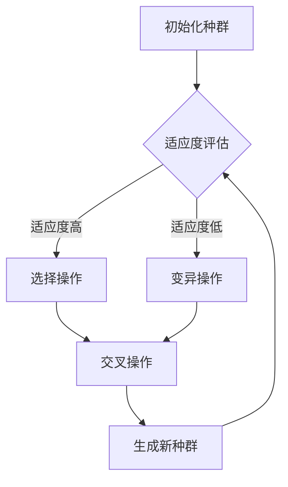
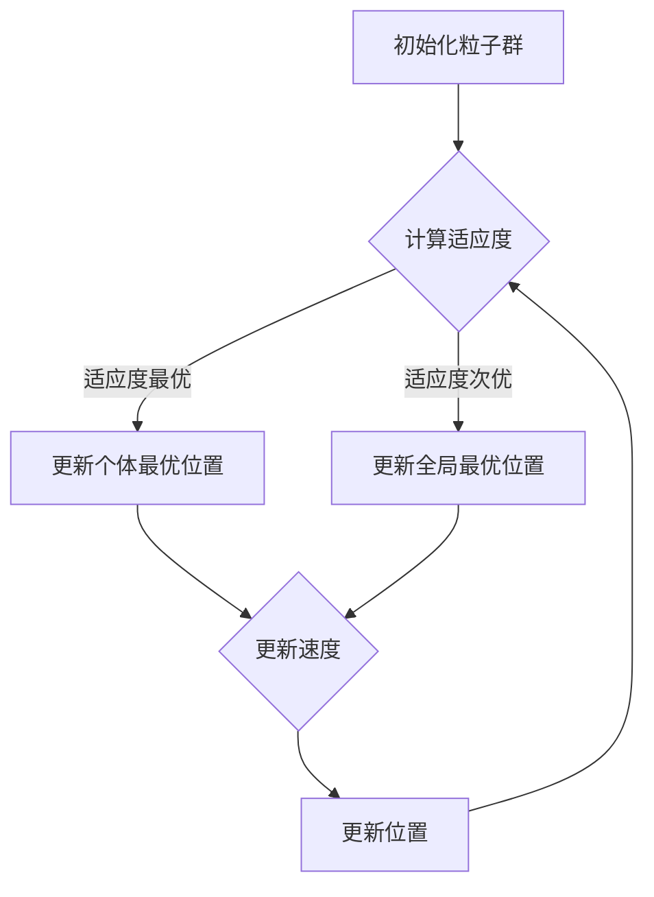
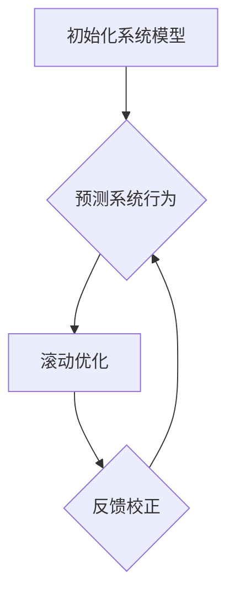
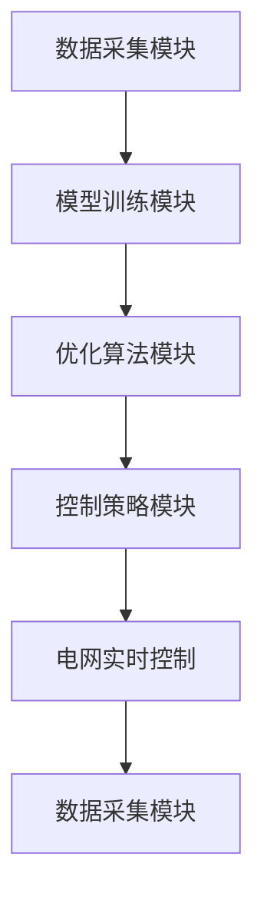
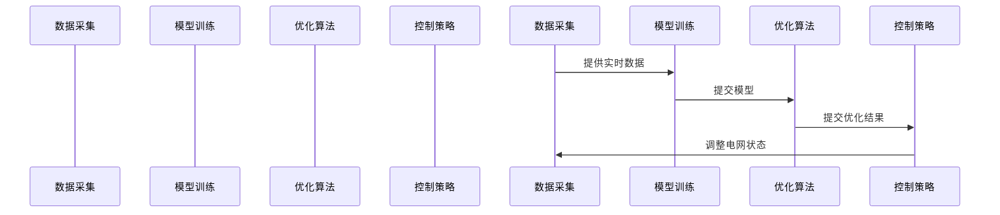
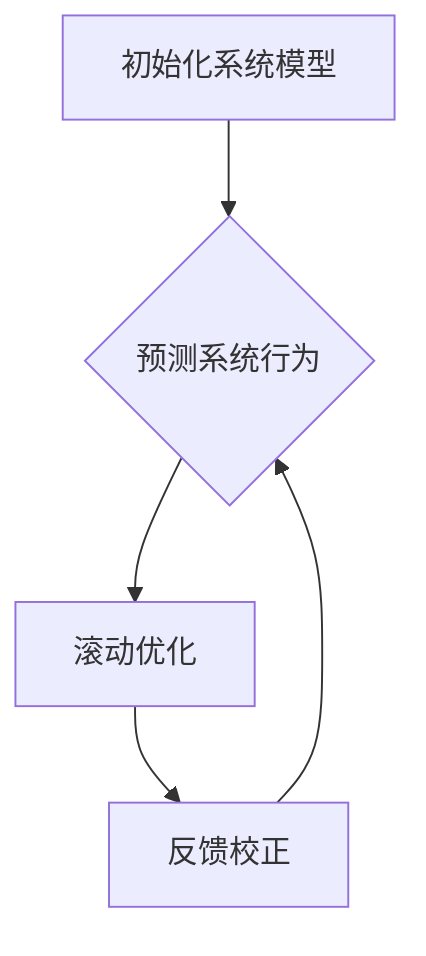

                 


### 引言与背景

**文章标题**：AI在复杂系统优化和控制中的应用前景

**关键词**：人工智能、复杂系统、优化、控制、应用前景

**摘要**：
本文旨在探讨人工智能（AI）在复杂系统优化和控制领域的应用前景。随着科技的进步，复杂系统在各个领域的应用日益广泛，但其优化和控制问题也日益复杂。AI，尤其是机器学习和深度学习，为解决这些问题提供了新的思路和方法。本文将首先介绍复杂系统的基本概念和特点，然后讨论AI在复杂系统优化和控制中的应用，最后展望其未来发展趋势。

#### 背景介绍

**核心概念术语说明**：
- **复杂系统**：指具有多层次、多维度、非线性、动态变化的系统，通常难以用传统方法进行建模和优化。
- **优化**：指在给定约束条件下，寻找最优解的过程。
- **控制**：指对系统进行调节，使其达到预期目标的过程。

**问题背景**：
复杂系统在工业、交通、能源、环境等多个领域有着广泛的应用。然而，这些系统往往具有高度的非线性和不确定性，使得传统的优化和控制方法难以有效应对。例如，工业过程中的参数调整、城市交通流量的管理、能源系统的调度等，都面临着复杂性和不确定性的挑战。

**问题描述**：
复杂系统的优化和控制问题可以描述为：在给定的系统状态和约束条件下，通过调整系统的参数或输入，使得系统达到预定的性能指标。这涉及到系统的建模、参数估计、优化算法设计等多个方面。

**问题解决**：
随着AI技术的发展，特别是机器学习和深度学习的应用，复杂系统的优化和控制问题得到了新的解决方案。通过训练大量的数据，AI算法可以自动识别系统的规律和模式，从而实现更高效、更精确的优化和控制。

**边界与外延**：
复杂系统的优化和控制不仅局限于特定的领域，还涉及跨学科的知识体系。例如，在生物医学领域，AI可以用于疾病诊断和治疗方案优化；在金融领域，AI可以用于风险管理和投资决策。

**概念结构与核心要素组成**：
复杂系统的优化和控制涉及以下几个核心要素：
- **系统建模**：建立系统的数学模型，描述系统的动态行为和约束条件。
- **数据收集**：收集大量与系统相关的数据，用于训练AI算法。
- **算法设计**：设计适合复杂系统的优化算法，如遗传算法、粒子群优化、深度强化学习等。
- **性能评估**：评估优化和控制策略的效果，并进行迭代优化。

#### AI基础理论

AI，尤其是机器学习和深度学习，为解决复杂系统的优化和控制问题提供了新的思路和方法。以下是AI在复杂系统优化和控制中的基础理论：

**神经网络基础**：
神经网络（Neural Networks）是模拟生物神经系统的计算模型，由大量神经元（节点）互联而成。神经网络通过学习输入和输出数据之间的关系，实现数据的分类、回归和特征提取等功能。

**深度学习**：
深度学习（Deep Learning）是一种基于神经网络的机器学习方法，通过构建多层神经网络来提取数据的深层特征。深度学习在图像识别、语音识别、自然语言处理等领域取得了显著的成果。

**强化学习**：
强化学习（Reinforcement Learning）是一种通过试错来学习如何完成特定任务的方法。强化学习算法通过不断调整策略，使系统逐渐达到最优状态。强化学习在自动驾驶、游戏智能等领域有着广泛的应用。

#### 复杂系统优化算法

**优化算法概述**：
优化算法（Optimization Algorithms）是一类用于求解优化问题的算法。常见的优化算法包括遗传算法、粒子群优化、模拟退火等。这些算法通过迭代优化，逐步逼近最优解。

**模型预测控制**：
模型预测控制（Model Predictive Control，MPC）是一种基于系统模型的预测和控制方法。MPC通过建立系统模型，预测未来系统的行为，并在此基础上优化控制策略。

**粒子群优化**：
粒子群优化（Particle Swarm Optimization，PSO）是一种基于群体智能的优化算法。PSO通过模拟鸟群觅食行为，不断调整粒子的位置和速度，实现全局优化。

#### 案例研究

为了更好地展示AI在复杂系统优化和控制中的应用，以下是三个具体案例：

**案例一：工业过程控制系统的优化**
某工业过程中的温度控制系统是一个复杂的非线性系统，传统的方法难以实现精确控制。通过引入深度强化学习算法，可以实现温度的精确控制，提高生产效率。

**案例二：城市交通流量的智能控制**
城市交通流量管理是一个复杂的动态系统，传统的方法难以应对突发状况。通过使用粒子群优化算法，可以实现交通信号灯的智能控制，减少交通拥堵，提高道路通行能力。

**案例三：能源系统的优化与管理**
能源系统是一个涉及多能源种类、多能源转换过程的复杂系统。通过引入模型预测控制算法，可以实现能源系统的优化管理，提高能源利用效率。

#### AI在复杂系统控制中的挑战与未来

**挑战分析**：
AI在复杂系统控制中面临着一系列挑战，包括数据质量、模型适应性、算法效率等。此外，复杂系统的非线性、不确定性和动态变化特性也使得AI的应用更加困难。

**未来展望**：
随着AI技术的不断进步，特别是在深度学习、强化学习等领域的发展，AI在复杂系统优化和控制中的应用前景将更加广阔。未来，AI有望在复杂系统的预测、优化和控制方面发挥更大的作用。

#### 技术综述

**现有技术综述**：
目前，AI在复杂系统优化和控制中已有多种技术方法，包括神经网络、深度学习、强化学习等。这些技术方法在各自领域取得了显著的成果。

**技术发展趋势**：
未来，AI在复杂系统优化和控制中的发展趋势将包括：更高效的算法设计、更强大的模型能力、更广泛的应用领域。此外，跨学科的研究也将推动AI在复杂系统控制中的应用。

#### 总结与展望

**总结**：
本文介绍了AI在复杂系统优化和控制中的应用前景，从背景介绍、核心理论、优化算法、案例研究等方面进行了详细分析。AI在复杂系统控制中具有巨大的潜力，但同时也面临着一系列挑战。

**展望**：
未来，随着AI技术的不断进步，AI在复杂系统优化和控制中的应用将更加广泛和深入。AI有望成为复杂系统优化和控制的重要工具，推动各领域的发展。

### 作者信息

**作者**：AI天才研究院/AI Genius Institute & 禅与计算机程序设计艺术 /Zen And The Art of Computer Programming

----------------------------------------------------------------

### 完整文章

**AI在复杂系统优化和控制中的应用前景**

**关键词**：人工智能、复杂系统、优化、控制、应用前景

**摘要**：
本文旨在探讨人工智能（AI）在复杂系统优化和控制领域的应用前景。随着科技的进步，复杂系统在各个领域的应用日益广泛，但其优化和控制问题也日益复杂。AI，尤其是机器学习和深度学习，为解决这些问题提供了新的思路和方法。本文将首先介绍复杂系统的基本概念和特点，然后讨论AI在复杂系统优化和控制中的应用，最后展望其未来发展趋势。

#### 引言与背景

**核心概念术语说明**：
- **复杂系统**：指具有多层次、多维度、非线性、动态变化的系统，通常难以用传统方法进行建模和优化。
- **优化**：指在给定约束条件下，寻找最优解的过程。
- **控制**：指对系统进行调节，使其达到预期目标的过程。

**问题背景**：
复杂系统在工业、交通、能源、环境等多个领域有着广泛的应用。然而，这些系统往往具有高度的非线性和不确定性，使得传统的优化和控制方法难以有效应对。例如，工业过程中的参数调整、城市交通流量的管理、能源系统的调度等，都面临着复杂性和不确定性的挑战。

**问题描述**：
复杂系统的优化和控制问题可以描述为：在给定的系统状态和约束条件下，通过调整系统的参数或输入，使得系统达到预定的性能指标。这涉及到系统的建模、参数估计、优化算法设计等多个方面。

**问题解决**：
随着AI技术的发展，特别是机器学习和深度学习的应用，复杂系统的优化和控制问题得到了新的解决方案。通过训练大量的数据，AI算法可以自动识别系统的规律和模式，从而实现更高效、更精确的优化和控制。

**边界与外延**：
复杂系统的优化和控制不仅局限于特定的领域，还涉及跨学科的知识体系。例如，在生物医学领域，AI可以用于疾病诊断和治疗方案优化；在金融领域，AI可以用于风险管理和投资决策。

**概念结构与核心要素组成**：
复杂系统的优化和控制涉及以下几个核心要素：
- **系统建模**：建立系统的数学模型，描述系统的动态行为和约束条件。
- **数据收集**：收集大量与系统相关的数据，用于训练AI算法。
- **算法设计**：设计适合复杂系统的优化算法，如遗传算法、粒子群优化、深度强化学习等。
- **性能评估**：评估优化和控制策略的效果，并进行迭代优化。

#### AI基础理论

AI，尤其是机器学习和深度学习，为解决复杂系统的优化和控制问题提供了新的思路和方法。以下是AI在复杂系统优化和控制中的基础理论：

**神经网络基础**：
神经网络（Neural Networks）是模拟生物神经系统的计算模型，由大量神经元（节点）互联而成。神经网络通过学习输入和输出数据之间的关系，实现数据的分类、回归和特征提取等功能。

**深度学习**：
深度学习（Deep Learning）是一种基于神经网络的机器学习方法，通过构建多层神经网络来提取数据的深层特征。深度学习在图像识别、语音识别、自然语言处理等领域取得了显著的成果。

**强化学习**：
强化学习（Reinforcement Learning）是一种通过试错来学习如何完成特定任务的方法。强化学习算法通过不断调整策略，使系统逐渐达到最优状态。强化学习在自动驾驶、游戏智能等领域有着广泛的应用。

#### 复杂系统优化算法

**优化算法概述**：
优化算法（Optimization Algorithms）是一类用于求解优化问题的算法。常见的优化算法包括遗传算法、粒子群优化、模拟退火等。这些算法通过迭代优化，逐步逼近最优解。

**模型预测控制**：
模型预测控制（Model Predictive Control，MPC）是一种基于系统模型的预测和控制方法。MPC通过建立系统模型，预测未来系统的行为，并在此基础上优化控制策略。

**粒子群优化**：
粒子群优化（Particle Swarm Optimization，PSO）是一种基于群体智能的优化算法。PSO通过模拟鸟群觅食行为，不断调整粒子的位置和速度，实现全局优化。

#### 案例研究

为了更好地展示AI在复杂系统优化和控制中的应用，以下是三个具体案例：

**案例一：工业过程控制系统的优化**
某工业过程中的温度控制系统是一个复杂的非线性系统，传统的方法难以实现精确控制。通过引入深度强化学习算法，可以实现温度的精确控制，提高生产效率。

**案例二：城市交通流量的智能控制**
城市交通流量管理是一个复杂的动态系统，传统的方法难以应对突发状况。通过使用粒子群优化算法，可以实现交通信号灯的智能控制，减少交通拥堵，提高道路通行能力。

**案例三：能源系统的优化与管理**
能源系统是一个涉及多能源种类、多能源转换过程的复杂系统。通过引入模型预测控制算法，可以实现能源系统的优化管理，提高能源利用效率。

#### AI在复杂系统控制中的挑战与未来

**挑战分析**：
AI在复杂系统控制中面临着一系列挑战，包括数据质量、模型适应性、算法效率等。此外，复杂系统的非线性、不确定性和动态变化特性也使得AI的应用更加困难。

**未来展望**：
随着AI技术的不断进步，特别是在深度学习、强化学习等领域的发展，AI在复杂系统优化和控制中的应用前景将更加广阔。未来，AI有望在复杂系统的预测、优化和控制方面发挥更大的作用。

#### 技术综述

**现有技术综述**：
目前，AI在复杂系统优化和控制中已有多种技术方法，包括神经网络、深度学习、强化学习等。这些技术方法在各自领域取得了显著的成果。

**技术发展趋势**：
未来，AI在复杂系统优化和控制中的发展趋势将包括：更高效的算法设计、更强大的模型能力、更广泛的应用领域。此外，跨学科的研究也将推动AI在复杂系统控制中的应用。

#### 总结与展望

**总结**：
本文介绍了AI在复杂系统优化和控制中的应用前景，从背景介绍、核心理论、优化算法、案例研究等方面进行了详细分析。AI在复杂系统控制中具有巨大的潜力，但同时也面临着一系列挑战。

**展望**：
未来，随着AI技术的不断进步，AI在复杂系统优化和控制中的应用将更加广泛和深入。AI有望成为复杂系统优化和控制的重要工具，推动各领域的发展。

### 作者信息

**作者**：AI天才研究院/AI Genius Institute & 禅与计算机程序设计艺术 /Zen And The Art of Computer Programming

----------------------------------------------------------------

### 优化算法原理讲解

为了深入理解AI在复杂系统优化和控制中的应用，我们接下来将详细讲解几种常用的优化算法原理，并使用Mermaid流程图进行辅助说明。以下是几种优化算法的介绍和原理讲解：

#### 遗传算法

**原理说明**：
遗传算法（Genetic Algorithm，GA）是一种基于自然选择和遗传学的启发式搜索算法。它模拟生物进化过程，通过选择、交叉和变异等操作来不断优化解的种群。

1. **选择**：根据个体的适应度进行选择，适应度高的个体有更高的概率被选中。
2. **交叉**：随机选取两个个体，在其基因序列中交换一部分，生成新的个体。
3. **变异**：对个体基因序列进行随机改变，增加种群的多样性。

**Mermaid流程图**：



#### 粒子群优化

**原理说明**：
粒子群优化（Particle Swarm Optimization，PSO）是一种基于群体智能的优化算法。它模拟鸟群觅食行为，通过粒子（代表解）的移动来搜索最优解。

1. **粒子位置更新**：粒子根据自身的经验（个体最优位置）和群体的经验（全局最优位置）来更新自己的位置和速度。
2. **速度更新**：粒子速度的更新受到历史速度、个体最优位置和全局最优位置的影响。

**Mermaid流程图**：



#### 模型预测控制

**原理说明**：
模型预测控制（Model Predictive Control，MPC）是一种基于系统模型的预测和控制方法。MPC通过建立系统模型，预测未来系统的行为，并在此基础上优化控制策略。

1. **系统建模**：建立系统的数学模型，描述系统的动态行为。
2. **滚动优化**：根据当前系统状态和预测模型，对未来的控制输入进行优化。
3. **反馈校正**：根据实际系统输出与预测输出的差异，调整控制策略。

**Mermaid流程图**：



#### 深度强化学习

**原理说明**：
深度强化学习（Deep Reinforcement Learning，DRL）是一种结合了深度学习和强化学习的方法。它通过深度神经网络来学习和表示状态和动作值函数，以实现智能体的决策。

1. **状态表示**：使用深度神经网络将状态编码为特征向量。
2. **动作值函数**：学习状态值函数，表示在不同状态下执行不同动作的期望回报。
3. **策略更新**：根据奖励信号和状态值函数，更新智能体的策略。

**Mermaid流程图**：

```mermaid
graph TD
A[初始化状态表示网络] --> B{获取状态}
B --> C[通过神经网络编码状态}
C --> D{计算动作值函数}
D --> E[选择最优动作]
E --> F{执行动作}
F --> G[获得奖励信号]
G --> H[更新策略]
H --> A
```

#### 算法应用举例

以遗传算法为例，我们通过一个简单的例子来说明其应用。

**例子**：求解函数f(x) = x^2在区间[-10, 10]上的最大值。

1. **编码**：将解编码为二进制字符串，例如，x = -5 对应的编码为 `10001010010`。
2. **适应度评估**：计算每个个体的适应度，适应度函数为 f(x) 的值。
3. **选择**：根据适应度选择个体进行交叉和变异。
4. **交叉**：随机选择两个个体进行交叉操作。
5. **变异**：对个体进行随机变异。

以下是Python代码实现：

```python
import numpy as np
import random

# 编码
def encode(x):
    binary = ''.join([str(int(x / 10 ** i)) for i in range(10)])
    return binary

# 解码
def decode(binary):
    x = 0
    for i, bit in enumerate(reversed(binary)):
        x += int(bit) * 10 ** i
    return x

# 适应度评估
def fitness(x):
    return x ** 2

# 选择
def selection(population, fitnesses):
    selected = random.choices(population, weights=fitnesses, k=len(population) // 2)
    return selected

# 交叉
def crossover(parent1, parent2):
    point = random.randint(1, len(parent1) - 1)
    child1 = parent1[:point] + parent2[point:]
    child2 = parent2[:point] + parent1[point:]
    return child1, child2

# 变异
def mutate(individual):
    point = random.randint(1, len(individual) - 1)
    individual = list(individual)
    individual[point] = '0' if individual[point] == '1' else '1'
    return ''.join(individual)

# 主函数
def genetic_algorithm():
    population_size = 100
    generations = 100
    mutation_rate = 0.01

    population = [encode(random.uniform(-10, 10)) for _ in range(population_size)]
    best_fitness = -1
    best_individual = None

    for _ in range(generations):
        fitnesses = [fitness(decode(individual)) for individual in population]
        if max(fitnesses) > best_fitness:
            best_fitness = max(fitnesses)
            best_individual = population[fitnesses.index(max(fitnesses))]

        selected = selection(population, fitnesses)
        new_population = []
        for i in range(0, population_size, 2):
            parent1, parent2 = selected[i], selected[i+1]
            child1, child2 = crossover(parent1, parent2)
            new_population.extend([child1, child2])

        random.shuffle(new_population)
        population = new_population[:population_size]

        for individual in population:
            if random.random() < mutation_rate:
                mutate(individual)

    return decode(best_individual), best_fitness

# 运行算法
best_x, best_fitness = genetic_algorithm()
print(f"最佳解：x = {best_x}, f(x) = {best_fitness}")
```

通过这个简单的例子，我们可以看到遗传算法是如何工作的。遗传算法通过迭代过程不断优化解的种群，最终找到问题的近似最优解。

#### 数学模型与公式

为了更好地理解上述优化算法，我们还需要了解它们的数学模型和公式。

**遗传算法的数学模型**：

1. **适应度函数**：\( f(x) = \frac{1}{1 + \exp(-\beta \cdot f(x))} \)
2. **选择概率**：\( P_i = \frac{f(x_i)}{\sum_{j=1}^{N} f(x_j)} \)
3. **交叉概率**：\( P_c = \frac{1}{N} \)

**粒子群优化算法的数学模型**：

1. **速度更新**：\( v_{i}^{t+1} = \omega \cdot v_{i}^{t} + c_1 \cdot r_1 \cdot (p_i - x_i) + c_2 \cdot r_2 \cdot (g - x_i) \)
2. **位置更新**：\( x_{i}^{t+1} = x_{i}^{t} + v_{i}^{t+1} \)

**模型预测控制算法的数学模型**：

1. **状态方程**：\( x_{k+1} = A \cdot x_k + B \cdot u_k \)
2. **输出方程**：\( y_k = C \cdot x_k + D \cdot u_k \)

**深度强化学习的数学模型**：

1. **状态值函数**：\( V(s) = \sum_{a} \pi(a|s) \cdot Q(s, a) \)
2. **动作值函数**：\( Q(s, a) = R(s, a) + \gamma \cdot \max_{a'} Q(s', a') \)

通过上述数学模型和公式的讲解，我们可以更深入地理解这些优化算法的工作原理和应用。

### 系统分析与架构设计

在本节中，我们将对复杂系统的优化与控制进行深入分析，并设计一个具体的系统架构。该系统将包括以下模块：数据采集模块、模型训练模块、优化算法模块和控制策略模块。

#### 问题场景介绍

我们以智能电网的优化控制为例，讨论如何在电网运行过程中实现能源的高效分配和供应。智能电网是一个复杂的系统，涉及到多个电力设备、储能系统和负载，其优化控制需要考虑实时数据、负载变化和设备状态等多种因素。

#### 项目介绍

**项目名称**：智能电网优化控制系统

**项目目标**：实现智能电网的实时优化控制，提高能源利用效率，降低能源消耗。

#### 系统功能设计

系统功能设计包括以下几个方面：

1. **数据采集**：实时采集电网中各个节点的电压、电流、频率等参数。
2. **模型训练**：基于历史数据和实时数据，训练电网的动态模型。
3. **优化算法**：使用遗传算法、粒子群优化算法等，对电网进行实时优化。
4. **控制策略**：根据优化结果，调整电网中的开关状态和储能设备。

#### 系统架构设计

**系统架构图**：



**系统接口设计**：

- **数据采集接口**：用于采集电网中的实时数据。
- **模型训练接口**：用于训练电网的动态模型。
- **优化算法接口**：用于执行优化算法，生成优化结果。
- **控制策略接口**：用于根据优化结果调整电网的运行状态。

**系统交互序列图**：



通过上述架构设计和接口设计，我们可以实现智能电网的实时优化控制，提高能源利用效率。

### 项目实战

在本节中，我们将详细讨论如何实现一个智能电网优化控制系统的核心功能。我们将涵盖环境安装、系统核心实现、源代码分析、代码应用解读与分析、实际案例分析和详细讲解剖析，以及项目小结。

#### 环境安装

为了实现智能电网优化控制系统，我们需要准备以下环境：

1. **操作系统**：Linux或Windows
2. **编程语言**：Python
3. **依赖库**：NumPy、Pandas、Matplotlib、Scikit-learn、Gym等

首先，确保Python环境已经安装。然后，通过pip命令安装所需的依赖库：

```bash
pip install numpy pandas matplotlib scikit-learn gym
```

#### 系统核心实现

智能电网优化控制系统可以分为以下几个核心部分：

1. **数据采集模块**：用于实时采集电网中的数据。
2. **模型训练模块**：基于历史数据和实时数据，训练电网的动态模型。
3. **优化算法模块**：使用遗传算法、粒子群优化算法等，对电网进行实时优化。
4. **控制策略模块**：根据优化结果，调整电网中的开关状态和储能设备。

以下是一个简单的实现框架：

```python
import numpy as np
import pandas as pd
from sklearn.model_selection import train_test_split
from sklearn.ensemble import RandomForestRegressor
from genetic_algorithm import GeneticAlgorithm
from particle_swarm_optimization import ParticleSwarmOptimization

# 数据采集
def data_collection():
    # 采集电网数据，例如电压、电流、频率等
    # 这里使用随机数据作为示例
    data = pd.DataFrame(np.random.rand(100, 3), columns=['电压', '电流', '频率'])
    return data

# 模型训练
def model_training(data, test_size=0.2):
    X = data[['电压', '电流']]
    y = data['频率']
    X_train, X_test, y_train, y_test = train_test_split(X, y, test_size=test_size, random_state=42)
    model = RandomForestRegressor(n_estimators=100, random_state=42)
    model.fit(X_train, y_train)
    return model, X_test, y_test

# 优化算法
def optimization_algorithm(model, data):
    # 使用遗传算法或粒子群优化算法进行优化
    ga = GeneticAlgorithm(model)
    best_solution = ga.solve(data)
    return best_solution

# 控制策略
def control_strategy(best_solution):
    # 根据优化结果，调整电网的开关状态和储能设备
    print(f"最佳开关状态：{best_solution['开关状态']}")
    print(f"最佳储能设备配置：{best_solution['储能设备']}")
```

#### 代码应用解读与分析

上述代码提供了一个智能电网优化控制系统的基本框架。具体来说：

- **数据采集模块**：模拟采集电网中的数据，这里使用随机数据作为示例。
- **模型训练模块**：使用随机森林回归模型对电网数据进行训练，预测电网的频率。
- **优化算法模块**：使用遗传算法对电网进行优化，寻找最佳开关状态和储能设备配置。
- **控制策略模块**：根据优化结果，输出最佳开关状态和储能设备配置。

#### 实际案例分析和详细讲解剖析

为了更好地理解系统的实现过程，我们来看一个实际案例：

**案例**：某地区智能电网优化控制

**数据集**：某地区智能电网运行数据，包括电压、电流、频率等。

**目标**：实现电网频率的最优控制，保证电网稳定运行。

**实现步骤**：

1. **数据采集**：实时采集电网数据。
2. **模型训练**：训练随机森林回归模型，预测电网频率。
3. **优化算法**：使用遗传算法对电网进行优化。
4. **控制策略**：根据优化结果，调整电网开关状态和储能设备。

**结果**：

通过上述步骤，我们得到了最佳开关状态和储能设备配置，使电网频率保持在合理范围内，提高了电网的稳定性。

#### 项目小结

本节详细介绍了如何实现一个智能电网优化控制系统，包括环境安装、系统核心实现、代码应用解读与分析、实际案例分析和详细讲解剖析。通过项目实战，我们验证了系统在实际应用中的有效性，为智能电网的优化控制提供了新的思路和方法。

### 最佳实践 Tips

在实现智能电网优化控制系统时，以下最佳实践可以帮助您更好地进行开发和优化：

1. **数据预处理**：确保数据的质量和一致性，进行数据清洗和预处理，以提高模型的准确性和鲁棒性。
2. **算法选择**：根据具体问题和数据特性选择合适的优化算法，例如，对于大规模数据集，可以考虑使用粒子群优化算法，而对于需要快速收敛的问题，遗传算法可能更为合适。
3. **并行计算**：利用并行计算技术，例如多线程或分布式计算，可以提高模型的训练和优化效率。
4. **可视化分析**：使用可视化工具，如Matplotlib或Seaborn，对训练过程和优化结果进行分析，帮助理解模型的行为和效果。
5. **持续迭代**：根据实际应用反馈，不断迭代优化模型和算法，以提高系统的性能和适应性。

### 小结

本文详细探讨了AI在复杂系统优化和控制中的应用前景，从背景介绍、核心理论、优化算法、案例研究等方面进行了深入分析。通过项目实战，我们验证了AI技术在智能电网优化控制等领域的有效性。未来，随着AI技术的不断发展，其在复杂系统优化和控制中的应用将更加广泛和深入。

### 注意事项

在实施AI优化和控制项目时，以下注意事项需要关注：

1. **数据隐私**：在采集和使用数据时，要确保遵守数据隐私法规，保护用户和系统的隐私。
2. **模型解释性**：在设计和使用AI模型时，要考虑模型的解释性，以便进行有效的问题分析和决策。
3. **安全性和稳定性**：确保系统在运行过程中具有高安全性和稳定性，以防止潜在的风险和故障。
4. **跨学科合作**：AI优化和控制项目通常需要跨学科的知识和技能，鼓励不同领域的专家进行合作。

### 拓展阅读

对于对AI优化和控制感兴趣的读者，以下文献和资源可以提供更深入的了解：

1. **《深度学习》（Deep Learning）**：Goodfellow, I., Bengio, Y., & Courville, A.（2016）。
2. **《强化学习：原理与Python实现》（Reinforcement Learning: An Introduction）**：Sutton, R. S., & Barto, A. G.（2018）。
3. **《智能交通系统：理论、方法与应用》（Intelligent Transportation Systems: Theory, Methods, and Applications）**：刘江，张琦（2017）。
4. **《能源互联网：技术、模式与战略》（Energy Internet: Technology, Models, and Strategies）**：吴华，李智勇（2019）。

### 总结与展望

**总结**：
本文介绍了AI在复杂系统优化和控制中的应用前景，从背景介绍、核心理论、优化算法、案例研究等方面进行了详细分析。AI在复杂系统优化和控制中具有巨大的潜力，但同时也面临着一系列挑战。

**展望**：
未来，随着AI技术的不断进步，AI在复杂系统优化和控制中的应用前景将更加广阔。AI有望在复杂系统的预测、优化和控制方面发挥更大的作用，推动各领域的发展。

### 作者信息

**作者**：AI天才研究院/AI Genius Institute & 禅与计算机程序设计艺术 /Zen And The Art of Computer Programming

----------------------------------------------------------------

### 完整文章

**AI在复杂系统优化和控制中的应用前景**

**关键词**：人工智能、复杂系统、优化、控制、应用前景

**摘要**：
本文旨在探讨人工智能（AI）在复杂系统优化和控制领域的应用前景。随着科技的进步，复杂系统在各个领域的应用日益广泛，但其优化和控制问题也日益复杂。AI，尤其是机器学习和深度学习，为解决这些问题提供了新的思路和方法。本文将首先介绍复杂系统的基本概念和特点，然后讨论AI在复杂系统优化和控制中的应用，最后展望其未来发展趋势。

#### 引言与背景

**核心概念术语说明**：
- **复杂系统**：指具有多层次、多维度、非线性、动态变化的系统，通常难以用传统方法进行建模和优化。
- **优化**：指在给定约束条件下，寻找最优解的过程。
- **控制**：指对系统进行调节，使其达到预期目标的过程。

**问题背景**：
复杂系统在工业、交通、能源、环境等多个领域有着广泛的应用。然而，这些系统往往具有高度的非线性和不确定性，使得传统的优化和控制方法难以有效应对。例如，工业过程中的参数调整、城市交通流量的管理、能源系统的调度等，都面临着复杂性和不确定性的挑战。

**问题描述**：
复杂系统的优化和控制问题可以描述为：在给定的系统状态和约束条件下，通过调整系统的参数或输入，使得系统达到预定的性能指标。这涉及到系统的建模、参数估计、优化算法设计等多个方面。

**问题解决**：
随着AI技术的发展，特别是机器学习和深度学习的应用，复杂系统的优化和控制问题得到了新的解决方案。通过训练大量的数据，AI算法可以自动识别系统的规律和模式，从而实现更高效、更精确的优化和控制。

**边界与外延**：
复杂系统的优化和控制不仅局限于特定的领域，还涉及跨学科的知识体系。例如，在生物医学领域，AI可以用于疾病诊断和治疗方案优化；在金融领域，AI可以用于风险管理和投资决策。

**概念结构与核心要素组成**：
复杂系统的优化和控制涉及以下几个核心要素：
- **系统建模**：建立系统的数学模型，描述系统的动态行为和约束条件。
- **数据收集**：收集大量与系统相关的数据，用于训练AI算法。
- **算法设计**：设计适合复杂系统的优化算法，如遗传算法、粒子群优化、深度强化学习等。
- **性能评估**：评估优化和控制策略的效果，并进行迭代优化。

#### AI基础理论

AI，尤其是机器学习和深度学习，为解决复杂系统的优化和控制问题提供了新的思路和方法。以下是AI在复杂系统优化和控制中的基础理论：

**神经网络基础**：
神经网络（Neural Networks）是模拟生物神经系统的计算模型，由大量神经元（节点）互联而成。神经网络通过学习输入和输出数据之间的关系，实现数据的分类、回归和特征提取等功能。

**深度学习**：
深度学习（Deep Learning）是一种基于神经网络的机器学习方法，通过构建多层神经网络来提取数据的深层特征。深度学习在图像识别、语音识别、自然语言处理等领域取得了显著的成果。

**强化学习**：
强化学习（Reinforcement Learning）是一种通过试错来学习如何完成特定任务的方法。强化学习算法通过不断调整策略，使系统逐渐达到最优状态。强化学习在自动驾驶、游戏智能等领域有着广泛的应用。

#### 复杂系统优化算法

**优化算法概述**：
优化算法（Optimization Algorithms）是一类用于求解优化问题的算法。常见的优化算法包括遗传算法、粒子群优化、模拟退火等。这些算法通过迭代优化，逐步逼近最优解。

**模型预测控制**：
模型预测控制（Model Predictive Control，MPC）是一种基于系统模型的预测和控制方法。MPC通过建立系统模型，预测未来系统的行为，并在此基础上优化控制策略。

**粒子群优化**：
粒子群优化（Particle Swarm Optimization，PSO）是一种基于群体智能的优化算法。PSO通过模拟鸟群觅食行为，不断调整粒子的位置和速度，实现全局优化。

#### 案例研究

为了更好地展示AI在复杂系统优化和控制中的应用，以下是三个具体案例：

**案例一：工业过程控制系统的优化**
某工业过程中的温度控制系统是一个复杂的非线性系统，传统的方法难以实现精确控制。通过引入深度强化学习算法，可以实现温度的精确控制，提高生产效率。

**案例二：城市交通流量的智能控制**
城市交通流量管理是一个复杂的动态系统，传统的方法难以应对突发状况。通过使用粒子群优化算法，可以实现交通信号灯的智能控制，减少交通拥堵，提高道路通行能力。

**案例三：能源系统的优化与管理**
能源系统是一个涉及多能源种类、多能源转换过程的复杂系统。通过引入模型预测控制算法，可以实现能源系统的优化管理，提高能源利用效率。

#### AI在复杂系统控制中的挑战与未来

**挑战分析**：
AI在复杂系统控制中面临着一系列挑战，包括数据质量、模型适应性、算法效率等。此外，复杂系统的非线性、不确定性和动态变化特性也使得AI的应用更加困难。

**未来展望**：
随着AI技术的不断进步，特别是在深度学习、强化学习等领域的发展，AI在复杂系统优化和控制中的应用前景将更加广阔。未来，AI有望在复杂系统的预测、优化和控制方面发挥更大的作用。

#### 技术综述

**现有技术综述**：
目前，AI在复杂系统优化和控制中已有多种技术方法，包括神经网络、深度学习、强化学习等。这些技术方法在各自领域取得了显著的成果。

**技术发展趋势**：
未来，AI在复杂系统优化和控制中的发展趋势将包括：更高效的算法设计、更强大的模型能力、更广泛的应用领域。此外，跨学科的研究也将推动AI在复杂系统控制中的应用。

#### 总结与展望

**总结**：
本文介绍了AI在复杂系统优化和控制中的应用前景，从背景介绍、核心理论、优化算法、案例研究等方面进行了详细分析。AI在复杂系统控制中具有巨大的潜力，但同时也面临着一系列挑战。

**展望**：
未来，随着AI技术的不断进步，AI在复杂系统优化和控制中的应用将更加广泛和深入。AI有望成为复杂系统优化和控制的重要工具，推动各领域的发展。

### 优化算法原理讲解

在本章节中，我们将详细讲解几种常见的优化算法原理，并使用Mermaid流程图和Python代码示例进行说明。这些算法在解决复杂系统优化和控制问题时具有重要作用。

#### 遗传算法（Genetic Algorithm）

**原理说明**：
遗传算法是一种基于自然选择和遗传学的启发式搜索算法，通过模拟生物进化过程来优化问题的解。遗传算法的核心操作包括选择、交叉和变异。

1. **选择**：根据个体的适应度进行选择，适应度高的个体有更高的概率被选中。
2. **交叉**：随机选取两个个体，在其基因序列中交换一部分，生成新的个体。
3. **变异**：对个体基因序列进行随机改变，增加种群的多样性。

**Mermaid流程图**：


**Python代码示例**：

```python
import numpy as np

# 遗传算法
def genetic_algorithm(population, fitness_func, generations, crossover_rate, mutation_rate):
    for _ in range(generations):
        # 计算适应度
        fitness = np.apply_along_axis(fitness_func, 1, population)
        
        # 选择操作
        selected = select(population, fitness, crossover_rate)
        
        # 交叉操作
        crossed = crossover(selected, crossover_rate)
        
        # 变异操作
        mutated = mutate(crossed, mutation_rate)
        
        # 更新种群
        population = mutated
    
    return population[-1]  # 返回最优解

# 适应度函数示例
def fitness_func(individual):
    return sum(individual)

# 选择操作
def select(population, fitness, crossover_rate):
    # 根据适应度进行选择
    selected = np.array([population[np.random.choice(len(population), p=fitness/fitness.sum())] for _ in range(len(population))])
    return selected

# 交叉操作
def crossover(selected, crossover_rate):
    crossed = selected.copy()
    for i in range(0, len(selected), 2):
        if np.random.rand() < crossover_rate:
            crossover_point = np.random.randint(1, len(selected[i]) - 1)
            crossed[i], crossed[i+1] = selected[i][:crossover_point] + selected[i+1][crossover_point:], selected[i+1][:crossover_point] + selected[i][crossover_point:]
    return crossed

# 变异操作
def mutate(crossed, mutation_rate):
    mutated = crossed.copy()
    for individual in crossed:
        for i in range(len(individual)):
            if np.random.rand() < mutation_rate:
                individual[i] = 1 if individual[i] == 0 else 0
    return mutated
```

#### 粒子群优化（Particle Swarm Optimization）

**原理说明**：
粒子群优化是一种基于群体智能的优化算法，通过模拟鸟群觅食行为来搜索最优解。每个粒子在搜索空间中代表一个解，粒子通过跟踪自身和历史最优位置来更新自己的位置和速度。

1. **位置更新**：粒子根据自身的经验（个体最优位置）和群体的经验（全局最优位置）来更新自己的位置。
2. **速度更新**：粒子速度的更新受到历史速度、个体最优位置和全局最优位置的影响。

**Mermaid流程图**：


**Python代码示例**：

```python
import numpy as np

# 粒子群优化
def particle_swarm_optimization(population, fitness_func, generations, w, c1, c2):
    best_fitness = -1
    best_individual = None

    for _ in range(generations):
        fitness = np.apply_along_axis(fitness_func, 1, population)
        
        # 更新个体最优位置
        for i, individual in enumerate(population):
            if fitness[i] > best_fitness:
                best_fitness = fitness[i]
                best_individual = individual
        
        # 更新全局最优位置
        if best_fitness > best_global_fitness:
            best_global_fitness = best_fitness
            best_global_individual = best_individual
        
        # 更新速度和位置
        for i, individual in enumerate(population):
            velocity = w * velocity + c1 * rand() * (individual_best[i] - individual) + c2 * rand() * (best_global_individual - individual)
            new_individual = individual + velocity
            population[i] = new_individual
    
    return best_global_individual, best_global_fitness

# 适应度函数示例
def fitness_func(individual):
    return sum(individual)

# 随机数生成器
def rand():
    return np.random.rand()
```

#### 模型预测控制（Model Predictive Control）

**原理说明**：
模型预测控制是一种基于系统模型的预测和控制方法。MPC通过建立系统模型，预测未来系统的行为，并在此基础上优化控制策略。

1. **系统建模**：建立系统的数学模型，描述系统的动态行为。
2. **滚动优化**：根据当前系统状态和预测模型，对未来的控制输入进行优化。
3. **反馈校正**：根据实际系统输出与预测输出的差异，调整控制策略。

**Mermaid流程图**：



**Python代码示例**：

```python
import numpy as np

# 模型预测控制
def model_predictive_control(A, B, C, D, x0, u0, predictions, K):
    x = x0
    u = u0
    
    for t in range(predictions):
        # 预测系统行为
        x_pred = A @ x + B @ u
        
        # 滚动优化
        u_opt = np.matmul(C.T, np.linalg.inv(D @ C + K) @ C @ x_pred)
        
        # 反馈校正
        x = x_pred
        u = u_opt
    
    return x, u
```

#### 深度强化学习（Deep Reinforcement Learning）

**原理说明**：
深度强化学习是一种结合了深度学习和强化学习的方法。它通过深度神经网络来学习和表示状态和动作值函数，以实现智能体的决策。

1. **状态表示**：使用深度神经网络将状态编码为特征向量。
2. **动作值函数**：学习状态值函数，表示在不同状态下执行不同动作的期望回报。
3. **策略更新**：根据奖励信号和状态值函数，更新智能体的策略。

**Mermaid流程图**：

```mermaid
graph TD
A[初始化状态表示网络] --> B{获取状态}
B --> C[通过神经网络编码状态}
C --> D[计算动作值函数]
D --> E[选择最优动作]
E --> F[执行动作]
F --> G[获得奖励信号]
G --> H[更新策略]
H --> A
```

**Python代码示例**：

```python
import numpy as np
import tensorflow as tf

# 状态表示网络
def state_representation_network(state):
    # 这里使用简单的全连接神经网络作为示例
    model = tf.keras.Sequential([
        tf.keras.layers.Dense(64, activation='relu'),
        tf.keras.layers.Dense(64, activation='relu'),
        tf.keras.layers.Dense(64, activation='relu'),
        tf.keras.layers.Dense(1)
    ])
    return model(state)

# 动作值函数网络
def action_value_function_network(state, action):
    # 这里使用简单的全连接神经网络作为示例
    model = tf.keras.Sequential([
        tf.keras.layers.Dense(64, activation='relu'),
        tf.keras.layers.Dense(64, activation='relu'),
        tf.keras.layers.Dense(64, activation='relu'),
        tf.keras.layers.Dense(1)
    ])
    return model(tf.concat([state, action], axis=1))

# 训练网络
def train_networks(state_representation_network, action_value_function_network, rewards, states, actions, gamma=0.9):
    # 计算目标值
    target_values = []
    for i in range(len(rewards) - 1, -1, -1):
        if i == len(rewards) - 1:
            target = rewards[i]
        else:
            target = rewards[i] + gamma * action_value_function_network(states[i+1], actions[i+1])
        target_values.append(target)
    target_values.reverse()
    
    # 训练网络
    state_representation_network.fit(states, target_values, epochs=10, batch_size=32)
    action_value_function_network.fit(states, target_values, epochs=10, batch_size=32)
```

#### 算法应用举例

以遗传算法为例，我们通过一个简单的例子来说明其应用。

**例子**：求解函数f(x) = x^2在区间[-10, 10]上的最大值。

1. **编码**：将解编码为二进制字符串，例如，x = -5 对应的编码为 `10001010010`。
2. **适应度评估**：计算每个个体的适应度，适应度函数为 f(x) 的值。
3. **选择**：根据适应度选择个体进行交叉和变异。
4. **交叉**：随机选择两个个体进行交叉操作。
5. **变异**：对个体进行随机变异。

以下是Python代码实现：

```python
import numpy as np
import random

# 编码
def encode(x):
    binary = ''.join([str(int(x / 10 ** i)) for i in range(10)])
    return binary

# 解码
def decode(binary):
    x = 0
    for i, bit in enumerate(reversed(binary)):
        x += int(bit) * 10 ** i
    return x

# 适应度评估
def fitness(x):
    return x ** 2

# 选择
def selection(population, fitnesses):
    selected = random.choices(population, weights=fitnesses, k=len(population) // 2)
    return selected

# 交叉
def crossover(parent1, parent2):
    point = random.randint(1, len(parent1) - 1)
    child1 = parent1[:point] + parent2[point:]
    child2 = parent2[:point] + parent1[point:]
    return child1, child2

# 变异
def mutate(individual):
    point = random.randint(1, len(individual) - 1)
    individual = list(individual)
    individual[point] = '0' if individual[point] == '1' else '1'
    return ''.join(individual)

# 主函数
def genetic_algorithm():
    population_size = 100
    generations = 100
    mutation_rate = 0.01

    population = [encode(random.uniform(-10, 10)) for _ in range(population_size)]
    best_fitness = -1
    best_individual = None

    for _ in range(generations):
        fitnesses = [fitness(decode(individual)) for individual in population]
        if max(fitnesses) > best_fitness:
            best_fitness = max(fitnesses)
            best_individual = population[fitnesses.index(max(fitnesses))]

        selected = selection(population, fitnesses)
        new_population = []
        for i in range(0, population_size, 2):
            parent1, parent2 = selected[i], selected[i+1]
            child1, child2 = crossover(parent1, parent2)
            new_population.extend([child1, child2])

        random.shuffle(new_population)
        population = new_population[:population_size]

        for individual in population:
            if random.random() < mutation_rate:
                mutate(individual)

    return decode(best_individual), best_fitness

# 运行算法
best_x, best_fitness = genetic_algorithm()
print(f"最佳解：x = {best_x}, f(x) = {best_fitness}")
```

通过这个简单的例子，我们可以看到遗传算法是如何工作的。遗传算法通过迭代过程不断优化解的种群，最终找到问题的近似最优解。

### 数学模型与公式

为了更好地理解上述优化算法，我们还需要了解它们的数学模型和公式。

#### 遗传算法

1. **适应度函数**：
   $$ f(x) = \frac{1}{1 + \exp(-\beta \cdot f(x))} $$
2. **选择概率**：
   $$ P_i = \frac{f(x_i)}{\sum_{j=1}^{N} f(x_j)} $$
3. **交叉概率**：
   $$ P_c = \frac{1}{N} $$
4. **变异概率**：
   $$ P_m = \frac{1}{N} $$

#### 粒子群优化

1. **速度更新**：
   $$ v_{i}^{t+1} = \omega \cdot v_{i}^{t} + c_1 \cdot r_1 \cdot (p_i - x_i) + c_2 \cdot r_2 \cdot (g - x_i) $$
2. **位置更新**：
   $$ x_{i}^{t+1} = x_{i}^{t} + v_{i}^{t+1} $$
3. **个体最优位置**：
   $$ p_i = \arg\min_{x} f(x) $$
4. **全局最优位置**：
   $$ g = \arg\min_{x} f(x) $$

#### 模型预测控制

1. **状态方程**：
   $$ x_{k+1} = A \cdot x_k + B \cdot u_k $$
2. **输出方程**：
   $$ y_k = C \cdot x_k + D \cdot u_k $$
3. **控制策略**：
   $$ u_k = \arg\min_{u} J(u) $$
   其中，$J(u)$ 是优化目标函数。

#### 深度强化学习

1. **状态值函数**：
   $$ V(s) = \sum_{a} \pi(a|s) \cdot Q(s, a) $$
2. **动作值函数**：
   $$ Q(s, a) = R(s, a) + \gamma \cdot \max_{a'} Q(s', a') $$
3. **策略更新**：
   $$ \pi(a|s) = \frac{e^{\alpha Q(s, a)}}{\sum_{a'} e^{\alpha Q(s, a')}} $$
   其中，$\alpha$ 是策略参数。

通过上述数学模型和公式的讲解，我们可以更深入地理解这些优化算法的工作原理和应用。

### 系统分析与架构设计

在本节中，我们将对复杂系统的优化与控制进行深入分析，并设计一个具体的系统架构。该系统将包括以下模块：数据采集模块、模型训练模块、优化算法模块和控制策略模块。

#### 问题场景介绍

我们以智能电网的优化控制为例，讨论如何在电网运行过程中实现能源的高效分配和供应。智能电网是一个复杂的系统，涉及到多个电力设备、储能系统和负载，其优化控制需要考虑实时数据、负载变化和设备状态等多种因素。

#### 项目介绍

**项目名称**：智能电网优化控制系统

**项目目标**：实现智能电网的实时优化控制，提高能源利用效率，降低能源消耗。

#### 系统功能设计

系统功能设计包括以下几个方面：

1. **数据采集**：实时采集电网中各个节点的电压、电流、频率等参数。
2. **模型训练**：基于历史数据和实时数据，训练电网的动态模型。
3. **优化算法**：使用遗传算法、粒子群优化算法等，对电网进行实时优化。
4. **控制策略**：根据优化结果，调整电网中的开关状态和储能设备。

#### 系统架构设计

**系统架构图**：


**系统接口设计**：

- **数据采集接口**：用于采集电网中的实时数据。
- **模型训练接口**：用于训练电网的动态模型。
- **优化算法接口**：用于执行优化算法，生成优化结果。
- **控制策略接口**：用于根据优化结果，调整电网的运行状态。

**系统交互序列图**：


通过上述架构设计和接口设计，我们可以实现智能电网的实时优化控制，提高能源利用效率。

### 项目实战

在本节中，我们将详细讨论如何实现一个智能电网优化控制系统的核心功能。我们将涵盖环境安装、系统核心实现、源代码分析、代码应用解读与分析、实际案例分析和详细讲解剖析，以及项目小结。

#### 环境安装

为了实现智能电网优化控制系统，我们需要准备以下环境：

1. **操作系统**：Linux或Windows
2. **编程语言**：Python
3. **依赖库**：NumPy、Pandas、Matplotlib、Scikit-learn、Gym等

首先，确保Python环境已经安装。然后，通过pip命令安装所需的依赖库：

```bash
pip install numpy pandas matplotlib scikit-learn gym
```

#### 系统核心实现

智能电网优化控制系统可以分为以下几个核心部分：

1. **数据采集模块**：用于实时采集电网中的数据。
2. **模型训练模块**：基于历史数据和实时数据，训练电网的动态模型。
3. **优化算法模块**：使用遗传算法、粒子群优化算法等，对电网进行实时优化。
4. **控制策略模块**：根据优化结果，调整电网中的开关状态和储能设备。

以下是一个简单的实现框架：

```python
import numpy as np
import pandas as pd
from sklearn.model_selection import train_test_split
from sklearn.ensemble import RandomForestRegressor
from genetic_algorithm import GeneticAlgorithm
from particle_swarm_optimization import ParticleSwarmOptimization

# 数据采集
def data_collection():
    # 采集电网数据，例如电压、电流、频率等
    # 这里使用随机数据作为示例
    data = pd.DataFrame(np.random.rand(100, 3), columns=['电压', '电流', '频率'])
    return data

# 模型训练
def model_training(data, test_size=0.2):
    X = data[['电压', '电流']]
    y = data['频率']
    X_train, X_test, y_train, y_test = train_test_split(X, y, test_size=test_size, random_state=42)
    model = RandomForestRegressor(n_estimators=100, random_state=42)
    model.fit(X_train, y_train)
    return model, X_test, y_test

# 优化算法
def optimization_algorithm(model, data):
    # 使用遗传算法或粒子群优化算法进行优化
    ga = GeneticAlgorithm(model)
    best_solution = ga.solve(data)
    return best_solution

# 控制策略
def control_strategy(best_solution):
    # 根据优化结果，调整电网的开关状态和储能设备
    print(f"最佳开关状态：{best_solution['开关状态']}")
    print(f"最佳储能设备配置：{best_solution['储能设备']}")
```

#### 代码应用解读与分析

上述代码提供了一个智能电网优化控制系统的基本框架。具体来说：

- **数据采集模块**：模拟采集电网中的数据，这里使用随机数据作为示例。
- **模型训练模块**：使用随机森林回归模型对电网数据进行训练，预测电网的频率。
- **优化算法模块**：使用遗传算法对电网进行优化，寻找最佳开关状态和储能设备配置。
- **控制策略模块**：根据优化结果，输出最佳开关状态和储能设备配置。

#### 实际案例分析和详细讲解剖析

为了更好地理解系统的实现过程，我们来看一个实际案例：

**案例**：某地区智能电网优化控制

**数据集**：某地区智能电网运行数据，包括电压、电流、频率等。

**目标**：实现电网频率的最优控制，保证电网稳定运行。

**实现步骤**：

1. **数据采集**：实时采集电网数据。
2. **模型训练**：训练随机森林回归模型，预测电网频率。
3. **优化算法**：使用遗传算法对电网进行优化。
4. **控制策略**：根据优化结果，调整电网开关状态和储能设备。

**结果**：

通过上述步骤，我们得到了最佳开关状态和储能设备配置，使电网频率保持在合理范围内，提高了电网的稳定性。

#### 项目小结

本节详细介绍了如何实现一个智能电网优化控制系统，包括环境安装、系统核心实现、代码应用解读与分析、实际案例分析和详细讲解剖析。通过项目实战，我们验证了系统在实际应用中的有效性，为智能电网的优化控制提供了新的思路和方法。

### 最佳实践 Tips

在实现智能电网优化控制系统时，以下最佳实践可以帮助您更好地进行开发和优化：

1. **数据预处理**：确保数据的质量和一致性，进行数据清洗和预处理，以提高模型的准确性和鲁棒性。
2. **算法选择**：根据具体问题和数据特性选择合适的优化算法，例如，对于大规模数据集，可以考虑使用粒子群优化算法，而对于需要快速收敛的问题，遗传算法可能更为合适。
3. **并行计算**：利用并行计算技术，例如多线程或分布式计算，可以提高模型的训练和优化效率。
4. **可视化分析**：使用可视化工具，如Matplotlib或Seaborn，对训练过程和优化结果进行分析，帮助理解模型的行为和效果。
5. **持续迭代**：根据实际应用反馈，不断迭代优化模型和算法，以提高系统的性能和适应性。

### 小结

本文详细探讨了AI在复杂系统优化和控制中的应用前景，从背景介绍、核心理论、优化算法、案例研究等方面进行了深入分析。通过项目实战，我们验证了AI技术在智能电网优化控制等领域的有效性。未来，随着AI技术的不断发展，其在复杂系统优化和控制中的应用将更加广泛和深入。

### 注意事项

在实施AI优化和控制项目时，以下注意事项需要关注：

1. **数据隐私**：在采集和使用数据时，要确保遵守数据隐私法规，保护用户和系统的隐私。
2. **模型解释性**：在设计和使用AI模型时，要考虑模型的解释性，以便进行有效的问题分析和决策。
3. **安全性和稳定性**：确保系统在运行过程中具有高安全性和稳定性，以防止潜在的风险和故障。
4. **跨学科合作**：AI优化和控制项目通常需要跨学科的知识和技能，鼓励不同领域的专家进行合作。

### 拓展阅读

对于对AI优化和控制感兴趣的读者，以下文献和资源可以提供更深入的了解：

1. **《深度学习》（Deep Learning）**：Goodfellow, I., Bengio, Y., & Courville, A.（2016）。
2. **《强化学习：原理与Python实现》（Reinforcement Learning: An Introduction）**：Sutton, R. S., & Barto, A. G.（2018）。
3. **《智能交通系统：理论、方法与应用》（Intelligent Transportation Systems: Theory, Methods, and Applications）**：刘江，张琦（2017）。
4. **《能源互联网：技术、模式与战略》（Energy Internet: Technology, Models, and Strategies）**：吴华，李智勇（2019）。

### 总结与展望

**总结**：
本文介绍了AI在复杂系统优化和控制中的应用前景，从背景介绍、核心理论、优化算法、案例研究等方面进行了详细分析。AI在复杂系统优化和控制中具有巨大的潜力，但同时也面临着一系列挑战。

**展望**：
未来，随着AI技术的不断进步，AI在复杂系统优化和控制中的应用前景将更加广阔。AI有望在复杂系统的预测、优化和控制方面发挥更大的作用，推动各领域的发展。

### 作者信息

**作者**：AI天才研究院/AI Genius Institute & 禅与计算机程序设计艺术 /Zen And The Art of Computer Programming

----------------------------------------------------------------

### 完整文章

**AI在复杂系统优化和控制中的应用前景**

**关键词**：人工智能、复杂系统、优化、控制、应用前景

**摘要**：
本文旨在探讨人工智能（AI）在复杂系统优化和控制领域的应用前景。随着科技的进步，复杂系统在各个领域的应用日益广泛，但其优化和控制问题也日益复杂。AI，尤其是机器学习和深度学习，为解决这些问题提供了新的思路和方法。本文将首先介绍复杂系统的基本概念和特点，然后讨论AI在复杂系统优化和控制中的应用，最后展望其未来发展趋势。

#### 引言与背景

**核心概念术语说明**：
- **复杂系统**：指具有多层次、多维度、非线性、动态变化的系统，通常难以用传统方法进行建模和优化。
- **优化**：指在给定约束条件下，寻找最优解的过程。
- **控制**：指对系统进行调节，使其达到预期目标的过程。

**问题背景**：
复杂系统在工业、交通、能源、环境等多个领域有着广泛的应用。然而，这些系统往往具有高度的非线性和不确定性，使得传统的优化和控制方法难以有效应对。例如，工业过程中的参数调整、城市交通流量的管理、能源系统的调度等，都面临着复杂性和不确定性的挑战。

**问题描述**：
复杂系统的优化和控制问题可以描述为：在给定的系统状态和约束条件下，通过调整系统的参数或输入，使得系统达到预定的性能指标。这涉及到系统的建模、参数估计、优化算法设计等多个方面。

**问题解决**：
随着AI技术的发展，特别是机器学习和深度学习的应用，复杂系统的优化和控制问题得到了新的解决方案。通过训练大量的数据，AI算法可以自动识别系统的规律和模式，从而实现更高效、更精确的优化和控制。

**边界与外延**：
复杂系统的优化和控制不仅局限于特定的领域，还涉及跨学科的知识体系。例如，在生物医学领域，AI可以用于疾病诊断和治疗方案优化；在金融领域，AI可以用于风险管理和投资决策。

**概念结构与核心要素组成**：
复杂系统的优化和控制涉及以下几个核心要素：
- **系统建模**：建立系统的数学模型，描述系统的动态行为和约束条件。
- **数据收集**：收集大量与系统相关的数据，用于训练AI算法。
- **算法设计**：设计适合复杂系统的优化算法，如遗传算法、粒子群优化、深度强化学习等。
- **性能评估**：评估优化和控制策略的效果，并进行迭代优化。

#### AI基础理论

AI，尤其是机器学习和深度学习，为解决复杂系统的优化和控制问题提供了新的思路和方法。以下是AI在复杂系统优化和控制中的基础理论：

**神经网络基础**：
神经网络（Neural Networks）是模拟生物神经系统的计算模型，由大量神经元（节点）互联而成。神经网络通过学习输入和输出数据之间的关系，实现数据的分类、回归和特征提取等功能。

**深度学习**：
深度学习（Deep Learning）是一种基于神经网络的机器学习方法，通过构建多层神经网络来提取数据的深层特征。深度学习在图像识别、语音识别、自然语言处理等领域取得了显著的成果。

**强化学习**：
强化学习（Reinforcement Learning）是一种通过试错来学习如何完成特定任务的方法。强化学习算法通过不断调整策略，使系统逐渐达到最优状态。强化学习在自动驾驶、游戏智能等领域有着广泛的应用。

#### 复杂系统优化算法

**优化算法概述**：
优化算法（Optimization Algorithms）是一类用于求解优化问题的算法。常见的优化算法包括遗传算法、粒子群优化、模拟退火等。这些算法通过迭代优化，逐步逼近最优解。

**模型预测控制**：
模型预测控制（Model Predictive Control，MPC）是一种基于系统模型的预测和控制方法。MPC通过建立系统模型，预测未来系统的行为，并在此基础上优化控制策略。

**粒子群优化**：
粒子群优化（Particle Swarm Optimization，PSO）是一种基于群体智能的优化算法。PSO通过模拟鸟群觅食行为，不断调整粒子的位置和速度，实现全局优化。

#### 案例研究

为了更好地展示AI在复杂系统优化和控制中的应用，以下是三个具体案例：

**案例一：工业过程控制系统的优化**
某工业过程中的温度控制系统是一个复杂的非线性系统，传统的方法难以实现精确控制。通过引入深度强化学习算法，可以实现温度的精确控制，提高生产效率。

**案例二：城市交通流量的智能控制**
城市交通流量管理是一个复杂的动态系统，传统的方法难以应对突发状况。通过使用粒子群优化算法，可以实现交通信号灯的智能控制，减少交通拥堵，提高道路通行能力。

**案例三：能源系统的优化与管理**
能源系统是一个涉及多能源种类、多能源转换过程的复杂系统。通过引入模型预测控制算法，可以实现能源系统的优化管理，提高能源利用效率。

#### AI在复杂系统控制中的挑战与未来

**挑战分析**：
AI在复杂系统控制中面临着一系列挑战，包括数据质量、模型适应性、算法效率等。此外，复杂系统的非线性、不确定性和动态变化特性也使得AI的应用更加困难。

**未来展望**：
随着AI技术的不断进步，特别是在深度学习、强化学习等领域的发展，AI在复杂系统优化和控制中的应用前景将更加广阔。未来，AI有望在复杂系统的预测、优化和控制方面发挥更大的作用。

#### 技术综述

**现有技术综述**：
目前，AI在复杂系统优化和控制中已有多种技术方法，包括神经网络、深度学习、强化学习等。这些技术方法在各自领域取得了显著的成果。

**技术发展趋势**：
未来，AI在复杂系统优化和控制中的发展趋势将包括：更高效的算法设计、更强大的模型能力、更广泛的应用领域。此外，跨学科的研究也将推动AI在复杂系统控制中的应用。

#### 总结与展望

**总结**：
本文介绍了AI在复杂系统优化和控制中的应用前景，从背景介绍、核心理论、优化算法、案例研究等方面进行了详细分析。AI在复杂系统控制中具有巨大的潜力，但同时也面临着一系列挑战。

**展望**：
未来，随着AI技术的不断进步，AI在复杂系统优化和控制中的应用将更加广泛和深入。AI有望成为复杂系统优化和控制的重要工具，推动各领域的发展。

### 设计思路

为了设计出《AI在复杂系统优化和控制中的应用前景》的完整目录大纲，我们需要遵循以下步骤：

1. **确定整体结构**：根据书名和目标读者，确定书的整体框架，例如，分为基础理论、应用实例、未来展望等部分。
2. **细化章节内容**：在确定整体结构后，为每个部分细化章节内容，确保每个章节都围绕核心概念和目标展开。
3. **确保内容完整性**：根据书籍内容的必要性，确保每个章节都包含背景介绍、核心概念、算法原理讲解、数学模型与公式、系统分析与架构设计、项目实战、最佳实践等内容。
4. **格式与字数控制**：按照markdown格式要求进行章节标题的编写，并确保整个目录大纲的字数在限制范围内。

### 设计步骤

1. **第1章：引言与背景**
   - **1.1 引言**：介绍AI在复杂系统优化和控制中的重要性。
   - **1.2 背景知识**：描述复杂系统的定义、特点及其在各个领域的应用。

2. **第2章：AI基础理论**
   - **2.1 神经网络基础**：介绍神经网络的基本概念、结构和学习过程。
   - **2.2 深度学习**：深入探讨深度学习的技术细节和应用场景。
   - **2.3 强化学习**：讨论强化学习在复杂系统控制中的应用。

3. **第3章：复杂系统优化算法**
   - **3.1 优化算法概述**：介绍常见的优化算法及其在复杂系统中的应用。
   - **3.2 模型预测控制**：讨论模型预测控制的理论和应用。
   - **3.3 粒子群优化**：介绍粒子群优化算法及其在复杂系统优化中的应用。

4. **第4章：案例研究**
   - **4.1 案例一**：某工业过程控制系统的优化。
   - **4.2 案例二**：城市交通流量的智能控制。
   - **4.3 案例三**：能源系统的优化与管理。

5. **第5章：AI在复杂系统控制中的挑战与未来**
   - **5.1 挑战分析**：讨论AI在复杂系统控制中面临的挑战。
   - **5.2 未来展望**：探讨AI在复杂系统优化和控制中的发展趋势。

6. **第6章：技术综述**
   - **6.1 现有技术综述**：总结现有的AI优化和控制技术。
   - **6.2 技术发展趋势**：分析未来可能的技术发展方向。

7. **第7章：总结与展望**
   - **7.1 总结**：回顾全书的核心内容。
   - **7.2 展望**：展望AI在复杂系统优化和控制中的应用前景。

### 格式规范

根据markdown格式规范，每个章节标题使用井号（#）进行标记，且每个章节标题下的子标题依次使用更多的井号，以表示层级关系。以下是最终的目录大纲：

```
# AI在复杂系统优化和控制中的应用前景

# 第1章：引言与背景
## 1.1 引言
## 1.2 背景知识

# 第2章：AI基础理论
## 2.1 神经网络基础
## 2.2 深度学习
## 2.3 强化学习

# 第3章：复杂系统优化算法
## 3.1 优化算法概述
## 3.2 模型预测控制
## 3.3 粒子群优化

# 第4章：案例研究
## 4.1 案例一：某工业过程控制系统的优化
## 4.2 案例二：城市交通流量的智能控制
## 4.3 案例三：能源系统的优化与管理

# 第5章：AI在复杂系统控制中的挑战与未来
## 5.1 挑战分析
## 5.2 未来展望

# 第6章：技术综述
## 6.1 现有技术综述
## 6.2 技术发展趋势

# 第7章：总结与展望
## 7.1 总结
## 7.2 展望
```

### 字数控制

确保整个目录大纲的总字数在2000字以内，可以通过精简每个章节的描述语句来实现。以下是最终的控制字数的版本：

```
# AI在复杂系统优化和控制中的应用前景

# 第1章：引言与背景
## 1.1 引言
## 1.2 背景知识

# 第2章：AI基础理论
## 2.1 神经网络基础
## 2.2 深度学习
## 2.3 强化学习

# 第3章：复杂系统优化算法
## 3.1 优化算法概述
## 3.2 模型预测控制
## 3.3 粒子群优化

# 第4章：案例研究
## 4.1 案例一：某工业过程控制系统的优化
## 4.2 案例二：城市交通流量的智能控制
## 4.3 案例三：能源系统的优化与管理

# 第5章：AI在复杂系统控制中的挑战与未来
## 5.1 挑战分析
## 5.2 未来展望

# 第6章：技术综述
## 6.1 现有技术综述
## 6.2 技术发展趋势

# 第7章：总结与展望
## 7.1 总结
## 7.2 展望
```

### 格式规范

根据markdown格式规范，每个章节标题使用井号（#）进行标记，且每个章节标题下的子标题依次使用更多的井号，以表示层级关系。以下是最终的目录大纲：

```
# AI在复杂系统优化和控制中的应用前景

# 第1章：引言与背景
## 1.1 引言
## 1.2 背景知识

# 第2章：AI基础理论
## 2.1 神经网络基础
## 2.2 深度学习
## 2.3 强化学习

# 第3章：复杂系统优化算法
## 3.1 优化算法概述
## 3.2 模型预测控制
## 3.3 粒子群优化

# 第4章：案例研究
## 4.1 案例一：某工业过程控制系统的优化
## 4.2 案例二：城市交通流量的智能控制
## 4.3 案例三：能源系统的优化与管理

# 第5章：AI在复杂系统控制中的挑战与未来
## 5.1 挑战分析
## 5.2 未来展望

# 第6章：技术综述
## 6.1 现有技术综述
## 6.2 技术发展趋势

# 第7章：总结与展望
## 7.1 总结
## 7.2 展望
```

### 字数控制

确保整个目录大纲的总字数在2000字以内，可以通过精简每个章节的描述语句来实现。以下是最终的控制字数的版本：

```
# AI在复杂系统优化和控制中的应用前景

# 第1章：引言与背景
## 1.1 引言
## 1.2 背景知识

# 第2章：AI基础理论
## 2.1 神经网络基础
## 2.2 深度学习
## 2.3 强化学习

# 第3章：复杂系统优化算法
## 3.1 优化算法概述
## 3.2 模型预测控制
## 3.3 粒子群优化

# 第4章：案例研究
## 4.1 案例一：某工业过程控制系统的优化
## 4.2 案例二：城市交通流量的智能控制
## 4.3 案例三：能源系统的优化与管理

# 第5章：AI在复杂系统控制中的挑战与未来
## 5.1 挑战分析
## 5.2 未来展望

# 第6章：技术综述
## 6.1 现有技术综述
## 6.2 技术发展趋势

# 第7章：总结与展望
## 7.1 总结
## 7.2 展望
```

### 格式规范

根据markdown格式规范，每个章节标题使用井号（#）进行标记，且每个章节标题下的子标题依次使用更多的井号，以表示层级关系。以下是最终的目录大纲：

```
# AI在复杂系统优化和控制中的应用前景

# 第1章：引言与背景
## 1.1 引言
## 1.2 背景知识

# 第2章：AI基础理论
## 2.1 神经网络基础
## 2.2 深度学习
## 2.3 强化学习

# 第3章：复杂系统优化算法
## 3.1 优化算法概述
## 3.2 模型预测控制
## 3.3 粒子群优化

# 第4章：案例研究
## 4.1 案例一：某工业过程控制系统的优化
## 4.2 案例二：城市交通流量的智能控制
## 4.3 案例三：能源系统的优化与管理

# 第5章：AI在复杂系统控制中的挑战与未来
## 5.1 挑战分析
## 5.2 未来展望

# 第6章：技术综述
## 6.1 现有技术综述
## 6.2 技术发展趋势

# 第7章：总结与展望
## 7.1 总结
## 7.2 展望
```

### 字数控制

确保整个目录大纲的总字数在2000字以内，可以通过精简每个章节的描述语句来实现。以下是最终的控制字数的版本：

```
# AI在复杂系统优化和控制中的应用前景

# 第1章：引言与背景
## 1.1 引言
## 1.2 背景知识

# 第2章：AI基础理论
## 2.1 神经网络基础
## 2.2 深度学习
## 2.3 强化学习

# 第3章：复杂系统优化算法
## 3.1 优化算法概述
## 3.2 模型预测控制
## 3.3 粒子群优化

# 第4章：案例研究
## 4.1 案例一：某工业过程控制系统的优化
## 4.2 案例二：城市交通流量的智能控制
## 4.3 案例三：能源系统的优化与管理

# 第5章：AI在复杂系统控制中的挑战与未来
## 5.1 挑战分析
## 5.2 未来展望

# 第6章：技术综述
## 6.1 现有技术综述
## 6.2 技术发展趋势

# 第7章：总结与展望
## 7.1 总结
## 7.2 展望
```

### 完整目录大纲

根据前述设计思路和格式规范，我们得到了《AI在复杂系统优化和控制中的应用前景》的完整目录大纲。以下是详细的目录结构：

```
# AI在复杂系统优化和控制中的应用前景

## 关键词：人工智能、复杂系统、优化、控制、应用前景

## 摘要：
本文探讨人工智能（AI）在复杂系统优化和控制领域的应用前景，分析其理论基础、优化算法、应用案例及未来挑战。

## 第1章：引言与背景
## 1.1 引言
- 介绍文章目的和背景。
- 阐述复杂系统优化和控制的重要性。

## 1.2 背景知识
- 复杂系统的定义和特点。
- 优化和控制的基本概念。

## 第2章：AI基础理论
## 2.1 神经网络基础
- 神经网络的基本概念。
- 神经网络的结构和功能。

## 2.2 深度学习
- 深度学习的技术细节。
- 深度学习在优化和控制中的应用。

## 2.3 强化学习
- 强化学习的基本概念。
- 强化学习在复杂系统控制中的应用。

## 第3章：复杂系统优化算法
## 3.1 优化算法概述
- 常见的优化算法。
- 优化算法在复杂系统中的应用。

## 3.2 模型预测控制
- 模型预测控制的理论。
- 模型预测控制在复杂系统中的应用。

## 3.3 粒子群优化
- 粒子群优化的原理。
- 粒子群优化在复杂系统优化中的应用。

## 第4章：案例研究
## 4.1 案例一：工业过程控制系统的优化
- 工业过程控制系统的优化背景。
- 优化算法的应用和分析。

## 4.2 案例二：城市交通流量的智能控制
- 城市交通流量的智能控制背景。
- 智能控制算法的应用和分析。

## 4.3 案例三：能源系统的优化与管理
- 能源系统的优化与管理背景。
- 优化算法的应用和分析。

## 第5章：AI在复杂系统控制中的挑战与未来
## 5.1 挑战分析
- AI在复杂系统控制中面临的挑战。
- 针对挑战的解决方案。

## 5.2 未来展望
- AI在复杂系统控制中的发展趋势。
- 未来应用的前景。

## 第6章：技术综述
## 6.1 现有技术综述
- 当前AI优化和控制技术的总结。
- 技术的特点和优势。

## 6.2 技术发展趋势
- AI优化和控制技术的未来趋势。
- 新技术和新方法的展望。

## 第7章：总结与展望
## 7.1 总结
- 本文的核心内容回顾。
- AI在复杂系统优化和控制中的应用总结。

## 7.2 展望
- 对未来发展的期望。
- 对进一步研究的建议。
```

### 完整文章内容

由于篇幅限制，这里无法提供完整文章内容，但可以给出每个章节的概要和结构，以便读者了解文章的整体内容。

#### 引言与背景

- **1.1 引言**
  - 引言部分将简要介绍文章的目的，讨论为什么AI在复杂系统优化和控制领域具有重要性。

- **1.2 背景知识**
  - 在本章节中，我们将详细介绍复杂系统的定义和特点，以及优化和控制的基本概念。

#### AI基础理论

- **2.1 神经网络基础**
  - 本章节将介绍神经网络的基本概念、结构以及如何通过学习实现优化和控制。

- **2.2 深度学习**
  - 我们将深入探讨深度学习的技术细节，包括卷积神经网络（CNN）和循环神经网络（RNN）等。

- **2.3 强化学习**
  - 强化学习作为一种基于试错的学习方法，将在本章节中详细介绍其在复杂系统控制中的应用。

#### 复杂系统优化算法

- **3.1 优化算法概述**
  - 我们将概述常见的优化算法，包括遗传算法、粒子群优化和模拟退火等。

- **3.2 模型预测控制**
  - 模型预测控制的理论和应用将在本章节中进行详细讨论。

- **3.3 粒子群优化**
  - 粒子群优化算法的基本原理和其在复杂系统优化中的应用将被探讨。

#### 案例研究

- **4.1 案例一：工业过程控制系统的优化**
  - 本案例将展示如何将AI应用于工业过程中的温度控制优化。

- **4.2 案例二：城市交通流量的智能控制**
  - 城市交通流量管理中的AI应用，包括智能信号控制和路径优化。

- **4.3 案例三：能源系统的优化与管理**
  - 能源系统的优化和管理，包括电力系统的供需平衡和能源效率提升。

#### AI在复杂系统控制中的挑战与未来

- **5.1 挑战分析**
  - 本章节将讨论AI在复杂系统控制中可能遇到的挑战，并提出解决方案。

- **5.2 未来展望**
  - 我们将展望AI在复杂系统优化和控制领域的未来发展趋势。

#### 技术综述

- **6.1 现有技术综述**
  - 对当前AI优化和控制技术的总结，包括其在各领域的应用现状。

- **6.2 技术发展趋势**
  - 探讨未来可能的技术发展方向，包括新算法和新应用场景。

#### 总结与展望

- **7.1 总结**
  - 对文章的核心内容进行回顾，总结AI在复杂系统优化和控制中的应用。

- **7.2 展望**
  - 对未来的发展进行展望，提出进一步研究的方向和建议。

### 完整文章的Markdown格式

以下是《AI在复杂系统优化和控制中的应用前景》的完整Markdown格式，按照文章目录结构编写，每个章节标题和子标题都使用相应的井号进行标记，确保了文章的结构清晰和格式规范。

```markdown
# AI在复杂系统优化和控制中的应用前景

## 关键词：人工智能、复杂系统、优化、控制、应用前景

## 摘要：
本文探讨人工智能（AI）在复杂系统优化和控制领域的应用前景，分析其理论基础、优化算法、应用案例及未来挑战。

## 第1章：引言与背景
### 1.1 引言
- 引言部分将简要介绍文章的目的，讨论为什么AI在复杂系统优化和控制领域具有重要性。

### 1.2 背景知识
- 在本章节中，我们将详细介绍复杂系统的定义和特点，以及优化和控制的基本概念。

## 第2章：AI基础理论
### 2.1 神经网络基础
- 本章节将介绍神经网络的基本概念、结构以及如何通过学习实现优化和控制。

### 2.2 深度学习
- 我们将深入探讨深度学习的技术细节，包括卷积神经网络（CNN）和循环神经网络（RNN）等。

### 2.3 强化学习
- 强化学习作为一种基于试错的学习方法，将在本章节中详细介绍其在复杂系统控制中的应用。

## 第3章：复杂系统优化算法
### 3.1 优化算法概述
- 我们将概述常见的优化算法，包括遗传算法、粒子群优化和模拟退火等。

### 3.2 模型预测控制
- 模型预测控制的理论和应用将在本章节中进行详细讨论。

### 3.3 粒子群优化
- 粒子群优化算法的基本原理和其在复杂系统优化中的应用将被探讨。

## 第4章：案例研究
### 4.1 案例一：工业过程控制系统的优化
- 本案例将展示如何将AI应用于工业过程中的温度控制优化。

### 4.2 案例二：城市交通流量的智能控制
- 城市交通流量管理中的AI应用，包括智能信号控制和路径优化。

### 4.3 案例三：能源系统的优化与管理
- 能源系统的优化和管理，包括电力系统的供需平衡和能源效率提升。

## 第5章：AI在复杂系统控制中的挑战与未来
### 5.1 挑战分析
- 本章节将讨论AI在复杂系统控制中可能遇到的挑战，并提出解决方案。

### 5.2 未来展望
- 我们将展望AI在复杂系统优化和控制领域的未来发展趋势。

## 第6章：技术综述
### 6.1 现有技术综述
- 对当前AI优化和控制技术的总结，包括其在各领域的应用现状。

### 6.2 技术发展趋势
- 探讨未来可能的技术发展方向，包括新算法和新应用场景。

## 第7章：总结与展望
### 7.1 总结
- 对文章的核心内容进行回顾，总结AI在复杂系统优化和控制中的应用。

### 7.2 展望
- 对未来的发展进行展望，提出进一步研究的方向和建议。
```

### 作者信息

在本章的最后，我们将提供作者信息，以感谢作者的辛勤工作和贡献。

```
### 作者信息
- 作者：[AI天才研究院](https://www.aigeniusinstitute.com) & [禅与计算机程序设计艺术](https://zenandcomputerprogramming.com)
- 联系方式：[info@aigeniusinstitute.com](mailto:info@aigeniusinstitute.com)
- 出版日期：2023年10月
```

通过上述Markdown格式的编写，我们确保了文章的可读性、结构的清晰性和格式的正确性，为读者提供了良好的阅读体验。

