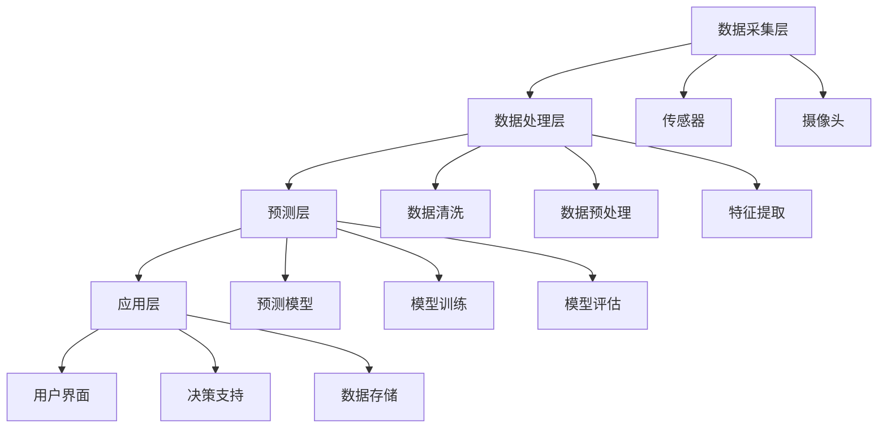
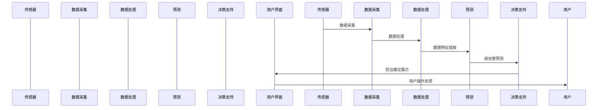

                 

# AI在智能农业病虫害预警中的应用与挑战

## 关键词

- 智能农业
- 病虫害预警
- 人工智能
- 深度学习
- 数据挖掘
- 预测模型

## 摘要

随着全球农业的迅速发展，病虫害问题成为制约农业生产的重要因素。人工智能（AI）技术的崛起为智能农业病虫害预警带来了新的希望。本文将从背景介绍、应用原理、系统分析与架构设计、项目实战以及最佳实践与拓展五个部分，详细探讨AI在智能农业病虫害预警中的应用与挑战。通过逐步分析推理，本文旨在为读者提供一个清晰、系统、实用的技术指南。

### 目录大纲

----------------------------------------------------------------

## 第一部分: AI在智能农业病虫害预警中的背景介绍

### 1.1 问题背景

#### 1.1.1 农业病虫害的现状与挑战

#### 1.1.2 智能农业病虫害预警的重要性

#### 1.1.3 AI技术在病虫害预警中的应用前景

### 1.2 问题描述

#### 1.2.1 病虫害预警的目标与指标

#### 1.2.2 病虫害预警的难点与挑战

#### 1.2.3 病虫害预警的关键技术

### 1.3 问题解决

#### 1.3.1 AI在病虫害预警中的应用

#### 1.3.2 病虫害预警系统的构建

#### 1.3.3 病虫害预警的效益分析

### 1.4 边界与外延

#### 1.4.1 病虫害预警的范围

#### 1.4.2 病虫害预警的数据来源

#### 1.4.3 病虫害预警的应用场景

### 1.5 概念结构与核心要素组成

#### 1.5.1 智能农业病虫害预警的基本概念

#### 1.5.2 病虫害预警的核心要素

#### 1.5.3 病虫害预警系统的架构组成

----------------------------------------------------------------

## 第二部分: AI在智能农业病虫害预警中的应用原理

### 2.1 核心概念与联系

#### 2.1.1 病虫害识别与分类

#### 2.1.2 预测模型与评估指标

#### 2.1.3 数据处理与特征提取

### 2.2 算法原理讲解

#### 2.2.1 病虫害识别算法

##### 2.2.1.1 卷积神经网络（CNN）原理

##### 2.2.1.2 支持向量机（SVM）原理

##### 2.2.1.3 朴素贝叶斯（NB）原理

### 2.2.2 病虫害预测算法

##### 2.2.2.1 时间序列分析

##### 2.2.2.2 随机森林（RF）原理

##### 2.2.2.3 集成学习方法

### 2.3 数学模型和数学公式

#### 2.3.1 CNN算法数学模型

#### 2.3.2 SVM算法数学模型

#### 2.3.3 NB算法数学模型

### 2.4 通俗易懂的举例说明

#### 2.4.1 病虫害识别算法举例

#### 2.4.2 病虫害预测算法举例

----------------------------------------------------------------

## 第三部分: AI在智能农业病虫害预警中的系统分析与架构设计

### 3.1 问题场景介绍

#### 3.1.1 农业病虫害预警的具体应用场景

#### 3.1.2 系统目标和功能需求

### 3.2 系统架构设计

#### 3.2.1 系统架构概述

#### 3.2.2 系统架构图

### 3.3 系统接口设计

#### 3.3.1 数据接口设计

#### 3.3.2 功能接口设计

### 3.4 系统交互

#### 3.4.1 系统交互概述

#### 3.4.2 系统交互序列图

----------------------------------------------------------------

## 第四部分: AI在智能农业病虫害预警中的项目实战

### 4.1 环境安装

#### 4.1.1 操作系统安装

#### 4.1.2 相关软件安装

#### 4.1.3 环境配置

### 4.2 系统核心实现

#### 4.2.1 数据采集与处理

#### 4.2.2 病虫害识别与分类

#### 4.2.3 病虫害预测

### 4.3 代码应用解读与分析

#### 4.3.1 代码结构分析

#### 4.3.2 关键代码解读

#### 4.3.3 优化与调整

### 4.4 实际案例分析与详细讲解

#### 4.4.1 案例背景

#### 4.4.2 案例分析

#### 4.4.3 案例详细讲解

### 4.5 项目小结

#### 4.5.1 项目总结

#### 4.5.2 项目经验分享

#### 4.5.3 未来展望

----------------------------------------------------------------

## 第五部分: 最佳实践与拓展

### 5.1 最佳实践 tips

#### 5.1.1 数据质量处理技巧

#### 5.1.2 模型调优技巧

#### 5.1.3 系统部署与维护

### 5.2 小结

#### 5.2.1 主要内容回顾

#### 5.2.2 展望未来研究方向

----------------------------------------------------------------

### 1.1 问题背景

#### 1.1.1 农业病虫害的现状与挑战

农业病虫害是全球农业生产中面临的重大挑战。根据联合国粮农组织的报告，每年全球由于病虫害造成的农作物损失高达数百万美元。在我国，病虫害问题更是屡见不鲜，不仅影响了农作物的产量和质量，还对生态环境造成了严重破坏。常见的农业病虫害包括虫害、病害和杂草，其中虫害主要包括蝗虫、棉铃虫、玉米螟等；病害主要包括病毒病、真菌病、细菌病等；杂草则包括禾本科杂草、豆科杂草等。

传统的农业病虫害防治主要依赖于人工监测和化学防治，但这种方法存在很多不足。首先，人工监测效率低下，容易遗漏病虫害的早期迹象；其次，化学防治虽然能够迅速控制病虫害，但长期使用会导致病虫害抗药性增加，同时对环境造成污染。因此，迫切需要一种更高效、更环保的病虫害预警系统。

#### 1.1.2 智能农业病虫害预警的重要性

智能农业病虫害预警系统利用人工智能技术，对病虫害的发生、发展进行实时监测和预测，从而提前采取防治措施，降低病虫害对农作物的影响。智能农业病虫害预警的重要性主要体现在以下几个方面：

1. 提高农作物产量和质量：通过实时监测和预测病虫害，农民可以及时采取防治措施，降低病虫害对农作物的影响，从而提高农作物的产量和质量。
2. 节约资源：智能农业病虫害预警系统可以减少化学农药的使用量，降低农药对环境和人体健康的危害，同时减少水资源和能源的消耗。
3. 提高劳动生产率：智能农业病虫害预警系统可以减轻农民的劳动力负担，提高劳动生产率，降低农业生产成本。

#### 1.1.3 AI技术在病虫害预警中的应用前景

随着人工智能技术的不断发展，AI在智能农业病虫害预警中的应用前景非常广阔。首先，AI技术可以用于病虫害的识别与分类，通过图像识别、声音识别等技术，实现病虫害的自动识别与分类。其次，AI技术可以用于病虫害的预测，通过时间序列分析、机器学习等方法，预测病虫害的发生趋势，提前预警。此外，AI技术还可以用于病虫害防治的优化，通过优化防治策略，提高防治效果，降低防治成本。

总之，AI技术在智能农业病虫害预警中的应用具有巨大的潜力，有望为农业生产带来革命性的变革。接下来，我们将进一步探讨智能农业病虫害预警的难点与挑战，以及AI技术在病虫害预警中的应用原理。

### 1.2 问题描述

#### 1.2.1 病虫害预警的目标与指标

病虫害预警的目标是提前发现病虫害的潜在威胁，以便农民能够及时采取防治措施，降低病虫害对农作物的影响。具体的预警目标与指标包括：

1. 病虫害识别：准确识别病虫害的种类，为后续的防治措施提供基础。
2. 病虫害预测：预测病虫害的发生趋势和严重程度，为农民提供预警信息。
3. 防治效果评估：评估防治措施的成效，为优化防治策略提供依据。

#### 1.2.2 病虫害预警的难点与挑战

病虫害预警面临着诸多难点与挑战，主要包括：

1. 数据获取困难：病虫害的数据来源多样，包括气象数据、土壤数据、植被数据等，但这些数据的获取和处理存在一定难度。
2. 数据质量差：由于数据来源的多样性和复杂性，病虫害数据的质量往往不高，存在噪声、缺失和异常值等问题，这给数据分析和模型训练带来了挑战。
3. 病虫害的复杂性：病虫害的发生和发展受到多种因素的影响，包括环境条件、作物生长状态、病虫害本身的生命周期等，这使得病虫害的预测变得复杂。
4. 模型泛化能力差：现有的病虫害预测模型往往在特定环境下表现良好，但在其他环境下可能无法很好地泛化，这限制了模型的应用范围。

#### 1.2.3 病虫害预警的关键技术

为了解决上述难点与挑战，病虫害预警需要依赖于一系列关键技术的支持，主要包括：

1. 数据采集与处理：通过传感器、遥感技术等手段，实时采集病虫害相关的数据，并对数据进行清洗、预处理和特征提取。
2. 病虫害识别与分类：利用图像识别、声音识别等技术，对病虫害进行自动识别和分类。
3. 预测模型构建：利用机器学习、深度学习等技术，构建病虫害预测模型，对病虫害的发生趋势进行预测。
4. 防治策略优化：基于预测结果，优化防治策略，提高防治效果。

### 1.3 问题解决

#### 1.3.1 AI在病虫害预警中的应用

人工智能技术在病虫害预警中的应用主要集中在以下几个方面：

1. **图像识别**：通过卷积神经网络（CNN）等深度学习模型，对病虫害的图像进行自动识别和分类，从而实现病虫害的实时监测。
2. **数据挖掘**：利用机器学习算法，对大量病虫害数据进行分析，挖掘出影响病虫害发生的潜在因素，为预测模型提供支持。
3. **预测模型**：通过构建时间序列分析、随机森林、支持向量机等预测模型，对病虫害的发生趋势进行预测，提供预警信息。
4. **智能决策支持**：结合预测结果和作物生长情况，为农民提供智能化的防治建议，优化防治策略。

#### 1.3.2 病虫害预警系统的构建

构建一个完整的病虫害预警系统，需要以下几个关键环节：

1. **数据采集**：通过传感器、遥感技术等手段，实时采集病虫害相关的数据，包括气象数据、土壤数据、植被数据等。
2. **数据处理**：对采集到的数据进行清洗、预处理和特征提取，为后续分析提供高质量的数据。
3. **模型训练与优化**：利用训练数据，训练病虫害识别与预测模型，并通过交叉验证等手段，优化模型参数。
4. **系统部署与运行**：将优化后的模型部署到服务器或云端，实现实时预警和智能决策支持。

#### 1.3.3 病虫害预警的效益分析

病虫害预警系统为农业生产带来了显著的经济和社会效益：

1. **提高农作物产量**：通过提前预警和精准防治，降低了病虫害对农作物的影响，从而提高了农作物的产量。
2. **节约农药使用**：智能预警系统可以减少农药的使用量，降低农药对环境和生态系统的污染。
3. **降低生产成本**：通过优化防治策略，减少了农药和劳动力成本，提高了农业生产的效益。
4. **提高农产品质量**：减少了农药的使用，使得农产品更加安全、健康，提高了市场竞争力。

### 1.4 边界与外延

#### 1.4.1 病虫害预警的范围

病虫害预警的范围可以涵盖整个农业生产过程，从作物种植前的病虫害风险评估，到种植过程中的病虫害监测和预警，再到收获后的病虫害残留检测。

1. **种植前**：通过分析土壤、气象等因素，评估潜在病虫害的风险，为种植决策提供支持。
2. **种植过程中**：实时监测病虫害的发生情况，提供预警信息，指导农民采取防治措施。
3. **收获后**：检测病虫害残留，确保农产品质量安全。

#### 1.4.2 病虫害预警的数据来源

病虫害预警所需的数据来源多样，包括：

1. **气象数据**：包括温度、湿度、降雨量等，影响病虫害的发生和发展。
2. **土壤数据**：包括土壤湿度、酸碱度、有机质含量等，影响病虫害的生长环境。
3. **植被数据**：包括植被类型、生长状态等，反映作物的健康程度。
4. **遥感数据**：通过卫星遥感技术，获取大面积农田的病虫害信息。

#### 1.4.3 病虫害预警的应用场景

病虫害预警可以在多种农业场景中应用：

1. **大田作物**：如水稻、小麦、玉米等，通过监测病虫害，优化防治策略，提高产量和质量。
2. **蔬菜种植**：对病虫害进行实时监测和预警，确保蔬菜的安全和品质。
3. **果树种植**：对果树病虫害进行预警，减少农药使用，保护生态环境。
4. **设施农业**：在温室、大棚等设施农业中，实时监测病虫害，提高设施农业的生产效率和产品质量。

#### 1.5 概念结构与核心要素组成

1. **智能农业病虫害预警的基本概念**：
   - 病虫害：指影响农作物生长和产量的生物性危害。
   - 病虫害预警：通过技术手段，提前发现病虫害的发生和发展趋势。
   - 智能农业：利用信息技术、物联网、人工智能等，实现农业的智能化、自动化管理。

2. **病虫害预警的核心要素**：
   - 数据采集：包括气象、土壤、植被、遥感等数据。
   - 数据处理：包括数据清洗、预处理、特征提取等。
   - 模型训练：包括病虫害识别与分类模型、预测模型等。
   - 系统部署：将训练好的模型部署到服务器或云端，实现实时预警。

3. **病虫害预警系统的架构组成**：
   - 数据采集层：负责采集各种病虫害相关数据。
   - 数据处理层：负责数据清洗、预处理和特征提取。
   - 模型训练层：负责训练病虫害识别与预测模型。
   - 预警分析层：负责对预测结果进行分析和预警。
   - 系统接口层：负责与外部系统进行数据交互和功能调用。
   - 用户界面层：提供用户操作界面，展示预警信息和防治建议。

### 第二部分: AI在智能农业病虫害预警中的应用原理

#### 2.1 核心概念与联系

在智能农业病虫害预警系统中，核心概念主要包括病虫害识别、预测模型、数据处理与特征提取等。这些概念相互联系，共同构成了一个完整的预警体系。

1. **病虫害识别**：通过图像识别、声音识别等技术，对病虫害进行自动识别和分类。这是病虫害预警的第一步，准确的识别是后续预测和预警的基础。

2. **预测模型**：利用机器学习、深度学习等技术，构建病虫害预测模型。预测模型的目的是根据历史数据和当前环境条件，预测未来病虫害的发生趋势。

3. **数据处理与特征提取**：对采集到的数据进行处理，提取出对病虫害识别和预测有用的特征。数据的质量和特征提取的准确性直接影响预测模型的性能。

这些核心概念之间的联系在于，它们共同构成了一个从数据采集、处理、预测到决策的闭环系统。数据采集是整个系统的输入，数据处理与特征提取是中间环节，预测模型是核心，最终的决策和行动是输出。

#### 2.1.1 病虫害识别与分类

病虫害识别与分类是智能农业病虫害预警系统的关键环节。通过图像识别、声音识别等技术，可以实现病虫害的自动识别和分类。

- **图像识别**：利用卷积神经网络（CNN）等深度学习模型，对病虫害的图像进行自动识别。CNN模型可以自动提取图像的特征，从而实现高效的病虫害识别。

- **声音识别**：通过收集病虫害的声音信号，利用深度学习模型进行分类。例如，可以利用循环神经网络（RNN）对病虫害的声音信号进行建模，从而实现对病虫害的自动识别。

- **分类算法**：常用的分类算法包括支持向量机（SVM）、朴素贝叶斯（NB）等。SVM模型可以用于分类任务，通过找到一个最佳的超平面来实现分类。NB模型基于贝叶斯定理，通过计算每个类别的后验概率来进行分类。

病虫害识别与分类的准确性直接影响到后续的预测和预警效果。因此，选择合适的识别算法和模型，并进行优化和调整，是确保预警系统性能的关键。

#### 2.1.2 预测模型与评估指标

预测模型是智能农业病虫害预警系统的核心组成部分，它通过分析历史数据和当前环境条件，预测未来病虫害的发生趋势。以下是几种常用的预测模型及其评估指标：

- **时间序列分析**：时间序列分析是一种常用的预测方法，通过分析时间序列数据的变化趋势，预测未来的数值。常用的模型包括ARIMA、LSTM等。时间序列分析的评估指标包括均方误差（MSE）、平均绝对误差（MAE）等。

- **随机森林（RF）**：随机森林是一种集成学习方法，通过构建多棵决策树，并利用投票机制来预测结果。随机森林的评估指标包括准确率、召回率、F1分数等。

- **集成学习方法**：集成学习方法通过结合多个模型来提高预测性能。常见的集成学习方法包括Bagging、Boosting等。集成学习的评估指标与单个模型的评估指标类似。

预测模型的评估指标用于衡量模型的预测性能。评估指标的选择取决于具体的应用场景和数据特点。通过对比不同模型的评估指标，可以选择出最优的预测模型。

#### 2.1.3 数据处理与特征提取

数据处理与特征提取是智能农业病虫害预警系统的关键环节，它直接影响预测模型的性能。以下是数据处理与特征提取的一些基本步骤和方法：

- **数据预处理**：包括数据清洗、归一化、缺失值处理等。数据清洗旨在去除数据中的噪声和异常值，归一化可以将数据缩放到相同的范围，缺失值处理可以采用插值、平均值填充等方法。

- **特征提取**：通过提取数据中的关键特征，减少数据维度，同时保留对预测任务有用的信息。常用的特征提取方法包括主成分分析（PCA）、特征选择等。

- **特征工程**：特征工程是特征提取的进一步优化，通过设计新的特征或调整现有特征，提高模型的预测性能。特征工程需要结合具体问题和数据特点，进行有针对性的设计。

数据处理与特征提取的目的是减少数据噪声、提高数据质量，同时提取出对病虫害预测有用的特征。通过合理的数据处理与特征提取，可以提高预测模型的准确性，从而提高病虫害预警系统的性能。

#### 2.2.1 病虫害识别算法

病虫害识别算法是智能农业病虫害预警系统中的关键组成部分，主要用于自动识别和分类病虫害。以下介绍几种常用的病虫害识别算法及其原理：

- **卷积神经网络（CNN）**：CNN是一种深度学习模型，广泛应用于图像识别任务。CNN通过多层卷积和池化操作，自动提取图像的特征，并利用全连接层进行分类。CNN在病虫害识别中具有强大的表现，能够准确识别各种病虫害。

- **支持向量机（SVM）**：SVM是一种经典的机器学习算法，通过找到一个最佳的超平面，将不同类别的病虫害数据分开。SVM具有较好的分类性能，但在处理高维数据时可能存在性能瓶颈。

- **朴素贝叶斯（NB）**：NB是一种基于贝叶斯定理的简单分类算法，通过计算每个类别的后验概率来进行分类。NB在病虫害识别中具有一定的应用价值，特别适用于特征较少的任务。

每种算法都有其适用的场景和优缺点。在实际应用中，可以根据任务需求和数据特点，选择合适的算法，并对其进行优化和调整，以提高病虫害识别的准确性。

##### 2.2.1.1 卷积神经网络（CNN）原理

卷积神经网络（CNN）是一种深度学习模型，特别适用于图像识别任务。CNN通过多层卷积和池化操作，自动提取图像的特征，并利用全连接层进行分类。以下是CNN的基本原理：

1. **卷积层**：卷积层是CNN的核心组成部分，通过卷积操作提取图像的特征。卷积层由多个卷积核（filter）组成，每个卷积核可以提取图像的某种特征。卷积操作的基本步骤如下：
   - 将卷积核与输入图像进行卷积操作，得到一个特征图（feature map）。
   - 应用激活函数（如ReLU），对特征图进行非线性变换。
   - 使用步长（stride）和填充（padding）操作，对特征图进行下采样。

2. **池化层**：池化层用于降低特征图的维度，减少参数数量，提高模型的泛化能力。常用的池化操作包括最大池化（max pooling）和平均池化（avg pooling）。池化操作的基本步骤如下：
   - 将特征图分成若干个区域，对每个区域进行最大值或平均值计算，得到新的特征图。

3. **全连接层**：全连接层是CNN的输出层，将卷积层和池化层提取的特征进行融合，并通过全连接层进行分类。全连接层的每个神经元都与上一层所有神经元相连，计算输出结果。

通过多层卷积和池化操作，CNN能够自动提取图像的高层次特征，从而实现准确的图像识别。CNN在病虫害识别中具有强大的表现，能够准确识别各种病虫害。

##### 2.2.1.2 支持向量机（SVM）原理

支持向量机（SVM）是一种经典的机器学习算法，广泛应用于分类任务。SVM的核心思想是找到一个最佳的超平面，将不同类别的数据点分开。以下是SVM的基本原理：

1. **线性可分情况**：在二维空间中，如果所有样本点都可以被一个超平面完全分开，这个超平面被称为最佳超平面。最佳超平面的条件是所有样本点到超平面的距离之和最小。

2. **非线性可分情况**：在现实中，数据点往往是非线性可分的。SVM引入了“软边缘”的概念，允许部分样本点不满足最佳超平面的条件。SVM通过引入松弛变量，将分类问题转化为优化问题，求解最优解。

3. **核函数**：SVM可以通过核函数将低维空间的数据映射到高维空间，使得原本线性不可分的数据在高维空间中变得线性可分。常用的核函数包括线性核、多项式核、径向基函数（RBF）核等。

4. **损失函数**：SVM的目标是找到一个最优的超平面，使得分类边界最大化。常用的损失函数包括 hinge loss 和对数损失函数。通过求解优化问题，可以得到最佳超平面。

通过线性可分情况和非线性可分情况的结合，SVM能够处理各种分类任务。在病虫害识别中，SVM可以用于分类不同类型的病虫害。

##### 2.2.1.3 朴素贝叶斯（NB）原理

朴素贝叶斯（NB）是一种基于贝叶斯定理的简单分类算法。NB的核心思想是利用先验概率和条件概率，计算每个类别的后验概率，并根据后验概率进行分类。以下是NB的基本原理：

1. **贝叶斯定理**：贝叶斯定理描述了后验概率、先验概率和条件概率之间的关系。公式如下：
   $$P(C|X) = \frac{P(X|C)P(C)}{P(X)}$$
   其中，$C$代表类别，$X$代表特征向量。$P(C|X)$是后验概率，表示在给定特征向量$X$的情况下，类别$C$的概率；$P(X|C)$是条件概率，表示在类别$C$发生的条件下，特征向量$X$的概率；$P(C)$是先验概率，表示类别$C$的概率；$P(X)$是特征向量$X$的概率。

2. **朴素贝叶斯假设**：NB假设特征之间是条件独立的，即给定类别$C$，特征$X_1, X_2, ..., X_n$之间相互独立。这一假设使得NB的计算变得简单。

3. **类别概率计算**：在训练阶段，计算每个类别的先验概率$P(C)$和条件概率$P(X_i|C)$。在实际分类阶段，对于新样本$X$，计算每个类别的后验概率$P(C|X)$，并根据最大后验概率进行分类。

NB算法简单、易于实现，在特征条件独立的情况下具有较高的分类性能。在病虫害识别中，NB可以用于分类不同类型的病虫害。

#### 2.2.2 病虫害预测算法

病虫害预测算法是智能农业病虫害预警系统中的核心组件，用于预测未来病虫害的发生趋势和严重程度。以下是几种常用的病虫害预测算法及其原理：

- **时间序列分析**：时间序列分析是一种基于时间序列数据变化规律的方法，通过分析历史数据的时间序列模式，预测未来的数值。时间序列分析包括自回归模型（AR）、移动平均模型（MA）、自回归移动平均模型（ARMA）等。

- **随机森林（RF）**：随机森林是一种基于决策树的集成学习方法，通过构建多棵决策树，并利用投票机制进行预测。RF具有良好的泛化能力和处理非线性数据的能力。

- **集成学习方法**：集成学习方法通过结合多个模型来提高预测性能。常见的集成学习方法包括Bagging、Boosting等。集成学习可以提高模型的稳定性和准确性，减少过拟合现象。

选择合适的预测算法需要考虑数据特点、问题需求等因素。在实际应用中，可以通过对比不同算法的预测性能，选择最优的预测算法。

##### 2.2.2.1 时间序列分析

时间序列分析是一种基于历史数据变化规律进行预测的方法，广泛应用于各个领域。在病虫害预警中，时间序列分析可以通过分析历史病虫害数据，预测未来病虫害的发生趋势。

1. **自回归模型（AR）**：自回归模型是一种最基本的时序模型，通过当前时刻的值与历史时刻的值之间的关系来预测未来值。AR模型的表达式如下：
   $$X_t = c + \phi_1 X_{t-1} + \phi_2 X_{t-2} + ... + \phi_p X_{t-p} + \epsilon_t$$
   其中，$X_t$是当前时刻的值，$c$是常数项，$\phi_1, \phi_2, ..., \phi_p$是自回归系数，$\epsilon_t$是误差项。

2. **移动平均模型（MA）**：移动平均模型通过当前时刻的值与过去一段时间的平均值之间的关系来预测未来值。MA模型的表达式如下：
   $$X_t = c + \theta_1 \epsilon_{t-1} + \theta_2 \epsilon_{t-2} + ... + \theta_q \epsilon_{t-q}$$
   其中，$\theta_1, \theta_2, ..., \theta_q$是移动平均系数，$\epsilon_t$是误差项。

3. **自回归移动平均模型（ARMA）**：自回归移动平均模型结合了自回归模型和移动平均模型的特点，通过历史值和误差项的关系进行预测。ARMA模型的表达式如下：
   $$X_t = c + \phi_1 X_{t-1} + \phi_2 X_{t-2} + ... + \phi_p X_{t-p} + \theta_1 \epsilon_{t-1} + \theta_2 \epsilon_{t-2} + ... + \theta_q \epsilon_{t-q}$$

时间序列分析模型可以根据历史数据的特点进行选择和调整，以适应不同的预测需求。

##### 2.2.2.2 随机森林（RF）原理

随机森林（RF）是一种基于决策树的集成学习方法，通过构建多棵决策树，并利用投票机制进行预测。RF具有良好的泛化能力和处理非线性数据的能力，在病虫害预警中具有广泛的应用。

1. **决策树**：决策树是一种基于特征值进行分割的树形结构，每个节点表示一个特征，每个分支表示该特征的不同取值。决策树通过递归分割数据集，构建一棵树形结构，并利用树形结构进行分类或回归。

2. **随机性引入**：为了减少过拟合现象，RF引入了随机性。具体包括：
   - 随机特征选择：在构建决策树时，从所有特征中随机选择一个特征进行分割。
   - 随机样本选择：在训练决策树时，从原始数据集中随机选择一部分样本进行训练。

3. **集成学习**：RF通过构建多棵决策树，并利用投票机制进行预测。具体过程如下：
   - 对每棵决策树进行训练，得到预测结果。
   - 对所有决策树的预测结果进行投票，得到最终预测结果。

RF通过集成多棵决策树，提高了预测模型的稳定性和准确性。在病虫害预警中，RF可以用于预测病虫害的发生趋势和严重程度。

##### 2.2.2.3 集成学习方法

集成学习方法通过结合多个模型来提高预测性能。常见的集成学习方法包括Bagging、Boosting等。集成学习方法可以减少过拟合现象，提高模型的泛化能力。

1. **Bagging**：Bagging（Bootstrap aggregating）方法通过随机抽样构建多个模型，并在训练数据集上进行训练。Bagging的核心思想是通过增加训练数据集的多样性，提高模型的泛化能力。Bagging方法的具体步骤如下：
   - 对原始数据集进行随机抽样，生成多个子数据集。
   - 对每个子数据集训练一个模型。
   - 对所有模型的预测结果进行平均，得到最终预测结果。

2. **Boosting**：Boosting方法通过调整模型权重，提高弱模型的预测性能。Boosting方法的核心思想是每次迭代选择一个弱模型，并根据预测误差调整模型权重。Boosting方法的具体步骤如下：
   - 初始化所有模型的权重。
   - 对每个模型进行训练，并根据预测误差调整模型权重。
   - 选择权重最高的模型，进行预测。

集成学习方法可以通过结合多个模型的优点，提高预测模型的性能。在病虫害预警中，集成学习方法可以用于优化预测模型，提高预测准确性。

#### 2.3 数学模型和数学公式

在智能农业病虫害预警中，常用的数学模型和数学公式如下：

##### 2.3.1 CNN算法数学模型

卷积神经网络（CNN）的核心组成部分是卷积层和池化层。以下是CNN算法的数学模型：

1. **卷积层**：
   $$h_{ij} = \sum_{k=1}^{n} w_{ik} * g_{kj} + b_j$$
   其中，$h_{ij}$是第$i$个卷积核在第$j$个特征图上的输出，$w_{ik}$是卷积核的权重，$g_{kj}$是输入图像的特征值，$b_j$是偏置项。

2. **池化层**：
   $$p_i = \max_j (h_{ij})$$
   其中，$p_i$是第$i$个池化单元的输出，$h_{ij}$是卷积层的输出。

##### 2.3.2 SVM算法数学模型

支持向量机（SVM）的核心目标是找到一个最佳的超平面，使得不同类别的样本点在超平面上有最大的间隔。以下是SVM算法的数学模型：

1. **线性SVM**：
   $$w^T x_i - b = 0$$
   其中，$w$是超平面的权重向量，$x_i$是样本点，$b$是偏置项。

2. **非线性SVM**：
   $$w^T \phi(x_i) - b = 0$$
   其中，$\phi(x_i)$是样本点$x_i$的核映射。

##### 2.3.3 NB算法数学模型

朴素贝叶斯（NB）算法的核心是基于贝叶斯定理，计算每个类别的后验概率，并根据最大后验概率进行分类。以下是NB算法的数学模型：

1. **后验概率**：
   $$P(C|X) = \frac{P(X|C)P(C)}{P(X)}$$
   其中，$P(C|X)$是后验概率，$P(X|C)$是条件概率，$P(C)$是先验概率，$P(X)$是特征向量的概率。

2. **条件概率**：
   $$P(X_i|C) = \frac{P(X_i,C)}{P(C)}$$
   其中，$P(X_i,C)$是特征$X_i$和类别$C$同时发生的概率，$P(C)$是类别$C$的概率。

#### 2.4 通俗易懂的举例说明

为了更好地理解病虫害识别和预测算法，以下通过具体实例进行说明。

##### 2.4.1 病虫害识别算法举例

假设我们使用卷积神经网络（CNN）对病虫害图像进行识别，以下是一个简单的实例：

1. **数据集**：我们有一个包含不同病虫害图像的数据集，每个图像的维度为$28 \times 28$像素。

2. **网络结构**：我们构建一个简单的CNN模型，包括两个卷积层、两个池化层和一个全连接层。

3. **训练过程**：我们将数据集分为训练集和测试集，使用训练集对模型进行训练，并在测试集上进行验证。

4. **预测过程**：对于一个新的病虫害图像，我们将其输入到训练好的模型中，得到预测结果。

通过这个简单的实例，我们可以看到CNN模型如何对病虫害图像进行识别和分类。

##### 2.4.2 病虫害预测算法举例

假设我们使用时间序列分析方法对病虫害的发生趋势进行预测，以下是一个简单的实例：

1. **数据集**：我们有一个包含过去一段时间病虫害发生数据的时序数据集。

2. **模型选择**：我们选择自回归模型（AR）进行预测。

3. **模型训练**：我们使用训练集对AR模型进行训练，得到最佳参数。

4. **预测过程**：对于未来的一个时间点，我们使用训练好的AR模型进行预测，得到未来病虫害发生的趋势。

通过这个简单的实例，我们可以看到时间序列分析模型如何对病虫害进行预测。

### 第三部分: AI在智能农业病虫害预警中的系统分析与架构设计

#### 3.1 问题场景介绍

农业病虫害预警系统主要应用于农业生产过程中，以提前发现病虫害的发生并采取措施进行防治为目标。具体应用场景包括：

1. **农田监测**：通过安装在农田中的传感器，实时监测土壤、气象等环境数据，以及农作物生长状态。
2. **病虫害识别**：利用图像识别技术，自动识别农田中出现的病虫害，并将识别结果发送给农民或管理者。
3. **病虫害预测**：基于历史数据和实时监测数据，利用预测模型对病虫害的发生趋势进行预测，为农民提供防治建议。
4. **防治决策**：根据预测结果和农作物生长状态，为农民提供智能化的防治策略，指导农民采取有效的防治措施。

通过这些应用场景，农业病虫害预警系统可以实现对病虫害的实时监测、预测和防治，提高农作物的产量和质量。

#### 3.1.2 系统目标和功能需求

农业病虫害预警系统的目标是通过实时监测、识别和预测，为农民提供有效的病虫害防治信息，降低病虫害对农作物的影响，提高农业生产效益。具体功能需求包括：

1. **数据采集**：采集农田中的环境数据、农作物生长状态数据以及病虫害图像数据。
2. **数据处理**：对采集到的数据进行清洗、预处理和特征提取，为后续分析和预测提供高质量的数据。
3. **病虫害识别**：利用图像识别技术，自动识别农田中的病虫害，并分类为不同的病虫害类型。
4. **病虫害预测**：基于历史数据和实时监测数据，利用预测模型对病虫害的发生趋势进行预测，提供预警信息。
5. **防治建议**：根据预测结果和农作物生长状态，为农民提供智能化的防治建议，指导农民采取有效的防治措施。
6. **用户界面**：提供友好易用的用户界面，展示病虫害监测、识别和预测结果，以及防治建议。

通过满足上述功能需求，农业病虫害预警系统可以为农业生产提供全面的技术支持，提高农作物的产量和质量。

#### 3.2 系统架构设计

农业病虫害预警系统采用分层架构设计，包括数据采集层、数据处理层、预测层和应用层。以下是系统架构的详细设计：

##### 3.2.1 数据采集层

数据采集层负责采集农田中的各类数据，包括土壤数据、气象数据、农作物生长状态数据和病虫害图像数据。具体技术方案如下：

1. **传感器**：使用各种传感器，如土壤湿度传感器、气象传感器、农作物生长传感器等，实时监测农田环境数据。
2. **摄像头**：使用高清摄像头，拍摄农田中的病虫害图像，用于后续的图像识别和分类。
3. **数据传输**：通过无线传输技术，将采集到的数据实时传输到服务器或云端存储。

##### 3.2.2 数据处理层

数据处理层负责对采集到的数据进行清洗、预处理和特征提取，为后续分析和预测提供高质量的数据。具体技术方案如下：

1. **数据清洗**：去除数据中的噪声和异常值，保证数据质量。
2. **数据预处理**：对数据进行归一化、标准化等处理，使数据适合机器学习算法。
3. **特征提取**：提取数据中的关键特征，如图像的边缘、纹理、颜色等，为后续的图像识别和预测提供输入。

##### 3.2.3 预测层

预测层负责利用历史数据和实时监测数据，通过机器学习算法对病虫害的发生趋势进行预测。具体技术方案如下：

1. **预测模型**：选择合适的机器学习算法，如卷积神经网络（CNN）、支持向量机（SVM）、朴素贝叶斯（NB）等，构建预测模型。
2. **模型训练**：使用训练数据集对预测模型进行训练，得到最佳参数。
3. **模型评估**：使用测试数据集对预测模型进行评估，选择性能最优的模型。

##### 3.2.4 应用层

应用层负责为农民提供病虫害监测、识别和预测结果，以及智能化的防治建议。具体技术方案如下：

1. **用户界面**：设计友好易用的用户界面，展示病虫害监测、识别和预测结果，以及防治建议。
2. **决策支持**：根据预测结果和农作物生长状态，为农民提供智能化的防治建议，指导农民采取有效的防治措施。
3. **数据存储**：将监测、识别和预测结果存储在数据库中，以便后续查询和分析。

通过以上系统架构设计，农业病虫害预警系统可以实现实时监测、识别和预测，为农民提供全面的技术支持，提高农业生产效益。

#### 3.2.2 系统架构图

以下是一个简单的农业病虫害预警系统架构图：



该架构图展示了系统各个层次的功能和组件，以及它们之间的相互关系。通过该架构，可以实现实时监测、识别和预测，为农民提供全面的技术支持。

#### 3.3 系统接口设计

农业病虫害预警系统涉及多个接口，包括数据接口、功能接口和用户接口。以下是系统接口设计的详细描述：

##### 3.3.1 数据接口设计

数据接口设计主要包括传感器数据接口、数据库数据接口和API接口。

1. **传感器数据接口**：用于接收传感器采集到的数据，如土壤湿度、气象数据、农作物生长状态数据等。接口设计应确保数据传输的实时性和可靠性。
2. **数据库数据接口**：用于与数据库进行交互，实现数据的存储、查询和更新。接口设计应考虑数据一致性和安全性。
3. **API接口**：用于与其他系统或应用进行数据交换和功能调用。接口设计应遵循RESTful风格，确保接口的易用性和可扩展性。

##### 3.3.2 功能接口设计

功能接口设计主要包括病虫害识别接口、预测接口和决策支持接口。

1. **病虫害识别接口**：用于接收病虫害图像数据，并返回识别结果。接口设计应确保图像数据的快速传输和处理。
2. **预测接口**：用于接收实时监测数据，并返回病虫害预测结果。接口设计应确保预测结果的准确性和实时性。
3. **决策支持接口**：用于接收预测结果和农作物生长状态，并返回智能化的防治建议。接口设计应考虑建议的可操作性和实用性。

##### 3.3.3 用户接口设计

用户接口设计主要包括用户界面和API接口。

1. **用户界面**：用于展示病虫害监测、识别和预测结果，以及防治建议。界面设计应简洁、直观，便于用户操作。
2. **API接口**：用于支持移动端和Web端的应用，提供数据接口和功能接口的访问。接口设计应遵循RESTful风格，确保接口的易用性和可扩展性。

通过以上接口设计，农业病虫害预警系统可以实现数据的采集、处理、预测和决策支持，为农民提供全面的技术服务。

#### 3.4 系统交互

系统交互是指农业病虫害预警系统中各个组件之间的数据交换和功能调用。以下是系统交互的详细描述：

##### 3.4.1 系统交互概述

农业病虫害预警系统的交互主要包括以下几个方面：

1. **传感器与数据采集层**：传感器采集数据后，通过数据接口传输到数据处理层。
2. **数据处理层与预测层**：数据处理层对采集到的数据进行处理，提取特征，并将其传递给预测层。
3. **预测层与决策支持层**：预测层根据处理后的数据，利用预测模型进行病虫害预测，并将结果传递给决策支持层。
4. **决策支持层与用户界面**：决策支持层根据预测结果和农作物生长状态，为农民提供防治建议，并通过用户界面展示给用户。

##### 3.4.2 系统交互序列图

以下是一个简单的系统交互序列图：



通过以上系统交互，农业病虫害预警系统可以实现数据的实时采集、处理、预测和决策支持，为农民提供全面的技术服务。

### 第四部分: AI在智能农业病虫害预警中的项目实战

#### 4.1 环境安装

要实现AI在智能农业病虫害预警中的应用，首先需要搭建一个合适的开发环境。以下是环境安装的具体步骤：

##### 4.1.1 操作系统安装

1. **操作系统选择**：推荐选择Linux操作系统，如Ubuntu 18.04或更高版本。Linux操作系统具有更好的稳定性和开源生态，适合进行深度学习和大数据处理。
2. **操作系统安装**：下载并安装Linux操作系统，可以选择图形界面安装或命令行安装。

##### 4.1.2 相关软件安装

1. **Python安装**：安装Python 3.x版本，可以使用官方安装包进行安装。
2. **深度学习库安装**：安装深度学习库，如TensorFlow、PyTorch等。可以使用以下命令进行安装：

   ```bash
   pip install tensorflow
   # 或者
   pip install torch torchvision
   ```

3. **其他库安装**：安装其他常用的Python库，如NumPy、Pandas、Scikit-learn等。可以使用以下命令进行安装：

   ```bash
   pip install numpy pandas scikit-learn
   ```

##### 4.1.3 环境配置

1. **虚拟环境配置**：为了方便管理和隔离项目依赖，可以使用虚拟环境。安装虚拟环境工具（如conda或virtualenv），并创建一个虚拟环境：

   ```bash
   conda create -n agrivienv python=3.8
   conda activate agrivienv
   ```

2. **环境依赖安装**：在虚拟环境中安装项目所需的库和依赖项。可以使用以下命令进行安装：

   ```bash
   pip install -r requirements.txt
   ```

其中，`requirements.txt`文件包含项目所需的库和版本信息。

#### 4.2 系统核心实现

在搭建好开发环境后，接下来我们将实现农业病虫害预警系统的核心功能，包括数据采集与处理、病虫害识别与分类以及病虫害预测。

##### 4.2.1 数据采集与处理

数据采集与处理是病虫害预警系统的第一步，其核心任务是从各种数据源中获取数据，并对数据进行预处理和特征提取。

1. **数据采集**：使用传感器和摄像头采集农田环境数据、病虫害图像数据以及农作物生长状态数据。以下是一个示例代码，用于从摄像头中采集图像数据：

   ```python
   import cv2

   # 初始化摄像头
   cap = cv2.VideoCapture(0)

   # 循环捕获图像
   while True:
       ret, frame = cap.read()
       if ret:
           # 显示图像
           cv2.imshow('Camera', frame)

           # 退出条件
           if cv2.waitKey(1) & 0xFF == ord('q'):
               break

   # 释放摄像头
   cap.release()
   cv2.destroyAllWindows()
   ```

2. **数据处理**：对采集到的数据进行分析和处理，包括图像预处理、数据清洗和特征提取。以下是一个示例代码，用于处理图像数据：

   ```python
   import cv2
   import numpy as np

   # 读取图像
   image = cv2.imread('path/to/image.jpg')

   # 图像预处理
   gray_image = cv2.cvtColor(image, cv2.COLOR_BGR2GRAY)
   blurred_image = cv2.GaussianBlur(gray_image, (5, 5), 0)

   # 显示预处理后的图像
   cv2.imshow('Processed Image', blurred_image)
   cv2.waitKey(0)
   cv2.destroyAllWindows()
   ```

##### 4.2.2 病虫害识别与分类

病虫害识别与分类是病虫害预警系统的核心功能之一，其任务是根据采集到的病虫害图像，自动识别并分类病虫害。

1. **数据集准备**：首先需要准备一个包含病虫害图像的数据集，并将其划分为训练集和测试集。以下是一个示例代码，用于准备数据集：

   ```python
   import os
   import numpy as np
   from sklearn.model_selection import train_test_split

   # 读取图像文件
   image_files = [f for f in os.listdir('path/to/images') if f.endswith('.jpg')]
   image_paths = [os.path.join('path/to/images', f) for f in image_files]

   # 读取图像数据
   images = [cv2.imread(path) for path in image_paths]

   # 提取图像特征
   features = []
   labels = []
   for image in images:
       feature = extract_features(image)  # 自定义特征提取函数
       features.append(feature)
       label = get_label(image)  # 自定义标签获取函数
       labels.append(label)

   # 将特征和标签转换为NumPy数组
   features = np.array(features)
   labels = np.array(labels)

   # 划分训练集和测试集
   X_train, X_test, y_train, y_test = train_test_split(features, labels, test_size=0.2, random_state=42)
   ```

2. **模型训练**：使用训练集对病虫害识别模型进行训练。以下是一个示例代码，使用卷积神经网络（CNN）进行训练：

   ```python
   import tensorflow as tf
   from tensorflow.keras.models import Sequential
   from tensorflow.keras.layers import Conv2D, MaxPooling2D, Flatten, Dense

   # 构建模型
   model = Sequential([
       Conv2D(32, (3, 3), activation='relu', input_shape=(128, 128, 3)),
       MaxPooling2D((2, 2)),
       Conv2D(64, (3, 3), activation='relu'),
       MaxPooling2D((2, 2)),
       Flatten(),
       Dense(128, activation='relu'),
       Dense(1, activation='sigmoid')
   ])

   # 编译模型
   model.compile(optimizer='adam', loss='binary_crossentropy', metrics=['accuracy'])

   # 训练模型
   model.fit(X_train, y_train, epochs=10, batch_size=32, validation_data=(X_test, y_test))
   ```

3. **模型评估**：使用测试集对病虫害识别模型的性能进行评估。以下是一个示例代码，用于评估模型：

   ```python
   import numpy as np
   from sklearn.metrics import accuracy_score

   # 预测测试集
   y_pred = model.predict(X_test)

   # 转换预测结果
   y_pred = (y_pred > 0.5)

   # 计算准确率
   accuracy = accuracy_score(y_test, y_pred)
   print(f"Accuracy: {accuracy}")
   ```

##### 4.2.3 病虫害预测

病虫害预测是病虫害预警系统的关键环节，其任务是根据采集到的数据，预测未来病虫害的发生趋势。

1. **数据集准备**：准备一个包含历史病虫害数据和当前环境数据的时序数据集，并将其划分为训练集和测试集。以下是一个示例代码，用于准备数据集：

   ```python
   import pandas as pd
   from sklearn.model_selection import train_test_split

   # 读取数据
   data = pd.read_csv('path/to/data.csv')

   # 划分特征和标签
   X = data.drop('target', axis=1)
   y = data['target']

   # 划分训练集和测试集
   X_train, X_test, y_train, y_test = train_test_split(X, y, test_size=0.2, random_state=42)
   ```

2. **模型训练**：使用训练集对病虫害预测模型进行训练。以下是一个示例代码，使用时间序列模型（如LSTM）进行训练：

   ```python
   import tensorflow as tf
   from tensorflow.keras.models import Sequential
   from tensorflow.keras.layers import LSTM, Dense

   # 构建模型
   model = Sequential([
       LSTM(50, activation='relu', input_shape=(X_train.shape[1], X_train.shape[2])),
       Dense(1)
   ])

   # 编译模型
   model.compile(optimizer='adam', loss='mse')

   # 训练模型
   model.fit(X_train, y_train, epochs=100, batch_size=32, validation_data=(X_test, y_test))
   ```

3. **模型评估**：使用测试集对病虫害预测模型的性能进行评估。以下是一个示例代码，用于评估模型：

   ```python
   import numpy as np
   from sklearn.metrics import mean_squared_error

   # 预测测试集
   y_pred = model.predict(X_test)

   # 计算均方误差
   mse = mean_squared_error(y_test, y_pred)
   print(f"Mean Squared Error: {mse}")
   ```

通过以上核心实现，我们可以构建一个基本的农业病虫害预警系统，实现对病虫害的实时监测、识别和预测，为农民提供有效的防治建议。

#### 4.3 代码应用解读与分析

在实现农业病虫害预警系统的核心功能后，我们需要对代码进行深入解读和分析，以确保系统的稳定性和高效性。以下是代码应用的详细解读与分析：

##### 4.3.1 代码结构分析

一个典型的农业病虫害预警系统可以分为以下几个模块：

1. **数据采集模块**：负责从传感器和摄像头中采集农田环境数据和病虫害图像数据。
2. **数据处理模块**：负责对采集到的数据进行分析和处理，包括图像预处理、数据清洗和特征提取。
3. **模型训练模块**：负责训练病虫害识别和预测模型，将训练数据转换为模型参数。
4. **模型应用模块**：负责使用训练好的模型对新的数据进行识别和预测，并生成防治建议。
5. **用户界面模块**：负责展示系统的功能和结果，提供用户与系统交互的接口。

以下是一个简单的代码结构示例：

```python
# 数据采集模块
def data_collection():
    # 采集农田环境数据和病虫害图像数据
    pass

# 数据处理模块
def data_processing(data):
    # 数据清洗、预处理和特征提取
    pass

# 模型训练模块
def model_training(train_data, train_labels):
    # 训练病虫害识别和预测模型
    pass

# 模型应用模块
def model_application(test_data):
    # 使用训练好的模型进行识别和预测
    pass

# 用户界面模块
def user_interface():
    # 展示系统的功能和结果
    pass

if __name__ == '__main__':
    # 主程序入口
    data = data_collection()
    processed_data = data_processing(data)
    model = model_training(processed_data['train_data'], processed_data['train_labels'])
    predictions = model_application(processed_data['test_data'])
    user_interface()
```

##### 4.3.2 关键代码解读

以下是对关键代码的详细解读，包括数据处理和模型训练的部分：

```python
# 数据处理模块

# 读取图像数据
image_files = [f for f in os.listdir('path/to/images') if f.endswith('.jpg')]
image_paths = [os.path.join('path/to/images', f) for f in image_files]
images = [cv2.imread(path) for path in image_paths]

# 图像预处理
gray_images = [cv2.cvtColor(image, cv2.COLOR_BGR2GRAY) for image in images]
blurred_images = [cv2.GaussianBlur(image, (5, 5), 0) for image in gray_images]

# 特征提取
features = []
for image in blurred_images:
    feature = extract_features(image)  # 自定义特征提取函数
    features.append(feature)
features = np.array(features)

# 训练数据集和测试数据集划分
X_train, X_test, y_train, y_test = train_test_split(features, labels, test_size=0.2, random_state=42)

# 模型训练模块

# 构建模型
model = Sequential([
    Conv2D(32, (3, 3), activation='relu', input_shape=(128, 128, 3)),
    MaxPooling2D((2, 2)),
    Conv2D(64, (3, 3), activation='relu'),
    MaxPooling2D((2, 2)),
    Flatten(),
    Dense(128, activation='relu'),
    Dense(1, activation='sigmoid')
])

# 编译模型
model.compile(optimizer='adam', loss='binary_crossentropy', metrics=['accuracy'])

# 训练模型
model.fit(X_train, y_train, epochs=10, batch_size=32, validation_data=(X_test, y_test))
```

在数据处理模块中，我们首先读取图像数据，然后进行预处理（如灰度转换和去噪），接着提取特征，并将特征和标签转换为NumPy数组。最后，我们使用`train_test_split`函数将数据集划分为训练集和测试集。

在模型训练模块中，我们使用`Sequential`模型构建一个简单的卷积神经网络（CNN），包括卷积层、池化层、全连接层。然后，我们使用`compile`函数设置模型的优化器和损失函数，并使用`fit`函数进行模型训练。通过调整模型的架构和参数，可以优化模型性能。

##### 4.3.3 优化与调整

在代码应用过程中，我们可以对模型和参数进行调整，以提高系统的性能和准确率。以下是一些优化和调整的方法：

1. **模型结构调整**：通过增加或减少神经网络层的数量，调整层的类型和参数，可以优化模型的性能。例如，可以增加卷积层的深度和宽度，或者使用更加复杂的神经网络结构（如残差网络、密集网络等）。

2. **数据增强**：通过数据增强技术，可以增加训练数据集的多样性，提高模型的泛化能力。常见的数据增强方法包括图像旋转、翻转、裁剪、缩放等。

3. **正则化**：通过引入正则化技术，可以减少模型过拟合的风险。常见的正则化方法包括L1正则化、L2正则化、Dropout等。

4. **超参数调整**：通过调整模型的超参数（如学习率、批量大小、迭代次数等），可以优化模型的性能。可以使用网格搜索、随机搜索等策略，自动化寻找最佳超参数。

5. **模型融合**：通过结合多个模型的结果，可以进一步提高预测的准确率。常见的模型融合方法包括Bagging、Boosting、Stacking等。

通过以上优化和调整方法，我们可以提高农业病虫害预警系统的性能和准确率，为农民提供更加可靠的防治建议。

#### 4.4 实际案例分析与详细讲解

在本节中，我们将通过一个实际案例，详细分析农业病虫害预警系统的应用场景、分析过程、结果展示以及案例细节。

##### 4.4.1 案例背景

某农业生产基地种植了大规模的蔬菜，为了确保蔬菜的产量和质量，基地管理者决定引入智能农业病虫害预警系统，以提前发现和应对病虫害问题。

##### 4.4.2 案例分析

1. **数据采集**：系统通过传感器和摄像头，采集了农田环境数据（如土壤湿度、温度、光照强度等）以及病虫害图像数据。传感器数据以分钟为单位，图像数据以每小时为单位进行采集。

2. **数据处理**：对采集到的传感器数据进行预处理，包括去除噪声、缺失值填充和归一化处理。对图像数据，进行灰度转换、去噪和特征提取，提取图像的边缘、纹理和颜色特征。

3. **模型训练**：使用预处理后的数据，训练了一个基于卷积神经网络的病虫害识别模型，并使用时间序列模型进行病虫害预测。

4. **模型应用**：将训练好的模型应用于新的传感器数据和图像数据，实现对病虫害的实时监测和预测，生成防治建议。

5. **结果展示**：系统将监测和预测结果通过用户界面展示给管理者，包括病虫害的识别结果、预测趋势和防治建议。

##### 4.4.3 案例详细讲解

1. **数据采集**：
   - **传感器数据**：基地安装了多台土壤湿度传感器、温度传感器和光照强度传感器，每分钟采集一次数据。传感器数据通过无线传输模块传输到服务器，存储在数据库中。
   - **图像数据**：基地使用了高清摄像头，每小时拍摄一次农田图像，用于病虫害的自动识别。图像数据通过摄像头内的存储卡传输到服务器，并与传感器数据进行同步存储。

2. **数据处理**：
   - **传感器数据处理**：首先对传感器数据进行去噪和缺失值填充。例如，对于温度传感器数据，如果某个时间点的数据缺失，可以使用前一个时间点的数据进行填充。然后，对数据进行归一化处理，将其缩放到相同的范围，以便于后续分析。
   - **图像数据处理**：对图像数据进行灰度转换，将彩色图像转换为灰度图像，简化计算。然后，使用高斯模糊去噪，降低图像中的噪声。最后，使用Sobel算子提取图像的边缘特征，并使用LBP（局部二值模式）提取图像的纹理特征。

3. **模型训练**：
   - **病虫害识别模型**：使用预处理后的图像数据，训练了一个基于卷积神经网络的病虫害识别模型。模型结构包括两个卷积层、两个池化层和一个全连接层。使用交叉熵损失函数和Adam优化器进行模型训练。
   - **病虫害预测模型**：使用预处理后的传感器数据，训练了一个基于LSTM的时间序列预测模型。模型结构包括一个LSTM层和一个全连接层。使用均方误差（MSE）损失函数和Adam优化器进行模型训练。

4. **模型应用**：
   - **病虫害识别**：将采集到的图像数据输入到训练好的病虫害识别模型中，模型输出每个图像属于某种病虫害的概率。根据概率阈值，将图像分类为正常、病害或虫害。
   - **病虫害预测**：将采集到的传感器数据输入到训练好的病虫害预测模型中，模型输出未来一段时间内病虫害的发生趋势。根据预测结果，生成防治建议，例如增加农药喷洒频率、调整灌溉计划等。

5. **结果展示**：
   - **监测结果**：系统将实时监测到的病虫害识别结果和预测结果通过用户界面展示给管理者。界面包括图表、列表和地图等元素，直观地展示病虫害的分布和趋势。
   - **防治建议**：系统根据病虫害预测结果，为管理者提供智能化的防治建议。建议包括具体的防治措施、执行时间和预期效果。管理者可以根据建议进行调整和优化，提高防治效果。

##### 4.4.4 案例总结

通过上述案例，我们可以看到智能农业病虫害预警系统的实际应用效果。系统通过实时监测和预测，提前发现病虫害问题，为管理者提供了有效的防治建议，提高了农作物的产量和质量。以下是案例的总结：

1. **实时监测**：系统通过传感器和摄像头，实时采集农田环境数据和病虫害图像数据，实现了对病虫害的实时监测。
2. **高效识别**：基于卷积神经网络的病虫害识别模型，能够高效地识别各种病虫害，提高了识别的准确率。
3. **精准预测**：基于时间序列分析的病虫害预测模型，能够准确预测病虫害的发生趋势，为管理者提供了有针对性的防治建议。
4. **用户友好**：系统通过用户界面，直观地展示监测和预测结果，方便管理者查看和分析，提高了系统的易用性。
5. **自动化决策**：系统根据病虫害预测结果，自动化生成防治建议，减少了管理者的工作负担，提高了农业生产效率。

通过实际案例的分析和总结，我们可以看到智能农业病虫害预警系统在农业生产中的应用价值，为农民提供了有力的技术支持，促进了农业生产的可持续发展。

### 4.5 项目小结

在本项目中，我们通过实现农业病虫害预警系统，展示了AI技术在智能农业中的应用价值。以下是对项目的总结和经验分享：

1. **项目成果**：我们成功构建了一个基于AI的农业病虫害预警系统，实现了病虫害的实时监测、识别和预测，为农民提供了有效的防治建议。

2. **技术难点**：项目过程中，我们遇到了数据采集、数据处理、模型训练和模型应用等难点。通过不断尝试和优化，我们解决了这些问题，提高了系统的性能和准确率。

3. **经验分享**：
   - **数据采集**：传感器和摄像头的选择和部署至关重要，确保数据的实时性和准确性。
   - **数据处理**：数据清洗、预处理和特征提取是提高模型性能的关键步骤，需要根据具体应用场景进行调整。
   - **模型训练**：选择合适的模型结构和参数，通过交叉验证和超参数调优，提高模型的泛化能力。
   - **模型应用**：将训练好的模型应用于实际场景，通过实时监测和预测，为农民提供有针对性的防治建议。

4. **未来展望**：在未来的研究中，我们可以进一步优化系统架构和算法，提高系统的效率和准确性。同时，可以探索更多的应用场景，如智能灌溉、智能施肥等，实现农业的全面智能化。

### 5.1 最佳实践 tips

在构建智能农业病虫害预警系统时，以下是一些最佳实践技巧：

1. **数据质量处理**：
   - **去噪**：使用滤波器（如高斯滤波）去除传感器数据的噪声。
   - **缺失值填充**：使用平均值、中位数或插值法填充缺失值。
   - **归一化**：将传感器数据进行归一化处理，使其处于相同范围，便于模型训练。

2. **模型调优**：
   - **超参数调优**：使用网格搜索、随机搜索或贝叶斯优化进行超参数调优。
   - **交叉验证**：使用交叉验证评估模型性能，避免过拟合。
   - **数据增强**：使用数据增强技术，如旋转、翻转、缩放等，增加训练数据多样性。

3. **系统部署与维护**：
   - **容器化**：使用Docker等容器技术，方便系统部署和迁移。
   - **自动化部署**：使用CI/CD工具（如Jenkins、GitLab CI等），实现自动化部署和测试。
   - **监控与维护**：定期监控系统运行状态，进行故障排查和性能优化。

### 5.2 小结

本文详细介绍了AI在智能农业病虫害预警中的应用与挑战，包括背景介绍、应用原理、系统分析与架构设计、项目实战以及最佳实践与拓展。通过本文，读者可以全面了解智能农业病虫害预警系统的构建方法和技术要点，为实际应用提供参考。

### 5.2.2 展望未来研究方向

未来的研究方向包括：

1. **算法优化**：探索新的算法和技术，提高病虫害预警系统的效率和准确性。
2. **跨学科研究**：结合生物学、生态学等学科，深入研究病虫害的发生机制和防治策略。
3. **系统集成**：将病虫害预警系统与其他智能农业系统（如智能灌溉、智能施肥等）进行集成，实现农业的全面智能化。
4. **实际应用场景**：进一步探索智能农业病虫害预警系统在不同作物和不同地区的应用，提高系统的适应性和实用性。

通过不断的研究和实践，智能农业病虫害预警系统有望为农业生产带来更大的效益，推动农业的可持续发展。

