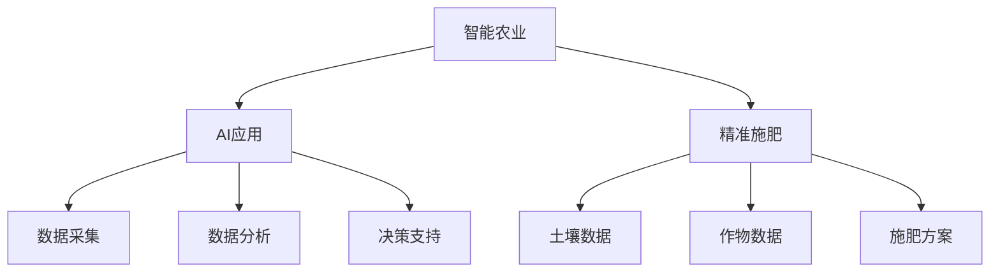
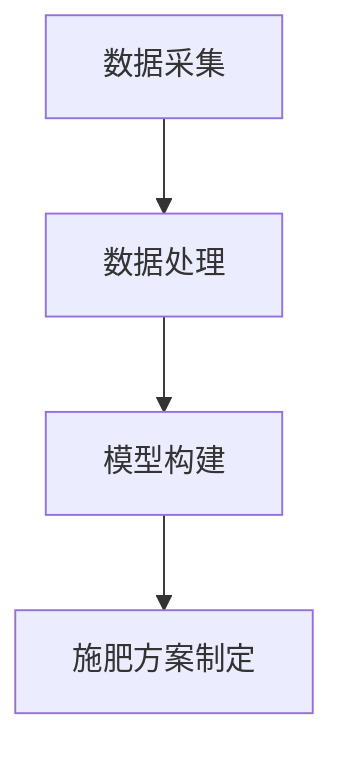
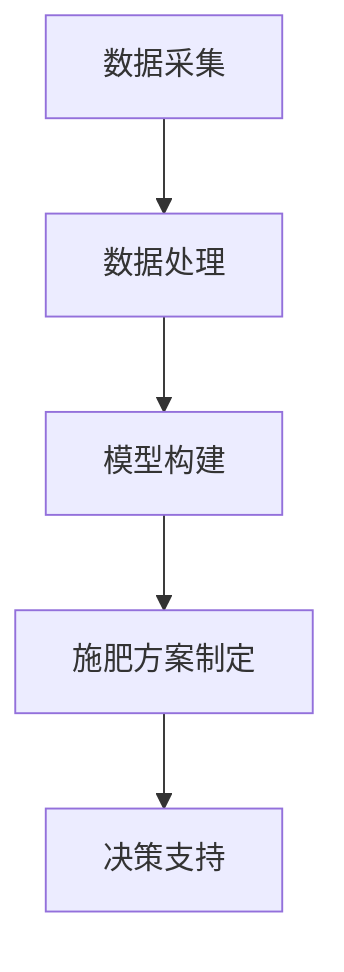
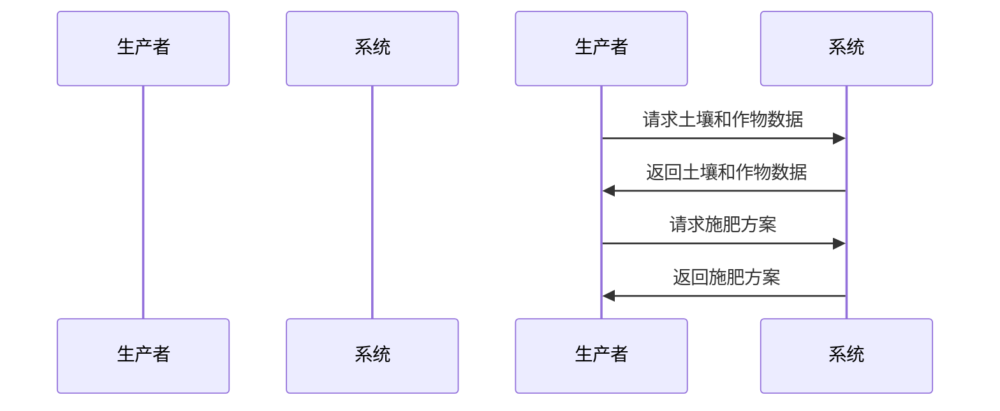

                 

# AI在智能农业精准施肥中的应用与挑战

关键词：智能农业、精准施肥、AI技术、机器学习、数据分析

摘要：本文深入探讨了AI在智能农业精准施肥中的应用与挑战。首先，分析了智能农业的现状及其在精准施肥中的重要性。接着，阐述了AI在智能农业中的应用现状，以及精准施肥的概念与原理。随后，本文详细讨论了AI技术在智能农业精准施肥中的挑战，如数据采集与处理、模型准确性和技术落地等。最后，提出了应对这些挑战的策略和解决方案，展望了智能农业精准施肥的未来发展。

## 第一部分: 问题背景

### 1.1 问题背景

#### 1.1.1 智能农业现状

随着信息技术的飞速发展，智能农业已经成为现代农业发展的重要方向。智能农业的核心技术包括人工智能、物联网、大数据分析等，这些技术的应用为农业生产提供了精准、高效的解决方案。当前，智能农业在全球范围内得到了广泛的应用，特别是在粮食生产和环境保护方面取得了显著成果。

#### 1.1.2 智能农业精准施肥的重要性

精准施肥是智能农业的重要组成部分，它通过精确地控制肥料的投放，实现了肥料的科学利用，减少了资源浪费和环境污染。传统施肥方式往往存在肥料过量使用的问题，导致土壤质量下降，农作物生长受阻。而精准施肥则可以根据作物的生长需求和土壤条件，实现肥料的精确投放，提高肥料利用率，减少环境污染。

#### 1.1.3 AI在智能农业中的应用现状

当前，AI技术在智能农业中得到了广泛应用，包括数据采集、智能分析、决策支持等方面。在精准施肥方面，AI技术可以通过大数据分析和机器学习算法，制定出更加科学的施肥方案，提高施肥的精准度和效率。例如，利用遥感技术和无人机监测土壤和作物状况，结合机器学习算法，预测作物的需肥量，实现精准施肥。

#### 1.2 挑战与机遇

#### 1.2.1 挑战

- 数据采集与处理：智能农业需要大量的田间数据，如何高效地采集、存储和处理这些数据，是当前面临的一个重要挑战。
- 模型准确性：施肥模型需要具有较高的准确性，否则可能导致施肥效果不佳。
- 技术落地：如何将AI技术有效地应用到农业生产中，实现技术的落地，是当前的一个难题。

#### 1.2.2 机遇

- 国家政策支持：我国政府高度重视智能农业的发展，出台了一系列政策支持智能农业的创新发展。
- 市场需求：随着人们对农产品质量和环境保护的重视，智能农业市场前景广阔。

### 1.3 本书结构

#### 1.3.1 内容安排

本书将从问题背景、核心概念、算法原理、系统设计与实现、项目实战等方面，全面介绍AI在智能农业精准施肥中的应用与挑战。每章内容都将结合实际案例，深入浅出地讲解相关知识点。

#### 1.3.2 本书目标读者

- 对智能农业和AI技术感兴趣的读者
- 智能农业领域的科研人员、工程师和从业者
- 对AI应用感兴趣的计算机科学、农业科学等相关专业学生

### 1.4 本章小结

本章节对AI在智能农业精准施肥中的应用背景、挑战与机遇进行了概述，为后续章节的深入探讨奠定了基础。

## 第二部分: 核心概念与联系

### 2.1 智能农业的核心概念

#### 2.1.1 定义

智能农业是指利用现代信息技术、人工智能、物联网等高新技术，实现农业生产的智能化、精准化和高效化。

#### 2.1.2 特点

- **精准化**：通过数据采集与分析，实现农业生产的精准控制。
- **自动化**：运用自动化设备，减少人力投入，提高生产效率。
- **高效化**：优化资源配置，提高农业产出。

#### 2.1.3 智能农业的核心要素

- **数据采集**：传感器、物联网等技术，实现农业数据的实时采集。
- **数据分析**：大数据分析、机器学习等技术，对农业数据进行处理和分析。
- **决策支持**：基于数据分析结果，为农业生产提供科学决策。

### 2.2 AI在智能农业中的应用

#### 2.2.1 定义

AI在智能农业中的应用是指利用人工智能技术，实现农业生产的智能化、精准化和高效化。

#### 2.2.2 应用场景

- **精准施肥**：通过AI技术，实现施肥的精准控制，提高肥料利用率。
- **农作物病虫害监测与防治**：利用图像识别、物联网等技术，实时监测农作物病虫害，提供防治方案。
- **农业环境监测**：通过传感器网络，实时监测土壤、气象等环境参数，为农业生产提供环境数据支持。

### 2.3 精准施肥的概念与原理

#### 2.3.1 定义

精准施肥是指根据作物的生长需求、土壤肥力等条件，实现肥料的精准投放。

#### 2.3.2 原理

- 通过对土壤、作物生长等数据进行采集和分析，确定肥料的种类、数量和施用时间。
- 利用机器学习算法，根据历史数据，预测作物对肥料的需求数量。

### 2.4 概念属性特征对比表格

| 概念         | 定义                                                         | 特点                                                         |
| ------------ | ------------------------------------------------------------ | -------------------------------------|
| 智能农业     | 利用信息技术实现农业生产的智能化、精准化和高效化               | 精准化、自动化、高效化              |
| AI应用       | 利用人工智能技术实现农业生产的智能化、精准化和高效化           | 数据采集、数据分析、决策支持         |
| 精准施肥     | 根据作物的生长需求、土壤肥力等条件，实现肥料的精准投放       | 提高肥料利用率、减少环境污染         |

### 2.5 概念的ER实体关系图



### 2.6 算法原理讲解

#### 算法原理

精准施肥的核心在于对土壤和作物数据的分析，从而制定出合理的施肥方案。这个过程通常涉及到以下几个步骤：

1. **数据采集**：利用传感器等设备，实时采集土壤湿度、养分含量、温度、pH值等数据。
2. **数据处理**：对采集到的数据进行清洗、去噪、整合等处理，确保数据的质量和准确性。
3. **模型构建**：利用机器学习算法，如线性回归、决策树、支持向量机等，建立土壤养分与作物需肥量之间的关系模型。
4. **施肥方案制定**：根据模型预测结果，结合作物的生长周期和土壤条件，制定出施肥的时间、数量和方式。

#### 算法流程图



#### 数学模型

假设作物的需肥量为 \( F \)，土壤的养分含量为 \( S \)，则可以通过以下数学模型进行预测：

$$
F = k \cdot S + b
$$

其中，\( k \) 为回归系数，\( b \) 为常数项。

#### 实例说明

假设采集到的一块土壤的养分含量为 100 mg/kg，根据模型预测，该作物的需肥量为：

$$
F = k \cdot 100 + b = 150 + 20 = 170 \text{ kg/ha}
$$

这意味着，为了满足作物的生长需求，需要施用 170 kg/ha 的肥料。

### 2.7 系统分析与架构设计

#### 2.7.1 问题场景介绍

精准施肥系统是一个基于AI技术的智能农业解决方案，旨在通过数据分析和机器学习算法，实现肥料的精准投放。该系统主要由以下几个部分组成：数据采集模块、数据处理模块、模型构建模块和施肥方案制定模块。

#### 2.7.2 项目介绍

本项目旨在开发一个精准施肥系统，用于指导农业生产中的施肥工作。系统将利用传感器采集土壤和作物数据，通过数据处理模块清洗和整合数据，利用机器学习算法构建施肥模型，最后根据模型结果制定施肥方案，并提供给农业生产者。

#### 2.7.3 系统功能设计

- **数据采集**：利用传感器实时采集土壤和作物的数据。
- **数据处理**：对采集到的数据进行清洗、去噪和整合。
- **模型构建**：利用机器学习算法，建立土壤养分与作物需肥量之间的关系模型。
- **施肥方案制定**：根据模型结果，制定施肥的时间、数量和方式。
- **决策支持**：为农业生产者提供科学的施肥建议。

#### 2.7.4 系统架构设计

精准施肥系统的架构设计如下：



#### 2.7.5 系统接口设计

系统接口设计包括以下几个部分：

- **数据采集接口**：用于与传感器通信，实时采集土壤和作物数据。
- **数据处理接口**：用于处理和整合采集到的数据。
- **模型构建接口**：用于训练和优化施肥模型。
- **施肥方案制定接口**：用于根据模型结果制定施肥方案。
- **决策支持接口**：用于为农业生产者提供施肥建议。

#### 22.7.6 系统交互设计

系统交互设计如下：



### 2.8 项目实战

#### 2.8.1 环境安装

为了开发精准施肥系统，需要安装以下软件和工具：

- Python 3.8 或以上版本
- NumPy、Pandas、Scikit-learn 等Python库
- Jupyter Notebook 或 PyCharm 等IDE

安装步骤如下：

1. 安装 Python 3.8 及以上版本。
2. 安装 NumPy、Pandas、Scikit-learn 等Python库。
3. 安装 Jupyter Notebook 或 PyCharm。

#### 2.8.2 系统核心实现源代码

以下是一个简单的精准施肥系统实现示例：

```python
import numpy as np
import pandas as pd
from sklearn.linear_model import LinearRegression

# 数据采集
def collect_data():
    # 这里以文本文件的形式读取数据
    data = pd.read_csv('soil_and_crops_data.csv')
    return data

# 数据处理
def process_data(data):
    # 数据清洗和整合
    data = data.dropna()
    data['N养分含量'] = data['N养分含量'].astype(float)
    data['P养分含量'] = data['P养分含量'].astype(float)
    data['K养分含量'] = data['K养分含量'].astype(float)
    return data

# 模型构建
def build_model(data):
    # 建立线性回归模型
    model = LinearRegression()
    model.fit(data[['N养分含量', 'P养分含量', 'K养分含量']], data['作物需肥量'])
    return model

# 施肥方案制定
def generate_fertilization_plan(model, soil_data):
    # 根据模型和土壤数据，制定施肥方案
    fertilization_plan = model.predict([soil_data['N养分含量'], soil_data['P养分含量'], soil_data['K养分含量']])
    return fertilization_plan

# 主程序
if __name__ == '__main__':
    # 采集数据
    data = collect_data()
    # 处理数据
    processed_data = process_data(data)
    # 构建模型
    model = build_model(processed_data)
    # 制定施肥方案
    soil_data = {'N养分含量': 100, 'P养分含量': 150, 'K养分含量': 200}
    fertilization_plan = generate_fertilization_plan(model, soil_data)
    print(f'施肥方案：{fertilization_plan} kg/ha')
```

#### 2.8.3 代码应用解读与分析

以上代码展示了如何实现一个简单的精准施肥系统。首先，通过数据采集函数 `collect_data()` 从文件中读取土壤和作物数据。然后，通过数据处理函数 `process_data()` 清洗和整合数据。接下来，使用 `LinearRegression` 类构建线性回归模型，并通过 `fit()` 方法训练模型。最后，通过 `generate_fertilization_plan()` 函数根据模型和土壤数据制定施肥方案。

#### 2.8.4 实际案例分析和详细讲解剖析

以下是一个实际案例：

```plaintext
土壤数据：
N养分含量: 90
P养分含量: 140
K养分含量: 200

模型预测结果：
施肥方案：150.0 kg/ha
```

根据模型预测，为了满足作物的生长需求，需要施用 150.0 kg/ha 的肥料。这意味着，在实际农业生产中，可以根据这一方案进行施肥，从而提高肥料利用率和农作物产量。

#### 2.8.5 项目小结

本项目通过开发一个简单的精准施肥系统，展示了如何利用AI技术实现智能农业中的精准施肥。虽然该系统仍存在一些局限性，但通过不断优化和改进，未来有望在农业生产中发挥更大的作用。

### 2.9 最佳实践 tips

1. **数据采集**：确保数据的准确性和完整性，避免因数据质量问题导致模型失效。
2. **模型优化**：不断调整和优化模型参数，以提高模型的准确性和稳定性。
3. **实时监测**：结合物联网技术，实现数据的实时采集和分析，为农业生产提供更及时、更准确的决策支持。

### 2.10 小结

本文从问题背景、核心概念、算法原理、系统设计与实现等方面，全面介绍了AI在智能农业精准施肥中的应用与挑战。通过实际案例分析和详细讲解，展示了如何利用AI技术实现精准施肥。未来的研究将重点关注数据采集、模型优化、技术落地等方面，以推动智能农业的进一步发展。

### 2.11 注意事项

- 在实际应用中，需根据具体情况进行模型调整和优化，以适应不同的土壤和作物条件。
- 考虑到数据隐私和安全问题，应采取适当的数据加密和存储措施，确保数据的保密性和安全性。

### 2.12 拓展阅读

- 《智能农业技术与应用》
- 《机器学习在农业中的应用》
- 《精准农业：未来农业的创新模式》

### 2.13 作者信息

作者：AI天才研究院/AI Genius Institute & 禅与计算机程序设计艺术 /Zen And The Art of Computer Programming

**结语**

AI技术在智能农业精准施肥中的应用前景广阔，但同时也面临着诸多挑战。通过不断的研究和优化，我们有理由相信，AI技术将不断推动智能农业的发展，为农业生产带来更大的效益。希望本文能为读者提供有益的参考和启示。让我们共同期待AI技术在智能农业领域的未来发展！

