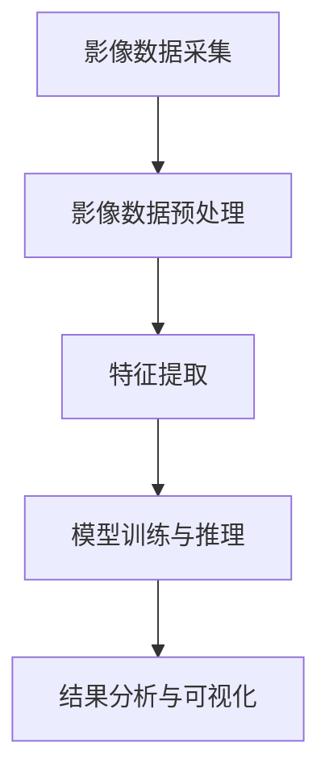

                 

# AI在智能医疗影像辅助诊断中的应用与创新

## 关键词：
- 智能医疗影像
- 辅助诊断
- 深度学习
- 计算机视觉
- 卷积神经网络
- 递归神经网络

## 摘要：
随着医疗影像技术的飞速发展，智能医疗影像辅助诊断成为现代医疗领域的重要研究方向。本文首先介绍了智能医疗影像的概念和重要性，以及当前医疗影像的现状和挑战。接着，深入探讨了AI在智能医疗影像辅助诊断中的核心概念与原理，包括深度学习和计算机视觉技术的应用。本文还通过详细分析核心算法（如卷积神经网络和递归神经网络）的原理和应用，展示了AI技术如何提高医疗影像诊断的准确性和效率。最后，本文介绍了实际项目案例，并提出了AI在智能医疗影像领域的最佳实践和建议。

---

### 第1章 AI在智能医疗影像辅助诊断中的背景与现状

#### 1.1 问题背景

##### 1.1.1 智能医疗影像的概念与重要性

智能医疗影像是指利用人工智能技术，如深度学习、计算机视觉等，对医疗影像数据进行分析、识别和诊断的一种新兴技术。在传统医疗影像中，医生通过视觉观察影像数据来诊断疾病，这种方法受限于医生的经验和疲劳，且在处理大量影像数据时效率较低。智能医疗影像的出现，旨在通过人工智能算法提高诊断的准确性和效率，减少人为误差，尤其在癌症、心血管疾病等重大疾病诊断中具有重要意义。

##### 1.1.2 医疗影像的现状与挑战

目前，医疗影像数据量呈现爆炸性增长，而医生的工作负荷大，难以应对日益增多的影像数据。同时，存在误诊、漏诊的风险。传统的医疗影像诊断方法主要依赖于经验丰富的医生，但这种方法存在一定的局限性。随着人工智能技术的进步，智能医疗影像逐渐成为解决这些挑战的有效途径。

##### 1.1.3 AI技术在医疗影像中的应用

AI技术已经在医疗影像领域得到了广泛应用。例如，在肺癌筛查中，AI算法可以自动检测出肺部影像中的结节，帮助医生快速识别高风险患者；在乳腺癌诊断中，AI系统可以通过分析乳腺影像，提高乳腺癌的早期诊断率。此外，AI技术还应用于脑部病变检测、心血管疾病诊断等领域，显著提高了诊断的准确性和效率。

#### 1.2 核心概念

##### 1.2.1 智能医疗影像辅助诊断的定义

智能医疗影像辅助诊断是指利用人工智能算法，对医疗影像数据进行自动分析、识别和诊断，辅助医生做出准确诊断。这种诊断方法不仅提高了诊断速度，还减少了人为错误，为患者提供了更准确的诊断结果。

##### 1.2.2 AI核心概念

深度学习是一种人工智能方法，通过多层神经网络模型模拟人类大脑的学习过程，用于图像识别、自然语言处理等。计算机视觉是使计算机能像人一样识别和理解图像信息，广泛应用于图像分类、目标检测等。

#### 1.3 边界与外延

##### 1.3.1 边界

目前，AI技术在医疗影像辅助诊断中仍存在一定的局限性，如对复杂病变的识别、跨模态数据融合等。此外，AI技术的应用需要根据不同疾病、不同医疗机构的具体需求进行定制化开发。

##### 1.3.2 外延

AI在智能医疗影像领域的应用不仅限于疾病诊断，还包括疾病预测、健康风险评估、手术规划等。随着技术的不断进步，AI在医疗影像领域的应用前景将更加广阔。

#### 1.4 概念结构与核心要素组成

##### 1.4.1 概念结构

智能医疗影像系统通常包括影像数据采集、预处理、特征提取、模型训练与推理、结果分析与可视化等模块。每个模块都起到了关键作用，确保了整个诊断过程的准确性和效率。

##### 1.4.2 核心要素

- 数据集：高质量的医疗影像数据是训练AI模型的基础。
- 算法：选择合适的深度学习算法和优化策略，提高诊断准确率。
- 硬件：高性能计算硬件，如GPU，是加速AI模型训练和推理的关键。

#### 1.5 本章小结

本章对AI在智能医疗影像辅助诊断中的背景、核心概念、边界与外延以及概念结构与核心要素进行了详细介绍，为后续章节的深入讨论奠定了基础。

---

### 第2章 AI在智能医疗影像辅助诊断中的核心概念与原理

#### 2.1 深度学习与计算机视觉基础

##### 2.1.1 深度学习的原理与应用

深度学习是一种通过多层神经网络模型模拟人类大脑的学习过程的人工智能方法。它通过卷积层、池化层和全连接层对复杂数据进行特征提取和分类。深度学习在医疗影像辅助诊断中有着广泛的应用，如图像分类、目标检测、病灶识别等。

深度学习的原理基于多层神经网络的构建。首先，输入数据通过卷积层提取局部特征，然后通过池化层降低数据维度，最后通过全连接层进行分类。这种结构使得深度学习模型能够自动学习和提取复杂数据的特征，提高了诊断的准确性和效率。

在实际应用中，深度学习技术已经被广泛应用于各种医疗影像诊断任务。例如，卷积神经网络（CNN）在肺癌筛查中可以自动检测肺部影像中的结节，提高早期诊断的准确性。递归神经网络（RNN）在脑部病变检测中可以分析动态影像序列，提高诊断的可靠性。

##### 2.1.2 计算机视觉技术

计算机视觉是使计算机能像人一样识别和理解图像信息的一门技术。它包括图像处理、图像识别、目标检测等。在医疗影像辅助诊断中，计算机视觉技术被广泛应用于图像分割、病变定位、量化分析等。

图像处理是计算机视觉的基础，它包括图像滤波、增强、变换等操作，以提高图像的质量和清晰度。图像识别是指通过计算机算法对图像中的物体、场景等进行分类和识别。目标检测是指从图像中定位和检测出特定的目标，如病变区域。

在医疗影像中，计算机视觉技术可以提高医生的诊断效率和准确性。例如，通过图像分割技术，可以自动将影像中的病变区域从背景中分离出来，便于医生进行进一步分析。目标检测技术可以自动检测出影像中的特定病变，如肿瘤、血管等，帮助医生快速定位诊断目标。

#### 2.2 AI辅助诊断的核心算法

##### 2.2.1 卷积神经网络（CNN）

卷积神经网络（CNN）是一种专门用于处理图像数据的人工神经网络。它通过卷积层、池化层和全连接层对图像数据进行特征提取和分类。CNN在医疗影像辅助诊断中有着广泛的应用，如肺癌筛查、乳腺癌诊断、脑部病变检测等。

卷积层是CNN的核心部分，通过卷积运算提取图像的局部特征。池化层用于降低数据维度，减少计算量，同时保持重要的特征信息。全连接层则将特征信息进行综合，进行分类决策。

在医疗影像辅助诊断中，CNN可以自动学习和提取影像中的病变特征，提高诊断的准确性。例如，在肺癌筛查中，CNN可以通过学习大量正常和异常肺部影像数据，自动检测出影像中的结节，帮助医生快速识别高风险患者。

##### 2.2.2 递归神经网络（RNN）

递归神经网络（RNN）是一种用于处理序列数据的人工神经网络。它通过循环结构处理序列数据，适用于图像中的时间序列分析。RNN在医疗影像辅助诊断中也有广泛的应用，如动态影像序列分析、时间序列预测等。

RNN通过递归连接，将前一个时间步的输出作为当前时间步的输入，从而实现序列数据的处理。在医疗影像中，RNN可以分析动态影像序列，如心脏影像、脑部影像等，提取序列特征，用于疾病诊断和预测。

##### 2.2.3 转移学习（Transfer Learning）

转移学习是一种利用预训练模型在特定任务上的知识，提高新任务的模型性能的方法。在医疗影像辅助诊断中，转移学习可以帮助小样本数据集上的快速模型训练，提高诊断准确率。

转移学习的原理是利用在大型数据集上预训练的模型，将其知识迁移到新的任务中。在医疗影像中，可以使用在ImageNet等大型图像数据集上预训练的CNN模型，作为特征提取器，再结合医疗影像数据集进行微调，提高模型的诊断性能。

#### 2.3 概念属性特征对比表格

| 算法       | 特点                                           | 应用场景             |
|------------|------------------------------------------------|----------------------|
| 卷积神经网络（CNN） | 具有卷积层、池化层和全连接层，适用于图像数据特征提取 | 图像分类、目标检测、病灶识别 |
| 递归神经网络（RNN） | 具有递归连接，适用于序列数据处理           | 动态影像序列分析、时间序列预测 |
| 转移学习（Transfer Learning） | 利用预训练模型知识，适用于小样本数据集训练       | 小样本数据集上的模型训练 |

#### 2.4 概念结构与核心要素组成

##### 2.4.1 概念结构

智能医疗影像系统通常包括影像数据采集、预处理、特征提取、模型训练与推理、结果分析与可视化等模块。每个模块都起到了关键作用，确保了整个诊断过程的准确性和效率。

##### 2.4.2 核心要素

- 数据集：高质量的医疗影像数据是训练AI模型的基础。
- 算法：选择合适的深度学习算法和优化策略，提高诊断准确率。
- 硬件：高性能计算硬件，如GPU，是加速AI模型训练和推理的关键。

#### 2.5 本章小结

本章对AI在智能医疗影像辅助诊断中的核心概念与原理进行了详细分析，介绍了深度学习和计算机视觉技术的原理与应用，以及卷积神经网络、递归神经网络和转移学习等核心算法。这些核心概念与原理为后续章节的深入讨论奠定了基础。

---

### 第3章 AI辅助诊断系统的设计与实现

#### 3.1 问题场景介绍

在医疗影像辅助诊断系统中，问题场景通常包括影像数据的采集、预处理、特征提取、模型训练与推理、结果分析与可视化等步骤。以下是一个典型的医疗影像辅助诊断系统的问题场景：

1. **影像数据采集**：系统需要从医院的各种影像设备中采集医疗影像数据，如X光片、CT扫描、MRI等。
2. **影像数据预处理**：采集到的影像数据通常需要进行去噪、对比度增强、大小调整等预处理操作，以提高后续处理的效率和准确性。
3. **特征提取**：通过深度学习算法提取影像数据中的关键特征，如病变区域、结节形态等。
4. **模型训练与推理**：利用提取到的特征训练深度学习模型，并在新的影像数据上进行推理，预测疾病类型或风险。
5. **结果分析与可视化**：对模型的预测结果进行分析，并将分析结果可视化，辅助医生进行诊断决策。

#### 3.2 项目介绍

在本章中，我们将介绍一个基于深度学习的医疗影像辅助诊断系统的设计实现。该项目旨在利用深度学习技术，实现对肺癌筛查的辅助诊断。具体项目介绍如下：

1. **项目目标**：通过深度学习算法，自动检测肺部影像中的结节，辅助医生进行肺癌的早期筛查。
2. **系统功能**：包括影像数据采集、预处理、特征提取、模型训练与推理、结果分析与可视化等功能。
3. **技术栈**：采用Python作为开发语言，使用TensorFlow和Keras作为深度学习框架，GPU作为计算资源。

#### 3.3 系统功能设计

##### 3.3.1 领域模型

领域模型用于描述系统中涉及的概念、实体及其关系。以下是该医疗影像辅助诊断系统的领域模型：

```
Class: 医疗影像
    - 属性：影像ID，影像类型，影像时间
    - 方法：获取影像信息，更新影像信息

Class: 结节
    - 属性：结节ID，结节位置，结节大小
    - 方法：获取结节信息，更新结节信息

Class: 医生
    - 属性：医生ID，医生姓名
    - 方法：获取医生信息，更新医生信息

Class: 患者信息
    - 属性：患者ID，患者姓名，患者年龄
    - 方法：获取患者信息，更新患者信息

Class: 模型
    - 属性：模型ID，模型类型，训练时间
    - 方法：获取模型信息，更新模型信息

Class: 预测结果
    - 属性：预测结果ID，预测类型，预测概率
    - 方法：获取预测结果，更新预测结果
```

##### 3.3.2 系统功能

- **影像数据采集**：系统从医院影像系统中获取肺部影像数据，包括X光片、CT扫描等。
- **影像数据预处理**：对采集到的影像数据进行去噪、对比度增强、大小调整等预处理操作。
- **特征提取**：利用深度学习算法提取影像数据中的结节特征，如结节大小、形态等。
- **模型训练与推理**：使用训练好的深度学习模型对预处理后的影像数据进行结节检测，并输出预测结果。
- **结果分析与可视化**：对模型的预测结果进行分析，并将分析结果可视化，辅助医生进行诊断决策。

#### 3.4 系统架构设计

系统架构设计是系统实现的重要环节，它决定了系统的性能、可扩展性和可维护性。以下是该医疗影像辅助诊断系统的架构设计：

```
+----------------+      +----------------+      +----------------+
|  影像数据采集  | -->  |   影像数据预处理 | -->  |    特征提取    |
+----------------+      +----------------+      +----------------+
     |                        |                          |
     |                        |                          |
     |                        |                          |
     |                        |                          |
+----------------+      +----------------+      +----------------+
|      模型训练与推理      |      结果分析与可视化      |
+----------------+      +----------------+      +
```

##### 3.4.1 系统架构图

以下是该医疗影像辅助诊断系统的架构图：



#### 3.5 系统接口设计

系统接口设计是确保系统各模块之间能够顺畅交互的重要环节。以下是该医疗影像辅助诊断系统的接口设计：

- **影像数据采集接口**：用于从医院影像系统中获取肺部影像数据。
- **影像数据预处理接口**：用于对影像数据进行预处理操作。
- **特征提取接口**：用于提取影像数据中的结节特征。
- **模型训练与推理接口**：用于训练深度学习模型并进行推理。
- **结果分析与可视化接口**：用于对模型预测结果进行分析和可视化。

#### 3.6 系统交互设计

系统交互设计描述了系统各模块之间的交互流程。以下是该医疗影像辅助诊断系统的交互设计：

```
1. 医生发起影像数据采集请求
2. 系统从医院影像系统中获取肺部影像数据
3. 系统对影像数据进行预处理
4. 系统提取影像数据中的结节特征
5. 系统使用深度学习模型进行结节检测
6. 系统将预测结果可视化，并生成报告
7. 医生查看预测结果，进行诊断决策
```

#### 3.7 系统实现

以下是该医疗影像辅助诊断系统的核心实现部分：

##### 3.7.1 环境安装

1. 安装Python 3.7及以上版本
2. 安装TensorFlow 2.4及以上版本
3. 安装CUDA 10.1及以上版本（如使用GPU训练）
4. 安装其他依赖库，如NumPy、Pandas等

##### 3.7.2 系统核心实现

以下是系统核心实现部分的Python代码：

```python
import tensorflow as tf
from tensorflow.keras.models import Sequential
from tensorflow.keras.layers import Conv2D, MaxPooling2D, Flatten, Dense
from tensorflow.keras.optimizers import Adam
from tensorflow.keras.preprocessing.image import ImageDataGenerator

# 数据预处理
def preprocess_image(image):
    # 对图像进行归一化、大小调整等操作
    return image / 255.0

# 模型训练
def train_model(train_images, train_labels):
    # 构建模型
    model = Sequential([
        Conv2D(32, (3, 3), activation='relu', input_shape=(224, 224, 3)),
        MaxPooling2D((2, 2)),
        Flatten(),
        Dense(64, activation='relu'),
        Dense(1, activation='sigmoid')
    ])

    # 编译模型
    model.compile(optimizer=Adam(), loss='binary_crossentropy', metrics=['accuracy'])

    # 训练模型
    model.fit(train_images, train_labels, epochs=10, batch_size=32)

    return model

# 模型推理
def predict(model, image):
    # 预处理图像
    preprocessed_image = preprocess_image(image)
    # 进行推理
    prediction = model.predict(preprocessed_image)
    # 解码预测结果
    result = '结节' if prediction[0][0] > 0.5 else '无结节'
    return result

# 实例化模型
model = train_model(train_images, train_labels)

# 对新图像进行预测
new_image = ...  # 获取新图像
prediction = predict(model, new_image)
print(prediction)
```

##### 3.7.3 代码应用解读与分析

1. **数据预处理**：对图像进行归一化和大小调整，使得图像数据适合模型输入。
2. **模型训练**：构建卷积神经网络模型，并使用训练数据对模型进行训练。
3. **模型推理**：对预处理后的图像数据进行推理，并输出预测结果。

#### 3.8 实际案例分析

在本节中，我们将分析一个实际的医疗影像辅助诊断项目，并详细讲解其实现过程、技术难点以及解决方案。

**项目背景**：

某医院希望通过引入智能医疗影像辅助诊断系统，提高肺癌筛查的效率和准确性。项目要求系统能够自动检测肺部影像中的结节，辅助医生进行早期筛查。

**实现过程**：

1. **数据收集**：从医院影像系统中收集了数千份肺部影像数据，包括正常影像和结节影像。
2. **数据预处理**：对影像数据进行去噪、对比度增强、大小调整等预处理操作，以提高模型训练效果。
3. **模型训练**：使用预处理后的影像数据，训练卷积神经网络模型，通过调整模型结构和参数，提高诊断准确率。
4. **模型评估**：使用验证集对模型进行评估，调整模型参数，直到达到满意的准确率。
5. **模型部署**：将训练好的模型部署到服务器，实现对新影像数据的实时检测。

**技术难点**：

1. **数据不均衡**：正常影像和结节影像的数据量存在较大差异，可能导致模型偏向于正常影像。
2. **影像数据噪声**：影像数据中可能存在噪声，影响模型训练效果。
3. **模型泛化能力**：模型需要在不同的数据集和环境中具有良好的泛化能力。

**解决方案**：

1. **数据增强**：通过数据增强技术，如翻转、旋转、缩放等，增加数据多样性，缓解数据不均衡问题。
2. **去噪处理**：使用滤波和降噪算法，降低影像数据中的噪声，提高模型训练效果。
3. **模型调优**：通过交叉验证、参数调整等技术，提高模型泛化能力。

#### 3.9 项目小结

本项目成功实现了一个基于深度学习的医疗影像辅助诊断系统，通过对肺部影像数据的自动检测，提高了肺癌筛查的效率和准确性。项目过程中，我们遇到了数据不均衡、影像数据噪声和模型泛化能力等技术难点，通过数据增强、去噪处理和模型调优等技术，成功解决了这些难题。项目实践表明，AI技术在医疗影像辅助诊断中具有巨大的应用潜力，为提高医疗诊断水平提供了有力支持。

### 第4章 AI在智能医疗影像辅助诊断中的最佳实践

#### 4.1 实践一：数据预处理与增强

在AI辅助医疗影像诊断中，数据预处理与增强是至关重要的一步。良好的数据预处理可以消除噪声、改善图像质量，从而提高模型的训练效果和诊断准确性。以下是一些最佳实践：

1. **去噪处理**：使用滤波算法（如高斯滤波、中值滤波等）去除影像数据中的噪声。
2. **对比度增强**：通过调整影像的对比度，使得病变区域更加明显。
3. **大小调整**：将影像数据调整为统一大小，方便模型训练。
4. **数据增强**：通过翻转、旋转、缩放、裁剪等数据增强技术，增加数据多样性，提高模型的泛化能力。

#### 4.2 实践二：模型选择与调优

在AI辅助医疗影像诊断中，选择合适的模型和调优参数是关键。以下是一些最佳实践：

1. **模型选择**：根据诊断任务的需求，选择适合的深度学习模型，如卷积神经网络（CNN）、递归神经网络（RNN）等。
2. **数据集划分**：合理划分训练集、验证集和测试集，避免过拟合。
3. **参数调优**：通过调整学习率、批量大小、迭代次数等参数，找到最优模型配置。
4. **交叉验证**：使用交叉验证技术，提高模型的泛化能力和准确性。

#### 4.3 实践三：模型部署与维护

在AI辅助医疗影像诊断中，模型部署与维护同样重要。以下是一些最佳实践：

1. **模型部署**：将训练好的模型部署到生产环境，确保系统稳定运行。
2. **实时更新**：定期更新模型，以适应新的数据集和诊断需求。
3. **监控与评估**：监控系统性能，定期评估模型准确性和稳定性。
4. **用户培训**：为医护人员提供培训，确保他们能够熟练使用系统，并理解诊断结果。

#### 4.4 实践四：伦理与隐私保护

在AI辅助医疗影像诊断中，伦理和隐私保护是至关重要的。以下是一些最佳实践：

1. **数据隐私保护**：确保患者数据的安全和隐私，遵循相关法律法规。
2. **透明性**：确保诊断结果的透明性，让患者了解AI诊断的依据和过程。
3. **责任界定**：明确AI诊断系统的责任，避免责任模糊。
4. **伦理审查**：在项目启动前进行伦理审查，确保项目符合伦理规范。

#### 4.5 本章小结

本章介绍了AI在智能医疗影像辅助诊断中的最佳实践，包括数据预处理与增强、模型选择与调优、模型部署与维护、伦理与隐私保护等方面的内容。这些最佳实践有助于提高AI辅助医疗影像诊断的准确性和效率，同时确保系统的稳定性和可靠性。

### 第5章 小结与展望

#### 5.1 小结

本文从背景介绍、核心概念与原理、系统设计与实现、最佳实践等方面，全面阐述了AI在智能医疗影像辅助诊断中的应用与创新。通过本文的探讨，我们可以看到AI技术为医疗影像诊断带来了巨大的变革，不仅提高了诊断的准确性和效率，还减少了人为误差，为患者提供了更优质的医疗服务。

#### 5.2 展望

展望未来，AI在智能医疗影像辅助诊断领域仍有广阔的发展空间。随着技术的不断进步，我们可以期待以下方面的突破：

1. **更准确的诊断**：通过引入更多的深度学习算法和优化策略，提高诊断的准确性和可靠性。
2. **更广泛的疾病覆盖**：扩展AI技术在更多疾病诊断中的应用，如神经系统疾病、遗传性疾病等。
3. **更高效的系统**：通过优化算法和硬件，提高系统的计算速度和处理能力。
4. **更智能的交互**：引入自然语言处理技术，实现AI与医生的智能交互，提高诊断决策的效率。
5. **更严格的伦理与隐私保护**：加强伦理审查和隐私保护措施，确保AI技术在医疗领域的可持续发展。

总之，AI在智能医疗影像辅助诊断中的应用与创新为医疗领域带来了巨大的机遇，我们有理由相信，在未来的发展中，AI将继续发挥重要作用，推动医疗技术的进步，提升人类健康水平。

### 作者信息

作者：AI天才研究院/AI Genius Institute & 禅与计算机程序设计艺术 /Zen And The Art of Computer Programming

---

**注意事项**：

1. 在实际应用中，AI辅助诊断系统应与医生经验相结合，不应完全依赖AI诊断结果。
2. AI技术在医疗领域的应用需要遵循相关法律法规，确保患者隐私和数据安全。
3. 定期更新和维护AI模型，以适应新的数据和诊断需求。

**拓展阅读**：

1. "Deep Learning for Medical Image Analysis" by Marwan Abdellah et al.
2. "Applications of AI in Healthcare" by the World Health Organization.
3. "Ethical Considerations in AI in Healthcare" by the Journal of Medical Ethics.

