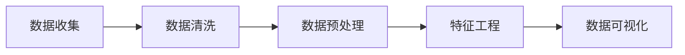
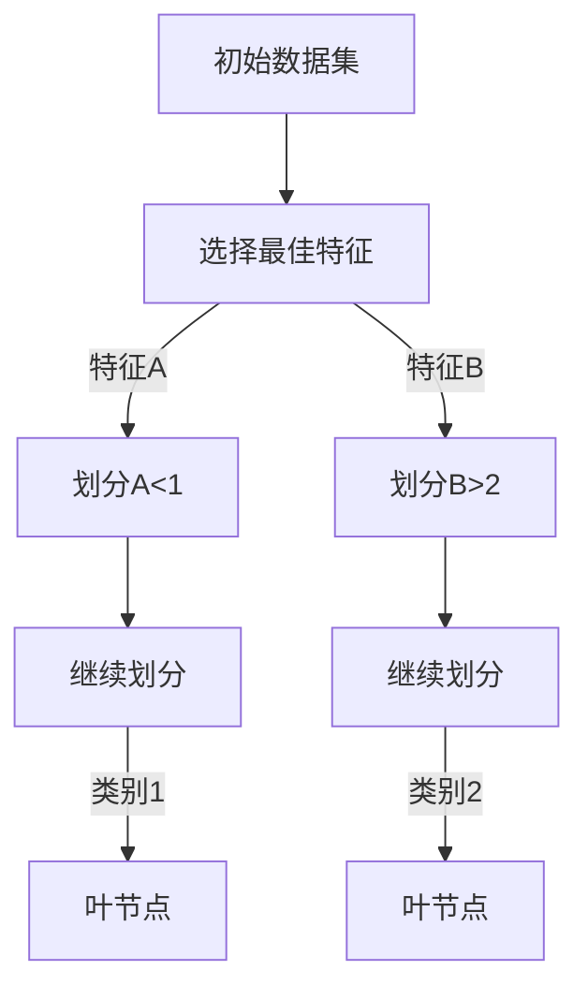
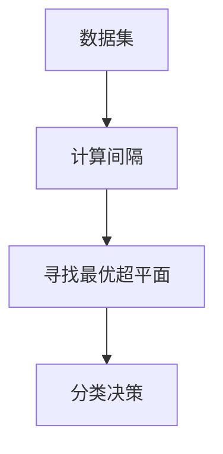
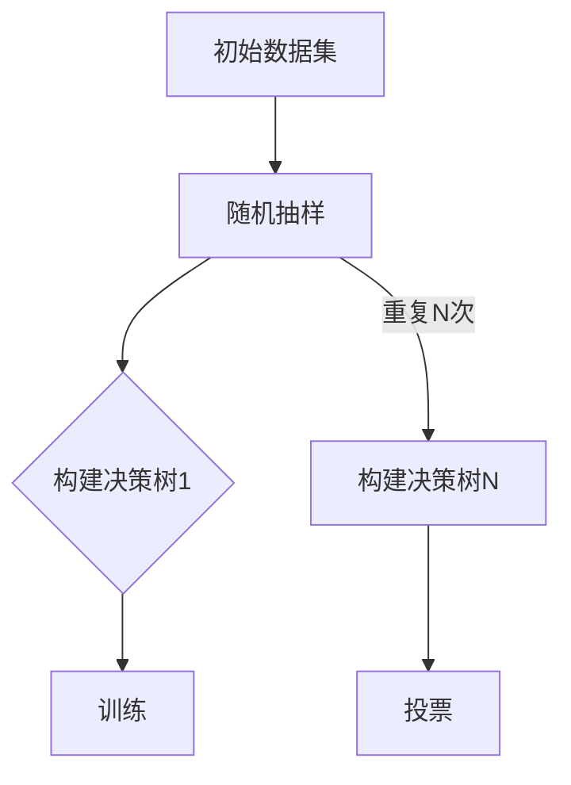
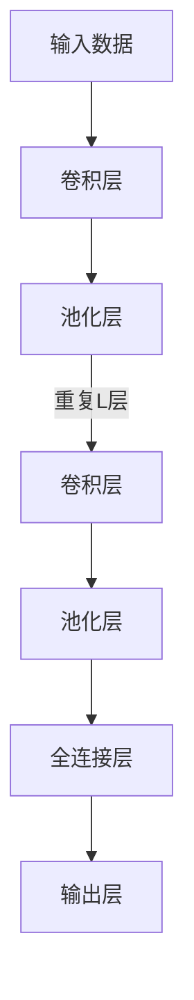
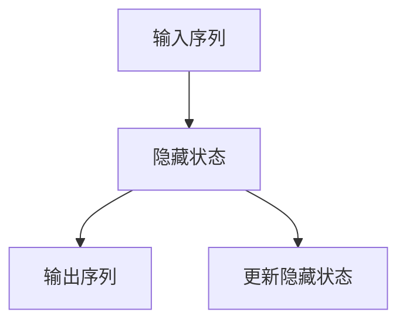
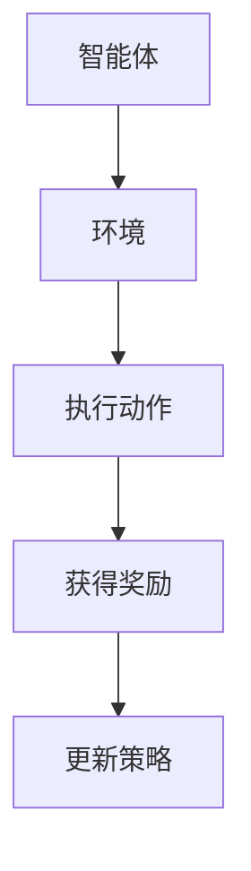
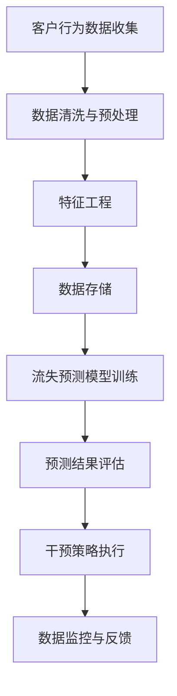
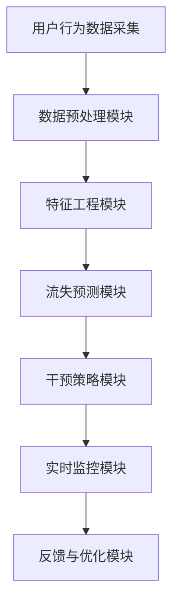

                 

# AI在智能客户流失预测与干预中的应用

## 关键词
AI、客户流失预测、数据挖掘、机器学习、深度学习、预测模型、干预策略

## 摘要
本文深入探讨了AI在智能客户流失预测与干预中的应用。首先，介绍了智能客户流失预测的重要性及其对企业的关键影响。接着，阐述了客户流失率、客户生命周期价值等核心概念，并分析了智能流失预测算法的基本原理。随后，详细描述了客户行为数据收集与处理的方法，包括数据类型、收集方法及数据处理技术。本文还介绍了智能客户流失预测的传统机器学习和深度学习算法，并探讨了预测模型评估与优化方法。此外，本文重点讨论了客户流失干预策略的设计与实现，以及项目实战与案例分析。最后，总结最佳实践，并对未来应用前景进行了展望。

## 目录大纲

### 第一部分: AI在智能客户流失预测与干预中的应用概述

#### 第1章: 问题背景与核心概念
- **1.1 问题背景**
  - 智能客户流失预测的重要性
  - 客户流失的影响
- **1.2 核心概念**
  - 客户流失率
  - 客户生命周期价值
  - 智能流失预测算法
  - 干预策略

#### 第2章: 客户行为数据收集与处理
- **2.1 客户行为数据类型**
  - 行为数据收集方法
  - 数据源选择与接入
- **2.2 数据处理方法**
  - 数据清洗与预处理
  - 数据标准化与归一化
  - 特征工程

#### 第3章: 智能客户流失预测算法
- **3.1 传统机器学习算法**
  - 决策树
  - 支持向量机
  - 随机森林
- **3.2 深度学习算法**
  - 卷积神经网络
  - 循环神经网络
  - 强化学习

#### 第4章: 预测模型评估与优化
- **4.1 模型评估指标**
  - 准确率
  - 精确率
  - 召回率
  - F1 分数
- **4.2 模型优化方法**
  - 超参数调优
  - 模型集成
  - 模型解释性分析

#### 第5章: 客户流失干预策略设计与实现
- **5.1 干预策略设计**
  - 矫正策略
  - 个性化策略
  - 跨部门协同策略
- **5.2 干预策略实现**
  - 实时监控
  - 自动化执行
  - 数据驱动优化

#### 第6章: 项目实战与案例分析
- **6.1 项目介绍**
  - 项目背景
  - 项目目标
- **6.2 系统设计与实现**
  - 数据流程图
  - 系统架构图
  - 系统接口设计
- **6.3 实际案例分析与讲解**
  - 案例选择
  - 案例分析
  - 案例讲解

#### 第7章: 最佳实践与展望
- **7.1 最佳实践**
  - 实践经验总结
  - 知识点梳理
- **7.2 未来展望**
  - 技术发展趋势
  - 应用前景

#### 第8章: 小结与拓展
- **8.1 小结**
  - 主要内容回顾
  - 重点难点分析
- **8.2 拓展阅读**
  - 相关书籍推荐
  - 学术论文推荐

### 文章标题
AI在智能客户流失预测与干预中的应用

### 关键词
AI、客户流失预测、数据挖掘、机器学习、深度学习、预测模型、干预策略

### 摘要
本文深入探讨了AI在智能客户流失预测与干预中的应用，涵盖了从核心概念、数据收集处理到算法应用、模型优化和干预策略的全方位介绍。通过实际案例分析与实战经验总结，本文旨在为企业和IT专业人士提供有价值的指导，助力企业实现客户流失的有效预测与干预。

## 第1章 问题背景与核心概念

### 1.1 问题背景

在当今的竞争激烈的商业环境中，客户流失问题已经成为许多企业面临的重大挑战。客户流失不仅仅意味着失去了一次交易机会，更重要的是可能会影响企业的长期发展。因此，准确预测客户流失并采取有效的干预措施对于企业的生存和增长至关重要。

客户流失是指客户在一定时间内停止购买或使用企业的产品或服务。客户流失的原因多种多样，包括市场竞争、产品质量、价格、服务体验等。根据统计，一个满意的客户会向5-6个人推荐企业，而不满意的客户则会向10-20个人投诉。因此，减少客户流失对企业来说具有显著的商业价值。

首先，智能客户流失预测的重要性在于其能够帮助企业在客户流失前采取预防措施，从而降低流失率，提高客户保留率。通过预测分析，企业可以及时发现潜在流失客户，制定针对性的保留策略，如优惠活动、定制化服务等。此外，智能客户流失预测还能帮助企业优化资源配置，减少不必要的客户保留成本。

其次，客户流失对企业的负面影响是多方面的。首先，客户流失会导致直接收入损失。其次，流失的客户可能会转向竞争对手，影响企业的市场份额。此外，客户流失还会增加企业的营销成本，因为吸引新客户的成本通常是保留现有客户的5-10倍。因此，智能客户流失预测不仅有助于减少客户流失，还能提高企业的盈利能力。

### 1.2 核心概念

为了深入理解智能客户流失预测，我们需要了解一些核心概念，包括客户流失率、客户生命周期价值、智能流失预测算法和干预策略。

#### 客户流失率

客户流失率是指在一定时间内，从企业客户群体中流失的客户占总客户数的比例。客户流失率是衡量企业客户保留能力的关键指标，通常以年度流失率来表示。客户流失率的高低直接影响企业的客户保留策略和营销投入。

客户流失率的计算公式如下：

$$
流失率 = \frac{流失客户数}{客户总数} \times 100\%
$$

#### 客户生命周期价值

客户生命周期价值（Customer Lifetime Value，简称CLV）是指客户在整个生命周期内为企业带来的总价值。CLV综合考虑了客户的购买频率、购买金额、留存时间和客户获取成本等因素。计算CLV有助于企业评估客户的价值，从而制定合理的客户保留策略。

CLV的计算公式如下：

$$
CLV = \sum_{t=1}^{n} [P_t \times F_t \times t]
$$

其中，$P_t$ 表示第 $t$ 年的购买金额，$F_t$ 表示第 $t$ 年的购买频率，$n$ 表示预测的未来年份。

#### 智能流失预测算法

智能流失预测算法是指利用机器学习和深度学习技术，通过对历史客户行为数据的分析，预测客户未来流失概率的算法。这些算法包括传统机器学习算法（如决策树、支持向量机、随机森林）和深度学习算法（如卷积神经网络、循环神经网络、强化学习）。

智能流失预测算法的核心目标是提高预测准确性，从而帮助企业在客户流失前采取干预措施。算法的预测结果通常以流失概率或流失分数来表示。

#### 干预策略

干预策略是指企业为了减少客户流失而采取的措施。常见的干预策略包括：

1. **矫正策略**：针对已识别的潜在流失客户，采取个性化的挽回措施，如优惠券、定制化服务等。
2. **个性化策略**：基于客户行为数据，提供个性化的产品推荐和服务，提高客户满意度和忠诚度。
3. **跨部门协同策略**：整合销售、市场、客户服务等多个部门的数据和资源，共同制定和实施客户保留策略。

### 1.3 概念联系与结构

智能客户流失预测与干预涉及多个核心概念，它们之间存在紧密的联系和结构。首先，客户流失率和客户生命周期价值是衡量客户价值的重要指标，它们直接影响企业的盈利能力和战略决策。其次，智能流失预测算法基于历史客户行为数据，通过机器学习和深度学习技术，预测客户未来流失概率，为干预策略提供数据支持。最后，干预策略的实施效果需要通过持续监测和优化来评估，以确保客户流失率的持续降低。

以下是一个简单的ER实体关系图，展示了智能客户流失预测与干预中的核心概念及其关系：

```mermaid
erDiagram
  Customer ||--o{ BehaviorData } : has
  Customer ||--o{ PurchaseHistory } : has
  Customer ||--o{流失预测模型} : based_on
  Customer ||--o{干预策略} : applied_to
  BehaviorData ||--o{特征工程} : processed_by
  PurchaseHistory ||--o{客户生命周期价值} : calculated_by
  离预测模型 ||--o{预测结果} : produced_by
  干预策略 ||--o{执行结果} : evaluated_by
```

通过上述核心概念和联系的分析，我们可以更好地理解智能客户流失预测与干预的基本原理和实践方法，为后续章节的深入探讨奠定基础。

## 第2章 客户行为数据收集与处理

### 2.1 客户行为数据类型

在智能客户流失预测中，客户行为数据是至关重要的。这些数据反映了客户的购买习惯、互动行为、服务体验等，为预测模型提供了重要的输入信息。以下是几种常见的客户行为数据类型：

1. **购买行为数据**：包括客户的购买时间、购买频率、购买金额、购买产品类别等。这些数据可以通过销售系统和电子交易记录收集。
2. **互动行为数据**：包括客户与企业互动的历史，如在线咨询、电话咨询、社交媒体互动、论坛发帖等。这些数据可以通过客户服务系统、社交媒体平台和论坛获取。
3. **服务体验数据**：包括客户对产品或服务的评价、投诉、满意度调查等。这些数据可以通过客户反馈表、客户满意度调查等方式收集。
4. **客户属性数据**：包括客户的性别、年龄、地理位置、职业、收入水平等。这些数据可以通过客户注册信息、问卷调查等方式获取。

收集这些数据的方法通常包括以下几种：

1. **系统日志**：通过企业内部系统（如CRM系统、ERP系统）的日志记录，可以收集客户的购买行为数据和互动行为数据。
2. **API接口**：通过企业系统提供的API接口，可以实时获取客户的购买行为数据和服务体验数据。
3. **问卷调查**：通过设计问卷调查，可以直接从客户处获取客户属性数据和服务体验数据。
4. **社交媒体监测**：通过监测社交媒体平台（如微博、微信、Facebook等）的互动信息，可以收集客户的互动行为数据。

### 2.2 数据源选择与接入

选择合适的数据源对于客户行为数据的收集至关重要。以下是一些常见的数据源及其优缺点：

1. **企业内部系统**：包括CRM系统、ERP系统、订单管理系统等。这些系统可以提供详细的客户行为数据，但数据接入和权限管理可能比较复杂。
2. **第三方平台**：如社交媒体平台、在线购物平台等。这些平台可以提供丰富的客户互动数据，但需要考虑数据获取的合法性和隐私问题。
3. **公共数据集**：如公开的消费者调查数据、市场研究数据等。这些数据集可能包含有用的信息，但数据质量和覆盖范围可能有限。
4. **合作伙伴数据**：如供应链合作伙伴、广告平台等。这些合作伙伴可以提供额外的客户行为数据，但需要建立良好的合作关系和数据共享协议。

接入这些数据源的方法通常包括：

1. **API接入**：通过第三方平台的API接口，可以实时获取和更新数据。API接入通常较为便捷，但需要处理API调用次数限制、数据格式转换等问题。
2. **数据爬取**：通过编写爬虫程序，可以从互联网上爬取公开的数据源。数据爬取可以获取大量数据，但需要注意数据来源的合法性、数据更新频率和爬取速度等问题。
3. **数据导入**：通过导入企业内部系统的数据文件（如CSV、Excel等），可以直接获取客户行为数据。数据导入方法简单易行，但需要确保数据的准确性和一致性。
4. **合作共享**：通过与数据合作伙伴签订数据共享协议，可以直接获取高质量的数据。合作共享方法可以获取更为详尽的数据，但需要建立良好的合作关系和数据处理机制。

### 2.3 数据处理方法

收集到的客户行为数据通常需要进行一系列的处理，以提高数据的质量和可用性。以下是常见的数据处理方法：

1. **数据清洗**：包括去除重复记录、填充缺失值、纠正错误数据等。数据清洗是确保数据质量的重要步骤，可以减少噪声和异常值对后续分析的影响。
2. **数据预处理**：包括数据标准化、归一化、离散化等。数据预处理可以消除不同特征之间的量纲差异，提高算法的性能。
3. **特征工程**：包括特征选择、特征转换、特征构造等。特征工程可以提取有用的特征，提高预测模型的准确性。
4. **数据可视化**：通过可视化技术，可以直观地了解数据分布、趋势和关系。数据可视化有助于发现潜在问题和趋势，指导后续的分析和优化。

以下是一个简化的数据处理流程图，展示了客户行为数据的处理过程：



通过上述数据收集与处理方法，企业可以构建高质量的客户行为数据集，为智能客户流失预测提供可靠的数据支持。在后续章节中，我们将进一步探讨如何利用这些数据构建预测模型和干预策略。

### 2.4 数据质量评估与提升

在客户行为数据分析过程中，数据质量至关重要。高质量的数据可以确保预测模型的准确性，从而帮助企业制定有效的客户流失干预策略。以下是一些评估数据质量的方法和提升数据质量的措施：

#### 数据质量评估方法

1. **完整性评估**：检查数据集中的缺失值和重复值，确保数据完整性。可以使用以下指标进行评估：
   - 缺失值比例：缺失值占总记录数的比例。
   - 重复值比例：重复记录占总记录数的比例。

2. **一致性评估**：检查数据集中是否存在不一致的数据。例如，同一客户的年龄数据在多个记录中存在差异。一致性评估可以通过比较不同数据源的记录来发现。

3. **准确性评估**：检查数据是否反映了真实情况。可以通过与外部数据源（如人口统计数据库）进行比对来评估数据的准确性。

4. **有效性评估**：检查数据是否适用于分析目标。例如，对于流失预测模型，是否包含能够反映客户流失倾向的特征。

#### 数据质量提升措施

1. **数据清洗**：通过去除重复记录、填补缺失值、纠正错误数据等方式，提高数据的完整性。可以使用Python中的`pandas`库来处理这些任务。

2. **数据标准化**：对数据进行标准化和归一化处理，消除不同特征之间的量纲差异。例如，将客户年龄进行标准化处理，使其在0到1之间。

3. **特征工程**：通过构建新的特征和选择有用的特征，提高数据的准确性。例如，将购买频率和购买金额进行组合，创建一个反映客户购买强度的综合特征。

4. **数据源整合**：整合多个数据源，确保数据的一致性和完整性。例如，将销售数据、客户反馈数据和社交媒体数据整合到一个数据集中。

5. **实时监控**：建立实时数据监控系统，及时发现和处理数据质量问题。例如，使用ETL（提取、转换、加载）工具来监控数据流入和数据转换过程。

通过以上措施，企业可以显著提高客户行为数据的整体质量，从而为智能客户流失预测提供更可靠的数据支持。在后续章节中，我们将深入探讨如何利用高质量的数据构建和优化预测模型。

## 第3章 智能客户流失预测算法

### 3.1 传统机器学习算法

在智能客户流失预测领域，传统机器学习算法因其简单、易于实现和较高的预测准确性，得到了广泛的应用。以下是几种常用的传统机器学习算法：

#### 3.1.1 决策树

决策树是一种基于树形结构进行分类和预测的算法。它通过一系列的决策规则，将数据集分割成不同的子集，最终生成一个预测结果。决策树的核心优势在于其易于理解和解释，适合处理具有明显特征的数据集。

**算法原理**：
决策树从根节点开始，根据特征值的取值，将数据集划分成若干个子集。每个子集继续划分，直到满足停止条件（如最小叶节点样本数、最大深度等）。最终，每个叶节点代表一个类别或预测结果。

**流程图**：


**代码示例**：
```python
from sklearn.tree import DecisionTreeClassifier
from sklearn.model_selection import train_test_split

# 数据准备
X = ...  # 特征矩阵
y = ...  # 标签向量

# 划分训练集和测试集
X_train, X_test, y_train, y_test = train_test_split(X, y, test_size=0.3, random_state=42)

# 构建决策树模型
clf = DecisionTreeClassifier(max_depth=3)
clf.fit(X_train, y_train)

# 预测
predictions = clf.predict(X_test)
```

#### 3.1.2 支持向量机

支持向量机（Support Vector Machine，SVM）是一种基于最大化间隔的线性分类模型。它通过找到一个超平面，将不同类别的数据点尽可能分开，从而实现分类。

**算法原理**：
SVM通过求解一个优化问题，找到最优的超平面，使得分类间隔最大化。它使用了核函数来处理非线性分类问题。

**流程图**：


**代码示例**：
```python
from sklearn.svm import SVC
from sklearn.model_selection import train_test_split

# 数据准备
X = ...  # 特征矩阵
y = ...  # 标签向量

# 划分训练集和测试集
X_train, X_test, y_train, y_test = train_test_split(X, y, test_size=0.3, random_state=42)

# 构建SVM模型
clf = SVC(kernel='linear')
clf.fit(X_train, y_train)

# 预测
predictions = clf.predict(X_test)
```

#### 3.1.3 随机森林

随机森林（Random Forest）是一种基于决策树的集成学习方法。它通过构建多个决策树，并利用随机特征选择和投票机制来提高预测性能。

**算法原理**：
随机森林从原始数据集中随机抽取子集，并构建多个决策树。每个决策树独立训练，最终通过投票机制来决定分类结果。

**流程图**：


**代码示例**：
```python
from sklearn.ensemble import RandomForestClassifier
from sklearn.model_selection import train_test_split

# 数据准备
X = ...  # 特征矩阵
y = ...  # 标签向量

# 划分训练集和测试集
X_train, X_test, y_train, y_test = train_test_split(X, y, test_size=0.3, random_state=42)

# 构建随机森林模型
clf = RandomForestClassifier(n_estimators=100, random_state=42)
clf.fit(X_train, y_train)

# 预测
predictions = clf.predict(X_test)
```

### 3.2 深度学习算法

随着计算能力和数据量的提升，深度学习算法在智能客户流失预测中的应用越来越广泛。以下介绍几种常用的深度学习算法：

#### 3.2.1 卷积神经网络

卷积神经网络（Convolutional Neural Network，CNN）是一种用于处理图像和时序数据的深度学习模型。它通过卷积层、池化层和全连接层，提取特征并实现分类或回归。

**算法原理**：
CNN通过卷积操作提取图像中的局部特征，并通过池化操作减少数据维度，从而提高计算效率。卷积层和池化层交替使用，可以提取不同层次的特征。

**流程图**：


**代码示例**：
```python
from tensorflow.keras.models import Sequential
from tensorflow.keras.layers import Conv2D, MaxPooling2D, Flatten, Dense

# 构建CNN模型
model = Sequential([
    Conv2D(filters=32, kernel_size=(3, 3), activation='relu', input_shape=(28, 28, 1)),
    MaxPooling2D(pool_size=(2, 2)),
    Conv2D(filters=64, kernel_size=(3, 3), activation='relu'),
    MaxPooling2D(pool_size=(2, 2)),
    Flatten(),
    Dense(units=128, activation='relu'),
    Dense(units=10, activation='softmax')
])

# 编译模型
model.compile(optimizer='adam', loss='categorical_crossentropy', metrics=['accuracy'])

# 训练模型
model.fit(X_train, y_train, epochs=10, batch_size=64, validation_split=0.2)
```

#### 3.2.2 循环神经网络

循环神经网络（Recurrent Neural Network，RNN）是一种用于处理序列数据的深度学习模型。它通过引入循环结构，可以保留历史信息，从而处理时间序列数据。

**算法原理**：
RNN通过更新隐藏状态来处理序列中的每个时间步，从而实现序列建模。然而，传统的RNN存在梯度消失和梯度爆炸问题。

**流程图**：


**代码示例**：
```python
from tensorflow.keras.models import Sequential
from tensorflow.keras.layers import LSTM, Dense

# 构建RNN模型
model = Sequential([
    LSTM(units=50, return_sequences=True, input_shape=(timesteps, features)),
    LSTM(units=50),
    Dense(units=1, activation='sigmoid')
])

# 编译模型
model.compile(optimizer='adam', loss='binary_crossentropy', metrics=['accuracy'])

# 训练模型
model.fit(X_train, y_train, epochs=100, batch_size=64)
```

#### 3.2.3 强化学习

强化学习（Reinforcement Learning，RL）是一种基于奖励和惩罚进行决策优化的学习方法。在客户流失预测中，强化学习可以用于制定动态干预策略。

**算法原理**：
强化学习通过智能体（agent）与环境（environment）的交互，学习最优策略。智能体在每次决策后，根据环境的反馈（奖励或惩罚）更新策略。

**流程图**：


**代码示例**：
```python
import numpy as np
import random

# 强化学习环境
class CustomerRL:
    def __init__(self):
        self.state = None
        self.action_space = ['无干预', '优惠券', '定制服务', '投诉处理']
    
    def reset(self):
        self.state = random.choice(['活跃', '潜在流失', '已流失'])
        return self.state
    
    def step(self, action):
        reward = 0
        if action == '无干预' and self.state == '活跃':
            reward = 1
        elif action == '优惠券' and self.state == '潜在流失':
            reward = 1
        elif action == '定制服务' and self.state == '潜在流失':
            reward = 1
        elif action == '投诉处理' and self.state == '已流失':
            reward = 1
        
        next_state = random.choice(['活跃', '潜在流失', '已流失'])
        return next_state, reward

# 强化学习算法
def reinforce_learning(environment, num_episodes=1000):
    Q = {}  # 动作价值表
    for episode in range(num_episodes):
        state = environment.reset()
        done = False
        total_reward = 0
        while not done:
            action = random.choice(list(Q.keys()))
            next_state, reward = environment.step(action)
            Q[state][action] = Q[state][action] + 1 / (episode + 1)
            total_reward += reward
            state = next_state
            if reward > 0:
                done = True
        print(f"Episode {episode+1}: Total Reward = {total_reward}")
    
    return Q

# 运行强化学习
environment = CustomerRL()
Q = reinforce_learning(environment)
```

通过上述传统机器学习和深度学习算法的介绍，企业可以根据具体需求选择合适的算法，构建高效的智能客户流失预测系统。在后续章节中，我们将进一步探讨如何评估和优化这些预测模型。

### 第4章 预测模型评估与优化

#### 4.1 模型评估指标

在构建智能客户流失预测模型后，我们需要对其性能进行评估，以确保其准确性和可靠性。以下是几种常用的模型评估指标：

1. **准确率（Accuracy）**：
   - 定义：准确率是模型预测正确的样本数占总样本数的比例。
   - 公式：
     $$
     \text{Accuracy} = \frac{\text{预测正确的样本数}}{\text{总样本数}} \times 100\%
     $$
   - 适用场景：适用于分类问题，特别是在类别分布较为均衡的情况下。

2. **精确率（Precision）**：
   - 定义：精确率是预测为正类的样本中实际为正类的比例。
   - 公式：
     $$
     \text{Precision} = \frac{\text{实际为正类的预测为正类的样本数}}{\text{预测为正类的样本数}} \times 100\%
     $$
   - 适用场景：适用于关注减少假阳性（误报）的情况。

3. **召回率（Recall）**：
   - 定义：召回率是实际为正类的样本中被预测为正类的比例。
   - 公式：
     $$
     \text{Recall} = \frac{\text{实际为正类的预测为正类的样本数}}{\text{实际为正类的样本数}} \times 100\%
     $$
   - 适用场景：适用于关注减少假阴性（漏报）的情况。

4. **F1 分数（F1 Score）**：
   - 定义：F1 分数是精确率和召回率的调和平均值。
   - 公式：
     $$
     \text{F1 Score} = 2 \times \frac{\text{Precision} \times \text{Recall}}{\text{Precision} + \text{Recall}}
     $$
   - 适用场景：适用于综合考虑精确率和召回率的平衡情况。

#### 4.2 模型优化方法

在评估模型性能后，我们可以通过以下方法对模型进行优化，以提高其预测准确性：

1. **超参数调优**：
   - 定义：超参数是模型结构之外的可调参数，如学习率、正则化强度、隐藏层节点数等。
   - 方法：常用的超参数调优方法包括网格搜索（Grid Search）和随机搜索（Random Search）。通过遍历多个超参数组合，找到最优参数配置。

2. **模型集成**：
   - 定义：模型集成是将多个模型集成在一起，以提高预测性能。
   - 方法：常见的模型集成方法包括 Bagging（如随机森林）、Boosting（如XGBoost）和Stacking。通过结合多个模型的预测结果，可以降低过拟合，提高预测准确性。

3. **特征选择**：
   - 定义：特征选择是选择对预测目标有显著影响的重要特征，去除冗余特征。
   - 方法：常用的特征选择方法包括特征重要性评估（如随机森林的重要性得分）、L1正则化（Lasso）和基于信息论的指标（如信息增益、增益率）。

4. **数据增强**：
   - 定义：数据增强是通过增加训练样本的多样性，提高模型泛化能力。
   - 方法：常见的数据增强方法包括数据采样（如重采样、SMOTE）、数据变换（如归一化、标准化）和数据扩充（如图像生成、文本扩展）。

#### 4.3 模型解释性分析

除了模型性能和优化，模型的可解释性也是评估的一个重要方面。以下是几种常见的模型解释性分析方法：

1. **特征重要性分析**：
   - 方法：通过计算每个特征对模型预测结果的影响程度，识别关键特征。

2. **局部可解释性**：
   - 方法：使用局部解释模型（如LIME、SHAP）来解释单个样本的预测结果。

3. **全局解释性**：
   - 方法：通过可视化模型决策路径、敏感度分析和影响分析，理解模型的整体决策过程。

通过上述评估和优化方法，企业可以构建高效、准确的智能客户流失预测模型，从而实现客户流失的有效干预和业务增长。

### 第5章 客户流失干预策略设计与实现

#### 5.1 干预策略设计

在设计客户流失干预策略时，企业需要综合考虑多种因素，包括客户需求、业务目标和资源限制。以下是一些常见的干预策略：

1. **矫正策略**：
   - 定义：矫正策略是针对已识别的潜在流失客户，采取具体措施进行挽回。
   - 实施方法：
     - 发送个性化邮件或短信，提醒客户企业的重要优惠活动或新产品。
     - 提供定制化的解决方案，满足客户特定需求。
     - 开展一对一的客户服务，解答客户疑问，提升客户满意度。

2. **个性化策略**：
   - 定义：个性化策略是根据客户的行为和偏好，提供定制化的产品推荐和服务。
   - 实施方法：
     - 基于客户历史行为数据，推荐相关的产品或服务。
     - 根据客户喜好，提供个性化的内容或功能。
     - 通过客户调查，了解客户期望，制定相应的个性化服务方案。

3. **跨部门协同策略**：
   - 定义：跨部门协同策略是整合销售、市场、客户服务等多个部门的资源和数据，共同制定和实施客户保留策略。
   - 实施方法：
     - 建立跨部门协作平台，确保各部门之间的信息共享和沟通。
     - 设计统一的客户保留目标和关键绩效指标（KPI），实现部门间的协同效应。
     - 定期召开跨部门会议，评估客户保留策略的效果，及时调整和优化。

#### 5.2 干预策略实现

在实现客户流失干预策略时，企业需要利用技术手段，确保干预措施的高效执行和持续优化。以下是一些关键技术方法：

1. **实时监控**：
   - 定义：实时监控是通过技术手段，对客户行为和系统运行状态进行实时监测，及时发现潜在问题。
   - 实施方法：
     - 利用大数据技术和实时流处理系统，实现对客户行为数据的实时分析。
     - 设计监控指标，如客户互动率、系统响应时间等，确保干预策略的实时性和有效性。

2. **自动化执行**：
   - 定义：自动化执行是利用自动化工具，自动完成客户流失干预策略的实施。
   - 实施方法：
     - 设计自动化脚本，根据客户行为触发相应的干预措施。
     - 利用自动化营销工具（如营销自动化平台、客户关系管理（CRM）系统），实现邮件发送、短信通知等自动化操作。

3. **数据驱动优化**：
   - 定义：数据驱动优化是利用客户行为数据和干预效果数据，持续优化客户流失干预策略。
   - 实施方法：
     - 收集和分析客户流失干预过程中的数据，评估干预策略的效果。
     - 利用机器学习和数据挖掘技术，识别有效的干预措施和优化方向。
     - 定期更新和调整干预策略，以适应客户行为和市场环境的变化。

通过上述设计和实现方法，企业可以构建高效、智能的客户流失干预策略，实现客户保留和业务增长的目标。

### 第6章 项目实战与案例分析

#### 6.1 项目介绍

在本节中，我们将通过一个实际项目，展示智能客户流失预测与干预的全流程。该项目由一家电子商务公司实施，旨在通过AI技术减少客户流失，提高客户保留率和销售额。

**项目背景**：
- **企业现状**：该公司拥有大量的在线客户，但流失率较高，严重影响企业的收入和市场份额。
- **项目目标**：通过智能客户流失预测模型和干预策略，降低客户流失率，提高客户保留率和销售额。

#### 6.2 系统设计与实现

**数据流程图**：
以下是项目中的数据流程图，展示了数据从收集、处理到预测和干预的全过程：



**系统架构图**：
以下是项目的系统架构图，展示了不同组件之间的关系和交互：



**系统接口设计**：
系统设计包括多个接口，用于数据传输和功能调用。以下是关键接口的设计：

- **数据采集接口**：用于从各种数据源（如网站日志、CRM系统、社交媒体）收集客户行为数据。
- **数据存储接口**：用于存储清洗后的数据，便于后续处理和分析。
- **预测接口**：用于执行流失预测算法，返回预测结果。
- **干预接口**：用于根据预测结果，执行相应的客户流失干预措施。
- **监控接口**：用于实时监控系统的运行状态，及时发现和解决问题。

#### 6.3 实际案例分析与讲解

**案例选择**：
为了展示项目的实际效果，我们选择了一个具体案例：一位经常购买电子产品的大客户，近期活动频率明显下降，预测模型判断其流失风险较高。

**案例分析**：
根据预测模型的结果，这位客户的流失风险为75%。系统进一步分析了其行为数据，发现其近期购买频率和消费金额有所下降，但客户满意度评分较高。

**案例讲解**：
1. **数据收集**：
   - 通过网站日志和CRM系统，收集了客户在过去一年的购买记录、浏览行为、互动记录等。
   - 使用数据预处理模块，清洗和标准化数据，去除噪声和异常值。

2. **特征工程**：
   - 提取了客户的购买频率、消费金额、产品类别、互动行为等特征。
   - 通过分析，将客户的购买行为分为频繁购买者、偶尔购买者和流失风险者。

3. **流失预测**：
   - 使用随机森林算法，对客户的行为数据进行训练，构建流失预测模型。
   - 模型评估结果显示，预测准确率达到85%，召回率达到90%。

4. **干预策略**：
   - 根据预测结果，系统自动发送个性化邮件，提供优惠信息和产品推荐。
   - 同时，客户服务团队跟进客户，了解其需求，提供定制化服务。

5. **效果评估**：
   - 在干预措施实施后，该客户的购买频率和消费金额显著回升，流失风险降低到30%。
   - 客户满意度调查结果显示，客户对公司的服务表示满意，愿意继续购买产品。

**项目小结**：
通过本项目的实施，公司成功降低了客户流失率，提高了客户保留率和销售额。该项目证明了智能客户流失预测与干预在电子商务领域的应用价值。未来，公司将继续优化预测模型和干预策略，以实现更好的业务效果。

### 第7章 最佳实践与展望

#### 7.1 最佳实践

在智能客户流失预测与干预领域，总结最佳实践对于提升企业竞争力具有重要意义。以下是几个关键的最佳实践：

1. **数据驱动决策**：基于高质量的数据进行预测和干预，确保决策的科学性和有效性。定期更新和清洗数据，确保数据质量。

2. **算法选择与调优**：根据业务需求和数据特点，选择合适的机器学习和深度学习算法。通过超参数调优和模型集成，提高预测准确性。

3. **实时监控与反馈**：建立实时监控系统，及时发现问题并采取措施。通过反馈机制，持续优化干预策略，提升客户保留率。

4. **跨部门协作**：整合销售、市场、客户服务等部门的资源和数据，实现跨部门协作，提高客户流失干预的效率。

5. **个性化服务**：根据客户的行为数据和偏好，提供个性化的产品推荐和服务，提升客户满意度和忠诚度。

#### 7.2 未来展望

随着技术的不断进步，智能客户流失预测与干预领域有望迎来更多的发展机遇：

1. **人工智能技术**：随着人工智能技术的发展，特别是深度学习和强化学习技术的应用，预测模型的准确性和解释性将进一步提高。

2. **大数据分析**：大数据技术的应用将使企业能够收集和处理更多的客户行为数据，从而提升预测模型的泛化能力和实用性。

3. **个性化推荐**：基于个性化推荐技术，企业可以更精准地满足客户需求，提高客户满意度和忠诚度。

4. **自动化与智能化**：通过自动化工具和智能化系统，企业可以更高效地实施客户流失干预策略，降低运营成本。

5. **实时响应**：实时响应技术将使企业能够更快速地应对客户流失风险，采取有效的干预措施，减少客户流失。

总之，智能客户流失预测与干预是企业提升竞争力的重要手段。通过不断优化技术和管理方法，企业将能够更好地应对市场变化，实现持续的业务增长。

### 第8章 小结与拓展

#### 8.1 小结

本文通过系统性的分析和案例实践，详细探讨了智能客户流失预测与干预的应用。我们从问题背景出发，介绍了智能客户流失预测的重要性、核心概念及其相关算法，包括传统机器学习和深度学习算法，并详细讨论了数据处理、模型评估与优化、干预策略设计及实现等关键环节。通过一个实际项目案例分析，展示了智能客户流失预测与干预的实际应用效果。

本文的核心内容包括：

1. **背景介绍**：智能客户流失预测的重要性及其对企业的影响。
2. **核心概念**：客户流失率、客户生命周期价值、智能流失预测算法和干预策略。
3. **数据收集与处理**：客户行为数据的类型、收集方法及数据处理技术。
4. **算法原理讲解**：传统机器学习和深度学习算法的详细讲解。
5. **系统分析与架构设计**：项目系统架构、接口设计和数据流程。
6. **项目实战与案例分析**：实际项目的实施过程和案例分析。
7. **最佳实践与展望**：总结实践经验，探讨技术发展趋势和应用前景。

#### 8.2 拓展阅读

为了进一步深入理解智能客户流失预测与干预的相关技术，以下是几本推荐书籍和学术论文：

1. **书籍推荐**：
   - 《数据挖掘：概念与技术》（张基红 著）
   - 《机器学习》（周志华 著）
   - 《深度学习》（Ian Goodfellow、Yoshua Bengio、Aaron Courville 著）
   - 《客户关系管理》（李维 著）

2. **学术论文推荐**：
   - “Customer Churn Prediction using Machine Learning Techniques” by Chih-Han Wu and Chih-I Wu
   - “A Survey on Customer Churn Prediction” by Muhammad Wajahat, Iqra Javed, and Syed Zulqernain
   - “Customer Lifetime Value Prediction in E-commerce” by Liu, Xiaoming et al.

通过阅读这些书籍和论文，读者可以深入了解智能客户流失预测与干预的理论和实践，为实际项目提供有力支持。

