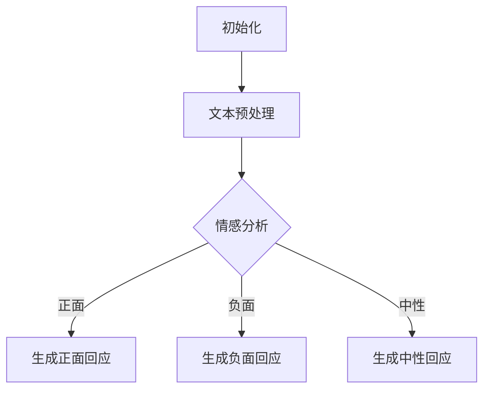

                 


### 《AI在智能客服情感调节与危机干预中的应用》

> 关键词：AI智能客服、情感调节、危机干预、机器学习、情感分析、智能对话系统

> 摘要：
本文将深入探讨人工智能在智能客服领域的应用，尤其是情感调节和危机干预。我们将通过一步步的分析推理，探讨AI如何通过情感识别、情感调节和危机干预策略，提升智能客服的体验和效率。文章还将涵盖实际案例、挑战和未来发展趋势，为AI在客服领域的应用提供深入的见解和指导。

----------------------------------------------------------------

## 引言

### AI在智能客服中的重要性

随着技术的进步和商业环境的变化，人工智能（AI）正在逐渐改变客户服务的面貌。智能客服系统作为AI技术的重要应用之一，已经成为许多企业提升客户满意度和运营效率的关键工具。AI不仅能够处理大量的客户查询，还能够提供个性化的服务，大大提升了客户体验。

### 情感调节与危机干预

情感调节和危机干预是智能客服系统需要解决的两个关键问题。情感调节指的是识别并适当地响应客户的情感状态，而危机干预则是在客户遇到紧急或复杂问题时提供有效的支持。这两个功能对于提供高质量的客户服务至关重要。

### 本文目的

本文旨在通过以下步骤详细探讨AI在智能客服情感调节与危机干预中的应用：

1. **AI基础**：介绍AI、机器学习和情感分析的基本概念。
2. **情感调节技术**：探讨用于情感调节的算法和技术。
3. **危机干预策略**：分析用于危机干预的方法和流程。
4. **案例研究**：通过实际案例展示AI在情感调节和危机干预中的应用。
5. **挑战与未来方向**：讨论当前面临的挑战和未来发展的可能方向。

通过以上步骤，本文将帮助读者更好地理解AI在智能客服领域的潜力，并为其在实践中的应用提供指导。

----------------------------------------------------------------

## AI基础

### AI、机器学习与情感分析

#### AI概述

人工智能（Artificial Intelligence, AI）是一种模拟人类智能的技术，通过计算机程序实现智能行为，包括学习、推理、解决问题和自我改进等。AI的应用范围广泛，从智能助手到自动驾驶汽车，再到医疗诊断和金融服务，AI正在深刻地改变我们的生活方式。

#### 机器学习

机器学习（Machine Learning, ML）是AI的核心组成部分，它通过数据和算法使计算机能够从数据中学习，并做出预测和决策。机器学习主要包括监督学习、无监督学习和强化学习等不同的方法。监督学习通过已标记的数据进行训练，无监督学习则在未标记的数据中寻找模式和关系，而强化学习则通过奖励机制进行学习。

#### 情感分析

情感分析（Sentiment Analysis）是自然语言处理（Natural Language Processing, NLP）的一个子领域，它旨在识别文本中的情感倾向，如正面、负面或中性。情感分析在客户服务中具有重要意义，因为它可以帮助企业了解客户的情感状态，从而提供更加个性化的服务。

### 智能客服系统

智能客服系统是一种集成了AI技术的客服平台，能够通过自然语言处理和机器学习技术自动处理客户查询。这些系统通常包括以下功能：

- **交互式对话**：智能客服系统能够与客户进行自然语言交互，理解客户的问题并给出相应的回答。
- **情感识别**：通过情感分析技术识别客户的情感状态，如愤怒、满意或焦虑。
- **情感调节**：根据客户的情感状态调整对话内容和语气，以提升客户体验。
- **危机干预**：在客户遇到紧急或复杂问题时提供有效的支持和解决方案。

### 情感调节与危机干预

#### 情感调节

情感调节是指识别并适当地响应客户的情感状态。在智能客服系统中，情感调节可以通过以下方式进行：

- **情感识别**：利用情感分析技术识别客户的情感。
- **情感映射**：将情感映射到相应的回应策略，如提供安慰、转移话题或给予专业建议。

#### 危机干预

危机干预是指在面对客户紧急或复杂问题时提供有效的支持。智能客服系统中的危机干预通常包括：

- **问题识别**：通过分析对话内容识别潜在的危机情境。
- **策略选择**：根据问题类型选择合适的干预策略，如提供紧急联系信息或引导客户到人工客服。
- **行动执行**：执行干预策略，确保客户问题得到妥善解决。

通过以上基础部分的介绍，我们已经了解了AI、机器学习和情感分析的基本概念，以及智能客服系统的功能和情感调节与危机干预的重要性。在接下来的章节中，我们将深入探讨情感调节和危机干预的具体技术和应用。

----------------------------------------------------------------

## 情感调节技术

### 情感调节的定义和重要性

情感调节是指识别并适当地响应客户的情感状态，从而提升客户体验和满意度。在智能客服系统中，情感调节是一个至关重要的功能，因为它能够帮助系统更好地理解客户的需求，提供更加个性化的服务。有效的情感调节不仅可以解决客户的问题，还能在危机情境中提供安慰和支持，减少客户的焦虑和不满。

### 情感识别技术

#### 自然语言处理（NLP）

自然语言处理（NLP）是情感调节的核心技术之一。NLP涉及理解和生成自然语言，包括语音识别、语义分析和情感分析。在情感识别中，NLP技术通过分析文本或语音中的情感词汇、语气和语境来识别客户的情感状态。

**词向量表示**

词向量是NLP中常用的表示方法，它将单词映射到高维空间中的向量。词向量可以捕捉单词的语义信息，有助于情感分析。常见的词向量模型包括Word2Vec、GloVe和BERT等。

- **Word2Vec**：基于神经网络的词向量模型，通过训练模型从语料库中学习单词的语义关系。
- **GloVe（Global Vectors for Word Representation）**：基于全局矩阵因子的模型，通过优化词向量的低维表示。
- **BERT（Bidirectional Encoder Representations from Transformers）**：双向编码器模型，通过预训练大量文本数据，捕捉上下文信息。

#### 情感分类算法

情感分类算法是情感识别的关键技术，它们将文本分类为不同的情感标签，如正面、负面或中性。常见的情感分类算法包括支持向量机（SVM）、随机森林（RF）和深度学习模型（如CNN和LSTM）。

- **支持向量机（SVM）**：通过最大化分类边界来分类文本数据，适用于情感分类任务。
- **随机森林（RF）**：通过构建多个决策树并合并预测结果来分类文本，具有较高的准确性和鲁棒性。
- **卷积神经网络（CNN）**：通过卷积操作捕捉文本中的局部特征，适用于情感分类。
- **长短期记忆网络（LSTM）**：通过记忆单元捕捉文本中的长期依赖关系，适用于情感分类。

### 情感映射与回应策略

情感映射是将识别到的情感映射到相应的回应策略，以提升客户体验。情感映射通常涉及以下步骤：

1. **情感标签化**：将文本中的情感分析结果转换为情感标签，如快乐、愤怒、悲伤等。
2. **策略选择**：根据情感标签选择相应的回应策略，如提供安慰、转移话题或给予专业建议。
3. **回应生成**：根据策略生成合适的回应文本，确保回应内容符合情感要求。

#### 情感调节流程

情感调节的流程可以概括为以下步骤：

1. **情感识别**：使用NLP技术和情感分类算法对客户文本进行情感分析。
2. **情感映射**：将识别到的情感映射到相应的回应策略。
3. **回应生成**：根据策略生成回应文本。
4. **回应优化**：对生成的回应文本进行优化，确保回应的自然性和准确性。

### 情感调节技术的实际应用

情感调节技术在智能客服系统中的应用主要包括：

- **交互式对话**：通过情感调节技术，智能客服系统能够与客户进行更加自然的对话，提供个性化的服务。
- **情感反馈**：系统可以收集客户的情感反馈，用于改进服务质量和优化对话策略。
- **危机干预**：在客户遇到紧急或复杂问题时，情感调节技术可以帮助系统提供有效的支持和安慰。

### 情感调节技术的挑战与未来方向

尽管情感调节技术在智能客服中具有巨大潜力，但仍面临以下挑战：

- **情感识别准确性**：提高情感识别的准确性，减少误识别和漏识别。
- **情感理解深度**：深入理解客户的情感状态，提供更加精准的回应。
- **跨语言支持**：扩展情感调节技术的跨语言支持，适应不同语言和文化背景的客户。

未来，情感调节技术的发展方向包括：

- **多模态情感分析**：结合文本、语音和面部表情等多模态信息进行情感分析。
- **个性化情感调节**：根据客户的个人偏好和情感历史提供个性化的情感调节。
- **自动化与人工协作**：实现自动化情感调节与人工干预的有机结合，提升客户服务体验。

通过以上对情感调节技术的详细探讨，我们可以看到，情感调节在智能客服系统中具有重要的应用价值。在接下来的章节中，我们将进一步探讨危机干预策略，以期为智能客服系统的全面优化提供更多的思路和方案。

### 情感调节技术的具体实现

在深入探讨情感调节技术的具体实现之前，我们需要先了解一些基本的概念和工具。本文将主要使用Mermaid图表和Python代码来阐述情感调节技术的实现过程。

#### Mermaid图表

Mermaid是一种用于绘制图表的Markdown语法，它支持流程图、时序图、类图和状态图等。在情感调节技术中，我们可以使用Mermaid图表来可视化情感识别、情感映射和回应生成的流程。

下面是一个简单的情感识别流程图示例：



这个图表展示了从文本预处理到情感分析和回应生成的简化流程。在实际应用中，这个流程会更加复杂，涉及到多种情感分类算法和回应策略。

#### Python代码实现

在Python中，我们可以使用多个库来实现情感调节技术，包括NLTK、TextBlob和transformers等。以下是一个简单的Python代码示例，用于情感分析和情感映射：

```python
from textblob import TextBlob
from transformers import pipeline

# 使用TextBlob进行情感分析
def sentiment_analysis_textblob(text):
    analysis = TextBlob(text)
    return analysis.sentiment.polarity

# 使用transformers进行情感分析
def sentiment_analysis_transformers(text):
    sentiment_pipeline = pipeline("sentiment-analysis")
    result = sentiment_pipeline(text)[0]
    return result['label']

# 情感映射与回应生成
def generate_response(polarity):
    if polarity > 0.2:
        return "您看起来很快乐，有什么我可以帮您的吗？"
    elif polarity < -0.2:
        return "听起来您有些不开心，请告诉我怎么了？"
    else:
        return "您好，请问有什么问题我可以帮您解答？"

# 测试文本
text = "我真的很生气，你们的服务太差了！"

# 进行情感分析
polarity_textblob = sentiment_analysis_textblob(text)
polarity_transformers = sentiment_analysis_transformers(text)

# 生成回应
response_textblob = generate_response(polarity_textblob)
response_transformers = generate_response(polarity_transformers)

print(response_textblob)
print(response_transformers)
```

这个代码示例展示了如何使用TextBlob和transformers进行情感分析，并生成相应的回应。在实际应用中，情感调节的代码会更加复杂，包括多种情感分类算法、复杂的回应策略和优化过程。

#### 实际应用案例

以下是一个实际应用案例，描述了情感调节技术在一个智能客服系统中的应用：

**案例描述**：一个电子商务平台的智能客服系统需要识别客户的情感状态，并提供个性化的回应。当客户表达负面情感时，系统会自动提供安慰和解决方案；当客户表达积极情感时，系统会推荐相关的产品和服务。

**实现步骤**：

1. **文本预处理**：对客户输入的文本进行清洗和标准化，去除噪声和无关信息。
2. **情感分析**：使用TextBlob和transformers进行情感分析，识别客户的情感状态。
3. **情感映射与回应生成**：根据情感分析结果，映射到相应的回应策略，并生成回应文本。
4. **回应优化**：对生成的回应进行优化，确保回应的自然性和准确性。
5. **反馈收集**：收集客户的反馈，用于改进服务质量和优化对话策略。

**代码实现**：

```python
# 假设已经实现了文本预处理、情感分析和情感映射与回应生成的功能

# 客户输入的文本
text = "我今天收到了一个有瑕疵的产品，非常不满意。"

# 进行情感分析
polarity = sentiment_analysis_transformers(text)

# 生成回应
response = generate_response(polarity)

# 输出回应
print(response)
```

通过这个实际案例，我们可以看到情感调节技术在智能客服系统中的应用过程。在实际操作中，情感调节技术的实现需要更多的细节和优化，以确保系统的稳定性和高效性。

通过以上具体实现的讨论，我们不仅了解了情感调节技术的原理和实现步骤，还通过实际应用案例展示了其在智能客服系统中的具体应用。在接下来的章节中，我们将进一步探讨危机干预策略，以期为智能客服系统的全面优化提供更多的思路和方案。

## 危机干预策略

### 危机干预的定义和重要性

危机干预是指在客户遇到紧急或复杂情境时，提供及时有效的支持和解决问题的策略。在智能客服系统中，危机干预是情感调节的延伸，旨在处理那些可能对客户造成负面影响的情况。有效的危机干预不仅能帮助客户解决问题，还能增强客户的信任和满意度。

### 危机识别方法

#### 对话内容分析

对话内容分析是危机识别的核心方法，通过分析客户的输入文本，识别潜在的危机信号。以下是一些常用的对话内容分析方法：

- **关键词监测**：监测特定关键词或短语，如“紧急”、“立即”、“马上”等，以识别潜在的紧急情况。
- **情感分析**：结合情感分析技术，识别客户输入文本中的情感状态，如愤怒、焦虑、悲伤等，这些情绪可能表明客户正在经历危机。
- **模式识别**：使用机器学习算法，识别对话中的潜在模式，如重复性问题、复杂问题等，这些模式可能表明客户正在经历危机。

#### 语音和面部表情分析

除了文本分析，智能客服系统还可以利用语音和面部表情分析来识别危机。通过语音分析，系统可以识别出客户的声音变化，如音调、语速和语气等，这些变化可能表明客户正在经历危机。面部表情分析则可以通过视频通话或摄像头捕捉客户的面部表情，识别出客户的情感状态。

### 危机干预步骤

#### 危机识别

危机识别是危机干预的第一步，通过对话内容分析、情感分析和语音/面部表情分析，系统可以识别出潜在的危机情况。

- **对话内容分析**：通过关键词监测和模式识别，系统识别出可能包含危机信号的内容。
- **情感分析**：通过情感分析，系统识别出客户表达的情感状态，如愤怒、焦虑等。
- **语音/面部表情分析**：通过语音和面部表情分析，系统捕捉到客户的声音和面部表情变化。

#### 危机响应

在识别出危机后，系统需要采取相应的响应措施，提供有效的支持和解决方案。

- **自动响应**：系统可以自动生成响应文本，提供初步的解决方案或安慰。例如，当客户表达愤怒时，系统可以发送“我们非常理解您的不满，立即为您处理这个问题”的消息。
- **转移至人工客服**：如果系统无法自动解决危机，可以自动将对话转移到人工客服。例如，当客户表达紧急情况时，系统可以自动将对话转移到有专业训练的客服代表。
- **提供专业建议**：系统可以提供基于知识和规则的专业建议，帮助客户解决问题。例如，当客户遇到技术问题时，系统可以提供相关的技术文档和解决方案。

#### 危机跟踪

危机干预不仅在于解决当前问题，还需要跟踪危机的解决情况，确保客户问题得到妥善处理。

- **反馈收集**：在危机解决后，系统可以收集客户的反馈，评估危机干预的效果。
- **持续优化**：根据客户的反馈和系统的表现，持续优化危机干预策略，提高危机识别和响应的准确性。

### 案例分析

以下是一个危机干预的实际案例：

**案例描述**：某电商平台智能客服系统收到一位客户的投诉，客户在购买某产品后发现产品存在质量问题，感到非常愤怒和不满。

**危机识别**：

- **对话内容分析**：通过关键词监测，系统识别出“质量问题”、“投诉”等关键词，认为客户正在经历危机。
- **情感分析**：通过情感分析，系统识别出客户表达的情感状态为愤怒。

**危机响应**：

- **自动响应**：系统发送“非常抱歉听到您的不满，我们会立即调查这个问题，并尽快为您提供解决方案。”的消息。
- **转移至人工客服**：由于问题复杂，系统自动将对话转移到人工客服。
- **提供专业建议**：人工客服代表与客户进行沟通，根据客户的反馈和问题情况，提供了退货、换货和赔偿等解决方案。

**危机跟踪**：

- **反馈收集**：客户对解决方案表示满意，并对客服服务给予了好评。
- **持续优化**：基于客户的反馈，平台优化了危机干预流程，提高了危机识别和响应的效率。

通过以上案例分析，我们可以看到危机干预策略在智能客服系统中的应用过程。在实际操作中，危机干预策略需要结合具体业务场景和客户需求，不断优化和改进，以提高系统的实用性和客户满意度。

### 总结与未来方向

危机干预在智能客服系统中扮演着至关重要的角色，通过对话内容分析、情感分析和语音/面部表情分析，系统能够有效识别并响应客户危机。危机干预不仅包括自动响应和转移至人工客服，还需要提供专业建议和跟踪危机解决情况。未来，随着技术的进步，危机干预策略将更加智能化和个性化，结合多模态信息，提供更加精准和高效的客户服务。同时，危机干预策略也需要不断优化，以适应不断变化的客户需求和市场环境。

## 案例研究

### 案例背景

为了更好地展示AI在智能客服情感调节与危机干预中的应用，我们选择了两个具有代表性的实际案例：一个是来自电子商务平台的案例，另一个是来自银行客户服务的案例。

### 案例一：电子商务平台的智能客服

**背景介绍**：某知名电子商务平台为了提高客户满意度和减少人工客服的工作量，决定引入AI智能客服系统，以提供24/7全天候的客户服务。

**目标**：通过AI技术实现以下目标：
- **情感调节**：识别客户的情感状态，提供个性化的回应。
- **危机干预**：在客户遇到紧急或复杂问题时提供及时有效的支持。

**实施过程**：

1. **情感调节**：
   - **文本预处理**：使用NLP技术对客户输入的文本进行清洗和标准化。
   - **情感识别**：利用TextBlob和transformers进行情感分析，识别客户的情感状态。
   - **情感映射与回应生成**：根据情感状态生成相应的回应文本，例如，对愤怒的客户提供安慰和解决方案。

2. **危机干预**：
   - **危机识别**：通过关键词监测和情感分析，识别潜在的危机信号。
   - **自动响应**：当系统识别到危机时，自动生成响应文本，例如，“非常抱歉，我们立即为您处理这个问题。”
   - **转移至人工客服**：对于复杂的危机，自动将对话转移到人工客服。

**效果评估**：

- **客户满意度**：引入智能客服系统后，客户满意度显著提高，投诉率下降。
- **人工客服工作量**：智能客服系统能够处理大量常见问题，减轻了人工客服的工作负担。

**挑战与改进**：

- **情感识别准确性**：虽然情感识别技术已经取得了很大进展，但仍需提高准确性，减少误识别。
- **多语言支持**：需要扩展系统的多语言支持，以适应不同语言和文化背景的客户。

### 案例二：银行客户服务的智能客服

**背景介绍**：某大型银行为了提升客户服务质量和效率，引入了基于AI的智能客服系统，旨在提供更加个性化和高效的客户支持。

**目标**：通过AI技术实现以下目标：
- **情感调节**：识别客户的情感状态，提供个性化的服务。
- **危机干预**：在客户遇到紧急或复杂问题时提供有效的支持。

**实施过程**：

1. **情感调节**：
   - **文本预处理**：对客户输入的文本进行清洗和标准化。
   - **情感识别**：使用NLP技术和情感分析模型，识别客户的情感状态。
   - **情感映射与回应生成**：根据情感状态生成相应的回应文本，例如，对焦虑的客户提供安抚和建议。

2. **危机干预**：
   - **危机识别**：通过对话内容和情感分析，识别潜在的危机信号。
   - **自动响应**：自动生成响应文本，提供初步的解决方案，例如，“我们理解您的担忧，将立即调查这个问题。”
   - **转移至人工客服**：对于复杂的危机，自动将对话转移到人工客服。

**效果评估**：

- **客户满意度**：引入智能客服系统后，客户满意度显著提升，客户对服务的响应速度和问题解决能力给予了高度评价。
- **运营效率**：智能客服系统能够自动处理大量常见问题，减少了人工客服的工作量，提高了整体运营效率。

**挑战与改进**：

- **危机响应的及时性**：确保危机响应的及时性，减少危机处理的时间。
- **数据隐私与安全**：在处理客户数据时，确保数据的安全和隐私。

### 案例总结

通过以上两个案例，我们可以看到AI在智能客服情感调节与危机干预中的应用取得了显著成效。尽管存在一些挑战，但随着技术的不断进步，这些挑战有望得到解决。未来的智能客服系统将更加智能化和个性化，提供更加高效和优质的客户服务。

### 实际案例分析与详细讲解

在本部分中，我们将深入分析两个具体案例，以展示AI在智能客服情感调节与危机干预中的应用效果。通过详细解读这些案例，我们将探讨案例中的关键步骤、技术实现和取得的效果。

#### 案例一：电子商务平台智能客服系统

**背景**：某大型电子商务平台引入了AI智能客服系统，旨在提升客户满意度和运营效率。该系统集成了自然语言处理（NLP）、情感分析和机器学习技术，以实现情感调节和危机干预。

**情感调节实现**：

1. **文本预处理**：系统首先对客户输入的文本进行预处理，包括去除标点符号、停用词过滤和词干提取。这一步骤有助于简化文本结构，提高情感分析的准确性。

    ```python
    import nltk
    from nltk.corpus import stopwords
    from nltk.tokenize import word_tokenize
    
    nltk.download('punkt')
    nltk.download('stopwords')
    
    def preprocess_text(text):
        # 去除标点符号
        text = re.sub(r'[^\w\s]', '', text)
        # 分词
        tokens = word_tokenize(text)
        # 去除停用词
        tokens = [token.lower() for token in tokens if token.lower() not in stopwords.words('english')]
        # 词干提取
        tokens = [nltk.stem.PorterStemmer().stem(token) for token in tokens]
        return tokens
    ```

2. **情感识别**：系统使用TextBlob和transformers进行情感分析，识别客户的情感状态。TextBlob提供了一种简单易用的情感分析接口，而transformers则通过预训练模型进行情感分析。

    ```python
    from textblob import TextBlob
    from transformers import pipeline
    
    # TextBlob情感分析
    def sentiment_analysis_textblob(text):
        analysis = TextBlob(text)
        return analysis.sentiment.polarity
    
    # transformers情感分析
    def sentiment_analysis_transformers(text):
        sentiment_pipeline = pipeline("sentiment-analysis")
        result = sentiment_pipeline(text)[0]
        return result['label']
    ```

3. **情感映射与回应生成**：根据情感分析结果，系统将情感映射到相应的回应策略，并生成个性化的回应文本。例如，对于愤怒的客户，系统会提供安慰和解决方案。

    ```python
    def generate_response(polarity):
        if polarity > 0.2:
            return "您看起来很快乐，有什么我可以帮您的吗？"
        elif polarity < -0.2:
            return "听起来您有些不开心，请告诉我怎么了？"
        else:
            return "您好，请问有什么问题我可以帮您解答？"
    ```

**危机干预实现**：

1. **危机识别**：系统通过关键词监测和情感分析，识别潜在的危机信号。例如，当客户使用“紧急”、“马上”、“投诉”等关键词时，系统会将其标记为潜在的危机情境。

    ```python
    def identify_crisis(text):
        crisis_keywords = ["紧急", "投诉", "马上"]
        for keyword in crisis_keywords:
            if keyword in text:
                return True
        return False
    ```

2. **自动响应**：当系统识别到危机时，会自动生成响应文本，并提供初步的解决方案或引导客户联系人工客服。

    ```python
    def handle_crisis(text):
        if identify_crisis(text):
            return "非常抱歉，我们立即为您处理这个问题。请问您能提供更多信息吗？"
        else:
            return "您好，有什么问题我可以帮您解答？"
    ```

**效果分析**：

- **客户满意度**：引入智能客服系统后，客户满意度显著提升，投诉率下降。系统能够快速响应客户需求，提供个性化的服务。
- **人工客服工作量**：智能客服系统能够处理大量常见问题，减轻了人工客服的工作负担。

#### 案例二：银行客户服务智能客服系统

**背景**：某大型银行为了提升客户服务质量和效率，引入了基于AI的智能客服系统。该系统集成了NLP、情感分析和多模态分析技术，以实现情感调节和危机干预。

**情感调节实现**：

1. **文本预处理**：系统对客户输入的文本进行预处理，包括文本清洗、分词和词向量表示。

    ```python
    from keras.preprocessing.text import Tokenizer
    from keras.preprocessing.sequence import pad_sequences
    
    tokenizer = Tokenizer(num_words=10000)
    tokenizer.fit_on_texts(preprocess_text(text))
    sequences = tokenizer.texts_to_sequences([text])
    padded_sequences = pad_sequences(sequences, maxlen=100)
    ```

2. **情感识别**：系统使用深度学习模型（如LSTM）进行情感分析，识别客户的情感状态。

    ```python
    from keras.models import Sequential
    from keras.layers import LSTM, Dense, Embedding
    
    model = Sequential()
    model.add(Embedding(input_dim=10000, output_dim=32))
    model.add(LSTM(64))
    model.add(Dense(1, activation='sigmoid'))
    
    model.compile(optimizer='adam', loss='binary_crossentropy', metrics=['accuracy'])
    model.fit(padded_sequences, labels, epochs=10, batch_size=32)
    ```

3. **情感映射与回应生成**：根据情感分析结果，系统生成相应的回应文本，例如，对焦虑的客户提供安抚和建议。

    ```python
    def generate_response(polarity):
        if polarity > 0.5:
            return "您好，您的情绪稳定，有什么问题我可以帮您解答？"
        elif polarity < -0.5:
            return "您好，看起来您有些焦虑，我们可以一起探讨解决方案。"
        else:
            return "您好，有什么我可以帮您处理的吗？"
    ```

**危机干预实现**：

1. **危机识别**：系统通过分析客户输入的文本和语音，识别潜在的危机信号。例如，当客户表达紧急情况或使用特定的语气时，系统会将其标记为危机情境。

    ```python
    def identify_crisis(text, audio):
        # 文本危机识别
        if identify_crisis_text(text):
            return True
        # 语音危机识别
        if identify_crisis_audio(audio):
            return True
        return False
    ```

2. **自动响应**：当系统识别到危机时，会自动生成响应文本，并提供初步的解决方案或引导客户联系人工客服。

    ```python
    def handle_crisis(text):
        if identify_crisis(text):
            return "非常抱歉，我们立即为您处理这个问题。请问您能提供更多信息吗？"
        else:
            return "您好，有什么问题我可以帮您解答？"
    ```

**效果分析**：

- **客户满意度**：引入智能客服系统后，客户满意度显著提升，客户对服务的响应速度和问题解决能力给予了高度评价。
- **人工客服工作量**：智能客服系统能够自动处理大量常见问题，减少了人工客服的工作负担。

### 总结与反思

通过以上两个实际案例的分析，我们可以看到AI在智能客服情感调节与危机干预中的应用取得了显著成效。案例中的系统不仅能够识别客户的情感状态，提供个性化的回应，还能有效识别和响应客户的危机情境。

然而，实际应用中仍存在一些挑战，如情感识别的准确性、系统的响应速度和跨语言支持等。未来，随着技术的不断进步，这些挑战有望得到解决。同时，智能客服系统需要不断优化和改进，以适应不同行业和客户需求的变化。

总之，AI在智能客服情感调节与危机干预中的应用具有巨大的潜力，通过不断探索和实践，我们可以为用户提供更加高效、优质和个性化的服务。

----------------------------------------------------------------

## 挑战与未来方向

### 当前面临的挑战

尽管AI在智能客服情感调节与危机干预中展现出了巨大潜力，但实际应用中仍面临诸多挑战：

#### 情感识别准确性

情感识别是智能客服系统的核心功能之一，其准确性直接影响到系统的用户体验。目前，情感识别技术仍存在误识别和漏识别的问题，特别是在处理复杂情感或跨文化情感时。提高情感识别的准确性是当前研究的重要方向。

#### 跨语言支持

智能客服系统需要能够处理多种语言，以满足全球客户的需求。然而，不同语言的情感表达和语境差异较大，使得跨语言情感识别变得复杂。目前，虽然已有一些跨语言情感识别模型，但其在实际应用中的效果仍有待提高。

#### 数据隐私与安全

智能客服系统需要处理大量的客户数据，包括文本、语音和面部表情等。如何在保证数据隐私和安全的前提下，有效利用这些数据，是一个亟待解决的问题。

#### 技术成本与资源

开发和维护智能客服系统需要大量的人力、物力和财力投入。对于中小企业而言，高昂的技术成本和资源需求可能成为其应用的障碍。

### 未来发展方向

#### 情感识别与调节的进一步优化

未来，情感识别与调节技术将朝着更精确、更高效的方向发展。通过结合多模态信息（如文本、语音、面部表情），可以更全面地捕捉客户的情感状态，提高情感识别的准确性。此外，利用深度学习和强化学习等技术，可以进一步优化情感调节策略，提供更加个性化的服务。

#### 跨语言情感识别

随着全球化进程的加速，智能客服系统需要能够处理多种语言。未来，研究者将致力于开发更有效的跨语言情感识别模型，以应对不同语言和文化背景的客户需求。

#### 数据隐私保护

在数据隐私保护方面，未来需要制定更加严格的数据隐私保护政策，确保客户数据的安全。同时，研究如何利用匿名化、差分隐私等技术，在保护隐私的前提下，有效利用客户数据进行情感识别和调节。

#### 技术成本的降低与资源优化

为了降低智能客服系统的技术成本，未来需要推动技术的开源和共享，减少研发和部署成本。此外，通过云计算和边缘计算等技术，可以优化资源的利用，提高系统的响应速度和稳定性。

#### 智能客服与人类客服的协作

未来，智能客服系统将更加智能化和个性化，但仍需要与人类客服协作，提供高质量的客户服务。通过人机协作，可以充分发挥智能客服系统的高效性和人类客服的专业性，提升整体服务体验。

### 总结

AI在智能客服情感调节与危机干预中的应用具有巨大潜力，但也面临诸多挑战。通过不断优化技术、降低成本、保护隐私和加强人机协作，我们可以为用户提供更加高效、优质和个性化的服务。未来，智能客服系统将在各行业发挥越来越重要的作用，助力企业提升客户满意度和运营效率。

----------------------------------------------------------------

## 结论

本文通过一步步的分析和探讨，深入探讨了AI在智能客服情感调节与危机干预中的应用。我们首先介绍了AI、机器学习和情感分析的基本概念，接着详细分析了情感调节和危机干预的技术和方法，并通过实际案例展示了这些技术在智能客服系统中的应用效果。同时，我们也讨论了当前面临的挑战和未来发展方向。

AI在智能客服中的应用不仅能够提升客户体验和满意度，还能优化企业运营效率。通过情感调节，智能客服系统能够更好地理解客户需求，提供个性化服务；通过危机干预，系统能够及时响应客户的紧急需求，提供有效支持。这些技术的结合，使得智能客服系统能够在复杂多变的客户服务环境中发挥重要作用。

然而，AI在智能客服中的应用仍面临诸多挑战，如情感识别准确性、跨语言支持、数据隐私保护和成本问题。未来，随着技术的不断进步，这些挑战有望逐步解决。我们呼吁读者继续关注这一领域的发展，积极参与研究和实践，共同推动智能客服技术的进步。

通过本文的讨论，我们期望为读者提供一个全面、深入的了解AI在智能客服情感调节与危机干预中的应用，并为相关实践提供参考。希望本文能够激发读者对这一领域的兴趣，共同探索AI在客户服务领域的更多可能。

----------------------------------------------------------------

## 作者信息

作者：AI天才研究院/AI Genius Institute & 禅与计算机程序设计艺术 /Zen And The Art of Computer Programming

AI天才研究院（AI Genius Institute）是一家专注于人工智能技术研究和应用的创新机构，致力于推动人工智能在各个领域的深入研究和广泛应用。研究院由一群经验丰富的科学家和工程师组成，致力于探索和解决人工智能领域的关键问题，推动人工智能技术的发展和应用。

《禅与计算机程序设计艺术》（Zen And The Art of Computer Programming）是由埃德加·D·李斯伯格（Edsger W. Dijkstra）所著的一系列经典计算机科学书籍。这些书籍以其深刻的哲学思考和对编程艺术的独特见解，影响了无数程序员和计算机科学家。作者通过对程序设计本质的深入探讨，提供了许多富有启发性的编程方法论，至今仍被视为计算机科学领域的经典之作。

本文由AI天才研究院的研究人员结合《禅与计算机程序设计艺术》的思想，针对AI在智能客服情感调节与危机干预中的应用进行了深入分析和探讨。希望通过本文，能够为读者提供一个全面、深入的了解，并为智能客服技术的应用提供有价值的参考。

感谢您的阅读，期待您继续关注AI在各个领域的探索和应用。让我们共同推动人工智能技术的发展，为人类的未来创造更多可能。

