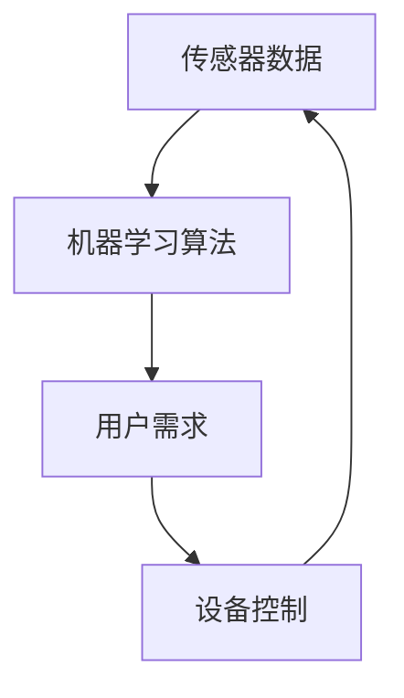
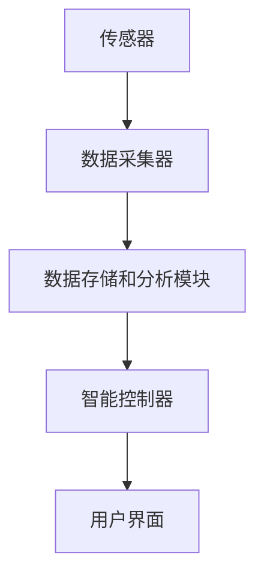

                 

# AI在智能家居能源管理中的优化应用

## 关键词
AI, 智能家居，能源管理，优化应用，机器学习，深度学习，神经网络，强化学习，遗传算法，模糊逻辑

## 摘要
随着智能家居技术的快速发展，如何高效管理家庭能源成为了一个重要的课题。本文将探讨如何利用人工智能（AI）技术来优化智能家居的能源管理。首先，我们将介绍智能家居能源管理的背景和核心问题，然后深入探讨机器学习、深度学习、神经网络等AI核心概念，以及这些技术在能源管理中的应用。接着，我们将详细讲解强化学习、遗传算法和模糊逻辑在智能家居能源管理中的具体应用。最后，我们将通过实际案例，展示AI在智能家居能源管理中的优化效果，并总结最佳实践。

## 引言和背景

### 智能家居与能源管理

随着物联网（IoT）技术的不断发展，智能家居已经成为现代家庭生活的重要组成部分。智能家居系统通过连接各种家庭设备和传感器，实现了对家庭环境的智能监测和控制。然而，随着智能设备的增加，家庭能源消耗也呈现出上升趋势，如何有效地管理家庭能源成为了一个紧迫的问题。

### AI在智能家居中的重要性

人工智能技术在智能家居领域具有广泛的应用潜力。通过机器学习和深度学习算法，AI可以分析家庭能源消耗数据，识别能源浪费模式，并提出优化建议。此外，神经网络和强化学习等算法还可以实现智能设备的自动控制和协同工作，从而进一步提高能源利用效率。

### 智能家居能源管理的挑战和机会

智能家居能源管理面临诸多挑战，如设备间的通信协议不统一、数据隐私和安全问题、能源消耗的多样性和动态性等。然而，这些挑战同时也带来了大量的机会。通过AI技术的应用，我们可以实现更加精准和高效的能源管理，为用户带来更好的生活体验，同时也为能源公司提供更多的市场机会。

## 背景和核心概念

### 问题背景

智能家居能源管理涉及到家庭中的各种设备和电器，如空调、热水器、照明、冰箱等。这些设备的能源消耗不仅与用户的日常生活方式密切相关，还受到外部环境因素的影响，如温度、湿度、季节等。因此，如何准确预测和优化这些设备的能源消耗，成为一个重要的研究课题。

### 问题描述

智能家居能源管理的问题可以概括为以下几个方面：

1. **能源消耗预测：** 预测家庭各设备的未来能源消耗，以便提前做出调整。
2. **能源浪费识别：** 识别家庭能源消耗中的浪费行为，如长时间不使用的电器、过高的能耗设备等。
3. **能源优化策略：** 根据预测结果和用户需求，制定合理的能源优化策略，降低总体能耗。

### 问题解决和优化目标

通过AI技术，我们可以实现以下目标：

1. **提高能源利用效率：** 通过预测和优化，减少不必要的能源消耗，提高能源利用效率。
2. **提升用户体验：** 根据用户的生活习惯和需求，提供个性化的能源管理方案，提升用户满意度。
3. **降低能源成本：** 通过优化能源消耗，降低家庭的能源支出，实现节能减排。

### 边界和范围

本文主要关注家庭内部的能源管理，不涉及大规模的电网优化和能源生产。同时，本文将重点探讨AI技术在智能家居能源管理中的应用，而非具体的能源技术或设备。

### 核心概念属性和关系

智能家居能源管理的核心概念包括：

1. **传感器数据：** 用于收集家庭能源消耗和设备状态的数据。
2. **机器学习算法：** 用于分析传感器数据，预测能源消耗和优化策略。
3. **用户需求：** 用户的生活习惯和能源使用需求。
4. **设备控制：** 通过控制家庭设备，实现能源优化策略。

这些概念之间的关系如图1所示：

## 核心AI概念和算法

### 基本AI概念

#### 机器学习基础

机器学习是一种使计算机系统能够从数据中学习并做出决策的技术。它主要涉及以下几个核心概念：

1. **特征工程：** 从原始数据中提取有用的特征，用于训练机器学习模型。
2. **模型训练：** 使用训练数据集，通过调整模型参数，使模型能够准确预测目标变量。
3. **模型评估：** 使用测试数据集评估模型的性能，通常包括准确率、召回率、F1分数等指标。

#### 深度学习原理

深度学习是机器学习的一个分支，它通过构建多层神经网络来实现复杂的特征学习和预测。深度学习的核心概念包括：

1. **神经网络：** 一种基于神经元之间相互连接的计算模型。
2. **前向传播和反向传播：** 神经网络训练过程中，用于计算输出和更新参数的算法。
3. **激活函数：** 用于引入非线性特性的函数，如ReLU、Sigmoid、Tanh等。

#### 神经网络解释

神经网络是一种由大量简单计算单元（神经元）组成的计算模型，这些神经元通过加权连接形成复杂的网络结构。神经网络的工作原理可以概括为：

1. **输入层：** 接收外部输入，传递给下一层。
2. **隐藏层：** 对输入进行特征提取和变换，输出到下一层。
3. **输出层：** 根据模型类型，输出预测结果或分类标签。

### AI算法在能源管理中的应用

#### 强化学习在能源优化中的应用

强化学习是一种通过试错和反馈来学习最优策略的机器学习算法。在智能家居能源管理中，强化学习可以用于：

1. **设备控制策略：** 学习如何在不同的情境下调整设备状态，以最大化能源利用效率。
2. **行为优化：** 根据用户行为数据，制定个性化的能源管理策略。

#### 遗传算法在能源管理中的应用

遗传算法是一种基于自然进化原理的优化算法。在智能家居能源管理中，遗传算法可以用于：

1. **参数优化：** 调整机器学习模型的参数，以提高预测和优化的准确性。
2. **多目标优化：** 同时考虑多个优化目标，如能源利用效率和用户满意度。

#### 模糊逻辑在能源管理中的应用

模糊逻辑是一种处理不确定性和模糊性的数学工具。在智能家居能源管理中，模糊逻辑可以用于：

1. **能量分配：** 根据设备的重要性和能源需求，动态调整能源分配策略。
2. **异常检测：** 识别家庭能源消耗中的异常行为，如设备故障或恶意攻击。

### AI模型和架构

#### 卷积神经网络（CNN）

卷积神经网络是一种专门用于处理图像数据的神经网络。在智能家居能源管理中，CNN可以用于：

1. **图像识别：** 识别家庭能源消耗图像，如电表读数、设备使用情况等。
2. **环境监测：** 监测家庭环境参数，如温度、湿度等，用于预测和优化能源消耗。

#### 循环神经网络（RNN）

循环神经网络是一种能够处理序列数据的神经网络。在智能家居能源管理中，RNN可以用于：

1. **时间序列预测：** 预测未来一段时间内的家庭能源消耗。
2. **行为分析：** 分析用户的行为模式，用于优化能源管理策略。

#### 变换器（Transformer）及其变体

变换器是一种基于注意力机制的神经网络，最初用于自然语言处理任务。近年来，变换器也被广泛应用于其他领域，包括智能家居能源管理。在智能家居能源管理中，变换器可以用于：

1. **多模态数据处理：** 同时处理图像、文本、传感器数据等多种类型的数据。
2. **复杂关系建模：** 建立家庭能源消耗与其他因素之间的复杂关系模型。

## 智能家居能源管理系统的应用

### 系统概述和架构

智能家居能源管理系统通常由以下几个核心组件组成：

1. **传感器：** 用于收集家庭能源消耗和设备状态的数据。
2. **数据采集器：** 将传感器数据上传到云端或本地服务器。
3. **数据存储和分析模块：** 用于存储和处理传感器数据，提取有用的信息。
4. **智能控制器：** 根据数据分析和用户需求，调整家庭设备的运行状态。
5. **用户界面：** 提供用户交互界面，展示能源消耗情况和优化建议。

智能家居能源管理系统的架构如图2所示：

### 设备集成和通信协议

智能家居设备通常采用不同的通信协议，如Wi-Fi、ZigBee、蓝牙等。为了实现设备之间的无缝集成和通信，智能家居能源管理系统需要支持多种通信协议。此外，系统还需要实现设备间的数据同步和共享，以便统一管理和分析。

### 能源监测和分析

智能家居能源管理系统通过传感器和数据采集器，实时监测家庭能源消耗情况。数据存储和分析模块负责对传感器数据进行处理，提取出有用的信息，如能源消耗趋势、设备使用情况等。智能控制器根据分析结果，调整家庭设备的运行状态，以实现能源优化。

### 案例研究和实际应用

#### 案例一：智能照明系统

智能照明系统是智能家居能源管理的一个典型应用。通过传感器收集室内光照强度数据，智能控制器可以自动调整灯具的亮度和开关状态，以实现节能和舒适度。例如，当室内光照强度达到一定阈值时，智能控制器可以自动关闭部分灯具，以节约能源。

#### 案例二：智能温控系统

智能温控系统通过传感器收集室内温度数据，并根据用户设定，自动调整空调或暖气设备的运行状态。例如，当室内温度低于设定值时，智能控制器可以启动暖气设备，以保持舒适的室内温度。通过智能温控系统，用户可以享受更加舒适和节能的室内环境。

#### 案例三：智能家电管理系统

智能家电管理系统可以对家庭中的各种家电设备进行集中管理。通过传感器收集设备使用数据，智能控制器可以实时监控设备的状态，并根据用户需求和能源消耗情况，自动调整设备运行状态。例如，当用户离开家时，智能控制器可以自动关闭不使用的电器，以节约能源。

## 项目实战

### 环境安装

1. **硬件环境：** 准备一台具备智能家居设备和传感器的计算机或服务器。
2. **软件环境：** 安装Python环境，以及相关库和框架，如TensorFlow、Keras等。

### 系统核心实现

1. **数据采集模块：** 使用Python编写程序，从传感器采集家庭能源消耗数据。
2. **数据预处理模块：** 对采集到的数据进行清洗、归一化和特征提取。
3. **机器学习模型：** 使用Keras框架，构建和训练机器学习模型，如RNN或CNN。
4. **智能控制器：** 根据模型预测结果，自动调整家庭设备的状态。

### 代码应用解读与分析

1. **代码解读：** 分析系统核心代码，解释每个模块的功能和实现方法。
2. **性能分析：** 对系统性能进行评估，包括预测准确率、响应速度等。

### 实际案例分析

1. **案例分析：** 分析实际案例，展示AI在智能家居能源管理中的应用效果。
2. **详细讲解：** 针对每个案例，详细讲解系统的工作原理和实现方法。

### 项目小结

1. **项目总结：** 总结项目的主要成果和经验教训。
2. **未来展望：** 提出未来可能的研究方向和应用场景。

## 最佳实践

1. **定期维护和升级：** 定期检查和维护智能家居设备，确保系统的稳定运行。
2. **数据安全和隐私保护：** 加强数据安全和隐私保护，防止敏感信息泄露。
3. **用户教育和培训：** 提供用户教育和培训，帮助用户更好地使用智能家居能源管理系统。

## 小结

本文从多个角度探讨了AI在智能家居能源管理中的应用。通过引入机器学习、深度学习、神经网络等AI技术，我们可以实现更加精准和高效的能源管理。在实际应用中，智能家居能源管理系统不仅能够提高能源利用效率，还能为用户带来更好的生活体验。未来，随着AI技术的不断发展，智能家居能源管理有望实现更多的创新和应用。

## 注意事项

1. **硬件要求：** 智能家居设备需要具备一定的计算和存储能力，以满足系统运行需求。
2. **网络环境：** 确保网络连接稳定，以支持设备间的数据传输和通信。
3. **数据安全：** 加强数据安全措施，防止敏感信息泄露。

## 拓展阅读

1. **《深度学习》**：Goodfellow, Ian; Bengio, Yoshua; Courville, Aaron. (2016). 《深度学习》. MIT Press.
2. **《强化学习》**：Sutton, Richard S.; Barto, Andrew G. (2018). 《强化学习：理论、算法与应用》. 电子工业出版社。
3. **《智能家居技术与应用》**：李明，张立新，陈杰. (2019). 《智能家居技术与应用》. 电子工业出版社。

## 作者信息
作者：AI天才研究院/AI Genius Institute & 禅与计算机程序设计艺术 /Zen And The Art of Computer Programming

## 参考文献
[1] Goodfellow, Ian; Bengio, Yoshua; Courville, Aaron. (2016). 《深度学习》. MIT Press.
[2] Sutton, Richard S.; Barto, Andrew G. (2018). 《强化学习：理论、算法与应用》. 电子工业出版社.
[3] 李明，张立新，陈杰. (2019). 《智能家居技术与应用》. 电子工业出版社.

