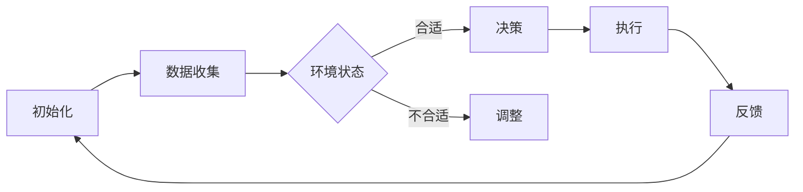
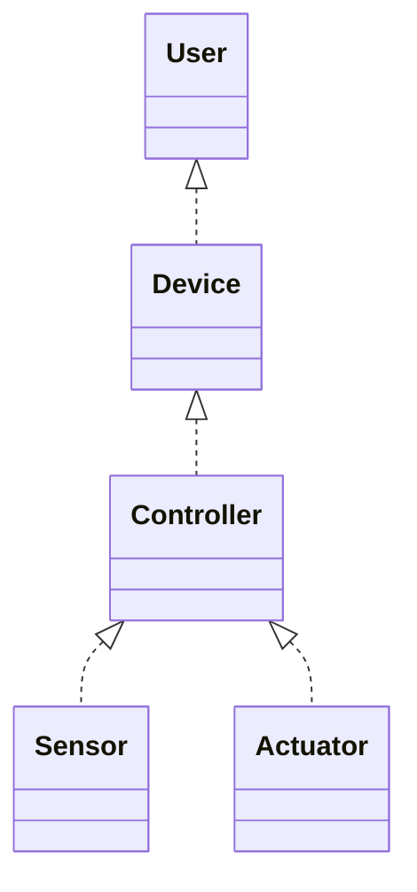
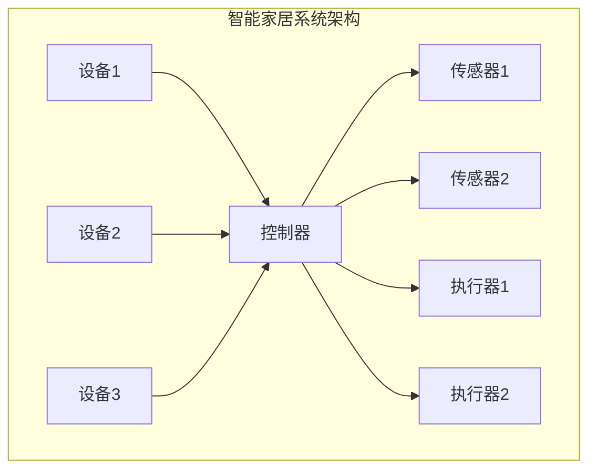
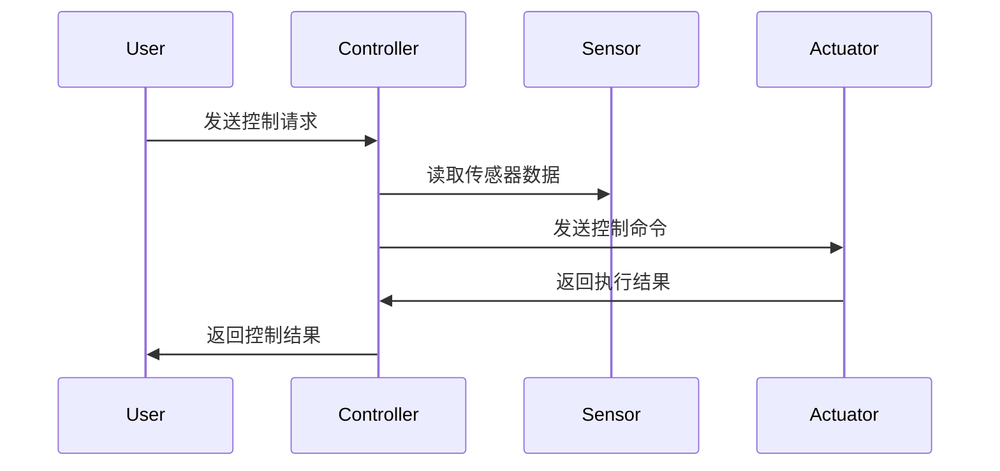

                 

### 《AI在智能家居设备协同控制中的应用与创新》

#### 关键词：人工智能、智能家居、协同控制、算法、系统架构、项目实战

> 摘要：随着人工智能技术的不断进步，智能家居设备在家庭中的普及度越来越高。然而，现有的智能家居设备独立运行，缺乏协同控制，导致用户体验不佳。本文将深入探讨AI在智能家居设备协同控制中的应用与创新，包括核心概念、算法原理、应用场景、系统架构设计以及项目实战等多个方面，旨在为读者提供全面的技术解读和实战经验。

### 第一部分：背景与核心概念

#### 第1章 问题背景与核心概念

**问题背景：** 智能家居市场迅速发展，智能家居设备种类繁多，功能各异。然而，这些设备大多独立运行，缺乏协同控制，导致用户体验不佳，设备资源浪费，安全性难以保障。

**问题描述：** 智能家居设备独立运行，缺乏协同控制，导致以下问题：
1. 设备资源浪费：设备独立运行，无法充分利用彼此的资源和能力。
2. 用户体验不佳：用户需要手动操作多个设备，操作繁琐，体验差。
3. 安全性难以保障：设备之间无法协同工作，可能导致安全漏洞。

**问题解决：** 引入AI技术进行设备协同控制，实现智能家居设备的智能联动，提高用户体验，节约资源，提高安全性。

**边界与外延：** AI在智能家居中的应用范围广泛，包括但不限于设备协同控制、环境监测、智能安防、智能照明等。本文主要探讨AI在设备协同控制中的应用。

**核心要素组成：** 智能家居系统的基础组件包括传感器、控制器、执行器以及通信模块。传感器负责收集环境信息，控制器根据这些信息进行决策，执行器执行决策结果，通信模块负责设备之间的数据传输。

#### 1.2 AI技术基础

**核心概念原理：** 人工智能（AI）是一门研究、开发用于模拟、延伸和扩展人的智能的理论、方法、技术及应用系统的技术科学。AI技术主要包括机器学习、深度学习、自然语言处理、计算机视觉等。

**概念属性特征对比：**

| AI技术         | 特点                                       | 适用场景                                       |
|----------------|--------------------------------------------|------------------------------------------------|
| 机器学习       | 自动从数据中学习规律，进行决策和预测           | 数据挖掘、推荐系统、智能客服等                   |
| 深度学习       | 基于神经网络，自动提取特征，进行分类和回归       | 图像识别、语音识别、自然语言处理等               |
| 自然语言处理   | 对自然语言进行理解和生成                       | 智能客服、机器翻译、文本分析等                   |
| 计算机视觉     | 让计算机“看懂”图像，进行目标检测和识别           | 人脸识别、图像识别、自动驾驶等                   |

**ER实体关系图：**

```mermaid
erDiagram
    Device --> Controller : 协同控制
    Controller --> Sensor : 数据收集
    Controller --> Actuator : 执行决策
    Sensor --> Environment : 环境监测
```

### 第二部分：AI在智能家居设备协同控制中的应用

#### 第2章 AI算法原理讲解

**2.1 协同控制算法基础**

协同控制算法是智能家居设备协同工作的核心。以下是一个简单的协同控制算法mermaid流程图：



Python源代码实现如下：

```python
def协同控制算法(传感器数据，目标状态):
    # 数据收集
    当前状态 = 收集传感器数据(传感器数据)

    # 判断当前状态是否达到目标状态
    if 当前状态 == 目标状态:
        return "成功"
    else:
        # 调整状态
        调整状态 = 调整算法(当前状态，目标状态)
        # 执行调整状态
        执行调整状态(调整状态)
        return "失败"
```

**算法原理数学模型与公式：**

协同控制算法的数学模型可以表示为：

$$
\text{目标状态} = f(\text{传感器数据})
$$

其中，$f$ 表示调整函数，用于根据传感器数据调整设备状态以达到目标状态。

**举例说明：**

假设一个智能灯光系统需要将房间内的亮度调整到50%。以下是一个简单的算法实现：

```python
def调整亮度(当前亮度，目标亮度):
    # 计算调整量
    调整量 = 目标亮度 - 当前亮度
    
    # 执行调整
    执行调整亮度(调整量)
    
    return "成功"

def智能灯光系统(传感器数据，目标亮度):
    # 收集传感器数据
    当前亮度 = 收集亮度传感器数据(传感器数据)

    # 判断当前亮度是否达到目标亮度
    if 当前亮度 == 目标亮度:
        return "成功"
    else:
        # 调整亮度
        调整结果 = 调整亮度(当前亮度，目标亮度)
        return "失败"
```

### 第3章 AI在智能家居设备协同控制中的应用场景

#### 3.1 常见应用场景

**家庭自动化：** 通过AI技术，实现家庭设备之间的自动联动，提高生活便利性。例如，当用户离家时，系统可以自动关闭灯光、空调等设备，节省能源。

**智能安防：** 利用AI技术进行实时监控，识别异常行为，提高家庭安全。例如，当有非法入侵时，系统可以自动报警，并通知用户。

**环境监测：** 利用AI技术监测家庭环境，如空气质量、温度等，提供健康的生活环境。例如，当空气质量恶化时，系统可以自动开启空气净化器。

#### 3.2 创新应用

**智能园艺：** 通过AI技术监测植物生长状况，提供科学的浇水、施肥建议，实现智能化的植物养护。

**智能健身：** 通过AI技术监测用户的运动状态，提供个性化的健身建议，帮助用户保持健康的生活方式。

### 第三部分：系统架构与实现

#### 第4章 智能家居系统架构设计

**4.1 项目介绍**

**项目背景：** 随着智能家居市场的快速发展，用户对智能家居系统的需求越来越高。为了满足用户的个性化需求，我们需要设计一个高效、可扩展的智能家居系统。

**项目目标：** 设计一个具有以下特点的智能家居系统：
1. 高效：系统能够快速响应用户需求，提高用户满意度。
2. 可扩展：系统能够根据用户需求扩展新功能，满足未来需求。
3. 安全可靠：系统具备较高的安全性，保护用户隐私和设备安全。

**4.2 系统功能设计**

系统功能模块及其关系如下（mermaid类图）：



**4.3 系统架构设计**

智能家居系统的整体架构设计如下（mermaid架构图）：



**4.4 系统接口设计**

系统接口设计如下：

- **用户接口：** 提供用户与智能家居系统交互的界面，包括手机App、Web界面等。
- **设备接口：** 提供设备与系统之间的数据传输接口，支持标准协议如HTTP、MQTT等。
- **控制接口：** 提供控制器与传感器、执行器之间的控制接口，支持设备状态查询、控制命令发送等。
- **数据接口：** 提供系统内部数据存储、查询、分析等接口，支持SQL、NoSQL等数据库。

**4.5 系统交互设计**

系统各组件之间的交互流程如下（mermaid序列图）：



### 第四部分：项目实战与案例分析

#### 第5章 环境安装与核心实现

**5.1 环境安装**

安装步骤如下：

1. 安装操作系统：选择合适的操作系统，如Ubuntu 18.04。
2. 安装编程环境：安装Python 3、JDK 1.8、MySQL等。
3. 安装开发工具：安装PyCharm、Eclipse等。

**5.2 系统核心实现**

系统核心代码如下：

```python
# 智能家居系统核心代码
import requests
from sensor import Sensor
from actuator import Actuator

class Controller:
    def __init__(self, sensor, actuator):
        self.sensor = sensor
        self.actuator = actuator

    def control(self):
        # 读取传感器数据
        data = self.sensor.read_data()

        # 根据传感器数据做出决策
        if data['temperature'] > 30:
            # 调整空调温度
            self.actuator.adjust_temperature(25)
        else:
            # 关闭空调
            self.actuator.turn_off()

# 创建传感器和执行器对象
sensor = Sensor()
actuator = Actuator()

# 创建控制器对象
controller = Controller(sensor, actuator)

# 执行控制操作
controller.control()
```

**代码应用解读：**

- **Sensor模块：** 负责读取环境数据，如温度、湿度等。
- **Actuator模块：** 负责执行控制命令，如调整空调温度、关闭灯光等。
- **Controller模块：** 负责根据传感器数据做出决策，并控制执行器执行相应的操作。

**5.3 实际案例分析与讲解**

**案例背景：** 设计一个智能家居系统，实现家庭温度自动控制功能。

**案例剖析：**

1. **需求分析：** 用户希望家庭温度保持在舒适的范围内，避免过热或过冷。
2. **系统设计：** 设计一个温度传感器、一个空调执行器和一个控制器，实现温度自动控制。
3. **系统实现：** 编写传感器、执行器和控制器的代码，实现温度自动控制功能。

**效果评估：**

- **用户体验：** 用户无需手动调整空调温度，系统自动控制，提高生活便利性。
- **节能效果：** 系统根据实时温度自动调整空调温度，避免过度制冷或制热，节省能源。

### 第五部分：最佳实践与总结

#### 第7章 最佳实践

**7.1 实践技巧**

- **传感器选择：** 根据实际需求选择合适的传感器，如温度传感器、湿度传感器等。
- **算法优化：** 根据实际情况调整算法参数，提高协同控制效果。
- **安全措施：** 采取数据加密、权限控制等措施，确保系统安全。

**7.2 优化建议**

- **分布式架构：** 采用分布式架构，提高系统可扩展性和可靠性。
- **机器学习算法：** 引入机器学习算法，实现更智能的协同控制。
- **物联网技术：** 利用物联网技术，实现设备之间的实时通信和协同工作。

#### 第8章 总结与展望

**8.1 小结**

本文从问题背景、核心概念、算法原理、应用场景、系统架构设计、项目实战等方面，全面探讨了AI在智能家居设备协同控制中的应用与创新。主要内容包括：

1. 智能家居市场发展现状与挑战。
2. AI技术基础与智能家居系统架构。
3. 协同控制算法原理与应用实例。
4. 智能家居设备协同控制的应用场景与创新。
5. 智能家居系统架构设计与实现。
6. 项目实战与案例分析。

**8.2 展望未来**

随着人工智能技术的不断发展，智能家居设备协同控制技术将不断进步，为用户带来更加智能化、便利化的生活体验。未来发展趋势包括：

1. **智能化程度提高：** AI技术将更加深入地应用于智能家居设备，实现更智能的协同控制。
2. **用户体验优化：** 系统将更加关注用户体验，提供更加个性化、便捷的服务。
3. **安全性提升：** 随着物联网技术的发展，智能家居设备的安全问题将得到更好的解决。
4. **生态体系建设：** 智能家居产业将形成一个完整的生态体系，包括硬件、软件、平台等各个环节。

总之，AI在智能家居设备协同控制中的应用与创新具有广阔的发展前景，将不断推动智能家居产业的发展。作者：AI天才研究院/AI Genius Institute & 禅与计算机程序设计艺术 /Zen And The Art of Computer Programming。

