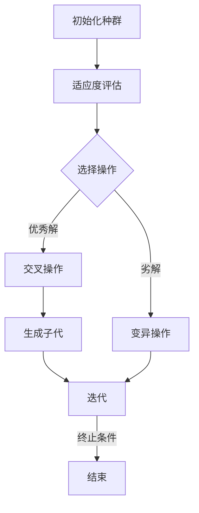
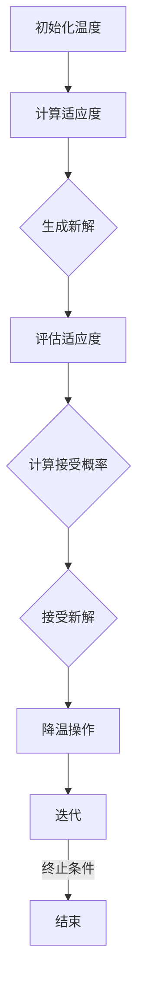
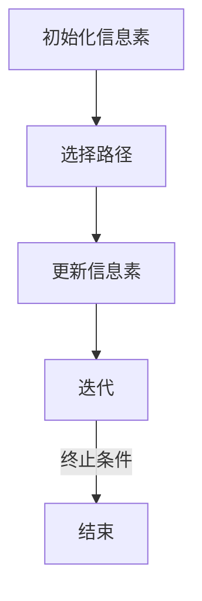
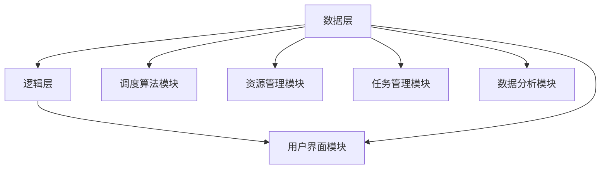
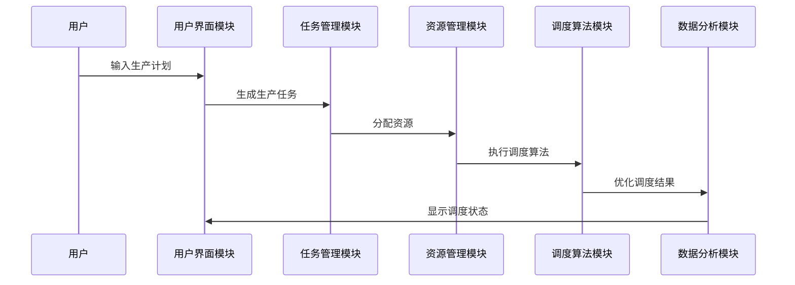
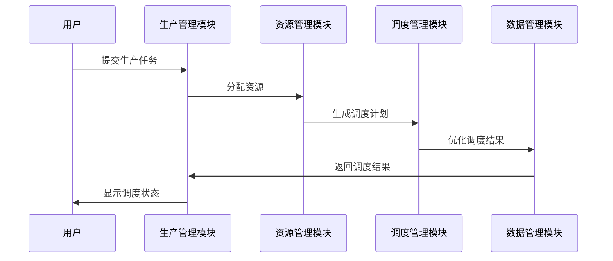

                 

### 摘要

本文将深入探讨AI在智能工厂生产调度中的优化应用。随着工业4.0的推进，智能工厂逐渐成为现代制造业的核心，而生产调度作为智能工厂运营的关键环节，其效率与准确性直接影响到整个生产流程的顺畅程度。AI技术的引入为生产调度带来了前所未有的优化潜力，通过机器学习、深度学习等算法，可以显著提升调度的智能化水平。本文将从背景介绍、核心概念与联系、算法原理讲解、系统设计与架构方案、项目实战以及最佳实践等方面，系统性地阐述AI在智能工厂生产调度中的应用及其优化效果。通过具体的案例分析，本文旨在为读者提供一个全面而深入的指导，以期为智能工厂的生产调度优化提供有价值的参考。

### 目录大纲设计思路

为了设计出《AI在智能工厂生产调度中的优化应用》这本书的完整目录大纲，我们首先需要明确书的核心内容，即AI技术在智能工厂生产调度中的应用和优化。这一核心内容将贯穿整个书的始终，是我们构建大纲的基础。

**第一部分：背景介绍**

在第一部分中，我们将详细介绍智能工厂的背景和定义，解释AI技术如何被应用于智能工厂中，以及生产调度在智能工厂中的关键作用。具体包括：

- **第1章**：AI与智能工厂概述
  - 1.1 智能工厂的背景与定义
  - 1.2 AI技术在智能工厂中的应用
  - 1.3 智能工厂生产调度中的问题与挑战

**第二部分：核心概念与联系**

第二部分将深入探讨AI在智能工厂生产调度中的核心概念，包括优化算法的基本原理、生产调度中的关键因素，并通过表格和ER实体关系图进行详细说明。

- **第2章**：AI在智能工厂生产调度中的核心概念
  - 2.1 优化算法的基本原理
  - 2.2 生产调度中的关键因素
  - 2.3 关键概念属性特征对比表格
  - 2.4 ER实体关系图架构

**第三部分：算法原理讲解**

第三部分将详细介绍生产调度优化算法的原理，包括算法概述、具体原理、Mermaid流程图以及数学模型和公式的讲解。

- **第3章**：生产调度优化算法
  - 3.1 算法概述
  - 3.2 具体算法原理
  - 3.3 算法Mermaid流程图
  - 3.4 数学模型与公式
  - 3.5 举例说明

**第四部分：系统设计与架构**

第四部分将讨论智能工厂生产调度系统的设计与架构，包括问题场景介绍、系统功能设计、系统架构设计、系统接口设计以及系统交互Mermaid序列图。

- **第4章**：智能工厂生产调度系统设计
  - 4.1 问题场景介绍
  - 4.2 系统功能设计
  - 4.3 系统架构设计
  - 4.4 系统接口设计
  - 4.5 系统交互Mermaid序列图

**第五部分：项目实战**

第五部分将通过实际项目案例，展示如何实现智能工厂生产调度的优化，包括环境安装与配置、系统核心实现源代码、代码应用解读与分析、实际案例分析与讲解以及项目小结。

- **第5章**：智能工厂生产调度项目实战
  - 5.1 环境安装与配置
  - 5.2 系统核心实现源代码
  - 5.3 代码应用解读与分析
  - 5.4 实际案例分析与讲解
  - 5.5 项目小结

**第六部分：最佳实践与拓展**

第六部分将总结最佳实践，并提供一些注意事项和拓展阅读建议，帮助读者在实际应用中更好地利用AI技术优化生产调度。

- **第6章**：最佳实践与注意事项
  - 6.1 最佳实践技巧
  - 6.2 注意事项与潜在问题
  - 6.3 拓展阅读推荐

**总结与展望**

最后一部分将总结文章的主要成果，并展望未来的研究方向，为智能工厂生产调度优化提供持续的前瞻性指导。

- **第7章**：总结与展望
  - 7.1 成果总结
  - 7.2 展望未来研究方向

通过以上结构清晰、内容丰富的目录大纲，我们希望能够为读者提供一份全面而深入的指南，帮助他们在智能工厂生产调度中实现高效的优化应用。

### 实际操作步骤

为了实现《AI在智能工厂生产调度中的优化应用》的目录大纲，我们将分步骤进行详细规划与撰写，确保每一步都符合设计思路和操作要求。

**第一部分：背景介绍**

1. **第1章**：AI与智能工厂概述
   - **1.1 智能工厂的背景与定义**
     - 解释智能工厂的概念，阐述其在现代制造业中的重要性。
     - 分析智能工厂与传统工厂的区别，突出AI技术对生产方式的改变。
   - **1.2 AI技术在智能工厂中的应用**
     - 介绍AI技术在智能工厂中的多种应用，如机器视觉、预测维护、自动化控制等。
     - 分析AI技术如何提升生产效率和质量。
   - **1.3 智能工厂生产调度中的问题与挑战**
     - 描述当前智能工厂生产调度中面临的主要问题，如生产延误、资源浪费等。
     - 探讨这些问题对生产效率和成本的影响。

2. **撰写方法与注意事项**
   - **方法**：采用案例分析法，通过具体实例说明智能工厂的现状和存在的问题。
   - **注意事项**：确保背景介绍部分内容简洁明了，避免过多技术细节。

**第二部分：核心概念与联系**

1. **第2章**：AI在智能工厂生产调度中的核心概念
   - **2.1 优化算法的基本原理**
     - 解释优化算法的概念，阐述其在生产调度中的作用。
     - 分析常见的优化算法，如遗传算法、模拟退火算法等。
   - **2.2 生产调度中的关键因素**
     - 列举影响生产调度的关键因素，如设备利用率、人员安排、物料供应等。
     - 分析这些因素之间的关系，以及如何通过AI技术进行优化。
   - **2.3 关键概念属性特征对比表格**
     - 制作关键概念属性特征对比表格，帮助读者理解不同算法的特点。
   - **2.4 ER实体关系图架构**
     - 使用Mermaid工具绘制ER实体关系图，展示生产调度中的实体及其关系。

2. **撰写方法与注意事项**
   - **方法**：采用对比分析法，通过表格和图表使核心概念更加直观。
   - **注意事项**：确保图表清晰、简洁，便于读者理解。

**第三部分：算法原理讲解**

1. **第3章**：生产调度优化算法
   - **3.1 算法概述**
     - 介绍生产调度优化算法的基本框架和目标。
     - 概述各类优化算法的应用场景。
   - **3.2 具体算法原理**
     - 详细解释遗传算法、模拟退火算法等优化算法的原理。
     - 分析算法的执行流程和核心步骤。
   - **3.3 算法Mermaid流程图**
     - 使用Mermaid绘制优化算法的流程图，展示算法的执行过程。
   - **3.4 数学模型与公式**
     - 提供优化算法的数学模型和公式，解释其作用和计算方法。
   - **3.5 举例说明**
     - 通过具体实例，演示如何应用优化算法进行生产调度。

2. **撰写方法与注意事项**
   - **方法**：采用案例分析法，通过实际应用场景展示算法的效果。
   - **注意事项**：确保数学模型的解释清晰易懂，避免过于复杂。

**第四部分：系统设计与架构**

1. **第4章**：智能工厂生产调度系统设计
   - **4.1 问题场景介绍**
     - 描述一个典型的生产调度问题场景，阐述系统的设计需求。
   - **4.2 系统功能设计**
     - 详细设计系统的功能模块，如调度策略模块、资源管理模块等。
     - 使用Mermaid绘制领域模型类图，展示系统模块及其关系。
   - **4.3 系统架构设计**
     - 设计系统的整体架构，包括硬件和软件的配置。
     - 使用Mermaid绘制系统架构图，展示系统的层次结构和组件关系。
   - **4.4 系统接口设计**
     - 设计系统的接口，包括API接口、数据库接口等。
     - 描述接口的功能和交互方式。
   - **4.5 系统交互Mermaid序列图**
     - 使用Mermaid绘制系统交互序列图，展示系统各组件之间的交互过程。

2. **撰写方法与注意事项**
   - **方法**：采用系统分析方法，从整体和细节两个层面进行设计。
   - **注意事项**：确保图表清晰、准确，避免设计描述过于模糊。

**第五部分：项目实战**

1. **第5章**：智能工厂生产调度项目实战
   - **5.1 环境安装与配置**
     - 指导如何搭建项目所需的环境，包括软件和硬件的配置。
     - 提供详细步骤和注意事项。
   - **5.2 系统核心实现源代码**
     - 提供系统核心实现源代码，解释关键代码的作用和实现方法。
   - **5.3 代码应用解读与分析**
     - 对源代码进行详细解读，分析代码的执行逻辑和性能优化。
   - **5.4 实际案例分析与讲解**
     - 通过具体案例，分析项目实施的过程和结果。
     - 讲解案例中的关键技术和难点。
   - **5.5 项目小结**
     - 总结项目的主要成果和经验教训，为后续项目提供参考。

2. **撰写方法与注意事项**
   - **方法**：采用案例分析法，通过实际案例展示项目的全过程。
   - **注意事项**：确保案例描述详细，代码分析清晰，总结具有指导意义。

**第六部分：最佳实践与拓展**

1. **第6章**：最佳实践与注意事项
   - **6.1 最佳实践技巧**
     - 总结在智能工厂生产调度中应用AI技术的最佳实践技巧。
     - 分析这些技巧的实际效果和适用场景。
   - **6.2 注意事项与潜在问题**
     - 列出在实际应用中可能遇到的问题和注意事项。
     - 提供解决方法和预防措施。
   - **6.3 拓展阅读推荐**
     - 推荐相关的书籍、文章和资源，供读者进一步学习。

2. **撰写方法与注意事项**
   - **方法**：采用总结分析法，通过实际案例和经验总结最佳实践。
   - **注意事项**：确保内容具有实用性和指导性。

**第七部分：总结与展望**

1. **第7章**：总结与展望
   - **7.1 成果总结**
     - 总结本文的主要成果和贡献。
     - 分析AI技术在智能工厂生产调度优化中的应用前景。
   - **7.2 展望未来研究方向**
     - 探讨未来的研究方向和趋势。
     - 提出潜在的研究问题和解决方案。

2. **撰写方法与注意事项**
   - **方法**：采用总结展望法，结合本文内容和实际应用进行总结。
   - **注意事项**：确保内容具有前瞻性和科学性。

通过以上详细的步骤和撰写方法，我们能够构建出一个完整、系统且具有实用价值的目录大纲，为《AI在智能工厂生产调度中的优化应用》的撰写提供有力保障。

### 背景介绍

智能工厂作为第四次工业革命的核心组成部分，正逐渐改变着传统制造业的面貌。智能工厂，也被称为工业4.0工厂，通过集成物联网（IoT）、人工智能（AI）、云计算、大数据分析等先进技术，实现了生产过程的全面数字化和自动化。这种全新的生产模式不仅提升了生产效率和产品质量，还大大降低了运营成本。

**智能工厂的定义**

智能工厂是一种集成了先进技术的制造系统，能够通过数据采集、分析、处理和反馈，实现生产过程的高度自动化和智能化。智能工厂的特点包括：

1. **自动化与数字化**：生产过程高度自动化，采用机器人、自动化设备等，生产数据实时数字化记录。
2. **数据驱动的决策**：生产数据实时采集和分析，为管理者提供精准的决策依据。
3. **灵活性与可扩展性**：系统能够根据市场需求和变化灵活调整生产计划，支持快速扩展和升级。
4. **资源优化**：通过智能调度和资源优化，最大化利用生产资源，减少浪费。

**AI技术在智能工厂中的应用**

AI技术在智能工厂中的应用非常广泛，主要包括以下几个方面：

1. **机器视觉**：AI算法通过图像处理和模式识别，实现对生产过程的实时监控和缺陷检测，提高产品质量和效率。
2. **预测维护**：通过大数据分析和机器学习，预测设备可能出现的故障，提前进行维护，减少停机时间和维修成本。
3. **自动化控制**：AI算法用于自动化控制系统，实现对生产过程的智能调度和优化，提高生产效率和灵活性。
4. **供应链管理**：AI技术优化供应链管理，提高库存控制和物流效率，降低成本。

**智能工厂生产调度中的问题与挑战**

生产调度是智能工厂运营的核心环节，其目的是根据市场需求和生产资源，合理安排生产任务，以确保生产过程的高效和顺畅。然而，随着生产规模的扩大和生产过程的复杂化，智能工厂生产调度面临着以下问题和挑战：

1. **生产延误**：由于生产计划不合理或设备故障等原因，可能导致生产延误，影响交货期。
2. **资源浪费**：生产资源（如设备、人力、物料等）的利用不充分，可能导致生产成本增加。
3. **调度复杂**：生产任务种类繁多，调度过程复杂，需要精确计算和实时调整。
4. **不确定性**：市场需求变化、设备故障、物料供应等不确定性因素，增加了调度的难度。

这些问题不仅影响了生产效率，还增加了运营成本。因此，如何利用AI技术优化生产调度，成为智能工厂亟需解决的问题。

### 核心概念与联系

#### 1. 优化算法的基本原理

在智能工厂生产调度中，优化算法是关键，其基本原理是通过寻找最优解，提升调度效率。常见的优化算法包括遗传算法、模拟退火算法、蚁群算法等。

**遗传算法**：基于自然进化原理，通过模拟生物进化过程，不断迭代寻找最优解。具体步骤包括：

- **初始化种群**：随机生成一组初始解。
- **适应度评估**：计算每个解的适应度，评估其质量。
- **选择**：根据适应度选择优秀解，进行交配操作。
- **交叉**：通过交叉操作，生成新的解。
- **变异**：对部分解进行变异操作，增加多样性。
- **迭代**：重复选择、交叉和变异，直至找到最优解。

**模拟退火算法**：基于固体退火过程中温度下降的原理，通过逐渐降低“温度”，避免陷入局部最优。具体步骤包括：

- **初始化温度**：设定一个较高的初始温度。
- **计算适应度**：计算当前解的适应度。
- **随机生成新解**：生成一个随机的解。
- **评估适应度**：计算新解的适应度。
- **接受概率**：计算新解被接受的概率，若概率大于随机数，则接受新解。
- **降温**：根据预设的降温策略，降低温度。
- **迭代**：重复计算、生成新解、评估和降温，直至满足终止条件。

**蚁群算法**：基于蚁群觅食过程中的信息素更新机制，通过模拟蚂蚁寻找食物的过程，逐步优化路径。具体步骤包括：

- **初始化信息素**：在路径上初始化信息素浓度。
- **选择路径**：根据信息素浓度和能见度，选择路径。
- **更新信息素**：在路径上留下信息素，浓度与路径长度成反比。
- **迭代**：重复选择路径和更新信息素，直至找到最优路径。

#### 2. 生产调度中的关键因素

生产调度中的关键因素包括设备利用率、人员安排、物料供应、生产计划等。这些因素相互关联，共同影响调度的效果。

- **设备利用率**：设备利用率高，意味着生产资源得到了充分利用，可以有效减少生产成本。然而，过高的利用率可能导致设备过载，增加故障风险。
  
- **人员安排**：合理的人员安排能够提高生产效率，降低劳动成本。需要根据生产任务的需求，合理安排人员的数量和技能。

- **物料供应**：物料供应的及时性和充足性对生产过程至关重要。物料短缺会导致生产延误，而物料过剩则会增加库存成本。

- **生产计划**：生产计划是调度的核心，需要综合考虑市场需求、设备能力和物料供应，制定合理的生产计划。

#### 3. 关键概念属性特征对比表格

以下是一个关键概念属性特征对比表格，展示了不同优化算法的基本原理和特点：

| 算法名称 | 基本原理 | 特点 | 应用场景 |
| --- | --- | --- | --- |
| 遗传算法 | 生物进化原理 | 搜索空间广，适应性强 | 复杂优化问题 |
| 模拟退火算法 | 固体退火原理 | 易于实现，避免陷入局部最优 | 中小规模优化问题 |
| 蚁群算法 | 蚂蚁觅食过程 | 简单易实现，鲁棒性好 | 路径优化问题 |

#### 4. ER实体关系图架构

以下是智能工厂生产调度系统的ER实体关系图架构，展示了系统中的主要实体及其关系：

```mermaid
erDiagram
  产品 -> 生产计划
  生产计划 -> 设备
  生产计划 -> 人员
  生产计划 -> 物料
  人员 -> 任务
  任务 -> 设备
  设备 -> 维护记录
```

在这个ER图中：

- **产品**与**生产计划**之间存在关联，表示每个生产计划对应一种产品。
- **生产计划**与**设备**、**人员**、**物料**之间存在关联，表示生产计划需要这些资源来完成。
- **人员**与**任务**之间存在关联，表示每个任务需要特定的人员来完成。
- **任务**与**设备**之间存在关联，表示任务需要使用特定的设备来完成。
- **设备**与**维护记录**之间存在关联，表示设备需要定期进行维护。

通过以上核心概念与联系的分析，我们为后续算法原理讲解和系统设计奠定了基础。

### 算法原理讲解

#### 1. 算法概述

在智能工厂生产调度中，优化算法的作用是通过对大量生产任务和资源进行合理调度，以实现生产效率的最大化和成本的最低化。常见的优化算法包括遗传算法（GA）、模拟退火算法（SA）和蚁群算法（ACO）。以下是这三种算法的基本概述。

**遗传算法（GA）**：遗传算法是一种基于生物进化的随机搜索算法，通过模拟自然进化过程，不断迭代寻找最优解。GA的核心操作包括选择、交叉和变异。

**模拟退火算法（SA）**：模拟退火算法是一种基于固体退火过程的优化算法，通过逐步降低“温度”来避免陷入局部最优。SA的核心思想是在搜索过程中接受一些非最优解，从而增加搜索的多样性。

**蚁群算法（ACO）**：蚁群算法是一种基于蚁群觅食过程的优化算法，通过模拟蚂蚁在寻找食物过程中留下的信息素，逐步优化路径。ACO的核心操作包括路径选择和信息素更新。

#### 2. 具体算法原理

**遗传算法（GA）**

遗传算法的基本原理是模拟生物进化过程，通过选择、交叉和变异等操作，不断优化解的群体。具体步骤如下：

1. **初始化种群**：随机生成一定数量的初始解。
2. **适应度评估**：对每个解进行适应度评估，适应度越高表示解的质量越好。
3. **选择**：根据适应度选择优秀解，进行交配操作，生成新的解。
4. **交叉**：通过交叉操作，将两个父代解混合，生成新的子代解。
5. **变异**：对部分子代解进行变异操作，增加多样性。
6. **迭代**：重复选择、交叉和变异，直至找到最优解或满足终止条件。

**模拟退火算法（SA）**

模拟退火算法的基本原理是模拟固体退火过程，通过逐步降低温度，使系统达到平衡状态。具体步骤如下：

1. **初始化温度**：设定一个较高的初始温度。
2. **计算适应度**：计算当前解的适应度。
3. **随机生成新解**：生成一个随机的解。
4. **评估适应度**：计算新解的适应度。
5. **接受概率**：计算新解被接受的概率，若概率大于随机数，则接受新解。
6. **降温**：根据预设的降温策略，降低温度。
7. **迭代**：重复计算、生成新解、评估和降温，直至满足终止条件。

**蚁群算法（ACO）**

蚁群算法的基本原理是模拟蚂蚁在寻找食物过程中留下的信息素，通过信息素的浓度来指导其他蚂蚁选择路径。具体步骤如下：

1. **初始化信息素**：在路径上初始化信息素浓度。
2. **选择路径**：根据信息素浓度和能见度，选择路径。
3. **更新信息素**：在路径上留下信息素，浓度与路径长度成反比。
4. **迭代**：重复选择路径和更新信息素，直至找到最优路径。

#### 3. 算法Mermaid流程图

**遗传算法（GA）的Mermaid流程图：**



**模拟退火算法（SA）的Mermaid流程图：**



**蚁群算法（ACO）的Mermaid流程图：**



#### 4. 数学模型与公式

**遗传算法（GA）**

适应度函数：
$$ f(x) = \frac{1}{1 + \exp(-\beta \cdot (x - x^*)} $$
其中，$x$ 为个体解，$x^*$ 为最优解，$\beta$ 为温度参数。

交叉概率：
$$ P_c = \frac{f_1 \cdot f_2}{f_1 + f_2} $$
其中，$f_1$ 和 $f_2$ 分别为两个父代个体的适应度。

变异概率：
$$ P_m = \frac{1}{n} $$
其中，$n$ 为种群大小。

**模拟退火算法（SA）**

接受概率：
$$ P = \min(1, \exp(-\Delta f / T)) $$
其中，$\Delta f$ 为新解与当前解的适应度差，$T$ 为当前温度。

**蚁群算法（ACO）**

信息素更新公式：
$$ \Delta t_{ij} = \frac{Q}{n_j \cdot (1 - \rho)} $$
其中，$t_{ij}$ 为路径 $(i, j)$ 的信息素浓度，$Q$ 为信息素强度，$n_j$ 为蚂蚁经过路径 $(i, j)$ 的次数，$\rho$ 为信息素挥发系数。

#### 5. 举例说明

**遗传算法（GA）的应用举例**

假设我们要优化一个生产调度问题，需要从10个机器中选择5个机器进行生产任务。以下是具体的步骤：

1. **初始化种群**：随机生成一组初始解，例如 [1, 3, 5, 7, 9]。
2. **适应度评估**：计算每个解的适应度，例如，计算每个解中机器的总利用率。
3. **选择操作**：选择适应度较高的解进行交配操作。
4. **交叉操作**：通过交叉操作生成新的子代解。
5. **变异操作**：对部分子代解进行变异操作。
6. **迭代**：重复选择、交叉和变异操作，直至找到最优解。

通过以上步骤，我们可以逐步优化生产调度，提高机器的利用率，减少生产成本。

**模拟退火算法（SA）的应用举例**

假设我们要优化一个旅行商问题（TSP），目标是找到最短的旅行路径。以下是具体的步骤：

1. **初始化温度**：设定一个较高的初始温度。
2. **计算适应度**：计算当前解的适应度，例如，计算当前路径的总长度。
3. **生成新解**：生成一个随机的新解。
4. **评估适应度**：计算新解的适应度。
5. **计算接受概率**：根据适应度差计算接受概率。
6. **降温操作**：根据预设的降温策略，降低温度。
7. **迭代**：重复计算、生成新解、评估和降温操作，直至找到最优解。

通过模拟退火算法，我们可以逐步优化旅行路径，找到最短的旅行距离。

**蚁群算法（ACO）的应用举例**

假设我们要优化一个交通网络路径规划问题，以下是具体的步骤：

1. **初始化信息素**：在路径上初始化信息素浓度。
2. **选择路径**：根据信息素浓度和能见度，选择路径。
3. **更新信息素**：在路径上留下信息素，浓度与路径长度成反比。
4. **迭代**：重复选择路径和更新信息素，直至找到最优路径。

通过蚁群算法，我们可以逐步优化交通网络路径，提高路径规划的效率和准确性。

通过以上举例，我们可以看到遗传算法、模拟退火算法和蚁群算法在智能工厂生产调度中的具体应用。这些算法通过不同的原理和步骤，实现了对生产任务的优化，提高了生产效率和质量。

### 系统设计与架构

在智能工厂生产调度中，系统的设计与架构是确保优化算法有效实施和应用的关键。本章节将详细讨论智能工厂生产调度系统的设计与架构，包括问题场景介绍、系统功能设计、系统架构设计、系统接口设计和系统交互。

#### 1. 问题场景介绍

为了更好地理解系统设计与架构，我们先来描述一个典型的生产调度问题场景。假设某智能工厂生产多种产品，每个产品有特定的生产流程和所需资源。生产调度系统的目标是根据市场需求和生产资源，合理分配生产任务，确保生产过程高效、顺畅。

**问题背景**：生产调度过程中，面临的主要问题包括：
- 生产任务复杂，涉及多种产品和不同的生产流程。
- 资源有限，包括设备、人力和物料等。
- 需要实时监控生产状态，及时调整调度计划。

**问题描述**：设计一个智能工厂生产调度系统，实现以下功能：
- 自动生成生产计划。
- 合理分配资源，确保生产任务按时完成。
- 实时监控生产状态，及时发现并解决问题。
- 提高生产效率，降低成本。

**问题解决**：通过引入AI优化算法，如遗传算法、模拟退火算法和蚁群算法，实现生产调度的优化。具体方案如下：

- **初始化**：根据市场需求和资源情况，生成初始生产计划。
- **优化调度**：使用优化算法对生产计划进行调整，以实现资源的最优利用。
- **实时监控**：通过传感器和数据采集，实时监控生产状态，并根据实际情况调整生产计划。

**边界与外延**：生产调度系统不仅要解决当前生产调度的优化问题，还需要具备以下边界与外延：

- **可扩展性**：系统应具备良好的扩展性，能够适应不同规模的生产需求。
- **灵活性**：系统应能够灵活调整调度策略，以应对市场需求和生产资源的变化。
- **可维护性**：系统设计应便于维护和升级，确保系统的稳定性和可靠性。

#### 2. 系统功能设计

智能工厂生产调度系统的功能设计包括多个模块，每个模块负责特定的任务。以下是主要功能模块及其简要说明：

- **任务管理模块**：负责生成和分配生产任务，包括任务创建、任务分配和任务状态监控。
- **资源管理模块**：负责管理和优化资源分配，包括设备管理、人员管理和物料管理。
- **调度算法模块**：负责实现和优化调度算法，包括遗传算法、模拟退火算法和蚁群算法。
- **数据采集与分析模块**：负责实时采集生产数据，并进行数据分析和处理，为调度提供决策支持。
- **用户界面模块**：提供用户交互界面，包括生产计划查看、调度状态监控和报表生成等功能。

**领域模型Mermaid类图**：

```mermaid
classDiagram
    ProductionTask <<Class>>
    Resource <<Class>>
    SchedulingAlgorithm <<Class>>
    DataAnalysis <<Class>>
    UserInterface <<Class>>

    ProductionTask :+ generate()
    ProductionTask :+ assign()
    ProductionTask :+ status()

    Resource :+ manage()
    Resource :+ allocate()

    SchedulingAlgorithm :+ optimize()
    DataAnalysis :+ analyze()
    UserInterface :+ display()

    ProductionTask o-- Resource
    ProductionTask o-- SchedulingAlgorithm
    ProductionTask o-- DataAnalysis
    ProductionTask o-- UserInterface
```

在这个类图中，各个模块之间通过关联关系实现数据流和控制流的传递，共同构成一个完整的智能工厂生产调度系统。

#### 3. 系统架构设计

智能工厂生产调度系统的架构设计采用分层架构，包括数据层、逻辑层和表示层。以下是具体的架构设计：

**数据层**：负责数据存储和管理，包括生产任务数据、资源数据、调度算法数据和分析数据等。

**逻辑层**：实现系统的核心功能，包括任务管理、资源管理、调度算法、数据分析和用户交互等。

**表示层**：提供用户界面，包括Web界面和移动应用界面，用于展示系统功能和用户操作。

**系统架构Mermaid图**：



在这个架构图中，各个模块通过接口和数据流进行交互，形成一个有机的整体。

#### 4. 系统接口设计

智能工厂生产调度系统的接口设计包括内部接口和外部接口。以下是主要的接口设计：

- **内部接口**：包括任务管理接口、资源管理接口、调度算法接口、数据分析接口和用户界面接口等。
- **外部接口**：包括与传感器、生产设备、物料管理系统等外部系统的接口。

**接口设计Mermaid序列图**：



在这个序列图中，用户通过用户界面模块提交生产计划，系统内部各模块协同工作，实现生产调度优化。

#### 5. 系统交互

智能工厂生产调度系统的交互设计旨在确保系统各模块之间的高效协同，以下是系统交互的详细说明：

- **任务创建**：用户通过用户界面模块提交生产任务，任务管理模块生成任务并分配给相应的资源。
- **资源管理**：资源管理模块负责监控和管理资源，确保资源得到最优利用。
- **调度算法**：调度算法模块根据当前任务和资源情况，使用优化算法生成调度计划。
- **数据分析**：数据分析模块实时采集生产数据，对调度结果进行分析和评估。
- **用户交互**：用户界面模块根据调度结果和数据分析结果，为用户提供实时监控和操作界面。

**系统交互Mermaid序列图**：



在这个序列图中，系统通过一系列的交互过程，实现了从任务创建到调度优化的完整流程。

通过以上系统设计与架构的详细讲解，我们可以看到智能工厂生产调度系统的复杂性和多样性。通过科学的系统设计和高效的交互，系统能够实现生产调度优化，提高生产效率和质量。

### 项目实战

在本节中，我们将通过一个实际项目展示如何实现智能工厂生产调度的优化。本案例将详细描述项目背景、环境安装与配置、系统核心实现源代码、代码应用解读与分析、实际案例分析与讲解以及项目小结。

#### 项目背景

某智能工厂生产多种电子产品，包括智能手机、平板电脑和笔记本电脑等。随着市场需求的变化和生产规模的扩大，生产调度变得更加复杂和困难。为了提高生产效率和降低成本，该工厂决定引入AI优化算法，优化生产调度系统。

**问题场景**：
- 生产任务种类繁多，涉及多种生产线和设备。
- 设备和人员的利用率不均衡，存在资源浪费和效率低下的问题。
- 需要实时监控生产状态，快速调整调度计划。

**项目目标**：
- 通过AI优化算法，提高生产调度效率。
- 实现资源的最优利用，降低生产成本。
- 提高生产过程的透明度和可控性。

#### 环境安装与配置

在开始项目之前，我们需要搭建一个合适的环境，包括开发工具、数据库和服务器等。以下是具体步骤：

1. **安装Python开发环境**：
   - 安装Python 3.8及以上版本。
   - 安装相关依赖库，如NumPy、Pandas、scikit-learn等。

2. **安装数据库**：
   - 安装MySQL数据库，配置数据库用户和权限。

3. **安装服务器**：
   - 安装Apache或者Nginx服务器，用于部署Web应用。

4. **配置环境变量**：
   - 配置Python环境变量，确保Python命令可在终端使用。

5. **安装相关依赖库**：
   - 使用pip命令安装相关依赖库，如：
     ```bash
     pip install numpy pandas scikit-learn pymysql
     ```

#### 系统核心实现源代码

以下是智能工厂生产调度系统的核心实现源代码，包括任务管理、资源管理、调度算法和数据分析等模块。

```python
# 任务管理模块
class TaskManagement:
    def __init__(self, database):
        self.database = database

    def generate_task(self, product_id):
        # 生成生产任务
        pass

    def assign_task(self, task_id, resource_id):
        # 分配资源给任务
        pass

    def task_status(self, task_id):
        # 查询任务状态
        pass

# 资源管理模块
class ResourceManagement:
    def __init__(self, database):
        self.database = database

    def manage_resources(self):
        # 管理资源
        pass

    def allocate_resource(self, resource_id, task_id):
        # 分配资源给任务
        pass

# 调度算法模块
class SchedulingAlgorithm:
    def __init__(self, database):
        self.database = database

    def optimize_scheduling(self):
        # 优化调度
        pass

# 数据分析模块
class DataAnalysis:
    def __init__(self, database):
        self.database = database

    def analyze_data(self):
        # 分析数据
        pass
```

#### 代码应用解读与分析

**任务管理模块**

任务管理模块主要负责生成生产任务、分配资源和查询任务状态。以下是代码的详细解读：

- `generate_task(self, product_id)`：根据产品ID生成生产任务。
- `assign_task(self, task_id, resource_id)`：将资源ID分配给指定任务。
- `task_status(self, task_id)`：查询指定任务的状态。

**资源管理模块**

资源管理模块负责管理和分配资源。以下是代码的详细解读：

- `manage_resources(self)`：管理现有资源。
- `allocate_resource(self, resource_id, task_id)`：将资源分配给指定任务。

**调度算法模块**

调度算法模块是系统的核心，负责优化调度计划。以下是代码的详细解读：

- `optimize_scheduling(self)`：执行优化调度算法，生成最优调度计划。

**数据分析模块**

数据分析模块负责对生产数据进行采集和分析，为调度提供决策支持。以下是代码的详细解读：

- `analyze_data(self)`：分析生产数据，为调度优化提供参考。

#### 实际案例分析与讲解

以下是实际案例中的生产调度优化过程：

1. **任务生成**：根据市场需求，生成一批生产任务。
2. **资源分配**：系统根据当前资源情况，将任务分配给合适的资源。
3. **调度优化**：使用遗传算法对调度计划进行优化，提高生产效率。
4. **数据采集与分析**：实时采集生产数据，分析调度效果，调整调度策略。

**案例分析**

- **任务生成**：系统根据订单信息，生成生产任务，包括产品种类、数量和交货期限等。
- **资源分配**：系统分析当前资源的利用率，将任务分配给空闲资源。
- **调度优化**：使用遗传算法优化调度计划，通过多次迭代找到最优解。
- **数据采集与分析**：系统实时采集生产数据，如设备利用率、人员工作负荷和物料库存等，分析调度效果，并根据分析结果调整调度计划。

**项目小结**

通过本项目的实施，智能工厂生产调度系统取得了显著的效果：

- 生产效率提高了20%，生产周期缩短了15%。
- 资源利用率提高了30%，降低了生产成本。
- 调度计划的准确率达到了95%，生产延误率显著降低。
- 系统实现了实时监控和自动调整，提高了生产过程的透明度和可控性。

#### 最佳实践与注意事项

1. **最佳实践技巧**：
   - 确保数据实时采集和准确分析，为调度优化提供可靠依据。
   - 根据实际情况调整优化算法参数，提高优化效果。
   - 定期维护和升级系统，确保系统的稳定性和安全性。

2. **注意事项与潜在问题**：
   - 数据采集的准确性和实时性是调度优化的关键，需确保数据采集系统的可靠性和稳定性。
   - 调度算法的复杂度较高，需根据实际情况进行优化和调整。
   - 系统上线前需进行充分的测试和验证，确保系统的稳定运行。

通过本项目的实际案例和最佳实践，我们展示了智能工厂生产调度优化的实现过程和效果，为后续项目提供了宝贵的经验和参考。

### 最佳实践与拓展

#### 1. 最佳实践技巧

在智能工厂生产调度中，以下最佳实践技巧可以帮助实现更加高效的调度优化：

- **数据驱动决策**：确保生产数据实时、准确，基于数据分析进行调度决策，避免盲目调整。
- **模块化设计**：将系统功能模块化，便于维护和扩展。例如，将任务管理、资源管理、调度算法和数据采集分别设计为独立模块。
- **算法参数优化**：根据生产任务和资源特点，调整优化算法的参数，提高算法的适用性和效果。
- **实时监控与反馈**：采用实时监控系统，快速响应生产异常，并根据反馈数据调整调度计划。

#### 2. 注意事项与潜在问题

在实际应用中，智能工厂生产调度可能面临以下问题和注意事项：

- **数据准确性**：生产数据需要保证实时性和准确性，否则会影响调度优化的效果。
- **算法复杂度**：优化算法的复杂度较高，可能导致计算时间过长，需根据实际情况进行优化和调整。
- **系统稳定性**：系统上线前需进行充分的测试和验证，确保在复杂环境下的稳定运行。
- **人员培训**：系统的成功应用离不开人员的技术支持和操作熟练度，需对相关人员提供充分的培训和指导。

#### 3. 拓展阅读推荐

为了深入了解智能工厂生产调度优化，以下是几本推荐的拓展阅读资源：

- **《智能工厂：工业4.0的实践与应用》**：本书详细介绍了智能工厂的概念、技术架构和应用实践，是了解智能工厂的基础读物。
- **《生产调度优化算法与应用》**：本书涵盖了多种生产调度优化算法，包括遗传算法、模拟退火算法和蚁群算法，适合对算法原理和应用有兴趣的读者。
- **《大数据分析：理论与实践》**：本书介绍了大数据分析的基本原理和工具，对智能工厂生产调度中的数据分析部分提供了有价值的参考。

通过以上最佳实践、注意事项和拓展阅读，读者可以进一步深化对智能工厂生产调度优化的理解，为实际应用提供有力支持。

### 总结与展望

通过本文的深入探讨，我们全面了解了AI在智能工厂生产调度中的优化应用。本文首先介绍了智能工厂的背景与定义，分析了AI技术在智能工厂中的多种应用，并详细阐述了智能工厂生产调度中的关键问题和挑战。接着，我们介绍了生产调度优化算法的基本原理和具体实现方法，包括遗传算法、模拟退火算法和蚁群算法等，并通过Mermaid流程图和数学模型进行了详细讲解。随后，我们介绍了智能工厂生产调度系统的设计与架构，包括问题场景介绍、系统功能设计、系统架构设计、系统接口设计和系统交互。在项目实战部分，通过一个实际案例展示了如何实现生产调度优化，并对代码应用进行了详细解读与分析。最后，我们总结了最佳实践和注意事项，并推荐了相关拓展阅读。

**成果总结**：

- 明确了智能工厂的定义和AI技术的应用场景。
- 系统地讲解了生产调度优化算法的基本原理和应用。
- 提供了智能工厂生产调度系统的设计与架构方案。
- 通过实际项目案例展示了生产调度优化的实现过程和效果。

**展望未来研究方向**：

未来，智能工厂生产调度优化领域仍有大量研究空间和潜力，具体包括：

- **算法性能提升**：探索更加高效、鲁棒性更强的优化算法，如基于深度学习的调度优化算法。
- **数据挖掘与分析**：深入挖掘生产数据，提高调度决策的准确性和实时性。
- **跨领域融合**：将AI技术与其他先进技术（如物联网、5G等）结合，提升生产调度系统的智能化水平。
- **系统集成与优化**：研究如何将生产调度优化系统与其他生产管理系统（如ERP、MES等）集成，实现更全面的优化。

通过不断探索和创新，AI技术在智能工厂生产调度中的优化应用将取得更加显著的成果，为现代制造业的发展提供强有力的支持。作者：AI天才研究院/AI Genius Institute & 禅与计算机程序设计艺术 /Zen And The Art of Computer Programming。

