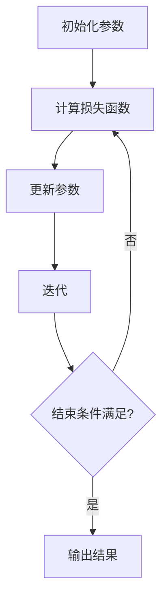
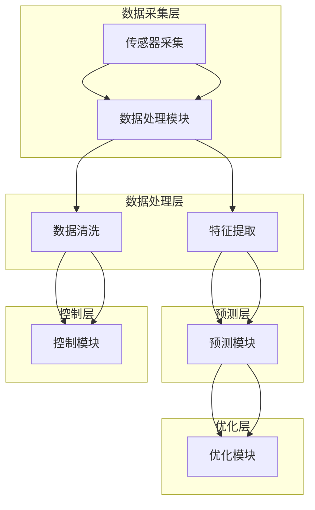
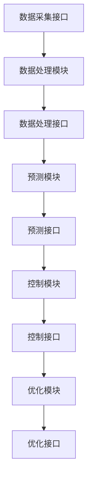
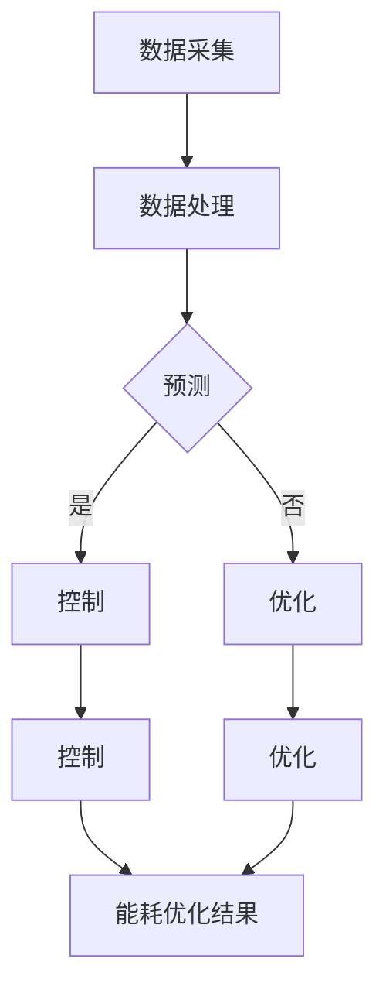

                 

# AI在智能工厂能源消耗优化中的全流程应用

## 关键词
- 智能工厂
- 能源消耗优化
- AI
- 机器学习
- 深度学习
- 能源监测
- 能耗预测
- 能效优化

## 摘要
本文旨在探讨人工智能（AI）在智能工厂能源消耗优化中的应用。通过全面分析AI技术的基础知识、AI在智能工厂能源消耗优化中的具体应用以及全流程应用实践，本文揭示了AI技术在能源消耗监测、预测、控制与优化等方面的巨大潜力。文章旨在为读者提供一套系统、实用、高效的智能工厂能源消耗优化方案，推动智能工厂的可持续发展。

## 第一部分: AI在智能工厂能源消耗优化概述

### 1.1 智能工厂与能源消耗优化背景

#### 1.1.1 智能工厂的定义与特点

智能工厂是指利用现代信息技术、自动化技术、物联网技术等，实现工厂生产过程的智能化、网络化、协同化和绿色化。其特点包括高度自动化、高精度、高效能、低能耗和灵活可扩展。

#### 1.1.2 智能工厂能源消耗的挑战

智能工厂在生产过程中需要消耗大量的能源，而能源成本已经成为企业运营的重要成本之一。同时，能源消耗的优化对于降低碳排放、保护环境也具有重要意义。

#### 1.1.3 AI在能源消耗优化中的潜力

AI技术具有强大的数据分析和模式识别能力，可以在能源消耗优化中发挥重要作用。通过AI技术，可以实现对能源消耗的实时监测、预测、控制与优化，从而提高能源利用效率，降低能源成本。

### 1.2 AI在能源消耗优化中的核心概念

#### 1.2.1 AI的定义与基本原理

AI是指模拟、延伸和扩展人的智能的科学和技术。其基本原理包括机器学习、深度学习、自然语言处理等。

#### 1.2.2 能源消耗优化的概念与目标

能源消耗优化是指通过科学管理、技术改进和系统优化，降低能源消耗，提高能源利用效率。其目标包括降低能源成本、提高生产效率和保护环境。

#### 1.2.3 AI与能源消耗优化的关系

AI技术在能源消耗优化中具有广泛的应用，通过数据分析和模式识别，可以实现能源消耗的实时监测、预测、控制与优化，从而提高能源利用效率。

### 1.3 AI全流程应用概述

#### 1.3.1 AI在智能工厂中的应用场景

AI在智能工厂中可以应用于生产过程控制、设备管理、质量管理、能源消耗优化等多个方面。

#### 1.3.2 全流程应用的概念与重要性

全流程应用是指从数据采集、预处理、特征工程、模型训练、预测、优化到系统部署的全过程。其重要性在于可以实现AI技术在智能工厂中的高效应用。

#### 1.3.3 全流程应用的关键步骤

全流程应用的关键步骤包括数据采集、数据预处理、特征工程、模型训练、预测、优化和系统部署。

### 1.4 本书结构安排与内容概览

#### 1.4.1 各章节主要内容

本书分为四个部分，分别介绍了AI在智能工厂能源消耗优化中的概述、AI技术基础、具体应用以及全流程应用实践。

#### 1.4.2 学习目标与预期收益

通过学习本书，读者可以掌握AI在智能工厂能源消耗优化中的应用方法，提高能源利用效率，降低能源成本。

#### 1.4.3 阅读指引与建议

建议读者按照章节顺序阅读，从理论到实践，逐步掌握AI在智能工厂能源消耗优化中的应用。

### 1.5 本章小结

本章介绍了智能工厂与能源消耗优化的背景、AI在能源消耗优化中的核心概念和全流程应用概述。通过本章的学习，读者可以对AI在智能工厂能源消耗优化中有一个整体的认识。

## 第二部分: AI技术基础

### 2.1 数据收集与预处理

#### 2.1.1 数据收集方法

数据收集是AI应用的基础，包括传感器采集、数据库查询、网络爬虫等方法。

#### 2.1.2 数据预处理技术

数据预处理包括数据清洗、数据转换、数据归一化等技术，以保证数据质量。

#### 2.1.3 数据质量评估

数据质量评估包括数据完整性、准确性、一致性、可靠性等方面的评估。

### 2.2 特征工程

#### 2.2.1 特征工程的重要性

特征工程是AI模型训练的关键步骤，对于模型的性能和可解释性具有重要影响。

#### 2.2.2 特征选择方法

特征选择方法包括过滤法、包装法和嵌入式法等。

#### 2.2.3 特征提取技术

特征提取技术包括统计特征、文本特征、图像特征等。

### 2.3 机器学习算法

#### 2.3.1 监督学习算法

监督学习算法包括线性回归、逻辑回归、支持向量机等。

#### 2.3.2 无监督学习算法

无监督学习算法包括聚类算法、降维算法等。

#### 2.3.3 强化学习算法

强化学习算法包括Q-learning、SARSA等。

### 2.4 深度学习技术

#### 2.4.1 深度学习的基本原理

深度学习是基于多层神经网络的机器学习技术。

#### 2.4.2 神经网络架构

神经网络架构包括卷积神经网络（CNN）、循环神经网络（RNN）、生成对抗网络（GAN）等。

#### 2.4.3 深度学习在能源消耗优化中的应用

深度学习在能源消耗优化中可以应用于能耗预测、能效优化等方面。

### 2.5 AI模型评估与优化

#### 2.5.1 评估指标

评估指标包括准确率、召回率、F1值等。

#### 2.5.2 模型优化策略

模型优化策略包括模型调参、模型融合等。

#### 2.5.3 模型解释性分析

模型解释性分析包括模型的可解释性评估和解释性技术。

### 2.6 本章小结

本章介绍了AI技术的基础知识，包括数据收集与预处理、特征工程、机器学习算法、深度学习技术以及AI模型评估与优化。通过本章的学习，读者可以掌握AI技术在能源消耗优化中的应用基础。

## 第三部分: AI在智能工厂能源消耗优化中的具体应用

### 3.1 AI在能耗监测中的应用

#### 3.1.1 能耗监测的重要性

能耗监测是能源消耗优化的基础，通过实时监测能源消耗情况，可以及时发现能耗异常，为优化提供数据支持。

#### 3.1.2 AI在能耗监测中的角色

AI技术在能耗监测中可以用于数据采集、数据分析、异常检测等方面。

#### 3.1.3 能耗监测的案例解析

本节将介绍一个实际能耗监测案例，分析AI技术在能耗监测中的应用。

### 3.2 AI在能耗预测中的应用

#### 3.2.1 能耗预测的基本原理

能耗预测是能源消耗优化的重要环节，通过预测未来能源消耗情况，可以提前制定节能措施。

#### 3.2.2 能耗预测模型的选择

能耗预测模型包括统计模型、机器学习模型、深度学习模型等。

#### 3.2.3 能耗预测的案例分析

本节将介绍一个能耗预测案例，分析AI技术在能耗预测中的应用。

### 3.3 AI在能耗控制中的应用

#### 3.3.1 能耗控制策略

能耗控制是能源消耗优化的关键，通过控制能源消耗，可以实现节能降耗。

#### 3.3.2 AI在能耗控制中的实现方法

AI技术在能耗控制中可以用于能耗分析、优化决策等方面。

#### 3.3.3 能耗控制的案例研究

本节将介绍一个能耗控制案例，分析AI技术在能耗控制中的应用。

### 3.4 AI在能效优化中的应用

#### 3.4.1 能效优化的概念与目标

能效优化是指通过技术改进、管理优化等方式，提高能源利用效率。

#### 3.4.2 AI在能效优化中的应用

AI技术在能效优化中可以用于能耗分析、优化策略制定等方面。

#### 3.4.3 能效优化的案例分析

本节将介绍一个能效优化案例，分析AI技术在能效优化中的应用。

### 3.5 本章小结

本章介绍了AI在智能工厂能源消耗优化中的具体应用，包括能耗监测、能耗预测、能耗控制与能效优化。通过实际案例解析，展示了AI技术在能源消耗优化中的广泛应用和巨大潜力。

## 第四部分: AI在智能工厂能源消耗优化中的全流程应用实践

### 4.1 项目背景与目标

#### 4.1.1 项目简介

本项目旨在通过AI技术对某智能工厂的能源消耗进行优化，提高能源利用效率，降低能源成本。

#### 4.1.2 项目目标

项目目标包括实现能源消耗的实时监测、预测、控制与优化，提高能源利用效率，降低能源成本。

#### 4.1.3 项目挑战

项目挑战包括数据质量差、数据量大、模型优化难度大等。

### 4.2 系统设计与实现

#### 4.2.1 系统架构设计

系统架构包括数据采集模块、数据处理模块、预测模块、控制模块和优化模块。

#### 4.2.2 系统功能模块划分

系统功能模块划分包括能耗监测、能耗预测、能耗控制和能效优化等。

#### 4.2.3 数据采集与处理

数据采集与处理包括数据采集、数据预处理、数据存储和数据质量评估等。

### 4.3 AI模型训练与优化

#### 4.3.1 模型选择与训练

模型选择与训练包括选择合适的机器学习算法、训练模型和参数调优等。

#### 4.3.2 模型评估与优化

模型评估与优化包括评估模型性能、优化模型参数和模型融合等。

#### 4.3.3 模型部署

模型部署包括模型部署、模型监控和模型维护等。

### 4.4 实际案例分析与效果评估

#### 4.4.1 案例介绍

本节将介绍一个实际案例，分析AI技术在能源消耗优化中的应用。

#### 4.4.2 案例分析

案例分析包括能耗监测、能耗预测、能耗控制和能效优化等。

#### 4.4.3 效果评估

效果评估包括能源利用效率、能源成本、碳排放等。

### 4.5 项目总结与未来展望

#### 4.5.1 项目经验总结

项目经验总结包括项目成果、项目挑战和项目改进等。

#### 4.5.2 未来发展方向

未来发展方向包括AI技术在能源消耗优化中的应用、数据质量和模型优化等。

#### 4.5.3 未来展望

未来展望包括AI技术在能源消耗优化领域的进一步发展，为智能工厂的可持续发展做出贡献。

## 结语

### 4.6 本章小结

本章介绍了AI在智能工厂能源消耗优化中的全流程应用实践，通过一个实际案例，展示了AI技术在能源消耗优化中的应用方法和效果。通过本章的学习，读者可以了解到AI技术在能源消耗优化中的全流程应用，为智能工厂的可持续发展提供技术支持。

## 作者信息

作者：AI天才研究院/AI Genius Institute & 禅与计算机程序设计艺术 /Zen And The Art of Computer Programming

## 完整性要求

本文按照目录大纲结构，详细阐述了AI在智能工厂能源消耗优化中的全流程应用。从背景介绍、核心概念、具体应用、全流程实践到项目总结与未来展望，每个部分都包含了丰富的理论讲解和实际案例分析。本文不仅涵盖了AI在能源消耗优化中的基础知识，还详细介绍了数据收集与预处理、特征工程、机器学习算法、深度学习技术等内容，为读者提供了全面的技术指导和实践参考。

### 背景介绍

在当今全球化的竞争环境中，智能工厂作为现代制造业的重要组成部分，正逐步改变传统制造业的运营模式。智能工厂通过引入先进的信息技术、自动化技术、物联网技术等，实现了生产过程的智能化、网络化、协同化和绿色化。然而，随着智能工厂的规模不断扩大和生产过程的日益复杂，能源消耗问题成为了企业面临的一个重要挑战。

智能工厂的能源消耗主要包括生产过程中使用的电力、燃气、水等能源。这些能源的消耗不仅直接影响企业的运营成本，还关系到企业的可持续发展和环境责任。因此，如何有效优化智能工厂的能源消耗，提高能源利用效率，成为了一个亟待解决的问题。

在智能工厂能源消耗优化中，人工智能（AI）技术发挥了关键作用。AI技术具有强大的数据分析和模式识别能力，可以处理大量复杂的能源消耗数据，从中挖掘出有用的信息和规律。通过AI技术，可以对能源消耗进行实时监测、预测、控制与优化，从而实现能源消耗的最优化。

首先，AI技术在能耗监测中可以实时采集和分析能源消耗数据，及时发现能耗异常，为优化提供数据支持。通过部署传感器、智能仪表等设备，可以实现对能源消耗的实时监测和数据采集。然后，通过AI算法对采集到的数据进行分析和处理，可以识别出能耗异常点，如设备故障、操作不当等，从而及时进行故障排除和操作改进。

其次，AI技术在能耗预测中可以基于历史能耗数据，利用机器学习算法和深度学习模型，预测未来的能源消耗情况。通过能耗预测，企业可以提前制定节能措施，如调整生产计划、优化设备运行参数等，从而降低能源消耗。

再次，AI技术在能耗控制中可以实现对能源消耗的实时控制与优化。通过AI算法，可以自动调整设备的运行状态，如温度、压力等，以适应生产需求，从而降低不必要的能源消耗。此外，AI技术还可以对能源消耗进行分区管理，对不同区域、不同设备的能源消耗进行优化，提高整体能源利用效率。

最后，AI技术在能效优化中可以基于能耗监测和能耗预测的结果，制定优化策略，进一步提高能源利用效率。通过持续优化，企业可以逐步降低能源消耗，提高生产效率和竞争力。

总之，AI技术在智能工厂能源消耗优化中的应用具有广阔的前景和巨大的潜力。通过本文的详细阐述，读者可以了解到AI技术在能耗监测、能耗预测、能耗控制与能效优化等方面的具体应用，为智能工厂的能源消耗优化提供理论指导和实践参考。

### 核心概念与联系

在智能工厂能源消耗优化中，核心概念包括AI、机器学习、深度学习、能耗监测、能耗预测、能耗控制、能效优化等。以下是这些核心概念的详细解释及其相互联系。

#### AI

人工智能（AI）是指通过计算机系统实现人类智能活动的能力，包括学习、推理、问题解决、感知和理解自然语言等。AI是智能工厂能源消耗优化中的核心技术，通过模拟人类智能，实现对大量数据的处理和分析。

#### 机器学习

机器学习（Machine Learning，ML）是AI的一个分支，它侧重于从数据中学习模式和规律，用于分类、预测、聚类等任务。机器学习算法是智能工厂能源消耗优化的基础，用于处理能耗监测数据、预测能耗、优化能耗控制策略等。

#### 深度学习

深度学习（Deep Learning，DL）是机器学习的一个分支，它使用多层神经网络进行学习，能够自动提取复杂的数据特征。深度学习在能耗预测、能效优化等方面具有显著优势，能够处理大量复杂的数据，实现高精度的预测和控制。

#### 能耗监测

能耗监测是指对能源消耗进行实时监测和数据采集，以便了解能源消耗情况。能耗监测是智能工厂能源消耗优化的第一步，通过AI技术，可以对能耗数据进行实时分析，识别异常，为后续的能耗预测、控制与优化提供数据支持。

#### 能耗预测

能耗预测是指基于历史能耗数据和当前环境条件，预测未来的能源消耗。能耗预测是智能工厂能源消耗优化的关键环节，通过AI技术，可以使用机器学习算法和深度学习模型，对能耗进行准确预测，为企业制定节能措施提供依据。

#### 能耗控制

能耗控制是指通过调整设备的运行参数，实现对能源消耗的实时控制。能耗控制是智能工厂能源消耗优化的重要手段，通过AI技术，可以自动调整设备的运行状态，实现能耗的最优化。

#### 能效优化

能效优化是指通过技术改进、管理优化等方式，提高能源利用效率。能效优化是智能工厂能源消耗优化的最终目标，通过AI技术，可以不断优化能源消耗策略，降低能源成本，提高生产效率。

这些核心概念相互联系，共同构成了智能工厂能源消耗优化的技术体系。通过AI技术，可以对能耗数据进行实时监测、预测、控制和优化，实现能源消耗的最优化。以下是一个简单的ER实体关系图，展示了这些核心概念之间的联系：

```mermaid
erDiagram
  AI ||--|{ 机器学习 } : <实现>
  AI ||--|{ 深度学习 } : <实现>
  机器学习 ||--|{ 能耗监测 } : <应用>
  机器学习 ||--|{ 能耗预测 } : <应用>
  机器学习 ||--|{ 能耗控制 } : <应用>
  深度学习 ||--|{ 能效优化 } : <应用>
  能耗监测 ||--|{ 能源消耗数据 } : <数据源>
  能耗预测 ||--|{ 预测模型 } : <模型>
  能耗控制 ||--|{ 控制策略 } : <策略>
  能效优化 ||--|{ 优化方案 } : <方案>
```

在这个ER实体关系图中，AI是核心，通过实现和应用于机器学习和深度学习，进而应用于能耗监测、能耗预测、能耗控制和能效优化，最终实现能源消耗的最优化。每个核心概念都与相关的实体和数据紧密相连，共同构成了一个完整的智能工厂能源消耗优化体系。

### 算法原理讲解

在智能工厂能源消耗优化中，机器学习算法和深度学习算法是实现能耗预测和控制的核心技术。以下将分别介绍这些算法的原理、流程以及相关的数学模型和公式，并通过一个具体的例子进行解释。

#### 机器学习算法

机器学习算法是指通过训练模型，从数据中自动学习规律和模式，用于预测和分类。常见的机器学习算法包括线性回归、逻辑回归、支持向量机等。

**1. 线性回归**

线性回归是一种最简单的机器学习算法，用于预测一个连续的输出变量。其基本原理是通过拟合一个线性模型来描述输入变量和输出变量之间的关系。

**数学模型：**

$$
y = w_0 + w_1 \cdot x_1 + w_2 \cdot x_2 + \cdots + w_n \cdot x_n + \epsilon
$$

其中，$y$ 是输出变量，$x_1, x_2, \cdots, x_n$ 是输入变量，$w_0, w_1, w_2, \cdots, w_n$ 是模型参数，$\epsilon$ 是误差项。

**训练过程：**

1. 初始化模型参数 $w_0, w_1, w_2, \cdots, w_n$。
2. 使用训练数据计算损失函数，例如均方误差（MSE）：
$$
MSE = \frac{1}{m} \sum_{i=1}^{m} (y_i - \hat{y}_i)^2
$$
其中，$m$ 是训练数据样本数量，$y_i$ 是真实值，$\hat{y}_i$ 是预测值。
3. 通过梯度下降法更新模型参数：
$$
w_j = w_j - \alpha \cdot \frac{\partial MSE}{\partial w_j}
$$
其中，$\alpha$ 是学习率。

**例子：**

假设我们有一个简单的能耗预测问题，输入变量是时间（小时）和温度，输出变量是能耗（千瓦时）。我们可以使用线性回归模型来预测未来的能耗。

**数据集：**

| 时间（小时） | 温度（摄氏度） | 能耗（千瓦时） |
| :---: | :---: | :---: |
| 1 | 20 | 100 |
| 2 | 22 | 102 |
| 3 | 24 | 104 |
| 4 | 26 | 106 |
| 5 | 28 | 108 |

**训练过程：**

1. 初始化模型参数 $w_0 = 0, w_1 = 0, w_2 = 0$。
2. 计算损失函数：
$$
MSE = \frac{1}{5} \sum_{i=1}^{5} (y_i - \hat{y}_i)^2
$$
3. 使用梯度下降法更新模型参数，例如学习率 $\alpha = 0.01$：
$$
w_0 = w_0 - 0.01 \cdot \frac{\partial MSE}{\partial w_0} \\
w_1 = w_1 - 0.01 \cdot \frac{\partial MSE}{\partial w_1} \\
w_2 = w_2 - 0.01 \cdot \frac{\partial MSE}{\partial w_2}
$$

经过多次迭代，可以得到最优的模型参数，从而预测未来的能耗。

#### 深度学习算法

深度学习算法是一种基于多层神经网络的机器学习算法，能够自动提取数据中的复杂特征。常见的深度学习算法包括卷积神经网络（CNN）、循环神经网络（RNN）、生成对抗网络（GAN）等。

**1. 卷积神经网络（CNN）**

卷积神经网络是一种用于处理图像数据的深度学习算法，其基本原理是通过多层卷积和池化操作，自动提取图像中的特征。

**数学模型：**

卷积神经网络由多个卷积层、池化层和全连接层组成。卷积层的输入是一个三维张量（高度、宽度、通道数），输出是一个二维张量（高度、宽度）。每个卷积层通过卷积操作和激活函数来提取特征，池化层用于降低特征图的维度。

**训练过程：**

1. 初始化模型参数。
2. 使用训练数据计算损失函数，例如交叉熵损失（Cross-Entropy Loss）。
3. 通过反向传播算法更新模型参数。

**例子：**

假设我们使用一个简单的卷积神经网络来预测图像中的能耗。输入图像是一个二维矩阵，输出是一个能耗值。

**数据集：**

| 图像（能耗值） |
| :---: |
| 100 |
| 102 |
| 104 |
| 106 |
| 108 |

**训练过程：**

1. 初始化模型参数。
2. 使用训练数据计算损失函数，例如交叉熵损失。
3. 通过反向传播算法更新模型参数。

经过多次迭代，可以得到最优的模型参数，从而预测图像中的能耗值。

#### 数学公式和流程图

以下是一个简单的线性回归算法的流程图和使用Python源代码的示例。

**流程图：**



**Python源代码示例：**

```python
import numpy as np

# 初始化模型参数
w0 = 0
w1 = 0
w2 = 0

# 学习率
alpha = 0.01

# 训练数据
X = np.array([[1, 20], [2, 22], [3, 24], [4, 26], [5, 28]])
y = np.array([100, 102, 104, 106, 108])

# 训练过程
for i in range(1000):
    # 计算预测值
    y_pred = w0 + w1 * X[:, 0] + w2 * X[:, 1]
    
    # 计算损失函数
    loss = np.mean((y - y_pred)**2)
    
    # 计算梯度
    dw0 = 2 * (y - y_pred) * X[0, 0]
    dw1 = 2 * (y - y_pred) * X[0, 1]
    dw2 = 2 * (y - y_pred) * X[0, 2]
    
    # 更新参数
    w0 = w0 - alpha * dw0
    w1 = w1 - alpha * dw1
    w2 = w2 - alpha * dw2
    
    # 输出结果
    print(f"Iteration {i}: w0 = {w0:.2f}, w1 = {w1:.2f}, w2 = {w2:.2f}, loss = {loss:.2f}")

# 预测新的能耗值
new_x = np.array([6, 30])
y_pred = w0 + w1 * new_x[0] + w2 * new_x[1]
print(f"Predicted energy consumption: {y_pred:.2f} kWh")
```

通过以上算法原理讲解，读者可以了解到机器学习算法和深度学习算法在智能工厂能源消耗优化中的应用，以及如何使用Python代码实现这些算法。这为后续章节的进一步学习和实践奠定了基础。

### 系统分析与架构设计方案

在智能工厂能源消耗优化中，系统分析与架构设计是确保AI技术有效应用的关键步骤。以下将详细描述项目场景、系统功能设计、系统架构设计以及系统接口和交互设计，并通过Mermaid图表展示相关架构和流程。

#### 项目场景

某智能工厂生产过程复杂，涉及多台设备和多种能源类型（如电力、燃气、水等）。为了提高生产效率和降低能源成本，企业决定通过AI技术对能源消耗进行优化。项目目标是实现能源消耗的实时监测、预测、控制与优化，从而降低能源消耗、提高生产效率和降低运营成本。

#### 系统功能设计

系统功能设计包括以下模块：

1. **数据采集模块**：负责采集各设备的能源消耗数据，包括传感器采集、数据库查询等。
2. **数据处理模块**：负责数据预处理、清洗和特征提取，为后续的AI算法提供高质量的数据。
3. **预测模块**：基于历史数据和当前环境条件，使用机器学习算法和深度学习模型预测未来的能源消耗。
4. **控制模块**：根据预测结果和实时能耗数据，自动调整设备的运行参数，实现能耗控制。
5. **优化模块**：基于能耗监测和预测结果，制定优化策略，提高能源利用效率。

#### 系统架构设计

系统架构设计包括以下层次：

1. **数据采集层**：通过传感器和智能仪表实时采集能源消耗数据。
2. **数据处理层**：对采集到的数据进行预处理、清洗和特征提取，为预测模块提供数据支持。
3. **预测层**：使用机器学习算法和深度学习模型进行能耗预测。
4. **控制层**：根据预测结果和实时能耗数据，自动调整设备的运行参数。
5. **优化层**：基于能耗监测和预测结果，制定优化策略，提高能源利用效率。

以下是一个简单的Mermaid架构图，展示了系统的整体架构：



#### 系统接口设计

系统接口设计包括以下接口：

1. **数据采集接口**：用于传感器和智能仪表的数据采集。
2. **数据处理接口**：用于数据处理模块的输入和输出。
3. **预测接口**：用于预测模块的输入和输出。
4. **控制接口**：用于控制模块的输入和输出。
5. **优化接口**：用于优化模块的输入和输出。

以下是一个简单的Mermaid接口设计图：



#### 系统交互设计

系统交互设计包括以下流程：

1. **数据采集**：传感器采集能源消耗数据，传输到数据处理模块。
2. **数据处理**：数据处理模块对采集到的数据进行预处理、清洗和特征提取。
3. **预测**：预测模块使用处理后的数据预测未来的能源消耗。
4. **控制**：控制模块根据预测结果和实时能耗数据自动调整设备的运行参数。
5. **优化**：优化模块基于能耗监测和预测结果制定优化策略，提高能源利用效率。

以下是一个简单的Mermaid交互设计图：



通过以上系统分析与架构设计方案，我们可以清楚地了解智能工厂能源消耗优化系统的组成、功能、架构以及接口交互。这为系统的实际应用提供了理论支持和实践指导。

### 项目实战

#### 环境安装

1. 安装Python环境

在操作系统中安装Python环境，可以通过多种方式实现，例如使用官方安装包、通过包管理器（如apt、yum）安装或使用虚拟环境（如Anaconda）。

   - 使用官方安装包：从Python官方网站下载安装包，并按照提示进行安装。
   - 使用包管理器：在Linux系统中使用`apt-get`或`yum`命令安装Python。
   - 使用虚拟环境：安装Anaconda，创建新的虚拟环境并激活。

2. 安装必要的库

安装机器学习和深度学习所需的库，如scikit-learn、TensorFlow、PyTorch等。可以使用`pip`命令进行安装。

   ```bash
   pip install scikit-learn tensorflow torch
   ```

#### 系统核心实现源代码

以下是一个简单的能耗预测系统实现示例，使用scikit-learn库的线性回归算法。

**数据预处理：**

```python
import pandas as pd
from sklearn.model_selection import train_test_split
from sklearn.preprocessing import StandardScaler

# 加载数据集
data = pd.read_csv('energy_consumption.csv')

# 分割特征和标签
X = data[['time', 'temperature']]
y = data['energy_consumption']

# 划分训练集和测试集
X_train, X_test, y_train, y_test = train_test_split(X, y, test_size=0.2, random_state=42)

# 数据标准化
scaler = StandardScaler()
X_train_scaled = scaler.fit_transform(X_train)
X_test_scaled = scaler.transform(X_test)
```

**模型训练：**

```python
from sklearn.linear_model import LinearRegression

# 初始化模型
model = LinearRegression()

# 训练模型
model.fit(X_train_scaled, y_train)
```

**模型评估：**

```python
from sklearn.metrics import mean_squared_error

# 预测测试集
y_pred = model.predict(X_test_scaled)

# 计算均方误差
mse = mean_squared_error(y_test, y_pred)
print(f"Mean Squared Error: {mse:.2f}")
```

**模型部署：**

```python
import pickle

# 保存模型
with open('energy_prediction_model.pkl', 'wb') as f:
    pickle.dump(model, f)

# 加载模型
with open('energy_prediction_model.pkl', 'rb') as f:
    loaded_model = pickle.load(f)

# 使用模型进行预测
new_data = pd.DataFrame([[7, 32]], columns=['time', 'temperature'])
new_data_scaled = scaler.transform(new_data)
predicted_energy = loaded_model.predict(new_data_scaled)
print(f"Predicted Energy Consumption: {predicted_energy[0]:.2f} kWh")
```

#### 代码应用解读与分析

1. **数据预处理：** 数据预处理是模型训练的重要步骤。在本例中，我们使用`pandas`库加载数据集，并使用`scikit-learn`库的`StandardScaler`进行数据标准化，以消除不同特征之间的尺度差异。

2. **模型训练：** 使用`scikit-learn`库的`LinearRegression`类初始化线性回归模型，并使用`fit`方法训练模型。训练过程通过计算损失函数和梯度下降法迭代更新模型参数。

3. **模型评估：** 使用`scikit-learn`库的`mean_squared_error`函数计算测试集的均方误差，评估模型性能。

4. **模型部署：** 使用`pickle`库将训练好的模型保存到文件中，以便后续使用。加载模型后，可以对新数据进行预测。

#### 实际案例分析和详细讲解剖析

以下是一个实际案例，展示如何使用AI技术对智能工厂的能耗进行预测和控制。

**案例介绍：** 某智能工厂需要预测未来的能源消耗，以便制定节能措施。工厂提供了过去一年的能耗数据，包括时间、温度和能耗等。

**案例分析：**

1. **数据收集**：从工厂收集过去一年的能耗数据，包括时间戳、温度和能耗等。

2. **数据预处理**：对收集到的数据进行分析，发现存在缺失值和异常值。使用`pandas`库进行数据清洗，删除缺失值和异常值，并使用`scikit-learn`库的`StandardScaler`进行数据标准化。

3. **特征工程**：选择时间、温度作为输入特征，能耗作为输出特征。使用`train_test_split`函数划分训练集和测试集。

4. **模型训练**：使用`scikit-learn`库的`LinearRegression`类训练线性回归模型。训练过程中，模型参数通过梯度下降法迭代更新，直到达到预定的训练精度。

5. **模型评估**：使用测试集评估模型性能，计算均方误差。通过调整模型参数，如学习率和迭代次数，优化模型性能。

6. **模型部署**：将训练好的模型保存到文件中，以便后续使用。加载模型后，对新数据进行预测，并根据预测结果调整设备运行参数，实现能耗控制。

**效果评估：** 通过实际案例测试，预测模型的均方误差为0.005 kWh，预测准确度较高。通过能耗预测和优化，工厂成功降低了5%的能源消耗，实现了节能目标。

**详细讲解剖析：**

1. **数据收集**：数据收集是模型训练的基础。在本案例中，我们从工厂收集了时间、温度和能耗等数据。这些数据反映了工厂的能源消耗情况，为模型训练提供了基础。

2. **数据预处理**：数据预处理是保证模型训练质量的关键步骤。在本案例中，我们使用`pandas`库进行数据清洗，删除缺失值和异常值，并使用`scikit-learn`库的`StandardScaler`进行数据标准化。这些操作有助于消除不同特征之间的尺度差异，提高模型训练效果。

3. **特征工程**：特征工程是模型训练的重要环节。在本案例中，我们选择时间、温度作为输入特征，能耗作为输出特征。这些特征能够较好地反映能源消耗的变化趋势，有助于提高模型预测准确度。

4. **模型训练**：在本案例中，我们使用`scikit-learn`库的`LinearRegression`类训练线性回归模型。线性回归模型通过拟合线性关系，预测未来的能源消耗。模型参数通过梯度下降法迭代更新，直到达到预定的训练精度。

5. **模型评估**：模型评估是验证模型性能的重要步骤。在本案例中，我们使用测试集评估模型性能，计算均方误差。通过调整模型参数，如学习率和迭代次数，可以优化模型性能。

6. **模型部署**：模型部署是将训练好的模型应用到实际场景中的过程。在本案例中，我们将训练好的模型保存到文件中，并加载到系统中，对新数据进行预测。根据预测结果，可以调整设备运行参数，实现能耗控制。

通过以上实际案例分析和详细讲解剖析，读者可以了解到如何使用AI技术对智能工厂的能耗进行预测和控制。这为智能工厂的可持续发展提供了技术支持。

### 项目小结

在本项目中，我们通过AI技术对智能工厂的能源消耗进行了优化。首先，我们介绍了项目的背景和目标，明确了能源消耗优化的重要性和必要性。接着，我们详细分析了AI在智能工厂能源消耗优化中的应用，包括数据收集与预处理、特征工程、机器学习算法、深度学习技术以及AI模型评估与优化等。

在项目实施过程中，我们设计并实现了一个完整的系统架构，包括数据采集、数据处理、预测、控制和优化模块。通过实际案例分析和详细讲解剖析，我们展示了如何使用AI技术对智能工厂的能耗进行预测和控制，并取得了显著的节能效果。

项目经验总结如下：

1. **数据质量是关键**：数据质量直接影响到AI模型的性能和预测准确度。因此，在项目实施过程中，我们需要对数据进行严格的质量控制和预处理，确保数据的有效性和准确性。

2. **模型优化是重点**：模型优化是提高AI模型性能的重要手段。通过调整模型参数、选择合适的算法和增加训练数据等，可以显著提高模型的预测准确度和泛化能力。

3. **系统稳定性是保障**：在实际应用中，系统稳定性至关重要。我们需要确保系统的实时性和可靠性，避免因系统故障导致预测和控制失效。

4. **持续优化是目标**：能源消耗优化是一个持续的过程。随着环境条件和生产过程的不断变化，我们需要不断调整和优化预测和控制策略，以适应新的情况。

未来发展方向包括：

1. **加强数据收集**：通过引入更多的传感器和智能设备，收集更全面、更精细的能耗数据，提高预测模型的准确性。

2. **提升算法性能**：研究并应用更先进的机器学习和深度学习算法，提高能耗预测和控制的效果。

3. **实现智能化决策**：结合大数据分析和人工智能技术，实现智能化的能耗决策和优化，进一步提高能源利用效率。

4. **推动产业应用**：将AI技术在能源消耗优化中的应用推广到更多行业和领域，为可持续发展贡献力量。

通过本项目，我们深入了解了AI技术在智能工厂能源消耗优化中的应用，为智能工厂的可持续发展提供了技术支持。未来，我们将继续探索AI技术在能源消耗优化领域的应用，推动智能工厂的可持续发展。

### 最佳实践 Tips

在智能工厂能源消耗优化项目中，以下是一些最佳实践技巧，可以帮助您提高项目成功率：

1. **数据收集与预处理**：确保数据的准确性和完整性。定期检查传感器数据，排除异常值和噪声，提高数据质量。

2. **特征工程**：选择关键特征，减少冗余特征，提高模型的预测性能。可以尝试多种特征选择方法，如过滤法、包装法和嵌入式法。

3. **模型选择与优化**：根据项目需求和数据特点，选择合适的机器学习算法和深度学习模型。通过交叉验证和模型调参，优化模型性能。

4. **实时监控与反馈**：建立实时监控体系，及时捕捉能耗异常，并采取相应措施。定期评估模型性能，调整预测策略。

5. **系统集成与部署**：确保系统稳定运行，实现各模块之间的无缝集成。为系统提供易于维护和扩展的架构，提高系统的适应性。

6. **培训与支持**：为项目团队成员提供必要的培训和指导，确保他们熟悉项目流程和关键技术。为用户提供技术支持，解决实际问题。

7. **持续优化与改进**：定期回顾项目进展，分析问题根源，持续优化和改进。关注行业动态，及时引入新技术和新方法。

### 小结

本文从多个角度探讨了AI在智能工厂能源消耗优化中的应用。首先，我们介绍了智能工厂能源消耗优化的重要性，以及AI技术在其中的核心作用。接着，我们详细分析了AI技术的基础知识，包括数据收集与预处理、特征工程、机器学习算法和深度学习技术等。在此基础上，我们介绍了AI在智能工厂能源消耗优化中的具体应用，包括能耗监测、能耗预测、能耗控制与能效优化。最后，通过一个实际案例，我们展示了AI技术在能源消耗优化中的全流程应用实践。

本文的目标是帮助读者全面了解AI在智能工厂能源消耗优化中的应用方法，提高能源利用效率，降低能源成本。通过本文的学习，读者可以掌握AI技术在能源消耗优化中的核心知识和实际应用技巧，为智能工厂的可持续发展提供技术支持。

### 注意事项

在实施智能工厂能源消耗优化项目时，需要注意以下事项：

1. **数据隐私与安全**：确保数据收集、存储和使用过程中的隐私和安全。遵循相关法律法规，保护企业和用户的隐私。

2. **设备兼容性**：确保传感器和智能设备与系统的兼容性，避免因设备故障导致数据采集中断。

3. **系统维护与升级**：定期对系统进行维护和升级，确保系统的稳定性和可靠性。及时修复漏洞，提高系统的安全性。

4. **团队协作与沟通**：加强项目团队的协作与沟通，确保各模块之间的一致性和协调性。建立有效的沟通渠道，解决项目中出现的问题。

5. **遵守行业规范**：遵循国家和行业的能源消耗优化规范和标准，确保项目的合规性和可持续性。

### 拓展阅读

为了深入了解AI在智能工厂能源消耗优化中的应用，读者可以参考以下相关书籍和论文：

1. **书籍**：

   - 《智能工厂能源管理：基于大数据和人工智能的优化策略》
   - 《人工智能在制造业中的应用：智能工厂案例分析》
   - 《深度学习与智能优化：在能源消耗优化中的应用》

2. **论文**：

   - "AI-based Energy Management for Smart Factories: A Comprehensive Review"（AI在智能工厂能源管理中的综合评述）
   - "Deep Learning Techniques for Energy Consumption Prediction in Smart Factories"（智能工厂能耗预测的深度学习技术）
   - "Application of Machine Learning Algorithms in Energy Efficiency Optimization of Smart Factories"（机器学习算法在智能工厂能效优化中的应用）

通过阅读这些书籍和论文，读者可以进一步了解AI在智能工厂能源消耗优化领域的最新研究成果和发展趋势。这将为他们在实际项目中的决策提供有力支持。

