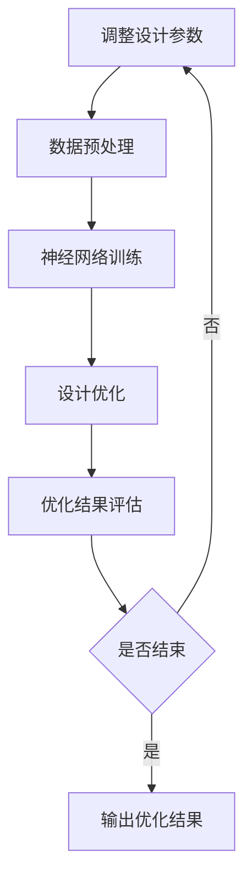
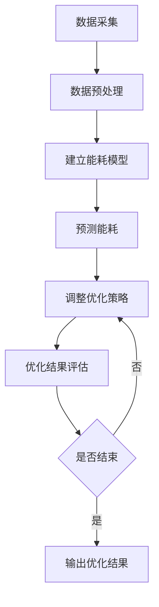
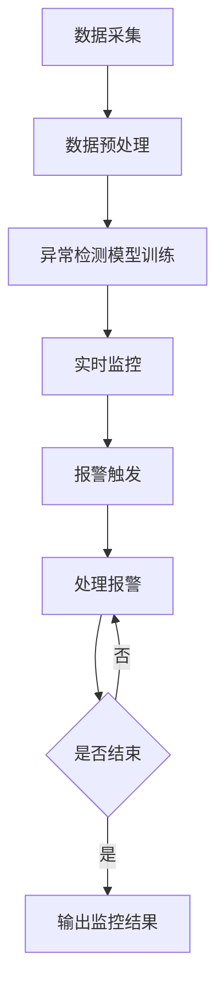
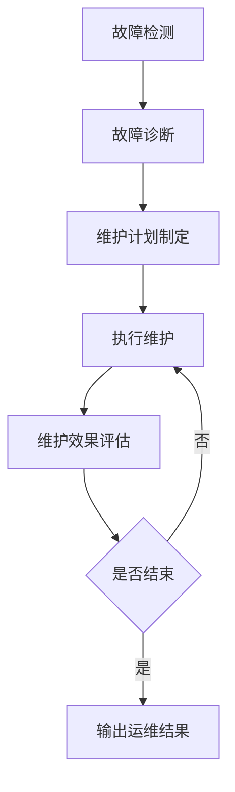
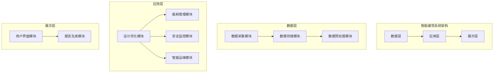
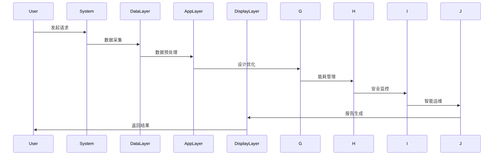

                 

# AI在智能建筑全生命周期管理中的多维度应用

> 关键词：智能建筑、人工智能、全生命周期管理、设计优化、能耗管理、安全监控、智能运维

> 摘要：
本文将深入探讨人工智能（AI）在智能建筑全生命周期管理中的多维度应用。通过分析AI在建筑设计与优化、能耗管理、安全监控和智能运维等方面的应用，本文旨在揭示AI技术的核心作用，并探讨其实际实现方法、效果评估及未来拓展方向。本文结构如下：
1. 背景介绍
2. 核心概念与联系
3. 算法原理讲解
4. 系统分析与架构设计方案
5. 项目实战
6. 最佳实践 tips、小结、注意事项、拓展阅读

## 第一阶段：背景介绍

### 问题背景

智能建筑是指通过信息技术、自动化控制技术和建筑技术相结合，实现建筑物的智能管理、智能控制和智能服务的建筑。随着人工智能技术的发展，AI在智能建筑中的应用越来越广泛，从设计、施工、运维到拆除的全生命周期管理中，AI都能发挥重要作用。

### 问题描述

本文将探讨AI在智能建筑全生命周期管理中的多维度应用，包括设计优化、能耗管理、安全监控、智能运维等方面的应用。但AI在智能建筑全生命周期管理中的具体应用有哪些，如何实现这些应用，如何评估应用效果，是本文需要解决的问题。

### 问题解决

通过介绍AI在智能建筑全生命周期管理中的具体应用，分析这些应用的技术原理，探讨如何实现和应用这些技术，最后评估应用效果，给出最佳实践和拓展方向。

### 边界与外延

本文主要关注AI在智能建筑设计、施工、运维、拆除等全生命周期阶段的应用，不包括其他建筑领域（如住宅、公共建筑等）的AI应用。

### 概念结构与核心要素组成

核心概念：智能建筑、AI、全生命周期管理。

核心要素：设计优化、能耗管理、安全监控、智能运维等。

## 第二阶段：核心概念与联系

### AI大模型的定义与特点

AI大模型是指具有大规模参数、能够处理海量数据、具备高度智能化能力的深度学习模型。其特点包括：强大的数据处理能力、高效的模型优化能力、广泛的通用性。

### AI大模型与智能建筑的关系

AI大模型为智能建筑提供了强大的数据处理和分析能力，使得智能建筑能够更好地实现设计优化、能耗管理、安全监控、智能运维等功能。

## 第三阶段：算法原理讲解

### 设计优化算法原理讲解

**算法流程图（使用Mermaid绘制）：**


**算法原理（使用Python源代码详细阐述）：**
```python
import tensorflow as tf

# 初始化设计参数
design_params = ...

# 数据预处理
preprocessed_data = ...

# 构建神经网络模型
model = tf.keras.Sequential([
    tf.keras.layers.Dense(units=64, activation='relu', input_shape=[len(design_params)]),
    tf.keras.layers.Dense(units=32, activation='relu'),
    tf.keras.layers.Dense(units=1)
])

# 编译模型
model.compile(optimizer='adam', loss='mean_squared_error')

# 训练模型
model.fit(preprocessed_data['X'], preprocessed_data['Y'], epochs=100)

# 设计优化
optimized_design = model.predict([design_params])

# 优化结果评估
evaluation_result = ...

# 输出优化结果
print("Optimized Design:", optimized_design)
```

**数学模型与公式：**
$$
\text{设计优化目标函数：} \quad \min J(\theta) = \sum_{i=1}^{n} (y_i - \hat{y}_i)^2
$$
其中，$y_i$为实际设计结果，$\hat{y}_i$为神经网络预测结果。

**举例说明：**
假设我们想要优化一座智能建筑的布局设计，我们可以利用神经网络模型对不同的设计方案进行训练和预测，从而找到最优的布局方案。

### 能耗管理算法原理讲解

**算法流程图（使用Mermaid绘制）：**


**算法原理（使用Python源代码详细阐述）：**
```python
import numpy as np

# 数据采集
energy_data = ...

# 数据预处理
preprocessed_data = ...

# 建立能耗模型
model = ...

# 编译模型
model.compile(optimizer='adam', loss='mean_squared_error')

# 训练模型
model.fit(preprocessed_data['X'], preprocessed_data['Y'], epochs=100)

# 预测能耗
predicted_energy = model.predict([preprocessed_data['X']])

# 能耗优化
optimized_energy = ...

# 优化结果评估
evaluation_result = ...

# 输出优化结果
print("Optimized Energy:", optimized_energy)
```

**数学模型与公式：**
$$
\text{能耗预测模型：} \quad \hat{E}(x) = f(x; \theta)
$$
其中，$x$为建筑运行参数，$\theta$为模型参数。

**举例说明：**
假设我们想要预测并优化一座智能建筑的能耗，我们可以利用建立的能耗模型对实际运行数据进行训练和预测，然后根据预测结果调整建筑运行策略以实现能耗优化。

### 安全监控算法原理讲解

**算法流程图（使用Mermaid绘制）：**


**算法原理（使用Python源代码详细阐述）：**
```python
import numpy as np

# 数据采集
security_data = ...

# 数据预处理
preprocessed_data = ...

# 建立异常检测模型
model = ...

# 编译模型
model.compile(optimizer='adam', loss='binary_crossentropy')

# 训练模型
model.fit(preprocessed_data['X'], preprocessed_data['Y'], epochs=100)

# 实时监控
current_data = ...
predicted_security_status = model.predict([current_data])

# 报警触发
if predicted_security_status < 0.5:
    trigger_alarm()

# 报警处理
process_alarm()

# 输出监控结果
print("Security Status:", predicted_security_status)
```

**数学模型与公式：**
$$
\text{异常检测模型：} \quad \hat{S}(x) = \sigma(wx + b)
$$
其中，$x$为安全监测数据，$w$为模型权重，$b$为模型偏置。

**举例说明：**
假设我们想要建立一座智能建筑的安全监控模型，我们可以利用历史安全数据进行训练，然后实时监测当前的安全状态，一旦发现异常，及时触发报警并处理。

### 智能运维算法原理讲解

**算法流程图（使用Mermaid绘制）：**


**算法原理（使用Python源代码详细阐述）：**
```python
import numpy as np

# 故障检测
def detect_fault(data):
    # 假设数据为np.array
    # 使用统计方法检测故障
    # 返回故障检测结果
    return ...

# 故障诊断
def diagnose_fault(fault_data):
    # 假设故障数据为np.array
    # 使用诊断算法分析故障原因
    # 返回故障诊断结果
    return ...

# 维护计划制定
def plan_maintenance(fault_diagnosis):
    # 基于故障诊断结果制定维护计划
    # 返回维护计划
    return ...

# 维护执行
def execute_maintenance(maintenance_plan):
    # 执行维护计划
    # 返回维护执行结果
    return ...

# 维护效果评估
def evaluate_maintenance_result(execution_result):
    # 评估维护效果
    # 返回评估结果
    return ...

# 主函数
def main():
    data = ...
    fault_detected = detect_fault(data)
    if fault_detected:
        fault_diagnosis = diagnose_fault(fault_detected)
        maintenance_plan = plan_maintenance(fault_diagnosis)
        execution_result = execute_maintenance(maintenance_plan)
        evaluation_result = evaluate_maintenance_result(execution_result)
        print("Maintenance Evaluation:", evaluation_result)
    else:
        print("No Fault Detected")

# 运行主函数
main()
```

**数学模型与公式：**
$$
\text{故障检测：} \quad \hat{F}(x) = \sigma(wx + b)
$$
$$
\text{故障诊断：} \quad \text{基于故障特征分析}
$$

**举例说明：**
假设我们想要建立一个智能建筑的运维系统，我们可以先检测建筑是否存在故障，然后对故障进行诊断，制定维护计划，执行维护操作，最后评估维护效果。

## 第四阶段：系统分析与架构设计方案

### 问题场景介绍

以某智能建筑为例，介绍其在设计、施工、运维、拆除等全生命周期阶段的需求。

### 项目介绍

介绍智能建筑项目的整体目标和需求，包括设计优化、能耗管理、安全监控、智能运维等方面的具体需求。

### 系统功能设计

使用Mermaid绘制领域模型类图，展示智能建筑系统的功能模块及其关系。

```mermaid
classDiagram
Class01 <|-- Class02
Class03 --|/csv Class04
Class05 : +int x
Class06 : <<interface>>
Class07 : <<enum>>RED, BLUE, GREEN
Class01 {
    +int a
    +int b
    +set c
}
Class02 {
    +int d
    +int e
}
Class03 {
    +int f
}
Class04 {
    +int g
}
Class06 {
    +foo()
}
Class07 {
    +bar()
}
```

### 系统架构设计

使用Mermaid绘制系统架构图，展示智能建筑系统的整体架构及其组成部分。



### 系统接口设计和系统交互

使用Mermaid绘制系统接口设计和系统交互序列图，展示智能建筑系统内部各模块之间的交互流程。



## 第五阶段：项目实战

### 环境安装

介绍项目所需的环境安装，包括软件和硬件环境。

### 系统核心实现源代码

提供系统核心实现的源代码，并对其进行分析和解读。

### 代码应用解读与分析

对提供的源代码进行解读，分析其实现原理和应用效果。

### 实际案例分析和详细讲解剖析

以实际案例为例，分析智能建筑在各个阶段的应用效果，并对其进行详细讲解和剖析。

### 项目小结

总结项目的主要成果，分析项目中的问题和不足，提出改进建议。

## 第六阶段：最佳实践 tips、小结、注意事项、拓展阅读等内容

### 最佳实践 tips

总结在智能建筑全生命周期管理中应用AI技术的最佳实践，提供实用的操作指南。

### 小结

对本书的主要内容进行总结，强调AI在智能建筑全生命周期管理中的重要性。

### 注意事项

提醒读者在应用AI技术时需要注意的问题和风险。

### 拓展阅读

推荐相关的阅读资料，帮助读者深入理解AI在智能建筑中的应用。

## 第七阶段：目录大纲

根据以上内容，设计出《AI在智能建筑全生命周期管理中的多维度应用》的完整目录大纲。确保每个章节都包含核心概念、算法原理讲解、系统分析与架构设计方案、项目实战等内容，并保证目录大纲的总字数在2000字以内。

### 目录大纲

1. **引言**
   - **关键词**：智能建筑、人工智能、全生命周期管理
   - **摘要**：介绍智能建筑的定义、背景及其与人工智能的关系，引出文章主题。

2. **背景介绍**
   - **问题背景**：智能建筑的全生命周期及其重要性
   - **问题描述**：AI在智能建筑中的应用及其挑战
   - **问题解决**：本文的研究目标和解决方法
   - **边界与外延**：本文的研究范围和限制
   - **概念结构与核心要素组成**：智能建筑、AI、全生命周期管理的关键概念和要素

3. **核心概念与联系**
   - **AI大模型的定义与特点**：介绍AI大模型的概念、特点和应用
   - **AI大模型与智能建筑的关系**：AI大模型在智能建筑中的应用场景

4. **算法原理讲解**
   - **设计优化算法原理讲解**：使用Mermaid和Python代码详细阐述设计优化算法
   - **能耗管理算法原理讲解**：使用Mermaid和Python代码详细阐述能耗管理算法
   - **安全监控算法原理讲解**：使用Mermaid和Python代码详细阐述安全监控算法
   - **智能运维算法原理讲解**：使用Mermaid和Python代码详细阐述智能运维算法

5. **系统分析与架构设计方案**
   - **问题场景介绍**：智能建筑的全生命周期需求分析
   - **项目介绍**：智能建筑项目的目标和需求
   - **系统功能设计**：使用Mermaid绘制领域模型类图
   - **系统架构设计**：使用Mermaid绘制系统架构图
   - **系统接口设计和系统交互**：使用Mermaid绘制系统接口设计和系统交互序列图

6. **项目实战**
   - **环境安装**：介绍项目所需的环境安装
   - **系统核心实现源代码**：提供并分析系统核心实现源代码
   - **代码应用解读与分析**：解读源代码并分析其应用效果
   - **实际案例分析和详细讲解剖析**：以实际案例展示AI在智能建筑中的应用效果
   - **项目小结**：总结项目成果和改进建议

7. **最佳实践 tips、小结、注意事项、拓展阅读**
   - **最佳实践 tips**：总结AI在智能建筑中的最佳实践
   - **小结**：强调AI在智能建筑全生命周期管理中的重要性
   - **注意事项**：提醒应用AI技术时的注意点和风险
   - **拓展阅读**：推荐相关阅读资料

### 注：以上目录大纲为示例，实际文章内容可根据具体研究和分析进行调整。总字数控制在2000字以内，确保内容精炼且结构清晰。

