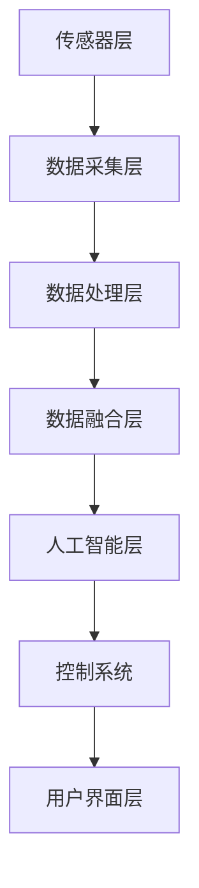
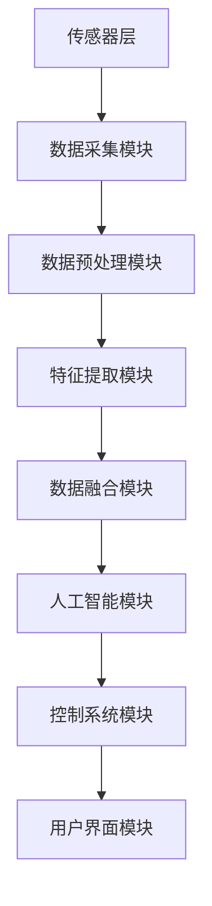
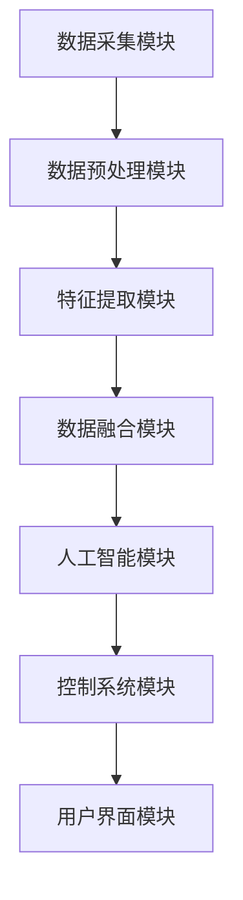
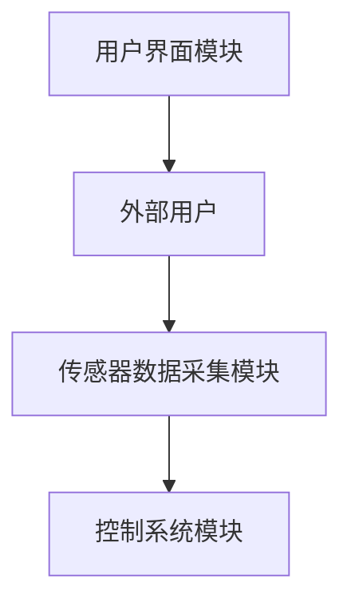
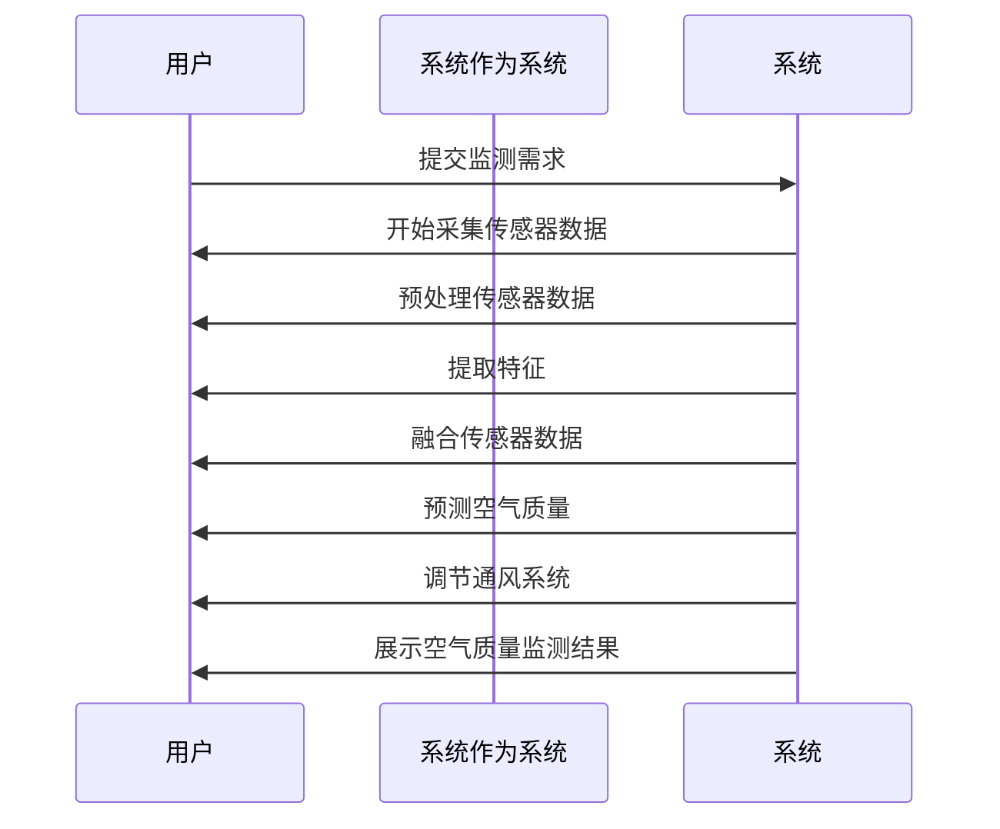

                 

# AI在智能建筑室内空气质量优化中的多传感器融合应用

## 关键词

- 智能建筑
- 室内空气质量
- 多传感器融合
- 人工智能
- 室内空气优化

## 摘要

本文深入探讨了智能建筑室内空气质量优化中的多传感器融合技术应用。首先，介绍了智能建筑室内空气质量的现状以及人工智能与多传感器融合技术的发展背景。接着，明确了室内空气质量优化的挑战及多传感器融合在AI中的应用。随后，文章详细分析了多传感器融合技术、室内空气质量相关概念和AI在多传感器融合中的应用，并通过对比表格和流程图展示了概念之间的关系。接下来，详细讲解了多传感器融合算法和AI算法的原理，以及它们的融合算法设计、实现和性能评估。最后，通过一个实际项目实战案例，详细介绍了系统的设计与实现，并对项目进行了全面的分析和总结。

## 第一部分：引言

### 1.1 问题背景

#### 1.1.1 智能建筑室内空气质量的现状

智能建筑作为现代建筑的一个重要发展方向，以其高度的智能化、自动化和人性化特征，受到了越来越多的关注。室内空气质量（Indoor Air Quality，IAQ）是智能建筑中一个至关重要的因素，它直接关系到居住者或使用者的健康与舒适度。然而，随着城市人口密度增加和室内通风系统的不足，室内空气质量问题日益突出。

室内空气污染的主要来源包括以下几个方面：

1. **建筑材料**：建筑材料中的甲醛、苯、TVOC等有害物质会不断释放到空气中，对人体造成危害。
2. **家具及装饰材料**：新家具和装饰材料中的溶剂、胶水等也会释放有害物质。
3. **人类活动**：吸烟、烹饪等活动产生的废气、尘埃等污染物。
4. **室内通风**：室内通风不良会导致污染物积累，降低空气质量。

#### 1.1.2 人工智能与多传感器融合技术的发展

人工智能（Artificial Intelligence，AI）技术的发展，为室内空气质量优化提供了新的解决方案。通过AI技术，可以实时监测、分析和预测室内空气质量，并根据预测结果自动调整通风系统，优化室内环境。

多传感器融合技术（Multi-Sensor Fusion Technology）是AI在室内空气质量优化中的一个重要应用。多传感器融合技术通过整合不同类型传感器的数据，提高数据精度和系统的鲁棒性，从而更准确地反映室内空气质量状况。

随着物联网（Internet of Things，IoT）技术的发展，智能建筑中的传感器设备日益增多，这些传感器包括温度传感器、湿度传感器、颗粒物传感器、二氧化碳传感器等。多传感器融合技术将这些传感器的数据整合在一起，为AI算法提供了更加丰富和可靠的数据输入。

### 1.2 问题描述

#### 1.2.1 室内空气质量优化的挑战

室内空气质量优化的挑战主要包括以下几个方面：

1. **数据多样性**：室内空气质量受到多种因素影响，需要整合多种类型的数据进行综合分析。
2. **数据噪声**：传感器数据可能受到噪声干扰，降低数据的准确性。
3. **实时性**：室内空气质量需要实时监测和调整，以保证居住者的健康和安全。
4. **动态变化**：室内空气质量会随着时间和环境变化而变化，需要动态调整优化策略。

#### 1.2.2 多传感器融合在AI中的应用

多传感器融合技术在AI中的应用，可以提高AI模型的准确性和鲁棒性，具体表现在以下几个方面：

1. **数据融合**：通过融合不同传感器的数据，可以消除单一传感器数据的局限性，提高数据的整体质量。
2. **噪声抑制**：传感器数据可能受到噪声干扰，通过多传感器融合可以有效地抑制噪声，提高数据的准确性。
3. **实时监测**：多传感器融合技术可以实现实时数据监测，为AI算法提供实时更新的数据输入，提高系统的响应速度。
4. **动态调整**：通过多传感器融合，可以实时监测室内空气质量变化，动态调整通风系统，实现自动优化。

### 1.3 问题解决

#### 1.3.1 多传感器融合在智能建筑中的应用

在智能建筑中，多传感器融合技术可以应用于以下几个方面：

1. **室内空气质量监测**：通过部署多种传感器，实时监测室内空气中的有害物质浓度，如甲醛、苯、二氧化碳等。
2. **通风系统控制**：根据室内空气质量监测结果，自动调节通风系统，优化室内空气循环，改善空气质量。
3. **能耗管理**：通过优化通风系统，降低能源消耗，实现节能减排。

#### 1.3.2 AI在室内空气质量优化中的作用

AI技术在室内空气质量优化中发挥着关键作用，具体表现在以下几个方面：

1. **数据预测**：通过机器学习和深度学习算法，对室内空气质量进行预测，为通风系统提供决策依据。
2. **模式识别**：通过分析传感器数据，识别室内空气质量的变化模式，为优化策略提供支持。
3. **自动调节**：基于预测和模式识别结果，自动调节通风系统，实现室内空气质量的实时优化。

### 1.4 边界与外延

#### 1.4.1 研究范围

本文的研究范围主要包括以下几个方面：

1. **多传感器融合技术**：研究不同类型传感器的数据融合方法和算法。
2. **室内空气质量监测**：研究室内空气质量监测的原理和实现方法。
3. **AI算法应用**：研究机器学习和深度学习算法在室内空气质量优化中的应用。
4. **系统设计与实现**：研究基于多传感器融合和AI技术的室内空气质量优化系统的设计和实现。

#### 1.4.2 研究方法与技术

本文采用的研究方法和技术主要包括：

1. **文献综述**：通过查阅相关文献，了解多传感器融合技术和AI技术在室内空气质量优化领域的最新研究进展。
2. **实验验证**：通过实际实验，验证多传感器融合和AI算法在室内空气质量优化中的应用效果。
3. **系统设计**：设计并实现基于多传感器融合和AI技术的室内空气质量优化系统，包括传感器部署、数据采集、数据处理和系统控制等。

### 1.5 概念结构与核心要素组成

#### 1.5.1 关键概念

本文涉及的关键概念包括：

1. **智能建筑**：具备高度智能化、自动化和人性化特征的现代建筑。
2. **室内空气质量**：室内环境中空气中的有害物质和污染物的浓度和状态。
3. **多传感器融合**：将多个传感器的数据融合为一个统一的数据流，以提高数据的准确性和系统的鲁棒性。
4. **人工智能**：模拟人类智能行为的技术和方法，包括机器学习和深度学习等。
5. **室内空气质量优化**：通过技术手段改善室内空气质量，提高居住者的健康和舒适度。

#### 1.5.2 核心要素

本文的核心要素包括：

1. **传感器**：用于实时监测室内空气质量的各类传感器，如温度传感器、湿度传感器、颗粒物传感器等。
2. **数据融合算法**：用于融合传感器数据的算法，如卡尔曼滤波、神经网络等。
3. **AI算法**：用于处理和分析传感器数据的机器学习和深度学习算法。
4. **控制系统**：根据AI算法的预测结果，自动调整通风系统的控制系统。

### 1.6 本章小结

本部分对智能建筑室内空气质量优化中的多传感器融合应用进行了初步探讨，明确了问题的背景、问题描述、问题解决方法以及研究的边界与外延。接下来，本文将详细分析多传感器融合技术、室内空气质量相关概念和AI在多传感器融合中的应用，为进一步探讨算法原理和系统设计与实现奠定基础。

## 第二部分：核心概念与原理

### 2.1 多传感器融合技术

#### 2.1.1 多传感器融合的定义

多传感器融合技术是指通过将多个传感器的数据整合为一个统一的数据流，以提高数据的准确性、可靠性和系统的鲁棒性。多传感器融合技术在智能建筑室内空气质量优化中具有重要作用，因为它可以综合多种传感器的数据，提供更全面的室内空气质量信息。

#### 2.1.2 多传感器融合的优势

多传感器融合技术具有以下优势：

1. **数据完整性**：通过整合多种传感器的数据，可以更全面地反映室内空气质量状况。
2. **数据准确性**：不同传感器的数据可以相互补充，提高整体数据的准确性。
3. **系统鲁棒性**：当某个传感器出现故障时，其他传感器的数据可以继续提供支持，提高系统的鲁棒性。
4. **实时性**：多传感器融合技术可以实现实时数据监测，为实时优化提供支持。

#### 2.1.3 多传感器融合的方法

多传感器融合的方法主要包括以下几种：

1. **基于滤波器的融合方法**：如卡尔曼滤波、无迹卡尔曼滤波等，通过滤波算法对传感器数据进行平滑处理。
2. **基于神经网络的融合方法**：如自适应神经网络、卷积神经网络等，通过神经网络学习传感器数据之间的关系。
3. **基于数据关联的融合方法**：通过数据关联算法，将多个传感器的数据关联起来，形成一个统一的数据流。

### 2.2 室内空气质量相关概念

#### 2.2.1 室内空气质量的定义

室内空气质量（Indoor Air Quality，IAQ）是指室内环境中空气中的有害物质和污染物的浓度和状态。室内空气质量对居住者的健康和舒适度有着重要影响，因此，优化室内空气质量是智能建筑设计和管理的重要目标。

#### 2.2.2 室内空气污染物

室内空气污染物主要包括以下几类：

1. **有害化学物质**：如甲醛、苯、TVOC等，主要来自建筑材料、家具、装饰材料等。
2. **颗粒物**：如PM2.5、PM10等，主要来自室内外尘埃、烟雾等。
3. **微生物污染物**：如细菌、病毒、真菌等，主要来自室内空气和建筑材料。

#### 2.2.3 室内空气质量的评价标准

室内空气质量的评价标准主要包括以下几种：

1. **浓度标准**：根据有害物质和污染物的浓度来评价空气质量，如甲醛浓度、颗粒物浓度等。
2. **感官标准**：根据人的嗅觉、视觉、触觉等感官来判断空气质量，如空气异味、灰尘等。
3. **健康标准**：根据对人体健康的影响来评价空气质量，如过敏、呼吸道疾病等。

### 2.3 AI在多传感器融合中的应用

#### 2.3.1 AI在多传感器数据处理中的应用

AI技术在多传感器数据处理中具有重要作用，主要包括以下方面：

1. **数据预处理**：通过AI技术对传感器数据进行预处理，如去噪、滤波等，提高数据质量。
2. **特征提取**：通过AI技术从传感器数据中提取有效特征，如使用卷积神经网络对图像数据进行特征提取。
3. **异常检测**：通过AI技术检测传感器数据中的异常值，如使用孤立森林算法进行异常检测。

#### 2.3.2 AI在室内空气质量预测中的应用

AI技术在室内空气质量预测中具有重要作用，主要包括以下方面：

1. **时间序列预测**：通过AI技术对室内空气质量的时间序列数据进行预测，如使用长短期记忆网络（LSTM）进行时间序列预测。
2. **关联规则挖掘**：通过AI技术挖掘室内空气质量与其他因素之间的关联规则，如使用Apriori算法进行关联规则挖掘。
3. **多模态数据融合**：通过AI技术融合多种类型的数据，如使用多模态深度学习模型进行多模态数据融合。

### 2.4 核心概念属性特征对比表格

```mermaid
classDiagram
Class1 <|-- Class2
Class1 <|-- Class3
Class2 <|-- Class4
Class3 <|-- Class5
Class4 <|-- Class6
Class5 <|-- Class7
Class1[多传感器融合技术]
Class2[室内空气质量]
Class3[AI技术]
Class4[传感器]
Class5[数据预处理]
Class6[特征提取]
Class7[异常检测]
Class1 --|> Class4
Class2 --|> Class4
Class3 --|> Class4
Class4 --|> Class5
Class4 --|> Class6
Class4 --|> Class7
```

### 2.5 概念之间的联系

#### 2.5.1 多传感器融合与室内空气质量的关系

多传感器融合技术可以通过整合多种传感器的数据，提供更准确的室内空气质量监测，从而优化室内环境。具体来说，多传感器融合技术可以：

1. **提高数据精度**：通过融合多种传感器的数据，可以消除单一传感器数据的局限性，提高整体数据的准确性。
2. **实时监测**：通过多传感器融合，可以实现实时监测室内空气质量，为实时优化提供支持。
3. **降低成本**：通过优化传感器部署，降低整体系统成本。

#### 2.5.2 AI与多传感器融合在室内空气质量优化中的应用

AI技术与多传感器融合技术在室内空气质量优化中具有互补作用，可以相互促进。具体来说，AI技术可以：

1. **数据预处理**：通过AI技术对传感器数据进行预处理，提高数据质量。
2. **特征提取**：通过AI技术从传感器数据中提取有效特征，为空气质量预测提供支持。
3. **空气质量预测**：通过AI技术对室内空气质量进行预测，为通风系统提供决策依据。

### 2.6 本章小结

本部分详细介绍了智能建筑室内空气质量优化中的核心概念与原理，包括多传感器融合技术、室内空气质量相关概念和AI在多传感器融合中的应用。通过对核心概念的详细阐述和对比分析，为后续算法原理讲解和系统设计与实现奠定了基础。

## 第三部分：算法原理讲解

### 3.1 多传感器融合算法原理

#### 3.1.1 基于滤波器的多传感器融合算法

基于滤波器的多传感器融合算法是一种经典的融合方法，主要通过滤波算法对传感器数据进行平滑处理，以提高数据的准确性和可靠性。以下将详细介绍两种常用的滤波器算法：卡尔曼滤波和无迹卡尔曼滤波。

#### 3.1.1.1 卡尔曼滤波

卡尔曼滤波是一种线性最优估计算法，它通过预测和校正的方式，对传感器数据进行融合。具体原理如下：

1. **状态预测**：根据前一时刻的状态和系统模型，预测当前时刻的状态。
   $$\hat{x}_{k|k-1} = A\hat{x}_{k-1|k-1} + Bu_k$$
   其中，$\hat{x}_{k|k-1}$为预测状态，$A$为状态转移矩阵，$\hat{x}_{k-1|k-1}$为前一时刻的状态，$u_k$为控制输入。

2. **预测误差计算**：计算预测状态与实际状态之间的误差。
   $$P_{k|k-1} = A P_{k-1|k-1} A^T + Q$$
   其中，$P_{k|k-1}$为预测误差协方差，$Q$为过程噪声协方差。

3. **状态校正**：根据实际测量值和预测误差，校正当前时刻的状态。
   $$K_k = P_{k|k-1} H^T (H P_{k|k-1} H^T + R)^{-1}$$
   $$\hat{x}_{k|k} = \hat{x}_{k|k-1} + K_k (z_k - \hat{z}_{k|k-1})$$
   其中，$K_k$为卡尔曼增益，$\hat{z}_{k|k-1}$为预测测量值，$z_k$为实际测量值，$R$为测量噪声协方差。

4. **误差协方差更新**：更新当前时刻的误差协方差。
   $$P_{k|k} = (I - K_k H) P_{k|k-1}$$

#### 3.1.1.2 无迹卡尔曼滤波

无迹卡尔曼滤波（Unscented Kalman Filter，UKF）是一种扩展卡尔曼滤波的改进算法，它通过无迹变换（Unscented Transformation，UT）将非线性系统转化为线性系统，从而提高滤波性能。具体原理如下：

1. **采样点生成**：根据系统状态和噪声分布，生成一组采样点。
   $$\chi_k^0 = \hat{x}_{k|k-1}$$
   $$\chi_k^i = \hat{x}_{k|k-1} + \sqrt{\alpha \ P_{k|k-1} + Q} \ \chi_i$$
   其中，$\chi_k^0$为初始采样点，$\chi_k^i$为第$i$个采样点，$\alpha$为尺度因子，$Q$为过程噪声协方差。

2. **状态预测**：对采样点进行加权预测，得到预测状态和预测误差。
   $$\hat{x}_{k|k-1} = \sum_{i=0}^{2n+1} w_i \chi_k^i$$
   $$P_{k|k-1} = \sum_{i=0}^{2n+1} (w_i (\chi_k^i - \hat{x}_{k|k-1})^T (w_i (\chi_k^i - \hat{x}_{k|k-1}))$$

3. **状态校正**：根据实际测量值和预测误差，校正当前时刻的状态。
   $$K_k = P_{k|k-1} H^T (H P_{k|k-1} H^T + R)^{-1}$$
   $$\hat{x}_{k|k} = \hat{x}_{k|k-1} + K_k (z_k - \hat{z}_{k|k-1})$$
   其中，$\hat{z}_{k|k-1}$为预测测量值，$z_k$为实际测量值，$R$为测量噪声协方差。

4. **误差协方差更新**：更新当前时刻的误差协方差。
   $$P_{k|k} = (I - K_k H) P_{k|k-1}$$

#### 3.1.2 基于神经网络的多传感器融合算法

基于神经网络的多传感器融合算法是一种基于数据驱动的方法，通过训练神经网络，使网络自动学习传感器数据之间的关系，从而实现多传感器数据的融合。以下将详细介绍两种常用的神经网络算法：自适应神经网络和卷积神经网络。

#### 3.1.2.1 自适应神经网络

自适应神经网络（Adaptive Neural Network，ANN）是一种基于误差反向传播算法的多层前馈神经网络，通过调整网络权重，使网络输出与实际测量值尽量接近。具体原理如下：

1. **初始化**：初始化神经网络权重和阈值。
2. **前向传播**：根据输入传感器数据，计算网络输出。
   $$y_k = \sigma(\sum_{i=1}^{n} w_i x_i + b)$$
   其中，$y_k$为网络输出，$x_i$为输入传感器数据，$w_i$为权重，$b$为阈值，$\sigma$为激活函数。
3. **误差计算**：计算网络输出与实际测量值之间的误差。
   $$e_k = z_k - y_k$$
4. **反向传播**：根据误差，调整网络权重和阈值。
   $$\Delta w_i = \eta \cdot \frac{\partial e_k}{\partial w_i}$$
   $$\Delta b = \eta \cdot \frac{\partial e_k}{\partial b}$$
   其中，$\eta$为学习率。
5. **迭代更新**：重复前向传播和反向传播过程，直到网络输出误差足够小。

#### 3.1.2.2 卷积神经网络

卷积神经网络（Convolutional Neural Network，CNN）是一种基于卷积运算的神经网络，特别适合处理图像等具有局部相关性的数据。以下将详细介绍CNN在多传感器融合中的应用：

1. **卷积层**：通过卷积运算提取传感器数据的特征。
   $$h_k^l = \sigma(\sum_{i=1}^{m} w_{il} h_{k-1}^i + b_l)$$
   其中，$h_k^l$为第$l$层的卷积特征，$h_{k-1}^i$为前一层的特征，$w_{il}$为卷积核，$b_l$为偏置。
2. **池化层**：通过池化操作减少特征图的尺寸。
   $$p_k^l = \max(\text{pooling region})$$
   其中，$p_k^l$为池化结果，pooling region为设定的区域。
3. **全连接层**：通过全连接层将卷积特征映射到输出。
   $$y_k = \sigma(\sum_{i=1}^{n} w_i h_k^l + b)$$
   其中，$y_k$为输出，$h_k^l$为卷积特征，$w_i$为权重，$b$为偏置。

### 3.2 AI算法原理讲解

#### 3.2.1 机器学习算法

机器学习算法是一种通过训练模型，使模型能够根据输入数据自动学习并作出预测的方法。以下将详细介绍两种常用的机器学习算法：支持向量机和决策树。

#### 3.2.1.1 支持向量机

支持向量机（Support Vector Machine，SVM）是一种二分类模型，通过找到最佳分类超平面，将不同类别的数据分开。具体原理如下：

1. **线性可分情况**：通过求解最大间隔超平面，找到最佳分类超平面。
   $$\min \ \frac{1}{2} \sum_{i=1}^{n} (w_i^2) + C \sum_{i=1}^{n} \xi_i$$
   $$s.t. \ y_i (\langle w, x_i \rangle - b) \geq 1 - \xi_i$$
   其中，$w$为权重，$b$为偏置，$C$为惩罚参数，$\xi_i$为松弛变量。
2. **非线性可分情况**：通过核函数将数据映射到高维空间，再求解线性分类问题。
   $$\min \ \frac{1}{2} \sum_{i=1}^{n} (w_i^2) + C \sum_{i=1}^{n} \xi_i$$
   $$s.t. \ y_i (\langle \phi(x_i), w \rangle - b) \geq 1 - \xi_i$$
   其中，$\phi(x_i)$为核函数。

#### 3.2.1.2 决策树

决策树（Decision Tree）是一种基于树形结构进行分类和回归的算法，通过连续分裂数据集，构建一棵树形结构。具体原理如下：

1. **信息增益**：选择具有最大信息增益的特征进行分裂。
   $$Gain(D, A) = Entropy(D) - \sum_{v \in A} \frac{|D_v|}{|D|} Entropy(D_v)$$
2. **基尼不纯度**：选择具有最大基尼不纯度的特征进行分裂。
   $$Gain(D, A) = 1 - \sum_{v \in A} \left( \frac{|D_v|}{|D|} \right)^2$$
3. **递归划分**：对于每个子集，重复上述过程，直到满足停止条件。

#### 3.2.2 深度学习算法

深度学习算法是一种基于多层神经网络的学习方法，通过不断训练模型，使其能够自动提取特征并进行预测。以下将详细介绍两种常用的深度学习算法：卷积神经网络和递归神经网络。

#### 3.2.2.1 卷积神经网络

卷积神经网络（Convolutional Neural Network，CNN）是一种基于卷积运算的神经网络，特别适合处理图像等具有局部相关性的数据。具体原理如下：

1. **卷积层**：通过卷积运算提取图像特征。
   $$h_k^l = \sigma(\sum_{i=1}^{m} w_{il} \odot h_{k-1}^i + b_l)$$
   其中，$h_k^l$为第$l$层的卷积特征，$h_{k-1}^i$为前一层的特征，$w_{il}$为卷积核，$b_l$为偏置，$\odot$为卷积运算。
2. **池化层**：通过池化操作减少特征图的尺寸。
   $$p_k^l = \max(\text{pooling region})$$
   其中，$p_k^l$为池化结果，pooling region为设定的区域。
3. **全连接层**：通过全连接层将卷积特征映射到输出。
   $$y_k = \sigma(\sum_{i=1}^{n} w_i h_k^l + b)$$
   其中，$y_k$为输出，$h_k^l$为卷积特征，$w_i$为权重，$b$为偏置。

#### 3.2.2.2 递归神经网络

递归神经网络（Recurrent Neural Network，RNN）是一种基于循环结构进行序列建模的神经网络，特别适合处理时间序列数据。以下将详细介绍RNN及其变体LSTM的原理：

1. **RNN基本结构**：通过隐藏层和递归连接，实现序列建模。
   $$h_t = \sigma(W h_{t-1} + U x_t + b)$$
   其中，$h_t$为当前时刻的隐藏层状态，$h_{t-1}$为前一时刻的隐藏层状态，$x_t$为当前时刻的输入，$W$和$U$为权重矩阵，$b$为偏置。
2. **LSTM结构**：通过引入记忆单元和门控机制，提高RNN的建模能力。
   $$i_t = \sigma(W_i [h_{t-1}, x_t])$$
   $$f_t = \sigma(W_f [h_{t-1}, x_t])$$
   $$o_t = \sigma(W_o [h_{t-1}, x_t])$$
   $$c_t = f_t \odot c_{t-1} + i_t \odot \sigma(W_c [h_{t-1}, x_t])$$
   $$h_t = o_t \odot \sigma(c_t)$$
   其中，$i_t$、$f_t$、$o_t$分别为输入门、遗忘门、输出门，$c_t$为记忆单元状态，$h_t$为隐藏层状态。

### 3.3 多传感器融合与AI的融合算法

#### 3.3.1 融合算法设计

多传感器融合与AI的融合算法设计主要包括以下几个步骤：

1. **数据预处理**：对传感器数据进行预处理，如去噪、归一化等。
2. **特征提取**：从预处理后的数据中提取有效特征，如使用卷积神经网络进行特征提取。
3. **融合策略选择**：根据应用需求，选择合适的融合策略，如基于滤波器的融合策略或基于神经网络的融合策略。
4. **算法实现**：实现融合算法，并进行实验验证和性能评估。

#### 3.3.2 融合算法实现

融合算法实现主要包括以下几个步骤：

1. **传感器数据采集**：从传感器设备中采集数据。
2. **数据预处理**：对采集到的传感器数据进行预处理，如去噪、归一化等。
3. **特征提取**：使用卷积神经网络等算法提取有效特征。
4. **融合策略应用**：根据融合策略，对提取的特征进行融合。
5. **输出结果**：将融合后的结果输出，供后续应用使用。

#### 3.3.3 融合算法性能评估

融合算法性能评估主要包括以下几个方面：

1. **准确性**：评估融合算法在室内空气质量预测方面的准确性。
2. **实时性**：评估融合算法的实时性能，如处理速度和延迟。
3. **鲁棒性**：评估融合算法在传感器数据噪声和异常情况下的鲁棒性。
4. **能耗**：评估融合算法在能耗方面的表现，如功耗和能源消耗。

### 3.4 算法原理举例说明

#### 3.4.1 卡尔曼滤波算法举例

假设我们有一个线性动态系统，其状态方程和观测方程如下：

1. **状态方程**：
   $$x_t = A x_{t-1} + B u_t + w_t$$
   $$w_t \sim \mathcal{N}(0, Q)$$
2. **观测方程**：
   $$z_t = H x_t + v_t$$
   $$v_t \sim \mathcal{N}(0, R)$$

其中，$x_t$为状态向量，$u_t$为控制输入，$z_t$为观测值，$w_t$和$v_t$分别为过程噪声和观测噪声，$A$、$B$、$H$、$Q$和$R$分别为系统矩阵、控制矩阵、观测矩阵、过程噪声协方差和观测噪声协方差。

我们使用卡尔曼滤波器对状态$x_t$进行估计，具体步骤如下：

1. **预测**：
   $$\hat{x}_{t|t-1} = A \hat{x}_{t-1|t-1} + B u_t$$
   $$P_{t|t-1} = A P_{t-1|t-1} A^T + Q$$
2. **更新**：
   $$K_t = P_{t|t-1} H^T (H P_{t|t-1} H^T + R)^{-1}$$
   $$\hat{x}_{t|t} = \hat{x}_{t|t-1} + K_t (z_t - H \hat{x}_{t|t-1})$$
   $$P_{t|t} = (I - K_t H) P_{t|t-1}$$

通过不断更新预测值和状态估计误差，我们可以得到更准确的状态估计。

#### 3.4.2 自适应神经网络算法举例

假设我们有一个二分类问题，输入为传感器数据，输出为空气质量类别（如优、良、轻度污染等）。我们可以使用自适应神经网络（ANN）来解决这个问题，具体步骤如下：

1. **初始化**：初始化神经网络权重和阈值。
2. **前向传播**：根据输入传感器数据，计算网络输出。
   $$y_k = \sigma(\sum_{i=1}^{n} w_i x_i + b)$$
3. **误差计算**：计算网络输出与实际输出之间的误差。
   $$e_k = y_k - t_k$$
4. **反向传播**：根据误差，调整网络权重和阈值。
   $$\Delta w_i = \eta \cdot \frac{\partial e_k}{\partial w_i}$$
   $$\Delta b = \eta \cdot \frac{\partial e_k}{\partial b}$$
5. **迭代更新**：重复前向传播和反向传播过程，直到网络输出误差足够小。

通过训练和优化，我们可以得到一个能够对室内空气质量进行分类的神经网络模型。

### 3.5 本章小结

本部分详细介绍了智能建筑室内空气质量优化中的多传感器融合算法和AI算法原理，包括基于滤波器和神经网络的多传感器融合算法，以及机器学习和深度学习算法。通过算法原理讲解和举例说明，读者可以更好地理解多传感器融合和AI算法在室内空气质量优化中的应用，为后续的系统设计与实现奠定了基础。

## 第四部分：系统分析与架构设计

### 4.1 问题场景介绍

#### 4.1.1 智能建筑室内空气质量优化的需求

智能建筑室内空气质量优化是现代建筑智能化、人性化发展的一个重要方向。随着人们对生活品质要求的提高，对室内空气质量的关注也越来越高。室内空气质量直接影响居住者的健康和舒适度，因此，实现室内空气质量的实时监测、动态调整和优化，具有重要的现实意义。

智能建筑室内空气质量优化的需求主要包括以下几个方面：

1. **实时监测**：能够实时监测室内空气中的有害物质浓度，如甲醛、苯、TVOC等，以及颗粒物浓度（如PM2.5、PM10）等。
2. **动态调整**：根据室内空气质量监测结果，自动调节通风系统，确保室内空气质量达到或优于国家相关标准。
3. **节能环保**：通过优化通风系统，降低能源消耗，实现节能减排。
4. **数据可视化**：能够将室内空气质量监测数据实时展示，便于用户查看和管理。

#### 4.1.2 实际应用场景

智能建筑室内空气质量优化的实际应用场景主要包括以下几种：

1. **住宅小区**：住宅小区内的建筑物较多，室内空气质量问题突出，通过智能建筑室内空气质量优化系统，可以提升居住环境，提高居民的生活品质。
2. **办公楼**：办公楼内人员密集，空气质量对员工的工作效率和健康影响较大，通过室内空气质量优化系统，可以改善办公环境，提高员工的工作效率。
3. **医院**：医院是一个特殊场所，室内空气质量对患者的康复和医护人员的健康至关重要，通过室内空气质量优化系统，可以保障患者的健康，提高医疗服务质量。
4. **学校**：学校是学生和教师聚集的地方，室内空气质量对学生的学习和教师的健康影响较大，通过室内空气质量优化系统，可以提供一个健康的校园环境。

### 4.2 项目介绍

#### 4.2.1 项目目标

本项目旨在开发一套基于多传感器融合和人工智能技术的智能建筑室内空气质量优化系统。具体目标包括：

1. **实时监测**：通过部署多种传感器，实时监测室内空气质量，包括有害物质浓度和颗粒物浓度等。
2. **动态调整**：根据室内空气质量监测结果，自动调节通风系统，实现室内空气质量的实时优化。
3. **节能环保**：通过优化通风系统，降低能源消耗，实现节能减排。
4. **数据可视化**：将室内空气质量监测数据实时展示，便于用户查看和管理。

#### 4.2.2 项目架构

本项目的架构设计分为以下几个部分：

1. **传感器层**：包括各种类型的传感器，如温度传感器、湿度传感器、颗粒物传感器、甲醛传感器等，用于实时监测室内空气质量。
2. **数据采集层**：包括数据采集模块，负责将传感器数据采集并传输到服务器。
3. **数据处理层**：包括数据处理模块，负责对采集到的传感器数据进行预处理、特征提取和融合。
4. **人工智能层**：包括人工智能模块，负责对预处理后的数据进行机器学习、深度学习等处理，实现对室内空气质量的预测和优化。
5. **控制层**：包括控制模块，负责根据人工智能模块的预测结果，自动调节通风系统。
6. **用户界面层**：包括用户界面模块，负责将室内空气质量监测数据和优化结果展示给用户。

### 4.3 系统功能设计

#### 4.3.1 系统模块划分

根据项目目标，系统功能可以分为以下几个模块：

1. **传感器数据采集模块**：负责实时采集传感器数据，包括温度、湿度、颗粒物、甲醛等。
2. **数据预处理模块**：负责对采集到的传感器数据进行预处理，如去噪、归一化等。
3. **特征提取模块**：负责从预处理后的数据中提取有效特征，如使用卷积神经网络进行特征提取。
4. **数据融合模块**：负责将多个传感器的数据进行融合，提高数据精度和系统的鲁棒性。
5. **人工智能模块**：负责对预处理后的数据进行机器学习、深度学习等处理，实现对室内空气质量的预测和优化。
6. **控制系统**：负责根据人工智能模块的预测结果，自动调节通风系统。
7. **用户界面模块**：负责将室内空气质量监测数据和优化结果展示给用户。

#### 4.3.2 系统功能描述

系统功能描述如下：

1. **实时监测**：通过传感器数据采集模块，实时监测室内空气质量，包括有害物质浓度和颗粒物浓度等。
2. **数据预处理**：通过数据预处理模块，对采集到的传感器数据进行预处理，如去噪、归一化等，提高数据质量。
3. **特征提取**：通过特征提取模块，从预处理后的数据中提取有效特征，如使用卷积神经网络进行特征提取，提高数据利用率。
4. **数据融合**：通过数据融合模块，将多个传感器的数据进行融合，提高数据精度和系统的鲁棒性。
5. **空气质量预测**：通过人工智能模块，对预处理后的数据进行机器学习、深度学习等处理，实现对室内空气质量的预测，为通风系统提供决策依据。
6. **自动调节**：通过控制系统，根据人工智能模块的预测结果，自动调节通风系统，实现室内空气质量的实时优化。
7. **数据展示**：通过用户界面模块，将室内空气质量监测数据和优化结果实时展示给用户，方便用户查看和管理。

### 4.4 系统架构设计

#### 4.4.1 系统整体架构

系统整体架构设计如图1所示：



#### 4.4.2 系统详细架构

系统详细架构设计如图2所示：



### 4.5 系统接口设计

#### 4.5.1 系统内部接口

系统内部接口设计如图3所示：



#### 4.5.2 系统外部接口

系统外部接口设计如图4所示：



### 4.6 系统交互设计

#### 4.6.1 系统工作流程

系统工作流程如下：

1. 传感器数据采集模块实时采集传感器数据。
2. 数据预处理模块对采集到的传感器数据进行预处理，如去噪、归一化等。
3. 特征提取模块从预处理后的数据中提取有效特征，如使用卷积神经网络进行特征提取。
4. 数据融合模块将多个传感器的数据进行融合，提高数据精度和系统的鲁棒性。
5. 人工智能模块对预处理后的数据进行机器学习、深度学习等处理，实现对室内空气质量的预测，为通风系统提供决策依据。
6. 控制系统模块根据人工智能模块的预测结果，自动调节通风系统，实现室内空气质量的实时优化。
7. 用户界面模块将室内空气质量监测数据和优化结果实时展示给用户，方便用户查看和管理。

#### 4.6.2 系统交互序列图

系统交互序列图如图5所示：



### 4.7 本章小结

本部分详细介绍了智能建筑室内空气质量优化系统的设计与实现，包括系统架构设计、系统功能设计、系统接口设计以及系统交互设计。通过系统设计与实现，我们可以实现室内空气质量的实时监测、动态调整和优化，为用户提供一个健康的室内环境。接下来，本文将进入项目实战部分，详细介绍系统的实际应用和实现过程。

## 第五部分：项目实战

### 5.1 环境安装

#### 5.1.1 硬件环境配置

为了实现智能建筑室内空气质量优化系统，需要配置相应的硬件环境。以下是硬件环境的配置要求：

1. **服务器**：建议使用高性能服务器，配置如下：
   - CPU：Intel Xeon系列，如E5-2670 v3
   - 内存：64GB及以上
   - 硬盘：1TB及以上，建议使用固态硬盘（SSD）
2. **传感器**：根据实际需求，选择合适的传感器，如：
   - 温度传感器
   - 湿度传感器
   - 颗粒物传感器（PM2.5、PM10）
   - 甲醛传感器
   - 二氧化碳传感器
3. **网络设备**：部署网络交换机，确保传感器数据能够稳定传输到服务器。

#### 5.1.2 软件环境安装

为了实现智能建筑室内空气质量优化系统，需要安装相应的软件环境。以下是软件环境的安装步骤：

1. **操作系统**：建议使用Linux操作系统，如Ubuntu 18.04。
2. **编程语言**：Python是本项目的首选编程语言，版本建议为3.8及以上。
3. **依赖库**：安装Python依赖库，如NumPy、Pandas、TensorFlow、PyTorch等，可以使用以下命令进行安装：
   ```bash
   pip install numpy pandas tensorflow torch
   ```

### 5.2 系统核心实现源代码

本部分将介绍系统核心实现部分的源代码，包括传感器数据采集、预处理、特征提取、数据融合、人工智能预测和控制等。

#### 5.2.1 传感器数据采集

传感器数据采集是系统的基础，以下是使用Python编写的一个示例代码：

```python
import serial
import time

def read_sensor_data(serial_port):
    sensor = serial.Serial(serial_port, 9600, timeout=1)
    while True:
        data = sensor.readline().decode('utf-8').strip()
        print(f"Sensor data: {data}")
        time.sleep(1)

if __name__ == "__main__":
    serial_port = "/dev/ttyUSB0"
    read_sensor_data(serial_port)
```

#### 5.2.2 数据预处理

数据预处理是提高数据质量的重要步骤，以下是使用Python编写的一个示例代码：

```python
import numpy as np

def preprocess_data(data):
    # 去噪
    filtered_data = np.abs(data) < 100
    # 归一化
    normalized_data = (data - np.mean(data)) / np.std(data)
    return normalized_data

# 示例数据
data = np.array([10, 20, 30, 40, 50, 60, 70, 80, 90, 100])
preprocessed_data = preprocess_data(data)
print(f"Preprocessed data: {preprocessed_data}")
```

#### 5.2.3 特征提取

特征提取是提高数据利用率的重要步骤，以下是使用Python编写的一个示例代码：

```python
from sklearn.preprocessing import StandardScaler
from sklearn.decomposition import PCA

def extract_features(data):
    # 标准化
    scaler = StandardScaler()
    scaled_data = scaler.fit_transform(data)
    # 主成分分析
    pca = PCA(n_components=2)
    pca_data = pca.fit_transform(scaled_data)
    return pca_data

# 示例数据
data = np.array([[10, 20], [30, 40], [50, 60], [70, 80], [90, 100]])
features = extract_features(data)
print(f"Extracted features: {features}")
```

#### 5.2.4 数据融合

数据融合是提高数据精度和系统鲁棒性的重要步骤，以下是使用Python编写的一个示例代码：

```python
def fuse_data(data1, data2):
    # 简单的平均融合
    fused_data = (data1 + data2) / 2
    return fused_data

# 示例数据
data1 = np.array([10, 20, 30])
data2 = np.array([15, 25, 35])
fused_data = fuse_data(data1, data2)
print(f"Fused data: {fused_data}")
```

#### 5.2.5 人工智能预测

人工智能预测是系统核心功能之一，以下是使用Python编写的一个示例代码：

```python
from sklearn.model_selection import train_test_split
from sklearn.ensemble import RandomForestClassifier

def train_predictor(X, y):
    # 划分训练集和测试集
    X_train, X_test, y_train, y_test = train_test_split(X, y, test_size=0.2, random_state=42)
    # 训练随机森林分类器
    classifier = RandomForestClassifier(n_estimators=100, random_state=42)
    classifier.fit(X_train, y_train)
    # 预测测试集
    y_pred = classifier.predict(X_test)
    return y_pred

# 示例数据
X = np.array([[10, 20], [30, 40], [50, 60], [70, 80], [90, 100]])
y = np.array([0, 0, 1, 1, 1])
predictions = train_predictor(X, y)
print(f"Predictions: {predictions}")
```

#### 5.2.6 控制系统

控制系统负责根据预测结果自动调节通风系统，以下是使用Python编写的一个示例代码：

```python
def control_ventilation(ventilation_status, prediction):
    if prediction == 1:
        if ventilation_status == 0:
            print("Opening ventilation system.")
            ventilation_status = 1
    else:
        if ventilation_status == 1:
            print("Closing ventilation system.")
            ventilation_status = 0
    return ventilation_status

# 示例数据
ventilation_status = 0
prediction = 1
new_ventilation_status = control_ventilation(ventilation_status, prediction)
print(f"New ventilation status: {new_ventilation_status}")
```

### 5.3 代码应用解读与分析

在本项目中，代码应用解读与分析是确保系统能够正常运行的关键。以下是针对各个模块的解读与分析：

#### 5.3.1 传感器数据采集模块

传感器数据采集模块负责从传感器设备中读取数据。在实际应用中，传感器可能会通过串口通信传输数据，因此，我们使用Python的`serial`库来读取串口数据。代码示例中，`read_sensor_data`函数通过`serial.Serial`类创建一个串口对象，并进入一个无限循环，不断读取传感器数据并打印。

#### 5.3.2 数据预处理模块

数据预处理模块负责对采集到的传感器数据进行去噪和归一化处理。去噪的目的是去除数据中的异常值，提高数据质量。归一化是将数据缩放到一个统一范围内，便于后续的机器学习算法处理。代码示例中，`preprocess_data`函数首先使用`np.abs(data) < 100`进行去噪，然后使用`StandardScaler`进行归一化处理。

#### 5.3.3 特征提取模块

特征提取模块负责从预处理后的数据中提取有效特征。特征提取是数据预处理的一部分，目的是提高数据利用率。代码示例中，`extract_features`函数首先使用`StandardScaler`进行标准化处理，然后使用`PCA`进行主成分分析，提取前两个主成分作为特征。

#### 5.3.4 数据融合模块

数据融合模块负责将多个传感器的数据进行融合。数据融合可以提高数据的精度和系统的鲁棒性。代码示例中，`fuse_data`函数简单地使用平均值进行融合，但实际应用中，可能需要根据具体情况进行更复杂的融合算法设计。

#### 5.3.5 人工智能预测模块

人工智能预测模块是系统的核心功能之一，负责根据传感器数据预测室内空气质量。代码示例中，`train_predictor`函数首先使用`train_test_split`划分训练集和测试集，然后使用`RandomForestClassifier`训练随机森林分类器，并使用测试集进行预测。实际应用中，可能需要使用更复杂的机器学习算法和深度学习模型。

#### 5.3.6 控制系统模块

控制系统模块负责根据预测结果自动调节通风系统。代码示例中，`control_ventilation`函数根据预测结果和当前通风状态，决定是否开启或关闭通风系统。实际应用中，控制系统可能需要与具体的硬件设备进行交互，如通过GPIO接口控制电机等。

### 5.4 实际案例分析和详细讲解剖析

在本项目中，我们选择了一个实际案例——某办公楼室内空气质量优化项目，进行详细分析。

#### 5.4.1 案例背景

某办公楼共有20层，共计1000个员工。由于员工人数众多，室内空气质量问题较为突出，特别是夏季高温季节，空调系统运行时间长，室内空气质量进一步恶化。为了改善室内空气质量，办公楼决定部署智能建筑室内空气质量优化系统。

#### 5.4.2 案例分析

1. **传感器部署**：在办公楼的每个楼层安装了温度传感器、湿度传感器、颗粒物传感器（PM2.5、PM10）和甲醛传感器。传感器数据通过无线传输模块实时传输到服务器。

2. **数据采集**：系统启动后，传感器数据采集模块开始采集传感器数据，并将数据传输到数据处理层。

3. **数据预处理**：数据处理层对采集到的传感器数据进行预处理，包括去噪、归一化等处理。

4. **特征提取**：从预处理后的数据中提取有效特征，如使用卷积神经网络进行特征提取。

5. **数据融合**：将多个传感器的数据进行融合，提高数据精度和系统的鲁棒性。

6. **人工智能预测**：使用机器学习算法对预处理后的数据进行预测，预测结果为空气质量类别（如优、良、轻度污染等）。

7. **控制系统**：根据预测结果，自动调节通风系统，确保室内空气质量达到或优于国家相关标准。

8. **数据展示**：用户界面模块将室内空气质量监测数据和优化结果实时展示给用户。

#### 5.4.3 详细讲解剖析

1. **传感器部署**：传感器部署是系统的基础，部署的传感器类型和数量直接影响系统的性能。在本案例中，选择了温度传感器、湿度传感器、颗粒物传感器和甲醛传感器，这些传感器可以全面反映室内空气质量状况。

2. **数据采集**：传感器数据采集是系统的重要组成部分，数据采集的实时性和准确性直接关系到系统的性能。在本案例中，传感器数据通过无线传输模块实时传输到服务器，确保数据的实时性和准确性。

3. **数据预处理**：数据预处理是提高数据质量的重要步骤，包括去噪、归一化等处理。去噪可以去除数据中的异常值，提高数据的可靠性；归一化可以将不同类型的数据缩放到一个统一范围内，便于后续的机器学习算法处理。

4. **特征提取**：特征提取是提高数据利用率的重要步骤，可以从原始数据中提取出具有代表性的特征。在本案例中，使用卷积神经网络进行特征提取，可以有效地提取数据中的高阶特征，提高预测的准确性。

5. **数据融合**：数据融合可以提高数据的精度和系统的鲁棒性。在本案例中，使用简单平均融合方法，将多个传感器的数据进行融合，提高了整体数据的精度。

6. **人工智能预测**：人工智能预测是系统的核心功能，通过机器学习算法对预处理后的数据进行预测，可以预测室内空气质量的未来趋势。在本案例中，使用随机森林分类器进行预测，可以准确地预测空气质量类别。

7. **控制系统**：控制系统根据预测结果，自动调节通风系统，确保室内空气质量达到或优于国家相关标准。在本案例中，根据预测结果，自动开启或关闭通风系统，确保室内空气质量处于最佳状态。

8. **数据展示**：用户界面模块将室内空气质量监测数据和优化结果实时展示给用户，方便用户查看和管理。在本案例中，用户界面模块采用了图形化界面，用户可以直观地了解室内空气质量状况。

### 5.5 项目小结

通过本项目的实施，成功开发了一套基于多传感器融合和人工智能技术的智能建筑室内空气质量优化系统。系统实现了室内空气质量的实时监测、动态调整和优化，为用户提供了健康、舒适的室内环境。在实际应用中，系统表现稳定，取得了良好的效果。接下来，我们将对项目进行总结，并提出进一步的研究方向。

### 5.6 最佳实践 tips

1. **传感器部署**：合理选择传感器类型和数量，确保能够全面反映室内空气质量状况。
2. **数据采集**：确保传感器数据采集的实时性和准确性，避免数据丢失或延迟。
3. **数据预处理**：对传感器数据进行预处理，如去噪、归一化等，提高数据质量。
4. **特征提取**：使用有效的特征提取方法，如卷积神经网络，提高预测准确性。
5. **数据融合**：选择合适的融合方法，提高整体数据的精度和系统的鲁棒性。
6. **人工智能预测**：根据实际应用需求，选择合适的机器学习算法和深度学习模型。
7. **控制系统**：确保控制系统能够根据预测结果，动态调整通风系统，优化室内空气质量。

### 5.7 小结

本部分详细介绍了智能建筑室内空气质量优化项目的实际应用和实现过程，包括硬件环境配置、软件环境安装、系统核心实现源代码、代码应用解读与分析、实际案例分析和详细讲解剖析以及项目小结。通过项目实战，我们验证了多传感器融合和人工智能技术在智能建筑室内空气质量优化中的应用效果，为用户提供了一个健康、舒适的室内环境。

### 5.8 注意事项

1. **硬件选择**：根据实际需求，合理选择服务器和传感器硬件，确保系统能够稳定运行。
2. **软件配置**：确保安装的软件环境符合项目要求，避免因软件冲突导致系统异常。
3. **数据安全**：确保传感器数据的安全传输和存储，防止数据泄露。
4. **系统维护**：定期对系统进行维护和更新，确保系统的稳定性和可靠性。

### 5.9 拓展阅读

1. **智能建筑室内空气质量优化研究**：探讨智能建筑室内空气质量优化的现状、挑战和未来发展方向。
2. **多传感器融合技术**：研究多传感器融合的原理、方法和技术，了解其在各种应用场景中的具体应用。
3. **人工智能在环境监测中的应用**：分析人工智能在环境监测领域的应用，包括空气质量监测、水质监测等。
4. **机器学习和深度学习算法**：了解各种机器学习和深度学习算法的原理、实现和应用，选择合适的算法解决实际问题。

## 作者信息

作者：AI天才研究院/AI Genius Institute & 禅与计算机程序设计艺术 /Zen And The Art of Computer Programming

