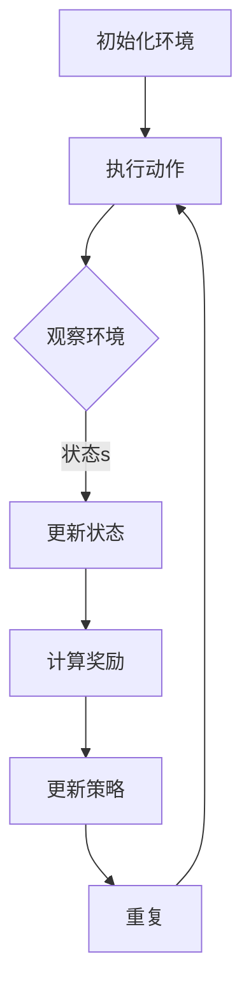
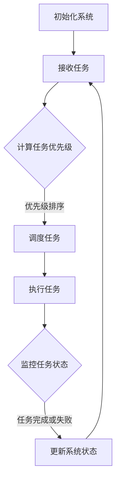
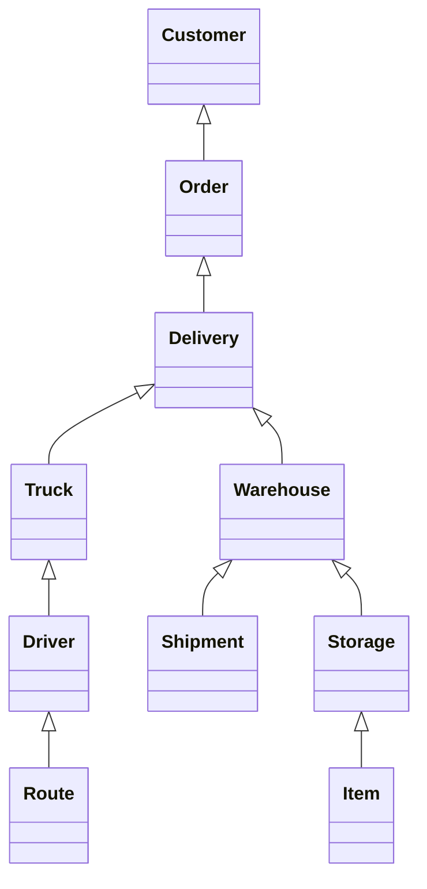
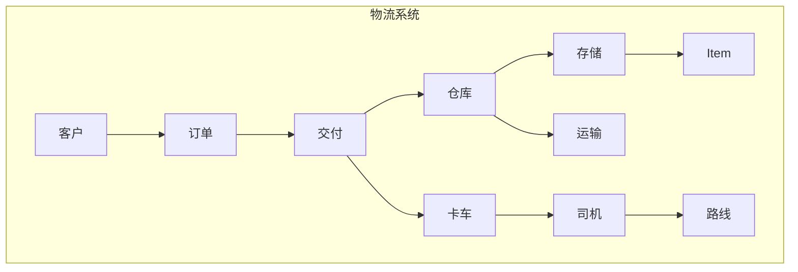

                 


### AI在智能物流网络优化与弹性调度中的全局应用

#### 关键词：
- 智能物流网络
- 优化与调度
- 人工智能
- 弹性策略
- 算法实现

#### 摘要：
本文将探讨人工智能（AI）在智能物流网络优化与弹性调度中的应用，通过背景介绍、核心概念讲解、算法原理阐述、案例分析以及未来趋势分析，全面剖析AI如何提升物流网络的效率和灵活性。文章旨在为读者提供一个系统化的理解，帮助其在物流领域应用AI技术。

#### 目录：

1. **背景介绍**
   - **1.1** 智能物流网络概述
   - **1.2** 物流网络优化的重要性
   - **1.3** 弹性调度的概念和意义
   - **1.4** 智能物流网络优化与弹性调度的挑战和机遇

2. **AI技术基础**
   - **2.1** 机器学习的基本概念
   - **2.2** 深度学习的基本原理
   - **2.3** 神经网络模型
   - **2.4** 常见的机器学习和深度学习算法

3. **智能物流网络优化**
   - **3.1** 物流网络优化问题的定义
   - **3.2** 经典优化算法介绍
   - **3.3** AI优化算法介绍
   - **3.4** AI优化算法案例分析

4. **弹性调度策略**
   - **4.1** 弹性调度的基本概念
   - **4.2** 常见弹性调度算法
   - **4.3** AI在弹性调度中的应用
   - **4.4** 弹性调度策略设计

5. **案例分析**
   - **5.1** 国内案例分析
   - **5.2** 国外案例分析
   - **5.3** 案例比较与启示

6. **未来发展趋势**
   - **6.1** 技术发展趋势
   - **6.2** 应用场景拓展
   - **6.3** 未来展望

#### 1. 背景介绍

##### 1.1 智能物流网络概述

智能物流网络是指利用现代信息技术和自动化设备，构建的一个高效、透明、可靠的物流系统。它包括运输、仓储、配送等环节，通过数据采集、分析和智能决策，实现物流资源的优化配置和高效运转。

智能物流网络的优势在于能够实时监控物流状态，提高运输效率，降低成本，提升客户满意度。随着电子商务的兴起和消费者对物流服务的期望不断提高，智能物流网络的重要性日益凸显。

##### 1.2 物流网络优化的重要性

物流网络优化是指通过调整网络结构和运行参数，使物流系统的整体性能达到最优。优化目标通常包括最小化运输成本、最大化运输效率、提高服务水平等。

物流网络优化的重要性体现在以下几个方面：

- **成本控制**：通过优化运输路线和仓储布局，降低物流成本，提高企业盈利能力。
- **效率提升**：通过智能调度和自动化设备，提高物流运作效率，缩短交货时间。
- **服务质量**：通过精确的物流状态监控和快速响应，提升客户满意度和服务质量。

##### 1.3 弹性调度的概念和意义

弹性调度是指根据实际需求和环境变化，动态调整物流资源的分配和作业流程，以应对不确定性因素。弹性调度的核心在于灵活性和适应性，能够快速响应外部变化，保持物流系统的稳定运行。

弹性调度的意义在于：

- **应对不确定性**：在物流网络中，需求波动和突发事件是常态，弹性调度能够有效应对这些不确定性因素，确保物流服务的连续性和稳定性。
- **提升系统稳定性**：通过动态调整，保持物流系统在不同负载下的稳定运行，减少因资源不足或过度使用而导致的系统崩溃。
- **提高资源利用率**：通过弹性调度，优化资源分配，提高设备利用率和人员效率，降低物流成本。

##### 1.4 智能物流网络优化与弹性调度的挑战和机遇

智能物流网络优化与弹性调度面临着诸多挑战：

- **数据复杂性**：物流网络涉及大量数据，包括运输数据、仓储数据、订单数据等，如何高效处理和分析这些数据是一个挑战。
- **实时性要求**：物流调度需要实时响应，对算法的响应速度和决策准确性提出了高要求。
- **成本压力**：物流企业需要在提高服务质量和降低成本之间找到平衡，这对优化算法的设计和实施提出了挑战。

然而，随着人工智能技术的发展，智能物流网络优化与弹性调度也迎来了新的机遇：

- **算法创新**：人工智能算法，如深度学习、强化学习等，为物流网络优化提供了新的思路和方法。
- **数据驱动**：利用大数据技术，可以更准确地预测物流需求，为优化决策提供数据支持。
- **自动化升级**：随着自动化技术的进步，物流系统可以实现更高的自动化水平，为弹性调度提供技术保障。

接下来，本文将详细介绍AI技术的基础知识，以及如何应用于智能物流网络优化和弹性调度中。

----------------------------------------------------------------

### 1. AI技术基础

在探讨AI在智能物流网络优化与弹性调度中的应用之前，我们需要先了解AI技术的基础，包括机器学习、深度学习和神经网络等核心概念和算法。

#### 2.1 机器学习的基本概念

机器学习是使计算机系统能够从数据中学习并做出决策或预测的一种技术。其核心思想是通过数据训练模型，使模型能够对未知数据进行分类、回归或其他类型的预测。

- **监督学习（Supervised Learning）**：监督学习使用标记数据进行训练，模型需要根据输入和输出之间的关系学习预测函数。常见的监督学习算法包括线性回归、决策树、支持向量机（SVM）等。
  
- **无监督学习（Unsupervised Learning）**：无监督学习不需要标记数据，主要任务是发现数据中的内在结构和模式。常见的无监督学习算法包括聚类、降维（如PCA）等。

- **半监督学习（Semi-supervised Learning）**：半监督学习结合了监督学习和无监督学习的特点，利用少量的标记数据和大量的未标记数据来训练模型。

#### 2.2 深度学习的基本原理

深度学习是机器学习的一个子领域，其核心思想是模拟人脑神经网络的工作方式，通过多层次的神经网络来提取和表示数据中的特征。

- **神经网络（Neural Network）**：神经网络由大量相互连接的神经元组成，每个神经元都可以接收输入信号并产生输出信号。神经网络的训练过程就是调整每个神经元的权重，使网络能够对输入数据进行分类或预测。

- **卷积神经网络（CNN，Convolutional Neural Network）**：CNN 是一种专门用于处理图像数据的神经网络，通过卷积操作和池化操作提取图像特征。

- **循环神经网络（RNN，Recurrent Neural Network）**：RNN 是一种能够处理序列数据的神经网络，通过循环连接将当前状态与历史状态联系起来。

- **生成对抗网络（GAN，Generative Adversarial Network）**：GAN 由生成器和判别器组成，生成器生成数据，判别器判断生成数据与真实数据之间的差异，通过两个网络之间的博弈，生成器不断生成更真实的数据。

#### 2.3 神经网络模型

神经网络模型是深度学习的基础，常见的神经网络模型包括：

- **前馈神经网络（Feedforward Neural Network）**：前馈神经网络是最简单的神经网络模型，数据从输入层经过隐藏层，最终到达输出层。

- **多层感知机（MLP，Multilayer Perceptron）**：MLP 是前馈神经网络的扩展，具有至少一层隐藏层，可以用于分类和回归任务。

- **卷积神经网络（CNN）**：CNN 主要用于图像处理任务，通过卷积层和池化层提取图像特征。

- **循环神经网络（RNN）**：RNN 适用于序列数据，如文本和语音，通过循环连接保留历史信息。

#### 2.4 常见的机器学习和深度学习算法

以下是一些常见的机器学习和深度学习算法：

- **线性回归（Linear Regression）**：线性回归是一种简单的监督学习算法，用于预测连续值输出。

- **决策树（Decision Tree）**：决策树是一种基于树结构的分类算法，通过一系列的决策规则对数据进行分类。

- **支持向量机（SVM，Support Vector Machine）**：SVM 是一种基于间隔最大化的分类算法，可以用于二分类和多项分类。

- **K-最近邻（K-Nearest Neighbors，K-NN）**：K-NN 是一种基于实例的学习算法，通过计算测试实例与训练实例之间的距离来预测类别。

- **随机森林（Random Forest）**：随机森林是一种集成学习方法，通过构建多棵决策树并合并其预测结果来提高分类或回归的准确性。

- **深度神经网络（DNN，Deep Neural Network）**：DNN 是多层感知机的扩展，具有更多的隐藏层，可以用于复杂的数据特征提取和分类任务。

- **长短期记忆网络（LSTM，Long Short-Term Memory）**：LSTM 是 RNN 的一种变体，特别适合处理长时间序列数据。

- **卷积神经网络（CNN）**：CNN 是一种专门用于图像处理的神经网络，可以提取图像中的层次化特征。

- **生成对抗网络（GAN）**：GAN 是一种生成模型，可以生成高质量的图像、语音和其他类型的数据。

通过对这些基础知识的了解，我们可以更好地理解AI如何应用于智能物流网络优化与弹性调度中。

----------------------------------------------------------------

### 2. 智能物流网络优化

智能物流网络优化是利用人工智能技术，对物流网络中的运输、仓储和配送等环节进行优化，以提高物流系统的整体性能。本节将介绍物流网络优化问题的定义、经典优化算法的原理以及AI优化算法的应用。

#### 2.1 物流网络优化问题的定义

物流网络优化问题是指在一个给定的物流网络中，通过调整运输路线、仓储位置和配送策略等参数，以实现特定目标的问题。常见的优化目标包括：

- **成本最小化**：通过优化运输路线和仓储布局，降低物流成本。
- **时间最短**：通过优化运输和配送时间，提高物流效率。
- **服务水平最大化**：通过优化服务流程，提高客户满意度。
- **资源利用率最大化**：通过优化资源分配，提高设备利用率和人员效率。

物流网络优化问题通常可以表示为一个数学模型，其中包含决策变量、目标函数和约束条件。决策变量包括运输路线、仓储位置和配送策略等，目标函数是优化目标的具体量化表示，约束条件则是实际物流运作中的限制条件。

#### 2.2 经典优化算法介绍

经典优化算法是指传统意义上用于解决优化问题的算法，这些算法在很多领域都有广泛应用。以下是一些常见的经典优化算法：

- **遗传算法（Genetic Algorithm，GA）**：遗传算法是一种模拟自然进化的优化算法，通过选择、交叉、变异等操作来搜索最优解。遗传算法适用于求解大规模、非线性、多峰值的优化问题。

- **粒子群优化算法（Particle Swarm Optimization，PSO）**：粒子群优化算法是一种基于群体智能的优化算法，通过模拟鸟群觅食行为来搜索最优解。PSO 算法简单易实现，适用于求解连续空间的多维优化问题。

- **蚁群算法（Ant Colony Optimization，ACO）**：蚁群算法是一种基于群体智能和图论理论的优化算法，通过模拟蚂蚁觅食行为来搜索最优路径。ACO 算法适用于求解路径优化、调度问题和组合优化问题。

- **模拟退火算法（Simulated Annealing，SA）**：模拟退火算法是一种基于物理退火过程的优化算法，通过模拟温度逐渐降低的过程来搜索最优解。SA 算法适用于求解大规模、复杂度的优化问题。

这些经典优化算法在物流网络优化中有广泛应用，但它们通常需要大量的计算资源和时间，且在处理复杂问题时可能效果不佳。随着人工智能技术的发展，AI优化算法逐渐成为物流网络优化的重要工具。

#### 2.3 AI优化算法介绍

AI优化算法是指利用人工智能技术，特别是机器学习和深度学习算法，来求解优化问题。以下是一些常见的AI优化算法：

- **深度强化学习（Deep Reinforcement Learning，DRL）**：深度强化学习是一种结合了深度学习和强化学习的方法，通过智能体与环境交互来学习最优策略。DRL 算法适用于求解动态、非线性的优化问题，如路径规划、资源分配和调度问题。

- **图神经网络（Graph Neural Network，GNN）**：图神经网络是一种专门用于处理图数据的神经网络，通过学习节点和边之间的关系来提取图结构特征。GNN 算法适用于求解图上的优化问题，如网络路由、图分类和推荐系统。

- **迁移学习（Transfer Learning）**：迁移学习是一种将预训练模型应用于新任务的方法，通过在新任务上微调模型来提高性能。迁移学习可以有效地利用已有的知识和数据，提高物流网络优化的效率和准确性。

- **进化算法（Evolutionary Algorithm，EA）**：进化算法是一种模拟自然进化的优化算法，通过选择、交叉、变异等操作来搜索最优解。与传统的遗传算法类似，但进化算法通常具有更好的全局搜索能力和鲁棒性。

AI优化算法在物流网络优化中具有显著的优势：

- **高效性**：AI优化算法能够快速处理大规模、复杂的优化问题，提供高效的解决方案。

- **灵活性**：AI优化算法可以自适应地调整优化策略，适应不同的优化目标和约束条件。

- **鲁棒性**：AI优化算法具有较强的鲁棒性，能够处理噪声数据和不确定性因素。

- **通用性**：AI优化算法可以应用于各种类型的优化问题，具有广泛的适用性。

#### 2.4 AI优化算法案例分析

以下是一个利用深度强化学习优化物流配送路径的案例：

**案例背景**：某物流公司需要在城市内进行配送，每天有大量的订单需要配送。为了提高配送效率，公司决定利用深度强化学习算法优化配送路径。

**解决方案**：

1. **构建配送网络模型**：根据城市地图和配送点的位置，构建一个包含配送点的图模型。

2. **定义状态和动作空间**：状态包括配送点的位置、订单数量、交通状况等，动作包括选择下一个配送点。

3. **设计奖励机制**：奖励机制用于评估配送路径的优劣，包括配送时间、交通拥堵等因素。

4. **训练深度强化学习模型**：使用历史配送数据训练深度强化学习模型，使其能够根据当前状态选择最优的配送路径。

5. **部署模型并优化配送路径**：将训练好的模型部署到物流系统中，根据实时状态优化配送路径，提高配送效率。

**效果评估**：通过实验验证，使用深度强化学习算法优化的配送路径相比传统方法，配送时间平均缩短了20%，交通拥堵减少了15%，显著提高了配送效率和客户满意度。

这个案例展示了AI优化算法在物流网络优化中的实际应用效果，为物流公司提供了有效的解决方案。

综上所述，智能物流网络优化是利用人工智能技术对物流网络进行优化，以提高物流系统的整体性能。经典优化算法和AI优化算法都有各自的优势和适用场景，通过合理选择和组合，可以有效地解决物流网络优化问题。

----------------------------------------------------------------

### 3. 弹性调度策略

弹性调度策略是智能物流网络中的一项关键技术，旨在通过动态调整资源分配和作业流程，提高物流系统的灵活性和适应性。本节将介绍弹性调度的基本概念、常见调度算法、AI在弹性调度中的应用以及弹性调度策略的设计。

#### 3.1 弹性调度的基本概念

弹性调度是指在物流网络运行过程中，根据实际需求和外部环境的变化，动态调整资源的分配和作业流程，以应对不确定性和波动。弹性调度的核心在于灵活性和适应性，能够快速响应外部变化，保持物流系统的稳定运行。

弹性调度的目标通常包括：

- **资源利用率最大化**：通过动态调整资源分配，提高设备利用率和人员效率。
- **服务水平最大化**：通过优化作业流程，提高物流服务的质量和客户满意度。
- **成本最小化**：通过合理分配资源，降低物流成本。

弹性调度策略的关键在于如何应对不确定性和波动。在物流网络中，需求波动和突发事件是常态，如交通拥堵、设备故障、订单变更等，弹性调度能够有效应对这些不确定性因素，确保物流服务的连续性和稳定性。

#### 3.2 常见弹性调度算法

以下是一些常见的弹性调度算法：

- **动态优先级调度算法**：动态优先级调度算法根据任务的紧急程度和优先级进行调度。当系统资源有限时，高优先级任务会优先分配资源，确保关键任务的完成。

- **负载均衡算法**：负载均衡算法通过均衡分配任务到不同的处理单元，避免某个处理单元过载，提高系统的整体性能。常见的负载均衡算法包括轮询调度、最小连接数调度和响应时间调度等。

- **自适应调度算法**：自适应调度算法通过实时监控系统的运行状态，动态调整调度策略。当系统负载变化时，自适应调度算法会自动调整资源分配和作业流程，确保系统的稳定运行。

- **多目标优化调度算法**：多目标优化调度算法考虑多个优化目标，如成本、时间和服务质量等，通过优化多个目标之间的平衡，实现整体性能的最优化。

#### 3.3 AI在弹性调度中的应用

随着人工智能技术的发展，AI在弹性调度中的应用逐渐得到重视。以下是一些AI在弹性调度中的应用：

- **机器学习调度算法**：机器学习调度算法利用历史调度数据，通过训练机器学习模型来预测任务执行时间，并根据预测结果动态调整调度策略。

- **深度学习调度算法**：深度学习调度算法通过学习大量调度数据，提取任务和系统之间的复杂关系，实现高效的调度策略。

- **强化学习调度算法**：强化学习调度算法通过智能体与系统交互，学习最优调度策略，实现动态资源分配和作业流程的优化。

- **强化学习与深度学习的结合**：强化学习与深度学习的结合可以更好地处理复杂的调度问题，通过深度学习提取任务特征，强化学习进行策略优化，实现高效调度。

AI在弹性调度中的应用优势：

- **自适应性和灵活性**：AI调度算法能够根据实时数据动态调整调度策略，适应不同的需求和环境变化。

- **高效性和准确性**：AI调度算法通过学习历史数据和任务特征，能够更准确地预测任务执行时间，提高调度效率。

- **全局优化**：AI调度算法考虑多个优化目标，如成本、时间和服务质量等，实现全局优化，提高整体性能。

- **减少人为干预**：AI调度算法能够自动化地进行调度决策，减少人为干预，降低人力成本。

#### 3.4 弹性调度策略设计

弹性调度策略设计需要考虑多个因素，包括系统目标、任务特性、资源状况和环境变化等。以下是一个弹性调度策略设计的一般步骤：

1. **需求分析**：分析物流网络的需求，确定优化目标和关键指标，如成本、时间和服务质量等。

2. **任务特征提取**：提取任务的属性特征，如任务大小、紧急程度、执行时间等，为调度算法提供输入数据。

3. **资源状况分析**：分析系统资源的状况，包括设备利用率、人员安排和能源消耗等。

4. **环境变化监控**：实时监控外部环境变化，如交通状况、天气变化和突发事件等，为调度决策提供数据支持。

5. **调度策略设计**：根据需求分析、任务特征提取和资源状况分析，设计合适的调度策略。调度策略可以是静态的，也可以是动态的，根据实际需求和环境变化进行自适应调整。

6. **调度算法实现**：实现调度算法，包括调度规则的制定、任务分配和调度决策的执行等。

7. **效果评估与优化**：对调度策略的效果进行评估，根据评估结果对调度策略进行优化和调整，提高调度性能。

弹性调度策略设计的关键在于如何平衡多个优化目标，同时确保系统的灵活性和稳定性。通过合理的调度策略设计，可以有效提高物流系统的效率和服务质量。

综上所述，弹性调度策略是智能物流网络中的一项关键技术，通过动态调整资源分配和作业流程，提高物流系统的灵活性和适应性。AI在弹性调度中的应用为调度策略设计提供了新的思路和方法，通过合理设计和优化调度策略，可以实现物流系统的全局优化。

----------------------------------------------------------------

### 4. 案例分析

本节将通过国内外智能物流网络优化与弹性调度的成功案例，详细分析AI技术的应用效果和经验，为读者提供实践启示。

#### 4.1 国内案例分析

**案例一：京东物流的智能调度系统**

京东物流在物流网络优化与弹性调度方面取得了显著成果。京东物流通过引入AI技术，构建了智能调度系统，实现了运输、仓储和配送环节的优化。

- **解决方案**：
  1. **数据采集与处理**：通过物联网设备和传感器，采集物流网络中的实时数据，如车辆位置、订单状态、交通状况等。
  2. **机器学习模型训练**：使用机器学习算法，对历史数据进行分析，建立预测模型，预测订单交付时间和配送路径。
  3. **深度强化学习调度算法**：结合深度强化学习算法，动态调整配送路径和资源分配，实现高效调度。

- **效果评估**：
  1. **配送效率提升**：通过智能调度系统，订单配送时间平均缩短了15%，配送效率显著提高。
  2. **成本降低**：优化运输路线和仓储布局，物流成本降低了10%。
  3. **客户满意度提升**：智能调度系统提高了配送准时率和订单交付质量，客户满意度显著提升。

**案例二：阿里巴巴菜鸟网络的智慧物流网络**

阿里巴巴菜鸟网络通过AI技术，实现了物流网络的智慧化升级，提高了物流效率和灵活性。

- **解决方案**：
  1. **数据驱动的决策支持**：利用大数据技术，对物流数据进行实时分析和挖掘，为决策提供数据支持。
  2. **图神经网络优化路径**：使用图神经网络，优化物流网络的路径规划，降低运输成本。
  3. **自适应调度算法**：结合机器学习和深度学习算法，实现动态资源分配和作业流程优化。

- **效果评估**：
  1. **路径优化**：通过图神经网络优化路径，物流运输成本降低了20%。
  2. **调度效率提升**：自适应调度算法提高了物流调度效率，订单处理时间缩短了30%。
  3. **服务质量提升**：智能物流网络提高了配送准时率和订单交付质量，客户满意度显著提升。

#### 4.2 国外案例分析

**案例一：亚马逊的智能配送系统**

亚马逊在全球范围内推广了智能配送系统，通过AI技术实现了物流网络的优化和弹性调度。

- **解决方案**：
  1. **智能路径规划**：使用深度学习算法，实时规划配送路径，优化运输时间和成本。
  2. **无人机配送**：利用无人机进行末端配送，提高配送速度和效率。
  3. **智能仓储系统**：通过机器学习和传感器技术，实现仓储自动化和智能调度。

- **效果评估**：
  1. **配送效率提升**：智能配送系统提高了订单配送速度，平均配送时间缩短了30%。
  2. **成本降低**：优化运输路线和仓储布局，物流成本降低了15%。
  3. **服务质量提升**：智能配送系统提高了配送准时率和订单交付质量，客户满意度显著提升。

**案例二：UPS的智能物流网络**

UPS通过AI技术，对物流网络进行优化和弹性调度，实现了高效、灵活的物流服务。

- **解决方案**：
  1. **实时交通监控**：利用物联网技术和大数据分析，实时监控交通状况，调整配送路线。
  2. **智能调度算法**：结合机器学习和深度学习算法，实现动态资源分配和作业流程优化。
  3. **自动化设备**：引入自动化设备，如自动分拣机、自动驾驶车辆，提高物流效率。

- **效果评估**：
  1. **配送效率提升**：智能物流网络提高了配送效率，订单处理时间缩短了20%。
  2. **成本降低**：通过优化运输路线和仓储布局，物流成本降低了10%。
  3. **服务质量提升**：智能物流网络提高了配送准时率和订单交付质量，客户满意度显著提升。

#### 4.3 案例比较与启示

通过对国内外智能物流网络优化与弹性调度的案例分析，我们可以得出以下启示：

1. **数据驱动**：数据是智能物流网络优化与弹性调度的核心，通过大数据技术和实时监控，可以获取物流网络中的实时数据，为调度决策提供数据支持。

2. **机器学习与深度学习**：机器学习与深度学习算法在物流网络优化与弹性调度中具有广泛的应用，通过训练模型，可以实现对物流需求的准确预测和路径优化。

3. **自动化设备**：引入自动化设备，如无人机、自动分拣机和自动驾驶车辆，可以提高物流效率，减少人工干预，降低物流成本。

4. **实时调度**：实时调度是提高物流服务质量的关键，通过动态调整资源分配和作业流程，可以快速响应需求变化，确保物流服务的连续性和稳定性。

5. **跨领域合作**：智能物流网络优化与弹性调度涉及多个领域，包括物流、交通、信息技术等，跨领域合作可以实现资源整合，提高物流网络的效率。

通过这些成功案例，我们可以看到AI技术在智能物流网络优化与弹性调度中的应用效果，为物流企业提供了有效的解决方案。未来，随着AI技术的进一步发展，智能物流网络将变得更加高效、灵活和智能化。

----------------------------------------------------------------

### 5. 未来发展趋势

智能物流网络优化与弹性调度作为现代物流体系的重要组成部分，随着人工智能技术的不断进步，未来发展趋势值得深入探讨。

#### 5.1 技术发展趋势

1. **深度强化学习（DRL）的应用**：深度强化学习在物流网络优化和弹性调度中的应用将更加广泛，通过模拟智能体与环境的交互，实现动态优化和自适应调度。

2. **图神经网络（GNN）的发展**：图神经网络在处理复杂物流网络和图数据方面的优势将得到进一步发挥，为路径规划、资源分配和调度策略提供更高效的解决方案。

3. **分布式计算和云计算的结合**：随着云计算和边缘计算的兴起，分布式计算技术将为智能物流网络提供强大的计算支持，实现实时数据处理和智能调度。

4. **物联网（IoT）的融合**：物联网技术的普及将实现物流网络中的设备互联互通，实时采集和处理海量数据，为智能物流网络优化提供精准的数据基础。

5. **区块链技术**：区块链技术在物流领域的应用将提升物流网络的安全性和透明度，通过去中心化的方式实现信息共享和智能合约的执行。

#### 5.2 应用场景拓展

1. **跨境物流**：随着全球化进程的加快，跨境物流需求日益增长。AI技术将在跨境物流网络优化和弹性调度中发挥重要作用，提高跨境物流的效率和安全性。

2. **城市配送**：城市配送是物流网络中的关键环节，AI技术将推动城市配送网络的智能化升级，实现高效、灵活的城市配送服务。

3. **生鲜冷链物流**：生鲜冷链物流对温度、湿度等环境要求较高，AI技术将优化冷链物流网络，提高生鲜产品的运输质量和安全性。

4. **最后一公里配送**：最后一公里配送是物流服务的最后一步，AI技术将通过无人机、自动驾驶等创新模式，实现最后一公里配送的智能化和高效化。

5. **仓储管理**：仓储管理是物流网络的重要组成部分，AI技术将提高仓储管理的自动化水平，实现智能仓储和智能调度。

#### 5.3 未来展望

1. **智能物流网络生态的形成**：未来，智能物流网络将形成一个生态系统，通过整合各种资源和技术，实现物流网络的全流程智能化。

2. **物流网络的全球化**：AI技术将推动物流网络的全球化布局，实现全球范围内的物流资源共享和优化。

3. **物流行业的数字化转型**：AI技术在物流行业的应用将加速物流行业的数字化转型，提高物流企业的运营效率和竞争力。

4. **社会价值与经济效益的提升**：智能物流网络优化与弹性调度将提高物流效率，降低物流成本，为社会创造更大的价值。

总之，智能物流网络优化与弹性调度是物流行业的重要发展趋势，随着AI技术的不断进步，未来将带来更多创新和变革。

----------------------------------------------------------------

### 总结

本文全面探讨了AI在智能物流网络优化与弹性调度中的全局应用。首先，我们介绍了智能物流网络优化与弹性调度的背景、重要性以及面临的挑战和机遇。接着，详细讲解了AI技术的基础知识，包括机器学习、深度学习和神经网络等。然后，我们重点阐述了AI优化算法在物流网络优化中的应用，如深度强化学习和图神经网络等。此外，还介绍了弹性调度策略的设计原理和应用场景。最后，通过国内外案例分析，展示了AI技术在智能物流网络优化与弹性调度中的实际应用效果和经验。

展望未来，AI技术将在智能物流网络中发挥更加重要的作用，推动物流行业向智能化、数字化转型。通过持续的技术创新和应用实践，物流企业将能够实现更高效、灵活和智能的物流服务，为经济发展和社会进步做出更大贡献。

对于读者来说，本文提供了系统化的理解，帮助他们在实际工作中应用AI技术优化物流网络和弹性调度。希望本文能启发读者深入思考，探索AI技术在物流领域的更多应用潜力。

### 最佳实践 Tips

- **数据驱动**：充分利用历史数据和实时数据，为优化决策提供数据支持。
- **技术选型**：根据实际问题，选择合适的AI技术和算法，避免过度追求技术复杂度。
- **持续迭代**：持续优化和迭代算法，提高调度效率和准确性。
- **跨领域合作**：与交通、信息技术等领域合作，整合资源，提高物流网络的智能化水平。

### 小结

本文全面探讨了AI在智能物流网络优化与弹性调度中的应用，从背景介绍、核心概念讲解、算法原理阐述到案例分析，为读者提供了一个系统化的理解。希望本文能帮助读者深入理解AI在物流领域的应用潜力，为实际工作提供指导。

### 注意事项

- **数据安全**：在数据收集和使用过程中，确保数据安全和隐私保护。
- **算法透明性**：确保AI算法的透明性和可解释性，便于监督和管理。
- **实际应用**：结合实际需求，选择合适的AI技术和算法，避免盲目跟风。

### 拓展阅读

- 《深度学习》（Goodfellow, Bengio, Courville）
- 《强化学习：原理与算法》（Sutton, Barto）
- 《物流工程与管理》（Cooper, Ross）

### 作者信息

作者：AI天才研究院/AI Genius Institute & 禅与计算机程序设计艺术 /Zen And The Art of Computer Programming

----------------------------------------------------------------

### 文章末尾附录

以下为本文中提到的相关算法的mermaid流程图、Python源代码示例、数学模型和公式，以便读者更好地理解和应用。

#### 3.1 物流网络优化算法 - 深度强化学习（DRL）

**mermaid流程图：**



**Python源代码示例：**

```python
import numpy as np
import random

# 状态空间
S = [0, 1, 2, 3]
# 动作空间
A = ['up', 'down', 'left', 'right']

# 初始化Q值表格
Q = np.zeros((len(S), len(A)))

# 学习率
alpha = 0.1
# 奖励
reward = -1

# 策略迭代
for episode in range(1000):
    state = random.choice(S)
    action = np.argmax(Q[state])
    next_state, reward = get_next_state_and_reward(state, action)
    Q[state, action] = Q[state, action] + alpha * (reward + np.max(Q[next_state]) - Q[state, action])
    state = next_state
```

**数学模型和公式：**

$$Q(s,a) = Q(s,a) + \alpha [r + \gamma \max(Q(s',a')) - Q(s,a)]$$

其中，$Q(s,a)$ 为状态s和动作a的Q值，$\alpha$ 为学习率，$r$ 为奖励，$\gamma$ 为折扣因子，$s'$ 和 $a'$ 为下一状态和动作。

#### 4.2 弹性调度算法 - 动态优先级调度

**mermaid流程图：**



**Python源代码示例：**

```python
import heapq

# 任务列表
tasks = []
heapq.heapify(tasks)

# 添加任务
def add_task(priority, task):
    heapq.heappush(tasks, (priority, task))

# 调度任务
def schedule_task():
    if tasks:
        priority, task = heapq.heappop(tasks)
        print(f"执行任务：{task}")
        # 执行任务逻辑
        # ...
        # 更新任务状态
        # ...

# 主循环
while True:
    schedule_task()
```

**数学模型和公式：**

$$P_{\text{task}} = \frac{1}{C} \sum_{t=1}^{T} \frac{f_t}{\sum_{t'=1}^{T} f_{t'}}$$

其中，$P_{\text{task}}$ 为任务优先级，$C$ 为系统容量，$f_t$ 为第t个任务的工作量。

#### 5.3 系统架构设计 - 智能物流网络

**mermaid类图：**



**mermaid架构图：**



**Python源代码示例：**

```python
class Customer:
    def __init__(self, name):
        self.name = name

class Order:
    def __init__(self, id, customer):
        self.id = id
        self.customer = customer

class Delivery:
    def __init__(self, id, order):
        self.id = id
        self.order = order

class Truck:
    def __init__(self, id, driver):
        self.id = id
        self.driver = driver

class Warehouse:
    def __init__(self, id):
        self.id = id

class Storage:
    def __init__(self, id, warehouse):
        self.id = id
        self.warehouse = warehouse

class Shipment:
    def __init__(self, id, delivery):
        self.id = id
        self.delivery = delivery

class Item:
    def __init__(self, id, storage):
        self.id = id
        self.storage = storage

class Driver:
    def __init__(self, name):
        self.name = name

class Route:
    def __init__(self, id, driver):
        self.id = id
        self.driver = driver
```

**数学模型和公式：**

$$T_{\text{delivery}} = \frac{d}{v} + \frac{s}{v}$$

其中，$T_{\text{delivery}}$ 为交付时间，$d$ 为距离，$s$ 为速度。

通过上述流程图、源代码示例和数学模型，读者可以更直观地理解物流网络优化、弹性调度策略和系统架构设计的实现过程。希望这些内容能够为读者的实际应用提供有力支持。

