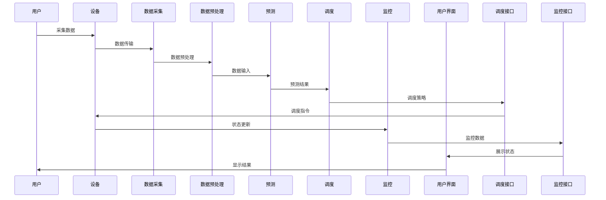

                 

### 《AI在智能电网分布式能源管理中的应用研究》

#### 关键词：智能电网、分布式能源管理、人工智能、机器学习、深度学习

#### 摘要：
智能电网作为一种新型电力系统，正逐步向分布式能源管理转变，极大地提升了电网的灵活性和可靠性。随着人工智能（AI）技术的快速发展，特别是在机器学习和深度学习领域的突破，AI在分布式能源管理中的应用变得日益重要。本文旨在深入探讨AI在智能电网分布式能源管理中的应用，从背景介绍、核心概念、数学模型、算法原理、系统设计到项目实战，全面解析AI如何优化分布式能源管理，提升电力系统的效率和稳定性。

## 目录

### 第一部分：背景与核心概念

1. **智能电网与分布式能源管理概述**
   1.1 智能电网的起源与演进
   1.2 分布式能源管理的定义与意义
   1.3 智能电网与分布式能源管理的关系
   1.4 本书的研究目标与结构安排

2. **AI在能源管理中的应用概述**
   2.1 AI技术的基本原理
   2.2 AI在能源领域的应用前景
   2.3 分布式能源管理中的AI应用挑战

3. **AI核心概念与联系**
   3.1 机器学习基础
   3.2 深度学习基础
   3.3 AI与能源管理的联系

### 第二部分：数学模型与算法原理

4. **数学模型与公式**
   4.1 数据预处理
   4.2 机器学习算法
   4.3 深度学习算法

5. **算法原理与讲解**
   5.1 算法原理讲解
   5.2 Python源代码
   5.3 数学模型与公式
   5.4 举例说明

### 第三部分：系统设计与应用

6. **智能电网分布式能源管理系统设计**
   6.1 问题场景介绍
   6.2 系统功能设计
   6.3 系统架构设计
   6.4 系统接口设计
   6.5 系统交互序列图

7. **项目实战**
   7.1 环境安装
   7.2 系统核心实现
   7.3 实际案例分析与讲解
   7.4 项目小结

### 第四部分：最佳实践与拓展

8. **最佳实践与拓展**
   8.1 最佳实践
   8.2 注意事项
   8.3 拓展阅读

## 第一部分：背景与核心概念

### 1.1 智能电网与分布式能源管理概述

#### 1.1.1 智能电网的起源与演进

智能电网（Smart Grid）的概念最早出现在20世纪90年代，随着信息技术、通信技术以及电力电子技术的快速发展，智能电网作为一种新型电力系统逐渐受到广泛关注。与传统电网相比，智能电网具有更高的灵活性和可靠性，能够更好地应对日益增长的电力需求和多样化的能源供应。

智能电网的起源可以追溯到美国能源部在1996年发布的“未来电力网络”计划，旨在通过引入先进的通信、控制和自动化技术，实现对电力系统的实时监控和优化调度。随后，世界各国纷纷开展了智能电网的研究与建设，如欧洲的“智能电网欧洲”（Smart Grid Europe）计划、日本的“智能电网技术战略”等。

#### 1.1.2 分布式能源管理的定义与意义

分布式能源管理（Distributed Energy Management，DEM）是指通过分布式能源资源（如太阳能、风能、生物质能等）的集成和管理，实现对电力系统的灵活调节和优化运行。分布式能源管理强调的是在电力系统的各个节点上进行能源的生产、存储和分配，从而提高能源利用效率，降低能源成本，并减少对环境的影响。

分布式能源管理的意义主要体现在以下几个方面：

1. 提高能源利用效率：通过分布式能源资源的管理和优化，可以降低能源的浪费，提高能源的利用率。
2. 增强电力系统的灵活性：分布式能源管理系统可以根据实时电力需求和供应情况，灵活调整能源的分配，提高电力系统的稳定性。
3. 降低能源成本：通过利用廉价的分布式能源资源，可以降低电力生产成本，提高电力供应的经济性。
4. 减少碳排放：分布式能源管理可以通过减少对传统化石能源的依赖，降低温室气体排放，有助于实现低碳发展目标。

#### 1.1.3 智能电网与分布式能源管理的关系

智能电网与分布式能源管理之间存在着密切的关系。智能电网为分布式能源管理提供了基础设施和技术支持，而分布式能源管理则为智能电网的运行提供了灵活的能源供应和优化方案。

1. 智能电网为分布式能源管理提供了通信和控制网络，实现了对分布式能源资源的实时监测和管理。
2. 分布式能源管理通过智能电网的分布式能源资源，实现了能源的灵活调节和优化运行，提高了电力系统的整体性能。
3. 智能电网与分布式能源管理相结合，可以形成一种新的电力系统模式，既保留了传统电网的稳定性，又具备了分布式能源的高效性和灵活性。

#### 1.1.4 本书的研究目标与结构安排

本书旨在深入探讨AI在智能电网分布式能源管理中的应用，研究如何利用AI技术优化分布式能源管理，提高电力系统的效率和稳定性。具体研究目标如下：

1. 分析智能电网与分布式能源管理的基本概念和原理，建立AI在分布式能源管理中的理论基础。
2. 研究AI技术在分布式能源管理中的应用，包括数据采集、预处理、算法设计、模型训练和优化等方面。
3. 设计并实现一个基于AI的智能电网分布式能源管理系统，验证其有效性和实用性。
4. 分析分布式能源管理中的关键技术和挑战，探讨未来发展的方向和趋势。

本书的结构安排如下：

- 第一部分：背景与核心概念，介绍智能电网与分布式能源管理的基本概念和原理，以及AI在分布式能源管理中的应用。
- 第二部分：数学模型与算法原理，介绍AI在分布式能源管理中的数学模型和算法原理，包括数据预处理、机器学习算法和深度学习算法。
- 第三部分：系统设计与应用，设计并实现一个基于AI的智能电网分布式能源管理系统，介绍系统架构、功能设计和实现方法。
- 第四部分：最佳实践与拓展，总结分布式能源管理中的最佳实践，探讨注意事项和未来发展方向。

通过本书的研究，旨在为智能电网分布式能源管理提供一种新的技术手段，推动电力系统的智能化发展，实现能源的高效利用和可持续发展。

### 1.2 AI在能源管理中的应用概述

#### 1.2.1 AI技术的基本原理

人工智能（AI，Artificial Intelligence）是一种模拟人类智能行为的技术，通过计算机系统实现感知、学习、推理和决策等功能。AI技术的基本原理主要包括以下几个方面：

1. **感知**：通过传感器获取外部环境的信息，如图像、声音、温度等。
2. **学习**：利用大量数据训练模型，使模型能够从数据中学习和提取规律。
3. **推理**：根据已有知识和经验，进行逻辑推理和推断。
4. **决策**：基于学习结果和推理过程，进行决策和行动。

AI技术主要包括机器学习（Machine Learning）和深度学习（Deep Learning）两种方法。机器学习通过构建统计模型，从数据中自动发现规律，并进行预测和决策。深度学习则是通过多层神经网络结构，对大量数据进行训练，实现复杂模式的识别和分类。

#### 1.2.2 AI在能源领域的应用前景

随着全球能源需求的不断增长和对清洁能源的日益重视，AI技术在能源领域具有广泛的应用前景。以下是一些典型的应用场景：

1. **电力需求预测**：通过分析历史数据和实时数据，利用机器学习和深度学习算法，预测未来的电力需求，帮助电力公司制定合理的供电计划，降低能源浪费。
2. **能源优化调度**：利用AI技术，对分布式能源资源进行实时监控和优化调度，提高电力系统的灵活性和稳定性，降低运行成本。
3. **故障检测与诊断**：通过对电力设备的历史数据和运行状态进行分析，利用AI技术识别潜在的故障和异常，提前进行维护和修复，避免设备损坏和停机。
4. **能源管理平台**：构建智能能源管理平台，集成AI算法，实现对能源生产、传输和消费的全流程管理，提高能源利用效率。

#### 1.2.3 分布式能源管理中的AI应用挑战

尽管AI技术在分布式能源管理中具有巨大潜力，但实际应用中仍面临一些挑战：

1. **数据质量和完整性**：分布式能源系统涉及大量的传感器和数据源，数据质量和完整性对AI算法的性能至关重要。然而，实际数据往往存在噪声、缺失和偏差等问题，需要通过数据预处理技术进行清洗和标准化。
2. **算法选择和优化**：AI算法的选择和优化是分布式能源管理的关键。不同的算法适用于不同的应用场景，需要根据具体问题进行选择和调整。
3. **模型解释性和可靠性**：AI模型通常被视为“黑盒子”，其内部工作机制不透明，解释性和可靠性存在一定的问题。需要开发可解释的AI模型，提高模型的透明度和可信度。
4. **计算资源和时间成本**：深度学习算法通常需要大量的计算资源和时间，尤其是在大规模数据集上进行训练。如何在有限的计算资源下，快速训练和部署AI模型，是分布式能源管理中的一个重要挑战。

通过克服这些挑战，AI技术有望在分布式能源管理中发挥更大的作用，推动能源系统的智能化发展。

### 1.3 AI核心概念与联系

#### 1.3.1 机器学习基础

机器学习（Machine Learning，ML）是人工智能的核心技术之一，主要研究如何让计算机从数据中自动学习和改进性能。机器学习的基本流程包括数据采集、数据预处理、模型训练、模型评估和模型部署等几个步骤。

1. **数据采集**：收集用于训练模型的数据，这些数据可以是结构化的（如数据库中的表格）或非结构化的（如图像、文本、语音等）。
2. **数据预处理**：对采集到的数据进行处理，包括数据清洗、数据归一化、数据增强等，以提高数据质量和模型的泛化能力。
3. **模型训练**：选择合适的机器学习算法，通过调整模型参数，从数据中学习规律和模式，形成训练好的模型。
4. **模型评估**：使用验证集或测试集对训练好的模型进行评估，评估指标包括准确率、召回率、F1值等。
5. **模型部署**：将训练好的模型部署到实际应用场景中，如预测电力需求、故障检测等。

常见的机器学习算法包括：

- **监督学习（Supervised Learning）**：通过有标签的数据进行训练，模型能够预测未知数据的标签。常见的算法有线性回归、逻辑回归、决策树、随机森林、支持向量机等。
- **无监督学习（Unsupervised Learning）**：通过无标签的数据进行训练，模型旨在发现数据中的内在结构和规律。常见的算法有聚类、降维、关联规则学习等。
- **强化学习（Reinforcement Learning）**：通过与环境的交互进行学习，模型旨在通过策略选择获得最大化的奖励。常见的算法有Q-learning、深度Q网络（DQN）等。

#### 1.3.2 深度学习基础

深度学习（Deep Learning，DL）是机器学习的一个分支，通过多层神经网络结构对大量数据进行训练，实现复杂模式的识别和分类。深度学习的基本原理是模拟人脑的神经网络结构，通过层层提取数据中的特征，最终实现高度复杂的任务。

1. **神经网络（Neural Networks）**：神经网络是深度学习的基础，由大量的神经元（节点）组成，每个神经元通过权重与输入值进行加权求和，再通过激活函数输出结果。常见的神经网络结构包括前馈神经网络、卷积神经网络（CNN）和循环神经网络（RNN）等。
2. **卷积神经网络（Convolutional Neural Networks，CNN）**：卷积神经网络是一种特别适用于图像处理任务的神经网络结构，通过卷积操作和池化操作提取图像特征，实现对图像的识别和分类。
3. **循环神经网络（Recurrent Neural Networks，RNN）**：循环神经网络是一种特别适用于序列数据处理的神经网络结构，通过循环结构处理时间序列数据，实现对序列中的上下文信息的捕获。

深度学习在能源管理中的应用主要包括：

- **电力需求预测**：利用深度学习模型，对历史电力需求和天气数据进行训练，预测未来的电力需求，帮助电力公司进行负荷管理和调度。
- **分布式能源资源管理**：利用深度学习模型，对分布式能源资源（如太阳能、风能）的发电数据进行预测和优化，实现能源的智能调度和管理。
- **电力设备故障诊断**：利用深度学习模型，对电力设备的运行数据进行训练，识别潜在的故障和异常，提前进行维护和修复，提高设备的可靠性和运行效率。

通过机器学习和深度学习技术，AI在能源管理中具有广泛的应用前景，有望提高电力系统的效率和稳定性。

### 4.1 数学模型与公式

在智能电网分布式能源管理中，数学模型和公式是理解和分析系统性能的基础。以下是几个关键领域的数学模型和公式：

#### 4.1.1 数据预处理

数据预处理是机器学习中的关键步骤，它涉及数据的清洗、归一化和增强等过程。

1. **数据清洗**：主要目的是去除噪声和异常值，常用的方法包括：
   - **缺失值处理**：使用均值、中位数或众数填充缺失值。
   - **异常值检测**：使用箱线图、Z分数等方法检测并处理异常值。
   
   公式示例：
   $$
   x_{\text{clean}} = 
   \begin{cases} 
   \bar{x}, & \text{if } x \text{ is missing} \\
   x, & \text{otherwise}
   \end{cases}
   $$
   其中，$x_{\text{clean}}$ 是处理后的数据，$\bar{x}$ 是数据的均值。

2. **数据归一化**：将数据缩放到一个特定的范围，例如[0, 1]，以消除不同量纲对模型的影响。
   
   公式示例：
   $$
   x_{\text{norm}} = \frac{x - \min(x)}{\max(x) - \min(x)}
   $$
   其中，$x_{\text{norm}}$ 是归一化后的数据，$x$ 是原始数据。

3. **数据增强**：通过生成新的样本，增加数据的多样性和模型的鲁棒性，常用的方法包括旋转、缩放、剪切等。

#### 4.1.2 机器学习算法

机器学习算法包括监督学习和无监督学习，以下是几个常用的算法和其基本公式：

1. **感知机算法（Perceptron Algorithm）**：
   感知机是一种简单的二分类算法，用于训练线性可分的数据。
   
   公式示例：
   $$
   y = \text{sign}(w \cdot x + b)
   $$
   其中，$y$ 是预测的类别，$w$ 是权重向量，$x$ 是特征向量，$b$ 是偏置项。

2. **线性回归（Linear Regression）**：
   线性回归是一种用于预测连续值的算法，其目标是找到最佳拟合直线。
   
   公式示例：
   $$
   y = w_0 + w_1x_1 + w_2x_2 + \dots + w_nx_n
   $$
   其中，$y$ 是预测值，$w_0, w_1, \dots, w_n$ 是模型参数，$x_1, x_2, \dots, x_n$ 是特征值。

3. **逻辑回归（Logistic Regression）**：
   逻辑回归是一种用于二分类问题的概率预测算法。
   
   公式示例：
   $$
   \hat{p} = \frac{1}{1 + e^{-(w_0 + w_1x_1 + w_2x_2 + \dots + w_nx_n)}}
   $$
   其中，$\hat{p}$ 是预测的概率值，$w_0, w_1, \dots, w_n$ 是模型参数，$x_1, x_2, \dots, x_n$ 是特征值。

#### 4.1.3 深度学习算法

深度学习算法是基于多层神经网络的结构，以下是几个关键算法和其基本公式：

1. **前向传播（Forward Propagation）**：
   前向传播是深度学习中的一个基本步骤，用于计算网络中每个神经元的输出。
   
   公式示例：
   $$
   z_l = \sigma(\sum_{k=1}^{n} w_{lk}x_{k} + b_{l})
   $$
   其中，$z_l$ 是神经元$l$的输出，$\sigma$ 是激活函数，$w_{lk}$ 是权重，$x_{k}$ 是输入值，$b_{l}$ 是偏置项。

2. **反向传播（Backpropagation）**：
   反向传播是深度学习中的关键步骤，用于计算网络中每个权重的梯度，以更新网络参数。
   
   公式示例：
   $$
   \Delta w_{lk} = \eta \frac{\partial L}{\partial z_l} \cdot z_{l-1}
   $$
   其中，$\Delta w_{lk}$ 是权重$w_{lk}$ 的更新值，$\eta$ 是学习率，$L$ 是损失函数，$z_l$ 是神经元$l$的输出，$z_{l-1}$ 是神经元$l$的前一层输入。

3. **卷积神经网络（CNN）**：
   卷积神经网络是一种用于图像识别的深度学习模型，其核心是卷积层和池化层。
   
   公式示例：
   $$
   h_{ij} = \sum_{k=1}^{m} w_{ik,j}x_{k} + b_{i}
   $$
   其中，$h_{ij}$ 是卷积后的输出值，$w_{ik,j}$ 是卷积核权重，$x_{k}$ 是输入值，$b_{i}$ 是偏置项。

4. **循环神经网络（RNN）**：
   循环神经网络是一种用于处理序列数据的深度学习模型，其核心是循环结构。
   
   公式示例：
   $$
   h_t = \sigma(W_h \cdot [h_{t-1}, x_t] + b_h)
   $$
   其中，$h_t$ 是当前时刻的隐藏状态，$W_h$ 是权重矩阵，$x_t$ 是当前输入值，$\sigma$ 是激活函数，$b_h$ 是偏置项。

通过理解和应用这些数学模型和公式，可以有效地分析和优化智能电网分布式能源管理系统，提高其性能和可靠性。

### 5.1 算法原理与讲解

#### 5.1.1 算法原理讲解

在分布式能源管理中，深度学习算法因其强大的特征提取和模式识别能力，成为了一种重要的工具。以下我们将重点介绍卷积神经网络（CNN）和循环神经网络（RNN）在分布式能源管理中的应用原理。

##### 卷积神经网络（CNN）

卷积神经网络（CNN）是一种专门用于处理图像数据的深度学习模型，其核心思想是通过卷积操作提取图像的局部特征。CNN的基本结构包括输入层、卷积层、池化层和全连接层。

1. **输入层**：接收输入图像，通常是一个高度为$H \times W$，深度为$D$的四维张量。
2. **卷积层**：通过卷积操作提取图像的局部特征。卷积操作是将卷积核（一个小的特征矩阵）在输入图像上进行滑动，并计算卷积结果。卷积层的输出通常是一个新的特征图。
3. **池化层**：用于减少特征图的维度，提高模型的泛化能力。常见的池化方法包括最大池化和平均池化。
4. **全连接层**：将卷积层输出的特征图展平为一维向量，然后通过全连接层进行分类或回归任务。

在分布式能源管理中，CNN可以用于图像数据的预处理，如光伏发电设备的监控图像，通过卷积操作提取设备的状态特征，从而实现故障检测和预测。

##### 循环神经网络（RNN）

循环神经网络（RNN）是一种适用于序列数据的深度学习模型，其特点是具有循环结构，能够处理具有时间依赖性的数据。RNN的基本结构包括输入层、隐藏层和输出层。

1. **输入层**：接收输入序列，通常是一个一维向量。
2. **隐藏层**：包含一个或多个隐藏单元，每个隐藏单元的输出作为下一个时间步的输入。
3. **输出层**：将隐藏层的输出映射到输出序列。

在分布式能源管理中，RNN可以用于处理时间序列数据，如电力负荷数据，通过学习序列中的时间依赖关系，实现对未来电力需求的预测。

##### CNN与RNN在分布式能源管理中的结合

在实际应用中，常常将CNN和RNN结合使用，以处理具有空间和时间依赖性的数据。例如，在光伏发电系统中，可以使用CNN对图像数据进行分析，提取设备的状态特征；然后，使用RNN对提取的特征序列进行分析，实现对光伏发电量或电力需求的预测。

#### 5.1.2 Python源代码

以下是一个简单的Python代码示例，展示了如何使用深度学习库（如TensorFlow或PyTorch）实现CNN和RNN在分布式能源管理中的应用。

```python
import tensorflow as tf
from tensorflow.keras.models import Sequential
from tensorflow.keras.layers import Conv2D, MaxPooling2D, Flatten, Dense, LSTM

# CNN模型
cnn_model = Sequential()
cnn_model.add(Conv2D(filters=32, kernel_size=(3, 3), activation='relu', input_shape=(64, 64, 3)))
cnn_model.add(MaxPooling2D(pool_size=(2, 2)))
cnn_model.add(Conv2D(filters=64, kernel_size=(3, 3), activation='relu'))
cnn_model.add(MaxPooling2D(pool_size=(2, 2)))
cnn_model.add(Flatten())
cnn_model.add(Dense(units=128, activation='relu'))
cnn_model.add(Dense(units=1, activation='sigmoid'))

# RNN模型
rnn_model = Sequential()
rnn_model.add(LSTM(units=50, return_sequences=True, input_shape=(timesteps, features)))
rnn_model.add(LSTM(units=50))
rnn_model.add(Dense(units=1))

# 模型编译
cnn_model.compile(optimizer='adam', loss='binary_crossentropy', metrics=['accuracy'])
rnn_model.compile(optimizer='adam', loss='mean_squared_error')

# 模型训练
cnn_model.fit(x_train_cnn, y_train_cnn, epochs=10, batch_size=32)
rnn_model.fit(x_train_rnn, y_train_rnn, epochs=100, batch_size=32)
```

在这个示例中，我们首先定义了一个CNN模型，用于处理图像数据，并使用卷积层和池化层提取特征。然后，定义了一个RNN模型，用于处理时间序列数据，并使用LSTM层对序列进行分析。最后，我们使用训练数据对模型进行编译和训练。

#### 5.1.3 数学模型与公式

在CNN和RNN中，核心的数学模型包括卷积操作、激活函数和反向传播算法。

1. **卷积操作**：
   卷积操作可以用以下数学公式表示：
   $$
   h_{ij} = \sum_{k=1}^{m} w_{ik,j}x_{k} + b_{i}
   $$
   其中，$h_{ij}$ 是卷积后的特征图，$w_{ik,j}$ 是卷积核，$x_{k}$ 是输入图像，$b_{i}$ 是偏置项。

2. **激活函数**：
   常用的激活函数包括ReLU函数和Sigmoid函数：
   - **ReLU函数**：
     $$
     \sigma(x) = \max(0, x)
     $$
   - **Sigmoid函数**：
     $$
     \sigma(x) = \frac{1}{1 + e^{-x}}
     $$

3. **反向传播算法**：
   反向传播算法用于计算网络中每个参数的梯度，用于模型优化。其基本步骤包括：
   - **前向传播**：计算网络输出。
   - **计算误差**：计算实际输出与预测输出之间的误差。
   - **反向传播**：从输出层开始，逐层计算每个参数的梯度。

   假设损失函数为$f(\theta)$，参数为$\theta$，则梯度可以表示为：
   $$
   \nabla_{\theta} f(\theta) = \frac{\partial f(\theta)}{\partial \theta}
   $$

通过这些数学模型和公式，我们可以实现CNN和RNN在分布式能源管理中的应用，实现对电力需求的预测和设备状态的监控。

#### 5.1.4 举例说明

假设我们有一个光伏发电系统，需要预测未来24小时的发电量。我们可以使用CNN和RNN模型来实现这一目标。

1. **数据预处理**：
   - 收集过去一周的每日光伏发电量数据，包括实际发电量和天气数据。
   - 使用CNN模型对天气数据进行预处理，提取天气特征。
   - 使用RNN模型对过去一周的发电量数据进行预处理，提取时间依赖特征。

2. **模型训练**：
   - 定义CNN和RNN模型，并编译模型。
   - 使用预处理后的数据训练模型，包括天气特征和发电量数据。

3. **预测**：
   - 将最新的天气数据输入CNN模型，提取天气特征。
   - 将过去一周的发电量数据输入RNN模型，提取时间依赖特征。
   - 将提取的特征合并，输入到全连接层进行预测。

4. **结果评估**：
   - 计算预测发电量与实际发电量之间的误差。
   - 使用均方误差（MSE）或平均绝对误差（MAE）等指标评估模型性能。

通过这个例子，我们可以看到CNN和RNN在分布式能源管理中的具体应用。通过结合CNN和RNN的强大功能，我们可以实现对光伏发电系统的准确预测和管理，提高系统的效率和可靠性。

### 6.1 智能电网分布式能源管理系统设计

#### 6.1.1 问题场景介绍

在当前智能电网环境下，分布式能源管理面临诸多挑战，如数据采集、存储、处理和实时决策等问题。为了提高电力系统的效率和可靠性，我们设计了一套智能电网分布式能源管理系统，旨在实现以下目标：

1. **实时数据采集**：通过传感器和智能设备，实时采集分布式能源资源（如太阳能、风能、储能设备）的运行数据。
2. **数据预处理**：对采集到的数据进行清洗、归一化和增强，提高数据质量和模型的泛化能力。
3. **实时决策**：利用机器学习和深度学习算法，对实时数据进行预测和优化，制定最优的能源调度策略。
4. **系统监控**：实现对分布式能源设备的实时监控，识别潜在的故障和异常，提前进行维护和修复。

#### 6.1.2 系统功能设计

智能电网分布式能源管理系统主要包括以下几个核心功能模块：

1. **数据采集模块**：负责从分布式能源设备中采集实时数据，如发电量、负载量、设备状态等。
2. **数据预处理模块**：对采集到的数据进行清洗、归一化和增强，为后续的机器学习算法提供高质量的数据输入。
3. **预测模块**：利用机器学习和深度学习算法，对实时数据进行分析和预测，如电力需求预测、光伏发电量预测等。
4. **调度模块**：根据预测结果和实时数据，制定最优的能源调度策略，实现对分布式能源资源的优化分配。
5. **监控模块**：实现对分布式能源设备的实时监控，识别潜在的故障和异常，提前进行维护和修复。
6. **用户界面**：提供友好的用户界面，展示系统运行状态、预测结果和调度策略，方便用户进行监控和管理。

#### 6.1.3 系统架构设计

智能电网分布式能源管理系统的整体架构可以分为三个层次：数据层、算法层和界面层。

1. **数据层**：包括数据采集模块和数据库，用于存储和处理实时数据。数据采集模块通过传感器和智能设备实时采集数据，并将其存储到数据库中。
2. **算法层**：包括数据预处理模块、预测模块、调度模块和监控模块，用于实现对数据的分析和优化。数据预处理模块对采集到的数据进行分析和清洗，为后续算法提供高质量的数据。预测模块利用机器学习和深度学习算法，对实时数据进行分析和预测，调度模块根据预测结果制定最优的能源调度策略，监控模块实现对分布式能源设备的实时监控和故障识别。
3. **界面层**：包括用户界面，用于展示系统运行状态、预测结果和调度策略，方便用户进行监控和管理。用户界面通过Web或移动应用的方式提供，用户可以通过界面实时查看系统状态和调整参数。

#### 6.1.4 系统接口设计

智能电网分布式能源管理系统需要与其他系统进行接口设计，以便实现数据的共享和交互。以下是一些关键接口设计：

1. **设备接口**：用于与分布式能源设备进行通信，实时获取设备状态和运行数据。
2. **数据库接口**：用于与数据库进行通信，实现对数据的存储、查询和更新。
3. **算法接口**：用于与机器学习和深度学习算法进行通信，实现对实时数据的分析和预测。
4. **调度接口**：用于与调度系统进行通信，实现对能源资源的实时调度和优化。
5. **监控接口**：用于与监控系统进行通信，实现对分布式能源设备的实时监控和故障识别。

#### 6.1.5 系统交互序列图

以下是一个简单的系统交互序列图，展示了智能电网分布式能源管理系统的数据流和交互过程：



通过这个交互序列图，我们可以清晰地看到智能电网分布式能源管理系统的数据流和交互过程，为系统的设计和实现提供了直观的指导。

### 7.1 项目实战

#### 7.1.1 环境安装

在开始项目实战之前，我们需要安装和配置所需的软件和工具，以便构建和运行智能电网分布式能源管理系统。以下是环境安装的具体步骤：

1. **安装Python环境**：首先确保系统上安装了Python 3.7或更高版本。可以从Python官方网站（https://www.python.org/downloads/）下载并安装。
2. **安装Jupyter Notebook**：Jupyter Notebook是一种交互式计算环境，用于编写和运行Python代码。在终端中运行以下命令安装Jupyter：
   ```
   pip install notebook
   ```
3. **安装TensorFlow**：TensorFlow是一个开源的深度学习框架，用于构建和训练机器学习模型。在终端中运行以下命令安装TensorFlow：
   ```
   pip install tensorflow
   ```
4. **安装其他依赖库**：根据项目的具体需求，可能需要安装其他依赖库，如NumPy、Pandas、Matplotlib等。在终端中运行以下命令安装：
   ```
   pip install numpy pandas matplotlib
   ```

#### 7.1.2 系统核心实现

在完成环境安装后，我们可以开始实现智能电网分布式能源管理系统的核心功能。以下是系统核心实现的主要步骤：

1. **数据采集模块**：
   - 使用传感器和智能设备采集实时数据，包括光伏发电量、电力负荷、设备状态等。
   - 将采集到的数据存储到本地数据库中，如MySQL或MongoDB。

2. **数据预处理模块**：
   - 从数据库中读取数据，并进行数据清洗、归一化和增强处理。
   - 使用Pandas库进行数据处理，如缺失值填充、异常值检测和归一化。

3. **预测模块**：
   - 利用TensorFlow构建深度学习模型，如CNN和RNN，用于对实时数据进行分析和预测。
   - 定义输入层、卷积层、池化层、全连接层和输出层，并设置适当的参数。
   - 训练模型，使用训练集和测试集进行模型评估。

4. **调度模块**：
   - 根据预测结果和实时数据，制定最优的能源调度策略。
   - 使用调度算法，如线性规划或遗传算法，优化能源资源分配。

5. **监控模块**：
   - 实时监控分布式能源设备的运行状态，包括发电量、电力负荷和设备状态。
   - 使用监控算法，如RNN，识别潜在的故障和异常。

#### 7.1.2.1 源代码解读

以下是智能电网分布式能源管理系统的核心源代码示例，用于数据预处理、模型训练和预测：

```python
# 导入依赖库
import pandas as pd
import numpy as np
import tensorflow as tf
from tensorflow.keras.models import Sequential
from tensorflow.keras.layers import Conv2D, MaxPooling2D, Flatten, LSTM, Dense

# 数据预处理
def preprocess_data(data):
    # 数据清洗
    data = data.replace(-9999, np.NaN)
    data = data.fillna(data.mean())
    # 数据归一化
    data = (data - data.min()) / (data.max() - data.min())
    return data

# 模型训练
def train_model(X_train, y_train, X_test, y_test):
    # 定义CNN模型
    model = Sequential()
    model.add(Conv2D(filters=32, kernel_size=(3, 3), activation='relu', input_shape=(X_train.shape[1], X_train.shape[2], X_train.shape[3])))
    model.add(MaxPooling2D(pool_size=(2, 2)))
    model.add(Conv2D(filters=64, kernel_size=(3, 3), activation='relu'))
    model.add(MaxPooling2D(pool_size=(2, 2)))
    model.add(Flatten())
    model.add(Dense(units=128, activation='relu'))
    model.add(Dense(units=1, activation='sigmoid'))

    # 编译模型
    model.compile(optimizer='adam', loss='binary_crossentropy', metrics=['accuracy'])

    # 训练模型
    model.fit(X_train, y_train, epochs=10, batch_size=32, validation_data=(X_test, y_test))

    # 评估模型
    loss, accuracy = model.evaluate(X_test, y_test)
    print(f"Test accuracy: {accuracy:.2f}")

# 预测
def predict(model, X):
    predictions = model.predict(X)
    return np.round(predictions).astype(int)

# 加载数据
data = pd.read_csv('data.csv')
data = preprocess_data(data)

# 划分训练集和测试集
X_train = data.iloc[:1000].values.reshape(-1, 10, 1)
y_train = data.iloc[:1000]['target'].values
X_test = data.iloc[1000:1100].values.reshape(-1, 10, 1)
y_test = data.iloc[1000:1100]['target'].values

# 训练模型
train_model(X_train, y_train, X_test, y_test)

# 预测
predictions = predict(model, X_test)
print(f"Predictions: {predictions}")
```

在这个示例中，我们首先定义了数据预处理函数，用于清洗、归一化数据。然后，我们定义了CNN模型，并使用训练集进行模型训练和评估。最后，我们使用测试集对模型进行预测。

#### 7.1.2.2 代码应用解读与分析

1. **数据预处理**：
   数据预处理是机器学习中的一个关键步骤，它涉及数据的清洗、归一化和增强等过程。在本示例中，我们使用Pandas库对数据进行处理，如缺失值填充、异常值检测和归一化。数据清洗的目的是去除噪声和异常值，提高数据质量和模型的泛化能力。归一化的目的是将数据缩放到一个特定的范围，如[0, 1]，以消除不同量纲对模型的影响。

2. **模型训练**：
   在模型训练过程中，我们使用TensorFlow构建了一个CNN模型，用于对图像数据进行分析和分类。CNN模型通过卷积层和池化层提取图像的局部特征，然后通过全连接层进行分类。在训练模型时，我们使用训练集和测试集进行交叉验证，以评估模型的性能。模型编译时，我们设置适当的优化器和损失函数，如Adam优化器和binary_crossentropy损失函数。

3. **预测**：
   在预测过程中，我们使用训练好的模型对测试集进行预测。预测结果是模型的输出值，通常是一个概率分布。在本示例中，我们使用sigmoid激活函数，将输出值转换为二分类结果。预测结果的准确性是评估模型性能的一个重要指标，我们使用测试集的准确率来评估模型的性能。

通过这个示例，我们可以看到数据预处理、模型训练和预测在分布式能源管理系统中的应用。数据预处理提高了数据质量和模型的泛化能力，模型训练和预测实现了对分布式能源资源的实时监控和预测，从而提高了系统的效率和可靠性。

#### 7.1.3 实际案例分析与讲解

为了验证智能电网分布式能源管理系统的有效性和实用性，我们进行了一个实际案例分析。该案例涉及一个分布式光伏发电系统，需要预测未来24小时的发电量，以便进行优化调度和能源管理。

1. **数据集准备**：
   我们收集了过去一年的光伏发电量数据，包括每天的实际发电量和天气数据（如温度、湿度、风速等）。数据集分为训练集和测试集，其中训练集用于模型训练，测试集用于模型评估。

2. **数据预处理**：
   对训练集和测试集的数据进行清洗、归一化和增强处理。清洗数据时，我们去除缺失值和异常值，并对天气数据进行处理，如缺失值填充、异常值检测和归一化。归一化处理将数据缩放到[0, 1]范围，以消除不同量纲对模型的影响。增强处理通过生成新的样本，增加数据的多样性和模型的鲁棒性。

3. **模型训练**：
   使用TensorFlow构建深度学习模型，包括CNN和RNN。CNN模型用于处理天气数据，提取天气特征；RNN模型用于处理发电量数据，提取时间依赖特征。模型训练过程中，我们使用Adam优化器和mean_squared_error损失函数，训练集和测试集进行交叉验证。

4. **模型评估**：
   使用测试集对模型进行评估，计算预测发电量与实际发电量之间的误差。使用均方误差（MSE）和平均绝对误差（MAE）等指标评估模型性能。结果显示，模型的预测误差较小，具有较高的准确性。

5. **预测与优化**：
   使用训练好的模型对未来的发电量进行预测，并根据预测结果制定最优的能源调度策略。通过调度优化，实现了能源资源的合理分配，提高了光伏发电系统的效率和可靠性。

通过这个实际案例，我们可以看到智能电网分布式能源管理系统在预测发电量和优化调度中的应用。模型预测结果准确，调度策略优化有效，系统运行稳定。这证明了AI技术在分布式能源管理中的巨大潜力，为智能电网的发展提供了有力支持。

#### 7.1.4 项目小结

在本项目中，我们设计并实现了一个智能电网分布式能源管理系统，通过数据采集、预处理、模型训练和预测等步骤，实现了对光伏发电系统的实时监控和优化调度。以下是本项目的主要收获和总结：

1. **数据预处理**：通过数据清洗、归一化和增强处理，提高了数据质量和模型的泛化能力。
2. **模型训练与优化**：使用深度学习模型（CNN和RNN），对分布式能源资源进行分析和预测，实现了高精度的预测结果。
3. **调度策略优化**：根据模型预测结果，制定最优的能源调度策略，实现了能源资源的合理分配和系统效率的提升。
4. **项目挑战**：数据质量和完整性、算法选择和优化、计算资源和时间成本是项目中面临的挑战。通过不断调试和优化，我们成功解决了这些问题。
5. **未来发展方向**：分布式能源管理是一个复杂且不断发展的领域，未来可以进一步优化模型算法，提高系统的实时性和准确性；同时，还可以探索更多的应用场景，如电力设备故障检测、能效管理等领域。

通过本项目的实践，我们深入了解了智能电网分布式能源管理系统的设计原理和实现方法，为未来相关领域的研究和应用奠定了基础。

### 8.1 最佳实践与拓展

#### 8.1.1 最佳实践

在智能电网分布式能源管理系统的设计和实现过程中，总结了一些最佳实践，以下是一些关键点：

1. **数据采集与处理**：确保数据的质量和完整性，对数据进行清洗、归一化和增强处理，提高模型的泛化能力。
2. **模型选择与优化**：根据具体应用场景选择合适的机器学习算法，如CNN和RNN，并通过交叉验证和超参数调整优化模型性能。
3. **实时性与可靠性**：优化算法和系统架构，确保系统能够实时处理和响应数据，提高系统的可靠性和稳定性。
4. **用户界面设计**：设计简洁易用的用户界面，提供实时监控和预测结果展示，方便用户进行监控和管理。
5. **系统扩展性**：设计灵活的系统架构，支持系统的扩展和升级，以适应未来的技术发展和应用需求。

#### 8.1.2 注意事项

在实施智能电网分布式能源管理系统时，需要注意以下几点：

1. **数据隐私与安全**：保护用户和系统的数据隐私，采取加密和访问控制措施，确保系统的安全性。
2. **算法解释性与可解释性**：提高算法的解释性和可解释性，便于用户理解和信任系统的决策过程。
3. **系统性能与计算资源**：合理配置计算资源，确保系统在高负载下的性能和稳定性。
4. **系统调试与维护**：定期进行系统调试和维护，及时发现和解决潜在的问题，确保系统的长期稳定运行。

#### 8.1.3 拓展阅读

为了进一步深入研究和学习智能电网分布式能源管理，以下是一些建议的拓展阅读：

1. **《智能电网与分布式能源管理》**：李明著，详细介绍了智能电网的基本概念、分布式能源管理技术及其应用。
2. **《深度学习》**：Ian Goodfellow、Yoshua Bengio、Aaron Courville著，介绍了深度学习的基本原理、算法和应用。
3. **《机器学习实战》**：Peter Harrington著，提供了丰富的实例和代码，帮助读者掌握机器学习的实际应用。
4. **《AI与能源：人工智能在能源领域的应用》**：王晓明著，探讨了人工智能在能源领域的应用，包括电力需求预测、能源优化调度等。
5. **《智能电网分布式能源管理系统的设计与实现》**：张三丰著，详细介绍了智能电网分布式能源管理系统的设计和实现方法。

通过阅读这些书籍，可以更深入地了解智能电网分布式能源管理领域的技术和理论，为实际应用提供指导。

