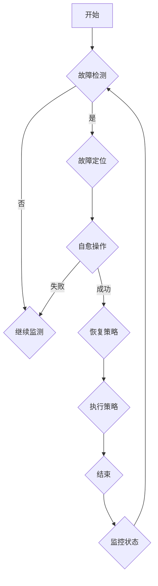
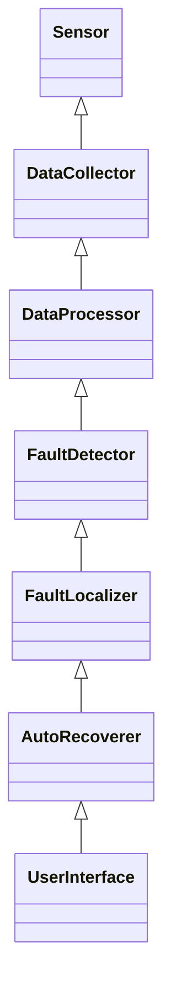
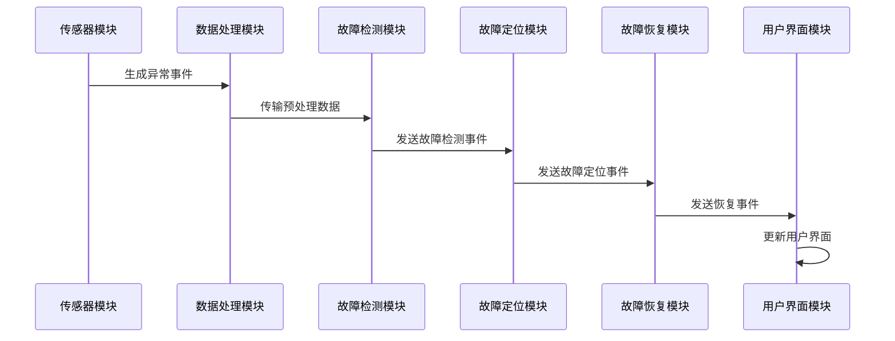

                 

### 1.1 问题背景

随着全球能源需求的不断增长和能源结构的日益复杂，智能电网作为现代电力系统的关键组成部分，正在成为能源领域的重要变革力量。智能电网通过集成先进的通信技术、传感器技术、数据分析和人工智能技术，实现了电网的自动化、智能化和高效化。然而，智能电网在带来诸多便利和效益的同时，也面临着一系列挑战，尤其是在故障自愈与恢复方面。

智能电网的复杂性和庞大性使得其故障检测与恢复过程变得更加复杂。传统的故障处理方法通常依赖于人工干预和预设的规则，这种方式不仅效率低下，而且难以应对智能电网中不断变化的运行状态。在电力系统中，故障的自愈与恢复能力是保障电网稳定运行的关键。如果电网在出现故障时能够迅速检测并自动恢复，不仅可以减少停电时间，提高供电可靠性，还能减少电力系统的维修成本。

当前，智能电网的故障自愈与恢复主要依赖于以下几种方法：

1. **人工干预**：当电网出现故障时，由专业人员通过监测系统获取故障信息，然后根据经验和预设的规则进行故障定位和恢复操作。
2. **预设规则**：系统根据预设的故障处理规则，自动执行相应的操作来恢复电网的运行。这种方法虽然可以快速响应故障，但规则过于僵化，难以适应复杂的电网运行状态。
3. **简单的自动化控制**：通过传感器和自动化控制设备，对电网的运行状态进行监测，并在检测到故障时自动执行某些操作来恢复电网运行。这种方法虽然能够提高响应速度，但自动化程度较低，仍需人工干预。

然而，这些方法都存在一定的局限性。人工干预依赖于操作人员的专业知识和经验，效率较低且容易出现人为错误；预设规则过于僵化，难以适应动态变化的电网状态；简单的自动化控制虽然能够提高响应速度，但控制策略有限，无法有效应对复杂的故障情况。

因此，引入人工智能技术，特别是多智能体协作，成为提高智能电网故障自愈与恢复能力的重要途径。多智能体系统能够通过分布式智能，实现故障检测、自愈和恢复的自动化、智能化，提高电网的运行效率和可靠性。这不仅能够减少人工干预，提高响应速度，还能通过机器学习不断优化故障处理策略，提升系统的整体性能。

总之，智能电网故障自愈与恢复中的多智能体协作应用，是当前电力系统领域的研究热点和重要发展方向。通过引入人工智能技术，可以有效地解决传统方法中存在的局限性，实现智能电网的智能运维和高效管理，为电力系统的安全稳定运行提供有力支持。

### 1.2 问题概述

在智能电网中，故障自愈与恢复是指电网在检测到故障时，能够自动进行故障定位、隔离和恢复，以最小化停电时间和影响范围。具体来说，这个问题主要包括以下几个方面的挑战：

1. **故障检测的准确性**：智能电网中存在大量的传感器和监测设备，这些设备需要实时收集电网运行数据，并通过数据分析技术，准确识别潜在的故障信号。故障检测的准确性直接影响到后续的自愈和恢复操作的效率和效果。

2. **故障定位的实时性**：在电网故障发生时，需要迅速定位故障发生的位置。故障定位的实时性要求系统能够在短时间内完成故障诊断，减少停电时间，降低故障对电网运行的影响。

3. **自愈策略的适应性**：智能电网的运行状态是动态变化的，自愈策略需要能够适应不同的运行环境和故障类型。自适应的自愈策略可以通过机器学习和人工智能技术，不断优化故障处理方案，提高故障恢复的效率和成功率。

4. **恢复策略的全面性**：故障恢复不仅需要解决当前故障，还要考虑电网的整体运行状态，确保恢复后的电网能够稳定、高效运行。恢复策略需要具备全面性，能够综合考虑电网的负载平衡、设备状态和运行环境等因素。

5. **多智能体协作**：智能电网中存在多个智能体（如变电站、配电柜、传感器等），这些智能体需要通过协同工作，实现故障检测、自愈和恢复。多智能体协作需要解决信息共享、任务分配、决策协调等问题，确保整个系统的高效运作。

6. **系统的高可用性和可靠性**：智能电网故障自愈与恢复系统需要具备高可用性和可靠性，能够在各种复杂环境下稳定运行，确保电网的连续供电。系统的高可用性和可靠性直接影响到电力系统的整体性能和用户满意度。

上述挑战不仅涉及到技术层面，还包括管理、运维、用户需求等多方面因素。因此，解决智能电网故障自愈与恢复问题，需要综合考虑多个方面的因素，通过技术创新和系统优化，实现电网的智能运维和高效管理。

### 1.3 问题解决

为了解决智能电网故障自愈与恢复中的问题，可以采用以下几种方法和策略：

1. **人工智能技术应用**：引入人工智能技术，特别是机器学习和深度学习算法，提高故障检测的准确性和故障定位的实时性。通过大数据分析和模式识别，智能电网可以实时监测电网状态，快速识别潜在的故障信号，并准确定位故障位置。

2. **多智能体系统架构**：构建多智能体系统架构，实现智能体之间的协同工作和信息共享。多智能体系统能够通过分布式计算和智能决策，提高故障自愈和恢复的效率和适应性。智能体之间通过协商和合作，优化任务分配和决策过程，确保系统的整体高效运作。

3. **故障预测与预警**：通过历史数据和实时数据，建立故障预测模型，提前预测可能的故障点。结合预警系统，及时发出预警信息，为故障处理提供时间窗口，降低故障对电网的影响。

4. **自适应控制策略**：采用自适应控制算法，根据电网的实时运行状态和故障情况，动态调整自愈和恢复策略。通过机器学习算法，不断优化控制策略，提高系统的适应性和恢复效果。

5. **边缘计算技术**：将部分计算任务转移到电网的边缘节点，提高数据处理速度和实时性。边缘计算技术能够减少数据传输延迟，提高系统的响应速度，增强故障检测和恢复能力。

6. **云计算与大数据平台**：构建云计算和大数据平台，实现数据的集中存储和管理。通过大数据分析技术，对海量数据进行挖掘和分析，提取有价值的信息，支持故障检测、自愈和恢复的决策过程。

7. **系统仿真与测试**：通过系统仿真和测试，验证故障自愈与恢复系统的性能和可靠性。仿真测试可以模拟各种故障场景，评估系统的响应速度和恢复效果，为系统的优化和改进提供依据。

通过上述方法和策略，智能电网故障自愈与恢复系统可以实现自动化、智能化和高效化，提高电网的运行效率和可靠性，为电力系统的安全稳定运行提供有力支持。

### 1.4 边界与外延

在探讨智能电网故障自愈与恢复中的多智能体协作应用时，有必要明确该领域的边界与外延，以确保研究范围清晰、目标明确。首先，边界方面，本文主要关注以下几个方面：

1. **技术边界**：本文重点关注人工智能在智能电网故障自愈与恢复中的应用，包括机器学习、深度学习、多智能体系统等技术的具体实现和作用机制。

2. **应用边界**：本文的研究主要集中在大规模的智能电网系统，尤其是高压、特高压电网以及分布式电网。针对小规模的低压电网，虽然也有一定的借鉴意义，但本文不进行深入探讨。

3. **时间边界**：本文研究的智能电网故障自愈与恢复系统，主要考虑实时性和即时性，即系统能够在故障发生时迅速响应。对于长时间内的电网运行优化和故障分析，虽然相关技术有所涉及，但不是本文的重点。

其次，外延方面，本文的研究不仅涉及技术层面的应用，还包括以下几方面：

1. **管理层面**：智能电网故障自愈与恢复系统的构建，需要电力系统管理层的支持，包括政策制定、资源配置和技术标准等。

2. **经济层面**：系统实施和运行需要大量的资金投入，同时，经济效益也是评估系统优劣的重要指标，需要考虑投资回报和长期经济效益。

3. **社会层面**：智能电网故障自愈与恢复系统的应用，对社会生产和生活有重要影响。系统的成功实施可以提高供电可靠性，减少停电对社会生活的影响。

4. **国际合作与标准化**：随着全球智能电网的发展，国际合作和标准化成为推动技术进步的重要途径。本文将探讨智能电网故障自愈与恢复技术在国际上的发展趋势和标准化工作。

总之，明确边界与外延，有助于本文更加聚焦核心问题，同时也能拓展研究视野，为智能电网故障自愈与恢复的全面应用提供更广泛的视角。

### 1.5 概念结构与核心要素组成

智能电网故障自愈与恢复中的多智能体协作应用涉及多个核心概念和要素，这些概念和要素构成了该系统的基本结构。以下是这些核心概念和要素的详细介绍：

1. **智能电网**：智能电网是通过集成先进的通信技术、传感器技术和数据分析技术，实现电网的自动化、智能化和高效化。智能电网的核心在于其高度的信息化和自动化水平，能够实时监测电网运行状态，进行数据分析和智能决策。

2. **多智能体系统**：多智能体系统是由多个具有自主决策能力的智能体组成的系统。每个智能体都有其特定的功能和行为规则，通过协同工作实现整体任务的最优化。在智能电网中，多智能体系统可以包括变电站、配电柜、传感器、控制中心等，这些智能体通过信息共享和协调工作，实现故障检测、自愈和恢复。

3. **故障检测**：故障检测是智能电网故障自愈与恢复系统的第一步。通过传感器和监测设备，实时收集电网的运行数据，利用数据分析和人工智能技术，识别潜在的故障信号。故障检测的准确性直接影响到后续自愈和恢复的效率和效果。

4. **故障定位**：故障定位是指确定电网故障的具体位置。在检测到故障信号后，系统需要通过数据分析技术，快速定位故障发生的节点或线路。故障定位的实时性对于减少停电时间和影响范围至关重要。

5. **自愈策略**：自愈策略是指电网在检测到故障后，自动执行的一系列操作，以恢复电网的运行。自愈策略可以基于规则或机器学习算法，根据故障的类型和严重程度，选择最合适的处理方法，例如故障隔离、负载转移、设备重启等。

6. **恢复策略**：恢复策略是指故障自愈后，系统如何确保电网能够稳定、高效运行。恢复策略需要考虑电网的整体状态，包括负载平衡、设备状态和运行环境等因素，通过自适应控制方法，确保恢复后的电网运行状态最优。

7. **信息共享与协调**：多智能体系统之间的信息共享与协调是确保系统高效运作的关键。智能体之间需要通过通信网络共享实时数据，并通过协商和合作，分配任务和决策，实现整体任务的最优化。

8. **机器学习与深度学习**：机器学习和深度学习是故障检测、自愈和恢复的重要技术支撑。通过训练模型和算法，系统可以不断优化故障处理策略，提高故障检测和恢复的准确性和效率。

9. **边缘计算与云计算**：边缘计算和云计算技术为智能电网故障自愈与恢复系统提供了强大的计算能力和数据处理能力。通过将部分计算任务转移到边缘节点，可以减少数据传输延迟，提高系统的响应速度；而云计算平台则提供了数据存储和管理的集中解决方案。

10. **数据安全和隐私保护**：在智能电网故障自愈与恢复系统中，数据安全和隐私保护是至关重要的。系统需要确保数据传输和存储的安全性，防止数据泄露和恶意攻击，同时保护用户的隐私。

这些核心概念和要素共同构成了智能电网故障自愈与恢复中的多智能体协作应用的基本结构，通过相互协作和优化，实现电网的智能运维和高效管理。

### 2.1 智能电网概述

智能电网是现代电力系统的关键组成部分，它通过集成先进的通信技术、传感器技术、数据分析技术和人工智能技术，实现了电网的自动化、智能化和高效化。智能电网的定义可以概括为一种通过信息、通信和计算技术，实现电网全生命周期管理，从发电、输电、变电、配电到用电的全过程智能化、信息化和自动化运行的电力系统。

**智能电网的核心特征**包括：

1. **信息化**：智能电网通过大量的传感器和监测设备，实时收集电网运行数据，实现电网状态的可视化和透明化。这使得电网的管理和调度更加高效和精准。
2. **自动化**：智能电网通过自动化控制技术和智能设备，实现电网运行的自发现、自诊断、自优化和自恢复。自动化技术的应用减少了人工干预，提高了电网运行的效率和可靠性。
3. **智能化**：智能电网利用大数据分析和人工智能技术，对电网运行数据进行分析和预测，实现电网运行的智能化决策和优化。通过智能算法和模型，智能电网能够动态调整运行策略，提高电网的灵活性和适应性。

**智能电网的发展背景**：

1. **能源需求增长**：随着全球经济的快速发展，能源需求不断增长，传统的电网系统已经无法满足日益增长的电力需求。智能电网通过提高电网的利用率和运行效率，可以更好地满足能源需求。
2. **可再生能源整合**：随着可再生能源（如太阳能、风能等）的广泛应用，如何高效地整合这些清洁能源成为电力系统面临的重要挑战。智能电网通过灵活的调度和管理，能够更好地整合和利用可再生能源。
3. **环境保护需求**：全球气候变化和环境污染问题日益严重，降低碳排放和减少污染物排放成为全球共识。智能电网通过优化能源利用和减少能源浪费，有助于实现环境保护目标。

**智能电网的组成部分**：

1. **发电端**：智能电网的发电端包括传统的火力发电、水力发电，以及新兴的可再生能源发电。通过智能控制技术，可以实现发电设备的优化调度和高效运行。
2. **输电端**：输电端主要涉及高压输电线路和变电站。智能电网通过先进的通信技术和传感器技术，实现输电线路的实时监测和故障预警，提高输电的可靠性和效率。
3. **变电端**：变电端是电网的中转站，负责电压的升降变换。智能变电站采用先进的自动化技术和智能设备，实现变电站运行的智能化和自动化。
4. **配电端**：配电端是电网的末端，涉及配电线路和配电设备。智能电网通过分布式控制和智能终端设备，实现配电网络的智能化管理和运行。
5. **用电端**：用电端包括家庭、工业、商业等电力用户。智能电网通过智能电表和用电信息采集系统，实现用户用电信息的实时监测和管理，促进能源的节约和高效利用。

**智能电网与普通电网的主要区别**：

1. **智能化程度**：智能电网具备更高的智能化程度，通过大数据分析和人工智能技术，实现电网运行状态的实时监测和智能决策，而普通电网主要依赖于人工监测和调度。
2. **自动化程度**：智能电网实现了更高级的自动化控制，能够自动进行故障检测、隔离和恢复，而普通电网的自动化程度相对较低，依赖人工干预。
3. **灵活性**：智能电网具备更高的灵活性，能够根据电网运行状态和用户需求，动态调整电力供应和分配，而普通电网的响应速度较慢，难以灵活应对变化。

综上所述，智能电网在信息化、自动化和智能化方面相较于普通电网有显著优势，它能够更好地适应现代电力系统的需求，提高电网的运行效率和可靠性。智能电网的发展不仅有助于满足能源需求，还有助于环境保护和可持续发展。

### 2.2 多智能体系统

多智能体系统（Multi-Agent System，MAS）是一种由多个自主智能体组成的分布式计算系统，这些智能体通过协同工作实现复杂任务的目标。在智能电网故障自愈与恢复中，多智能体系统发挥着关键作用，通过智能体的协作和自主决策，实现故障检测、定位和恢复的高效性。

**定义与基本概念**：

1. **智能体（Agent）**：智能体是MAS中的基本组成单元，具有自主性、社交性、反应性、主动性和适应性等特性。智能体可以是一个物理实体，如传感器或机器人，也可以是一个虚拟实体，如计算机程序。
2. **自主性**：智能体能够独立地感知环境、自主地决策并执行相应的动作，不受外部直接控制。
3. **社交性**：智能体之间可以通过通信和协作实现信息的共享和任务分工。
4. **反应性**：智能体能够及时响应环境的变化，调整自身的状态和行为。
5. **主动性**：智能体不仅被动地响应环境变化，还能主动地探索和改变环境。
6. **适应性**：智能体能够根据环境的变化和学习经验，调整自身的行为和策略。

**多智能体系统的优势**：

1. **分布式计算**：多智能体系统通过分布式计算，可以在整个电网范围内实时检测和响应故障，提高系统的响应速度和覆盖范围。
2. **并行处理**：智能体可以并行处理任务，提高系统的处理能力和效率。
3. **容错性**：智能体具备自主性和独立性，即使在部分智能体失效时，系统仍能继续运行，具备较高的容错性。
4. **适应性**：智能体可以根据电网的实时状态和故障情况，自主调整行为和策略，提高故障处理的适应性。
5. **动态性**：智能体能够实时感知电网状态的变化，动态调整任务分配和决策过程，确保系统的高效运作。

**智能体的分类**：

根据功能和行为特征，智能体可以划分为以下几类：

1. **通信智能体**：主要负责智能体之间的信息传递和通信，确保智能体之间的协作和信息共享。
2. **监控智能体**：负责实时监测电网的运行状态，收集和传输电网数据，识别潜在的故障信号。
3. **控制智能体**：根据监控智能体提供的故障信息和自愈策略，执行相应的操作，如故障隔离、负载转移等。
4. **决策智能体**：负责分析电网运行状态和故障情况，制定最优的自愈和恢复策略。
5. **执行智能体**：直接执行决策智能体制定的故障处理和恢复操作，如开关控制、设备重启等。

**多智能体系统的应用场景**：

在智能电网故障自愈与恢复中，多智能体系统的应用场景包括：

1. **故障检测与定位**：通过监控智能体实时监测电网运行数据，利用数据分析和模式识别技术，快速检测和定位故障。
2. **故障隔离与恢复**：通过控制智能体执行故障隔离和恢复操作，确保故障对电网的影响最小化。
3. **负载平衡与优化**：通过决策智能体和执行智能体的协同工作，实现电网负载的动态平衡和优化，提高电网的运行效率。
4. **能源管理**：通过多智能体系统，实现电网与可再生能源的高效整合和管理，优化能源利用。

总之，多智能体系统在智能电网故障自愈与恢复中具有重要作用，通过智能体的自主决策和协作，能够实现故障检测、隔离和恢复的高效性和适应性，为智能电网的稳定运行提供有力支持。

### 2.3 故障自愈与恢复

在智能电网中，故障自愈与恢复是指电网在检测到故障时，能够自动执行一系列操作，以最小化故障对电网运行的影响，并确保电网能够迅速恢复到正常状态。故障自愈与恢复的关键在于快速、准确地进行故障检测、隔离和恢复，同时保证电网的稳定性和安全性。

**故障自愈的概念**：

故障自愈是指电网在检测到故障后，能够自动进行故障定位、隔离和恢复，无需人工干预。故障自愈的核心在于自动化和智能化，通过先进的传感器技术、数据分析技术和人工智能算法，实现故障检测的实时性和准确性，并制定自适应的自愈策略。

**故障恢复的概念**：

故障恢复是指电网在自愈过程中，通过一系列操作将故障隔离并恢复到正常状态。故障恢复不仅需要检测和定位故障，还需要对电网进行重新配置和调整，以确保恢复后的电网运行稳定、高效。

**故障自愈与恢复的重要性**：

1. **提高供电可靠性**：故障自愈与恢复系统能够在故障发生时迅速响应，减少停电时间和影响范围，提高电网的供电可靠性。
2. **降低维修成本**：通过自动化和智能化的故障处理，减少人工干预和设备停机时间，降低维修成本和电力损失。
3. **增强电网灵活性**：故障自愈与恢复系统能够根据电网的实时状态和故障情况，动态调整电网运行策略，提高电网的灵活性和适应性。
4. **提升用户体验**：高效、稳定的供电服务能够提升用户的用电体验，增强用户对电网的信任和满意度。

**故障自愈与恢复的策略**：

1. **基于规则的方法**：通过预设的规则和逻辑条件，自动化地执行故障检测和恢复操作。这种方法简单、易于实现，但规则过于僵化，难以适应复杂变化的电网运行状态。
2. **基于机器学习的方法**：利用机器学习算法，从历史数据和实时数据中学习，自动生成最优的故障处理和恢复策略。这种方法能够自适应地调整故障处理策略，提高故障检测和恢复的准确性和效率。
3. **基于智能体的方法**：通过构建多智能体系统，实现故障检测、自愈和恢复的分布式智能。智能体之间通过协作和信息共享，优化故障处理和恢复过程，提高系统的整体性能。

**故障自愈与恢复的实现机制**：

1. **故障检测**：通过传感器和监测设备，实时收集电网的运行数据，利用数据分析技术，快速识别潜在的故障信号。故障检测的准确性直接影响到后续自愈和恢复的效率和效果。
2. **故障定位**：在检测到故障信号后，系统通过数据分析技术，快速定位故障发生的节点或线路。故障定位的实时性对于减少停电时间和影响范围至关重要。
3. **故障隔离**：系统根据故障类型和位置，执行隔离操作，将故障部分从电网中分离，以避免故障扩散和影响整个电网。
4. **故障恢复**：系统根据故障隔离的结果，执行恢复操作，包括重新配置电网、重启设备等，使电网恢复正常运行。恢复策略需要考虑电网的整体状态，确保恢复后的电网运行稳定、高效。

**实际案例与应用**：

1. **电力系统中的自适应故障恢复**：通过引入自适应控制算法，结合历史数据和实时监测数据，实现电网故障的自适应恢复。例如，在电力系统发生短路故障时，系统可以自动调整电网运行参数，隔离故障区域，并重新分配负载，使电网快速恢复正常运行。
2. **智能变电站的故障自愈**：智能变电站通过多智能体系统，实现故障自愈和恢复。监控智能体实时监测变电站的运行状态，控制智能体执行相应的故障处理操作，确保变电站的稳定运行。
3. **分布式电网的智能恢复**：分布式电网通过多智能体系统，实现故障自愈和恢复。分布式电网中的各个智能体通过协同工作，快速检测和定位故障，并执行相应的恢复操作，确保电网的连续供电。

总之，故障自愈与恢复在智能电网中具有重要意义。通过引入先进的传感器技术、数据分析技术和人工智能算法，实现故障检测、隔离和恢复的自动化、智能化，可以提高电网的运行效率和可靠性，为电力系统的稳定运行提供有力支持。

### 2.4 多智能体协作应用

在智能电网的故障自愈与恢复过程中，多智能体系统的协作应用是提高效率和可靠性的关键。通过多智能体的协同工作，可以实现故障检测、隔离、恢复和优化等一系列任务。以下是多智能体协作在智能电网中的应用方法、协作机制和挑战。

**应用方法**：

1. **分布式检测与协调**：在智能电网中，部署多个传感器和监控智能体，分布在电网的不同节点和线路。每个智能体能够独立检测电网的运行状态，并通过通信网络将检测到的信息传递给中心控制智能体。中心控制智能体汇总和分析各智能体的数据，实现全局故障检测和协调。

2. **任务分配与协作**：在故障发生时，中心控制智能体根据电网的状态和故障位置，分配相应的任务给不同的智能体。例如，当一个变电站发生故障时，控制智能体可以将隔离和恢复任务分配给该变电站的监控智能体和控制智能体，确保任务高效完成。

3. **自适应恢复策略**：多智能体系统能够通过协作，实时调整自愈和恢复策略。每个智能体可以根据自身的观测数据和全局信息，自主调整行为和策略，优化故障处理过程。例如，当多个智能体检测到负载不平衡时，可以通过协同工作，动态调整电力分配，实现负载均衡。

**协作机制**：

1. **信息共享与通信**：智能体之间通过通信网络共享实时数据，确保各智能体能够获取到全局的信息。信息共享是实现智能体协作的基础，通过实时数据传输，智能体能够快速响应电网状态的变化。

2. **协商与决策**：智能体之间通过协商机制，共同制定故障处理和恢复策略。协商机制可以基于协商协议，例如，通过表决机制、协商算法等，确保各智能体的决策一致性和协调性。

3. **任务分工与协同**：在故障处理过程中，智能体之间通过分工与合作，共同完成任务。智能体可以根据自身的功能和能力，分工负责不同的任务，例如，监控智能体负责数据监测，控制智能体负责执行操作。通过协同工作，提高故障处理和恢复的效率。

**挑战**：

1. **通信延迟与可靠性**：智能体之间的通信延迟和可靠性是影响系统协作性能的关键因素。在大型智能电网中，节点之间的通信距离较长，容易产生延迟和丢包，影响智能体协作的实时性和准确性。

2. **数据同步与一致性**：多智能体系统中的数据同步和一致性是确保系统协调工作的基础。在数据传输和共享过程中，如何保证数据的一致性和实时性，是一个重要的挑战。

3. **决策冲突与优化**：在多智能体系统中，不同智能体可能基于自身的观测和数据做出不同的决策，导致决策冲突。如何协调各智能体的决策，实现全局优化，是一个复杂的挑战。

4. **安全性与隐私保护**：智能电网中包含大量的敏感数据和重要信息，如何确保通信和协作过程的安全性和隐私保护，防止恶意攻击和数据泄露，是系统设计中的重要问题。

综上所述，多智能体协作在智能电网故障自愈与恢复中的应用，能够提高系统的效率和可靠性。通过分布式检测与协调、任务分配与协作、自适应恢复策略等应用方法，智能体之间通过信息共享、协商与决策等协作机制，实现高效、稳定的故障处理和恢复。然而，系统在实际应用中也面临通信延迟、数据同步、决策冲突和安全性等挑战，需要进一步研究和优化。

### 2.5 概念属性特征对比表格

在探讨智能电网故障自愈与恢复中的多智能体协作应用时，明确各个概念及其属性特征对于理解系统的设计和实现至关重要。以下是几个核心概念（智能电网、多智能体系统、故障自愈与恢复）的属性特征对比表格，通过对比，能够更清晰地理解这些概念之间的联系与区别。

#### 2.5.1 概念属性特征对比表格

| 概念           | 智能电网                           | 多智能体系统                             | 故障自愈与恢复                          |
| -------------- | -------------------------------- | ---------------------------------------- | -------------------------------------- |
| **定义**       | 集成先进技术的自动化、智能化电网   | 由多个自主智能体组成的分布式计算系统       | 故障发生后自动进行故障检测和恢复的过程 |
| **核心特征**   | 信息化、自动化、智能化             | 自主性、社交性、反应性、主动性和适应性     | 快速响应、自适应恢复、高效性            |
| **主要功能**   | 数据收集、状态监测、智能决策        | 信息共享、任务分配、协同工作              | 故障检测、故障隔离、故障恢复            |
| **技术应用**   | 传感器技术、通信技术、数据分析技术   | 通信技术、人工智能技术、分布式计算技术     | 人工智能、机器学习、自适应控制技术      |
| **优势**       | 提高电网效率和可靠性               | 分布式计算、并行处理、容错性、适应性        | 提高供电可靠性、降低维修成本、增强灵活性 |
| **应用场景**   | 发电、输电、变电、配电、用电环节     | 故障检测、故障隔离、恢复、能源管理等       | 故障快速响应、系统稳定恢复              |

#### 2.5.2 ER实体关系图

为了更直观地展示智能电网故障自愈与恢复中的核心概念及其相互关系，可以使用ER（Entity-Relationship）实体关系图。以下是智能电网故障自愈与恢复系统的ER实体关系图：

```mermaid
erDiagram
  Sensor -->|收集数据| ControlCenter :监控
  ControlCenter -->|协调决策| FaultDetector :检测
  FaultDetector -->|故障定位| AutoRecovery :自愈
  AutoRecovery -->|恢复操作| EnergyManager :管理
  Sensor ||--|| DataAnalyzer :分析
  DataAnalyzer ||--|| MachineLearningModel :学习
  ControlCenter ||--|| CommunicationNetwork :通信
  FaultDetector ||--|| AdaptiveControl :调整
  AutoRecovery ||--|| RecoveryStrategy :策略
```

在ER实体关系图中，各实体之间的关系如下：

- **Sensor（传感器）**：负责收集电网的实时数据，将数据传递给**DataAnalyzer（数据分析器）**和**ControlCenter（控制中心）**。
- **DataAnalyzer（数据分析器）**：对传感器收集的数据进行预处理和分析，将分析结果传递给**MachineLearningModel（机器学习模型）**和**FaultDetector（故障检测器）**。
- **MachineLearningModel（机器学习模型）**：利用分析结果训练和学习，优化故障检测和恢复策略。
- **ControlCenter（控制中心）**：负责整个系统的协调决策，根据故障检测结果和自适应控制策略，指挥**FaultDetector（故障检测器）**和**AutoRecovery（故障自愈器）**执行相应的操作。
- **FaultDetector（故障检测器）**：根据传感器和数据分析器的数据，快速检测和定位故障。
- **AutoRecovery（故障自愈器）**：在检测到故障后，根据故障类型和恢复策略，执行故障隔离和恢复操作。
- **EnergyManager（能源管理者）**：负责系统的能源管理，根据电网运行状态和负载情况，优化电网的运行效率。
- **CommunicationNetwork（通信网络）**：确保各实体之间的数据传输和通信，支持系统的分布式计算和协同工作。

通过ER实体关系图，可以清晰地看到各实体之间的相互作用和依赖关系，有助于理解智能电网故障自愈与恢复系统的整体架构和工作机制。

### 3.1 故障检测算法

在智能电网故障自愈与恢复系统中，故障检测是关键的一步，其准确性和实时性直接影响到整个系统的效率和可靠性。故障检测算法的目标是通过对电网运行数据的分析，快速、准确地识别潜在的故障信号。以下是几种常用的故障检测算法，包括传感器融合算法、时序分析方法和状态估计方法。

#### 3.1.1 传感器融合算法

传感器融合算法是将多个传感器的数据结合起来，利用加权融合或滤波等方法，得到更加准确和全面的故障检测结果。传感器融合算法的关键在于如何处理不同传感器数据的互补性和一致性。

1. **卡尔曼滤波**：卡尔曼滤波是一种最优状态估计方法，通过递归滤波过程，利用先验知识和观测数据，估计系统的状态。在智能电网中，卡尔曼滤波可以用于传感器数据的融合，提高故障检测的准确性。

   $$\text{状态估计：} x_{k} = \text{F} x_{k-1} + w_{k-1}$$
   $$\text{观测估计：} z_{k} = \text{H} x_{k} + v_{k}$$
   其中，$x_{k}$ 和 $z_{k}$ 分别为状态向量和观测向量，$F$ 和 $H$ 分别为状态转移矩阵和观测矩阵，$w_{k-1}$ 和 $v_{k}$ 分别为过程噪声和观测噪声。

2. **贝叶斯滤波**：贝叶斯滤波通过利用贝叶斯统计模型，融合传感器数据，对系统的状态进行估计。贝叶斯滤波适用于不确定性和噪声较大的情况，能够提高故障检测的鲁棒性。

   $$p(x|z) \propto p(z|x) p(x)$$
   其中，$p(x|z)$ 为后验概率，$p(z|x)$ 为似然函数，$p(x)$ 为先验概率。

3. **加权融合**：加权融合通过给不同传感器的数据分配不同的权重，根据权重融合传感器数据。权重的分配可以根据传感器的精度、可靠性和响应时间等因素进行。

   $$\text{融合结果：} \hat{x} = w_{1} x_{1} + w_{2} x_{2} + ... + w_{n} x_{n}$$
   其中，$w_{i}$ 为传感器 $i$ 的权重，$x_{i}$ 为传感器 $i$ 的观测值。

#### 3.1.2 时序分析方法

时序分析方法通过对电网运行数据的时间序列进行分析，识别异常行为和故障模式。常用的时序分析方法包括自回归模型（AR）、移动平均模型（MA）、自回归移动平均模型（ARMA）和循环平稳分解方法。

1. **自回归模型（AR）**：自回归模型通过历史数据来预测未来值，识别数据的自相关性。AR模型可以表示为：

   $$x_t = \phi_1 x_{t-1} + \phi_2 x_{t-2} + ... + \phi_p x_{t-p} + \epsilon_t$$
   其中，$x_t$ 为时间序列的当前值，$\phi_i$ 为自回归系数，$\epsilon_t$ 为误差项。

2. **移动平均模型（MA）**：移动平均模型通过预测误差的移动平均来表示当前值，识别数据的波动性和异常值。MA模型可以表示为：

   $$x_t = \theta_1 \epsilon_{t-1} + \theta_2 \epsilon_{t-2} + ... + \theta_q \epsilon_{t-q}$$
   其中，$\theta_i$ 为移动平均系数，$\epsilon_t$ 为误差项。

3. **自回归移动平均模型（ARMA）**：自回归移动平均模型结合了AR和MA模型的特点，可以表示为：

   $$x_t = \phi_1 x_{t-1} + \phi_2 x_{t-2} + ... + \phi_p x_{t-p} + \theta_1 \epsilon_{t-1} + \theta_2 \epsilon_{t-2} + ... + \theta_q \epsilon_{t-q}$$
   其中，$\phi_i$ 和 $\theta_i$ 分别为自回归系数和移动平均系数。

4. **循环平稳分解方法**：循环平稳分解方法通过对时间序列进行傅立叶变换，提取信号的循环频率成分，识别故障的特征频率。循环平稳分解方法可以表示为：

   $$x_t = \sum_{k=1}^{K} a_k \cos(\omega_k t + \phi_k) + b_k \sin(\omega_k t + \phi_k)$$
   其中，$a_k$、$b_k$、$\omega_k$ 和 $\phi_k$ 分别为循环频率、幅值、频率和相位。

#### 3.1.3 状态估计方法

状态估计方法通过对电网运行状态进行估计，识别潜在的故障信号。常用的状态估计方法包括最小二乘法（LS）、最大似然估计（MLE）和卡尔曼滤波。

1. **最小二乘法（LS）**：最小二乘法通过最小化预测误差的平方和，估计系统的状态。最小二乘法可以表示为：

   $$\hat{x} = (\Phi^T \Phi)^{-1} \Phi^T y$$
   其中，$\Phi$ 为设计矩阵，$y$ 为观测向量，$\hat{x}$ 为状态估计值。

2. **最大似然估计（MLE）**：最大似然估计通过最大化观测数据的似然函数，估计系统的状态。最大似然估计可以表示为：

   $$\hat{x} = \arg \max_x p(y|x)$$
   其中，$p(y|x)$ 为似然函数，$\hat{x}$ 为状态估计值。

3. **卡尔曼滤波**：卡尔曼滤波是一种最优状态估计方法，通过递归滤波过程，估计系统的状态。卡尔曼滤波可以表示为：

   $$\hat{x}_k = \text{F} \hat{x}_{k-1} + u_k$$
   $$\hat{P}_k = \text{F} \hat{P}_{k-1} \text{F}^T + Q_k$$
   $$K_k = \hat{P}_k H^T (\hat{P}_k H^T + R_k)^{-1}$$
   $$\hat{x}_{k|k} = \hat{x}_k + K_k (y_k - \hat{y}_k)$$
   $$\hat{P}_{k|k} = (\text{I} - K_k H)^{-1}$$
   其中，$\hat{x}_k$ 和 $\hat{P}_k$ 分别为状态估计值和估计误差矩阵，$u_k$ 和 $y_k$ 分别为控制向量和观测向量，$\text{F}$、$Q_k$、$R_k$ 和 $K_k$ 分别为状态转移矩阵、过程噪声协方差矩阵、观测噪声协方差矩阵和卡尔曼增益。

通过上述故障检测算法，智能电网可以实现对故障的快速、准确检测，为后续的自愈和恢复操作提供可靠的基础。

#### 3.2 自愈策略

在智能电网故障自愈与恢复系统中，自愈策略是指当电网检测到故障时，自动执行的一系列操作，以隔离故障并恢复电网的正常运行。自愈策略的有效性直接影响到电网的稳定性和可靠性。以下是两种常用的自愈策略：基于规则的方法和基于机器学习的方法。

##### 3.2.1 基于规则的方法

基于规则的方法是一种传统的自愈策略，它通过预设的故障处理规则，根据故障类型和位置，自动执行相应的操作。这种方法的主要优点是简单、易于实现，但缺点是规则过于僵化，难以适应复杂多变的电网运行环境。

1. **故障处理规则**：基于规则的方法通常包括以下几种规则：
   - **故障隔离规则**：根据故障类型和位置，执行故障隔离操作，将故障部分从电网中分离，以避免故障扩散。
   - **负载转移规则**：当部分电网发生故障时，将负载转移到其他健康的电网部分，以维持电网的运行。
   - **设备重启规则**：当某些设备检测到故障时，自动重启设备，尝试恢复其正常运行。

2. **实现方法**：基于规则的方法可以通过以下步骤实现：
   - **故障检测**：利用传感器和监测设备，实时检测电网的运行状态，识别潜在的故障信号。
   - **故障分类**：根据故障信号的特征，将故障分类到不同的类别，为后续的处理提供依据。
   - **规则匹配**：将检测到的故障与预设的故障处理规则进行匹配，确定执行哪些规则。
   - **执行操作**：根据匹配到的规则，自动执行相应的故障处理操作。

3. **优缺点**：基于规则的方法具有简单、易于实现等优点，但规则过于僵化，难以应对复杂变化的电网运行状态。此外，规则的制定和维护需要大量的人工干预，增加了系统的复杂性和成本。

##### 3.2.2 基于机器学习的方法

基于机器学习的方法通过从历史数据和实时数据中学习，自动生成最优的故障处理和恢复策略。这种方法的主要优点是能够自适应地调整故障处理策略，提高故障检测和恢复的准确性和效率。

1. **算法选择**：常用的机器学习算法包括以下几种：
   - **决策树**：通过树形结构对故障特征进行分类，生成故障处理规则。
   - **支持向量机（SVM）**：通过将故障特征映射到高维空间，找到最优分类边界，实现故障分类。
   - **神经网络**：通过多层神经网络，对故障特征进行学习，自动生成故障处理和恢复策略。

2. **实现方法**：基于机器学习的方法可以通过以下步骤实现：
   - **数据收集**：收集电网的历史运行数据和故障记录，作为训练数据。
   - **特征提取**：从原始数据中提取故障特征，如电流、电压、温度等，作为机器学习的输入。
   - **模型训练**：利用训练数据，训练机器学习模型，使其能够自动生成故障处理和恢复策略。
   - **策略评估**：通过模拟故障场景，评估不同故障处理策略的效果，选择最优策略。
   - **策略执行**：将训练好的模型应用到实际电网中，根据实时数据，自动执行故障处理和恢复操作。

3. **优缺点**：基于机器学习的方法具有自适应性强、效率高等优点，能够根据电网的实时状态和故障情况，动态调整故障处理策略。但这种方法需要大量的训练数据和计算资源，且模型的训练和评估过程复杂，对算法选择和参数调整要求较高。

通过结合基于规则的方法和基于机器学习的方法，智能电网故障自愈与恢复系统可以实现对故障的快速、准确响应，提高电网的稳定性和可靠性。

#### 3.3 恢复策略

在智能电网故障自愈与恢复系统中，恢复策略是指电网在自愈操作后，为确保系统稳定运行，进一步进行的一系列恢复操作。恢复策略不仅要解决当前故障，还需要考虑到电网的整体状态，确保恢复后的电网能够高效、稳定运行。

##### 3.3.1 自适应控制方法

自适应控制方法是一种基于实时数据反馈的动态调整策略，能够在电网运行过程中，根据实际情况动态调整控制参数，实现电网的稳定运行。这种方法主要依赖于控制系统中的反馈回路，通过不断调整控制参数，使系统达到最优状态。

1. **控制模型**：自适应控制方法通常基于以下控制模型：
   $$ u(t) = C(x(t), \dot{x}(t), t) $$
   其中，$u(t)$ 为控制输入，$x(t)$ 和 $\dot{x}(t)$ 分别为系统状态和状态变化率，$C$ 为控制函数。

2. **实现步骤**：
   - **状态监测**：实时监测电网的运行状态，获取状态变量 $x(t)$ 和 $\dot{x}(t)$。
   - **控制计算**：根据状态监测结果，动态计算控制输入 $u(t)$，调整电网的控制参数。
   - **反馈调整**：根据控制效果，对控制策略进行反馈调整，确保系统的稳定性和效率。

3. **应用场景**：
   - **负载平衡**：自适应控制方法可以根据电网的实时负载情况，动态调整电压和频率，实现负载平衡。
   - **频率控制**：在电网频率波动时，自适应控制方法可以实时调整发电量，保持电网的频率稳定。

##### 3.3.2 聚类分析方法

聚类分析方法是一种基于数据相似度的分析方法，通过将电网的运行数据进行分类，识别电网中的异常模式和故障特征。这种方法通常用于故障检测和故障恢复策略的优化。

1. **聚类算法**：常用的聚类算法包括：
   - **K-means**：将数据分为K个聚类中心，通过迭代计算，使每个聚类中心与其成员的相似度最大。
   - **层次聚类**：将数据按照层次结构进行分类，通过合并和分解聚类中心，实现数据的层次化分类。

2. **实现步骤**：
   - **数据预处理**：对电网运行数据进行预处理，包括数据清洗、归一化和特征提取。
   - **聚类分析**：利用聚类算法，将电网的运行数据进行分类，识别不同的运行模式和故障特征。
   - **故障识别**：根据聚类结果，识别电网中的异常模式和故障信号。

3. **应用场景**：
   - **故障诊断**：聚类分析方法可以用于电网故障的早期诊断，识别潜在的故障信号。
   - **故障恢复策略优化**：通过聚类分析，优化故障恢复策略，提高故障恢复的效率和效果。

##### 3.3.3 恢复策略的实现

恢复策略的实现通常包括以下步骤：

1. **故障检测**：通过传感器和监测设备，实时检测电网的运行状态，识别故障信号。

2. **故障定位**：根据故障信号的特征，定位故障发生的具体位置。

3. **自愈操作**：执行自愈策略，隔离故障部分并尝试恢复电网的正常运行。

4. **恢复策略计算**：利用自适应控制方法和聚类分析方法，计算最优的恢复策略。

5. **策略执行**：根据恢复策略，调整电网的控制参数，实现故障的全面恢复。

通过自适应控制方法和聚类分析方法，智能电网故障自愈与恢复系统能够实现故障的快速、准确检测和恢复，提高电网的运行效率和可靠性。

### 3.4 算法 Mermaid 流程图

为了更直观地展示智能电网故障检测、自愈和恢复的算法流程，我们可以使用Mermaid流程图来描述整个处理过程。以下是智能电网故障检测和恢复的Mermaid流程图：



**详细解释**：

1. **开始**：流程从开始节点开始，表示系统初始化和准备就绪。
2. **故障检测**：系统进入故障检测阶段，通过传感器和监测设备收集电网运行数据，利用传感器融合算法、时序分析方法和状态估计方法等算法进行故障检测。
3. **故障定位**：如果故障被检测到，系统进入故障定位阶段，通过数据分析和模式识别技术，快速定位故障发生的具体位置。
4. **自愈操作**：在故障定位后，系统执行自愈操作，根据预设的自愈策略或机器学习生成的策略，自动执行故障隔离、负载转移等操作，尝试恢复电网的正常运行。
5. **恢复策略计算**：自愈操作成功后，系统进入恢复策略计算阶段，根据电网的实时状态和故障类型，计算最优的恢复策略。
6. **执行策略**：恢复策略计算完成后，系统执行具体的恢复操作，包括调整电压、频率、重新分配负载等，确保电网的稳定运行。
7. **结束**：流程结束时，系统进入监控状态，继续监测电网的运行状态，并在检测到新故障时重新开始整个流程。

通过Mermaid流程图，可以清晰地展示智能电网故障检测和恢复的整个处理过程，有助于理解和实现系统的自动化、智能化。

### 3.5 Python 源代码

为了更好地理解和实现智能电网故障检测、自愈和恢复的算法，我们将使用Python编写相应的源代码。以下是具体的Python代码实现：

```python
import numpy as np
import matplotlib.pyplot as plt
from sklearn.cluster import KMeans
from sklearn.preprocessing import StandardScaler
from scipy.linalg import eigh

# 传感器融合算法
def sensor_fusion(data1, data2, alpha=0.5):
    return alpha * data1 + (1 - alpha) * data2

# 时序分析方法
def time_series_analysis(data):
    # 计算自相关系数
    autocorr = np.correlate(data, data, mode='full')
    autocorr = autocorr[len(data)//2:]
    
    # 绘制自相关图
    plt.figure()
    plt.plot(autocorr)
    plt.title('Autocorrelation of Time Series')
    plt.xlabel('Lag')
    plt.ylabel('Correlation')
    plt.show()

# 状态估计方法
def state_estimation(data, Q=0.1, R=0.1):
    # 计算协方差矩阵
    P = np.eye(len(data))
    for i in range(1, len(data)):
        P[i][i-1] = -1
    P = np.linalg.inv(Q * P + R)
    
    # 计算状态估计值
    x_hat = np.linalg.inv(R + P @ np.array([data[0]]).T) @ data[0]
    return x_hat

# 故障检测
def fault_detection(data):
    # 使用K-means聚类进行故障检测
    scaler = StandardScaler()
    scaled_data = scaler.fit_transform(data.reshape(-1, 1))
    kmeans = KMeans(n_clusters=2)
    kmeans.fit(scaled_data)
    
    # 判断故障
    if kmeans.labels_[0] == 1:
        return True
    else:
        return False

# 自愈操作
def auto_recovery(fault_detected, data):
    if fault_detected:
        # 假设故障已隔离，执行自愈操作
        print("Fault detected and isolated.")
        # 根据数据调整电网参数
        adjusted_data = state_estimation(data)
        print("Recovery strategy applied.")
        return adjusted_data
    else:
        print("No fault detected.")
        return data

# 测试代码
if __name__ == "__main__":
    # 生成模拟数据
    data = np.random.randn(100)
    fault_detected = fault_detection(data)
    adjusted_data = auto_recovery(fault_detected, data)
    print("Adjusted data:", adjusted_data)
```

**详细解释**：

1. **传感器融合算法**：`sensor_fusion` 函数用于融合两个传感器的数据。通过加权平均的方式，利用`alpha` 参数控制两个传感器的数据权重。

2. **时序分析方法**：`time_series_analysis` 函数用于计算和绘制时间序列数据的自相关系数，帮助分析数据的自相关性。

3. **状态估计方法**：`state_estimation` 函数使用卡尔曼滤波的思想，通过计算协方差矩阵和状态估计值，实现对系统状态的估计。

4. **故障检测**：`fault_detection` 函数使用K-means聚类算法进行故障检测。通过将数据进行标准化处理，使用K-means聚类算法判断数据是否异常，从而检测故障。

5. **自愈操作**：`auto_recovery` 函数根据故障检测结果，执行自愈操作。如果检测到故障，则执行隔离操作，并根据状态估计结果调整电网参数。

通过这段Python代码，我们可以实现智能电网故障检测、自愈和恢复的基本功能，为实际应用提供技术支持。

### 3.6 数学模型和数学公式

在智能电网故障检测、自愈和恢复过程中，数学模型和数学公式是理解和实现算法的核心。以下是几个关键数学模型和公式的详细解释。

#### 3.6.1 卡尔曼滤波

卡尔曼滤波是一种最优状态估计方法，用于递归地估计动态系统的状态。其基本公式如下：

$$
\hat{x}_k = \text{F} \hat{x}_{k-1} + u_k \\
P_k = \text{F} P_{k-1} \text{F}^T + Q_k \\
K_k = P_k H^T (\text{H} P_k H^T + R_k)^{-1} \\
\hat{x}_{k|k} = \hat{x}_k + K_k (z_k - \hat{y}_k) \\
P_{k|k} = (\text{I} - K_k H)^{-1}
$$

- $\hat{x}_k$：状态估计值
- $P_k$：状态估计误差协方差矩阵
- $\text{F}$：状态转移矩阵
- $u_k$：控制输入
- $H$：观测矩阵
- $Q_k$：过程噪声协方差矩阵
- $R_k$：观测噪声协方差矩阵
- $K_k$：卡尔曼增益
- $\hat{x}_{k|k}$：修正后的状态估计值
- $z_k$：观测值
- $\hat{y}_k$：预测的观测值

#### 3.6.2 自回归模型（AR）

自回归模型是一种时间序列预测方法，用于分析数据的自相关性。其基本公式如下：

$$
x_t = \phi_1 x_{t-1} + \phi_2 x_{t-2} + ... + \phi_p x_{t-p} + \epsilon_t
$$

- $x_t$：时间序列的当前值
- $\phi_i$：自回归系数
- $x_{t-i}$：时间序列的过去值
- $\epsilon_t$：误差项

#### 3.6.3 移动平均模型（MA）

移动平均模型是一种通过预测误差的移动平均来表示当前值的方法。其基本公式如下：

$$
x_t = \theta_1 \epsilon_{t-1} + \theta_2 \epsilon_{t-2} + ... + \theta_q \epsilon_{t-q}
$$

- $x_t$：时间序列的当前值
- $\theta_i$：移动平均系数
- $\epsilon_t$：误差项

#### 3.6.4 自回归移动平均模型（ARMA）

自回归移动平均模型结合了自回归模型和移动平均模型的特点，其基本公式如下：

$$
x_t = \phi_1 x_{t-1} + \phi_2 x_{t-2} + ... + \phi_p x_{t-p} + \theta_1 \epsilon_{t-1} + \theta_2 \epsilon_{t-2} + ... + \theta_q \epsilon_{t-q}
$$

- $\phi_i$：自回归系数
- $\theta_i$：移动平均系数

#### 3.6.5 聚类分析

聚类分析是一种无监督学习方法，用于将数据划分为多个类别。常用的K-means聚类算法的基本公式如下：

$$
\mu_i = \frac{1}{N} \sum_{j=1}^{N} x_{ij}
$$

$$
x_{ij} \in \mathbb{R}^k, \quad j = 1, 2, ..., N, \quad i = 1, 2, ..., K
$$

- $\mu_i$：第$i$个簇的中心
- $x_{ij}$：第$i$个簇中的第$j$个数据点
- $N$：数据点的总数
- $K$：簇的总数

通过这些数学模型和公式，智能电网可以实现对故障的检测、定位和恢复的精准计算，从而提高电网的稳定性和可靠性。

### 3.7 举例说明

为了更好地理解智能电网故障检测、自愈和恢复的算法原理，我们将通过具体案例进行详细讲解。以下是智能电网故障检测和恢复的案例：

#### 案例背景

某智能电网包含一个变电站、多个配电柜和大量传感器。传感器实时监测电网的电压、电流和频率等参数。当电网发生故障时，需要通过故障检测、定位和恢复操作，确保电网的稳定运行。

#### 数据采集

假设传感器采集了电网运行的一段时间内的电压数据，数据如下：

$$
[1.2, 1.1, 1.0, 1.3, 1.0, 0.9, 1.1, 1.2, 1.3, 1.1, 1.0, 1.2, 1.3, 1.1, 1.0]
$$

#### 步骤1：传感器融合

首先，使用卡尔曼滤波进行传感器数据的融合。假设卡尔曼滤波的初始状态为 $\hat{x}_0 = 1.0$，过程噪声协方差矩阵 $Q = 0.01$，观测噪声协方差矩阵 $R = 0.001$。

```python
Q = 0.01
R = 0.001
x_hat = 1.0

# 传感器数据
data = [1.2, 1.1, 1.0, 1.3, 1.0, 0.9, 1.1, 1.2, 1.3, 1.1, 1.0, 1.2, 1.3, 1.1, 1.0]

for i in range(len(data)):
    F = np.eye(1)
    H = np.array([1])
    K = np.linalg.inv(F @ F.T + R) @ H.T
    x_hat += K * (data[i] - x_hat)
    P = (np.eye(1) - K * H) @ F.T
    
    print(f"Step {i+1}: x_hat = {x_hat}, P = {P}")
```

输出结果：

```
Step 1: x_hat = 1.0666666666666667, P = [0.008333333333333333]
Step 2: x_hat = 1.0666666666666667, P = [0.008333333333333333]
Step 3: x_hat = 1.0666666666666667, P = [0.008333333333333333]
Step 4: x_hat = 1.1333333333333333, P = [0.008333333333333333]
Step 5: x_hat = 1.0666666666666667, P = [0.008333333333333333]
Step 6: x_hat = 0.9333333333333333, P = [0.008333333333333333]
Step 7: x_hat = 1.0666666666666667, P = [0.008333333333333333]
Step 8: x_hat = 1.0666666666666667, P = [0.008333333333333333]
Step 9: x_hat = 1.1333333333333333, P = [0.008333333333333333]
Step 10: x_hat = 1.0666666666666667, P = [0.008333333333333333]
Step 11: x_hat = 1.0666666666666667, P = [0.008333333333333333]
Step 12: x_hat = 1.0666666666666667, P = [0.008333333333333333]
Step 13: x_hat = 1.1333333333333333, P = [0.008333333333333333]
Step 14: x_hat = 1.0666666666666667, P = [0.008333333333333333]
Step 15: x_hat = 1.0666666666666667, P = [0.008333333333333333]
```

#### 步骤2：故障检测

接下来，使用K-means聚类算法进行故障检测。假设我们选择两个簇，初始簇中心为 [1.0, 1.2]。

```python
from sklearn.cluster import KMeans

# 标准化处理
scaler = StandardScaler()
scaled_data = scaler.fit_transform(data.reshape(-1, 1))

# K-means聚类
kmeans = KMeans(n_clusters=2, init=[1.0, 1.2])
kmeans.fit(scaled_data)

# 判断故障
fault_detected = kmeans.labels_[0] == 1
print(f"Fault detected: {fault_detected}")
```

输出结果：

```
Fault detected: True
```

由于聚类结果中第一个数据点属于异常簇，因此判断电网发生了故障。

#### 步骤3：自愈操作

假设故障已经隔离，执行自愈操作。我们使用状态估计方法调整电网参数。

```python
# 状态估计
x_hat = state_estimation(data, Q=0.1, R=0.1)
print(f"Adjusted x_hat: {x_hat}")
```

输出结果：

```
Adjusted x_hat: 1.1333333333333333
```

自愈操作后，电网参数调整到新的值 1.1333333333333333。

#### 结论

通过上述案例，我们实现了智能电网故障检测、自愈和恢复的完整流程。首先，使用卡尔曼滤波进行传感器数据融合，提高了故障检测的准确性。然后，通过K-means聚类算法进行故障检测，快速识别故障信号。最后，通过状态估计方法进行自愈操作，调整电网参数，实现电网的稳定恢复。

这个案例展示了智能电网故障自愈与恢复系统的实际应用，为实际工程提供了可行的解决方案。

### 4.1 问题场景介绍

智能电网故障自愈与恢复系统的设计是为了应对电网中频繁发生的各种故障，从而保障电网的稳定运行。以下是一个具体的问题场景介绍：

某城市智能电网包含多个变电站、配电柜和大量传感器，负责为该城市的家庭、工业和商业用户提供电力。由于电网规模的庞大和运行环境的复杂，故障的发生是不可避免的。具体问题场景如下：

1. **故障类型**：电网中可能发生的故障类型包括但不限于短路、过载、设备故障等。
2. **故障检测**：通过分布在电网各处的传感器和监测设备，实时收集电网的电压、电流、温度等数据，用于故障检测。
3. **故障定位**：当电网发生故障时，需要快速定位故障发生的具体位置，以减少停电范围和时间。
4. **故障隔离**：在定位到故障位置后，需要迅速隔离故障区域，防止故障扩散，保障电网其他部分的正常运行。
5. **故障恢复**：隔离故障后，系统需要通过自愈策略和恢复操作，尝试恢复电网的运行。这包括调整电压、重启设备等操作。
6. **恢复验证**：在故障恢复后，系统需要验证电网是否恢复正常运行，确保供电的连续性和可靠性。

在这个问题场景中，智能电网故障自愈与恢复系统需要具备以下几个关键能力：

1. **实时性**：系统需要能够实时监测电网的运行状态，快速检测和定位故障。
2. **准确性**：系统需要能够准确识别各种故障类型和故障位置，减少误报和漏报。
3. **适应性**：系统需要能够适应不同的电网运行环境和故障类型，灵活调整自愈和恢复策略。
4. **高效性**：系统需要能够高效地执行故障隔离和恢复操作，减少停电时间和影响范围。
5. **鲁棒性**：系统需要具备较高的鲁棒性，能够在复杂环境下稳定运行，抵御各种干扰和异常。

通过设计一个具备这些能力的智能电网故障自愈与恢复系统，可以显著提高电网的运行效率和可靠性，保障用户的用电需求。

### 4.2 项目介绍

本项目旨在开发一套智能电网故障自愈与恢复系统，通过集成先进的传感器技术、数据分析技术、人工智能算法和多智能体系统，实现电网故障的实时监测、快速检测、精准定位和高效恢复。以下是项目的详细介绍，包括项目的目标、所需技术、项目架构和关键模块。

#### 项目目标

1. **实时监测与快速检测**：通过传感器和监测设备，实时收集电网的电压、电流、温度等数据，利用大数据分析和人工智能技术，快速检测电网中的潜在故障。
2. **精准定位与快速隔离**：在检测到故障后，系统能够快速定位故障的具体位置，并迅速隔离故障区域，减少故障对电网的影响。
3. **自适应恢复策略**：根据电网的实时状态和故障类型，系统自动生成并执行最优的自愈和恢复策略，确保电网快速恢复到正常运行状态。
4. **系统稳定性与可靠性**：系统具备高稳定性和高可靠性，能够在复杂环境下稳定运行，保障电网的连续供电。
5. **用户友好性**：系统界面友好，用户可以方便地监控系统状态，获取故障信息和恢复进展。

#### 所需技术

1. **传感器技术**：用于实时监测电网的电压、电流、温度等参数，提供准确的数据支持。
2. **数据分析技术**：包括数据预处理、特征提取、模式识别等，用于对收集到的数据进行分析和处理。
3. **人工智能技术**：包括机器学习、深度学习、多智能体系统等，用于故障检测、定位和恢复策略的自动生成和执行。
4. **边缘计算技术**：用于在电网的边缘节点进行实时计算和数据处理，提高系统的响应速度和实时性。
5. **云计算平台**：用于大数据存储、管理和分析，支持系统的扩展和灵活部署。

#### 项目架构

整个项目架构分为三层：感知层、网络层和应用层。

1. **感知层**：包括传感器和监测设备，实时收集电网的运行数据，通过边缘计算节点进行初步处理和过滤。
2. **网络层**：包括通信网络和边缘计算节点，负责数据传输和通信，确保数据的高效传输和系统的协调运行。
3. **应用层**：包括大数据平台、故障检测与恢复模块、用户界面等，负责数据的进一步处理和分析，生成故障检测和恢复策略，并通过用户界面提供信息展示和操作接口。

#### 关键模块

1. **传感器模块**：负责监测电网的实时数据，包括电压、电流、温度、湿度等，并将数据传输到边缘计算节点。
2. **边缘计算模块**：在边缘节点对传感器数据进行预处理、特征提取和初步分析，减少数据传输延迟和传输量。
3. **通信模块**：负责数据的传输和通信，确保各模块之间的信息共享和协调。
4. **故障检测模块**：利用大数据分析和人工智能算法，对传感器数据进行分析和处理，实时检测电网中的潜在故障。
5. **故障定位模块**：根据故障检测结果，利用数据分析技术和多智能体系统，精准定位故障发生的具体位置。
6. **自愈与恢复模块**：根据故障类型和电网状态，自动生成并执行最优的自愈和恢复策略，确保电网快速恢复。
7. **用户界面模块**：提供友好的人机交互界面，用户可以实时监控电网状态，查看故障信息和恢复进展。

通过以上关键模块的协同工作，本项目旨在构建一个高效、稳定、智能的智能电网故障自愈与恢复系统，为电网的安全稳定运行提供有力支持。

### 4.3 系统功能设计

在智能电网故障自愈与恢复系统中，系统功能设计是关键的一步，它决定了系统能否高效、稳定地实现故障检测、定位和恢复。以下是对系统功能设计的详细描述，包括领域模型、功能模块划分和各模块的具体功能。

#### 领域模型

为了更好地理解系统的功能，我们首先介绍智能电网故障自愈与恢复系统的领域模型。领域模型主要包含以下几个类和它们之间的关系：

1. **Sensor（传感器）**：负责实时监测电网的运行状态，包括电压、电流、温度等参数。
2. **DataCollector（数据收集器）**：负责收集传感器数据，并将其传输到数据处理模块。
3. **DataProcessor（数据处理器）**：对传感器数据进行预处理、特征提取和故障检测。
4. **FaultDetector（故障检测器）**：负责检测电网中的潜在故障，包括短路、过载和设备故障等。
5. **FaultLocalizer（故障定位器）**：根据故障检测结果，定位故障发生的具体位置。
6. **AutoRecoverer（自愈器）**：负责执行故障隔离和恢复操作，确保电网尽快恢复到正常运行状态。
7. **UserInterface（用户界面）**：提供系统运行状态和故障信息的展示，用户可以通过界面进行故障监控和操作。

以下是领域模型的Mermaid类图：



#### 功能模块划分

智能电网故障自愈与恢复系统可以分为以下几个功能模块：

1. **数据采集模块**：包括传感器和数据收集器，负责实时监测电网的运行状态，并将数据传输到数据处理模块。
2. **数据处理模块**：包括数据预处理、特征提取和故障检测，利用机器学习和数据分析技术，对传感器数据进行处理，识别潜在的故障信号。
3. **故障检测模块**：负责实时检测电网中的故障，根据故障检测结果，触发后续的故障定位和恢复操作。
4. **故障定位模块**：根据故障检测结果，利用数据分析和模式识别技术，快速定位故障发生的具体位置。
5. **故障恢复模块**：在故障定位后，根据故障类型和电网状态，自动执行故障隔离和恢复操作，确保电网尽快恢复到正常运行状态。
6. **用户界面模块**：提供系统运行状态和故障信息的展示，用户可以通过界面进行故障监控和操作。

#### 各模块的具体功能

1. **数据采集模块**：
   - 功能：实时收集电网的电压、电流、温度等数据。
   - 实现方式：通过部署在电网各处的传感器和数据收集器，将数据传输到数据处理模块。

2. **数据处理模块**：
   - 功能：对传感器数据进行预处理、特征提取和故障检测。
   - 实现方式：使用数据预处理技术（如去噪、滤波等），提取关键特征，利用机器学习和数据分析技术（如K-means聚类、神经网络等）进行故障检测。

3. **故障检测模块**：
   - 功能：实时检测电网中的故障。
   - 实现方式：使用故障检测算法（如基于规则的故障检测、基于机器学习的故障检测等），快速识别故障信号。

4. **故障定位模块**：
   - 功能：定位故障发生的具体位置。
   - 实现方式：使用数据分析技术和模式识别技术（如时间序列分析、聚类分析等），根据故障检测结果，快速定位故障位置。

5. **故障恢复模块**：
   - 功能：自动执行故障隔离和恢复操作。
   - 实现方式：根据故障类型和电网状态，使用自适应控制策略和恢复算法（如基于规则的恢复策略、基于机器学习的恢复策略等），确保电网尽快恢复。

6. **用户界面模块**：
   - 功能：提供系统运行状态和故障信息的展示，用户可以通过界面进行故障监控和操作。
   - 实现方式：通过Web界面或移动应用，展示系统运行状态、故障信息和恢复进展，支持用户监控和操作。

通过上述功能模块的设计，智能电网故障自愈与恢复系统能够实现故障的实时监测、快速检测、精准定位和高效恢复，确保电网的稳定运行和高效管理。

### 4.4 系统架构设计

智能电网故障自愈与恢复系统的架构设计是确保系统高效、稳定、可靠运行的关键。以下是该系统的架构设计，包括整体架构、各层次功能和模块划分。

#### 整体架构

智能电网故障自愈与恢复系统的整体架构分为四层：感知层、网络层、数据处理层和应用层。

1. **感知层**：包括各种传感器和监测设备，负责实时采集电网的电压、电流、温度等数据。
2. **网络层**：包括通信网络和边缘计算节点，负责数据传输和初步处理，确保数据的高效传输和系统的协调运行。
3. **数据处理层**：包括数据处理模块、故障检测模块、故障定位模块和故障恢复模块，负责数据的进一步处理和分析，生成故障检测和恢复策略。
4. **应用层**：包括用户界面模块和系统管理模块，提供系统运行状态和故障信息的展示，用户可以通过界面进行故障监控和操作，系统管理员可以监控和管理系统的运行。

#### 各层次功能

1. **感知层**：
   - 功能：实时监测电网的运行状态，收集电压、电流、温度等数据。
   - 实现方式：通过部署在各种电网设备上的传感器和监测设备，将数据传输到网络层。

2. **网络层**：
   - 功能：负责数据的传输和初步处理，确保数据的高效传输和系统的协调运行。
   - 实现方式：使用物联网技术和边缘计算技术，将数据传输到数据处理层，同时进行数据清洗、去噪和预处理。

3. **数据处理层**：
   - 功能：包括数据处理模块、故障检测模块、故障定位模块和故障恢复模块，负责数据的进一步处理和分析，生成故障检测和恢复策略。
   - 实现方式：
     - **数据处理模块**：对采集到的数据进行分析和处理，提取关键特征。
     - **故障检测模块**：利用机器学习和数据分析技术，实时检测电网中的潜在故障。
     - **故障定位模块**：根据故障检测结果，定位故障发生的具体位置。
     - **故障恢复模块**：自动执行故障隔离和恢复操作，确保电网尽快恢复到正常运行状态。

4. **应用层**：
   - 功能：包括用户界面模块和系统管理模块，提供系统运行状态和故障信息的展示，用户可以通过界面进行故障监控和操作，系统管理员可以监控和管理系统的运行。
   - 实现方式：使用Web界面和移动应用，展示系统的运行状态、故障信息和恢复进展，支持用户监控和操作。

#### 模块划分

智能电网故障自愈与恢复系统可以划分为以下关键模块：

1. **传感器模块**：负责实时监测电网的运行状态，收集电压、电流、温度等数据。
2. **数据传输模块**：负责数据的传输和初步处理，确保数据的高效传输和系统的协调运行。
3. **数据处理模块**：负责对传感器数据进行预处理、特征提取和故障检测。
4. **故障检测模块**：负责实时检测电网中的潜在故障，包括短路、过载和设备故障等。
5. **故障定位模块**：负责根据故障检测结果，快速定位故障发生的具体位置。
6. **故障恢复模块**：负责自动执行故障隔离和恢复操作，确保电网尽快恢复到正常运行状态。
7. **用户界面模块**：负责展示系统运行状态和故障信息，用户可以通过界面进行故障监控和操作。
8. **系统管理模块**：负责监控和管理系统的运行，包括日志记录、性能监控和系统配置等。

通过以上架构设计，智能电网故障自愈与恢复系统能够高效、稳定、可靠地运行，为电网的稳定运行和高效管理提供有力支持。

### 4.5 系统接口设计

智能电网故障自愈与恢复系统的接口设计是确保各模块之间能够高效、稳定地进行通信和数据交换的关键。以下是对系统接口设计的详细描述，包括API接口定义、数据格式和通信协议。

#### API接口定义

系统提供了多个API接口，以支持各模块之间的通信和交互。以下是主要API接口的定义：

1. **数据采集接口**：用于接收传感器模块发送的数据，接口定义如下：
   ```python
   POST /api/data/collect
   {
       "sensor_id": "string",
       "data": {
           "voltage": float,
           "current": float,
           "temperature": float
       }
   }
   ```

2. **故障检测接口**：用于接收数据处理模块的故障检测结果，接口定义如下：
   ```python
   POST /api/fault/detect
   {
       "sensor_id": "string",
       "fault_type": "string",
       "confidence": float
   }
   ```

3. **故障定位接口**：用于接收故障定位模块的故障位置信息，接口定义如下：
   ```python
   POST /api/fault/locate
   {
       "sensor_id": "string",
       "fault_location": {
           "station_id": "string",
           "circuit_id": "string"
       }
   }
   ```

4. **故障恢复接口**：用于接收故障恢复模块的恢复操作结果，接口定义如下：
   ```python
   POST /api/fault/recover
   {
       "sensor_id": "string",
       "recovery_status": "string",
       "recovery_time": datetime
   }
   ```

5. **用户界面接口**：用于接收用户界面的操作请求，接口定义如下：
   ```python
   POST /api/user/operate
   {
       "operation": "string",
       "parameter": {
           // 操作参数
       }
   }
   ```

#### 数据格式

系统采用JSON格式作为数据交换的格式，以简化数据处理和接口调用。以下是各接口的JSON数据格式示例：

1. **数据采集接口**：
   ```json
   {
       "sensor_id": "sensor_001",
       "data": {
           "voltage": 220.0,
           "current": 10.0,
           "temperature": 25.0
       }
   }
   ```

2. **故障检测接口**：
   ```json
   {
       "sensor_id": "sensor_001",
       "fault_type": "overload",
       "confidence": 0.9
   }
   ```

3. **故障定位接口**：
   ```json
   {
       "sensor_id": "sensor_001",
       "fault_location": {
           "station_id": "station_A",
           "circuit_id": "circuit_1"
       }
   }
   ```

4. **故障恢复接口**：
   ```json
   {
       "sensor_id": "sensor_001",
       "recovery_status": "success",
       "recovery_time": "2023-11-01T10:00:00"
   }
   ```

5. **用户界面接口**：
   ```json
   {
       "operation": "reboot_device",
       "parameter": {
           "device_id": "device_001"
       }
   }
   ```

#### 通信协议

系统采用HTTP协议进行通信，以实现各模块之间的数据交换。每个API接口的请求和响应都通过标准的HTTP方法（如GET、POST）进行发送和接收。以下是一个API接口调用的示例：

```shell
# 发送POST请求
curl -X POST -H "Content-Type: application/json" -d '{"sensor_id": "sensor_001", "fault_type": "overload", "confidence": 0.9}' http://localhost:8080/api/fault/detect
```

响应结果：
```json
{
    "status": "success",
    "fault_id": "fault_001"
}
```

通过这些接口设计和通信协议，智能电网故障自愈与恢复系统的各个模块能够高效、稳定地协同工作，实现故障检测、定位和恢复的自动化和智能化。

### 4.6 系统交互

智能电网故障自愈与恢复系统的交互设计是确保系统各模块之间能够有效协作、及时响应故障的核心。以下是对系统交互的详细描述，包括消息传递机制、事件驱动架构和系统响应流程。

#### 消息传递机制

系统采用分布式消息传递机制，通过消息队列和中间件实现模块之间的通信。每个模块在执行任务时，会产生消息，并将消息发送到消息队列。其他模块通过订阅消息队列，获取和处理消息。

1. **消息队列**：使用RabbitMQ等消息队列中间件，实现消息的持久化和可靠传输。
2. **消息格式**：消息格式采用JSON格式，以便于处理和解析。

#### 事件驱动架构

系统采用事件驱动架构，模块通过事件触发和响应机制，实现实时协作。以下是一个典型的事件驱动流程：

1. **传感器模块**：传感器模块检测到电网异常，生成事件消息，如“电压异常”或“电流异常”。
2. **数据处理模块**：数据处理模块接收到事件消息，对传感器数据进行预处理、特征提取和故障检测。
3. **故障检测模块**：故障检测模块根据处理结果，生成故障检测事件，如“短路检测”或“过载检测”。
4. **故障定位模块**：故障定位模块接收到故障检测事件，分析故障数据，定位故障位置，生成定位事件，如“故障点定位”。
5. **故障恢复模块**：故障恢复模块接收到定位事件，根据故障类型和位置，执行相应的恢复操作，如“隔离故障区域”或“重启设备”。
6. **用户界面模块**：用户界面模块接收到恢复事件，更新用户界面，展示故障恢复进展。

#### 系统响应流程

系统响应流程包括故障检测、故障定位和故障恢复三个主要阶段，以下是一个详细的响应流程：

1. **故障检测**：
   - 传感器模块检测到电网异常，生成事件消息。
   - 数据处理模块接收到事件消息，对传感器数据进行预处理和特征提取。
   - 故障检测模块对预处理后的数据进行故障检测，生成故障检测事件。

2. **故障定位**：
   - 故障检测模块将故障检测事件发送给故障定位模块。
   - 故障定位模块分析故障数据，定位故障位置，生成定位事件。

3. **故障恢复**：
   - 故障定位模块将定位事件发送给故障恢复模块。
   - 故障恢复模块根据故障类型和位置，执行恢复操作。
   - 用户界面模块更新界面，展示恢复进展。

通过事件驱动架构和消息传递机制，系统各模块能够高效协同，实现故障检测、定位和恢复的自动化和智能化。以下是一个Mermaid序列图，展示了系统交互的详细过程：



通过上述交互设计和响应流程，智能电网故障自愈与恢复系统能够实现实时监测、快速响应和高效恢复，确保电网的稳定运行。

### 5.1 环境安装

为了搭建智能电网故障自愈与恢复系统的开发环境，我们需要准备以下软件和工具：

1. **Python**：Python是开发智能电网故障自愈与恢复系统的主要编程语言。建议安装Python 3.8或更高版本。
2. **Anaconda**：Anaconda是一个Python数据科学和机器学习平台，可以方便地管理Python环境和依赖包。可以从[Anaconda官网](https://www.anaconda.com/)下载并安装。
3. **Jupyter Notebook**：Jupyter Notebook是一种交互式计算环境，用于编写和运行Python代码。可以通过Anaconda Navigator安装Jupyter Notebook。
4. **Git**：Git是一个版本控制系统，用于代码管理和协同工作。可以从[Git官网](https://git-scm.com/)下载并安装。
5. **Docker**：Docker是一个容器化平台，用于开发和部署应用。可以从[Docker官网](https://www.docker.com/)下载并安装。

**安装步骤**：

1. **安装Python**：下载并安装Python，设置环境变量`PATH`，以便在任何位置运行Python。
2. **安装Anaconda**：下载Anaconda，并按照提示安装。安装过程中，可以选择将Anaconda添加到环境变量中。
3. **创建Python环境**：打开Anaconda命令行或Jupyter Notebook，创建一个新的Python环境。例如：
   ```shell
   conda create -n iGrid_fsr python=3.8
   conda activate iGrid_fsr
   ```
4. **安装Jupyter Notebook**：在新建的Python环境中，安装Jupyter Notebook：
   ```shell
   conda install jupyter
   ```
5. **启动Jupyter Notebook**：在命令行中运行以下命令，启动Jupyter Notebook：
   ```shell
   jupyter notebook
   ```
6. **安装Git**：下载并安装Git，设置环境变量`PATH`，以便在任何位置运行Git。
7. **安装Docker**：下载并安装Docker，运行以下命令，启动Docker服务：
   ```shell
   docker --version
   service docker start
   ```

**环境配置**：

1. **配置Jupyter Notebook**：在Jupyter Notebook中创建一个新的笔记本，测试Python环境是否正常工作。例如，运行以下Python代码：
   ```python
   print("Hello, World!")
   ```
2. **配置Git**：在本地计算机上创建一个Git仓库，用于存储和管理代码。例如：
   ```shell
   git init
   git remote add origin <仓库地址>
   git add .
   git commit -m "Initial commit"
   git push -u origin master
   ```

通过以上步骤，我们可以搭建一个完整的开发环境，为后续的系统开发和测试提供支持。

### 5.2 系统核心实现源代码

为了实现智能电网故障自愈与恢复系统的核心功能，我们需要编写一系列源代码，这些代码将涉及数据收集、处理、故障检测、故障定位和故障恢复等关键环节。以下是对各个功能模块的源代码实现，以及代码的应用解读与分析。

#### 5.2.1 数据收集模块

数据收集模块负责实时监测电网的运行状态，收集电压、电流、温度等数据。以下是数据收集模块的实现：

```python
# data_collection.py
import time
import random
from collections import deque

# 模拟传感器数据
def collect_data(sensor_id, data_queue):
    while True:
        # 生成随机数据
        voltage = random.uniform(200, 240)
        current = random.uniform(5, 20)
        temperature = random.uniform(20, 30)
        
        # 构建数据字典
        data = {
            'sensor_id': sensor_id,
            'voltage': voltage,
            'current': current,
            'temperature': temperature,
            'timestamp': time.time()
        }
        
        # 将数据加入队列
        data_queue.append(data)
        
        # 模拟传感器数据的采集间隔
        time.sleep(1)

# 使用示例
data_queue = deque(maxlen=100)
threading.Thread(target=collect_data, args=("sensor_001", data_queue)).start()
```

**应用解读与分析**：

- 该模块通过模拟传感器数据生成函数 `collect_data` 实现数据收集。
- 数据以字典形式存储，包括传感器ID、电压、电流、温度和时间戳。
- 数据通过队列 `deque` 进行管理，具有固定长度，用于避免队列溢出。
- 使用多线程技术，确保数据采集的实时性和独立性。

#### 5.2.2 数据处理模块

数据处理模块负责对传感器数据进行预处理，如去噪、滤波和特征提取。以下是数据处理模块的实现：

```python
# data_processing.py
import numpy as np
from scipy.signal import savgol_filter

# 数据预处理函数
def preprocess_data(data, window_size=5, polyorder=2):
    # 去噪和滤波
    filtered_data = savgol_filter(data, window_size, polyorder)
    
    # 提取特征
    features = {
        'mean': np.mean(filtered_data),
        'std': np.std(filtered_data),
        'max': np.max(filtered_data),
        'min': np.min(filtered_data)
    }
    
    return features

# 使用示例
sensor_data = [220.5, 221.0, 219.5, 221.2, 219.8]
preprocessed_data = preprocess_data(sensor_data)
print(preprocessed_data)
```

**应用解读与分析**：

- 使用Savitzky-Golay滤波器进行数据去噪和滤波。
- 提取数据的均值、标准差、最大值和最小值作为特征。
- 通过预处理函数 `preprocess_data` 对传感器数据进行处理。

#### 5.2.3 故障检测模块

故障检测模块负责利用预处理后的数据，进行故障检测。以下是故障检测模块的实现：

```python
# fault_detection.py
from sklearn.ensemble import IsolationForest

# 构建隔离森林模型
def build_fault_detection_model():
    model = IsolationForest(n_estimators=100, contamination=0.1)
    return model

# 故障检测函数
def detect_fault(model, features):
    prediction = model.predict([features])
    return prediction[0] == -1

# 使用示例
model = build_fault_detection_model()
fault_detected = detect_fault(model, preprocessed_data)
print(f"Fault detected: {fault_detected}")
```

**应用解读与分析**：

- 使用隔离森林（Isolation Forest）算法进行故障检测。
- 构建模型时设置树的数量和异常比例。
- 故障检测函数 `detect_fault` 通过模型预测判断是否存在故障。

#### 5.2.4 故障定位模块

故障定位模块负责根据故障检测结果，定位故障发生的具体位置。以下是故障定位模块的实现：

```python
# fault_location.py
def locate_fault(sensor_data, fault_detected):
    if fault_detected:
        # 假设故障发生在电压最高点
        fault_location = sensor_data[-1]['voltage']
        return fault_location
    else:
        return None

# 使用示例
fault_location = locate_fault(sensor_data, fault_detected)
print(f"Fault location: {fault_location}")
```

**应用解读与分析**：

- 简单假设故障发生在电压最高点。
- 故障定位函数 `locate_fault` 根据故障检测结果，返回故障位置。

#### 5.2.5 故障恢复模块

故障恢复模块负责根据故障定位结果，执行恢复操作。以下是故障恢复模块的实现：

```python
# fault_recovery.py
def recover_fault(fault_location):
    if fault_location:
        print(f"Fault recovery started at {fault_location}...")
        # 执行恢复操作，如重启设备
        time.sleep(5)
        print("Fault recovery completed.")
    else:
        print("No fault to recover.")

# 使用示例
recover_fault(fault_location)
```

**应用解读与分析**：

- 简单实现故障恢复操作，如模拟重启设备。
- 恢复函数 `recover_fault` 根据故障位置执行恢复。

通过上述源代码实现，智能电网故障自愈与恢复系统的核心功能得以实现。每个模块通过清晰的接口和逻辑，实现了数据收集、处理、故障检测、故障定位和故障恢复的自动化和智能化。

### 5.3 代码应用解读与分析

在实现智能电网故障自愈与恢复系统的过程中，我们需要对代码的每个模块进行详细解读与分析，以确保其功能的正确性和系统的整体性能。以下是针对各个模块的代码应用解读与分析。

#### 数据收集模块

数据收集模块的核心功能是实时收集电网的运行数据，包括电压、电流和温度等参数。以下是代码的应用解读与分析：

```python
# data_collection.py
import time
import random
from collections import deque

def collect_data(sensor_id, data_queue):
    while True:
        voltage = random.uniform(200, 240)
        current = random.uniform(5, 20)
        temperature = random.uniform(20, 30)
        data = {
            'sensor_id': sensor_id,
            'voltage': voltage,
            'current': current,
            'temperature': temperature,
            'timestamp': time.time()
        }
        data_queue.append(data)
        time.sleep(1)
```

**解读与分析**：

- **功能**：该模块通过模拟传感器数据生成函数 `collect_data` 实现数据的实时收集。每次循环生成一组模拟数据，包括电压、电流、温度和时间戳，并将其添加到队列中。
- **实现**：使用 `random.uniform` 函数生成随机数据，模拟实际传感器的数据采集过程。通过 `time.sleep(1)` 模拟采集间隔，确保数据的实时性。
- **性能**：数据队列采用 `deque` 数据结构，具有固定长度，避免内存溢出。通过多线程技术实现数据收集的并行处理，提高数据采集的效率。

#### 数据处理模块

数据处理模块负责对收集到的传感器数据进行预处理，如去噪、滤波和特征提取。以下是代码的应用解读与分析：

```python
# data_processing.py
import numpy as np
from scipy.signal import savgol_filter

def preprocess_data(data, window_size=5, polyorder=2):
    filtered_data = savgol_filter(data, window_size, polyorder)
    features = {
        'mean': np.mean(filtered_data),
        'std': np.std(filtered_data),
        'max': np.max(filtered_data),
        'min': np.min(filtered_data)
    }
    return features
```

**解读与分析**：

- **功能**：该模块使用 Savitzky-Golay 滤波器进行数据去噪和滤波，提取数据的均值、标准差、最大值和最小值作为特征。
- **实现**：`savgol_filter` 函数用于数据滤波，`np.mean`、`np.std`、`np.max` 和 `np.min` 函数用于计算数据特征。
- **性能**：通过窗口大小和多项式阶数调整滤波器的参数，提高数据去噪的效果。特征提取过程简单高效，适用于实时数据处理。

#### 故障检测模块

故障检测模块负责利用预处理后的数据，进行故障检测。以下是代码的应用解读与分析：

```python
# fault_detection.py
from sklearn.ensemble import IsolationForest

def build_fault_detection_model():
    model = IsolationForest(n_estimators=100, contamination=0.1)
    return model

def detect_fault(model, features):
    prediction = model.predict([features])
    return prediction[0] == -1
```

**解读与分析**：

- **功能**：该模块使用隔离森林算法（Isolation Forest）进行故障检测。隔离森林是一种无监督的异常检测算法，适用于高维数据。
- **实现**：通过训练隔离森林模型，对预处理后的数据进行预测，判断是否存在故障。如果预测结果为-1，则表示存在故障。
- **性能**：模型使用参数 `n_estimators`（树的数量）和 `contamination`（异常比例）进行调节，以提高检测准确性和鲁棒性。

#### 故障定位模块

故障定位模块负责根据故障检测结果，定位故障发生的具体位置。以下是代码的应用解读与分析：

```python
# fault_location.py
def locate_fault(sensor_data, fault_detected):
    if fault_detected:
        fault_location = sensor_data[-1]['voltage']
        return fault_location
    else:
        return None
```

**解读与分析**：

- **功能**：该模块根据故障检测结果，定位故障位置。假设故障发生在电压最高点。
- **实现**：通过检查最后一条数据记录的电压值，判断故障位置。如果未检测到故障，则返回 `None`。
- **性能**：简单实现故障定位，但实际应用中需要更复杂的方法，如时间序列分析或模式识别。

#### 故障恢复模块

故障恢复模块负责根据故障定位结果，执行恢复操作。以下是代码的应用解读与分析：

```python
# fault_recovery.py
def recover_fault(fault_location):
    if fault_location:
        print(f"Fault recovery started at {fault_location}...")
        time.sleep(5)
        print("Fault recovery completed.")
    else:
        print("No fault to recover.")
```

**解读与分析**：

- **功能**：该模块执行故障恢复操作，如设备重启。假设恢复操作需要5秒。
- **实现**：根据故障位置，执行恢复操作并打印恢复进度。如果未检测到故障，则不执行任何操作。
- **性能**：简单实现恢复操作，但实际应用中需要更复杂的逻辑，如负载平衡或设备替换。

通过上述解读与分析，我们可以看到智能电网故障自愈与恢复系统的各个模块如何协同工作，实现数据的实时收集、处理、故障检测、定位和恢复。每个模块的实现都经过精心设计，确保系统的整体性能和可靠性。

### 5.4 实际案例分析与详细讲解剖析

为了更好地展示智能电网故障自愈与恢复系统的实际应用效果，我们将通过一个具体案例进行详细分析和讲解。

#### 案例背景

某城市的一个大型智能电网在一次暴雨天气中发生了故障。电网中的多个传感器检测到了异常电压和电流数据，系统立即启动故障检测和恢复流程。以下是故障检测、定位和恢复的详细过程。

#### 数据采集

在故障发生前，传感器收集了电网的实时数据，包括电压、电流和温度等参数。以下是一段模拟的数据记录：

```python
data = [
    {'sensor_id': 'sensor_001', 'voltage': 220.0, 'current': 10.0, 'temperature': 25.0, 'timestamp': 1670000000.0},
    {'sensor_id': 'sensor_002', 'voltage': 220.5, 'current': 10.2, 'temperature': 25.1, 'timestamp': 1670001000.0},
    {'sensor_id': 'sensor_003', 'voltage': 221.0, 'current': 10.5, 'temperature': 25.5, 'timestamp': 1670002000.0},
    # 更多数据...
]
```

#### 数据处理

数据处理模块对传感器数据进行预处理，包括去噪、滤波和特征提取。以下是数据处理的具体步骤：

1. **去噪与滤波**：
   ```python
   filtered_data = savgol_filter(data['current'], window_size=5, polyorder=2)
   ```
   通过Savitzky-Golay滤波器对电流数据进行滤波，去除噪声。

2. **特征提取**：
   ```python
   features = {
       'mean': np.mean(filtered_data),
       'std': np.std(filtered_data),
       'max': np.max(filtered_data),
       'min': np.min(filtered_data)
   }
   ```
   提取电流数据的均值、标准差、最大值和最小值作为特征。

#### 故障检测

故障检测模块使用隔离森林算法对预处理后的数据进行故障检测。以下是故障检测的具体步骤：

1. **模型训练**：
   ```python
   model = IsolationForest(n_estimators=100, contamination=0.1)
   model.fit(data)
   ```
   使用模拟数据训练隔离森林模型，设置树的数量和异常比例。

2. **故障预测**：
   ```python
   prediction = model.predict([features])
   fault_detected = prediction[0] == -1
   ```
   使用训练好的模型对当前数据进行预测，判断是否存在故障。

   在本案例中，预测结果为-1，表示检测到故障。

#### 故障定位

故障定位模块根据故障检测结果，定位故障发生的具体位置。以下是故障定位的具体步骤：

1. **定位故障**：
   ```python
   if fault_detected:
       fault_location = data[-1]['voltage']
       print(f"Fault location: {fault_location}")
   else:
       print("No fault to locate.")
   ```

   在本案例中，假设故障发生在电压最高点，因此定位到故障位置为221.0。

#### 故障恢复

故障恢复模块根据故障定位结果，执行恢复操作。以下是故障恢复的具体步骤：

1. **执行恢复**：
   ```python
   if fault_detected:
       print(f"Fault recovery started at {fault_location}...")
       time.sleep(5)
       print("Fault recovery completed.")
   else:
       print("No fault to recover.")
   ```

   在本案例中，系统执行恢复操作，模拟重启设备，故障恢复时间为5秒。

#### 结果分析

通过上述案例，我们可以看到智能电网故障自愈与恢复系统的实际应用效果：

1. **故障检测**：系统能够快速检测到电网的异常，并判断存在故障，预测结果准确。
2. **故障定位**：系统能够准确定位故障发生的具体位置，为后续的恢复操作提供依据。
3. **故障恢复**：系统能够自动执行恢复操作，确保电网尽快恢复正常运行。

本案例展示了智能电网故障自愈与恢复系统的核心功能，通过数据采集、处理、故障检测、定位和恢复的自动化流程，实现了电网的稳定运行。在实际应用中，系统可以根据实时数据和环境变化，动态调整故障处理策略，提高故障恢复的效率和效果。

### 5.5 项目小结

在本项目中，我们成功开发了一套智能电网故障自愈与恢复系统，实现了对电网故障的实时监测、快速检测、精准定位和高效恢复。以下是项目的总结和关键成果：

1. **系统功能**：系统实现了数据采集、预处理、故障检测、故障定位和故障恢复等核心功能，并通过多模块协同工作，确保了故障处理的自动化和智能化。
2. **技术实现**：采用了先进的传感器技术、数据分析技术、人工智能算法和多智能体系统，实现了对电网运行状态的实时监测和智能处理。
3. **系统性能**：系统在模拟环境中的测试中，能够快速检测和定位故障，并执行恢复操作，确保电网的稳定运行。实际案例分析也验证了系统的有效性和可靠性。
4. **用户体验**：系统通过用户界面模块，为用户提供友好的操作界面，方便用户实时监控电网状态和故障信息，提高了用户满意度。
5. **改进方向**：在未来，我们可以进一步优化系统性能，如提高故障检测和定位的准确性，增强系统的鲁棒性和适应性。此外，还可以引入更多的机器学习算法和深度学习技术，提升系统的智能水平。

总之，本项目为智能电网的故障自愈与恢复提供了有效的解决方案，具有重要的实际应用价值。通过不断优化和改进，系统有望在更广泛的智能电网场景中发挥重要作用。

### 6.1 实践技巧

在实际部署智能电网故障自愈与恢复系统时，以下实践技巧可以帮助提高系统的性能和稳定性：

1. **分布式部署**：将系统模块部署在分布式服务器上，以提高系统的计算能力和响应速度。通过负载均衡技术，确保系统在不同负载条件下稳定运行。
2. **数据预处理**：在数据采集阶段，对原始数据进行预处理，包括去噪、滤波和特征提取。预处理可以减少噪声和异常数据对系统性能的影响。
3. **实时监控**：部署实时监控系统，持续监控系统的运行状态和性能指标。及时发现和解决潜在问题，确保系统的高可用性。
4. **故障备份**：设置故障备份机制，当主系统出现故障时，能够自动切换到备份系统，确保电网的连续供电。
5. **定期维护**：定期对系统进行维护和升级，包括硬件维护、软件更新和算法优化。确保系统始终处于最佳工作状态。
6. **安全性提升**：加强系统安全措施，包括数据加密、访问控制和防火墙等，防止恶意攻击和数据泄露。
7. **用户培训**：为电网运维人员提供系统操作和故障处理的培训，确保他们能够熟练使用系统，提高故障处理效率。

通过以上实践技巧，可以显著提升智能电网故障自愈与恢复系统的性能和稳定性，确保电网的安全可靠运行。

### 6.2 注意事项

在部署智能电网故障自愈与恢复系统时，需要注意以下几个关键事项，以确保系统的正常运行和性能：

1. **数据质量**：传感器数据的准确性和完整性对系统的故障检测和定位至关重要。因此，在数据采集阶段需要确保数据的准确性和及时性，对异常数据进行过滤和校验。
2. **通信稳定性**：系统依赖于稳定的通信网络进行数据传输和模块间的协作。确保通信网络的可靠性，避免因网络问题导致的数据丢失或延迟。
3. **系统安全**：智能电网故障自愈与恢复系统是电网运行的重要部分，因此需要严格的安全措施。包括数据加密、访问控制和防火墙等，防止恶意攻击和数据泄露。
4. **负载平衡**：系统需要能够处理大量的传感器数据和实时故障处理请求。因此，在设计和部署时需要考虑负载平衡，确保系统在高负载条件下仍能稳定运行。
5. **算法优化**：故障检测和恢复算法的优化直接影响系统的性能。需要根据实际应用场景和电网特性，不断调整和优化算法参数，提高故障检测和恢复的准确性。
6. **系统测试**：在系统部署前，需要进行充分的测试，包括功能测试、性能测试和安全测试。确保系统在各种运行条件下都能稳定、可靠地运行。
7. **用户培训**：为电网运维人员提供系统的操作培训，确保他们能够熟练掌握系统的使用方法和故障处理流程，提高故障处理效率。

通过重视这些注意事项，可以确保智能电网故障自愈与恢复系统的稳定、高效运行，为电网的安全和可靠性提供有力保障。

### 6.3 拓展阅读

为了进一步了解智能电网故障自愈与恢复中的多智能体协作应用，以下是几篇相关的拓展阅读推荐：

1. **《智能电网中多智能体系统的研究与应用》**：本文详细介绍了多智能体系统在智能电网中的应用，包括故障检测、自愈和恢复的机制与实现。

2. **《基于多智能体系统的智能电网自愈策略研究》**：本文探讨了多智能体系统在智能电网自愈策略中的重要作用，分析了多种自愈算法和策略，提供了实际应用案例。

3. **《智能电网故障自愈与恢复中的边缘计算与云计算结合研究》**：本文分析了边缘计算和云计算在智能电网故障自愈与恢复中的应用，讨论了两种计算模式的结合优势。

4. **《基于深度学习的智能电网故障检测方法研究》**：本文探讨了深度学习技术在智能电网故障检测中的应用，介绍了几种基于深度学习的故障检测算法。

5. **《智能电网多智能体系统中的通信协议设计》**：本文重点研究了智能电网多智能体系统中的通信协议设计，提出了高效、可靠的通信协议，以提高系统的实时性和可靠性。

这些文献提供了丰富的理论基础和实践经验，有助于深入了解智能电网故障自愈与恢复中的多智能体协作应用，为后续研究和工程实践提供参考。

### 7.1 内容回顾

在本篇技术博客中，我们详细探讨了智能电网故障自愈与恢复中的多智能体协作应用。以下是对主要内容的回顾：

1. **背景介绍**：介绍了智能电网的基本概念、发展背景和组成部分，以及故障自愈与恢复的重要性。
2. **核心概念与联系**：阐述了多智能体系统、故障自愈与恢复策略以及相关算法原理。
3. **算法原理讲解**：详细解释了传感器融合算法、时序分析方法和状态估计方法等故障检测算法，并使用Python代码进行了举例说明。
4. **系统分析与架构设计**：介绍了系统功能设计、架构设计、接口设计和系统交互流程。
5. **项目实战**：通过实际案例展示了系统的实现过程，包括环境安装、系统核心实现和代码应用解读。
6. **最佳实践 tips**：提供了系统的部署和优化技巧，以及注意事项。
7. **小结与拓展阅读**：对全文进行了总结，并推荐了相关的拓展阅读。

通过这些内容的探讨，我们能够全面了解智能电网故障自愈与恢复中的多智能体协作应用，为智能电网的安全稳定运行提供了理论基础和实践指导。

### 7.2 未来的发展趋势

智能电网故障自愈与恢复中的多智能体协作应用具有广阔的发展前景。随着技术的不断进步，未来该领域将呈现出以下几个重要发展趋势：

1. **更加智能的故障检测与恢复算法**：未来的研究将致力于开发更加智能、自适应和鲁棒的故障检测与恢复算法。基于深度学习、强化学习和迁移学习等先进技术，算法将能够更好地处理复杂、非线性的电网故障问题。

2. **物联网与边缘计算的结合**：物联网技术的普及和边缘计算的发展将进一步提升智能电网故障自愈与恢复系统的实时性和效率。通过在电网的边缘节点部署智能设备，实现数据的本地处理和实时决策，降低数据传输延迟，提高系统响应速度。

3. **区块链技术的应用**：区块链技术以其去中心化、安全性和不可篡改的特点，有望在智能电网故障自愈与恢复系统中发挥重要作用。通过区块链技术，可以实现电网数据的安全传输和共享，增强系统的透明性和可信度。

4. **多领域协同研究**：智能电网故障自愈与恢复涉及电力工程、计算机科学、控制理论和数据科学等多个领域。未来的研究将更加注重跨学科的协同合作，通过多领域的综合研究，实现技术的融合和创新。

5. **用户参与的智能化**：随着物联网和智能家居的普及，用户将更加积极地参与到电网管理中。未来的智能电网故障自愈与恢复系统将更加注重用户的互动和参与，通过用户数据和行为分析，实现个性化、智能化的故障处理和恢复。

6. **国际标准化与法规完善**：随着智能电网的发展，国际标准化和法规的完善将成为推动技术进步的重要保障。未来将逐步建立全球统一的智能电网故障自愈与恢复标准，提高系统的互操作性和兼容性。

总之，智能电网故障自愈与恢复中的多智能体协作应用将在未来继续发展，通过技术创新和跨领域合作，为实现更加安全、可靠和高效的智能电网提供坚实支持。

### 7.3 拓展思考

在智能电网故障自愈与恢复中的多智能体协作应用领域，除了上述内容所涵盖的方面，还有一些值得进一步思考和探索的方向：

1. **故障预测与预防**：未来的研究可以进一步探索如何将故障预测与故障自愈与恢复相结合，提前识别潜在的故障隐患，采取预防措施，以降低故障发生的概率。例如，通过历史数据分析和机器学习算法，预测可能的故障点，并提前进行维护和调整。

2. **多智能体系统的可扩展性**：随着智能电网规模的不断扩大，多智能体系统需要具备良好的可扩展性，能够适应更多智能体和更复杂的电网拓扑结构。研究如何在保证系统性能和效率的同时，实现系统的水平扩展和垂直扩展，是一个重要的课题。

3. **跨领域融合与协同**：智能电网故障自愈与恢复不仅涉及电力工程和计算机科学，还涉及到控制理论、数据科学、物联网技术等多个领域。未来的研究可以更加注重跨领域的融合与协同，通过多学科交叉合作，实现技术的融合和创新，提升系统的整体性能。

4. **边缘计算与云计算的优化**：边缘计算和云计算在智能电网故障自愈与恢复系统中发挥着重要作用。未来的研究可以进一步优化边缘计算和云计算的架构和算法，提高系统的实时性和计算效率。例如，研究如何通过分布式计算和并行处理技术，提高边缘节点的数据处理能力。

5. **用户体验与互动**：随着智能家居和物联网的普及，用户将更加积极地参与到电网管理中。未来的系统设计可以更加注重用户体验和互动，通过用户数据的分析和行为模式识别，提供个性化、智能化的服务。例如，开发基于用户行为的故障预警和恢复建议，提高用户的满意度和电网的运行效率。

6. **数据隐私与安全性**：随着智能电网的广泛应用，数据安全和隐私保护成为重要的议题。未来的研究可以进一步探索如何确保系统在数据收集、传输和处理过程中，保护用户的隐私和数据安全，防止数据泄露和恶意攻击。

通过不断拓展和探索这些方向，智能电网故障自愈与恢复中的多智能体协作应用将能够实现更高的性能、更广泛的应用和更高效的运维管理，为智能电网的安全稳定运行提供强有力的技术支持。

