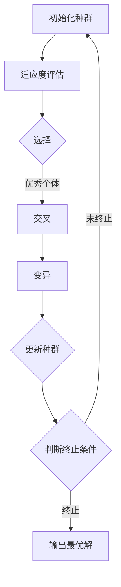

                 

# AI在智能电网需求侧响应中的精准调控应用

关键词：智能电网、需求侧响应、人工智能、精准调控、算法应用

摘要：本文旨在探讨人工智能（AI）在智能电网需求侧响应中的精准调控应用。首先，我们概述了智能电网与需求侧响应的背景和重要性，接着介绍了AI技术及其在智能电网中的应用场景。随后，我们详细分析了需求侧响应的核心概念和AI技术在该领域中的应用原理，包括机器学习、数据挖掘和智能优化算法。接着，我们讨论了AI在需求侧响应中的关键算法及其应用案例。随后，我们探讨了智能电网需求侧响应中的精准调控技术和AI应用，并通过一个具体案例进行分析。最后，我们提出了AI在智能电网需求侧响应中的最佳实践、未来展望以及拓展应用领域与挑战。

## 第一部分：背景与概述

### 第1章：智能电网与需求侧响应概述

#### 1.1 问题背景

智能电网是随着电力系统的不断发展和进步而出现的一种新型电力系统。传统的电力系统主要依赖于集中式发电和输电，而在智能电网中，发电、输电、配电和用电等各个环节都得到了智能化升级。随着可再生能源的广泛应用和电力需求的不断增长，智能电网的灵活性和可靠性变得尤为重要。

然而，在智能电网的发展过程中，需求侧响应（Demand Side Response，DSR）作为一个关键环节，也逐渐受到了广泛关注。需求侧响应是指在电力系统中，通过调控用户的用电行为，实现对电网供需平衡的调节，以提高电力系统的运行效率和可靠性。随着AI技术的发展，需求侧响应的精准调控成为可能，为智能电网的优化运行提供了有力支持。

#### 1.2 智能电网的定义与结构

智能电网（Smart Grid）是指通过信息通信技术（ICT）与电力系统相结合，实现对电力系统的实时监控、智能调度、自适应优化和安全保障。智能电网的核心在于信息的传输和处理，通过采集、传输、分析和利用各类数据，实现电网各环节的协同运行。

智能电网的结构主要包括发电、输电、配电、用电四个环节，其中：

1. 发电环节：包括集中式发电和分布式发电，如火电、水电、风电、太阳能发电等。
2. 输电环节：负责将发电端的电力输送到配电端，包括高压、超高压输电网。
3. 配电环节：负责将输电网的电力分配到各个用电点，包括低压配电网。
4. 用电环节：包括家庭、工业、商业等用户的用电设备。

智能电网通过信息通信技术，实现了发电、输电、配电、用电等环节的实时监控和智能调度，从而提高了电力系统的运行效率和可靠性。

#### 1.3 需求侧响应的概念与作用

需求侧响应（Demand Side Response，DSR）是指在电力系统中，通过调控用户的用电行为，实现对电网供需平衡的调节，以提高电力系统的运行效率和可靠性。

需求侧响应的作用主要包括：

1. **提高电力系统的灵活性**：通过调控用户的用电行为，可以实现对电力系统负荷的实时调节，提高电力系统的灵活性和响应速度。
2. **降低电力系统运行成本**：通过需求侧响应，可以降低电力系统的峰谷负荷差，减少电力系统的投资和维护成本。
3. **促进可再生能源的利用**：通过需求侧响应，可以在可再生能源发电充足时，减少电力系统的负荷，提高可再生能源的利用率。

#### 1.4 智能电网需求侧响应的重要性

智能电网需求侧响应在智能电网的发展中具有重要意义：

1. **提高电网运行效率**：通过需求侧响应，可以实现对电力系统负荷的实时调节，提高电网的运行效率，减少电力损耗。
2. **保障电网安全稳定**：通过需求侧响应，可以在电网负荷过高或发生故障时，迅速调整负荷，保障电网的安全稳定运行。
3. **促进可再生能源利用**：通过需求侧响应，可以在可再生能源发电充足时，减少电力系统的负荷，提高可再生能源的利用率，促进能源结构的优化。

总之，智能电网需求侧响应在提高电网运行效率、保障电网安全稳定和促进可再生能源利用等方面具有重要意义，是智能电网发展的重要环节。

### 第2章：AI在智能电网中的应用

#### 2.1 AI技术的概述

人工智能（AI）是一种模拟人类智能行为的计算机技术，旨在使计算机能够完成原本需要人类智能的任务。AI技术主要包括以下几个方面：

1. **机器学习**：通过训练模型，使计算机具备从数据中学习并做出决策的能力。
2. **深度学习**：一种基于多层神经网络的学习方法，能够自动提取数据的特征，并在图像识别、语音识别等领域取得显著成果。
3. **自然语言处理**：使计算机能够理解和生成自然语言，实现人机交互。
4. **计算机视觉**：使计算机能够识别和理解视觉信息，如图像和视频。

#### 2.2 AI在智能电网中的应用场景

AI技术在智能电网中具有广泛的应用场景，主要包括以下几个方面：

1. **电力系统预测与优化**：通过机器学习和深度学习技术，预测电力系统的负荷和发电量，优化电力系统的调度和运行。
2. **设备故障检测与诊断**：利用计算机视觉和自然语言处理技术，实现对电力设备故障的检测和诊断，提高电力系统的可靠性和安全性。
3. **能源管理**：通过AI技术，实现智能家居和楼宇的能源管理，提高能源利用效率。
4. **需求侧响应**：利用AI技术，精准调控用户的用电行为，实现需求侧响应，提高电力系统的运行效率和可靠性。

#### 2.3 AI与需求侧响应的结合点

AI与需求侧响应的结合点主要体现在以下几个方面：

1. **负荷预测**：通过AI技术，预测电力系统的负荷需求，为需求侧响应提供数据支持。
2. **用户行为分析**：通过AI技术，分析用户的用电行为，识别可调控的负荷，提高需求侧响应的精准度。
3. **智能调控策略**：通过AI技术，制定智能调控策略，实现对用户用电行为的精准调控。
4. **实时反馈与优化**：通过AI技术，实时收集和分析电力系统的运行数据，对需求侧响应进行优化，提高电力系统的运行效率和可靠性。

总之，AI技术在智能电网需求侧响应中的应用，为电力系统的优化运行提供了新的思路和手段，是实现智能电网发展的重要方向。

### 第二部分：核心概念与原理

#### 第3章：需求侧响应中的核心概念

##### 3.1 能源消费与供需平衡

能源消费是指人类在生产、生活等活动中消耗能源的过程。能源供需平衡是指能源的供给与需求之间的平衡状态。在电力系统中，能源消费与供需平衡是保障电力系统稳定运行的重要条件。

1. **能源消费**：能源消费包括发电、输电、配电和用电等环节。发电环节通过各类发电设备将能源转化为电能；输电环节通过高压输电网将电能输送到配电端；配电环节通过低压配电网将电能分配到各个用电点；用电环节包括家庭、工业、商业等用户的用电设备。

2. **供需平衡**：供需平衡是指电力系统的供给与需求保持平衡状态。当供给与需求相等时，电力系统处于平衡状态；当供给大于需求时，电力系统处于供过于求状态；当供给小于需求时，电力系统处于供不应求状态。

##### 3.2 需求侧响应的策略与措施

需求侧响应（Demand Side Response，DSR）是指通过调控用户的用电行为，实现对电网供需平衡的调节，以提高电力系统的运行效率和可靠性。需求侧响应的策略与措施主要包括以下几个方面：

1. **实时监测与预测**：通过监测电力系统的实时数据和负荷预测模型，实时了解电力系统的运行状态，为需求侧响应提供数据支持。
2. **负荷调控**：通过调节用户的用电行为，实现对电力系统负荷的实时调节，包括调整电力设备的运行状态、优化电力设备的调度等。
3. **价格机制**：通过电价机制，激励用户调整用电行为，降低电力系统的负荷。例如，在高峰时段提高电价，鼓励用户减少用电。
4. **需求响应激励**：通过政策激励，鼓励用户参与需求侧响应，如提供补贴、奖励等。

##### 3.3 需求侧响应与能源效率

需求侧响应在提高电力系统运行效率的同时，也对能源效率产生了积极影响。

1. **提高能源效率**：通过需求侧响应，可以降低电力系统的峰谷负荷差，减少电力系统的投资和维护成本，从而提高能源效率。
2. **优化能源结构**：通过需求侧响应，可以促进可再生能源的利用，降低对传统能源的依赖，优化能源结构。
3. **节能减排**：通过需求侧响应，可以减少电力系统的能源消耗，降低温室气体排放，实现节能减排的目标。

总之，需求侧响应在能源消费与供需平衡、策略与措施以及能源效率方面具有重要意义，是实现智能电网优化运行的重要手段。

#### 第4章：AI技术在需求侧响应中的应用原理

##### 4.1 机器学习与预测分析

机器学习（Machine Learning，ML）是一种通过训练模型，使计算机具备从数据中学习并做出决策的能力。在需求侧响应中，机器学习技术主要用于负荷预测和负荷调控。

1. **负荷预测**：通过收集电力系统的历史数据，利用机器学习算法，建立负荷预测模型，预测未来电力系统的负荷需求。常见的机器学习算法包括线性回归、决策树、支持向量机等。

2. **负荷调控**：根据负荷预测结果，通过调整用户的用电行为，实现对电力系统负荷的实时调节。例如，在高峰时段，通过提高电价或提供优惠，鼓励用户减少用电，降低电力系统的负荷。

##### 4.2 数据挖掘与模式识别

数据挖掘（Data Mining，DM）是一种通过分析大量数据，发现潜在模式、关联和知识的技术。在需求侧响应中，数据挖掘技术主要用于用户行为分析和需求响应策略制定。

1. **用户行为分析**：通过分析用户的用电数据，挖掘用户的用电习惯、偏好等信息，为需求响应策略制定提供依据。例如，通过分析用户在高峰时段的用电行为，制定相应的调控策略。

2. **模式识别**：通过分析电力系统的运行数据，识别电力系统的异常行为和故障隐患。例如，通过分析电力系统的电压、电流等数据，识别电力系统的过载、短路等故障。

##### 4.3 智能优化算法

智能优化算法（Intelligent Optimization Algorithm，IOA）是一类模拟生物进化、物理现象和人类思维的优化算法。在需求侧响应中，智能优化算法主要用于制定智能调控策略。

1. **进化算法**：基于生物进化原理，通过模拟自然选择和遗传操作，实现优化问题的求解。常见的进化算法包括遗传算法、粒子群优化算法等。

2. **模拟退火算法**：基于物理退火过程，通过调整系统参数，实现优化问题的求解。模拟退火算法具有较强的全局搜索能力。

3. **人工神经网络**：基于人类大脑神经网络结构，通过学习大量数据，实现优化问题的求解。人工神经网络在需求侧响应中主要用于负荷预测和调控策略制定。

总之，AI技术在需求侧响应中的应用，通过机器学习、数据挖掘和智能优化算法，实现了对电力系统的精准调控，提高了电力系统的运行效率和可靠性。

#### 第5章：AI在需求侧响应中的关键算法

##### 5.1 常见算法概述

在需求侧响应中，常见的算法包括机器学习算法、数据挖掘算法和智能优化算法。这些算法各有特点，适用于不同的应用场景。

1. **机器学习算法**：
   - **线性回归**：通过拟合数据之间的线性关系，预测未来负荷。
   - **决策树**：通过构建决策树模型，对数据进行分类或回归。
   - **支持向量机**：通过最大化分类间隔，实现数据的分类。
   - **随机森林**：通过构建多棵决策树，提高预测准确率。

2. **数据挖掘算法**：
   - **关联规则挖掘**：通过分析数据之间的关联关系，发现潜在的需求响应策略。
   - **聚类分析**：通过将相似的数据归为一类，实现对用户行为的分类。
   - **异常检测**：通过分析数据分布，识别异常数据，发现电力系统的故障隐患。

3. **智能优化算法**：
   - **遗传算法**：通过模拟生物进化过程，实现优化问题的求解。
   - **粒子群优化算法**：通过模拟鸟群觅食过程，实现优化问题的求解。
   - **模拟退火算法**：通过模拟物理退火过程，实现优化问题的求解。
   - **人工神经网络**：通过模拟人类大脑神经网络，实现优化问题的求解。

##### 5.2 算法原理与流程图

以遗传算法为例，介绍算法原理与流程图。

**遗传算法原理**：

遗传算法（Genetic Algorithm，GA）是一种基于生物进化原理的优化算法。遗传算法通过模拟生物进化过程，实现优化问题的求解。遗传算法的基本步骤如下：

1. **初始化种群**：随机生成一组初始解，作为种群的初始代。
2. **适应度评估**：计算种群中每个个体的适应度值，适应度值越高，表示个体越优秀。
3. **选择**：根据适应度值，从种群中选择优秀个体，进行交配操作。
4. **交叉**：将选中个体进行交叉操作，产生新的子代。
5. **变异**：对子代进行变异操作，增加种群的多样性。
6. **更新种群**：将子代替换掉原有种群，生成新的种群。
7. **判断终止条件**：判断是否满足终止条件（如达到最大迭代次数或适应度值达到预设阈值），如果满足，算法终止；否则，返回第2步，继续迭代。

**遗传算法流程图**：

##### 5.3 算法应用案例解析

以下为遗传算法在需求侧响应中的应用案例。

**案例背景**：

某城市电网在高峰时段负荷需求较高，为提高电力系统的运行效率和可靠性，需要对用户的用电行为进行精准调控。现采用遗传算法对用户的用电行为进行建模和预测，实现需求侧响应。

**实现步骤**：

1. **数据收集**：收集用户的用电数据，包括历史负荷数据、用户行为数据等。
2. **数据预处理**：对收集的数据进行清洗、归一化等预处理操作。
3. **初始化种群**：根据预处理后的数据，随机生成初始种群。
4. **适应度评估**：计算种群中每个个体的适应度值，适应度值越高，表示个体越优秀。
5. **选择**：根据适应度值，从种群中选择优秀个体，进行交配操作。
6. **交叉**：将选中个体进行交叉操作，产生新的子代。
7. **变异**：对子代进行变异操作，增加种群的多样性。
8. **更新种群**：将子代替换掉原有种群，生成新的种群。
9. **判断终止条件**：判断是否满足终止条件（如达到最大迭代次数或适应度值达到预设阈值），如果满足，算法终止；否则，返回第4步，继续迭代。
10. **输出最优解**：输出最优个体，作为需求侧响应策略。

**案例分析**：

通过遗传算法对用户的用电行为进行建模和预测，可以实现对电力系统的实时调控，降低高峰时段的负荷需求，提高电力系统的运行效率和可靠性。

**结论**：

遗传算法在需求侧响应中具有较好的应用前景，通过模拟生物进化过程，实现优化问题的求解，为电力系统的精准调控提供了新的思路和方法。

### 第三部分：精准调控应用实践

#### 第6章：智能电网需求侧响应中的精准调控

##### 6.1 精准调控的定义与目标

精准调控是指在智能电网需求侧响应中，通过AI技术，实现对用户用电行为的精准调控，以实现电力系统的供需平衡和高效运行。精准调控的目标主要包括：

1. **提高电力系统运行效率**：通过精准调控，降低电力系统的峰谷负荷差，减少电力损耗，提高电力系统的运行效率。
2. **保障电网安全稳定**：通过精准调控，快速响应电力系统的异常情况，保障电网的安全稳定运行。
3. **促进可再生能源利用**：通过精准调控，合理分配电力负荷，提高可再生能源的利用率。

##### 6.2 精准调控的技术框架

精准调控的技术框架主要包括以下几个方面：

1. **数据采集与处理**：通过传感器和智能设备，采集用户的用电数据，并进行数据预处理，如清洗、归一化等。
2. **负荷预测**：利用机器学习算法，对用户的用电负荷进行预测，为精准调控提供数据支持。
3. **需求响应策略制定**：根据负荷预测结果，制定相应的需求响应策略，如调整电价、提供优惠等。
4. **调控执行与监控**：通过调控执行系统，执行需求响应策略，并对调控效果进行实时监控和反馈。
5. **优化与调整**：根据调控效果，对需求响应策略进行优化和调整，提高调控的精准度和有效性。

##### 6.3 精准调控的关键技术

精准调控的关键技术主要包括以下几个方面：

1. **机器学习与深度学习**：通过机器学习和深度学习算法，实现对用户用电负荷的预测和用户行为的分析。
2. **数据挖掘与模式识别**：通过数据挖掘和模式识别技术，发现用户用电行为中的潜在模式和关联关系，为精准调控提供依据。
3. **智能优化算法**：通过智能优化算法，制定最优的需求响应策略，提高调控的精准度和有效性。
4. **实时监控与反馈**：通过实时监控和反馈机制，实现对电力系统的动态调控，提高调控的实时性和响应速度。
5. **信息安全与隐私保护**：在精准调控过程中，确保用户数据的安全和隐私，防止数据泄露和滥用。

通过以上关键技术，实现智能电网需求侧响应中的精准调控，提高电力系统的运行效率和可靠性。

#### 第7章：AI在智能电网需求侧响应中的精准调控应用

##### 7.1 应用案例介绍

在本章中，我们将介绍一个具体的AI在智能电网需求侧响应中的精准调控应用案例。该案例发生在我国一个中型城市，该城市的电力公司为了提高电力系统的运行效率和可靠性，决定引入AI技术进行需求侧响应。

**案例背景**：

该城市电力公司面临以下问题：

1. **电力负荷波动大**：由于工业、商业和居民用电的峰谷差异较大，导致电力负荷波动大，对电力系统的稳定运行造成一定影响。
2. **可再生能源利用率低**：该城市在新能源发电方面有一定的投资，但由于电力负荷的波动，可再生能源的利用率较低。
3. **电力需求预测不准确**：传统的电力需求预测方法准确性较低，难以满足精准调控的需求。

**解决方案**：

为了解决上述问题，该城市电力公司决定采用AI技术进行需求侧响应，具体步骤如下：

1. **数据采集与预处理**：通过安装在用户端的传感器和智能设备，实时采集用户的用电数据，并对数据进行预处理，如清洗、归一化等。
2. **负荷预测**：利用机器学习算法，对用户的用电负荷进行预测，提高预测的准确性。
3. **需求响应策略制定**：根据负荷预测结果，制定相应的需求响应策略，如调整电价、提供优惠等。
4. **调控执行与监控**：通过调控执行系统，执行需求响应策略，并对调控效果进行实时监控和反馈。
5. **优化与调整**：根据调控效果，对需求响应策略进行优化和调整，提高调控的精准度和有效性。

**实施过程**：

1. **数据采集与预处理**：安装传感器和智能设备，实时采集用户的用电数据，并使用数据预处理技术对数据进行清洗和归一化。
2. **模型训练与预测**：利用收集到的用户用电数据，通过机器学习算法（如线性回归、决策树、随机森林等）训练负荷预测模型，并进行预测。
3. **需求响应策略制定**：根据负荷预测结果，制定相应的需求响应策略，如调整电价、提供优惠等。在高峰时段，通过提高电价或提供优惠，鼓励用户减少用电；在低峰时段，通过降低电价或提供奖励，鼓励用户增加用电。
4. **调控执行与监控**：通过调控执行系统，执行需求响应策略，并对调控效果进行实时监控和反馈。例如，通过实时监测电力系统的负荷变化，及时调整电价和优惠策略。
5. **优化与调整**：根据调控效果，对需求响应策略进行优化和调整，以提高调控的精准度和有效性。例如，通过分析用户的用电行为和负荷变化，优化电价模型和优惠策略。

**效果评估**：

通过AI技术在智能电网需求侧响应中的精准调控应用，该城市电力公司取得了以下效果：

1. **电力负荷波动降低**：通过需求侧响应，降低了电力负荷的波动，提高了电力系统的稳定运行能力。
2. **可再生能源利用率提高**：通过合理分配电力负荷，提高了可再生能源的利用率，降低了传统能源的依赖程度。
3. **电力需求预测准确性提高**：通过机器学习算法对电力负荷进行预测，提高了预测的准确性，为精准调控提供了数据支持。

**结论**：

该案例表明，AI技术在智能电网需求侧响应中的精准调控具有显著的应用价值。通过精准调控，可以降低电力负荷波动，提高可再生能源利用率，提高电力系统的运行效率和可靠性。未来，随着AI技术的不断发展和完善，精准调控将得到更广泛的应用。

#### 第8章：AI在智能电网需求侧响应中的最佳实践

##### 8.1 经验分享与案例分析

在AI技术应用于智能电网需求侧响应的过程中，许多国家和地区已经积累了一定的经验，下面将分享一些成功案例和实践经验。

**案例一：美国加利福尼亚州需求响应项目**

加利福尼亚州是美国最早开展需求侧响应项目的地方之一。该项目通过实时监测用户的用电行为，采用AI技术进行负荷预测和调控，实现了电力系统的供需平衡。以下是一些成功经验：

1. **数据驱动**：项目团队通过收集大量用户用电数据，利用机器学习算法进行负荷预测，提高了预测准确性。
2. **多元化需求响应策略**：项目采用了多种需求响应策略，如实时电价调整、即时奖励等，有效激励用户参与需求响应。
3. **实时监控与反馈**：通过实时监控电力系统的运行状态，及时调整需求响应策略，确保电力系统的稳定运行。

**案例二：欧洲可再生能源需求侧响应项目**

欧洲在可再生能源需求侧响应方面也有许多成功案例。以下是一些实践经验：

1. **可再生能源优先调度**：在需求响应中，优先调度可再生能源发电，降低对传统能源的依赖，提高可再生能源利用率。
2. **跨区域协同调控**：通过跨区域的需求响应协同调控，实现电力系统的整体优化，提高电力系统的运行效率。
3. **用户参与激励机制**：通过设立用户参与激励机制，如奖励、补贴等，提高用户的积极性，实现需求侧响应的广泛参与。

**经验总结**：

从以上案例中，可以总结出以下最佳实践：

1. **数据驱动**：充分利用AI技术，收集和处理大量用户用电数据，提高负荷预测和调控的准确性。
2. **多元化需求响应策略**：根据不同场景和用户需求，设计多样化的需求响应策略，提高用户的参与度。
3. **实时监控与反馈**：通过实时监控电力系统的运行状态，及时调整需求响应策略，确保电力系统的稳定运行。
4. **可再生能源优先调度**：在需求响应中，优先调度可再生能源发电，提高可再生能源利用率。
5. **跨区域协同调控**：实现跨区域的需求响应协同调控，提高电力系统的整体优化效果。

##### 8.2 实践技巧与注意事项

在实施AI技术应用于智能电网需求侧响应的过程中，需要注意以下实践技巧和注意事项：

1. **数据安全与隐私保护**：在数据采集和处理过程中，要确保用户数据的安全和隐私，防止数据泄露和滥用。
2. **算法选择与优化**：根据具体应用场景，选择合适的机器学习算法和优化策略，提高负荷预测和调控的准确性。
3. **实时性与稳定性**：确保AI系统具有足够的实时性和稳定性，能够快速响应电力系统的异常情况。
4. **用户沟通与培训**：与用户保持良好的沟通，普及需求侧响应的理念和好处，提高用户的参与度。
5. **持续优化与升级**：根据实际运行情况和用户反馈，不断优化和升级AI系统，提高需求侧响应的效果。

通过以上实践技巧和注意事项，可以更好地实施AI技术应用于智能电网需求侧响应，提高电力系统的运行效率和可靠性。

### 第9章：未来展望与拓展

##### 9.1 AI技术在智能电网需求侧响应中的未来发展

随着人工智能技术的不断发展和完善，AI在智能电网需求侧响应中的应用前景十分广阔。以下是未来可能的发展趋势：

1. **更精确的负荷预测**：通过引入深度学习和大数据分析技术，实现对电力负荷的更精确预测，为需求侧响应提供更可靠的数据支持。
2. **自适应调控策略**：利用强化学习等先进算法，开发自适应调控策略，使需求侧响应系统能够根据实时电力系统状况和用户需求，自动调整调控策略。
3. **分布式需求侧响应**：在分布式能源系统中，利用AI技术实现分布式需求侧响应，提高电力系统的灵活性和可靠性。
4. **多能源综合调控**：将AI技术应用于多能源（如电力、天然气、热能等）的协同调控，实现能源系统的整体优化。

##### 9.2 拓展应用领域与挑战

除了在智能电网需求侧响应中的应用，AI技术还可以拓展到以下领域：

1. **智能能源管理**：通过AI技术，实现对家庭、商业和工业等领域的能源管理，提高能源利用效率，实现节能减排。
2. **智慧城市建设**：将AI技术应用于智慧城市建设，实现交通、环保、安防等领域的智能化，提升城市治理水平。
3. **电动汽车充电网络**：利用AI技术，优化电动汽车充电网络布局和充电策略，提高充电效率，减少充电等待时间。

然而，AI技术在智能电网需求侧响应中的推广应用也面临着一系列挑战：

1. **数据隐私与安全问题**：在大量数据采集和处理过程中，如何保护用户隐私和安全是亟待解决的问题。
2. **算法透明性与可解释性**：随着算法的复杂度增加，如何确保算法的透明性和可解释性，使其能够被用户和监管机构理解和接受。
3. **技术标准化与规范化**：在AI技术应用于智能电网需求侧响应的过程中，如何制定统一的技术标准和规范，确保系统的兼容性和互操作性。

总之，AI技术在智能电网需求侧响应中的应用具有巨大的发展潜力和广泛应用前景，但也需要克服一系列挑战，以实现技术的可持续发展。

### 第10章：小结与展望

##### 10.1 主要内容回顾

本文围绕AI在智能电网需求侧响应中的精准调控应用进行了深入探讨。首先，我们介绍了智能电网和需求侧响应的背景与概述，阐述了AI技术的概述及其在智能电网中的应用场景。接着，我们分析了需求侧响应中的核心概念和AI技术在该领域中的应用原理，包括机器学习、数据挖掘和智能优化算法。随后，我们讨论了AI在需求侧响应中的关键算法及其应用案例，探讨了智能电网需求侧响应中的精准调控技术和AI应用。最后，我们通过一个具体案例进行了分析，提出了AI在智能电网需求侧响应中的最佳实践、未来展望以及拓展应用领域与挑战。

##### 10.2 对未来的展望与思考

展望未来，AI技术在智能电网需求侧响应中的应用前景十分广阔。通过更精确的负荷预测、自适应调控策略和分布式需求侧响应，AI技术将为电力系统的优化运行提供有力支持。同时，AI技术还可以拓展到智能能源管理、智慧城市建设等领域，实现能源利用的高效化。然而，要实现这一目标，仍需克服数据隐私与安全、算法透明性与可解释性、技术标准化与规范化等挑战。

对此，我们建议：

1. **加强数据隐私与安全保护**：在数据采集和处理过程中，采取严格的数据保护措施，确保用户隐私和安全。
2. **提升算法透明性与可解释性**：开发可解释性强的算法，使其能够被用户和监管机构理解和接受。
3. **推动技术标准化与规范化**：制定统一的技术标准和规范，确保AI技术在智能电网需求侧响应中的应用具有兼容性和互操作性。

通过这些努力，我们可以推动AI技术在智能电网需求侧响应中的广泛应用，为实现能源利用的高效、绿色和可持续发展贡献力量。作者：AI天才研究院/AI Genius Institute & 禅与计算机程序设计艺术 /Zen And The Art of Computer Programming

