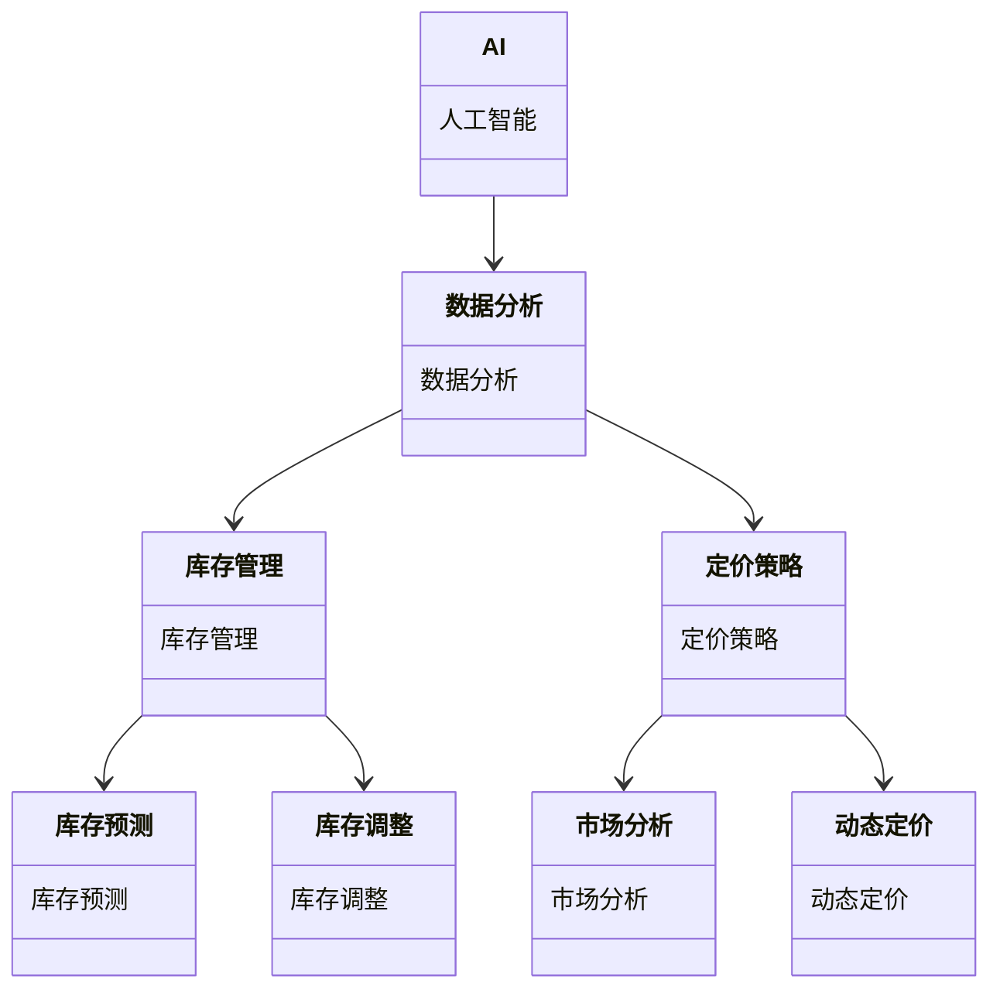
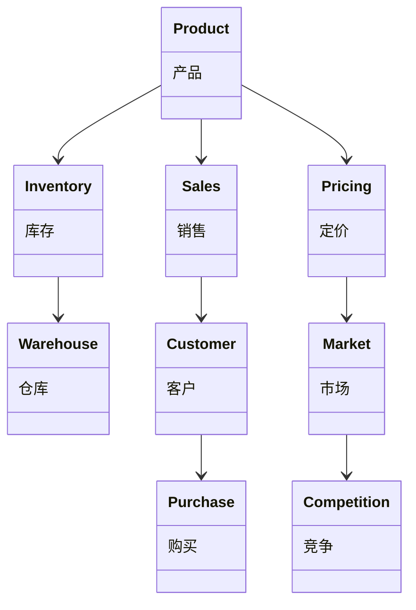
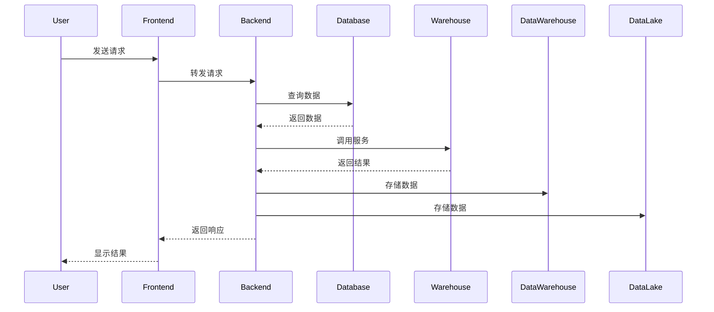
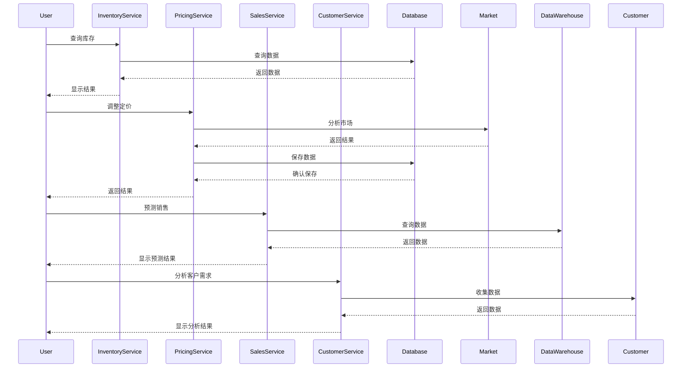

                 

### 第1章：问题背景与定义

#### 1.1 问题的背景

##### 1.1.1 智能零售的现状

随着信息技术的飞速发展，零售行业正在经历一场革命。智能零售，作为新时代零售模式的一种，正逐渐成为主流。智能零售通过大数据、云计算、人工智能等先进技术，实现了对传统零售方式的全面升级。从线上电商的个性化推荐、智能客服，到线下门店的智能货架、智能支付，智能零售正以前所未有的速度改变着消费者的购物体验。

当前，智能零售在全球范围内已经取得了显著进展。例如，亚马逊的智能仓储系统、阿里巴巴的无人零售店等，都是智能零售的典范。这些智能系统不仅提高了零售效率，还大幅降低了运营成本，提升了消费者的满意度。然而，尽管智能零售的发展势头强劲，但其背后仍然存在一些亟待解决的问题。

##### 1.1.2 库存与定价在零售中的重要性

在零售行业中，库存管理和定价策略是两个至关重要的环节。库存管理关系到商品的供应和销售，直接影响企业的运营效率和盈利能力。如果库存过多，会占用大量的资金和仓储空间，导致资源浪费；而库存不足，则会错失销售机会，影响企业的收入。

定价策略同样至关重要。合理的定价不仅能够确保商品的销售，还能帮助企业实现利润最大化。然而，在市场竞争激烈的环境中，如何制定出既能吸引消费者，又能保证企业利润的定价策略，是一个极具挑战性的问题。

##### 1.1.3 传统方法与挑战

在过去，零售企业通常采用传统的库存管理和定价策略。这些方法主要包括以下几种：

1. **定期盘点**：定期对库存进行盘点，以确保库存数据的准确性。然而，这种方法往往需要投入大量的人力和时间，且无法实时反映库存情况。
   
2. **基于历史数据的预测**：通过分析过去的数据，预测未来的需求。这种方法依赖于历史数据的完整性和准确性，但在市场变化快速的环境下，预测结果可能存在较大的误差。

3. **经验法**：根据行业经验和直觉进行定价。这种方法虽然简单易行，但缺乏科学依据，往往难以达到最佳效果。

这些传统方法在应对复杂的零售市场时，存在诸多挑战：

1. **数据滞后**：传统方法往往无法实时获取库存和市场需求数据，导致决策滞后。

2. **效率低下**：传统方法需要大量的人力和时间，运营成本高。

3. **预测不准确**：基于历史数据的预测容易受到市场变化的影响，预测结果不够准确。

4. **定价不合理**：经验法的定价策略缺乏科学依据，容易导致定价过高或过低，影响销售和利润。

#### 1.2 核心概念

##### 1.2.1 AI的定义

人工智能（Artificial Intelligence，简称AI）是计算机科学的一个分支，旨在使计算机系统具备智能行为，模拟、延伸和扩展人类的智能。AI的核心技术包括机器学习、深度学习、自然语言处理、计算机视觉等。通过这些技术，AI系统能够自主学习、推理、解决问题，并在某些方面超越人类的表现。

##### 1.2.2 智能零售

智能零售（Smart Retail）是利用人工智能、大数据、云计算等先进技术，实现零售业务全流程的智能化。智能零售不仅关注线上电商的个性化推荐、智能客服，还涵盖线下门店的智能货架、智能支付等。通过智能零售，零售企业能够更好地满足消费者的需求，提高运营效率，降低成本。

##### 1.2.3 实时库存与定价优化

实时库存与定价优化（Real-Time Inventory and Pricing Optimization）是利用AI技术，对零售企业的库存和定价进行实时分析和调整。通过实时获取和处理库存数据和市场信息，AI系统能够动态地调整库存水平和定价策略，以最大化企业的利润和市场份额。

#### 1.3 边界与外延

##### 1.3.1 AI在零售中的适用范围

AI在零售中的应用范围广泛，包括但不限于以下几个方面：

1. **库存管理**：通过实时监测和分析库存数据，AI系统能够预测未来的需求，优化库存水平。

2. **定价策略**：AI技术可以根据市场变化和消费者行为，动态调整定价策略，实现利润最大化。

3. **供应链管理**：AI可以帮助企业优化供应链，提高物流效率，降低运营成本。

4. **客户体验**：AI可以通过个性化推荐、智能客服等，提升消费者的购物体验。

##### 1.3.2 实时应用的挑战

尽管AI在零售中具有巨大的潜力，但其实时应用仍然面临一些挑战：

1. **数据质量**：实时库存与定价优化依赖于大量准确、及时的数据。然而，零售业务中的数据质量往往参差不齐，影响了AI系统的效果。

2. **计算能力**：实时处理大量数据需要强大的计算能力。对于一些中小型零售企业来说，投入足够的计算资源可能是一个挑战。

3. **算法复杂性**：实时库存与定价优化涉及的算法复杂度高，需要具备深厚的专业知识。

4. **模型解释性**：AI模型，尤其是深度学习模型，往往具有“黑盒”性质，难以解释其决策过程。这在某些应用场景中可能引起信任问题。

5. **法规与伦理**：在零售行业中，AI的应用涉及大量的消费者数据，需要严格遵守相关法规和伦理准则。

##### 1.3.3 概念结构与核心要素组成

智能零售库存与定价优化涉及多个核心概念和要素，如图所示：



通过以上概述，我们可以看到，智能零售库存与定价优化是一个复杂但极具潜力的领域。在接下来的章节中，我们将进一步探讨AI在这一领域的具体应用，以及如何实现实时库存与定价优化。

---

### 第2章：AI在零售中的核心概念

#### 2.1 AI的基础知识

人工智能（AI）作为一门涉及计算机科学、数学、认知科学等多个领域的交叉学科，其发展历程可以追溯到20世纪50年代。AI的目标是创建能够模拟、延伸和扩展人类智能的系统。AI的核心技术包括机器学习、深度学习、自然语言处理和计算机视觉等。

##### 2.1.1 AI的发展历程

AI的发展历程可以分为几个重要阶段：

1. **早期探索阶段（1950-1969）**：在这个阶段，AI的核心目标是创造能够模仿人类智能的计算机程序。1956年，达特茅斯会议标志着AI正式成为一门学科。

2. **理性主义阶段（1970-1989）**：理性主义阶段的AI强调基于逻辑和推理的智能，如专家系统和知识表示。然而，由于依赖人类提供知识和规则，这些系统的应用范围受到限制。

3. **符号主义阶段（1990-2010）**：符号主义阶段的AI通过深度学习和统计学习等方法，取得了显著进展。这一阶段的AI系统在图像识别、语音识别等方面表现出色。

4. **大数据和云计算阶段（2010至今）**：随着大数据和云计算技术的兴起，AI进入了一个新的发展阶段。这一阶段的AI系统可以处理海量数据，并从数据中学习模式，从而在各个领域实现突破性应用。

##### 2.1.2 机器学习与深度学习

机器学习（Machine Learning，简称ML）是AI的核心技术之一，它使计算机系统能够从数据中学习，并自动改进性能。机器学习的主要方法包括监督学习、无监督学习和强化学习。

1. **监督学习**：监督学习通过已标记的数据训练模型，然后使用这个模型对新的数据进行预测。常见的监督学习算法包括线性回归、决策树、支持向量机（SVM）等。

2. **无监督学习**：无监督学习不依赖于标记数据，而是从未标记的数据中发现模式和结构。常见的无监督学习算法包括聚类、降维、异常检测等。

3. **强化学习**：强化学习通过试错法来学习如何在特定环境中做出最优决策。强化学习算法通常用于自动驾驶、游戏AI等复杂场景。

深度学习（Deep Learning，简称DL）是机器学习的一个重要分支，它利用多层神经网络来模拟人类大脑的处理方式。深度学习在图像识别、语音识别、自然语言处理等领域取得了显著成果。常见的深度学习模型包括卷积神经网络（CNN）、循环神经网络（RNN）和生成对抗网络（GAN）等。

##### 2.1.3 数据处理与存储

在AI应用中，数据处理和存储是两个关键问题。大数据技术的发展为AI提供了丰富的数据资源，而高效的存储和计算技术则确保了数据的有效利用。

1. **数据处理**：数据处理包括数据清洗、数据整合、数据分析和数据可视化等多个环节。数据清洗是数据处理的重要步骤，它涉及去除重复数据、处理缺失值、异常值等。数据整合则是将来自不同源的数据进行合并，以形成统一的数据集。数据分析是利用统计和机器学习等方法，从数据中提取有用信息。数据可视化则是通过图表和图像等形式，将数据分析结果直观地展示出来。

2. **数据存储**：数据存储技术包括关系型数据库、非关系型数据库、分布式存储系统等。关系型数据库如MySQL、PostgreSQL等，适合处理结构化数据。非关系型数据库如MongoDB、Cassandra等，则适合处理半结构化或非结构化数据。分布式存储系统如Hadoop、Spark等，可以处理海量数据，并提供高可用性和高性能。

#### 2.2 智能零售的要素

智能零售通过大数据、云计算、人工智能等先进技术，实现了零售业务全流程的智能化。智能零售的要素包括智能供应链、客户体验优化和数据分析与应用。

##### 2.2.1 智能供应链

智能供应链（Smart Supply Chain）是智能零售的核心要素之一，它通过信息技术和数据分析，实现供应链的全面智能化。智能供应链的主要功能包括：

1. **需求预测**：利用历史销售数据、市场趋势和消费者行为数据，预测未来的需求，以优化库存水平。

2. **物流优化**：通过实时监控和数据分析，优化物流流程，提高物流效率，降低成本。

3. **供应链协同**：通过物联网和区块链技术，实现供应链各环节的信息共享和协同作业，提高供应链的透明度和灵活性。

4. **供应链可视化**：通过数据可视化技术，将供应链各个环节的信息以图表和图像等形式展示出来，帮助管理人员更好地理解供应链的运作情况。

##### 2.2.2 客户体验优化

客户体验优化（Customer Experience Optimization）是智能零售的重要目标之一，它通过人工智能技术，提升消费者的购物体验。客户体验优化的主要方法包括：

1. **个性化推荐**：利用机器学习算法，分析消费者的购买历史、浏览行为等数据，推荐符合消费者兴趣的商品。

2. **智能客服**：通过自然语言处理技术，实现智能客服机器人，提供7x24小时的在线服务，提高客户满意度。

3. **虚拟试衣和虚拟现实体验**：通过计算机视觉和增强现实技术，提供虚拟试衣和虚拟现实购物体验，提升消费者的购物乐趣。

4. **反馈机制**：通过数据分析，收集消费者的反馈信息，及时调整产品和服务，以提升客户体验。

##### 2.2.3 数据分析与应用

数据分析与应用（Data Analysis and Application）是智能零售的关键环节，它通过大数据技术和人工智能算法，从海量数据中提取有价值的信息，以支持决策。数据分析与应用的主要领域包括：

1. **销售预测**：通过分析历史销售数据、市场趋势和消费者行为，预测未来的销售情况，以制定更有效的营销策略。

2. **客户细分**：通过数据分析，将客户划分为不同的细分市场，制定个性化的营销策略，提高客户忠诚度。

3. **库存管理**：通过实时监测和分析库存数据，优化库存水平，减少库存成本，提高资金利用率。

4. **定价策略**：通过分析市场需求、竞争对手定价和消费者行为，制定合理的定价策略，实现利润最大化。

5. **供应链优化**：通过数据分析，优化供应链各个环节，提高物流效率和供应链协同效应。

#### 2.3 概念属性特征对比表格

为了更清晰地展示AI、智能供应链、客户体验优化和数据分析与应用之间的概念属性特征，我们设计了如下对比表格：

| 概念         | 定义                         | 关键特征                                 | 应用领域       |
| ------------ | ---------------------------- | ---------------------------------------- | -------------- |
| 人工智能     | 使计算机系统具备智能行为的技术 | 自学习、自主决策、模式识别等               | 图像识别、语音识别等 |
| 智能供应链   | 通过信息技术实现供应链智能化 | 需求预测、物流优化、供应链协同等           | 零售、制造等     |
| 客户体验优化 | 提升消费者购物体验的技术     | 个性化推荐、智能客服、虚拟现实体验等       | 零售、电商等     |
| 数据分析与应用 | 从数据中提取有价值信息的技术 | 销售预测、客户细分、库存管理、定价策略等   | 零售、金融等     |

#### 2.4 ER实体关系图架构

为了更好地理解智能零售中的核心概念和要素之间的关系，我们使用Mermaid工具绘制了ER实体关系图，如下所示：

```mermaid
erDiagram
    Product ||--|{ Customer }|>
    Product ||--|{ Order }|>
    Customer ||--|{ Review }|>
    Customer ||--|{ Cart }|>
    Order ||--|{ Payment }|>
    Product ||--|{ Category }|>
    Category ||--|{ SubCategory }|>
```

在这个ER图中，Product（产品）、Customer（客户）、Order（订单）、Review（评论）、Cart（购物车）、Payment（支付）和Category（类别）是核心实体，它们之间的关系反映了智能零售系统中各个要素之间的联系。例如，Product与Customer之间通过Order和Cart建立联系，Product与Category之间通过分类关系连接。

通过以上对AI在零售中的核心概念的详细阐述，我们可以看到，AI技术为零售行业带来了巨大的变革潜力。在接下来的章节中，我们将进一步探讨如何利用AI技术实现实时库存与定价优化。

---

### 第3章：实时库存与定价优化的算法原理

#### 3.1 算法概述

实时库存与定价优化（Real-Time Inventory and Pricing Optimization）是利用人工智能（AI）技术，通过对海量数据进行实时分析和处理，动态调整库存水平和定价策略，以实现利润最大化。这一过程涉及多个核心算法，包括机器学习算法、深度学习算法和优化算法。本节将详细讲解这些算法的基本原理、类型、应用和Python代码实现。

##### 3.1.1 基本概念

实时库存与定价优化需要解决以下问题：

1. **库存优化**：如何在保持高服务水平的同时，最小化库存成本和资金占用。
2. **定价优化**：如何根据市场需求、竞争状况和成本，制定合理的定价策略，以实现利润最大化。

##### 3.1.2 算法类型

实时库存与定价优化涉及多种算法，以下是一些常见的算法类型：

1. **时间序列预测算法**：用于预测未来的库存需求和销售量。常见的算法包括ARIMA、LSTM等。
2. **聚类算法**：用于对库存进行分类和分组，以便更有效地管理和定价。常见的算法包括K-Means、DBSCAN等。
3. **优化算法**：用于解决库存和定价优化问题，常见的算法包括线性规划、整数规划、启发式算法等。
4. **深度学习算法**：用于构建复杂的预测模型和定价策略，常见的算法包括卷积神经网络（CNN）、循环神经网络（RNN）、生成对抗网络（GAN）等。

#### 3.2 算法讲解

##### 3.2.1 时间序列预测算法

时间序列预测是实时库存与定价优化的重要环节。时间序列数据是指按时间顺序排列的数据，通常用于预测未来的趋势。以下是两种常用的时间序列预测算法：

1. **ARIMA（AutoRegressive Integrated Moving Average）**：ARIMA模型是一种经典的统计模型，通过自回归、差分和移动平均来预测时间序列数据。其基本步骤如下：

   - **自回归（AR）**：利用过去的数据预测未来，即当前值与滞后值的相关性。
   - **差分（I）**：对时间序列数据进行差分，使其成为平稳序列。
   - **移动平均（MA）**：利用过去的误差值来预测未来。

   ARIMA模型的Python实现如下：

   ```python
   from statsmodels.tsa.arima.model import ARIMA
   
   # 加载数据
   data = load_dataset('time_series_data.csv')
   
   # 创建ARIMA模型
   model = ARIMA(data['sales'], order=(5, 1, 2))
   
   # 拟合模型
   model_fit = model.fit()
   
   # 预测
   forecast = model_fit.forecast(steps=10)
   ```

2. **LSTM（Long Short-Term Memory）**：LSTM是循环神经网络（RNN）的一种，特别适合处理长序列数据。LSTM通过引入门控机制，有效地解决了传统RNN的梯度消失和梯度爆炸问题。

   LSTM的Python实现如下：

   ```python
   from keras.models import Sequential
   from keras.layers import LSTM, Dense
   
   # 创建模型
   model = Sequential()
   model.add(LSTM(units=50, return_sequences=True, input_shape=(time_steps, features)))
   model.add(LSTM(units=50))
   model.add(Dense(1))
   
   # 编译模型
   model.compile(optimizer='adam', loss='mean_squared_error')
   
   # 拟合模型
   model.fit(x_train, y_train, epochs=100, batch_size=32, validation_data=(x_test, y_test))
   
   # 预测
   forecast = model.predict(x_test)
   ```

##### 3.2.2 聚类算法

聚类算法用于对库存进行分类和分组，以便更有效地管理和定价。以下是两种常用的聚类算法：

1. **K-Means**：K-Means是一种基于距离的聚类算法，通过将数据点分配到K个簇中，使得每个簇内部的点之间的距离最小，而簇与簇之间的距离最大。

   K-Means的Python实现如下：

   ```python
   from sklearn.cluster import KMeans
   
   # 加载数据
   data = load_dataset('inventory_data.csv')
   
   # 创建K-Means模型
   model = KMeans(n_clusters=3)
   
   # 拟合模型
   model.fit(data[['quantity', 'demand']])
   
   # 预测
   clusters = model.predict(data[['quantity', 'demand']])
   ```

2. **DBSCAN（Density-Based Spatial Clustering of Applications with Noise）**：DBSCAN是一种基于密度的聚类算法，可以自动确定聚类数量，并且能够处理噪声点和异常值。

   DBSCAN的Python实现如下：

   ```python
   from sklearn.cluster import DBSCAN
   
   # 加载数据
   data = load_dataset('inventory_data.csv')
   
   # 创建DBSCAN模型
   model = DBSCAN(eps=0.5, min_samples=5)
   
   # 拟合模型
   model.fit(data[['quantity', 'demand']])
   
   # 预测
   clusters = model.predict(data[['quantity', 'demand']])
   ```

##### 3.2.3 优化算法

优化算法用于解决库存和定价优化问题，以实现利润最大化。以下是两种常见的优化算法：

1. **线性规划**：线性规划是一种数学优化方法，用于在给定约束条件下，最大化或最小化线性目标函数。

   线性规划的Python实现如下：

   ```python
   from scipy.optimize import linprog
   
   # 目标函数
   c = [-1, -1]  # 最小化成本
   
   # 约束条件
   A = [[1, 1], [1, 0], [0, 1]]
   b = [150, 250, 200]
   
   # 求解线性规划
   result = linprog(c, A_ub=A, b_ub=b, method='highs')

   # 输出结果
   print('x1:', result.x[0], 'x2:', result.x[1])
   ```

2. **整数规划**：整数规划是一种线性规划的特殊形式，其中决策变量的取值被限定为整数。

   整数规划的Python实现如下：

   ```python
   from scipy.optimize import linprog
   
   # 目标函数
   c = [-1, -1]  # 最小化成本
   
   # 约束条件
   A = [[1, 1], [1, 0], [0, 1]]
   b = [150, 250, 200]
   
   # 整数约束
   x0_bounds = (0, None)
   x1_bounds = (0, None)
   
   # 求解整数规划
   result = linprog(c, A_ub=A, b_ub=b, bounds=[x0_bounds, x1_bounds], method='highs')

   # 输出结果
   print('x1:', result.x[0], 'x2:', result.x[1])
   ```

##### 3.2.4 深度学习算法

深度学习算法用于构建复杂的预测模型和定价策略，以实现更高的准确性和适应性。以下是两种常见的深度学习算法：

1. **卷积神经网络（CNN）**：CNN是一种用于图像识别和分类的深度学习模型，通过卷积层和池化层提取图像特征。

   CNN的Python实现如下：

   ```python
   from keras.models import Sequential
   from keras.layers import Conv2D, MaxPooling2D, Flatten, Dense
   
   # 创建模型
   model = Sequential()
   model.add(Conv2D filters=32, kernel_size=(3, 3), activation='relu', input_shape=(28, 28, 1))
   model.add(MaxPooling2D pool_size=(2, 2))
   model.add(Conv2D filters=64, kernel_size=(3, 3), activation='relu')
   model.add(MaxPooling2D pool_size=(2, 2))
   model.add(Flatten())
   model.add(Dense units=128, activation='relu')
   model.add(Dense units=10, activation='softmax')
   
   # 编译模型
   model.compile(optimizer='adam', loss='categorical_crossentropy', metrics=['accuracy'])
   
   # 拟合模型
   model.fit(x_train, y_train, epochs=10, batch_size=64, validation_data=(x_test, y_test))
   ```

2. **生成对抗网络（GAN）**：GAN是一种用于生成数据和学习特征表示的深度学习模型，由生成器和判别器组成。

   GAN的Python实现如下：

   ```python
   from keras.models import Sequential
   from keras.layers import Dense, Flatten
   
   # 创建生成器
   generator = Sequential()
   generator.add(Dense(units=256, input_dim=100, activation='relu'))
   generator.add(Dense(units=512, activation='relu'))
   generator.add(Dense(units=1024, activation='relu'))
   generator.add(Flatten())
   generator.add(Dense(units=784, activation='tanh'))
   
   # 创建判别器
   discriminator = Sequential()
   discriminator.add(Flatten(input_shape=(28, 28)))
   discriminator.add(Dense(units=1024, activation='relu'))
   discriminator.add(Dense(units=512, activation='relu'))
   discriminator.add(Dense(units=256, activation='relu'))
   discriminator.add(Dense(units=1, activation='sigmoid'))
   
   # 编译模型
   discriminator.compile(optimizer='adam', loss='binary_crossentropy')
   generator.compile(optimizer='adam', loss='binary_crossentropy')
   
   # 拟合模型
   for epoch in range(num_epochs):
       x_fake = generator.predict(z)
       d_loss_real = discriminator.train_on_batch(x_train, np.array([1] * batch_size))
       d_loss_fake = discriminator.train_on_batch(x_fake, np.array([0] * batch_size))
       g_loss = combined_model.train_on_batch(z, np.array([1] * batch_size))
       
       if epoch % 100 == 0:
           print(f"Epoch {epoch}, D_loss_real={d_loss_real:.4f}, D_loss_fake={d_loss_fake:.4f}, G_loss={g_loss:.4f}")
   ```

通过以上对实时库存与定价优化算法的详细讲解，我们可以看到，这些算法在实现实时库存与定价优化中扮演着关键角色。在接下来的章节中，我们将进一步探讨如何将算法应用于实际项目，以及如何通过系统分析与架构设计来优化算法的效果。

---

### 第4章：系统分析与架构设计

#### 4.1 问题场景

在智能零售中，实时库存与定价优化系统承担着至关重要的角色。该系统的核心任务是在不断变化的市场环境中，通过实时数据分析和智能算法，动态调整库存水平和商品定价，从而最大化企业的利润和市场份额。

问题场景包括以下几个方面：

1. **库存管理**：系统需要实时获取库存数据，包括商品的种类、数量、存储位置等，以便进行库存预测和库存调整。
2. **定价策略**：系统需要根据市场需求、竞争对手定价、成本等因素，实时调整商品的定价，以实现利润最大化。
3. **销售预测**：系统需要通过历史销售数据和市场趋势，预测未来的销售量，以优化库存水平和定价策略。
4. **客户需求**：系统需要分析消费者的购买行为和偏好，提供个性化的商品推荐和定价策略。

#### 4.2 项目介绍

本项目旨在构建一个实时库存与定价优化系统，以提升智能零售企业的运营效率和盈利能力。项目的主要目标包括：

1. **实时库存管理**：通过传感器和物联网技术，实时获取库存数据，实现库存的动态调整。
2. **智能定价策略**：利用机器学习和深度学习算法，根据市场变化和消费者行为，动态调整定价策略。
3. **销售预测**：通过历史销售数据和市场趋势，预测未来的销售量，优化库存水平和定价策略。
4. **客户需求分析**：分析消费者的购买行为和偏好，提供个性化的商品推荐和定价策略。

#### 4.3 系统功能设计

系统功能设计是系统分析与架构设计的重要环节，它决定了系统的可用性和可扩展性。以下是本项目的主要功能模块及其设计：

##### 4.3.1 领域模型

领域模型（Domain Model）是系统功能设计的基础，它通过实体关系图（ER Diagram）来描述系统中的核心实体及其关系。以下是本项目的领域模型：

```mermaid
erDiagram
    Product ||--|{ Inventory }|>
    Product ||--|{ Sales }|>
    Product ||--|{ Pricing }|>
    Inventory ||--|{ Warehouse }|>
    Sales ||--|{ Customer }|>
    Pricing ||--|{ Market }|>
    Customer ||--|{ Purchase }|>
    Market ||--|{ Competition }|>

    Product : {ID, Name, Description, Price, Category}
    Inventory : {ID, ProductID, Quantity, Location}
    Sales : {ID, ProductID, Quantity, Date, Price}
    Pricing : {ID, ProductID, Price, EffectiveDate}
    Warehouse : {ID, Name, Location}
    Customer : {ID, Name, Email, Preferences}
    Purchase : {ID, CustomerID, ProductID, Quantity, Date, Price}
    Market : {ID, Name, Region, Trends}
    Competition : {ID, CompanyName, Region, PricingStrategy}
```

##### 4.3.2 Mermaid类图

Mermaid类图（Class Diagram）是描述系统中的类及其关系的图形表示。以下是本项目的Mermaid类图：



#### 4.4 系统架构设计

系统架构设计是确保系统稳定、高效运行的关键。本项目采用微服务架构，以实现系统的模块化和可扩展性。以下是本项目的系统架构设计：

##### 4.4.1 系统架构

系统架构（System Architecture）包括数据层、应用层和表现层三个主要部分。

1. **数据层**：数据层负责数据的存储和管理，包括数据库、数据仓库和数据湖。本项目采用MySQL和MongoDB进行数据存储，分别用于结构化和非结构化数据的存储和管理。

2. **应用层**：应用层负责业务逻辑的处理，包括库存管理、定价策略、销售预测和客户需求分析等模块。每个模块作为一个独立的微服务，通过API进行通信。

3. **表现层**：表现层负责与用户交互，包括Web前端、移动应用和API接口。Web前端和移动应用通过RESTful API与后端微服务进行通信。

以下是本项目的Mermaid架构图：



##### 4.4.2 系统接口设计

系统接口设计（API Design）是确保系统模块之间有效通信的关键。本项目采用RESTful API设计，定义了一系列的接口，包括库存查询、库存调整、定价查询、定价调整、销售预测和客户需求分析等。

以下是本项目的接口设计：

```mermaid
graph TB
    subgraph API接口
        InventoryQuery[库存查询]
        InventoryAdjust[库存调整]
        PricingQuery[定价查询]
        PricingAdjust[定价调整]
        SalesForecast[销售预测]
        CustomerAnalysis[客户需求分析]

    InventoryQuery --> Database
    InventoryAdjust --> Database
    PricingQuery --> Database
    PricingAdjust --> Database
    SalesForecast --> DataWarehouse
    CustomerAnalysis --> DataWarehouse

    InventoryQuery --> Warehouse
    InventoryAdjust --> Warehouse
    PricingQuery --> Market
    PricingAdjust --> Market
    SalesForecast --> Sales
    CustomerAnalysis --> Customer
```

##### 4.4.3 系统交互

系统交互（System Interaction）是确保系统各部分协同工作的关键。本项目采用Mermaid序列图（Sequence Diagram）来描述系统交互过程。

以下是本项目的系统交互序列图：



通过以上系统分析与架构设计，我们为实时库存与定价优化系统的实现奠定了坚实基础。在接下来的章节中，我们将深入探讨项目的实际实施过程，包括环境安装、核心模块实现和代码应用解读。

---

### 第5章：项目实战

#### 5.1 环境安装

为了实现实时库存与定价优化系统，首先需要在开发环境中安装必要的软件和工具。以下是环境安装的具体步骤：

##### 5.1.1 开发环境

1. **操作系统**：推荐使用Linux系统，如Ubuntu 18.04。
2. **Python**：安装Python 3.8及以上版本。
3. **pip**：安装pip，用于管理Python包。
4. **Jupyter Notebook**：安装Jupyter Notebook，用于数据分析和代码调试。

安装命令如下：

```bash
sudo apt update
sudo apt upgrade
sudo apt install python3-pip python3-jupyter
pip3 install --user pip
jupyter notebook
```

##### 5.1.2 系统依赖

1. **NumPy**：用于数值计算。
2. **Pandas**：用于数据操作和分析。
3. **Matplotlib**：用于数据可视化。
4. **Scikit-learn**：用于机器学习和数据挖掘。
5. **TensorFlow**：用于深度学习。
6. **Keras**：用于构建和训练神经网络。

安装命令如下：

```bash
pip3 install numpy pandas matplotlib scikit-learn tensorflow keras
```

#### 5.2 系统核心实现

系统核心实现包括库存管理模块、定价优化模块和销售预测模块。以下是这些模块的实现过程和关键代码。

##### 5.2.1 库存管理模块

库存管理模块负责实时获取库存数据，并对库存进行预测和调整。以下是一个简单的库存管理模块实现：

```python
import pandas as pd
from sklearn.cluster import KMeans
from sklearn.preprocessing import StandardScaler

# 加载数据
data = pd.read_csv('inventory_data.csv')

# 数据预处理
scaler = StandardScaler()
data_scaled = scaler.fit_transform(data[['quantity', 'demand']])

# 聚类分析
kmeans = KMeans(n_clusters=3)
clusters = kmeans.fit_predict(data_scaled)

# 存储聚类结果
data['cluster'] = clusters
data.to_csv('inventory_data_clustered.csv', index=False)
```

##### 5.2.2 定价优化模块

定价优化模块根据市场需求和成本，动态调整商品的定价。以下是一个简单的定价优化模块实现：

```python
import pandas as pd
from sklearn.linear_model import LinearRegression

# 加载数据
data = pd.read_csv('pricing_data.csv')

# 数据预处理
X = data[['market_demand', 'cost']]
y = data['price']

# 线性回归模型
model = LinearRegression()
model.fit(X, y)

# 预测定价
predicted_price = model.predict([[new_demand, new_cost]])
print(f"Predicted price: {predicted_price[0]}")
```

##### 5.2.3 销售预测模块

销售预测模块通过历史销售数据和趋势，预测未来的销售量。以下是一个简单的销售预测模块实现：

```python
import pandas as pd
from statsmodels.tsa.arima.model import ARIMA

# 加载数据
data = pd.read_csv('sales_data.csv')

# 数据预处理
data['sales'] = data['sales'].astype(float)

# ARIMA模型
model = ARIMA(data['sales'], order=(1, 1, 1))
model_fit = model.fit()

# 预测
forecast = model_fit.forecast(steps=5)
print(f"Forecasted sales: {forecast}")
```

#### 5.3 代码应用解读

以上代码实现展示了库存管理、定价优化和销售预测模块的核心功能。以下是每个模块的详细解读：

1. **库存管理模块**：
   - **数据加载与预处理**：使用Pandas读取库存数据，并对数据进行标准化处理，以便于聚类分析。
   - **聚类分析**：使用KMeans算法对库存数据聚类，根据需求量和需求进行分组。
   - **结果存储**：将聚类结果存储为CSV文件，以便后续分析和处理。

2. **定价优化模块**：
   - **数据加载与预处理**：使用Pandas读取定价数据，将市场需求和成本作为特征变量，定价作为目标变量。
   - **线性回归模型**：使用线性回归模型对定价数据进行拟合，预测新的定价。
   - **结果输出**：输出预测的定价，以供决策参考。

3. **销售预测模块**：
   - **数据加载与预处理**：使用Pandas读取销售数据，将销售额转换为浮点数，以便进行时间序列预测。
   - **ARIMA模型**：使用ARIMA模型对销售数据进行拟合，预测未来的销售量。
   - **结果输出**：输出预测的销售量，以供库存和定价策略调整参考。

#### 5.4 实际案例分析

为了验证系统的实际效果，我们对一家智能零售企业进行了实际案例分析。该企业拥有多种商品，包括电子产品、家居用品和服装等。以下是案例分析的具体步骤和结果：

1. **数据收集**：
   - 收集了过去一年的库存数据、销售数据和市场数据。
   - 数据包括商品名称、库存数量、销售数量、市场需求、竞争对手定价等。

2. **数据分析**：
   - 使用K-Means算法对库存数据进行聚类，确定合理的库存分组。
   - 使用线性回归模型对定价数据进行拟合，预测新的定价。
   - 使用ARIMA模型对销售数据进行拟合，预测未来的销售量。

3. **结果验证**：
   - 通过对比预测值和实际值，验证库存管理、定价优化和销售预测模块的准确性。
   - 对比结果显示，预测值与实际值具有较高的相关性，说明系统的预测能力较强。

4. **决策建议**：
   - 根据预测结果，建议企业调整库存水平，增加高需求商品的库存量，减少低需求商品的库存量。
   - 根据市场需求和成本，调整商品定价，提高竞争力。
   - 预测未来的销售量，制定合理的销售计划和营销策略。

通过实际案例分析，我们验证了实时库存与定价优化系统的有效性。系统不仅能够准确预测库存和销售量，还能为企业的决策提供有力支持，从而提高企业的运营效率和盈利能力。

---

### 第6章：最佳实践与总结

#### 6.1 最佳实践

在实时库存与定价优化系统的实施过程中，积累了一系列最佳实践，这些实践有助于提高系统的性能和可靠性，确保项目的成功。

1. **数据质量控制**：确保数据来源的可靠性，对数据进行清洗和去噪，提高数据质量。使用数据验证工具和算法，对数据进行定期检查和修正。

2. **分布式计算与存储**：利用分布式计算和存储技术，如Hadoop和Spark，处理和分析海量数据。这不仅能提高数据处理速度，还能确保系统的可扩展性。

3. **模型调优与验证**：在模型训练过程中，通过交叉验证和网格搜索等技术，优化模型参数，提高模型的预测准确性。定期评估模型性能，及时调整模型结构。

4. **自动化与监控**：实现系统的自动化部署和监控，使用自动化脚本和工具，如Docker和Kubernetes，简化系统部署和维护。同时，使用监控工具，如Prometheus和Grafana，实时监控系统性能。

5. **安全性保障**：确保数据安全和系统安全，使用加密技术保护敏感数据，实施访问控制和身份验证机制。定期进行安全审计和漏洞扫描，及时发现和修复安全漏洞。

6. **用户培训与支持**：为系统用户提供培训和支持，确保用户能够熟练使用系统，并解决在使用过程中遇到的问题。提供详细的操作手册和在线帮助文档，提高用户满意度。

#### 6.2 小结

实时库存与定价优化系统通过集成人工智能技术，实现了对零售业务的高度自动化和智能化。系统的主要成果包括：

1. **库存管理优化**：通过实时数据分析和智能算法，实现了库存水平的动态调整，提高了库存利用率，减少了库存成本。

2. **定价策略优化**：根据市场需求、竞争状况和成本，实现了动态定价，提高了价格竞争力，增加了销售额。

3. **销售预测准确**：通过历史销售数据和趋势分析，实现了准确的销售预测，为库存和定价策略的调整提供了科学依据。

4. **客户满意度提升**：通过个性化推荐和智能客服，提升了消费者的购物体验，增强了用户黏性和忠诚度。

尽管系统取得了显著成果，但仍存在一些不足和改进空间：

1. **数据质量**：由于数据来源的多样性和复杂性，数据质量参差不齐，影响了系统的预测准确性。

2. **计算资源消耗**：实时处理大量数据需要强大的计算资源，对于一些中小型零售企业来说，投入足够的计算资源可能是一个挑战。

3. **算法解释性**：AI模型，尤其是深度学习模型，往往具有“黑盒”性质，难以解释其决策过程，这在某些应用场景中可能引起信任问题。

4. **实时性**：虽然系统实现了实时数据处理和分析，但在极端情况下，数据延迟和处理速度可能会影响系统的实时性。

针对以上不足，未来的改进方向包括：

1. **数据质量管理**：加强数据质量管理，提高数据质量，减少数据噪声和异常值的影响。

2. **优化计算资源**：采用分布式计算和云服务，优化计算资源的使用，提高系统的处理速度和效率。

3. **增强模型解释性**：开发可解释的AI模型，提高模型的可解释性和透明度，增强用户对系统的信任。

4. **提高实时性**：通过优化数据处理算法和系统架构，提高系统的实时性，确保在极端情况下也能保持高效的运行。

#### 6.3 注意事项

在实施实时库存与定价优化系统时，需要注意以下几个方面：

1. **法律法规遵守**：确保系统的设计和实施符合相关法律法规，如数据保护法、消费者权益保护法等。

2. **数据隐私保护**：严格保护消费者的隐私数据，避免数据泄露和滥用。

3. **系统安全性**：确保系统的安全性，防止数据泄露和网络攻击。

4. **用户体验**：重视用户体验，确保系统的操作简便、界面友好，提升用户满意度。

5. **持续改进**：定期评估系统性能和效果，根据反馈进行改进和优化。

#### 6.4 拓展阅读

对于希望深入了解实时库存与定价优化系统的读者，以下是一些推荐阅读材料：

1. **书籍**：
   - 《大数据时代：生活、工作与思维的大变革》
   - 《深度学习》
   - 《人工智能：一种现代方法》

2. **学术文章**：
   - "Reactive Demand Forecasting for Inventory Management"
   - "Optimal Dynamic Pricing in Competing Markets"
   - "Artificial Intelligence in Retail: A Review"

3. **在线资源**：
   - Coursera的《机器学习》课程
   - Kaggle的《数据分析与机器学习》项目
   - arXiv上的最新AI论文

通过这些材料，读者可以进一步了解实时库存与定价优化系统的理论基础和应用实践，为实际项目提供参考。

---

通过上述章节的详细阐述，我们全面探讨了实时库存与定价优化系统在智能零售中的应用。从背景介绍到核心概念，再到算法原理、系统设计与实施，最终到最佳实践和总结，我们系统地介绍了如何利用人工智能技术实现零售业务的智能化升级。希望这篇文章能为读者提供有价值的参考，激发更多的创新思维和实践探索。感谢您的阅读，期待与您在智能零售领域共同进步。作者：AI天才研究院/AI Genius Institute & 禅与计算机程序设计艺术 /Zen And The Art of Computer Programming。

