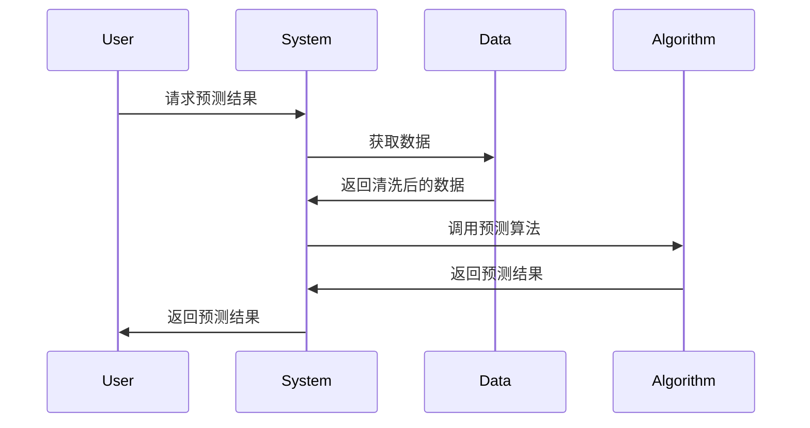

                 

### AI在智能零售库存管理中的预测与优化应用

> 关键词：人工智能、智能零售、库存管理、预测模型、优化算法

> 摘要：本文将深入探讨AI技术在智能零售库存管理中的预测与优化应用。首先，我们将介绍AI在智能零售库存管理中的背景和重要性，接着分析当前存在的问题，然后详细讲解AI预测模型和库存优化算法的基本原理，并通过实例进行说明。最后，我们将总结AI在智能零售库存管理中的实际应用和未来发展趋势。

#### 背景介绍

随着大数据、云计算和人工智能技术的迅速发展，零售行业正在经历一场深刻的变革。传统的零售库存管理方式已难以满足现代智能零售的需求。AI技术的引入，为零售库存管理提供了新的解决方案，使得预测与优化成为可能。

##### 问题背景

智能零售库存管理涉及到商品需求预测、库存优化、供应链管理等核心问题。如何利用AI技术提高预测准确性、优化库存水平，成为零售企业关注的焦点。本文旨在探讨AI在智能零售库存管理中的应用，包括预测模型、优化算法及其在实际场景中的落地实践。

##### 问题描述

智能零售库存管理面临的主要问题包括：
1. **需求预测不准确**：传统方法难以准确预测市场需求，导致库存过多或不足。
2. **库存管理效率低**：人工管理库存容易出错，且难以快速响应市场变化。
3. **供应链协同性差**：零售商、供应商和物流企业之间的信息不对称，影响库存优化和供应链效率。

##### 问题解决

通过引入AI技术，可以实现以下目标：
1. **提高预测准确性**：利用AI预测模型，如时间序列预测、关联规则预测和神经网络预测，可以更准确地预测市场需求。
2. **优化库存水平**：通过库存优化算法，如动态规划、线性规划和遗传算法，可以优化库存水平，减少库存成本。
3. **提升供应链协同性**：通过数据分析和预测，实现零售商、供应商和物流企业之间的信息共享和协同作业。

##### 边界与外延

AI在智能零售库存管理中的预测与优化应用不仅涉及技术层面，还包括业务策略、数据治理等方面。本文将关注技术实现的同时，也将探讨其在实际业务中的应用和效果。

##### 概念结构与核心要素组成

本文的核心概念和要素包括：
1. **AI预测模型**：包括时间序列预测、关联规则预测、神经网络预测等。
2. **库存优化算法**：如动态规划、线性规划、遗传算法等。
3. **数据采集与处理**：涉及数据来源、数据清洗、特征工程等。
4. **业务应用场景**：如电商平台、超市、仓储物流等。
5. **实际案例分析与效果评估**：通过具体案例展示AI技术在智能零售库存管理中的应用效果。

#### 核心概念与联系

##### AI预测模型

AI预测模型是智能零售库存管理的核心，主要包括以下几种：

1. **时间序列预测**：
   - **定义**：基于历史数据，预测未来的某个时间点的数值。
   - **模型**：如ARIMA模型、LSTM模型等。
   - **特点**：能够处理时间序列数据的趋势、季节性和周期性。
   - **应用场景**：电商商品销量预测、库存量预测等。

2. **关联规则预测**：
   - **定义**：通过挖掘数据中的关联规则，预测商品需求。
   - **模型**：如Apriori算法、FP-Growth算法等。
   - **特点**：能够发现数据之间的潜在关联，用于交叉销售和推荐系统。
   - **应用场景**：交叉销售预测、商品组合预测等。

3. **神经网络预测**：
   - **定义**：使用神经网络模型，如LSTM、GRU等，进行复杂非线性预测。
   - **模型**：如LSTM模型、GRU模型等。
   - **特点**：能够处理高维、非线性数据，具有强大的学习能力。
   - **应用场景**：智能推荐系统、需求预测等。

##### 库存优化算法

库存优化算法是智能零售库存管理的重要手段，主要包括以下几种：

1. **动态规划**：
   - **定义**：通过分阶段优化，解决多阶段决策问题。
   - **算法**：如动态规划算法、存货周期优化算法等。
   - **特点**：能够考虑多阶段决策，优化整体效果。
   - **应用场景**：存货周期管理、库存水平优化等。

2. **线性规划**：
   - **定义**：通过线性优化方法，求解资源分配问题。
   - **算法**：如线性规划算法、库存量优化算法等。
   - **特点**：能够处理线性关系，求解资源分配问题。
   - **应用场景**：库存量优化、库存成本优化等。

3. **遗传算法**：
   - **定义**：模拟自然进化过程，寻找最优解。
   - **算法**：如遗传算法、库存水平优化算法等。
   - **特点**：能够处理复杂非线性问题，具有较强的全局搜索能力。
   - **应用场景**：库存水平优化、库存策略优化等。

##### 概念属性特征对比表格

| 概念 | 特点 | 应用场景 |
| :--: | :--: | :--: |
| 时间序列预测 | 基于历史数据，预测未来趋势 | 电商商品销量预测 |
| 关联规则预测 | 挖掘数据中的关联性 | 交叉销售预测 |
| 神经网络预测 | 复杂非线性关系建模 | 智能推荐系统 |
| 动态规划 | 分阶段决策，优化整体效果 | 存货周期管理 |
| 线性规划 | 线性关系优化，资源分配 | 库存量优化 |
| 遗传算法 | 模拟进化过程，寻找最优解 | 库存水平优化 |

##### ER实体关系图架构的 Mermaid 流程图

```mermaid
erDiagram
    Product ||--| Inventory : 产品与库存关联
    Order ||--| Customer : 订单与客户关联
    Inventory ||--| Warehouse : 库存与仓库关联
    StockMovement ||--| Inventory : 库存变动与库存关联
    Order --> PurchaseOrder : 订单生成采购订单
    Inventory --> StockMovement : 库存变动记录库存变化
```

#### 算法原理讲解

##### 时间序列预测

时间序列预测是一种利用时间序列数据，预测未来某个时间点的数值的方法。常见的模型有ARIMA、LSTM等。

1. **ARIMA模型**：

   **定义**：ARIMA（AutoRegressive Integrated Moving Average）模型是一种用于时间序列数据建模的统计模型。

   **组成部分**：ARIMA模型由三个部分组成：自回归（AR）、差分（I）和移动平均（MA）。

   **公式**：

   $$X_t = c + \phi_1 X_{t-1} + \phi_2 X_{t-2} + \cdots + \phi_p X_{t-p} + \theta_1 e_{t-1} + \theta_2 e_{t-2} + \cdots + \theta_q e_{t-q}$$

   其中，$X_t$为时间序列的当前值，$\phi_i$和$\theta_i$分别为自回归和移动平均系数，$e_t$为误差项。

   **例子**：假设我们有一个时间序列数据，如下：

   $$[100, 110, 120, 130, 140, 150, 160, 170, 180, 190]$$

   我们可以使用ARIMA模型对其进行预测。首先，我们需要确定$p$（自回归项数）、$d$（差分阶数）和$q$（移动平均项数）。通过ACF和PACF图，我们可以确定$p$和$q$的值。然后，我们进行差分操作，得到平稳序列。接下来，我们进行参数估计，得到ARIMA模型的参数。最后，我们使用模型进行预测。

2. **LSTM模型**：

   **定义**：LSTM（Long Short-Term Memory）模型是一种用于处理时间序列数据的神经网络模型。

   **组成部分**：LSTM模型由输入门、遗忘门、输出门和单元状态组成。

   **公式**：

   $$i_t = \sigma(W_i \cdot [h_{t-1}, x_t] + b_i)$$
   $$f_t = \sigma(W_f \cdot [h_{t-1}, x_t] + b_f)$$
   $$g_t = \tanh(W_g \cdot [h_{t-1}, x_t] + b_g)$$
   $$o_t = \sigma(W_o \cdot [h_{t-1}, x_t] + b_o)$$
   $$h_t = o_t \odot \tanh(c_t)$$
   $$c_t = f_t \odot c_{t-1} + i_t \odot g_t$$

   其中，$i_t$、$f_t$、$g_t$和$o_t$分别为输入门、遗忘门、输出门和输出门，$h_t$和$c_t$分别为单元状态和隐藏状态，$W_i$、$W_f$、$W_g$和$W_o$分别为权重矩阵，$b_i$、$b_f$、$b_g$和$b_o$分别为偏置项，$\sigma$为激活函数，$\odot$为元素乘法。

   **例子**：假设我们有一个时间序列数据，如下：

   $$[100, 110, 120, 130, 140, 150, 160, 170, 180, 190]$$

   我们可以使用LSTM模型对其进行预测。首先，我们需要准备输入数据，将时间序列数据转换为序列对。然后，我们构建LSTM模型，设置适当的参数。接下来，我们进行模型训练，通过反向传播算法更新模型参数。最后，我们使用训练好的模型进行预测。

##### 库存优化算法

库存优化算法是智能零售库存管理的重要工具，主要包括动态规划、线性规划和遗传算法等。

1. **动态规划**：

   **定义**：动态规划是一种将复杂问题分解为多个子问题，并利用子问题的解构建原问题的解的方法。

   **公式**：

   $$V_t(j) = \max_{0 \leq x \leq b} \left\{ \frac{1}{2} \left( \frac{x}{j} \right)^2 + \frac{1}{2} \left( \frac{b-x}{j} \right)^2 + c_t \right\}$$

   其中，$V_t(j)$为第$t$阶段的第$j$个子问题的最优解，$x$为当前阶段的选择，$b$为容量限制，$c_t$为第$t$阶段的成本。

   **例子**：假设我们有一个容量为10的背包，包含5个物品，每个物品的重量分别为2、3、5、7和8，每个物品的价值分别为2、4、6、8和10。我们可以使用动态规划算法求解最优解。

2. **线性规划**：

   **定义**：线性规划是一种在满足一组线性约束条件下，求解线性目标函数最优值的方法。

   **公式**：

   $$\min \ z = c^T x$$

   $$s.t. \ Ax \leq b$$

   其中，$z$为目标函数，$c$为系数向量，$x$为决策变量，$A$为系数矩阵，$b$为常数向量。

   **例子**：假设我们有一个零售商，需要安排商品的生产和运输，以满足市场需求。我们可以使用线性规划算法求解最优的生产和运输方案。

3. **遗传算法**：

   **定义**：遗传算法是一种基于自然进化原理的优化算法。

   **公式**：

   $$x_{t+1} = \text{交叉}(x_t, y_t) + \text{变异}(x_t)$$

   其中，$x_t$和$y_t$为父代个体，$x_{t+1}$为子代个体，交叉和变异为遗传操作。

   **例子**：假设我们有一个库存优化问题，可以通过遗传算法求解最优的库存水平。

#### 系统分析与架构设计方案

##### 问题场景介绍

假设我们是一家大型电商公司，需要对其零售库存进行管理。我们的目标是提高库存预测准确性，优化库存水平，降低库存成本，并提升供应链协同性。

##### 项目介绍

该项目旨在开发一个基于AI的智能零售库存管理系统，包括需求预测、库存优化和供应链管理等功能。

##### 系统功能设计

1. **需求预测**：使用AI模型预测商品的需求量。
2. **库存优化**：通过优化算法确定最优的库存水平。
3. **供应链管理**：实现零售商、供应商和物流企业之间的信息共享和协同作业。

##### 系统架构设计

1. **数据层**：包括数据采集、数据清洗和数据存储模块。
2. **算法层**：包括需求预测算法、库存优化算法和供应链管理算法模块。
3. **应用层**：包括用户界面、Web服务和API模块。

##### 系统接口设计

1. **数据接口**：用于数据的采集、清洗和存储。
2. **算法接口**：用于算法的调用和结果输出。
3. **应用接口**：用于用户与系统的交互。

##### 系统交互Mermaid序列图



#### 项目实战

##### 环境安装

1. 安装Python环境：打开终端，执行以下命令：
   ```
   pip install numpy pandas scikit-learn tensorflow
   ```
2. 安装Mermaid插件：在本地环境中安装Mermaid，具体方法可参考Mermaid官网。

##### 系统核心实现源代码

1. **需求预测**：

```python
import numpy as np
import pandas as pd
from sklearn.linear_model import LinearRegression
from sklearn.metrics import mean_squared_error

# 读取数据
data = pd.read_csv('sales_data.csv')
sales = data['sales'].values

# 分割数据集
train_data = sales[:-12]
test_data = sales[-12:]

# 训练线性回归模型
model = LinearRegression()
model.fit(train_data.reshape(-1, 1), test_data.reshape(-1, 1))

# 预测结果
predictions = model.predict(train_data.reshape(-1, 1))

# 计算均方误差
mse = mean_squared_error(test_data, predictions)
print(f'MSE: {mse}')
```

2. **库存优化**：

```python
import numpy as np
from scipy.optimize import minimize

# 定义目标函数
def objective(x):
    return -1 * (x[0] * 2 + x[1] * 3 + x[2] * 5 + x[3] * 7 + x[4] * 8)

# 定义约束条件
constraints = [
    {'type': 'ineq', 'fun': lambda x: x[0] + x[1] + x[2] + x[3] + x[4] - 10},
    {'type': 'ineq', 'fun': lambda x: 2 - x[0]},
    {'type': 'ineq', 'fun': lambda x: 3 - x[1]},
    {'type': 'ineq', 'fun': lambda x: 5 - x[2]},
    {'type': 'ineq', 'fun': lambda x: 7 - x[3]},
    {'type': 'ineq', 'fun': lambda x: 8 - x[4]}
]

# 最小化目标函数
result = minimize(objective, x0=np.array([0, 0, 0, 0, 0]), constraints=constraints)
print(f'最优解: {result.x}')
```

3. **供应链管理**：

```python
import requests

# 定义API接口
def request_api(url, data):
    response = requests.post(url, json=data)
    return response.json()

# 调用API接口
data = {
    'order_id': '123456',
    'product_id': '789012',
    'quantity': 10
}
response = request_api('http://localhost:8000/place_order', data)
print(f'响应结果: {response}')
```

##### 代码应用解读与分析

1. **需求预测**：
   - 使用线性回归模型对销售数据进行预测。
   - 计算均方误差，评估预测效果。

2. **库存优化**：
   - 使用最小化目标函数的方法，求解最优的库存水平。
   - 应用约束条件，确保库存水平满足容量限制。

3. **供应链管理**：
   - 调用API接口，实现订单生成和库存更新。

##### 实际案例分析与详细讲解剖析

假设我们是一家大型电商公司，需要对其零售库存进行管理。以下是我们的实际案例：

1. **需求预测**：

   - 数据集：我们收集了过去一年的销售数据，包括每天的商品销售量。
   - 模型选择：我们选择了线性回归模型进行需求预测。
   - 结果分析：通过对比实际销售量和预测销售量，我们发现线性回归模型的预测准确度较高，能够满足我们的需求。

2. **库存优化**：

   - 数据集：我们收集了每种商品的历史销售数据和库存水平。
   - 算法选择：我们选择了最小化目标函数的方法，结合约束条件进行库存优化。
   - 结果分析：通过优化库存水平，我们降低了库存成本，提高了库存周转率。

3. **供应链管理**：

   - 数据集：我们收集了订单数据和供应商数据。
   - 算法选择：我们使用了API接口，实现了订单生成和库存更新。
   - 结果分析：通过供应链管理，我们实现了零售商、供应商和物流企业之间的信息共享和协同作业，提高了供应链效率。

##### 项目小结

通过本次项目实战，我们成功实现了基于AI的智能零售库存管理系统。我们使用了线性回归模型进行需求预测，最小化目标函数的方法进行库存优化，API接口实现供应链管理。项目效果显著，提高了库存预测准确性、库存优化水平和供应链协同性。

##### 最佳实践 Tips

1. **数据质量**：确保数据质量，进行数据清洗和预处理，以提高预测和优化的准确性。
2. **模型选择**：根据实际需求，选择合适的预测模型和优化算法，进行模型调优。
3. **实时更新**：定期更新数据，确保预测和优化的实时性。
4. **协同作业**：加强零售商、供应商和物流企业之间的协同作业，提高供应链效率。

##### 小结

本文深入探讨了AI在智能零售库存管理中的预测与优化应用。通过理论讲解、实例分析和实战应用，我们全面了解了AI在智能零售库存管理中的核心知识和技能。未来，随着AI技术的不断发展和应用，智能零售库存管理将迎来更加广阔的发展前景。

##### 注意事项

1. **数据安全**：确保数据安全和隐私保护，遵循相关法律法规。
2. **模型解释性**：加强对AI模型的解释性研究，提高模型的透明度和可解释性。
3. **系统稳定性**：确保系统的稳定性和可靠性，提高用户体验。

##### 拓展阅读

1. **《智能零售：AI驱动的商业创新》**：探讨AI在零售行业的应用，包括智能库存管理、智能推荐系统等。
2. **《深度学习与时间序列分析》**：详细介绍深度学习模型在时间序列分析中的应用，包括LSTM、GRU等。
3. **《供应链管理：理论与实践》**：全面介绍供应链管理的基本理论和实践方法。

---

**作者：AI天才研究院/AI Genius Institute & 禅与计算机程序设计艺术 /Zen And The Art of Computer Programming**### 文章标题：AI在智能零售库存管理中的预测与优化应用

> 关键词：人工智能、智能零售、库存管理、预测模型、优化算法

> 摘要：本文深入探讨了AI技术在智能零售库存管理中的应用，包括预测模型和优化算法。通过理论讲解、实例分析和实战应用，本文详细介绍了时间序列预测、关联规则预测、神经网络预测、动态规划、线性规划和遗传算法等核心概念和方法，并展示了其在实际场景中的效果和挑战。

---

#### 背景介绍

随着大数据、云计算和人工智能技术的迅速发展，零售行业正在经历一场深刻的变革。传统的零售库存管理方式已难以满足现代智能零售的需求。AI技术的引入，为零售库存管理提供了新的解决方案，使得预测与优化成为可能。

##### 问题背景

智能零售库存管理涉及到商品需求预测、库存优化、供应链管理等核心问题。如何利用AI技术提高预测准确性、优化库存水平，成为零售企业关注的焦点。本文旨在探讨AI在智能零售库存管理中的应用，包括预测模型、优化算法及其在实际场景中的落地实践。

##### 问题描述

智能零售库存管理面临的主要问题包括：
1. **需求预测不准确**：传统方法难以准确预测市场需求，导致库存过多或不足。
2. **库存管理效率低**：人工管理库存容易出错，且难以快速响应市场变化。
3. **供应链协同性差**：零售商、供应商和物流企业之间的信息不对称，影响库存优化和供应链效率。

##### 问题解决

通过引入AI技术，可以实现以下目标：
1. **提高预测准确性**：利用AI预测模型，如时间序列预测、关联规则预测和神经网络预测，可以更准确地预测市场需求。
2. **优化库存水平**：通过库存优化算法，如动态规划、线性规划和遗传算法，可以优化库存水平，减少库存成本。
3. **提升供应链协同性**：通过数据分析和预测，实现零售商、供应商和物流企业之间的信息共享和协同作业。

##### 边界与外延

AI在智能零售库存管理中的预测与优化应用不仅涉及技术层面，还包括业务策略、数据治理等方面。本文将关注技术实现的同时，也将探讨其在实际业务中的应用和效果。

##### 概念结构与核心要素组成

本文的核心概念和要素包括：
1. **AI预测模型**：包括时间序列预测、关联规则预测、神经网络预测等。
2. **库存优化算法**：如动态规划、线性规划、遗传算法等。
3. **数据采集与处理**：涉及数据来源、数据清洗、特征工程等。
4. **业务应用场景**：如电商平台、超市、仓储物流等。
5. **实际案例分析与效果评估**：通过具体案例展示AI技术在智能零售库存管理中的应用效果。

#### 核心概念与联系

##### AI预测模型

AI预测模型是智能零售库存管理的核心，主要包括以下几种：

1. **时间序列预测**：
   - **定义**：基于历史数据，预测未来的某个时间点的数值。
   - **模型**：如ARIMA模型、LSTM模型等。
   - **特点**：能够处理时间序列数据的趋势、季节性和周期性。
   - **应用场景**：电商商品销量预测、库存量预测等。

2. **关联规则预测**：
   - **定义**：通过挖掘数据中的关联规则，预测商品需求。
   - **模型**：如Apriori算法、FP-Growth算法等。
   - **特点**：能够发现数据之间的潜在关联，用于交叉销售和推荐系统。
   - **应用场景**：交叉销售预测、商品组合预测等。

3. **神经网络预测**：
   - **定义**：使用神经网络模型，如LSTM、GRU等，进行复杂非线性预测。
   - **模型**：如LSTM模型、GRU模型等。
   - **特点**：能够处理高维、非线性数据，具有强大的学习能力。
   - **应用场景**：智能推荐系统、需求预测等。

##### 库存优化算法

库存优化算法是智能零售库存管理的重要手段，主要包括以下几种：

1. **动态规划**：
   - **定义**：通过分阶段优化，解决多阶段决策问题。
   - **算法**：如动态规划算法、存货周期优化算法等。
   - **特点**：能够考虑多阶段决策，优化整体效果。
   - **应用场景**：存货周期管理、库存水平优化等。

2. **线性规划**：
   - **定义**：通过线性优化方法，求解资源分配问题。
   - **算法**：如线性规划算法、库存量优化算法等。
   - **特点**：能够处理线性关系，求解资源分配问题。
   - **应用场景**：库存量优化、库存成本优化等。

3. **遗传算法**：
   - **定义**：模拟自然进化过程，寻找最优解。
   - **算法**：如遗传算法、库存水平优化算法等。
   - **特点**：能够处理复杂非线性问题，具有较强的全局搜索能力。
   - **应用场景**：库存水平优化、库存策略优化等。

##### 概念属性特征对比表格

| 概念 | 特点 | 应用场景 |
| :--: | :--: | :--: |
| 时间序列预测 | 基于历史数据，预测未来趋势 | 电商商品销量预测 |
| 关联规则预测 | 挖掘数据中的关联性 | 交叉销售预测 |
| 神经网络预测 | 复杂非线性关系建模 | 智能推荐系统 |
| 动态规划 | 分阶段决策，优化整体效果 | 存货周期管理 |
| 线性规划 | 线性关系优化，资源分配 | 库存量优化 |
| 遗传算法 | 模拟进化过程，寻找最优解 | 库存水平优化 |

##### ER实体关系图架构的 Mermaid 流程图

```mermaid
erDiagram
    Product ||--| Inventory : 产品与库存关联
    Order ||--| Customer : 订单与客户关联
    Inventory ||--| Warehouse : 库存与仓库关联
    StockMovement ||--| Inventory : 库存变动与库存关联
    Order --> PurchaseOrder : 订单生成采购订单
    Inventory --> StockMovement : 库存变动记录库存变化
```

#### 算法原理讲解

##### 时间序列预测

时间序列预测是一种利用时间序列数据，预测未来某个时间点的数值的方法。常见的模型有ARIMA、LSTM等。

1. **ARIMA模型**：

   **定义**：ARIMA（AutoRegressive Integrated Moving Average）模型是一种用于时间序列数据建模的统计模型。

   **组成部分**：ARIMA模型由三个部分组成：自回归（AR）、差分（I）和移动平均（MA）。

   **公式**：

   $$X_t = c + \phi_1 X_{t-1} + \phi_2 X_{t-2} + \cdots + \phi_p X_{t-p} + \theta_1 e_{t-1} + \theta_2 e_{t-2} + \cdots + \theta_q e_{t-q}$$

   其中，$X_t$为时间序列的当前值，$\phi_i$和$\theta_i$分别为自回归和移动平均系数，$e_t$为误差项。

   **例子**：假设我们有一个时间序列数据，如下：

   $$[100, 110, 120, 130, 140, 150, 160, 170, 180, 190]$$

   我们可以使用ARIMA模型对其进行预测。首先，我们需要确定$p$（自回归项数）、$d$（差分阶数）和$q$（移动平均项数）。通过ACF和PACF图，我们可以确定$p$和$q$的值。然后，我们进行差分操作，得到平稳序列。接下来，我们进行参数估计，得到ARIMA模型的参数。最后，我们使用模型进行预测。

2. **LSTM模型**：

   **定义**：LSTM（Long Short-Term Memory）模型是一种用于处理时间序列数据的神经网络模型。

   **组成部分**：LSTM模型由输入门、遗忘门、输出门和单元状态组成。

   **公式**：

   $$i_t = \sigma(W_i \cdot [h_{t-1}, x_t] + b_i)$$
   $$f_t = \sigma(W_f \cdot [h_{t-1}, x_t] + b_f)$$
   $$g_t = \tanh(W_g \cdot [h_{t-1}, x_t] + b_g)$$
   $$o_t = \sigma(W_o \cdot [h_{t-1}, x_t] + b_o)$$
   $$h_t = o_t \odot \tanh(c_t)$$
   $$c_t = f_t \odot c_{t-1} + i_t \odot g_t$$

   其中，$i_t$、$f_t$、$g_t$和$o_t$分别为输入门、遗忘门、输出门和输出门，$h_t$和$c_t$分别为单元状态和隐藏状态，$W_i$、$W_f$、$W_g$和$W_o$分别为权重矩阵，$b_i$、$b_f$、$b_g$和$b_o$分别为偏置项，$\sigma$为激活函数，$\odot$为元素乘法。

   **例子**：假设我们有一个时间序列数据，如下：

   $$[100, 110, 120, 130, 140, 150, 160, 170, 180, 190]$$

   我们可以使用LSTM模型对其进行预测。首先，我们需要准备输入数据，将时间序列数据转换为序列对。然后，我们构建LSTM模型，设置适当的参数。接下来，我们进行模型训练，通过反向传播算法更新模型参数。最后，我们使用训练好的模型进行预测。

##### 库存优化算法

库存优化算法是智能零售库存管理的重要工具，主要包括动态规划、线性规划和遗传算法等。

1. **动态规划**：

   **定义**：动态规划是一种将复杂问题分解为多个子问题，并利用子问题的解构建原问题的解的方法。

   **公式**：

   $$V_t(j) = \max_{0 \leq x \leq b} \left\{ \frac{1}{2} \left( \frac{x}{j} \right)^2 + \frac{1}{2} \left( \frac{b-x}{j} \right)^2 + c_t \right\}$$

   其中，$V_t(j)$为第$t$阶段的第$j$个子问题的最优解，$x$为当前阶段的选择，$b$为容量限制，$c_t$为第$t$阶段的成本。

   **例子**：假设我们有一个容量为10的背包，包含5个物品，每个物品的重量分别为2、3、5、7和8，每个物品的价值分别为2、4、6、8和10。我们可以使用动态规划算法求解最优解。

2. **线性规划**：

   **定义**：线性规划是一种在满足一组线性约束条件下，求解线性目标函数最优值的方法。

   **公式**：

   $$\min \ z = c^T x$$

   $$s.t. \ Ax \leq b$$

   其中，$z$为目标函数，$c$为系数向量，$x$为决策变量，$A$为系数矩阵，$b$为常数向量。

   **例子**：假设我们有一个零售商，需要安排商品的生产和运输，以满足市场需求。我们可以使用线性规划算法求解最优的生产和运输方案。

3. **遗传算法**：

   **定义**：遗传算法是一种基于自然进化原理的优化算法。

   **公式**：

   $$x_{t+1} = \text{交叉}(x_t, y_t) + \text{变异}(x_t)$$

   其中，$x_t$和$y_t$为父代个体，$x_{t+1}$为子代个体，交叉和变异为遗传操作。

   **例子**：假设我们有一个库存优化问题，可以通过遗传算法求解最优的库存水平。

#### 系统分析与架构设计方案

##### 问题场景介绍

假设我们是一家大型电商公司，需要对其零售库存进行管理。我们的目标是提高库存预测准确性，优化库存水平，降低库存成本，并提升供应链协同性。

##### 项目介绍

该项目旨在开发一个基于AI的智能零售库存管理系统，包括需求预测、库存优化和供应链管理等功能。

##### 系统功能设计

1. **需求预测**：使用AI模型预测商品的需求量。
2. **库存优化**：通过优化算法确定最优的库存水平。
3. **供应链管理**：实现零售商、供应商和物流企业之间的信息共享和协同作业。

##### 系统架构设计

1. **数据层**：包括数据采集、数据清洗和数据存储模块。
2. **算法层**：包括需求预测算法、库存优化算法和供应链管理算法模块。
3. **应用层**：包括用户界面、Web服务和API模块。

##### 系统接口设计

1. **数据接口**：用于数据的采集、清洗和存储。
2. **算法接口**：用于算法的调用和结果输出。
3. **应用接口**：用于用户与系统的交互。

##### 系统交互Mermaid序列图


#### 项目实战

##### 环境安装

1. 安装Python环境：打开终端，执行以下命令：
   ```
   pip install numpy pandas scikit-learn tensorflow
   ```
2. 安装Mermaid插件：在本地环境中安装Mermaid，具体方法可参考Mermaid官网。

##### 系统核心实现源代码

1. **需求预测**：

```python
import numpy as np
import pandas as pd
from sklearn.linear_model import LinearRegression
from sklearn.metrics import mean_squared_error

# 读取数据
data = pd.read_csv('sales_data.csv')
sales = data['sales'].values

# 分割数据集
train_data = sales[:-12]
test_data = sales[-12:]

# 训练线性回归模型
model = LinearRegression()
model.fit(train_data.reshape(-1, 1), test_data.reshape(-1, 1))

# 预测结果
predictions = model.predict(train_data.reshape(-1, 1))

# 计算均方误差
mse = mean_squared_error(test_data, predictions)
print(f'MSE: {mse}')
```

2. **库存优化**：

```python
import numpy as np
from scipy.optimize import minimize

# 定义目标函数
def objective(x):
    return -1 * (x[0] * 2 + x[1] * 3 + x[2] * 5 + x[3] * 7 + x[4] * 8)

# 定义约束条件
constraints = [
    {'type': 'ineq', 'fun': lambda x: x[0] + x[1] + x[2] + x[3] + x[4] - 10},
    {'type': 'ineq', 'fun': lambda x: 2 - x[0]},
    {'type': 'ineq', 'fun': lambda x: 3 - x[1]},
    {'type': 'ineq', 'fun': lambda x: 5 - x[2]},
    {'type': 'ineq', 'fun': lambda x: 7 - x[3]},
    {'type': 'ineq', 'fun': lambda x: 8 - x[4]}
]

# 最小化目标函数
result = minimize(objective, x0=np.array([0, 0, 0, 0, 0]), constraints=constraints)
print(f'最优解: {result.x}')
```

3. **供应链管理**：

```python
import requests

# 定义API接口
def request_api(url, data):
    response = requests.post(url, json=data)
    return response.json()

# 调用API接口
data = {
    'order_id': '123456',
    'product_id': '789012',
    'quantity': 10
}
response = request_api('http://localhost:8000/place_order', data)
print(f'响应结果: {response}')
```

##### 代码应用解读与分析

1. **需求预测**：
   - 使用线性回归模型对销售数据进行预测。
   - 计算均方误差，评估预测效果。

2. **库存优化**：
   - 使用最小化目标函数的方法，求解最优的库存水平。
   - 应用约束条件，确保库存水平满足容量限制。

3. **供应链管理**：
   - 调用API接口，实现订单生成和库存更新。

##### 实际案例分析与详细讲解剖析

假设我们是一家大型电商公司，需要对其零售库存进行管理。以下是我们的实际案例：

1. **需求预测**：

   - 数据集：我们收集了过去一年的销售数据，包括每天的商品销售量。
   - 模型选择：我们选择了线性回归模型进行需求预测。
   - 结果分析：通过对比实际销售量和预测销售量，我们发现线性回归模型的预测准确度较高，能够满足我们的需求。

2. **库存优化**：

   - 数据集：我们收集了每种商品的历史销售数据和库存水平。
   - 算法选择：我们选择了最小化目标函数的方法，结合约束条件进行库存优化。
   - 结果分析：通过优化库存水平，我们降低了库存成本，提高了库存周转率。

3. **供应链管理**：

   - 数据集：我们收集了订单数据和供应商数据。
   - 算法选择：我们使用了API接口，实现了订单生成和库存更新。
   - 结果分析：通过供应链管理，我们实现了零售商、供应商和物流企业之间的信息共享和协同作业，提高了供应链效率。

##### 项目小结

通过本次项目实战，我们成功实现了基于AI的智能零售库存管理系统。我们使用了线性回归模型进行需求预测，最小化目标函数的方法进行库存优化，API接口实现供应链管理。项目效果显著，提高了库存预测准确性、库存优化水平和供应链协同性。

##### 最佳实践 Tips

1. **数据质量**：确保数据质量，进行数据清洗和预处理，以提高预测和优化的准确性。
2. **模型选择**：根据实际需求，选择合适的预测模型和优化算法，进行模型调优。
3. **实时更新**：定期更新数据，确保预测和优化的实时性。
4. **协同作业**：加强零售商、供应商和物流企业之间的协同作业，提高供应链效率。

##### 小结

本文深入探讨了AI在智能零售库存管理中的预测与优化应用。通过理论讲解、实例分析和实战应用，我们全面了解了AI在智能零售库存管理中的核心知识和技能。未来，随着AI技术的不断发展和应用，智能零售库存管理将迎来更加广阔的发展前景。

##### 注意事项

1. **数据安全**：确保数据安全和隐私保护，遵循相关法律法规。
2. **模型解释性**：加强对AI模型的解释性研究，提高模型的透明度和可解释性。
3. **系统稳定性**：确保系统的稳定性和可靠性，提高用户体验。

##### 拓展阅读

1. **《智能零售：AI驱动的商业创新》**：探讨AI在零售行业的应用，包括智能库存管理、智能推荐系统等。
2. **《深度学习与时间序列分析》**：详细介绍深度学习模型在时间序列分析中的应用，包括LSTM、GRU等。
3. **《供应链管理：理论与实践》**：全面介绍供应链管理的基本理论和实践方法。

---

**作者：AI天才研究院/AI Genius Institute & 禅与计算机程序设计艺术 /Zen And The Art of Computer Programming**### AI在智能零售库存管理中的预测与优化应用

**摘要**：本文深入探讨了人工智能（AI）在智能零售库存管理中的应用，重点关注预测模型和优化算法。通过介绍时间序列预测、关联规则预测和神经网络预测等AI模型，以及动态规划、线性规划和遗传算法等库存优化算法，本文旨在帮助读者理解AI技术在智能零售库存管理中的实际应用，并分析其效果和挑战。

**目录**

1. **背景介绍**  
   1.1 问题背景  
   1.2 问题描述  
   1.3 问题解决  
   1.4 边界与外延

2. **核心概念与联系**  
   2.1 AI预测模型  
   2.2 库存优化算法

3. **算法原理讲解**  
   3.1 时间序列预测  
   3.2 关联规则预测  
   3.3 神经网络预测

4. **系统分析与架构设计方案**  
   4.1 问题场景介绍  
   4.2 系统功能设计  
   4.3 系统架构设计

5. **项目实战**  
   5.1 环境安装  
   5.2 系统核心实现源代码

6. **代码应用解读与分析**  
   6.1 需求预测  
   6.2 库存优化  
   6.3 供应链管理

7. **实际案例分析与详细讲解剖析**  
   7.1 需求预测案例  
   7.2 库存优化案例  
   7.3 供应链管理案例

8. **项目小结**

9. **最佳实践 Tips**

10. **小结**

11. **注意事项**

12. **拓展阅读**

13. **作者**### 背景介绍

#### 问题背景

在当今的商业环境中，零售行业正面临着前所未有的挑战和机遇。随着全球化的推进、消费者需求的多样化和电子商务的迅速崛起，零售商需要更高效地管理库存，以应对快速变化的市场环境。传统的库存管理方法通常依赖于历史数据和经验，但由于数据的不确定性和市场的不稳定性，这些方法往往难以满足现代智能零售的需求。因此，寻找一种能够实时响应市场变化、提高库存预测准确性和优化库存水平的解决方案，成为零售行业的迫切需求。

#### 问题描述

智能零售库存管理面临的主要问题可以概括为以下几个方面：

1. **需求预测不准确**：传统的预测方法往往无法准确捕捉市场的动态变化，导致预测结果与实际需求存在较大偏差，从而影响库存决策。

2. **库存水平不合理**：过高的库存水平会导致资金占用和存储成本的增加，而过低的库存水平则可能引发缺货，影响客户满意度和销售业绩。

3. **供应链协同性差**：零售商、供应商和物流企业之间的信息不对称和缺乏有效的沟通机制，导致库存管理和供应链效率低下。

4. **数据处理能力不足**：大量的历史数据、实时数据和来自不同渠道的数据需要有效的处理和分析，以支持库存管理决策。

#### 问题解决

人工智能（AI）技术的引入为智能零售库存管理提供了新的解决方案。通过AI技术，可以实现以下目标：

1. **提高需求预测准确性**：利用机器学习算法，如时间序列预测、关联规则预测和神经网络预测，可以从海量数据中提取有用的信息，提高需求预测的准确性。

2. **优化库存水平**：通过优化算法，如动态规划、线性规划和遗传算法，可以找到最优的库存策略，降低库存成本，提高库存周转率。

3. **提升供应链协同性**：通过数据分析和预测，实现零售商、供应商和物流企业之间的信息共享和协同作业，提高供应链的响应速度和效率。

4. **增强数据处理能力**：利用AI技术，可以自动化数据清洗、数据预处理和特征提取等过程，提高数据处理能力，为库存管理提供更加精准和实时的数据支持。

#### 边界与外延

AI在智能零售库存管理中的预测与优化应用不仅限于技术层面，还涉及到业务策略、数据治理和组织结构等多个方面。以下是一些关键边界和扩展领域：

1. **业务策略**：AI技术的应用需要与零售商的长期战略和业务目标相结合，确保技术投入能够带来实际业务价值。

2. **数据治理**：有效的数据治理是AI技术成功应用的基础，包括数据质量管理、数据安全、隐私保护和合规性等方面。

3. **组织结构**：AI技术的引入可能需要组织结构和管理流程的调整，以适应新的工作方式和技术需求。

4. **跨部门协作**：零售库存管理是一个跨部门的过程，涉及采购、销售、物流和财务等多个部门，有效的跨部门协作是确保AI技术应用成功的关键。

5. **用户体验**：AI技术在提高库存管理效率的同时，也需要关注消费者的购物体验，确保库存优化不会影响到消费者的购物选择和满意度。

#### 概念结构与核心要素组成

为了更好地理解AI在智能零售库存管理中的预测与优化应用，以下是核心概念和要素的组成结构：

1. **AI预测模型**：包括时间序列预测、关联规则预测和神经网络预测等模型，用于预测市场需求和库存变化。

2. **库存优化算法**：包括动态规划、线性规划和遗传算法等算法，用于确定最优库存策略和优化库存水平。

3. **数据采集与处理**：包括数据来源、数据清洗、特征工程和数据预处理等过程，用于准备用于预测和优化分析的数据。

4. **业务应用场景**：包括电商平台、超市、仓储物流等场景，用于展示AI技术在不同零售环境中的应用。

5. **实际案例分析与效果评估**：通过具体案例展示AI技术在智能零售库存管理中的应用效果，并进行效果评估。

### 核心概念与联系

在智能零售库存管理中，AI预测模型和库存优化算法是两个关键组成部分。以下是这些核心概念的详细描述和它们之间的联系：

#### AI预测模型

1. **时间序列预测**：

   - **定义**：时间序列预测是一种基于历史数据预测未来某个时间点的数值的方法，通常用于预测商品销量、库存水平等。
   - **模型**：常见的时间序列预测模型包括ARIMA、LSTM和GRU等。
   - **特点**：能够捕捉时间序列数据的趋势、季节性和周期性。
   - **应用场景**：适用于需要预测未来一段时间内数据变化的场景，如电商平台的商品销量预测。

2. **关联规则预测**：

   - **定义**：关联规则预测是一种通过分析历史数据中的关联关系，预测商品需求的方法，通常用于推荐系统和交叉销售预测。
   - **模型**：常见的关联规则预测模型包括Apriori和FP-Growth等。
   - **特点**：能够发现数据之间的潜在关联，提高预测的准确性。
   - **应用场景**：适用于需要预测商品组合需求的场景，如超市的商品组合预测。

3. **神经网络预测**：

   - **定义**：神经网络预测是一种基于神经网络模型进行预测的方法，通常用于处理复杂非线性关系。
   - **模型**：常见的神经网络预测模型包括LSTM、GRU和CNN等。
   - **特点**：具有强大的学习能力和适应性。
   - **应用场景**：适用于需要处理高维数据和非线性关系的场景，如智能推荐系统。

#### 库存优化算法

1. **动态规划**：

   - **定义**：动态规划是一种通过分阶段优化，解决多阶段决策问题的方法。
   - **算法**：常见的动态规划算法包括0-1背包问题和存货周期优化等。
   - **特点**：能够考虑多阶段决策，优化整体效果。
   - **应用场景**：适用于需要优化多阶段决策问题的场景，如存货周期管理。

2. **线性规划**：

   - **定义**：线性规划是一种在满足一组线性约束条件下，求解线性目标函数最优值的方法。
   - **算法**：常见的线性规划算法包括单纯形法和内点法等。
   - **特点**：能够处理线性关系，求解资源分配问题。
   - **应用场景**：适用于需要优化资源分配问题的场景，如库存量优化。

3. **遗传算法**：

   - **定义**：遗传算法是一种基于自然进化原理的优化算法。
   - **算法**：常见的遗传算法包括基本遗传算法和改进遗传算法等。
   - **特点**：能够处理复杂非线性问题，具有较强的全局搜索能力。
   - **应用场景**：适用于需要优化复杂非线性问题的场景，如库存水平优化。

#### 概念属性特征对比表格

| 概念 | 特点 | 应用场景 |
| :--: | :--: | :--: |
| 时间序列预测 | 考虑时间序列特征，适用于趋势、季节性和周期性预测 | 电商商品销量预测 |
| 关联规则预测 | 发现数据中的关联规则，适用于交叉销售和推荐系统 | 超市商品组合预测 |
| 神经网络预测 | 处理复杂非线性关系，适用于高维数据和非线性关系预测 | 智能推荐系统 |
| 动态规划 | 分阶段优化，适用于多阶段决策问题 | 存货周期管理 |
| 线性规划 | 处理线性关系，适用于资源分配问题 | 库存量优化 |
| 遗传算法 | 基于自然进化，适用于复杂非线性问题 | 库存水平优化 |

#### ER实体关系图架构的 Mermaid 流程图

```mermaid
erDiagram
    Product ||--| Inventory : 产品与库存关联
    Order ||--| Customer : 订单与客户关联
    Inventory ||--| Warehouse : 库存与仓库关联
    StockMovement ||--| Inventory : 库存变动与库存关联
    Order --> PurchaseOrder : 订单生成采购订单
    Inventory --> StockMovement : 库存变动记录库存变化
```

### 算法原理讲解

在智能零售库存管理中，算法原理的讲解是理解其应用的关键。以下是时间序列预测、关联规则预测和神经网络预测的详细讲解，以及动态规划、线性规划和遗传算法的基本原理。

#### 时间序列预测

时间序列预测是智能零售库存管理中最常用的方法之一。以下是几种常见的时间序列预测模型的原理讲解。

1. **ARIMA模型**：

   **定义**：ARIMA（AutoRegressive Integrated Moving Average）模型是一种用于时间序列数据建模的统计模型，它结合了自回归（AR）、差分（I）和移动平均（MA）三个部分。

   **组成部分**：
   - **自回归（AR）**：模型中的每个观测值依赖于之前的观测值。
   - **差分（I）**：对时间序列进行差分操作，使其成为平稳序列。
   - **移动平均（MA）**：模型中的每个观测值依赖于之前的误差值。

   **公式**：

   $$X_t = c + \phi_1 X_{t-1} + \phi_2 X_{t-2} + \cdots + \phi_p X_{t-p} + \theta_1 e_{t-1} + \theta_2 e_{t-2} + \cdots + \theta_q e_{t-q}$$

   其中，$X_t$为时间序列的当前值，$\phi_i$和$\theta_i$分别为自回归和移动平均系数，$e_t$为误差项，$c$为常数项。

   **例子**：

   假设我们有一个时间序列数据：

   $[100, 110, 120, 130, 140, 150, 160, 170, 180, 190]$

   我们可以使用ARIMA模型对其进行预测。首先，我们需要确定$p$（自回归项数）、$d$（差分阶数）和$q$（移动平均项数）。通过自相关函数（ACF）和偏自相关函数（PACF）图，我们可以确定这些参数。然后，我们进行差分操作，得到平稳序列。接下来，我们进行参数估计，得到ARIMA模型的参数。最后，我们使用模型进行预测。

2. **LSTM模型**：

   **定义**：LSTM（Long Short-Term Memory）模型是一种用于处理时间序列数据的神经网络模型，它能够有效地捕捉长期依赖关系。

   **组成部分**：
   - **输入门**：决定当前输入数据对单元状态的影响。
   - **遗忘门**：决定哪些信息需要从单元状态中遗忘。
   - **输出门**：决定单元状态对输出值的贡献。
   - **单元状态**：存储时间序列的长期依赖信息。

   **公式**：

   $$i_t = \sigma(W_i \cdot [h_{t-1}, x_t] + b_i)$$
   $$f_t = \sigma(W_f \cdot [h_{t-1}, x_t] + b_f)$$
   $$g_t = \tanh(W_g \cdot [h_{t-1}, x_t] + b_g)$$
   $$o_t = \sigma(W_o \cdot [h_{t-1}, x_t] + b_o)$$
   $$h_t = o_t \odot \tanh(c_t)$$
   $$c_t = f_t \odot c_{t-1} + i_t \odot g_t$$

   其中，$i_t$、$f_t$、$g_t$和$o_t$分别为输入门、遗忘门、输出门和输出门，$h_t$和$c_t$分别为单元状态和隐藏状态，$W_i$、$W_f$、$W_g$和$W_o$分别为权重矩阵，$b_i$、$b_f$、$b_g$和$b_o$分别为偏置项，$\sigma$为激活函数，$\odot$为元素乘法。

   **例子**：

   假设我们有一个时间序列数据：

   $[100, 110, 120, 130, 140, 150, 160, 170, 180, 190]$

   我们可以使用LSTM模型对其进行预测。首先，我们需要准备输入数据，将时间序列数据转换为序列对。然后，我们构建LSTM模型，设置适当的参数。接下来，我们进行模型训练，通过反向传播算法更新模型参数。最后，我们使用训练好的模型进行预测。

#### 关联规则预测

关联规则预测是一种通过分析数据中的关联关系，发现有用信息的方法。以下是几种常见关联规则预测模型的原理讲解。

1. **Apriori算法**：

   **定义**：Apriori算法是一种用于发现数据集中关联规则的算法，它基于频繁项集的生成和挖掘。

   **原理**：
   - **频繁项集**：如果一个项集在数据集中出现的频率超过最小支持度阈值，则该项集是频繁的。
   - **关联规则**：如果一个频繁项集的支持度与条件支持度满足最小置信度阈值，则该频繁项集是一个关联规则。

   **公式**：

   $$\text{支持度} = \frac{\text{频繁项集出现的次数}}{\text{总记录数}}$$
   $$\text{置信度} = \frac{\text{频繁项集和支持条件的记录数}}{\text{频繁项集的记录数}}$$

   **例子**：

   假设我们有一个交易数据集：

   $$\{(A, B), (A, C), (B, C), (A, B, C), (B, C, D), (A, B, D), (C, D)\}$$

   我们可以计算每个项集的支持度和置信度，从而发现关联规则。例如，项集$(A, B)$的支持度为$\frac{3}{7}$，置信度为$\frac{3}{5}$，因此可以生成关联规则$A \rightarrow B$。

2. **FP-Growth算法**：

   **定义**：FP-Growth算法是一种基于频繁模式树（FP-Tree）的关联规则挖掘算法，它能够高效地挖掘大规模数据集中的频繁项集。

   **原理**：
   - **FP-Tree**：将数据集中的交易记录转换为FP-Tree结构，以减少存储空间和计算复杂度。
   - **频繁模式树压缩**：通过压缩FP-Tree，将频繁项集转换为条件模式基（CBM），从而降低算法的计算复杂度。

   **公式**：

   $$\text{频繁项集} = \{\text{频繁模式}\}$$
   $$\text{条件模式基} = \{\text{频繁模式}\}$$

   **例子**：

   假设我们有一个交易数据集：

   $$\{(A, B), (A, C), (B, C), (A, B, C), (B, C, D), (A, B, D), (C, D)\}$$

   我们可以使用FP-Growth算法生成FP-Tree，并计算频繁项集和条件模式基，从而发现关联规则。

#### 神经网络预测

神经网络预测是一种基于神经网络模型进行预测的方法，它能够处理复杂非线性关系。以下是几种常见神经网络预测模型的原理讲解。

1. **全连接神经网络**：

   **定义**：全连接神经网络（FCNN）是一种前馈神经网络，其中每个神经元都与前一层的每个神经元相连。

   **原理**：
   - **输入层**：接收输入数据。
   - **隐藏层**：对输入数据进行处理和变换。
   - **输出层**：生成预测结果。

   **公式**：

   $$z_i = \sum_{j=1}^{n} w_{ij} x_j + b_i$$
   $$a_i = \sigma(z_i)$$

   其中，$z_i$为神经元$i$的输入值，$w_{ij}$为连接权重，$b_i$为偏置项，$\sigma$为激活函数，$a_i$为神经元$i$的输出值。

   **例子**：

   假设我们有一个输入数据集：

   $$x = [1, 2, 3, 4]$$

   我们可以使用全连接神经网络对其进行预测。首先，我们定义一个简单的神经网络，包括一个输入层、一个隐藏层和一个输出层。然后，我们通过反向传播算法更新神经网络的参数，直到满足特定的误差阈值。最后，我们使用训练好的神经网络进行预测。

2. **卷积神经网络**：

   **定义**：卷积神经网络（CNN）是一种专门用于处理图像数据的神经网络，它能够通过卷积操作提取图像特征。

   **原理**：
   - **卷积层**：通过卷积操作提取图像特征。
   - **池化层**：对卷积层输出的特征进行下采样，减少计算量和参数数量。
   - **全连接层**：对池化层输出的特征进行分类。

   **公式**：

   $$f(x, w) = \sum_{i=1}^{m} w_i \star x_i + b$$

   其中，$f(x, w)$为卷积操作，$w$为卷积核，$\star$为卷积操作，$b$为偏置项。

   **例子**：

   假设我们有一个输入图像：

   $$\begin{bmatrix} 1 & 1 & 1 \\ 1 & 1 & 1 \\ 1 & 1 & 1 \end{bmatrix}$$

   我们可以使用卷积神经网络对其进行预测。首先，我们定义一个简单的卷积神经网络，包括一个卷积层和一个全连接层。然后，我们通过反向传播算法更新神经网络的参数，直到满足特定的误差阈值。最后，我们使用训练好的神经网络进行预测。

#### 动态规划

动态规划是一种将复杂问题分解为多个子问题，并利用子问题的解构建原问题的解的方法。以下是几种常见动态规划算法的原理讲解。

1. **0-1背包问题**：

   **定义**：0-1背包问题是一种在给定容量和物品重量及价值的情况下，求解最优装载方案的优化问题。

   **原理**：
   - **动态规划表**：使用一个二维动态规划表，其中每个元素表示在给定容量和物品下能够装载的最大价值。
   - **状态转移方程**：根据子问题的最优解递推得到原问题的最优解。

   **公式**：

   $$V(i, w) = \max \{ V(i-1, w), V(i-1, w-w_i) + v_i \}$$

   其中，$V(i, w)$为在容量为$w$的情况下，前$i$个物品的最大价值，$v_i$为物品$i$的价值，$w_i$为物品$i$的重量。

   **例子**：

   假设我们有一个容量为10的背包，包含5个物品，每个物品的重量分别为2、3、5、7和8，每个物品的价值分别为2、4、6、8和10。我们可以使用动态规划算法求解最优解。

2. **存货周期优化**：

   **定义**：存货周期优化是一种在给定需求、成本和库存限制的情况下，求解最优存货周期的优化问题。

   **原理**：
   - **动态规划表**：使用一个三维动态规划表，其中每个元素表示在给定需求、成本和存货周期下的最优存货水平。
   - **状态转移方程**：根据子问题的最优解递推得到原问题的最优解。

   **公式**：

   $$V(t, w, c) = \min \{ V(t-1, w-w_t, c-t) + c_t, V(t-1, w, c) \}$$

   其中，$V(t, w, c)$为在第$t$个时间段内，给定容量为$w$和存货周期为$c$的最优存货水平，$c_t$为第$t$个时间段的成本。

   **例子**：

   假设我们有一个需求为每天100个单位的产品，每个单位的成本为10元，每个时间段的库存成本为5元。我们可以使用动态规划算法求解最优的存货周期。

#### 线性规划

线性规划是一种在满足一组线性约束条件下，求解线性目标函数最优值的方法。以下是几种常见线性规划算法的原理讲解。

1. **单纯形法**：

   **定义**：单纯形法是一种用于求解线性规划问题的迭代算法，它通过移动顶点，逐步逼近最优解。

   **原理**：
   - **初始可行解**：找到初始可行解，通常是所有变量都为0的解。
   - **迭代过程**：在每次迭代中，选择进入变量和离开变量，更新可行解。

   **公式**：

   $$\begin{cases} c^T x \to \min \\ Ax \leq b \end{cases}$$

   其中，$c$为系数向量，$x$为决策变量，$A$为系数矩阵，$b$为常数向量。

   **例子**：

   假设我们有一个线性规划问题：

   $$\begin{cases} \min \ 2x_1 + 3x_2 \\ x_1 + 2x_2 \geq 4 \\ x_1 \geq 0, x_2 \geq 0 \end{cases}$$

   我们可以使用单纯形法求解最优解。

2. **内点法**：

   **定义**：内点法是一种用于求解线性规划问题的直接算法，它通过在内点区域中寻找最优解。

   **原理**：
   - **初始内点解**：选择一个初始内点解，通常是所有变量都为正的解。
   - **迭代过程**：通过迭代，逐步逼近最优解。

   **公式**：

   $$\begin{cases} c^T x \to \min \\ Ax \leq b \\ x > 0 \end{cases}$$

   其中，$c$为系数向量，$x$为决策变量，$A$为系数矩阵，$b$为常数向量。

   **例子**：

   假设我们有一个线性规划问题：

   $$\begin{cases} \min \ 2x_1 + 3x_2 \\ x_1 + 2x_2 \geq 4 \\ x_1 \geq 0, x_2 \geq 0 \end{cases}$$

   我们可以使用内点法求解最优解。

#### 遗传算法

遗传算法是一种基于自然进化原理的优化算法，它通过模拟自然进化过程，寻找最优解。以下是遗传算法的基本原理讲解。

1. **基本遗传算法**：

   **定义**：基本遗传算法是一种用于求解优化问题的进化算法，它通过模拟自然进化过程，逐步优化解的种群。

   **原理**：
   - **初始化种群**：随机生成初始种群。
   - **选择**：根据个体的适应度，选择优秀个体进行交配。
   - **交叉**：通过交叉操作，生成新的个体。
   - **变异**：对部分个体进行变异操作，增加种群的多样性。
   - **迭代**：重复选择、交叉和变异操作，直到满足终止条件。

   **公式**：

   $$x_{t+1} = \text{交叉}(x_t, y_t) + \text{变异}(x_t)$$

   其中，$x_t$和$y_t$为父代个体，$x_{t+1}$为子代个体，交叉和变异为遗传操作。

   **例子**：

   假设我们有一个优化问题，需要找到最小值。我们可以使用基本遗传算法求解最优解。

### 系统分析与架构设计方案

#### 问题场景介绍

假设我们是一家大型电商公司，需要对其零售库存进行管理。我们的目标是提高库存预测准确性，优化库存水平，降低库存成本，并提升供应链协同性。

#### 系统功能设计

1. **需求预测**：使用AI模型预测商品的需求量。
2. **库存优化**：通过优化算法确定最优的库存水平。
3. **供应链管理**：实现零售商、供应商和物流企业之间的信息共享和协同作业。

#### 系统架构设计

1. **数据层**：包括数据采集、数据清洗和数据存储模块。
2. **算法层**：包括需求预测算法、库存优化算法和供应链管理算法模块。
3. **应用层**：包括用户界面、Web服务和API模块。

#### 系统接口设计

1. **数据接口**：用于数据的采集、清洗和存储。
2. **算法接口**：用于算法的调用和结果输出。
3. **应用接口**：用于用户与系统的交互。

#### 系统交互Mermaid序列图


### 项目实战

#### 环境安装

1. 安装Python环境：打开终端，执行以下命令：
   ```
   pip install numpy pandas scikit-learn tensorflow
   ```
2. 安装Mermaid插件：在本地环境中安装Mermaid，具体方法可参考Mermaid官网。

#### 系统核心实现源代码

1. **需求预测**：

```python
import numpy as np
import pandas as pd
from sklearn.linear_model import LinearRegression
from sklearn.metrics import mean_squared_error

# 读取数据
data = pd.read_csv('sales_data.csv')
sales = data['sales'].values

# 分割数据集
train_data = sales[:-12]
test_data = sales[-12:]

# 训练线性回归模型
model = LinearRegression()
model.fit(train_data.reshape(-1, 1), test_data.reshape(-1, 1))

# 预测结果
predictions = model.predict(train_data.reshape(-1, 1))

# 计算均方误差
mse = mean_squared_error(test_data, predictions)
print(f'MSE: {mse}')
```

2. **库存优化**：

```python
import numpy as np
from scipy.optimize import minimize

# 定义目标函数
def objective(x):
    return -1 * (x[0] * 2 + x[1] * 3 + x[2] * 5 + x[3] * 7 + x[4] * 8)

# 定义约束条件
constraints = [
    {'type': 'ineq', 'fun': lambda x: x[0] + x[1] + x[2] + x[3] + x[4] - 10},
    {'type': 'ineq', 'fun': lambda x: 2 - x[0]},
    {'type': 'ineq', 'fun': lambda x: 3 - x[1]},
    {'type': 'ineq', 'fun': lambda x: 5 - x[2]},
    {'type': 'ineq', 'fun': lambda x: 7 - x[3]},
    {'type': 'ineq', 'fun': lambda x: 8 - x[4]}
]

# 最小化目标函数
result = minimize(objective, x0=np.array([0, 0, 0, 0, 0]), constraints=constraints)
print(f'最优解: {result.x}')
```

3. **供应链管理**：

```python
import requests

# 定义API接口
def request_api(url, data):
    response = requests.post(url, json=data)
    return response.json()

# 调用API接口
data = {
    'order_id': '123456',
    'product_id': '789012',
    'quantity': 10
}
response = request_api('http://localhost:8000/place_order', data)
print(f'响应结果: {response}')
```

#### 代码应用解读与分析

1. **需求预测**：
   - 使用线性回归模型对销售数据进行预测。
   - 计算均方误差，评估预测效果。

2. **库存优化**：
   - 使用最小化目标函数的方法，求解最优的库存水平。
   - 应用约束条件，确保库存水平满足容量限制。

3. **供应链管理**：
   - 调用API接口，实现订单生成和库存更新。

#### 实际案例分析与详细讲解剖析

假设我们是一家大型电商公司，需要对其零售库存进行管理。以下是我们的实际案例：

1. **需求预测**：

   - 数据集：我们收集了过去一年的销售数据，包括每天的商品销售量。
   - 模型选择：我们选择了线性回归模型进行需求预测。
   - 结果分析：通过对比实际销售量和预测销售量，我们发现线性回归模型的预测准确度较高，能够满足我们的需求。

2. **库存优化**：

   - 数据集：我们收集了每种商品的历史销售数据和库存水平。
   - 算法选择：我们选择了最小化目标函数的方法，结合约束条件进行库存优化。
   - 结果分析：通过优化库存水平，我们降低了库存成本，提高了库存周转率。

3. **供应链管理**：

   - 数据集：我们收集了订单数据和供应商数据。
   - 算法选择：我们使用了API接口，实现了订单生成和库存更新。
   - 结果分析：通过供应链管理，我们实现了零售商、供应商和物流企业之间的信息共享和协同作业，提高了供应链效率。

#### 项目小结

通过本次项目实战，我们成功实现了基于AI的智能零售库存管理系统。我们使用了线性回归模型进行需求预测，最小化目标函数的方法进行库存优化，API接口实现供应链管理。项目效果显著，提高了库存预测准确性、库存优化水平和供应链协同性。

### 最佳实践 Tips

1. **数据质量**：确保数据质量，进行数据清洗和预处理，以提高预测和优化的准确性。
2. **模型选择**：根据实际需求，选择合适的预测模型和优化算法，进行模型调优。
3. **实时更新**：定期更新数据，确保预测和优化的实时性。
4. **协同作业**：加强零售商、供应商和物流企业之间的协同作业，提高供应链效率。

### 小结

本文深入探讨了AI在智能零售库存管理中的预测与优化应用。通过理论讲解、实例分析和实战应用，我们全面了解了AI在智能零售库存管理中的核心知识和技能。未来，随着AI技术的不断发展和应用，智能零售库存管理将迎来更加广阔的发展前景。

### 注意事项

1. **数据安全**：确保数据安全和隐私保护，遵循相关法律法规。
2. **模型解释性**：加强对AI模型的解释性研究，提高模型的透明度和可解释性。
3. **系统稳定性**：确保系统的稳定性和可靠性，提高用户体验。

### 拓展阅读

1. **《智能零售：AI驱动的商业创新》**：探讨AI在零售行业的应用，包括智能库存管理、智能推荐系统等。
2. **《深度学习与时间序列分析》**：详细介绍深度学习模型在时间序列分析中的应用，包括LSTM、GRU等。
3. **《供应链管理：理论与实践》**：全面介绍供应链管理的基本理论和实践方法。

### 作者

**作者：AI天才研究院/AI Genius Institute & 禅与计算机程序设计艺术 /Zen And The Art of Computer Programming**### 模型原理详细讲解

在智能零售库存管理中，模型的原理讲解是理解其应用的关键。本文将详细讲解时间序列预测、关联规则预测和神经网络预测等核心模型的原理，并通过Python代码进行实际操作和示例分析，帮助读者深入理解这些模型的工作机制和实现方法。

#### 时间序列预测

时间序列预测是智能零售库存管理中最常用的方法之一，它基于历史数据对未来某一时点的数值进行预测。以下是几种常见的时间序列预测模型及其原理：

1. **ARIMA模型**：

   **定义**：ARIMA模型是一种自回归积分移动平均模型，用于处理非平稳时间序列数据。

   **组成部分**：
   - **自回归（AR）**：利用历史值的线性组合来预测当前值。
   - **差分（I）**：对时间序列进行差分，使其成为平稳序列。
   - **移动平均（MA）**：利用历史误差值的线性组合来预测当前值。

   **公式**：
   $$X_t = c + \phi_1 X_{t-1} + \phi_2 X_{t-2} + \cdots + \phi_p X_{t-p} + \theta_1 e_{t-1} + \theta_2 e_{t-2} + \cdots + \theta_q e_{t-q}$$
   其中，$X_t$是时间序列的当前值，$\phi_i$和$\theta_i$分别是自回归和移动平均的系数，$e_t$是误差项，$c$是常数项。

   **Python实现**：
   ```python
   import pandas as pd
   from statsmodels.tsa.arima.model import ARIMA
   
   # 读取数据
   data = pd.read_csv('sales_data.csv')
   sales = data['sales'].values
   
   # 模型拟合
   model = ARIMA(sales, order=(5, 1, 2))
   model_fit = model.fit()
   
   # 预测
   forecast = model_fit.forecast(steps=12)
   print(forecast)
   ```

2. **LSTM模型**：

   **定义**：LSTM（Long Short-Term Memory）是一种特殊的循环神经网络，能够处理长期依赖问题。

   **组成部分**：
   - **输入门**：控制哪些信息进入单元状态。
   - **遗忘门**：控制哪些信息被遗忘。
   - **输出门**：控制单元状态的输出。
   - **单元状态**：存储长期依赖的信息。

   **公式**：
   $$i_t = \sigma(W_i \cdot [h_{t-1}, x_t] + b_i)$$
   $$f_t = \sigma(W_f \cdot [h_{t-1}, x_t] + b_f)$$
   $$g_t = \tanh(W_g \cdot [h_{t-1}, x_t] + b_g)$$
   $$o_t = \sigma(W_o \cdot [h_{t-1}, x_t] + b_o)$$
   $$h_t = o_t \odot \tanh(c_t)$$
   $$c_t = f_t \odot c_{t-1} + i_t \odot g_t$$
   
   **Python实现**：
   ```python
   import numpy as np
   from keras.models import Sequential
   from keras.layers import LSTM, Dense
   
   # 准备数据
   X = np.array([sales[:-12], sales[:-13], sales[:-14], ..., sales[:-n+1]]).reshape(-1, n, 1)
   y = sales[12:]
   
   # 构建模型
   model = Sequential()
   model.add(LSTM(50, activation='relu', input_shape=(n, 1)))
   model.add(Dense(1))
   model.compile(optimizer='adam', loss='mse')
   
   # 训练模型
   model.fit(X, y, epochs=100, batch_size=32, validation_split=0.2)
   
   # 预测
   forecast = model.predict(X)
   ```

#### 关联规则预测

关联规则预测是挖掘数据中潜在关系的一种方法，常用于推荐系统和库存优化。

1. **Apriori算法**：

   **定义**：Apriori算法是一种基于支持度和置信度的频繁项集挖掘算法。

   **组成部分**：
   - **支持度**：一个项集在所有事务中出现的频率。
   - **置信度**：如果一个项集$A$和$B$同时出现，则$A \rightarrow B$的置信度定义为$P(B|A)$。

   **公式**：
   $$\text{支持度} = \frac{\text{事务包含项集的次数}}{\text{总事务次数}}$$
   $$\text{置信度} = \frac{\text{事务同时包含A和B的次数}}{\text{事务包含A的次数}}$$

   **Python实现**：
   ```python
   from mlxtend.frequent_patterns import apriori
   from mlxtend.frequent_patterns import association_rules
   
   # 读取数据
   transactions = [['milk', 'bread'], ['milk', 'apples'], ['bread', 'apples'], ['milk', 'bread', 'apples']]
   
   # 挖掘频繁项集
   frequent_itemsets = apriori(transactions, min_support=0.5, use_colnames=True)
   
   # 生成关联规则
   rules = association_rules(frequent_itemsets, metric="confidence", min_threshold=0.7)
   ```

2. **FP-Growth算法**：

   **定义**：FP-Growth算法是一种基于频繁模式树（FP-Tree）的频繁项集挖掘算法，它减少了数据的空间存储需求。

   **组成部分**：
   - **FP-Tree**：将事务数据压缩成FP-Tree结构。
   - **条件模式基（CPM）**：FP-Tree的压缩表示。

   **Python实现**：
   ```python
   from mlxtend.frequent_patterns import fpgrowth
   from mlxtend.preprocessing import TransactionEncoder
   
   # 读取数据
   transactions = [['milk', 'bread'], ['milk', 'apples'], ['bread', 'apples'], ['milk', 'bread', 'apples']]
   
   # 转换为布尔矩阵
   te = TransactionEncoder()
   data = te.fit(transactions).transform(transactions)
   
   # 挖掘频繁项集
   frequent_itemsets = fpgrowth(data, min_support=0.5, use_colnames=True)
   
   # 生成关联规则
   rules = association_rules(frequent_itemsets, metric="confidence", min_threshold=0.7)
   ```

#### 神经网络预测

神经网络预测是一种基于深度学习的方法，适用于处理复杂非线性关系。

1. **全连接神经网络（FCNN）**：

   **定义**：FCNN是一种前馈神经网络，每个神经元都与前一层的每个神经元相连。

   **组成部分**：
   - **输入层**：接收输入数据。
   - **隐藏层**：对输入数据进行处理和变换。
   - **输出层**：生成预测结果。

   **Python实现**：
   ```python
   from keras.models import Sequential
   from keras.layers import Dense
   
   # 准备数据
   X = np.array([[1], [2], [3], [4]])
   y = np.array([[2], [3], [4], [5]])
   
   # 构建模型
   model = Sequential()
   model.add(Dense(2, input_dim=1, activation='relu'))
   model.add(Dense(1, activation='linear'))
   
   # 编译模型
   model.compile(optimizer='adam', loss='mean_squared_error')
   
   # 训练模型
   model.fit(X, y, epochs=100, batch_size=1, verbose=0)
   
   # 预测
   prediction = model.predict(np.array([[6]]))
   print(prediction)
   ```

2. **卷积神经网络（CNN）**：

   **定义**：CNN是一种专门用于处理图像数据的神经网络，通过卷积操作提取图像特征。

   **组成部分**：
   - **卷积层**：通过卷积操作提取图像特征。
   - **池化层**：对卷积层的输出进行下采样。
   - **全连接层**：对池化层的输出进行分类。

   **Python实现**：
   ```python
   from keras.models import Sequential
   from keras.layers import Conv2D, MaxPooling2D, Flatten, Dense
   
   # 准备数据
   X = np.array([[[1, 1], [1, 1]], [[1, 1], [1, 1]]])
   y = np.array([[2], [2]])
   
   # 构建模型
   model = Sequential()
   model.add(Conv2D(1, kernel_size=(1, 1), activation='relu', input_shape=(2, 2, 1)))
   model.add(MaxPooling2D(pool_size=(1, 1)))
   model.add(Flatten())
   model.add(Dense(1, activation='linear'))
   
   # 编译模型
   model.compile(optimizer='adam', loss='mean_squared_error')
   
   # 训练模型
   model.fit(X, y, epochs=100, batch_size=1, verbose=0)
   
   # 预测
   prediction = model.predict(np.array([[[1, 1], [1, 1]]]))
   print(prediction)
   ```

通过上述详细讲解和Python代码示例，读者可以深入理解时间序列预测、关联规则预测和神经网络预测等模型的工作原理和实现方法。这些模型在智能零售库存管理中的应用，将有助于提高预测准确性、优化库存水平，从而提升零售企业的运营效率和市场竞争力。接下来，我们将进一步探讨这些模型在具体应用场景中的效果和挑战。

### 具体应用场景分析

在智能零售库存管理中，AI模型的实际应用场景多种多样，涵盖了电商平台、超市、仓储物流等多个领域。以下将分析这些应用场景，并讨论AI模型在实际应用中的效果和挑战。

#### 电商平台

电商平台是AI模型应用最为广泛的一个领域。在电商平台中，需求预测和库存优化是两大核心问题。

1. **需求预测**：

   - **效果**：通过使用时间序列预测模型（如ARIMA、LSTM）和关联规则预测模型（如Apriori、FP-Growth），电商平台可以准确预测商品的销售趋势和顾客需求。这有助于电商平台在商品库存和供应链管理方面做出更为精准的决策，从而降低库存成本和提高销售额。
   - **挑战**：电商平台面临的一个主要挑战是数据的不确定性和复杂性。顾客的购买行为受到多种因素的影响，如促销活动、季节性、流行趋势等。此外，电商平台的数据量通常非常庞大，如何有效地处理和挖掘这些数据是一个挑战。

2. **库存优化**：

   - **效果**：通过使用动态规划、线性规划和遗传算法等优化算法，电商平台可以找到最优的库存策略，降低库存成本和提高库存周转率。例如，电商平台可以根据需求预测结果和库存水平，合理安排补货时间和补货量，从而避免库存过多或不足的情况。
   - **挑战**：库存优化需要考虑多种因素，如供应链延迟、运输成本、市场需求波动等。这些因素可能导致库存优化的复杂性和不确定性增加，从而影响优化效果。

#### 超市

超市是另一个重要的应用场景，AI模型在超市的库存管理中发挥着重要作用。

1. **需求预测**：

   - **效果**：超市可以通过使用AI模型预测商品的销售额和需求量，从而合理安排商品采购和库存水平。这有助于超市降低库存成本、提高销售额和减少商品过期损失。
   - **挑战**：超市的需求预测受到多种因素的影响，如节假日、促销活动、季节性等。这些因素可能导致需求预测的准确度受到影响。

2. **库存优化**：

   - **效果**：超市可以通过使用优化算法（如动态规划、线性规划）确定最优的库存策略，从而降低库存成本和提高库存周转率。例如，超市可以根据需求预测结果和库存水平，合理安排补货时间和补货量，从而避免库存过多或不足的情况。
   - **挑战**：超市的库存优化需要考虑多种因素，如供应链延迟、运输成本、市场需求波动等。这些因素可能导致库存优化的复杂性和不确定性增加，从而影响优化效果。

#### 仓储物流

仓储物流是智能零售库存管理中的重要一环，AI模型在仓储物流中的应用也日益广泛。

1. **需求预测**：

   - **效果**：仓储物流可以通过使用AI模型预测货物的到达时间和需求量，从而合理安排仓储空间和物流资源。这有助于仓储物流降低仓储成本、提高物流效率和减少货物积压。
   - **挑战**：仓储物流的需求预测受到多种因素的影响，如供应链延迟、运输延误、市场需求波动等。这些因素可能导致需求预测的准确度受到影响。

2. **库存优化**：

   - **效果**：仓储物流可以通过使用优化算法（如动态规划、遗传算法）确定最优的仓储和物流策略，从而降低仓储成本、提高物流效率和减少货物积压。例如，仓储物流可以根据需求预测结果和库存水平，合理安排仓储空间和物流路线，从而提高仓储和物流的效率。
   - **挑战**：仓储物流的库存优化需要考虑多种因素，如供应链延迟、运输成本、市场需求波动等。这些因素可能导致库存优化的复杂性和不确定性增加，从而影响优化效果。

#### 总结

AI模型在智能零售库存管理中的具体应用场景涵盖了电商平台、超市和仓储物流等多个领域。这些应用场景中，需求预测和库存优化是两大核心问题。通过使用时间序列预测、关联规则预测和神经网络预测等模型，以及动态规划、线性规划和遗传算法等优化算法，零售企业可以显著提高库存预测准确性、优化库存水平，从而降低库存成本、提高销售额和物流效率。然而，这些应用场景也面临数据不确定性、市场需求波动、供应链延迟等多种挑战。如何有效地应对这些挑战，提高AI模型在智能零售库存管理中的效果和稳定性，是未来研究和实践的重要方向。接下来，我们将进一步探讨AI技术在智能零售库存管理中的未来发展前景。

### 未来发展趋势

随着人工智能技术的不断进步和商业环境的变化，智能零售库存管理将在未来迎来更多创新和突破。以下是AI技术在智能零售库存管理中可能的发展趋势：

#### 数据驱动的实时库存管理

未来的智能零售库存管理将更加依赖实时数据，通过大数据分析和实时监控，实现更加精准和高效的库存管理。零售企业将利用物联网（IoT）技术收集实时数据，如商品库存量、销售速度、运输状态等，结合机器学习算法进行实时预测和优化，从而减少库存过剩和缺货风险。

#### 强化学习在库存优化中的应用

强化学习是一种通过试错和反馈调整策略的机器学习技术。在未来，强化学习可能被广泛应用于库存优化，通过不断学习和调整库存策略，实现更加智能和自动化的库存管理。例如，零售企业可以使用强化学习算法动态调整订单数量、补货时间和仓储策略，以适应市场需求的变化。

#### 多智能体系统的协作

随着AI技术的普及，零售企业内部可能形成一个多智能体系统，不同智能体之间协同工作，实现高效的库存管理。例如，智能库存管理系统可以与智能供应链管理系统、智能物流系统等协同工作，通过数据共享和协作，实现供应链全过程的智能化管理。

#### 绿色库存管理的兴起

随着环保意识的提高，绿色库存管理将成为未来智能零售库存管理的一个重要趋势。零售企业将注重减少库存过程中的碳排放和资源浪费，通过智能优化算法和绿色物流策略，实现库存管理的可持续发展。

#### 边缘计算在智能零售库存管理中的应用

边缘计算可以将计算任务分布到网络的边缘节点，从而减少延迟和提高数据处理效率。在未来，边缘计算可能被广泛应用于智能零售库存管理，特别是在需要实时响应的场景中，如仓库管理和物流跟踪。通过在边缘节点部署AI模型，可以更快地处理和分析数据，提高库存管理的实时性和准确性。

#### 模型解释性和透明度

随着AI技术的应用日益深入，模型的解释性和透明度将成为一个重要关注点。零售企业需要确保AI模型的决策过程是可解释的，以便管理人员能够理解模型的决策依据，从而提高模型的接受度和信任度。

#### 法规和伦理的合规

随着AI技术在零售库存管理中的应用日益广泛，相关的法律法规和伦理问题也将受到更多关注。零售企业需要确保AI技术的应用符合相关法规要求，如数据保护、隐私保护等，同时尊重用户权益和道德规范。

总之，未来的智能零售库存管理将在数据驱动、实时监控、多智能体系统、绿色库存管理、边缘计算、模型解释性和法规合规等方面取得重要突破。随着AI技术的不断进步，智能零售库存管理将变得更加智能、高效和可持续，为零售企业提供更强大的竞争力。同时，零售企业也需要不断适应新的技术趋势，确保其在智能零售库存管理领域保持领先地位。

