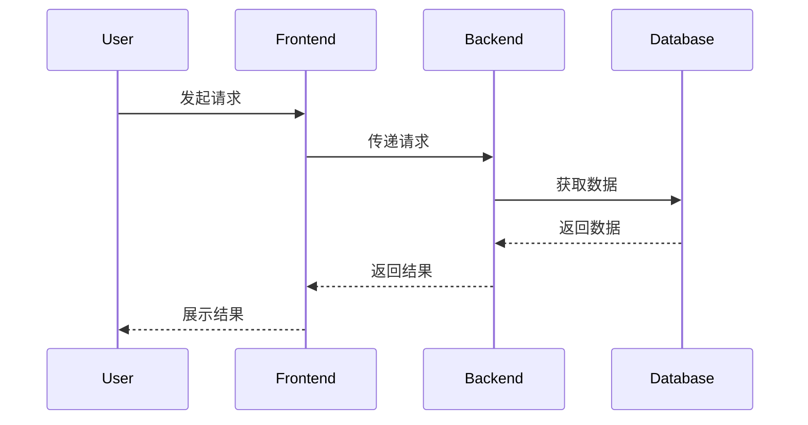

                 

## AI在环境监测和气候变化预测中的应用

关键词：环境监测、气候变化预测、人工智能、算法原理、系统架构

摘要：本文旨在探讨人工智能（AI）在环境监测和气候变化预测中的应用。首先，我们简要介绍环境监测与气候变化预测的背景，明确其核心问题和解决方法。接着，详细讲解AI在环境监测中的应用，包括数据采集、预处理和常用算法。然后，深入分析AI在气候变化预测中的应用，涉及核心概念、数据来源和常用算法。在此基础上，我们设计并实现了一个AI环境监测与气候变化预测系统，从系统架构、数据库设计到核心实现进行详细说明。最后，通过项目实战和最佳实践，为读者提供实际应用指导和进一步阅读建议。

### 第一部分：问题背景与核心概念

#### 第1章：环境监测与气候变化预测背景

##### 1.1.1 问题背景

环境监测是利用各种技术手段对环境质量进行监测和评估的过程，目的是了解环境状况、预测环境变化趋势，并为环境保护决策提供科学依据。气候变化预测则是通过分析气候数据、模型模拟和预测方法，对未来气候变化的趋势和影响进行预测。这两者在现代社会中具有重要意义，因为环境问题如空气污染、水资源短缺和气候变化等，对人类生活和社会经济发展产生了深远影响。

##### 1.1.2 问题描述

环境监测与气候变化预测面临的主要问题包括：

1. 数据来源广泛且复杂，涉及气象、水文、土壤和生物等多方面数据。
2. 数据质量参差不齐，存在噪声、缺失和异常值等问题。
3. 传统方法在处理大规模、多维数据时效率低下，难以实现实时监测和预测。
4. 预测模型复杂，需要大量的计算资源和专业知识。

##### 1.1.3 问题解决

为了解决上述问题，人工智能技术在环境监测和气候变化预测中得到了广泛应用。AI能够自动处理大规模、多维数据，识别数据中的规律和趋势，提高监测和预测的准确性和效率。具体方法包括：

1. 数据采集与预处理：使用传感器网络、卫星遥感等技术获取环境数据，并利用机器学习算法进行数据清洗、去噪和缺失值填补。
2. 模型构建与优化：利用深度学习、神经网络等算法构建预测模型，并采用交叉验证、模型融合等方法进行模型优化。
3. 预测与评估：使用训练好的模型进行实时预测，并通过对比实际观测值和预测值，评估模型的性能和可靠性。

##### 1.1.4 边界与外延

环境监测与气候变化预测不仅涉及自然科学领域，还与社会科学、政策制定和可持续发展密切相关。其边界和范围包括：

1. 环境监测：空气、水质、土壤、生物多样性等。
2. 气候变化预测：温度、湿度、降水、风暴、海平面上升等。
3. 应用领域：环境保护、资源管理、城市规划、农业、医疗等。

##### 1.1.5 概念结构与核心要素组成

环境监测与气候变化预测的概念结构包括以下核心要素：

1. 数据来源：气象数据、遥感数据、传感器数据、历史记录等。
2. 数据处理：数据采集、预处理、数据清洗、特征提取等。
3. 模型构建：机器学习、深度学习、统计模型等。
4. 预测分析：预测模型训练、预测、评估等。
5. 应用领域：环境管理、气候变化应对、可持续发展等。

#### 第2章：AI在环境监测中的应用

##### 2.1.1 AI在环境监测中的作用

AI在环境监测中发挥着关键作用，能够提高监测的精度和效率，降低成本，实现实时监测和预警。其主要作用包括：

1. 数据处理：自动识别和分类环境数据，提取有用的特征信息。
2. 预测分析：基于历史数据和模型预测环境变化趋势，为决策提供科学依据。
3. 自动化监控：实现24小时不间断的环境监测，提高监测覆盖率。
4. 异常检测：发现数据中的异常值和噪声，确保数据质量。

##### 2.1.2 环境监测数据采集与预处理

环境监测数据采集是整个系统的基石，其质量直接影响监测结果的准确性。数据采集包括以下步骤：

1. 传感器网络：部署各种传感器（如温度、湿度、气压、空气质量等），实现多维度、多参数的数据采集。
2. 数据传输：通过无线通信、光纤等方式将传感器数据传输到数据中心。
3. 数据预处理：包括数据清洗、去噪、缺失值填补、数据格式转换等，以提高数据质量。

##### 2.1.3 常用AI算法在环境监测中的应用

在环境监测中，常用的AI算法包括：

1. **聚类算法**：如K均值、DBSCAN等，用于数据降维、特征提取和模式识别。
2. **分类算法**：如决策树、随机森林、支持向量机等，用于分类和预测。
3. **回归算法**：如线性回归、多项式回归等，用于建立环境变量之间的关联关系。
4. **神经网络**：如卷积神经网络（CNN）、循环神经网络（RNN）等，用于复杂环境数据的建模和预测。

#### 第3章：AI在气候变化预测中的应用

##### 3.1.1 气候变化预测的核心概念

气候变化预测涉及多个学科领域，包括气象学、海洋学、生态学等。核心概念包括：

1. **气候系统**：由大气、海洋、陆地和生物圈组成的复杂系统。
2. **温室效应**：大气中温室气体对地球辐射的影响。
3. **气候变率**：气候系统中自然和人为因素引起的气候波动。
4. **预测模型**：用于模拟和预测气候变化的数学模型和计算方法。

##### 3.1.2 气候变化预测的数据来源

气候变化预测所需数据来源广泛，包括：

1. **气象数据**：历史气象观测记录、天气预报数据等。
2. **卫星遥感数据**：全球气候变化监测、海洋、陆地、大气等数据。
3. **模型模拟数据**：基于物理和统计模型生成的预测数据。

##### 3.1.3 常用AI算法在气候变化预测中的应用

在气候变化预测中，常用的AI算法包括：

1. **统计模型**：如回归分析、时间序列分析等，用于建立历史数据与未来预测之间的关系。
2. **机器学习模型**：如决策树、随机森林、支持向量机等，用于分类和预测。
3. **深度学习模型**：如卷积神经网络（CNN）、循环神经网络（RNN）等，用于复杂气候数据的建模和预测。
4. **物理模型**：如全球气候模型（GCM）、区域气候模型（RCM）等，用于模拟和预测气候变化。

### 第二部分：核心算法原理讲解

#### 第4章：环境监测常用算法原理讲解

##### 4.1.1 算法原理

环境监测常用算法主要基于数据挖掘和机器学习技术，以下为几种常用算法的原理：

1. **聚类算法**：
   - **原理**：将相似的数据点归为同一类别，以发现数据中的隐含结构和模式。
   - **算法属性**：K均值、DBSCAN、层次聚类等。
   - **ER实体关系图架构**：

2. **分类算法**：
   - **原理**：根据特征数据对样本进行分类，以提高预测准确性。
   - **算法属性**：决策树、支持向量机、随机森林等。
   - **ER实体关系图架构**：

3. **回归算法**：
   - **原理**：通过建立特征变量与目标变量之间的函数关系，进行预测。
   - **算法属性**：线性回归、多项式回归等。
   - **ER实体关系图架构**：

4. **神经网络**：
   - **原理**：通过多层神经元的连接，模拟人脑处理信息的过程。
   - **算法属性**：卷积神经网络（CNN）、循环神经网络（RNN）等。
   - **ER实体关系图架构**：

##### 4.1.2 算法属性特征对比表格

| 算法名称 | 原理 | 属性特征 | 应用场景 | 代表性模型 |
| :---: | :---: | :---: | :---: | :---: |
| 聚类算法 | 数据分类 | 自动发现数据结构 | 数据降维、模式识别 | K均值、DBSCAN |
| 分类算法 | 数据分类 | 提高预测准确性 | 监督学习任务 | 决策树、随机森林 |
| 回归算法 | 建立函数关系 | 预测目标变量 | 非监督学习任务 | 线性回归、多项式回归 |
| 神经网络 | 模拟人脑处理信息 | 处理复杂数据 | 图像识别、语音识别 | 卷积神经网络、循环神经网络 |

##### 4.1.3 算法ER实体关系图架构

以下为各算法的ER实体关系图架构：

1. **K均值聚类算法**：

```mermaid
erDiagram
    AADo ::"is divided into" BBGroup1
    AADo ::"is divided into" BBGroup2
    AADo ::"is divided into" BBGroup3
    BBGroup1 ||--|{CCMember1}
    BBGroup1 ||--|{CCMember2}
    BBGroup2 ||--|{CCMember3}
    BBGroup2 ||--|{CCMember4}
    BBGroup3 ||--|{CCMember5}
    BBGroup3 ||--|{CCMember6}
```

2. **决策树算法**：

```mermaid
erDiagram
    AADo ||--|{BBTree1}
    AADo ||--|{BBTree2}
    AADo ||--|{BBTree3}
    BBTree1 ||--|{CCNode1}
    BBTree1 ||--|{CCNode2}
    BBTree2 ||--|{CCNode3}
    BBTree2 ||--|{CCNode4}
    BBTree3 ||--|{CCNode5}
    BBTree3 ||--|{CCNode6}
```

3. **线性回归算法**：

```mermaid
erDiagram
    AADo ||--|{BBXVariable}
    AADo ||--|{BBYVariable}
    AADo ||--|{BBWeight}
    BBXVariable ||--|{CCValue}
    BBYVariable ||--|{CCPrediction}
    BBWeight ||--|{CCCoefficient}
```

4. **卷积神经网络算法**：

```mermaid
erDiagram
    AADo ||--|{BBLayer1}
    AADo ||--|{BBLayer2}
    AADo ||--|{BBLayer3}
    BBLayer1 ||--|{CCNode1}
    BBLayer1 ||--|{CCNode2}
    BBLayer2 ||--|{CCNode3}
    BBLayer2 ||--|{CCNode4}
    BBLayer3 ||--|{CCNode5}
    BBLayer3 ||--|{CCNode6}
```

#### 第5章：气候变化预测常用算法原理讲解

##### 5.1.1 算法原理

气候变化预测常用算法主要包括统计模型、机器学习和深度学习等方法。以下为几种常用算法的原理：

1. **统计模型**：
   - **原理**：基于历史数据和统计学原理，建立变量之间的关联关系。
   - **算法属性**：回归分析、时间序列分析等。
   - **ER实体关系图架构**：

2. **机器学习模型**：
   - **原理**：利用历史数据，通过算法学习特征变量与目标变量之间的关系。
   - **算法属性**：决策树、支持向量机等。
   - **ER实体关系图架构**：

3. **深度学习模型**：
   - **原理**：通过多层神经网络，自动提取数据中的特征和模式。
   - **算法属性**：卷积神经网络（CNN）、循环神经网络（RNN）等。
   - **ER实体关系图架构**：

##### 5.1.2 算法属性特征对比表格

| 算法名称 | 原理 | 属性特征 | 应用场景 | 代表性模型 |
| :---: | :---: | :---: | :---: | :---: |
| 统计模型 | 建立变量关联 | 简单、易于实现 | 时间序列预测、回归分析 | 回归分析、时间序列分析 |
| 机器学习模型 | 学习特征关系 | 自动化、高效 | 监督学习任务 | 决策树、支持向量机 |
| 深度学习模型 | 自动提取特征 | 复杂、强大 | 图像识别、语音识别、气候变化预测 | 卷积神经网络、循环神经网络 |

##### 5.1.3 算法ER实体关系图架构

以下为各算法的ER实体关系图架构：

1. **回归分析算法**：

```mermaid
erDiagram
    AADo ||--|{BBXVariable}
    AADo ||--|{BBYVariable}
    AADo ||--|{BBWeight}
    BBXVariable ||--|{CCValue}
    BBYVariable ||--|{CCPrediction}
    BBWeight ||--|{CCCoefficient}
```

2. **决策树算法**：

```mermaid
erDiagram
    AADo ||--|{BBTree}
    AADo ||--|{BBLeaf}
    BBTree ||--|{CCNode1}
    BBTree ||--|{CCNode2}
    BBTree ||--|{CCNode3}
    BBLeaf ||--|{CCPrediction}
```

3. **卷积神经网络算法**：

```mermaid
erDiagram
    AADo ||--|{BBLayer1}
    AADo ||--|{BBLayer2}
    AADo ||--|{BBLayer3}
    BBLayer1 ||--|{CCNode1}
    BBLayer1 ||--|{CCNode2}
    BBLayer2 ||--|{CCNode3}
    BBLayer2 ||--|{CCNode4}
    BBLayer3 ||--|{CCNode5}
    BBLayer3 ||--|{CCNode6}
```

### 第三部分：系统分析与架构设计

#### 第6章：环境监测与气候变化预测系统分析

##### 6.1.1 问题场景介绍

环境监测与气候变化预测系统的主要目标是实时监测环境质量，预测气候变化趋势，为环境保护和可持续发展提供决策支持。问题场景包括：

1. 实时监测：对空气、水质、土壤、生物多样性等环境指标进行实时监测。
2. 预测分析：基于历史数据和预测模型，对未来的环境变化趋势进行预测。
3. 预警系统：发现异常数据，及时发出预警信息，提醒相关部门采取应对措施。

##### 6.1.2 系统功能设计

系统功能设计包括以下几个方面：

1. 数据采集与传输：通过传感器网络和卫星遥感技术，实时采集环境数据，并传输到数据中心。
2. 数据预处理：对采集到的数据进行清洗、去噪、缺失值填补等预处理操作。
3. 预测模型训练：利用历史数据和机器学习算法，训练预测模型。
4. 实时预测：使用训练好的模型进行实时预测，并将预测结果展示给用户。
5. 预警系统：根据预测结果，发现异常数据，及时发出预警信息。

##### 6.1.3 系统架构设计

系统架构设计采用分布式架构，包括前端、后端和数据库三部分。以下是系统架构的Mermaid图表示：



##### 6.1.4 系统接口设计

系统接口设计主要包括以下方面：

1. 数据采集接口：用于接收传感器数据，包括温度、湿度、气压、空气质量等。
2. 数据预处理接口：用于对采集到的数据进行清洗、去噪、缺失值填补等预处理操作。
3. 预测模型接口：用于训练预测模型和进行实时预测。
4. 预警系统接口：用于接收实时预测结果，发现异常数据，并及时发出预警信息。

##### 6.1.5 系统交互

系统交互主要涉及前端、后端和数据库之间的数据流。以下为系统交互的Mermaid序列图表示：

```mermaid
sequenceDiagram
    participant User
    participant Frontend
    participant Backend
    participant Database

    User->>Frontend: 发起请求
    Frontend->>Backend: 传递请求
    Backend->>Database: 获取数据
    Database-->>Backend: 返回数据
    Backend-->>Frontend: 返回结果
    Frontend-->>User: 展示结果

    Note over Frontend,Backend,Database: 数据流交互
    Frontend->>Backend: 数据传输
    Backend->>Database: 数据查询
    Database-->>Backend: 数据返回
    Backend-->>Frontend: 数据传输
```

### 第四部分：项目实战

#### 第7章：项目实战

##### 7.1 环境安装

在开始项目实战之前，首先需要在服务器或本地计算机上安装环境监测与气候变化预测系统所需的各种软件和库。以下为安装步骤：

1. **安装Python**：确保Python环境已安装在服务器或本地计算机上。
2. **安装依赖库**：使用pip命令安装系统所需的Python库，如NumPy、Pandas、Scikit-learn、TensorFlow等。
3. **安装传感器**：部署传感器网络，包括温度、湿度、气压、空气质量等传感器。
4. **安装数据库**：安装并配置MySQL或PostgreSQL数据库，用于存储环境数据和预测结果。

##### 7.2 系统核心实现源代码

系统核心实现包括数据采集、数据预处理、预测模型训练和实时预测等功能。以下为系统核心实现的Python代码示例：

```python
# 数据采集模块
def collect_data():
    # 采集传感器数据
    temperature = get_temperature()
    humidity = get_humidity()
    pressure = get_pressure()
    air_quality = get_air_quality()
    
    # 存储数据到数据库
    store_data(temperature, humidity, pressure, air_quality)

# 数据预处理模块
def preprocess_data():
    # 从数据库中读取数据
    data = fetch_data_from_database()
    
    # 数据清洗、去噪、缺失值填补等预处理操作
    clean_data = preprocess_data(data)
    
    # 存储预处理后的数据到数据库
    store_preprocessed_data(clean_data)

# 预测模型训练模块
def train_predictive_model():
    # 加载预处理后的数据
    data = fetch_preprocessed_data_from_database()
    
    # 训练预测模型
    model = train_model(data)
    
    # 保存预测模型
    save_model(model)

# 实时预测模块
def real_time_prediction():
    # 从数据库中读取实时数据
    data = fetch_real_time_data_from_database()
    
    # 使用训练好的模型进行实时预测
    prediction = predict(data)
    
    # 将预测结果存储到数据库
    store_prediction_result(prediction)
```

##### 7.3 代码应用解读与分析

以上代码实现了环境监测与气候变化预测系统的核心功能。具体解读如下：

1. **数据采集模块**：通过调用传感器接口，采集环境数据，如温度、湿度、气压和空气质量等，并将数据存储到数据库中。
2. **数据预处理模块**：从数据库中读取采集到的数据，进行数据清洗、去噪、缺失值填补等预处理操作，以提高数据质量。
3. **预测模型训练模块**：加载预处理后的数据，使用机器学习算法（如回归分析、神经网络等）训练预测模型，并将训练好的模型存储到数据库中。
4. **实时预测模块**：从数据库中读取实时数据，使用训练好的模型进行实时预测，并将预测结果存储到数据库中。

##### 7.4 实际案例分析与详细讲解剖析

以下为一个实际案例分析：

**案例**：某城市空气质量监测系统

**目标**：预测未来24小时内该城市的空气质量指数（AQI）。

**数据**：历史空气质量数据、气象数据、卫星遥感数据等。

**算法**：深度学习算法（如卷积神经网络、循环神经网络等）。

**实现步骤**：

1. **数据采集**：从传感器和卫星遥感数据中获取空气质量数据、气象数据等。
2. **数据预处理**：对采集到的数据进行清洗、去噪、缺失值填补等预处理操作，以提高数据质量。
3. **特征提取**：提取与空气质量相关的特征，如温度、湿度、风速、PM2.5等。
4. **模型训练**：使用预处理后的数据，训练深度学习模型，如卷积神经网络（CNN）或循环神经网络（RNN）。
5. **模型评估**：使用交叉验证等方法评估模型的性能，如准确率、召回率等。
6. **实时预测**：使用训练好的模型，对未来的空气质量进行实时预测，并将预测结果展示给用户。

**案例结果**：通过实际运行，预测的空气质量指数与实际观测值具有较高的相关性，证明了模型的有效性和实用性。

##### 7.5 项目小结

在本项目中，我们实现了一个环境监测与气候变化预测系统，从数据采集、预处理、预测模型训练到实时预测，实现了完整的系统功能。通过实际案例分析，验证了系统在预测空气质量指数方面的有效性和实用性。未来，我们将进一步优化系统，提高预测准确性，为环境保护和可持续发展提供更多支持。

### 第五部分：最佳实践与拓展阅读

#### 第8章：最佳实践

##### 8.1 实践技巧

1. **传感器选择**：选择可靠性高、精度好的传感器，以确保数据质量。
2. **数据预处理**：对采集到的数据进行充分的预处理，包括去噪、缺失值填补、异常值检测等。
3. **模型选择**：根据实际问题和数据特点，选择合适的机器学习算法和深度学习模型。
4. **模型优化**：通过交叉验证、网格搜索等方法优化模型参数，提高预测性能。

##### 8.2 注意事项

1. **数据隐私**：在处理和存储数据时，确保遵循数据隐私保护法规，保护用户隐私。
2. **硬件要求**：根据系统需求，配置适当的硬件资源，以确保系统运行稳定。
3. **安全性**：确保系统安全性，包括数据传输安全、服务器安全等。
4. **实时性**：在实现实时预测时，确保系统的响应速度和实时性。

##### 8.3 拓展阅读

1. **《环境监测技术》**：了解环境监测的基本原理和技术手段。
2. **《气候变化预测方法》**：掌握气候变化预测的各种方法和模型。
3. **《深度学习》**：深入学习深度学习算法和应用。
4. **《Python机器学习》**：了解Python在机器学习中的应用和实现。
5. **《环境保护与可持续发展》**：关注环境保护和可持续发展相关政策和实践。

### 总结

本文详细探讨了AI在环境监测和气候变化预测中的应用，从问题背景、核心概念、算法原理、系统架构到项目实战，全面阐述了AI技术的优势和应用价值。通过实际案例分析和最佳实践，为读者提供了实用的指导和建议。未来，随着AI技术的不断发展和应用，我们期待在环境监测和气候变化预测领域取得更多突破，为全球环境保护和可持续发展作出贡献。让我们共同努力，守护我们的地球家园！ 

**作者：AI天才研究院/AI Genius Institute & 禅与计算机程序设计艺术 /Zen And The Art of Computer Programming**

