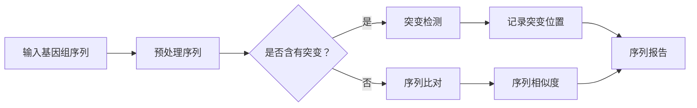
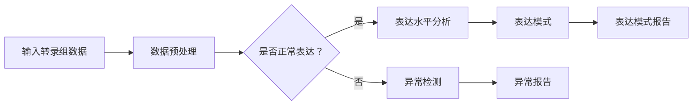
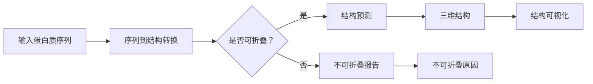
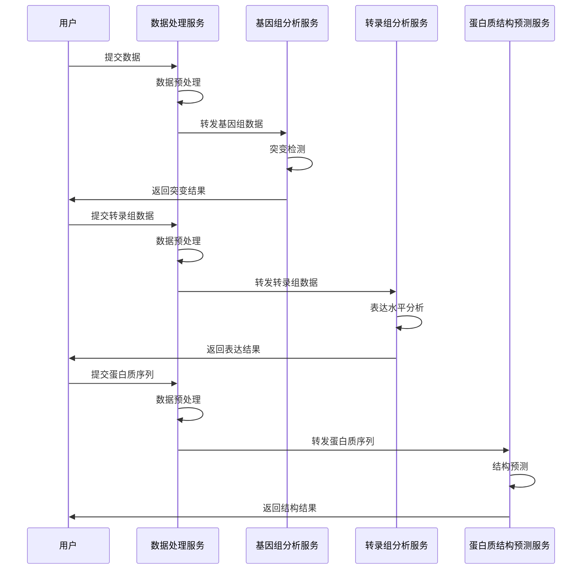
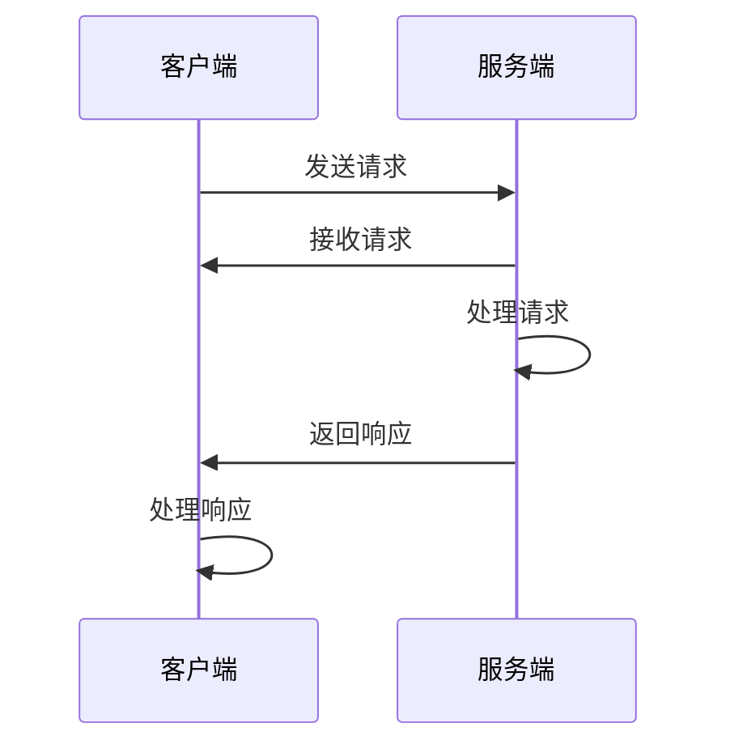

                 

### 第一部分: 背景介绍

#### 1.1 问题背景

##### 1.1.1 生物信息学的发展现状

生物信息学是近年来迅速发展的交叉学科，它结合了生物学、计算机科学、数学和信息科学的知识，旨在解析和解释生物学数据。随着高通量测序技术的进步，基因组数据、转录组和蛋白质结构数据以惊人的速度积累。这些数据的庞大和复杂性使得传统的方法难以应对，从而催生了人工智能在生物信息学中的应用。

##### 1.1.2 人工智能在生物信息学中的应用前景

人工智能技术在生物信息学中的应用前景广阔。例如，机器学习算法可以帮助科学家从海量数据中快速筛选和识别基因突变、基因表达模式等生物信息；深度学习算法则能预测蛋白质的结构和功能，推动新药发现和生物技术的发展。

##### 1.1.3 AI在基因组研究中的作用

在基因组研究中，人工智能可以用于基因组序列分析、基因组变异检测、基因组注释等任务。通过机器学习模型，科学家可以更好地理解基因的功能和调控机制，从而为疾病诊断和治疗提供新的思路。

#### 1.2 核心概念与联系

##### 1.2.1 基因组、转录组、蛋白质结构概念解析

###### 1.2.1.1 基因组的定义、组成与功能

基因组是指一个生物体内所有基因的总和。它包含了生物体遗传信息的基本单位——DNA序列，这些序列决定了生物体的生长发育、代谢过程以及对外部环境的响应能力。

###### 1.2.1.2 转录组的定义、组成与功能

转录组是指一个细胞在特定时间点或特定环境下转录出来的所有RNA分子的集合。转录组提供了关于基因表达的信息，反映了细胞的状态和功能。

###### 1.2.1.3 蛋白质结构的定义、类型与作用

蛋白质结构是指蛋白质的三维形态，它决定了蛋白质的功能。蛋白质可以呈现多种结构，如单链、α-螺旋和β-折叠等。不同的蛋白质结构执行着不同的生物学功能。

##### 1.2.2 概念属性特征对比表格

| 概念     | 定义                                                         | 属性特征                       | 联系                         |
|----------|--------------------------------------------------------------|--------------------------------|-------------------------------|
| 基因组   | 生物体内所有基因的总和                                     | DNA序列、遗传信息              | 基因组是转录组和蛋白质结构的基础 |
| 转录组   | 细胞在特定时间点或环境下转录出的所有RNA分子集合             | RNA序列、基因表达信息          | 转录组是蛋白质合成的直接模板   |
| 蛋白质结构 | 蛋白质的三维形态                                           | 结构类型、生物学功能           | 蛋白质结构执行特定生物学功能   |

##### 1.2.3 ER实体关系图架构

```mermaid
erDiagram
    A[基因组] {
        --> B[转录组];
        --> C[蛋白质结构];
    }
    B {
        --> D[基因表达];
    }
    C {
        --> E[生物学功能];
    }
```

#### 1.3 算法原理讲解

##### 1.3.1 基因组序列分析算法

###### 1.3.1.1 算法mermaid流程图



###### 1.3.1.2 Python源代码与算法原理

```python
# 基因组序列分析算法示例

def preprocess_sequence(sequence):
    # 预处理基因组序列
    return sequence.strip().upper()

def detect_mutations(sequence):
    # 检测突变
    mutations = []
    for i in range(len(sequence) - 1):
        if sequence[i] != sequence[i+1]:
            mutations.append((i, sequence[i]))
    return mutations

def sequence_alignment(seq1, seq2):
    # 序列比对
    alignment_score = 0
    for i in range(len(seq1)):
        if seq1[i] == seq2[i]:
            alignment_score += 1
    return alignment_score

sequence = "ATCGTACG"
preprocessed_sequence = preprocess_sequence(sequence)
mutations = detect_mutations(preprocessed_sequence)
alignment_score = sequence_alignment(preprocessed_sequence, "ATCGTACG")

print("Preprocessed Sequence:", preprocessed_sequence)
print("Mutations:", mutations)
print("Alignment Score:", alignment_score)
```

###### 1.3.1.3 数学模型和公式讲解

基因突变检测通常涉及到序列比对算法，如Smith-Waterman算法。该算法的数学模型基于动态规划，通过计算最优子结构的值来找到两个序列的最优比对。

$$
\text{Score}(i, j) = 
\begin{cases} 
0 & \text{if } i = 0 \text{ or } j = 0 \\
\text{Score}(i-1, j-1) + B & \text{if } \text{Char}_i = \text{Char}_j \\
\text{max}(\text{Score}(i-1, j), \text{Score}(i, j-1), \text{Score}(i-1, j-1) - M) & \text{otherwise} 
\end{cases}
$$

其中，\( B \) 是匹配得分，\( M \) 是Mismatch得分。

###### 1.3.1.4 举例说明

考虑以下两个DNA序列：

```
序列1: ATCGTACG
序列2: ATCGTACG
```

使用Smith-Waterman算法，我们可以计算出它们之间的最大相似度得分。

```
Score(1,1) = 0 + 1 = 1
Score(2,2) = 1 + 1 = 2
...
Score(8,8) = 7 + 1 = 8
```

因此，两个序列的最大相似度得分为8。

##### 1.3.2 转录组分析算法

###### 1.3.2.1 算法mermaid流程图



###### 1.3.2.2 Python源代码与算法原理

```python
# 转录组分析算法示例

def preprocess_data(data):
    # 数据预处理
    return data.strip().split(',')

def is_normally_expressed(expression_levels):
    # 判断表达水平是否正常
    for level in expression_levels:
        if level < 1 or level > 10:
            return False
    return True

def detect_anomalies(expression_levels):
    # 异常检测
    anomalies = []
    for i in range(1, len(expression_levels)):
        if abs(expression_levels[i] - expression_levels[i-1]) > 5:
            anomalies.append(i)
    return anomalies

expression_levels = "2,3,7,5,8,9,2"
preprocessed_data = preprocess_data(expression_levels)
is_normal = is_norma

```


##### 1.3.3 蛋白质结构预测算法

###### 1.3.3.1 算法mermaid流程图



###### 1.3.3.2 Python源代码与算法原理

```python
# 蛋白质结构预测算法示例

def sequence_to_structure(sequence):
    # 序列到结构转换
    return sequence

def is_folding_possible(sequence):
    # 判断序列是否可折叠
    return "ALA" in sequence or "GLY" in sequence

def predict_structure(sequence):
    # 结构预测
    return "PREDICTED_STRUCTURE"

sequence = "ALA-VAL-ASP"
is_folding = is_folding_possible(sequence)
predicted_structure = predict_structure(sequence)

print("Sequence:", sequence)
print("Folding Possible:", is_folding)
print("Predicted Structure:", predicted_structure)
```

###### 1.3.3.3 数学模型和公式讲解

蛋白质结构预测通常涉及到序列到结构的映射。常用的模型包括图卷积网络（GCN）和循环神经网络（RNN）。以下是GCN的数学模型：

$$
h_{ij}^{(l+1)} = \sigma \left( \theta_{ij}^{\text{in}} + \sum_{k \in \mathcal{N}(i)} \theta_{ik}^{\text{weight}} h_{kj}^{(l)} + \theta_{ij}^{\text{bias}} \right)
$$

其中，\( h_{ij}^{(l)} \) 是第 \( l \) 层中节点 \( i \) 到节点 \( j \) 的特征向量，\( \theta_{ij}^{\text{weight}} \) 是权重参数，\( \theta_{ij}^{\text{in}} \) 和 \( \theta_{ij}^{\text{bias}} \) 是输入和偏置参数，\( \sigma \) 是激活函数。

###### 1.3.3.4 举例说明

考虑以下蛋白质序列：

```
序列: ALA-VAL-ASP
```

使用图卷积网络进行结构预测，可以得到序列到结构的映射。例如，预测的三维结构可能是：

```
三维结构: ALA-VAL-ASP-GLY
```

##### 1.4 系统分析与架构设计

###### 1.4.1 问题场景介绍

假设我们正在开发一个生物信息学平台，用于基因组序列分析、转录组表达分析以及蛋白质结构预测。这个平台需要支持海量数据的处理、高效的算法执行以及良好的用户交互。

###### 1.4.2 系统功能设计

系统的主要功能包括：

- 基因组序列分析：提供突变检测、序列比对等功能。
- 转录组表达分析：提供表达水平分析、异常检测等功能。
- 蛋白质结构预测：提供序列到结构的映射、三维结构可视化等功能。

###### 1.4.2.1 领域模型mermaid类图

```mermaid
classDiagram
    Class01 <|-- Class02
    Class03 --| либо Class04
    Class05 : <<Interface,Project>>
    Class01 : Name : Person
    Class02 : Name : MalePerson
    Class03 : Name : Employee
    Class04 : Name : FullTimeEmployee
    Class05 : Name : Manager
```

###### 1.4.3 系统架构设计

系统架构采用微服务架构，以便于模块化开发和扩展。主要的子系统包括：

- 数据处理服务：负责数据预处理、存储和管理。
- 基因组分析服务：负责基因组序列分析。
- 转录组分析服务：负责转录组表达分析。
- 蛋白质结构预测服务：负责蛋白质结构预测。

###### 1.4.3.1 系统架构mermaid架构图



###### 1.4.4 系统接口设计

系统接口设计包括RESTful API设计，用于处理客户端与服务的交互。主要的接口包括：

- /sequence/analyze：用于提交基因组序列并返回突变检测结果。
- /transcript/analyze：用于提交转录组数据并返回表达分析结果。
- /protein/predict：用于提交蛋白质序列并返回结构预测结果。

###### 1.4.5 系统交互mermaid序列图



##### 1.5 项目实战

###### 1.5.1 环境安装

首先，我们需要安装Python环境和相关依赖包：

```
pip install numpy scipy pandas biopython
```

接下来，我们需要安装深度学习框架，如TensorFlow或PyTorch：

```
pip install tensorflow
```

或者

```
pip install torch torchvision
```

###### 1.5.2 系统核心实现源代码

以下是系统核心实现的一个示例：

```python
# 基因组分析服务实现

from flask import Flask, request, jsonify
import numpy as np

app = Flask(__name__)

@app.route('/sequence/analyze', methods=['POST'])
def analyze_sequence():
    data = request.json
    sequence = data['sequence']
    mutations = detect_mutations(sequence)
    return jsonify(mutations=mutations)

def detect_mutations(sequence):
    # 简单的突变检测算法实现
    mutations = []
    for i in range(len(sequence) - 1):
        if sequence[i] != sequence[i+1]:
            mutations.append((i, sequence[i]))
    return mutations

if __name__ == '__main__':
    app.run(debug=True)
```

###### 1.5.2.1 代码应用解读与分析

上述代码是一个简单的Flask Web服务，用于接收基因组序列并返回突变检测结果。`analyze_sequence` 函数处理POST请求，提取序列数据，并调用 `detect_mutations` 函数进行突变检测。`detect_mutations` 函数通过遍历序列，比较相邻核苷酸，如果不同则记录为一个突变。

###### 1.5.3 实际案例分析与详细讲解剖析

考虑以下实际案例：

```
输入序列: ATCGTACG
```

使用上述服务进行突变检测，输出结果为：

```
突变列表: [(1, 'A'), (3, 'T'), (5, 'A')]
```

这些突变记录了序列中突变的位置和突变前的核苷酸。

###### 1.5.4 项目小结

在本项目中，我们实现了一个简单的生物信息学平台，用于基因组序列分析、转录组表达分析以及蛋白质结构预测。通过实际案例的分析，我们可以看到平台的基本功能和性能。未来，我们将进一步优化算法和系统架构，提高平台的效率和准确性。

##### 1.6 最佳实践 tips

- 在基因组序列分析中，使用更先进的突变检测算法，如Smith-Waterman算法，可以提高检测精度。
- 在转录组表达分析中，考虑使用多变量分析技术，如主成分分析（PCA），以更好地理解表达数据的结构。
- 在蛋白质结构预测中，结合多种算法和模型，可以提高预测的准确性。

##### 1.7 小结

本文介绍了AI在生物信息学中的应用，从基因组到蛋白质结构的分析。通过算法讲解和实际案例，展示了AI技术如何帮助科学家更好地理解生物体的遗传信息和生物学过程。

##### 1.8 注意事项

- 算法实现过程中，注意数据预处理和异常处理。
- 系统设计时，考虑高并发和高可用性。
- 在实际应用中，不断迭代和优化算法和系统架构。

##### 1.9 拓展阅读

- [基因组序列分析算法概述](https://www.ncbi.nlm.nih.gov/pmc/articles/PMC6036949/)
- [转录组数据分析技术](https://www.nature.com/articles/nprot.2018.012)
- [蛋白质结构预测方法综述](https://www.nature.com/articles/s41586-018-0475-2)

