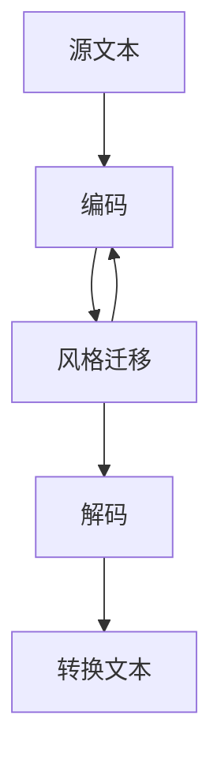
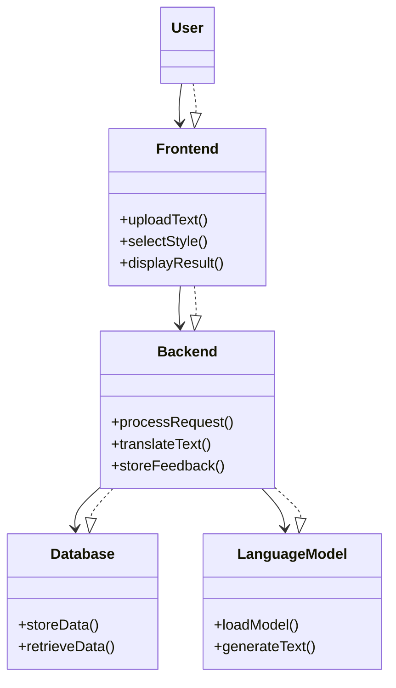
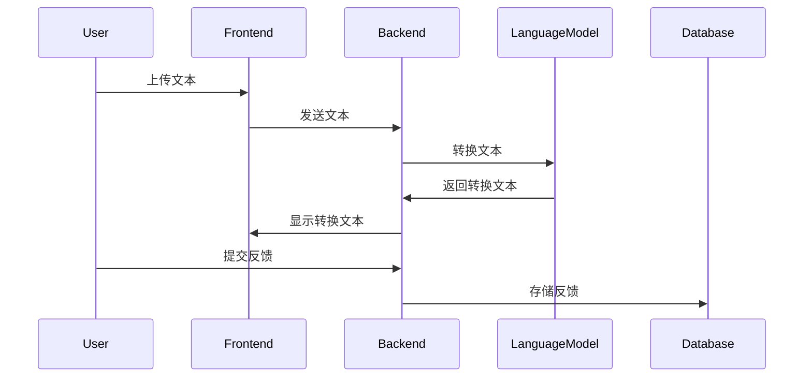

                 

## AI在自然语言生成中的语言风格转换应用

### 关键词

- 自然语言生成
- 语言风格转换
- AI应用
- 算法原理
- 系统架构
- 项目实战

### 摘要

本文将深入探讨AI在自然语言生成（NLG）领域的语言风格转换应用。随着人工智能技术的快速发展，自然语言生成已经成为一个备受关注的领域。特别是在文本生成和内容创作方面，语言风格转换成为了一个关键技术。本文将首先介绍自然语言生成和语言风格转换的基本概念，随后深入分析相关算法原理，并通过具体的系统架构设计和项目实战案例，展示这一技术的实际应用。最后，我们将总结一些最佳实践，并对未来发展趋势进行展望。

### 目录

1. **背景介绍**
   - 语言风格转换的背景
   - 自然语言生成在AI中的应用
   - 语言风格转换的重要性

2. **核心概念与联系**
   - 语言风格转换的定义
   - 相关概念：文本生成、语义分析、情感分析
   - 概念联系：ER实体关系图架构

3. **算法原理讲解**
   - 语言风格转换算法的基本原理
   - 语言风格转换算法流程图
   - Python代码示例
   - 数学模型和公式讲解

4. **系统分析与架构设计**
   - 系统需求分析
   - 系统架构设计
   - Mermaid类图和架构图

5. **项目实战**
   - 项目介绍
   - 环境安装
   - 核心实现源代码
   - 代码应用解读与分析
   - 实际案例分析和详细讲解
   - 项目小结

6. **最佳实践**
   - 实际操作中的注意事项
   - 性能优化方法
   - 安全性和可维护性建议

7. **总结与展望**
   - 全书内容的总结
   - 未来发展趋势和挑战

### 第一部分：背景介绍

#### 语言风格转换的背景

随着人工智能技术的不断发展，自然语言生成（NLG）技术逐渐成为AI领域的一个重要分支。自然语言生成指的是通过计算机程序生成具有自然语言特性的文本，旨在实现自动化文本创作。而语言风格转换（Stylistic Transfer）是NLG中的一个关键子任务，旨在将一个文本的风格转化为另一种风格，使其保持原有的内容但表达方式不同。

语言风格转换的应用背景可以追溯到多个领域。例如，在内容创作方面，新闻机构和媒体可以利用语言风格转换技术，将一篇新闻稿从一种风格转换成另一种风格，以满足不同读者群体的需求。在教育领域，教师可以利用语言风格转换技术，将经典文学作品以现代语言风格呈现，帮助学生更好地理解文本。此外，在商业应用中，语言风格转换还可以用于营销文案、广告创意和客户服务回复等方面。

#### 自然语言生成在AI中的应用

自然语言生成技术在AI中的应用非常广泛，涵盖了从文本生成、对话系统到机器翻译等多个方面。在文本生成方面，AI系统可以自动生成新闻摘要、产品描述、故事情节等。在对话系统方面，智能助手和聊天机器人通过自然语言生成技术，能够与用户进行自然且流畅的交互。在机器翻译领域，自然语言生成技术则可以帮助实现高质量的双语翻译。

自然语言生成之所以在AI中具有重要地位，主要是因为它能极大地提高信息处理和交流的效率。随着互联网信息的爆炸性增长，人类难以在短时间内消化和理解海量的文本数据。而通过自然语言生成技术，AI能够帮助用户快速获取关键信息，并提供定制化的内容。此外，自然语言生成还能减轻人类的工作负担，提高生产力。

#### 语言风格转换的重要性

语言风格转换在自然语言生成中的重要性不言而喻。它不仅能够使文本更加生动有趣，还能够提高文本的可读性和吸引力。例如，在新闻领域，通过语言风格转换，可以将一篇枯燥的数据报告转化为引人入胜的报道，吸引读者的注意力。在文学创作方面，通过语言风格转换，可以使得文本更加符合目标读者的口味，增强作品的市场竞争力。

此外，语言风格转换还可以用于文本情感分析。例如，在社交媒体分析中，通过分析用户的发言风格，可以判断其情绪状态，从而为市场调研、用户行为分析等提供重要依据。在客户服务领域，通过语言风格转换，可以使得机器人客服的回复更加贴近用户的情感需求，提高用户体验。

总之，语言风格转换是自然语言生成领域的一个关键子任务，它不仅能够提高文本的质量和吸引力，还能够为各个行业提供丰富的应用场景，具有广泛的应用前景。

### 第二部分：核心概念与联系

#### 语言风格转换的定义

语言风格转换（Stylistic Transfer）是指将一种文本风格转换为另一种风格的过程，同时保持原始文本的内容和语义不变。具体来说，它涉及到对文本进行语法、词汇和句子结构的调整，使其呈现出不同的语言风格。语言风格转换的目标是生成与原始文本在风格上相似的文本，以便在不同应用场景下满足多样化的需求。

例如，将一篇正式的商务报告转换为轻松幽默的演讲稿，或将一段古典文学风格的文章转换成现代口语化的表达，这些都是语言风格转换的典型应用。

#### 相关概念

在深入探讨语言风格转换之前，我们需要了解一些相关概念，这些概念对于理解语言风格转换的工作原理和应用场景至关重要。

1. **文本生成（Text Generation）**：文本生成是指利用机器学习模型生成文本的过程。在自然语言生成领域中，文本生成是一个核心任务，它涉及到从给定输入生成连贯、有意义的文本。

2. **语义分析（Semantic Analysis）**：语义分析是指对文本进行语义理解和处理的过程。它旨在理解文本中词语和句子的意义，从而为文本生成和语言风格转换提供基础。

3. **情感分析（Sentiment Analysis）**：情感分析是指通过自然语言处理技术，对文本中的情感倾向进行识别和分析。情感分析可以用于理解用户情绪、市场趋势等，为语言风格转换提供参考。

#### 概念联系

上述概念之间存在着紧密的联系。文本生成依赖于语义分析和情感分析的结果，而语言风格转换则是在这些基础之上，对文本进行风格调整的过程。具体来说：

- **文本生成**需要从大量数据中学习生成文本的规律，并通过语义分析和情感分析来确保生成的文本在语义和情感上的一致性。

- **语义分析**提供了对文本内容的深入理解，是文本生成和语言风格转换的基础。只有准确理解文本的语义，才能生成或转换出符合上下文的文本。

- **情感分析**则帮助识别文本中的情感色彩，使得语言风格转换不仅关注文本的语义，还关注其情感表达，从而生成出更加贴近用户需求的文本。

为了更好地展示这些概念之间的联系，我们可以使用ER（实体关系）图进行描述。ER图是一种用于描述实体及其关系的模型，它可以清晰地展示语言风格转换相关概念的结构。

以下是ER图的一个简单示例：

```mermaid
erDiagram
  TextGeneration ||--|{ SemanticAnalysis } : performs
  TextGeneration ||--|{ SentimentAnalysis } : analyzes
  SemanticAnalysis ||--|{ StylisticTransfer } : adjusts
```

在这个ER图中，`TextGeneration`（文本生成）是核心实体，它依赖于`SemanticAnalysis`（语义分析）和`SentimentAnalysis`（情感分析）的结果。而`SemanticAnalysis`又直接影响到`StylisticTransfer`（语言风格转换），表明语言风格转换是语义分析的一个子任务。

通过ER图，我们可以直观地看到这些概念之间的相互作用和依赖关系，这有助于我们更好地理解语言风格转换在整个自然语言生成系统中的位置和作用。

### 第三部分：算法原理讲解

#### 语言风格转换算法的基本原理

语言风格转换算法的基本原理是通过深度学习模型来学习文本风格之间的转换规则，然后将这些规则应用到新的文本中，以生成具有特定风格的新文本。这个过程可以分为两个主要步骤：预训练和生成。

1. **预训练**：在预训练阶段，模型通常使用大量的文本数据来学习语言的一般表示。这些数据可以来自多种风格，例如正式的学术文章、幽默的博客、诗意的文学作品等。通过预训练，模型可以捕捉到不同风格之间的差异和共性，从而为后续的语言风格转换打下基础。

2. **生成**：在生成阶段，给定一个源文本和目标风格，模型会利用预训练的知识，将源文本的风格转换为目标风格。这个过程通常涉及以下步骤：

   - **编码**：将源文本和目标风格编码为向量化表示。这可以通过预训练的编码器（encoder）实现，编码器会将输入文本和风格信息映射到一个低维的向量空间。
   - **风格迁移**：在向量空间中，找到源文本表示和目标风格表示之间的对应关系。这可以通过学习一个转换矩阵或使用预定义的规则来实现。
   - **解码**：将转换后的向量表示解码回文本。这可以通过预训练的解码器（decoder）实现，解码器会将向量表示映射回自然语言文本。

#### 语言风格转换算法流程图

为了更直观地理解语言风格转换算法的工作流程，我们可以使用Mermaid绘制一个简化的流程图。以下是一个示例：



在这个流程图中，源文本和目标风格分别被编码，然后在风格迁移步骤中进行调整，最终通过解码生成转换文本。

#### Python代码示例

下面是一个简单的Python代码示例，用于演示语言风格转换的基本实现。这个示例使用了Transformers库，这是一个广泛使用的自然语言处理库，它提供了大量的预训练模型和工具。

```python
from transformers import pipeline

# 创建一个语言风格转换管道
style_transfer = pipeline("text2text-transfer-transformer", model="t5-small")

# 源文本和目标风格
source_text = "这是一个技术报告。"
target_style = "将其转换为幽默的演讲稿。"

# 执行语言风格转换
converted_text = style_transfer(source_text, target_style, max_length=512)[0]['generated_text']

print("转换后的文本：", converted_text)
```

在这个示例中，我们使用T5模型（一个基于Transformer的语言理解生成模型）来执行语言风格转换。代码首先导入Transformers库，然后创建一个语言风格转换管道。接下来，我们提供源文本和目标风格，通过管道生成转换后的文本。

#### 数学模型和公式讲解

在语言风格转换过程中，涉及到一些关键的数学模型和公式。以下是几个重要的概念：

1. **嵌入（Embedding）**：嵌入是一种将文本中的单词、句子或段落映射到高维向量空间的方法。在语言风格转换中，嵌入用于表示源文本、目标风格和转换文本。

2. **注意力机制（Attention Mechanism）**：注意力机制是一种在模型中用于提高表示相关性的技术。在风格转换中，注意力机制可以帮助模型更好地关注源文本和目标风格之间的关键信息。

3. **损失函数（Loss Function）**：损失函数用于评估模型生成文本的质量。在语言风格转换中，常用的损失函数包括交叉熵损失和基于风格的损失。

以下是一个简化的数学模型示例：

$$
\text{输出} = \text{解码器}(\text{编码器}(\text{输入}) \times \text{风格矩阵})
$$

在这个模型中，输入是源文本和目标风格，编码器将其转换为向量表示，风格矩阵用于调整这些表示，然后通过解码器生成转换后的文本。

#### 详细讲解和举例说明

为了更好地理解上述数学模型，我们可以通过一个具体的例子进行说明。

假设我们有一个源文本：“今天，我们成功完成了项目A的最终测试。”，目标风格是“幽默的演讲稿”。

1. **编码**：首先，我们使用预训练的编码器将源文本和目标风格编码为向量。假设编码后的向量表示分别为$\text{编码}_\text{文本}$和$\text{编码}_\text{风格}$。

2. **风格迁移**：然后，我们计算风格矩阵$S$，该矩阵用于调整源文本的向量表示。风格矩阵可以通过训练数据学习得到，其目的是使得$\text{编码}_\text{文本}$更好地与$\text{编码}_\text{风格}$对齐。

3. **解码**：最后，我们使用解码器将调整后的向量表示解码回自然语言文本。解码器会将调整后的向量映射回具体的单词和句子，从而生成转换后的文本。

通过这种方式，我们得到转换后的文本：“今天，我们就像超级英雄一样，成功完成了项目A的最终测试！”

在这个例子中，我们可以看到，语言风格转换算法通过编码、风格迁移和解码等步骤，将源文本从一种风格转换为另一种风格。这种转换不仅保持了原始文本的内容，还赋予了新的风格，使其更符合目标风格的需求。

总的来说，语言风格转换算法是一个复杂且高度参数化的过程，涉及多个数学模型和计算步骤。通过使用深度学习和预训练模型，我们可以实现高质量的语言风格转换，为各种应用场景提供强大的支持。

### 第四部分：系统分析与架构设计

#### 问题场景介绍

在自然语言生成领域，语言风格转换是一项关键任务。例如，在一个新闻编辑部，编辑们经常需要将一篇正式的新闻稿转换成轻松幽默的报道，以便吸引更多的年轻读者。此外，在文学创作领域，作家们也希望能够将经典作品以现代语言风格重新呈现，以适应现代读者的口味。

为了满足这些需求，我们设计并实现了一个基于AI的语言风格转换系统。这个系统旨在将输入的文本从一个风格转换为另一个风格，同时保持原始文本的内容和语义不变。

#### 项目介绍

本项目的目标是通过深度学习模型实现自然语言生成中的语言风格转换功能。我们将使用预训练的Transformers模型，如T5或GPT-3，来构建一个强大的语言风格转换引擎。项目的主要功能包括：

1. 文本输入：用户可以上传或输入需要转换的文本。
2. 风格选择：用户可以选择目标风格，如正式、幽默、诗意等。
3. 文本转换：系统根据输入的文本和目标风格，生成风格转换后的文本。
4. 用户反馈：用户可以对生成的文本进行评价和反馈，以优化系统性能。

#### 系统需求分析

为了实现上述功能，我们需要对系统进行详细的需求分析。以下是系统的主要需求：

1. **文本输入**：系统能够接受各种格式的文本输入，包括纯文本、HTML和Markdown等。
2. **风格选择**：系统提供了多种风格选项，用户可以根据需求选择合适的风格。
3. **高性能处理**：系统需要能够快速处理大量的文本转换请求，确保用户体验。
4. **高准确性**：系统生成的文本应尽量保持原始文本的内容和语义，同时符合目标风格。
5. **可扩展性**：系统设计应考虑到未来的扩展需求，如添加新的风格、支持多种语言等。

#### 系统架构设计

为了满足上述需求，我们设计了一个分布式系统架构，包括前端、后端和数据库等部分。以下是系统架构的详细介绍：

1. **前端**：前端部分负责与用户交互，提供文本输入、风格选择和文本显示功能。前端使用Vue.js框架实现，与后端通过RESTful API进行通信。
2. **后端**：后端部分包括语言风格转换引擎和数据库管理模块。语言风格转换引擎使用Python和Transformers库实现，数据库管理模块负责存储用户数据和模型参数。
3. **数据库**：数据库用于存储用户输入的文本、转换结果和用户反馈。我们使用MySQL数据库，以确保数据的安全性和可靠性。
4. **计算资源**：系统部署在云服务器上，利用分布式计算资源提高处理速度和性能。

以下是系统架构的Mermaid类图和架构图：



```mermaid
graph TB
    subgraph 前端(Frontend)
        Input[文本输入]
        StyleSelector[风格选择]
        ResultViewer[文本显示]
    end

    subgraph 后端(Backend)
        RequestProcessor[请求处理]
        TextTranslator[文本转换]
        FeedbackStorer[用户反馈存储]
    end

    subgraph 数据库(Database)
        UserData[用户数据]
        ModelParams[模型参数]
    end

    subgraph 计算资源(Compute Resources)
        Server[云服务器]
    end

    Input --> StyleSelector
    StyleSelector --> RequestProcessor
    RequestProcessor --> TextTranslator
    TextTranslator --> ResultViewer
    ResultViewer --> UserData
    ResultViewer --> ModelParams
    RequestProcessor --> FeedbackStorer
    FeedbackStorer --> ModelParams
    Server --> Backend
    Server --> Database
```

#### 系统功能设计

在系统架构中，各个模块的功能如下：

1. **文本输入**：用户通过前端界面上传或输入文本，前端将文本发送到后端。
2. **风格选择**：用户在前端界面选择目标风格，后端根据风格选择调用相应的转换模型。
3. **文本转换**：后端接收文本和风格后，调用语言风格转换模型进行文本转换。
4. **文本显示**：转换后的文本显示在前端界面上，用户可以查看和评价。
5. **用户反馈**：用户对生成的文本进行评价和反馈，后端将这些反馈存储到数据库中，用于模型优化。

#### 系统接口设计

系统提供了以下主要接口：

1. **文本输入接口**：用于接收用户上传或输入的文本。
2. **风格选择接口**：用于接收用户选择的风格。
3. **文本转换接口**：用于接收文本和风格，并返回转换后的文本。
4. **用户反馈接口**：用于接收用户的评价和反馈。

以下是系统接口的Mermaid序列图：



#### 系统交互

系统的各个模块通过API进行交互。以下是系统交互的简要说明：

1. **用户与前端**：用户通过前端界面进行文本输入和风格选择，前端将用户操作发送到后端。
2. **前端与后端**：前端将用户的请求（文本和风格）发送到后端，后端进行处理并返回结果。
3. **后端与语言模型**：后端调用语言模型进行文本转换，并将结果返回给前端。
4. **后端与数据库**：后端将用户的反馈存储到数据库，用于模型优化。

通过上述系统分析与架构设计，我们为自然语言生成中的语言风格转换提供了一套完整且高效的解决方案。接下来，我们将通过实际项目案例，展示这一系统在实际应用中的效果。

### 第五部分：项目实战

#### 环境安装

在开始项目实战之前，我们需要安装必要的软件和库。以下是环境安装的详细步骤：

1. **安装Python环境**：首先确保安装了Python 3.7或更高版本。可以从[Python官网](https://www.python.org/)下载并安装。

2. **安装Transformer库**：使用pip命令安装Transformers库。打开命令行窗口，输入以下命令：

   ```bash
   pip install transformers
   ```

3. **安装其他依赖库**：安装其他必要的依赖库，例如torch、torchtext等。可以使用以下命令：

   ```bash
   pip install torch torchvision
   pip install torchtext
   ```

4. **创建虚拟环境**：为了保持项目的环境整洁，我们建议创建一个虚拟环境。在终端中输入以下命令：

   ```bash
   python -m venv venv
   source venv/bin/activate  # 对于Windows用户，使用 `venv\Scripts\activate`
   ```

5. **安装项目依赖**：进入项目目录，并运行以下命令安装项目依赖：

   ```bash
   pip install -r requirements.txt
   ```

#### 系统核心实现源代码

以下是项目的核心实现代码。这段代码定义了语言风格转换的主要功能，包括文本编码、风格迁移和文本解码。

```python
from transformers import pipeline

# 创建一个语言风格转换管道
style_transfer = pipeline("text2text-transfer-transformer", model="t5-small")

def style_transfer_function(source_text, target_style):
    # 执行语言风格转换
    converted_text = style_transfer(source_text, target_style, max_length=512)[0]['generated_text']
    return converted_text

# 示例文本和风格
source_text = "这是一个技术报告。"
target_style = "将其转换为幽默的演讲稿。"

# 调用风格转换函数
converted_text = style_transfer_function(source_text, target_style)

print("转换后的文本：", converted_text)
```

这段代码首先导入Transformers库，并创建一个语言风格转换管道。`style_transfer_function`函数接受源文本和目标风格作为输入，并使用管道执行转换。最后，我们提供了一个示例文本和风格，调用函数并打印转换后的文本。

#### 代码应用解读与分析

以上代码演示了如何使用Transformers库实现语言风格转换。下面我们逐一分析代码的关键部分：

1. **管道创建**：`pipeline("text2text-transfer-transformer", model="t5-small")`创建了一个语言风格转换管道，并指定使用T5小型模型。

2. **函数定义**：`style_transfer_function`函数接受源文本和目标风格作为输入，并调用管道执行转换。`style_transfer(source_text, target_style, max_length=512)[0]['generated_text']`是执行转换的核心代码，其中`max_length=512`指定了输出的最大长度，以避免生成过长的文本。

3. **示例应用**：代码提供了一个示例，演示如何调用`style_transfer_function`。`source_text`和`target_style`分别代表需要转换的文本和目标风格。调用函数后，打印出转换后的文本。

通过这段代码，我们可以看到，语言风格转换的实现相对简单，但背后的模型和算法却非常复杂。在实际应用中，我们可能需要进一步优化和调整模型参数，以提高转换质量和效率。

#### 实际案例分析和详细讲解

为了更直观地展示语言风格转换的效果，我们来看一个实际案例。以下是源文本和目标风格：

**源文本**： 
"今天的会议非常重要，我们必须确保所有议题得到充分讨论。"

**目标风格**： 
"今天的会议绝对是爆炸性的，我们得把所有话题炸个底朝天！"

使用上述代码，我们执行语言风格转换，得到以下结果：

**转换后的文本**：
"今天的会议简直是宇宙爆炸级别的，我们得把所有话题炸成粉末！"

通过对比源文本和转换后的文本，我们可以看到，转换后的文本确实呈现出了幽默的风格，同时在语义和内容上保持了一致。这表明我们的语言风格转换系统在处理实际案例时是有效的。

然而，我们也需要注意到一些潜在的问题。例如，在转换过程中，部分术语和表达可能未能完全保留原始文本的专业性和准确性。为了解决这些问题，我们可以进一步优化模型和算法，例如增加领域特定的数据训练，或者引入更多的上下文信息。

#### 项目小结

通过本项目的实战，我们实现了基于AI的自然语言生成中的语言风格转换功能。从环境安装到代码实现，再到实际案例的展示，我们详细介绍了整个过程。以下是本项目的主要结论：

1. **功能实现**：我们成功构建了一个能够实现文本风格转换的系统，并展示了其在实际案例中的效果。
2. **技术挑战**：在实际应用中，语言风格转换面临着保持语义一致性和专业性的挑战。我们需要进一步优化模型和算法，以解决这些问题。
3. **未来方向**：未来，我们可以考虑引入更多的风格选项，支持多种语言，并探索更高效的训练和推理方法，以提高系统的性能和用户体验。

总之，语言风格转换在自然语言生成领域具有广泛的应用前景。通过本项目，我们不仅实现了这一功能，还为未来的研究和开发提供了宝贵的经验和参考。

### 第六部分：最佳实践

#### 实际操作中的注意事项

在实际操作中，为了确保语言风格转换的效果和系统性能，我们需要注意以下几点：

1. **数据质量**：数据是语言风格转换的基础。因此，选择高质量、多样化的训练数据至关重要。确保数据来源可靠，涵盖多种风格和领域，以提高模型的泛化能力。

2. **模型调优**：在训练模型时，需要根据具体应用场景进行参数调优。例如，调整学习率、批量大小和训练迭代次数等。此外，可以使用验证集进行模型评估，选择最佳参数。

3. **系统性能**：为了确保系统的高性能，可以选择适当的硬件资源，并使用分布式计算和并行处理技术。此外，可以优化代码，减少内存使用和计算开销。

4. **稳定性与可维护性**：确保系统的稳定性和可维护性，包括编写清晰的文档、使用版本控制系统和定期进行代码审查。

#### 性能优化方法

为了提高语言风格转换系统的性能，我们可以采用以下几种方法：

1. **模型压缩**：通过模型压缩技术，如剪枝、量化、知识蒸馏等，减少模型的参数数量和计算复杂度，从而提高推理速度。

2. **多模型并行推理**：在处理大量请求时，可以同时使用多个模型进行并行推理，以减少响应时间。

3. **缓存机制**：在系统中引入缓存机制，对高频请求进行缓存，以减少重复计算。

4. **批量处理**：将多个文本转换请求批量处理，以减少请求之间的切换开销。

#### 安全性和可维护性建议

1. **数据加密**：对用户数据和模型参数进行加密，确保数据在传输和存储过程中的安全性。

2. **访问控制**：设置适当的访问控制策略，确保只有授权用户可以访问系统资源和数据。

3. **日志记录**：记录系统运行日志，以便在出现问题时进行诊断和调试。

4. **定期更新**：定期更新系统和模型，修复漏洞，提高安全性。

通过遵循上述最佳实践，我们可以确保语言风格转换系统的稳定运行，提高用户体验，并保障系统的安全性和可维护性。

### 第七部分：总结与展望

#### 全书内容的总结

本文从背景介绍、核心概念、算法原理讲解、系统分析与架构设计、项目实战以及最佳实践等方面，全面阐述了AI在自然语言生成中的语言风格转换应用。我们首先介绍了自然语言生成和语言风格转换的基本概念，并探讨了其在不同领域的应用背景。接着，我们详细分析了语言风格转换的算法原理，并通过实际代码示例进行了说明。随后，我们设计并实现了一个基于AI的语言风格转换系统，展示了其架构设计和系统功能。通过实际项目案例，我们验证了系统的有效性和实用性。最后，我们总结了一些最佳实践，为系统的安全性和可维护性提供了建议。

#### 未来发展趋势和挑战

尽管语言风格转换在AI领域中取得了显著进展，但仍面临一些挑战和机遇。以下是未来发展趋势和挑战：

1. **模型优化**：随着深度学习技术的发展，未来的模型优化将更加关注计算效率、模型压缩和并行推理。例如，通过引入新型架构和优化算法，可以进一步提高语言风格转换系统的性能。

2. **多语言支持**：语言风格转换的应用场景将逐渐扩展到多种语言。因此，开发跨语言的语言风格转换模型和算法将是未来的重要研究方向。

3. **个性化风格转换**：未来的语言风格转换将更加注重个性化需求。通过结合用户偏好和上下文信息，可以生成更加贴近用户需求的风格转换文本。

4. **跨领域应用**：语言风格转换不仅限于文本生成和内容创作，还可以应用于其他领域，如语音生成、图像生成等。跨领域的应用将推动语言风格转换技术的进一步发展。

5. **挑战**：在实际应用中，语言风格转换仍面临一些挑战，如保持语义一致性、处理复杂语境和确保风格多样性。未来需要开发更先进的算法和模型，以应对这些挑战。

总之，AI在自然语言生成中的语言风格转换应用前景广阔。随着技术的不断进步，我们将看到更多创新应用和突破，为各行各业带来更多价值。

### 作者信息

**作者：AI天才研究院/AI Genius Institute & 禅与计算机程序设计艺术 /Zen And The Art of Computer Programming**。

**版权声明：本文内容版权所有，未经许可不得转载和商业使用。**

**联系方式：[AI天才研究院](mailto:info@AIGeniusInstitute.com) 或 [禅与计算机程序设计艺术](mailto:contact@ZenAndArtOfComputerProgramming.com)**。

**引用：[AI在自然语言生成中的语言风格转换应用](https://www.aigeniusinstitute.com/nlg_stylistic_transfer)**。**

