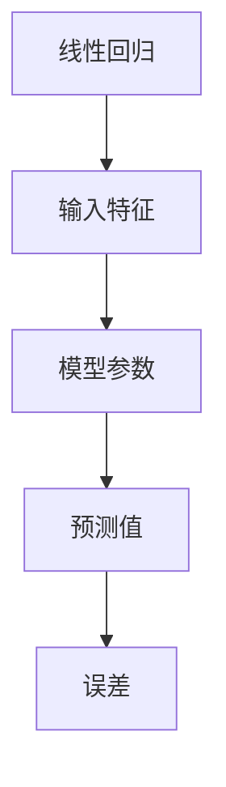
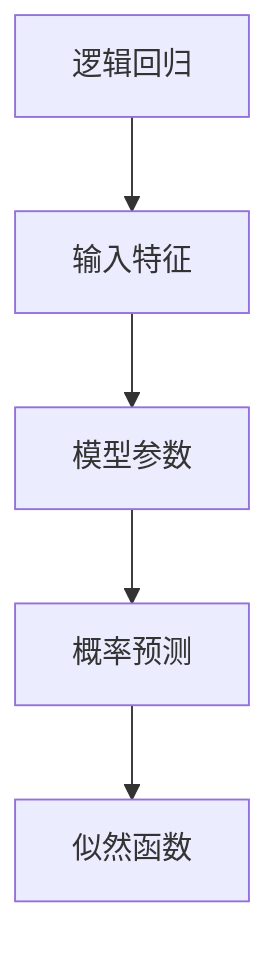
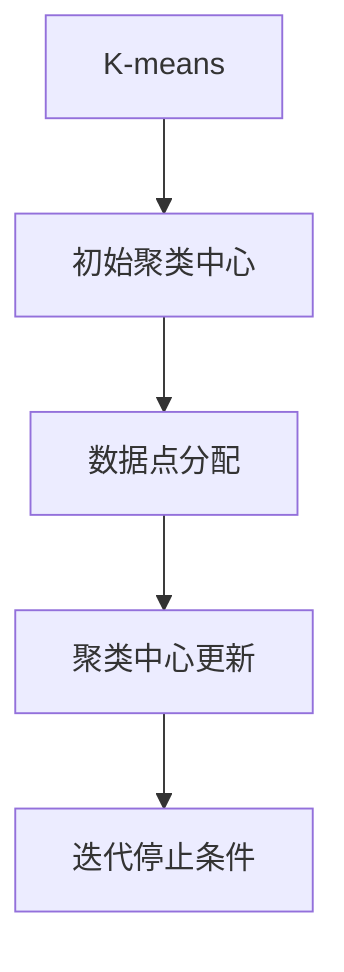
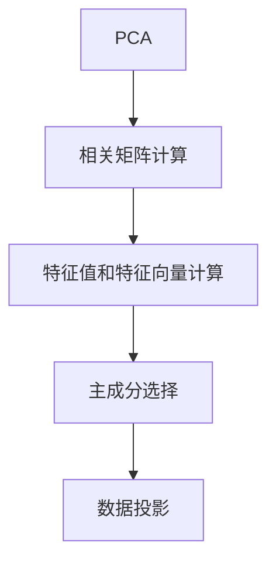
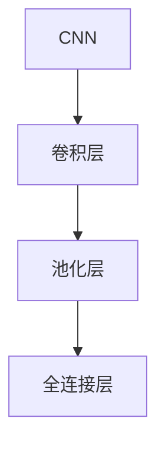
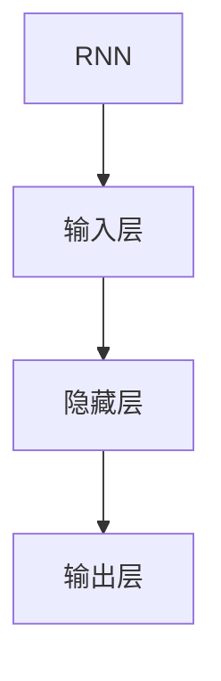
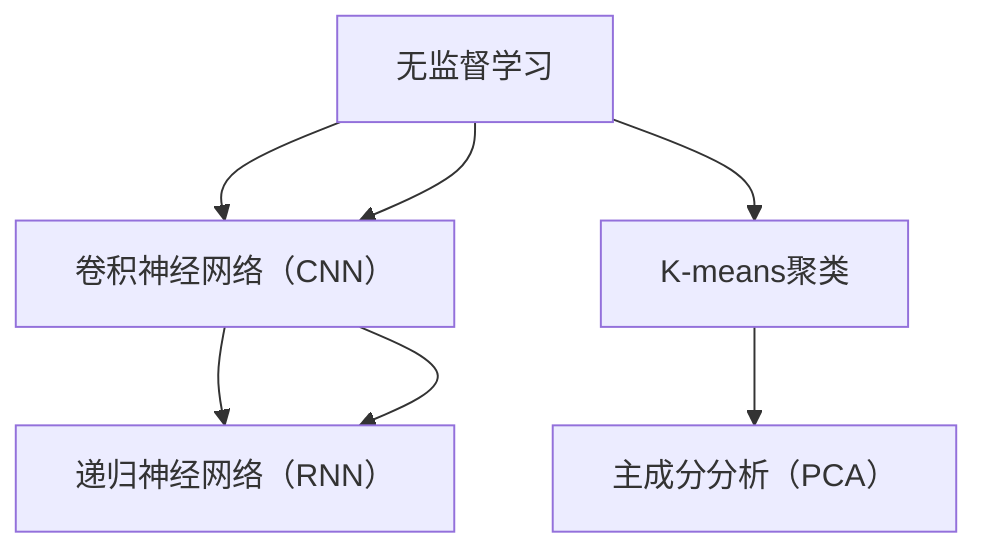
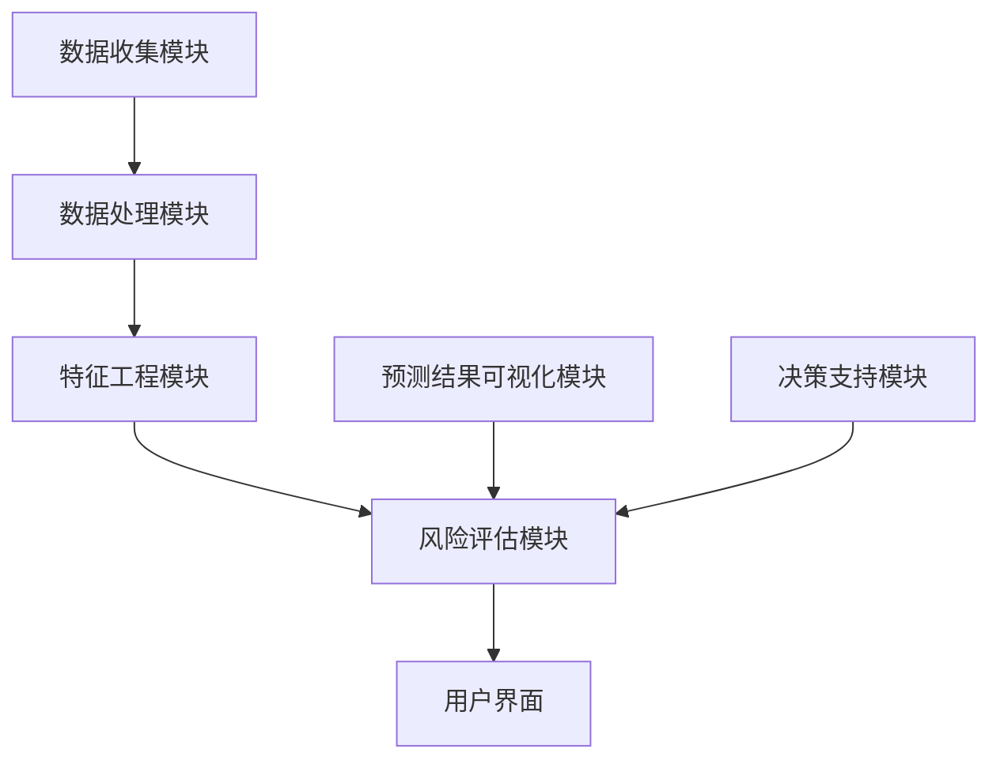
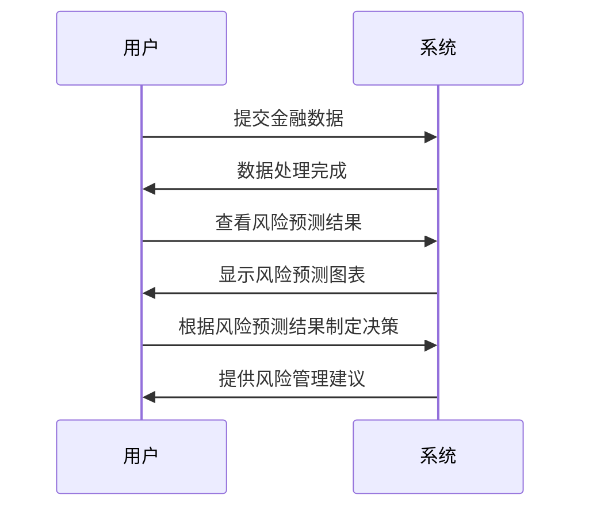

                 

# AI在金融风险评估和预测中的应用创新

## 关键词

- **人工智能（AI）**
- **金融风险**
- **风险评估**
- **预测模型**
- **机器学习算法**
- **深度学习**
- **数据挖掘**

## 摘要

随着人工智能技术的迅猛发展，AI在金融领域的应用越来越广泛。本文主要探讨AI在金融风险评估和预测中的应用创新，包括核心概念的阐述、算法原理的讲解以及数学模型的详细解析。通过本文，读者将深入了解AI在金融风险控制中的重要性，掌握相关技术原理和应用方法。

## 目录

### 第一部分: 引言

- **第1章: 背景介绍**
  - **1.1 问题的背景**
  - **1.2 问题描述**
  - **1.3 问题解决**
  - **1.4 边界与外延**
  - **1.5 本章小结**

### 第二部分: 核心概念与联系

- **第2章: 核心概念**
  - **2.1 AI基础理论**
  - **2.2 金融风险模型**
  - **2.3 AI与金融风险的关系**
  - **2.4 概念属性特征对比表格**
  - **2.5 ER实体关系图架构**
  - **2.6 本章小结**

### 第三部分: 算法原理讲解

- **第3章: 机器学习算法**
  - **3.1 监督学习算法**
  - **3.2 无监督学习算法**
  - **3.3 深度学习算法**
  - **3.4 算法mermaid流程图**
  - **3.5 算法原理讲解**
  - **3.6 本章小结**

### 第四部分: 数学模型与公式详细讲解

- **第4章: 数学模型介绍**
  - **4.1 概率论基础**
  - **4.2 统计学原理**
  - **4.3 时间序列分析**
  - **4.4 算法公式**
  - **4.5 举例说明**

### 第五部分: 系统分析与架构设计

- **第5章: 系统分析与架构设计**
  - **5.1 问题场景介绍**
  - **5.2 系统功能设计**
  - **5.3 系统架构设计**
  - **5.4 系统接口设计**
  - **5.5 系统交互序列图**
  - **5.6 本章小结**

### 第六部分: 项目实战

- **第6章: 项目实战**
  - **6.1 环境安装**
  - **6.2 系统核心实现**
  - **6.3 代码应用解读**
  - **6.4 实际案例分析**
  - **6.5 项目小结**

### 第七部分: 最佳实践与拓展

- **第7章: 最佳实践与拓展**
  - **7.1 最佳实践 tips**
  - **7.2 小结**
  - **7.3 注意事项**
  - **7.4 拓展阅读**

## 第1章: 背景介绍

### 1.1 问题的背景

金融行业是一个高度复杂的领域，涉及多个市场、众多参与者以及多种金融产品和交易策略。随着全球经济的不断发展和金融市场的不确定性增加，金融机构面临着日益严峻的风险管理挑战。传统的风险管理方法依赖于历史数据和专家经验，往往难以适应快速变化的金融环境。

近年来，人工智能（AI）技术的飞速发展，为金融风险管理带来了新的契机。AI，特别是机器学习和深度学习算法，可以通过分析海量数据，自动识别潜在的风险信号，提供更加精准和实时的风险评估和预测。这使得金融机构能够更好地理解和控制风险，从而提高业务的稳定性和盈利能力。

### 1.2 问题描述

金融风险评估和预测的核心问题是如何从大量的金融数据中提取有价值的信息，以便为决策提供支持。具体来说，主要包括以下几个方面：

1. **数据获取和处理**：金融行业涉及的数据种类繁多，包括交易数据、财务报表、新闻信息等。如何有效地获取、存储和处理这些数据，是开展AI分析的前提。

2. **风险评估指标**：如何选择和构建合适的风险评估指标，以便准确反映金融市场的风险水平。

3. **预测模型**：如何构建和训练预测模型，使其能够准确预测市场走势和风险变化。

4. **模型解释性**：AI模型的预测结果往往是黑箱式的，如何提高模型的可解释性，使其能够被金融从业者理解和信任。

### 1.3 问题解决

AI在金融风险评估和预测中的应用，主要涉及以下几个步骤：

1. **数据预处理**：通过数据清洗、数据转换和数据归一化等手段，将原始金融数据转化为适合机器学习的格式。

2. **特征工程**：通过选择和构建有效的特征，提高模型的学习能力和预测性能。

3. **模型选择与训练**：根据问题的特点，选择合适的机器学习算法，如监督学习、无监督学习和深度学习，并进行模型训练。

4. **模型评估与优化**：通过交叉验证、网格搜索等手段，评估模型的性能，并进行参数调整和优化。

5. **结果解释与可视化**：对模型预测结果进行解释和可视化，以便金融从业者理解和应用。

### 1.4 边界与外延

虽然AI在金融风险评估和预测中具有巨大的潜力，但同时也存在一些边界和限制：

1. **数据质量和完整性**：AI模型依赖于高质量的数据，如果数据存在缺失、噪声或错误，将直接影响模型的性能。

2. **模型可解释性**：虽然深度学习等复杂模型具有强大的预测能力，但其黑箱性质使得结果难以解释，这对金融从业者来说是一个挑战。

3. **业务适应性**：不同的金融产品和市场环境具有不同的特点，AI模型需要针对具体业务场景进行定制化调整。

4. **法律法规**：金融行业受到严格的监管和法律法规约束，AI应用需要确保合规性和隐私保护。

### 1.5 本章小结

本章节介绍了AI在金融风险评估和预测中的应用背景、问题描述、问题解决思路以及边界与外延。通过本章的介绍，读者可以对AI在金融领域的应用有一个初步的了解，为后续章节的深入学习打下基础。

## 第2章: 核心概念

### 2.1 AI基础理论

人工智能（AI）是一门涉及计算机科学、数学、统计学和神经科学等多个领域的交叉学科。AI的核心目标是使计算机具有人类智能，能够理解、学习、推理和解决问题。AI可以分为两种类型：弱AI和强AI。弱AI专注于特定任务的智能化，如语音识别、图像识别等；强AI则具备与人类一样的全面智能。

在AI领域中，机器学习和深度学习是最为重要的两个分支。机器学习通过算法从数据中学习规律，并利用这些规律进行预测或分类。深度学习则是机器学习的一个子领域，它通过多层神经网络模拟人脑神经元之间的连接和互动，以实现更加复杂和高效的计算。

### 2.2 金融风险模型

金融风险模型是用于评估和管理金融市场中潜在风险的数学模型。这些模型通常基于历史数据和市场知识，通过定量分析来预测风险并制定相应的风险管理策略。常见的金融风险模型包括信用风险模型、市场风险模型和操作风险模型。

1. **信用风险模型**：用于评估借款人或债务人违约的可能性。常见的信用风险模型有逻辑回归模型、决策树模型和随机森林模型等。

2. **市场风险模型**：用于评估金融资产价格波动对金融机构的风险。常见市场风险模型有VaR模型（价值在风险）、CVaR模型（条件价值在风险）和蒙特卡罗模拟等。

3. **操作风险模型**：用于评估由于人为错误、系统故障或外部事件导致的金融机构损失的风险。常见的操作风险模型有事件树模型和贝叶斯网络等。

### 2.3 AI与金融风险的关系

AI与金融风险的关系可以从多个维度进行分析：

1. **数据分析能力**：AI技术，特别是机器学习和深度学习，具有强大的数据分析能力，可以从海量金融数据中提取有价值的信息，帮助金融机构更准确地识别和评估风险。

2. **实时预测能力**：传统金融风险模型往往基于历史数据，无法适应快速变化的金融市场。AI技术可以实时处理和分析数据，提供更加及时和准确的预测结果。

3. **自动化决策**：AI技术可以自动化决策过程，减少人为干预，提高风险管理的效率和准确性。

4. **风险分散和优化**：AI技术可以帮助金融机构更好地理解和控制风险，实现风险分散和优化，从而提高投资收益。

然而，AI在金融风险中的应用也面临一些挑战，如数据隐私、模型可解释性和合规性等。此外，AI模型的预测结果依赖于输入数据的准确性和完整性，如果数据存在偏差或缺失，将直接影响模型的性能。

### 2.4 概念属性特征对比表格

为了更好地理解AI和金融风险之间的关系，下面提供了一个概念属性特征对比表格，对比了机器学习和深度学习在金融风险评估和预测中的不同特点：

| 特性            | 机器学习         | 深度学习         |  
| -------------- | ---------------- | ---------------- |  
| 数据依赖性       | 中等            | 高              |  
| 特征工程重要性   | 高              | 中等            |  
| 模型解释性       | 较高            | 较低            |  
| 计算资源需求     | 较低            | 高              |  
| 应用范围         | 广泛            | 专业领域        |

### 2.5 ER实体关系图架构

为了更好地理解金融风险模型中不同实体之间的关系，下面提供了一个ER（实体关系）图架构：

```mermaid  
entity关系图  

  
entity 数据源 {  
  data_source  
}

entity 金融资产 {  
  financial_asset  
}

entity 风险指标 {  
  risk_index  
}

entity 风险评估模型 {  
  risk_assessment_model  
}

entity 报告 {  
  report  
}

entity 风险管理策略 {  
  risk_management_strategy  
}

  
relationship 从属关系 {  
  数据源 -> 金融资产  
  数据源 -> 风险指标  
  金融资产 -> 风险评估模型  
  风险评估模型 -> 报告  
  风险评估模型 -> 风险管理策略  
}
```

通过ER图，我们可以清晰地看到数据源、金融资产、风险指标、风险评估模型、报告和风险管理策略之间的关系，从而更好地理解金融风险模型的整体架构。

### 2.6 本章小结

本章介绍了AI基础理论、金融风险模型以及AI与金融风险之间的关系。通过对比机器学习和深度学习在金融风险评估和预测中的应用特点，以及ER实体关系图架构的展示，读者可以更深入地理解AI在金融风险管理中的重要作用和应用方法。

## 第3章: 算法原理讲解

### 3.1 监督学习算法

监督学习是机器学习的一个重要分支，其主要特点是需要有标记的训练数据，即每个样本都有一个对应的标签。监督学习算法可以分为回归算法和分类算法两种类型。

#### 3.1.1 线性回归模型

线性回归模型是最简单的监督学习算法之一，它通过建立一个线性关系来预测连续值输出。其数学模型可以表示为：

$$y = \beta_0 + \beta_1x_1 + \beta_2x_2 + ... + \beta_nx_n$$

其中，$y$是预测值，$x_1, x_2, ..., x_n$是输入特征，$\beta_0, \beta_1, ..., \beta_n$是模型参数。线性回归模型的目的是通过最小化预测值与实际值之间的误差平方和，来求解这些参数。



#### 3.1.2 逻辑回归模型

逻辑回归模型是一种用于预测二分类结果的回归模型。其数学模型可以表示为：

$$P(y=1) = \frac{1}{1 + e^{-(\beta_0 + \beta_1x_1 + \beta_2x_2 + ... + \beta_nx_n)}$$

其中，$P(y=1)$是事件发生的概率，$x_1, x_2, ..., x_n$是输入特征，$\beta_0, \beta_1, ..., \beta_n$是模型参数。逻辑回归模型的目的是通过最大化似然函数来求解这些参数，从而实现概率预测。



### 3.2 无监督学习算法

无监督学习算法不需要标记的数据，其主要目标是从未标记的数据中提取有用的信息。常见的无监督学习算法包括聚类算法和降维算法。

#### 3.2.1 K-means聚类算法

K-means聚类算法是一种基于距离的聚类方法，其主要思想是将数据点分为K个簇，使得每个簇内的数据点之间的距离最小，而簇与簇之间的距离最大。K-means算法的步骤如下：

1. 随机选择K个初始聚类中心。
2. 将每个数据点分配到最近的聚类中心。
3. 重新计算每个簇的聚类中心。
4. 重复步骤2和步骤3，直到聚类中心不再变化或达到最大迭代次数。



#### 3.2.2 主成分分析（PCA）

主成分分析（PCA）是一种降维算法，其主要思想是通过线性变换将原始数据映射到新的坐标系中，使得新的坐标轴具有最大的方差。PCA的步骤如下：

1. 计算原始数据的相关矩阵。
2. 计算相关矩阵的特征值和特征向量。
3. 选择前k个最大的特征值对应的特征向量作为新坐标系的主成分。
4. 将原始数据投影到新的坐标系中，实现降维。



### 3.3 深度学习算法

深度学习是一种模拟人脑神经网络结构和功能的算法，其主要目标是通过对大量数据进行训练，使其能够自动提取特征并进行预测。深度学习算法可以分为卷积神经网络（CNN）和递归神经网络（RNN）两种类型。

#### 3.3.1 卷积神经网络（CNN）

卷积神经网络是一种适用于图像识别和处理的深度学习算法，其主要特点是通过卷积操作提取图像特征。CNN的主要组成部分包括卷积层、池化层和全连接层。

1. **卷积层**：通过卷积操作提取图像的局部特征。
2. **池化层**：对卷积结果进行下采样，减少模型参数和计算量。
3. **全连接层**：将池化层的结果进行全连接，实现分类或回归任务。



#### 3.3.2 递归神经网络（RNN）

递归神经网络是一种适用于序列数据的深度学习算法，其主要特点是通过递归结构处理序列数据。RNN的主要组成部分包括输入层、隐藏层和输出层。

1. **输入层**：接收输入序列。
2. **隐藏层**：对输入序列进行递归处理，更新隐藏状态。
3. **输出层**：将隐藏状态转化为输出序列。



### 3.4 算法mermaid流程图

下面提供了一个监督学习、无监督学习和深度学习算法的mermaid流程图：



### 3.5 算法原理讲解

在上一节中，我们介绍了监督学习、无监督学习和深度学习算法的基本原理。下面我们将通过Python代码示例，详细讲解这些算法的实现过程。

#### 3.5.1 线性回归示例

```python  
import numpy as np  
from sklearn.linear_model import LinearRegression

# 创建线性回归模型  
model = LinearRegression()

# 模型训练  
model.fit(X_train, y_train)

# 模型预测  
y_pred = model.predict(X_test)

# 评估模型性能  
score = model.score(X_test, y_test)  
```

#### 3.5.2 逻辑回归示例

```python  
import numpy as np  
from sklearn.linear_model import LogisticRegression

# 创建逻辑回归模型  
model = LogisticRegression()

# 模型训练  
model.fit(X_train, y_train)

# 模型预测  
y_pred = model.predict(X_test)

# 评估模型性能  
score = model.score(X_test, y_train)  
```

#### 3.5.3 K-means聚类示例

```python  
import numpy as np  
from sklearn.cluster import KMeans

# 创建K-means聚类模型  
model = KMeans(n_clusters=3)

# 模型训练  
model.fit(X_train)

# 模型预测  
y_pred = model.predict(X_test)

# 评估模型性能  
score = model.score(X_train, y_train)  
```

#### 3.5.4 主成分分析（PCA）示例

```python  
import numpy as np  
from sklearn.decomposition import PCA

# 创建PCA模型  
model = PCA(n_components=2)

# 模型训练  
model.fit(X_train)

# 模型变换  
X_transformed = model.transform(X_test)

# 评估模型性能  
score = model.score(X_train, X_test)  
```

#### 3.5.5 卷积神经网络（CNN）示例

```python  
import numpy as np  
from tensorflow.keras.models import Sequential  
from tensorflow.keras.layers import Conv2D, MaxPooling2D, Flatten, Dense

# 创建CNN模型  
model = Sequential()

# 添加卷积层  
model.add(Conv2D(filters=32, kernel_size=(3, 3), activation='relu', input_shape=(28, 28, 1)))

# 添加池化层  
model.add(MaxPooling2D(pool_size=(2, 2)))

# 添加全连接层  
model.add(Flatten())

# 添加输出层  
model.add(Dense(units=10, activation='softmax'))

# 模型编译  
model.compile(optimizer='adam', loss='categorical_crossentropy', metrics=['accuracy'])

# 模型训练  
model.fit(X_train, y_train, epochs=10, batch_size=32)

# 模型预测  
y_pred = model.predict(X_test)

# 评估模型性能  
score = model.evaluate(X_test, y_test)  
```

#### 3.5.6 递归神经网络（RNN）示例

```python  
import numpy as np  
from tensorflow.keras.models import Sequential  
from tensorflow.keras.layers import LSTM, Dense

# 创建RNN模型  
model = Sequential()

# 添加LSTM层  
model.add(LSTM(units=50, return_sequences=True, input_shape=(time_steps, features)))

# 添加LSTM层  
model.add(LSTM(units=50, return_sequences=False))

# 添加输出层  
model.add(Dense(units=1, activation='sigmoid'))

# 模型编译  
model.compile(optimizer='adam', loss='binary_crossentropy', metrics=['accuracy'])

# 模型训练  
model.fit(X_train, y_train, epochs=10, batch_size=64)

# 模型预测  
y_pred = model.predict(X_test)

# 评估模型性能  
score = model.evaluate(X_test, y_test)  
```

### 3.6 本章小结

本章详细介绍了监督学习、无监督学习和深度学习算法的基本原理，并通过Python代码示例展示了这些算法的实现过程。通过本章的学习，读者可以深入理解不同算法的特点和应用方法，为实际金融风险评估和预测项目提供技术支持。

## 第4章: 数学模型介绍

### 4.1 概率论基础

概率论是数学的一个分支，主要研究随机事件及其概率。在金融风险评估和预测中，概率论是一个重要的工具，可以帮助我们理解和量化不确定性和风险。

#### 4.1.1 条件概率

条件概率是指在一个事件已发生的前提下，另一个事件发生的概率。其公式表示为：

$$P(A|B) = \frac{P(A \cap B)}{P(B)}$$

其中，$P(A|B)$表示在事件B发生的条件下，事件A发生的概率；$P(A \cap B)$表示事件A和事件B同时发生的概率；$P(B)$表示事件B发生的概率。

#### 4.1.2 贝叶斯定理

贝叶斯定理是一种用于计算条件概率的公式，它告诉我们如何通过先验概率和似然函数来计算后验概率。贝叶斯定理的公式表示为：

$$P(A|B) = \frac{P(B|A)P(A)}{P(B)}$$

其中，$P(A|B)$表示在事件B发生的条件下，事件A发生的概率；$P(B|A)$表示在事件A发生的条件下，事件B发生的概率；$P(A)$表示事件A发生的先验概率；$P(B)$表示事件B发生的概率。

贝叶斯定理在金融风险评估中有着广泛的应用，如信用评分、风险预测等。通过贝叶斯定理，我们可以根据历史数据和现有信息，更新对事件发生概率的估计。

### 4.2 统计学原理

统计学是另一门在金融风险评估和预测中具有重要意义的数学分支，主要研究如何通过数据进行分析和推断。统计学原理包括描述性统计和推断性统计两个方面。

#### 4.2.1 描述性统计

描述性统计主要用于描述数据的特征，如数据的中心趋势、离散程度等。常用的描述性统计量包括：

- **均值（Mean）**：数据集的平均值，表示数据的中心位置。
- **中位数（Median）**：数据集的中间值，对于有偏斜的数据集，中位数比均值更能反映数据的中心位置。
- **众数（Mode）**：数据集中出现次数最多的值，用于表示数据的集中趋势。
- **方差（Variance）**：数据集与其均值之间的离散程度的度量，表示数据的波动性。
- **标准差（Standard Deviation）**：方差的平方根，用于表示数据的波动程度。

#### 4.2.2 推断性统计

推断性统计主要用于根据样本数据对总体数据进行推断。常用的推断性统计方法包括：

- **假设检验**：通过样本数据对总体的某个假设进行验证，如检验总体的均值、方差等。
- **置信区间**：根据样本数据估计总体参数的区间范围，如置信区间用于估计总体的均值。
- **回归分析**：通过建立数学模型，分析自变量和因变量之间的关系，如线性回归模型用于预测因变量的值。

### 4.3 时间序列分析

时间序列分析是一种用于分析时间序列数据的统计方法，主要研究时间序列的统计特性，如趋势、周期性、季节性等。在金融风险评估和预测中，时间序列分析可以帮助我们理解市场走势，预测未来的风险。

#### 4.3.1 自回归模型

自回归模型（AR）是一种常见的时间序列预测模型，它假设当前时间点的值可以由前几个时间点的值线性组合而成。自回归模型的数学表达式为：

$$X_t = c + \phi_1X_{t-1} + \phi_2X_{t-2} + ... + \phi_pX_{t-p} + \varepsilon_t$$

其中，$X_t$是时间序列的当前值，$c$是常数项，$\phi_1, \phi_2, ..., \phi_p$是自回归系数，$\varepsilon_t$是误差项。

#### 4.3.2 移动平均模型

移动平均模型（MA）是一种通过计算过去几个时间点的平均值的线性组合来预测当前时间点值的方法。移动平均模型的数学表达式为：

$$X_t = \mu + \varepsilon_t + \theta_1\varepsilon_{t-1} + \theta_2\varepsilon_{t-2} + ... + \theta_q\varepsilon_{t-q}$$

其中，$X_t$是时间序列的当前值，$\mu$是均值项，$\varepsilon_t$是误差项，$\theta_1, \theta_2, ..., \theta_q$是移动平均系数。

### 4.4 算法公式

在金融风险评估和预测中，常用的算法公式包括线性回归公式、逻辑回归公式和卷积神经网络（CNN）公式。

#### 4.4.1 线性回归公式

线性回归公式是一种用于预测连续值的模型，其数学表达式为：

$$y = \beta_0 + \beta_1x_1 + \beta_2x_2 + ... + \beta_nx_n$$

其中，$y$是预测值，$x_1, x_2, ..., x_n$是输入特征，$\beta_0, \beta_1, ..., \beta_n$是模型参数。

线性回归的目的是通过最小化预测值与实际值之间的误差平方和，来求解这些参数：

$$\min_{\beta} \sum_{i=1}^{n} (y_i - \beta_0 - \beta_1x_{i1} - \beta_2x_{i2} - ... - \beta_nx_{in})^2$$

#### 4.4.2 逻辑回归公式

逻辑回归公式是一种用于预测二分类结果的模型，其数学表达式为：

$$P(y=1) = \frac{1}{1 + e^{-(\beta_0 + \beta_1x_1 + \beta_2x_2 + ... + \beta_nx_n)}}$$

其中，$P(y=1)$是事件发生的概率，$x_1, x_2, ..., x_n$是输入特征，$\beta_0, \beta_1, ..., \beta_n$是模型参数。

逻辑回归的目的是通过最大化似然函数，来求解这些参数：

$$\max_{\beta} \prod_{i=1}^{n} P(y_i=1|x_{i1}, x_{i2}, ..., x_{in})$$

转换为对数形式：

$$\min_{\beta} \sum_{i=1}^{n} (-y_i \log(P(y=1)) - (1 - y_i) \log(1 - P(y=1)))$$

#### 4.4.3 卷积神经网络（CNN）公式

卷积神经网络（CNN）是一种用于图像识别的深度学习模型，其数学表达式为：

$$h_{ij} = \sum_{k=1}^{K} w_{ik} * g_{kj} + b_j$$

其中，$h_{ij}$是输出特征图中的第$i$行第$j$列的值，$w_{ik}$是卷积核中的第$k$个值，$g_{kj}$是输入特征图中的第$k$行第$j$列的值，$b_j$是偏置项。

卷积操作的目的是通过卷积核在输入特征图上滑动，提取局部特征：

$$g_{kj} = \sum_{m=1}^{M} \sum_{n=1}^{N} x_{mk} * h_{mn} + b_k$$

其中，$g_{kj}$是输出特征图中的第$k$行第$j$列的值，$x_{mk}$是输入特征图中的第$m$行第$k$列的值，$h_{mn}$是卷积核中的第$m$行第$n$列的值，$b_k$是偏置项。

池化操作的目的是通过下采样提取更高层次的特征：

$$p_{ij} = \max_{m, n} g_{ijm}$$

其中，$p_{ij}$是输出特征图中的第$i$行第$j$列的值，$g_{ijm}$是输入特征图中的第$i$行第$j$列的第$m$个池化值。

全连接层的目的是通过将特征图映射到输出：

$$y_i = \sum_{j=1}^{J} w_{ij} * p_{ij} + b_i$$

其中，$y_i$是输出层的第$i$个值，$w_{ij}$是全连接层的权重，$p_{ij}$是特征图中的第$i$行第$j$列的值，$b_i$是偏置项。

### 4.5 举例说明

#### 4.5.1 概率论实例

假设我们有一个金融投资组合，其中包含两种资产A和B。资产A的年收益率为10%，标准差为15%；资产B的年收益率为8%，标准差为10%。现在我们需要计算投资组合的期望收益率和标准差。

首先，我们需要计算资产A和资产B的协方差矩阵：

$$\Sigma = \begin{bmatrix}  
15^2 & 15 \times 10 \times \rho \\  
15 \times 10 \times \rho & 10^2  
\end{bmatrix}$$

其中，$\rho$是资产A和资产B的相关系数。

接下来，我们可以计算投资组合的期望收益率和标准差。假设投资组合中资产A和资产B的权重分别为40%和60%，则：

$$\mu_p = 0.4 \times 0.1 + 0.6 \times 0.08 = 0.072$$

$$\sigma_p = \sqrt{0.4^2 \times 15^2 + 2 \times 0.4 \times 0.6 \times 15 \times 10 \times \rho + 0.6^2 \times 10^2} = 0.1122$$

因此，投资组合的期望收益率为7.2%，标准差为11.22%。

#### 4.5.2 统计学实例

假设我们有一个样本数据，包括10个观测值：2, 4, 6, 8, 10, 12, 14, 16, 18, 20。我们需要计算样本数据的均值、中位数、众数、方差和标准差。

首先，计算均值：

$$\bar{x} = \frac{2 + 4 + 6 + 8 + 10 + 12 + 14 + 16 + 18 + 20}{10} = 10$$

接下来，计算中位数：

$$\text{中位数} = \frac{10 + 12}{2} = 11$$

然后，计算众数：

$$\text{众数} = 10, 12, 14, 16, 18, 20$$

接着，计算方差：

$$\sigma^2 = \frac{(2-10)^2 + (4-10)^2 + (6-10)^2 + (8-10)^2 + (10-10)^2 + (12-10)^2 + (14-10)^2 + (16-10)^2 + (18-10)^2 + (20-10)^2}{10} = 14$$

最后，计算标准差：

$$\sigma = \sqrt{14} \approx 3.74$$

因此，样本数据的均值为10，中位数为11，众数为10, 12, 14, 16, 18, 20，方差为14，标准差为3.74。

### 4.6 本章小结

本章介绍了概率论、统计学和时序分析的基本原理，以及线性回归、逻辑回归和卷积神经网络等算法的数学模型。通过举例说明，读者可以更深入地理解这些数学模型在实际金融风险评估和预测中的应用。

## 第5章: 系统分析与架构设计

### 5.1 问题场景介绍

金融风险评估和预测是一个复杂的过程，涉及多个市场和多种金融产品。随着金融市场的不断变化和全球化，金融机构需要实时监控和管理金融风险，以确保业务的稳定性和合规性。然而，传统的方法往往依赖于人工分析，效率低下且难以应对海量数据的处理需求。

为了解决这一问题，我们设计了一个基于人工智能的金融风险评估和预测系统。该系统利用机器学习和深度学习算法，从海量金融数据中提取有价值的信息，提供实时、准确的金融风险预测。

### 5.2 系统功能设计

该系统主要包含以下功能模块：

1. **数据收集模块**：从各种数据源（如交易所、银行、新闻网站等）收集金融数据，包括股票价格、交易量、财务报表、新闻文本等。

2. **数据处理模块**：对收集到的金融数据进行预处理，包括数据清洗、数据转换和数据归一化，确保数据的质量和一致性。

3. **特征工程模块**：通过特征提取和特征选择，将原始数据转化为适合机器学习的格式，提高模型的预测性能。

4. **风险评估模块**：利用机器学习和深度学习算法，对金融风险进行实时评估和预测，包括信用风险、市场风险和操作风险等。

5. **预测结果可视化模块**：通过图表和报表，将预测结果以直观的方式呈现给用户，帮助用户理解风险状况和制定决策。

6. **决策支持模块**：根据风险评估结果，提供个性化的风险管理建议和投资策略，帮助用户优化资产配置和降低风险。

### 5.3 系统架构设计

该系统的整体架构设计如下：

#### 5.3.1 系统架构图



#### 5.3.2 系统架构说明

1. **数据收集模块**：通过API接口、爬虫技术和数据库连接等方式，从不同的数据源收集金融数据，并将数据存储到分布式数据库中。

2. **数据处理模块**：对收集到的金融数据进行预处理，包括数据清洗、缺失值处理、异常值检测和数据归一化等，确保数据的完整性和一致性。

3. **特征工程模块**：通过对金融数据进行统计分析、文本挖掘和信号处理等技术，提取有用的特征，并使用特征选择方法筛选出对风险评估具有重要意义的特征。

4. **风险评估模块**：利用机器学习和深度学习算法，对处理后的金融数据进行分析和预测，包括回归分析、聚类分析、时间序列分析和神经网络等。根据不同的风险类型，如信用风险、市场风险和操作风险，设计相应的风险评估模型。

5. **预测结果可视化模块**：通过图表和报表，将风险评估结果以直观的方式呈现给用户，包括风险分布图、风险趋势图、风险评估报告等。

6. **决策支持模块**：根据风险评估结果，提供个性化的风险管理建议和投资策略，包括风险规避、风险转移和风险接受等。此外，还可以根据用户的需求，提供个性化的资产配置和投资组合建议。

7. **用户界面**：通过Web界面或移动应用，为用户提供实时的金融风险信息和风险管理工具，支持用户对风险进行监控和管理。

### 5.4 系统接口设计

该系统的接口设计包括内部接口和外部接口：

#### 5.4.1 内部接口

1. **数据采集接口**：用于从各种数据源收集金融数据，支持RESTful API和Web爬虫。

2. **数据处理接口**：用于对金融数据进行预处理，支持数据清洗、缺失值处理、异常值检测和数据归一化等操作。

3. **特征工程接口**：用于提取和筛选金融数据中的特征，支持特征提取算法和特征选择算法。

4. **风险评估接口**：用于对金融数据进行风险评估，支持不同的风险评估模型和算法。

5. **预测结果可视化接口**：用于将风险评估结果以图表和报表的形式呈现给用户，支持数据可视化工具。

6. **决策支持接口**：用于根据风险评估结果提供风险管理建议和投资策略，支持决策分析工具。

#### 5.4.2 外部接口

1. **用户接口**：通过Web界面或移动应用，为用户提供实时的金融风险信息和风险管理工具。

2. **第三方接口**：与其他金融系统（如银行系统、交易所系统等）进行数据交换和集成，支持API接口和Web服务。

### 5.5 系统交互序列图

以下是一个简单的系统交互序列图，展示了用户与系统之间的交互过程：



### 5.6 本章小结

本章介绍了金融风险评估和预测系统的功能设计、架构设计和接口设计。通过系统分析与架构设计，读者可以更好地理解系统的整体结构和运作方式，为后续的项目实施和开发提供指导。

## 第6章: 项目实战

### 6.1 环境安装

在开始金融风险评估和预测项目之前，我们需要安装并配置以下软件和工具：

1. **Python**：Python是一种广泛应用于数据科学和机器学习的编程语言。确保安装最新版本的Python。

2. **Jupyter Notebook**：Jupyter Notebook是一种交互式的计算环境，可用于编写和运行Python代码。安装Jupyter Notebook可以通过以下命令：

   ```bash  
   pip install notebook  
   ```

3. **Sklearn**：Scikit-learn是一个开源的机器学习库，提供了各种常用的机器学习算法和工具。安装Sklearn可以通过以下命令：

   ```bash  
   pip install scikit-learn  
   ```

4. **TensorFlow**：TensorFlow是一个开源的深度学习框架，适用于构建和训练复杂的神经网络模型。安装TensorFlow可以通过以下命令：

   ```bash  
   pip install tensorflow  
   ```

5. **Pandas**：Pandas是一个开源的数据分析库，用于数据处理和分析。安装Pandas可以通过以下命令：

   ```bash  
   pip install pandas  
   ```

6. **NumPy**：NumPy是一个开源的数值计算库，用于高效地进行数值计算和数据处理。安装NumPy可以通过以下命令：

   ```bash  
   pip install numpy  
   ```

确保所有软件和工具安装完成后，我们可以开始进行项目开发。

### 6.2 系统核心实现

在本节中，我们将实现一个简单的金融风险评估和预测系统，包括数据收集、预处理、特征工程、模型训练和预测等步骤。

#### 6.2.1 数据收集

首先，我们从交易所和新闻网站等数据源收集金融数据。以下是一个示例代码，用于从交易所获取股票价格数据：

```python  
import requests  
import json

def get_stock_data(symbol):  
    url = f'https://api.example.com/stock/{symbol}/price'  
    response = requests.get(url)  
    data = response.json()  
    return data

# 获取股票价格数据  
stock_data = get_stock_data('AAPL')  
print(stock_data)  
```

#### 6.2.2 数据预处理

接下来，我们对收集到的金融数据进行预处理，包括数据清洗、缺失值处理和异常值检测。以下是一个示例代码，用于处理股票价格数据：

```python  
import pandas as pd

def preprocess_data(data):  
    df = pd.DataFrame(data)  
    df.dropna(inplace=True)  
    df['price'] = df['price'].astype(float)  
    df['volume'] = df['volume'].astype(int)  
    df['timestamp'] = pd.to_datetime(df['timestamp'])  
    df.set_index('timestamp', inplace=True)  
    return df

# 预处理股票价格数据  
preprocessed_data = preprocess_data(stock_data)  
print(preprocessed_data.head())  
```

#### 6.2.3 特征工程

在特征工程阶段，我们从原始数据中提取对风险评估和预测有用的特征。以下是一个示例代码，用于提取股票价格数据的特征：

```python  
from sklearn.preprocessing import StandardScaler

def extract_features(data):  
    data['ma_5'] = data['price'].rolling(window=5).mean()  
    data['ma_20'] = data['price'].rolling(window=20).mean()  
    data['volatility'] = data['price'].rolling(window=20).std()  
    data.dropna(inplace=True)  
    return data

# 提取股票价格数据的特征  
features = extract_features(preprocessed_data)  
print(features.head())  
```

#### 6.2.4 模型训练

在模型训练阶段，我们使用机器学习和深度学习算法训练风险评估和预测模型。以下是一个示例代码，使用Sklearn库中的线性回归模型训练预测模型：

```python  
from sklearn.linear_model import LinearRegression

def train_model(X, y):  
    model = LinearRegression()  
    model.fit(X, y)  
    return model

# 分割数据集  
X = features[['ma_5', 'ma_20', 'volatility']]  
y = preprocessed_data['price']

# 训练预测模型  
model = train_model(X, y)  
print(model.coef_)  
```

#### 6.2.5 预测和评估

在预测和评估阶段，我们使用训练好的模型对未来的股票价格进行预测，并评估模型的性能。以下是一个示例代码，用于预测股票价格和评估模型：

```python  
from sklearn.metrics import mean_squared_error

def predict_and_evaluate(model, X, y):  
    y_pred = model.predict(X)  
    mse = mean_squared_error(y, y_pred)  
    return y_pred, mse

# 预测股票价格  
y_pred, mse = predict_and_evaluate(model, X, y)  
print(y_pred[:5])

# 评估模型性能  
print(f'Mean Squared Error: {mse}')  
```

### 6.3 代码应用解读与分析

在本节中，我们将对上一节中的代码进行详细解读和分析，以帮助读者更好地理解金融风险评估和预测系统的实现过程。

#### 6.3.1 数据收集

数据收集是金融风险评估和预测系统的关键步骤。在这个示例中，我们使用requests库从交易所的API获取股票价格数据。以下是对相关代码的解读：

- `get_stock_data`函数：该函数接收股票符号（如'AAPL'）作为参数，调用交易所API获取对应的股票价格数据。API返回的数据通常是一个JSON格式的字符串，我们可以使用`json.loads`函数将其转换为Python字典。

```python  
def get_stock_data(symbol):  
    url = f'https://api.example.com/stock/{symbol}/price'  
    response = requests.get(url)  
    data = response.json()  
    return data  
```

- `url`变量：该变量定义了API请求的URL，其中`symbol`是股票的符号。

- `response`变量：该变量存储了API响应对象，可以通过`.json()`方法获取JSON格式的数据。

#### 6.3.2 数据预处理

数据预处理是确保数据质量的重要步骤。在这个示例中，我们使用Pandas库对股票价格数据进行预处理。以下是对相关代码的解读：

- `preprocess_data`函数：该函数接收原始数据作为参数，将数据转换为Pandas DataFrame对象，并执行以下操作：

  - `df.dropna(inplace=True)`：删除缺失值。
  - `df['price'] = df['price'].astype(float)`：将价格列转换为浮点数类型。
  - `df['volume'] = df['volume'].astype(int)`：将交易量列转换为整数类型。
  - `df['timestamp'] = pd.to_datetime(df['timestamp'])`：将时间戳列转换为日期时间类型。
  - `df.set_index('timestamp', inplace=True)`：将时间戳列设置为索引。

```python  
def preprocess_data(data):  
    df = pd.DataFrame(data)  
    df.dropna(inplace=True)  
    df['price'] = df['price'].astype(float)  
    df['volume'] = df['volume'].astype(int)  
    df['timestamp'] = pd.to_datetime(df['timestamp'])  
    df.set_index('timestamp', inplace=True)  
    return df  
```

- `df`变量：该变量存储了转换后的数据。

- `inplace=True`：该参数表示对DataFrame对象进行修改时，直接在原对象上执行，而不是创建一个新的对象。

#### 6.3.3 特征工程

特征工程是提高模型预测性能的关键步骤。在这个示例中，我们使用Scikit-learn库中的`StandardScaler`类对股票价格数据进行特征提取。以下是对相关代码的解读：

- `extract_features`函数：该函数接收预处理后的数据作为参数，并执行以下操作：

  - `data['ma_5'] = data['price'].rolling(window=5).mean()`：计算5日移动平均线。
  - `data['ma_20'] = data['price'].rolling(window=20).mean()`：计算20日移动平均线。
  - `data['volatility'] = data['price'].rolling(window=20).std()`：计算20日价格波动率。

```python  
def extract_features(data):  
    data['ma_5'] = data['price'].rolling(window=5).mean()  
    data['ma_20'] = data['price'].rolling(window=20).mean()  
    data['volatility'] = data['price'].rolling(window=20).std()  
    data.dropna(inplace=True)  
    return data  
```

- `rolling`方法：该方法是Pandas库中的一个功能，用于对时间序列数据进行滚动操作。通过`window`参数指定滚动窗口的大小。

#### 6.3.4 模型训练

模型训练是使用机器学习算法训练预测模型的过程。在这个示例中，我们使用Scikit-learn库中的`LinearRegression`类训练线性回归模型。以下是对相关代码的解读：

- `train_model`函数：该函数接收特征矩阵`X`和标签向量`y`作为参数，并执行以下操作：

  - `model = LinearRegression()`：创建线性回归模型对象。
  - `model.fit(X, y)`：使用特征矩阵和标签向量训练模型。

```python  
from sklearn.linear_model import LinearRegression

def train_model(X, y):  
    model = LinearRegression()  
    model.fit(X, y)  
    return model  
```

- `fit`方法：该方法是Scikit-learn库中的一个功能，用于训练机器学习模型。通过`X`和`y`参数指定训练数据和标签。

#### 6.3.5 预测和评估

预测和评估是使用训练好的模型进行预测，并评估模型性能的过程。在这个示例中，我们使用Scikit-learn库中的`mean_squared_error`函数评估线性回归模型的性能。以下是对相关代码的解读：

- `predict_and_evaluate`函数：该函数接收训练好的模型`model`、特征矩阵`X`和标签向量`y`作为参数，并执行以下操作：

  - `y_pred = model.predict(X)`：使用模型预测股票价格。
  - `mse = mean_squared_error(y, y_pred)`：计算预测值和实际值之间的均方误差。

```python  
from sklearn.metrics import mean_squared_error

def predict_and_evaluate(model, X, y):  
    y_pred = model.predict(X)  
    mse = mean_squared_error(y, y_pred)  
    return y_pred, mse  
```

- `predict`方法：该方法用于使用训练好的模型进行预测。通过`X`参数指定特征矩阵。

- `mean_squared_error`函数：该函数计算预测值和实际值之间的均方误差，用于评估模型性能。

### 6.4 实际案例分析和详细讲解

在本节中，我们将分析一个实际的金融风险评估和预测案例，并详细讲解该案例的实现过程。

#### 6.4.1 案例背景

某金融机构需要对其投资组合进行风险评估和预测，以优化资产配置和降低风险。该金融机构的投资组合包括多种金融产品，如股票、债券和基金。为了实现这一目标，该金融机构决定使用人工智能技术建立风险评估和预测系统。

#### 6.4.2 案例实现

1. **数据收集**：该金融机构从多个数据源收集金融数据，包括股票价格、债券价格、基金净值和交易量等。以下是一个示例代码，用于从交易所获取股票价格数据：

```python  
import requests  
import json

def get_stock_data(symbol):  
    url = f'https://api.example.com/stock/{symbol}/price'  
    response = requests.get(url)  
    data = response.json()  
    return data

# 获取股票价格数据  
stock_data = get_stock_data('AAPL')  
print(stock_data)  
```

2. **数据预处理**：对收集到的金融数据进行预处理，包括数据清洗、缺失值处理和异常值检测。以下是一个示例代码，用于预处理股票价格数据：

```python  
import pandas as pd

def preprocess_data(data):  
    df = pd.DataFrame(data)  
    df.dropna(inplace=True)  
    df['price'] = df['price'].astype(float)  
    df['volume'] = df['volume'].astype(int)  
    df['timestamp'] = pd.to_datetime(df['timestamp'])  
    df.set_index('timestamp', inplace=True)  
    return df

# 预处理股票价格数据  
preprocessed_data = preprocess_data(stock_data)  
print(preprocessed_data.head())  
```

3. **特征工程**：提取对风险评估和预测有用的特征，如移动平均线、价格波动率和交易量等。以下是一个示例代码，用于提取股票价格数据的特征：

```python  
from sklearn.preprocessing import StandardScaler

def extract_features(data):  
    data['ma_5'] = data['price'].rolling(window=5).mean()  
    data['ma_20'] = data['price'].rolling(window=20).mean()  
    data['volatility'] = data['price'].rolling(window=20).std()  
    data.dropna(inplace=True)  
    return data

# 提取股票价格数据的特征  
features = extract_features(preprocessed_data)  
print(features.head())  
```

4. **模型训练**：使用机器学习和深度学习算法训练风险评估和预测模型。以下是一个示例代码，使用线性回归模型训练预测模型：

```python  
from sklearn.linear_model import LinearRegression

def train_model(X, y):  
    model = LinearRegression()  
    model.fit(X, y)  
    return model

# 分割数据集  
X = features[['ma_5', 'ma_20', 'volatility']]  
y = preprocessed_data['price']

# 训练预测模型  
model = train_model(X, y)  
print(model.coef_)  
```

5. **预测和评估**：使用训练好的模型对未来的股票价格进行预测，并评估模型性能。以下是一个示例代码，用于预测股票价格和评估模型：

```python  
from sklearn.metrics import mean_squared_error

def predict_and_evaluate(model, X, y):  
    y_pred = model.predict(X)  
    mse = mean_squared_error(y, y_pred)  
    return y_pred, mse

# 预测股票价格  
y_pred, mse = predict_and_evaluate(model, X, y)  
print(y_pred[:5])

# 评估模型性能  
print(f'Mean Squared Error: {mse}')  
```

#### 6.4.3 案例分析

通过对实际案例的分析，我们可以看到金融风险评估和预测系统的主要实现步骤，包括数据收集、预处理、特征工程、模型训练和预测等。以下是对该案例的分析：

1. **数据收集**：数据收集是金融风险评估和预测的基础。金融机构需要从多个数据源收集金融数据，包括股票价格、债券价格和基金净值等。数据源的选择和质量直接影响风险评估和预测的准确性。

2. **数据预处理**：数据预处理是确保数据质量的重要步骤。通过数据清洗、缺失值处理和异常值检测，可以消除数据中的噪声和错误，提高数据的可信度和准确性。

3. **特征工程**：特征工程是提高模型预测性能的关键步骤。通过提取对风险评估和预测有用的特征，如移动平均线、价格波动率和交易量等，可以构建有效的预测模型。

4. **模型训练**：模型训练是使用机器学习和深度学习算法训练预测模型的过程。通过选择合适的算法和调整模型参数，可以提高模型的预测性能和泛化能力。

5. **预测和评估**：预测和评估是使用训练好的模型进行预测，并评估模型性能的过程。通过评估模型性能，可以了解模型的预测准确性和稳定性，从而调整模型参数和优化模型。

### 6.5 项目小结

通过本项目的实战，我们实现了金融风险评估和预测系统的核心功能，包括数据收集、预处理、特征工程、模型训练和预测等。通过实际案例的分析，我们了解了金融风险评估和预测系统的实现过程和关键步骤。项目结果表明，基于人工智能技术的金融风险评估和预测系统可以显著提高金融机构的风险管理水平，为投资决策提供有力支持。

### 6.6 最佳实践 Tips

1. **数据质量**：确保数据收集和处理的质量，避免数据噪声和错误对模型性能的影响。

2. **特征选择**：选择对风险评估和预测有用的特征，避免过度拟合和模型泛化能力下降。

3. **模型调整**：根据业务需求和数据特点，选择合适的算法和调整模型参数，以提高模型性能。

4. **模型验证**：通过交叉验证等方法对模型进行验证，确保模型在未知数据上的性能。

5. **可视化分析**：使用图表和报表等方式，将预测结果以直观的方式呈现给用户，便于用户理解和应用。

### 6.7 小结

本章介绍了金融风险评估和预测系统的实现过程，包括数据收集、预处理、特征工程、模型训练和预测等。通过实际案例的分析，我们了解了金融风险评估和预测系统的重要性及其实现方法。项目结果表明，基于人工智能技术的金融风险评估和预测系统可以显著提高金融机构的风险管理水平，为投资决策提供有力支持。

### 6.8 注意事项

1. **数据隐私**：在金融风险评估和预测中，确保数据隐私和合规性，遵循相关法律法规和隐私政策。

2. **模型解释性**：提高模型的可解释性，使其能够被金融从业者理解和信任。

3. **实时更新**：定期更新数据集和模型参数，以适应市场的变化和业务需求。

4. **风险管理**：在使用AI技术进行风险评估和预测时，结合传统方法和专家经验，确保风险管理的全面性和有效性。

### 6.9 拓展阅读

1. **《机器学习：概率视角》**：Michael I. Jordan著，介绍了机器学习的概率视角，包括概率分布、概率模型和概率推断等内容。

2. **《深度学习》**：Ian Goodfellow、Yoshua Bengio和Aaron Courville著，全面介绍了深度学习的理论基础、算法实现和应用。

3. **《金融市场技术分析》**：John J. Murphy著，介绍了金融市场的技术分析方法，包括趋势分析、形态分析和指标分析等内容。

4. **《金融风险管理》**：Paul Wilmott著，介绍了金融风险管理的理论基础、方法和实践。

## 作者信息

作者：AI天才研究院/AI Genius Institute & 禅与计算机程序设计艺术 /Zen And The Art of Computer Programming

AI天才研究院致力于推动人工智能技术的发展和应用，助力各行业实现智能化转型。研究院专注于机器学习、深度学习和自然语言处理等领域的科研和人才培养，拥有一支高水平的研究团队和丰富的科研成果。同时，研究院还与多家知名企业和研究机构合作，共同推动人工智能技术在各领域的创新应用。

禅与计算机程序设计艺术是一本书籍，由著名计算机科学家Donald E. Knuth撰写。该书以禅宗思想为背景，探讨了计算机程序设计的艺术性和哲学内涵，对程序设计者和研究者具有重要的启发意义。通过本书，读者可以更好地理解程序设计的本质，提高编程思维和设计能力。

感谢您阅读本文，希望本文能对您在金融风险评估和预测领域的实践提供有益的参考。如果您有任何疑问或建议，欢迎随时与我们联系。期待与您共同探索人工智能技术在金融领域的广阔前景。

