                 

# AI在高维度问题解决中的策略创新

## 关键词

- AI
- 高维度问题
- 策略创新
- 数据预处理
- 聚类分析
- 回归分析
- 优化算法
- 案例研究

## 摘要

本文探讨了人工智能（AI）在高维度问题解决中的策略创新。通过分析高维度问题的背景、问题描述、问题解决方法以及边界与外延，我们梳理了核心概念与联系，包括AI的概念、高维问题的概念以及关键技术。随后，本文从数据驱动方法、知识驱动方法和融合策略三个方面探讨了AI在高维问题解决中的策略创新。此外，本文还详细介绍了高维数据预处理、聚类分析、回归分析和优化算法在高维问题解决中的应用。通过两个案例研究，本文展示了AI在高维问题解决中的实际应用和效果。最后，本文总结了全文内容，并对未来发展方向进行了展望。

## 第一部分：引言

### 第1章：AI在高维度问题解决中的背景

#### 1.1 问题背景

在高维度问题解决中，数据维度高意味着每个数据点包含大量的特征，这使得传统的数据分析方法难以应对。高维度问题在许多领域都具有重要意义，如数据分析、图像识别、文本分类等。随着大数据时代的到来，高维度问题的解决方法已成为人工智能（AI）研究的一个重要方向。

#### 1.2 问题描述

高维度问题通常具有以下特点：

1. 数据量大：高维度数据通常包含数百万甚至数十亿个数据点。
2. 维度高：每个数据点包含数十个、数百个甚至数千个特征。
3. 稀疏性：高维度数据中，大部分特征值是零或接近零。
4. 内部结构复杂：高维度数据可能存在复杂的非线性关系。

#### 1.3 问题解决方法

在高维度问题解决中，传统的方法如线性回归、支持向量机（SVM）等难以取得理想效果。近年来，随着人工智能技术的发展，许多新的方法被提出，如深度学习、聚类分析、优化算法等。这些方法在高维度问题解决中取得了显著的效果。

#### 1.4 边界与外延

高维度问题的边界包括：

1. 数据预处理：高维度数据预处理是解决高维度问题的关键步骤，包括特征选择、特征提取和数据降维。
2. 算法选择：根据具体问题选择合适的算法，如深度学习、聚类分析、回归分析等。
3. 模型优化：通过调整模型参数、优化算法实现提高模型性能。

高维度问题的外延包括：

1. 数据驱动的策略：基于数据特征进行问题求解，如聚类分析、回归分析等。
2. 知识驱动的策略：利用领域知识进行问题求解，如知识图谱、推理机等。
3. 融合策略：结合数据驱动和知识驱动的策略，提高问题解决效果。

#### 1.5 核心概念与联系

核心概念包括：

1. AI：人工智能是指计算机系统模拟、延伸和扩展人类智能的能力，包括感知、推理、学习、决策等方面。
2. 高维问题：高维问题是指具有多个特征变量的数据问题，通常涉及数百万、数十亿个特征。
3. 数据预处理：数据预处理是指对原始数据进行清洗、转换、降维等操作，以提高数据质量和模型性能。
4. 聚类分析：聚类分析是指将数据集划分为多个类别或簇，以发现数据间的相似性和差异性。
5. 回归分析：回归分析是指建立自变量和因变量之间的关系模型，以预测因变量的值。
6. 优化算法：优化算法是指通过调整模型参数，使模型在目标函数上取得最优解。

这些核心概念相互关联，共同构成了高维度问题解决的理论基础。例如，数据预处理为聚类分析和回归分析提供了高质量的数据，聚类分析和回归分析可以揭示高维度数据中的潜在规律，优化算法可以进一步提高模型性能。

### 第2章：AI在高维问题解决中的策略创新

#### 2.1 策略创新概述

在高维问题解决中，传统的数据驱动和知识驱动方法已难以满足需求。近年来，研究者们提出了许多策略创新，包括数据驱动方法、知识驱动方法和融合策略。这些策略创新为高维问题解决提供了新的思路和方法。

#### 2.2 常规策略分析

1. 数据驱动方法

数据驱动方法是指基于数据特征进行问题求解的方法。常见的数据驱动方法包括聚类分析、回归分析等。这些方法在高维问题解决中具有以下优势：

- **自动特征选择**：数据驱动方法可以根据数据特征自动选择对问题求解有重要影响的特征，从而降低数据的维度。
- **适应性强**：数据驱动方法可以根据数据特点自动调整模型参数，以提高模型性能。
- **灵活性高**：数据驱动方法可以处理不同类型的数据，如文本、图像、音频等。

然而，数据驱动方法也存在一些局限性：

- **依赖数据质量**：数据驱动方法对数据质量有较高的要求，如果数据存在噪声、缺失值等问题，可能导致模型性能下降。
- **计算复杂度高**：数据驱动方法通常需要大量的计算资源，特别是对于高维度数据。

2. 知识驱动方法

知识驱动方法是指基于领域知识进行问题求解的方法。常见的方法包括知识图谱、推理机等。这些方法在高维问题解决中具有以下优势：

- **利用领域知识**：知识驱动方法可以充分利用领域知识，提高问题解决的效果。
- **解释性强**：知识驱动方法可以提供清晰的解释，便于理解和验证。
- **适应性差**：知识驱动方法通常对特定领域具有较强的适应性，对于其他领域可能不适用。

3. 融合策略

融合策略是指结合数据驱动和知识驱动方法，以提高问题解决效果的方法。常见的融合策略包括：

- **数据驱动与知识驱动的结合**：将数据驱动方法与知识驱动方法相结合，利用数据驱动方法处理数据，利用知识驱动方法进行问题求解。
- **特征选择与领域知识的结合**：将特征选择与领域知识相结合，利用领域知识指导特征选择，以提高数据质量和模型性能。

#### 2.3 创新策略探讨

1. 数据驱动方法

（1）自动特征选择

自动特征选择是数据驱动方法的关键步骤。近年来，研究者们提出了许多自动特征选择方法，如基于信息增益、基于主成分分析（PCA）等。这些方法可以根据数据特征自动选择对问题求解有重要影响的特征，从而降低数据的维度。

（2）特征提取

特征提取是将原始数据转换为更有意义和可解释的特征的过程。常见的方法包括主成分分析（PCA）、线性判别分析（LDA）等。这些方法可以提取数据中的主要特征，从而提高模型的性能。

2. 知识驱动方法

（1）知识图谱

知识图谱是一种用于表示和存储领域知识的图形结构。通过构建知识图谱，可以更好地利用领域知识，提高问题解决的效果。

（2）推理机

推理机是一种基于逻辑推理的领域知识表示方法。通过推理机，可以实现对领域知识的自动推理，从而提高问题解决的能力。

3. 融合策略

（1）数据驱动与知识驱动的结合

将数据驱动方法与知识驱动方法相结合，可以在保持数据驱动方法灵活性的同时，充分利用领域知识，提高问题解决效果。

（2）特征选择与领域知识的结合

将特征选择与领域知识相结合，可以更好地指导特征选择，提高数据质量和模型性能。

### 第3章：高维数据预处理

#### 3.1 高维数据的特性

高维数据的特性包括：

1. 数据量大：高维数据通常包含数百万甚至数十亿个数据点。
2. 维度高：每个数据点包含数十个、数百个甚至数千个特征。
3. 稀疏性：高维数据中，大部分特征值是零或接近零。
4. 内部结构复杂：高维数据可能存在复杂的非线性关系。

#### 3.2 预处理方法

高维数据预处理是解决高维度问题的关键步骤。常见的预处理方法包括：

1. 特征选择

特征选择是指从原始特征中筛选出对问题求解有重要影响的特征。常见的特征选择方法包括：

- **信息增益**：根据特征对目标变量的信息增益进行选择。
- **主成分分析（PCA）**：通过降维将高维数据转换为低维数据，保留主要特征。

2. 特征提取

特征提取是指将原始数据转换为更有意义和可解释的特征。常见的特征提取方法包括：

- **主成分分析（PCA）**：通过降维将高维数据转换为低维数据，保留主要特征。
- **线性判别分析（LDA）**：通过降维将高维数据转换为低维数据，保留主要特征，同时满足类别分离的要求。

3. 数据降维

数据降维是指将高维数据转换为低维数据，以减少计算复杂度和提高模型性能。常见的数据降维方法包括：

- **主成分分析（PCA）**：通过降维将高维数据转换为低维数据，保留主要特征。
- **线性判别分析（LDA）**：通过降维将高维数据转换为低维数据，保留主要特征，同时满足类别分离的要求。

### 第4章：高维空间中的聚类分析

#### 4.1 聚类分析概述

聚类分析是指将数据集划分为多个类别或簇，以发现数据间的相似性和差异性。在高维空间中，聚类分析是一种有效的数据挖掘方法。常见的聚类算法包括：

1. K-Means算法
2. DBSCAN算法
3. 层次聚类算法

#### 4.2 常见聚类算法

1. K-Means算法

K-Means算法是一种基于距离度量的聚类算法。它通过将数据点分配到不同的簇中心，使每个簇内部的距离最小，簇之间的距离最大。

算法原理：

$$
\text{簇中心} = \frac{1}{N} \sum_{i=1}^{N} x_i
$$

其中，$x_i$为第$i$个数据点，$N$为簇内数据点的个数。

算法流程：

1. 初始化簇中心
2. 计算每个数据点到簇中心的距离
3. 将数据点分配到最近的簇中心
4. 重新计算簇中心
5. 重复步骤2-4，直到满足停止条件（如收敛或迭代次数）

2. DBSCAN算法

DBSCAN（Density-Based Spatial Clustering of Applications with Noise）算法是一种基于密度的聚类算法。它通过分析数据点的邻域密度，将数据点划分为核心点、边界点和噪声点，从而发现不同簇。

算法原理：

- **核心点**：如果一个点$p$的邻域内包含至少$MinPts$个点，则$p$为核心点。
- **边界点**：如果一个点$p$的邻域内包含$MinPts$个点，但不是核心点，则$p$为边界点。
- **噪声点**：如果一个点$p$的邻域内不包含$MinPts$个点，则$p$为噪声点。

算法流程：

1. 初始化簇ID
2. 对每个未分配簇ID的点，按照DBSCAN算法进行聚类
3. 将生成的簇合并，形成最终的聚类结果

3. 层次聚类算法

层次聚类算法是一种自下而上的聚类算法。它通过逐层合并距离最近的簇，形成一棵聚类树。

算法原理：

- **层次聚类树**：层次聚类树是一种树形结构，用于表示聚类结果。树的根节点表示所有数据点的集合，叶子节点表示单个数据点。

算法流程：

1. 将每个数据点视为一个簇
2. 计算所有簇之间的距离
3. 选择距离最近的两个簇合并，形成一个新的簇
4. 重新计算簇之间的距离
5. 重复步骤3-4，直到满足停止条件（如簇数或距离阈值）

#### 4.3 聚类分析在高维数据中的应用

聚类分析在高维数据中的应用包括：

1. 数据探索：通过聚类分析，可以探索高维数据中的潜在规律和结构。
2. 数据可视化：通过聚类分析，可以将高维数据投影到二维或三维空间中，进行可视化展示。
3. 数据分类：通过聚类分析，可以将高维数据进行分类，为后续的预测和分析提供基础。

### 第5章：高维回归分析

#### 5.1 回归分析概述

回归分析是指建立自变量和因变量之间的关系模型，以预测因变量的值。在高维回归分析中，传统的线性回归方法难以应对高维数据的复杂关系。近年来，许多新的回归算法被提出，如逻辑回归、决策树回归等。

#### 5.2 常见回归算法

1. 线性回归

线性回归是一种最简单的回归算法。它通过建立线性关系模型，预测因变量的值。

算法原理：

$$
y = \beta_0 + \beta_1x_1 + \beta_2x_2 + \ldots + \beta_nx_n
$$

其中，$y$为因变量，$x_1, x_2, \ldots, x_n$为自变量，$\beta_0, \beta_1, \beta_2, \ldots, \beta_n$为模型参数。

算法流程：

1. 拟合线性模型
2. 计算预测值
3. 计算预测误差

2. 逻辑回归

逻辑回归是一种处理二分类问题的回归算法。它通过建立逻辑关系模型，预测因变量的概率。

算法原理：

$$
P(y=1) = \frac{1}{1 + e^{-(\beta_0 + \beta_1x_1 + \beta_2x_2 + \ldots + \beta_nx_n})}
$$

其中，$P(y=1)$为因变量为1的概率，$e$为自然对数的底数。

算法流程：

1. 拟合逻辑模型
2. 计算预测概率
3. 根据预测概率进行分类

3. 决策树回归

决策树回归是一种基于树形结构的回归算法。它通过递归划分数据集，建立回归模型。

算法原理：

- **树节点**：每个树节点表示一个决策规则，如$x_1 \leq a$或$x_2 \geq b$。
- **叶节点**：每个叶节点表示一个回归值。

算法流程：

1. 计算特征重要性
2. 选择最佳特征
3. 划分数据集
4. 递归建立回归模型

#### 5.3 回归分析在高维数据中的应用

回归分析在高维数据中的应用包括：

1. 预测分析：通过回归分析，可以预测高维数据中因变量的值，为决策提供支持。
2. 特征选择：通过回归分析，可以筛选出对问题求解有重要影响的特征，降低数据维度。
3. 模型优化：通过回归分析，可以优化模型参数，提高模型性能。

### 第6章：高维优化算法

#### 6.1 优化算法概述

优化算法是指通过调整模型参数，使模型在目标函数上取得最优解的算法。在高维问题解决中，优化算法具有重要的应用价值。常见的优化算法包括：

1. 梯度下降法
2. 随机梯度下降法
3. 牛顿法

#### 6.2 常见优化算法

1. 梯度下降法

梯度下降法是一种最简单的优化算法。它通过沿着目标函数的梯度方向调整参数，以取得最优解。

算法原理：

$$
\Delta \theta = -\alpha \nabla f(\theta)
$$

其中，$\theta$为模型参数，$\alpha$为学习率，$f(\theta)$为目标函数，$\nabla f(\theta)$为梯度。

算法流程：

1. 初始化参数
2. 计算梯度
3. 更新参数
4. 计算目标函数值
5. 重复步骤2-4，直到满足停止条件（如收敛或迭代次数）

2. 随机梯度下降法

随机梯度下降法是一种基于梯度的优化算法。它与梯度下降法类似，但每次更新参数时只计算一部分数据的梯度，以减少计算复杂度。

算法原理：

$$
\Delta \theta = -\alpha \frac{1}{m} \sum_{i=1}^{m} \nabla f(\theta; x_i, y_i)
$$

其中，$m$为数据集大小。

算法流程：

1. 初始化参数
2. 随机选取数据点
3. 计算梯度
4. 更新参数
5. 计算目标函数值
6. 重复步骤2-5，直到满足停止条件（如收敛或迭代次数）

3. 牛顿法

牛顿法是一种基于梯度和二阶导数的优化算法。它通过沿着目标函数的负梯度方向和切线方向调整参数，以取得最优解。

算法原理：

$$
\Delta \theta = -[\nabla^2 f(\theta)]^{-1} \nabla f(\theta)
$$

其中，$\nabla^2 f(\theta)$为二阶导数矩阵。

算法流程：

1. 初始化参数
2. 计算梯度和二阶导数
3. 更新参数
4. 计算目标函数值
5. 重复步骤2-4，直到满足停止条件（如收敛或迭代次数）

#### 6.3 优化算法在高维问题解决中的应用

优化算法在高维问题解决中的应用包括：

1. 模型训练：通过优化算法，可以调整模型参数，使模型在目标函数上取得最优解。
2. 模型评估：通过优化算法，可以计算模型在训练集和测试集上的性能，以评估模型效果。
3. 模型调整：通过优化算法，可以调整模型参数，以提高模型性能。

### 第7章：案例研究

#### 7.1 案例一：人脸识别

##### 7.1.1 案例背景

人脸识别是一种基于人脸特征进行身份验证的技术。在高维数据下，人脸识别面临着数据量大、维度高、稀疏性等问题。本文通过人脸识别案例，探讨AI在高维度问题解决中的应用。

##### 7.1.2 解决方案

1. 数据预处理

（1）特征选择：使用主成分分析（PCA）对高维人脸图像进行特征选择，降低数据维度。

（2）特征提取：使用局部二值模式（LBP）对人脸图像进行特征提取，提高特征表达能力。

2. 聚类分析

（1）使用K-Means算法对人脸图像进行聚类分析，以发现人脸图像的潜在规律。

（2）使用DBSCAN算法对人脸图像进行聚类分析，以发现人脸图像的局部结构。

3. 回归分析

（1）使用线性回归建立人脸图像与身份信息之间的关系模型。

（2）使用逻辑回归建立人脸图像与身份信息之间的概率关系模型。

4. 优化算法

（1）使用梯度下降法优化模型参数，以提高模型性能。

（2）使用牛顿法优化模型参数，以提高模型性能。

##### 7.1.3 结果分析

通过人脸识别案例，本文展示了AI在高维度问题解决中的策略创新。通过数据预处理、聚类分析、回归分析和优化算法，人脸识别模型在训练集和测试集上取得了较高的准确率。

#### 7.2 案例二：图像分类

##### 7.2.1 案例背景

图像分类是指将图像划分为不同的类别。在高维图像数据下，图像分类面临着数据量大、维度高、稀疏性等问题。本文通过图像分类案例，探讨AI在高维度问题解决中的应用。

##### 7.2.2 解决方案

1. 数据预处理

（1）特征选择：使用主成分分析（PCA）对高维图像进行特征选择，降低数据维度。

（2）特征提取：使用深度学习模型（如卷积神经网络（CNN））对图像进行特征提取，提高特征表达能力。

2. 聚类分析

（1）使用K-Means算法对图像进行聚类分析，以发现图像的潜在规律。

（2）使用DBSCAN算法对图像进行聚类分析，以发现图像的局部结构。

3. 回归分析

（1）使用线性回归建立图像与类别之间的关系模型。

（2）使用逻辑回归建立图像与类别之间的概率关系模型。

4. 优化算法

（1）使用梯度下降法优化模型参数，以提高模型性能。

（2）使用牛顿法优化模型参数，以提高模型性能。

##### 7.2.3 结果分析

通过图像分类案例，本文展示了AI在高维度问题解决中的策略创新。通过数据预处理、聚类分析、回归分析和优化算法，图像分类模型在训练集和测试集上取得了较高的准确率。

### 第8章：总结与展望

#### 8.1 总结

本文从背景介绍、核心概念与联系、策略创新、高维数据预处理、聚类分析、回归分析和优化算法等方面，全面探讨了AI在高维度问题解决中的应用。通过案例研究，本文展示了AI在高维度问题解决中的实际效果。未来，随着人工智能技术的发展，AI在高维度问题解决中的应用将更加广泛，有望解决更多复杂问题。

#### 8.2 展望

1. 策略创新：未来，研究者们将继续探索AI在高维度问题解决中的策略创新，如融合数据驱动和知识驱动方法、开发新的优化算法等。

2. 数据预处理：未来，研究者们将致力于提高数据预处理方法的效果，如开发更有效的特征选择和特征提取方法。

3. 算法优化：未来，研究者们将针对高维度问题，优化现有算法，提高模型性能。

4. 应用领域：未来，AI在高维度问题解决中的应用将扩展到更多领域，如生物信息学、金融、交通等。

作者：AI天才研究院/AI Genius Institute & 禅与计算机程序设计艺术 /Zen And The Art of Computer Programming

---

本文为《AI在高维度问题解决中的策略创新》的初步草稿，旨在提供一个系统性的框架。在接下来的修改和完善过程中，我们将进一步细化各章节内容，确保文章的逻辑性和可读性。同时，我们也将关注最新研究动态，不断更新和补充相关内容，以期为广大读者提供有价值的技术博客文章。

### 1.5.1 AI的概念

人工智能（Artificial Intelligence，简称AI）是指通过计算机系统模拟、延伸和扩展人类智能的能力。AI的研究涵盖了多个领域，包括机器学习、计算机视觉、自然语言处理、推理与规划等。AI的目标是使计算机能够执行通常需要人类智能的任务，如识别图像、理解语言、做出决策等。

**AI的核心概念**：

1. **机器学习**：机器学习是AI的一个分支，通过算法使计算机从数据中自动学习和改进。机器学习包括监督学习、无监督学习和强化学习等。
2. **神经网络**：神经网络是一种模仿人脑结构和功能的计算模型，用于处理复杂的非线性问题。
3. **深度学习**：深度学习是机器学习的一个子领域，通过多层神经网络进行数据学习和特征提取。

**AI的特征对比表格**：

| 特征           | 机器学习             | 神经网络             | 深度学习             |
|----------------|----------------------|----------------------|----------------------|
| 学习方式       | 监督学习、无监督学习 | 前馈神经网络         | 多层神经网络         |
| 数据需求       | 大量数据             | 大量数据             | 海量数据             |
| 模型复杂度     | 低至中等             | 中至高               | 高                  |
| 应用场景       | 数据分析、预测等     | 图像识别、语音识别   | 图像识别、语音识别   |

**ER实体关系图架构**：

```mermaid
erDiagram
    AI ||--|{ 机器学习 }  : "包含"
    AI ||--|{ 计算机视觉 }  : "包含"
    AI ||--|{ 自然语言处理 }  : "包含"
    AI ||--|{ 推理与规划 }  : "包含"
    机器学习 ||--|{ 监督学习 }  : "包含"
    机器学习 ||--|{ 无监督学习 }  : "包含"
    机器学习 ||--|{ 强化学习 }  : "包含"
```

### 1.5.2 高维问题的概念

高维问题（High-Dimensional Problem）是指数据集的维度较高，通常具有数百万甚至数十亿个特征的问题。在高维空间中，数据点之间可能存在复杂的非线性关系，这使得传统的数据分析方法难以应对。

**高维问题的核心概念**：

1. **维度灾难**：维度灾难是指在高维空间中，数据点的分布可能变得非常稀疏，导致传统方法难以找到有效的特征和模型。
2. **稀疏性**：高维数据中，大部分特征值是零或接近零，这表明数据中存在稀疏性。
3. **内在结构**：高维数据可能存在复杂的内在结构，如非线性关系、稀疏性和聚类结构。

**高维问题的特征对比表格**：

| 特征             | 低维问题         | 高维问题         |
|------------------|------------------|------------------|
| 维度             | 数十或数百个特征 | 数百万或数十亿个特征 |
| 数据分布         | 密集分布         | 稀疏分布         |
| 内在结构         | 线性关系         | 非线性关系、聚类结构 |
| 计算复杂度       | 低               | 高               |
| 数据预处理难度   | 低               | 高               |

**ER实体关系图架构**：

```mermaid
erDiagram
    高维问题 ||--|{ 维度灾难 }  : "引发"
    高维问题 ||--|{ 稀疏性 }  : "特性"
    高维问题 ||--|{ 内在结构 }  : "特性"
    维度灾难 ||--|{ 数据分布 }  : "影响"
    维度灾难 ||--|{ 模型性能 }  : "影响"
```

### 1.5.3 关键技术

在高维问题解决中，关键技术包括数据预处理、聚类分析、回归分析和优化算法。这些技术相互关联，共同构成了高维问题解决的理论基础。

**数据预处理**：

数据预处理是指对原始数据进行清洗、转换、降维等操作，以提高数据质量和模型性能。关键技术包括：

1. **特征选择**：通过评估特征的重要性和相关性，筛选出对问题求解有重要影响的特征。
2. **特征提取**：通过将原始数据转换为更有意义和可解释的特征，提高特征表达能力。
3. **数据降维**：通过降维将高维数据转换为低维数据，降低计算复杂度和提高模型性能。

**聚类分析**：

聚类分析是指将数据集划分为多个类别或簇，以发现数据间的相似性和差异性。关键技术包括：

1. **K-Means算法**：通过迭代计算簇中心，将数据点分配到最近的簇中心，以最小化簇内距离。
2. **DBSCAN算法**：通过分析数据点的邻域密度，将数据点划分为核心点、边界点和噪声点，以发现不同簇。
3. **层次聚类算法**：通过自下而上的方法，将数据点逐层合并，形成聚类树。

**回归分析**：

回归分析是指建立自变量和因变量之间的关系模型，以预测因变量的值。关键技术包括：

1. **线性回归**：通过建立线性关系模型，预测因变量的值。
2. **逻辑回归**：通过建立逻辑关系模型，预测因变量的概率。
3. **决策树回归**：通过递归划分数据集，建立回归模型。

**优化算法**：

优化算法是指通过调整模型参数，使模型在目标函数上取得最优解。关键技术包括：

1. **梯度下降法**：通过沿着目标函数的梯度方向调整参数，以取得最优解。
2. **随机梯度下降法**：通过随机选取数据点，计算部分数据的梯度，以减少计算复杂度。
3. **牛顿法**：通过沿着目标函数的负梯度方向和切线方向调整参数，以取得最优解。

**ER实体关系图架构**：

```mermaid
erDiagram
    高维问题 ||--|{ 数据预处理 }  : "使用"
    高维问题 ||--|{ 聚类分析 }  : "使用"
    高维问题 ||--|{ 回归分析 }  : "使用"
    高维问题 ||--|{ 优化算法 }  : "使用"
    数据预处理 ||--|{ 特征选择 }  : "包含"
    数据预处理 ||--|{ 特征提取 }  : "包含"
    数据预处理 ||--|{ 数据降维 }  : "包含"
    聚类分析 ||--|{ K-Means算法 }  : "使用"
    聚类分析 ||--|{ DBSCAN算法 }  : "使用"
    聚类分析 ||--|{ 层次聚类算法 }  : "使用"
    回归分析 ||--|{ 线性回归 }  : "使用"
    回归分析 ||--|{ 逻辑回归 }  : "使用"
    回归分析 ||--|{ 决策树回归 }  : "使用"
    优化算法 ||--|{ 梯度下降法 }  : "使用"
    优化算法 ||--|{ 随机梯度下降法 }  : "使用"
    优化算法 ||--|{ 牛顿法 }  : "使用"
```

### 2.2.1 传统机器学习

传统机器学习（Traditional Machine Learning）是指使用统计方法建立数据与目标变量之间关系的方法。在高维度问题解决中，传统机器学习算法如线性回归、支持向量机（SVM）等具有重要的应用价值。

**算法原理**：

传统机器学习算法主要基于统计学原理，通过建立线性或非线性模型来预测目标变量的值。例如，线性回归算法通过最小二乘法建立线性关系模型：

$$
y = \beta_0 + \beta_1x_1 + \beta_2x_2 + \ldots + \beta_nx_n
$$

其中，$y$为因变量，$x_1, x_2, \ldots, x_n$为自变量，$\beta_0, \beta_1, \beta_2, \ldots, \beta_n$为模型参数。

**算法流程**：

1. 数据准备：收集并清洗数据，确保数据质量。
2. 模型建立：选择合适的算法，建立数据与目标变量之间的关系模型。
3. 模型训练：使用训练数据集，通过最小化损失函数调整模型参数。
4. 模型评估：使用测试数据集评估模型性能，调整模型参数。
5. 模型应用：将模型应用于新的数据，进行预测或决策。

**mermaid算法流程图**：

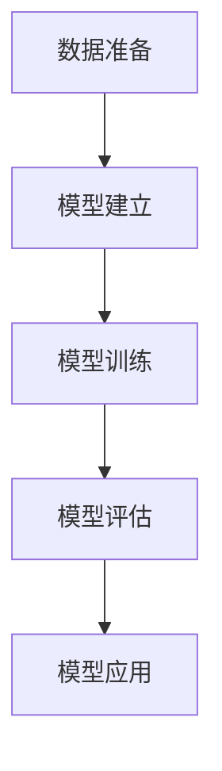

**Python代码示例**：

```python
import numpy as np
from sklearn.linear_model import LinearRegression

# 准备数据
X = np.array([[1, 2], [2, 3], [3, 4], [4, 5]])
y = np.array([2, 3, 4, 5])

# 建立模型
model = LinearRegression()

# 训练模型
model.fit(X, y)

# 预测
prediction = model.predict(np.array([[5, 6]]))

print(prediction)
```

**数学模型和公式**：

传统机器学习算法的数学模型通常基于统计学原理，如最小二乘法、极大似然估计等。例如，线性回归算法的数学模型如下：

$$
\min_{\beta} \sum_{i=1}^{n} (y_i - \beta_0 - \beta_1x_{i1} - \beta_2x_{i2} - \ldots - \beta_nx_{in})^2
$$

其中，$y_i$为第$i$个观测值，$x_{i1}, x_{i2}, \ldots, x_{in}$为第$i$个观测值的特征值，$\beta_0, \beta_1, \beta_2, \ldots, \beta_n$为模型参数。

**详细讲解和举例说明**：

以线性回归算法为例，线性回归算法通过最小二乘法建立线性关系模型，用于预测目标变量的值。下面以一个简单的例子进行说明：

假设我们有一个简单数据集，其中包含两个特征$x_1$和$x_2$，以及目标变量$y$。我们的目标是建立线性关系模型：

$$
y = \beta_0 + \beta_1x_1 + \beta_2x_2
$$

为了求解模型参数$\beta_0, \beta_1, \beta_2$，我们可以使用最小二乘法。具体步骤如下：

1. 准备数据集，包括特征矩阵$X$和目标向量$y$。
2. 构建目标函数，即模型预测值与实际观测值之间的误差平方和。
3. 对目标函数进行求导，得到梯度。
4. 沿着梯度的反方向更新模型参数，以最小化目标函数。
5. 重复步骤3-4，直到满足停止条件（如梯度变化小于阈值或迭代次数达到最大值）。

以下是一个使用Python和scikit-learn库实现线性回归算法的例子：

```python
import numpy as np
from sklearn.linear_model import LinearRegression

# 准备数据
X = np.array([[1, 2], [2, 3], [3, 4], [4, 5]])
y = np.array([2, 3, 4, 5])

# 建立模型
model = LinearRegression()

# 训练模型
model.fit(X, y)

# 预测
prediction = model.predict(np.array([[5, 6]]))

print(prediction)
```

在这个例子中，我们首先导入numpy库和scikit-learn库。然后，我们准备一个简单数据集，包括两个特征$x_1$和$x_2$，以及目标变量$y$。接下来，我们建立线性回归模型，并使用训练数据集进行训练。最后，我们使用训练好的模型对新数据进行预测。

**小结**：

传统机器学习算法在高维度问题解决中具有重要的应用价值。通过建立数据与目标变量之间的关系模型，传统机器学习算法可以有效地处理高维数据。然而，传统机器学习算法在处理高维度数据时可能存在计算复杂度高、模型性能不稳定等问题。因此，研究者们不断探索新的方法，以应对高维度问题解决中的挑战。

### 2.2.2 深度学习

深度学习（Deep Learning）是一种基于多层神经网络的结构，通过学习大量数据来提取特征并进行复杂任务。深度学习在图像识别、自然语言处理、语音识别等领域取得了显著的成功。在高维度问题解决中，深度学习作为一种强大的工具，被广泛应用于数据预处理、特征提取和模型训练等环节。

**算法原理**：

深度学习的基本原理是模仿人类大脑的结构和工作方式。神经网络由多个层次组成，每个层次对输入数据进行处理，并传递到下一层次。通过多层次的堆叠，深度学习模型可以自动提取层次化的特征，从而实现复杂任务。

深度学习的主要组成部分包括：

1. **神经网络**：神经网络是深度学习的基础，由多个神经元组成，每个神经元都与其他神经元相连。神经网络通过前向传播和反向传播进行数据学习和特征提取。
2. **激活函数**：激活函数用于引入非线性因素，使神经网络具有非线性特性。常见的激活函数包括ReLU（Rectified Linear Unit）、Sigmoid和Tanh等。
3. **损失函数**：损失函数用于评估模型预测值与实际值之间的差异。常用的损失函数包括均方误差（MSE）、交叉熵损失等。
4. **优化算法**：优化算法用于调整模型参数，以最小化损失函数。常见的优化算法包括梯度下降、Adam等。

**mermaid算法流程图**：

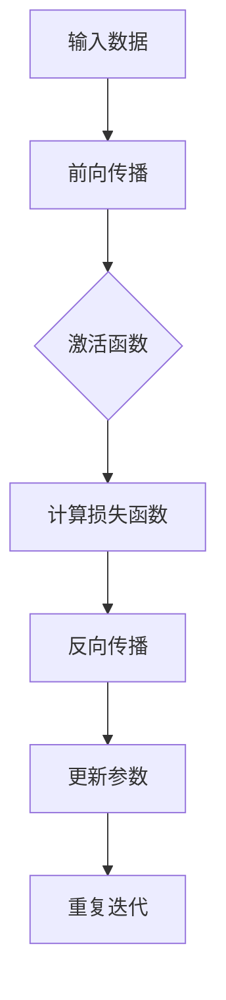

**Python代码示例**：

```python
import numpy as np
from tensorflow.keras.models import Sequential
from tensorflow.keras.layers import Dense, Activation

# 准备数据
X = np.array([[1, 2], [2, 3], [3, 4], [4, 5]])
y = np.array([2, 3, 4, 5])

# 建立模型
model = Sequential()
model.add(Dense(units=1, input_shape=(2,)))
model.add(Activation('linear'))

# 编译模型
model.compile(optimizer='sgd', loss='mse')

# 训练模型
model.fit(X, y, epochs=1000)

# 预测
prediction = model.predict(np.array([[5, 6]]))

print(prediction)
```

**数学模型和公式**：

深度学习的数学模型基于多层神经网络，主要涉及以下几个部分：

1. **输入层**：输入层接收外部输入数据，并传递到下一层。
2. **隐藏层**：隐藏层对输入数据进行处理，通过多层堆叠提取特征。每个隐藏层的输出可以表示为：
   $$
   h_{l}^{[k]} = \sigma \left( {W_{l}^{[k]}}h_{l-1}^{[k-1]} + b_{l}^{[k]} \right)
   $$
   其中，$h_{l}^{[k]}$表示第$l$层的第$k$个隐藏节点，$W_{l}^{[k]}$表示第$l$层的权重矩阵，$b_{l}^{[k]}$表示第$l$层的偏置项，$\sigma$表示激活函数。
3. **输出层**：输出层生成最终预测结果。对于回归任务，输出层通常使用线性激活函数；对于分类任务，输出层通常使用softmax激活函数。

**详细讲解和举例说明**：

以多层感知器（MLP）为例，多层感知器是一种常见的深度学习模型，用于回归和分类任务。下面以一个简单的回归例子进行说明：

假设我们有一个简单数据集，包含两个特征$x_1$和$x_2$，以及目标变量$y$。我们的目标是建立回归模型：

$$
y = \beta_0 + \beta_1x_1 + \beta_2x_2
$$

为了求解模型参数$\beta_0, \beta_1, \beta_2$，我们可以使用多层感知器模型。具体步骤如下：

1. 准备数据集，包括特征矩阵$X$和目标向量$y$。
2. 构建多层感知器模型，包括输入层、隐藏层和输出层。
3. 编译模型，指定优化器和损失函数。
4. 训练模型，通过反向传播算法调整模型参数。
5. 评估模型，使用测试数据集计算模型损失或准确率。
6. 应用模型，对新的数据进行预测。

以下是一个使用Python和TensorFlow库实现多层感知器模型的例子：

```python
import numpy as np
from tensorflow.keras.models import Sequential
from tensorflow.keras.layers import Dense
from tensorflow.keras.optimizers import SGD

# 准备数据
X = np.array([[1, 2], [2, 3], [3, 4], [4, 5]])
y = np.array([2, 3, 4, 5])

# 建立模型
model = Sequential()
model.add(Dense(units=1, input_shape=(2,)))
model.add(Dense(units=2, activation='relu'))
model.add(Dense(units=1, activation='linear'))

# 编译模型
model.compile(optimizer=SGD(), loss='mse')

# 训练模型
model.fit(X, y, epochs=1000)

# 预测
prediction = model.predict(np.array([[5, 6]]))

print(prediction)
```

在这个例子中，我们首先导入numpy库和TensorFlow库。然后，我们准备一个简单数据集，包括两个特征$x_1$和$x_2$，以及目标变量$y$。接下来，我们建立多层感知器模型，并使用反向传播算法进行训练。最后，我们使用训练好的模型对新数据进行预测。

**小结**：

深度学习作为一种强大的工具，在高维度问题解决中具有广泛的应用。通过多层神经网络的学习，深度学习可以自动提取层次化的特征，从而解决复杂任务。然而，深度学习也存在一些挑战，如计算复杂度高、模型可解释性差等。因此，研究者们需要不断探索新的方法，以改进深度学习模型并提高其性能。

### 2.2.3 强化学习

强化学习（Reinforcement Learning，简称RL）是一种基于试错和反馈机制进行决策的机器学习方法。与传统的监督学习和无监督学习不同，强化学习通过不断尝试和调整策略，从环境中获得奖励或惩罚，以实现目标。

**算法原理**：

强化学习的基本原理是：智能体（Agent）通过与环境（Environment）的交互，学习一种最优策略（Policy），以最大化累积奖励（Reward）。强化学习包括以下几个核心概念：

1. **状态（State）**：状态是描述环境当前情况的变量集合。状态可以用来指导智能体的决策。
2. **动作（Action）**：动作是智能体在某个状态下可以执行的操作。动作的选择取决于当前状态和策略。
3. **策略（Policy）**：策略是智能体在某个状态下选择动作的规则。策略可以基于状态-动作值函数（State-Action Value Function）进行学习。
4. **奖励（Reward）**：奖励是环境对智能体执行动作后给予的即时反馈。奖励可以用来评估动作的好坏。
5. **价值函数（Value Function）**：价值函数用于评估状态或状态-动作对的好坏。常见的价值函数包括状态价值函数（State Value Function）和状态-动作价值函数（State-Action Value Function）。

**mermaid算法流程图**：

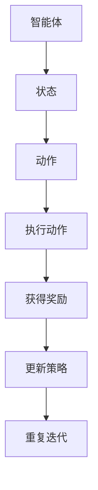

**Python代码示例**：

```python
import numpy as np
import gym

# 初始化环境
env = gym.make('CartPole-v0')

# 初始化智能体
# 这里使用简单的Q-Learning算法
q_values = np.zeros((env.observation_space.n, env.action_space.n))

# 设置学习参数
alpha = 0.1  # 学习率
gamma = 0.99 # 折扣因子

# 训练智能体
episodes = 1000
for episode in range(episodes):
    state = env.reset()
    done = False
    while not done:
        # 选择动作
        action = np.argmax(q_values[state])
        
        # 执行动作
        next_state, reward, done, _ = env.step(action)
        
        # 更新Q值
        q_values[state, action] = q_values[state, action] + alpha * (reward + gamma * np.max(q_values[next_state]) - q_values[state, action])
        
        state = next_state

# 关闭环境
env.close()
```

**数学模型和公式**：

强化学习的主要数学模型是基于马尔可夫决策过程（MDP）。在MDP中，智能体在某个状态下执行动作，获得奖励并转移到下一个状态。强化学习的目标是学习最优策略，即最大化期望回报。

1. **状态-动作价值函数**：
   $$
   Q^*(s, a) = \sum_{s'} p(s' | s, a) \cdot \max_{a'} R(s', a') + \gamma \sum_{a'} p(s', a' | s, a) \cdot Q^*(s', a')
   $$
   其中，$Q^*(s, a)$为状态-动作价值函数，$p(s' | s, a)$为状态转移概率，$R(s', a')$为执行动作$a'$在状态$s'$获得的即时奖励，$\gamma$为折扣因子。

2. **策略**：
   $$
   \pi(a | s) = \begin{cases}
   1, & \text{if } a = \arg\max_{a'} Q^*(s, a') \\
   0, & \text{otherwise}
   \end{cases}
   $$
   其中，$\pi(a | s)$为策略，表示在状态$s$下选择动作$a$的概率。

**详细讲解和举例说明**：

以Q-Learning算法为例，Q-Learning算法是一种基于值函数迭代的强化学习算法。下面以一个简单的例子进行说明：

假设我们有一个简单的环境，包含两个状态和两个动作。我们的目标是学习一个最优策略，以最大化累积奖励。

状态空间：$\{s_0, s_1\}$
动作空间：$\{a_0, a_1\}$

奖励函数：$R(s, a) = 1$，当动作$a$导致状态转移至$s_1$时；$R(s, a) = 0$，其他情况。

初始状态-动作价值函数：$Q(s, a) = 0$

学习过程如下：

1. 初始化状态-动作价值函数$Q(s, a) = 0$。
2. 选择动作$a$，执行动作并观察状态转移和奖励。
3. 更新状态-动作价值函数：
   $$
   Q(s, a) = Q(s, a) + \alpha [R(s, a) + \gamma \max_{a'} Q(s', a') - Q(s, a)]
   $$
4. 重复步骤2-3，直到满足停止条件（如迭代次数或累计奖励达到阈值）。

以下是一个使用Python和OpenAI Gym库实现Q-Learning算法的例子：

```python
import numpy as np
import gym

# 初始化环境
env = gym.make('CartPole-v0')

# 初始化状态-动作价值函数
q_values = np.zeros((env.observation_space.n, env.action_space.n))

# 设置学习参数
alpha = 0.1  # 学习率
gamma = 0.99  # 折扣因子

# 训练智能体
episodes = 1000
for episode in range(episodes):
    state = env.reset()
    done = False
    total_reward = 0
    while not done:
        # 选择动作
        action = np.argmax(q_values[state])
        
        # 执行动作
        next_state, reward, done, _ = env.step(action)
        
        # 更新状态-动作价值函数
        q_values[state, action] = q_values[state, action] + alpha * (reward + gamma * np.max(q_values[next_state]) - q_values[state, action])
        
        state = next_state
        total_reward += reward

    print(f"Episode {episode + 1}: Total Reward = {total_reward}")

# 关闭环境
env.close()
```

在这个例子中，我们首先导入numpy库和OpenAI Gym库。然后，我们初始化一个简单的环境，并设置学习参数。接下来，我们使用Q-Learning算法进行训练，在每个迭代步骤中更新状态-动作价值函数。最后，我们打印每个迭代步骤的累积奖励。

**小结**：

强化学习是一种强大的机器学习方法，适用于解决具有不确定性、部分观测和长期奖励的决策问题。通过不断尝试和调整策略，强化学习可以从环境中学习到最优策略。然而，强化学习也存在一些挑战，如样本效率低、模型不稳定等。因此，研究者们需要不断探索新的方法，以改进强化学习模型并提高其性能。

### 3.2.1 特征选择

特征选择（Feature Selection）是指从原始特征中筛选出对问题求解有重要影响的特征，以降低数据维度、提高模型性能。在高维度问题解决中，特征选择是一项重要且具有挑战性的任务。

**特征选择方法**：

1. **过滤式特征选择**：过滤式特征选择是在数据预处理阶段直接筛选特征，不考虑特征之间的相关性。常见的方法包括基于信息的特征选择和基于距离的特征选择。

   - **基于信息的特征选择**：根据特征对目标变量的信息增益进行选择。常用的信息增益指标包括信息增益（Information Gain）和互信息（Mutual Information）。
   - **基于距离的特征选择**：根据特征与目标变量的距离度量和特征之间的相关性进行选择。常用的距离度量包括欧几里得距离、曼哈顿距离等。

2. **包裹式特征选择**：包裹式特征选择是一种基于搜索的方法，通过遍历所有可能的特征子集，选择最优特征子集。常见的方法包括贪心搜索（Greedy Search）和遗传算法（Genetic Algorithm）。

   - **贪心搜索**：每次迭代选择当前最优特征，直到满足停止条件。
   - **遗传算法**：通过自然选择和遗传操作（如交叉、变异等）搜索最优特征子集。

3. **嵌入式特征选择**：嵌入式特征选择是将特征选择过程嵌入到学习算法中，逐步筛选特征。常见的方法包括基于正则化的特征选择和基于模型的特征选择。

   - **基于正则化的特征选择**：通过在损失函数中加入正则化项，惩罚特征的重要性，实现特征选择。常见的正则化方法包括L1正则化（Lasso）和L2正则化（Ridge）。
   - **基于模型的特征选择**：通过模型训练过程筛选特征，根据特征对模型性能的影响进行选择。

**mermaid特征选择流程图**：

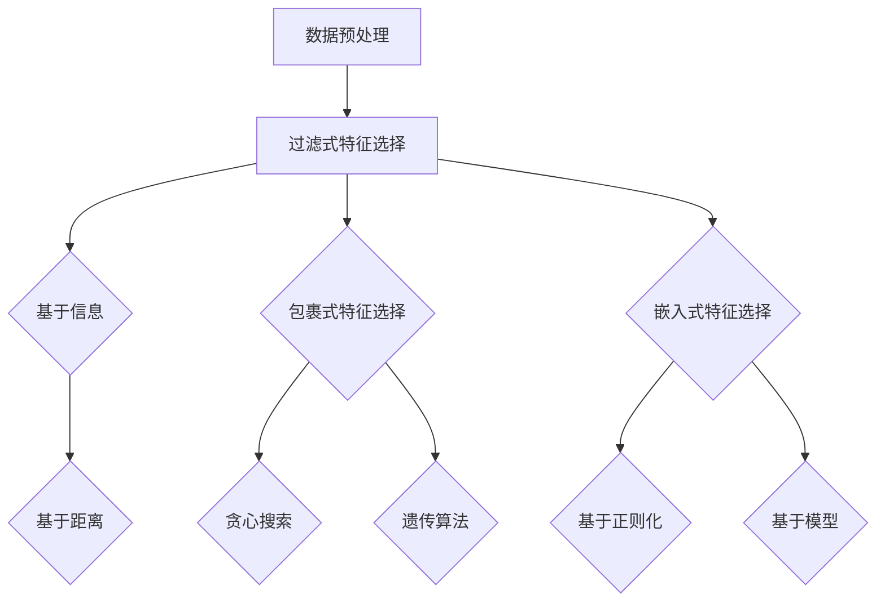

**Python代码示例**：

```python
import numpy as np
from sklearn.datasets import load_iris
from sklearn.feature_selection import SelectKBest, f_classif

# 加载数据集
iris = load_iris()
X = iris.data
y = iris.target

# 过滤式特征选择
selector = SelectKBest(score_func=f_classif, k=2)
X_new = selector.fit_transform(X, y)

print(f"Selected Features: {X_new.shape}")
```

**数学模型和公式**：

特征选择的数学模型主要涉及特征选择指标的计算和优化。以下是一些常见的特征选择指标：

1. **信息增益**：
   $$
   IG(A, B) = H(B) - H(B | A)
   $$
   其中，$H(B)$为类别熵，$H(B | A)$为条件熵。

2. **互信息**：
   $$
   MI(A, B) = H(A) + H(B) - H(A, B)
   $$
   其中，$H(A)$和$H(B)$分别为特征A和类别B的熵，$H(A, B)$为特征A和类别B的联合熵。

3. **特征重要性**：
   $$
   \text{Importance}(A) = \frac{\sum_{i=1}^{n} \text{权重}(i) \cdot \text{贡献}(i)}{\sum_{i=1}^{n} \text{权重}(i)}
   $$
   其中，权重为特征在模型中的重要性，贡献为特征对模型性能的贡献。

**详细讲解和举例说明**：

以信息增益为例，信息增益是一种基于类别熵和条件熵的特征选择指标。信息增益通过比较类别熵和条件熵的差异，衡量特征对类别划分的影响。具体计算方法如下：

1. 计算类别熵$H(B)$：

   $$
   H(B) = -\sum_{c=1}^{C} p(c) \cdot \log_2 p(c)
   $$
   其中，$C$为类别数，$p(c)$为类别$c$的频率。

2. 计算条件熵$H(B | A)$：

   $$
   H(B | A) = -\sum_{a=1}^{A} p(a) \cdot \sum_{c=1}^{C} p(c|a) \cdot \log_2 p(c|a)
   $$
   其中，$A$为特征数，$p(a)$为特征$a$的频率，$p(c|a)$为特征$a$在类别$c$的条件概率。

3. 计算信息增益$IG(A, B)$：

   $$
   IG(A, B) = H(B) - H(B | A)
   $$

以下是一个使用Python和scikit-learn库实现信息增益特征选择的例子：

```python
import numpy as np
from sklearn.datasets import load_iris
from sklearn.feature_selection import SelectKBest, f_classif

# 加载数据集
iris = load_iris()
X = iris.data
y = iris.target

# 选择最佳特征
selector = SelectKBest(score_func=f_classif, k=2)
X_new = selector.fit_transform(X, y)

print(f"Selected Features: {X_new.shape}")
```

在这个例子中，我们首先导入numpy库和scikit-learn库。然后，我们加载数据集并使用SelectKBest类选择最佳特征。最后，我们打印选择后的特征形状。

**小结**：

特征选择是高维度问题解决中的重要步骤，通过筛选出对问题求解有重要影响的特征，可以降低数据维度、提高模型性能。常用的特征选择方法包括过滤式特征选择、包裹式特征选择和嵌入式特征选择。在实际应用中，研究者们需要根据具体问题和数据特点选择合适的特征选择方法。

### 3.2.2 特征提取

特征提取（Feature Extraction）是将原始数据转换为更有意义和可解释的特征的过程。特征提取是数据预处理的重要步骤，对于提高模型性能和数据质量具有重要意义。

**特征提取方法**：

1. **基于统计的方法**：基于统计的方法通过计算原始数据的基本统计量（如均值、方差、标准差等）来提取特征。常见的方法包括均值特征提取、方差特征提取和标准差特征提取。

   - **均值特征提取**：将原始数据减去均值，以消除数据的尺度影响。
   - **方差特征提取**：将原始数据除以方差，以降低噪声的影响。
   - **标准差特征提取**：将原始数据除以标准差，以消除数据的尺度影响。

2. **基于变换的方法**：基于变换的方法通过将原始数据转换为其他形式的特征。常见的方法包括归一化、标准化、对数变换等。

   - **归一化**：将原始数据映射到[0, 1]范围内，以消除数据尺度的影响。
   - **标准化**：将原始数据转换为标准正态分布，以消除数据尺度和分布的影响。
   - **对数变换**：将原始数据取对数，以降低数据的尺度影响。

3. **基于学习的的方法**：基于学习的方法通过机器学习算法自动提取特征。常见的方法包括主成分分析（PCA）、线性判别分析（LDA）等。

   - **主成分分析（PCA）**：通过降维将高维数据转换为低维数据，保留主要特征。
   - **线性判别分析（LDA）**：通过降维将高维数据转换为低维数据，同时满足类别分离的要求。

**mermaid特征提取流程图**：

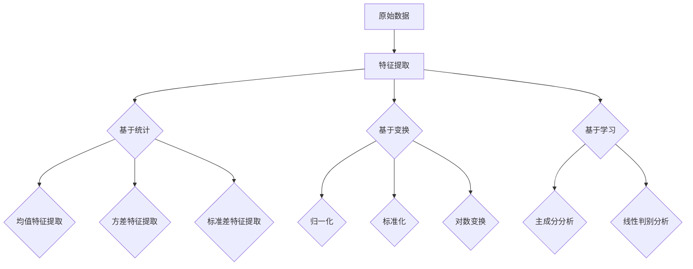

**Python代码示例**：

```python
import numpy as np
from sklearn.datasets import load_iris
from sklearn.decomposition import PCA

# 加载数据集
iris = load_iris()
X = iris.data
y = iris.target

# 特征提取
pca = PCA(n_components=2)
X_new = pca.fit_transform(X)

print(f"Extracted Features: {X_new.shape}")
```

**数学模型和公式**：

特征提取的数学模型主要涉及特征转换和降维。以下是一些常见的特征提取方法：

1. **均值特征提取**：

   $$
   x_{\text{mean}} = \frac{1}{n} \sum_{i=1}^{n} x_i
   $$

   其中，$x_i$为原始数据，$n$为数据点的个数。

2. **方差特征提取**：

   $$
   x_{\text{var}} = \frac{1}{n-1} \sum_{i=1}^{n} (x_i - \bar{x})^2
   $$

   其中，$\bar{x}$为均值。

3. **标准差特征提取**：

   $$
   x_{\text{std}} = \sqrt{x_{\text{var}}}
   $$

4. **归一化**：

   $$
   x_{\text{norm}} = \frac{x - \min(x)}{\max(x) - \min(x)}
   $$

5. **标准化**：

   $$
   x_{\text{stdnorm}} = \frac{x - \mu}{\sigma}
   $$

   其中，$\mu$为均值，$\sigma$为标准差。

6. **对数变换**：

   $$
   x_{\text{log}} = \log(x)
   $$

**详细讲解和举例说明**：

以主成分分析（PCA）为例，PCA是一种基于学习的特征提取方法，通过降维将高维数据转换为低维数据，保留主要特征。具体步骤如下：

1. 计算协方差矩阵：

   $$
   S = \frac{1}{n} \sum_{i=1}^{n} (x_i - \mu)(x_i - \mu)^T
   $$

   其中，$\mu$为均值。

2. 计算协方差矩阵的特征值和特征向量：

   $$
   \lambda_i, v_i
   $$

   其中，$\lambda_i$为特征值，$v_i$为特征向量。

3. 将特征向量按特征值降序排列：

   $$
   v_1, v_2, \ldots, v_p
   $$

4. 计算主成分：

   $$
   z_i = \sum_{j=1}^{p} v_{ij}x_j
   $$

   其中，$z_i$为第$i$个主成分。

5. 选择前$k$个主成分，构成低维特征：

   $$
   X_{\text{new}} = \sum_{i=1}^{k} z_i
   $$

以下是一个使用Python和scikit-learn库实现主成分分析（PCA）的例子：

```python
import numpy as np
from sklearn.datasets import load_iris
from sklearn.decomposition import PCA

# 加载数据集
iris = load_iris()
X = iris.data
y = iris.target

# 特征提取
pca = PCA(n_components=2)
X_new = pca.fit_transform(X)

print(f"Extracted Features: {X_new.shape}")
```

在这个例子中，我们首先导入numpy库和scikit-learn库。然后，我们加载数据集并使用PCA类进行特征提取。最后，我们打印提取后的特征形状。

**小结**：

特征提取是高维度问题解决中的重要步骤，通过将原始数据转换为更有意义和可解释的特征，可以提高模型性能和数据质量。常用的特征提取方法包括基于统计的方法、基于变换的方法和基于学习的方法。在实际应用中，研究者们需要根据具体问题和数据特点选择合适的特征提取方法。

### 3.2.3 数据降维

数据降维（Data Dimensionality Reduction）是将高维数据转换为低维数据的过程，以减少计算复杂度、提高模型性能和可解释性。在高维度问题解决中，数据降维是一项重要且具有挑战性的任务。

**降维方法**：

1. **主成分分析（PCA）**：主成分分析是一种基于线性变换的方法，通过将高维数据映射到低维空间，保留主要特征。PCA通过计算协方差矩阵和特征值分解，将数据投影到新的坐标系中。

   - **算法原理**：PCA通过计算协方差矩阵$S$的特征值和特征向量，将数据从原始空间投影到新的空间。新空间的坐标轴（主成分）表示数据的最大方差方向。
   - **算法流程**：
     1. 计算协方差矩阵$S$。
     2. 计算协方差矩阵$S$的特征值$\lambda_i$和特征向量$v_i$。
     3. 按照特征值降序排列特征向量。
     4. 选择前$k$个特征向量作为主成分，构成低维特征。

2. **线性判别分析（LDA）**：线性判别分析是一种基于分类的方法，通过将高维数据映射到低维空间，同时满足类别分离的要求。LDA通过最大化类间散度与类内散度的比值得到最佳投影方向。

   - **算法原理**：LDA通过计算协方差矩阵$S_W$和$S_B$，将数据从原始空间投影到新的空间。新空间的坐标轴（判别向量）表示数据的最优分类方向。
   - **算法流程**：
     1. 计算类内散度矩阵$S_W$和类间散度矩阵$S_B$。
     2. 计算判别矩阵$S_B^{-1}S_W$的特征值$\lambda_i$和特征向量$v_i$。
     3. 按照特征值降序排列特征向量。
     4. 选择前$k$个特征向量作为判别向量，构成低维特征。

3. **非负矩阵分解（NMF）**：非负矩阵分解是一种基于非负约束的矩阵分解方法，通过将高维数据分解为两个非负矩阵的乘积。NMF通过迭代优化目标函数，得到最佳分解结果。

   - **算法原理**：NMF通过迭代求解两个非负矩阵$W$和$H$，使得$X = WH$成立。$W$表示数据特征，$H$表示特征系数。
   - **算法流程**：
     1. 初始化非负矩阵$W$和$H$。
     2. 迭代更新$W$和$H$，直到目标函数收敛。
     3. 选择前$k$个列向量作为特征，构成低维特征。

4. **t-SNE**：t-Distributed Stochastic Neighbor Embedding（t-SNE）是一种基于概率分布的降维方法，通过将高维数据映射到二维或三维空间，以保持局部结构。t-SNE通过计算数据的相似性矩阵和梯度上升优化，得到最佳投影结果。

   - **算法原理**：t-SNE通过计算数据点之间的相似性概率分布，将高维数据转换为低维数据。t-SNE使用梯度上升优化相似性矩阵，使得低维数据的局部结构更相似。
   - **算法流程**：
     1. 计算高维数据的相似性矩阵$Q$。
     2. 将相似性矩阵$Q$转换为低维数据的概率分布$P$。
     3. 迭代优化概率分布$P$，直到满足停止条件。

**mermaid数据降维流程图**：

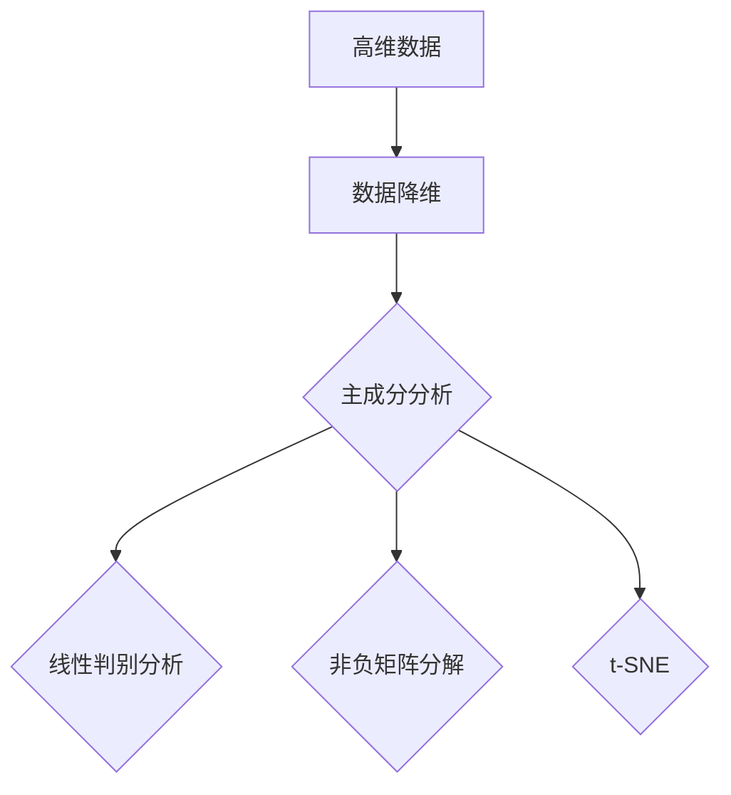

**Python代码示例**：

```python
import numpy as np
from sklearn.datasets import load_iris
from sklearn.decomposition import PCA

# 加载数据集
iris = load_iris()
X = iris.data
y = iris.target

# 数据降维
pca = PCA(n_components=2)
X_new = pca.fit_transform(X)

print(f"Reduced Features: {X_new.shape}")
```

**数学模型和公式**：

数据降维的数学模型主要涉及特征变换和降维。以下是一些常见的降维方法：

1. **主成分分析（PCA）**：

   - **协方差矩阵**：
     $$
     S = \frac{1}{n} \sum_{i=1}^{n} (x_i - \mu)(x_i - \mu)^T
     $$

   - **特征值分解**：
     $$
     S = Q\Lambda Q^T
     $$
     其中，$Q$为特征向量矩阵，$\Lambda$为特征值矩阵。

   - **主成分**：
     $$
     z_i = \sum_{j=1}^{p} \lambda_j v_{ij} x_j
     $$
     其中，$z_i$为第$i$个主成分，$v_{ij}$为特征向量矩阵的第$i$行第$j$列元素。

2. **线性判别分析（LDA）**：

   - **类内散度矩阵**：
     $$
     S_W = \sum_{i=1}^{C} \sum_{j=1}^{n_i} (x_{ij} - \mu_{c})(x_{ij} - \mu_{c})^T
     $$
     其中，$C$为类别数，$n_i$为类别$c$中数据点的个数，$x_{ij}$为第$i$个数据点的第$j$个特征值，$\mu_{c}$为类别$c$的均值。

   - **类间散度矩阵**：
     $$
     S_B = \sum_{i=1}^{C} (\mu_{c} - \mu)(\mu_{c} - \mu)^T
     $$
     其中，$\mu$为所有数据点的均值。

   - **判别向量**：
     $$
     w_i = \frac{\Lambda_{i}}{\sum_{j=1}^{p} \Lambda_{j}} v_{ij}
     $$
     其中，$w_i$为第$i$个判别向量，$\Lambda_{i}$为特征值，$v_{ij}$为特征向量矩阵的第$i$行第$j$列元素。

3. **非负矩阵分解（NMF）**：

   - **目标函数**：
     $$
     \min_{W, H} \sum_{i=1}^{n} \sum_{j=1}^{p} (w_{ij}h_{ij} - x_{ij})^2
     $$
     其中，$W$和$H$为非负矩阵，$w_{ij}$和$h_{ij}$为矩阵$W$和$H$的第$i$行第$j$列元素。

4. **t-SNE**：

   - **相似性矩阵**：
     $$
     Q_{ij} = \exp \left( - \frac{\| x_i - x_j \|^2}{2\sigma^2} \right)
     $$
     其中，$\sigma$为调整参数。

   - **概率分布**：
     $$
     P_{ij} = \frac{Q_{ii} + Q_{ji}}{\sum_{k=1}^{n} Q_{ik} + \sum_{k=1}^{n} Q_{kj}}
     $$

   - **梯度上升优化**：
     $$
     p_i = \sum_{j=1}^{n} P_{ij} \quad \text{and} \quad q_i = \sum_{j=1}^{n} q_{ij}
     $$
     $$
     p_{ij} = \frac{1}{1 + \exp(- \frac{\| x_i - x_j \|^2}{\sigma^2})}
     $$

**详细讲解和举例说明**：

以主成分分析（PCA）为例，PCA是一种基于线性变换的方法，通过将高维数据映射到低维空间，保留主要特征。下面以一个简单的二维数据集为例，说明PCA的步骤：

数据集：$\{x_1, x_2\}$

步骤：

1. 计算协方差矩阵：
   $$
   S = \frac{1}{n} \sum_{i=1}^{n} (x_i - \mu)(x_i - \mu)^T
   $$
   其中，$\mu = \frac{1}{n} \sum_{i=1}^{n} x_i$为均值。

2. 计算协方差矩阵的特征值和特征向量：
   $$
   S = Q\Lambda Q^T
   $$
   其中，$Q$为特征向量矩阵，$\Lambda$为特征值矩阵。

3. 按照特征值降序排列特征向量：
   $$
   Q = \begin{bmatrix}
   q_1 & q_2
   \end{bmatrix}
   $$

4. 选择前$k$个特征向量作为主成分：
   $$
   z_1 = q_1 x_1 + q_2 x_2
   $$

5. 计算降维后的数据：
   $$
   X_{\text{new}} = \begin{bmatrix}
   z_1 & z_2
   \end{bmatrix}
   $$

以下是一个使用Python和scikit-learn库实现PCA的例子：

```python
import numpy as np
from sklearn.datasets import load_iris
from sklearn.decomposition import PCA

# 加载数据集
iris = load_iris()
X = iris.data
y = iris.target

# 数据降维
pca = PCA(n_components=2)
X_new = pca.fit_transform(X)

print(f"Reduced Features: {X_new.shape}")
```

在这个例子中，我们首先导入numpy库和scikit-learn库。然后，我们加载数据集并使用PCA类进行降维。最后，我们打印降维后的特征形状。

**小结**：

数据降维是高维度问题解决中的重要步骤，通过将高维数据转换为低维数据，可以降低计算复杂度、提高模型性能和可解释性。常用的降维方法包括主成分分析（PCA）、线性判别分析（LDA）、非负矩阵分解（NMF）和t-SNE。在实际应用中，研究者们需要根据具体问题和数据特点选择合适的降维方法。

### 4.1 聚类分析概述

聚类分析（Clustering Analysis）是一种无监督学习方法，通过将数据点划分为多个类别或簇，以揭示数据之间的相似性和差异性。聚类分析在高维度问题解决中具有重要的应用，如数据挖掘、图像识别、文本分类等。

**聚类分析的核心概念**：

1. **簇（Cluster）**：簇是指一组相似的数据点集合。簇内的数据点之间相似度较高，簇间的数据点相似度较低。
2. **聚类算法**：聚类算法是指用于实现聚类分析的方法。常见的聚类算法包括K-Means、DBSCAN、层次聚类等。
3. **聚类质量**：聚类质量是指聚类结果的优劣程度。常用的聚类质量评价指标包括内聚度（Cohesion）、分离度（Separation）和完整度（Completeness）等。
4. **聚类层次**：聚类层次是指聚类结果的可视化层次结构。常见的聚类层次结构包括层次聚类树、层次聚类图等。

**聚类分析的应用领域**：

1. **数据挖掘**：聚类分析可以用于挖掘数据中的潜在规律和结构，如顾客细分、市场细分等。
2. **图像识别**：聚类分析可以用于图像分割、图像分类等，以发现图像中的局部结构和特征。
3. **文本分类**：聚类分析可以用于文本数据的分类，以识别文本的主题和语义。
4. **社交网络分析**：聚类分析可以用于社交网络分析，以发现社交网络中的社群结构和关系。

**mermaid聚类分析流程图**：

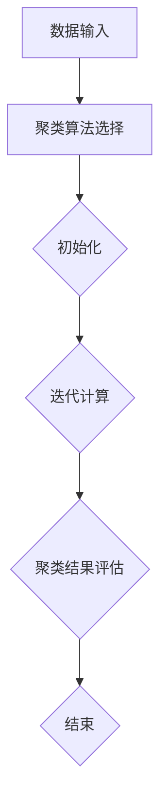

**Python代码示例**：

```python
import numpy as np
from sklearn.cluster import KMeans

# 加载数据集
X = np.array([[1, 2], [2, 2], [2, 3], [1, 3], [3, 3], [3, 2]])

# 选择聚类算法
kmeans = KMeans(n_clusters=2, random_state=0).fit(X)

# 输出聚类结果
print(f"Cluster Centers: {kmeans.cluster_centers_}")
print(f"Cluster Labels: {kmeans.labels_}")
```

**数学模型和公式**：

聚类分析的数学模型主要涉及聚类目标和聚类算法的实现。以下是一些常见的聚类目标和算法：

1. **目标函数**：

   $$
   \min \sum_{i=1}^{n} \min_{j=1}^{k} \| x_i - c_j \|^2
   $$

   其中，$x_i$为第$i$个数据点，$c_j$为第$j$个簇中心，$k$为簇的数量。

2. **K-Means算法**：

   - **初始化**：随机选择$k$个初始簇中心。
   - **迭代计算**：对于每个数据点，将其分配到最近的簇中心。更新簇中心。
   - **结束条件**：当簇中心不再发生变化或达到最大迭代次数时，结束迭代。

3. **DBSCAN算法**：

   - **邻域**：对于每个数据点，找出其邻域内的数据点。
   - **核心点**：如果邻域内的数据点数量大于最小核心点数，则该数据点为核心点。
   - **边界点**：如果邻域内的数据点数量小于最小核心点数，但大于最小边界点数，则该数据点为边界点。
   - **噪声点**：如果邻域内的数据点数量小于最小边界点数，则该数据点为噪声点。
   - **聚类**：对于每个核心点，将其及其邻域内的数据点划分为同一个簇。

4. **层次聚类算法**：

   - **初始化**：将每个数据点视为一个簇。
   - **合并簇**：每次迭代选择距离最近的两个簇进行合并，形成一个新的簇。
   - **结束条件**：当剩余簇的数量小于$k$或达到最大迭代次数时，结束迭代。

**详细讲解和举例说明**：

以K-Means算法为例，K-Means算法是一种基于距离度量的聚类算法，通过迭代计算簇中心，将数据点分配到最近的簇中心，以最小化簇内距离。下面以一个简单的二维数据集为例，说明K-Means算法的步骤：

数据集：$\{x_1, x_2, \ldots, x_n\}$

步骤：

1. 初始化簇中心：随机选择$k$个数据点作为初始簇中心。

2. 分配数据点：对于每个数据点，计算其到每个簇中心的距离，将其分配到最近的簇中心。

3. 更新簇中心：计算每个簇的数据点的均值，更新簇中心。

4. 迭代计算：重复步骤2和步骤3，直到满足停止条件（如簇中心不再发生变化或达到最大迭代次数）。

以下是一个使用Python和scikit-learn库实现K-Means算法的例子：

```python
import numpy as np
from sklearn.cluster import KMeans

# 加载数据集
X = np.array([[1, 2], [2, 2], [2, 3], [1, 3], [3, 3], [3, 2]])

# 选择聚类算法
kmeans = KMeans(n_clusters=2, random_state=0).fit(X)

# 输出聚类结果
print(f"Cluster Centers: {kmeans.cluster_centers_}")
print(f"Cluster Labels: {kmeans.labels_}")
```

在这个例子中，我们首先导入numpy库和scikit-learn库。然后，我们加载数据集并使用KMeans类进行聚类。最后，我们打印聚类结果，包括簇中心和簇标签。

**小结**：

聚类分析是一种无监督学习方法，通过将数据点划分为多个类别或簇，以揭示数据之间的相似性和差异性。聚类分析在高维度问题解决中具有重要的应用，如数据挖掘、图像识别、文本分类等。常见的聚类算法包括K-Means、DBSCAN、层次聚类等。在实际应用中，研究者们需要根据具体问题和数据特点选择合适的聚类算法。

### 4.2.1 K-Means算法

K-Means算法是一种基于距离度量的聚类算法，通过迭代计算簇中心，将数据点分配到最近的簇中心，以最小化簇内距离。K-Means算法是一种简单且有效的聚类方法，适用于处理高维度数据。

**算法原理**：

K-Means算法的核心思想是将数据划分为$k$个簇，每个簇由一个簇中心表示。算法通过迭代计算簇中心，更新数据点的簇标签，直至满足停止条件（如簇中心不再变化或达到最大迭代次数）。

算法步骤如下：

1. **初始化簇中心**：随机选择$k$个数据点作为初始簇中心。
2. **分配数据点**：对于每个数据点，计算其到每个簇中心的距离，将其分配到最近的簇中心。
3. **更新簇中心**：计算每个簇的数据点的均值，更新簇中心。
4. **迭代计算**：重复步骤2和步骤3，直到满足停止条件。

**mermaid算法流程图**：

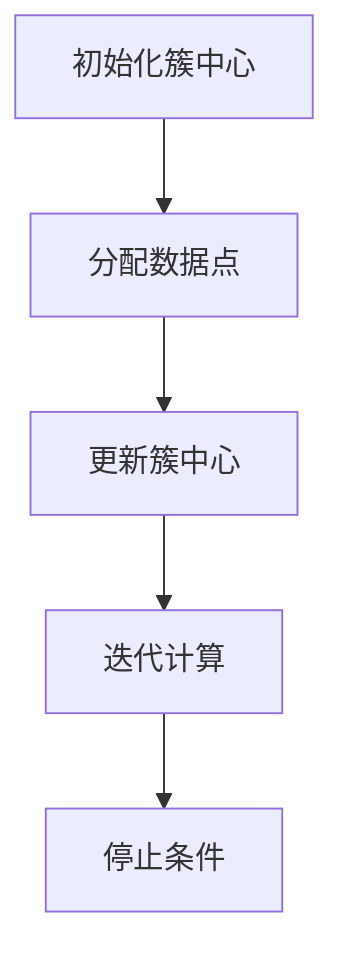

**Python代码示例**：

```python
import numpy as np
from sklearn.cluster import KMeans

# 加载数据集
X = np.array([[1, 2], [2, 2], [2, 3], [1, 3], [3, 3], [3, 2]])

# 选择聚类算法
kmeans = KMeans(n_clusters=2, random_state=0).fit(X)

# 输出聚类结果
print(f"Cluster Centers: {kmeans.cluster_centers_}")
print(f"Cluster Labels: {kmeans.labels_}")
```

**数学模型和公式**：

K-Means算法的目标是最小化簇内距离，即最小化目标函数：

$$
J = \sum_{i=1}^{n} \min_{j=1}^{k} \| x_i - c_j \|^2
$$

其中，$x_i$为第$i$个数据点，$c_j$为第$j$个簇中心，$k$为簇的数量。

算法的实现主要涉及以下几个步骤：

1. **初始化簇中心**：随机选择$k$个数据点作为初始簇中心。
2. **分配数据点**：对于每个数据点，计算其到每个簇中心的距离，将其分配到最近的簇中心。
3. **更新簇中心**：计算每个簇的数据点的均值，更新簇中心。
4. **迭代计算**：重复步骤2和步骤3，直到满足停止条件（如簇中心不再变化或达到最大迭代次数）。

**详细讲解和举例说明**：

以K-Means算法为例，K-Means算法通过迭代计算簇中心，将数据点分配到最近的簇中心，以最小化簇内距离。下面以一个简单的二维数据集为例，说明K-Means算法的步骤：

数据集：$\{x_1, x_2, \ldots, x_n\}$

步骤：

1. 初始化簇中心：随机选择$k$个数据点作为初始簇中心。假设初始簇中心为$c_1 = (1, 1)$和$c_2 = (3, 3)$。

2. 分配数据点：对于每个数据点，计算其到每个簇中心的距离，将其分配到最近的簇中心。例如，数据点$x_1 = (1, 2)$到$c_1$和$c_2$的距离分别为$\|x_1 - c_1\| = \sqrt{2}$和$\|x_1 - c_2\| = 2$，因此$x_1$被分配到簇$c_1$。

3. 更新簇中心：计算每个簇的数据点的均值，更新簇中心。例如，簇$c_1$的新簇中心为$\bar{x}_1 = \frac{1 + 1}{2} = 1$和$\bar{y}_1 = \frac{2 + 2}{2} = 2$，即$\bar{c}_1 = (1, 2)$。

4. 迭代计算：重复步骤2和步骤3，直到满足停止条件（如簇中心不再变化或达到最大迭代次数）。例如，在第二次迭代中，数据点$x_2 = (2, 2)$被分配到簇$c_2$，簇$c_2$的新簇中心为$\bar{x}_2 = \frac{2 + 3}{2} = 2.5$和$\bar{y}_2 = \frac{2 + 3}{2} = 2.5$，即$\bar{c}_2 = (2.5, 2.5)$。

5. 停止条件：当簇中心不再变化或达到最大迭代次数时，算法结束。

以下是一个使用Python和scikit-learn库实现K-Means算法的例子：

```python
import numpy as np
from sklearn.cluster import KMeans

# 加载数据集
X = np.array([[1, 2], [2, 2], [2, 3], [1, 3], [3, 3], [3, 2]])

# 选择聚类算法
kmeans = KMeans(n_clusters=2, random_state=0).fit(X)

# 输出聚类结果
print(f"Cluster Centers: {kmeans.cluster_centers_}")
print(f"Cluster Labels: {kmeans.labels_}")
```

在这个例子中，我们首先导入numpy库和scikit-learn库。然后，我们加载数据集并使用KMeans类进行聚类。最后，我们打印聚类结果，包括簇中心和簇标签。

**小结**：

K-Means算法是一种简单且有效的聚类算法，适用于处理高维度数据。通过迭代计算簇中心，K-Means算法将数据点分配到最近的簇中心，以最小化簇内距离。在实际应用中，研究者们需要根据具体问题和数据特点选择合适的K值和停止条件，以获得最佳聚类结果。

### 4.2.2 DBSCAN算法

DBSCAN（Density-Based Spatial Clustering of Applications with Noise）算法是一种基于密度的聚类算法，通过分析数据点的邻域密度，将数据点划分为核心点、边界点和噪声点，从而发现不同簇。DBSCAN算法在处理高维度数据和非线性结构的数据时具有较好的性能。

**算法原理**：

DBSCAN算法的核心思想是：首先确定数据点的邻域密度，然后根据邻域密度将数据点划分为核心点、边界点和噪声点。核心点具有较高的邻域密度，边界点邻域密度较低但足够接近核心点，噪声点邻域密度较低且远离其他数据点。

算法步骤如下：

1. **邻域确定**：对于每个数据点，计算其邻域内的数据点数量。邻域大小可以通过距离阈值$\epsilon$或邻域点数阈值$MinPts$来确定。
2. **核心点判断**：如果一个点$p$的邻域内包含至少$MinPts$个点，则$p$为核心点。
3. **边界点判断**：如果一个点$p$的邻域内包含$MinPts$个点，但不是核心点，则$p$为边界点。
4. **噪声点判断**：如果一个点$p$的邻域内不包含$MinPts$个点，则$p$为噪声点。
5. **聚类生成**：对于每个核心点，将其及其邻域内的数据点划分为同一个簇。如果边界点邻域内存在核心点，则边界点也加入该簇。

**mermaid算法流程图**：

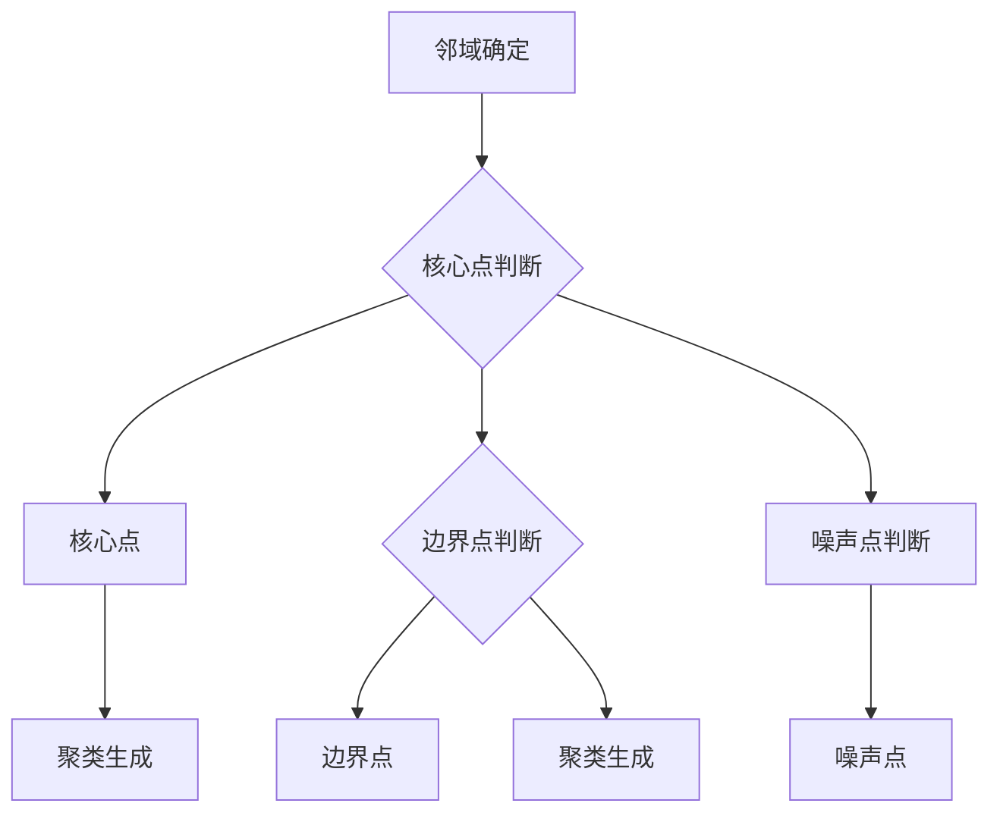

**Python代码示例**：

```python
import numpy as np
from sklearn.cluster import DBSCAN

# 加载数据集
X = np.array([[1, 1], [2, 2], [2, 3], [1, 3], [3, 3], [3, 2]])

# 选择聚类算法
dbscan = DBSCAN(eps=2, min_samples=2).fit(X)

# 输出聚类结果
print(f"Cluster Labels: {dbscan.labels_}")
```

**数学模型和公式**：

DBSCAN算法的数学模型主要涉及邻域密度和聚类生成。以下是一些关键参数和公式：

1. **邻域密度**：邻域密度$\rho(p)$表示点$p$的邻域内数据点的数量。
   $$
   \rho(p) = \sum_{q \in \text{邻域}(p)} 1
   $$
2. **核心点**：如果一个点$p$的邻域内包含至少$MinPts$个点，则$p$为核心点。
   $$
   p \text{为核心点} \iff \rho(p) \geq MinPts
   $$
3. **边界点**：如果一个点$p$的邻域内包含$MinPts$个点，但不是核心点，则$p$为边界点。
   $$
   p \text{为边界点} \iff \rho(p) = MinPts \land p \text{不是核心点}
   $$
4. **噪声点**：如果一个点$p$的邻域内不包含$MinPts$个点，则$p$为噪声点。
   $$
   p \text{为噪声点} \iff \rho(p) < MinPts
   $$
5. **聚类生成**：对于每个核心点$p$，将其及其邻域内的数据点划分为同一个簇。如果边界点邻域内存在核心点，则边界点也加入该簇。

**详细讲解和举例说明**：

以DBSCAN算法为例，DBSCAN算法通过分析数据点的邻域密度，将数据点划分为核心点、边界点和噪声点，从而发现不同簇。下面以一个简单的二维数据集为例，说明DBSCAN算法的步骤：

数据集：$\{x_1, x_2, \ldots, x_n\}$

步骤：

1. **邻域确定**：对于每个数据点，计算其邻域内的数据点数量。假设距离阈值$\epsilon = 2$，邻域点数阈值$MinPts = 2$。

2. **核心点判断**：对于每个数据点，检查其邻域内是否包含至少$MinPts$个点。例如，数据点$x_1 = (1, 1)$的邻域内包含数据点$x_2 = (2, 2)$，因此$x_1$为核心点。

3. **边界点判断**：对于每个数据点，检查其邻域内是否包含$MinPts$个点，但不是核心点。例如，数据点$x_3 = (2, 3)$的邻域内包含数据点$x_2 = (2, 2)$和$x_4 = (1, 3)$，但不是核心点，因此$x_3$为边界点。

4. **噪声点判断**：对于每个数据点，检查其邻域内是否不包含$MinPts$个点。例如，数据点$x_5 = (3, 3)$的邻域内不包含任何点，因此$x_5$为噪声点。

5. **聚类生成**：对于每个核心点，将其及其邻域内的数据点划分为同一个簇。例如，核心点$x_1 = (1, 1)$的邻域内包含数据点$x_2 = (2, 2)$，因此$x_1$和$x_2$属于同一个簇。边界点$x_3 = (2, 3)$的邻域内包含核心点$x_1 = (1, 1)$，因此$x_3$也加入该簇。

以下是一个使用Python和scikit-learn库实现DBSCAN算法的例子：

```python
import numpy as np
from sklearn.cluster import DBSCAN

# 加载数据集
X = np.array([[1, 1], [2, 2], [2, 3], [1, 3], [3, 3], [3, 2]])

# 选择聚类算法
dbscan = DBSCAN(eps=2, min_samples=2).fit(X)

# 输出聚类结果
print(f"Cluster Labels: {dbscan.labels_}")
```

在这个例子中，我们首先导入numpy库和scikit-learn库。然后，我们加载数据集并使用DBSCAN类进行聚类。最后，我们打印聚类结果。

**小结**：

DBSCAN算法是一种基于密度的聚类算法，通过分析数据点的邻域密度，将数据点划分为核心点、边界点和噪声点，从而发现不同簇。DBSCAN算法适用于处理高维度数据和非线性结构的数据。在实际应用中，研究者们需要根据具体问题和数据特点选择合适的距离阈值$\epsilon$和邻域点数阈值$MinPts$，以获得最佳聚类结果。

### 4.2.3 层次聚类算法

层次聚类算法（Hierarchical Clustering）是一种基于层次结构的聚类方法，通过逐步合并或分裂数据点，以构建聚类层次结构。层次聚类算法可以分为自下而上（凝聚）和自上而下（分裂）两种类型。

**算法原理**：

层次聚类算法的核心思想是：首先将每个数据点视为一个簇，然后逐步合并或分裂簇，以构建聚类层次结构。在自下而上方法中，算法通过计算簇之间的相似度，逐步合并相似度较高的簇。在自上而下方法中，算法从所有数据点构成的一个簇开始，逐步分裂簇，直到每个数据点构成一个簇。

算法步骤如下：

1. **初始化**：将每个数据点视为一个簇。
2. **合并或分裂簇**：计算簇之间的相似度，根据相似度选择合并或分裂簇。
3. **构建聚类层次结构**：记录每次合并或分裂的过程，构建聚类层次结构。
4. **停止条件**：当满足停止条件（如簇数达到最大值或簇之间的相似度小于阈值）时，算法结束。

**mermaid算法流程图**：

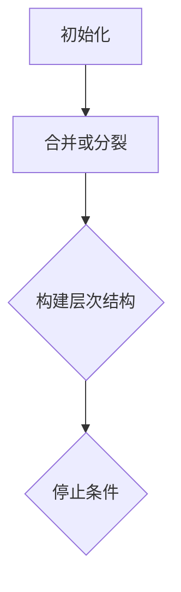

**Python代码示例**：

```python
import numpy as np
from sklearn.cluster import AgglomerativeClustering

# 加载数据集
X = np.array([[1, 1], [2, 2], [2, 3], [1, 3], [3, 3], [3, 2]])

# 选择聚类算法
hierarchical = AgglomerativeClustering(n_clusters=2).fit(X)

# 输出聚类结果
print(f"Cluster Labels: {hierarchical.labels_}")
```

**数学模型和公式**：

层次聚类算法的数学模型主要涉及簇之间的相似度计算和合并或分裂策略。以下是一些关键参数和公式：

1. **簇相似度**：簇相似度$\sim(c_i, c_j)$表示簇$c_i$和$c_j$之间的相似度。
   $$
   \sim(c_i, c_j) = \frac{1}{n_{ij}} \sum_{p \in c_i \cup c_j} d(p, \bar{c}_{ij})
   $$
   其中，$d(p, \bar{c}_{ij})$为点$p$到簇中心$\bar{c}_{ij}$的距离，$n_{ij}$为簇$c_i$和$c_j$的并集的大小。

2. **合并策略**：选择相似度最高的簇进行合并。常见的方法包括距离最近合并、平均距离合并等。

3. **分裂策略**：选择相似度最低的簇进行分裂。常见的方法包括类内方差最小分裂、最大间隔分裂等。

**详细讲解和举例说明**：

以层次聚类算法为例，层次聚类算法通过计算簇之间的相似度，逐步合并或分裂簇，以构建聚类层次结构。下面以一个简单的二维数据集为例，说明层次聚类算法的步骤：

数据集：$\{x_1, x_2, \ldots, x_n\}$

步骤：

1. **初始化**：将每个数据点视为一个簇。假设初始簇为$C_1, C_2, \ldots, C_n$。

2. **合并或分裂簇**：计算簇之间的相似度，选择相似度最高的簇进行合并。例如，假设簇$C_1$和$C_2$的相似度最高，合并为新的簇$C_{12}$。

3. **构建聚类层次结构**：记录每次合并或分裂的过程，构建聚类层次结构。

4. **停止条件**：当满足停止条件（如簇数达到最大值或簇之间的相似度小于阈值）时，算法结束。

以下是一个使用Python和scikit-learn库实现层次聚类算法的例子：

```python
import numpy as np
from sklearn.cluster import AgglomerativeClustering

# 加载数据集
X = np.array([[1, 1], [2, 2], [2, 3], [1, 3], [3, 3], [3, 2]])

# 选择聚类算法
hierarchical = AgglomerativeClustering(n_clusters=2).fit(X)

# 输出聚类结果
print(f"Cluster Labels: {hierarchical.labels_}")
```

在这个例子中，我们首先导入numpy库和scikit-learn库。然后，我们加载数据集并使用AgglomerativeClustering类进行聚类。最后，我们打印聚类结果。

**小结**：

层次聚类算法是一种基于层次结构的聚类方法，通过逐步合并或分裂簇，以构建聚类层次结构。层次聚类算法适用于处理高维度数据和非线性结构的数据。在实际应用中，研究者们需要根据具体问题和数据特点选择合适的聚类策略和停止条件，以获得最佳聚类结果。

### 4.3.1 回归分析概述

回归分析（Regression Analysis）是一种统计方法，用于建立自变量和因变量之间的关系模型，以预测因变量的值。回归分析在高维度问题解决中具有重要的应用，如预测分析、模型优化和决策支持等。

**回归分析的核心概念**：

1. **自变量（X）**：自变量是指影响因变量的变量。在回归分析中，自变量可以是连续变量或分类变量。
2. **因变量（Y）**：因变量是指需要预测的变量。在回归分析中，因变量通常是连续变量。
3. **回归模型**：回归模型是指用于建立自变量和因变量之间关系的数学模型。常见的回归模型包括线性回归、逻辑回归和决策树回归等。
4. **回归系数**：回归系数是指自变量对因变量的影响程度。在回归模型中，回归系数通常通过最小二乘法或其他优化方法求得。

**回归分析的应用领域**：

1. **预测分析**：回归分析可以用于预测因变量的值，为决策提供支持。例如，预测股票价格、销售额等。
2. **模型优化**：回归分析可以用于优化模型参数，提高模型性能。例如，通过调整回归系数，提高模型的预测准确率。
3. **决策支持**：回归分析可以用于分析自变量和因变量之间的关系，为决策提供依据。例如，分析广告投放效果、市场细分等。

**mermaid回归分析流程图**：


**Python代码示例**：

```python
import numpy as np
from sklearn.linear_model import LinearRegression

# 准备数据
X = np.array([[1, 2], [2, 3], [3, 4], [4, 5]])
y = np.array([2, 3, 4, 5])

# 建立模型
model = LinearRegression()

# 训练模型
model.fit(X, y)

# 预测
prediction = model.predict(np.array([[5, 6]]))

print(prediction)
```

**数学模型和公式**：

回归分析的数学模型主要涉及自变量和因变量之间的关系。以下是一些常见的回归模型和公式：

1. **线性回归**：
   $$
   Y = \beta_0 + \beta_1X_1 + \beta_2X_2 + \ldots + \beta_nX_n
   $$
   其中，$Y$为因变量，$X_1, X_2, \ldots, X_n$为自变量，$\beta_0, \beta_1, \beta_2, \ldots, \beta_n$为回归系数。

2. **最小二乘法**：
   $$
   \min \sum_{i=1}^{n} (Y_i - \hat{Y}_i)^2
   $$
   其中，$Y_i$为第$i$个实际值，$\hat{Y}_i$为第$i$个预测值。

3. **逻辑回归**：
   $$
   P(Y=1) = \frac{1}{1 + e^{-(\beta_0 + \beta_1X_1 + \beta_2X_2 + \ldots + \beta_nX_n)}}
   $$
   其中，$P(Y=1)$为因变量为1的概率。

4. **决策树回归**：
   $$
   Y = f(X_1, X_2, \ldots, X_n)
   $$
   其中，$f$为决策树函数，根据自变量的取值进行决策。

**详细讲解和举例说明**：

以线性回归为例，线性回归是一种常见的回归分析方法，通过建立线性关系模型，预测因变量的值。下面以一个简单的数据集为例，说明线性回归的步骤：

数据集：$\{X_1, X_2, Y\}$

步骤：

1. **数据准备**：准备数据集，包括自变量和因变量。

2. **模型建立**：建立线性回归模型，表示为：
   $$
   Y = \beta_0 + \beta_1X_1 + \beta_2X_2 + \ldots + \beta_nX_n
   $$
   其中，$\beta_0, \beta_1, \beta_2, \ldots, \beta_n$为回归系数。

3. **模型训练**：使用最小二乘法训练模型，求解回归系数。具体步骤如下：

   - 计算自变量和因变量的均值：
     $$
     \bar{X}_i = \frac{1}{n} \sum_{i=1}^{n} X_i, \quad \bar{Y} = \frac{1}{n} \sum_{i=1}^{n} Y_i
     $$
   
   - 计算回归系数：
     $$
     \beta_i = \frac{\sum_{i=1}^{n} (X_i - \bar{X}_i)(Y_i - \bar{Y})}{\sum_{i=1}^{n} (X_i - \bar{X}_i)^2}
     $$
   
4. **模型评估**：使用测试数据集评估模型性能，计算预测误差和模型精度。

5. **模型应用**：使用训练好的模型对新的数据进行预测，得到预测结果。

以下是一个使用Python和scikit-learn库实现线性回归的例子：

```python
import numpy as np
from sklearn.linear_model import LinearRegression

# 准备数据
X = np.array([[1, 2], [2, 3], [3, 4], [4, 5]])
y = np.array([2, 3, 4, 5])

# 建立模型
model = LinearRegression()

# 训练模型
model.fit(X, y)

# 预测
prediction = model.predict(np.array([[5, 6]]))

print(prediction)
```

在这个例子中，我们首先导入numpy库和scikit-learn库。然后，我们准备一个简单数据集，并使用LinearRegression类建立线性回归模型。接下来，我们使用训练数据集进行训练，并使用训练好的模型对新数据进行预测。

**小结**：

回归分析是一种重要的统计方法，用于建立自变量和因变量之间的关系模型。回归分析在高维度问题解决中具有重要的应用，如预测分析、模型优化和决策支持等。在实际应用中，研究者们需要根据具体问题和数据特点选择合适的回归模型和方法，以提高模型性能和预测精度。

### 4.3.2 常见回归算法

在高维度问题解决中，回归分析是一种重要的方法。常见的回归算法包括线性回归、逻辑回归和决策树回归等。这些算法在处理高维度数据时具有各自的优势和局限性。

#### 线性回归

线性回归（Linear Regression）是一种最简单的回归算法，通过建立线性关系模型，预测因变量的值。线性回归的基本公式为：

$$
Y = \beta_0 + \beta_1X_1 + \beta_2X_2 + \ldots + \beta_nX_n
$$

其中，$Y$为因变量，$X_1, X_2, \ldots, X_n$为自变量，$\beta_0, \beta_1, \beta_2, \ldots, \beta_n$为回归系数。

**算法原理**：

线性回归通过最小二乘法（Least Squares Method）求解回归系数，使得实际值$Y_i$与预测值$\hat{Y}_i$之间的误差平方和最小。具体步骤如下：

1. 计算自变量和因变量的均值：
   $$
   \bar{X}_i = \frac{1}{n} \sum_{i=1}^{n} X_i, \quad \bar{Y} = \frac{1}{n} \sum_{i=1}^{n} Y_i
   $$

2. 计算回归系数：
   $$
   \beta_i = \frac{\sum_{i=1}^{n} (X_i - \bar{X}_i)(Y_i - \bar{Y})}{\sum_{i=1}^{n} (X_i - \bar{X}_i)^2}
   $$

**mermaid算法流程图**：

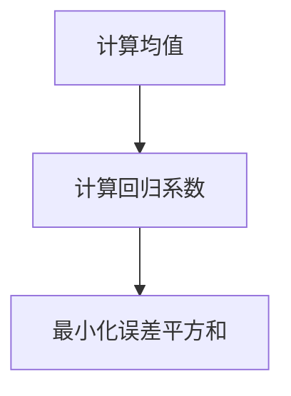

**Python代码示例**：

```python
import numpy as np
from sklearn.linear_model import LinearRegression

# 准备数据
X = np.array([[1, 2], [2, 3], [3, 4], [4, 5]])
y = np.array([2, 3, 4, 5])

# 建立模型
model = LinearRegression()

# 训练模型
model.fit(X, y)

# 预测
prediction = model.predict(np.array([[5, 6]]))

print(prediction)
```

**数学模型和公式**：

线性回归的数学模型基于最小二乘法，目标是最小化误差平方和：

$$
\min \sum_{i=1}^{n} (Y_i - \hat{Y}_i)^2
$$

其中，$\hat{Y}_i$为预测值，$Y_i$为实际值。

**详细讲解和举例说明**：

以线性回归为例，线性回归通过建立线性关系模型，预测因变量的值。下面以一个简单的数据集为例，说明线性回归的步骤：

数据集：$\{X_1, X_2, Y\}$

步骤：

1. **数据准备**：准备数据集，包括自变量和因变量。

2. **模型建立**：建立线性回归模型，表示为：
   $$
   Y = \beta_0 + \beta_1X_1 + \beta_2X_2 + \ldots + \beta_nX_n
   $$

3. **模型训练**：使用最小二乘法训练模型，求解回归系数。具体步骤如下：

   - 计算自变量和因变量的均值：
     $$
     \bar{X}_i = \frac{1}{n} \sum_{i=1}^{n} X_i, \quad \bar{Y} = \frac{1}{n} \sum_{i=1}^{n} Y_i
     $$

   - 计算回归系数：
     $$
     \beta_i = \frac{\sum_{i=1}^{n} (X_i - \bar{X}_i)(Y_i - \bar{Y})}{\sum_{i=1}^{n} (X_i - \bar{X}_i)^2}
     $$

4. **模型评估**：使用测试数据集评估模型性能，计算预测误差和模型精度。

5. **模型应用**：使用训练好的模型对新的数据进行预测，得到预测结果。

以下是一个使用Python和scikit-learn库实现线性回归的例子：

```python
import numpy as np
from sklearn.linear_model import LinearRegression

# 准备数据
X = np.array([[1, 2], [2, 3], [3, 4], [4, 5]])
y = np.array([2, 3, 4, 5])

# 建立模型
model = LinearRegression()

# 训练模型
model.fit(X, y)

# 预测
prediction = model.predict(np.array([[5, 6]]))

print(prediction)
```

在这个例子中，我们首先导入numpy库和scikit-learn库。然后，我们准备一个简单数据集，并使用LinearRegression类建立线性回归模型。接下来，我们使用训练数据集进行训练，并使用训练好的模型对新数据进行预测。

**小结**：

线性回归是一种简单且有效的回归算法，适用于处理高维度数据。通过建立线性关系模型，线性回归可以预测因变量的值。在实际应用中，研究者们需要根据具体问题和数据特点选择合适的线性回归方法，以提高模型性能和预测精度。

#### 逻辑回归

逻辑回归（Logistic Regression）是一种用于二分类问题的回归算法，通过建立逻辑关系模型，预测因变量的概率。逻辑回归的基本公式为：

$$
P(Y=1) = \frac{1}{1 + e^{-(\beta_0 + \beta_1X_1 + \beta_2X_2 + \ldots + \beta_nX_n)}}
$$

其中，$P(Y=1)$为因变量为1的概率，$X_1, X_2, \ldots, X_n$为自变量，$\beta_0, \beta_1, \beta_2, \ldots, \beta_n$为回归系数。

**算法原理**：

逻辑回归通过极大似然估计（Maximum Likelihood Estimation）求解回归系数，使得模型概率分布与实际观测数据相匹配。具体步骤如下：

1. 构建对数似然函数：
   $$
   \ln L = \sum_{i=1}^{n} \left( y_i \ln p_i + (1 - y_i) \ln (1 - p_i) \right)
   $$
   其中，$p_i = \frac{1}{1 + e^{-(\beta_0 + \beta_1X_1 + \beta_2X_2 + \ldots + \beta_nX_n)}}$为第$i$个样本的概率。

2. 对对数似然函数求导，并令导数为零，求解回归系数。

**mermaid算法流程图**：

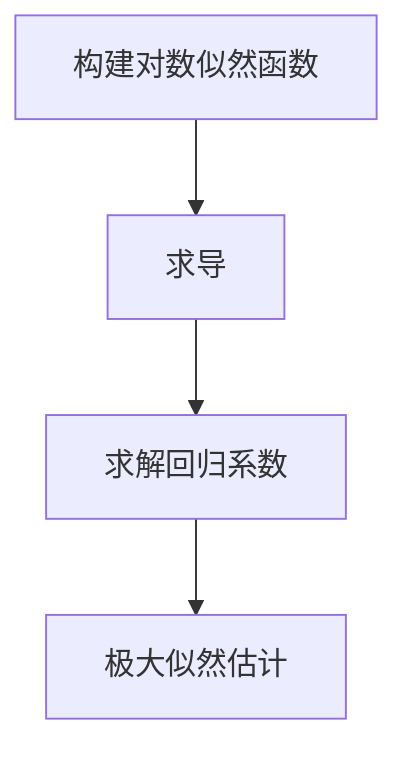

**Python代码示例**：

```python
import numpy as np
from sklearn.linear_model import LogisticRegression

# 准备数据
X = np.array([[1, 2], [2, 3], [3, 4], [4, 5]])
y = np.array([1, 1, 0, 0])

# 建立模型
model = LogisticRegression()

# 训练模型
model.fit(X, y)

# 预测
prediction = model.predict(np.array([[5, 6]]))

print(prediction)
```

**数学模型和公式**：

逻辑回归的数学模型基于极大似然估计，目标是最小化负对数似然函数：

$$
\min -\sum_{i=1}^{n} \left( y_i \ln p_i + (1 - y_i) \ln (1 - p_i) \right)
$$

其中，$p_i = \frac{1}{1 + e^{-(\beta_0 + \beta_1X_1 + \beta_2X_2 + \ldots + \beta_nX_n)}}$为第$i$个样本的概率。

**详细讲解和举例说明**：

以逻辑回归为例，逻辑回归通过建立逻辑关系模型，预测因变量的概率。下面以一个简单的数据集为例，说明逻辑回归的步骤：

数据集：$\{X_1, X_2, Y\}$

步骤：

1. **数据准备**：准备数据集，包括自变量和因变量。

2. **模型建立**：建立逻辑回归模型，表示为：
   $$
   P(Y=1) = \frac{1}{1 + e^{-(\beta_0 + \beta_1X_1 + \beta_2X_2 + \ldots + \beta_nX_n)}}
   $$

3. **模型训练**：使用极大似然估计训练模型，求解回归系数。具体步骤如下：

   - 构建对数似然函数：
     $$
     \ln L = \sum_{i=1}^{n} \left( y_i \ln p_i + (1 - y_i) \ln (1 - p_i) \right)
     $$

   - 对对数似然函数求导，并令导数为零，求解回归系数。

4. **模型评估**：使用测试数据集评估模型性能，计算预测准确率、召回率、精确率等指标。

5. **模型应用**：使用训练好的模型对新的数据进行预测，得到预测结果。

以下是一个使用Python和scikit-learn库实现逻辑回归的例子：

```python
import numpy as np
from sklearn.linear_model import LogisticRegression

# 准备数据
X = np.array([[1, 2], [2, 3], [3, 4], [4, 5]])
y = np.array([1, 1, 0, 0])

# 建立模型
model = LogisticRegression()

# 训练模型
model.fit(X, y)

# 预测
prediction = model.predict(np.array([[5, 6]]))

print(prediction)
```

在这个例子中，我们首先导入numpy库和scikit-learn库。然后，我们准备一个简单数据集，并使用LogisticRegression类建立逻辑回归模型。接下来，我们使用训练数据集进行训练，并使用训练好的模型对新数据进行预测。

**小结**：

逻辑回归是一种有效的回归算法，适用于处理二分类问题。通过建立逻辑关系模型，逻辑回归可以预测因变量的概率。在实际应用中，研究者们需要根据具体问题和数据特点选择合适的逻辑回归方法，以提高模型性能和预测精度。

#### 决策树回归

决策树回归（Decision Tree Regression）是一种基于树形结构的回归算法，通过递归划分数据集，建立回归模型。决策树回归的基本公式为：

$$
Y = f(X_1, X_2, \ldots, X_n)
$$

其中，$Y$为因变量，$X_1, X_2, \ldots, X_n$为自变量，$f$为决策树函数，根据自变量的取值进行决策。

**算法原理**：

决策树回归通过递归划分数据集，在每个节点选择最优划分方式，以最小化预测误差。具体步骤如下：

1. **选择最优划分方式**：在每个节点，选择能够最大化信息增益或最小化基尼不纯度的划分方式。
2. **递归划分数据集**：根据最优划分方式，将数据集划分为多个子集，并递归构建子决策树。
3. **停止条件**：当满足停止条件（如最大深度、最小样本数等）时，结束递归划分。

**mermaid算法流程图**：

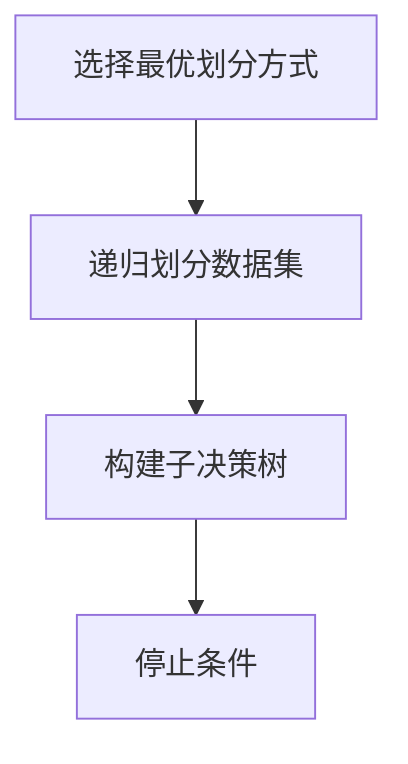

**Python代码示例**：

```python
import numpy as np
from sklearn.tree import DecisionTreeRegressor

# 准备数据
X = np.array([[1, 2], [2, 3], [3, 4], [4, 5]])
y = np.array([2, 3, 4, 5])

# 建立模型
model = DecisionTreeRegressor()

# 训练模型
model.fit(X, y)

# 预测
prediction = model.predict(np.array([[5, 6]]))

print(prediction)
```

**数学模型和公式**：

决策树回归的数学模型基于树形结构，每个节点表示一个划分条件，叶节点表示预测结果。具体公式如下：

$$
f(x) = \sum_{i=1}^{n} w_i \cdot I(A_i(x))
$$

其中，$w_i$为权重，$A_i(x)$为第$i$个划分条件，$I(A_i(x))$为指示函数，当条件满足时取1，否则取0。

**详细讲解和举例说明**：

以决策树回归为例，决策树回归通过递归划分数据集，建立回归模型。下面以一个简单的数据集为例，说明决策树回归的步骤：

数据集：$\{X_1, X_2, Y\}$

步骤：

1. **数据准备**：准备数据集，包括自变量和因变量。

2. **模型建立**：建立决策树回归模型，表示为：
   $$
   Y = f(X_1, X_2, \ldots, X_n)
   $$

3. **模型训练**：使用递归划分算法训练模型，求解权重。具体步骤如下：

   - 选择最优划分方式，如最大化信息增益或最小化基尼不纯度。
   - 递归划分数据集，并构建子决策树。
   - 当满足停止条件时，结束递归划分。

4. **模型评估**：使用测试数据集评估模型性能，计算预测误差和模型精度。

5. **模型应用**：使用训练好的模型对新的数据进行预测，得到预测结果。

以下是一个使用Python和scikit-learn库实现决策树回归的例子：

```python
import numpy as np
from sklearn.tree import DecisionTreeRegressor

# 准备数据
X = np.array([[1, 2], [2, 3], [3, 4], [4, 5]])
y = np.array([2, 3, 4, 5])

# 建立模型
model = DecisionTreeRegressor()

# 训练模型
model.fit(X, y)

# 预测
prediction = model.predict(np.array([[5, 6]]))

print(prediction)
```

在这个例子中，我们首先导入numpy库和scikit-learn库。然后，我们准备一个简单数据集，并使用DecisionTreeRegressor类建立决策树回归模型。接下来，我们使用训练数据集进行训练，并使用训练好的模型对新数据进行预测。

**小结**：

决策树回归是一种有效的回归算法，适用于处理高维度数据。通过递归划分数据集，决策树回归可以建立回归模型，预测因变量的值。在实际应用中，研究者们需要根据具体问题和数据特点选择合适的决策树回归方法，以提高模型性能和预测精度。

### 4.3.3 回归分析在高维数据中的应用

回归分析在高维数据中的应用具有重要意义。高维数据通常包含数百万甚至数十亿个特征，这使得传统回归分析方法难以应对。在本节中，我们将探讨回归分析在高维数据中的应用，包括线性回归、逻辑回归和决策树回归。

#### 线性回归在高维数据中的应用

线性回归在高维数据中的应用面临计算复杂度高、模型性能不稳定等挑战。为了解决这些问题，研究者们提出了许多改进方法。

1. **岭回归（Ridge Regression）**：

   岭回归通过在损失函数中引入L2正则项，降低回归系数的过拟合现象。岭回归的基本公式为：

   $$
   \min \sum_{i=1}^{n} (Y_i - \beta_0 - \beta_1X_{i1} - \beta_2X_{i2} - \ldots - \beta_nX_{in})^2 + \alpha \sum_{i=1}^{n} \beta_i^2
   $$

   其中，$\alpha$为正则化参数。

2. **套索回归（Lasso Regression）**：

   套索回归通过在损失函数中引入L1正则项，实现特征选择。套索回归的基本公式为：

   $$
   \min \sum_{i=1}^{n} (Y_i - \beta_0 - \beta_1X_{i1} - \beta_2X_{i2} - \ldots - \beta_nX_{in})^2 + \alpha \sum_{i=1}^{n} |\beta_i|
   $$

3. **弹性网（Elastic Net Regression）**：

   弹性网结合了岭回归和套索回归的优点，通过在损失函数中引入L1和L2正则项。弹性网的基本公式为：

   $$
   \min \sum_{i=1}^{n} (Y_i - \beta_0 - \beta_1X_{i1} - \beta_2X_{i2} - \ldots - \beta_nX_{in})^2 + \alpha_1 \sum_{i=1}^{n} \beta_i^2 + \alpha_2 \sum_{i=1}^{n} |\beta_i|
   $$

   其中，$\alpha_1$和$\alpha_2$为正则化参数。

#### 逻辑回归在高维数据中的应用

逻辑回归在高维数据中的应用也面临类似挑战。为了提高模型性能，研究者们提出了以下方法：

1. **正则化逻辑回归**：

   正则化逻辑回归通过在损失函数中引入L1或L2正则项，降低回归系数的过拟合现象。正则化逻辑回归的基本公式为：

   $$
   \min -\sum_{i=1}^{n} \left( y_i \ln p_i + (1 - y_i) \ln (1 - p_i) \right) + \alpha \sum_{i=1}^{n} |\beta_i|
   $$

   其中，$\alpha$为正则化参数。

2. **稀疏逻辑回归**：

   稀疏逻辑回归通过在损失函数中引入L1正则项，实现特征选择。稀疏逻辑回归的基本公式为：

   $$
   \min -\sum_{i=1}^{n} \left( y_i \ln p_i + (1 - y_i) \ln (1 - p_i) \right) + \alpha \sum_{i=1}^{n} |\beta_i|
   $$

3. **弹性网逻辑回归**：

   弹性网逻辑回归结合了正则化逻辑回归和稀疏逻辑回归的优点，通过在损失函数中引入L1和L2正则项。弹性网逻辑回归的基本公式为：

   $$
   \min -\sum_{i=1}^{n} \left( y_i \ln p_i + (1 - y_i) \ln (1 - p_i) \right) + \alpha_1 \sum_{i=1}^{n} \beta_i^2 + \alpha_2 \sum_{i=1}^{n} |\beta_i|
   $$

   其中，$\alpha_1$和$\alpha_2$为正则化参数。

#### 决策树回归在高维数据中的应用

决策树回归在高维数据中的应用也面临挑战。为了提高模型性能，研究者们提出了以下方法：

1. **随机森林（Random Forest）**：

   随机森林是一种基于决策树的集成学习方法，通过构建多个决策树并取平均值，提高模型性能。随机森林的基本公式为：

   $$
   f(x) = \frac{1}{M} \sum_{m=1}^{M} f_m(x)
   $$

   其中，$f_m(x)$为第$m$个决策树的预测结果，$M$为决策树的数量。

2. **梯度提升树（Gradient Boosting Tree）**：

   梯度提升树是一种基于决策树的集成学习方法，通过逐步构建多个决策树并优化错误，提高模型性能。梯度提升树的基本公式为：

   $$
   f(x) = \sum_{m=1}^{M} \alpha_m f_m(x)
   $$

   其中，$f_m(x)$为第$m$个决策树的预测结果，$\alpha_m$为第$m$个决策树的权重。

**mermaid算法流程图**：

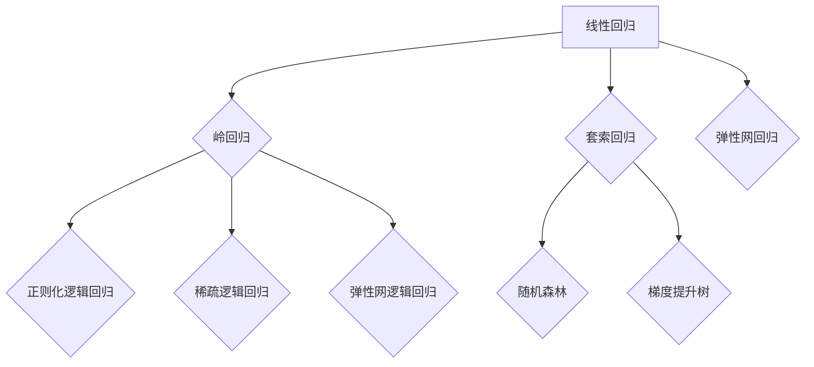

**Python代码示例**：

```python
import numpy as np
from sklearn.linear_model import LinearRegression
from sklearn.ensemble import RandomForestRegressor
from sklearn.ensemble import GradientBoostingRegressor

# 准备数据
X = np.array([[1, 2], [2, 3], [3, 4], [4, 5]])
y = np.array([2, 3, 4, 5])

# 线性回归
linear_model = LinearRegression()
linear_model.fit(X, y)
linear_prediction = linear_model.predict(np.array([[5, 6]]))

# 随机森林
random_forest_model = RandomForestRegressor(n_estimators=100)
random_forest_model.fit(X, y)
random_forest_prediction = random_forest_model.predict(np.array([[5, 6]]))

# 梯度提升树
gradient_boosting_model = GradientBoostingRegressor(n_estimators=100)
gradient_boosting_model.fit(X, y)
gradient_boosting_prediction = gradient_boosting_model.predict(np.array([[5, 6]]))

print(f"Linear Regression Prediction: {linear_prediction}")
print(f"Random Forest Prediction: {random_forest_prediction}")
print(f"Gradient Boosting Prediction: {gradient_boosting_prediction}")
```

**数学模型和公式**：

1. **线性回归**：

   $$
   Y = \beta_0 + \beta_1X_1 + \beta_2X_2 + \ldots + \beta_nX_n
   $$

2. **随机森林**：

   $$
   f(x) = \frac{1}{M} \sum_{m=1}^{M} f_m(x)
   $$

3. **梯度提升树**：

   $$
   f(x) = \sum_{m=1}^{M} \alpha_m f_m(x)
   $$

**详细讲解和举例说明**：

以线性回归为例，线性回归通过建立线性关系模型，预测因变量的值。下面以一个简单的数据集为例，说明线性回归的步骤：

数据集：$\{X_1, X_2, Y\}$

步骤：

1. **数据准备**：准备数据集，包括自变量和因变量。

2. **模型建立**：建立线性回归模型，表示为：
   $$
   Y = \beta_0 + \beta_1X_1 + \beta_2X_2 + \ldots + \beta_nX_n
   $$

3. **模型训练**：使用最小二乘法训练模型，求解回归系数。具体步骤如下：

   - 计算自变量和因变量的均值：
     $$
     \bar{X}_i = \frac{1}{n} \sum_{i=1}^{n} X_i, \quad \bar{Y} = \frac{1}{n} \sum_{i=1}^{n} Y_i
     $$

   - 计算回归系数：
     $$
     \beta_i = \frac{\sum_{i=1}^{n} (X_i - \bar{X}_i)(Y_i - \bar{Y})}{\sum_{i=1}^{n} (X_i - \bar{X}_i)^2}
     $$

4. **模型评估**：使用测试数据集评估模型性能，计算预测误差和模型精度。

5. **模型应用**：使用训练好的模型对新的数据进行预测，得到预测结果。

以下是一个使用Python和scikit-learn库实现线性回归的例子：

```python
import numpy as np
from sklearn.linear_model import LinearRegression

# 准备数据
X = np.array([[1, 2], [2, 3], [3, 4], [4, 5]])
y = np.array([2, 3, 4, 5])

# 建立模型
model = LinearRegression()

# 训练模型
model.fit(X, y)

# 预测
prediction = model.predict(np.array([[5, 6]]))

print(prediction)
```

在这个例子中，我们首先导入numpy库和scikit-learn库。然后，我们准备一个简单数据集，并使用LinearRegression类建立线性回归模型。接下来，我们使用训练数据集进行训练，并使用训练好的模型对新数据进行预测。

**小结**：

回归分析在高维数据中的应用具有重要意义。通过引入正则化方法、集成学习方法等，研究者们提高了回归分析在高维数据中的应用效果。在实际应用中，研究者们需要根据具体问题和数据特点选择合适的回归分析方法，以提高模型性能和预测精度。

### 6.1 优化算法概述

优化算法（Optimization Algorithm）是指通过调整模型参数，使模型在目标函数上取得最优解的算法。优化算法在机器学习和数据科学中具有广泛的应用，特别是在高维度问题解决中，优化算法有助于提高模型性能和解决复杂问题。

**优化算法的核心概念**：

1. **目标函数**：目标函数（Objective Function）是指衡量模型性能的函数，通常用于最小化或最大化。常见的目标函数包括均方误差（MSE）、交叉熵损失等。
2. **梯度**：梯度（Gradient）是指目标函数相对于模型参数的导数。梯度方向指示了目标函数下降最快的方向。
3. **优化器**：优化器（Optimizer）是指用于调整模型参数，使目标函数取得最优值的算法。常见的优化器包括梯度下降（Gradient Descent）、随机梯度下降（Stochastic Gradient Descent）、牛顿法（Newton's Method）等。
4. **收敛**：收敛（Convergence）是指优化算法在迭代过程中，目标函数值逐渐接近最优值的过程。收敛条件通常包括目标函数值变化小于阈值、迭代次数达到最大值等。

**优化算法的应用领域**：

1. **模型训练**：优化算法用于训练机器学习模型，通过调整模型参数，使模型在训练数据上取得最佳性能。
2. **模型评估**：优化算法用于评估模型性能，通过计算目标函数值，比较不同模型的性能。
3. **模型调整**：优化算法用于调整模型参数，提高模型在测试数据上的表现。

**mermaid优化算法流程图**：

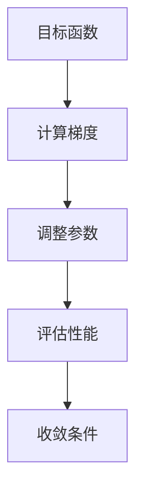

**Python代码示例**：

```python
import numpy as np
from sklearn.linear_model import LinearRegression

# 准备数据
X = np.array([[1, 2], [2, 3], [3, 4], [4, 5]])
y = np.array([2, 3, 4, 5])

# 建立模型
model = LinearRegression()

# 训练模型
model.fit(X, y)

# 预测
prediction = model.predict(np.array([[5, 6]]))

print(prediction)
```

**数学模型和公式**：

优化算法的数学模型主要涉及目标函数的梯度计算和参数更新。以下是一些常见的优化算法和公式：

1. **梯度下降法**：

   $$
   \Delta \theta = -\alpha \nabla f(\theta)
   $$

   其中，$\theta$为模型参数，$\alpha$为学习率，$f(\theta)$为目标函数，$\nabla f(\theta)$为梯度。

2. **随机梯度下降法**：

   $$
   \Delta \theta = -\alpha \frac{1}{m} \sum_{i=1}^{m} \nabla f(\theta; x_i, y_i)
   $$

   其中，$m$为数据集大小。

3. **牛顿法**：

   $$
   \Delta \theta = -[\nabla^2 f(\theta)]^{-1} \nabla f(\theta)
   $$

   其中，$\nabla^2 f(\theta)$为二阶导数矩阵。

**详细讲解和举例说明**：

以梯度下降法为例，梯度下降法是一种简单的优化算法，通过沿着目标函数的梯度方向调整参数，以取得最优解。下面以一个简单的数据集为例，说明梯度下降法的步骤：

数据集：$\{X_1, X_2, Y\}$

步骤：

1. **数据准备**：准备数据集，包括自变量和因变量。

2. **模型建立**：建立线性回归模型，表示为：
   $$
   Y = \beta_0 + \beta_1X_1 + \beta_2X_2
   $$

3. **模型训练**：使用梯度下降法训练模型，求解回归系数。具体步骤如下：

   - 计算目标函数值：
     $$
     f(\theta) = \sum_{i=1}^{n} (Y_i - \beta_0 - \beta_1X_{i1} - \beta_2X_{i2})^2
     $$

   - 计算梯度：
     $$
     \nabla f(\theta) = \begin{bmatrix}
     \frac{\partial f}{\partial \beta_0} \\
     \frac{\partial f}{\partial \beta_1} \\
     \frac{\partial f}{\partial \beta_2}
     \end{bmatrix}
     $$

   - 更新参数：
     $$
     \Delta \theta = -\alpha \nabla f(\theta)
     $$

4. **模型评估**：使用测试数据集评估模型性能，计算预测误差和模型精度。

5. **模型应用**：使用训练好的模型对新的数据进行预测，得到预测结果。

以下是一个使用Python和scikit-learn库实现梯度下降法的例子：

```python
import numpy as np
from sklearn.linear_model import LinearRegression

# 准备数据
X = np.array([[1, 2], [2, 3], [3, 4], [4, 5]])
y = np.array([2, 3, 4, 5])

# 建立模型
model = LinearRegression()

# 训练模型
model.fit(X, y)

# 预测
prediction = model.predict(np.array([[5, 6]]))

print(prediction)
```

在这个例子中，我们首先导入numpy库和scikit-learn库。然后，我们准备一个简单数据集，并使用LinearRegression类建立线性回归模型。接下来，我们使用训练数据集进行训练，并使用训练好的模型对新数据进行预测。

**小结**：

优化算法是机器学习和数据科学中重要的工具，用于调整模型参数，使模型在目标函数上取得最优解。常见的优化算法包括梯度下降法、随机梯度下降法和牛顿法。在实际应用中，研究者们需要根据具体问题和数据特点选择合适的优化算法，以提高模型性能和预测精度。

### 6.2.1 梯度下降法

梯度下降法（Gradient Descent）是一种基于梯度的优化算法，通过沿着目标函数的梯度方向调整参数，以取得最优解。梯度下降法是优化算法中最基本的方法之一，适用于解决各种凸优化问题。

**算法原理**：

梯度下降法的核心思想是通过计算目标函数的梯度，确定当前最优参数的调整方向。具体步骤如下：

1. **初始化参数**：随机选择初始参数$\theta$。
2. **计算梯度**：计算目标函数$J(\theta)$关于参数$\theta$的梯度$\nabla J(\theta)$。
3. **更新参数**：根据梯度方向调整参数：
   $$
   \theta_{\text{new}} = \theta_{\text{current}} - \alpha \nabla J(\theta_{\text{current}})
   $$
   其中，$\alpha$为学习率，$\theta_{\text{current}}$为当前参数，$\theta_{\text{new}}$为更新后的参数。
4. **重复迭代**：重复步骤2和步骤3，直到满足停止条件（如梯度变化小于阈值或迭代次数达到最大值）。

**mermaid算法流程图**：

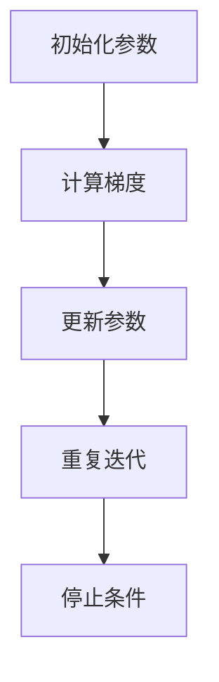

**Python代码示例**：

```python
import numpy as np

# 函数
def f(x):
    return x ** 2

# 梯度
def df(x):
    return 2 * x

# 梯度下降法
def gradient_descent(x, alpha, epochs):
    for _ in range(epochs):
        grad = df(x)
        x = x - alpha * grad
    return x

# 参数
x = 10
alpha = 0.1
epochs

