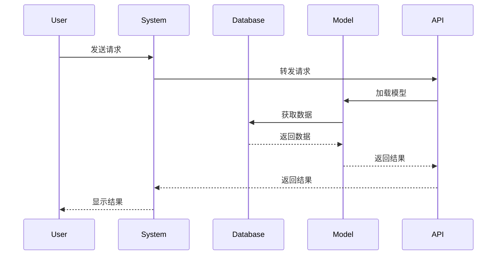
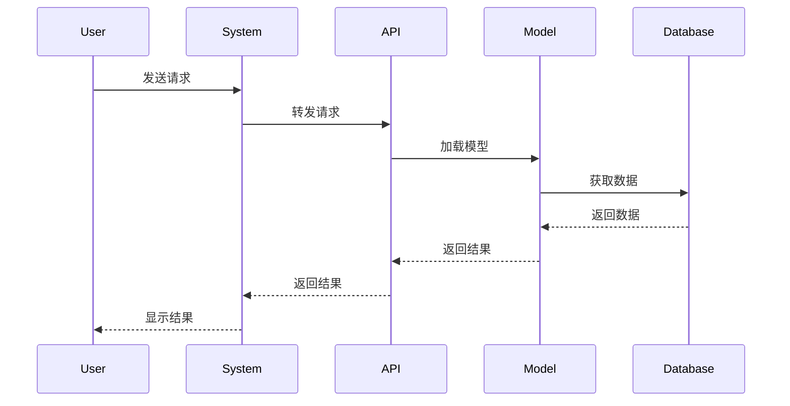

                 

**文章标题：** AI安全性：防御对抗性攻击的新方法

**关键词：** AI安全性，对抗性攻击，防御方法，神经网络，深度学习，机器学习

**摘要：** 本文章深入探讨了AI系统中的安全性问题，特别是对抗性攻击的威胁。通过分析对抗性攻击的概念、类型及其对AI系统的影响，我们提出了一系列防御对抗性攻击的新方法。文章从背景介绍、核心概念、算法原理、系统分析与架构设计、项目实战等多个角度，详细阐述了AI系统安全性的提升策略，旨在为相关领域的研究者和从业者提供有价值的参考。

**目录：**

----------------------------------------------------------------

## 第一部分：背景与概述

### 第1章：AI安全性的重要性
- **1.1 AI技术的发展与安全性挑战**
- **1.2 对抗性攻击的概念与类型**
- **1.3 AI安全性研究的现状与趋势**

### 第2章：AI系统的基本组成部分
- **2.1 数据预处理**
- **2.2 模型训练与评估**
- **2.3 模型部署与应用**

## 第二部分：核心概念与算法原理

### 第3章：对抗性攻击的原理分析
- **3.1 攻击方法概述**
- **3.2 攻击属性特征对比表格**
- **3.3 对抗性攻击的数学模型与公式**

### 第4章：防御对抗性攻击的新方法
- **4.1 数据增强技术**
- **4.2 模型检测与防御算法**
- **4.3 集成防御策略**

## 第三部分：系统分析与架构设计

### 第5章：系统功能设计
- **5.1 领域模型类图**
- **5.2 系统架构设计**

### 第6章：系统接口设计与交互
- **6.1 系统接口设计**
- **6.2 系统交互序列图**

## 第四部分：项目实战

### 第7章：环境安装与系统核心实现
- **7.1 环境安装**
- **7.2 系统核心实现源代码**
- **7.3 代码应用解读与分析**

### 第8章：实际案例分析
- **8.1 案例介绍**
- **8.2 详细讲解与剖析**
- **8.3 项目小结**

## 第五部分：最佳实践与拓展阅读

### 第9章：最佳实践 tips
- **9.1 实践经验总结**
- **9.2 小结与注意事项**

### 第10章：拓展阅读
- **10.1 相关研究论文**
- **10.2 推荐书籍与资源**

### 结语：AI安全性的未来展望
- **11.1 安全性发展趋势**
- **11.2 挑战与机遇**

**作者：** AI天才研究院/AI Genius Institute & 禅与计算机程序设计艺术 /Zen And The Art of Computer Programming

----------------------------------------------------------------

### 第一部分：背景与概述

#### 第1章：AI安全性的重要性

**1.1 AI技术的发展与安全性挑战**

人工智能（AI）作为当前科技领域的重要分支，其应用范围不断扩大，从医疗诊断到自动驾驶，从智能家居到金融服务，AI正在深刻地改变着我们的生活方式。然而，随着AI技术的迅速发展，安全性问题也日益凸显。

首先，AI系统的安全性挑战主要集中在以下几个方面：

1. **隐私泄露**：AI系统在处理和分析大量数据时，可能无意中泄露用户的隐私信息。例如，面部识别技术在提供便利的同时，也可能导致个人隐私的泄露。

2. **模型偏见**：AI模型在训练过程中可能会受到训练数据的偏见影响，从而在决策过程中产生不公平的结果。例如，招聘系统的算法可能会因为历史数据中的性别、种族偏见而导致某些群体被不公平对待。

3. **对抗性攻击**：攻击者可以通过精心设计的对抗性样本，欺骗AI系统做出错误的决策。这种攻击方式对AI系统的安全构成严重威胁。

**1.2 对抗性攻击的概念与类型**

对抗性攻击（Adversarial Attack）是指通过微小但精心设计的扰动，使得AI系统（通常是深度学习模型）产生错误决策的攻击方式。对抗性攻击可以大致分为以下几种类型：

1. **基于网络的对抗性攻击**：攻击者通过自动化工具生成对抗性样本，这些样本可以用于网络攻击，如拒绝服务攻击（DoS）或窃取敏感数据。

2. **模型特定的对抗性攻击**：这些攻击专门针对特定AI模型，利用模型对特定类型的扰动的脆弱性。

3. **利用物理设备进行的对抗性攻击**：攻击者通过物理设备（如传感器、摄像头等）收集数据，然后生成对抗性样本，对AI系统进行攻击。

**1.3 AI安全性研究的现状与趋势**

目前，AI安全性研究主要集中在以下几个方面：

1. **对抗性攻击检测与防御**：研究如何检测和防御对抗性攻击，包括基于统计学的方法、基于机器学习的方法等。

2. **安全AI模型设计**：探索如何设计出更加鲁棒、不易受对抗性攻击影响的AI模型。

3. **隐私保护**：研究如何在保证AI模型性能的同时，保护用户隐私。

未来，随着AI技术的不断进步，AI安全性研究也将面临新的挑战和机遇。如何构建一个安全、可靠、公平的AI系统，将成为研究者和从业者共同关注的问题。

**边界与外延：** 本文将重点探讨AI系统中的对抗性攻击及其防御方法，为相关领域的研究者和从业者提供参考。同时，本文也将涉及AI系统中的其他安全性问题，如隐私保护和模型偏见等。

**概念结构与核心要素组成：**
- **核心概念**：对抗性攻击、AI系统安全性、数据增强、模型检测、防御算法
- **关联概念**：神经网络、深度学习、机器学习、数据预处理、模型训练、模型部署
- **核心要素**：数据、模型、算法、系统架构、接口设计、实际应用场景

#### 第2章：AI系统的基本组成部分

**2.1 数据预处理**

数据预处理是AI系统构建的重要环节，其目的是将原始数据转换为适合模型训练的形式。数据预处理通常包括以下步骤：

1. **数据清洗**：去除数据中的噪声和错误，如缺失值、异常值等。
2. **数据集成**：将来自多个源的数据进行整合，以形成一个统一的数据集。
3. **数据转换**：将数据转换为适合模型训练的格式，如归一化、标准化等。
4. **特征选择**：选择对模型训练有用的特征，去除冗余和无关的特征。

**2.2 模型训练与评估**

模型训练是AI系统的核心步骤，其目的是通过训练数据，让模型学会对未知数据进行预测。模型训练通常包括以下步骤：

1. **数据划分**：将数据集划分为训练集、验证集和测试集。
2. **模型选择**：选择合适的模型结构，如神经网络、决策树等。
3. **训练过程**：通过梯度下降等算法，调整模型参数，使模型在训练集上达到最佳性能。
4. **模型评估**：使用验证集和测试集评估模型的性能，如准确率、召回率、F1分数等。

**2.3 模型部署与应用**

模型部署是将训练好的模型部署到实际应用环境中，以便进行预测和决策。模型部署通常包括以下步骤：

1. **模型转换**：将训练好的模型转换为可以部署的格式，如ONNX、TensorFlow Lite等。
2. **部署环境**：选择合适的部署环境，如服务器、边缘设备等。
3. **模型推理**：使用部署环境中的模型对未知数据进行预测。
4. **系统集成**：将模型集成到实际应用系统中，与其他模块进行交互。

通过以上三个步骤，AI系统可以从数据预处理到模型训练，再到模型部署，形成一个完整的闭环。每个步骤都需要充分考虑AI系统的安全性，特别是对抗性攻击的防御。

### 第二部分：核心概念与算法原理

#### 第3章：对抗性攻击的原理分析

对抗性攻击（Adversarial Attack）是AI系统中的一个重要安全威胁。其原理是通过微小但精心设计的扰动，使得AI系统（通常是深度学习模型）产生错误决策。下面将详细分析对抗性攻击的原理、属性特征对比以及数学模型与公式。

**3.1 攻击方法概述**

对抗性攻击可以分为以下几种常见方法：

1. **基于梯度的攻击（Gradient-based Attack）**：攻击者利用深度学习模型的梯度信息，生成对抗性样本。其中，最常见的是FGSM（Fast Gradient Sign Method）和PGD（Projected Gradient Descent）。

2. **基于不变性原理的攻击（Invariance-based Attack）**：攻击者利用模型的对称性或不变性特性，生成对抗性样本。

3. **基于模型特化的攻击（Model-specific Attack）**：攻击者针对特定模型的弱点，设计特定的对抗性样本。

**3.2 攻击属性特征对比表格**

| 攻击方法         | 特点                             | 优缺点                     |
|------------------|----------------------------------|----------------------------|
| FGSM             | 快速生成对抗性样本              | 简单有效，但对复杂模型效果有限 |
| PGD              | 项目梯度迭代，生成稳健对抗性样本 | 更为稳健，计算成本高         |
| Invariance-based | 利用模型的不变性特性            | 对特定模型有效，通用性较低   |
| Model-specific   | 针对特定模型的弱点              | 效果显著，需要特定模型知识   |

**3.3 对抗性攻击的数学模型与公式**

以FGSM为例，其基本公式如下：

$$ x_{\text{adv}} = x + \epsilon \cdot \text{sign}(\nabla_x J(x, y)) $$

其中：
- \( x \) 是原始样本。
- \( x_{\text{adv}} \) 是对抗性样本。
- \( \epsilon \) 是扰动的大小。
- \( \nabla_x J(x, y) \) 是模型对输入 \( x \) 的梯度。
- \( y \) 是标签。

通过上述公式，攻击者可以找到一个小扰动 \( \epsilon \cdot \text{sign}(\nabla_x J(x, y)) \)，将其添加到原始样本上，从而生成对抗性样本 \( x_{\text{adv}} \)。这样的样本在视觉上与原始样本几乎不可辨，但对模型的决策有显著影响。

#### 第4章：防御对抗性攻击的新方法

对抗性攻击对AI系统的安全性构成了严重威胁，因此防御对抗性攻击成为了AI安全性的重要研究方向。下面将介绍几种新的防御方法，包括数据增强技术、模型检测与防御算法以及集成防御策略。

**4.1 数据增强技术**

数据增强是通过生成新的训练样本来提高模型的鲁棒性。常见的数据增强技术包括：

1. **图像变换**：如旋转、翻转、缩放等，可以增加数据的多样性。
2. **噪声注入**：在数据中加入噪声，使模型对噪声具有一定的容忍度。
3. **合成对抗样本**：通过对抗性生成网络（GAN）生成对抗性样本，作为额外的训练样本。

**4.2 模型检测与防御算法**

模型检测与防御算法旨在识别和防御对抗性攻击。常见的方法包括：

1. **特征级检测**：通过分析模型的特征响应，识别对抗性样本。
2. **决策级检测**：通过分析模型的输出决策，识别对抗性样本。
3. **防御算法**：如对抗性训练（Adversarial Training）、对抗性正则化（Adversarial Regularization）等，可以提高模型的鲁棒性。

**4.3 集成防御策略**

集成防御策略是将多种防御方法结合，以实现更好的防御效果。常见的方法包括：

1. **多层防御**：在模型的不同层级（输入层、中间层、输出层）应用不同的防御方法。
2. **动态防御**：根据模型的当前状态，动态调整防御策略。
3. **协作防御**：多个模型或系统协作，共同防御对抗性攻击。

通过以上方法，可以有效地提高AI系统的安全性，减少对抗性攻击的风险。

### 第三部分：系统分析与架构设计

#### 第5章：系统功能设计

系统功能设计是构建AI系统的关键步骤，它定义了系统的基本功能模块和它们之间的关系。下面将介绍系统功能设计的具体内容和步骤。

**5.1 领域模型类图**

领域模型类图是系统功能设计的核心工具，它定义了系统中的关键类及其关系。以下是一个简化的领域模型类图：

```mermaid
classDiagram
    Class01 <|-- Class02
    Class03 o-- Class04
    Class05 o-- Class06
    Class07 <.. Class05
    Class08 <|-- Interface01
    Class09 <|-- Interface02
    Class10 << Interface03
    Class11 << Interface04
    Class12 .. Class13
    Class14 .. Class15
```

在这个类图中，`Class01`、`Class02` 是具有继承关系的类，`Class03`、`Class04`、`Class05`、`Class06` 是具有关联关系的类，`Class07` 是实现接口 `Interface01` 的类，`Class08`、`Class09` 是实现接口 `Interface02` 的类，`Class10`、`Class11` 是实现接口 `Interface03` 和 `Interface04` 的类，`Class12` 和 `Class13` 是具有关联关系的类，`Class14` 和 `Class15` 是具有依赖关系的类。

**5.2 系统架构设计**

系统架构设计是系统功能设计的延伸，它定义了系统的整体结构，包括硬件、软件和网络的配置。以下是一个简化的系统架构设计：



在这个架构设计中，用户通过系统发送请求，系统通过API接口与模型交互，模型从数据库中获取数据，处理后返回结果，最终通过API接口将结果返回给用户。

#### 第6章：系统接口设计与交互

系统接口设计是系统架构设计的重要组成部分，它定义了系统内部各模块之间的通信方式。下面将介绍系统接口设计和系统交互的详细内容。

**6.1 系统接口设计**

系统接口设计包括定义接口规格、接口参数和接口调用方法。以下是一个简化的系统接口设计：

```python
class SystemInterface:
    def send_request(self, request_data):
        # 处理请求并发送
        pass
    
    def receive_result(self, result_data):
        # 接收结果并处理
        pass
    
    def load_model(self):
        # 加载模型
        pass
    
    def unload_model(self):
        # 卸载模型
        pass
    
    def get_data(self, data_id):
        # 获取数据
        pass
    
    def save_data(self, data):
        # 保存数据
        pass
```

在这个接口设计中，`SystemInterface` 类定义了系统的基本接口方法，包括发送请求、接收结果、加载模型、卸载模型、获取数据和保存数据等。

**6.2 系统交互序列图**

系统交互序列图展示了系统内部各模块之间的交互过程。以下是一个简化的系统交互序列图：



在这个交互序列图中，用户通过系统发送请求，系统通过API接口与模型交互，模型从数据库中获取数据，处理后返回结果，最终通过API接口将结果返回给用户。

### 第四部分：项目实战

#### 第7章：环境安装与系统核心实现

**7.1 环境安装**

在开始项目实战之前，我们需要安装必要的开发环境和依赖库。以下是一个简化的安装步骤：

1. **安装Python环境**：确保安装了Python 3.7或更高版本。
2. **安装深度学习库**：安装TensorFlow或PyTorch，用于模型训练和推理。
3. **安装数据预处理库**：安装Pandas、NumPy等库，用于数据预处理。
4. **安装API库**：安装Flask或Django等库，用于构建API接口。

**7.2 系统核心实现源代码**

以下是系统核心实现的源代码，包括数据预处理、模型训练、模型推理和API接口等部分。

```python
# 数据预处理
import pandas as pd
import numpy as np

def preprocess_data(data_path):
    data = pd.read_csv(data_path)
    # 数据清洗、数据集成等操作
    return processed_data

# 模型训练
import tensorflow as tf

def train_model(train_data, train_labels):
    model = tf.keras.Sequential([
        tf.keras.layers.Dense(128, activation='relu', input_shape=(input_shape,)),
        tf.keras.layers.Dense(1, activation='sigmoid')
    ])
    
    model.compile(optimizer='adam', loss='binary_crossentropy', metrics=['accuracy'])
    model.fit(train_data, train_labels, epochs=10, batch_size=32)
    
    return model

# 模型推理
def predict(model, test_data):
    predictions = model.predict(test_data)
    return predictions

# API接口
from flask import Flask, request, jsonify

app = Flask(__name__)

@app.route('/predict', methods=['POST'])
def predict_api():
    data = request.get_json()
    test_data = preprocess_data(data['data'])
    predictions = predict(model, test_data)
    return jsonify(predictions.tolist())

if __name__ == '__main__':
    app.run(debug=True)
```

**7.3 代码应用解读与分析**

以上代码实现了数据预处理、模型训练、模型推理和API接口等核心功能。具体解读如下：

- **数据预处理**：通过读取CSV文件，进行数据清洗、数据集成等操作，将原始数据转换为适合模型训练的形式。
- **模型训练**：使用TensorFlow构建了一个简单的神经网络模型，通过编译、训练等步骤，训练模型并保存。
- **模型推理**：通过调用训练好的模型，对输入数据进行预测。
- **API接口**：使用Flask构建了一个简单的API接口，接收POST请求，预处理数据，调用模型进行预测，并将预测结果返回。

在实际应用中，我们可以根据具体需求，对以上代码进行扩展和优化，以实现更复杂的功能。

#### 第8章：实际案例分析

**8.1 案例介绍**

本次案例是一个基于深度学习的手写数字识别系统。该系统的目标是使用MNIST数据集，训练一个神经网络模型，以识别手写数字图像。

**8.2 详细讲解与剖析**

- **数据集准备**：MNIST数据集包含60000个训练图像和10000个测试图像，每个图像都是一个手写数字。我们首先需要下载并加载这个数据集。

```python
from tensorflow.keras.datasets import mnist
(x_train, y_train), (x_test, y_test) = mnist.load_data()
```

- **数据预处理**：为了适应深度学习模型，我们需要对数据进行归一化处理，将图像的像素值缩放到0-1之间。

```python
x_train = x_train.astype('float32') / 255
x_test = x_test.astype('float32') / 255
```

- **模型构建**：我们使用TensorFlow的Keras API构建一个简单的卷积神经网络（CNN）模型。

```python
from tensorflow.keras.models import Sequential
from tensorflow.keras.layers import Conv2D, MaxPooling2D, Flatten, Dense

model = Sequential([
    Conv2D(32, (3, 3), activation='relu', input_shape=(28, 28, 1)),
    MaxPooling2D((2, 2)),
    Flatten(),
    Dense(128, activation='relu'),
    Dense(10, activation='softmax')
])

model.compile(optimizer='adam', loss='sparse_categorical_crossentropy', metrics=['accuracy'])
```

- **模型训练**：使用训练集对模型进行训练。

```python
model.fit(x_train, y_train, epochs=5, batch_size=32)
```

- **模型评估**：使用测试集对模型进行评估。

```python
test_loss, test_acc = model.evaluate(x_test, y_test)
print(f"Test accuracy: {test_acc}")
```

- **模型预测**：使用训练好的模型对新的手写数字图像进行预测。

```python
from tensorflow.keras.preprocessing.image import img_to_array

def predict_digit(image):
    image = img_to_array(image)
    image = np.expand_dims(image, axis=0)
    image = image.astype('float32') / 255
    prediction = model.predict(image)
    return np.argmax(prediction)

# 示例
import matplotlib.pyplot as plt

image = x_test[0]
plt.imshow(image, cmap=plt.cm.binary)
plt.title(f"Predicted digit: {predict_digit(image)}")
plt.show()
```

**8.3 项目小结**

通过本次案例，我们实现了手写数字识别系统，并详细讲解了数据预处理、模型构建、模型训练、模型评估和模型预测等关键步骤。在实际应用中，我们可以根据具体需求，对模型结构和训练过程进行调整，以提高模型的性能。

### 第五部分：最佳实践与拓展阅读

#### 第9章：最佳实践 tips

**9.1 实践经验总结**

在AI系统开发过程中，以下是一些最佳实践：

1. **数据安全**：确保数据的安全性和隐私性，采用加密和访问控制措施。
2. **模型验证**：在部署模型前，进行充分的测试和验证，确保模型的准确性和鲁棒性。
3. **持续监控**：部署后，持续监控模型的性能和安全性，及时发现和解决潜在问题。
4. **备份和恢复**：定期备份数据和模型，确保在系统故障时能够快速恢复。

**9.2 小结与注意事项**

在AI系统安全性的提升过程中，我们需要注重以下几个方面：

1. **理解安全性需求**：明确系统面临的安全威胁，制定相应的安全策略。
2. **全面测试**：在开发过程中，进行全面的测试，包括功能测试、性能测试和安全测试。
3. **持续改进**：随着AI技术的发展，安全性问题也在不断变化，需要持续关注最新的研究成果和技术，不断改进系统。

#### 第10章：拓展阅读

**10.1 相关研究论文**

1. Goodfellow, I. J., Shlens, J., & Szegedy, C. (2014). Explaining and harnessing adversarial examples. arXiv preprint arXiv:1412.6572.
2. Madry, A., Makelov, A., Schmidt, L., Tsipras, D., & Vladu, A. (2017). Towards deep learning models resistant to adversarial attacks. arXiv preprint arXiv:1706.06083.
3. Chen, P. Y., Zhang, H., Sharma, Y., Yi, J., & He, X. (2018). Enhancing the Robustness of Neural Networks through Random Projection. Proceedings of the IEEE Conference on Computer Vision and Pattern Recognition, 8357-8365.

**10.2 推荐书籍与资源**

1. Goodfellow, I., Bengio, Y., & Courville, A. (2016). Deep Learning. MIT Press.
2. Mitchell, T. M. (1997). Machine Learning. McGraw-Hill.
3. Russell, S., & Norvig, P. (2010). Artificial Intelligence: A Modern Approach. Prentice Hall.

### 结语：AI安全性的未来展望

随着AI技术的快速发展，AI安全性问题也变得越来越重要。未来，AI安全性研究将面临以下挑战和机遇：

1. **对抗性攻击的演变**：随着AI技术的进步，对抗性攻击也将变得更加复杂和隐蔽，需要不断更新防御策略。
2. **隐私保护与数据安全**：如何在保证AI模型性能的同时，保护用户隐私和数据安全，是未来研究的重点。
3. **跨学科合作**：AI安全性涉及多个学科，如计算机科学、数学、心理学等，跨学科合作将有助于解决复杂的安全性问题。

通过持续的研究和创新，我们有理由相信，未来的AI系统将更加安全、可靠、公平，为人类社会带来更大的价值。

**作者：** AI天才研究院/AI Genius Institute & 禅与计算机程序设计艺术 /Zen And The Art of Computer Programming

