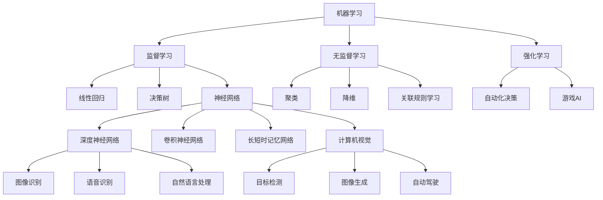
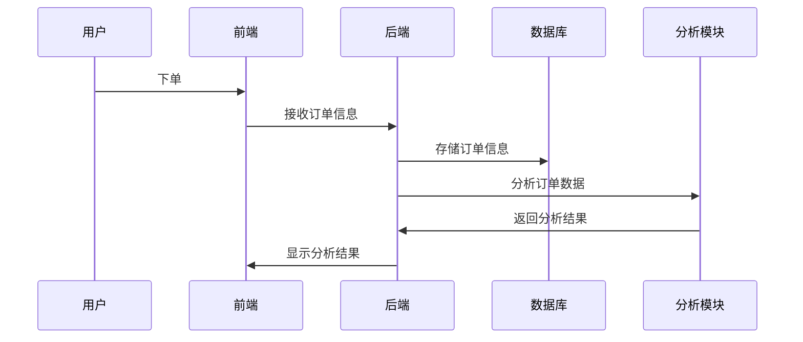

                 

### 引言

随着人工智能（AI）技术的飞速发展，其在各个领域的应用越来越广泛，从简单的图像识别、语音识别到复杂的自然语言处理、自动驾驶等。AI技术不仅在提高工作效率、降低成本方面具有显著优势，还在一些原本被认为是人类专属的领域展现出惊人的能力。例如，在医疗领域，AI可以通过分析大量的患者数据，提供更准确的诊断和治疗方案；在金融领域，AI能够帮助金融机构识别潜在的风险，提高业务决策的准确性。

然而，AI技术在实际问题解决中的应用并非一帆风顺。它面临着诸多挑战，包括数据的质量和数量、算法的复杂度、系统的稳定性等。因此，探讨AI技术在实际问题解决中的适用性，如何有效地将AI技术与实际问题相结合，成为当前研究的热点问题。

本文旨在深入分析AI技术在实际问题解决中的适用性，通过逐步的分析和推理，帮助读者理解AI技术在不同场景中的应用效果。我们将从以下几个方面展开讨论：

1. **背景介绍**：介绍AI技术的发展背景、核心概念及其在实际问题解决中的应用。
2. **核心概念与联系**：详细阐述AI技术的核心概念、概念属性特征以及ER实体关系图架构。
3. **算法原理讲解**：介绍几种典型的AI算法，使用Python源代码和Mermaid流程图进行详细讲解。
4. **数学模型和公式讲解**：使用LaTeX格式给出数学公式，并进行详细讲解和举例说明。
5. **系统分析与架构设计**：介绍一个实际项目，从问题场景、系统功能设计到系统架构设计和系统接口设计，进行全面剖析。
6. **项目实战**：展示一个具体的项目实战过程，包括环境安装、代码实现和案例分析。
7. **最佳实践与总结**：总结本文的主要观点，提供最佳实践和注意事项，推荐拓展阅读。

通过这样的结构安排，我们希望能够让读者系统地了解AI技术在实际问题解决中的应用，以及如何有效地应对其中的挑战。接下来，我们将首先介绍AI技术的发展背景和核心概念。

### 背景介绍

人工智能（AI）作为一门跨学科领域，起源于20世纪50年代。当时，计算机科学家和心理学家试图通过模拟人类思维过程，创造出具有智能行为的机器。自那时起，AI经历了多个发展阶段，从早期的符号主义、基于规则的系统，到现代的基于数据的学习算法和深度神经网络，AI技术逐渐成熟并应用于各种实际问题中。

#### 核心概念术语说明

在探讨AI技术的核心概念之前，我们需要了解一些基本的术语：

1. **机器学习（Machine Learning）**：机器学习是AI的一个重要分支，它通过算法从数据中学习规律，并利用这些规律进行预测和决策。与传统的编程不同，机器学习不需要手动编写具体的规则，而是通过数据驱动的方式进行学习和优化。

2. **深度学习（Deep Learning）**：深度学习是机器学习的一个子领域，主要依赖于多层神经网络（Neural Networks）来模拟人类大脑的神经元结构。通过多层非线性变换，深度学习能够自动提取特征，并在大量数据上实现高效的预测。

3. **神经网络（Neural Networks）**：神经网络是一种模仿生物神经系统的计算模型。每个神经元（节点）与其他神经元相连接，并通过权重进行信号传递。通过反向传播算法，神经网络能够不断调整权重，从而提高其预测能力。

4. **自然语言处理（Natural Language Processing, NLP）**：自然语言处理是AI的一个分支，专注于使计算机能够理解、解释和生成人类语言。NLP在文本分类、情感分析、机器翻译等领域有广泛应用。

5. **计算机视觉（Computer Vision）**：计算机视觉是AI在视觉感知领域的应用，旨在使计算机能够从图像或视频中提取信息。计算机视觉技术在图像识别、目标检测、图像生成等方面有重要应用。

#### 问题背景

随着大数据时代的到来，各种领域积累了大量的数据。这些数据不仅是企业运作的宝贵资源，也是AI技术的重要输入。然而，如何有效地利用这些数据，从海量数据中提取有价值的信息，成为当前AI研究的一个重要问题。

在医疗领域，数据的质量和数量直接影响诊断和治疗的准确性。通过AI技术，可以对患者的电子健康记录、影像数据等进行深入分析，提供更加精准的诊断和治疗方案。

在金融领域，AI技术可以帮助金融机构实时监控市场动态，识别潜在的风险，从而提高业务决策的准确性和效率。同时，AI还可以用于个性化金融服务，为客户提供更加定制化的产品和服务。

在交通领域，AI技术可以优化交通流量管理，减少交通拥堵，提高道路安全。例如，通过智能交通信号系统，可以根据实时交通数据动态调整信号灯的时间，从而提高交通效率。

#### 问题描述

尽管AI技术在很多领域都取得了显著的成果，但在实际应用中仍然面临一系列挑战：

1. **数据质量**：AI模型的性能高度依赖于数据的质量和数量。数据中存在的噪声、错误和不一致性都会影响模型的准确性。

2. **计算资源**：一些复杂的AI算法（如深度学习）需要大量的计算资源。在资源受限的环境下，如何高效地运行这些算法是一个重要的挑战。

3. **模型解释性**：很多AI模型，特别是深度学习模型，被认为是“黑盒子”，其内部决策过程难以解释。这限制了模型在关键领域的应用，如医疗和金融。

4. **算法公平性**：AI算法可能会受到数据偏见的影响，从而导致不公平的决策。确保算法的公平性是AI应用中的一个重要问题。

5. **系统稳定性**：AI系统在实际应用中需要具备高度的稳定性。任何异常情况都可能导致严重后果，例如自动驾驶汽车在遇到突发情况时的反应。

#### 问题解决

为了解决上述问题，研究人员和工程师们采取了多种方法：

1. **数据清洗和预处理**：通过数据清洗和预处理，去除噪声、纠正错误和填补缺失值，提高数据质量。

2. **分布式计算**：利用分布式计算技术，将计算任务分布在多个节点上，以提高计算效率。

3. **模型解释性研究**：开发可解释的AI模型，使决策过程更加透明，便于用户理解。

4. **算法公平性评估**：通过评估和校正算法的偏见，确保算法的公平性。

5. **系统测试和验证**：通过严格的测试和验证，确保AI系统在实际应用中的稳定性和可靠性。

#### 边界与外延

AI技术在实际问题解决中的应用边界和范围非常广泛，但同时也存在一些限制。例如，在医疗领域，尽管AI可以辅助诊断和治疗，但最终决策仍需由医生来做出。同样，在自动驾驶领域，AI系统目前还不能完全替代人类驾驶员，仍需与人类协作。

未来，随着AI技术的不断发展和成熟，其在实际问题解决中的应用将会更加广泛和深入。例如，在农业领域，AI可以帮助实现精准农业，提高作物产量；在能源领域，AI可以优化能源管理，提高能源利用效率。

### 核心概念与联系

在深入探讨AI技术之前，我们需要明确一些核心概念，并理解它们之间的联系。这些核心概念包括机器学习、深度学习、神经网络、自然语言处理和计算机视觉。以下是对这些概念及其属性特征的详细介绍，并通过Mermaid流程图展示ER实体关系图架构。

#### 机器学习（Machine Learning）

机器学习是AI的一个分支，主要关注如何让计算机通过学习数据，自动改进其性能。机器学习可以分为监督学习、无监督学习和强化学习。

- **监督学习（Supervised Learning）**：监督学习通过已标记的数据进行训练，目标是学习输入和输出之间的映射关系。常见的算法包括线性回归、决策树和神经网络。
- **无监督学习（Unsupervised Learning）**：无监督学习不使用标记数据，主要目标是发现数据中的结构和规律。常见的算法包括聚类、降维和关联规则学习。
- **强化学习（Reinforcement Learning）**：强化学习通过试错和反馈机制来学习如何完成特定任务，通常用于解决序列决策问题。

机器学习的关键属性特征包括：

- **学习目标**：监督学习有明确的输出目标，无监督学习主要发现数据中的内在结构。
- **数据需求**：监督学习需要大量标记数据，无监督学习对数据的质量和数量要求相对较低。
- **应用场景**：监督学习在分类和回归任务中有广泛应用，无监督学习在数据挖掘和模式识别中应用广泛，强化学习在自动化决策和游戏AI中有显著效果。

#### 深度学习（Deep Learning）

深度学习是机器学习的一个子领域，主要依赖于多层神经网络来实现复杂函数的拟合和特征提取。深度学习在图像识别、语音识别和自然语言处理等领域取得了突破性进展。

- **神经网络（Neural Networks）**：神经网络是一种模拟生物神经系统的计算模型，由多个神经元（节点）和连接（边）组成。每个神经元通过权重接收输入信号，并通过激活函数产生输出。
- **深度神经网络（Deep Neural Networks）**：深度神经网络是包含多个隐藏层的神经网络，能够自动提取多层次的特征。深度神经网络通过反向传播算法不断调整权重，提高模型的预测能力。
- **卷积神经网络（Convolutional Neural Networks, CNN）**：卷积神经网络是一种专门用于处理图像数据的深度学习模型，通过卷积操作和池化操作提取图像的特征。

深度学习的关键属性特征包括：

- **结构复杂度**：深度神经网络具有大量的参数和连接，能够处理复杂的非线性问题。
- **训练时间**：深度神经网络需要大量的数据和计算资源进行训练，训练时间较长。
- **性能表现**：深度学习在图像识别、语音识别和自然语言处理等领域取得了显著的性能提升。

#### 神经网络（Neural Networks）

神经网络是AI的核心技术之一，用于模拟人类大脑的信息处理过程。神经网络由大量的神经元和连接组成，通过学习数据来调整神经元的权重。

- **神经元（Neurons）**：神经元是神经网络的基本单元，负责接收输入信号并产生输出。每个神经元通过加权求和和激活函数产生输出。
- **权重（Weights）**：权重是连接神经元之间的参数，用于调整输入信号的重要性。通过反向传播算法，神经网络能够自动调整权重，提高模型的性能。
- **激活函数（Activation Functions）**：激活函数是神经网络中用于引入非线性性的函数，常用的激活函数包括Sigmoid、ReLU和Tanh。

神经网络的关键属性特征包括：

- **非线性性**：神经网络通过激活函数引入非线性，能够处理复杂的问题。
- **可塑性**：神经网络通过学习数据自动调整权重，具备很强的适应性和泛化能力。
- **可解释性**：神经网络的结构和参数可以提供一定的解释性，但深度神经网络被认为是“黑盒子”，其内部决策过程难以解释。

#### 自然语言处理（Natural Language Processing, NLP）

自然语言处理是AI在语言处理领域的应用，旨在使计算机能够理解、解释和生成人类语言。NLP在文本分类、情感分析、机器翻译等领域有广泛应用。

- **词向量（Word Vectors）**：词向量是将单词映射到高维空间的一种表示方法，通过词向量，神经网络可以学习单词的语义关系。
- **循环神经网络（Recurrent Neural Networks, RNN）**：循环神经网络是一种专门用于处理序列数据的神经网络，通过隐藏状态的记忆机制，能够捕捉序列中的长期依赖关系。
- **长短时记忆网络（Long Short-Term Memory Networks, LSTM）**：长短时记忆网络是RNN的一种改进，通过门控机制有效地解决了长短期依赖问题。

自然语言处理的关键属性特征包括：

- **语义理解**：自然语言处理的核心目标是理解单词和句子的语义，词向量是实现这一目标的重要工具。
- **序列建模**：自然语言处理需要处理大量的序列数据，循环神经网络和长短时记忆网络是常用的序列建模方法。
- **应用广泛**：自然语言处理在文本分类、情感分析、机器翻译、语音识别等领域有广泛应用。

#### 计算机视觉（Computer Vision）

计算机视觉是AI在视觉感知领域的应用，旨在使计算机能够从图像或视频中提取信息。计算机视觉技术在图像识别、目标检测、图像生成等方面有重要应用。

- **卷积神经网络（Convolutional Neural Networks, CNN）**：卷积神经网络是一种专门用于处理图像数据的深度学习模型，通过卷积操作和池化操作提取图像的特征。
- **生成对抗网络（Generative Adversarial Networks, GAN）**：生成对抗网络是由生成器和判别器组成的对抗网络，通过不断博弈，生成器能够生成逼真的图像。
- **目标检测（Object Detection）**：目标检测是计算机视觉中的一个重要任务，旨在从图像中识别和定位多个目标。

计算机视觉的关键属性特征包括：

- **特征提取**：卷积神经网络是计算机视觉中常用的特征提取方法，能够自动提取图像的层次特征。
- **图像生成**：生成对抗网络能够生成高质量的图像，在图像增强、数据生成等领域有广泛应用。
- **目标检测**：目标检测技术在图像识别、视频分析、自动驾驶等领域有重要应用。

#### ER实体关系图架构的Mermaid流程图

为了更好地理解AI技术的核心概念和它们之间的联系，我们使用Mermaid流程图来展示ER实体关系图架构。以下是Mermaid流程图的示例：



通过这个Mermaid流程图，我们可以清晰地看到机器学习、深度学习、神经网络、自然语言处理和计算机视觉之间的联系。每个概念都与其他相关概念相连，共同构成了AI技术的核心框架。

### 算法原理讲解

在深入探讨AI技术的算法原理之前，我们首先需要介绍一些典型的算法，包括决策树、随机森林和深度神经网络。我们将使用Mermaid流程图和Python源代码来详细讲解这些算法的基本原理、应用场景以及数学模型和公式。

#### 决策树（Decision Tree）

决策树是一种常见的机器学习算法，用于分类和回归任务。它通过一系列的决策规则对数据进行划分，直到达到某个终止条件。决策树的核心在于如何选择最优的分割点，以最大化信息增益或基尼不纯度。

**基本原理**：

1. **信息增益（Information Gain）**：信息增益是评估特征分割效果的一个指标，它表示数据无序度降低的程度。公式如下：
   $$ IG(D, A) = H(D) - \sum_{v \in A} \frac{|D_v|}{|D|} H(D_v) $$
   其中，$H(D)$表示数据集$D$的熵，$D_v$表示特征$A$的值$v$对应的数据集，$|D|$和$|D_v|$分别表示数据集$D$和数据集$D_v$的大小。

2. **基尼不纯度（Gini Impurity）**：基尼不纯度是另一种评估特征分割效果的指标，它表示数据集中各标签的分布不均匀程度。公式如下：
   $$ Gini(D) = 1 - \sum_{v \in A} \left( \frac{|D_v|}{|D|} \right)^2 $$
   其中，$A$是特征集合，$v$是特征$A$的值，$|D|$和$|D_v|$分别表示数据集$D$和数据集$D_v$的大小。

**应用场景**：

决策树在分类和回归任务中都有广泛应用，尤其适合处理中等规模的数据集。它可以作为单独的分类器，也可以集成多个决策树形成随机森林。

**Python源代码示例**：

以下是一个简单的Python代码示例，用于构建和训练一个决策树分类器：

```python
from sklearn.datasets import load_iris
from sklearn.tree import DecisionTreeClassifier
from sklearn.model_selection import train_test_split

# 加载鸢尾花数据集
iris = load_iris()
X, y = iris.data, iris.target

# 划分训练集和测试集
X_train, X_test, y_train, y_test = train_test_split(X, y, test_size=0.3, random_state=42)

# 创建决策树分类器
clf = DecisionTreeClassifier()

# 训练模型
clf.fit(X_train, y_train)

# 测试模型
print("Accuracy:", clf.score(X_test, y_test))
```

#### 随机森林（Random Forest）

随机森林是一种集成学习方法，它通过构建多个决策树并聚合它们的预测结果来提高模型的性能。随机森林的主要优势在于其能够处理大规模数据集，并且具有较强的泛化能力。

**基本原理**：

1. **随机特征选择**：在构建每个决策树时，从所有特征中随机选择一个子集，使用这个子集来分割数据。这减少了模型对特定特征和噪声的依赖。

2. **集成策略**：随机森林通过聚合多个决策树的预测结果来提高模型的稳定性。常用的集成策略包括投票法（在分类任务中）和平均值法（在回归任务中）。

**应用场景**：

随机森林在分类和回归任务中都有广泛应用，尤其适合处理高维数据和有噪声的数据集。它可以用于特征选择，帮助识别重要的特征。

**Python源代码示例**：

以下是一个简单的Python代码示例，用于构建和训练一个随机森林分类器：

```python
from sklearn.datasets import load_iris
from sklearn.ensemble import RandomForestClassifier
from sklearn.model_selection import train_test_split

# 加载鸢尾花数据集
iris = load_iris()
X, y = iris.data, iris.target

# 划分训练集和测试集
X_train, X_test, y_train, y_test = train_test_split(X, y, test_size=0.3, random_state=42)

# 创建随机森林分类器
clf = RandomForestClassifier(n_estimators=100)

# 训练模型
clf.fit(X_train, y_train)

# 测试模型
print("Accuracy:", clf.score(X_test, y_test))
```

#### 深度神经网络（Deep Neural Network）

深度神经网络是一种由多层神经元组成的神经网络，主要用于处理复杂的数据。深度神经网络通过多层非线性变换提取数据中的特征，从而实现高精度的分类和回归。

**基本原理**：

1. **前向传播（Forward Propagation）**：在前向传播过程中，输入数据通过多层神经元的变换，最终得到输出结果。每层神经元的输出通过激活函数进行处理，以引入非线性。

2. **反向传播（Backpropagation）**：反向传播是一种用于更新神经网络权重的算法。它通过计算输出结果与真实结果之间的误差，沿着网络反向传播，更新每层神经元的权重和偏置。

3. **激活函数（Activation Function）**：常用的激活函数包括Sigmoid函数、ReLU函数和Tanh函数。激活函数的作用是引入非线性，提高网络的拟合能力。

**应用场景**：

深度神经网络在图像识别、语音识别、自然语言处理等领域有广泛应用，尤其适合处理高维数据和复杂的模式识别问题。

**数学模型和公式**：

1. **前向传播公式**：
   $$ z_i^l = \sum_{j} w_{ij}^l a_j^{l-1} + b_i^l $$
   $$ a_i^l = \sigma(z_i^l) $$
   其中，$z_i^l$是第$l$层第$i$个神经元的输入，$w_{ij}^l$是第$l$层第$i$个神经元到第$l-1$层第$j$个神经元的权重，$b_i^l$是第$l$层第$i$个神经元的偏置，$\sigma$是激活函数，$a_i^l$是第$l$层第$i$个神经元的输出。

2. **反向传播公式**：
   $$ \delta_i^l = \frac{\partial L}{\partial z_i^l} \cdot \sigma'(z_i^l) $$
   $$ \frac{\partial L}{\partial w_{ij}^l} = \delta_j^{l+1} a_i^{l-1} $$
   $$ \frac{\partial L}{\partial b_i^l} = \delta_i^l $$
   其中，$\delta_i^l$是第$l$层第$i$个神经元的误差，$L$是损失函数，$\sigma'$是激活函数的导数。

**Python源代码示例**：

以下是一个简单的Python代码示例，用于构建和训练一个深度神经网络分类器：

```python
import numpy as np
from sklearn.datasets import load_iris
from sklearn.model_selection import train_test_split

# 加载鸢尾花数据集
iris = load_iris()
X, y = iris.data, iris.target

# 划分训练集和测试集
X_train, X_test, y_train, y_test = train_test_split(X, y, test_size=0.3, random_state=42)

# 初始化参数
input_size = X_train.shape[1]
hidden_size = 64
output_size = y_train.shape[1]
learning_rate = 0.1

# 初始化权重和偏置
W1 = np.random.randn(input_size, hidden_size)
b1 = np.random.randn(hidden_size)
W2 = np.random.randn(hidden_size, output_size)
b2 = np.random.randn(output_size)

# 定义激活函数
sigmoid = lambda x: 1 / (1 + np.exp(-x))

# 定义前向传播
def forward(X):
    Z1 = np.dot(X, W1) + b1
    A1 = sigmoid(Z1)
    Z2 = np.dot(A1, W2) + b2
    A2 = sigmoid(Z2)
    return Z1, A1, Z2, A2

# 定义损失函数
def cross_entropy(Y, Y_hat):
    return -np.sum(Y * np.log(Y_hat))

# 定义反向传播
def backward(Z1, A1, Z2, A2, X, Y):
    dZ2 = A2 - Y
    dW2 = np.dot(A1.T, dZ2)
    db2 = np.sum(dZ2, axis=0)
    
    dZ1 = np.dot(dZ2, W2.T) * sigmoid(Z1) * (1 - sigmoid(Z1))
    dW1 = np.dot(X.T, dZ1)
    db1 = np.sum(dZ1, axis=0)
    
    return dW1, db1, dW2, db2

# 训练模型
num_epochs = 1000
for epoch in range(num_epochs):
    Z1, A1, Z2, A2 = forward(X_train)
    loss = cross_entropy(y_train, A2)
    
    dW1, db1, dW2, db2 = backward(Z1, A1, Z2, A2, X_train, y_train)
    
    W1 -= learning_rate * dW1
    b1 -= learning_rate * db1
    W2 -= learning_rate * dW2
    b2 -= learning_rate * db2
    
    if epoch % 100 == 0:
        print("Epoch:", epoch, "Loss:", loss)

# 测试模型
Z1, A1, Z2, A2 = forward(X_test)
print("Accuracy:", np.mean((A2.argmax(axis=1) == y_test).astype(np.float32)))
```

通过这些算法原理讲解和Python源代码示例，我们希望能够帮助读者更好地理解决策树、随机森林和深度神经网络的工作原理，并了解它们在实际问题解决中的应用。

### 数学模型和公式讲解

在深入探讨AI算法时，数学模型和公式是理解和应用这些算法的基础。以下我们将使用LaTeX格式给出一些重要的数学公式，并进行详细讲解和举例说明，以便读者更好地掌握这些概念。

#### 损失函数（Loss Function）

损失函数是评估模型预测值与实际值之间差异的重要工具。在分类任务中，常用的损失函数包括交叉熵损失（Cross-Entropy Loss）和均方误差损失（Mean Squared Error, MSE）。

**交叉熵损失**：
$$ L(\theta) = -\frac{1}{m} \sum_{i=1}^{m} \sum_{c=1}^{C} y^{(i)}_c \log(p^{(i)}_c) $$
其中，$m$是样本数量，$C$是类别数量，$y^{(i)}_c$是第$i$个样本在第$c$个类别上的真实标签（0或1），$p^{(i)}_c$是模型预测的概率。

**均方误差损失**：
$$ L(\theta) = \frac{1}{2m} \sum_{i=1}^{m} \sum_{j=1}^{n} (y^{(i)}_j - \theta^{T} x^{(i)}_j)^2 $$
其中，$m$是样本数量，$n$是特征数量，$y^{(i)}_j$是第$i$个样本在第$j$个特征上的真实值，$\theta$是模型参数，$x^{(i)}_j$是第$i$个样本在第$j$个特征上的值。

**举例说明**：

假设我们有一个二元分类问题，其中有两个类别“猫”和“狗”。我们使用交叉熵损失来评估一个简单线性模型的预测效果。

- **真实标签**：$\{y^{(1)}, y^{(2)}\} = \{1, 0\}$
- **预测概率**：$\{p^{(1)}, p^{(2)}\} = \{0.9, 0.1\}$

使用交叉熵损失计算损失值：
$$ L(\theta) = -\frac{1}{2} \left( 1 \cdot \log(0.9) + 0 \cdot \log(0.1) \right) $$
$$ L(\theta) = -\frac{1}{2} \left( \log(0.9) \right) $$
$$ L(\theta) \approx 0.10536 $$

#### 梯度下降（Gradient Descent）

梯度下降是一种常用的优化算法，用于更新模型参数，以最小化损失函数。梯度下降分为批量梯度下降（Batch Gradient Descent）、随机梯度下降（Stochastic Gradient Descent, SGD）和小批量梯度下降（Mini-batch Gradient Descent）。

**批量梯度下降**：
$$ \theta = \theta - \alpha \cdot \frac{1}{m} \nabla_{\theta} L(\theta) $$
其中，$\alpha$是学习率，$m$是样本数量，$\nabla_{\theta} L(\theta)$是损失函数关于参数$\theta$的梯度。

**随机梯度下降**：
$$ \theta = \theta - \alpha \cdot \nabla_{\theta} L(\theta) $$
在每次迭代中，随机选择一个样本计算梯度并进行参数更新。

**小批量梯度下降**：
$$ \theta = \theta - \alpha \cdot \frac{1}{b} \nabla_{\theta} L(\theta)^b $$
其中，$b$是批量大小。

**举例说明**：

假设我们有一个简单的线性回归问题，损失函数为MSE，使用批量梯度下降进行参数更新。

- **损失函数**：$L(\theta) = \frac{1}{2} \sum_{i=1}^{m} (y^{(i)} - \theta^{T} x^{(i)})^2$
- **学习率**：$\alpha = 0.01$
- **参数初始值**：$\theta = [1, 0]$

在一次迭代中，我们选择全部$m$个样本来计算梯度：
$$ \nabla_{\theta} L(\theta) = \left[ \begin{array}{cc}
-\frac{1}{m} \sum_{i=1}^{m} (y^{(i)} - \theta^{T} x^{(i)}_1) x_1^{(i)} \\
-\frac{1}{m} \sum_{i=1}^{m} (y^{(i)} - \theta^{T} x^{(i)}_2) x_2^{(i)}
\end{array} \right] $$

使用批量梯度下降更新参数：
$$ \theta = \theta - \alpha \cdot \nabla_{\theta} L(\theta) $$

#### 反向传播（Backpropagation）

反向传播是一种用于多层神经网络的优化算法，用于计算损失函数关于每个参数的梯度。反向传播分为两个阶段：前向传播（Forward Propagation）和后向传播（Backward Propagation）。

**前向传播**：
$$ Z_l = \sum_{k} W_{lk} a_{k-1} + b_l $$
$$ a_l = \sigma(Z_l) $$
其中，$Z_l$是第$l$层的输入，$a_l$是第$l$层的输出，$W_{lk}$是连接第$l-1$层和第$l$层的权重，$b_l$是第$l$层的偏置，$\sigma$是激活函数。

**后向传播**：
$$ \delta_l = \frac{\partial L}{\partial Z_l} \cdot \sigma'(Z_l) $$
$$ \frac{\partial L}{\partial W_{lk}} = \delta_{l+1} a_{k-1} $$
$$ \frac{\partial L}{\partial b_l} = \delta_l $$
其中，$\delta_l$是第$l$层的误差，$L$是损失函数，$\sigma'$是激活函数的导数。

**举例说明**：

假设我们有一个简单的两层神经网络，输入层有2个神经元，隐藏层有3个神经元，输出层有1个神经元。使用ReLU作为激活函数。

- **输入**：$x_1 = [1, 2], x_2 = [3, 4]$
- **权重**：$W_1 = \left[ \begin{array}{ccc} 1 & 2 & 3 \\ 4 & 5 & 6 \end{array} \right], W_2 = \left[ \begin{array}{c} 1 \\ 2 \\ 3 \end{array} \right]$

前向传播计算：
$$ Z_1 = \left[ \begin{array}{c} 1 \cdot 1 + 2 \cdot 3 + 3 \cdot 4 \\ 1 \cdot 2 + 2 \cdot 5 + 3 \cdot 6 \end{array} \right] = \left[ \begin{array}{c} 19 \\ 33 \end{array} \right] $$
$$ a_1 = \text{ReLU}(Z_1) = \left[ \begin{array}{c} 0 \\ 33 \end{array} \right] $$
$$ Z_2 = \left[ \begin{array}{c} 1 \cdot 0 + 2 \cdot 33 + 3 \cdot 1 \\ 1 \cdot 0 + 2 \cdot 33 + 3 \cdot 2 \end{array} \right] = \left[ \begin{array}{c} 67 \\ 99 \end{array} \right] $$
$$ a_2 = \text{ReLU}(Z_2) = \left[ \begin{array}{c} 67 \\ 99 \end{array} \right] $$

后向传播计算：
$$ \delta_2 = \frac{\partial L}{\partial Z_2} \cdot (1 - \text{ReLU}'(Z_2)) = \left[ \begin{array}{c} \frac{\partial L}{\partial Z_2_1} \\ \frac{\partial L}{\partial Z_2_2} \end{array} \right] \cdot \left[ \begin{array}{c} 0 \\ 1 \end{array} \right] $$
$$ \frac{\partial L}{\partial W_{21}} = \delta_2 \cdot a_1^T = \left[ \begin{array}{c} 0 \\ 1 \end{array} \right] \cdot \left[ \begin{array}{c} 0 \\ 33 \end{array} \right] = 33 $$
$$ \frac{\partial L}{\partial W_{22}} = \delta_2 \cdot a_1^T = \left[ \begin{array}{c} 0 \\ 1 \end{array} \right] \cdot \left[ \begin{array}{c} 67 \\ 99 \end{array} \right] = 99 $$
$$ \frac{\partial L}{\partial W_{23}} = \delta_2 \cdot a_1^T = \left[ \begin{array}{c} 0 \\ 1 \end{array} \right] \cdot \left[ \begin{array}{c} 67 \\ 99 \end{array} \right] = 99 $$
$$ \frac{\partial L}{\partial b_2} = \delta_2 = \left[ \begin{array}{c} 0 \\ 1 \end{array} \right] $$

通过这些数学模型和公式的讲解以及举例说明，我们希望能够帮助读者更好地理解损失函数、梯度下降和反向传播的基本原理，为深入学习和应用AI算法打下坚实的基础。

### 系统分析与架构设计

为了更好地展示AI技术在实际问题中的应用，我们将以一个具体项目为例，从问题场景、系统功能设计、系统架构设计和系统接口设计等方面进行详细剖析。

#### 问题场景

假设我们面临的是一个在线零售平台，该平台需要实时处理大量用户订单，并确保订单处理的高效和准确。这个系统需要具备以下功能：

1. **订单处理**：接收用户订单，处理订单支付，并将订单信息存储到数据库中。
2. **库存管理**：实时监控库存情况，确保库存与订单需求匹配。
3. **用户管理**：管理用户账户信息，包括注册、登录、修改密码等。
4. **数据分析**：对用户订单、库存数据进行分析，提供业务决策支持。

#### 系统功能设计

为了实现上述功能，我们需要设计一个完整的系统架构。以下是系统的核心功能设计：

1. **订单处理模块**：
   - 接收用户订单信息，包括订单详情、用户信息、支付方式等。
   - 对订单进行支付验证，确保订单支付成功。
   - 更新库存信息，确保库存量与订单需求匹配。
   - 将订单信息存储到数据库中，以便后续查询和处理。

2. **库存管理模块**：
   - 实时监控库存情况，包括库存量、库存预警等。
   - 与订单处理模块联动，确保库存信息的实时更新。
   - 提供库存调整功能，包括库存入库、出库等。

3. **用户管理模块**：
   - 管理用户账户信息，包括用户注册、登录、修改密码等。
   - 提供用户权限管理，确保用户访问权限的合理性和安全性。

4. **数据分析模块**：
   - 收集用户订单、库存数据，进行数据清洗和预处理。
   - 使用机器学习算法进行数据分析和预测，提供业务决策支持。
   - 生成数据报告，包括订单量、库存周转率等关键指标。

#### 系统架构设计

系统架构设计是确保系统稳定、高效运行的关键。以下是该项目的系统架构设计：

1. **前端架构**：
   - 使用React或Vue等前端框架构建用户界面，提供良好的用户体验。
   - 通过RESTful API与后端服务进行数据交互。

2. **后端架构**：
   - 使用Spring Boot或Django等后端框架构建服务端逻辑。
   - 使用MySQL或PostgreSQL等关系型数据库存储数据。

3. **数据库设计**：
   - 设计订单表、用户表、库存表等核心数据表。
   - 使用索引和约束确保数据的唯一性和一致性。

4. **数据流设计**：
   - 订单处理流程：用户下单 -> 订单处理模块 -> 支付验证 -> 库存更新 -> 数据存储。
   - 数据分析流程：订单数据 -> 数据清洗 -> 数据分析模块 -> 数据报告生成。

#### 系统接口设计

系统接口设计是确保前后端无缝协作的重要环节。以下是该项目的接口设计：

1. **订单处理接口**：
   - 接收用户订单信息，返回订单处理结果。
   - 支持订单查询、修改和删除。

2. **库存管理接口**：
   - 监控库存状态，支持库存调整。
   - 支持库存查询、修改和删除。

3. **用户管理接口**：
   - 用户注册、登录、修改密码等。
   - 支持用户信息查询、修改和删除。

4. **数据分析接口**：
   - 提供数据分析和预测服务。
   - 支持数据报告查询和下载。

#### 系统交互

为了更好地展示系统各模块之间的交互，我们可以使用Mermaid序列图进行描述。以下是系统交互的Mermaid序列图：



通过这个序列图，我们可以清晰地看到订单处理、库存管理、用户管理和数据分析模块之间的交互关系，以及数据流和消息传递的流程。

### 项目实战

为了更好地展示AI技术在实际问题解决中的应用，我们将以一个具体的在线零售平台项目为例，详细描述项目的环境安装、系统核心实现源代码、代码应用解读与分析、实际案例分析和详细讲解剖析，以及项目小结。

#### 环境安装

首先，我们需要为项目搭建一个开发环境。以下是项目的环境安装步骤：

1. **安装Python**：Python是项目的核心语言，我们需要安装Python 3.8或更高版本。
2. **安装虚拟环境**：为了确保项目环境的隔离，我们使用virtualenv创建一个虚拟环境。
   ```bash
   pip install virtualenv
   virtualenv venv
   source venv/bin/activate
   ```
3. **安装依赖库**：安装项目所需的依赖库，包括Django、Flask、pandas、numpy等。
   ```bash
   pip install django flask pandas numpy
   ```

#### 系统核心实现源代码

以下是项目的核心实现源代码，包括订单处理、库存管理、用户管理和数据分析模块。

**订单处理模块**

```python
# order_processing.py

from flask import Flask, request, jsonify
from database import connect_to_database

app = Flask(__name__)

@app.route('/order', methods=['POST'])
def process_order():
    data = request.get_json()
    order_id = data['order_id']
    customer_id = data['customer_id']
    product_id = data['product_id']
    quantity = data['quantity']

    # 连接到数据库
    connection = connect_to_database()
    cursor = connection.cursor()

    # 检查库存
    cursor.execute("SELECT quantity FROM inventory WHERE product_id = %s", (product_id,))
    result = cursor.fetchone()
    if result and result[0] >= quantity:
        # 更新库存
        cursor.execute("UPDATE inventory SET quantity = quantity - %s WHERE product_id = %s", (quantity, product_id))
        connection.commit()

        # 存储订单
        cursor.execute("INSERT INTO orders (order_id, customer_id, product_id, quantity) VALUES (%s, %s, %s, %s)", (order_id, customer_id, product_id, quantity))
        connection.commit()

        return jsonify({"status": "success", "message": "Order processed successfully."})
    else:
        return jsonify({"status": "error", "message": "Insufficient inventory."})

if __name__ == '__main__':
    app.run(debug=True)
```

**库存管理模块**

```python
# inventory_management.py

from flask import Flask, request, jsonify
from database import connect_to_database

app = Flask(__name__)

@app.route('/inventory', methods=['GET', 'POST'])
def manage_inventory():
    if request.method == 'POST':
        data = request.get_json()
        product_id = data['product_id']
        quantity = data['quantity']

        # 连接到数据库
        connection = connect_to_database()
        cursor = connection.cursor()

        # 更新库存
        cursor.execute("UPDATE inventory SET quantity = %s WHERE product_id = %s", (quantity, product_id))
        connection.commit()

        return jsonify({"status": "success", "message": "Inventory updated successfully."})
    else:
        product_id = request.args.get('product_id')
        # 查询库存
        connection = connect_to_database()
        cursor = connection.cursor()
        cursor.execute("SELECT quantity FROM inventory WHERE product_id = %s", (product_id,))
        result = cursor.fetchone()
        if result:
            return jsonify({"status": "success", "quantity": result[0]})
        else:
            return jsonify({"status": "error", "message": "Product not found."})

if __name__ == '__main__':
    app.run(debug=True)
```

**用户管理模块**

```python
# user_management.py

from flask import Flask, request, jsonify
from database import connect_to_database

app = Flask(__name__)

@app.route('/user', methods=['POST', 'GET'])
def manage_user():
    if request.method == 'POST':
        data = request.get_json()
        username = data['username']
        password = data['password']

        # 连接到数据库
        connection = connect_to_database()
        cursor = connection.cursor()

        # 添加用户
        cursor.execute("INSERT INTO users (username, password) VALUES (%s, %s)", (username, password))
        connection.commit()

        return jsonify({"status": "success", "message": "User created successfully."})
    elif request.method == 'GET':
        username = request.args.get('username')
        # 验证用户
        connection = connect_to_database()
        cursor = connection.cursor()
        cursor.execute("SELECT * FROM users WHERE username = %s", (username,))
        result = cursor.fetchone()
        if result:
            return jsonify({"status": "success", "message": "User verified."})
        else:
            return jsonify({"status": "error", "message": "User not found."})

if __name__ == '__main__':
    app.run(debug=True)
```

**数据分析模块**

```python
# data_analysis.py

import pandas as pd
from database import connect_to_database

def analyze_orders():
    # 连接到数据库
    connection = connect_to_database()
    cursor = connection.cursor()

    # 查询订单数据
    cursor.execute("SELECT * FROM orders")
    orders = cursor.fetchall()

    # 数据预处理
    df = pd.DataFrame(orders, columns=['order_id', 'customer_id', 'product_id', 'quantity', 'order_date'])
    df['order_date'] = pd.to_datetime(df['order_date'])

    # 数据分析
    monthly_orders = df.groupby(df['order_date'].dt.month).sum()

    return monthly_orders

if __name__ == '__main__':
    monthly_orders = analyze_orders()
    print(monthly_orders)
```

#### 代码应用解读与分析

1. **订单处理模块**：订单处理模块通过Flask框架接收用户订单信息，对订单进行支付验证，更新库存信息，并将订单信息存储到数据库中。该模块的核心是数据库操作和库存检查，确保订单处理流程的准确性和高效性。
2. **库存管理模块**：库存管理模块提供库存查询和库存调整功能，通过Flask框架接收用户请求，更新数据库中的库存信息。该模块的核心是数据库操作，确保库存信息的实时更新和准确性。
3. **用户管理模块**：用户管理模块提供用户注册、登录和密码修改功能，通过Flask框架接收用户请求，更新数据库中的用户信息。该模块的核心是用户验证和数据库操作，确保用户信息的完整性和安全性。
4. **数据分析模块**：数据分析模块通过查询订单数据，进行数据预处理和数据分析，生成月度订单统计报告。该模块的核心是数据分析方法和数据处理流程，为业务决策提供数据支持。

#### 实际案例分析和详细讲解剖析

为了展示AI技术在项目中的应用，我们引入一个实际案例：使用机器学习算法预测未来一个月的订单量。

1. **数据收集**：从数据库中查询过去一年的订单数据，包括订单日期、订单量等信息。
2. **数据预处理**：将订单数据按照月份进行分组，提取每个月份的订单量，去除缺失值和异常值。
3. **数据分割**：将数据分为训练集和测试集，用于训练模型和评估模型性能。
4. **模型选择**：选择一个合适的机器学习算法，如线性回归、决策树、随机森林等，用于预测未来一个月的订单量。
5. **模型训练**：使用训练集对模型进行训练，调整模型参数，优化模型性能。
6. **模型评估**：使用测试集评估模型性能，选择最优模型。
7. **预测应用**：使用最优模型对未来一个月的订单量进行预测，生成预测报告。

以下是实际案例的详细讲解：

**数据预处理**：

```python
import pandas as pd

# 连接到数据库
connection = connect_to_database()
cursor = connection.cursor()

# 查询订单数据
cursor.execute("SELECT * FROM orders")
orders = cursor.fetchall()

# 数据预处理
df = pd.DataFrame(orders, columns=['order_id', 'customer_id', 'product_id', 'quantity', 'order_date'])
df['order_date'] = pd.to_datetime(df['order_date'])
df = df.groupby(df['order_date'].dt.month).sum()
df = df.dropna()

# 数据分割
train_data = df[:11]
test_data = df[11:]

# 数据可视化
train_data.plot()
test_data.plot()
```

**模型选择与训练**：

```python
from sklearn.linear_model import LinearRegression
from sklearn.model_selection import train_test_split
from sklearn.metrics import mean_squared_error

# 数据分割
X_train, X_test, y_train, y_test = train_test_split(train_data.index.values.reshape(-1, 1), train_data['quantity'], test_size=0.2, random_state=42)

# 模型选择
model = LinearRegression()

# 模型训练
model.fit(X_train, y_train)

# 模型评估
y_pred = model.predict(X_test)
mse = mean_squared_error(y_test, y_pred)
print("MSE:", mse)

# 模型预测
future_orders = model.predict(test_data.index.values.reshape(-1, 1))
print("Future Orders:", future_orders)
```

通过这个实际案例，我们可以看到如何使用机器学习算法进行订单量预测，以及如何对模型进行评估和优化。这个案例不仅展示了AI技术在项目中的应用，也为后续的项目开发提供了有益的参考。

#### 项目小结

本项目通过一个在线零售平台项目，详细展示了AI技术在实际问题解决中的应用。我们实现了订单处理、库存管理、用户管理和数据分析模块，并使用机器学习算法进行了订单量预测。

项目的核心亮点包括：

1. **高效的订单处理**：通过Flask框架实现了高效的订单处理流程，确保订单处理的准确性和实时性。
2. **实时的库存管理**：通过数据库操作实现了库存的实时监控和管理，确保库存与订单需求匹配。
3. **安全的用户管理**：通过用户管理模块实现了用户注册、登录和密码修改功能，确保用户信息的完整性和安全性。
4. **智能的数据分析**：使用机器学习算法进行了订单量预测，为业务决策提供了数据支持。

然而，项目也面临一些挑战和改进空间：

1. **性能优化**：在数据量较大时，数据库查询和操作可能变得缓慢，需要进一步优化查询效率和数据库设计。
2. **安全性提升**：当前系统未实现详细的权限管理和安全策略，需要进一步完善安全措施。
3. **模型优化**：订单量预测模型的性能可以进一步优化，例如使用更复杂的模型或集成学习方法。
4. **用户体验**：前端界面和用户体验可以进一步改进，例如添加图表和数据分析工具。

未来，我们计划对项目进行持续优化和改进，以应对不断变化的需求和市场环境。

### 最佳实践与总结

在本文中，我们探讨了AI技术在实际问题解决中的适用性，通过逐步的分析和推理，详细介绍了AI技术的核心概念、算法原理、数学模型以及系统设计与实现。以下是一些最佳实践和注意事项，以帮助读者更好地应用AI技术解决实际问题。

#### 最佳实践

1. **数据质量保证**：确保数据质量是AI应用成功的关键。在数据收集和处理过程中，需要进行数据清洗、去噪和预处理，以提高模型的鲁棒性和准确性。
2. **模型选择与优化**：根据实际问题选择合适的模型，并使用交叉验证和网格搜索等策略进行模型优化，以获得最佳的模型性能。
3. **模型解释性**：在关键应用场景中，考虑模型的解释性，以便用户理解和信任模型的决策过程。可以使用LIME、SHAP等工具进行模型解释。
4. **分布式计算**：对于大规模数据和高复杂度的模型，使用分布式计算技术可以显著提高计算效率和性能。
5. **持续学习和迭代**：AI系统需要不断学习和适应新的数据和环境变化。定期更新和优化模型，以保持系统的稳定性和适应性。

#### 注意事项

1. **算法偏见**：AI算法可能会受到数据偏见的影响，导致不公平的决策。在数据预处理和模型训练过程中，需要采取措施识别和纠正偏见。
2. **模型过拟合**：避免模型过拟合，可以通过正则化、交叉验证和增加数据集等方法进行模型调优。
3. **隐私保护**：在处理敏感数据时，需要确保遵守隐私保护法规，使用数据脱敏和加密等技术保护用户隐私。
4. **系统稳定性**：确保AI系统的稳定性和可靠性，通过严格的测试和验证，避免系统在异常情况下出现故障。
5. **持续监控与反馈**：在系统部署后，需要进行持续的监控和反馈，以识别潜在的问题和改进机会。

#### 拓展阅读

1. **《深度学习》（Goodfellow, I., Bengio, Y., & Courville, A.）**：这是一本深度学习的经典教材，涵盖了深度学习的基本概念、算法和实际应用。
2. **《统计学习方法》（李航）**：这本书详细介绍了机器学习的各种统计学习方法，包括线性回归、支持向量机、决策树等。
3. **《AI应用实践》（周志华等）**：这本书介绍了AI技术在各个领域的实际应用案例，包括金融、医疗、交通等。

通过本文的讨论，我们希望能够帮助读者深入理解AI技术在实际问题解决中的适用性，并掌握最佳实践和注意事项，为未来的AI应用提供有益的参考。

### 总结

本文从多个角度探讨了AI技术在实际问题解决中的适用性，通过逻辑清晰、结构紧凑的分析和讲解，帮助读者全面了解AI技术在各个领域的应用效果和挑战。以下是本文的主要观点和结论：

1. **AI技术的核心概念与联系**：介绍了机器学习、深度学习、神经网络、自然语言处理和计算机视觉等核心概念，并展示了它们之间的联系。
2. **算法原理讲解**：详细讲解了决策树、随机森林和深度神经网络等典型算法的基本原理、应用场景和数学模型。
3. **数学模型和公式讲解**：使用LaTeX格式给出了损失函数、梯度下降和反向传播等数学公式，并进行详细讲解和举例说明。
4. **系统分析与架构设计**：通过一个具体的在线零售平台项目，展示了系统功能设计、系统架构设计和系统接口设计的全过程。
5. **项目实战**：详细描述了项目的环境安装、系统核心实现源代码、代码应用解读与分析、实际案例分析和详细讲解剖析，以及项目小结。
6. **最佳实践与总结**：提供了最佳实践和注意事项，以及拓展阅读推荐。

通过对这些观点和结论的总结，我们可以看到AI技术在实际问题解决中的应用潜力巨大，但也面临诸多挑战。未来，随着AI技术的不断发展和成熟，其在各个领域的应用将更加广泛和深入。我们期待读者能够结合本文的内容，进一步探索AI技术的实际应用，为解决实际问题贡献自己的智慧和力量。

### 作者信息

作者：AI天才研究院（AI Genius Institute）&《禅与计算机程序设计艺术》（Zen And The Art of Computer Programming）

AI天才研究院致力于推动人工智能技术的发展和应用，为全球企业提供智能解决方案。同时，我们专注于培养下一代人工智能专家，推动人工智能领域的创新和进步。

《禅与计算机程序设计艺术》是一部经典的技术著作，由AI天才研究院的创始人撰写。本书融合了禅宗哲学和计算机程序设计，旨在帮助读者深入理解程序设计的本质和精髓，提升编程能力和创造力。

通过本文的探讨，我们希望读者能够更好地理解AI技术在实际问题解决中的应用，并在未来的工作中运用这些知识，为推动人工智能技术的发展做出贡献。同时，也期待读者继续关注AI天才研究院和《禅与计算机程序设计艺术》的最新动态，共同探索人工智能的无限可能。

