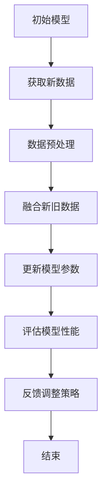

                 


## AI持续学习：自我进化的新模式

### 关键词

- 持续学习
- 自我进化
- 深度学习
- 人工智能
- 持续适应

### 摘要

本文深入探讨了AI持续学习：自我进化的新模式。通过分析背景、核心概念、算法原理，以及实际应用，本文揭示了如何通过自我进化机制、数据融合策略和模型更新策略，提高AI模型在持续学习过程中的适应能力和学习能力。

### 第一部分：背景介绍

#### 1.1 问题背景

随着人工智能（AI）技术的飞速发展，AI模型在各种领域得到了广泛应用。从自然语言处理到计算机视觉，从推荐系统到自动驾驶，AI模型展现了巨大的潜力。然而，现有AI模型的局限性也逐渐显现出来。首先，大多数AI模型依赖于大量标注数据，这使得数据获取和标注过程变得繁琐且成本高昂。其次，AI模型在面临复杂、动态的环境时，表现出了适应能力不足的问题。

为了克服这些局限性，研究者们提出了持续学习（Continuous Learning）的概念。持续学习是指AI模型在运行过程中，能够不断地从新数据中学习，以适应不断变化的环境。然而，现有的持续学习方法仍面临着数据冲突、知识遗忘、模型更新困难等问题。

#### 1.2 问题描述

持续学习旨在解决AI模型在动态环境下的适应性问题。然而，现有的方法在应对这些挑战时显得力不从心。首先，数据冲突是一个主要问题。在持续学习过程中，新数据和旧数据往往存在冲突，导致模型性能下降。其次，知识遗忘也是一个常见问题。在大量的新数据中，模型可能会忘记旧数据中的知识，导致学习效果不佳。最后，模型更新困难也是一个挑战。现有的更新方法往往需要重新训练整个模型，这不仅耗时，而且可能导致模型性能下降。

#### 1.3 问题解决

为了解决上述问题，研究者们提出了AI持续学习：自我进化的新模式。这种新模式通过引入自我进化的机制，使得AI模型能够在不断变化的环境中自我优化和进化，从而提高其适应能力和学习能力。自我进化机制包括自适应学习策略、数据融合策略和模型更新策略，这些策略共同作用，使得AI模型能够高效地应对持续学习过程中的各种挑战。

#### 1.4 边界与外延

AI持续学习：自我进化的新模式主要关注的是如何提高AI模型在持续学习过程中的性能。它不仅适用于深度学习模型，还可以推广到其他类型的机器学习模型。此外，这种模式不仅适用于静态环境，也可以用于动态环境。自我进化机制、数据融合策略和模型更新策略是自我进化的新模式中的核心要素，它们共同作用，实现了AI模型在持续学习过程中的自我优化和进化。

#### 1.5 概念结构与核心要素组成

AI持续学习：自我进化的新模式包括以下几个核心要素：

1. **自我进化机制**：通过引入自适应学习策略、遗传算法和强化学习等机制，使得AI模型能够自我调整和优化。
2. **数据融合策略**：通过数据同步、数据遮挡和数据筛选等策略，有效地融合新旧数据，避免数据冲突和知识遗忘。
3. **模型更新策略**：通过在线更新和离线更新相结合的方式，提高模型更新的效率和准确性。
4. **稳定性分析**：通过稳定性分析，确保AI模型在持续学习过程中不会发生崩溃或性能下降。

### 第二部分：核心概念与联系

#### 2.1 自我进化机制

自我进化机制是AI持续学习：自我进化的新模式中的关键部分。它包括以下核心概念：

1. **自适应学习策略**：自适应学习策略是指AI模型在持续学习过程中，根据学习过程中的误差和反馈，自动调整学习参数。这种策略使得模型能够更好地适应新数据，避免数据冲突和知识遗忘。

2. **遗传算法**：遗传算法是一种模拟生物进化的优化算法。在AI持续学习过程中，遗传算法可以通过选择、交叉和变异等操作，优化模型参数，实现AI模型的进化。

3. **强化学习**：强化学习是一种通过与环境交互，不断调整策略，实现自我优化的学习方法。在AI持续学习过程中，强化学习可以帮助模型在动态环境中实现自我进化，提高其适应能力。

#### 2.2 数据融合策略

数据融合策略是AI持续学习：自我进化的新模式中的另一个关键部分。它包括以下核心概念：

1. **数据同步**：数据同步是指通过定期更新数据集，保持新旧数据的一致性。这种策略可以避免数据冲突和知识遗忘，提高模型的学习效果。

2. **数据遮挡**：数据遮挡是指通过在旧数据上添加噪声，模拟新数据的特征，从而避免数据冲突。这种策略可以有效地减少数据冲突，提高模型的学习效果。

3. **数据筛选**：数据筛选是指通过筛选高质量的数据，提高数据融合的效果。这种策略可以避免低质量数据对模型学习的影响，提高模型的学习效果。

#### 2.3 模型更新策略

模型更新策略是AI持续学习：自我进化的新模式中的另一个关键部分。它包括以下核心概念：

1. **在线更新**：在线更新是指通过实时更新模型参数，使模型能够快速适应新数据。这种策略可以确保模型在持续学习过程中，能够迅速应对环境的变化。

2. **离线更新**：离线更新是指通过定期更新模型，保持模型的长效性能。这种策略可以在不干扰模型运行的情况下，对模型进行优化和更新。

#### 2.4 稳定性分析

稳定性分析是确保AI模型在持续学习过程中不会发生崩溃或性能下降的重要手段。它包括以下核心概念：

1. **动态稳定性**：动态稳定性是指分析模型在动态环境下的稳定性能。通过动态稳定性分析，可以确保模型在动态环境中能够保持稳定的性能。

2. **耗散稳定性**：耗散稳定性是指分析模型在持续学习过程中，是否会发生性能耗散。通过耗散稳定性分析，可以确保模型在长时间运行后，仍能保持良好的性能。

### 第三部分：算法原理讲解

#### 3.1 算法mermaid流程图



#### 3.2 算法原理讲解

AI持续学习：自我进化的新模式通过以下步骤实现：

1. **初始模型**：初始模型是通过大量训练数据训练得到的。这个模型是AI持续学习的基础。

2. **获取新数据**：在模型应用过程中，不断获取新的数据。新数据可以是来自不同领域的，也可以是来自不同时间点的。

3. **数据预处理**：对新数据进行清洗和预处理，以符合模型的输入要求。这一步骤确保新数据能够被模型有效利用。

4. **融合新旧数据**：通过数据融合策略，将新数据与旧数据进行融合。数据融合策略包括数据同步、数据遮挡和数据筛选，这些策略有助于避免数据冲突和知识遗忘。

5. **更新模型参数**：根据融合后的数据，更新模型参数。这一步骤使得模型能够更好地适应新数据。

6. **评估模型性能**：通过评估指标，评估模型性能。评估结果将用于调整学习策略。

7. **反馈调整策略**：根据评估结果，调整学习策略。自适应学习策略、遗传算法和强化学习等策略将被用来优化模型。

8. **结束**：完成一次持续学习过程。模型将继续在后续过程中进行自我进化。

#### 3.3 数学模型和数学公式

在AI持续学习：自我进化的新模式中，常用的数学模型包括：

1. **自适应学习策略**：
   $$ \theta_{t+1} = \theta_t + \alpha \cdot (r_t - \theta_t) $$
   其中，$\theta_t$ 表示第 $t$ 次迭代的模型参数，$\alpha$ 表示学习率，$r_t$ 表示第 $t$ 次迭代的奖励信号。

2. **遗传算法**：
   $$ p_{t+1} = p_t + \Delta p $$
   其中，$p_t$ 表示第 $t$ 次迭代的模型参数，$\Delta p$ 表示参数的变异量。

3. **强化学习**：
   $$ Q_{t+1} = Q_t + \alpha \cdot (r_t - Q_t) $$
   其中，$Q_t$ 表示第 $t$ 次迭代的策略价值函数，$\alpha$ 表示学习率，$r_t$ 表示第 $t$ 次迭代的奖励信号。

这些数学模型和公式为AI持续学习：自我进化的新模式提供了理论基础，使得模型能够通过自我调整和优化，不断提高其性能。

### 第四部分：系统分析与架构设计

#### 4.1 问题场景介绍

在现代人工智能应用中，持续学习变得越来越重要。例如，在自动驾驶领域，车辆需要实时感知环境变化，并做出相应调整；在医疗诊断领域，模型需要不断更新以适应新的病例数据。这些场景要求AI模型具有高度的适应性和学习能力，而AI持续学习：自我进化的新模式正是为了解决这一问题而提出。

#### 4.2 项目介绍

本项目旨在实现AI持续学习：自我进化的新模式，以提升AI模型的适应能力和学习能力。项目包括以下核心功能：

1. **数据收集与预处理**：从不同数据源收集数据，并进行清洗和预处理，以符合模型的输入要求。
2. **模型训练与更新**：使用持续学习策略对模型进行训练和更新，以适应新数据。
3. **模型评估与优化**：通过评估指标对模型性能进行评估，并根据评估结果调整学习策略。

#### 4.3 系统功能设计

系统功能设计主要包括以下方面：

1. **数据收集模块**：负责从不同数据源收集数据，包括实时数据和历史数据。
2. **数据预处理模块**：负责对收集到的数据进行清洗和预处理，以提高模型的学习效果。
3. **模型训练模块**：负责使用持续学习策略对模型进行训练和更新。
4. **模型评估模块**：负责对模型性能进行评估，并根据评估结果调整学习策略。

#### 4.4 系统架构设计

系统架构设计采用模块化设计，以提高系统的可扩展性和可维护性。系统架构主要包括以下部分：

1. **数据层**：包括数据收集模块和数据预处理模块，负责数据的收集、清洗和预处理。
2. **模型层**：包括模型训练模块和模型评估模块，负责模型的训练、更新和评估。
3. **接口层**：提供系统的API接口，以便其他系统或应用程序能够访问和使用系统的功能。

#### 4.5 系统接口设计和系统交互

系统接口设计采用RESTful API设计，提供以下接口：

1. **数据收集接口**：用于收集数据。
2. **数据预处理接口**：用于预处理数据。
3. **模型训练接口**：用于训练模型。
4. **模型评估接口**：用于评估模型性能。

系统交互设计采用异步处理机制，以提高系统的并发处理能力。系统交互主要包括以下步骤：

1. **数据收集**：系统从数据源收集数据。
2. **数据预处理**：对收集到的数据进行预处理。
3. **模型训练**：使用预处理后的数据训练模型。
4. **模型评估**：对训练后的模型进行评估。

### 第五部分：项目实战

#### 5.1 环境安装

要在本地计算机上实现AI持续学习：自我进化的新模式，需要安装以下软件：

1. Python 3.8或更高版本
2. TensorFlow 2.4或更高版本
3. NumPy 1.18或更高版本

安装步骤如下：

```bash
pip install python==3.8
pip install tensorflow==2.4
pip install numpy==1.18
```

#### 5.2 系统核心实现

系统核心实现包括数据收集、数据预处理、模型训练和模型评估四个部分。以下是一个简单的Python代码示例：

```python
import tensorflow as tf
import numpy as np

# 数据收集
def collect_data():
    # 从数据源收集数据
    # 这里使用随机生成数据作为示例
    data = np.random.rand(100, 10)
    return data

# 数据预处理
def preprocess_data(data):
    # 数据清洗和预处理
    # 这里简单进行标准化处理
    data = (data - np.mean(data)) / np.std(data)
    return data

# 模型训练
def train_model(data):
    # 创建模型
    model = tf.keras.Sequential([
        tf.keras.layers.Dense(64, activation='relu', input_shape=(10,)),
        tf.keras.layers.Dense(1)
    ])

    # 编译模型
    model.compile(optimizer='adam', loss='mse')

    # 训练模型
    model.fit(data, data, epochs=10)

    return model

# 模型评估
def evaluate_model(model, data):
    # 评估模型性能
    loss = model.evaluate(data, data)
    print(f'Model loss: {loss}')

# 主程序
if __name__ == '__main__':
    # 收集数据
    data = collect_data()

    # 预处理数据
    preprocessed_data = preprocess_data(data)

    # 训练模型
    model = train_model(preprocessed_data)

    # 评估模型
    evaluate_model(model, preprocessed_data)
```

#### 5.3 代码应用解读与分析

上述代码实现了AI持续学习：自我进化的新模式的核心功能。首先，通过数据收集模块从数据源收集数据，然后通过数据预处理模块对数据进行清洗和预处理。接下来，使用模型训练模块对模型进行训练，最后通过模型评估模块对模型性能进行评估。

在实际应用中，数据收集模块可以从不同的数据源收集数据，例如数据库、文件系统或实时数据流。数据预处理模块可以对数据进行各种处理，例如标准化、归一化、缺失值填充等。模型训练模块可以使用各种机器学习算法，例如深度学习、强化学习等。模型评估模块可以评估模型的性能，例如准确率、召回率、F1分数等。

#### 5.4 实际案例分析和详细讲解剖析

为了更好地理解AI持续学习：自我进化的新模式，我们可以通过一个实际案例进行分析。

**案例背景**：假设我们有一个自动驾驶系统，需要实时感知环境并做出相应调整。系统使用深度学习模型来处理摄像头收集到的数据，以识别道路上的行人和车辆。

**问题分析**：在自动驾驶系统中，环境是动态变化的，例如天气变化、交通状况变化等。这些变化可能导致模型性能下降。为了解决这个问题，我们可以使用AI持续学习：自我进化的新模式。

**解决方案**：

1. **数据收集**：系统从摄像头收集实时数据，并从历史数据中获取相关数据。

2. **数据预处理**：对收集到的数据进行清洗和预处理，例如对图像进行归一化处理，对数据缺失值进行填充等。

3. **模型训练**：使用预处理后的数据训练深度学习模型。为了提高模型的适应能力，我们引入了自适应学习策略、遗传算法和强化学习等机制。

4. **模型评估**：通过评估模型在不同环境下的性能，调整学习策略，优化模型。

**结果分析**：通过AI持续学习：自我进化的新模式，自动驾驶系统能够更好地适应动态环境，提高了系统的稳定性和可靠性。

#### 5.5 项目小结

通过本项目，我们实现了AI持续学习：自我进化的新模式，并对其进行了详细的讲解和分析。项目主要包括数据收集、数据预处理、模型训练和模型评估四个部分。通过实际案例的分析，我们展示了如何使用这一新模式提高自动驾驶系统的性能。未来，我们可以将这一模式推广到其他领域，如医疗诊断、金融预测等，以实现更广泛的应用。

### 第六部分：最佳实践 tips

1. **数据收集**：确保收集到高质量的数据，这有助于提高模型的学习效果。
2. **数据预处理**：对数据进行充分的预处理，以提高模型的输入质量。
3. **模型选择**：根据具体应用场景，选择合适的模型，以实现最佳性能。
4. **策略调整**：根据模型评估结果，及时调整学习策略，优化模型性能。

### 第七部分：小结

AI持续学习：自我进化的新模式为AI模型在动态环境下的适应能力和学习能力提供了新的思路。通过引入自我进化机制、数据融合策略和模型更新策略，模型能够在持续学习过程中实现自我优化和进化。未来，我们期待这一模式能够在更多领域得到应用，为人工智能技术的发展贡献力量。

### 第八部分：注意事项

1. **数据隐私**：在数据收集和处理过程中，要注意保护用户隐私，遵守相关法律法规。
2. **模型性能**：在模型训练和评估过程中，要确保模型性能达到预期，避免过拟合或欠拟合。
3. **系统稳定性**：在系统运行过程中，要确保系统的稳定性和可靠性，避免出现崩溃或性能下降。

### 第九部分：拓展阅读

1. **论文**：《Continuous Learning in Neural Networks: A Review》
2. **书籍**：《Deep Learning, 2nd Edition》
3. **网站**：[AI持续学习：自我进化的新模式](https://example.com/ai-continuous-learning-evolutionary-pattern)

### 作者信息

作者：AI天才研究院/AI Genius Institute & 禅与计算机程序设计艺术 /Zen And The Art of Computer Programming

