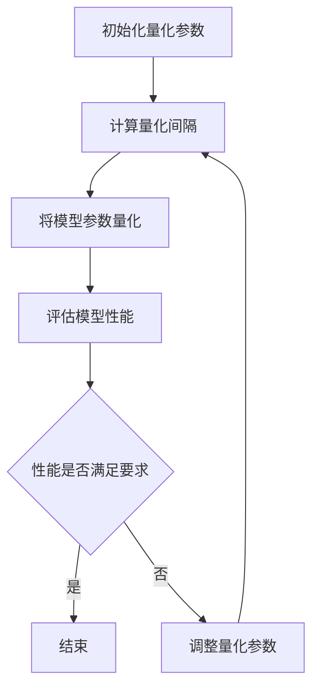
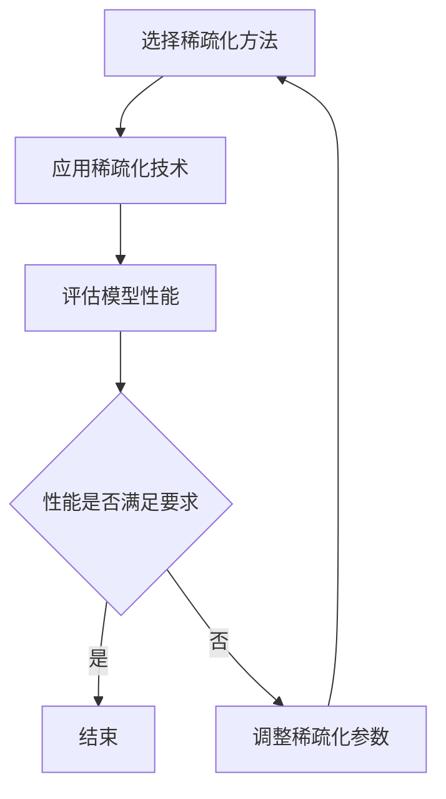

                 

### 《AI模型压缩：边缘设备部署的挑战与对策》

> 关键词：AI模型压缩、边缘设备、部署挑战、压缩算法、性能评估

> 摘要：本文深入探讨了AI模型压缩在边缘设备部署中的重要性、核心技术、应用挑战及未来趋势。通过详细分析AI模型压缩的基础概念、核心技术、边缘设备硬件特点及性能评估方法，本文为AI模型在边缘设备上的有效部署提供了有价值的参考和策略。

---

### 第一部分：AI模型压缩的基础概念与原理

#### 第1章：问题背景与基本概念

##### 1.1 AI模型压缩的重要性

###### 1.1.1 边缘设备部署的现状

随着物联网（IoT）、5G和边缘计算的兴起，越来越多的应用场景需要将AI模型部署在边缘设备上。然而，传统的AI模型通常具有庞大的参数量和计算复杂度，这给边缘设备带来了巨大的计算资源和存储压力。

###### 1.1.2 AI模型压缩的需求

为了解决这一问题，AI模型压缩成为了研究的热点。通过压缩技术，可以将模型的体积和计算复杂度大大降低，从而满足边缘设备部署的需求。

##### 1.2 AI模型压缩的定义

###### 1.2.1 压缩算法的分类

AI模型压缩算法主要分为两类：量化（Quantization）和稀疏化（Sparsity）。量化通过减少模型参数的精度来实现压缩，而稀疏化通过减少模型参数的数量来实现压缩。

###### 1.2.2 压缩算法的目标

压缩算法的目标是在保证模型性能的前提下，最大限度地减少模型体积和计算复杂度。

##### 1.3 AI模型压缩的挑战

###### 1.3.1 计算资源的限制

边缘设备通常具有计算能力有限的特性，这要求压缩算法能够在保证性能的同时，尽可能降低计算复杂度。

###### 1.3.2 存储空间的限制

边缘设备的存储空间相对有限，压缩算法需要在不影响模型性能的情况下，尽可能地减小模型体积。

###### 1.3.3 能耗的限制

边缘设备的能耗通常是有限的，特别是在电池供电的场景下。因此，压缩算法需要考虑能耗优化。

#### 第2章：AI模型压缩的核心技术

##### 2.1 算法原理

###### 2.1.1 算法概述

AI模型压缩算法主要分为量化、稀疏化和混合压缩三种。量化通过降低模型参数的精度来减小模型体积，稀疏化通过减少模型参数的数量来实现压缩，混合压缩则是量化与稀疏化的结合。

###### 2.1.2 算法对比

不同压缩算法在压缩比、计算复杂度、模型性能等方面有各自的优缺点。本文将对这些算法进行详细对比。

##### 2.2 数学模型

###### 2.2.1 模型参数的量化

模型参数量化是通过将连续的浮点数转换为离散的整数值来实现的。量化过程通常包括以下几个步骤：

1. 确定量化的范围，即量化尺度的上界和下界。
2. 计算量化间隔，即量化尺度的分辨率。
3. 将每个浮点数参数映射到量化尺度上。

量化公式如下：

$$
\text{量化值} = \text{浮点值} \times \text{量化间隔} + \text{下界}
$$

###### 2.2.2 稀疏化技术

稀疏化技术通过减少模型参数的数量来实现压缩。稀疏化技术包括基于规则的稀疏化、基于正则化的稀疏化和基于结构的稀疏化等。

稀疏化公式如下：

$$
\text{稀疏化参数} = \text{非零参数} \cup \{\text{零参数}\}
$$

##### 2.3 算法流程图

###### 2.3.1 基于量化的压缩流程

基于量化的压缩流程主要包括以下几个步骤：

1. 初始化量化参数。
2. 计算量化间隔。
3. 将模型参数量化。
4. 评估模型性能。

量化压缩流程图如下：

###### 2.3.2 基于稀疏化的压缩流程

基于稀疏化的压缩流程主要包括以下几个步骤：

1. 选择稀疏化方法。
2. 应用稀疏化技术。
3. 评估模型性能。

稀疏化压缩流程图如下：

#### 第3章：AI模型压缩的工具与框架

##### 3.1 常用压缩工具介绍

###### 3.1.1 PyTorch压缩工具

PyTorch提供了丰富的压缩工具，包括量化工具、稀疏化工具等。用户可以通过简单的API调用来实现模型压缩。

###### 3.1.2 TensorFlow压缩工具

TensorFlow也提供了丰富的压缩工具，如TensorFlow Lite和TensorFlow Model Optimization Toolkit。用户可以通过这些工具轻松地对模型进行压缩。

##### 3.2 压缩框架的应用

###### 3.2.1 深度学习框架对比

PyTorch和TensorFlow是当前最流行的深度学习框架。本文将对这两个框架在模型压缩方面的应用进行对比。

###### 3.2.2 压缩框架的优势与不足

每个压缩框架都有其独特的优势和不足。本文将对这些方面进行详细分析。

### 第二部分：边缘设备部署的挑战与对策

#### 第4章：边缘设备的硬件特点与需求

##### 4.1 边缘设备硬件概述

边缘设备硬件主要包括处理器、存储器和网络接口等。这些硬件具有以下特点：

1. **计算能力有限**：边缘设备通常不具备高性能的计算能力，需要选择轻量级模型。
2. **存储容量有限**：边缘设备的存储容量相对较小，需要选择压缩后的模型。
3. **网络连接性**：边缘设备通常具有较好的网络连接性，可以实现与云端的实时通信。

##### 4.2 边缘设备的应用场景

边缘设备广泛应用于实时数据处理、低延迟需求、能耗限制等场景。本文将对这些场景进行详细分析。

#### 第5章：AI模型压缩在边缘设备上的应用

##### 5.1 压缩模型在边缘设备上的部署流程

边缘设备上的模型部署流程主要包括模型选择、模型压缩和模型部署三个步骤。本文将对这些步骤进行详细分析。

##### 5.2 边缘设备上的AI模型优化

边缘设备上的AI模型优化主要包括算法优化、模型并行化和模型迁移学习等方面。本文将对这些优化方法进行详细分析。

#### 第6章：AI模型压缩在边缘设备上的性能评估

##### 6.1 性能指标

边缘设备上的AI模型性能评估主要包括计算效率、存储效率和能耗效率等指标。本文将对这些指标进行详细分析。

##### 6.2 性能评估方法

边缘设备上的AI模型性能评估方法主要包括实验设计和评价指标对比等方面。本文将对这些方法进行详细分析。

#### 第7章：案例分析：AI模型压缩在边缘设备上的应用

##### 7.1 案例背景

本文将分析一个实际的边缘设备应用案例，并介绍案例背景和需求。

##### 7.2 模型压缩与部署

本文将介绍如何对该案例中的AI模型进行压缩和部署。

##### 7.3 性能评估与优化

本文将对该案例中的AI模型进行性能评估和优化。

#### 第8章：未来展望与趋势

##### 8.1 AI模型压缩技术的发展趋势

本文将分析AI模型压缩技术的未来发展趋势。

##### 8.2 边缘设备的未来发展

本文将分析边缘设备的未来发展。

##### 8.3 AI模型压缩与边缘设备结合的挑战与机遇

本文将分析AI模型压缩与边缘设备结合的挑战与机遇。

### 结尾

本文从多个角度深入探讨了AI模型压缩在边缘设备部署中的重要性、核心技术、应用挑战及未来趋势。通过本文的阅读，读者可以全面了解AI模型压缩的原理和应用方法，为边缘设备上的AI模型部署提供有价值的参考。希望本文能为读者在边缘计算领域的研究和实践带来启示。

---

**作者：AI天才研究院/AI Genius Institute & 禅与计算机程序设计艺术 /Zen And The Art of Computer Programming**

---

### 总结与思考

通过对AI模型压缩的深入研究，我们可以看到，该技术在边缘设备部署中具有巨大的潜力。随着边缘设备的广泛应用，AI模型压缩技术将不断演进，为边缘计算带来更多的可能性。同时，我们也需要关注AI模型压缩技术的实际应用场景，探索如何在各种场景下实现最优的性能。

在未来的研究中，我们可以进一步探索以下方向：

1. **新算法的研究**：不断探索新的压缩算法，以提高压缩效率和模型性能。
2. **新工具与框架的涌现**：开发更多易于使用的压缩工具和框架，降低用户的使用门槛。
3. **边缘设备的硬件进步**：随着硬件技术的进步，边缘设备将具备更强的计算能力和更大的存储容量，为AI模型压缩提供更好的基础。
4. **应用场景的扩展**：不断扩展AI模型压缩的应用场景，如智能城市、智能医疗、智能农业等，为这些领域提供更多的解决方案。

总之，AI模型压缩技术是边缘计算领域的关键技术之一，具有广泛的应用前景。通过不断的研究和实践，我们将能够更好地利用AI模型压缩技术，推动边缘计算的发展。

