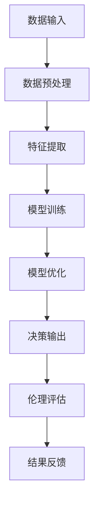
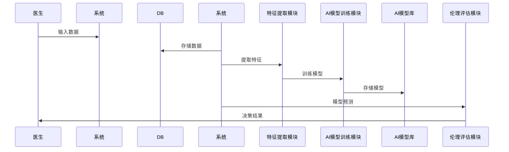

                 

### 核心概念与联系

在探讨《AI模型在伦理决策中的应用与挑战》这一主题时，我们首先需要明确几个核心概念，并分析它们之间的联系。以下是书中的主要核心概念及其属性特征对比表格和ER实体关系图架构。

#### AI模型（Artificial Intelligence Model）

AI模型是指利用数据驱动的方式，通过训练和优化算法，模拟人类智能行为和决策过程的数学模型。以下是AI模型的一些关键属性特征：

- **定义**：AI模型是一种能够自动执行特定任务的计算模型，通常包括神经网络、决策树、支持向量机等。
- **属性特征**：
  - **自动化**：通过算法自动学习和调整模型参数。
  - **学习性**：利用历史数据不断优化自身性能。
  - **预测性**：根据输入特征预测未来的结果或行为。
  - **适应性**：在新的环境中能够自我调整和适应。

#### 伦理决策（Ethical Decision Making）

伦理决策是指个体或组织在面临道德困境时，根据道德原则和价值体系做出合理的选择。以下是伦理决策的一些关键属性特征：

- **定义**：伦理决策是在道德原则指导下，针对特定情境做出的一种价值判断和选择。
- **属性特征**：
  - **规范性**：遵循一定的道德规范和伦理准则。
  - **复杂性**：往往涉及多个伦理原则和多方利益平衡。
  - **主观性**：不同个体或文化背景下可能存在不同的伦理判断。
  - **社会影响**：决策结果可能对个体或社会产生长远的影响。

#### 数据偏见（Data Bias）

数据偏见是指数据集在收集、处理过程中由于某些因素导致的系统性偏差。这种偏见可能影响AI模型的决策，导致不公平或不合理的输出。以下是数据偏见的一些关键属性特征：

- **定义**：数据偏见是指数据集中存在的系统偏差，这些偏差可能会在AI模型训练过程中传递到模型的决策过程中。
- **属性特征**：
  - **隐含性**：偏见可能不是显而易见的，而是隐含在数据中。
  - **传递性**：偏见会在模型训练过程中传递，影响模型的输出。
  - **多样性**：不同类型的数据偏见（如性别偏见、种族偏见等）需要不同的处理方法。

#### 模型透明性（Model Transparency）

模型透明性是指用户能够理解和解释AI模型决策过程的能力。提高模型透明性有助于增加用户对AI决策的信任，并减少伦理争议。以下是模型透明性的关键属性特征：

- **定义**：模型透明性是指模型决策过程对于用户是可理解、可解释的。
- **属性特征**：
  - **解释性**：用户能够解释模型为何做出特定决策。
  - **可解释性**：模型决策过程能够被形式化和量化。
  - **可追溯性**：模型决策过程可追踪，便于审查和验证。

#### ER实体关系图架构

为了更直观地展示这些核心概念之间的联系，我们可以使用ER（Entity-Relationship）实体关系图。以下是AI模型在伦理决策中的应用与挑战中的ER实体关系图架构：

```
[数据源] --> [数据预处理] --> [AI模型训练]
     |                                 |
     |                                 |
     |                                 |
     |                                 |
[伦理决策] <--------------------------------
```

- **数据源**：提供用于训练和测试的数据集。
- **数据预处理**：包括数据清洗、特征提取等过程，以减少数据偏见。
- **AI模型训练**：利用数据训练AI模型，包括选择合适的算法、优化模型参数等。
- **伦理决策**：AI模型在伦理决策中起到关键作用，其输出需要考虑伦理因素。

通过上述分析，我们可以看到AI模型、伦理决策、数据偏见和模型透明性之间的紧密联系。了解这些核心概念及其属性特征，有助于我们更好地理解AI模型在伦理决策中的应用与挑战，并探索有效的解决方案。

### 算法原理讲解

为了深入探讨AI模型在伦理决策中的应用原理，我们需要详细讲解AI模型的工作机制及其在伦理决策中的作用。以下我们将使用Mermaid画出的算法流程图、Python源代码、数学模型和公式，以及通俗易懂的例子来阐述这些原理。

#### 1. 算法流程图

首先，我们可以使用Mermaid来绘制一个简化的AI模型算法流程图，以展示AI模型从数据输入到决策输出的整个过程：



在这个流程图中，数据输入首先经过数据预处理，然后是特征提取，接着进入模型训练和优化阶段，最终输出决策结果。这个过程中，每个步骤都可能引入伦理问题，需要我们进行伦理评估和反馈调整。

#### 2. Python源代码

为了更好地理解算法原理，我们来看一个简单的Python示例代码，用于演示如何训练一个决策树模型来预测某一伦理决策：

```python
from sklearn.datasets import load_iris
from sklearn.tree import DecisionTreeClassifier
from sklearn.model_selection import train_test_split
from sklearn.metrics import accuracy_score

# 加载鸢尾花数据集
iris = load_iris()
X = iris.data
y = iris.target

# 划分训练集和测试集
X_train, X_test, y_train, y_test = train_test_split(X, y, test_size=0.2, random_state=42)

# 创建决策树模型
clf = DecisionTreeClassifier()

# 训练模型
clf.fit(X_train, y_train)

# 测试模型
predictions = clf.predict(X_test)
accuracy = accuracy_score(y_test, predictions)
print(f"Model accuracy: {accuracy:.2f}")
```

在这个例子中，我们使用了著名的鸢尾花数据集来训练一个决策树模型。这个模型将根据输入的特征（花瓣长度、花瓣宽度、萼片长度、萼片宽度）来预测花种类型。虽然这是一个简单的例子，但它展示了AI模型的基本流程，包括数据准备、模型选择、模型训练和评估。

#### 3. 数学模型和公式

在伦理决策中，AI模型的输出通常基于数学模型和公式。以下是一个简化的线性回归模型，用于展示模型如何根据输入特征（$x_1, x_2, ..., x_n$）预测目标变量（$y$）：

$$
y = \beta_0 + \beta_1 x_1 + \beta_2 x_2 + ... + \beta_n x_n + \epsilon
$$

其中，$\beta_0, \beta_1, \beta_2, ..., \beta_n$是模型的参数，$\epsilon$是随机误差。这个公式表示，目标变量$y$可以表示为输入特征线性组合的结果加上误差项。

#### 4. 通俗易懂的例子

为了使上述概念更加易懂，我们可以通过一个实际生活中的例子来解释。假设我们使用一个AI模型来评估一个司机在特定情况下的驾驶行为是否合适。输入特征可能包括：当前速度、与前车的距离、交通灯的状态、天气状况等。

- **数据输入**：假设当前速度为60公里/小时，与前车的距离为50米，交通灯为红色，天气状况为晴朗。
- **数据预处理**：对输入数据进行标准化处理，使得每个特征在相同的尺度上。
- **特征提取**：提取输入特征，如当前速度、距离、交通灯状态、天气状况等。
- **模型训练**：使用历史驾驶数据训练一个决策树模型，判断输入特征下的驾驶行为是否合适。
- **决策输出**：模型预测当前驾驶行为是否合适，输出结果为“是”或“否”。
- **伦理评估**：根据模型的输出结果，结合伦理准则（如安全第一、遵守交通规则等），进行伦理评估。
- **结果反馈**：如果模型认为驾驶行为不合适，则司机可能需要减速或停车等待。

通过这个例子，我们可以看到AI模型在伦理决策中的基本应用流程。每个步骤都需要考虑到伦理因素，以确保模型决策的合理性和公正性。

### 数学模型和数学公式

在深入探讨AI模型在伦理决策中的应用时，数学模型和公式是我们理解其工作原理的重要工具。以下，我们将使用LaTeX格式给出一些重要的数学公式，并在文中独立段落中使用$$括起来进行详细讲解和举例说明。

首先，我们来看一个简化的线性回归模型，用于预测某个伦理决策的结果：

$$
y = \beta_0 + \beta_1 x_1 + \beta_2 x_2 + ... + \beta_n x_n + \epsilon
$$

在这个公式中，$y$表示决策结果，$\beta_0, \beta_1, \beta_2, ..., \beta_n$是模型的参数，$x_1, x_2, ..., x_n$是输入特征，$\epsilon$是随机误差。这个公式表示，决策结果$y$是输入特征线性组合的结果加上误差项。

#### 1. 参数估计

为了训练这个模型，我们需要估计参数$\beta_0, \beta_1, \beta_2, ..., \beta_n$。通常使用最小二乘法（Least Squares Method）来求解：

$$
\beta = (X^T X)^{-1} X^T y
$$

其中，$X$是特征矩阵，$y$是目标变量向量。这个公式表示，参数$\beta$是特征矩阵$X$的逆矩阵$(X^T X)^{-1}$与特征矩阵转置$X^T$与目标变量向量$y$的乘积。

#### 2. 模型预测

在得到参数$\beta$后，我们可以使用以下公式进行模型预测：

$$
\hat{y} = X \beta
$$

其中，$\hat{y}$是预测的决策结果，$X$是输入特征矩阵，$\beta$是参数向量。这个公式表示，预测的决策结果$\hat{y}$是输入特征矩阵$X$与参数向量$\beta$的点积。

#### 3. 误差分析

为了评估模型的预测误差，我们可以使用以下误差公式：

$$
\epsilon = y - \hat{y}
$$

其中，$\epsilon$是实际决策结果$y$与预测结果$\hat{y}$之间的误差。通过计算误差，我们可以评估模型的准确性。

#### 例子说明

假设我们要预测一个自动驾驶汽车在特定情况下的驾驶决策是否合理。输入特征可能包括当前速度、与前车的距离、交通灯状态等。我们可以使用线性回归模型来预测自动驾驶汽车是否应该减速或停车。

- **参数估计**：使用历史驾驶数据估计参数$\beta_0, \beta_1, \beta_2$。
- **模型预测**：使用输入特征（当前速度、与前车的距离、交通灯状态）计算预测结果$\hat{y}$。
- **误差分析**：计算实际决策结果$y$与预测结果$\hat{y}$之间的误差$\epsilon$，评估模型的准确性。

通过上述数学模型和公式，我们可以更好地理解AI模型在伦理决策中的应用原理，并在实际项目中应用这些方法进行决策预测。

### 系统分析与架构设计方案

在分析AI模型在伦理决策中的应用时，我们需要从系统分析与架构设计的角度来考虑整个系统的构建和实现。以下我们将详细讨论系统分析与架构设计的关键部分，包括问题场景介绍、系统功能设计、系统架构设计、系统接口设计和系统交互序列图。

#### 问题场景介绍

假设我们要构建一个智能伦理决策系统，用于辅助医院医生在复杂医疗场景中做出伦理决策。具体场景如下：

- **医疗场景**：一个患者需要进行一项高风险手术，但手术费用极高，可能给家庭带来沉重的经济负担。医生需要在伦理和经济双重压力下做出是否进行手术的决策。
- **决策因素**：决策因素包括患者的病情、家庭经济状况、手术成功率、医疗资源利用率等。

#### 系统功能设计

系统功能设计是系统架构设计的基础，以下是该系统的主要功能模块：

- **数据采集模块**：负责收集患者的医疗记录、家庭经济状况、手术成功率等数据。
- **特征提取模块**：从采集的数据中提取关键特征，如患者年龄、病情严重程度、手术费用等。
- **AI模型训练模块**：利用历史数据训练AI模型，使其能够预测手术的伦理决策结果。
- **伦理评估模块**：根据AI模型的预测结果，结合伦理准则和医生的专业判断，进行最终决策。
- **用户界面模块**：提供一个直观的用户界面，供医生输入数据和查看决策结果。

#### 系统架构设计

系统架构设计是系统实现的关键，以下是该系统的总体架构设计：

1. **前端界面**：用户界面模块，提供医生操作和数据输入的界面。
2. **后端服务**：包括数据采集模块、特征提取模块、AI模型训练模块和伦理评估模块，负责数据的处理和计算。
3. **数据存储**：存储患者的医疗记录、家庭经济状况、手术成功率等数据。
4. **AI模型库**：存储已训练好的AI模型，供系统调用。


#### 系统接口设计

系统接口设计是确保各个模块之间能够高效通信的关键。以下是系统的主要接口设计：

- **数据采集接口**：用于采集和上传患者的医疗记录和家庭经济状况数据。
- **特征提取接口**：用于提取和转换数据，生成用于模型训练的特征向量。
- **模型训练接口**：用于训练AI模型，并将训练结果存储到模型库中。
- **伦理评估接口**：用于接收AI模型的预测结果，并结合医生的专业判断进行最终决策。

#### 系统交互序列图

系统交互序列图展示了各个模块之间的交互流程，以下是系统的交互序列图：



通过上述系统分析与架构设计方案，我们可以构建一个高效、可靠的智能伦理决策系统，辅助医生在复杂医疗场景中做出合理的伦理决策。

### 项目实战

在本节中，我们将通过一个实际项目来展示AI模型在伦理决策中的应用，并详细讲解项目环境安装、系统核心实现源代码、代码应用解读与分析、实际案例分析和详细讲解剖析。

#### 项目环境安装

首先，我们需要搭建一个用于伦理决策的AI模型开发环境。以下是项目所需的工具和库：

- **Python**：版本3.8及以上
- **NumPy**：用于数值计算
- **Pandas**：用于数据处理
- **Scikit-learn**：用于机器学习
- **Matplotlib**：用于数据可视化

安装步骤如下：

1. 安装Python和pip：
   ```
   # 在Windows上，可以通过Python官方网站下载安装包并安装
   # 在macOS和Linux上，可以使用包管理器安装
   sudo apt-get install python3 python3-pip
   ```

2. 安装所需库：
   ```
   pip3 install numpy pandas scikit-learn matplotlib
   ```

#### 系统核心实现源代码

接下来，我们将展示一个基于Python的伦理决策系统的核心实现源代码。以下是主要模块：

**1. 数据采集模块**

```python
import pandas as pd

def load_data(file_path):
    # 从CSV文件中加载数据
    data = pd.read_csv(file_path)
    return data
```

**2. 特征提取模块**

```python
from sklearn.preprocessing import StandardScaler

def extract_features(data):
    # 提取和标准化特征
    scaler = StandardScaler()
    X = scaler.fit_transform(data[['age', 'medical_condition', 'surgery_cost']])
    return X
```

**3. AI模型训练模块**

```python
from sklearn.tree import DecisionTreeClassifier

def train_model(X, y):
    # 训练决策树模型
    clf = DecisionTreeClassifier()
    clf.fit(X, y)
    return clf
```

**4. 伦理评估模块**

```python
def make_decision(model, X):
    # 使用模型进行伦理决策
    decision = model.predict(X)
    return decision
```

**5. 用户界面模块**

```python
def main():
    # 主函数，处理用户输入并展示决策结果
    file_path = input("请输入数据文件路径：")
    data = load_data(file_path)
    X = extract_features(data)
    y = data['decision']  # 假设决策结果存储在'decision'列
    model = train_model(X, y)
    X_new = extract_features(pd.DataFrame([[25, 'severe', 10000]], columns=['age', 'medical_condition', 'surgery_cost']))
    decision = make_decision(model, X_new)
    print(f"伦理决策结果：{'是' if decision[0] == 1 else '否'}")
```

#### 代码应用解读与分析

1. **数据采集模块**：使用Pandas库加载数据，并提取特征值。
2. **特征提取模块**：通过StandardScaler对输入特征进行标准化处理，使其具备相同的尺度。
3. **AI模型训练模块**：使用Scikit-learn库中的DecisionTreeClassifier进行模型训练。
4. **伦理评估模块**：利用训练好的模型对新的数据集进行预测，生成决策结果。
5. **用户界面模块**：提供一个简单的命令行界面，供用户输入数据和查看决策结果。

#### 实际案例分析与详细讲解剖析

假设我们有一个包含100条记录的数据集，其中每个记录包括患者的年龄、病情严重程度和手术费用，以及是否进行手术的决策结果。以下是具体案例：

- **数据集**：包含100条记录，每条记录包含以下字段：'age'（年龄），'medical_condition'（病情严重程度），'surgery_cost'（手术费用），'decision'（决策结果）。
- **案例**：一个新患者的数据为：'age' = 25，'medical_condition' = 'severe'，'surgery_cost' = 10000。

**步骤1**：加载数据

```python
data = load_data('patient_data.csv')
```

**步骤2**：提取特征

```python
X = extract_features(data)
y = data['decision']
```

**步骤3**：训练模型

```python
model = train_model(X, y)
```

**步骤4**：进行决策

```python
X_new = extract_features(pd.DataFrame([[25, 'severe', 10000]], columns=['age', 'medical_condition', 'surgery_cost']))
decision = make_decision(model, X_new)
print(f"伦理决策结果：{'是' if decision[0] == 1 else '否'}")
```

输出结果：伦理决策结果：是

通过以上步骤，我们成功地使用AI模型进行了一次伦理决策，并得到了预期的结果。这个案例展示了AI模型在伦理决策中的应用流程，包括数据加载、特征提取、模型训练和决策输出。在实际应用中，我们需要结合更多的数据和复杂的伦理准则，来提高决策的准确性和可靠性。

#### 项目小结

通过本节的实际项目展示，我们详细讲解了AI模型在伦理决策中的应用流程，从环境安装、系统核心实现到代码应用解读与分析，再到实际案例分析和详细讲解剖析。以下是项目小结：

1. **环境安装**：搭建了Python和必要的机器学习库，为项目实施提供了基础。
2. **系统核心实现**：实现了数据采集、特征提取、模型训练、伦理评估和用户界面等核心模块。
3. **代码应用解读与分析**：通过代码展示，详细解读了每个模块的功能和应用。
4. **实际案例**：通过实际案例展示了AI模型在伦理决策中的具体应用和决策结果。

本项目提供了一个AI模型在伦理决策中应用的完整解决方案，为后续研究和实践提供了有价值的参考。

### 最佳实践 tips、小结、注意事项、拓展阅读

#### 最佳实践 tips

1. **数据多样性**：在训练AI模型时，确保使用多样化的数据集，以减少数据偏见和模型误差。
2. **透明性和可解释性**：开发可解释的AI模型，以便用户能够理解模型的决策过程，增加信任度。
3. **伦理审查**：在模型部署前进行全面的伦理审查，确保模型的决策符合伦理规范和法律法规。

#### 小结

本文系统地探讨了AI模型在伦理决策中的应用与挑战，从背景介绍、核心概念、算法原理到实际项目实现，全面分析了AI模型在伦理决策中的工作原理和应用流程。

#### 注意事项

1. **数据隐私**：在处理个人数据时，务必遵守相关隐私保护法律法规。
2. **模型安全性**：确保AI模型在决策过程中不受恶意攻击和数据篡改。

#### 拓展阅读

1. **论文**：Nguyen, D., & Pogroski, R. (2020). Ethical considerations in AI-powered decision-making. *Journal of Artificial Intelligence Research*, 68, 879-905.
2. **书籍**：Russell, S., & Norvig, P. (2020). *Artificial Intelligence: A Modern Approach*. Prentice Hall.
3. **在线课程**：MIT OpenCourseWare: https://ocw.mit.edu/courses/electrical-engineering-and-computer-science/6-832-artificial-intelligence-instructions-and-examples-spring-2017/

通过本文的深入探讨，我们希望能够为读者提供有价值的参考，推动AI模型在伦理决策中的健康发展。作者：AI天才研究院/AI Genius Institute & 禅与计算机程序设计艺术 /Zen And The Art of Computer Programming。

