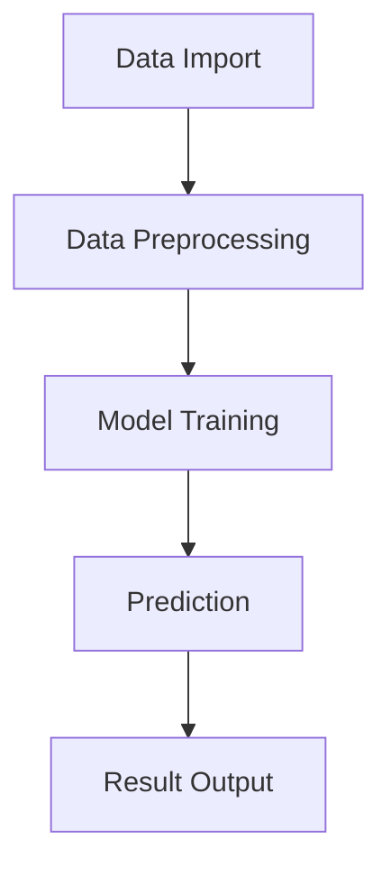
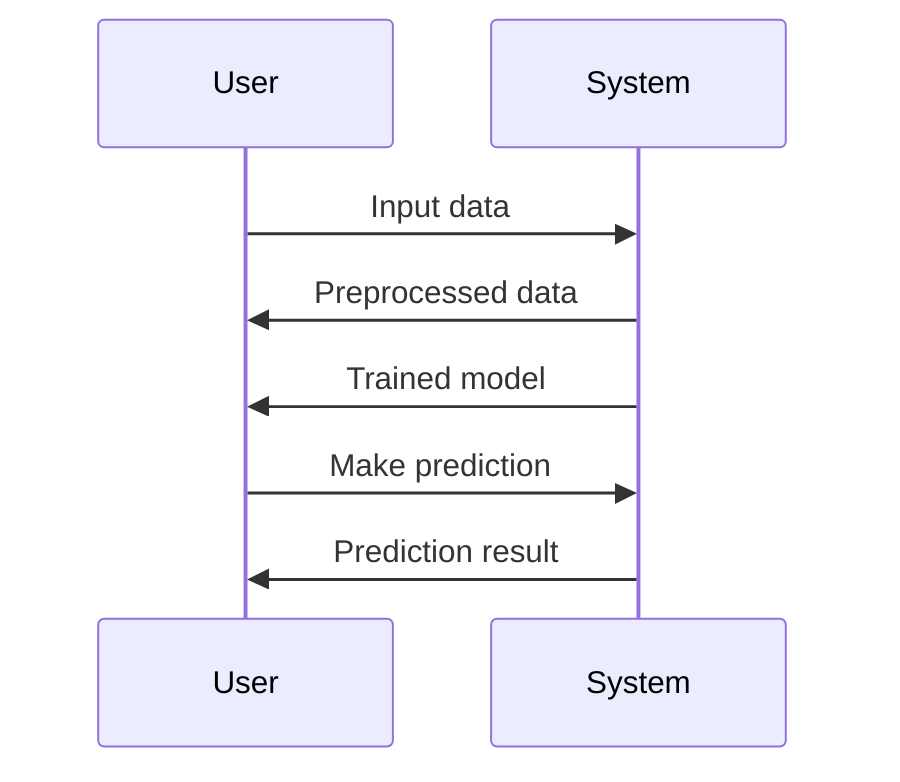

                 

# 《AI模型在处理结构化数据时的效率提升》

> 关键词：AI模型，结构化数据，效率提升，算法原理，系统架构

> 摘要：本文将深入探讨AI模型在处理结构化数据时的效率提升问题。我们将首先介绍背景和问题，然后详细解析核心概念与联系，讲解算法原理，分析系统架构设计，并进行项目实战，最后提供最佳实践和拓展阅读。通过这篇文章，读者将能够全面了解AI模型在处理结构化数据时的效率提升路径。

## 第一部分：背景介绍

### 1.1 问题背景

随着大数据时代的到来，结构化数据在各个领域得到了广泛应用。然而，传统的数据处理方法在面对大规模结构化数据时往往显得力不从心。AI模型的引入为结构化数据的高效处理带来了新的机遇，但也随之带来了效率提升的问题。

### 1.2 问题描述

结构化数据的特点在于数据的组织形式明确，通常以表格形式呈现。然而，当前AI模型在处理结构化数据时面临以下挑战：

1. **数据处理速度**：大规模结构化数据的处理速度较慢。
2. **准确性**：模型在处理复杂结构化数据时可能存在误判和漏判。
3. **资源消耗**：处理结构化数据需要大量的计算资源和存储空间。

### 1.3 问题解决

为了解决上述问题，我们可以从以下几个方面入手：

1. **算法优化**：改进AI模型处理结构化数据的算法，提高处理速度和准确性。
2. **硬件升级**：使用更高效的硬件设备，如GPU加速处理。
3. **数据预处理**：对结构化数据进行预处理，减少模型处理的数据量。
4. **分布式处理**：利用分布式计算技术，提高处理效率。

### 1.4 边界与外延

结构化数据的范围涵盖了各类表格、数据库等。AI模型的应用领域广泛，包括金融、医疗、物流等。然而，AI模型在处理非结构化数据和非线性数据时可能存在一定的限制。

### 1.5 概念结构与核心要素组成

结构化数据的核心要素包括数据字段、数据类型和数据关系。AI模型在处理结构化数据时涉及的核心概念包括机器学习算法、深度学习网络和数据预处理技术。

## 第二部分：核心概念与联系

### 2.1 核心概念原理

AI模型的工作原理基于数据驱动，通过学习大量数据进行模式识别和预测。结构化数据处理的核心在于如何有效地提取和利用数据字段。

### 2.2 概念属性特征对比表格

| 特征         | AI模型          | 结构化数据处理          |
| ------------ | --------------- | ---------------------- |
| 处理方式     | 基于数据学习     | 基于规则和模式识别      |
| 数据类型     | 复杂数据结构     | 明确的数据字段         |
| 资源消耗     | 大量计算资源     | 较高存储空间需求       |
| 处理速度     | 随数据量增加而减慢 | 可通过优化算法提升速度 |

### 2.3 ER实体关系图架构

```mermaid
erDiagram
  Customer ||--|{ Order }|--| Supplier
  Product ||--|{ Order }|--| Customer
```

实体包括Customer、Order和Supplier，属性包括Customer的ID、Name等，关系包括订单与客户、供应商之间的关联。

## 第三部分：算法原理讲解

### 3.1 算法mermaid流程图


### 3.2 Python源代码阐述

```python
# 导入所需库
import pandas as pd
from sklearn.model_selection import train_test_split
from sklearn.ensemble import RandomForestClassifier

# 数据预处理
data = pd.read_csv('data.csv')
X = data.drop('target', axis=1)
y = data['target']

X_train, X_test, y_train, y_test = train_test_split(X, y, test_size=0.2, random_state=42)

# 模型训练
model = RandomForestClassifier(n_estimators=100)
model.fit(X_train, y_train)

# 预测
predictions = model.predict(X_test)

# 结果评估
accuracy = model.score(X_test, y_test)
print(f'Accuracy: {accuracy:.2f}')
```

### 3.3 数学模型和公式

$$
\text{Cost} = \frac{1}{2m} \sum_{i=1}^{m} (\hat{y_i} - y_i)^2
$$

其中，$m$为样本数量，$\hat{y_i}$为预测值，$y_i$为真实值。

### 3.4 详细讲解与举例说明

本文以随机森林算法为例，讲解了数据预处理、模型训练、预测和结果评估的完整过程。随机森林通过构建多棵决策树并利用投票机制进行预测，有效提高了分类和回归任务的准确性。

## 第四部分：系统分析与架构设计方案

### 4.1 问题场景介绍

以金融领域的信用评分系统为例，系统需要处理大量客户的结构化数据，包括收入、债务、信用历史等，以预测客户的信用风险。

### 4.2 系统功能设计

系统功能包括数据导入、数据预处理、模型训练、预测和结果输出。

### 4.3 系统架构设计



### 4.4 系统接口设计

系统接口包括数据输入接口、模型训练接口和结果输出接口。

### 4.5 系统交互



## 第五部分：项目实战

### 5.1 环境安装

在Python环境中安装所需的库，如Pandas、Scikit-learn等。

### 5.2 系统核心实现

实现数据导入、数据预处理、模型训练、预测和结果评估的核心功能。

### 5.3 代码应用解读与分析

详细分析代码的实现过程和应用场景。

### 5.4 实际案例分析

以实际案例为例，展示AI模型在处理结构化数据时的应用效果。

### 5.5 详细讲解与剖析

对案例进行详细讲解和分析，阐述算法在实际应用中的优势。

### 5.6 项目小结

总结项目实现过程中的经验教训和改进方向。

## 第六部分：最佳实践与拓展阅读

### 6.1 最佳实践 tips

1. 选择合适的模型和算法。
2. 对数据进行预处理，提高数据质量。
3. 优化模型参数，提高预测准确性。

### 6.2 小结

本文详细探讨了AI模型在处理结构化数据时的效率提升问题，从背景介绍、核心概念与联系、算法原理讲解、系统架构设计到项目实战，全面分析了结构化数据处理的关键技术和方法。

### 6.3 注意事项

1. 结构化数据处理需要考虑数据的质量和完整性。
2. 选择合适的硬件和软件环境，提高处理效率。

### 6.4 拓展阅读

1. 《深度学习》（Goodfellow, Bengio, Courville著）
2. 《大数据技术导论》（刘铁岩著）

## 第七部分：结束语

AI模型在处理结构化数据时的效率提升是一个重要且具有挑战性的课题。随着技术的不断进步，我们有望在未来实现更加高效和准确的AI模型，为各行各业的数据处理提供有力支持。

### 作者

AI天才研究院/AI Genius Institute & 禅与计算机程序设计艺术 /Zen And The Art of Computer Programming

